# Buff 系统设计案 v14.2（永久 Buff 复活接缝小版本修订）

> **适配单位行为框架：v27.2**  
> **适配技能系统：v12**  
> **战斗、数值、控制与生命周期接口：以单位行为框架 v27.2 冻结的系统接缝为准**
>
> 本版在 v13 第二轮修订稿基础上完成数值接口与死亡清理调整：
>
> - 延续 v13 的强类型即时事件、单一 `BuffRuntime`、单配置覆写与静态 Reaction 结构。
> - 对齐单位框架 v26 的数值接口：使用 `AddModifier / SetModifierValue / RemoveModifier`。
> - `StatModifierHandle` 与 `CombatModifierHandle` 不进入静态配置，也不成为 `BuffRuntime` 顶层通用数组。
> - Handle 由具体 Buff Effect 在运行时创建，并保存到自己申请的 Blackboard 槽位。
> - 创建 Handle 的 Effect 对创建、更新和清理负全责；BuffHandler 不扫描 Blackboard 做通用兜底清理。
> - Blackboard 正式支持 `StatModifierHandle` 与 `CombatModifierHandle` 两种确定性值类型。
> - 死亡清理接口统一为 `ClearForDeath`，由 `UnitWorld` 的死亡流程显式调用。
> - 永久 Buff 在死亡时保留 `BuffRuntime`，但释放该 Buff 在当前生命阶段建立的 Handle。
> - `ClearForRespawn` 按稳定顺序为保留的永久 Buff 重新建立当前生命阶段 Handle。
> - 新增 `ClearForDespawn(reason)`：清理全部 Buff 与 Effect Handle，但不执行 Gameplay `Removed Reaction`。
> - `OnUnitDeath` 只处理死亡事件 Reaction，不负责清理 Buff。
> - `BuffDefinition` 继续直接使用单一 `ScriptableObject`，不增加 SO + Bake 层。
> - 帧同步内容仍只做关注标记，不在本文设计具体快照结构。

---

# 1. BuffHandler

## 1.1 定位

`BuffHandler` 是 `UnitHandler`，也是外部系统操作和查询当前单位 Buff 的唯一入口。

它负责：

- 保存当前单位的全部 `BuffRuntime`
- 施加 Buff
- 覆写已存在的同配置 Buff
- 移除 Buff
- 减少 Buff 层数
- 推进持续时间与周期 Reaction
- 接收 `UnitEventBus` 的强类型事件
- 执行 Buff 的静态 Reaction 配置
- 通过具体 Buff Effect 调用 `StatHandler` 的 Modifier 接口
- 提供 Buff 信息查询接口
- 响应 `UnitWorld` 显式发起的 `ClearForDeath / ClearForRespawn / ClearForDespawn` 生命周期接缝

它不负责：

- 群体控制状态
- 最终属性计算
- 伤害或治疗公式
- 护盾值与护盾实例
- 技能、攻击或装备 Runtime
- 动态事件订阅
- Gameplay 事件排队与延迟分发
- 在 `OnUnitDeath` 内自行清理 Buff
- 扫描 Blackboard 猜测并清理外部 Handle

---

## 1.2 与 Unit 的关系

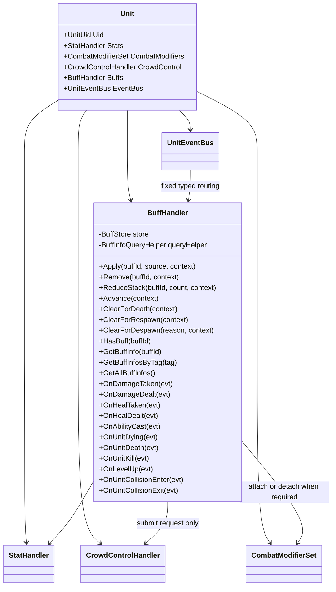

`BuffHandler` 可以向 `CrowdControlHandler` 提交正式控制请求，但不保存控制 Runtime，也不参与控制结果汇总。

---

## 1.3 对外操作接口

```text
Apply
    BuffConfigId
    BuffSource
    SimulationTickContext

Remove
    BuffConfigId
    SimulationTickContext

ReduceStack
    BuffConfigId
    Count
    SimulationTickContext

Advance
    SimulationTickContext

ClearForDeath
    SimulationTickContext

ClearForRespawn
    SimulationTickContext

ClearForDespawn
    UnitDespawnReason
    SimulationTickContext
```

典型调用方：

| 调用方 | 操作 |
|---|---|
| `AttackHandler` | 攻击结果成立后施加 Buff |
| `AbilityHandler` 或技能 Stage | 施加、移除或减层 |
| `EquipmentHandler` | 装备效果施加 Buff |
| 环境系统 | 区域效果施加 Buff |
| Buff Reaction | 对目标或自身施加、移除、减层 |
| UI、AI、技能条件 | 通过查询接口读取 Buff |

---

## 1.4 BuffStore

`BuffStore` 以 `BuffConfigId` 作为当前单位内的唯一键。

规则：

```text
同一 Unit
同一 BuffConfigId
最多存在一个 BuffRuntime
```

推荐内部同时维护：

```text
Lookup
    BuffConfigId -> BuffRuntime
    只用于快速查找

OrderedRuntimes
    按 BuffConfigId 稳定排序
    用于 Advance 和事件 Reaction 遍历
```

禁止依赖：

- `Dictionary` 枚举顺序
- `HashSet` 枚举顺序
- Unity 对象地址
- ScriptableObject 实例地址

Reaction 的业务含义不应依赖执行顺序，但实现仍使用稳定顺序保证确定性重演。

---

## 1.5 Apply 流程

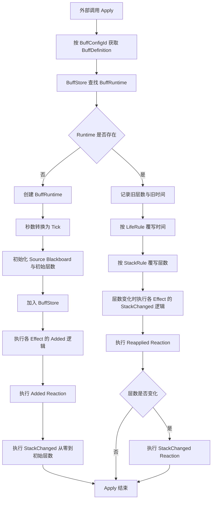

### 首次施加的固定语义

首次创建时按以下顺序执行：

```text
1. 创建并初始化 BuffRuntime
2. 加入 BuffStore
3. 执行具体 Buff Effect 的 Added 逻辑并创建所需运行时 Handle
4. 执行 Added Reaction
5. 执行 StackChanged 0 -> InitialStack
```

初始层数从 0 变为 1，也属于一次真实的层数变化。

这样：

- `Added` 表达“Buff 第一次出现”
- `StackChanged` 始终只表达“层数确实发生变化”
- 层数阈值 Reaction 不需要特殊区分首次施加

---

## 1.6 重复施加只允许覆写

当同一 `BuffConfigId` 已存在时：

```text
不创建第二个 BuffRuntime
不按来源拆分实例
不保留旧 Runtime 与新 Runtime 并存
```

只允许：

```text
按 LifeRule 更新现有 Runtime 的时间
按 StackRule 更新现有 Runtime 的层数
根据新的 Apply 请求更新 Source
执行 Reapplied
层数真实变化时执行 StackChanged
```

`BuffSource` 保存最近一次成功 Apply 的来源。

如果某个玩法将来要求“多来源分别计时”，它不属于当前 Buff 模型，应设计成其它独立 Runtime，而不是破坏当前单实例规则。

---

## 1.7 Advance 流程

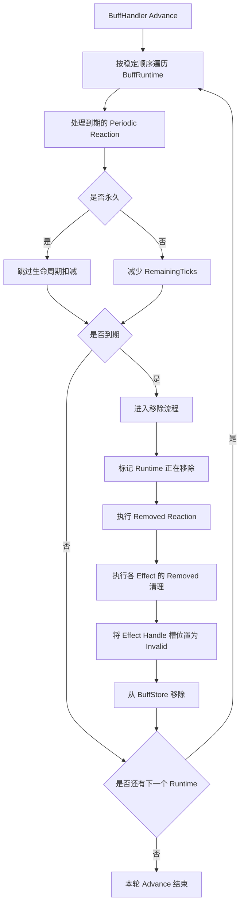

Buff 运行阶段统一读取：

```text
SimulationTickContext.Current.Tick
```

运行阶段不使用：

- `Time.deltaTime`
- 渲染帧时间
- `float RemainingSeconds`

---

## 1.8 移除流程的固定语义

移除原因可以包括：

- 持续时间结束
- 外部主动 Remove
- 层数减至 0
- Unit 生命周期清理
- Reaction 主动移除

固定顺序：

```text
1. 防止重复进入移除流程
2. 执行 Removed Reaction
3. 由每个具体 Effect 清理自己创建的外部 Handle
4. 将对应 Blackboard Handle 槽位置为 Invalid
5. 从 BuffStore 删除 BuffRuntime
```

执行 `Removed` 时，当前 Runtime 仍然可以被本次 Reaction Context 读取。  
完成 `Removed` 后，该 Runtime 不再参与后续 Advance 或事件响应。

---

## 1.9 死亡与复活接缝

`BuffHandler` 覆写单位框架生命周期接口：

```text
ClearForDeath
    SimulationTickContext

ClearForRespawn
    SimulationTickContext
```

这两个接口都由 `UnitWorld` 按单位框架冻结的 Handler 顺序显式调用。

`BuffHandler.OnUnitDeath` 不调用 `ClearForDeath`。  
`OnUnitDeath` 只负责处理 `UnitDeathEvent` 对应的 Buff Event Reaction。

### 1.9.1 死亡阶段

推荐调用关系：

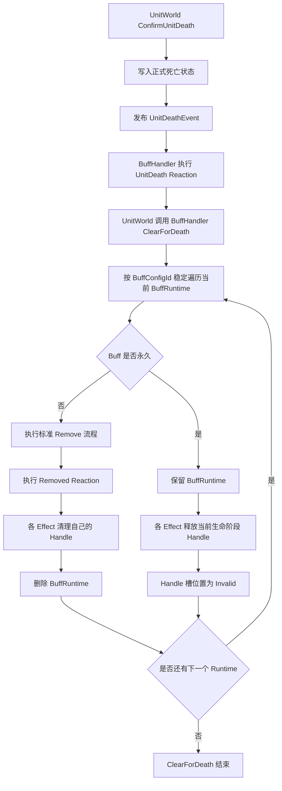

固定语义：

#### 非永久 Buff

```text
LifeRule.Infinite = false
```

处理规则：

- 使用标准 Remove 流程。
- 正常执行 `Removed Reaction`。
- 各 Effect 正常清理自己创建的 Handle。
- 从 BuffStore 删除 Runtime。
- `RemovalReason = DeathCleanup`。

#### 永久 Buff

```text
LifeRule.Infinite = true
```

处理规则：

- 保留原 `BuffRuntime`。
- 保留 `BuffSource`、层数和非 Handle Blackboard 状态。
- 不执行 `Removed Reaction`。
- 不重新执行 `Added` 或 `StackChanged`。
- 各 Effect 释放自己在当前生命阶段创建的 Handle。
- 对应 Handle 槽位置为 `Invalid`。
- 不在死亡阶段立即重新创建 Handle。

“当前生命阶段 Handle”包括由永久 Buff 持续提供、但会随着本次生命结束而注销的外部注册，例如：

```text
StatModifierHandle
CombatModifierHandle
其它由具体 Effect 明确定义的生命阶段 Handle
```

BuffHandler 不统一扫描 Blackboard。  
具体 Handle 是否属于生命阶段注册，以及如何释放，由创建该 Handle 的 Effect 决定。

### 1.9.2 复活阶段

`UnitWorld` 完成复活状态初始化后，按与死亡阶段一致的固定 Handler 顺序调用：

```text
BuffHandler.ClearForRespawn
```

推荐流程：

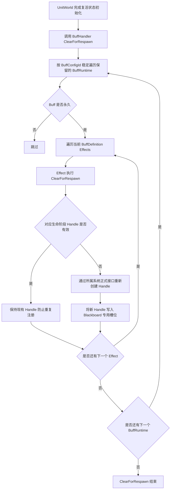

固定语义：

- 只处理死亡阶段保留下来的永久 Buff Runtime。
- 不恢复已经被死亡清理删除的临时 Buff。
- 不创建第二个相同 `BuffRuntime`。
- 不执行 `Added`。
- 不执行 `Reapplied`。
- 不执行 `StackChanged`。
- 不执行 `Removed`。
- 不提交与 Handle 重建无关的 Gameplay Reaction。
- 只复刻该永久 Buff 在新生命阶段应持续提供的注册。
- Handle 已有效时不得重复 Add 或 Attach。
- 重复调用必须保持幂等。

### 1.9.3 Effect 生命周期接口

具体 Effect 增加两个固定生命周期入口：

```text
ClearForDeath(context)
ClearForRespawn(context)
```

它们不是动态 Delegate，也不进入运行时回调桶。

典型 `StatModifierEffectConfig`：

```text
ClearForDeath
    读取 StatModifierHandle
    Handle 有效时调用 RemoveModifier
    HandleSlot 写回 Invalid

ClearForRespawn
    Handle 无效时按当前 BuffRuntime.StackCount 重新计算数值
    调用 AddModifier
    将返回 Handle 写回 HandleSlot
```

典型持续型 `CombatModifierEffectConfig`：

```text
ClearForDeath
    Handle 有效时按 CombatModifierSet 正式接口注销
    HandleSlot 写回 Invalid

ClearForRespawn
    仅当该 Effect 定义为永久 Buff 的生命阶段持续注册时
    重新建立对应 CombatModifier
    将返回 Handle 写回 HandleSlot
```

由事件 Reaction 临时创建且已经被消费的 Handle，不因为 Buff 永久就自动重建。  
是否需要在复活时重新建立，必须由具体 Effect 的静态语义决定。

---

## 1.10 Despawn 清理

`BuffHandler` 覆写：

```text
ClearForDespawn
    UnitDespawnReason
    SimulationTickContext
```

该接口由 `UnitWorld` 在正式 Despawn 流程中调用。

固定语义采用方案 B：

```text
清理全部 Buff
包括永久 Buff
清理所有 Effect 创建的外部 Handle
不执行 Gameplay Removed Reaction
不提交新的 Gameplay Request
```

推荐流程：

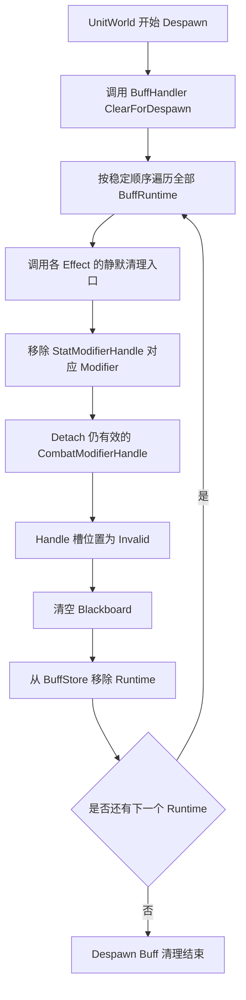

与普通 Remove 的区别：

| 路径 | 清理 Effect Handle | 执行 `Removed Reaction` | 允许提交 Gameplay Request |
|---|---:|---:|---:|
| 普通 Remove | 是 | 是 | 是 |
| 自然到期 | 是 | 是 | 是 |
| `ClearForDeath` | 是 | 是 | 是 |
| `ClearForDespawn` | 是 | 否 | 否 |
| `ResetForPool` | 静默重置 | 否 | 否 |
| 回滚拓扑移除 | 静默恢复/移除 | 否 | 否 |

需要“召唤物消失时爆炸”等玩法时，应由拥有 Despawn 决策权的系统在调用 `DespawnUnit` 前显式提交对应 Gameplay 请求，而不是依赖 Buff 的 `Removed Reaction`。

---

# 2. UnitEventBus 适配

## 2.1 采用 v26 延续的强类型即时路由

单位框架 v27.1 延续的事件规则：

```text
强类型事件
立即同步 Publish
固定调用具体 Handler
不动态 Subscribe
不构建监听者列表
不使用统一 EventRecord
不使用 GameplayEventQueue
```

`UnitEventBus` 直接调用 `BuffHandler` 的对应入口。

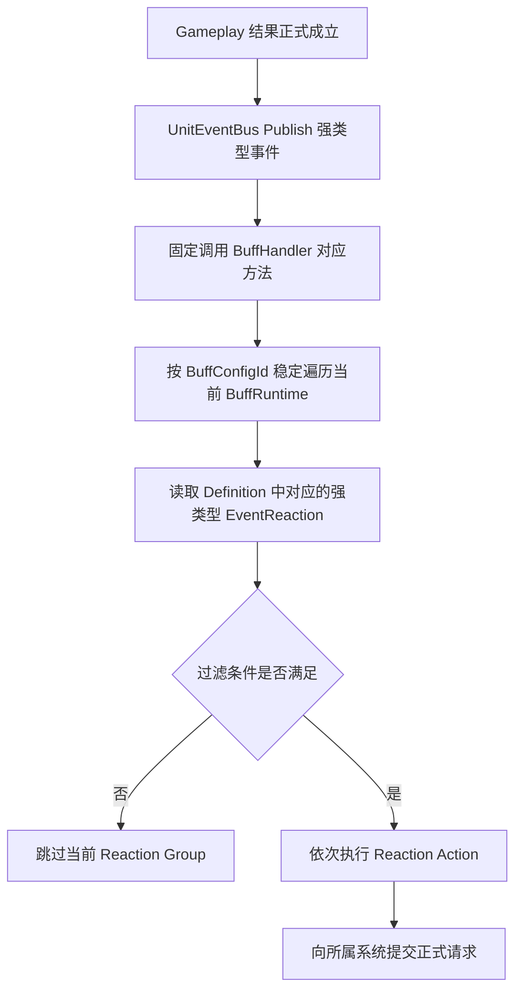

BuffHandler 不维护 `BuffListenerIndex`。

如果未来性能测试证明全量扫描成为热点，可以在 BuffHandler 内增加私有派生缓存；它不是领域模型，也不能改变公开接口或权威状态。

---

## 2.2 BuffHandler 的强类型事件入口

```text
OnDamageTaken in DamageTakenEvent
OnDamageDealt in DamageDealtEvent
OnHealTaken in HealTakenEvent
OnHealDealt in HealDealtEvent
OnAbilityCast in AbilityCastEvent
OnUnitDying in UnitDyingEvent
OnUnitDeath in UnitDeathEvent
OnUnitKill in UnitKillEvent
OnLevelUp in LevelUpEvent
OnUnitCollisionEnter in UnitCollisionEnterEvent
OnUnitCollisionExit in UnitCollisionExitEvent
```

不存在以下 Buff 事件入口：

```text
ControlApplied
ControlRemoved
AttackCommitted
AttackHit
AbilityStage
```

除非单位框架未来正式增加对应的强类型事件接缝。

---

## 2.3 AbilityCast 的正式语义

`AbilityCastEvent` 采用单位框架 v27.1 延续的字段：

```text
AbilityId
AbilitySessionUid
```

Buff 不读取：

```text
StageKey
EventKey
EventSequenceInTick
```

触发条件仍遵守技能系统 v12：

> 只有被技能配置标记为需要触发施法回调的 CastStage，在成功进入时，AbilityHandler 才发布 AbilityCast。

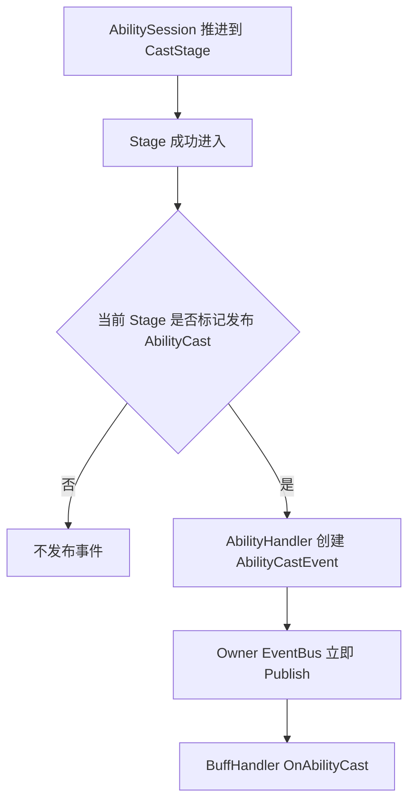

Buff 可以根据：

- `AbilityId`
- `AbilitySessionUid`

判断和处理技能施放 Reaction。

---

## 2.4 Reaction 产生的新请求

事件已经表示一个正式成立的 Gameplay 结果。

因此 Buff Reaction：

- 可以提交新的伤害请求
- 可以提交新的治疗请求
- 可以施加或移除 Buff
- 可以请求 CrowdControlHandler 添加控制
- 可以修改资源
- 可以挂载或解除 CombatModifier

但不能倒过来修改已经成立的当前事件结果。

例如：

```text
DamageTaken 已经发布
    当前伤害结果不可被 Buff Reaction 改写

反伤 Buff 触发
    提交一个新的 DamageRequest
    由 CombatSystem 按自己的正式流程处理
```

事件是即时同步分发，但跨系统结果仍必须经过目标系统的正式接口，不能直接篡改其它系统内部状态。

---

# 3. BuffDefinition

## 3.1 定位

`BuffDefinition` 是 Unity `ScriptableObject` 静态配置。

```text
BuffDefinition : ScriptableObject
```

它在运行期间不可修改，不保存任何 Runtime 状态。

不额外增加：

```text
BuffDefinitionSO
Bake 后 BuffDefinition
```

当前项目直接使用单一 ScriptableObject 配置即可。

---

## 3.2 结构

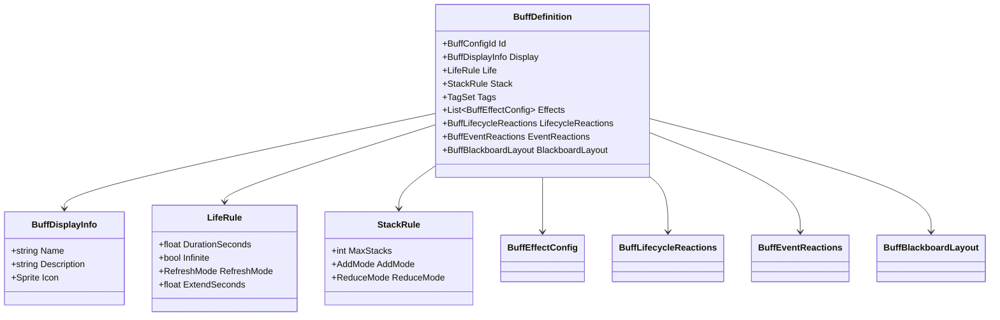

---

## 3.3 BuffDisplayInfo

```text
Name
Description
Sprite Icon
```

统一 UI 规则：

| 内容 | 规则 |
|---|---|
| Buff 图标 | 所有 Buff 都显示 |
| 层数 | `MaxStacks > 1` 时显示 |
| 时间进度 | 非永久 Buff 显示 |
| 永久 Buff | 不显示时间进度 |
| 描述 | Buff 详情或悬停面板显示 |

剩余时间不显示干巴巴的秒数。

UI 使用：

```text
TimeProgress = RemainingTicks / DurationTicks
```

驱动：

- 时钟指针
- 圆形遮罩
- 冷却扇形

`TimeProgress` 是表现数据，可以使用 `float`，但不能参与 Gameplay 逻辑。

---

## 3.4 LifeRule

Inspector 配置：

```text
float DurationSeconds
bool Infinite
RefreshMode
float ExtendSeconds
```

`RefreshMode`：

| 模式 | 说明 |
|---|---|
| `NoChange` | 重复 Apply 不改变剩余时间 |
| `RefreshToFull` | 重置为完整持续时间 |
| `ExtendByAmount` | 增加指定秒数 |

创建或覆写 BuffRuntime 时转换：

```text
DurationSeconds -> DurationTicks
ExtendSeconds -> ExtendTicks
```


---

## 3.5 StackRule

```text
int MaxStacks
AddMode AddMode
ReduceMode ReduceMode
```

`AddMode`：

| 模式 | 说明 |
|---|---|
| `Add` | Apply 时增加层数并 Clamp |
| `Ignore` | Apply 时不改变层数 |

`ReduceMode`：

| 模式 | 说明 |
|---|---|
| `Reduce` | 减少 N 层，默认 N 为 1 |
| `ClearAll` | 清空全部层数 |

`StackRule` 只负责层数变化。

满层触发、减层触发和阈值触发都属于 `StackChanged Reaction`。

---

# 4. BuffRuntime

## 4.1 唯一运行时对象

Buff 系统只保留一个运行时对象：

```text
BuffRuntime
```

删除：

```text
BuffInstance
BuffEffectRuntime
TriggerRuntimeState 独立对象
```

`BuffRuntime` 是 Buff 动态状态的唯一权威。

---

## 4.2 结构

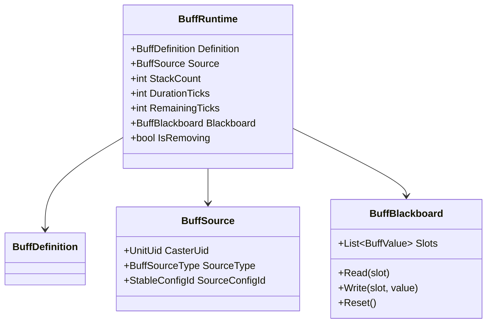

不保存：

- 动态 Delegate
- 回调桶
- 事件订阅列表
- `BuffInstanceUid`
- 第二套 Effect Runtime
- Control Runtime
- 顶层通用 `StatModifierHandle[]`
- 顶层通用 `CombatModifierHandle[]`
- Sprite 副本

---

## 4.3 BuffSource

```text
UnitUid CasterUid
BuffSourceType SourceType
StableConfigId SourceConfigId
```

`BuffSourceType`：

```text
None
Attack
Ability
Item
Talent
Rune
Environment
Script
```

规则：

- `CasterUid` 是场上具体单位身份。
- `SourceConfigId` 来自稳定静态配置。
- 不使用 Unity `InstanceID`。
- 不使用对象地址或临时数组索引。
- 覆写 Buff 时更新为最近一次成功 Apply 的来源。

---

## 4.4 Runtime 身份

当前 Unit 内，Runtime 由以下组合唯一定位：

```text
Owner UnitUid
BuffConfigId
```

不使用 `BuffInstanceUid`。

原因：

- 同一配置不允许并存两个 Runtime。
- 事件即时同步分发，不存在旧事件延迟命中新 Runtime 的队列问题。
- 重复 Apply 只覆写当前 Runtime。

---

# 5. BuffBlackboard

## 5.1 定位

Blackboard 保存同一个 BuffRuntime 内 Reaction 之间共享的确定性动态状态。

例如：

- 下一次周期触发 Tick
- 内部冷却结束 Tick
- 是否已触发
- 累计值
- 临时目标 UnitUid
- 上一次处理的逻辑 Tick

不使用：

```text
Dictionary string object
```

---

## 5.2 静态布局与运行槽位

`BuffDefinition` 直接保存：

```text
BuffBlackboardLayout
    BuffStateSlotDefinition[]
```

这只是 ScriptableObject 内的一段静态布局配置，不是 Bake 层。

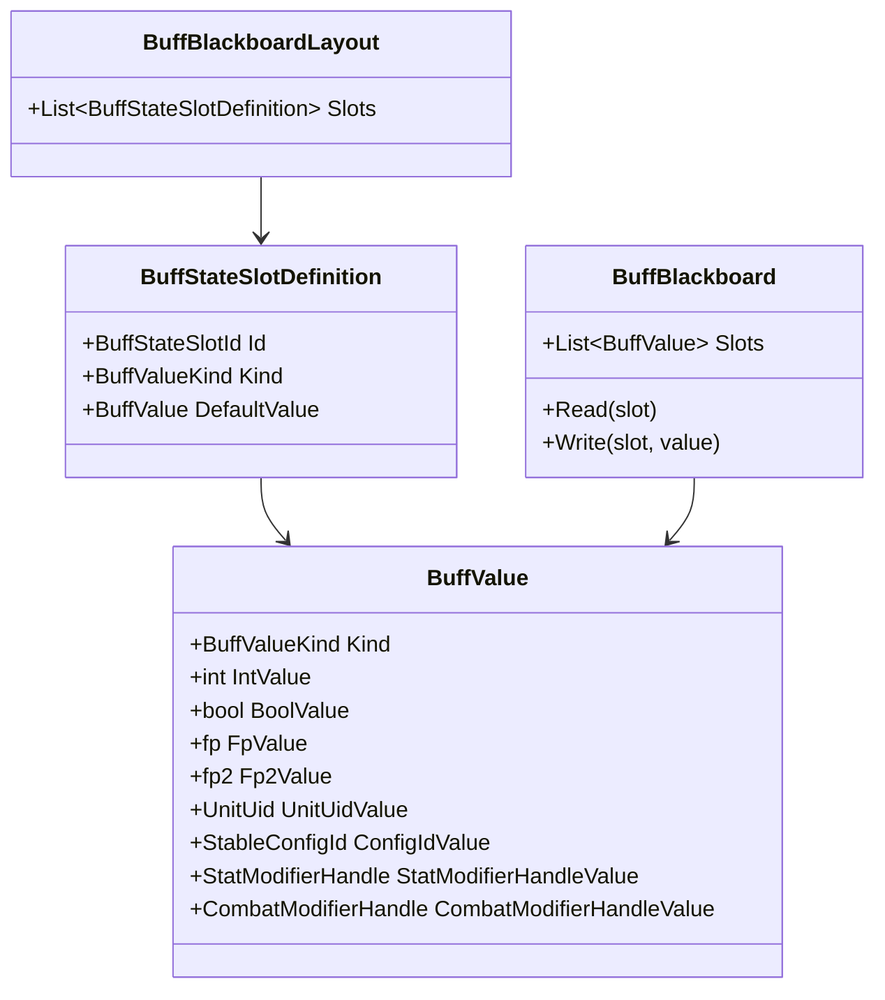

Reaction 配置通过稳定 `BuffStateSlotId` 访问对应槽位。

运行时不使用字符串查找，也不使用任意 `object`。

---

## 5.3 允许的值类型

```text
Int
Bool
Fp
Fp2
UnitUid
StableConfigId
StatModifierHandle
CombatModifierHandle
```

禁止存入：

- `GameObject`
- `Transform`
- `MonoBehaviour`
- `ScriptableObject`
- `Sprite`
- 任意 CLR Object
- 动态委托
- 临时集合引用
- `StatModifier` 对象引用
- `CombatModifierRecord` 对象引用
- `StatHandler` 或 `CombatModifierSet` 引用

---

# 6. Buff Effect 与 Reaction

## 6.1 静态 Effect 模块

继续删除运行时动态拼装结构：

```text
BuffEffectBuilder
BuffEffectRuntime
动态 Callback Bucket
运行时 Delegate 注册
```

但允许存在静态 Buff Effect 实现模块：

```text
StatModifierEffectConfig
CombatModifierEffectConfig
PeriodicDamageEffectConfig
ApplyBuffEffectConfig
CrowdControlRequestEffectConfig
```

`BuffDefinition.Effects` 保存这些静态模块所需的配置数据。

每个 Effect：

- 只保存静态参数和 Blackboard SlotId。
- 在固定生命周期函数中动态调用所属系统接口。
- 将运行时生成的 Handle 写入自己的 Blackboard 槽位。
- 对自己创建的 Handle 的创建、更新和清理负全责。
- 不把 Handle 写回 ScriptableObject。
- 不要求 BuffHandler 理解其内部 Handle 语义。

概念接口：

```text
BuffEffectConfig
    OnAdded(context)
    OnReapplied(context)
    OnStackChanged(context)
    OnAdvance(context)
    OnRemoved(context)
    OnTypedUnitEvent(context)
    ClearForDeath(context)
    ClearForRespawn(context)
    ClearForDespawn(context)
    ResetForPool(context)
```

这不是运行时委托桶，而是具体 Effect 类型的固定执行路径。  
动态状态只能写入当前 `BuffRuntime.Blackboard`。

---

## 6.2 Handle 的运行时所有权

Handle 不属于静态配置。

静态 Effect 只配置创建 Handle 所需的数据，例如：

```text
StatModifierEffectConfig
    StatId
    Operation
    BaseValue
    ValuePerStack
    StatModifierHandleSlot

CombatModifierEffectConfig
    ModifierType
    Parameters
    CombatModifierHandleSlot
```

运行时流程：

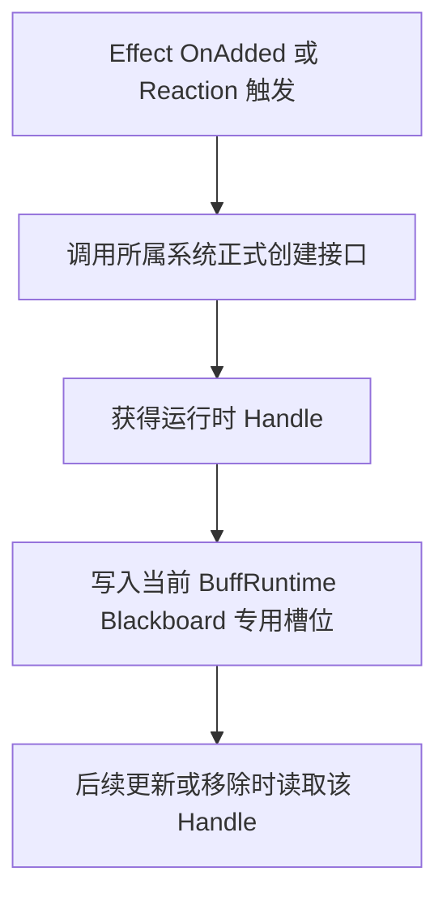

规则：

- `StatModifierHandle` 与 `CombatModifierHandle` 不进入 `BuffDefinition` 的运行值。
- Handle 不放入 `BuffRuntime` 顶层通用数组。
- 哪个 Effect 创建 Handle，哪个 Effect 负责保存、更新和清理。
- 永久 Buff 的生命阶段 Handle，由该 Effect 在 `ClearForDeath` 中释放、在 `ClearForRespawn` 中重建。
- BuffHandler 不扫描 Blackboard 做通用 Handle 清理。
- Handle 槽位默认值必须是明确的 `Invalid`。
- Handle 清理成功后必须立即写回 `Invalid`。
- Handle 只保存定位信息，不保存外部对象引用。

---

## 6.3 Reaction Action

`BuffReactionActionConfig` 是静态、无状态的配置基类。

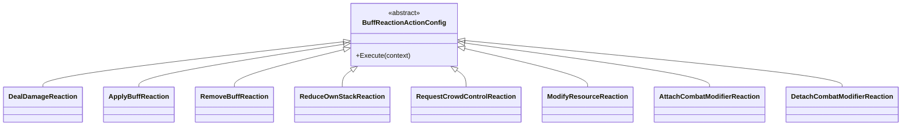

推荐使用：

- `[SerializeReference]` 的具体配置子类
- 或嵌套的具体 `ScriptableObject`

是否拆成独立资源取决于复用需求，不改变运行模型。

每个 Action：

- 只保存静态参数
- 不保存触发次数和冷却
- 不保存 Runtime 对象引用
- 不注册 Delegate
- 不通过中心化 Factory 识别类型
- 通过自身固定的 `Execute` 路径执行
- 只能使用 `BuffReactionContext` 提供的正式系统入口

---

## 6.4 ReactionContext

```text
BuffReactionContext
    Owner Unit
    BuffHandler
    Current BuffRuntime
    SimulationTickContext
    Optional typed event data
    PreviousStack
    CurrentStack
    RemovalReason
```

不同事件使用不同的强类型 Context，例如：

```text
DamageTakenBuffReactionContext
AbilityCastBuffReactionContext
StackChangedBuffReactionContext
PeriodicBuffReactionContext
```

不使用：

```text
EventType + object Payload
```

---

# 7. LifecycleReaction

## 7.1 类型

固定支持：

```text
Added
Reapplied
StackChanged
Periodic
Removed
```

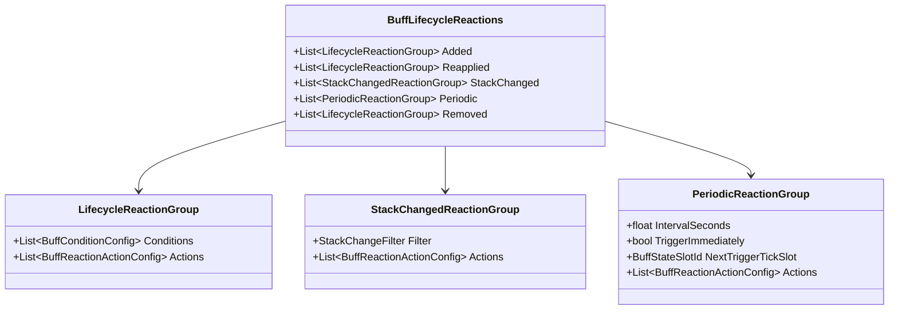

---

## 7.2 Added

首次创建 Runtime 后执行一次。

执行时：

- Runtime 已加入 BuffStore
- 初始层数已经写入
- 各 Effect 的 `OnAdded` 初始化已经完成，所需 Handle 已写入 Blackboard
- Blackboard 已经初始化

适合：

- 首次施加时产生一次效果
- 初始化共享状态
- 向其它系统提交一次请求

---

## 7.3 Reapplied

已存在的 Buff 再次成功 Apply 后执行。

执行前：

- 时间已经按 LifeRule 覆写
- 层数已经按 StackRule 覆写
- Source 已经更新
- 层数相关 Effect 已通过保存的 Handle 完成 `SetModifierValue`

即使层数没有变化，也会执行 `Reapplied`。

---

## 7.4 StackChanged

只有层数确实变化时执行。

Context 提供：

```text
PreviousStack
CurrentStack
Delta
```

首次创建时：

```text
PreviousStack = 0
CurrentStack = InitialStack
```

也会执行一次。

适合：

- 三层触发
- 减层触发
- 层数达到阈值
- 层数归零前的特殊逻辑
- 按层数刷新外部投影

---

## 7.5 Periodic

配置：

```text
float IntervalSeconds
bool TriggerImmediately
BuffStateSlotId NextTriggerTickSlot
Actions
```

初始化时转换：

```text
IntervalSeconds -> IntervalTicks
```

`NextTriggerTick` 存在当前唯一 `BuffRuntime.Blackboard` 中。

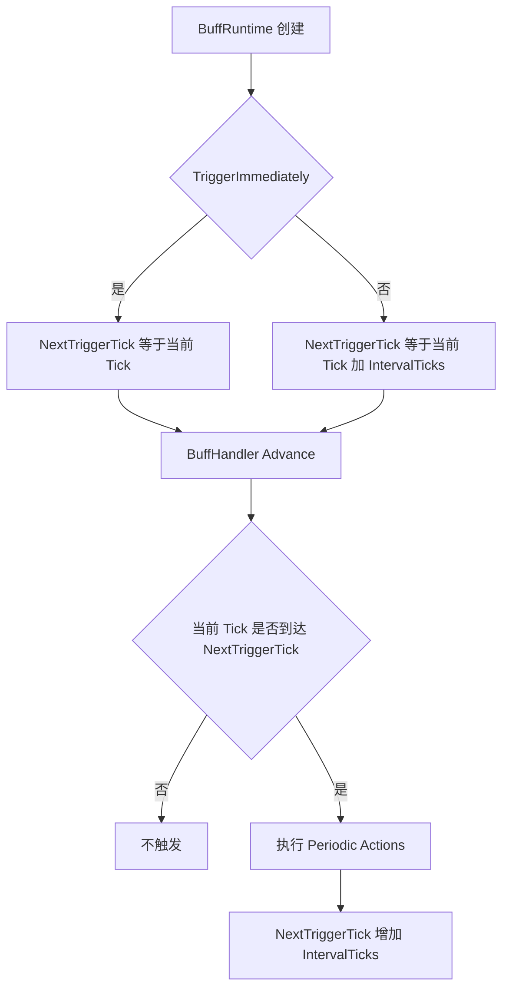

如果一次推进跨过多个周期点，是否补触发全部次数应由项目统一时间规则决定。  
当前建议按固定 Tick 每 Tick 推进，不设计跨 Tick 跳跃。

---

## 7.6 Removed

Buff 即将正式从 Store 删除时执行。

适合：

- 到期时爆炸
- 结束时提交一次效果
- 清理由 Reaction 动态创建且尚未失效的外部 Handle

具体 Effect 可以在自己的 `OnRemoved` 中清理自己创建的运行时 Handle。

不适合：

- 直接操作 BuffStore
- 清理其它 Effect 创建的 Handle
- 扫描整个 Blackboard 猜测资源所有权

BuffStore 删除仍由 BuffHandler 的固定移除流程负责。

---

# 8. EventReaction

## 8.1 强类型 Reaction Set

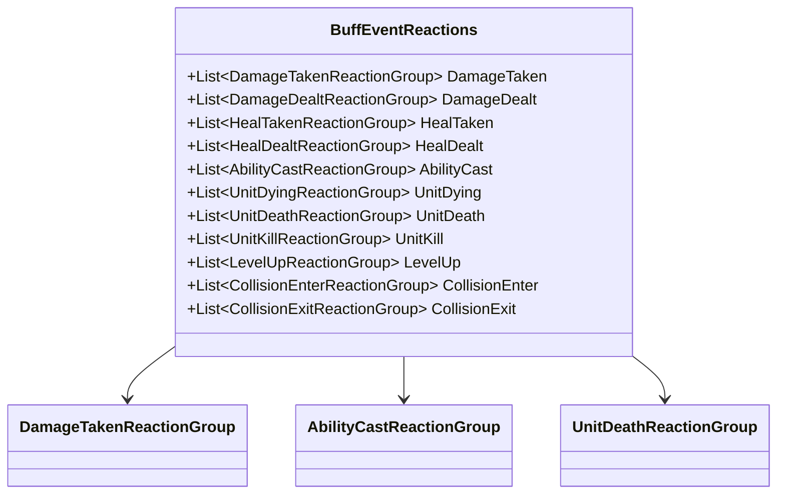

每种 ReactionGroup 拥有与事件对应的强类型 Filter。

---

## 8.2 DamageTaken 示例过滤项

可读取单位框架 v27.1 延续的正式字段，例如：

```text
CalculatedDamage
ActualShieldDamage
ActualLifeDamage
RemainingHealth
WasCritical
SourceDescriptor
RecipeId
```

可能的过滤条件：

- 实际生命伤害大于 0
- 实际护盾伤害大于 0
- 是否暴击
- DamageType
- 来源单位
- 来源 RecipeId

Buff Reaction 不能修改本次已经成立的伤害结果，只能产生后续请求。

---

## 8.3 AbilityCast 示例过滤项

`AbilityCastReactionGroup` 可配置：

```text
指定 AbilityId
任意 Ability
是否要求指定 AbilitySessionUid
```

通常只需要按 `AbilityId` 过滤。

`AbilitySessionUid` 主要用于同一次技能会话内的玩法关联，不暴露 StageKey。

---

# 9. 与 StatHandler 的适配

## 9.1 v27.1 延续的正式接口

Buff 不再使用：

```text
StatModifierSource
AttachSource
DetachSource
Source Rebuild
```

具体 `StatModifierEffectConfig` 使用：

```text
StatHandler.AddModifier
StatHandler.SetModifierValue
StatHandler.RemoveModifier
```

`StatHandler` 保存真实 Modifier。  
Buff Effect 只保存返回的 `StatModifierHandle`。

---

## 9.2 StatModifierEffectConfig

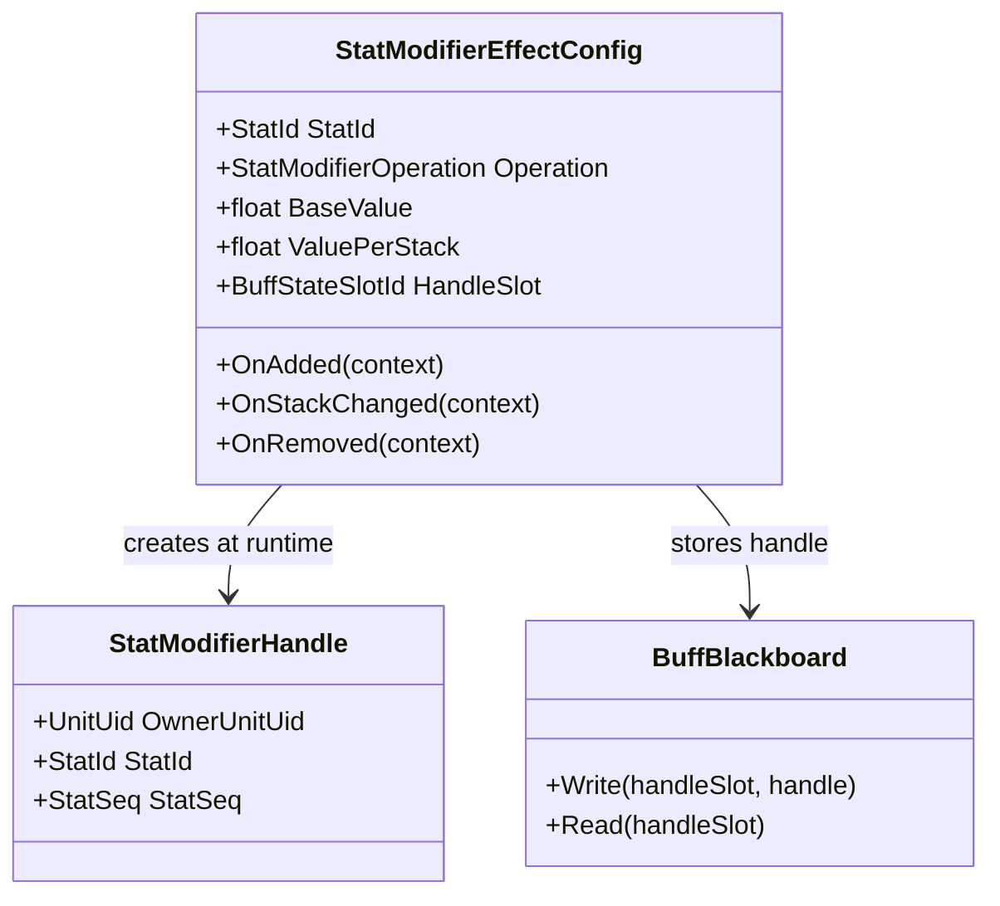

静态配置中保存：

```text
StatId
Operation
BaseValue
ValuePerStack
HandleSlotId
```

静态配置中不保存：

```text
StatModifierHandle
StatSeq
实际 Modifier
StatHandler 引用
```

`Operation` 限制为单位框架 v26 正式支持的类型：

```text
FlatAdd
BaseRatioAdd
FinalRatioAdd
```

Inspector 可以使用普通浮点数编辑，调用 Gameplay 接口前转换为项目定点数 `fp`。

---

## 9.3 创建、更新与清理

### Added

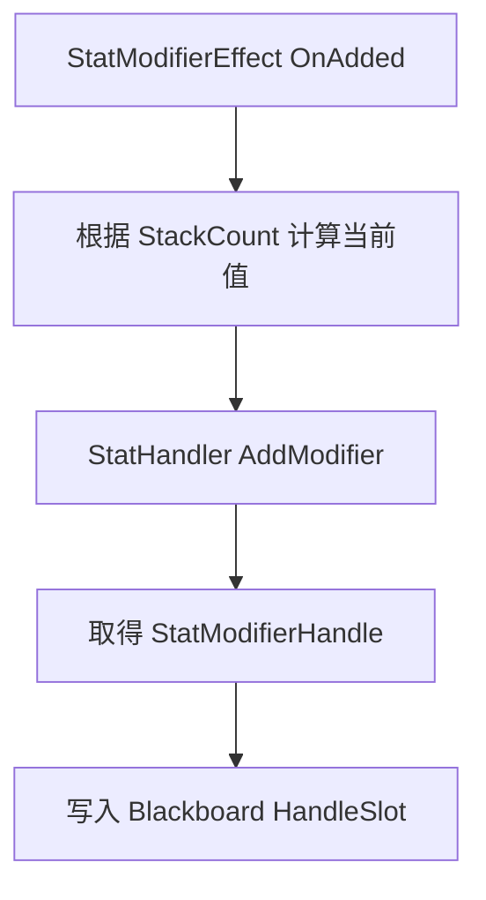

### StackChanged

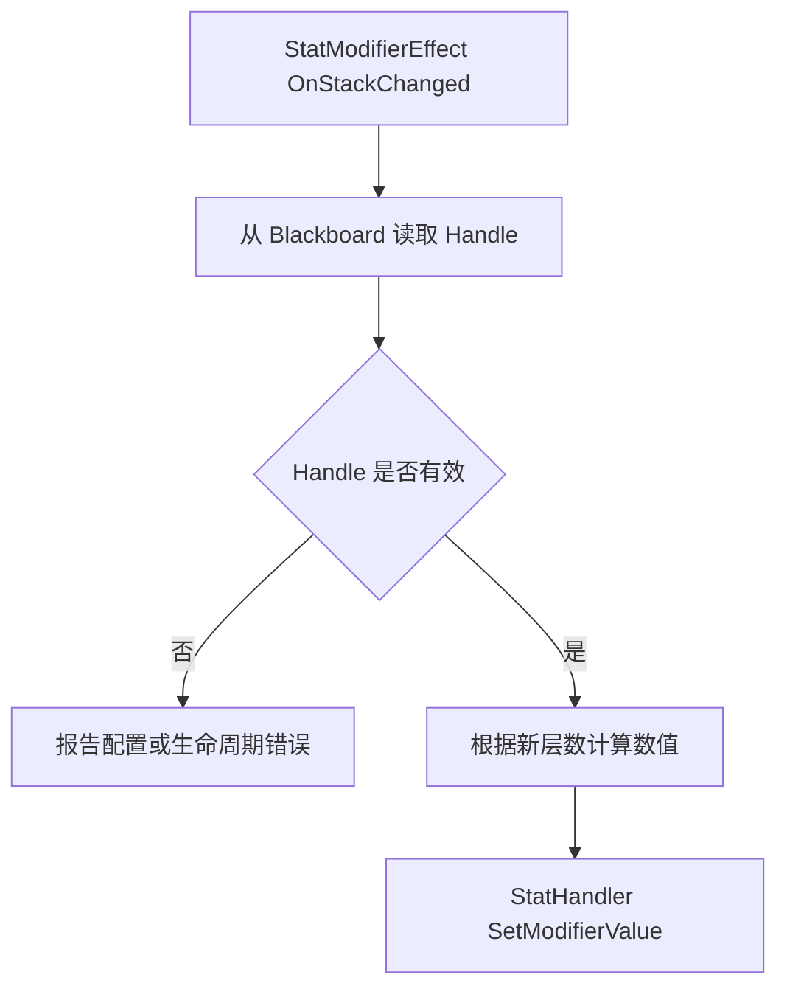

### Removed

```mermaid
flowchart TD
    A[StatModifierEffect OnRemoved] --> B[从 Blackboard 读取 Handle]
    B --> C{Handle 是否有效}
    C -- 否 --> D[跳过]
    C -- 是 --> E[StatHandler RemoveModifier]
    E --> F[HandleSlot 写回 Invalid]
```

### ClearForDeath 与 ClearForRespawn

永久 Buff 不执行 `OnRemoved`，但当前生命阶段的属性 Modifier 仍需要注销。

```mermaid
flowchart TD
    A[永久 Buff ClearForDeath] --> B[读取 StatModifierHandle]
    B --> C{Handle 是否有效}
    C -- 是 --> D[StatHandler RemoveModifier]
    C -- 否 --> E[保持 Invalid]
    D --> F[HandleSlot 写回 Invalid]
```

复活时：

```mermaid
flowchart TD
    A[永久 Buff ClearForRespawn] --> B[读取 StatModifierHandle]
    B --> C{Handle 是否有效}
    C -- 是 --> D[跳过 防止重复注册]
    C -- 否 --> E[根据当前 StackCount 计算 ModifierValue]
    E --> F[StatHandler AddModifier]
    F --> G[新 Handle 写入 HandleSlot]
```

数值计算：

```text
ModifierValue
    = BaseValue
    + ValuePerStack * StackCount
```

层数变化时使用同一个 Handle 更新数值，不重复 Remove 再 Add。

---

## 9.4 Handle 不是第二套 Modifier 状态

`StatModifierHandle` 只用于定位：

```text
OwnerUnitUid
StatId
StatSeq
```

它不保存：

- Modifier 当前值
- Modifier Operation
- 属性容器
- Dirty 状态

真实 Modifier 仍归 `StatHandler`。

BuffRuntime 通过 Blackboard 保存 Handle，是为了未来：

- 更新自己创建的 Modifier
- 删除自己创建的 Modifier
- 在确定性恢复后重新定位同一条 Modifier

具体快照还是稳定字段重解析，由帧同步设计决定。

---

## 9.5 CombatModifierEffectConfig

CombatModifier 采用相同边界：

```text
静态 Effect
    保存创建参数与 CombatModifierHandleSlot

运行时
    CombatModifierSet Attach
    获得 CombatModifierHandle
    写入 Blackboard

消费或结束
    查询 Handle 是否仍有效
    有效则 Detach
    槽位置为 Invalid
```

`CombatModifierSet` 是实际 Record 的权威。  
Buff 只保存定位 Handle，不保存 `CombatModifierRecord` 对象。

# 10. 与 CrowdControlHandler 的边界

Buff 不保存：

- 控制 Runtime
- 控制剩余时间
- 控制优先级
- 不可阻挡状态
- `ControlSource`
- `ControlSourceId`

需要施加控制时：

```mermaid
flowchart LR
    A[Buff Reaction] --> B[构造 CrowdControlRequest]
    B --> C[CrowdControlHandler Add]
    C --> D[CrowdControl 系统独立维护]
```

“眩晕”本身属于 CrowdControl Runtime，不属于 BuffRuntime。

如果 UI 要同时显示 Buff 和控制图标，状态栏分别查询：

- `BuffHandler`
- `CrowdControlHandler`

由 UI 组合显示。

---

# 11. Buff 信息查询

## 11.1 外部入口

外部只能通过目标单位的 BuffHandler 查询：

```text
unit.BuffHandler.HasBuff
unit.BuffHandler.GetBuffInfo
unit.BuffHandler.GetBuffInfosByTag
unit.BuffHandler.GetAllBuffInfos
```

不直接暴露：

- `BuffStore`
- `BuffRuntime`
- `BuffInfoQueryHelper`

---

## 11.2 BuffInfo

```mermaid
classDiagram
direction TB

class BuffInfo {
  +BuffConfigId Id
  +string Name
  +string Description
  +Sprite Icon
  +int StackCount
  +int MaxStacks
  +bool Infinite
  +int RemainingTicks
  +int DurationTicks
  +float TimeProgress
  +TagSet Tags
  +BuffSource Source
}

class BuffHandler {
  +GetBuffInfo(buffId)
  +GetAllBuffInfos()
  -BuffInfoQueryHelper queryHelper
}

class BuffInfoQueryHelper {
  +BuildInfo(runtime)
}

BuffHandler --> BuffInfoQueryHelper
BuffInfoQueryHelper --> BuffInfo
```

查询只是组合：

```text
BuffDefinition 静态展示数据
BuffRuntime 当前运行数据
```

`BuffInfo` 不是权威运行状态。

---

# 12. 示例

## 12.1 点燃

### Definition

```text
Display
    Name = 点燃
    Description = 每隔一秒受到一次伤害
    Icon = IgniteSprite

Life
    DurationSeconds = 5
    Infinite = false
    RefreshMode = RefreshToFull

Stack
    MaxStacks = 1
    AddMode = Ignore

LifecycleReactions
    Periodic
        IntervalSeconds = 1
        TriggerImmediately = false
        Action = DealDamage
```

### 流程

```mermaid
flowchart TD
    A[Apply 点燃] --> B[创建 BuffRuntime]
    B --> C[初始化 NextTriggerTick 槽位]
    C --> D[每个 LogicTick 调用 Advance]
    D --> E{到达周期 Tick}
    E -- 否 --> F[继续等待]
    E -- 是 --> G[DealDamage Reaction 提交 DamageRequest]
    G --> H[CombatSystem 处理请求]
    H --> I[更新 NextTriggerTick]
```

---

## 12.2 施法后强化

### Definition

```text
EventReactions
    AbilityCast
        Filter AbilityId = 指定技能
        Actions
            ApplyBuff 强化普攻
```

### 流程

```mermaid
flowchart TD
    A[标记 CastStage 成功进入] --> B[AbilityHandler Publish AbilityCastEvent]
    B --> C[UnitEventBus 立即调用 BuffHandler OnAbilityCast]
    C --> D[遍历当前 BuffRuntime]
    D --> E[执行匹配 AbilityId 的 Reaction]
    E --> F[向目标 BuffHandler Apply 强化 Buff]
```

---

## 12.3 三环

### Definition

```text
Stack
    MaxStacks = 3
    AddMode = Add

LifecycleReactions
    StackChanged
        Filter CurrentStack >= 3
        Actions
            提交三环效果
            ReduceOwnStack 3
```

### 流程

```mermaid
flowchart TD
    A[命中后 Apply 三环] --> B[覆写同一个 BuffRuntime]
    B --> C[StackCount 增加并 Clamp]
    C --> D[层数相关 Effect 使用 Handle 更新 Modifier]
    D --> E[执行 Reapplied]
    E --> F[执行 StackChanged]
    F --> G{当前层数是否达到三层}
    G -- 否 --> H[等待后续命中]
    G -- 是 --> I[执行三环 Reaction]
    I --> J[ReduceOwnStack 三层]
```

---

## 12.4 受伤反击

### Definition

```text
EventReactions
    DamageTaken
        Filter ActualLifeDamage > 0
        Actions
            DealDamage
                Target = Event Source Unit
```

### 流程

```mermaid
flowchart TD
    A[CombatSystem 完成伤害结算] --> B[Target EventBus Publish DamageTaken]
    B --> C[BuffHandler OnDamageTaken]
    C --> D[反击 Buff Filter 通过]
    D --> E[提交新的 DamageRequest]
    E --> F[当前已成立 DamageTaken 不被修改]
    F --> G[CombatSystem 按正式流程处理新请求]
```

---

## 12.5 层数加速

### Definition

```text
Effects
    StatModifierEffectConfig
        StatId = MoveSpeed
    Operation = FinalRatioAdd
    BaseValue = 0
    ValuePerStack = 0.05
```

### 流程

```mermaid
flowchart TD
    A[BuffRuntime 当前三层] --> B[计算当前 Modifier 为 0.15]
    B --> C[从 Blackboard 读取 StatModifierHandle]
    C --> D[StatHandler SetModifierValue]
    D --> E[StatHandler 标记 MoveSpeed Dirty]
    E --> F[MovementHandler 读取最终 MoveSpeed]
```

---

## 12.6 永久光环 Buff 跨死亡保留

### Definition

```text
Life
    Infinite = true

Effects
    StatModifierEffectConfig
        StatId = Armor
        Operation = FlatAdd
        BaseValue = 20
        HandleSlot = ArmorModifierHandleSlot
```

### 生命周期

```mermaid
flowchart TD
    A[首次获得永久光环] --> B[OnAdded 调用 AddModifier]
    B --> C[Handle 写入 Blackboard]

    C --> D[单位正式死亡]
    D --> E[ClearForDeath 保留 BuffRuntime]
    E --> F[StatModifierEffect 移除 Modifier]
    F --> G[HandleSlot 写回 Invalid]

    G --> H[单位完成复活初始化]
    H --> I[ClearForRespawn]
    I --> J[根据当前 BuffRuntime 重建 Modifier]
    J --> K[新 Handle 写回同一槽位]
```

该流程不会再次执行：

```text
Added
Reapplied
StackChanged
Removed
```

---

# 13. 生命周期与单位框架接缝

`BuffHandler` 作为 `UnitHandler`，遵守单位框架 v27.2 的生命周期接口：

```text
InitializeForNewRuntime
ClearForDeath
ClearForDespawn
ClearForRespawn
ResetForPool
```

## 13.1 生命周期矩阵

| 接口 | BuffRuntime | Effect Handle | Gameplay Reaction |
|---|---|---|---|
| `ClearForDeath` 非永久 Buff | 删除 | 清理 | 执行 `Removed` |
| `ClearForDeath` 永久 Buff | 保留 | 释放当前生命阶段 Handle | 不执行 `Removed` |
| `ClearForRespawn` 永久 Buff | 复用原 Runtime | 重建当前生命阶段 Handle | 不执行 Added/Reapplied 等 Reaction |
| `ClearForDespawn` | 全部删除 | 静默清理 | 不执行 `Removed` |
| `ResetForPool` | 全部重置 | 静默重置 | 不提交 Gameplay Request |
| 回滚拓扑移除 | 按回滚系统恢复 | 按历史状态恢复 | 不走正常生命周期 Reaction |

## 13.2 固定要求

BuffHandler 必须保证：

- 生命周期清理幂等。
- 以稳定的 `BuffConfigId` 顺序处理 Runtime。
- 非永久 Buff 在死亡时不保留。
- 永久 Buff 在死亡和复活之间保留同一个 Runtime。
- 永久 Buff 的 Handle 槽在死亡后为 `Invalid`。
- 复活后由具体 Effect 重建生命阶段 Handle。
- 每个 Effect 只管理自己创建的 Handle。
- 对象池重用前不残留旧 Runtime。
- 不清理其它 Handler 所拥有的状态。
- 不把 `ClearForRespawn` 当成再次执行死亡清理。
- 不在 Respawn 中再次触发 `Added / Reapplied / StackChanged / Removed`。

## 13.3 调用所有权

---

# 13A. Buff 上限与优先级驱逐（正式扩展）

> 状态：正式（2026-08-02 由仓库所有者确认，DECISION_LOG D-025）。
> 本扩展是对 v14.2 默认模型（无上限、每 ConfigId 单一 Runtime）的补充，
> 不是替代。

## 13A.1 定位

`BuffHandler.MaxBuffs` 定义单个单位同时激活的 BuffRuntime 数量上限。

当到达上限时，新 Buff 的首次施加按优先级驱逐一个已有非永久 Buff，
为新 Buff 腾出槽位。

## 13A.2 配置

```text
BuffHandler.MaxBuffs
    byte，默认 255（当前项目实际不限制）

BuffDefinition.Priority
    byte，0 = 最高，255 = 最低
    仅用于驱逐仲裁
```

## 13A.3 驱逐规则

```text
1. 仅在首次 Apply（新 BuffConfigId）时检查；重复施加不触发驱逐。
2. 永久 Buff（LifeRule.Infinite）永不被驱逐。
3. 候选 = 当前所有非永久 Buff 中 Priority 最大（优先级最低）者；
   同优先级时取稳定 BuffConfigId 排序中的最后一个。
4. 驱逐条件 = 新 Buff.Priority <= 候选.Priority（新 Buff 不低于候选优先级）。
5. 不满足条件时不驱逐，新 Buff 照常添加（数量可超过 MaxBuffs，软上限）。
6. 被驱逐 Buff 按标准移除流程执行，RemovalReason = ManualRemove。
```

## 13A.4 确定性要求

候选选择必须使用稳定 BuffConfigId 排序，禁止依赖 Dictionary/HashSet
枚举顺序或 ScriptableObject 实例地址。当前实现满足该要求。

```text
UnitWorld
    决定何时调用生命周期接口
    保证固定 Handler 顺序

BuffHandler
    决定哪些 BuffRuntime 保留或删除
    遍历保留 Runtime

BuffEffectConfig
    决定自己拥有的生命阶段 Handle 如何释放和重建
```

---

# 14. 帧同步设计关注标记

> 本节只标记影响未来 LogicTick 的状态。  
> 本文不设计 Snapshot、Capture 或 Restore 类型。

## 14.1 动态权威状态

| 状态 | 原因 |
|---|---|
| 当前存在的 `BuffConfigId` | 决定后续 Gameplay 状态 |
| `BuffSource` | Reaction 可能依赖来源 |
| `StackCount` | 影响属性和触发条件 |
| `DurationTicks` | 影响生命周期解释 |
| `RemainingTicks` | 决定过期时机 |
| Blackboard Slots | 保存周期、冷却与共享状态 |
| Blackboard 中的 StatModifierHandle | 用于更新、死亡释放和复活重建对应 Modifier |
| Blackboard 中的 CombatModifierHandle | 用于查询、消费识别、死亡释放或复活重建对应记录 |
| 永久 Buff 的死亡至复活阶段 | Runtime 保留，但生命阶段 Handle 槽应为 Invalid |
| 正在移除状态的确定性处理 | 避免重复执行 Removed |

## 14.2 静态或可派生内容

| 内容 | 说明 |
|---|---|
| `BuffDefinition` | 静态 ScriptableObject |
| Name Description Sprite | 表现数据 |
| LifecycleReaction 配置 | 静态配置 |
| EventReaction 配置 | 静态配置 |
| `BuffInfo` | 查询时即时组合 |
| StatHandler 内的实际 Modifier | 由 StatHandler 自己保存和恢复 |
| CombatModifierSet 内的实际 Record | 由 CombatModifierSet 自己保存和恢复 |
| UI 时间指针 | 由 Tick 数据计算 |

## 14.3 所有权提醒

帧同步设计师需要与相关系统确定：

```text
BuffRuntime 是 Buff 状态唯一权威
Blackboard 中的 StatModifierHandle 只是定位凭证，不成为第二套 Modifier 状态
Blackboard 中的 CombatModifierHandle 只是定位凭证，不成为第二套 CombatModifier 状态
CrowdControl Runtime 完全归 CrowdControlHandler
```

本文不规定快照类型与恢复实现；但正常死亡至复活生命周期中，永久 Buff 保留 Runtime，并通过 `ClearForRespawn` 重新建立当前生命阶段 Handle。

---

# 15. 最终关系图

```mermaid
classDiagram
direction TB

class Unit
class UnitEventBus
class BuffHandler
class BuffStore
class BuffDefinition
class BuffRuntime
class BuffBlackboard
class BuffLifecycleReactions
class BuffEventReactions
class BuffReactionActionConfig
class BuffEffectConfig
class StatModifierEffectConfig
class CombatModifierEffectConfig
class StatModifierHandle
class CombatModifierHandle
class StatHandler
class CrowdControlHandler
class CombatModifierSet
class BuffInfo

Unit --> BuffHandler
Unit --> UnitEventBus
Unit --> StatHandler
Unit --> CrowdControlHandler
Unit --> CombatModifierSet

UnitEventBus --> BuffHandler : typed immediate route
BuffHandler --> BuffStore
BuffStore --> BuffRuntime
BuffRuntime --> BuffDefinition
BuffRuntime --> BuffBlackboard

BuffDefinition --> BuffLifecycleReactions
BuffDefinition --> BuffEventReactions
BuffDefinition --> BuffReactionActionConfig
BuffDefinition --> BuffEffectConfig
BuffEffectConfig <|-- StatModifierEffectConfig
BuffEffectConfig <|-- CombatModifierEffectConfig
StatModifierEffectConfig --> StatModifierHandle : runtime create
CombatModifierEffectConfig --> CombatModifierHandle : runtime create
BuffRuntime --> BuffBlackboard : stores handles

BuffHandler --> StatHandler
BuffHandler --> CrowdControlHandler : request only
BuffHandler --> CombatModifierSet
BuffHandler --> BuffInfo
```

---

# 16. 最终结论

```text
BuffHandler
    Unit 上的唯一 Buff 操作与查询入口
    接收 UnitEventBus 强类型即时事件
    不动态订阅 不使用事件队列

BuffDefinition
    单一 ScriptableObject 静态配置
    保存展示 生命周期 层数 Effects Reaction 与 Blackboard 布局
    不增加 SO 加 Bake 层

BuffRuntime
    Buff 的唯一运行时权威
    同 Unit 同 BuffConfigId 只允许一个
    重复 Apply 只能覆写
    不使用 BuffInstanceUid
    不拆 BuffEffectRuntime

Reaction
    分为 Added Reapplied StackChanged Periodic Removed
    以及强类型 Unit Event Reaction
    静态无状态配置
    不缓存 Delegate 不使用动态 Callback Bucket

UnitEventBus
    强类型 即时同步 固定 Handler 路由
    BuffHandler 不维护 ListenerIndex

StatModifier Effect
    静态配置只保存创建参数与 HandleSlotId
    OnAdded 调用 AddModifier 并将 Handle 写入 Blackboard
    OnStackChanged 调用 SetModifierValue
    OnRemoved 调用 RemoveModifier 并将槽位置为 Invalid

Handle 所有权
    StatModifierHandle 与 CombatModifierHandle 都是运行时数据
    由创建它们的 Effect 保存到 Blackboard 并负责完整生命周期
    BuffHandler 不做通用扫描兜底

生命周期清理
    UnitWorld 按固定顺序调用 ClearForDeath ClearForRespawn ClearForDespawn
    OnUnitDeath 只处理事件 Reaction
    ClearForDeath 删除非永久 Buff，并释放永久 Buff 的生命阶段 Handle
    ClearForRespawn 为保留的永久 Buff 重建生命阶段 Handle
    ClearForDespawn 清理全部 Buff，但不执行 Removed Reaction

CrowdControl
    完全归 CrowdControlHandler
    Buff 只能提交正式控制请求

时间
    Inspector 使用秒和 float
    Gameplay 使用 Tick 或项目定点数

查询
    外部只通过 Unit BuffHandler

帧同步
    本文只标记需要关注的状态
    不定义具体快照实现
```
