# 帧同步、游戏流程与比赛规则综合系统程序设计案 v10.2

> 目标：为 Unity 帧同步 MOBA 设计统一的 **应用流程、UOS Matchmaking 与 Dedicated Server 接入、大厅开局、玩家 GameplayCommand、权威帧与本地模拟帧、确定性 Tick、客户端预测、快照、回滚、重演、表现层适配、比赛阶段、胜负与结算衔接** 底层框架。  
> 范围：当前版本专注让 1～10 人对局完整跑通，不考虑皮肤、战争迷雾、视野得分、AI 控制英雄、地图信号、表情、投降投票、聊天、观战等低优先级功能。  
> 配套附录：各顶层系统和子系统需要保存的快照内容，单独整理在 `FrameSync_Snapshot_Contents_Appendix_v7_2.md`。本文负责快照语义、聚合层级、恢复流程和系统边界。

---

# 目录

1. [总体架构与运行边界](#一总体架构与运行边界)
2. [`GameApplicationFlowManager`：应用级流程组合根](#二gameapplicationflowmanager应用级流程组合根)
3. [`LobbySessionFlowNetwork`：大厅会话与统一开局](#三lobbysessionflownetwork大厅会话与统一开局)
4. [`GameStartConfig`：开局配置与玩家槽位](#四gamestartconfig开局配置与玩家槽位)
5. [`GoldIncomeRuntime`：统一金币获取、确认与持久化边界](#五goldincomeruntime统一金币获取确认与持久化边界)
6. [运行时 UID 与系统序列](#六运行时-uid-与系统序列)
7. [`FrameSyncGameRuntime`：帧同步运行时组合根](#七framesyncgameruntime帧同步运行时组合根)
8. [`FrameSyncClock`：权威帧、本地帧与 Unity 推进](#八framesyncclock权威帧本地帧与-unity-推进)
9. [`GameplayCommand`：玩家帧同步命令](#九gameplaycommand玩家帧同步命令)
10. [`CommandCollector`、合并与命令转发](#十commandcollector合并与命令转发)
11. [`CommandDispatcher` 与 Gameplay 执行入口](#十一commanddispatcher-与-gameplay-执行入口)
12. [`AuthorityFrameReplicator` 与 `AuthorityRecovery`](#十二authorityframereplicator-与-authorityrecovery)
13. [`SimulationTickPipeline`：确定性 Gameplay Tick](#十三simulationtickpipeline确定性-gameplay-tick)
14. [`MatchRuleRuntime`：权威确认后的轻量比赛规则](#十四matchruleruntime权威确认后的轻量比赛规则)
15. [`PredictionRollbackCoordinator`：快照、回滚、重演与确认输出](#十五predictionrollbackcoordinator快照回滚重演与确认输出)
16. [`DeterministicRandomService`：确定性随机](#十六deterministicrandomservice确定性随机)
17. [`GlobalGameplayData`：全局配置与离线 Bake](#十七globalgameplaydata全局配置与离线-bake)
18. [推荐落地顺序](#十八推荐落地顺序)
19. [核心结论](#十九核心结论)

---

# 一、总体架构与运行边界

## 1.1 运行模式

当前版本只保留：

```text
Dedicated Server
Client
```

不保留 Host、离线 Gameplay、中途加入进行中对局或客户端进程重启后的状态恢复。UOS Multiverse 托管 Dedicated Server；客户端通过 UOS Matchmaking 获得服务器分配结果后连接公网 IP 与端口。

## 1.2 总体逻辑图

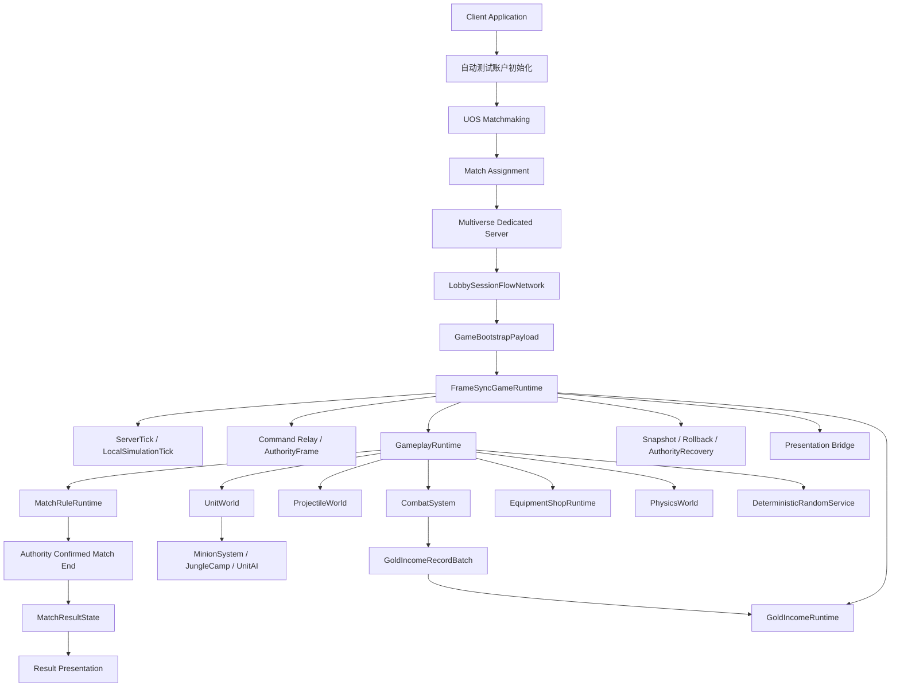

## 1.3 权威边界

| 内容 | 权威来源 | 客户端是否预测 | 是否进入 Gameplay 回滚 |
|---|---|---:|---:|
| 玩家 GameplayCommand | 服务端最终规范命令序列 | 是 | Command Buffer 不进入 GameplaySnapshot |
| 单位、技能、Buff、投掷物、战斗 | 确定性 Gameplay 模拟 | 是 | 是 |
| Unit 创建、LifeState 写入与实体生命周期执行 | `UnitWorld` | 是 | 是 |
| 致死、正式死亡与濒死复活判定 | `CombatSystem` | 是 | 是 |
| 每 Tick 金币获取记录 | 所有端根据相同输入确定性生成；AuthorityFrame 确认该 Tick 输入 | 是，但确认前只缓存、不可消费 | 记录批次不进入 GameplaySnapshot |
| 已确认金币总收入 | 连续 AuthorityFrame 确认后的本地金币记录累计 | 否 | 不回滚，是确认层状态 |
| 商店交易记录链 | `EquipmentShopRuntime` | 是 | 是 |
| `CurrentAvailableGold` | 已确认总收入与当前预测交易记录链的只读计算结果 | 间接预测支出 | 不进入快照 |
| 服务端金币记录持久化 | Dedicated Server 提交已确认金币批次 | 否 | 否 |
| 比赛结束 | 服务端 AuthorityFrame 对目标 Tick 的确认 | 客户端只预测结束候选 | MatchRule 状态进入快照 |
| 最终结果载荷 | Dedicated Server `MatchResultState` | 否 | 否 |
| UOS 会话与连接 | UOS / 网络层 | 否 | 否 |
| Unity 动画、粒子和音效 | 客户端表现层 | 可预测普通 Gameplay 表现 | 否 |

## 1.4 当前版本删除项

当前版本不设计：

```text
玩家手动登录界面
Host
离线 Gameplay 模式
中途加入进行中对局
客户端进程重启后的 BaseSnapshot 恢复
皮肤
战争迷雾与视野得分
AI 控制英雄
地图信号
表情与投降
聊天
复杂观战
服务端 Gameplay 回滚
AuthorityResultBytes
ResolvedGameplayMutationBytes
金币获取结果网络载荷
外部累计金币状态同步
GoldStateRevision
EarnedGoldStateEntry
EarnedGoldStateHistory
EarnedGoldFrameHistory
EarnedGoldHistorySeed
每 Tick 累计收入镜像快照
通用 GameplayEventQueue
UnitEventBus 委托快照
```

相同快照、权威命令、配置和随机状态重演后仍不一致，视为程序 Bug 或快照字段缺失，记录诊断后终止该客户端对局，不通过额外结果同步掩盖。

---

# 二、`GameApplicationFlowManager`：应用级流程组合根

## 2.1 定位

`GameApplicationFlowManager` 是应用流程组合根，但客户端和 Dedicated Server 使用两条不同的子状态机。

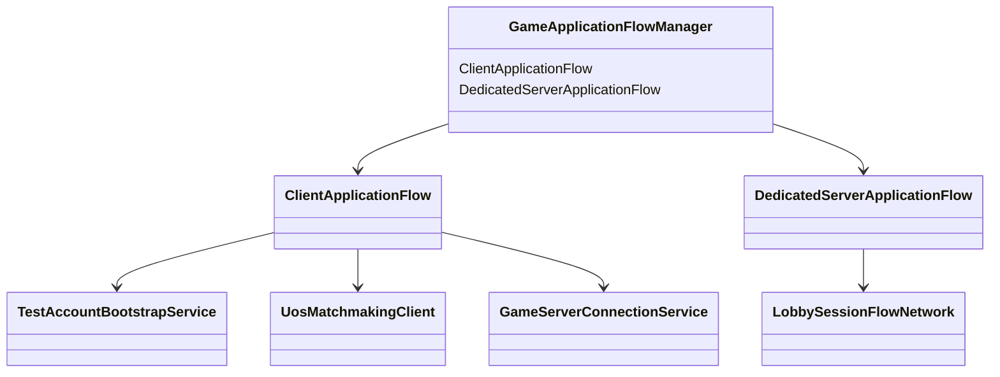

运行时根据构建目标只启用一条子流程，避免客户端状态和服务端状态混在同一个枚举中。

## 2.2 客户端状态机

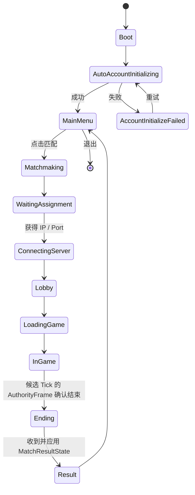

客户端预测到结束候选时只暂停预测。候选 Tick 的 AuthorityFrame 权威重演确认结束后进入 Ending；最终 Result 页面数据以服务端 `MatchResultState` 为准。

## 2.3 Dedicated Server 状态机

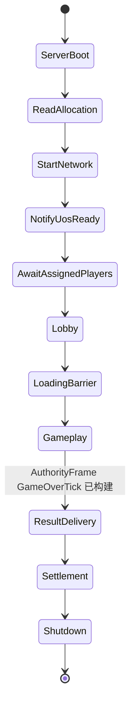

Dedicated Server 负责：

```text
读取 UOS Allocation 和 Matchmaking 玩家信息。
启动网络监听。
通知 UOS Ready。
建立大厅槽位。
运行权威 Gameplay。
在 GameOverTick 的 AuthorityFrame 构建后发送 MatchResultState。
冲刷已确认金币记录、战绩与其它非回滚持久化任务。
调用 UOS Shutdown。
```

## 2.4 自动测试账户

当前个人项目阶段没有玩家手动登录界面。

启动时：

```text
命令行 TestAccountId
    > 本地持久化 TestAccountId
    > 首次启动自动生成
```

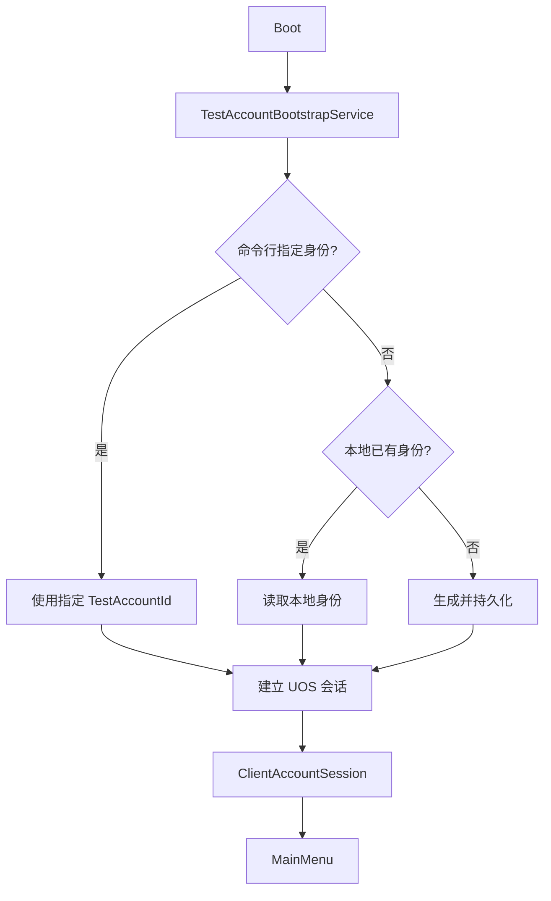

`ClientAccountSession` 只属于应用层，不进入 `GameStartConfig`、GameplayCommand 或回滚快照。

账户身份运行时只处理身份、会话与持久化关联，不保存比赛内金币总量。

## 2.5 与帧同步的边界

```text
GameApplicationFlowManager
    负责账户初始化、Matchmaking、连接、场景与 Result 流程。

LobbySessionFlowNetwork
    负责进入 Gameplay 前的多人就绪屏障。

FrameSyncGameRuntime
    负责 Gameplay 内的帧同步、比赛规则、预测和回滚。
```

---

# 三、`LobbySessionFlowNetwork`：大厅会话与统一开局

## 3.1 定位

`LobbySessionFlowNetwork` 管理 Matchmaking 已分配玩家进入 Dedicated Server 后的大厅阶段。

它不负责寻找玩家，也不负责战斗内帧同步。

## 3.2 玩家槽位状态

```text
LobbyPlayerSlotState
    Assigned
    Connected
    IdentityVerified
    HeroSelected
    HeroLocked
    GameplaySceneLoaded
    Ready
```

每个 Matchmaking 分配玩家都必须绑定到唯一 `PlayerSlot`。

## 3.3 大厅状态机

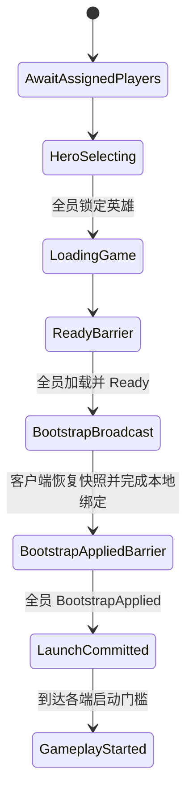

## 3.4 开局条件

不能只判断当前连接人数。

必须同时满足：

```text
AssignedPlayerCount == GameStartPlayerCount

每个 Assigned Player：
    已连接
    身份验证成功
    已锁定英雄
    已加载 Gameplay Scene
    已提交 Ready
```

然后服务端选择未来逻辑帧：

```text
StartTick = ServerTick + StartLeadTicks
```

并广播统一启动数据。`StartTick` 只定义首个 Gameplay Tick，不直接授权任何端开始模拟。

## 3.5 `GameBootstrapPayload`

```text
GameBootstrapPayload
    GameStartConfig
    GameplayDataVersion
    MapDataVersion
    GlobalPrefabTableVersion
    InitialGameplaySnapshot
    InitialSnapshotTick
    StartTick
    InitialRandomSeed
    PlayerSlotMappings
```

`GameBootstrapPayload` 只负责冻结开局配置、初始快照和控制权映射，不携带任何开局
时间戳。Bootstrap wire version 为 3，旧 wire v2 包必须拒绝，禁止通过保留的 UTC
字段形成第二个启动授权入口。

客户端恢复快照并完成本地受控单位绑定后发送：

```text
BootstrapAppliedConfirmation
    MatchId
    StartTick
```

服务端只接受冻结 `PlayerSlots` 中的 `ControllerClientId`，按 PlayerSlot 顺序维护确认
屏障。相同客户端对相同 MatchId/StartTick 的重复确认幂等；错误比赛、错误 StartTick
或未知客户端必须显式失败。

全员确认后，服务端才计算并广播：

```text
MatchLaunchCommit
    MatchId
    StartTick
    LaunchServerTimeMilliseconds =
        SynchronizedServerTimeMilliseconds + LaunchDelayMilliseconds
```

服务端和客户端都在 NGO 同步服务端时间域到达阈值时获得启动资格。客户端可在该时刻前
`MaxPredictionLeadTicks - 1` 个 Tick 开始预测，因此其实际等待时间自然等于
`LaunchDelayMilliseconds - 消息传输耗时 - 提前预测时长`。端点越过阈值后以本机
单调毫秒时钟建立 pacing 原点；客户端同时受权威预测窗口、单调启动上限和连续收到的
AuthorityFrame 积压约束。消息晚到本身不得推导历史积压，也不得依赖本机日历 UTC。

语义：

```text
InitialSnapshotTick
    恢复初始快照后，下一次应执行的逻辑 Tick。

StartTick
    本局客户端和服务端第一次共同推进的逻辑 Tick。
```

通常：

```text
InitialSnapshotTick == StartTick
```

GoldIncomeRuntime 统一初始化为：

```text
ConfirmedEarnedGoldTotal[player] =
    GameModeConfig.InitialEarnedGold

ConfirmedIncomeThroughTick =
    StartTick - 1
```

不需要额外金币种子、余额快照或累计收入状态同步。

## 3.6 不属于 GameplayCommand 的大厅消息

```text
选择英雄
锁定英雄
场景加载完成
大厅 Ready
BootstrapApplied
LaunchCommit
```

这些使用大厅网络消息，不进入玩家 GameplayCommand。

---

# 四、`GameStartConfig`：开局配置与玩家槽位

## 4.1 单一游戏开始人数

只保留：

```text
GameStartPlayerCount
```

合法范围：

```text
1～10
```

含义：

```text
设置为 1：一名分配玩家完成大厅条件即可开局。
设置为 10：十名分配玩家全部完成大厅条件才可开局。
```

不使用：

```text
MaxHumanPlayers
MinHumanPlayersForTest
```

## 4.2 `PlayerSlotConfig`

```text
PlayerSlotConfig
    PlayerSlot
    AccountId
    ControllerClientId
    TeamId
    HeroConfigId
    SpawnPointId
```

不增加 `InputAuthority` 字段。

```text
ControllerClientId
```

已经表达“哪个客户端可以为该玩家控制单位提交 GameplayCommand”。

服务端命令入口检查：

```text
Command.ClientId == PlayerSlotConfig.ControllerClientId
Command.ControlledUnitUid == 当前 PlayerSlot 绑定单位
```

## 4.3 `GameStartConfig`

```text
GameStartConfig
    MatchId
    GameModeId
    MapConfigId
    GameStartPlayerCount
    TeamCount
    PlayerSlots[]
    StartTick
    InitialRandomSeed
    GameplayDataVersion
```

`PlayerSlots.Length` 必须等于 `GameStartPlayerCount`。

## 4.4 匹配人数一致性

同一局的以下配置必须一致：

```text
UOS Matchmaking 队列或规则人数
GameStartPlayerCount
GameStartConfig.PlayerSlots 数量
大厅开局检查
队伍和出生点分配
```

测试 1～10 人时，应选择与当前 `GameStartPlayerCount` 对应的测试匹配配置。

---

# 五、`GoldIncomeRuntime`：统一金币获取、确认与持久化边界

## 5.1 唯一职责边界

正式以 `moba_equipment_system_design_v11_unified_gold_income_runtime.md` 为准。

`GoldIncomeRuntime` 是一局比赛内 Gameplay 金币获取记录、未确认批次和确认累计收入的唯一所有者：

```text
GoldIncomeRuntime
    CurrentBatchBuilder
    UnconfirmedBatchHistory
    GoldIncomeBatchDigestHistory
    InitialEarnedGoldByPlayer[]
    ConfirmedEarnedGoldTotalByPlayer[]
    ConfirmedIncomeThroughTick
    CurrentBuildingTick
    NextIncomeSequenceInTick
    BuildState
    ServerSettlementSink optional
```

帧同步总控不得持有第二套金币批次缓存、确认 Ledger 或摘要历史。

## 5.2 对外接口

所有金币来源只调用：

```csharp
public interface IGoldIncomeRequester
{
    void RequestGoldIncome(
        PlayerSlot receiver,
        int amount,
        GoldIncomeReason reason);
}
```

调用方不传：

```text
LogicTick
IncomeSequenceInTick
BatchId
确认标记
累计金币
```

商店和 UI 只读取：

```csharp
public interface IConfirmedGoldIncomeView
{
    int GetConfirmedEarnedGoldTotal(
        PlayerSlot player);

    int ConfirmedIncomeThroughTick
    {
        get;
    }
}
```

## 5.3 初始化

```text
GoldIncomeRuntime.Initialize(
    MatchStartTick,
    InitialEarnedGoldByPlayer)
```

初始化后：

```text
ConfirmedEarnedGoldTotalByPlayer[player]
    =
    InitialEarnedGoldByPlayer[player]

ConfirmedIncomeThroughTick
    =
    MatchStartTick - 1
```

初始金币不生成记录，不等待 AuthorityFrame，也不提交持久化。

## 5.4 Tick 构建与固定请求顺序

每个 Tick：

```text
GoldIncomeRuntime.BeginTick(T)

1. NaturalGoldIncomeSystem
       按 PlayerSlot 升序请求自然金币。

2. CombatSystem.SettleTick。

3. MatchStatisticsRuntime
       消费 FormalDeathResults。

4. CombatGoldIncomeProducer
       按 GoldIncomeAllocations 规范数组顺序请求。

5. Map / MatchRule Gold Producers
       按代码固定生产者顺序请求。

GoldIncomeRuntime.SealTick(T)
```

不得依赖：

```text
组件注册顺序
Dictionary 枚举顺序
Unity 对象创建顺序
ScriptableObject 加载顺序
```

## 5.5 记录与摘要

```text
GoldIncomeRecordBatch
    LogicTick
    Records[]
```

```text
GoldIncomeRecord
    ReceiverPlayerSlot
    Amount
    IncomeReason
    IncomeSequenceInTick
```

每 Tick 从 0 分配 `IncomeSequenceInTick`。

`SealTick(T)` 生成：

```text
GoldIncomeRecordBatch[T]
GoldIncomeBatchDigest[T]
```

摘要覆盖：

```text
LogicTick
记录数量
ReceiverPlayerSlot
Amount
IncomeReason
IncomeSequenceInTick
稳定记录顺序
```

并且：

```text
GoldIncomeBatchDigest[T]
    必须纳入 SharedGameplayChecksum(T)。
```

AuthorityFrame 不传输具体金币记录。

## 5.6 AuthorityFrame 确认

FrameSync 总控先完成：

```text
AuthorityFrame 连续性检查
CanonicalCommandBytes 对账
必要的权威纠错重演
SharedGameplayChecksum 验证
```

全部通过后，才调用装备设计案冻结的正式接口：

```text
GoldIncomeRuntime.ConfirmAuthorityFrame(
    AuthorityFrame(T))
```

确认后：

```text
按记录顺序累计 ConfirmedEarnedGoldTotalByPlayer。
ConfirmedIncomeThroughTick = T。
淘汰该 Tick 未确认批次和摘要。
Dedicated Server 提交同一确认批次。
```

## 5.7 金币确认不触发主动回滚

```text
ConfirmAuthorityFrame(T)
    只确认 Tick T 的金币记录。
    不扫描后续商店 Command。
    不产生金币专用 Dirty Tick。
    不主动重演预测后缀。
```

本地 RequestCheck 因确认金币不足失败时：

```text
不生成 EquipmentShopCommand。
后续收入确认不追溯创建该 Command。
玩家需要重新发起购买请求。
```

远端实际 Command 在本地预测时因确认金币不足而失败也是允许的。等该 Command 所属 Tick 的 AuthorityFrame 到达时，通过普通 Command 与 Checksum 对账修正。

## 5.8 收入可用时机

Tick `T` 的收入：

```text
只有 AuthorityFrame(T) 被正式接受后才计入确认累计。
从 Tick T + 1 起可用于之后执行的商店逻辑。
```

已经完成的预测 Tick 不因收入确认自动重演。

服务端必须在开始 Tick `T + 1` 前确认 Tick `T` 的金币批次。

## 5.9 商店可用金币

```text
EffectiveShopGoldDelta =
    Sum(
        OperationLog 中所有
        Reverted == false 的 GoldDelta)
```

```text
CurrentAvailableGold =
    GoldIncomeRuntime
        .GetConfirmedEarnedGoldTotal(player)
    + EffectiveShopGoldDelta
```

`CurrentAvailableGold` 只读，不状态同步、不快照、不保存每 Tick 历史。

## 5.10 普通回滚

`GoldIncomeRuntime` 不进入 GameplaySnapshot。

回滚前只调用：

```text
GoldIncomeRuntime.DiscardUnconfirmedFromTick(
    ReplayFromTick)
```

它删除对应 Tick 及之后的未确认批次和摘要，保留：

```text
ConfirmedEarnedGoldTotal
ConfirmedIncomeThroughTick
```

重演时重新生成批次与摘要。

## 5.11 服务端持久化

```csharp
public interface IConfirmedGoldSettlementSink
{
    void SubmitConfirmedGoldIncome(
        in GoldIncomeRecordBatch batch);
}
```

持久化端口只接收已确认批次，用于数据库、战绩、审计和幂等重试。它不维护比赛内金币总量，不修改 GoldIncomeRuntime，也不通知商店增加余额。

---

# 六、运行时 UID 与系统序列

## 6.1 UID 公共要求

`UnitUid` 和 `ProjectileUid` 是不同强类型，由各自正式系统定义具体字段和序列类型。

共同要求：

```text
包含稳定 SpawnLogicTick。
包含全局 RuntimeEntityPrefabId。
包含所属系统定义的稳定 SpawnSequence。
可序列化。
可比较。
相同输入重演时生成相同 UID。
```

帧同步层不强制 Unit 与 Projectile 使用相同序列类型，也不要求共享计数器。

## 6.2 序列归属

不建立全项目共享序列号。

每个系统自行明确：

```text
序列名称
作用域
何时重置
数据类型
排序位置
溢出行为
是否进入快照
```

示例：

```text
Projectile SpawnSequence
    可按 Tick 重置。

Combat Request Sequence
    可按 Tick 重置并使用 ushort。

AttackSequenceIndex
    可跨 Tick 累积。

Shop OperationSequence
    可整场递增。

Presentation EventSequence
    由表现事件生产者定义作用域。
```

## 6.3 确定性要求

序列分配前的请求集合必须使用稳定顺序。禁止依赖：

```text
Dictionary 枚举顺序
HashSet 枚举顺序
网络包实际抵达顺序
Unity 对象创建顺序
编辑器资源加载顺序
```

发生溢出时必须采用所属系统文档冻结的确定性处理，禁止自然回绕导致 UID 或事件身份碰撞。

## 6.4 快照边界

序列是否进入快照由其生命周期决定：

```text
只在 Tick 内存在且快照仅保存 Tick 边界
    -> 通常不进入快照。

跨 Tick 或整场累积
    -> 必须进入所属系统快照。
```

帧同步总控不替子系统猜测序列恢复方式。

---

# 七、`FrameSyncGameRuntime`：帧同步运行时组合根

## 7.1 结构

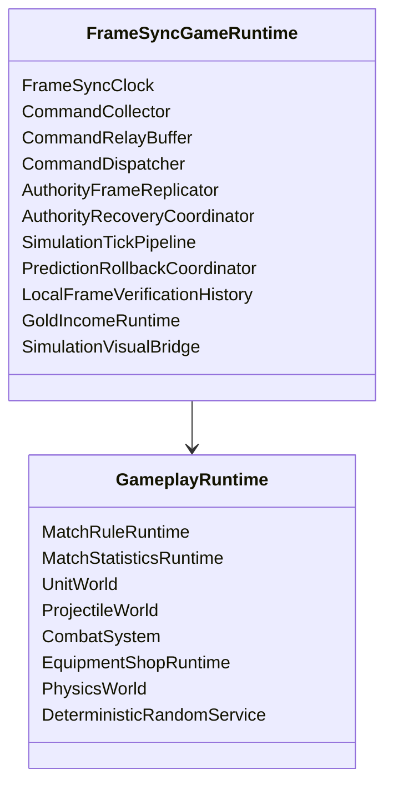

`GoldIncomeRuntime` 属于 Tick 输出构建和权威确认层，不进入 GameplaySnapshot。

## 7.2 服务端职责

```text
同步 ServerTick。
冻结并规范化 Tick Command。
推进权威 Gameplay Tick。
生成 GoldIncomeRecordBatch 与 Digest。
生成必填 SharedGameplayChecksum。
构建 AuthorityFrame。
确认本地 Tick 金币记录。
提交已确认金币批次。
广播 AuthorityFrame。
响应 AuthorityRecoveryRequest。
发送 MatchResultState。
```

Dedicated Server 不做 Gameplay 回滚。

## 7.3 客户端职责

```text
采集并发送本地 GameplayCommand。
接收 AcceptedCommandRelay。
推进 LocalSimulationTick。
由 GoldIncomeRuntime 保存未确认金币批次和摘要。
保存 LocalFrameVerificationRecord。
逐 Tick 对账 AuthorityFrame。
必要时恢复快照并重演。
按连续 Tick 确认金币记录。
金币确认本身不主动回滚。
缺帧时暂停并发起 AuthorityRecovery。
处理预测结束候选和最终 Result。
```

---

# 八、`FrameSyncClock`：ServerTick、权威帧与本地帧

## 8.1 固定逻辑 Tick

Gameplay 使用固定：

```text
TickRate
LogicDeltaFp
```

所有 Gameplay 系统通过 `SimulationTickContext` 获得 Tick，不读取 Unity 渲染帧、`Time.deltaTime`、Transform 或 Unity Physics。

## 8.2 `ServerTick`

Dedicated Server 通过 NetworkVariable 同步：

```text
ServerTick
```

定义：

> 服务端下一次准备执行的逻辑 Tick。

例如：

```text
ServerTick = 100
```

表示 Tick 99 已完成，下一次执行 Tick 100。

服务端开始执行 Tick `T` 时，该 Tick 命令集合隐式封闭，不需要独立 `SealedTick`。

```text
ServerFinalizedTick =
    ServerTick - 1
```

## 8.3 `LatestAuthorityFrameTick`

定义：

> 客户端当前已经完整接收、完成权威对账并确认本地确定性输出的最新连续权威帧号。

若已收到 Tick 102，但 Tick 101 缺失：

```text
LatestAuthorityFrameTick = 100
```

Tick 102 暂存于 AuthorityFrameBuffer，不能越过缺口，也不能提前确认 Tick 102 的金币记录。

## 8.4 `LocalSimulationTick`

定义：

> 客户端下一次准备执行的 Gameplay Tick。

```text
LatestAuthorityFrameTick = 100
LocalSimulationTick = 106
```

表示客户端已经预测执行 Tick 101～105。

普通回滚只改变 `LocalSimulationTick`，不会撤销已经连续确认的权威帧或已确认金币收入。

## 8.5 `SimulationTickContext`

```text
SimulationTickContext
    Tick
    DeltaTick
    ExecutionMode
```

```text
ExecutionMode
    ServerAuthority
    ClientPrediction
    ClientReplay
```

系统可保存自己的 `RespawnTick`、`ReadyTick`、`ExpireTick` 等状态，但不得维护第二套当前逻辑 Tick 权威。

## 8.6 预测暂停原因

```csharp
[Flags]
public enum PredictionPauseReason
{
    None                  = 0,
    MissingAuthorityFrame = 1 << 0,
    PredictionLeadLimit   = 1 << 1,
    MatchEndCandidate     = 1 << 2
}
```

暂停期间仍然：

```text
接收网络。
缓存 AuthorityFrame。
发起 AuthorityRecovery。
采集并发送玩家 Command。
更新 Unity 表现。
```

只是暂不执行新的本地预测 Tick。

## 8.7 最大预测领先

```text
PredictedTickCount =
    LocalSimulationTick
    - (LatestAuthorityFrameTick + 1)
```

达到：

```text
PredictedTickCount >= MaxPredictionLeadTicks
```

时添加 `PredictionLeadLimit`。

配置必须满足：

```text
MaxPredictionLeadTicks < SnapshotWindowTicks
```

## 8.8 `MaxLogicTicksPerUnityFrame`

该参数只作为客户端 CPU 保护阀，用于 Unity 卡顿补跑和回滚重演。

## 8.9 Unity 推进伪代码

```pseudo
function UnityUpdate():
    PumpNetwork()
    ProcessAuthorityRecovery()
    ProcessAuthorityFramesSequentially()
    ProcessDirtyPredictionRollback()

    if PredictionPauseReasons != None:
        UpdatePresentationOnly()
        return

    accumulator += GetUnscaledElapsedTime()
    executed = 0

    while accumulator >= LogicDelta:
        if executed >= MaxLogicTicksPerUnityFrame:
            break

        if GetPredictedTickCount()
           >= MaxPredictionLeadTicks:
            AddPause(PredictionLeadLimit)
            break

        RunClientSimulationTick(
            LocalSimulationTick,
            ClientPrediction
        )

        LocalSimulationTick += 1
        accumulator -= LogicDelta
        executed += 1
```

---

# 九、`GameplayCommand`：玩家帧同步命令

## 9.1 当前命令范围

| CommandKind | 用途 |
|---|---|
| `Move` | 点地移动 |
| `Attack` | 攻击目标 |
| `CastAbility` | 释放或确认技能 |
| `CancelAbility` | 取消技能 |
| `AllocateAbilitySkillPoint` | 为指定槽位分配技能点 |
| `EquipmentShop` | 购买、出售或撤销 |
| `SwapEquipmentSlot` | 交换两个装备槽位 |
| `UseItem` | 使用主动装备 |

不加入地图信号、表情、投降、聊天或观战命令。

## 9.2 `CommandHeader`

```text
CommandHeader
    CommandSeq
    ClientId
    PlayerSlot
    ControlledUnitUid
    TargetTick
    CommandKind
    BuildLocalTick
    PayloadByteLength
    SchemaVersion
```

网络入口只检查身份、绑定、序号、目标 Tick、Schema 和字节格式。

单位死亡、控制、沉默、技能点不足、金币不足和商店范围等 Gameplay 条件，不在网络入口判断。

## 9.3 Payload

| CommandKind | Payload |
|---|---|
| `Move` | `TargetPoint fp2` |
| `Attack` | `TargetUnitUid` |
| `CastAbility` | `AbilitySlot`、`AimSnapshot`、`CastPhase` |
| `CancelAbility` | `AbilitySlot`、`CancelReason` |
| `AllocateAbilitySkillPoint` | `AbilitySlot` |
| `EquipmentShop` | `OperationType` 与对应操作的最小 Payload |
| `SwapEquipmentSlot` | `SourceSlot`、`TargetSlot` |
| `UseItem` | `SourceSlot`、`AimSnapshot` |

```text
EquipmentShopOperationType
    Purchase
    Sell
    Undo
```

操作对应 Payload：

```text
Purchase
    EquipmentId

Sell
    SourceSlot

Undo
    无额外 Payload
```

购买 Command 不携带：

```text
PreferredSlot
TargetSlot
DestinationSlot
EquipmentPurchasePlan
任何由客户端指定的目标装备槽位
```

目标装备槽位不是玩家输入意图。所有端在目标 Tick 调用装备系统正式规划器：

```text
TryBuildPurchasePlan(
    PlayerSlot,
    EquipmentId
)
```

并根据目标 Tick 的确定性状态自动派生：

```text
ConsumedComponentSlots
MergeIntoExistingStack
DestinationSlot
PurchaseCost
SlotChanges
```

自动分配规则由装备系统负责：

```text
1. 模拟删除实际消耗的配方组件。
2. 若目标装备可堆叠，选择最低槽位的可合并实例。
3. 否则选择模拟删除后的最低合法空槽。
4. 没有合法放置结果则购买失败。
```

成功交易后，`DestinationSlot` 可以作为 `ShopOperationRecord.SlotChanges` 的一部分保存，用于回滚和撤销，但不进入购买 Command。

Command 也不携带当前金币、价格、交易结果或最终装备槽变化。

## 9.4 `TargetTick`

```text
TargetTick =
    max(
        LocalSimulationTick + 1,
        LatestSynchronizedServerTick + MinCommandLeadTicks
    )
```

配置：

```text
MinCommandLeadTicks
MaxFutureCommandTicks
```

---

# 十、`CommandCollector`、合并与命令转发

## 10.1 本地采集

```text
输入意图
    -> CommandCollector
    -> 构建目标 Tick Command
    -> CommandMergePolicy
    -> 发送 GameplayCommandBundle
    -> 写入本地预测 Command Buffer
```

预测暂停时仍然采集和发送 Command，但暂不执行新的本地 Gameplay Tick。

## 10.2 合并规则

| 命令 | 规则 |
|---|---|
| `Move` | 同玩家、单位和 TargetTick 只保留最后一条 |
| `Attack` | 同玩家、单位和 TargetTick 只保留最后一条 |
| `CastAbility / CancelAbility` | 按技能输入规则合并 |
| `AllocateAbilitySkillPoint` | 不合并，按 CommandSeq 保留 |
| `EquipmentShop` | 不合并，按 CommandSeq 保留 |
| `SwapEquipmentSlot` | 不合并，按 CommandSeq 保留 |
| `UseItem` | 同槽位同 Tick 通常保留最后一条 |

重复网络包按 `ClientId + CommandSeq` 去重，不能按 Payload 去重。

## 10.3 规范顺序

```text
TargetTick
PlayerSlot
ControlledUnitUid
CommandSeq
```

服务端必须反序列化后再次执行相同合并和排序，再生成权威字节。

## 10.4 `GameplayCommandBundle`

```text
GameplayCommandBundle
    ClientId
    BundleSequence
    SendLocalTick
    MinTargetTick
    MaxTargetTick
    CommandCount
    CanonicalCommandBytes
```

## 10.5 `AcceptedCommandRelay`

```text
AcceptedCommandRelay
    TargetTick
    RelayRevision
    CanonicalCommandBytesForTick
```

Relay 是该 Tick 当前命令集合的完整替换版本。

客户端预测帧保存：

```text
PredictedRelayRevision
PredictedCanonicalCommandBytes
```

AuthorityFrame 携带 `FinalCommandRevision`。

## 10.6 已执行预测 Tick 的 Relay 更新

```text
Relay.TargetTick >= LocalSimulationTick
    -> 直接替换未来预测 Command。

Relay.TargetTick < LocalSimulationTick
    -> EarliestDirtyPredictionTick =
       min(当前值, Relay.TargetTick)。
```

同一 Unity Update 内收到多个已执行 Tick 的 Relay 更新时，在网络包处理结束后只从最早 Dirty Tick 回滚一次。

---

# 十一、`CommandDispatcher` 与 Gameplay 执行入口

## 11.1 普通单位行为命令

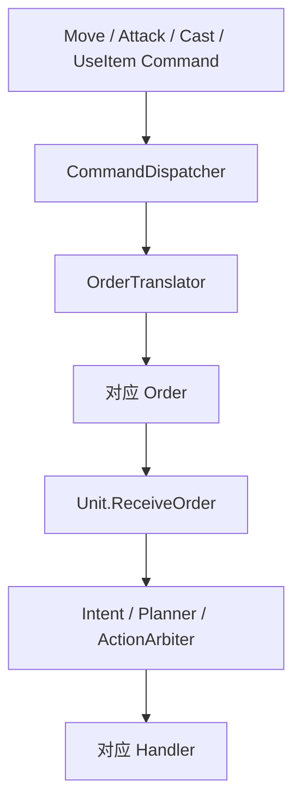

即使单位当前死亡或状态不允许执行，Command 仍保留在权威命令字节中，由 Unit 内部判断 Order 是否成立。

新生单位满足：

```text
CurrentTick <= UnitUid.SpawnLogicTick
```

时，不执行主动 Order、Planner、ActionRuntime、普通移动、普通攻击或主动技能推进。

## 11.2 技能点分配直接调用 AbilityHandler

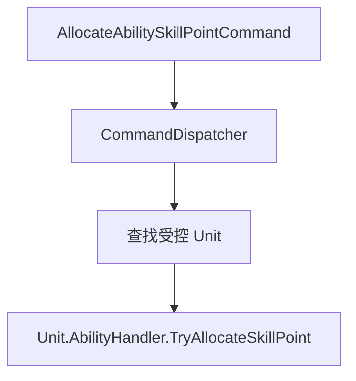

不经过 Intent、Planner、ActionArbiter 或 ActionRuntime。

## 11.3 商店 Command

```text
EquipmentShopCommand
    -> CommandDispatcher
    -> EquipmentShopRuntime.ProcessCommand
```

购买、出售和撤销的唯一执行者是 `EquipmentShopRuntime`。

购买执行入口只接收：

```text
PlayerSlot
EquipmentId
```

所有端在目标 Tick 重新调用：

```text
TryBuildPurchasePlan(PlayerSlot, EquipmentId)
```

Command 不指定目标槽位；规划器根据配方组件、堆叠状态和模拟删除后的最低合法空槽生成 `DestinationSlot`。

出售执行入口接收：

```text
PlayerSlot
SourceSlot
```

撤销执行入口只需要：

```text
PlayerSlot
```

执行时读取：

```text
ConfirmedEarnedGoldTotal
OperationLog
UndoableOperationStack
EffectiveShopGoldDelta =
    Sum(所有未撤销记录的 GoldDelta)

CurrentAvailableGold =
    ConfirmedEarnedGoldTotal
    + EffectiveShopGoldDelta

EquipmentHandler 状态
ShopTraderRuntime
装备静态配置
Command 顺序
```

交易成功后：

```text
修改 EquipmentHandler。
追加或更新 ShopOperationRecord。
更新 UndoableOperationStack。
标记派生交易金币缓存为 Dirty，或增量更新缓存。
```

不直接写入：

```text
ConfirmedEarnedGoldTotal
任何账户金币总量字段
CurrentAvailableGold
独立累计支出字段
```

所有模拟端在相同确认收入基线和相同 Command 下应得到相同成功或失败结果，不增加 `ShopOperationAuthorityResult`。

## 11.4 交换槽位

```text
SwapEquipmentSlotCommand
    -> CommandDispatcher
    -> Unit
    -> EquipmentHandler.SwapSlots
```

交换槽位不进入商店交易链。

## 11.5 Request 与 Process 分离

本地 UI 可调用 RequestCheck 决定是否提交 Command，但 Request 阶段不得修改：

```text
装备槽
OperationLog
UndoableOperationStack
ShopOperationRecord.Reverted
```

若本地 RequestCheck 因确认金币不足而失败：

```text
不生成 EquipmentShopCommand。
后续收入确认不会追溯创建过去不存在的 Command。
玩家需在收入确认后重新发起购买请求。
```

`CurrentAvailableGold` 和 `EffectiveShopGoldDelta` 都是只读派生值。

---

# 十二、`AuthorityFrameReplicator` 与 `AuthorityRecovery`

## 12.1 `AuthorityFrame`

```text
AuthorityFrame
    Tick
    FrameSequence
    FinalCommandRevision
    CanonicalCommandBytes
    FrameFlags
    SharedGameplayChecksum
```

`SharedGameplayChecksum` 第一版必填。

AuthorityFrame 不携带：

```text
GoldIncomeRecord
GoldIncomeRecordBatch
ConfirmedIncomeIncreaseRecord
AuthorityResultBytes
ResolvedGameplayMutationBytes
ResolvedShopOperation
```

它确认相同输入和确定性 Tick 输出，不传输战斗或金币结果。

## 12.2 服务端流程

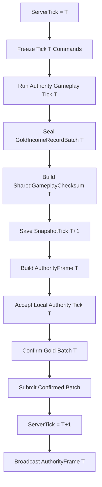

服务端在开始 Tick `T + 1` 前确认 Tick `T` 的金币批次。

## 12.3 `SharedGameplayChecksum`

必须覆盖：

```text
MatchRuleRuntime
MatchStatisticsRuntime
UnitWorld
ProjectileWorld
CombatSystem 跨 Tick状态
EquipmentHandler
EquipmentShopRuntime
PhysicsWorld
DeterministicRandomService
GoldIncomeBatchDigest[T]
```

Combat 部分包括：

```text
DamageContributionTracker
DeferredCombatRequestBuffer
```

延迟请求摘要覆盖：

```text
ExecuteLogicTick
SourceLogicTick
DeferredSequenceInSourceTick
RequestKind
唯一有效 RequestPayload
稳定记录顺序
```

不包含：

```text
ConfirmedEarnedGoldTotal
ConfirmedIncomeThroughTick
网络缓冲
服务端持久化任务
Unity 表现状态
```

## 12.4 本地校验历史

客户端执行完 Tick `T` 后保存：

```text
LocalFrameVerificationRecord
    LogicTick
    SharedGameplayChecksum
```

由：

```text
PredictionRollbackCoordinator
    LocalFrameVerificationRecordByTick
```

持有。

生命周期：

```text
完成预测或重演 Tick T
    -> 写入或覆盖 Record[T]。

从 Tick T 开始重演
    -> 删除 T 及之后旧记录。
    -> 重演后重新生成。

AuthorityFrame(T) 通过
    -> 淘汰 Record[T]。

AuthorityFrame 缺口
    -> 保留最早未确认 Tick 及之后记录。
```

它不进入 GameplaySnapshot。

## 12.5 AuthorityRecovery

当前版本只补发缺失 AuthorityFrame：

```text
AuthorityRecoveryRequest
    RequestSequence
    MissingRanges[]
        FromTick
        ToTick
```

```text
AuthorityRecoveryResponse
    RequestSequence
    AuthorityFrames[]
```

客户端保留最早缺失 Tick 对应的：

```text
Snapshot
Command 历史
GoldIncomeRuntime 未确认批次和摘要
LocalFrameVerificationRecord
```

补齐后逐 Tick完成：

```text
Command 对账
Checksum 对账
必要权威纠错重演
GoldIncomeRuntime.ConfirmAuthorityFrame
LatestAuthorityFrameTick 推进
```

不提供 BaseSnapshot、中途加入、客户端进程重启恢复或金币种子。本地恢复点不存在时终止该客户端对局连接。

## 12.6 传输策略

```text
GameplayCommandBundle        Reliable Ordered
AcceptedCommandRelay         Reliable Ordered
AuthorityFrame               Reliable Ordered
AuthorityRecoveryRequest     Reliable
AuthorityRecoveryResponse    Reliable Ordered
MatchResultState             Reliable Ordered
```

---

# 十三、`SimulationTickPipeline`：确定性 Gameplay Tick

## 13.1 聚合根

```text
GameplayRuntime
    MatchRuleRuntime
    MatchStatisticsRuntime
    UnitWorld
    ProjectileWorld
    CombatSystem
    EquipmentShopRuntime
    PhysicsWorld
    DeterministicRandomService
```

帧同步组合根另外维护：

```text
GoldIncomeRuntime
LocalFrameVerificationRecordByTick
```

二者不进入 GameplaySnapshot。

## 13.2 Tick 顺序

```text
01. Begin Tick T
02. 设置 SimulationTickContext.Current
03. CombatSystem.BeginTick(T)
        重置当前 Tick 活动请求序列
        重置延迟请求分配器
        按稳定顺序导入 ExecuteLogicTick == T 的 DeferredCombatRequest
04. GoldIncomeRuntime.BeginTick(T)
05. EquipmentShopRuntime.BeginTick
06. 其它系统执行自己的内部 BeginTick 与序列重置

07. NaturalGoldIncomeSystem
        按 PlayerSlot 升序请求自然金币

08. 分发本 Tick GameplayCommand
09. 推进 MatchPhase 的非胜负时间状态
10. UnitWorld 推进正常复活和跨 Tick 生命周期
        完成复活状态初始化后
        按固定 Handler 顺序调用 ClearForRespawn

11. MinionSystem / JungleCamp 等生成单位并注册 AIController
12. UnitWorld 建立稳定 AI 遍历集合
13. Tick AIController
14. Unit 处理玩家和 AI Order
15. CrowdControlHandler.Advance
16. 刷新 CapabilityState
17. BehaviorPlanner / ActionArbiter / ActionRuntime
18. Ability / Buff / Attack / Equipment Advance

19. PhysicsWorld.BuildRvoGrid
20. DeterministicRVO
21. UnitLocomotionAgent 写逻辑位置
22. WallPenetrationResolver 修正

23. ProjectileWorld.CommitSpawns
24. ProjectileWorld.AdvanceMotion
25. ProjectileWorld.UpdateLifecycle
26. PhysicsWorld.BuildUnitFinalGrid
27. 产生并路由碰撞事件
28. ProjectileWorld.ResolveHits
29. ProjectileWorld.EmitEffects
30. ProjectileWorld.FlushDestroy

31. CombatSystem.SettleTick
        UnitDying 和普通 Damage / Heal Reaction
            产生的请求继续进入当前 Tick
        生命周期 API：
            UnitWorld.RequestEnterDying
            UnitWorld.RequestRecoverFromDying
            UnitWorld.ConfirmUnitDeath
        UnitDeath / UnitKill 回调立即执行
        其新建 Shield / Damage / Heal Request
            写入 DeferredCombatRequestBuffer
            ExecuteLogicTick = T + 1

32. CombatSystem 冻结 CombatTickResult
        FormalDeathResults[]
        TeamBaseDestroyedSignals[]
        GoldIncomeAllocations[]

33. MatchStatisticsRuntime
        所有模拟端按 FormalDeathResults 稳定顺序更新

34. EquipmentShopRuntime
        处理战斗参与导致的撤销失效

35. CombatGoldIncomeProducer
        按 GoldIncomeAllocations 规范顺序请求金币

36. MatchRuleRuntime
        所有端推进共享规则状态
        Dedicated Server 消费 TeamBaseDestroyedSignals

37. Map / MatchRule Gold Producers
        按代码固定顺序请求金币

38. GoldIncomeRuntime.SealTick(T)
        生成 GoldIncomeRecordBatch[T]
        生成 GoldIncomeBatchDigest[T]

39. 构建 SharedGameplayChecksum(T)
40. 输出 VisualSnapshot / PresentationEvent
41. 保存 LocalFrameVerificationRecord[T]
42. 保存 SnapshotTick = T + 1
43. End Gameplay Tick T

44. Dedicated Server 构建 AuthorityFrame(T)
45. Dedicated Server 接受本地 Tick T
46. Dedicated Server 确认 GoldIncomeRecordBatch[T]
47. Dedicated Server 提交确认批次
48. ServerTick 前进到 T + 1
49. Dedicated Server 广播 AuthorityFrame(T)
```

## 13.3 Projectile Spawn Sequence

FrameSync 不要求外部调用 `ProjectileWorld.BeginTick()`。

ProjectileWorld 自己保证：

```text
每个 LogicTick 的 SpawnSequenceInTick 从 0 开始。
同 Tick 后续分配稳定递增。
```

具体在自身 Tick 逻辑或 UID 分配入口完成，以 Projectile v18 为准。

## 13.4 Unit Spawn 与主动生效

```text
FirstActiveLogicTick =
    UnitUid.SpawnLogicTick + 1
```

生成 Tick 内单位可以被查询、成为目标、参与碰撞并受到效果，但不执行主动 AI、Order、Planner、移动、攻击和主动技能。

不保存独立 FirstActive 或 FirstAI Tick 字段。

## 13.5 正式死亡、复活和延迟处置

正式死亡在 Combat Settlement 内通过：

```text
UnitWorld.RequestEnterDying
UnitWorld.RequestRecoverFromDying
UnitWorld.ConfirmUnitDeath
```

`ConfirmUnitDeath` 同步完成：

```text
写 LifeState = Dead
发布 UnitDeath
按固定 Handler 顺序 ClearForDeath
注销非英雄管理关系
注销 AIController
刷新目标与碰撞有效性
```

正式死亡不调用：

```text
StatHandler.ClearModifiers()
CombatModifiers.Clear()
```

来源系统只移除自己持有的 Handle：

```text
BuffHandler.ClearForDeath
CrowdControlHandler.ClearForDeath
Ability 中断应中断的 Session
Equipment 保留装备与常驻 Runtime
```

复活完成状态初始化后，按同一固定 Handler 顺序调用 `ClearForRespawn`。跨死亡保留的 Buff、装备被动和技能被动在该接缝重建当前生命阶段 Handle。

若 Dead Unit 仍作为延迟战斗请求 Source：

```text
CombatSystem.HasDeferredRequestFrom(UnitUid)
    == true
```

则可以立即停止 AI、碰撞和选择，但不能最终从 Unit Registry 注销、回池或 Destroy，必须等待来源延迟请求执行完毕。

## 13.6 Combat Reaction

```text
DamageTaken / DamageDealt
HealTaken / HealDealt
UnitDying
    -> 新普通战斗请求在当前 Tick执行。

UnitDeath / UnitKill
    -> 回调立即执行。
    -> 新普通战斗请求延迟到下一 Tick。
```

## 13.7 UnitEventBus 与表现

UnitEventBus 是即时强类型固定路由，不动态订阅、不进入快照。只有 `SupportedUnitEvents` 声明支持的 Handler 才进入路由。

Gameplay Tick 只写逻辑姿态；`PhysicsEntity2D.LateUpdate` 是实体根 Transform 唯一写入点。

AttackHandler 的 Commit 音效适配现有 Presentation / Audio `SfxEvent` 入口，不直接调用 `AudioSource.Play()`，事件身份继续使用现有 `PresentationEventId`。

---

# 十四、`MatchRuleRuntime`：权威确认后的轻量比赛规则

## 14.1 定位

`MatchRuleRuntime` 负责：

```text
比赛阶段
RunningStartTick
基地死亡结果判断
GameOverTick
FinishTick
WinningTeamId
EndReason
MatchResultState 构建
比赛统计
```

客户端预测阶段不提交比赛结束；服务端权威 Tick 和客户端权威重演可以提交相同结果。

## 14.2 比赛阶段

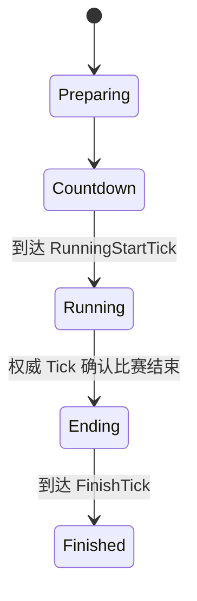

## 14.3 基地规则

地图初始化时注册：

```text
BlueBaseUnitUid
RedBaseUnitUid
```

CombatSystem 正式确认基地死亡时生成：

```text
TeamBaseDestroyedSignal
    BaseUnitUid
    OwnerTeamId
    DestroyedTick
    Sequence
```

服务端在 Tick 末统一判断：

```text
仅蓝方基地死亡 -> 红方胜利
仅红方基地死亡 -> 蓝方胜利
双方同 Tick 死亡 -> Draw
```

## 14.4 客户端预测结束候选

客户端预测 Tick `T` 完整执行并完成 Combat Reaction 后，若基地最终 `LifeState == Dead`：

```text
PredictedMatchEndCandidateTick = T
添加 MatchEndCandidate 暂停
```

不能在 `HP <= 0` 或 `Dying` 时提前暂停。

客户端预测阶段不写入：

```text
WinningTeamId
GameOverTick
MatchPhase.Ending
```

## 14.5 对应权威帧到达

当连续权威帧到达 Tick `T` 后，客户端使用权威 Command 重演 Tick `T`。

### 权威重演后未结束

```text
清除 PredictedMatchEndCandidateTick。
解除 MatchEndCandidate 暂停。
继续预测并重演暂停期间缓存的 Command。
```

### 权威重演后确实结束

客户端在权威 Tick 重演完成后显式调用：

```text
MatchRuleRuntime.EvaluateAuthorityConfirmedTick(
    tick = T,
    unitWorld
)
```

该入口只能在 `LatestAuthorityFrameTick >= T` 时调用，不允许预测 Tick 调用。

```text
权威计算并写入 MatchRuleRuntime 的 Ending 状态。
GameOverTick = T。
LocalSimulationTick 停在 T + 1。
丢弃 T 之后的预测历史。
不再恢复 Gameplay 预测。
```

AuthorityFrame 对该 Tick 的命令确认，构成客户端停止 Gameplay 推进所需的权威确认。

## 14.6 `MatchResultState`

服务端在 `AuthorityFrame(GameOverTick)` 构建完成后可靠发送：

```text
MatchResultState
    MatchId
    ResultRevision
    GameOverTick
    WinningTeamId
    EndReason
```

客户端可在权威重演确认结束后进入 Ending 并播放服务端已确认的结束表现；Result 页面和最终结果数据以 `MatchResultState` 为准。

若 `MatchResultState` 先到达而对应 AuthorityFrame 尚未连续补齐，则缓存结果并发起 AuthorityRecovery。

若客户端权威重演结果与 `MatchResultState` 不一致，视为程序 Bug 或配置不一致，记录诊断并终止客户端对局。

## 14.7 Snapshot

```text
MatchRuleRuntimeSnapshot
    CurrentPhase
    PhaseEnterTick
    RunningStartTick
    BlueBaseUnitUid
    RedBaseUnitUid
    GameOverTick
    FinishTick
    WinningTeamId
    EndReason
    MatchStatisticsRuntimeSnapshot
```

`PredictedMatchEndCandidateTick` 属于 PredictionRollbackCoordinator 的本地控制状态，不进入 GameplaySnapshot。

---

# 十五、`PredictionRollbackCoordinator`：快照、回滚、重演与确认输出

## 15.1 快照和回滚锚点

```text
SnapshotTick =
    恢复后下一次应该执行的 Gameplay Tick
```

Tick `T` 完成后保存：

```text
SnapshotTick = T + 1
SnapshotIntervalTicks = 1
```

```text
RollbackAnchorTick =
    LatestAuthorityFrameTick + 1
```

普通回滚必须满足：

```text
ReplayFromTick >= RollbackAnchorTick
```

## 15.2 统一接口与聚合根

```csharp
public interface IRollback<TState>
{
    void Capture(ref TState state);
    void Restore(in TState state);
    void Resolve(in RollbackContext context);
    void Rebuild(in RollbackContext context);
}
```

顶层显式调用：

```text
MatchRuleRuntime
MatchStatisticsRuntime
UnitWorld
ProjectileWorld
CombatSystem
EquipmentShopRuntime
PhysicsWorld
DeterministicRandomService
```

不进入 GameplaySnapshot：

```text
GoldIncomeRuntime
LocalFrameVerificationRecordByTick
AuthorityFrameBuffer
AcceptedCommandRelayBuffer
GameplayCommandBuffer
PredictionPauseReasons
网络连接
```

## 15.3 普通 Relay 回滚

已执行预测 Tick 收到更新版 Relay：

```text
EarliestDirtyPredictionTick =
    min(当前值, Relay.TargetTick)
```

同一网络批次只执行一次最早 Relay Dirty Tick 回滚。

金币确认不写入 `EarliestDirtyPredictionTick`。

## 15.4 回滚前处理

```pseudo
function PrepareReplay(replayFromTick):
    GoldIncomeRuntime
        .DiscardUnconfirmedFromTick(replayFromTick)

    LocalFrameVerificationRecordByTick
        .RemoveFrom(replayFromTick)

    snapshot =
        SnapshotStore.FindLatestAtOrBefore(
            replayFromTick)

    RestoreGameplay(snapshot)
```

恢复后：

```text
LocalSimulationTick = snapshot.SnapshotTick
```

## 15.5 AuthorityFrame 单 Tick 屏障

处理 `AuthorityFrame(T)`：

```text
1. 要求 T == LatestAuthorityFrameTick + 1。

2. 读取本地：
       CanonicalCommandBytes[T]
       LocalFrameVerificationRecord[T]

3. 若 Command 与 Checksum 都一致：
       接受 AuthorityFrame(T)。

4. 若任一不一致：
       保存旧 PredictedEndTick。
       从 SnapshotTick = T 恢复。
       丢弃 Tick T 及之后未确认 Gold Batch、Digest 和 Verification Record。
       使用 AuthorityFrame(T) 权威 Command，
       重演 Tick T 到旧 PredictedEndTick。
       重新生成 Tick T 的 Batch、Digest 和 Checksum。
       再次比较 Tick T SharedGameplayChecksum。

5. 权威重演后仍不一致：
       记录确定性诊断。
       终止当前客户端对局。

6. Tick T 被接受后：
       GoldIncomeRuntime.ConfirmAuthorityFrame(
           AuthorityFrame(T))。
       LatestAuthorityFrameTick = T。
       淘汰 LocalFrameVerificationRecord[T]。

7. 才处理 AuthorityFrame(T + 1)。
```

## 15.6 权威纠错和金币基线

纠错重演 Tick `T..PredictedEndTick` 时：

```text
ConfirmedEarnedGoldTotal
    仍只确认到 Tick T - 1。
```

完成重演并验证 Tick `T` 后，才确认 Tick `T` 收入。

收入确认后不再次重演预测后缀。后续预测 Tick 暂时使用较保守的确认金币基线是允许的，等其自身 AuthorityFrame 到达时再进行普通 Checksum 对账。

## 15.7 金币确认不主动重演

```text
GoldIncomeRuntime.ConfirmAuthorityFrame(T)
    不扫描 Purchase 或 Undo。
    不追溯创建 RequestCheck 失败的 Command。
    不主动重演 T + 1 之后的预测 Tick。
```

## 15.8 Replay Command 优先级

```text
AuthorityFrame
最新 AcceptedCommandRelay
本地预测 Command
空命令帧
```

重演后重新保存：

```text
GoldIncomeRuntime 未确认批次和 Digest
LocalFrameVerificationRecord
GameplaySnapshot
```

## 15.9 AuthorityRecovery

AuthorityRecovery 只补发缺失 AuthorityFrame。客户端保留最早缺失 Tick 的 Snapshot、Command、Gold Batch、Digest 和 Verification Record。

本地恢复点不存在时终止当前客户端对局连接，不请求 BaseSnapshot。

## 15.10 CombatSystem 恢复

CombatSystem Restore 直接恢复：

```text
DamageContributionTrackerSnapshot[]
DeferredCombatRequestSnapshot[]
```

下一次 `CombatSystem.BeginTick(snapshotTick)` 导入到期延迟请求。

Resolve 遇到无效 Victim、Contributor、Source、Target 或静态 Recipe 引用时产生确定性恢复错误，不静默删除。

## 15.11 预测结束与表现

预测到基地正式死亡候选后暂停到对应 AuthorityFrame。权威否定则恢复预测，确认则停止在 `GameOverTick + 1`。

表现事件继续使用现有 `PresentationEventId`，结构不修改。

---

# 十六、`DeterministicRandomService`：确定性随机

## 16.1 单一逻辑随机源

当前版本只保留一个：

```text
DeterministicRandomService
```

不划分 World、Combat、Spawner、AI、Loot、Visual 等随机流。

纯视觉随机可以使用 Unity 随机，因为它不影响 Gameplay；需要跨客户端视觉近似一致时，可使用 `VisualEventId` 派生表现种子，但不消耗 Gameplay 随机状态。

## 16.2 状态与快照

```text
DeterministicRandomSnapshot
    State
    CallCount optional
```

状态进入 `GameplaySnapshot`。

回滚恢复随机状态后，重演必须产生相同随机结果。

## 16.3 常用函数

```text
NextUInt()
NextInt()
NextInt(minInclusive, maxExclusive)
NextFp01()
NextFp(minInclusive, maxExclusive)
NextBool()
Chance01(probabilityFp)
ChancePercent(percentFp)
PickIndex(count)
PickOne(readOnlyList)
ShuffleInPlace(list)
RandomDirection2D()
RandomPointInsideCircle(radius)
RandomPointOnCircle(radius)
```

Gameplay 2D 逻辑不提供 `Direction3D` 作为核心函数；表现层自行转换。

## 16.4 核心伪代码

思路：所有高级随机函数最终只消耗稳定数量的基础随机值；列表遍历和 Shuffle 必须使用稳定顺序容器。

```pseudo
function NextInt(minInclusive, maxExclusive):
    range = maxExclusive - minInclusive
    value = NextUInt()
    return minInclusive + value mod range

function Chance01(probability):
    return NextFp01() < Clamp01(probability)

function ShuffleInPlace(list):
    for i from list.Count - 1 down to 1:
        j = NextInt(0, i + 1)
        swap list[i], list[j]
```

---

# 十七、`GlobalGameplayData`：全局配置与离线 Bake

## 17.1 定位

```text
GlobalGameplayData
    GlobalParamTable
    GlobalPrefabTable
    UnitPrototypeDatabase
    AbilityDatabase
    BuffDatabase
    EquipmentDatabase
    ProjectileDatabase
    CombatRecipeDatabase
    MapRuntimeData
    PathfindingBakeData
    PhysicsSettings
    FrameSyncSettings
    GameModeDatabase
```

## 17.2 `FrameSyncSettings`

```text
TickRate
LogicDelta
MinCommandLeadTicks
MaxFutureCommandTicks
SnapshotWindowTicks
MaxPredictionLeadTicks
MaxLogicTicksPerUnityFrame
AuthorityRecoveryRetryTicks
MaxAuthorityRecoveryAttemptsBeforeDisconnect
StartLeadTicks
```

第一版固定：

```text
SnapshotIntervalTicks = 1
```

不提供可调 Inspector 字段。未来更改快照间隔时，必须重新设计恢复起点表达。

## 17.3 `GameModeConfig`

```text
GameModeId
MapConfigId
GameStartPlayerCount
TeamCount
CountdownTicks
EndingDurationTicks
VictoryRuleId
InitialEarnedGold
```

`InitialEarnedGold` 用于初始化所有端的 `ConfirmedEarnedGoldTotal`。

## 17.4 固定 `PrefabKind`

Prefab 类型由代码固定：

```csharp
public enum PrefabKind
{
    Unit,
    Projectile,
    ParticleVfx,
    AudioEmitter,
    Misc
}
```

Inspector 不允许新增、删除或修改 Prefab 类型语义。

## 17.5 `GlobalPrefabTable`

```text
GlobalPrefabTable
    KindRangeConfigs[]
    PrefabGroups[]
```

```text
PrefabKindRangeConfig
    PrefabKind
    IdRangeStart
    IdRangeEnd
    RequiredComponentRule
```

```text
PrefabGroup
    PrefabKind
    Entries[]
```

```text
PrefabEntry
    PrefabId
    UnityPrefab
    GameplayConfigId optional
    EditorAssetGuid
```

Unit 和 Projectile 的 `PrefabId` 可作为 `RuntimeEntityPrefabId` 参与 UID；ParticleVfx、AudioEmitter 和 Misc 的 ID 只用于表现加载。

## 17.6 Inspector 要求

自定义 Inspector 按固定类型显示分组和 ID 范围，并直接显示每个条目的已分配 ID：

```text
▼ Unit [1000～1999]

1000  Hero_BlueWarrior   ✓
1001  Minion_Melee       ✓
1002  Minion_Ranged      ✓
----  Minion_Super       未分配
```

至少支持：

```text
编辑每组 PrefabId 范围。
拖入单个或多个 Prefab。
拖入文件夹批量导入。
为未分配条目自动分配 ID。
在 Inspector 中显示、搜索和复制 PrefabId。
按 ID 或名称排序显示。
检测重复、越界和未分配。
显示已用数量和剩余数量。
校验 Required Component。
生成 Bake 数据。
```

已有 ID 默认锁定，排序和拖动不能改变 ID。显式重新分配必须二次确认、显示变更预览并提示引用风险。

## 17.7 Bake 结果

```text
BakedGlobalPrefabTable
    PrefabRecordsById[]
    PrefabKindRanges[]
```

Bake 阶段完成：

```text
ID 唯一性和范围校验
跨数据库引用校验
Required Component 校验
稳定数组生成
float -> fp
Inspector 整数毫秒 -> Tick（整数运算与显式舍入策略）
生成 IdToIndexMap
生成版本号与内容摘要
```

运行时禁止使用 AssetDatabase、名称或加载顺序分配 ID。

## 17.8 Unit 与 Projectile 配置引用

```text
UnitPrototypeDatabase
    UnitPrototypeId
    RuntimeEntityPrefabId
    单位系统烘焙数据

ProjectileDatabase
    ProjectileDefinitionId
    RuntimeEntityPrefabId
    投掷物系统烘焙数据
```

单位、投掷物和表现层不再各自定义第二套 Prefab 表。

## 17.9 版本握手

```text
GameplayDataVersion
MapDataVersion
GlobalPrefabTableVersion
CommandSchemaVersion
SnapshotSchemaVersion
```

任一关键版本不一致，不得开始帧同步。

---

# 十八、推荐落地顺序

## 18.1 应用与大厅

```text
UOS Matchmaking
LobbySessionFlowNetwork
GameBootstrapPayload
统一 StartTick
InitialEarnedGold 初始化 GoldIncomeRuntime
```

## 18.2 帧同步

```text
ServerTick
LatestAuthorityFrameTick
LocalSimulationTick
AuthorityFrame
必填 SharedGameplayChecksum
LocalFrameVerificationRecordByTick
AuthorityRecovery
PredictionPauseReason
```

## 18.3 Gameplay

```text
UnitWorld.SpawnUnit
SpawnLogicTick 主动生效门槛
CombatSystem.BeginTick 导入 DeferredRequest
Combat 内即时 Dying / Dead
UnitDeath / UnitKill 新普通请求延迟一 Tick
MatchStatisticsRuntime 所有端消费
固定 ClearForDeath / ClearForRespawn
ProjectileWorld
EquipmentShopRuntime
PhysicsWorld
```

## 18.4 金币

```text
GoldIncomeRuntime 唯一所有权
GoldIncomeRecordBatch
GoldIncomeBatchDigest
固定金币来源请求顺序
ConfirmedEarnedGoldTotal
CurrentAvailableGold
金币确认不主动回滚
确认批次幂等持久化
```

## 18.5 快照与回滚

```text
SnapshotIntervalTicks = 1
RollbackAnchorTick
LocalFrameVerificationRecord 生命周期
ProjectileWorldSnapshot v18
CombatSystemSnapshot v13.2
Relay Dirty Tick
AuthorityRecovery 仅补 AuthorityFrame
```

---

# 十九、核心结论

```text
1. AuthorityFrame.SharedGameplayChecksum 第一版必填。
2. GoldIncomeBatchDigest[T] 必须纳入 Tick T 的共享校验。
3. 客户端保存每个未确认 Tick 的 LocalFrameVerificationRecord。
4. AuthorityFrame 必须逐 Tick完成 Command、Checksum、必要重演和金币确认。
5. GoldIncomeRuntime 是金币批次、摘要和确认累计的唯一所有者。
6. 金币确认只推进确认收入，不主动重演后续预测帧。
7. RequestCheck 失败不生成 Command，收入确认后不追溯购买。
8. 远端商店 Command 的保守预测等该 Tick AuthorityFrame 到达时再校验。
9. 普通回滚不得越过 LatestAuthorityFrameTick + 1。
10. 权威纠错重演期间先使用确认到 T-1 的金币基线，再确认 Tick T 收入。
11. CurrentAvailableGold =
        ConfirmedEarnedGoldTotal
        + EffectiveShopGoldDelta。
12. AuthorityRecovery 只补发缺失 AuthorityFrame。
13. SnapshotIntervalTicks 固定为 1。
14. 未确认 Snapshot、Gold Batch、Command 和 Checksum 历史不得提前淘汰。
15. ProjectileWorld 自己保证每 Tick SpawnSequenceInTick 从 0 开始。
16. ProjectileWorldSnapshot 只保存 PendingSpawns 与 ActiveProjectiles。
17. CombatSystemSnapshot 只保存 DamageContributionTrackers 与 DeferredRequests。
18. UnitDeath / UnitKill 回调立即执行，其新普通战斗请求延迟到下一 Tick。
19. DeferredCombatRequest 序列允许合法缺号，删除后禁止重新编号。
20. Combat Resolve 遇到无效稳定引用时产生确定性恢复错误。
21. MatchStatisticsRuntime 在所有模拟端消费 FormalDeathResults。
22. 生命周期 API 统一为 RequestEnterDying、RequestRecoverFromDying、ConfirmUnitDeath。
23. Buff 死亡接口统一为 ClearForDeath。
24. 复活时按固定 Handler 顺序调用 ClearForRespawn。
25. 正式死亡不全量清空 Modifier。
26. 非英雄死亡时停止 AI 并注销管理关系；有来源延迟请求时延后最终回池。
27. UnitEventBus 是即时强类型固定路由，不进入快照。
28. PhysicsEntity2D.LateUpdate 是实体根 Transform 唯一写入点。
29. AttackHandler Commit 音效适配现有 Presentation / Audio 入口。
30. PresentationEventId 保持当前结构。
31. 账户身份运行时不保存金币总量。
32. 服务端持久化层只接收已确认金币批次。
```
