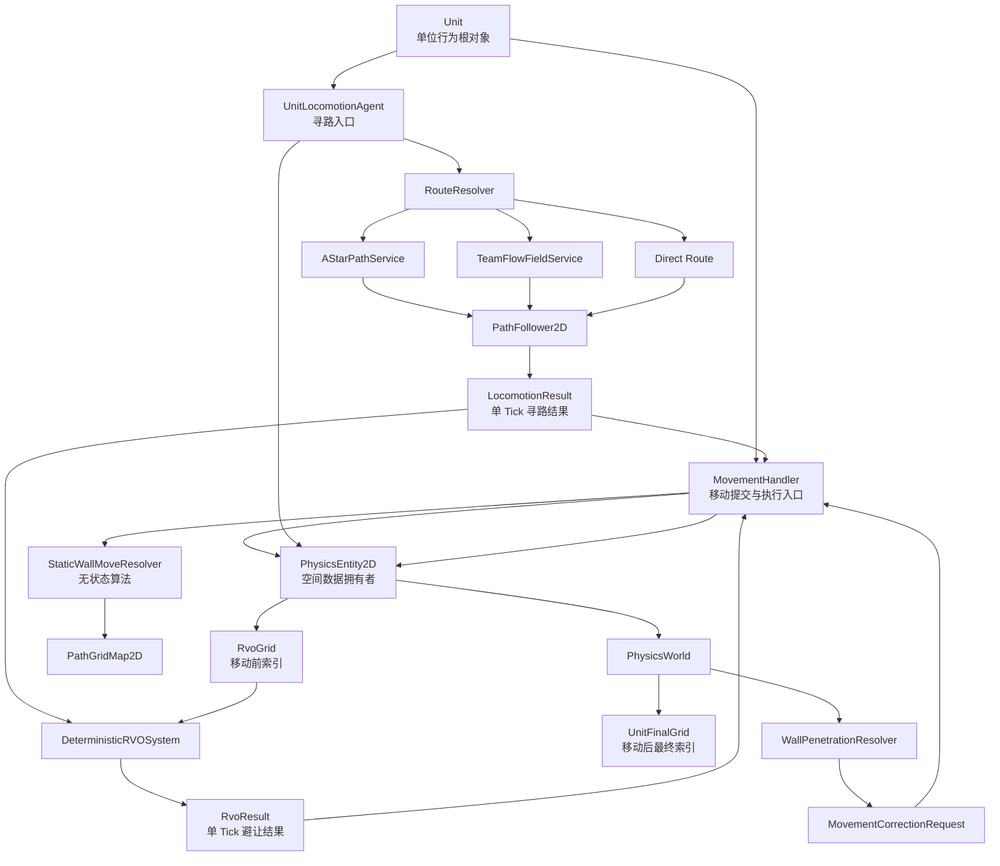
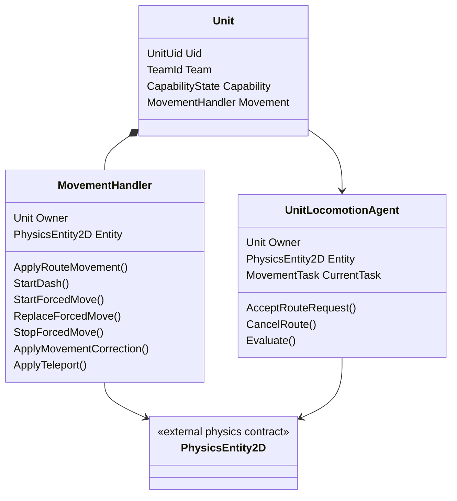

# 帧同步 MOBA 单位寻路与移动系统程序设计案 v13.1

> 目标：设计一套通用、确定性、低冗余、适用于帧同步 MOBA 的单位寻路与移动系统。  
> 本版在 v13 基础上进行小版本修订：对齐单位框架 v27.1 的新生单位 Tick 语义。生成 Tick 仍执行各 Handler 的 Tick，以推进 Buff、控制、数值等被动状态；普通主动 Gameplay 是否执行统一读取 `Unit.CanRunActiveGameplayThisTick`，寻路与移动系统不自行维护第二套出生计时。  
> v13 已完成第三轮修订：`PhysicsEntity2D`、空间结构、身份绑定与空间写入 API 只由物理与范围查询系统正式定义；本文依赖该正式契约，不重复声明第二套结构。  
> `PhysicsEntity2D` 持有单位空间数据；`UnitLocomotionAgent` 是单位寻路入口并按 Tick 输出 `LocomotionResult`；`MovementHandler` 是单位移动提交与执行入口，通过物理系统正式 API 应用空间变化。  
> 强制位移由 `CrowdControlHandler` 进行唯一实例与优先级仲裁，`MovementHandler` 只执行已经生效的强制位移轨迹。寻路、移动、RVO 与控制函数内部统一读取 `SimulationTickContext.Current`，不把 Tick 上下文加入业务接口参数。  
> 本文只保留与单位寻路、移动、RVO 和静态墙体约束直接相关的物理依赖。帧同步相关内容只标记“需要恢复 / 可重建 / 静态配置 / 单 Tick 临时”，不替代帧同步系统与物理系统的正式快照设计。  
> 本文是程序架构与核心算法设计案，不是最终 C# 实现。

---

## v13.1 小版本修订摘要

```text
1. 明确生成 Tick 仍执行各 Handler Tick，以推进被动状态。
2. 普通主动 Gameplay 统一读取 Unit.CanRunActiveGameplayThisTick。
3. UnitLocomotionAgent 在生成 Tick 不输出普通 RouteMove。
4. MovementHandler 不整体跳过生成 Tick：
   已生效的外部 ForcedMove、传送与位置修正仍可执行。
5. 不增加 FirstActiveLogicTick、FirstMovementTick 等重复状态或快照字段。
6. 冻结所有帧同步 GameObject 的 Unity Transform 唯一写入点为 PhysicsEntity2D.LateUpdate。
7. 补充正式死亡时移动与寻路模块清理自身临时状态的系统接缝。
```

---

## 目录

1. [总体设计结论](#1-总体设计结论)
2. [`Unit` / `MovementHandler` / `UnitLocomotionAgent`：最终职责边界](#2-unit--movementhandler--unitlocomotionagent最终职责边界)
3. [`PhysicsEntity2D`：正式物理依赖契约](#3-physicsentity2d正式物理依赖契约)
4. [`PathGridMap2D`：二维旋转网格地图](#4-pathgridmap2d二维旋转网格地图)
5. [`MovePurpose` 与移动请求分流](#5-movepurpose-与移动请求分流)
6. [`UnitLocomotionAgent` 与 `RouteResolver`：寻路逻辑入口](#6-unitlocomotionagent-与-routeresolver寻路逻辑入口)
7. [`AStarPathService`：点到点寻路](#7-astarpathservice英雄追踪回营地等点到点寻路)
8. [`TeamFlowFieldService`：队伍级静态流场](#8-teamflowfieldservice小兵队伍级静态流场)
9. [`PathFollower2D`：路线跟随](#9-pathfollower2d路线跟随)
10. [`PhysicsWorld` / `RvoGrid` / `DeterministicRVOSystem`](#10-physicsworld--rvogrid--deterministicrvosystem)
11. [`MovementHandler`：移动提交、特殊移动与空间应用](#11-movementhandler移动提交特殊移动与空间应用)
12. [`WallPenetrationResolver`：异常穿墙修正请求](#12-wallpenetrationresolver异常穿墙修正请求)
13. [综合 Tick 顺序](#13-综合-tick-顺序)
14. [公共数据结构](#14-公共数据结构)
15. [帧同步服务标记](#15-帧同步服务标记)
16. [必要功能与删除项审查](#16-必要功能与删除项审查)
17. [推荐落地顺序](#17-推荐落地顺序)
18. [附录：一帧移动伪代码总览](#附录一帧移动伪代码总览)

---

# 1. 总体设计结论

## 1.1 三个核心结论

```text
PhysicsEntity2D
    是单位二维空间数据的正式拥有者。
    具体结构和写入 API 由物理与范围查询系统唯一规定。

UnitLocomotionAgent
    是单位寻路入口和路线运行状态拥有者。
    每 Tick 读取 PhysicsEntity2D，维护路径、检测偏离、推进路径游标、
    判断到达并输出当前 Tick 的 LocomotionResult。
    不提交位置，不把整条路径交给 MovementHandler。

MovementHandler
    是单位移动提交与执行入口。
    消费当前 Tick 的 LocomotionResult / RvoResult，
    或执行 Dash、强制位移、传送与修正，
    最终调用 PhysicsEntity2D 应用空间变化。
```

这里必须区分：

```text
空间数据归属：
    PhysicsEntity2D

寻路任务、路径和路线决策归属：
    UnitLocomotionAgent

单位移动提交与执行归属：
    MovementHandler
```

调用关系为：

```text
UnitLocomotionAgent 读取 PhysicsEntity2D
        ↓
输出单 Tick LocomotionResult
        ↓
RVO 输出单 Tick RvoResult
        ↓
MovementHandler 执行并提交
        ↓
PhysicsEntity2D 保存最终空间状态
```

三者不重复维护位置、路径或控制优先级。

---

## 1.2 核心架构



---

## 1.3 职责一句话版

| 模块 | 最终职责 |
|---|---|
| `Unit` | 身份、阵营、能力状态、Intent、Action、Handler 聚合。 |
| `PhysicsEntity2D` | 物理系统正式定义的 Unity `MonoBehaviour` 逻辑空间组件；本文只读取并调用其公开 API。 |
| `UnitLocomotionAgent` | 接收寻路请求，拥有路线任务、路径和游标，每 Tick 输出 `LocomotionResult`。 |
| `MovementHandler` | 消费单 Tick 移动结果，执行普通移动、Dash、强制位移、传送和修正，并提交空间状态。 |
| `PathGridMap2D` | 静态旋转网格、坐标转换、半径通行层。 |
| `AStarPathService` | 确定性点到点寻路。 |
| `TeamFlowFieldService` | 离线队伍级静态流场。 |
| `PathFollower2D` | 在 `UnitLocomotionAgent` 内维护路径跟随、偏离检测和到达判断。 |
| `PhysicsWorld` | 管理空间实体注册和移动系统需要的空间索引，不直接写单位位置。 |
| `RvoGrid` | 使用移动前位置提供 RVO 邻居候选。 |
| `UnitFinalGrid` | 使用移动完成后的最终位置提供后续空间查询。 |
| `DeterministicRVOSystem` | 根据所有单位当前 Tick 的期望速度输出避让结果，不写位置。 |
| `WallPenetrationResolver` | 检测异常穿墙并生成修正请求，不写位置。 |
| `CrowdControlHandler` | 决定唯一生效的强制位移控制实例并完成优先级仲裁。 |

---

## 1.4 运行时确定性要求

Gameplay Tick 禁止：

```text
float
Vector2 / Vector3
Mathf
Time.deltaTime
Unity Physics
把 Unity Transform 当作逻辑输入
不稳定容器遍历顺序
并行写单位移动结果
```

Gameplay Tick 使用：

```text
fp / fp2
SimulationTickContext
整数逻辑 Tick
固定顺序数组
稳定 UnitUid 排序
离线 Bake 数据
确定性几何算法
```

Inspector 与 Authoring 可以使用 `float / Vector2 / Vector3 / Transform`。  
进入 Gameplay 前转换成 `fp / fp2 / int / 稳定配置 ID`。

`SimulationTickContext` 是 Gameplay 当前 Tick 的统一只读全局上下文：

```text
SimulationTickContext
    static SimulationTickContext Current

    int Tick
    int DeltaTick
    ExecutionMode ExecutionMode
```

```text
ExecutionMode
    ServerAuthority
    ClientPrediction
    ClientReplay
```

接入规则：

```text
顶层 Gameplay Tick 驱动器：
    每 Tick 开始时设置 SimulationTickContext.Current。
    每 Tick 结束时清理或切换 Current。
    只有顶层 Tick 驱动器可以写入 Current。

其它 Gameplay 系统：
    只能在函数内部读取 SimulationTickContext.Current。
    不把 SimulationTickContext 作为方法参数逐层传递。
    不自行缓存第二份 Tick、DeltaTick 或 ExecutionMode。
```

统一读取写法：

```text
SimulationTickContext.Current.Tick
SimulationTickContext.Current.DeltaTick
SimulationTickContext.Current.ExecutionMode
```

统一命名要求：

```text
类型名：SimulationTickContext
当前上下文入口：SimulationTickContext.Current
逻辑帧：SimulationTickContext.Current.Tick
步长：SimulationTickContext.Current.DeltaTick
执行模式：SimulationTickContext.Current.ExecutionMode
```

禁止使用并行命名：

```text
context
tickContext
LogicTickContext
GameplayTickContext
CurrentLogicTick
GlobalCurrentFrame
```

普通模拟、预测和重演均逐 Tick 执行，第一版要求 `DeltaTick = 1`。  
`ExecutionMode` 不得改变移动、寻路和 RVO 的 Gameplay 结果。

---

## 1.5 帧同步标记图例

| 标记 | 含义 |
|---|---|
| `【需要帧同步保存】` | 会跨 Tick 影响未来模拟，需要由帧同步设计纳入对应权威系统状态。 |
| `【可确定性重建】` | 恢复权威状态后可以确定性重建。 |
| `【静态配置】` | 离线或初始化后只读，不进入运行时快照。 |
| `【查询引用】` | 指向其它权威对象，不在本模块复制状态。 |
| `【单 Tick 临时】` | Tick 内产生并消费，不跨 Tick。 |

本文只标记需求，不定义顶层 `GameplaySnapshot`、聚合树或序列化协议。

原则：

```text
空间数据只在 PhysicsEntity2D 空间状态中保存一次。
路线和路径游标只在 UnitLocomotionAgent 对应状态中保存一次。
Dash 与强制位移轨迹只在 MovementHandler 对应状态中保存一次。
RvoGrid、UnitFinalGrid、Bounds、A* 临时搜索状态均可重建。
```

---

# 2. `Unit` / `MovementHandler` / `UnitLocomotionAgent`：最终职责边界

## 2.1 对象关系



推荐装配：

```text
Unit GameObject
    Unit
    PhysicsEntity2D
    UnitLocomotionAgent

Unit 内部 Handler 集合
    MovementHandler
```

`MovementHandler` 可以是 `Unit` 内部普通 C# Handler。  
`UnitLocomotionAgent` 与 `Unit` 大致平级，由单位装配器显式绑定。  
二者通过单 Tick 数据结果协作，不互相保存对方的运行状态。

---

## 2.2 `MovementHandler`：移动提交与执行入口

`MovementHandler` 负责：

```text
接收当前 Tick 的 LocomotionResult 和 RvoResult
执行普通路线移动
执行 Dash
执行 CrowdControlHandler 已批准的强制位移
执行传送
执行静态墙体约束
应用 PhysicsWorld 返回的位置修正
计算最终位置与朝向
调用 PhysicsEntity2D 应用空间变化
发布移动执行结果
```

`MovementHandler` 不负责：

```text
保存 A* 路径
保存 PathCursor
选择 A* / FlowField / Direct
判断是否偏离规划路线
追踪目标重寻路
RVO 邻居搜索和速度求解
比较强制位移控制优先级
判断控制免疫或控制叠加
墙体穿透几何检测
```

`MovementHandler` 只消费当前 Tick 的寻路结果，不持有完整路径或路线恢复策略。

---

## 2.3 `UnitLocomotionAgent`：寻路入口

`UnitLocomotionAgent` 负责：

```text
接收普通寻路请求
维护 MovementTask
根据 MovePurpose 选择 Direct / AStar / FlowField
调用 AStarPathService
读取 TeamFlowFieldService
维护 PathFollower2D
每 Tick 读取 PhysicsEntity2D 当前空间数据
推进路径游标
判断当前位置是否偏离规划路线
判断是否到达目标
处理追踪目标重寻路
输出当前 Tick 的 LocomotionResult
```

它不负责：

```text
写 Position / PrevPosition / Forward
把完整路径传给 MovementHandler
执行 Dash 或强制位移
应用 RVO 后速度
处理移动执行优先级
提交最终位移
```

路径、游标、目标追踪和 `NeedRepath` 都留在 `UnitLocomotionAgent` 内部。

---

## 2.4 空间读取与写入规则

`PhysicsEntity2D` 持有单位空间数据，其正式结构和 API 由物理与范围查询系统定义。  
本系统只依赖其公开的只读空间信息和正式写入接口。

读取关系：

```text
UnitLocomotionAgent：
    读取 Position / Forward / Shape / Radius / RadiusClass，
    用于寻路、路径跟随、偏离检测与到达判断。

DeterministicRVOSystem：
    读取 Position / Bounds / Radius，
    用于邻居查询和速度避让。

MovementHandler：
    读取 Position / Forward / Shape，
    计算本 Tick 最终姿态。
```

单位侧所有 Gameplay 空间变化必须先进入 `MovementHandler`，再由它调用正式物理 API：

```text
普通移动、Dash、强制位移：
    PhysicsEntity2D.SetLogicPose(...)

墙体挤出或轻量位置修正：
    PhysicsEntity2D.ApplyLogicPositionDelta(...)

传送：
    PhysicsEntity2D.TeleportLogicPosition(...)
    必要时再调用 PhysicsEntity2D.SetLogicForward(...)
```

禁止直接修改 `PhysicsEntity2D` 内部空间字段：

```text
Unit
UnitLocomotionAgent
PhysicsWorld
DeterministicRVOSystem
AbilityHandler
BuffHandler
CrowdControlHandler
PathFollower2D
表现层
```

外部模块需要改变单位位置时，只能调用：

```text
MovementHandler.ApplyMovementCorrection(...)
MovementHandler.ApplyTeleport(...)
MovementHandler.StartDash(...)
CrowdControlHandler.OnAdd
    -> MovementHandler.StartForcedMove(...)
```

`MovementHandler` 是单位移动的业务提交入口；  
`PhysicsEntity2D` 是正式空间状态与空间写入 API 的提供者。

## 2.5 核心接口

### `UnitLocomotionAgent`

```text
UnitLocomotionAgent
    MoveAcceptResult AcceptRouteRequest(RouteMoveRequest request)
    void CancelRoute(MoveCancelReason reason)
    LocomotionResult Evaluate()
```

### `MovementHandler`

```text
MovementHandler
    void ApplyRouteMovement(
        in LocomotionResult locomotion,
        in RvoResult rvo
    )

    MoveAcceptResult StartDash(in DashRequest request)
    void StartForcedMove(in ResolvedForcedMove request)
    void ReplaceForcedMove(in ResolvedForcedMove request)
    void StopForcedMove(CrowdControlHandle sourceHandle)
    void AdvanceSpecialMovement()

    void ApplyMovementCorrection(
        fp2 delta,
        MovementCorrectionReason reason
    )

    void ApplyTeleport(
        fp2 position,
        fp2 forward,
        TeleportReason reason
    )
```

上述函数需要 Tick、`DeltaTick` 或执行模式时，在函数内部读取：

```text
SimulationTickContext.Current
```

`LocomotionResult` 是当前 Tick 的值对象。  
`MovementHandler` 不缓存路径，不把 `LocomotionResult` 当作跨 Tick 状态保存。

接口不因为帧同步而增加 Tick 参数。需要当前逻辑帧的实现函数在内部读取：

```pseudo
tick = SimulationTickContext.Current.Tick
deltaTick = SimulationTickContext.Current.DeltaTick
executionMode = SimulationTickContext.Current.ExecutionMode
```

---

## 2.6 移动执行优先级

第一版固定：

```text
Teleport / Correction
    一次性提交，不作为持续模式。

ForcedMove
    当前存在有效 ForcedMoveRuntime 时执行。

Dash
    当前存在有效 DashRuntime 时执行。

RouteMove
    当前 Tick 存在有效 LocomotionResult 时执行。

Idle
```

派生模式：

```pseudo
function ResolveMovementMode(locomotionResult):
    if ForcedMoveRuntime.IsActive:
        return ForcedMove

    if DashRuntime.IsActive:
        return Dash

    if locomotionResult.HasMovement:
        return RouteMove

    return Idle
```

`MovementMode` 是当前状态的派生结果，不作为独立跨 Tick 权威状态。

强制位移是否生效不由本优先级函数仲裁。  
它已经由 `CrowdControlHandler` 在控制实例 `OnAdd / Replace / OnRemove` 阶段裁决完成。

---

## 2.7 帧同步定位

| 数据 | 标记 |
|---|---|
| 单位空间状态 | `PhysicsEntity2D`：`【需要由物理回滚服务恢复】` |
| 当前寻路任务、A* 路径、PathCursor、重寻路计时 | `UnitLocomotionAgent`：`【需要帧同步保存】` |
| Dash 与强制位移轨迹执行状态 | `MovementHandler`：`【需要帧同步保存】` |
| `MovementMode` | `【可确定性重建】` |
| `LocomotionResult / RvoResult` | `【单 Tick 临时】` |
| `Bounds` | `【可确定性重建】` |

## 2.8 新生单位生成 Tick 的执行边界

新生单位在生成 Tick 已完成注册，并继续执行各 Handler 的 Tick。  
这样 Buff、控制、数值、冷却和其它被动运行状态可以按照统一 Tick 管线正常推进。

主动 Gameplay 是否允许执行，统一读取单位框架提供的派生查询：

```csharp
public bool CanRunActiveGameplayThisTick =>
    SimulationTickContext.Current.Tick
    > UnitUid.SpawnLogicTick;
```

本系统不得另外保存：

```text
FirstActiveLogicTick
FirstMovementTick
SpawnMovementEnabled
```

生成 Tick 的移动规则：

```text
UnitLocomotionAgent：
    仍可被移动管线调用，但当 CanRunActiveGameplayThisTick == false 时，
    不推进普通主动寻路任务，不重寻路，不输出 RouteMove。

MovementHandler：
    仍执行本 Tick 的 Handler 逻辑。
    已经由 CrowdControlHandler 裁决并在本 Tick 生效的外部强制位移正常推进。
    墙体修正、传送和生命周期空间初始化仍可正常提交。
    普通 RouteMove 与主动 Dash 不执行。

CrowdControlHandler：
    生成 Tick 可以接收控制、推进被动控制状态，
    并在控制实例 OnAdd 时通知 MovementHandler 启动强制位移。
```

强制位移能否在生成 Tick 产生首段位移，取决于它是否在本 Tick 的 `MovementHandler.Advance()` 之前生效：

```text
在移动执行阶段之前生效：
    本 Tick 正常推进强制位移。

在移动执行阶段之后生效：
    从下一 Tick 的 MovementHandler.Advance() 开始推进。
```

这不是移动系统的特殊延迟规则，而是统一 Tick 阶段顺序的自然结果。

帧同步标记：

```text
CanRunActiveGameplayThisTick
    【可确定性推导】
    不进入快照。

生成 Tick 的 Handler Tick 调度
    【由 UnitWorld / 单位框架 Tick Pipeline 冻结】
    移动系统不维护第二套调度状态。
```

---

# 3. `PhysicsEntity2D`：正式物理依赖契约

## 3.1 正式定义来源

`PhysicsEntity2D`、`PhysicsTransform2D`、形状、Bounds、实体身份绑定和空间写入 API，统一由**物理与范围查询系统设计案**定义。

本文不再重复声明：

```text
PhysicsEntity2D 的内部字段结构
LogicTransform
IPhysicsEntityOwner / OwnerBinding
TryGetUnitUid / TryGetProjectileUid
Bounds 刷新算法
PhysicsEntity2D 的具体快照结构
```

项目中只能存在一个正式 `PhysicsEntity2D` 类型。

`PhysicsEntity2D` 仍是 Unity `MonoBehaviour` 逻辑空间组件，但：

```text
不是 Rigidbody
不是 Collider
不依赖 Unity Physics
不以 Unity Transform 作为 Gameplay 逻辑输入或位置权威
```

---

## 3.2 本系统需要的只读空间信息

物理系统需要向寻路、移动和 RVO 提供等价的只读查询能力：

```text
Position
Forward
Bounds
ShapeKind
Radius
RadiusClass
```

用途：

| 数据 | 使用者 | 用途 |
|---|---|---|
| `Position` | `UnitLocomotionAgent`、`MovementHandler`、RVO | 路径跟随、偏离检测、移动和邻居求解 |
| `Forward` | `MovementHandler` | 无位移时保留朝向、转向计算 |
| `Bounds` | `RvoGrid` | 宽相邻居查询 |
| `Radius` | A*、移动、RVO、墙体约束 | 单位圆形占位 |
| `RadiusClass` | A*、流场 | 选择半径通行层 |
| `ShapeKind` | 移动与物理适配 | 验证单位使用受支持形状 |

正式属性名和承载结构以物理设计案为准。  
本文伪代码中的 `Entity.Position / Entity.Forward / Entity.Shape / Entity.Bounds` 只表示读取正式物理接口，不重新定义物理数据结构。

---

## 3.3 本系统使用的正式空间写入 API

| API | 移动系统中的用途 |
|---|---|
| `SetLogicPosition` | 初始化、复活或恢复阶段的显式位置设置；不用于普通逐 Tick 移动 |
| `SetLogicPose` | 普通移动、Dash、强制位移提交最终位置与朝向 |
| `ApplyLogicPositionDelta` | 墙体挤出和轻量位置修正，默认不改变朝向 |
| `TeleportLogicPosition` | 瞬移、传送、出生点重置等非连续空间变化 |
| `SetLogicForward` | 原地转向，或传送后单独提交朝向 |
| `SetLogicShape` | 玩法允许运行时改变空间形状时使用 |

普通移动、Dash 和强制位移必须通过 `SetLogicPose()` 提交；  
墙体修正必须通过 `ApplyLogicPositionDelta()` 提交；  
传送必须通过 `TeleportLogicPosition()` 提交。

---

## 3.4 同一 Tick 的 `PrevPosition` 冻结语义

连续空间移动在同一 Tick 内可能被多次提交，例如：

```text
先提交普通移动
再应用墙体挤出修正
```

为保证 Sweep 覆盖整个 Tick 的移动段，正式物理接口必须遵守：

```text
每个逻辑 Tick 第一次连续空间写入：
    PrevPosition = Tick 开始时的 Position

同一 Tick 后续的 SetLogicPose / ApplyLogicPositionDelta：
    继续更新 Position
    不再覆盖 PrevPosition
```

结果始终为：

```text
PrevPosition = 本 Tick 开始位置
Position     = 本 Tick 所有连续移动和修正完成后的最终位置
```

等价伪代码：

```pseudo
function EnsurePreviousPositionLatched():
    tick = SimulationTickContext.Current.Tick

    if LastLogicPoseWriteTick == tick:
        return

    PrevPosition = Position
    LastLogicPoseWriteTick = tick
```

`LastLogicPoseWriteTick` 的真实字段、恢复和重建方式由物理与帧同步设计负责；本文只冻结移动系统依赖的行为语义。

---

## 3.5 传送的 `PrevPosition` 冻结语义

传送是非连续空间变化，不应形成从旧位置到目标位置的 Sweep：

```pseudo
function TeleportLogicPosition(target):
    Position = target
    PrevPosition = target
    RefreshDerivedSpatialData()
```

因此：

```text
普通移动 / Dash / 强制位移 / 墙体修正：
    PrevPosition 保持 Tick 开始位置。

传送：
    PrevPosition 与 Position 同时设置为传送目标。
```

特殊技能如果需要检测传送路径，应由该技能显式定义，不复用普通物理 Sweep。

---

## 3.6 Presentation Sync 边界

Gameplay 移动系统只产生确定性逻辑姿态：

```text
UnitLocomotionAgent
MovementHandler
DeterministicRVOSystem
PhysicsWorld
WallPenetrationResolver
```

以上模块均不得在 Gameplay Tick 中读写 Unity `Transform`。

对所有参与帧同步的 GameObject，Unity `Transform` 的唯一写入入口冻结为：

```text
PhysicsEntity2D.LateUpdate
```

`PhysicsEntity2D.LateUpdate` 属于 Presentation Sync 阶段，只负责：

```text
读取 PhysicsEntity2D 的最终逻辑姿态
写入实体根 Unity Transform
```

它不得：

```text
把 Unity Transform 反向写回 Gameplay 逻辑姿态
参与寻路、RVO、墙体判定或碰撞规则
根据渲染帧时间修改确定性 Gameplay 状态
```

项目内禁止其它组件重复写参与帧同步实体的根 `Transform`。  
本文不设计：

```text
渲染插值
回滚后的表现校正
Root Motion
VFX 跟随
LateUpdate 内部的具体表现插值算法
```

编辑器 Bake 阶段读取地图中心 Transform 和初始摆放不属于 Gameplay Tick，可继续使用。

---

## 3.7 帧同步服务标记

```text
PhysicsEntity2D 的空间状态：
    【需要由物理回滚服务恢复】
    具体字段、Capture、Restore、Resolve、Rebuild 由物理设计案定义。

Bounds、注册索引、RvoGrid、UnitFinalGrid：
    【可确定性重建】

空间查询视图：
    【查询引用或可重建缓存】

本 Tick 的空间写入结果：
    【在 Tick 内由正式物理 API 提交】
```

本文不定义 `PhysicsEntity2D` 的正式快照结构。

# 4. `PathGridMap2D`：二维旋转网格地图

## 4.1 定位

`PathGridMap2D` 是寻路、移动、`RvoGrid`、墙体约束共同使用的静态地图。

它负责：

```text
地图坐标转换
格子索引
静态阻挡
半径通行层
世界 2D 与格子转换
外部 3D 转换
```

---

## 4.2 地图中心 Transform 规则

编辑器中可以直接设置一个 Transform 作为地图中心点：

```text
GridCenterTransform
    Position:
        地图中心点。
        XZ 转换为 Center2D。
        Y 作为 CenterY。

    Rotation:
        决定地图二维轴向。
        地图随该 Transform 旋转。

    Scale:
        忽略。
```

运行时不读取 Transform。  
烘焙或初始化时保存：

```text
Center2D
CenterY
AxisRight2D
AxisForward2D
```

---

## 4.3 核心数据

```text
PathGridMap2D
    int Width
    int Height
    fp CellSize

    fp2 Center2D
    fp CenterY
    fp2 AxisRight2D
    fp2 AxisForward2D

    bool[] BaseWalkable
    int[] Clearance
    bool[][] WalkableByRadiusClass
```

`BaseWalkable` 表示格子本身是否为静态可行走。  
`Clearance` 表示到最近阻挡的离散余量。  
`WalkableByRadiusClass` 表示不同半径等级单位能否站在该格中心。

---

## 4.4 坐标系统

地图局部坐标以地图中心为原点：

```text
localX:
    沿 AxisRight2D

localY:
    沿 AxisForward2D
```

格子索引从左下角开始：

```text
x in [0, Width - 1]
y in [0, Height - 1]
index = y * Width + x
```

---

## 4.5 世界转局部伪代码

```pseudo
function WorldToMapLocal2D(world):
    delta = world - Center2D

    localX = Dot(delta, AxisRight2D)
    localY = Dot(delta, AxisForward2D)

    return fp2(localX, localY)
```

---

## 4.6 局部转格子伪代码

```pseudo
function LocalToCell(local):
    halfW = Width * CellSize / 2
    halfH = Height * CellSize / 2

    x = FloorToInt((local.x + halfW) / CellSize)
    y = FloorToInt((local.y + halfH) / CellSize)

    return Cell2D(x, y)
```

---

## 4.7 格子中心转世界伪代码

```pseudo
function CellToWorldCenter(cell):
    halfW = Width * CellSize / 2
    halfH = Height * CellSize / 2

    localX = -halfW + (cell.x + 0.5) * CellSize
    localY = -halfH + (cell.y + 0.5) * CellSize

    return Center2D
         + AxisRight2D * localX
         + AxisForward2D * localY
```

外部需要 3D 坐标时：

```pseudo
function ToWorld3D(pos2D):
    return fp3(pos2D.x, CenterY, pos2D.y)
```

这里的 3D Y 轴统一使用地图中心点 Y。

---

## 4.8 半径可走性

A*、流场、`MovementHandler` 的移动提交、`WallPenetrationResolver` 必须使用同一套半径语义。

```text
PathAgentShapeView
    fp Radius
    RadiusClass RadiusClass
```

第一版建议半径等级：

```text
Small
Medium
Large
```

地图烘焙时生成：

```text
WalkableByRadiusClass[Small]
WalkableByRadiusClass[Medium]
WalkableByRadiusClass[Large]
```

---

## 4.9 `IsWalkableForAgent` 伪代码

```pseudo
function IsWalkableForAgent(cell, shapeView):
    if not IsValidCell(cell):
        return false

    index = GetIndex(cell.x, cell.y)

    if not WalkableByRadiusClass[shapeView.RadiusClass][index]:
        return false

    return true
```

---

## 4.10 `IsCircleWalkable` 伪代码

`MovementHandler` 在提交普通移动前可以用更精确的圆形检测兜底。

```pseudo
function IsCircleWalkable(position, radius):
    span = CircleToCellSpan(position, radius)

    for cell in span:
        if not IsValidCell(cell):
            return false

        if BaseWalkable[cell.index]:
            continue

        rect = CellToLocalRect(cell)
        circleCenterLocal = WorldToMapLocal2D(position)

        if CircleIntersectsRect(circleCenterLocal, radius, rect):
            return false

    return true
```

---


## 4.11 帧同步定位

| 数据 | 标记 | 原因 |
|---|---|---|
| 地图尺寸、中心、轴向、格子大小 | `【静态配置】` | 来自 Bake 数据，对局中只读。 |
| `BaseWalkable / Clearance / WalkableByRadiusClass` | `【静态配置】` | 离线烘焙静态数据。 |
| 编辑器 `GridCenterTransform` | `【Authoring】` | 只在编辑器或初始化时读取，不进入 Gameplay Tick。 |
| 坐标转换临时结果 | `【单 Tick 临时】` | 每次调用即时计算。 |

`PathGridMap2D` 整体不进入 Gameplay 快照。恢复后继续引用同一份只读 Bake 数据。

---


# 5. `MovePurpose` 与移动请求分流

## 5.1 设计原则

上层表达：

```text
为什么移动
```

对应系统决定：

```text
UnitLocomotionAgent：
    普通路线请求是否使用 Direct、A* 或 FlowField。

MovementHandler：
    如何执行当前 Tick 的普通移动结果、Dash、强制位移、传送与修正。

CrowdControlHandler：
    哪个强制位移控制实例生效。
```

`MoveOrder` 不直接携带 `RouteKind`。

---

## 5.2 `MovePurpose`

```text
MovePurpose
    PointMove
    ChaseForAttack
    ChaseForCast
    LaneAdvance
    ReturnToCamp
    ControlMove
    Dash
    ForcedMove
```

| 来源 | `MovePurpose` | 正式入口 |
|---|---|---|
| 玩家点地移动 | `PointMove` | `UnitLocomotionAgent`，由其选择 A* 或 Direct。 |
| 攻击追踪 | `ChaseForAttack` | `UnitLocomotionAgent`，通常使用 A*。 |
| 施法追踪 | `ChaseForCast` | `UnitLocomotionAgent`，通常使用 A*。 |
| 小兵兵线推进 | `LaneAdvance` | `UnitLocomotionAgent`，使用 FlowField。 |
| 野怪回营地 | `ReturnToCamp` | `UnitLocomotionAgent`，选择 A* 或 Direct。 |
| 恐惧到目标点并允许绕墙 | `ControlMove` | 行为/控制系统向 `UnitLocomotionAgent` 提交路线请求。 |
| 持续朝指定方向失控移动 | `ForcedMove` | `CrowdControlHandler` 仲裁后交给 `MovementHandler`。 |
| Dash | `Dash` | 技能/行为系统批准后交给 `MovementHandler`。 |
| 击退 / 拉扯 | `ForcedMove` | `CrowdControlHandler` 仲裁后交给 `MovementHandler`。 |

`MovePurpose` 是统一语义分类，不表示所有类型都通过同一个函数入口。

---

## 5.3 请求类型

```text
RouteMoveRequest
    MovePurpose Purpose
    MoveTarget Target
    MoveRequestSource Source
    int IssuedTick
    fp StopDistance
    bool AllowRVO
    bool AllowRepath

DashRequest
    DashDesc Desc
    MoveRequestSource Source
    int IssuedTick

ResolvedForcedMove
    CrowdControlHandle SourceControlHandle
    ForcedMoveConfigId ConfigId
    int DurationTicks
    fp2 Direction
    fp2 TargetPosition
    ForcedMoveWallPolicy WallPolicy
```

边界：

```text
RouteMoveRequest
    进入 UnitLocomotionAgent。

DashRequest
    进入 MovementHandler。

原始 ForcedMoveRequest
    进入 CrowdControlHandler。
    仲裁后转换成 ResolvedForcedMove，再进入 MovementHandler。
```

---

## 5.4 `MoveTarget`

```text
MoveTarget
    MoveTargetType Type
    fp2 Position
    UnitUid TargetUnitUid
    fp2 Direction
    FlowFieldKey FlowFieldKey
```

| 类型 | 用途 |
|---|---|
| `Position` | 点地移动、回营地、允许寻路的控制目标点。 |
| `Entity` | 攻击或施法追踪。 |
| `Direction` | Direct 路线或受控方向。 |
| `FlowField` | 小兵队伍级流场。 |

---

## 5.5 分流伪代码

```pseudo
function DispatchMovementPurpose(request):
    switch request.Purpose:
        case PointMove:
        case ChaseForAttack:
        case ChaseForCast:
        case LaneAdvance:
        case ReturnToCamp:
            return UnitLocomotionAgent.AcceptRouteRequest(
                request.AsRouteMoveRequest()
            )

        case ControlMove:
            if request.AllowPathfinding:
                return UnitLocomotionAgent.AcceptRouteRequest(
                    request.AsRouteMoveRequest()
                )

            return CrowdControlHandler.Add(
                request.AsForcedMoveControlRequest()
            )

        case Dash:
            return MovementHandler.StartDash(
                request.AsDashRequest()
            )

        case ForcedMove:
            return CrowdControlHandler.Add(
                request.AsForcedMoveControlRequest()
            )
```

`MovementHandler` 不作为普通寻路请求入口；  
`UnitLocomotionAgent` 不作为强制位移执行入口。

---

# 6. `UnitLocomotionAgent` 与 `RouteResolver`：寻路逻辑入口

## 6.1 核心数据

```text
UnitLocomotionAgent
    Unit Owner                              【查询引用】
    PhysicsEntity2D Entity                  【查询引用】

    MovementTask CurrentTask                【需要帧同步保存】
    RouteRuntime Route                      【需要帧同步保存】
    PathFollower2D PathFollower             【其跨 Tick 运行状态需要帧同步保存】
```

`UnitLocomotionAgent` 每 Tick 读取：

```text
Entity.Position
Entity.Forward
Entity.Shape
```

它不保存单位位置副本，不写入空间状态。

---

## 6.2 `RouteKind`

```text
RouteKind
    None
    Direct
    AStar
    FlowField
```

`Dash / ForcedMove` 不属于路线类型。  
它们由 `MovementHandler` 执行，也不把轨迹写入 `UnitLocomotionAgent`。

---

## 6.3 核心接口

```text
UnitLocomotionAgent
    MoveAcceptResult AcceptRouteRequest(RouteMoveRequest request)
    void CancelRoute(MoveCancelReason reason)
    LocomotionResult Evaluate()
```

不提供：

```text
ApplyPosition
CommitMove
SetRvoVelocity
向 MovementHandler 传完整路径
```

---

## 6.4 路由选择伪代码

```pseudo
function RouteResolver.Resolve(agent, request):
    switch request.Purpose:
        case LaneAdvance:
            return RoutePlan(
                Kind = FlowField,
                FlowFieldKey = ResolveTeamFlowField(agent.Owner.Team)
            )

        case ChaseForAttack:
        case ChaseForCast:
            return RoutePlan(
                Kind = AStar,
                Target = request.Target
            )

        case PointMove:
        case ReturnToCamp:
            if CanUseDirect(
                start = agent.Entity.Position,
                end = request.Target.Position,
                shape = agent.Entity.Shape
            ):
                return RoutePlan(Kind = Direct)

            return RoutePlan(Kind = AStar)

        case ControlMove:
            if request.AllowPathfinding:
                return RoutePlan(Kind = AStar)

            return RoutePlan(Kind = Direct)

    return RoutePlan(Kind = None)
```

普通强制位移控制不通过 `ControlMove` 寻路。  
`ControlMove` 只表示确实需要路线决策的受控移动，例如允许绕墙的恐惧目标点移动。

---

## 6.5 `CanUseDirect`

```pseudo
function CanUseDirect(start, end, shape):
    if DistanceSq(start, end) > DirectMaxDistanceSq:
        return false

    if not GridLineOfSightWalkable(
        start,
        end,
        shape.RadiusClass
    ):
        return false

    return true
```

只使用 `PathGridMap2D` 的确定性格子检测，禁止 Unity Physics。

---

## 6.6 每 Tick 寻路评估

```pseudo
function UnitLocomotionAgent.Evaluate():
    tick = SimulationTickContext.Current.Tick

    if not Owner.CanRunActiveGameplayThisTick:
        return LocomotionResult.Idle

    if not HasValidTask(CurrentTask):
        return LocomotionResult.Idle

    position = Entity.Position

    UpdateDynamicTarget()
    UpdateChaseRepathSchedule(tick)

    switch Route.Kind:
        case Direct:
            return EvaluateDirectRoute(position)

        case AStar:
            return EvaluateAStarRoute(position)

        case FlowField:
            return EvaluateFlowFieldRoute(position)

        default:
            return LocomotionResult.NoRoute
```

`Evaluate()` 同时负责：

```text
读取当前实际位置
验证现有路线
推进 PathCursor
检测路径偏离
必要时重新寻路
判断任务是否到达
计算当前 Tick 的期望移动方向和速度
```

因此，不需要由 `MovementHandler` 保存路径，也不需要强制位移结束后设计“恢复旧路径”策略。

生成 Tick 返回 `Idle` 只禁止普通主动寻路输出，不等于跳过各 Handler 的被动状态推进。  
外部强制位移由 `MovementHandler` 根据已生效的 `ForcedMoveRuntime` 独立执行。

---

## 6.7 A* 路线评估与偏离检测

```pseudo
function EvaluateAStarRoute(position):
    if Route.NeedRepath:
        if not RebuildAStarPath(position, ResolveCurrentTargetPosition()):
            return LocomotionResult.NoRoute

    PathFollower.AdvanceCursor(
        position,
        Route.AStarPathCellIndices
    )

    if IsTaskReached(position, CurrentTask):
        CompleteCurrentTask()
        return LocomotionResult.Reached

    if PathFollower.IsOutsideRemainingPathCorridor(
        position,
        Route.AStarPathCellIndices,
        PathCorridorTolerance
    ):
        Route.NeedRepath = true

        if not RebuildAStarPath(position, ResolveCurrentTargetPosition()):
            return LocomotionResult.NoRoute

        PathFollower.ResetCursorForNewPath()

    return PathFollower.BuildAStarLocomotionResult(
        position,
        Route.AStarPathCellIndices,
        ResolveMoveSpeed()
    )
```

偏离检测是正常路径跟随的一部分，不是只为强制位移设置的补丁。

检测范围只覆盖当前游标附近和前方有限路径段：

```pseudo
function IsOutsideRemainingPathCorridor(position, path, tolerance):
    nearestSegment = FindNearestSegmentAroundCursor(
        position,
        path,
        cursor = PathCursor,
        backwardCount = CorridorBackwardCheckCount,
        forwardCount = CorridorForwardCheckCount
    )

    if nearestSegment not found:
        return true

    return DistanceSqToSegment(position, nearestSegment)
        > tolerance * tolerance
```

---

## 6.8 Direct 与流场评估

```pseudo
function EvaluateDirectRoute(position):
    target = ResolveCurrentTargetPosition()

    if IsTaskReached(position, CurrentTask):
        CompleteCurrentTask()
        return LocomotionResult.Reached

    if not CanUseDirect(position, target, Entity.Shape):
        SwitchRouteToAStar()
        return EvaluateAStarRoute(position)

    direction = NormalizeDeterministic(target - position)
    return LocomotionResult.Moving(direction, ResolveMoveSpeed())
```

```pseudo
function EvaluateFlowFieldRoute(position):
    cell = Map.WorldToCell(position)

    if not Map.IsValidCell(cell):
        return LocomotionResult.NoRoute

    if IsFlowTaskReached(position, cell, CurrentTask):
        CompleteCurrentTask()
        return LocomotionResult.Reached

    direction = TeamFlowFieldService.GetDirection(
        FlowFieldKey = Route.FlowFieldKey,
        Cell = cell,
        RadiusClass = Entity.Shape.RadiusClass
    )

    if direction == zero:
        return LocomotionResult.Blocked

    return LocomotionResult.Moving(direction, ResolveMoveSpeed())
```

流场每 Tick 读取当前位置格子，因此外部位移后自然使用新区域的方向。

---

## 6.9 控制打断与路线生命周期

大多数强制位移控制会通过行为系统打断原 `Action / Intent`，使单位回到受控状态或 `Idle`：

```text
CrowdControlHandler
    -> ActionArbiter / ActionRuntime 执行中断
    -> 原路线任务被 CancelRoute
    -> MovementHandler 执行强制位移
```

因此第一版不设计：

```text
RouteResumePolicy
PauseAndValidateAfterEnd
恢复旧 A* 路径
```

如果某个特殊规则保留移动意图，应由行为层明确保留该意图。控制结束后 Planner 重新提交寻路请求，`UnitLocomotionAgent` 从当前 `PhysicsEntity2D.Position` 重新规划。

---

## 6.10 帧同步定位

| 数据 | 标记 |
|---|---|
| `CurrentTask` | `【需要帧同步保存】` |
| `Route.Kind / NeedRepath / NextRepathTick` | `【需要帧同步保存】` |
| `AStarPathCellIndices` | `【需要帧同步保存】` |
| `PathCursor / RouteFinished` | `【需要帧同步保存】` |
| `FlowFieldKey` | 运行时选择会影响未来路线时 `【需要帧同步保存】` |
| `LocomotionResult` | `【单 Tick 临时】` |
| 当前 waypoint 世界坐标 | `【可确定性重建】` |
| A* OpenSet / ClosedSet / 搜索版本号 | `【单次算法临时】` |

---

# 7. `AStarPathService`：英雄、追踪、回营地等点到点寻路

## 7.1 定位

A* 用于：

```text
玩家点地移动
攻击追踪
施法追踪
野怪回营地
控制移动中允许寻路的情况
```

小兵兵线推进优先用流场，不使用每个小兵单独 A*。

---

## 7.2 数据结构

```text
AStarPathService
    PathGridMap2D Map

    AStarNodeState[] NodeStates
    IndexedMinHeap OpenSet
    int SearchId
```

```text
AStarNodeState
    int G
    int H
    int ParentIndex
    int OpenedSearchId
    int ClosedSearchId
```

不使用全图 `ResetSearchState()`。  
每次搜索递增 `SearchId`，节点状态通过 SearchId 判断是否属于本次搜索。

---

## 7.3 OpenSet

使用 Indexed Binary Heap + DecreaseKey。

```text
IndexedMinHeap
    int[] Heap
    int[] HeapPositions
```

比较规则：

```text
F 小优先
F 相同 H 小优先
H 相同 NodeIndex 小优先
```

这样保证确定性。

---

## 7.4 A* 主流程伪代码

```pseudo
function FindPath(startPos, endPos, shapeView, options):
    SearchId += 1
    OpenSet.Clear()

    startCell = Map.WorldToCell(startPos)
    endCell = Map.WorldToCell(endPos)

    if not Map.IsWalkableForAgent(startCell, shapeView):
        startCell = FindNearestWalkableCell(startCell, shapeView, options.StartSearchRadius)

    if not Map.IsWalkableForAgent(endCell, shapeView):
        endCell = FindNearestWalkableCell(endCell, shapeView, options.EndSearchRadius)

    if startCell is invalid:
        return PathResult(InvalidStart)

    if endCell is invalid:
        return PathResult(EndBlocked)

    startIndex = Map.GetIndex(startCell)
    endIndex = Map.GetIndex(endCell)

    InitNode(startIndex, g = 0, h = Heuristic(startCell, endCell), parent = -1)
    OpenSet.Push(startIndex)

    iteration = 0

    while OpenSet not empty:
        if iteration >= options.MaxIteration:
            return PathResult(MaxIterationReached)

        iteration += 1

        current = OpenSet.PopMin()

        if IsClosed(current):
            continue

        MarkClosed(current)

        if current == endIndex:
            return BuildPathResult(startIndex, endIndex)

        for each dir in Dir8:
            neighbor = GetNeighbor(current, dir)

            if not CanVisitNeighbor(current, neighbor, dir, shapeView):
                continue

            tentativeG = G(current) + MoveCost(dir)

            if not IsOpened(neighbor):
                InitNode(
                    neighbor,
                    g = tentativeG,
                    h = Heuristic(neighbor, endIndex),
                    parent = current
                )
                OpenSet.Push(neighbor)

            else if tentativeG < G(neighbor):
                SetG(neighbor, tentativeG)
                SetParent(neighbor, current)
                OpenSet.DecreaseKey(neighbor)

    return PathResult(NoPath)
```

---

## 7.5 邻居访问伪代码

```pseudo
function CanVisitNeighbor(current, neighbor, dir, shapeView):
    if not Map.IsValidCell(neighbor):
        return false

    if not Map.IsWalkableForAgent(neighbor, shapeView):
        return false

    if dir is diagonal:
        sideA = Cell(current.x + dir.x, current.y)
        sideB = Cell(current.x, current.y + dir.y)

        if not Map.IsWalkableForAgent(sideA, shapeView):
            return false

        if not Map.IsWalkableForAgent(sideB, shapeView):
            return false

    return true
```

禁止斜穿墙必须保留。

---

## 7.6 启发函数

八方向网格使用 Octile Heuristic：

```pseudo
function Heuristic(a, b):
    dx = Abs(a.x - b.x)
    dy = Abs(a.y - b.y)

    minD = Min(dx, dy)
    maxD = Max(dx, dy)

    return 14 * minD + 10 * (maxD - minD)
```

---

## 7.7 目标不可走处理

```pseudo
function FindNearestWalkableCell(center, shapeView, radius):
    best = invalid
    bestScore = INF

    for r from 0 to radius:
        for cell on square ring(center, r):
            if not Map.IsWalkableForAgent(cell, shapeView):
                continue

            score = DistanceManhattan(center, cell) * 1000 + CellIndex(cell)

            if score < bestScore:
                bestScore = score
                best = cell

        if best is valid:
            return best

    return invalid
```

---

## 7.8 路径简化

A* 返回路径后，允许做确定性 LOS 简化：

```pseudo
function SimplifyPathByLOS(path, shapeView):
    if path.Count <= 2:
        return path

    simplified.Clear()
    anchor = 0
    simplified.Add(path[0])

    while anchor < path.Count - 1:
        farthest = anchor + 1

        for i from path.Count - 1 down to anchor + 1:
            if GridLineOfSightWalkable(path[anchor], path[i], shapeView):
                farthest = i
                break

        simplified.Add(path[farthest])
        anchor = farthest

    return simplified
```

---


## 7.9 帧同步定位

第一版 A* 查询必须在同一个逻辑 Tick 内同步完成，不做跨 Tick 的增量搜索。

| 数据 | 标记 | 原因 |
|---|---|---|
| `SearchId`、节点访问标记 | `【可确定性重建】` | 只用于避免全图清理，不影响玩法语义。恢复时可清空。 |
| `IndexedMinHeap`、OpenSet、Closed 状态 | `【单 Tick 临时】` | 单次查询局部数据。 |
| 完成后的路径格子序列 | `【需要帧同步保存】` | 若当前单位正在沿该路径移动，保存在 `RouteRuntimeSnapshot`。 |
| 简化后的世界二维路径点 | `【可确定性重建】` | 可由路径格子序列与地图确定性重建；也可直接缓存但不重复快照。 |

如果未来改为“跨多个 Tick 分摊 A* 搜索”，则 OpenSet、节点状态、父节点、剩余预算都必须进入快照；第一版不采用这种模式。

---


# 8. `TeamFlowFieldService`：小兵队伍级静态流场

## 8.1 定位

流场用于大量单位共享同一推进方向，主要服务：

```text
小兵兵线推进
召唤物按队伍推进
特殊 AI 的静态路线推进
```

运行时流场不搜索、不重建、不做动态避障。  
动态单位避让由 RVO 处理。

---

## 8.2 队伍级合并流场

保留队伍级流场，不给每条兵线独立绑定运行时 ID。

但合并方式不能使用方向向量混合。  
使用：

```text
多兵线成本场 + 离散 OwnerLane
```

每个格子只归属一条兵线，然后使用该兵线成本场的下降方向。

---

## 8.3 流场数据

```text
TeamFlowFieldData
    TeamId Team
    RadiusClass RadiusClass

    int[] Cost
    byte[] OwnerLane
    int[] NextCell
    byte[] DirectionCode
```

说明：

| 字段 | 说明 |
|---|---|
| `Cost` | 当前格子的最终成本。 |
| `OwnerLane` | 当前格子归属哪条兵线。 |
| `NextCell` | 当前格子下一步走向的格子。 |
| `DirectionCode` | `Dir8` 或 `Dir16`，第一版建议 `Dir8`。 |

---

## 8.4 构建流程

```text
1. 对每条兵线分别构建整图成本场。
2. 对每个格子选择最低成本的兵线作为 OwnerLane。
3. 成本相同按固定 LaneIndex 优先级。
4. 根据 OwnerLane 对应成本场选择下降邻居。
5. 在下降邻居里做贴墙评分和方向平滑评分。
6. 最终方向必须满足 nextCost < currentCost。
```

---

## 8.5 兵线成本场构建伪代码

```pseudo
function BuildLaneCostField(laneTargets, shapeView):
    cost.Fill(INF)
    heap.Clear()

    for target in laneTargets:
        targetCell = Map.WorldToCell(target)

        if not Map.IsWalkableForAgent(targetCell, shapeView):
            targetCell = FindNearestWalkableCell(targetCell, shapeView, TargetSearchRadius)

        if targetCell is invalid:
            continue

        index = Map.GetIndex(targetCell)
        cost[index] = 0
        heap.Push(index)

    while heap not empty:
        current = heap.PopMin()

        for dir in Dir8:
            neighbor = GetNeighbor(current, dir)

            if not CanVisitFlowNeighbor(current, neighbor, dir, shapeView):
                continue

            newCost = cost[current] + MoveCost(dir) + ExtraTerrainCost(neighbor)

            if newCost < cost[neighbor]:
                cost[neighbor] = newCost
                heap.PushOrDecreaseKey(neighbor)

    return cost
```

---

## 8.6 队伍级合并伪代码

```pseudo
function BuildTeamFlowField(team, laneCostFields, shapeView):
    for each cell in Map:
        if not Map.IsWalkableForAgent(cell, shapeView):
            DirectionCode[cell] = None
            NextCell[cell] = Invalid
            Cost[cell] = INF
            continue

        bestLane = Invalid
        bestCost = INF

        for laneIndex from 0 to laneCostFields.Count - 1:
            laneCost = laneCostFields[laneIndex][cell]

            if laneCost < bestCost:
                bestCost = laneCost
                bestLane = laneIndex

            else if laneCost == bestCost and laneIndex < bestLane:
                bestLane = laneIndex

        OwnerLane[cell] = bestLane
        Cost[cell] = bestCost

    for each cell in Map:
        if Cost[cell] == INF:
            continue

        lane = OwnerLane[cell]
        NextCell[cell] = ChooseBestDescendingNeighbor(cell, laneCostFields[lane], shapeView)
        DirectionCode[cell] = ToDirectionCode(cell, NextCell[cell])
```

---

## 8.7 贴墙优化：成本递减约束下的候选评分

保留贴墙优化，但不能后处理向量 Lerp。  
最终方向必须指向更低成本的邻居。

```pseudo
function ChooseBestDescendingNeighbor(cell, laneCost, shapeView):
    currentCost = laneCost[cell]
    bestCell = Invalid
    bestScore = -INF

    for dir in Dir8:
        n = GetNeighbor(cell, dir)

        if not CanVisitFlowNeighbor(cell, n, dir, shapeView):
            continue

        if laneCost[n] >= currentCost:
            continue

        score = 0

        score += (currentCost - laneCost[n]) * CostDropWeight
        score += WallTangentScore(cell, n) * WallAlignWeight
        score += DirectionConsistencyScore(cell, n) * SmoothWeight
        score += LaneSkeletonScore(cell, n) * LaneWeight
        score -= DirTieBreaker(dir)

        if score > bestScore:
            bestScore = score
            bestCell = n

        else if score == bestScore:
            if Map.GetIndex(n) < Map.GetIndex(bestCell):
                bestCell = n

    return bestCell
```

---

## 8.8 运行时读取方向

```pseudo
function GetFlowDirection(team, position, shapeView):
    field = GetTeamFlowField(team, shapeView.RadiusClass)
    cell = Map.WorldToCell(position)

    if not Map.IsValidCell(cell):
        return fp2.zero

    dirCode = field.DirectionCode[cell.index]

    return DirCodeToFP2(dirCode)
```

运行时不构建完整路径列表。  
完整路径由 `NextCell` 链隐式表示。

---


## 8.9 帧同步定位

| 数据 | 标记 | 原因 |
|---|---|---|
| 兵线成本场、`OwnerLane`、`DirectionCode`、`NextCell` | `【静态配置】` | 离线构建，只读静态数据。 |
| 单位当前使用的队伍、半径层、路线类型 | `【需要帧同步保存】` | 属于该单位的 `RouteRuntimeSnapshot`。 |
| 当前格子的方向查询结果 | `【单 Tick 临时】` | 每 Tick 从当前位置重新读取。 |

流场资源本体不进入 Gameplay 快照。

---


# 9. `PathFollower2D`：路线跟随

## 9.1 定位

`PathFollower2D` 是 `UnitLocomotionAgent` 内部的路径运行模块。  
它拥有路径游标和路线完成状态，读取 `PhysicsEntity2D.Position`，并帮助构建当前 Tick 的 `LocomotionResult`。

它不写位置，也不向 `MovementHandler` 暴露完整路径。

---

## 9.2 A* 路径游标推进

```pseudo
function AdvanceCursor(position, path):
    while PathCursor < path.Count:
        waypoint = Map.CellToWorldCenter(path[PathCursor])

        if HasPassedWaypoint(
            position,
            waypoint,
            path,
            PathCursor
        ):
            PathCursor += 1
            continue

        break
```

`HasPassedWaypoint` 同时考虑：

```text
到路径点距离
沿路径前进方向的投影
```

避免单位从路径点侧面经过后游标无法推进。

---

## 9.3 A* 当前 Tick 结果

```pseudo
function BuildAStarLocomotionResult(position, path, speed):
    if PathCursor >= path.Count:
        RouteFinished = true
        return LocomotionResult.Reached

    waypoint = Map.CellToWorldCenter(path[PathCursor])
    direction = NormalizeDeterministic(waypoint - position)

    return LocomotionResult.Moving(
        desiredDirection = direction,
        desiredSpeed = speed
    )
```

`MovementHandler` 只接收这里产生的单 Tick 结果。

---

## 9.4 路径走廊偏离检测

```pseudo
function IsOutsideRemainingPathCorridor(position, path, tolerance):
    nearest = FindNearestSegmentAroundCursor(
        position,
        path,
        PathCursor,
        CorridorBackwardCheckCount,
        CorridorForwardCheckCount
    )

    if nearest not found:
        return true

    return DistanceSqToSegment(position, nearest)
        > tolerance * tolerance
```

RVO 绕行、墙体约束、传送或其它外部位移造成偏离时，下一次 `UnitLocomotionAgent.Evaluate()` 会自然检测到并决定是否重寻路。

---

## 9.5 Direct 跟随

```pseudo
function BuildDirectLocomotionResult(position, target, stopDistance, speed):
    delta = target - position

    if LengthSq(delta) <= stopDistance * stopDistance:
        return LocomotionResult.Reached

    return LocomotionResult.Moving(
        NormalizeDeterministic(delta),
        speed
    )
```

Direct 是否还能继续使用，由 `UnitLocomotionAgent` 的 `CanUseDirect()` 判断。

---

## 9.6 追踪重寻路

```pseudo
function TickChaseRepath(agent, route):
    if SimulationTickContext.Current.Tick < route.NextRepathTick:
        return

    target = ResolveTarget(route.TargetUnitUid)

    if target is null:
        route.Finish(TargetLost)
        return

    targetPos = target.PhysicsEntity.Position

    if DistanceSq(targetPos, route.LastPathTargetPosition)
        >= RepathThresholdSq:
        route.NeedRepath = true

    route.NextRepathTick =
        SimulationTickContext.Current.Tick + ChaseRepathIntervalTicks
```

---

## 9.7 流场跟随

```pseudo
function BuildFlowFieldLocomotionResult(agent, route):
    position = agent.Entity.Position
    cell = Map.WorldToCell(position)

    direction = FlowField.GetDirection(
        FlowFieldKey = route.FlowFieldKey,
        Cell = cell,
        RadiusClass = agent.Entity.Shape.RadiusClass
    )

    if direction == zero:
        return LocomotionResult.Blocked

    return LocomotionResult.Moving(
        direction,
        GetMoveSpeed(agent)
    )
```

---

## 9.8 帧同步定位

```text
PathCursor
RouteFinished
    【需要帧同步保存】
```

不保存：

```text
当前 waypoint 世界坐标
当前路径段
当前流场方向
LocomotionResult
```

这些均可从路径、游标、当前位置和静态配置确定性计算。

第一版不引入跨 Tick 有状态转向平滑，因此不存在 `SmoothedDirection` 状态。

---

# 10. `PhysicsWorld` / `RvoGrid` / `DeterministicRVOSystem`

## 10.1 最小依赖边界

本文只规定移动系统依赖的物理接口：

```text
PhysicsWorld
    RegisterEntity(PhysicsEntity2D entity)
    UnregisterEntity(PhysicsEntity2D entity)

    BuildRvoGrid(unitEntities)
    BuildUnitFinalGrid(unitEntities)

    RvoGrid RvoGrid
    UnitFinalGrid UnitFinalGrid

    MovementCorrectionRequest DetectWallPenetration(entity)
```

`PhysicsWorld` 不直接写单位位置。

---

## 10.2 两个网格必须独立

```text
RvoGrid
    使用本 Tick 移动前位置构建。
    服务 RVO 邻居查询。

UnitFinalGrid
    使用所有移动与修正完成后的最终位置构建。
    服务本 Tick 后续空间查询。
```

二者可以复用相同容器实现，但不能共享当前桶内容，因为时间语义不同。

---

## 10.3 注册规则

所有有效单位空间实体都进入两个网格，不按以下状态提前过滤：

```text
Capability.IsTargetable
IsSelectable
CanReceiveHit
```

`PhysicsWorld` 按物理系统正式的实体有效性与注册规则构建网格。  
移动系统不重复定义 Owner 绑定、实体类型判定或 UID 查询实现。

RVO 查询只保留：

```text
有效且已注册的单位实体
排除自身 UnitUid
按稳定 UnitUid 排序
```

## 10.4 RVO 输入输出

```text
RVOInput
    UnitUid SelfUnitUid
    fp2 Position
    fp2 DesiredVelocity
    fp Radius
    fp MaxSpeed

RvoResult
    UnitUid UnitUid
    fp2 FinalVelocity
```

`RVOInput / RvoResult` 均为单 Tick 数据，不进入跨 Tick状态。

---

## 10.5 RVO 主流程

```pseudo
function DeterministicRVOSystem.Step(
    locomotionResults,
    rvoGrid
):
    for result in locomotionResults sorted by result.UnitUid:
        if not result.HasMovement:
            outputs[result.UnitUid] =
                RvoResult(result.UnitUid, zero)
            continue

        entity = ResolveUnitPhysicsEntity(result.UnitUid)

        input = RVOInput(
            SelfUnitUid = result.UnitUid,
            Position = entity.Position,
            DesiredVelocity = result.DesiredVelocity,
            Radius = entity.Shape.Radius,
            MaxSpeed = result.DesiredSpeed
        )

        bounds = Expand(
            entity.Bounds,
            Settings.NeighborSearchRadius
        )

        neighbors = rvoGrid.Query(bounds)

        RemoveSelf(neighbors, input.SelfUnitUid)
        SortByUnitUid(neighbors)
        TrimToMaxNeighbors(
            neighbors,
            Settings.MaxNeighbors
        )

        outputs[result.UnitUid] =
            SolveAvoidance(input, neighbors)
```

`ResolveUnitPhysicsEntity()`、`entity.Position / Shape / Bounds` 表示读取物理系统正式提供的空间查询接口，本文不定义其身份绑定实现。

RVO 统一读取所有单位的移动前位置和当前 Tick `LocomotionResult`，不能在单位逐个提交位置时边走边求解。

## 10.6 确定性候选速度求解

```pseudo
function SolveAvoidance(input, neighbors):
    best = input.DesiredVelocity
    bestPenalty = EvaluateVelocity(input, best, neighbors)

    for candidate in GenerateVelocitySamplesDeterministically(
        desired = input.DesiredVelocity,
        maxSpeed = input.MaxSpeed
    ):
        penalty = EvaluateVelocity(input, candidate, neighbors)

        if penalty < bestPenalty:
            best = candidate
            bestPenalty = penalty

        else if penalty == bestPenalty:
            if VelocityTieBreaker(candidate)
                < VelocityTieBreaker(best):
                best = candidate

    return RvoResult(
        UnitUid = input.SelfUnitUid,
        FinalVelocity = best
    )
```

邻居和候选速度的遍历顺序必须固定。

---

## 10.7 帧同步定位

| 数据 | 标记 |
|---|---|
| `RvoGrid` | `【可确定性重建】` |
| `UnitFinalGrid` | `【可确定性重建】` |
| RVO 邻居列表 | `【单 Tick 临时】` |
| `LocomotionResult / RvoResult` | `【单 Tick 临时】` |
| RVO 配置 | `【静态配置】` |

第一版 RVO 不依赖上一 Tick 速度，因此不引入 RVO 历史速度状态。

如果 `PhysicsWorld` 的单位碰撞事件模块维护 `PreviousPairs`，该数据需要帧同步负责人纳入物理运行状态；它不属于本文的移动状态定义。

---

# 11. `MovementHandler`：移动提交、特殊移动与空间应用

## 11.1 运行数据

```text
MovementHandler
    Unit Owner                            【查询引用】
    PhysicsEntity2D Entity                【查询引用】

    DashRuntime Dash                      【需要帧同步保存】
    ForcedMoveRuntime ForcedMove          【需要帧同步保存】
```

不保存：

```text
A* 路径
PathCursor
FlowFieldKey
LocomotionResult
RvoResult
MovementMode
控制优先级
```

第一版每 Tick 直接由当前结果计算位移，不引入跨 Tick `CurrentVelocity` 惯性状态。

---

## 11.2 Tick 执行分流

```pseudo
function MovementHandler.Advance(
    locomotionResult,
    rvoResult
):
    // Handler Tick 在生成 Tick 仍然执行。
    // 外部强制位移属于已生效的被动控制结果，优先正常推进。
    if ForcedMoveRuntime.IsActive:
        AdvanceForcedMove()
        return

    // 普通主动移动与主动 Dash 从 SpawnLogicTick + 1 开始。
    if not Owner.CanRunActiveGameplayThisTick:
        ApplyStationaryPose()
        return

    if DashRuntime.IsActive:
        AdvanceDash()
        return

    if locomotionResult.HasMovement:
        ApplyRouteMovement(
            locomotionResult,
            rvoResult
        )
        return

    ApplyStationaryPose()
```

`MovementMode` 每 Tick 由当前运行状态和 `LocomotionResult` 推导，不作为独立保存字段。

这里不能在函数入口直接因为生成 Tick而 `return`，否则会错误跳过：

```text
已经生效的外部强制位移
墙体修正
传送
生命周期空间初始化
```

主动 Gameplay 门禁只约束普通 RouteMove 与主动 Dash，不阻止 Handler Tick 自身执行。

---

## 11.3 普通路线移动

```pseudo
function ApplyRouteMovement(
    locomotion,
    rvo
):
    if not locomotion.HasMovement:
        ApplyStationaryPose()
        return

    finalVelocity =
        locomotion.AllowRVO
        ? rvo.FinalVelocity
        : locomotion.DesiredVelocity

    desiredDelta =
        finalVelocity
        * MovementSettings.LogicSecondsPerTick
        * SimulationTickContext.Current.DeltaTick

    correctedDelta = ResolveStaticWall(
        start = Entity.Position,
        desiredDelta = desiredDelta,
        shape = Entity.Shape
    )

    newPosition =
        Entity.Position
        + correctedDelta

    newForward = ResolveForward(
        correctedDelta,
        Entity.Forward
    )

    Entity.SetLogicPose(
        newPosition,
        newForward
    )
```

`MovementHandler` 不知道当前路线是 A*、流场还是 Direct。  
`SetLogicPose()` 的 `PrevPosition` 锁存和派生空间数据刷新由物理系统正式实现。

## 11.4 静态墙体约束

```pseudo
function ResolveStaticWall(start, desiredDelta, shape):
    target = start + desiredDelta

    if Map.IsCircleWalkable(target, shape.Radius):
        return desiredDelta

    localDelta = Map.WorldVectorToLocal(desiredDelta)

    rightDelta =
        Map.AxisRight2D * localDelta.x

    forwardDelta =
        Map.AxisForward2D * localDelta.y

    candidateRight = start + rightDelta
    if Map.IsCircleWalkable(
        candidateRight,
        shape.Radius
    ):
        return rightDelta

    candidateForward = start + forwardDelta
    if Map.IsCircleWalkable(
        candidateForward,
        shape.Radius
    ):
        return forwardDelta

    return zero
```

该算法是 `MovementHandler` 内部无状态逻辑，不作为独立运行状态节点。

---

## 11.5 Dash

Dash 默认不走普通寻路，也不经过 RVO：

```pseudo
function AdvanceDash():
    delta = Dash.EvaluateDelta(
        SimulationTickContext.Current.Tick
    )

    if Dash.WallPolicy == StopAtWall:
        delta = ResolveStaticWall(
            Entity.Position,
            delta,
            Entity.Shape
        )

    newPosition = Entity.Position + delta

    newForward = ResolveForward(
        delta,
        Entity.Forward
    )

    Entity.SetLogicPose(
        newPosition,
        newForward
    )

    if Dash.IsFinished(
        SimulationTickContext.Current.Tick
    ):
        Dash.End()
        RequestPostMoveWallValidation()
```

Dash 是否打断当前 Action / Intent，由行为与技能系统决定。  
`MovementHandler` 不保存或恢复旧路径。

## 11.6 强制位移：控制系统唯一仲裁，移动系统只执行

### 仲裁规则

同一单位同时最多只有一个强制位移控制实例生效。  
`CrowdControlHandler` 在新请求进入时执行：

```pseudo
function CrowdControlHandler.TryAddForcedMove(request):
    if ActiveForcedMoveControl is null:
        instance = AddControlInstance(request)
        ActiveForcedMoveControl = instance

        MovementHandler.StartForcedMove(
            BuildResolvedForcedMove(instance)
        )
        return Accepted

    current = ActiveForcedMoveControl

    if request.Priority < current.Priority:
        return RejectedByHigherPriority

    // 新请求优先级更高或相同，新实例替换旧实例。
    RemoveControlInstance(
        current,
        reason = Replaced
    )

    instance = AddControlInstance(request)
    ActiveForcedMoveControl = instance

    MovementHandler.ReplaceForcedMove(
        BuildResolvedForcedMove(instance)
    )

    return Accepted
```

强制位移只在控制实例 `OnAdd` 时启动一次。  
控制实例存续期间不重复向 `MovementHandler` 提交。

`MovementHandler` 不比较：

```text
控制优先级
控制免疫
控制叠加
当前应该生效哪个控制
```

### 轨迹执行

```pseudo
function AdvanceForcedMove():
    delta = ForcedMove.EvaluateDelta(
        currentPosition =
            Entity.Position,
        tick = SimulationTickContext.Current.Tick
    )

    if ForcedMove.WallPolicy == StopAtWall:
        delta = ResolveStaticWall(
            Entity.Position,
            delta,
            Entity.Shape
        )

    newPosition =
        Entity.Position + delta

    newForward = ResolveForward(
        delta,
        Entity.Forward
    )

    Entity.SetLogicPose(newPosition, newForward)

    if ForcedMove.IsFinished(SimulationTickContext.Current.Tick):
        // 是否移除控制由 CrowdControlHandler 的生命周期负责。
        // MovementHandler 只结束轨迹执行状态。
        ForcedMove.End()
        RequestPostMoveWallValidation()
```

### 启动、替换与停止

```pseudo
function StartForcedMove(resolved):
    assert not ForcedMove.IsActive
    ForcedMove.Begin(
        resolved,
        startPosition = Entity.Position,
        startTick = SimulationTickContext.Current.Tick
    )

function ReplaceForcedMove(resolved):
    ForcedMove.ReplaceAtomically(
        resolved,
        startPosition = Entity.Position,
        startTick = SimulationTickContext.Current.Tick
    )

function StopForcedMove(sourceHandle):
    if not ForcedMove.IsActive:
        return

    if ForcedMove.SourceControlHandle
        != sourceHandle:
        return

    ForcedMove.End()
```

替换是原子操作，中间不恢复普通路线或 Idle。

---

## 11.7 控制打断与寻路关系

普通控制效果一般会打断单位此前的 Action / Intent。  
行为系统负责调用：

```text
UnitLocomotionAgent.CancelRoute(...)
```

然后 `MovementHandler` 执行强制位移。  
因此不设计：

```text
RouteResumePolicy
恢复旧路径
强制位移结束后继续旧 PathCursor
```

如果特殊规则保留移动意图，控制结束后 Planner 重新产生寻路请求。  
`UnitLocomotionAgent` 从 `PhysicsEntity2D` 当前实际位置重新规划。

---

## 11.8 传送与位置修正

```pseudo
function ApplyTeleport(position, forward, reason):
    Entity.TeleportLogicPosition(position)

    if forward != zero:
        Entity.SetLogicForward(forward)

    RequestPostMoveWallValidation()
```

`TeleportLogicPosition()` 必须采用非连续位移语义：

```text
Position = 目标位置
PrevPosition = 目标位置
```

传送不会生成从旧位置到目标位置的普通 Sweep。

```pseudo
function ApplyMovementCorrection(
    delta,
    reason
):
    if delta == zero:
        return

    Entity.ApplyLogicPositionDelta(delta)
```

同一 Tick 先移动、再修正时，`ApplyLogicPositionDelta()` 不得覆盖本 Tick 第一次连续写入锁存的 `PrevPosition`。

寻路系统不依赖专门的“位置变化通知”来发现路径偏离。  
下一次 `UnitLocomotionAgent.Evaluate()` 会读取最新位置并执行正常路线验证。

如果传送或规则明确要求清空当前路线，由行为层调用 `CancelRoute()`。

## 11.9 正式空间提交接口

`MovementHandler` 不定义自有 `SetLogicPose()`，也不直接写物理内部空间字段。

```text
普通移动、Dash、强制位移：
    Entity.SetLogicPose(position, forward)

墙体挤出、轻量位置修正：
    Entity.ApplyLogicPositionDelta(delta)

传送：
    Entity.TeleportLogicPosition(position)
    Entity.SetLogicForward(forward)   // 需要改变朝向时

Idle：
    Entity.SetLogicPose(
        Entity.Position,
        Entity.Forward
    )
```

Idle 仍提交当前姿态，使物理系统能够按正式规则把本 Tick 的 `PrevPosition` 锁存为当前 `Position`。  
第一版固定采用该方案，不再额外引入 `BeginLogicTick()` 的第二套锁存路径。

`MovementHandler` 是单位空间变化的业务提交入口；  
`PhysicsEntity2D` 是正式空间状态与写入 API 的提供者。

## 11.10 正式死亡时的移动模块清理接缝

死亡规则、`Alive / Dying / Dead` 转换及正式死亡时机由战斗系统和 `UnitWorld` 决定。  
寻路与移动系统不维护第二份生命状态，也不自行判断单位何时死亡。

正式进入 `Dead` 的同一 Handler 清理调用链中，单位框架调用：

```text
CrowdControlHandler.ClearForDeath()
    清除当前控制实例，并停止其对应强制位移来源。

MovementHandler.ClearForDeath()
    终止 DashRuntime。
    清除仍残留的 ForcedMoveRuntime。
    清除单 Tick 移动执行缓存。
    不直接修改 LifeState。

UnitLocomotionAgent.ClearForDeath()
    取消当前 MovementTask。
    清除 A* 路径、PathCursor、NeedRepath 和追踪重寻路状态。
```

每个模块只清理自己拥有的运行状态：

```text
CrowdControlHandler：
    拥有控制实例和强制位移控制来源。

MovementHandler：
    拥有 Dash / ForcedMove 的轨迹执行状态。

UnitLocomotionAgent：
    拥有任务、路线、路径和路径跟随状态。
```

不允许：

```text
MovementHandler 清空 CrowdControlHandler 的控制列表
UnitLocomotionAgent 修改 LifeState
PhysicsEntity2D 自行决定死亡后的空间处置
移动系统注销 AIController 或实体
```

死亡发生前本 Tick 已经提交的逻辑移动不由本模块回退。  
正式死亡清理完成后，后续 Tick 不再输出或执行主动移动。

帧同步标记：

```text
ClearForDeath 后的模块状态
    【需要在该 Tick 保存的最终 Gameplay 状态中体现】

死亡调用顺序
    【由 CombatSystem / UnitWorld / 单位框架正式冻结】
```

## 11.11 帧同步定位

| 数据 | 标记 |
|---|---|
| `DashRuntime` 当前阶段所需字段 | `【需要帧同步保存】` |
| `ForcedMoveRuntime` 当前轨迹执行字段 | `【需要帧同步保存】` |
| `MovementMode` | `【可确定性重建】` |
| `LocomotionResult / RvoResult` | `【单 Tick 临时】` |
| 当前路径与游标 | 属于 `UnitLocomotionAgent`，本模块不保存 |
| 控制优先级和活动控制实例 | 属于 `CrowdControlHandler`，本模块不保存 |
| 位置与朝向 | 属于 `PhysicsEntity2D` 对应状态，本模块不重复保存 |
| `CanRunActiveGameplayThisTick` | `【可确定性推导】`，不进入快照 |
| 死亡清理后的 Dash / ForcedMove 状态 | 清理后的最终状态由帧同步系统在该 Tick 快照中体现 |

---

# 12. `WallPenetrationResolver`：异常穿墙修正请求

## 12.1 定位

`WallPenetrationResolver` 只处理单位已经进入静态墙体的异常情况。  
普通碰壁由 `MovementHandler.ResolveStaticWall()` 在提交前阻止。

它可以属于 `PhysicsWorld`，但只能输出：

```text
MovementCorrectionRequest
```

不能直接调用 `PhysicsEntity2D` 的空间写入 API。

---

## 12.2 触发时机

```text
Dash 结束后
强制位移结束后
传送后
外部位置修正后
检测到单位圆已与阻挡格重叠
```

---

## 12.3 修正请求

```text
MovementCorrectionRequest
    UnitUid UnitUid
    fp2 Delta
    MovementCorrectionReason Reason
```

```pseudo
function DetectWallPenetration(entity):
    penetration = CalculatePenetration(
        position = entity.Position,
        radius = entity.Shape.Radius,
        map = PathGridMap2D
    )

    if not penetration.IsInsideWall:
        return None

    correction = ClampLength(
        penetration.PushOut,
        Settings.MaxWallDepenetration
    )

    return MovementCorrectionRequest(
        UnitUid = ResolveUnitUid(entity),
        Delta = correction,
        Reason = WallDepenetration
    )
```

`ResolveUnitUid()` 使用物理系统正式的查询信息，不在本文重复定义 Owner 绑定和 UID 查询层。

应用：

```pseudo
function ApplyCorrectionRequest(request):
    unit = UnitWorld.Find(request.UnitUid)
    unit.MovementHandler.ApplyMovementCorrection(
        request.Delta,
        request.Reason
    )
```

最终由 `MovementHandler` 调用：

```text
PhysicsEntity2D.ApplyLogicPositionDelta(...)
```

## 12.4 与寻路状态协作

`WallPenetrationResolver` 只生成 `MovementCorrectionRequest`。  
`MovementHandler.ApplyMovementCorrection()` 提交修正后，不需要把路径交给移动系统，也不需要单独恢复路线。

下一次 `UnitLocomotionAgent.Evaluate()` 会读取修正后的 `PhysicsEntity2D.Position`，在正常路径跟随流程中：

```text
推进 PathCursor
检测是否偏离剩余路径走廊
必要时重新寻路
判断任务是否到达
```

因此墙体修正与 RVO 绕行使用同一套路线有效性检测，不增加独立路线恢复状态。

---

## 12.5 帧同步定位

墙体穿透几何计算和修正请求应在同一 Tick 内完成，因此：

```text
候选阻挡格       【单 Tick 临时】
穿透结果         【单 Tick 临时】
修正请求         【单 Tick 临时】
```

如果物理系统保留跨 Tick 的 `WallProbeState / ProbeCountdown` 优化，则这些状态必须进入 `PhysicsWorldSnapshot`；本设计第一版不要求该优化。

---

# 13. 综合 Tick 顺序

## 13.1 移动子管线推荐顺序

移动系统在函数内部统一读取 `SimulationTickContext.Current`，不把上下文作为参数传递，也不自行维护第二套逻辑时钟。

```text
1. UnitWorld 对已注册单位执行本 Tick 的 Handler Tick；
   生成 Tick 的单位也参与，用于推进 Buff、控制、数值等被动状态。
2. 主动行为链统一读取 Unit.CanRunActiveGameplayThisTick：
   生成 Tick 不推进主动 Order、Planner、ActionRuntime 和普通主动移动。
3. 行为层仅为允许主动 Gameplay 的单位，
   向 UnitLocomotionAgent 提交或取消普通寻路任务。
4. CrowdControlHandler 在控制实例 OnAdd / Replace / OnRemove 时，
   向 MovementHandler 提交强制位移启动、替换或停止；
   该流程不受主动 Gameplay 门禁阻止。
5. 所有 UnitLocomotionAgent 按稳定 UnitUid 顺序调用 Evaluate()；
   生成 Tick 返回 `LocomotionResult.Idle`。
6. 允许主动寻路的 UnitLocomotionAgent 读取 PhysicsEntity2D 当前位置，
   更新路线、检测偏离、推进 PathCursor、判断到达，
   输出本 Tick LocomotionResult。
7. PhysicsWorld.BuildRvoGrid()，使用本 Tick 移动前位置。
8. DeterministicRVOSystem 使用全部 LocomotionResult 求解 RvoResult；
   Idle 单位的原始期望速度为零。
9. 所有 MovementHandler 按稳定 UnitUid 顺序执行：
   已生效 ForcedMove 优先；
   其后仅对允许主动 Gameplay 的单位执行 Dash / RouteMove；
   其余执行 Idle。
10. MovementHandler 进行静态墙体约束并调用 PhysicsEntity2D 应用 Pose。
11. PhysicsWorld 检测异常墙体穿透，生成 MovementCorrectionRequest。
12. MovementHandler.ApplyMovementCorrection() 应用修正。
13. PhysicsWorld.BuildUnitFinalGrid()，使用本 Tick 最终位置。
14. 后续单位碰撞、范围查询、投掷物命中等系统读取 UnitFinalGrid。
```

---

## 13.2 新生单位生成 Tick 的统一解释

单位框架的规则不是“生成 Tick 不调用 Handler”，而是：

```text
Handler Tick 正常执行；
主动 Gameplay 通过 CanRunActiveGameplayThisTick 门禁。
```

因此移动系统必须区分：

```text
被动执行：
    CrowdControlHandler 已裁决的强制位移
    墙体修正
    传送
    生命周期空间初始化

主动执行：
    普通寻路移动
    Action 发起的 Dash
```

生成 Tick 可以执行前者，不执行后者。  
该规则直接依赖单位框架的统一门禁，移动系统不新增出生 Tick 状态。

---

## 13.3 为什么先计算全部 `LocomotionResult`

RVO 需要同时看到：

```text
所有单位相同时间切片的移动前位置
所有普通移动单位当前 Tick 的原始期望速度
```

如果边计算边移动，后处理结果会依赖单位遍历顺序。

---

## 13.4 为什么 `RvoGrid` 使用移动前位置

RVO 是本 Tick 移动决策阶段。  
它必须基于统一的移动前空间状态构建邻居关系，不能读取已经移动完成的部分单位。

---

## 13.5 为什么最后构建 `UnitFinalGrid`

后续空间查询必须看到：

```text
普通移动
Dash
强制位移
传送
静态墙体约束
异常墙体修正
```

全部完成后的最终位置。

---

## 13.6 恢复后的移动系统重建需求

本文不定义快照恢复总流程，只标记移动相关依赖：

```text
恢复 PhysicsEntity2D 空间状态
恢复 MovementHandler 的 Dash / ForcedMove 轨迹状态
恢复 UnitLocomotionAgent 的任务、路径和游标
由物理系统重建派生空间数据与 Bounds
PhysicsWorld 重新注册有效实体
重建 RvoGrid 与 UnitFinalGrid
从 `SimulationTickContext.Current.Tick` 指定的下一 Tick 继续模拟
```

如果 `PhysicsWorld` 还有单位碰撞 `PreviousPairs` 等跨 Tick 状态，应由物理与帧同步设计负责恢复。

---

# 14. 公共数据结构

## 14.1 `UnitUid`

单位运行时统一使用：

```text
UnitUid
    int SpawnLogicTick
    int RuntimeEntityPrefabId
    byte SpawnSequenceInTick
```

比较规则：

```text
SpawnLogicTick 小优先
相同则 RuntimeEntityPrefabId 小优先
仍相同则 SpawnSequenceInTick 小优先
```

`UnitUid` 的权威来源是 `Unit / UnitWorld`；移动系统只读取并用于稳定排序、任务目标和查询键。

移动系统不定义通用 `UnitUid`。  
投掷物使用独立类型 `ProjectileUid`，二者结构可以一致，但语义类型分离。

---

## 14.2 `RadiusClass`

```text
RadiusClass
    Small
    Medium
    Large
```

与物理系统正式提供的单位 `Radius` 查询值同源配置。  
A*、流场、普通移动和墙体修正必须使用一致半径语义。

---

## 14.3 `MovementMode`

```text
MovementMode
    Idle
    RouteMove
    Dash
    ForcedMove
```

它是派生值：

```text
ForcedMove.IsActive
Dash.IsActive
LocomotionResult.HasMovement
```

传送和一次性修正不是持续模式。  
`MovementMode` 不作为独立跨 Tick 状态保存。

---

## 14.4 `PathResult`

```text
PathResult
    bool Success
    PathStatus Status
    int[] PathCellIndices
```

```text
PathStatus
    Success
    InvalidStart
    InvalidEnd
    EndBlocked
    NoPath
    MaxIterationReached
    SystemNotReady
```

运行时保存格子索引，不长期保存重复的世界坐标路径点。

---

## 14.5 `MovementTask`

```text
MovementTask
    MovePurpose Purpose
    MoveTarget Target

    fp StopDistance
    bool AllowRVO
    bool AllowRepath

    MovementTaskState State
```

路线细节放在 `RouteRuntime`，避免任务语义与算法状态重复。

---

## 14.6 `RouteRuntime`

```text
RouteRuntime
    RouteKind Kind

    bool NeedRepath
    int NextRepathTick
    fp2 LastPathTargetPosition

    int[] AStarPathCellIndices
    FlowFieldKey FlowFieldKey
```

`PathCursor` 由 `PathFollower2D` 持有。  
不重复保存单位阵营；队伍级流场由 `FlowFieldKey` 明确选择。

---

## 14.7 `LocomotionResult`

```text
LocomotionResult
    UnitUid UnitUid

    bool HasMovement
    bool AllowRVO

    fp2 DesiredDirection
    fp DesiredSpeed
    fp2 DesiredVelocity

    RouteEvaluationStatus Status
```

```text
RouteEvaluationStatus
    Idle
    Moving
    Reached
    Blocked
    NoRoute
    TargetLost
    Cancelled
```

`LocomotionResult` 是 `UnitLocomotionAgent` 输出的单 Tick 值，不进入跨 Tick 状态。

---

## 14.8 `RvoResult`

```text
RvoResult
    UnitUid UnitUid
    fp2 FinalVelocity
```

`RvoResult` 是单 Tick 值，不进入跨 Tick 状态。

---

## 14.9 `DashRuntime`

```text
DashRuntime
    bool IsActive
    int StartTick
    DashConfigId ConfigId

    fp2 StartPosition
    fp2 Direction
    fp2 TargetPosition

    DashWallPolicy WallPolicy
```

`ElapsedTicks` 由：

```text
SimulationTickContext.Current.Tick - StartTick
```

确定性计算，第一版不重复保存。

---

## 14.10 `ResolvedForcedMove`

`CrowdControlHandler` 完成控制仲裁后，向 `MovementHandler` 提交：

```text
ResolvedForcedMove
    CrowdControlHandle SourceControlHandle
    ForcedMoveConfigId ConfigId

    int DurationTicks
    fp2 Direction
    fp2 TargetPosition

    ForcedMoveWallPolicy WallPolicy
```

它不包含：

```text
Priority
Immunity
StackRule
RouteResumePolicy
```

这些不属于移动轨迹执行。

---

## 14.11 `ForcedMoveRuntime`

```text
ForcedMoveRuntime
    bool IsActive
    CrowdControlHandle SourceControlHandle

    int StartTick
    int DurationTicks

    fp2 StartPosition
    fp2 Direction
    fp2 TargetPosition

    ForcedMoveConfigId ConfigId
    ForcedMoveWallPolicy WallPolicy
```

`ElapsedTicks` 由 `SimulationTickContext.Current.Tick - StartTick` 计算。  
控制优先级只存在于 `CrowdControlHandler`。

---

# 15. 帧同步服务标记

> 本章只帮助帧同步设计师定位会影响回滚重演的数据。  
> 不定义顶层快照树、聚合方式、序列化格式或恢复协议。

## 15.1 `PhysicsEntity2D` 依赖

```text
PhysicsEntity2D 空间状态：
    【需要由物理回滚服务恢复】

同一 Tick PrevPosition 锁存状态：
    【由物理与帧同步设计师决定保存或在恢复边界重建】

运行时形状状态：
    【仅当玩法允许跨 Tick 改变形状时需要恢复】

Bounds、物理注册索引、查询缓存：
    【可确定性重建】
```

本文不列出 `PhysicsEntity2D` 的具体快照字段，也不定义 Owner 绑定、Capture、Restore、Resolve 或 Rebuild 实现。

寻路与移动系统只要求：恢复完成后，`Position / Forward / Radius / RadiusClass / Bounds` 的读取结果与原模拟一致。

## 15.2 `MovementHandler`

需要帧同步保存：

```text
DashRuntime
    IsActive
    StartTick
    ConfigId
    StartPosition
    Direction
    TargetPosition
    WallPolicy

ForcedMoveRuntime
    IsActive
    SourceControlHandle
    StartTick
    DurationTicks
    StartPosition
    Direction
    TargetPosition
    ConfigId
    WallPolicy
```

不需要保存：

```text
MovementMode
LocomotionResult
RvoResult
静态墙体计算局部变量
当前位置与朝向
控制优先级
```

原因：

```text
MovementMode 可从运行状态推导。
LocomotionResult / RvoResult 每 Tick 重算。
位置与朝向归 PhysicsEntity2D。
控制优先级归 CrowdControlHandler。
```

---

## 15.3 `UnitLocomotionAgent`

需要帧同步保存：

```text
是否存在当前任务
MovementTask
    Purpose
    Target
    StopDistance
    AllowRVO
    AllowRepath
    State

RouteRuntime
    Kind
    NeedRepath
    NextRepathTick
    LastPathTargetPosition
    AStarPathCellIndices
    FlowFieldKey

PathFollower2D
    PathCursor
    RouteFinished
```

不需要保存：

```text
当前 waypoint 世界坐标
当前路径段
当前距离路径走廊的距离
当前流场方向
LocomotionResult
A* OpenSet / ClosedSet / SearchId / IndexedMinHeap
```

这些都能从已恢复的空间状态、路线状态和静态配置重建。

---

## 15.4 `PhysicsWorld` 与 RVO

可确定性重建：

```text
RvoGrid
UnitFinalGrid
Cell Buckets
PhysicsEntity2D.Bounds
RVO 邻居列表
RVO 候选速度
```

单 Tick 临时：

```text
RVOInput
RvoResult
MovementCorrectionRequest
墙体穿透窄相局部结果
```

物理系统如果维护单位碰撞事件的：

```text
PreviousPairs
```

它会影响下一 Tick 的 `Enter / Exit` 判断，需要帧同步系统与物理系统保存；本文只标记该依赖，不定义其结构。

## 15.5 静态配置

不进入运行时快照：

```text
PathGridMap2D
BaseWalkable
Clearance
WalkableByRadiusClass
离线流场 Cost / OwnerLane / DirectionCode / NextCell
A* 和 RVO 配置
DashConfig
ForcedMoveConfig
地图中心、轴向和 CenterY 的 Bake 数据
```

所有客户端和服务端必须使用相同版本的 Bake 数据。

---

## 15.6 快速审计规则

| 问题 | 判断 |
|---|---|
| 恢复后该字段是否会改变下一 Tick 的寻路或移动结果？ | 是：需要帧同步保存。 |
| 能否从已恢复的权威状态和静态配置唯一重建？ | 能：可重建，不重复保存。 |
| 是否只是当前 Tick 的输出值或算法局部量？ | 是：单 Tick 临时。 |
| 是否在 `PhysicsEntity2D`、`MovementHandler`、`UnitLocomotionAgent` 中重复表达同一状态？ | 删除非权威副本。 |
| 是否属于 `CrowdControlHandler` 的控制仲裁状态？ | 不在移动模块重复保存。 |
| 是否属于静态地图、流场或配置数据库？ | 配置版本校验，不进运行时快照。 |

---

# 16. 必要功能与删除项审查

## 16.1 必须保留

| 功能 | 原因 |
|---|---|
| `MovementHandler` | 适配 Unit Handler 架构，统一消费普通移动结果并执行特殊移动。 |
| `UnitLocomotionAgent` | 单一寻路入口，每 Tick 维护路线并输出 `LocomotionResult`。 |
| `PhysicsEntity2D` 正式物理接口依赖 | 保证寻路、移动和物理系统读取、提交同一份空间状态。 |
| `PathGridMap2D` | A*、流场、静态墙体和网格坐标共用。 |
| 半径通行层 | 保证 A* 结果与实际单位体积一致。 |
| A* SearchId | 避免每次全图重置。 |
| Indexed Heap + DecreaseKey | 控制 A* 堆大小和无效弹出。 |
| 目标不可走附近搜索 | 点击目标、追踪单位和靠近建筑必需。 |
| 队伍级流场 + OwnerLane | 允许小兵跨兵线，同时避免向量融合不稳定。 |
| 成本递减贴墙评分 | 保留贴墙效果且不破坏流场正确性。 |
| 独立 `RvoGrid / UnitFinalGrid` | 分别表达移动前与移动后的空间时间切片。 |
| RVO | 处理动态单位避让。 |
| 提交前静态墙体约束 | 普通移动不能依赖穿墙后挤出。 |
| 异常墙体修正请求 | 处理传送、Dash、强制位移造成的异常进入墙体。 |
| 帧同步状态标记 | 便于帧同步设计师定位必须保存或可重建的数据。 |

---

## 16.2 删除或弱化

| 内容 | 处理 |
|---|---|
| `MovementAbilityHandler` | 删除，统一使用 `MovementHandler`。 |
| `MovementMotorState / RVOAgentState` | 删除旧快照名，按真实状态重新划分。 |
| `MovementSpatialIndex2D` | 删除旧名，统一为 `RvoGrid / UnitFinalGrid`。 |
| `UnitPhysicsWorld / UnitPhysicsAgent` | 删除旧名。 |
| `UnitLocomotionAgent` 位置写入职责 | 删除；由 `MovementHandler` 提交，`PhysicsEntity2D` 保存空间数据。 |
| 独立有状态 `MovementMotor2D` | 不再作为状态所有者；算法并入 `MovementHandler`。 |
| 流场运行时 BuildPath | 仅保留调试用途。 |
| 流场向量 Lerp / Average | 删除，改为离散成本递减候选。 |
| 运行时 Unity Physics / float / Vector3 | 禁止。 |
| 在空间网格构建时过滤 Targetable | 禁止。 |
| 完整投掷物和范围查询设计 | 不在本文展开。 |
| 寻路文档内重复的 `PhysicsEntity2D / LogicTransform / OwnerBinding / SetLogicPose` 定义 | 删除，统一引用物理系统正式契约。 |

---


## 16.3 本轮明确删除

```text
MovementHandler 保存完整路径或 PathCursor
MovementHandler 恢复旧路径
RouteResumePolicy
ForcedMoveRuntime.Priority
ForcedMoveRuntime.ElapsedTicks
DashRuntime.ElapsedTicks
跨 Tick CurrentVelocity（第一版未启用惯性）
PathFollower2D.SmoothedDirection（第一版未启用有状态平滑）
移动模块中的通用 LogicEntityUid 类型
UnitLocomotionAgent 直接写位置
寻路文档内重复定义 PhysicsEntity2D / LogicTransform / OwnerBinding / SetLogicPose 实现
强制位移期间保留并恢复旧 A* 路径的通用机制
```

控制是否保留原移动意图由行为层决定；保留时重新提交寻路任务。

---

# 17. 推荐落地顺序

## 阶段一：冻结职责与接口

1. 冻结物理系统正式 `PhysicsEntity2D` 依赖契约，不在本文重复定义。
2. 冻结 `UnitLocomotionAgent` 的寻路入口与单 Tick 输出接口。
3. 冻结 `MovementHandler` 的移动提交与空间应用接口。
4. 冻结 `CrowdControlHandler -> MovementHandler` 的强制位移交接接口。
5. 所有 Tick 相关逻辑统一从 `SimulationTickContext.Current` 读取 Tick 上下文，禁止把上下文加入业务接口参数。

## 阶段二：单位装配

1. 单位挂载 `PhysicsEntity2D` 和 `UnitLocomotionAgent`。
2. `Unit` 内装配 `MovementHandler`。
3. 建立三者显式引用。
4. Presentation Sync 只读 `PhysicsEntity2D` 的最终逻辑姿态并更新 Unity Transform。

## 阶段三：地图与半径通行层

1. 完成中心 Transform、旋转轴向和忽略缩放的 Bake。
2. 完成 `Clearance / WalkableByRadiusClass`。
3. 统一 A*、流场、普通移动和墙体修正的半径语义。

## 阶段四：A* 与路径跟随

1. 完成 `IndexedMinHeap + DecreaseKey`。
2. 完成 SearchId 状态复用。
3. 完成目标不可走附近点查询。
4. 完成确定性 LOS 简化。
5. 完成 `PathCursor` 推进和路径走廊偏离检测。
6. `UnitLocomotionAgent` 只输出 `LocomotionResult`。

## 阶段五：流场

1. 完成每兵线积分成本场。
2. 完成队伍级 `OwnerLane` 合并。
3. 完成成本递减约束的贴墙候选评分。
4. 运行时只读当前格子方向。

## 阶段六：移动执行

1. `MovementHandler` 消费 `LocomotionResult / RvoResult`。
2. 完成普通移动和静态墙体约束。
3. 完成 Dash。
4. 完成强制位移轨迹执行。
5. 完成传送与异常位置修正。
6. 最终调用 `SetLogicPose / ApplyLogicPositionDelta / TeleportLogicPosition`。

## 阶段七：控制与 RVO

1. `CrowdControlHandler` 实现唯一强制位移实例仲裁。
2. 同优先级新控制替换旧控制。
3. `MovementHandler.ReplaceForcedMove()` 原子替换轨迹。
4. 构建移动前 `RvoGrid`。
5. 完成稳定 UnitUid 排序和固定候选速度求解。
6. 构建移动后 `UnitFinalGrid`。

## 阶段八：帧同步联调

1. 帧同步设计师根据第 15 章标记确定正式快照结构。
2. 验证恢复后路径、游标、Dash 和强制位移轨迹一致。
3. 验证 `RvoGrid / UnitFinalGrid / Bounds` 可确定性重建。
4. 验证 `ServerAuthority / ClientPrediction / ClientReplay` 结果一致。
5. 验证小兵传送到其它兵线后使用新区域流场。
6. 验证控制打断路线后回归 Idle，特殊保留意图时能重新规划。

---

# 附录：一帧移动伪代码总览

```pseudo
function TickUnitMovementPipeline(
    units,
    physicsWorld
):
    locomotionResults.Clear()
    rvoResults.Clear()

    // 1. Handler Tick 已由 UnitWorld 正常执行。
    // 生成 Tick 仍推进被动状态，但普通主动寻路结果必须为 Idle。
    for unit in units sorted by unit.UnitUid:
        if unit.UnitLocomotionAgent is null:
            continue

        result =
            unit.UnitLocomotionAgent.Evaluate()

        locomotionResults.Add(result)

    // 2. 使用移动前位置构建 RVO 邻居索引。
    physicsWorld.BuildRvoGrid(units)

    // 3. 基于全部单 Tick 寻路结果统一求解。
    rvoResults =
        DeterministicRVOSystem.Step(
            locomotionResults,
            physicsWorld.RvoGrid
        )

    // 4. MovementHandler 执行并提交空间变化。
    for unit in units sorted by unit.UnitUid:
        locomotion =
            locomotionResults.GetOrIdle(unit.UnitUid)

        rvo =
            rvoResults.GetOrZero(unit.UnitUid)

        // Advance 不因生成 Tick 整体跳过：
        // 已生效的外部 ForcedMove 仍会正常执行。
        unit.MovementHandler.Advance(
            locomotion,
            rvo
        )

    // 5. 异常墙体挤出只产生修正请求。
    corrections =
        WallPenetrationResolver.Detect(
            units
        )

    for correction in corrections
        sorted by correction.UnitUid:
        unit =
            ResolveUnit(correction.UnitUid)

        unit.MovementHandler.ApplyMovementCorrection(
            correction.Delta,
            correction.Reason
        )

    // 6. 构建移动完成后的最终空间索引。
    physicsWorld.BuildUnitFinalGrid(units)
```

单个 `UnitLocomotionAgent` 的 A* 评估：

```pseudo
function EvaluateAStarRoute(position):
    if Route.NeedRepath:
        RebuildPathFromCurrentPosition()

    PathFollower.AdvanceCursor(
        position,
        Route.AStarPathCellIndices
    )

    if IsTaskReached(position):
        CompleteTask()
        return LocomotionResult.Reached

    if PathFollower.IsOutsideRemainingPathCorridor(
        position,
        Route.AStarPathCellIndices,
        PathCorridorTolerance
    ):
        Route.NeedRepath = true
        RebuildPathFromCurrentPosition()
        PathFollower.ResetCursorForNewPath()

    return PathFollower.BuildAStarLocomotionResult(
        position,
        Route.AStarPathCellIndices,
        ResolveMoveSpeed()
    )
```

强制位移接入：

```pseudo
function CrowdControlHandler.OnForcedMoveAdded(
    controlInstance
):
    resolved =
        BuildResolvedForcedMove(controlInstance)

    if replacingCurrent:
        MovementHandler.ReplaceForcedMove(
            resolved
        )
    else:
        MovementHandler.StartForcedMove(
            resolved
        )
```

`MovementHandler` 只执行当前有效轨迹；  
控制优先级和唯一实例选择均由 `CrowdControlHandler` 完成。

