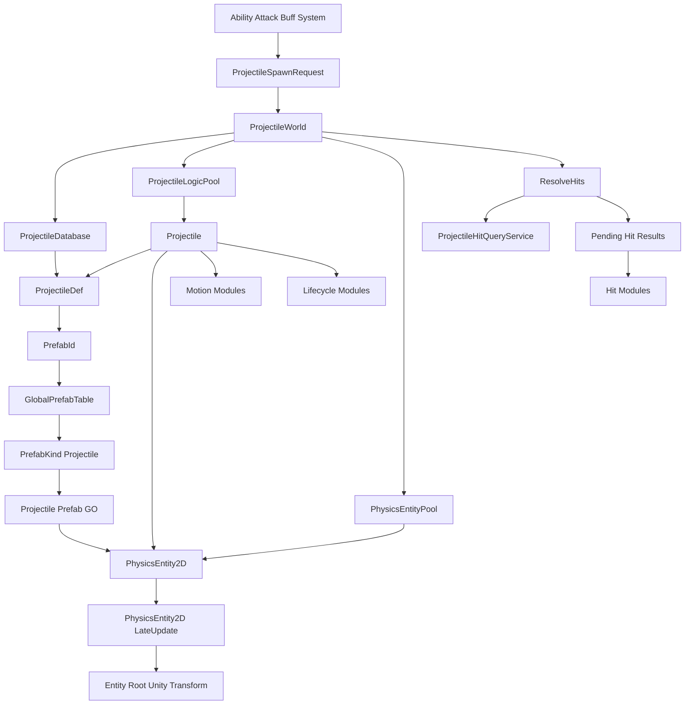
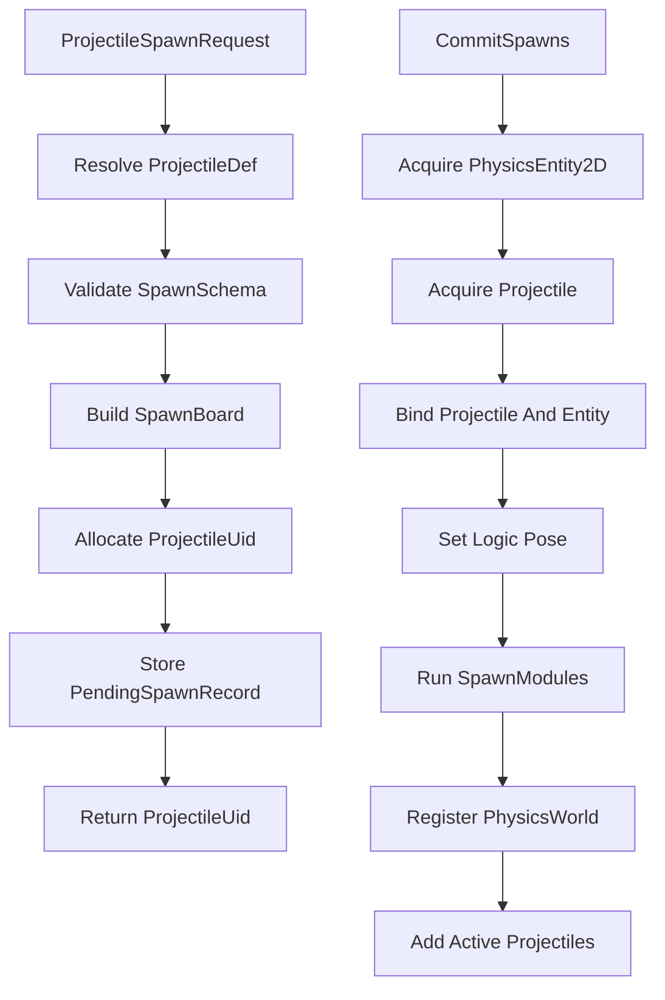
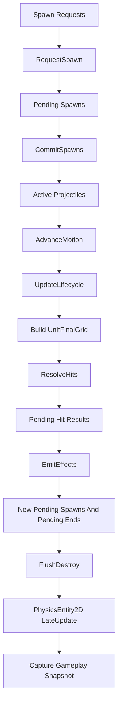

# 帧同步 MOBA / Unity 投掷物系统程序设计案 v19

> 适配基线：单位行为框架 v25、物理与范围查询系统当前冻结版本、第五轮投掷物生成序号规则。  
> 本版重点：删除外部 `已删除的外部投掷物 Seq 重置入口` 依赖；`RequestSpawn` 在内部根据 `SimulationTickContext.Current.Tick` 懒重置投掷物帧内 Seq；序号 Tick 标签与计数状态保持 `Transient`，不进入快照。  
> 本文专注投掷物 Gameplay 系统，不展开具体帧同步协议、表现系统、风墙技能逻辑或复杂调试工具。

---

# 目录

1. [专题一：总体结论与核心关系](#专题一总体结论与核心关系)
2. [专题二：`ProjectileDef` 投掷物逻辑定义](#专题二projectiledef-投掷物逻辑定义)
3. [专题三：`Projectile` 运行时逻辑对象](#专题三projectile-运行时逻辑对象)
4. [专题四：`SpawnBoard` 初始化黑板](#专题四spawnboard-初始化黑板)
5. [专题五：`ProjectileWorld` 请求、提交、Tick 与回收](#专题五projectileworld-请求提交tick-与回收)
6. [专题六：阶段模块与调用边界](#专题六阶段模块与调用边界)
7. [专题七：命中查询、目标过滤与命中记忆](#专题七命中查询目标过滤与命中记忆)
8. [专题八：对象池设计](#专题八对象池设计)
9. [专题九：快照边界与字段标记](#专题九快照边界与字段标记)
10. [专题十：典型投掷物效果组合](#专题十典型投掷物效果组合)
11. [专题十一：性能、确定性与系统边界](#专题十一性能确定性与系统边界)
12. [专题十二：最终模块结构](#专题十二最终模块结构)

---

# 专题一：总体结论与核心关系

## 1.1 系统定位

投掷物不等同于“会飞的箭”。

本系统中的投掷物是具有独立生命周期、空间实体和阶段行为的 Gameplay 实体，可以表现为：

```text
飞行弹体
跟踪弹体
穿透弹体
弹跳弹体
静止区域
持续矩形区域
扩张区域
命中后生成的新区域
完全不移动的空间事件实体
```

投掷物可由技能、普攻、Buff 或系统事件创建，但第一版必须归属于一个 `Unit`。  
暂不考虑归属于世界的投掷物，以降低来源、阵营和结算归属复杂度。

投掷物系统负责：

| 内容 | 说明 |
|---|---|
| 类型解析 | 根据 `ProjectileDef.Id` 取得逻辑定义 |
| 实体生成 | 取得逻辑对象和挂有 `PhysicsEntity2D` 的预制体实例 |
| 运行时身份 | 分配 `ProjectileUid` |
| 初始化 | 构建只读 `SpawnBoard`，绑定空间组件 |
| 行为推进 | 推进运动与生命周期模块 |
| 命中调度 | 在唯一入口统一查询和确认命中 |
| 效果派发 | 对确认命中执行命中模块 |
| 生命周期结束 | 执行结束模块、反注册并回收 |
| 快照聚合 | 聚合本系统会影响后续逻辑 Tick 的运行时状态 |

投掷物系统不负责：

```text
技能是否合法
普攻是否成立
伤害最终公式
Buff 生命周期
单位移动执行
Unity Transform 作为逻辑输入
动画、VFX、音效播放策略
风墙技能如何创建或管理阻挡区域
完整帧同步、回滚和网络协议
```

---

## 1.2 三个核心对象的关系

```text
ProjectileDef
    投掷物类型的静态逻辑定义。
    来自 ProjectileDatabase。
    保存 Id、PrefabId、初始化需求、逻辑规则和阶段模块。
    不保存运行时状态，不保存空间形状，不直接引用 Unity Prefab。

Projectile
    一次投掷物生命周期的纯 C# 逻辑对象。
    不继承 MonoBehaviour，不挂在 GO 上。
    是 Uid、Owner、Team、Source、运行状态和命中记忆的权威拥有者。
    显式引用预制体 GO 上的 PhysicsEntity2D。

Projectile Prefab GO
    由全局运行时实体预制体表通过 PrefabId 解析。
    必须挂载 PhysicsEntity2D MonoBehaviour。
    PhysicsEntity2D 保存位置、朝向、形状和 Bounds。
    GO Transform 只接收 PhysicsEntity2D 的单向同步。
```

一句话：

```text
Def 定义投掷物逻辑。
Projectile 执行一次运行时生命周期。
PhysicsEntity2D 保存这次实例的空间状态。
PrefabId 选择带有 PhysicsEntity2D 的 Unity 预制体。
```

---

## 1.3 核心关系图



## 1.4 权威数据边界

| 数据 | 权威拥有者 |
|---|---|
| `ProjectileUid` | `Projectile` |
| `ProjectileDefId` | `Projectile` |
| `OwnerUnitUid` | `Projectile` |
| `TeamId` | `Projectile` |
| `SourceDescriptor` | `Projectile` |
| 生命周期、速度、命中计数 | `Projectile.State` |
| 同目标命中记录 | `Projectile.HitMemory` |
| 模块运行状态 | `Projectile.ModuleStates` |
| 确定性逻辑姿态、空间形状和派生空间数据 | `PhysicsEntity2D` |
| 实体根 Unity `Transform` | `PhysicsEntity2D.LateUpdate` 的最终输出，不是 Gameplay 权威输入 |

`PhysicsEntity2D` 的正式类型、内部状态和公开接口只由物理与范围查询系统定义。  
投掷物文档只保存组件引用并调用正式物理接口，不再重复声明 `PhysicsTransform2D`、Shape、Bounds 或查询信息的内部结构。

投掷物身份、阵营和业务来源仍由 `Projectile` 权威拥有。  
物理系统如果维护查询镜像，它们也只能是从 `Projectile` 同步得到的派生数据。

## 1.5 空间写入链路

```text
Motion Module
    -> 计算确定性位移或目标姿态
    -> 调用 PhysicsEntity2D 正式逻辑接口
    -> ResolveHits 通过物理查询接口读取空间结果
    -> Gameplay Tick 完成
    -> PhysicsEntity2D.LateUpdate 写实体根 Unity Transform
```

投掷物系统可调用的物理接口以物理设计案为准，例如：

```text
SetLogicPosition
SetLogicPose
ApplyLogicPositionDelta
TeleportLogicPosition
SetLogicForward
SetLogicShape
```

禁止：

```text
Projectile 读取 transform.position 参与逻辑
Motion Module 直接写 Unity Transform
Motion Module 直接写 PhysicsEntity2D 内部字段
投掷物系统手动维护 PreviousPosition、Right 或 Bounds
Unity Physics 结果反向覆盖确定性逻辑姿态
通过表现对象位置决定是否命中
```

# 专题二：`ProjectileDef` 投掷物逻辑定义

## 2.1 定位

`ProjectileDef` 是一种投掷物的唯一静态逻辑定义。

它回答：

```text
这是什么逻辑投掷物？
它使用哪个运行时实体预制体？
生成时需要哪些外部参数？
它如何运动和推进生命周期？
它可以命中哪些单位？
命中后执行哪些逻辑？
结束时执行哪些逻辑？
```

它不回答：

```text
当前实例在哪里？
当前实例命中过谁？
当前实例还剩多少寿命？
当前实例绑定哪个 GO？
当前实例的形状参数是多少？
```

---

## 2.2 核心字段

```text
ProjectileDef
    int Id
    int PrefabId

    ProjectileTags Tags

    SpawnBoardSchema SpawnSchema
    ProjectileLifeRule LifeRule
    ProjectileTargetFilter TargetFilter
    ProjectileHitPolicy HitPolicy

    ProjectileModuleList SpawnModules
    ProjectileModuleList MotionModules
    ProjectileModuleList LifecycleModules
    ProjectileModuleList HitModules
    ProjectileModuleList EndModules
```

字段说明：

| 字段 | 说明 |
|---|---|
| `Id` | 投掷物逻辑配置 ID。技能、普攻和 Buff 通过该 ID 请求生成投掷物 |
| `PrefabId` | 指向全局运行时实体预制体表的编号 |
| `Tags` | 只描述投掷物自身的少量设计语义 |
| `SpawnSchema` | 声明生成黑板允许和必须提供的稳定字段 |
| `LifeRule` | 默认寿命、距离限制和基础结束规则 |
| `TargetFilter` | 单位候选过滤规则 |
| `HitPolicy` | 同目标命中、穿透、弹跳和结束策略 |
| `SpawnModules` | 创建并完成基础绑定后调用一次 |
| `MotionModules` | `AdvanceMotion` 阶段调用 |
| `LifecycleModules` | `UpdateLifecycle` 阶段调用 |
| `HitModules` | 已确认命中后在 `EmitEffects` 阶段调用 |
| `EndModules` | 投掷物结束时调用一次 |

---

## 2.3 为什么内部字段叫 `PrefabId`

公共跨系统契约使用：

```text
GlobalPrefabTable
PrefabKind = Projectile
RuntimeEntityPrefabId
```

但在 `ProjectileDef` 内部已经具有明确的投掷物定义语境，因此字段保持简洁：

```text
ProjectileDef.PrefabId
```

对应关系：

```text
ProjectileDef.PrefabId
    = RuntimeEntityPrefabId
```

解析关系：

```text
ProjectileDef.PrefabId
    -> GlobalPrefabTable
    -> PrefabKind.Projectile
    -> Projectile Prefab GO
```

`PrefabId` 必须满足：

```text
1. 来自公共 GlobalPrefabTable。
2. 条目所属 PrefabKind 必须是 Projectile。
3. 与单位的 RuntimeEntityPrefabId 处于统一稳定编号契约中。
4. 参与构成 ProjectileUid。
5. 不等于表现层 VFX Prefab ID。
6. 不允许使用 Unity InstanceId 或运行时随机编号。
```

`PrefabKind` 是公共代码固定枚举，不通过 Inspector 或配置文件动态创建新类型。  
投掷物系统固定使用：

```text
PrefabKind.Projectile
```

投掷物文档不重复定义 `GlobalPrefabTable` 的表结构、Inspector、ID 范围或自动分配规则，这些由公共 Prefab 契约负责。

## 2.4 `Id` 与 `PrefabId` 不合并

| 编号 | 职责 |
|---|---|
| `ProjectileDef.Id` | 选择投掷物 Gameplay 逻辑配置 |
| `ProjectileDef.PrefabId` | 选择运行时实体预制体，并参与构造 UID |

允许多个逻辑定义复用同一个运行时预制体：

```text
ProjectileDef 1001
    PrefabId 5001
    普通直线飞弹逻辑

ProjectileDef 1002
    PrefabId 5001
    强化直线飞弹逻辑
```

两个定义可以共享同一个 GO 结构和 `PhysicsEntity2D` 初始形状，但使用不同的速度、生命周期、命中模块和效果模块。

---

## 2.5 `Tags` 的严格边界

`ProjectileTags` 可以保留，但只用于投掷物自身的规则识别，例如：

```text
Flying
Area
AttackSource
SpellSource
Persistent
```

禁止用 `Tags` 表达：

```text
运动方式
是否会命中
是否穿透
是否弹跳
是否能被某个技能阻挡
目标单位分类
空间形状
生命周期阶段
```

这些应分别由模块、命中策略、技能系统和 `PhysicsEntity2D` 表达。

外部规则读取 `Tags` 时，必须明确它读取的是投掷物设计语义，而不是物理能力推导结果。

---

## 2.6 明确删除的字段

`ProjectileDef` 不保存：

```text
ProjectileKind
Traits
Visual
PresentationPrefabId
CanBeBlockedByProjectileWall
ParentProjectile
RandomSeed
Shape
ShapeTemplate
PhysicsShape2D
Position
Direction
TargetUnit Runtime Reference
GameObject
Unity Prefab Reference
```

说明：

| 删除项 | 原因 |
|---|---|
| `ProjectileKind` | 容易与模块组合冲突 |
| `Traits` | 推导成本高，且可能与真实模块不一致 |
| `Visual` | 表现配置另行设计 |
| `CanBeBlockedByProjectileWall` | 风墙规则属于技能系统 |
| `Shape` | 空间形状由预制体上的 `PhysicsEntity2D` 负责 |
| Unity Prefab 引用 | 通过 `PrefabId` 查全局表 |
| Parent / Seed | 当前没有父子生命周期；随机由确定性随机模块负责 |

---

## 2.7 空间形状来源

`ProjectileDef` 不保存形状。

投掷物初始空间配置来自：

```text
ProjectileDef.PrefabId
    -> GlobalPrefabTable
    -> PrefabKind.Projectile
    -> Projectile Prefab GO
    -> PhysicsEntity2D
```

具体 Shape 数据结构、Authoring 和恢复规则由物理系统定义，投掷物文档不重复声明。

如果运行时需要变形、扩张或切换形状，对应模块只能调用物理系统正式接口：

```text
PhysicsEntity2D.SetLogicShape(...)
```

例如：

```text
ExpandAreaModule
SetRectSizeModule
SwitchToPointSweepModule
RotateSegmentModule
```

模块修改的是运行时物理实体状态，不反向修改 `ProjectileDef`。

# 专题三：`Projectile` 运行时逻辑对象

## 3.1 定位

`Projectile` 表示一次真实投掷物生命周期。

它是纯 C# Gameplay 对象：

```text
不继承 MonoBehaviour
不挂在 GameObject 上
不依赖 Unity Update
不通过 GetComponent 查找自身空间组件
```

`ProjectileWorld` 在生成阶段取得 `PhysicsEntity2D` 后，将两者显式绑定。

---

## 3.2 核心结构

```text
Projectile
    ProjectileUid Uid
    int DefId
    ProjectileDef Def

    UnitUid OwnerUnitUid
    Unit Owner
    TeamId Team
    ProjectileSourceDescriptor Source

    PhysicsEntity2D Entity

    SpawnBoard Board
    ProjectileState State
    ProjectileHitMemory HitMemory
    ProjectileModuleStateSet ModuleStates
```

字段说明：

| 字段 | 说明 |
|---|---|
| `Uid` | 本次生命周期的运行时唯一 ID |
| `DefId` | 用于重新解析静态定义 |
| `Def` | 当前只读逻辑定义 |
| `OwnerUnitUid` | 归属单位 UID |
| `Owner` | 当前解析出的单位引用 |
| `Team` | 投掷物业务阵营快照 |
| `Source` | 技能、普攻、Buff 或系统事件来源 |
| `Entity` | 预制体 GO 上的 `PhysicsEntity2D` |
| `Board` | 本次生成的只读初始化黑板 |
| `State` | 生命周期与公共运行状态 |
| `HitMemory` | 同目标命中记录 |
| `ModuleStates` | 模块所需的强类型或固定槽位运行状态 |

---

## 3.3 `ProjectileUid`

```text
ProjectileUid
    int SpawnLogicTick
    int RuntimeEntityPrefabId
    byte SpawnSequenceInTick
```

构成规则：

```text
ProjectileUid
    = SpawnLogicTick
    + RuntimeEntityPrefabId
    + SpawnSequenceInTick
```

字段来源：

| 字段 | 来源 |
|---|---|
| `SpawnLogicTick` | `RequestSpawn` 成功接受请求并预分配 UID 时的 `SimulationTickContext.Current.Tick` |
| `RuntimeEntityPrefabId` | `ProjectileDef.PrefabId` |
| `SpawnSequenceInTick` | `ProjectileWorld` 在本 Tick 内部依次分配的投掷物生成序号 |

`SpawnLogicTick` 表示本次投掷物身份被确定性签发的请求 Tick。  
它不要求 `Projectile` 与 `PhysicsEntity2D` 已经在该 Tick 完成实例创建。

因此：

```text
CommitSpawns 前请求
    Uid.SpawnLogicTick = 当前 Tick
    当前 Tick 创建

CommitSpawns 后请求
    Uid.SpawnLogicTick = 当前 Tick
    下一 Tick 创建
```

`CommitSpawns` 必须沿用请求中已经预分配的 UID，不能把其中的 Tick 改成实际创建 Tick。

要求：

```text
同一个实体销毁后不得复用 Uid。
对象池复用不等于身份复用。
单位和投掷物的 RuntimeEntityPrefabId 共用同一全局编号空间。
Uid 不依赖 GameObject InstanceId、内存地址或随机 GUID。
```

投掷物系统不额外维护第二套不兼容的 UID 规则。

同一 Tick 内所有投掷物生成请求共用 `ProjectileWorld` 自己的一套 `SpawnSequenceInTick`，不按 `PrefabId` 分别计数，也不使用跨系统共享序号。

类型必须统一：

```text
ProjectileUid.SpawnSequenceInTick
PendingSpawnRecord 中的 Uid Seq
快照序列化中的 ProjectileUid Seq
PhysicsEntity2D 查询身份镜像中的 Projectile Uid Seq
    全部使用 byte
```

不得在序列化层或物理查询镜像中重新扩展为另一种 Seq 类型。

---

## 3.4 `ProjectileState`

推荐公共状态：

```text
ProjectileState
    ProjectileLifeState LifeState

    int AgeTicks
    int RemainingTicks

    fp Speed
    fp TravelDistance

    UnitUid TargetUnitUid
    fp2 TargetPoint
    fp2 TargetDirection

    int TotalHitCount
    int RemainingPierceCount
    int RemainingBounceCount

    bool EndRequested
    ProjectileEndReason EndReason
```

`ProjectileLifeState` 第一版保持简单：

```text
Active
PendingEnd
```

说明：

| 字段 | 说明 |
|---|---|
| `AgeTicks` | 已存在 Tick 数 |
| `RemainingTicks` | 剩余寿命 |
| `Speed` | 当前公共速度；复杂运动可使用模块状态 |
| `TravelDistance` | 累计移动距离 |
| `TargetUnitUid` | 跟踪或锁定目标 |
| `TargetPoint` | 目标点 |
| `TargetDirection` | 固定方向或初始化方向 |
| `RemainingPierceCount` | 剩余可穿透次数 |
| `RemainingBounceCount` | 剩余弹跳次数 |
| `EndRequested` | 是否已经请求结束 |
| `EndReason` | 生命周期、命中、距离、目标失效或外部取消等原因 |

并非所有投掷物都使用全部字段。  
模块专用状态继续放在 `ModuleStates`，避免把所有特殊运动参数都塞进 `ProjectileState`。

---

## 3.5 `Projectile` 不保存的内容

```text
GameObject 独立字段
Unity Transform
第二套逻辑位置
第二套朝向
第二套空间形状
第二套 Bounds
表现播放状态
物理候选列表
```

GO 可以通过：

```text
projectile.Entity.gameObject
```

访问，但 Gameplay Tick 不读取 GO `Transform` 作为逻辑数据。

空间读取和写入统一通过物理系统为 `PhysicsEntity2D` 冻结的正式接口。  
投掷物文档不依赖其内部字段布局。

---

## 3.6 空间写入边界

运动模块只负责计算确定性运动结果，并按语义调用：

```text
ApplyLogicPositionDelta
SetLogicPosition
SetLogicPose
TeleportLogicPosition
SetLogicForward
SetLogicShape
```

具体选用哪个接口，由运动语义决定：

| 运动语义 | 推荐接口 |
|---|---|
| 常规增量移动 | `ApplyLogicPositionDelta` |
| 设置完整位置与朝向 | `SetLogicPose` |
| 瞬移 | `TeleportLogicPosition` |
| 只调整朝向 | `SetLogicForward` |
| 动态改变区域形状 | `SetLogicShape` |

`PreviousPosition`、派生方向、Bounds 和其它物理内部状态由物理系统接口维护。

禁止：

```text
读取或写入 Unity Transform 参与 Gameplay
调用 Unity Physics 决定投掷物位置
直接写 PhysicsEntity2D 内部 Transform 或 Shape 字段
把位置副本长期保存在 Projectile.State
由 ProjectileDef 保存运行时空间状态
```

# 专题四：`SpawnBoard` 初始化黑板

## 4.1 定位

`SpawnBoard` 是投掷物本次生成时的只读参考书。

它解决：

```text
不同投掷物的初始化条件不同。
ProjectileDef 不应混入目标点、蓄力比例、技能等级等运行时参数。
模块不应直接长期引用 AbilitySession、AttackRuntime 或 BuffRuntime。
```

外部系统提交 `ProjectileSpawnRequest`，`ProjectileWorld` 按 `SpawnSchema` 构建 `SpawnBoard`。  
生成后，模块只能读取 Board，不能随意修改。

---

## 4.2 黑板不是任意对象字典

禁止：

```text
Dictionary<string, object>
任意字符串键
运行时反射取值
Unity Object 作为 Gameplay 值
```

推荐使用稳定 Key ID 和确定性值类型：

```text
Int
Bool
Fp
Fp2
UnitUid
ProjectileUid
StableConfigId
```

`SpawnBoardSchema` 负责声明：

```text
KeyId
ValueKind
Required
Lifetime
DefaultValue 可选
```

---

## 4.3 字段生命周期

每个黑板字段标记为：

| 生命周期 | 说明 |
|---|---|
| `InitOnly` | 只在 SpawnModules 中读取，完成初始化后不再保留 |
| `RuntimeRead` | 后续 Motion、Lifecycle、Hit 或 End 模块仍会读取 |

这样可避免所有初始化参数无条件跟随投掷物整个生命周期。

快照规则：

```text
InitOnly
    Spawn 结束后丢弃，不进入快照。

RuntimeRead
    如果会影响后续逻辑 Tick，则进入 ProjectileSnapshot。
```

---

## 4.4 常见稳定字段

```text
OwnerUnitUid
StartPosition
StartDirection
TargetUnitUid
TargetPoint
ChargeRatio
AbilityLevel
SegmentIndex
ShotIndex
CastSessionId
CustomStableKey Values
```

不建议保存 `Unit` 强引用作为黑板权威值。  
跨 Tick 目标引用保存 `UnitUid`，使用时通过 `UnitRegistry` 解析。

---

## 4.5 与 `PhysicsEntity2D` 的关系

Board 可以提供初始空间输入：

```text
StartPosition
StartDirection
```

`ProjectileWorld` 在 `CommitSpawns` 阶段通过物理正式接口初始化：

```text
PhysicsEntity2D.SetLogicPose(...)
```

Board 不拥有运行时位置。

初始空间形状来自 Prefab GO 上的物理配置，不来自 Board 或 `ProjectileDef`。  
如需根据蓄力或技能等级改变形状，由 SpawnModules 调用：

```text
PhysicsEntity2D.SetLogicShape(...)
```

投掷物文档不声明这些接口内部如何更新 PreviousPosition、派生方向或 Bounds。

## 4.6 初始化请求与提交

`RequestSpawn` 不立即创建 `Projectile` 或取得 `PhysicsEntity2D`。  
它先把外部输入冻结成一个确定性的待生成记录。



因此：

```text
SpawnBoard 在 RequestSpawn 时完成构建并冻结。
Projectile 和 PhysicsEntity2D 在 CommitSpawns 时才真正取得。
```

这保证调用者在生成尚未提交时也能获得稳定 `ProjectileUid`，同时不会在任意业务调用栈中修改活跃投掷物集合。

---

# 专题五：`ProjectileWorld` 请求、提交、Tick 与回收

## 5.1 定位

`ProjectileWorld` 是投掷物系统的运行时根对象。

它负责：

```text
接收延迟生成请求
静态定义解析与请求校验
预分配 ProjectileUid
待生成状态查询
逻辑对象与空间组件绑定
激活投掷物管理
固定 Tick 阶段调度
唯一命中入口
效果派发
结束与对象池回收
快照聚合
```

它不负责物理空间算法本身，也不负责战斗结算公式。

---

## 5.2 核心数据

```text
ProjectileWorld
    ProjectileDatabase Database
    ProjectileLogicPool LogicPool
    PhysicsEntityPool EntityPool

    int SpawnSequenceTick
    byte NextSpawnSequenceInTick
    bool SpawnSequenceExhausted

    PendingSpawnQueue PendingSpawns
    PendingSpawnIndex PendingSpawnByUid

    ActiveProjectileCollection ActiveProjectiles
    ProjectileRegistry ActiveRegistry

    PendingHitBuffer PendingHits
    PendingEndBuffer PendingEnds
```

说明：

| 数据 | 说明 |
|---|---|
| `SpawnSequenceTick` | 当前帧内 Seq 计数器所对应的逻辑 Tick；它只是计数器标签，不是第二套系统时钟 |
| `NextSpawnSequenceInTick` | 当前 `SpawnSequenceTick` 下下一次成功生成请求使用的 Seq |
| `SpawnSequenceExhausted` | 当前 Tick 的 `byte` 序号是否已经耗尽 |
| `PendingSpawns` | 已分配 UID、尚未提交创建的请求，按 UID 中的请求 Tick 与帧内 Seq 排列 |
| `PendingSpawnByUid` | `ProjectileUid -> PendingSpawnRecord`，用于查询 `Pending` |
| `ActiveProjectiles` | 当前参与 Tick 的投掷物 |
| `ActiveRegistry` | `ProjectileUid -> Projectile`，只包含 `Active` 实例 |
| `PendingHits` | `ResolveHits` 产生、`EmitEffects` 消费的临时结果 |
| `PendingEnds` | 本 Tick 请求结束的投掷物 |

`SpawnSequenceTick / NextSpawnSequenceInTick / SpawnSequenceExhausted` 共同组成投掷物系统内部的帧内生成序号状态。

它们具有以下边界：

```text
只在 RequestSpawn / UID 分配入口中使用。
不作为 ProjectileWorld 当前时钟。
不参与外部 Tick 调度。
不按 PrefabId 分组。
不进入 Tick 末快照。
```

本版不维护：

```text
DestroyedRecords
Projectile Tombstone
已销毁 UID 历史集合
```

一个 UID 既不在待生成索引中，也不在活跃注册表中时，外部统一视为 `Missing`。

## 5.3 Spawn 输入

```text
ProjectileSpawnRequest
    int ProjectileDefId
    UnitUid OwnerUnitUid
    ProjectileSourceDescriptor Source
    SpawnBoardInput Input
```

说明：

| 字段 | 说明 |
|---|---|
| `ProjectileDefId` | 选择投掷物逻辑定义 |
| `OwnerUnitUid` | 归属单位 |
| `Source` | 来源类型、来源配置 ID、会话或段数等稳定信息 |
| `Input` | 用于构建 SpawnBoard 的外部稳定参数 |

第一版不接受：

```text
World Owner
Parent Projectile
Random Seed
Unity Transform
任意 object Params
```

---

## 5.4 `RequestSpawn`：延迟生成请求

统一入口：

```text
ProjectileUid ProjectileWorld.RequestSpawn(
    ProjectileSpawnRequest request
)
```

接口不传递 `SimulationTickContext`。  
`RequestSpawn` 在函数内部统一读取：

```text
SimulationTickContext.Current.Tick
```

`RequestSpawn` 只执行：

```text
1. 根据 ProjectileDefId 查询 ProjectileDatabase。
2. 校验 OwnerUnitUid、Def.PrefabId 和 SpawnSchema。
3. 把 SpawnBoardInput 转换为确定性只读 SpawnBoard。
4. 读取当前请求 Tick。
5. 确保内部 Seq 状态已经切换到当前 Tick。
6. 使用 NextSpawnSequenceInTick 分配本 Tick 内部 Seq。
7. 构造最终 ProjectileUid。
8. 创建 PendingSpawnRecord。
9. 写入 PendingSpawns 与 PendingSpawnByUid。
10. 返回 ProjectileUid。
```

### Tick 内 Seq 懒重置

`ProjectileWorld` 不再依赖外部 Tick 起始重置函数。

在第一次处理某个 Tick 的成功生成请求时：

```text
currentTick = SimulationTickContext.Current.Tick

if SpawnSequenceTick != currentTick
    SpawnSequenceTick = currentTick
    NextSpawnSequenceInTick = 0
    SpawnSequenceExhausted = false
```

随后每次成功接受请求：

```text
使用当前 NextSpawnSequenceInTick
然后推进到下一个 Seq
```

规则：

```text
请求校验失败
    不切换序号状态
    不消耗 Seq

同一 Tick 内不同 PrefabId
    共用 ProjectileWorld 的同一套 Seq

第一个成功请求
    Seq = 0

超过 byte 可表达范围
    产生确定性溢出错误
    禁止回绕
```

`SpawnSequenceTick` 不是第二套 Tick 来源。  
当前 Tick 的唯一权威仍然是：

```text
SimulationTickContext.Current.Tick
```

它不执行：

```text
取得 Projectile
取得 PhysicsEntity2D
激活 GameObject
注册 PhysicsWorld
加入 ActiveProjectiles
执行 SpawnModules
```

请求校验失败时：

```text
返回 ProjectileUid.Invalid
不写入 PendingSpawns
不消耗 SpawnSequenceInTick
```

请求成功后立即得到稳定 UID，但实例状态仍是：

```text
Pending
```

只有 `CommitSpawns` 完成后才变成：

```text
Active
```

## 5.5 待生成记录

```text
PendingSpawnRecord
    ProjectileUid Uid
    int ProjectileDefId

    UnitUid OwnerUnitUid
    TeamId TeamSnapshot
    ProjectileSourceDescriptor Source

    SpawnBoard Board
```

说明：

| 字段 | 说明 |
|---|---|
| `Uid` | `RequestSpawn` 时预分配的最终投掷物 UID；已经包含请求 Tick、PrefabId 和本 Tick Seq |
| `ProjectileDefId` | 提交时选择的逻辑配置 |
| `OwnerUnitUid` | 归属单位 |
| `TeamSnapshot` | 提交时取得的业务阵营快照 |
| `Source` | 来源溯源 |
| `Board` | 已校验并冻结的初始化黑板 |

不再额外保存：

```text
SubmitLogicTick
ProjectileUid.SpawnSequenceInTick
EffectiveSpawnTick
CommitTick
```

请求 Tick 与稳定帧内顺序已经由 `ProjectileUid.SpawnLogicTick` 和 `ProjectileUid.SpawnSequenceInTick` 表达。

`PendingSpawnRecord` 不保存：

```text
Projectile 引用
PhysicsEntity2D 引用
GameObject 引用
Unity Transform
```

---

## 5.6 外部状态查询

外部直接使用 `ProjectileUid` 查询，不增加额外句柄。

```text
ProjectileLookupState
    Missing
    Pending
    Active
```

语义：

| 状态 | 含义 |
|---|---|
| `Missing` | 无效 UID、从未接受过、待生成请求已取消，或投掷物已经销毁 |
| `Pending` | 已接受请求并分配 UID，但尚未执行 `CommitSpawns` |
| `Active` | 已创建 `Projectile`、绑定 `PhysicsEntity2D` 并加入活跃注册表 |

查询接口：

```text
ProjectileLookupState GetState(ProjectileUid uid)

bool TryGetActive(
    ProjectileUid uid,
    out Projectile projectile
)
```

查询顺序：

```text
1. ActiveRegistry 包含 UID
       -> Active

2. PendingSpawnByUid 包含 UID
       -> Pending

3. 其它情况
       -> Missing
```

`TryGetActive` 只在 `Active` 状态返回当前 Tick 临时可用的 `Projectile` 引用。

外部规则：

```text
跨 Tick 保存 ProjectileUid。
不得跨 Tick 保存 Projectile 引用。
```

本版有意合并：

```text
从未存在
曾经存在但已销毁
```

因此销毁后不会保留墓碑记录，也不能再查询结束原因或销毁 Tick。

---

## 5.7 `CommitSpawns`：唯一实例创建入口

```text
ProjectileWorld.CommitSpawns()
```

是唯一真正创建投掷物实例的入口。

固定流程：

```text
1. 按 ProjectileUid.SpawnLogicTick、SpawnSequenceInTick 的稳定顺序遍历本次可提交记录。
2. 根据 ProjectileDefId 重新取得 ProjectileDef。
3. 读取 Def.PrefabId。
4. 从 PhysicsEntityPool 对应池取得 PhysicsEntity2D。
5. 从 LogicPool 取得 Projectile。
6. 使用 PendingSpawnRecord 中已经分配的 Uid 初始化 Projectile。
7. 解析 OwnerUnitUid，恢复 Owner 临时引用。
8. 显式绑定 Projectile 与 PhysicsEntity2D。
9. 通过物理正式接口绑定查询身份并设置初始逻辑姿态。
10. 执行 SpawnModules；需要改变空间状态时继续调用物理正式接口。
11. 注册 PhysicsWorld。
12. 写入 ActiveRegistry。
13. 加入 ActiveProjectiles。
14. 从 PendingSpawnByUid 和 PendingSpawns 移除记录。
```

提交完成后必须满足：

```text
projectile.Uid == pending.Uid
projectile.Entity == entityFromPrefabPool

entity.Owner == projectile
entity.UidSnapshot == projectile.Uid
entity.TeamSnapshot == projectile.Team
entity.Kind == Projectile
```

`Projectile` 不通过 `GetComponent<PhysicsEntity2D>()` 查找实体。  
组件查找只允许由池创建函数或预制体加载校验阶段完成一次。

如果一个已经接受的请求被 Gameplay 规则显式取消：

```text
从 PendingSpawns 和 PendingSpawnByUid 移除
不创建实例
之后 GetState(uid) 返回 Missing
```

预制体缺失、对象池无法创建或静态表不一致不应成为普通 Gameplay 分支，应视为配置或运行环境错误，避免不同客户端产生不同结果。

---

## 5.8 固定 Tick 边界

投掷物 Tick 必须拆分为以下固定阶段：

```text
ProjectileWorld.CommitSpawns()
ProjectileWorld.AdvanceMotion()
ProjectileWorld.UpdateLifecycle()

PhysicsWorld.BuildUnitFinalGrid()
UnitCollisionEventBuffer.DetectEnterExit()

ProjectileWorld.ResolveHits()
ProjectileWorld.EmitEffects()
ProjectileWorld.FlushDestroy()
```

不再存在外部投掷物 Seq 起始重置入口，也不允许：

```text
在 CommitSpawns 开头重置 Seq
在 FlushDestroy 结尾重置 Seq
由 FrameSync Pipeline 主动重置投掷物 Seq
```

原因是投掷物请求可能来自同一 Tick 的多个阶段：

```text
CommitSpawns 之前：
    Ability
    Attack
    Buff
    其它单位子系统

CommitSpawns 之后：
    HitModule
    EndModule
    其它后续 Gameplay 反应
```

任何单独的投掷物阶段函数都无法安全包住本 Tick 的全部 `RequestSpawn`。  
因此 Seq 只在 `RequestSpawn` 内根据 `SimulationTickContext.Current.Tick` 懒重置。

全局推荐顺序：

```text
1. 设置 SimulationTickContext.Current。
2. 单位行为、技能、普攻、Buff 等系统提交本 Tick 的生成请求。
3. 单位移动与空间修正完成。
4. ProjectileWorld.CommitSpawns。
5. ProjectileWorld.AdvanceMotion。
6. ProjectileWorld.UpdateLifecycle。
7. PhysicsWorld.BuildUnitFinalGrid。
8. UnitCollisionEventBuffer.DetectEnterExit。
9. ProjectileWorld.ResolveHits。
10. ProjectileWorld.EmitEffects。
11. ProjectileWorld.FlushDestroy。
12. Gameplay 逻辑结束后，由激活实体各自的 PhysicsEntity2D.LateUpdate 写入实体根 Unity Transform。
13. Tick 末保存 GameplaySnapshot，SnapshotTick = 当前 Tick + 1。
```

`SimulationTickContext` 不作为这些接口的参数。  
各函数需要 Tick、DeltaTick 或执行模式时，统一在内部读取：

```text
SimulationTickContext.Current.Tick
SimulationTickContext.Current.DeltaTick
SimulationTickContext.Current.ExecutionMode
```

禁止 `ProjectileWorld` 自行保存第二套当前 Tick。

`SpawnSequenceTick` 仅是 Seq 计数器所对应的 Tick 标签，不用于驱动模拟，也不能替代 `SimulationTickContext.Current.Tick`。

`PhysicsWorld.BuildUnitFinalGrid()` 由顶层 Gameplay Tick 调度，不由 `ProjectileWorld` 内部调用。

本 Tick 在 `CommitSpawns` 之后产生的新请求保持 `Pending`，在下一逻辑 Tick 的 `CommitSpawns` 中创建，但其 `ProjectileUid.SpawnLogicTick` 仍是请求被接受时的 Tick。

## 5.9 `AdvanceMotion`

该阶段只处理：

```text
运动
朝向
跟踪
距离累计
运行时 Shape 变化
Bounds 更新
```

调用：

```text
ProjectileDef.MotionModules
```

不允许：

```text
命中查询
执行伤害
直接回收投掷物
构建 UnitFinalGrid
写 Unity Transform
```

完全不运动的投掷物可以没有 MotionModules。  
静止不是一种必须额外实现的“运动类型”。

---

## 5.10 `UpdateLifecycle`

该阶段处理：

```text
AgeTicks
RemainingTicks
目标有效性
最大飞行距离
生命周期阶段
结束条件
```

调用：

```text
ProjectileDef.LifecycleModules
```

模块可以调用：

```text
RequestEnd(reason)
```

但不能当场从 ActiveProjectiles 删除对象。

---

## 5.11 `ResolveHits`：唯一命中入口

`ResolveHits` 是整个系统唯一允许调用 `ProjectileHitQueryService` 的阶段。

固定流程：

```text
1. 按稳定顺序遍历 ActiveProjectiles。
2. 跳过 PendingEnd 且规则不允许继续命中的投掷物。
3. 判断本 Tick 是否达到命中查询间隔。
4. 调 ProjectileHitQueryService 查询候选。
5. 应用 ProjectileTargetFilter。
6. 应用 HitMemory 和 HitPolicy。
7. 生成稳定排序后的 ProjectileHitResult。
8. 写入 PendingHitBuffer。
```

禁止：

```text
MotionModule 调命中查询
LifecycleModule 调命中查询
HitModule 再次调命中查询
帧同步系统重复调用命中检测
表现层触发 Gameplay 命中
```

这样可确保一个投掷物在同一逻辑 Tick 中不会因多个入口重复命中。

---

## 5.12 `EmitEffects`

该阶段消费 `PendingHitBuffer`。

对每个已确认命中：

```text
1. 更新 ProjectileHitMemory。
2. 更新总命中数、穿透计数或弹跳计数。
3. 依次执行 Def.HitModules。
4. 根据 HitPolicy 请求结束、继续穿透或生成弹跳目标。
5. 新投掷物统一调用 RequestSpawn，获得预分配 ProjectileUid。
```

HitModules 可以提交：

```text
DamageRequest
HealRequest
ShieldRequest
Buff Apply Request
Control Request
ProjectileSpawnRequest
Projectile End Request
```

HitModules 不直接修改：

```text
Unit 当前生命
Unit 逻辑位置
PhysicsWorld 网格
ActiveProjectiles 集合
```

由于本 Tick 的 `CommitSpawns` 已经完成，HitModules 新提交的投掷物保持 `Pending`，从下一逻辑 Tick 开始参与投掷物阶段。

---

## 5.13 `FlushDestroy`

该阶段统一处理已请求结束的投掷物：

```text
1. 按稳定 Uid 顺序整理 PendingEnds。
2. 对每个投掷物执行 EndModules 一次。
3. EndModules 产生的新投掷物统一调用 RequestSpawn。
4. 从 PhysicsWorld 反注册 Entity。
5. 从 ActiveRegistry 移除 Uid。
6. 从 ActiveProjectiles 移除。
7. 清理 Entity 查询快照与运行时空间状态。
8. 清理 Projectile 运行时状态。
9. 释放 Projectile 到 LogicPool。
10. 关闭 Entity 所在 GO。
11. 释放 Entity 到 PrefabId 对应的对象池。
```

销毁后：

```text
ProjectileUid 不会复用。
ActiveRegistry 不再包含该 Uid。
PendingSpawnByUid 也不包含该 Uid。
GetState(uid) 返回 Missing。
```

不保留：

```text
EndLogicTick
EndReason 历史记录
Destroyed Tombstone
```

如某个系统确实需要记录投掷物结束结果，应由该系统在结束事件或效果请求中保存自己的业务结果，而不是把完整历史查询职责压给 `ProjectileWorld`。

---
# 专题六：阶段模块与调用边界

## 6.1 模块组织原则

不再设计一个大而全的 `ProjectileMotionController`。

投掷物功能由阶段模块组合：

```text
SpawnModules
MotionModules
LifecycleModules
HitModules
EndModules
```

模块不声明自己参与哪些阶段。  
模块放在哪个列表，就由对应阶段执行模块调用。

---

## 6.2 阶段模块表

| 模块列表 | 调用者 | 调用时机 | 常见职责 |
|---|---|---|---|
| `SpawnModules` | `ProjectileWorld.CommitSpawns` | 实例绑定完成后一次 | 设置速度、按蓄力改参数、设置目标 |
| `MotionModules` | `AdvanceMotion` | 每逻辑 Tick | 直线、跟踪、旋转、扩张、保持静止 |
| `LifecycleModules` | `UpdateLifecycle` | 每逻辑 Tick | 寿命、距离、目标失效、阶段切换 |
| `HitModules` | `EmitEffects` | 每个已确认命中 | 伤害、Buff、控制、生成新投掷物 |
| `EndModules` | `FlushDestroy` | 结束时一次 | 结束结算、生成结束区域 |

---

## 6.3 不存在独立 HitCheck 模块

命中查询不是可任意配置的行为模块。

错误方向：

```text
StepPipeline
    Move
    HitCheck
    EndCheck
```

正确方向：

```text
AdvanceMotion
    -> MotionModules

UpdateLifecycle
    -> LifecycleModules

ResolveHits
    -> 固定系统入口

EmitEffects
    -> HitModules
```

投掷物是否参与命中查询，由 `ProjectileDef.HitPolicy` 的启用状态和查询间隔决定，而不是由设计师手动塞入一个 `HitCheckModule`。

---

## 6.4 不再设计的阶段

删除：

```text
ShapeStage
FilterStage
PostTickStage
StayEventStage
ProjectileActionRunner
ProjectileEmitter
```

原因：

| 删除项 | 原因 |
|---|---|
| `ShapeStage` | Shape 属于 `PhysicsEntity2D`，需要变化时由当前阶段模块直接修改 |
| `FilterStage` | 常规过滤由统一 `ProjectileTargetFilter` 处理 |
| `PostTickStage` | 临时资源由创建阶段的调用者管理并在同阶段释放 |
| `StayEventStage` | 持续 Stay 事件成本高，命中收益有限 |
| `ActionRunner` | HitModules 和 EndModules 已经有明确调用者 |
| `Emitter` | 投掷物不需要额外事件中心 |

---

## 6.5 模块运行状态

静态模块定义保存在 `ProjectileDef`。  
每个实例的可变状态保存在：

```text
Projectile.ModuleStates
```

原则：

```text
静态参数不复制到每个 Projectile。
运行状态不写回 ProjectileDef。
禁止模块用私有 Unity 对象保存 Gameplay 状态。
禁止使用 Dictionary<string, object>。
```

推荐为需要状态的模块分配稳定模块槽位：

```text
ModuleSlotIndex
ModuleStateKind
Typed Runtime State
```

例如：

| 模块 | 运行状态 |
|---|---|
| 跟踪转向 | 当前丢失目标 Tick、剩余转向延迟 |
| 曲线运动 | 当前曲线 Tick、阶段索引 |
| 弹跳 | 当前目标、已排除目标集合或剩余次数 |
| 扩张区域 | 当前半径阶段或扩张 Tick |
| 周期查询 | 下次允许查询的 LogicTick |

会影响未来逻辑 Tick 的模块状态必须可被 `ProjectileSnapshot` 聚合。

---

# 专题七：命中查询、目标过滤与命中记忆

## 7.1 系统边界

```text
ProjectileWorld.ResolveHits
    决定何时查询并组织命中结果。

ProjectileHitQueryService
    根据 PhysicsEntity2D 和 UnitFinalGrid 计算空间候选和精确重叠。

ProjectileTargetFilter
    根据单位业务身份和状态过滤候选。

ProjectileHitMemory
    判断同目标是否允许再次命中。

HitModules
    对已经确认的命中执行 Gameplay 效果。
```

物理系统不执行 HitModules，也不维护投掷物命中次数。

---

## 7.2 `UnitFinalGrid` 的使用规则

`UnitFinalGrid` 必须包含所有当前有效空间单位。

构建网格时不得提前过滤：

```text
Capability.IsTargetable == false
```

否则投掷物设置：

```text
RequireTargetable = false
```

也无法找到这些单位。

查询时再按具体 `ProjectileTargetFilter` 判断是否允许命中。

---

## 7.3 `ProjectileTargetFilter`

适配单位框架 v20：

```text
ProjectileTargetFilter
    TeamRule
    UnitKindMask

    IncludeSubKindIds
    ExcludeSubKindIds

    IncludePrototypeIds
    ExcludePrototypeIds

    AllowedLifeStates
    RequireTargetable
```

字段说明：

| 字段 | 说明 |
|---|---|
| `TeamRule` | 敌方、友方、自己或全部 |
| `UnitKindMask` | Hero、Minion、Monster、Structure 等稳定大类 |
| `IncludeSubKindIds` | 只允许指定主要子分类 |
| `ExcludeSubKindIds` | 排除指定主要子分类 |
| `IncludePrototypeIds` | 精确允许指定单位原型 |
| `ExcludePrototypeIds` | 精确排除指定单位原型 |
| `AllowedLifeStates` | 允许 Alive、Dying、Dead、Respawning 中哪些状态 |
| `RequireTargetable` | 是否要求 `Capability.IsTargetable` |

不使用：

```text
UnitTags
UnitQueryTraitMask
运行时任意标签集合
```

权威数据来源：

| 过滤数据 | 来源 |
|---|---|
| 阵营 | `Projectile.Team` 与 `Unit.TeamId` |
| 大类 | `Unit.UnitKind` |
| 子分类 | `Unit.UnitSubKindId` |
| 具体原型 | `Unit.UnitPrototypeId` |
| 生命周期 | `Unit.LifeState` |
| 可命中能力 | `Unit.Capability.IsTargetable` |

`PhysicsEntity2D` 只负责通过 `Owner` 回溯到 Unit，不能成为这些单位业务字段的权威来源。

---

## 7.4 `ProjectileHitPolicy`

```text
ProjectileHitPolicy
    bool Enabled
    int QueryIntervalTicks

    HitSameTargetPolicy SameTargetPolicy
    int SameTargetCooldownTicks

    int MaxTotalHitCount
    int InitialPierceCount
    int InitialBounceCount

    bool EndOnFirstValidHit
    bool StopResolvingAfterEndRequested
```

说明：

| 字段 | 说明 |
|---|---|
| `Enabled` | 是否参与命中查询 |
| `QueryIntervalTicks` | 区域类投掷物可降低查询频率 |
| `SameTargetPolicy` | 同目标命中规则 |
| `SameTargetCooldownTicks` | 冷却策略的间隔 |
| `MaxTotalHitCount` | 总命中上限 |
| `InitialPierceCount` | 初始穿透次数 |
| `InitialBounceCount` | 初始弹跳次数 |
| `EndOnFirstValidHit` | 首次有效命中后请求结束 |
| `StopResolvingAfterEndRequested` | 请求结束后是否停止处理后续候选 |

---

## 7.5 同目标命中策略

```text
HitSameTargetPolicy
    Once
    Cooldown
    Unrestricted
```

| 策略 | 说明 |
|---|---|
| `Once` | 同一目标整个生命周期只命中一次 |
| `Cooldown` | 距上次命中达到指定 Tick 后可再次命中 |
| `Unrestricted` | 不限制同目标次数，由总命中数和生命周期约束 |

不设计 `Stay` 事件。

持续区域要实现周期命中时，使用：

```text
ResolveHits 每 Tick 或按 QueryIntervalTicks 查询
+
SameTargetPolicy.Cooldown
```

无需额外维护 Enter、Stay、Exit 三套命中事件。

---

## 7.6 `ProjectileHitMemory`

```text
ProjectileHitMemory
    int TotalHitCount
    PerTargetHitRecordSet Records
```

单目标记录：

```text
PerTargetHitRecord
    UnitUid TargetUid
    int HitCount
    int LastHitLogicTick
```

用途：

```text
Once
    判断是否已有记录。

Cooldown
    判断 CurrentLogicTick - LastHitLogicTick。

Unrestricted
    仍可记录命中计数，供模块和快照使用。
```

`HitMemory` 是 `Projectile` 内部运行时数据：

```text
随 Projectile 一起清理复用。
不单独建立对象池。
不存入 PhysicsEntity2D。
不由 ProjectileHitQueryService 维护。
```

---

## 7.7 命中结果

```text
ProjectileHitResult
    ProjectileUid ProjectileUid
    UnitUid TargetUnitUid
    fp2 HitPosition
    fp HitDistance
    int CandidateOrder
```

`PendingHitBuffer` 中的结果必须稳定排序。

移动 Sweep 投掷物：

```text
1. HitDistance 升序
2. TargetUnitUid 升序
```

静止区域：

```text
TargetUnitUid 升序
```

`CandidateOrder` 只作为同距离条件下的稳定补充，不应依赖哈希表遍历顺序。

---

## 7.8 命中效果边界

HitModules 可以：

```text
提交 DamageRequest
提交 HealRequest
提交 ShieldRequest
提交 Buff 请求
提交 Control 请求
请求生成新投掷物
请求结束当前投掷物
更新 Projectile 自己的模块状态
```

HitModules 不可以：

```text
直接修改 Unit HP
直接写 Unit PhysicsEntity2D 位置
直接调用 Unity Transform
重新执行空间命中查询
修改 ProjectileDef
建立父子投掷物生命周期
```

一个投掷物生成另一个投掷物仅通过：

```text
ProjectileSpawnRequest
```

表达来源关系，不建立父子对象关系。

---

# 专题八：对象池设计

## 8.1 总体结论

对象池基于 Unity：

```text
UnityEngine.Pool.ObjectPool<T>
```

投掷物系统只需要两类池：

```text
ProjectileLogicPool
    ObjectPool<Projectile>

PhysicsEntityPool
    Dictionary<RuntimeEntityPrefabId, ObjectPool<PhysicsEntity2D>>
```

不建立：

```text
ObjectPool<SpawnBoard>
ObjectPool<HitMemory>
ObjectPool<ModuleStateSet>
ObjectPool<List<Unit>>
ObjectPool<List<HitResult>>
```

`SpawnBoard`、`HitMemory` 和 `ModuleStates` 是 `Projectile` 内部可清理复用的数据。  
命中候选和结果缓冲由 World 或查询服务复用，不作为每个投掷物独立对象池。

---

## 8.2 为什么实体池返回 `PhysicsEntity2D`

每个 `PrefabKind.Projectile` 运行时预制体 GO 必须满足公共 Prefab 契约要求，并挂载：

```text
PhysicsEntity2D : MonoBehaviour
```

池的创建函数：

```text
1. 使用 PrefabKind.Projectile 与 RuntimeEntityPrefabId 查询 GlobalPrefabTable。
2. Instantiate Prefab GO。
3. 在加载或首次创建时取得 PhysicsEntity2D。
4. 返回该组件作为池对象。
```

因此：

```text
ObjectPool<PhysicsEntity2D>
```

本质上池化的是该组件所在的整套 GameObject 实例。

获取 GO：

```text
entity.gameObject
```

不需要额外设计：

```text
ProjectileHost
ProjectileHostPrefab
ProjectileGoWrapper
```

---

## 8.3 `PhysicsEntityPool`

```text
PhysicsEntityPool
    RuntimeEntityPrefabId
        -> ObjectPool<PhysicsEntity2D>
```

第一次访问某个 `ProjectileDef.PrefabId` 时创建对应池。

每个池固定绑定一个 `GlobalPrefabTable` 条目，避免：

```text
从错误的池取出不同 GO
回收时找不到原池
同一池混用不同物理预制体
```

回收时使用：

```text
projectile.Def.PrefabId
```

或由池内部保存的稳定 PoolKey 找回原池。

---

## 8.4 获取与释放

获取 `PhysicsEntity2D` 时：

```text
GameObject.SetActive(true)
调用物理系统正式 Pool Acquire / Reset 接口
等待 ProjectileWorld 设置身份绑定和初始逻辑姿态
```

释放时：

```text
PhysicsWorld.Unregister
调用物理系统正式 Pool Release / Reset 接口
GameObject.SetActive(false)
Release 到原 PrefabId 池
```

投掷物系统不声明物理组件内部如何清理查询信息、恢复 Shape、由物理系统维护派生空间数据 或重置逻辑姿态。  
这些细节由物理系统唯一负责，投掷物对象池只调用其正式生命周期接口。

## 8.5 逻辑池

所有 `Projectile` 逻辑对象结构相同，因此使用一个逻辑池：

```text
ObjectPool<Projectile>
```

无需按 PrefabId 分池。

取出时初始化：

```text
Uid
DefId / Def
OwnerUnitUid / Owner
Team
Source
Entity
Board
State
HitMemory
ModuleStates
```

释放前必须清理：

```text
Owner 强引用
Def 强引用
Entity 引用
Board RuntimeRead 槽位
HitMemory
ModuleStates
PendingEnd 状态
```

---

# 专题九：快照边界与字段标记

## 9.1 本专题边界

本设计案只做两件事：

```text
1. 定义 ProjectileWorld 聚合快照的入口。
2. 标记哪些真实运行数据需要帧同步设计师重点审查。
```

本设计案不规定：

```text
快照二进制格式
压缩方式
网络传输协议
恢复点选择
全局回滚顺序
权威帧确认规则
```

---

## 9.2 字段标记

| 标记 | 含义 |
|---|---|
| `Snapshot` | 会影响后续逻辑 Tick，通常需要保存 |
| `Static` | 来自确定性只读配置，通过稳定 ID 重新解析 |
| `Rebuildable` | 恢复后可根据其他状态确定性重建 |
| `Transient` | 只在当前阶段存在，快照点前必须消费或清理 |

---

## 9.3 统一回滚接口与聚合入口

`ProjectileWorld` 作为投掷物快照聚合根，实现：

```csharp
public sealed class ProjectileWorld
    : IRollback<ProjectileWorldSnapshot>
{
    public void Capture(ref ProjectileWorldSnapshot state);
    public void Restore(in ProjectileWorldSnapshot state);
    public void Resolve(in RollbackContext context);
    public void Rebuild(in RollbackContext context);
}
```

聚合关系：

```text
GameplaySnapshot
    ProjectileWorldSnapshot
        PendingSpawnRecordSnapshot[]
        ProjectileSnapshot[]
```

职责：

| 阶段 | `ProjectileWorld` 负责 |
|---|---|
| `Capture` | 捕获待生成请求和活跃投掷物的真实运行状态 |
| `Restore` | 恢复本系统稳定对象和自身状态，不解析跨系统引用 |
| `Resolve` | 通过稳定 UID 修复 Owner、Target、Source 等跨系统引用 |
| `Rebuild` | 重建本系统 Registry、Pending Index 和稳定排序索引 |

顶层帧同步协调器只调用这四个聚合根接口，不直接访问：

```text
Projectile.HitMemory
Projectile.ModuleStates
SpawnBoard 内部槽位
PhysicsEntity2D 内部字段
```

物理派生数据和空间索引由 `PhysicsWorld.Rebuild` 负责，不能由 `ProjectileWorld` 重复重建。

## 9.4 `ProjectileWorldSnapshot`

```text
ProjectileWorldSnapshot
    PendingSpawnRecordSnapshot[] PendingSpawns
    ProjectileSnapshot[] ActiveProjectiles

    ProjectileRegistryRuntimeState 可重建
```

字段规则：

| 字段 | 标记 | 说明 |
|---|---|---|
| `PendingSpawns` | `Snapshot` | UID 已经分配，下一次 `CommitSpawns` 仍需创建 |
| `ActiveProjectiles` | `Snapshot` | 当前所有活跃投掷物 |
| `PendingSpawnByUid` | `Rebuildable` | 从 `PendingSpawns` 重建 |
| `ActiveRegistry` | `Rebuildable` | 从恢复后的活跃 ProjectileUid 重建 |
| `ActiveProjectiles 排序索引` | `Rebuildable` | 按 Uid 重建 |
| `SpawnSequenceTick / NextSpawnSequenceInTick / SpawnSequenceExhausted` | `Transient` | 仅用于 RequestSpawn 内部懒重置和分配，不进入 Tick 末快照 |

本版不保存：

```text
DestroyedRecords
历史 ProjectileUid 墓碑
已销毁投掷物结束原因
```

恢复后，既不在 `PendingSpawns` 也不在 `ActiveProjectiles` 中的 UID 统一查询为 `Missing`。

### `PendingSpawnRecordSnapshot`

```text
PendingSpawnRecordSnapshot
    ProjectileUid Uid
    int ProjectileDefId

    UnitUid OwnerUnitUid
    TeamId TeamSnapshot
    ProjectileSourceDescriptor Source

    SpawnBoardRuntimeSnapshot Board
```

`Uid` 已包含请求 Tick 与该 Tick 内的稳定生成 Seq。  
这些数据已经跨过 `RequestSpawn`，并会影响下一次 `CommitSpawns`，因此必须由 `ProjectileWorldSnapshot` 聚合。

---

## 9.5 `ProjectileSnapshot`

推荐字段：

```text
ProjectileSnapshot
    ProjectileUid Uid
    int ProjectileDefId

    UnitUid OwnerUnitUid
    TeamId Team
    ProjectileSourceDescriptor Source

    PhysicsEntityState PhysicsState
    ProjectileRuntimeSnapshot Runtime
    SpawnBoardRuntimeSnapshot Board
    ProjectileHitMemorySnapshot HitMemory
    ProjectileModuleStateSnapshot ModuleStates
```

### 身份与来源

| 字段 | 标记 | 说明 |
|---|---|---|
| `Uid` | `Snapshot` | 运行时身份 |
| `ProjectileDefId` | `Snapshot` | 恢复静态 Def |
| `Def` 引用 | `Static` | 通过 DefId 解析 |
| `Def.PrefabId` | `Static` | 通过 Def 解析并从 `GlobalPrefabTable` 取得预制体 |
| `OwnerUnitUid` | `Snapshot` | 归属单位 |
| `Owner` 引用 | `Rebuildable` | 在 `Resolve` 中通过 UnitRegistry 解析 |
| `Team` | `Snapshot` | 投掷物业务阵营 |
| `Source` | `Snapshot` | 后续伤害和规则溯源 |

### 物理状态

```text
PhysicsEntityState
```

由物理与范围查询系统唯一正式定义。  
投掷物设计案不再重复列出其内部 Position、PreviousPosition、Forward、Shape 或 Bounds 字段。

边界：

```text
ProjectileWorld
    负责把每个投掷物对应的 PhysicsEntityState
    聚合进 ProjectileSnapshot。

Physics System
    负责定义 PhysicsEntityState 的字段、
    Capture / Restore 语义和派生数据重建规则。
```

这样保持：

```text
快照聚合归 ProjectileWorld。
物理状态契约归 Physics System。
```

`PhysicsEntity2D` 运行时引用仍为 `Rebuildable`：根据 `ProjectileDef.PrefabId` 取得预制体实例并重新绑定。

### 公共运行状态

| 字段 | 标记 |
|---|---|
| `LifeState` | `Snapshot` |
| `AgeTicks` | `Snapshot` |
| `RemainingTicks` | `Snapshot` |
| `Speed` | `Snapshot` |
| `TravelDistance` | `Snapshot` |
| `TargetUnitUid` | `Snapshot` |
| `TargetPoint` | `Snapshot` |
| `TargetDirection` | `Snapshot` |
| `TotalHitCount` | `Snapshot` |
| `RemainingPierceCount` | `Snapshot` |
| `RemainingBounceCount` | `Snapshot` |
| `EndRequested` | `Snapshot` |
| `EndReason` | `Snapshot` |

### Board

| 内容 | 标记 |
|---|---|
| `InitOnly` 槽位 | `Transient` |
| 后续 Tick 会读取的 `RuntimeRead` 槽位 | `Snapshot` |
| Schema | `Static`，通过 Def 解析 |

### 命中记忆

| 字段 | 标记 |
|---|---|
| `TotalHitCount` | `Snapshot` |
| `TargetUid` | `Snapshot` |
| 每目标 `HitCount` | `Snapshot` |
| 每目标 `LastHitLogicTick` | `Snapshot` |

### 模块运行状态

模块状态只保存当前定义真实存在的字段，例如：

```text
曲线运动阶段
下次查询 Tick
跟踪丢失计时
当前弹跳目标
区域扩张 Tick
分段运动索引
```

静态模块配置不保存，通过：

```text
ProjectileDefId + ModuleSlotIndex
```

重新解析。

## 9.6 不进入快照的数据

```text
UnitFinalGrid
RvoGrid
PhysicsWorld 空间桶
Physics 派生 Bounds 与查询缓存
PendingSpawnByUid
ActiveRegistry
ActiveProjectiles 排序索引
Unity GameObject 激活列表
Unity Transform
对象池空闲栈
PendingHitBuffer
命中查询候选缓冲
临时去重集合
ProjectileLookupState 缓存
DestroyedRecords
SpawnSequenceTick
NextSpawnSequenceInTick
SpawnSequenceExhausted
当前函数局部变量
表现事件播放状态
```

恢复阶段：

```text
Restore
    恢复 PendingSpawns。
    恢复 Projectile 自身状态。
    取得并恢复对应 PhysicsEntityState。
    暂不解析跨系统运行时引用。

Resolve
    OwnerUnitUid -> Unit。
    TargetUnitUid -> Unit。
    Source 中稳定 UID -> 对应业务对象。
    ProjectileUid 引用 -> Projectile。

Rebuild
    ProjectileWorld 重建 PendingSpawnByUid、ActiveRegistry 和稳定排序索引。
    把 SpawnSequenceTick 设为 InvalidLogicTick，
    并清空 NextSpawnSequenceInTick 与 SpawnSequenceExhausted。
    PhysicsWorld 重建物理注册、派生 Bounds、RvoGrid 和 UnitFinalGrid。
    `PhysicsEntity2D.LateUpdate` 在 Gameplay 恢复完成后的下一次 Unity LateUpdate 中重新写实体根 Unity Transform。
```

`ProjectileWorld.Rebuild` 不重建物理系统派生数据。

## 9.7 快照点要求

推荐 Gameplay 快照只在完整逻辑 Tick 结束后保存：

```text
当前 Tick 的 CommitSpawns 已完成
ResolveHits 已完成
EmitEffects 已完成
FlushDestroy 已完成
本 Tick 新产生的 RequestSpawn 已进入 PendingSpawns
SnapshotTick = 当前 Tick + 1
```

因此：

```text
PendingSpawns
    会跨到下一 Tick，必须 Snapshot。

PendingHitBuffer
PendingEndBuffer
阶段局部候选列表
SpawnSequenceTick
NextSpawnSequenceInTick
SpawnSequenceExhausted
    不属于 Tick 末持久状态，保持 Transient。
```

销毁历史不进入快照。  
一个已销毁投掷物在恢复后的时间线中如果不再存在，也只会查询为 `Missing`。

如果未来允许在投掷物阶段中间保存快照，则必须重新审查这些缓冲和当前阶段游标，本设计第一版不支持该复杂模式。

---

# 专题十：典型投掷物效果组合

## 10.1 远程普攻飞弹

预制体空间配置：

```text
物理预制体配置 = Point Sweep
```

逻辑组合：

```text
SpawnModules
    设置目标单位
    设置初始速度

MotionModules
    直线移动或轻量跟踪

LifecycleModules
    目标失效检查
    最大寿命检查

HitPolicy
    SameTarget = Once
    EndOnFirstValidHit = true

HitModules
    提交 Attack Source DamageRequest
```

小型弹体直接使用 Point Sweep，不用极小圆形硬凑。

---

## 10.2 普通直线技能弹

空间形状由物理预制体配置为 Point 或 Circle；具体字段由物理系统定义。

```text
MotionModules
    LinearMove

LifecycleModules
    MaxDistance
    RemainingTicks

HitPolicy
    Once
    InitialPierceCount 可配置

HitModules
    SubmitDamage
    ApplyBuff 可选
```

穿透次数属于 `Projectile.State.RemainingPierceCount`，不需要新增一种 ProjectileKind。

---

## 10.3 跟踪投掷物

```text
SpawnBoard
    TargetUnitUid

MotionModules
    ResolveTarget
    TurnTowardTarget
    MoveForward

LifecycleModules
    TargetInvalidPolicy
    MaxLife

HitPolicy
    Once
    EndOnFirstValidHit
```

目标引用跨 Tick 保存 UID，不长期依赖外部 `Unit` 引用。

---

## 10.4 静止矩形区域

预制体空间配置：

```text
物理预制体配置 = Rect
```

逻辑组合：

```text
MotionModules
    无

LifecycleModules
    Duration
    Optional Rotate Or Follow Anchor

HitPolicy
    QueryIntervalTicks
    SameTarget = Cooldown

HitModules
    Damage
    Buff
    Control
```

静止区域仍然是投掷物，因为它具有独立空间实体、生命周期和命中规则。  
“不运动”不需要额外 Motion 类型。

---

## 10.5 飞行投掷物命中后生成框形区域

例如先发射一个飞行实体，命中后创建限制区域：

```text
Projectile A
    Point or Circle
    LinearMove
    HitModule = SubmitSpawnRequest Projectile B
    EndOnFirstValidHit

Projectile B
    Rect Shape From Prefab PhysicsEntity2D
    No Motion
    Duration Lifecycle
    Cooldown Hit Policy
```

A 和 B 没有父子生命周期。

它们只有：

```text
A 的 HitModule 提交 B 的 ProjectileSpawnRequest
B 的 SourceDescriptor 可记录来源技能和触发 Uid
```

A 被回收不会自动回收 B。

---

## 10.6 大范围落地区域或天瀑类效果

```text
Projectile
    初始为静止区域
    或在 SpawnModules 设置落地点

MotionModules
    无
    或更新区域扩张和旋转

LifecycleModules
    预警阶段
    生效阶段
    结束阶段

HitPolicy
    在生效阶段启用
    按规则查询一次或周期查询

HitModules
    范围伤害
    控制
```

不需要把这类效果伪装成“飞行箭矢”。

---

## 10.7 弹跳投掷物

```text
State
    RemainingBounceCount
    CurrentTargetUid

HitModules
    结算当前目标
    选择下一目标
    更新 TargetUnitUid
    RemainingBounceCount--
    重设 Entity Forward
```

下一目标选择必须使用稳定排序：

```text
距离
UnitUid
```

不依赖哈希表或 Unity Physics 返回顺序。

---

# 专题十一：性能、确定性与系统边界

## 11.1 统一 Tick 上下文与禁止项

投掷物系统统一使用：

```text
SimulationTickContext.Current.Tick
SimulationTickContext.Current.DeltaTick
SimulationTickContext.Current.ExecutionMode
```

`SimulationTickContext` 作为当前模拟 Tick 的全局只读上下文使用，不作为 `ProjectileWorld` 或模块接口参数层层传递。

禁止新增：

```text
ProjectileWorld.CurrentTick
GameplayClock.CurrentLogicTick
LogicClock
GlobalCurrentFrame
```

`ExecutionMode` 不得改变确定性 Gameplay 结果。相同配置、输入和快照状态在 `ServerAuthority / ClientPrediction / ClientReplay` 下必须得到相同的投掷物位置、UID、命中和结束状态。

Gameplay Tick 还禁止：

```text
float 参与投掷物逻辑
Time.deltaTime
Unity Physics
Transform.position 作为逻辑输入
Mathf
Vector3.normalized 参与确定性计算
运行时随机 GUID
Unity InstanceId 作为身份
无稳定顺序的 Dictionary 遍历结果
```

运行时逻辑使用：

```text
fp
fp2
整数 LogicTick
稳定配置 ID
ProjectileUid
UnitUid
```

---

## 11.2 稳定遍历顺序

以下操作必须稳定：

```text
ActiveProjectiles 遍历
PendingHitBuffer 消费
PendingEnds 回收
PendingSpawns 提交与 CommitSpawns
弹跳目标选择
同 Tick Uid 序号分配
```

第一版推荐：

```text
ProjectileUid 升序
```

`PendingSpawns` 的提交顺序直接使用：

```text
ProjectileUid.SpawnLogicTick
ProjectileUid.SpawnSequenceInTick
```

不再额外保存 `StableSubmitSequence`。任何遍历都不能依赖线程竞争顺序或容器内部枚举顺序。

---

## 11.3 分配控制

高频 Tick 中避免：

```text
每投掷物每 Tick new List
LINQ
闭包
装箱接口调用
临时 Dictionary
字符串 Key
```

推荐：

```text
World 级复用候选缓冲
World 级复用 PendingHitBuffer
Projectile 内部复用 HitMemory
固定 ModuleState 槽位
Unity ObjectPool
预热常用 PrefabId 的实体池
```

这里的复用缓冲是内部容器，不需要再套一层 `ObjectPool<List<Unit>>`。

---

## 11.4 `PhysicsEntity2D.LateUpdate` Transform 写入边界

当前项目正式冻结：

```text
PhysicsEntity2D.LateUpdate
    是实体根 Unity Transform 的唯一最终写入点。
```

完整链路：

```text
ProjectileWorld.AdvanceMotion
    调用 PhysicsEntity2D 正式逻辑接口
    只修改确定性逻辑姿态

ProjectileWorld.ResolveHits
    通过物理查询服务读取确定性空间结果

ProjectileWorld.FlushDestroy
    反注册并回收已结束 Entity

Unity LateUpdate
    -> 激活并已绑定的 PhysicsEntity2D.LateUpdate
    -> 把最终确定性逻辑姿态写入实体根 Unity Transform
```

约束：

```text
ProjectileWorld 不直接写 Unity Transform。
MotionModule 不直接写 Unity Transform。
其它 Gameplay 组件不得重复写实体根 Transform。
PhysicsEntity2D.LateUpdate 只做逻辑姿态到 Transform 的单向输出。
不得从 Unity Transform 反向读取并覆盖 Gameplay 逻辑姿态。
池中未激活或未绑定的 PhysicsEntity2D 不执行有效同步。
```

回滚恢复后：

```text
Restore / Resolve / Rebuild
    恢复确定性逻辑姿态

下一次 PhysicsEntity2D.LateUpdate
    把恢复后的最终姿态写入 Unity Transform
```

客户端重演不要求每个重演 LogicTick 都执行 Unity `LateUpdate`，因为 Unity Transform 不参与 Gameplay 计算。

## 11.5 与物理系统的边界

物理系统唯一负责定义：

```text
PhysicsEntity2D
PhysicsEntityState
PhysicsShape2D
Bounds
PhysicsEntityQueryInfo

SetLogicPosition
SetLogicPose
ApplyLogicPositionDelta
TeleportLogicPosition
SetLogicForward
SetLogicShape

UnitFinalGrid
ProjectileHitQueryService 的空间检测
物理生命周期 Reset 接口
PhysicsWorld.Rebuild
```

投掷物系统负责：

```text
何时请求移动
如何计算投掷物运动结果
何时请求命中查询
目标业务过滤
同目标命中规则
命中结果消费
效果提交
生命周期和回收
```

投掷物系统不得：

```text
重复声明 PhysicsEntity2D 内部结构
直接写 PhysicsTransform2D 或 Shape 字段
手动维护 Bounds
重建物理空间索引
写 Unity Transform
```

`PhysicsWorld` 不主动 Tick 投掷物，也不主动执行 HitModules。

## 11.6 与单位框架的边界

投掷物查询单位时读取：

```text
UnitUid
TeamId
UnitKind
UnitSubKindId
UnitPrototypeId
LifeState
Capability.IsTargetable
```

不恢复运行时 `UnitTags`。  
不让 `PhysicsEntity2D` 决定单位业务分类。

投掷物造成强制位移或控制时，提交对应系统请求，不直接写单位空间位置。

单位框架采用强类型即时 `UnitEventBus`。投掷物系统不建立统一 `GameplayEventRecord / GameplayEventQueue`，也不动态订阅 C# delegate。

投掷物命中只提交正式业务请求；由真正完成结果结算的系统在结果成立后发布单位事件。例如：

```text
Projectile HitModule
    -> DamageRequest
    -> CombatSystem 完成 DamageResult
    -> Target.UnitEventBus.Publish(DamageTaken)
    -> Source.UnitEventBus.Publish(DamageDealt)
```

`ProjectileWorld` 不直接发布 `DamageTaken / DamageDealt / UnitDeath / UnitKill`。

---

## 11.7 与战斗系统的边界

投掷物命中后只提交基础战斗请求：

```text
DamageRequest
HealRequest
ShieldRequest
```

请求携带：

```text
SourceDescriptor
OwnerUnit
TargetUnit
RecipeId
BaseValue
RuntimeParams
```

最终公式、护盾吸收、死亡和治疗由 CombatSystem 负责。

---

## 11.8 与技能系统的边界

技能系统负责：

```text
决定何时创建投掷物
构建 ProjectileSpawnRequest
提供稳定 SpawnBoardInput
管理技能会话和技能阶段
创建风墙等技能实体及其规则
```

投掷物系统不复制 `AbilitySession` 阶段，也不通过投掷物生命周期反向控制完整技能时间轴。

---

## 11.9 与表现层的边界

当前投掷物设计案只冻结表现事件来源身份：

```text
PresentationEventId.SourceKind = Projectile
PresentationEventId.SourceRuntimeUid = ProjectileUid
```

未来的投掷物创建、命中和结束表现都使用这一来源身份。

投掷物系统不在本文定义：

```text
完整 PresentationEventId 结构
EventSequence 生成规则
具体 Spawn / Hit / End 表现事件类型
播放、去重和回滚重建策略
VFX、SFX 或动画实例池
```

这些由表现层统一设计。

# 专题十二：最终模块结构

## 12.1 投掷物系统内部

```text
ProjectileWorld
ProjectileDatabase
ProjectileDef

Projectile
ProjectileState
ProjectileUid
ProjectileSourceDescriptor

ProjectileSpawnRequest
SpawnBoardSchema
SpawnBoard

ProjectileModuleList
ProjectileModuleStateSet

ProjectileTargetFilter
ProjectileHitPolicy
ProjectileHitMemory
ProjectileHitResult

ProjectileLogicPool
PhysicsEntityPool

ProjectileWorldSnapshot
ProjectileSnapshot
```

---

## 12.2 外部依赖

```text
GlobalPrefabTable
PrefabKind.Projectile

SimulationTickContext
IRollback
RollbackContext

UnitRegistry
Unit
UnitUid
UnitEventBus

PhysicsWorld
PhysicsEntity2D
PhysicsEntityState
PhysicsEntityPool
UnitFinalGrid
ProjectileHitQueryService
PhysicsEntity2D.LateUpdate

CombatSystem
BuffSystem
ControlSystem
AbilitySystem
Presentation System
```

## 12.3 最终主流程



---

## 12.4 最终核心结论

```text
ProjectileDef 是静态逻辑定义。
Projectile 是纯 C# 运行时业务对象。
PhysicsEntity2D 是预制体 GO 上的 MonoBehaviour 空间组件，
其类型、状态和公开接口只由物理系统定义。

ProjectileDef 内部字段保持 PrefabId。
它引用：
    GlobalPrefabTable
    PrefabKind.Projectile。

PrefabKind 是公共代码固定枚举，
投掷物系统不允许动态创建新的 Prefab 类型。

ProjectileDef.PrefabId
    = RuntimeEntityPrefabId。

ProjectileUid 统一为：
    SpawnLogicTick
    + RuntimeEntityPrefabId
    + SpawnSequenceInTick。

RequestSpawn 采用延迟生成：
    校验成功后读取 SimulationTickContext.Current.Tick。
    使用 ProjectileWorld 本 Tick 内部 SpawnSequenceInTick。
    预分配并返回 ProjectileUid。
    实例只在 CommitSpawns 中创建。

ProjectileWorld 不再提供外部 Seq 重置入口。

RequestSpawn 在内部执行懒重置：
    比较 SpawnSequenceTick
    与 SimulationTickContext.Current.Tick。

Tick 变化时：
    SpawnSequenceTick = 当前 Tick
    NextSpawnSequenceInTick = 0
    SpawnSequenceExhausted = false。

SpawnSequence 规则：
    作用域为同 Tick 内全部成功 RequestSpawn。
    ProjectileUid.SpawnSequenceInTick 类型为 byte。
    分配器、序列化与物理查询身份镜像中的 Seq 类型必须一致。
    不按 PrefabId 分别计数。
    超过可表达范围时产生确定性错误并禁止回绕。
    SpawnSequenceTick、NextSpawnSequenceInTick
    和 SpawnSequenceExhausted 都不进入 Tick 末快照。

外部状态查询只区分：
    Missing
    Pending
    Active。

Missing 同时表示：
    从未接受过该 UID
    待生成请求已取消
    投掷物已经销毁。

ProjectileWorld 不保存销毁墓碑，
不区分“从未存在”和“曾存在但已销毁”。

Projectile 不通过 GetComponent 查找空间组件。
ProjectileWorld 从 PhysicsEntityPool 取得 PhysicsEntity2D，
再与 Projectile 显式绑定。

投掷物空间更新只调用物理正式接口：
    SetLogicPosition
    SetLogicPose
    ApplyLogicPositionDelta
    TeleportLogicPosition
    SetLogicForward
    SetLogicShape。

投掷物文档不直接定义或写入：
    PhysicsTransform2D
    Shape 内部字段
    Bounds
    PreviousPosition
    Unity Transform。

ProjectileWorld.ResolveHits
是唯一命中检测入口。

MotionModules 不查命中。
LifecycleModules 不查命中。
HitModules 不重复查命中。

UnitFinalGrid 不提前过滤 IsTargetable。
投掷物目标过滤使用：
    TeamRule
    UnitKind
    UnitSubKindId
    UnitPrototypeId
    LifeState
    Capability.IsTargetable。

投掷物生成另一个投掷物通过 SpawnRequest，
不建立父子投掷物生命周期。

对象池只保留：
    ObjectPool<Projectile>
    PhysicsEntityPool
        Dictionary<RuntimeEntityPrefabId, ObjectPool<PhysicsEntity2D>>。

ProjectileWorld 实现：
    IRollback<ProjectileWorldSnapshot>。

恢复阶段统一为：
    Capture
    Restore
    Resolve
    Rebuild。

ProjectileWorld 聚合：
    PendingSpawnRecordSnapshot
    ProjectileSnapshot
        PhysicsEntityState。

PhysicsEntityState 的正式类型和内部字段由物理系统定义。
ProjectileWorld 负责聚合，
PhysicsWorld 负责物理派生数据重建。

Pending 状态可由 PendingSpawns 恢复。
Pending 记录直接使用 UID 中的请求 Tick 与 Seq。
Active 状态可由 ActiveProjectiles 恢复。
其它 UID 统一为 Missing，不保存 DestroyedRecords。

恢复后把本地 SpawnSequence 状态设为无效，
下一次 RequestSpawn 再根据当前 SimulationTickContext.Current.Tick 初始化。

所有投掷物阶段接口保持无 SimulationTickContext 参数，
需要 Tick 时在函数内部统一读取 SimulationTickContext.Current。

单位业务结果事件遵循单位框架 v25 的强类型即时 UnitEventBus，
投掷物系统不接入统一 GameplayEventQueue。

未来投掷物表现事件只冻结：
    PresentationEventId.SourceKind = Projectile
    PresentationEventId.SourceRuntimeUid = ProjectileUid。

实体根 Unity Transform
    只由 PhysicsEntity2D.LateUpdate 最终写入。

ProjectileWorld、MotionModule 和其它 Gameplay 组件
    都不得直接写实体根 Transform。

PhysicsEntity2D.LateUpdate
    只从确定性逻辑姿态单向写 Unity Transform，
    不从 Transform 反向覆盖 Gameplay 状态。
```
