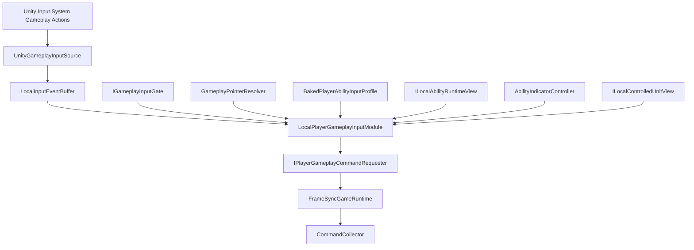

# MOBA 玩家输入与 Gameplay Command 生成模块设计案 v1.1

> 目标：为 Unity 帧同步 MOBA 提供本地玩家的移动、普通攻击以及 Q/W/E/R 四个技能键输入，并把本地设备操作转换成现有帧同步系统的类型化 Gameplay Command Request。  
> 当前版本支持 **鼠标 + 键盘、单个本地玩家、非智能施法、按下启用并在松键或左键时提交的蓄力技能**。  
> UI 输入继续由 Unity Input System 与 `InputSystemUIInputModule` 直接处理，不经过本模块。

---

# 目录

1. [总体定位与边界](#一总体定位与边界)
2. [总体结构](#二总体结构)
3. [Unity Input System 配置](#三unity-input-system-配置)
4. [玩家输入模式的离线派生](#四玩家输入模式的离线派生)
5. [本地输入事件缓冲](#五本地输入事件缓冲)
6. [Gameplay 输入门禁](#六gameplay-输入门禁)
7. [鼠标世界解析](#七鼠标世界解析)
8. [移动与普通攻击](#八移动与普通攻击)
9. [本地技能输入状态](#九本地技能输入状态)
10. [通用技能输入规则](#十通用技能输入规则)
11. [按下启用、松键或左键提交](#十一按下启用松键或左键提交)
12. [AimSnapshot](#十二aimsnapshot)
13. [Gameplay Command Request 接口](#十三gameplay-command-request-接口)
14. [技能系统与 AI 边界](#十四技能系统与-ai-边界)
15. [技能指示器](#十五技能指示器)
16. [生命周期与 UI 交互](#十六生命周期与-ui-交互)
17. [确定性、回滚与重演](#十七确定性回滚与重演)
18. [错误处理与性能](#十八错误处理与性能)
19. [当前版本明确不做](#十九当前版本明确不做)
20. [推荐实现顺序](#二十推荐实现顺序)
21. [验收测试](#二十一验收测试)
22. [编码准入结论](#二十二编码准入结论)

---

# 一、总体定位与边界

## 1.1 模块职责

玩家输入模块负责：

```text
监听 Unity Input System 的 Gameplay Action。
把按下、松开和鼠标点击转换为稳定的本地输入事件。
读取当前鼠标屏幕坐标。
把鼠标解析为地面 fp2 和候选 UnitUid。
解析右键移动或普通攻击。
处理 Q/W/E/R 技能槽输入。
读取由 CastModelDef 离线派生的玩家输入模式。
维护本地技能输入状态。
调用技能指示器。
把物理输入翻译为现有 AbilitySignal 语言。
调用 FrameSyncGameRuntime 的类型化 Command Request 入口。
防止左键 Commit 与技能键松开产生重复 Command。
处理 UI、Application Flow 和受控单位变化造成的输入阻断。
```

它不负责：

```text
定义第二套 Ability 协议。
定义第二套网络 Command Schema。
直接创建最终 CanonicalCommandBytes。
分配最终 CommandSeq 或 TargetTick。
向网络发送数据。
执行 AbilityHandler。
计算蓄力时间、最大蓄力时间、伤害或射程。
判断目标 Tick 时技能一定能成功。
替 AI 设计技能决策层。
修改 Unit、AbilityRuntime、AttackHandler 或 Locomotion。
驱动普通 UI。
进入 GameplaySnapshot 或 SharedGameplayChecksum。
回滚时重新读取设备输入。
```

## 1.2 当前输入范围

```text
鼠标右键：
    普通状态下解析为 Attack 或 Move。
    尚未发送真实 Focus 的本地 Aim 中，取消本地 Aim。
    已发送 Focus 的技能中，不发送 Cancel；
    按普通规则继续解析 Attack 或 Move。

鼠标左键：
    当前存在可 Commit 的本地技能输入上下文时，
    默认生成 Commit。
    没有技能输入上下文时不生成 Gameplay Command。

Escape：
    本地 Aim 阶段关闭本地指示器。
    已启用的技能是否允许玩家 Cancel，
    由离线派生的输入模式决定。
    当前 HoldRelease 默认不允许玩家 Cancel。

Q / W / E / R：
    固定对应 AbilitySlot 0 / 1 / 2 / 3。
```

当前不加入：

```text
A 键攻击移动
S 键停止
H 键保持
强制攻击
多单位编队
宠物快捷键
智能施法
自动寻找最近目标
手柄和触屏
```

## 1.3 UI 边界

UI 使用自己的 Unity Input System UI Action：

```text
Point
Click
RightClick
ScrollWheel
Navigate
Submit
Cancel
```

由：

```text
EventSystem
InputSystemUIInputModule
Lua / C# UI 页面
```

直接处理。

玩家输入模块：

```text
不转发 UI 输入。
不替 UI 生成 GameplayCommand。
只查询 UI 是否阻断 Gameplay 键盘或鼠标输入。
```

---

# 二、总体结构



## 2.1 核心对象

```text
LocalPlayerGameplayInputModule
    本模块组合根。
    按本地事件顺序处理输入。
    维护本地技能输入状态和提交去重。

UnityGameplayInputSource
    订阅 Unity InputAction。
    只写 LocalInputEventBuffer。

LocalInputEventBuffer
    保存本 Unity 帧内的按下、松开和鼠标事件。

GameplayPointerResolver
    把屏幕坐标解析为地面坐标和候选 UnitUid。

BakedPlayerAbilityInputProfile
    从 CastModelDef 离线派生。
    只描述物理输入如何翻译为现有技能信号。

ILocalAbilityRuntimeView
    只读观察当前受控单位的 AbilitySession 和阶段。
    不修改技能 Runtime。

AbilityIndicatorController
    显示本地 Aim 和 Gameplay Session 指示器。
    不执行技能。

IGameplayInputGate
    判断 UI 和应用流程是否阻断 Gameplay 输入。

IPlayerGameplayCommandRequester
    由 FrameSync Request 层实现。
```

## 2.2 玩家与 AI 的分流

```text
玩家：
Unity Input System
    -> 玩家输入模块
    -> CastAbilityCommand
    -> OrderTranslator
    -> AbilityAction
    -> AbilityHandler
    -> AbilitySignal

AI：
AIController
    -> AbilityAction
    -> AbilityHandler
    -> AbilitySignal
```

AI：

```text
不经过 Unity Input System。
不经过玩家输入模块。
不生成帧同步网络 Command。
不读取 BakedPlayerAbilityInputProfile。
```

玩家和 AI 只在现有技能系统的：

```text
AbilityAction
AbilitySignal
AbilityRuntime
CastModelDef
```

语义上汇合。

---

# 三、Unity Input System 配置

## 3.1 Action Map

```text
PlayerInputActions.inputactions
    Gameplay
    UI
```

`UI` Map 配置给 `InputSystemUIInputModule`。

`Gameplay` Map：

| Action | Type | Control Type | 默认绑定 |
|---|---|---|---|
| `PointerPosition` | Value | Vector2 | `<Pointer>/position` |
| `PrimaryClick` | Button | Button | `<Mouse>/leftButton` |
| `SecondaryClick` | Button | Button | `<Mouse>/rightButton` |
| `Cancel` | Button | Button | `<Keyboard>/escape` |
| `AbilityQ` | Button | Button | `<Keyboard>/q` |
| `AbilityW` | Button | Button | `<Keyboard>/w` |
| `AbilityE` | Button | Button | `<Keyboard>/e` |
| `AbilityR` | Button | Button | `<Keyboard>/r` |

## 3.2 技能键必须同时监听按下与松开

```text
AbilityQ / W / E / R performed
    -> AbilityKeyPressed

AbilityQ / W / E / R canceled
    -> AbilityKeyReleased
```

不能继续把所有技能键限制为：

```text
只处理 performed。
```

`PointerPosition` 不写事件队列，只用于：

```text
每帧更新指示器。
按钮事件发生时捕获 ScreenPositionAtEvent。
```

## 3.3 显式订阅

推荐使用：

```text
InputActionReference
或生成的强类型 InputAction Wrapper
```

禁止：

```text
SendMessage
BroadcastMessage
字符串方法名回调
运行时反射寻找 Action
```

`OnEnable` 订阅，`OnDisable` 取消订阅。

---

# 四、玩家输入模式的离线派生

## 4.1 不重复配置技能 Gameplay 数据

玩家输入配置中禁止出现：

```text
MinFocusTicks
MaxFocusTicks
AutoCommitTick
技能伤害
技能射程
技能宽度
蓄力曲线
阶段持续时间
Cooldown
```

这些数据只能存在于：

```text
AbilityDef
CastModelDef
StageDef
AbilityRuntime
AbilitySession
Blackboard
```

玩家输入层只关心：

> 一个物理事件应该翻译成已有的哪个技能信号，或者只打开本地 Aim。

## 4.2 离线输入模式

```csharp
public enum BakedPlayerAbilityInputMode : byte
{
    PressCommit,
    LocalAimPrimaryCommit,
    PressFocusReleaseOrPrimaryCommit
}
```

```csharp
public struct BakedPlayerAbilityInputProfile
{
    public BakedPlayerAbilityInputMode Mode;
}
```

当前版本不需要在 Profile 中重复保存任何技能时间或数值。

## 4.3 由 CastModelDef 自动生成

编辑期：

```text
CastModelDef
    是玩家输入模式的唯一来源。
```

Bake：

```text
AbilityDef
    -> CastModelDef
    -> PlayerInputProfileBaker
    -> BakedPlayerAbilityInputProfile
```

运行时：

```text
AbilitySlot
    -> ActiveAbilityId
    -> AbilityDef
    -> BakedPlayerAbilityInputProfile
```

建议的默认映射：

```text
CommitCastModelDef
    且无需本地 Aim
        -> PressCommit

CommitCastModelDef
    且 ResolveIndicatorStage 需要玩家 Aim
        -> LocalAimPrimaryCommit

HoldReleaseCastModelDef
        -> PressFocusReleaseOrPrimaryCommit
```

自定义 CastModelDef 必须在 Bake 阶段实现输入模式派生，否则：

```text
Bake 失败。
禁止在运行时按类型猜测。
```

## 4.4 HoldRelease 默认约定

`PressFocusReleaseOrPrimaryCommit` 默认表示：

```text
技能键按下
    -> Focus

对应技能键松开
    -> Commit

鼠标左键
    -> Commit

鼠标右键
    -> 不发送 Cancel
    -> 继续正常解析 Move / Attack

Escape
    -> 不发送 Cancel
```

如果未来某个特殊 CastModel 允许玩家主动取消，需要由该 CastModel 提供新的明确输入模式或 Bake Override，不能修改 HoldRelease 的默认语义。

---

# 五、本地输入事件缓冲

## 5.1 回调只写事件

InputAction 回调中禁止：

```text
访问 Gameplay Runtime。
执行 Raycast。
修改本地技能状态。
调用 Command Request。
```

回调只写 `LocalInputEventBuffer`。

在：

```text
LocalPlayerGameplayInputModule.LateUpdate()
```

中统一处理，使：

```text
UI 已经有机会处理本帧输入。
同 Unity 帧事件拥有明确顺序。
Command Request 只从一个入口生成。
```

## 5.2 事件结构

```csharp
public enum LocalGameplayInputEventKind : byte
{
    PrimaryClick,
    SecondaryClick,
    Cancel,
    AbilityKeyPressed,
    AbilityKeyReleased
}
```

```csharp
public struct LocalGameplayInputEvent
{
    public ulong LocalEventSequence;
    public LocalGameplayInputEventKind Kind;
    public AbilitySlot AbilitySlot;
    public Vector2 ScreenPositionAtEvent;
}
```

对于非技能键事件：

```text
AbilitySlot 写入规范默认值。
```

`LocalEventSequence`：

```text
只用于本地稳定处理顺序。
不进入 GameplayCommand。
不发送网络。
不进入快照。
```

## 5.3 同帧顺序

严格按：

```text
LocalEventSequence 升序
```

处理。

例如快速点击：

```text
Q performed
Q canceled
```

可在同一 Unity 帧中依次生成：

```text
Focus
Commit
```

Command Request 层按调用顺序分配 `CommandSeq`。

## 5.4 缓冲上限

建议：

```text
MaxLocalInputEventsPerUnityFrame = 64
```

溢出时：

```text
记录本地诊断。
丢弃新事件。
不产生不完整 Command。
```

它不是确定性 Gameplay 错误。

---

# 六、Gameplay 输入门禁

## 6.1 接口

```csharp
public interface IGameplayInputGate
{
    bool CanAcceptKeyboardGameplayInput
    {
        get;
    }

    bool IsPointerGameplayBlocked(
        Vector2 screenPosition);
}
```

## 6.2 普通阻断

以下情况阻断新的 Gameplay 输入：

```text
输入框拥有键盘焦点。
聊天或控制台正在输入。
鼠标位于消费点击的 UI 上。
UI 捕获 Pointer。
存在模态页面。
Application Flow 不在 GameplayRunning。
本地玩家未绑定 ControlledUnitUid。
比赛已经权威结束。
```

## 6.3 已经按下的 HoldRelease 键必须收到 Release

一旦玩家输入模块成功发送：

```text
Focus Request
```

对应技能键的 `canceled` 必须继续被监听。

即使之后：

```text
聊天框获得焦点。
普通键盘 Gameplay Gate 被关闭。
```

也不能静默吞掉该键的 Release。

但以下情况可以直接清理本地输入上下文：

```text
离开对局。
客户端断线。
ControlledUnitUid 改变。
Gameplay Action Map 被永久禁用。
```

Gameplay 中真实 AbilitySession 的中断由 Unit / Ability 生命周期负责。

## 6.4 门禁不是最终合法性

门禁不判断：

```text
沉默
眩晕
冷却
法力
目标 Tick 距离
目标 Tick 目标存活
```

这些由正式 Gameplay 执行层判断。

---

# 七、鼠标世界解析

## 7.1 输出

```csharp
public struct GameplayPointerSnapshot
{
    public bool HasGroundPoint;
    public fp2 GroundPoint;

    public bool HasHoveredUnit;
    public UnitUid HoveredUnitUid;
}
```

## 7.2 地面点

```text
ScreenPosition
    -> Gameplay Camera Ray
    -> Ground Plane / Ground Surface
    -> 逻辑平面坐标
    -> Command 精度量化
    -> fp2 GroundPoint
```

Command 不保存：

```text
屏幕坐标
Camera Ray
Unity Vector3
Collider
Transform
```

## 7.3 Unit 选择

表现对象使用：

```text
UnitSelectionProxy
    UnitUid
    SelectionPriority
```

多个命中时：

```text
过滤无代理 Collider。
按 UnitUid 去重。
按 Ray Distance 升序。
距离相同时按 SelectionPriority。
仍相同时按 UnitUid。
选择第一项。
```

最终 Attack 或 Unit Aim 只保存稳定 `UnitUid`。

## 7.4 本地预测差异

鼠标解析基于客户端当前预测世界。

因此允许：

```text
本地点击时目标存在。
目标 Tick 时目标已经死亡。
Command 最终执行失败。
```

输入模块不自动替换目标或改变 Command 类型。

---

# 八、移动与普通攻击

## 8.1 普通右键

当本地技能输入状态允许右键进入世界操作时：

```text
右键敌方可选 Unit
    -> RequestAttack(TargetUnitUid)

否则存在 GroundPoint
    -> RequestMove(GroundPoint)
```

## 8.2 本地攻击目标最小检查

```text
UnitUid 当前存在。
不是受控单位自身。
阵营敌对。
当前不是 Dead。
允许成为普通攻击选择对象。
```

不检查：

```text
攻击距离
攻击冷却
当前控制状态
目标 Tick 是否仍有效
```

## 8.3 不自动改写

```text
Attack Command 在目标 Tick 失败
    不自动转换为 Move。

Move Command
    不携带 Pathfinding 策略、RVO 参数或 StopRange。
```

## 8.4 不同技能状态下的右键

```text
Idle
    -> 普通 Move / Attack。

LocalAiming
    -> 关闭本地 Aim。
    -> 本次右键不同时生成 Move / Attack。

FocusRequested
GameplayFocusing
CommitRequested
    且模式为 PressFocusReleaseOrPrimaryCommit
    -> 不发送 Cancel。
    -> 不关闭指示器。
    -> 按普通规则生成 Move / Attack。
```

是否允许移动或攻击 Order 与当前 AbilitySession 并存，由 Ability、Behavior 和 Action Arbitration 规则决定。

为了实现本设计描述的蓄力技能：

```text
Move Order 不得因为输入层规则自动取消 Focus Session。
```

---

# 九、本地技能输入状态

## 9.1 状态

```csharp
public enum LocalAbilityInputStateKind : byte
{
    Idle,

    // 只打开了本地指示器，尚未产生真实 Gameplay Session。
    LocalAiming,

    // Focus Command 已成功加入本地 Command Buffer，
    // 但对应预测 Tick 可能尚未执行。
    FocusRequested,

    // AbilityRuntime 已观察到真实 Focus Session。
    GameplayFocusing,

    // Commit Command 已成功加入本地 Command Buffer，
    // 等待预测或权威 Gameplay 推进 Session。
    CommitRequested
}
```

```csharp
public struct LocalAbilityInputState
{
    public LocalAbilityInputStateKind Kind;
    public AbilitySlot Slot;
    public UnitUid ControlledUnitUidAtBegin;

    public GameplayCommandRequestReceipt
        LastRequestReceipt;
}
```

这是本地输入和表现状态：

```text
不进入 GameplaySnapshot。
不进入 SharedGameplayChecksum。
不发送网络。
不由回滚恢复。
```

## 9.2 为什么需要 `FocusRequested`

Focus Command 可能被安排到未来预测 Tick。

在此期间玩家可能已经：

```text
松开技能键。
点击左键。
```

输入模块必须允许：

```text
FocusRequested
    -> CommitRequested
```

并依赖 `CommandSeq` 保证 Focus 先于 Commit。

## 9.3 为什么需要 `CommitRequested`

例如：

```text
玩家按住 Q。
左键提交。
随后松开 Q。
```

若没有本地去重，会产生两个 Commit Command。

规则：

```text
FocusRequested / GameplayFocusing
    + 第一个合法 Commit Trigger
    -> Request Commit
    -> 成功后立即进入 CommitRequested。

CommitRequested
    + 左键或对应技能键松开
    -> 忽略。
```

去重在 Command Request 成功时立即生效，不等待 AbilitySession 真正结束。

---

# 十、通用技能输入规则

## 10.1 左键默认 Commit

冻结规则：

```text
只要当前存在可 Commit 的本地技能输入上下文：
    鼠标左键默认映射为 AbilitySignal.Commit。

没有技能输入上下文：
    鼠标左键不产生 Gameplay Command。
```

适用：

```text
LocalAiming
FocusRequested
GameplayFocusing
```

不适用：

```text
Idle
CommitRequested
```

## 10.2 `PressCommit`

```text
技能键按下
    -> 捕获所需 Aim。
    -> Request Commit。
    -> 成功后进入 CommitRequested。
```

适用于：

```text
自施法
无目标技能
按键立即触发技能
```

## 10.3 `LocalAimPrimaryCommit`

```text
技能键按下
    -> 打开本地 Aim。
    -> 进入 LocalAiming。
    -> 不发送 Focus。

左键
    -> 构造 AimSnapshot。
    -> Request Commit。
    -> 成功后进入 CommitRequested。

右键或 Escape
    -> 只关闭本地 Aim。
    -> 回到 Idle。
    -> 不发送 Cancel。
```

因为此时没有真实 AbilitySession。

## 10.4 `PressFocusReleaseOrPrimaryCommit`

```text
技能键按下
    -> Request Focus。
    -> 成功后进入 FocusRequested。

对应技能键松开
    -> Request Commit。

鼠标左键
    -> Request Commit。

鼠标右键
    -> 不发送 Cancel。
    -> 不关闭指示器。
    -> 继续正常 Move / Attack。

Escape
    -> 当前默认不发送 Cancel。
```

Focus 已经成功进入 Command Buffer 后，该技能不再是“仅本地指示器”。

---

# 十一、按下启用、松键或左键提交

本节以韦鲁斯 Q 型技能作为正式参考流程。

## 11.1 Q 按下

```text
AbilityKeyPressed(Q)
    -> 读取槽位当前 ActiveAbilityId。
    -> 读取 BakedPlayerAbilityInputProfile。
    -> Mode == PressFocusReleaseOrPrimaryCommit。
    -> RequestCastAbility(
           Slot = Q,
           Signal = Focus,
           Aim = None)。
```

Request 成功：

```text
Local State = FocusRequested。
显示可用的预备指示器。
```

预测 Gameplay 执行 Focus 后：

```text
AbilityHandler 接收 Focus。
建立真实 AbilitySession。
写入 FocusLogicTick。
进入 Hold / Focus Stage。
Local State = GameplayFocusing。
指示器改为读取真实 Session。
```

## 11.2 Q 松开

```text
AbilityKeyReleased(Q)
    且当前 Slot == Q
    且状态为 FocusRequested 或 GameplayFocusing
    -> 捕获当前 Direction AimSnapshot
    -> Request Commit
    -> 成功后进入 CommitRequested
```

## 11.3 左键

```text
PrimaryClick
    且 Pointer 未被 UI 阻断
    且状态为 FocusRequested 或 GameplayFocusing
    -> 捕获当前 AimSnapshot
    -> Request Commit
    -> 成功后进入 CommitRequested
```

左键与松键生成的是同一种：

```text
AbilitySignal.Commit
```

## 11.4 右键

在该技能已进入 `FocusRequested` 或 `GameplayFocusing` 后：

```text
SecondaryClick
    -> 不发送 AbilitySignal.Cancel。
    -> 不关闭技能指示器。
    -> 按普通右键规则生成 Move / Attack。
```

输入层不能把右键硬编码成技能取消。

## 11.5 Commit 执行

目标 Tick：

```text
AbilitySignal.Commit
    -> 读取 AbilitySession。
    -> 由技能系统计算蓄力 Tick。
    -> 推进到 Release Stage。
    -> 生成 Projectile。
    -> 完成 Session。
    -> 进入 Cooldown。
```

输入模块不负责：

```text
计算蓄力比例。
生成 Projectile。
开始 Cooldown。
结束 AbilitySession。
```

## 11.6 蓄力时间

技能系统计算：

```text
RawChargeTicks =
    CommitLogicTick - FocusLogicTick
```

如何处理：

```text
最小蓄力
最大蓄力
自动推进
伤害和射程曲线
```

完全由 CastModelDef、StageDef 和 AbilityRuntime 决定。

输入模块没有对应配置。

## 11.7 Focus 与 Commit 同 Tick

快速点按可能让：

```text
Focus
Commit
```

落在同一个 `TargetTick`。

允许：

```text
Focus.CommandSeq < Commit.CommandSeq
```

目标 Tick 按规范 Command 顺序执行：

```text
先 Focus。
后 Commit。
```

技能系统得到：

```text
ChargeTicks = 0
```

后续处理由技能自身静态配置决定。

禁止为了输入层方便强制把 Commit 延迟一个 Tick。

---

# 十二、`AimSnapshot`

## 12.1 结构

继续复用技能系统和 FrameSync Command 已有的正式结构：

```text
AimSnapshot
    Kind
    TargetUnitUid
    TargetPoint
    Direction
```

输入模块不得重新定义第二套网络 Aim Schema。

## 12.2 规范字段

```text
None
    所有 Payload 清零。

Self
    所有 Payload 清零。
    施法者由 Command Header 确定。

Point
    只保留量化 TargetPoint。

Unit
    只保留 TargetUnitUid。

Direction
    只保留量化 Direction。
```

未使用字段必须写规范零值。

## 12.3 Direction Aim

```text
Direction =
    Normalize(
        PointerGroundPoint
        - ControlledUnitLogicPosition)
```

长度低于合法阈值：

```text
不提交 Commit。
保持当前输入状态。
```

Command 保存最终量化方向。目标 Tick 不根据鼠标重新计算。

## 12.4 不在输入层 Clamp 技能距离

输入层不处理：

```text
最大施法距离
最小施法距离
自动 Clamp
追击施法
命中预测
```

这些由技能、行为和执行层决定。

---

# 十三、Gameplay Command Request 接口

## 13.1 类型化 Request

```csharp
public interface IPlayerGameplayCommandRequester
{
    bool RequestMove(
        in fp2 targetPoint);

    bool RequestAttack(
        in UnitUid targetUnitUid);

    bool RequestCastAbility(
        AbilitySlot slot,
        AbilitySignalVerb signal,
        in AimSnapshot aim,
        out GameplayCommandRequestReceipt receipt);
}
```

`AbilitySignalVerb` 必须复用技能系统已有的：

```text
Focus
Commit
Cancel
```

不得在输入模块定义第二套 `CastPhase` 或 `AbilityControlPhase`。

## 13.2 Request 回执

```csharp
public struct GameplayCommandRequestReceipt
{
    public int TargetTick;
    public uint CommandSeq;
}
```

用途：

```text
关联 FocusRequested / CommitRequested。
判断对应预测 Tick 是否已经执行。
防止重复 Commit。
在请求执行失败后恢复本地输入状态。
```

回执：

```text
只在本地使用。
不额外进入 Command Payload。
不进入 GameplaySnapshot。
```

如果现有 Request 层已经返回等价信息，直接复用，不新增结构。

## 13.3 Request 层职责

```text
读取 PlayerSlot 和 ControlledUnitUid。
分配 CommandSeq。
计算 TargetTick。
填充 Command Header。
规范序列化 Payload。
写入 CommandCollector。
发送 GameplayCommandBundle。
```

TargetTick 继续使用 FrameSync 主设计，不由输入模块计算。

## 13.4 同 Tick 顺序

快速点按时：

```text
Focus Request
Commit Request
```

可以拥有相同 `TargetTick`，但必须：

```text
Focus.CommandSeq < Commit.CommandSeq
```

CommandCollector 和 CommandDispatcher 必须保留该玩家同 Tick CommandSeq 顺序。

## 13.5 Request 失败

Request 返回 `false`：

```text
不改变为 FocusRequested 或 CommitRequested。
保持原本本地输入状态。
```

它只表示本地 Command Request 未成功建立，不表示目标 Tick 的 Gameplay 结果。

---

# 十四、技能系统与 AI 边界

## 14.1 玩家路径

```text
物理输入
    -> BakedPlayerAbilityInputProfile
    -> AbilitySignalVerb
    -> CastAbilityCommand
    -> OrderTranslator
    -> AbilityAction
    -> AbilityHandler
    -> AbilitySignal
```

## 14.2 AI 路径

```text
AIController
    -> 读取 AbilityDef / CastModelDef / AbilityRuntime
    -> 根据 AI 决策生成 AbilityAction
    -> AbilityHandler
    -> AbilitySignal
```

AI 不需要：

```text
模拟按键按住。
模拟鼠标左键。
模拟技能键松开。
经过玩家 Command Request。
增加通用 AbilityControlOrder 中间层。
读取玩家输入 Profile。
```

例如 AI 使用蓄力技能：

```text
决定开始蓄力
    -> AbilityAction(Focus)

后续 Tick 决定释放
    -> AbilityAction(Commit, AimSnapshot)

生命周期或 AI 决策需要取消
    -> AbilityAction(Cancel)
```

AI 直接使用技能系统已有语言。

## 14.3 不强制新增 AI 快照结构

本设计不要求技能系统额外增加：

```text
AIAbilityPlanSnapshot
通用 AI 技能协议
AI 输入状态
```

具体 AI 若需要跨 Tick 保存“计划何时释放”，由其现有 Behavior / AIController Runtime 自行保存。

AbilitySession 的：

```text
FocusLogicTick
当前 Stage
Blackboard
```

继续由 AbilityHandler 自己快照，AI 不复制。

---

# 十五、技能指示器

## 15.1 数据来源

指示器直接读取：

```text
CastModelDef.ResolveIndicatorStage
StageDef
AbilityRuntime
AbilitySession
Blackboard
Local Aim
```

输入模块不配置：

```text
射程
宽度
半径
蓄力比例
最大蓄力时间
```

## 15.2 不同本地状态

```text
LocalAiming
    -> 使用静态 AbilityDef / StageDef 和 Local Aim。

FocusRequested
    -> 可显示基于静态配置的预备指示器。

GameplayFocusing
    -> 使用真实 AbilitySession、Stage 和 Blackboard。

CommitRequested
    -> 保持指示器，直到 Gameplay Runtime 推进。
```

## 15.3 关闭规则

不要在左键或松键回调中直接强制关闭指示器。

指示器在以下情况下关闭：

```text
AbilitySession 结束。
当前 Stage 不再要求指示器。
技能进入 Cooldown。
Gameplay 生命周期中断该 Session。
ControlledUnitUid 改变。
离开 Gameplay Flow。
```

这样：

```text
Commit Request 被立即拒绝
    -> 指示器不会错误关闭。

Commit 在 Gameplay 执行时失败
    -> Session 仍在 Focus Stage 时可继续显示。
```

---

# 十六、生命周期与 UI 交互

## 16.1 Gameplay Action Map 启用

```text
Application Flow == GameplayRunning
本地 PlayerSlot 已绑定
ControlledUnitUid 有效
Gameplay Scene 已加载
```

## 16.2 禁用

以下情况禁用 Gameplay Action Map 并清理本地输入状态：

```text
离开 Gameplay Scene。
进入最终 Result。
客户端断线。
失去 ControlledUnit。
进入观战状态。
```

真实 AbilitySession 由 Unit / Ability 生命周期中断，输入模块不伪造 Cancel。

## 16.3 ControlledUnit 变化

本地状态保存：

```text
ControlledUnitUidAtBegin
```

当前受控 UnitUid 不一致时：

```text
关闭本地指示器。
清理本地输入状态。
不向新单位补发旧 Commit。
```

## 16.4 UI 阻断指针

```text
PrimaryClick 位于阻断 UI 上
    -> 不 Commit。

SecondaryClick 位于阻断 UI 上
    -> 不生成 Move / Attack。
    -> 不改变已启用技能 Session。
```

## 16.5 UI 打开后技能键松开

已经成功发送 Focus 后：

```text
对应技能键 Release 仍必须被处理为 Commit。
```

普通新技能键 Press 仍受键盘 Gate 阻断。

---

# 十七、确定性、回滚与重演

## 17.1 本地状态不参与 Gameplay 确定性

以下不进入 GameplaySnapshot 或 Checksum：

```text
InputAction phase
鼠标屏幕坐标
Hover Collider
LocalInputEventBuffer
LocalEventSequence
BakedPlayerAbilityInputProfile
LocalAbilityInputState
Request Receipt
技能指示器
UI Gate
Gameplay Camera
```

## 17.2 Command 是输入事实

一旦 Request 成功创建：

```text
Command Header
AbilitySignalVerb
AimSnapshot
```

它就是帧同步输入事实。

回滚时：

```text
不重新读取鼠标键盘。
不再次处理 LocalInputEvent。
不重新解析 ScreenPosition。
不重新执行玩家输入状态机。
```

只重放已有：

```text
AuthorityFrame Command
AcceptedCommandRelay
本地预测 Command
```

## 17.3 Focus / Commit 的 Tick 决定蓄力

```text
FocusLogicTick
CommitLogicTick
```

来自确定性 Gameplay Command 执行 Tick。

不使用：

```text
Unity Time
InputAction 持续秒数
本地 Stopwatch
渲染帧数量
```

## 17.4 本地状态与 Gameplay Runtime 同步

`ILocalAbilityRuntimeView` 至少提供等价只读信息：

```text
指定 Owner 和 Slot 是否存在活动 Session。
Session 当前是否仍等待 Commit。
当前 Stage 是否需要指示器。
```

同步规则：

```text
FocusRequested：
    到达 Receipt.TargetTick 后观察到 Focus Session
        -> GameplayFocusing。

    到达 Receipt.TargetTick 后仍无 Session
        -> Idle，并关闭指示器。

CommitRequested：
    Session 已结束或离开等待 Commit 的 Stage
        -> Idle。

    Commit 的 TargetTick 已执行，
    但 Session 仍明确等待 Commit
        -> 该 Commit 未被 Gameplay 接受。
        -> 回到 GameplayFocusing。
```

输入模块不修改 AbilityRuntime，只观察。

---

# 十八、错误处理与性能

## 18.1 本地诊断

```text
GameplayInputDiagnostic
    LocalEventSequence
    EventKind
    Result
    ScreenPosition
    ControlledUnitUid
    AbilitySlot
    RequestReceipt optional
```

结果例如：

```text
AcceptedRequest
BlockedByUi
NoControlledUnit
NoGroundPoint
AbilityProfileMissing
AimBuildFailed
RequestGatewayRejected
DuplicateCommitIgnored
LocalEventBufferOverflow
```

不发送网络，不进入 Gameplay。

## 18.2 Bake 错误

以下情况必须在离线 Bake 阶段失败：

```text
CastModelDef 无法派生玩家输入模式。
需要 Aim 但没有合法 Indicator / Aim 定义。
HoldRelease 模型无法产生 Focus 或 Commit 信号。
QWER 槽位引用不存在的 AbilityDef。
```

运行时不临时猜测。

## 18.3 无每帧 GC

避免：

```text
每帧 new List
LINQ
闭包捕获
字符串 Action 查找
Physics RaycastAll 新数组
```

推荐：

```text
缓存 InputAction。
复用 LocalInputEventBuffer。
使用 NonAlloc Raycast。
复用候选缓冲。
AimSnapshot 和事件使用 struct。
只在非 Idle 状态更新技能指示器。
```

---

# 十九、当前版本明确不做

```text
智能施法
按下立即朝鼠标快速施法的独立模式
按键重绑定 UI
A 键攻击移动
左键单位选择
自动选择最近目标
输入层自动 Clamp 技能距离
输入层计算蓄力参数
AI 模拟玩家输入
AI 经过网络 Command
通用 AI AbilityControlOrder 中间层
多本地玩家
手柄
触屏
输入宏
```

当前已经支持：

```text
普通本地 Aim 后左键 Commit。
按键立即 Commit。
按下 Focus、松键 Commit。
按下 Focus、左键 Commit。
左键与松键 Commit 去重。
已启用 HoldRelease 技能期间右键继续 Move / Attack。
```

---

# 二十、推荐实现顺序

```text
1. 配置 Gameplay 和 UI Action Map。
2. 实现 UnityGameplayInputSource。
3. 实现 LocalInputEventBuffer。
4. 实现 IGameplayInputGate。
5. 实现 GameplayPointerResolver。
6. 接通 Move / Attack Request。
7. 为 CastModelDef 增加离线 PlayerInputProfile Bake。
8. 接通 AbilitySlot -> ActiveAbilityId -> Baked Profile 查询。
9. 实现 Idle / LocalAiming。
10. 接通 PressCommit 和 LocalAimPrimaryCommit。
11. 扩展 CastAbility Request 返回 RequestReceipt。
12. 实现 FocusRequested / GameplayFocusing / CommitRequested。
13. 接通技能键 performed / canceled。
14. 实现 HoldRelease 的 Release / PrimaryClick Commit。
15. 实现重复 Commit 去重。
16. 接入 ILocalAbilityRuntimeView。
17. 接入 AbilityIndicatorController。
18. 增加 UI 与 Application Flow 生命周期。
19. 增加同 Tick Focus / Commit 测试。
20. 增加回滚不重读设备测试。
```

---

# 二十一、验收测试

## 21.1 移动与攻击

```text
[ ] 右键空地只生成一个 Move Request。
[ ] 右键敌方 Unit 只生成一个 Attack Request。
[ ] Attack 目标失效时不自动转换为 Move。
[ ] 鼠标位于阻断 UI 上时不生成世界 Command。
```

## 21.2 普通非智能施法

```text
[ ] Q/W/E/R 固定映射槽位 0/1/2/3。
[ ] LocalAim 技能按键只打开本地 Aim。
[ ] LocalAim 中左键生成 Commit。
[ ] LocalAim 中右键或 Escape 只关闭本地 Aim。
[ ] 本地取消不生成 AbilitySignal.Cancel。
[ ] 无目标技能按键直接生成 Commit。
```

## 21.3 HoldRelease

```text
[ ] 技能键按下生成 Focus。
[ ] 技能键松开生成 Commit。
[ ] 鼠标左键同样生成 Commit。
[ ] 左键 Commit 后松键不产生第二条 Commit。
[ ] 松键 Commit 后左键不产生第二条 Commit。
[ ] Focus 与 Commit 可落在同一 TargetTick。
[ ] 同 Tick 时 Focus.CommandSeq 小于 Commit.CommandSeq。
[ ] 右键不发送 Cancel、不关闭指示器。
[ ] 右键仍可生成 Move / Attack。
[ ] Escape 默认不取消 HoldRelease Session。
[ ] Commit 后 Projectile、Session 结束和 Cooldown 由技能系统处理。
```

## 21.4 Session 与指示器

```text
[ ] Focus Request 尚未执行时可显示预备指示器。
[ ] Focus 执行成功后指示器读取真实 Session。
[ ] CommitRequested 时重复 Commit 被阻断。
[ ] Commit 成功推进 Stage 后指示器自动关闭。
[ ] Commit 未被 Gameplay 接受且 Session 仍等待 Commit 时恢复 Focusing。
[ ] ControlledUnitUid 改变时关闭本地指示器。
```

## 21.5 AI

```text
[ ] AI 不引用 Unity Input System。
[ ] AI 不读取 BakedPlayerAbilityInputProfile。
[ ] AI 可直接产生 Focus / Commit / Cancel AbilityAction。
[ ] AI 与玩家最终进入相同 AbilityHandler 信号语义。
```

## 21.6 帧同步

```text
[ ] 输入模块不计算 TargetTick。
[ ] Request 层统一分配 CommandSeq。
[ ] AimSnapshot 不包含屏幕坐标、Camera 或 Collider。
[ ] 回滚不重新读取设备。
[ ] 重演只使用保存的 Command。
[ ] 蓄力时间只由 FocusLogicTick 和 CommitLogicTick 计算。
```

## 21.7 性能

```text
[ ] Idle 无每帧托管分配。
[ ] Aiming / Focusing 无每帧托管分配。
[ ] Pointer Raycast 使用 NonAlloc 或复用方案。
[ ] InputAction 初始化后缓存。
```

---

# 二十二、编码准入结论

## 22.1 结论

```text
玩家输入模块 v1.1：
    Go，可以进入编码阶段。
```

本版已经覆盖当前基础需求：

```text
移动
普通攻击
Q/W/E/R
普通非智能施法
无目标立即施法
本地 Aim 后左键 Commit
按下启用的蓄力技能
技能键松开 Commit
鼠标左键 Commit
重复 Commit 去重
已启用技能期间右键不取消
玩家与 AI 复用同一技能系统语言
```

## 22.2 编码时必须保持的三个跨模块契约

```text
1. CastModelDef 可以在离线 Bake 阶段生成
   BakedPlayerAbilityInputProfile，
   且不复制任何技能时间或数值配置。

2. FrameSync CastAbility Request 返回或暴露等价的
   TargetTick + CommandSeq 回执，
   用于 Focus / Commit 本地状态关联和去重。

3. Ability 系统提供只读 Runtime View，
   让输入与指示器观察 Session 是否活动、
   是否仍等待 Commit，以及当前 Stage 是否需要指示器。
```

这三项已经在本设计中给出明确职责，不是待定架构问题。

## 22.3 不允许程序员自行改变

```text
不得把左键和松键实现成两个不同 Gameplay 信号。
不得让右键自动发送 HoldRelease Cancel。
不得在输入模块重复配置 MinFocusTicks 或 MaxFocusTicks。
不得让 AI 模拟 Unity 输入。
不得在回滚时重新读取 InputAction。
不得在输入模块生成第二套 Ability 协议或网络 Command。
```

满足上述契约后，本模块可以直接开始实现和集成测试。
