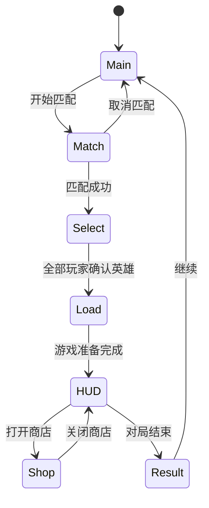
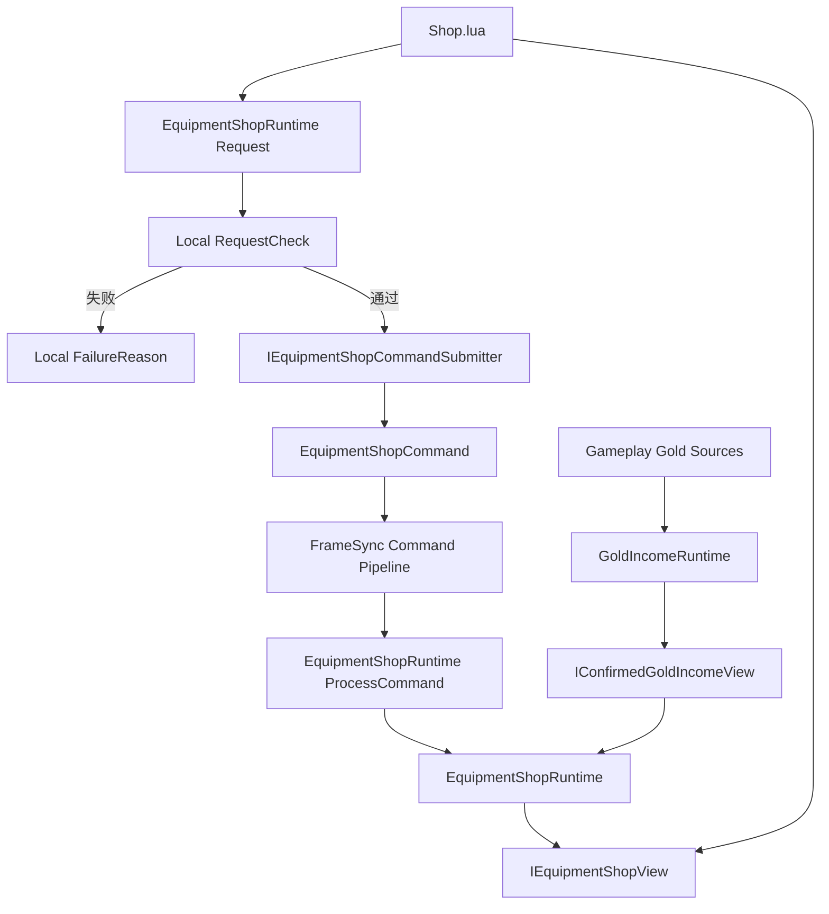
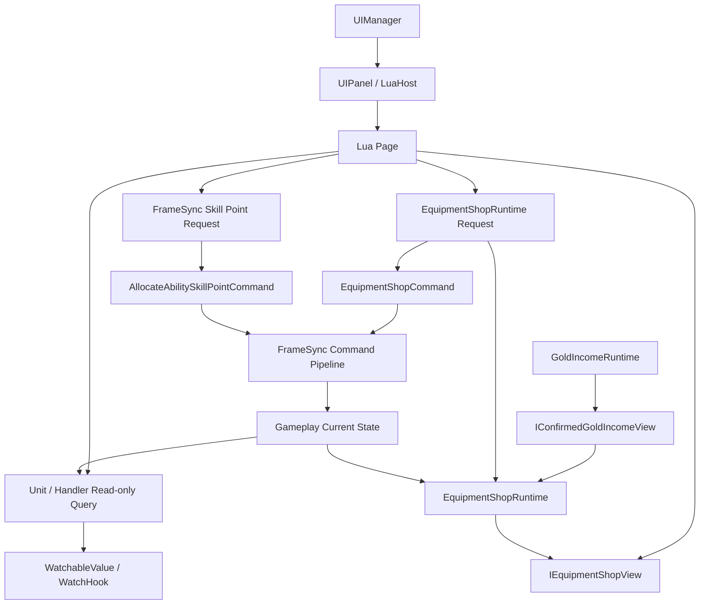
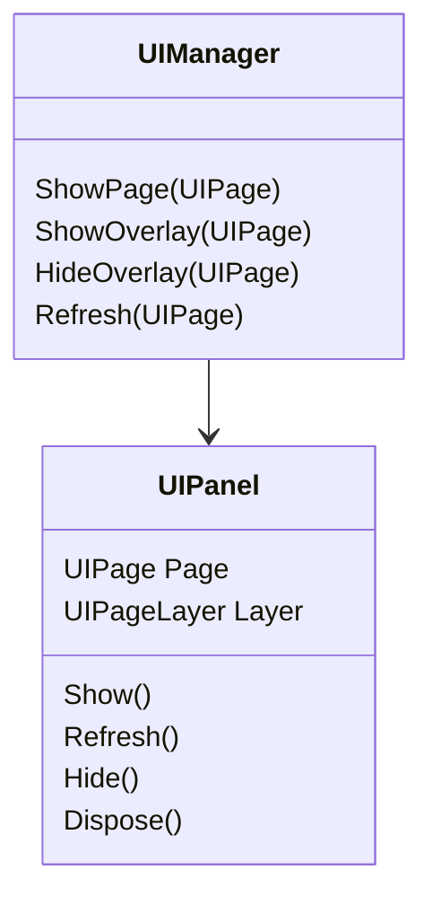
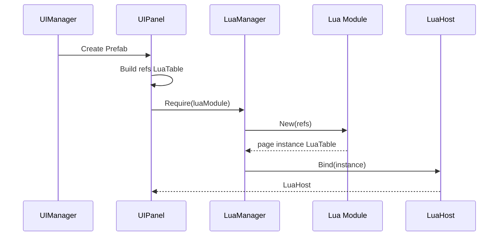
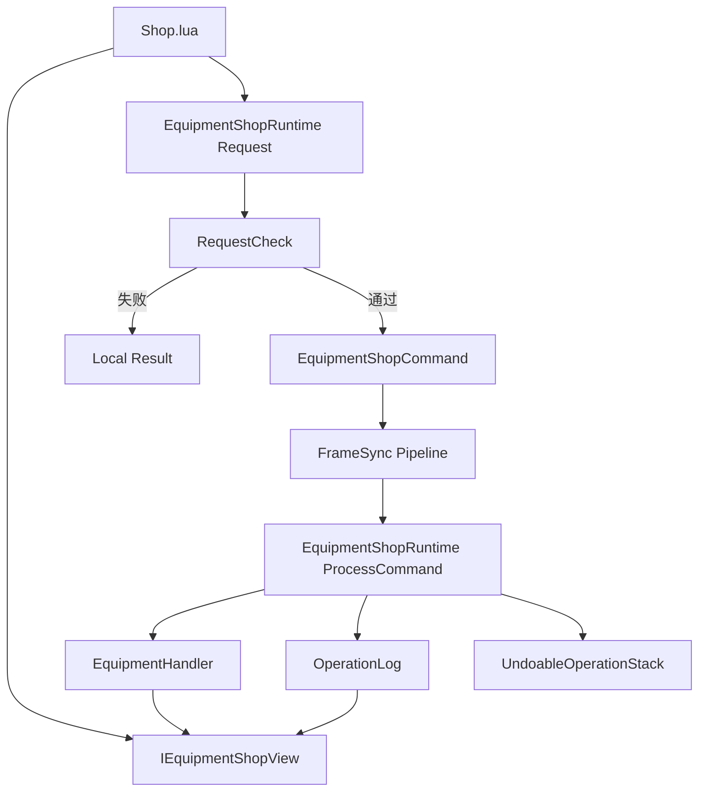

# MOBA UI 与 Lua 系统程序设计案 v9.1

> 本版对齐：
>
> ```text
> FrameSync_Flow_Integrated_System_Design_v10.1
> moba_equipment_system_design_v11
> unit_behavior_framework_design_v25
> moba_ability_system_design_v13
> ```
>
> 当前只设计七个页面：
>
> ```text
> Main
> Match
> Select
> Load
> HUD
> Shop
> Result
> ```
>
> 本版冻结以下 UI 边界：
>
> ```text
> 技能升级：
>     SkillCell 点击
>     -> FrameSyncGameRuntime.RequestAllocateAbilitySkillPoint(slot)
>     -> UI 输入结束
>
> 商店操作：
>     Shop.lua
>     -> EquipmentShopRuntime.RequestPurchase / RequestSell / RequestUndo
>     -> UI 输入结束
>
> 商店只读查询：
>     IEquipmentShopView.GetCurrentAvailableGold()
>     IEquipmentShopView.CalculatePurchasePrice(equipmentId)
>     IEquipmentShopView.CanUndo()
> ```
>
> 购买请求不携带目标装备槽位。最终放置槽位、组件消耗、堆叠合并和满栏合成都由 `EquipmentShopRuntime` 的确定性交易规划负责。
>
> 堆叠消耗品出售采用：
>
> ```text
> 每次 RequestSell(slot) 只卖出 1 个。
> StackCount > 1 时只执行 StackCount -= 1。
> StackCount == 1 时清空该槽位。
> ```
>
> Lua 显示卖出金额时，也只显示“卖出 1 个”对应的金额。
>
> `AllocateAbilitySkillPointCommand`、`EquipmentShopCommand`、预测、权威帧、对账、回滚和重演全部属于帧同步与 Gameplay 系统。UI 只申请 Command，不参与后续执行。
>
> 金币获取统一由 `GoldIncomeRuntime` 管理。UI 不直接访问金币请求、未确认批次、摘要或确认进度；HUD 仍只通过 `IEquipmentShopView.GetCurrentAvailableGold()` 读取当前可购买余额。
>
> 本案继续采用已冻结的堆叠消耗品出售规则：每次 `RequestSell(slot)` 只卖出一个单位。装备系统的 `ProcessCommand` 实现必须同步明确该分支，不能把堆叠槽位理解为整组移除。
>
> HUD 可以直接读取单位框架公开的只读接口，并使用 `WatchableValue / WatchHook` 刷新生命、资源、经验和属性。Lua 不动态订阅单位内部 `UnitEventBus`。
>
> UI 不设计具体布局，只列出页面和区域需要的关键组件。
>
> 本版继续删除：
>
> ```text
> UIContext
> UIServiceSet
> PageActions
> UIStore
> UITip
> ```

---

# 目录

1. [总体概念与边界](#一总体概念与边界)
2. [`UIManager`：页面和局内覆盖页管理](#二uimanager页面和局内覆盖页管理)
3. [`UIPanel` 与 `UIPage`：页面宿主和页面身份](#三uipanel-与-uipage页面宿主和页面身份)
4. [`LuaManager` 与 `LuaHost`：Lua 环境和 Lua 实例代理](#四luamanager-与-luahostlua-环境和-lua-实例代理)
5. [Lua 直接访问 C# 系统的方式与边界](#五lua-直接访问-c-系统的方式与边界)
6. [`UIBase`、`UICellBase` 与 Lua 初始化](#六uibaseuicellbase-与-lua-初始化)
7. [`UIList` 与 `UICell`：列表和格子复用](#七uilist-与-uicell列表和格子复用)
8. [定点数到 UI 显示值的转换](#八定点数到-ui-显示值的转换)
9. [基础流程页面及 Lua 脚本](#九基础流程页面及-lua-脚本)
10. [`HUD`：数据读取、显示和有限交互](#十hud数据读取显示和有限交互)
11. [`Shop`：商品、详情、购买、卖出与撤销](#十一shop商品详情购买卖出与撤销)
12. [`EquipmentShopRuntime`：UI Request 接口](#十二equipmentshopruntimeui-request-接口)
13. [金币、交易链、状态刷新与 Revision 边界](#十三金币交易链状态刷新与-revision-边界)
14. [目录结构与落地顺序](#十四目录结构与落地顺序)
15. [核心结论](#十五核心结论)

---

# 一、总体概念与边界

## 1.1 当前页面

| 页面 | 定位 | 当前交互 |
|---|---|---|
| `Main` | 显示系统分配的账户名 | 开始匹配、退出 |
| `Match` | 显示匹配状态和等待时间 | 取消匹配 |
| `Select` | 显示英雄头像和名字 | 选择英雄、确认英雄 |
| `Load` | 显示本地加载进度 | 无 |
| `HUD` | 显示地图、对局状态、英雄状态、属性、技能、金币和装备 | 技能悬停、技能升级申请、装备格交互、展开属性 |
| `Shop` | 展示可购买装备、详情、配方和撤销信息 | 分类、搜索、选择、购买、卖出、撤销、关闭 |
| `Result` | 显示胜利或失败 | 返回主菜单 |

当前不设计：

```text
Login
Register
独立 Lobby 页面
Settings
Chat
Signal
Scoreboard
Spectator
Replay
Skin
Mail
Social
Achievement
BattlePass
```

## 1.2 页面层级

主页面同一时间只显示一个：

```text
Main
Match
Select
Load
HUD
Result
```

局内页面作为 `BattleOverlay` 覆盖在 HUD 上：

```text
Shop
```

未来增加的计分板、局内设置、英雄信息等页面，也使用相同的 Overlay 规则。

UI 系统只定义页面层级，不定义同屏布局。

## 1.3 页面流程



非 Gameplay 流程仍由对应流程系统决定：

```text
开始匹配
取消匹配
选择英雄
确认英雄
加载完成
进入结算
返回主菜单
```

## 1.4 UI 当前接触的 C# 内容

Lua UI 可以直接访问：

```text
静态配置数据库
Unit 与 Handler 的公开只读查询
WatchableValue / WatchHook
IEquipmentShopView
应用和大厅流程入口
帧同步或 Gameplay 的类型化 Request 入口
```

### 静态配置数据库

```text
GlobalGameplayData.EquipmentDatabase
GlobalGameplayData.GlobalParamTable
GlobalGameplayData.HeroConfigTable
GlobalGameplayData.AbilityDatabase
地图表现配置
```

商店商品直接来自：

```text
EquipmentDatabase.Definitions
```

当前正式注册的装备均属于标准商店商品，不使用：

```text
Definition.Purchasable
Definition.Sellable
EquipmentShopDefinition
EquipmentShopDatabase
独立 Shop Catalog
ShopId
```

Lua 可以读取：

```text
EquipmentDefinition.Id
Name
Description
Icon
Tier
Value
MaxStack
CanStack
FixedStats
Effects
Tags
Recipe
```

### Unit 与 Handler 的公开只读查询

HUD 可以读取：

```text
Unit.StatHandler
Unit.AbilityHandler
Unit.EquipmentHandler
Unit.ActionStateView
```

技能栏读取：

```text
AbilityHandler.PendingSkillPoints
AbilityHandler.CanAllocateSkillPoint(slot)
AbilityBook
AbilityRuntime
AbilityHandler.TryGetCurrentCast()
```

装备栏读取：

```text
EquipmentHandler 的六个只读槽位
EquipmentInstance.Definition
EquipmentInstance.StackCount
EquipmentInstance.ChargeCount
EquipmentInstance.ReadyTick
```

### `IEquipmentShopView`

UI 使用绑定当前本地玩家的只读商店视图：

```csharp
public interface IEquipmentShopView
{
    int GetCurrentAvailableGold();

    int CalculatePurchasePrice(
        EquipmentId targetEquipmentId);

    bool CanUndo();
}
```

用途：

```text
GetCurrentAvailableGold
    HUD 金币。

CalculatePurchasePrice
    当前选中商品的动态实际购买价格。

CanUndo
    撤销按钮是否可用。
```

这些查询不提交 Command，也不修改 Gameplay。

### WatchableValue / WatchHook

UI 可按需监听：

```text
CurrentHealth
CurrentShield
CurrentResource
Level
CurrentExperience
指定 StatId 的最终值
```

`WatchHook`：

```text
不进入 GameplaySnapshot
不决定 Gameplay 结果
回调只刷新 UI
```

Lua 不动态订阅 `UnitEventBus`。

### 类型化 Request 入口

技能升级：

```text
FrameSyncGameRuntime.RequestAllocateAbilitySkillPoint(slot)
```

商店：

```text
EquipmentShopRuntime.RequestPurchase(player, equipmentId)
EquipmentShopRuntime.RequestSell(player, equipmentSlot)
EquipmentShopRuntime.RequestUndo(player)
```

购买不传目标槽位。

## 1.5 `EquipmentShopRuntime` 与 `GoldIncomeRuntime` 的定位

`GoldIncomeRuntime` 是一局内所有 Gameplay 金币获取的唯一总控：

```text
初始金币基线
自然金币
补刀奖励
击杀与助攻奖励
地图目标和比赛规则奖励
金币请求批次
未确认批次历史
金币批次摘要
连续 AuthorityFrame 确认
ConfirmedEarnedGoldTotal
ConfirmedIncomeThroughTick
```

`EquipmentShopRuntime` 负责：

```text
购买
卖出
撤销
购买计划
装备槽位变化
OperationLog
UndoableOperationStack
EffectiveShopGoldDelta
```

两者关系：

```text
GoldIncomeRuntime
    -> IConfirmedGoldIncomeView
    -> EquipmentShopRuntime

EquipmentShopRuntime
    -> IEquipmentShopView
    -> HUD / Shop
```

`EquipmentShopRuntime` 只读取：

```text
GoldIncomeRuntime.GetConfirmedEarnedGoldTotal(player)
```

然后派生：

```text
CurrentAvailableGold =
    ConfirmedEarnedGoldTotal
    + EffectiveShopGoldDelta
```

UI 不直接使用 `IConfirmedGoldIncomeView`。

## 1.6 UI 与商店系统的边界



UI 负责：

```text
显示配置与当前装备
显示当前可用金币
显示动态购买价格
显示单个单位的卖出金额
调用 Request
```

UI 不负责：

```text
RequestGoldIncome
金币批次构建与 Seal
AuthorityFrame 金币确认
构建 PurchasePlan
选择组件
决定目标槽位
执行堆叠增减
修改装备
写 OperationLog
维护撤销栈
```

## 1.7 UI 不参与预测和回滚

## 1.7 UI 不参与预测和回滚

UI 不处理：

```text
CommandHeader
CommandSequence
TargetTick
AuthorityFrame
Snapshot
Rollback
Replay
AuthorityRecovery
```

状态恢复或重演完成后，UI 重新查询当前公开状态。

## 1.8 不同 UI 操作走不同通路

| UI 操作 | 通路 |
|---|---|
| 开始/取消匹配 | 应用流程 |
| 选择/确认英雄 | 大厅流程 |
| 技能 Hover | Lua 页面状态 |
| 点击技能升级按钮 | `RequestAllocateAbilitySkillPoint(slot)` |
| 按住 C 展开属性 | Lua 页面状态 |
| 选择分类、搜索和商品 | Lua 页面状态 |
| 点击 HUD 装备格 | Shop 页面焦点 |
| 购买 | `RequestPurchase(player, equipmentId)` |
| 卖出 | `RequestSell(player, slot)` |
| 撤销 | `RequestUndo(player)` |
| 交换槽位 | 当前 UI 不实现 |
| 使用主动物品 | 当前 HUD 不实现 |

## 1.9 总体结构



# 二、`UIManager`：页面和局内覆盖页管理

## 2.1 定位

`UIManager` 是 UI 运行时单例和页面组合根。

它负责：

| 职责 | 说明 |
|---|---|
| 页面注册 | 保存 `UIPage -> UIPanel Prefab` |
| 页面创建 | 第一次使用时实例化 |
| 主页面切换 | 切换 Main、Match、Select、Load、HUD、Result |
| Overlay 管理 | 在 HUD 上方显示 Shop 等局内页面 |
| 页面查找 | 在内部查找已经创建的 `UIPanel` |
| 页面刷新 | 调用目标 `UIPanel.Refresh()` |
| 页面释放 | 应用或场景退出时释放 Lua 与 Prefab |

它不负责：

```text
保存页面业务数据
读取商品数据库
构建商店列表
构建 HUD 属性
创建 EquipmentShopCommand
执行技能点分配
逐帧调用全部 Lua Update
通过字符串调用任意 Lua 方法
```

## 2.2 `UIPage`

```csharp
public enum UIPage
{
    Main,
    Match,
    Select,
    Load,
    HUD,
    Shop,
    Result
}
```

`UIPage` 是页面稳定 ID。

它用于：

```text
注册页面
查找页面
显示页面
隐藏页面
刷新页面
```

它不保存：

```text
页面数据
LuaTable
Prefab 实例
生命周期状态
```

## 2.3 页面层级

```csharp
public enum UIPageLayer
{
    Main,
    BattleOverlay
}
```

```text
Main Layer:
    Main
    Match
    Select
    Load
    HUD
    Result

BattleOverlay Layer:
    Shop
```

第一版同一时间只打开一个 `BattleOverlay`。

## 2.4 页面根节点

```text
UIRoot
├── PageRoot
└── OverlayRoot
```

`Shop` 打开时，HUD 不执行 `Hide`。

## 2.5 核心接口

```csharp
public sealed class UIManager : MonoBehaviour
{
    public static UIManager Instance { get; private set; }

    public void ShowPage(UIPage page);
    public void ShowOverlay(UIPage page);

    public void HideOverlay(UIPage page);

    public void Refresh(UIPage page);
    public bool IsOpen(UIPage page);

    public void CloseAll();

    // HUD 装备格和 Shop 页面之间的固定、类型明确的 UI 事件。
    public event Action<int, int> ShopOwnedEquipmentFocused;

    public void FocusShopOwnedEquipment(
        int slot,
        int equipmentId);
}
```

`FocusShopOwnedEquipment` 只发布：

```text
slot
equipmentId
```

它不卖出装备，也不调用 `EquipmentShopRuntime`。

Shop Lua 在页面显示期间订阅 `ShopOwnedEquipmentFocused`，从而更新纯页面焦点。这样不需要：

```text
跨页面字符串方法调用
UIStore
直接取得其它页面 LuaTable
```

当前 Lua 页面可以在必要时直接使用：

```lua
CS.UIManager.Instance:HideOverlay(UIPage.Shop)
```

不需要把 `UIManager` 放进 `UIContext` 或缓存到每个页面实例中。

## 2.6 显示主页面

```pseudo
function ShowPage(page):
    assert page belongs to Main layer

    hide current overlay

    if current main page is different:
        hide current main page
        current main page = get or create page
        current main page.Show()

    current main page.Refresh()
```

`Refresh()` 不再接收统一 DTO。

页面 Lua 在刷新时自行查询 C# 配置和客户端镜像。

## 2.7 显示 Overlay

```pseudo
function ShowOverlay(page):
    assert current main page is HUD
    assert page belongs to BattleOverlay layer

    if another overlay exists:
        hide it

    overlay = get or create page
    overlay.Show()
    overlay.Refresh()

    current overlay = overlay
```

## 2.8 固定刷新入口

```csharp
public void Refresh(UIPage page)
{
    if (!openedPanels.TryGetValue(page, out var panel))
        return;

    if (!panel.IsShown)
        return;

    panel.Refresh();
}
```

该入口适用于：

```text
C# 状态镜像变化后统一触发页面刷新
调试工具强制刷新
购买或出售权威结果到达后刷新
```

页面也可以自己监听 C# Changed 事件并刷新局部区域。

不再提供：

```text
CallLua(page, methodName)
CallLuaMethodInTargetPanel
```

## 2.9 生命周期关系



---

# 三、`UIPanel` 与 `UIPage`：页面宿主和页面身份

## 3.1 `UIPanel` 的定位

`UIPanel` 是页面 Prefab 根节点上的 C# 组件。

它负责：

```text
保存 UIPage
保存 UIPageLayer
保存 Lua 模块路径
保存 Inspector 配置的 UIRef
创建页面 Lua 实例
持有 LuaHost
转发 Show / Refresh / Hide / Dispose
```

它不负责：

```text
页面业务
商品查询
装备交易
命令字段计算
HUD 数据格式化
页面跳转条件
```

## 3.2 `UIRef`

```csharp
[Serializable]
public struct UIRef
{
    public string Name;
    public UnityEngine.Object Value;
}
```

例如 Shop Prefab：

```text
CategoryList
ItemList
DetailRoot
ItemIcon
ItemNameText
DescriptionText
BuyBtn
SellBtn
CloseBtn
StateText
```

`UIPanel` 把这些引用转换成 LuaTable：

```text
refs.CategoryList
refs.ItemList
refs.BuyBtn
```

`UIRef` 只解决：

```text
Lua 如何访问当前 Prefab 上的 Unity 组件
```

它不是依赖注入容器，也不保存业务系统。

## 3.3 页面创建



Lua 页面构造统一为：

```lua
function Page.New(refs)
```

不再传入：

```text
UIContext
UIServiceSet
Actions
UIPage
UIManager
```

## 3.4 页面生命周期

```text
Create
    ↓
New(refs)
    ↓
Show
    ↓
Refresh 0..N
    ↓
Hide
    ↓
Show / Refresh 可重复
    ↓
Dispose
```

没有统一 `Update`。

## 3.5 `UIPanel` 接口示意

```csharp
public sealed class UIPanel : MonoBehaviour
{
    [SerializeField] private UIPage page;
    [SerializeField] private UIPageLayer layer;
    [SerializeField] private string luaModule;
    [SerializeField] private UIRef[] refs;

    private LuaHost host;

    public UIPage Page => page;
    public UIPageLayer Layer => layer;
    public bool IsShown { get; private set; }

    public void Build(LuaManager luaManager)
    {
        LuaTable refTable = BuildRefTable(luaManager.Env, refs);
        host = luaManager.CreatePageHost(luaModule, refTable);
    }

    public void Show()
    {
        gameObject.SetActive(true);
        IsShown = true;
        host.Show();
    }

    public void Refresh()
    {
        if (IsShown)
            host.Refresh();
    }

    public void Hide()
    {
        if (!IsShown)
            return;

        host.Hide();
        IsShown = false;
        gameObject.SetActive(false);
    }

    public void Dispose()
    {
        host?.Dispose();
        host = null;
    }
}
```

---

# 四、`LuaManager` 与 `LuaHost`：Lua 环境和 Lua 实例代理

## 4.1 两者的区别

```text
LuaManager
    管理整个 LuaEnv。

LuaHost
    封装一个具体页面或 Cell 的 LuaTable 实例。
```

## 4.2 `LuaManager`

职责：

```text
创建唯一 LuaEnv
注册 Lua Loader
执行 LuaInit.lua
require Lua 模块
调用 module.New(refs)
创建 LuaHost
执行 LuaEnv.Tick
应用退出时 Dispose LuaEnv
```

它不负责页面切换和业务逻辑。

## 4.3 模块原型与页面实例

Lua `require` 会缓存模块。

```text
require("UI.Shop")
    -> Shop 模块原型

Shop.New(refs)
    -> 当前 Shop 页面自己的 LuaTable 实例
```

模块中不能保存页面运行状态。

错误：

```lua
local Shop = {}
Shop.selectedEquipmentId = 0
return Shop
```

正确：

```lua
local Shop = {}
Shop.__index = Shop

function Shop.New(refs)
    local self = setmetatable({}, Shop)
    self.ui = refs
    self.selectedEquipmentId = 0
    return self
end

return Shop
```

## 4.4 `LuaHost` 的定位

`LuaHost` 是 C# 对一个 Lua 实例 `LuaTable` 的轻量代理。

它负责：

```text
持有实例 LuaTable
创建时缓存固定生命周期委托
向 UIPanel 或 UICell 提供类型明确的方法
集中释放 Lua 委托和 LuaTable
```

它不是：

```text
业务中间层
数据缓存
事件总线
另一个 LuaManager
页面路由器
```

## 4.5 为什么保留 `LuaHost`

如果 `UIPanel` 直接操作 LuaTable：

```csharp
var refresh = table.Get<LuaFunction>("Refresh");
refresh.Call(table);
```

每个 Panel 和 Cell 都需要重复：

```text
查找函数
处理 self
处理空函数
释放 LuaFunction
释放 LuaTable
```

使用 `LuaHost` 后：

```csharp
host.Refresh();
```

`UIPanel` 不再了解 LuaTable 的调用细节。

## 4.6 页面 Host 与 Cell Host

页面 Host 缓存：

```text
Show
Refresh
Hide
Dispose
```

Cell Host 缓存：

```text
SetIndex
Bind
Dispose
```

不提供：

```text
Call(string)
InvokeAny(string)
SendMessage(string)
```

## 4.7 `LuaHost` 接口示意

```csharp
public sealed class LuaHost : IDisposable
{
    private LuaTable instance;

    private Action<LuaTable> show;
    private Action<LuaTable> refresh;
    private Action<LuaTable> hide;
    private Action<LuaTable> dispose;

    public void BindPage(LuaTable value)
    {
        instance = value;

        show = value.Get<Action<LuaTable>>("Show");
        refresh = value.Get<Action<LuaTable>>("Refresh");
        hide = value.Get<Action<LuaTable>>("Hide");
        dispose = value.Get<Action<LuaTable>>("Dispose");
    }

    public void Show() => show?.Invoke(instance);
    public void Refresh() => refresh?.Invoke(instance);
    public void Hide() => hide?.Invoke(instance);

    public void Dispose()
    {
        dispose?.Invoke(instance);

        show = null;
        refresh = null;
        hide = null;
        dispose = null;

        instance?.Dispose();
        instance = null;
    }
}
```

---

# 五、Lua 直接访问 C# 系统的方式与边界

## 5.1 不增加 UI 数据中间层

继续删除：

```text
UIContext
UIServiceSet
PageActions
UIStore
```

Lua 可以直接访问经过 xLua 导出的具体只读接口和类型化 Request。

允许：

```text
读取配置
读取 Unit / Handler
建立 UI WatchHook
读取 IEquipmentShopView
调用应用流程
调用类型化 Request
```

禁止：

```text
直接修改 StatHandler
直接修改 AbilityRuntime
直接增删 EquipmentHandler
直接修改 ShopTraderRuntime
直接调用 ProcessCommand
直接访问 CommandCollector
```

## 5.2 xLua 导出类型

至少导出：

```text
UIManager
FrameSyncGameRuntime
GoldIncomeRuntime
IConfirmedGoldIncomeView
EquipmentShopRuntime
IEquipmentShopView
EquipmentDatabase
EquipmentDefinition
EquipmentShopRequestCheck
EquipmentShopFailureReason
EquipmentSlot
EquipmentId
AbilityHandler
AbilityBook
AbilityRuntime
AbilitySlot
StatHandler 的 UI 查询类型
WatchHook 或其 UI 包装
```

## 5.3 获取当前 Runtime、商店视图和 Unit

```lua
local function GetFrameRuntime()
    return CS.FrameSyncGameRuntime.Instance
end

local function GetShopRuntime()
    local frame = GetFrameRuntime()

    if frame == nil
        or frame.GameplayRuntime == nil then
        return nil
    end

    return frame.GameplayRuntime.EquipmentShopRuntime
end

local function GetShopView()
    local frame = GetFrameRuntime()

    if frame == nil then
        return nil
    end

    return frame.LocalEquipmentShopView
end

local function GetLocalUnit()
    local frame = GetFrameRuntime()

    if frame == nil then
        return nil
    end

    return frame:GetLocalControlledUnit()
end
```

`LocalEquipmentShopView` 是绑定当前本地玩家的 `IEquipmentShopView` 实例。具体属性名可以按组合根实现调整，但 Lua 不重复传 `PlayerSlot` 给只读查询。

## 5.4 装备配置查询

```lua
local database =
    CS.GlobalGameplayData.Instance.EquipmentDatabase

local definition =
    database:Get(equipmentId)
```

Lua 可读取：

```text
Id
Name
Description
Icon
Tier
Value
MaxStack
CanStack
FixedStats
Effects
Tags
Recipe
```

## 5.5 商店 Request

```lua
local result =
    shopRuntime:RequestPurchase(
        localPlayerSlot,
        equipmentId)

local result =
    shopRuntime:RequestSell(
        localPlayerSlot,
        equipmentSlot)

local result =
    shopRuntime:RequestUndo(
        localPlayerSlot)
```

`Allowed == true` 只表示 Command 已提交。

## 5.6 技能升级 Request

```lua
CS.FrameSyncGameRuntime.Instance
    :RequestAllocateAbilitySkillPoint(slot)
```

UI 只申请 Command。

## 5.7 当前可用金币

```lua
local view = GetShopView()

local gold =
    view ~= nil
    and view:GetCurrentAvailableGold()
    or 0
```

内部语义：

```text
CurrentAvailableGold =
    GoldIncomeRuntime.GetConfirmedEarnedGoldTotal(localPlayer)
    + EquipmentShopRuntime.GetEffectiveShopGoldDelta(localPlayer)
```

其中：

```text
ConfirmedEarnedGoldTotal
    只包含已经按连续 AuthorityFrame 确认的 Gameplay 收入。

EffectiveShopGoldDelta
    只包含 OperationLog 中 Reverted == false 的购买和出售变化。
```

Lua 不读取或计算：

```text
GoldIncomeRecordBatch
GoldIncomeBatchDigest
ConfirmedIncomeThroughTick
未确认金币批次
OperationLog.GoldDelta
```

预测但尚未确认的 Gameplay 金币收入不进入当前可购买余额。

## 5.8 动态购买价格

```lua
local price =
    view:CalculatePurchasePrice(
        selectedEquipmentId)
```

该接口：

```text
只返回价格
不检查金币是否足够
不提交 Command
不修改装备
```

组件选择必须与正式 `TryBuildPurchasePlan` 一致，但组件列表不暴露给 Lua。

## 5.9 卖出金额

卖出金额由 Lua 按正式公式计算：

```text
SellValue =
    EquipmentDefinition.Value
    × GlobalParamTable.EquipmentSellRate
```

第一版每次卖出一个单位，因此消耗品即使 `StackCount > 1`，显示金额也不乘 `StackCount`。

```lua
function UIFormat.CalculateSellValue(
    definitionValue,
    equipmentSellRate)

    return math.floor(
        definitionValue
        * CS.UIDisplayConvert.ToFloat(
            equipmentSellRate))
end
```

该取整规则必须与 Gameplay 完全一致，并通过共享测试样例校验。

## 5.10 撤销查询

```lua
local canUndo =
    view ~= nil
    and view:CanUndo()
```

UI 只决定 `UndoBtn.interactable`。

UI 不显示：

```text
撤销的是购买还是卖出
撤销后金币变化
撤销失败原因
```

## 5.11 Unit 和 Handler 查询

允许读取：

```text
StatHandler 数值
AbilityHandler / AbilityBook / AbilityRuntime
EquipmentHandler 六个槽位
```

禁止调用写接口。

## 5.12 UI WatchHook

```text
Show 时绑定
Hide / Dispose 时释放
回调只刷新 UI
```

Lua 不动态订阅 `UnitEventBus`。

## 5.13 Revision、金币确认与恢复边界

`GoldIncomeRuntime` 负责：

```text
BeginTick
RequestGoldIncome
SealTick
金币批次摘要
ConfirmAuthorityFrame
DiscardUnconfirmedFromTick
ConfirmedEarnedGoldTotal
ConfirmedIncomeThroughTick
```

普通回滚：

```text
丢弃 ReplayFromTick 及之后的未确认金币批次
保留已确认累计收入
重演时重新生成金币请求、批次和摘要
```

`AuthorityRecovery`：

```text
补齐缺失 AuthorityFrame
按 Tick 接受和确认金币批次
必要时重演
```

Lua 不参与这些流程。

恢复、确认或重演完成后，Lua 重新调用：

```text
IEquipmentShopView.GetCurrentAvailableGold()
IEquipmentShopView.CalculatePurchasePrice(equipmentId)
IEquipmentShopView.CanUndo()
```

---

# 六、`UIBase`、`UICellBase` 与 Lua 初始化

## 6.1 基础 Lua 文件

```text
LuaInit.lua
UIBase.lua
UICellBase.lua
UIFormat.lua
```

| 文件 | 定位 |
|---|---|
| `LuaInit.lua` | 注册 UI Lua 常用类型和基础模块 |
| `UIBase.lua` | 页面 Lua 基类 |
| `UICellBase.lua` | Cell Lua 基类 |
| `UIFormat.lua` | 表现字符串格式化 |

## 6.2 `LuaInit.lua`

```lua
GameObject = CS.UnityEngine.GameObject
Transform = CS.UnityEngine.Transform
RectTransform = CS.UnityEngine.RectTransform
Vector2 = CS.UnityEngine.Vector2
Vector3 = CS.UnityEngine.Vector3
Color = CS.UnityEngine.Color

UI = CS.UnityEngine.UI
TMP = CS.TMPro
TMP_Text = CS.TMPro.TextMeshProUGUI

UIPage = CS.UIPage
EquipmentShopOperationType = CS.EquipmentShopOperationType
EquipmentShopFailureReason = CS.EquipmentShopFailureReason
EquipmentSlotConstants = CS.EquipmentSlotConstants

function import(moduleName)
    return require(moduleName)
end

UIBase = require("UI.Core.UIBase")
UICellBase = require("UI.Core.UICellBase")
UIFormat = require("UI.Core.UIFormat")

print("Lua UI initialized")
```

不注册：

```text
Time
Input
GameManager 全局实例
UIManager 全局实例
FrameSyncGameRuntime 全局实例
```

需要单例时由页面在使用位置读取，避免持有已经失效的旧实例。

## 6.3 `UIBase.lua`

定位：

```text
保存 UIRef
记录 UnityEvent 监听
记录 C# 变化监听的取消函数
统一释放
提供默认生命周期
```

```lua
local UIBase = {}
UIBase.__index = UIBase

function UIBase.New(class, refs)
    local self = setmetatable({}, class or UIBase)

    self.ui = refs

    self._unityListeners = {}
    self._unsubscribers = {}
    self._disposed = false

    return self
end

function UIBase:BindEvent(event, callback)
    event:AddListener(callback)

    table.insert(self._unityListeners, {
        Event = event,
        Callback = callback
    })

    return callback
end

function UIBase:BindClick(button, callback)
    return self:BindEvent(button.onClick, callback)
end

function UIBase:AddUnsubscriber(callback)
    table.insert(self._unsubscribers, callback)
end

function UIBase:UnbindUnityEvents()
    for i = #self._unityListeners, 1, -1 do
        local item = self._unityListeners[i]

        if item.Event ~= nil and item.Callback ~= nil then
            item.Event:RemoveListener(item.Callback)
        end

        self._unityListeners[i] = nil
    end
end

function UIBase:UnsubscribeRuntimeEvents()
    for i = #self._unsubscribers, 1, -1 do
        local callback = self._unsubscribers[i]

        if callback ~= nil then
            callback()
        end

        self._unsubscribers[i] = nil
    end
end

function UIBase:Show()
end

function UIBase:Refresh()
end

function UIBase:Hide()
    self:UnsubscribeRuntimeEvents()
end

function UIBase:Dispose()
    if self._disposed then
        return
    end

    self._disposed = true

    self:UnsubscribeRuntimeEvents()
    self:UnbindUnityEvents()

    self.ui = nil
end

return UIBase
```

## 6.4 `UICellBase.lua`

```lua
local UICellBase = {}
UICellBase.__index = UICellBase

function UICellBase.New(class, refs)
    local self = setmetatable({}, class or UICellBase)

    self.ui = refs
    self.data = nil
    self.index = -1

    self._listeners = {}
    self._disposed = false

    return self
end

function UICellBase:BindEvent(event, callback)
    event:AddListener(callback)

    table.insert(self._listeners, {
        Event = event,
        Callback = callback
    })

    return callback
end

function UICellBase:BindClick(button, callback)
    return self:BindEvent(button.onClick, callback)
end

function UICellBase:SetIndex(index)
    self.index = index
end

function UICellBase:Bind(data)
    self.data = data
end

function UICellBase:Dispose()
    if self._disposed then
        return
    end

    self._disposed = true

    for i = #self._listeners, 1, -1 do
        local item = self._listeners[i]

        if item.Event ~= nil and item.Callback ~= nil then
            item.Event:RemoveListener(item.Callback)
        end

        self._listeners[i] = nil
    end

    self.data = nil
    self.ui = nil
end

return UICellBase
```

## 6.5 `UIFormat.lua`

```lua
local UIFormat = {}

function UIFormat.Time(totalSeconds)
    local total = math.max(0, totalSeconds or 0)

    local minute = math.floor(total / 60)
    local second = total % 60

    return string.format("%02d:%02d", minute, second)
end

function UIFormat.Int(value)
    return tostring(value or 0)
end

function UIFormat.Decimal2(value)
    return string.format("%.2f", value or 0)
end

function UIFormat.Percent(value)
    return string.format("%d%%", value or 0)
end

return UIFormat
```

---

# 七、`UIList` 与 `UICell`：列表和格子复用

## 7.1 当前使用列表的区域

```text
Select.HeroList
HUD.SkillList
HUD.EquipList
HUD.MapIconList
Shop.ItemList
Shop.CategoryList，可选
```

## 7.2 `UIList` 定位

`UIList` 负责：

```text
创建所需数量的 UICell
复用已创建的 Cell
调用 Cell.SetIndex
调用 Cell.Bind
隐藏多余 Cell
```

它不解析业务数据。

## 7.3 `UICell` 定位

`UICell` 是 Cell Prefab 的 C# Lua 宿主。

```text
UICell
    -> UIRef LuaTable
    -> Cell Module.New(refs)
    -> Cell LuaHost
```

每个 Cell 必须有独立 Lua 实例。

## 7.4 列表刷新

```pseudo
function SetItems(items):
    ensure cells count >= items count

    for each created cell:
        if index < items count:
            show cell
            cell.SetIndex(index)
            cell.Bind(items[index])
        else:
            hide cell
```

第一版不设计：

```text
复杂 Diff
StableKey Patch
虚拟滚动
多模板混排
跨页面共享池
```

## 7.5 Lua 构建 Cell 数据

Lua 可以直接读取 C# 配置和镜像，再构建轻量 Lua table：

```lua
local cells = {}

for i = 0, configs.Count - 1 do
    local config = configs[i]

    cells[#cells + 1] = {
        EquipmentId = config.EquipmentId,
        Name = config.DisplayName,
        Icon = config.Icon,
        Price = config.Value,
        Affordable = money >= config.Value
    }
end

self.ui.ItemList:SetItems(cells)
```

`Affordable` 只用于按钮和颜色显示。

它不是服务端购买合法性的最终结果。

---

# 八、定点数到 UI 显示值的转换

## 8.1 三层数值类型

```text
Inspector Authoring
    float

Runtime Gameplay
    fp

UI Presentation
    int / float / string
```

逻辑运行时的小数继续使用 `fp`。

Inspector 为了编辑使用 `float`。

Unity UI 为了显示使用 `float` 或字符串。

## 8.2 UI 可以在哪里转换 `fp`

本版允许两种转换位置：

```text
C# Client View 提前转换
Lua 调用 UIDisplayConvert 转换
```

推荐优先由 C# 客户端只读 View 提供显示值。

如果 Lua 直接读到了 `fp`，必须调用统一的 C# 转换工具，不在 Lua 中自行解析 RawValue。

```lua
local display =
    CS.UIDisplayConvert

local attack =
    display:StatInt(runtimeStats.AttackDamage)
```

## 8.3 `UIDisplayConvert`

```csharp
[LuaCallCSharp]
public static class UIDisplayConvert
{
    public static float Float(fp value)
    {
        return (float)value;
    }

    public static int ResourceInt(fp value)
    {
        return Mathf.Max(0, Mathf.FloorToInt((float)value));
    }

    public static int StatInt(fp value)
    {
        return Mathf.RoundToInt((float)value);
    }

    public static float Decimal2(fp value)
    {
        return Mathf.Round((float)value * 100f) / 100f;
    }

    public static int PercentInt(fp rate)
    {
        return Mathf.RoundToInt((float)rate * 100f);
    }

    public static float Rate01(fp current, fp max)
    {
        if (max <= fp.zero)
            return 0f;

        return Mathf.Clamp01((float)(current / max));
    }
}
```

## 8.4 显示规则

| 属性 | UI 类型 | 显示 |
|---|---|---|
| 当前血量、最大血量 | `int` | `1234` |
| 当前施法资源、最大资源 | `int` | `420` |
| 攻击力、法强、护甲、魔抗 | `int` | `186` |
| 移速、攻击距离 | `int` | `398` |
| 攻击速度 | `float` | `1.32` |
| 自然生命回复 | `float` | `9.20` |
| 施法资源回复 | `float` | `11.50` |
| 暴击率 | `int percent` | `40%` |
| 百分比护甲穿透 | `int percent` | `20%` |
| 百分比法术穿透 | `int percent` | `10%` |
| 生命偷取、全能吸血 | `int percent` | `8%` |
| 血条和资源条 | `float 0..1` | Slider |
| 冷却遮罩 | `float 0..1` | Image.fillAmount |

## 8.5 取整

资源使用向下取整：

```text
100.8 HP
    -> 100
```

普通属性使用四舍五入：

```text
185.6 AttackDamage
    -> 186
```

## 8.6 百分比

Runtime：

```text
CriticalChance = fp 0.4
```

UI：

```text
UIDisplayConvert.PercentInt
    -> 40

UIFormat.Percent
    -> "40%"
```

UI 转换后的值不能写回 Gameplay。

---

# 九、基础流程页面及 Lua 脚本

# 9.1 `Main`

## 9.1.1 关键组件

```text
NameText
StartBtn
QuitBtn
```

## 9.1.2 数据来源

```text
ClientAccountSession
GameApplicationFlowManager
Matchmaking
```

## 9.1.3 Lua

```lua
local UIBase = require("UI.Core.UIBase")

local Main = setmetatable({}, { __index = UIBase })
Main.__index = Main

function Main.New(refs)
    local self = UIBase.New(Main, refs)

    self:BindClick(self.ui.StartBtn, function()
        CS.GameApplicationFlowManager.Instance
            :StartMatchmaking()
    end)

    self:BindClick(self.ui.QuitBtn, function()
        CS.GameApplicationFlowManager.Instance
            :QuitApplication()
    end)

    return self
end

function Main:Refresh()
    local session =
        CS.GameApplicationFlowManager.Instance
            .ClientAccountSession

    self.ui.NameText.text =
        session ~= nil and session.DisplayName or ""

    self.ui.StartBtn.interactable =
        CS.GameApplicationFlowManager.Instance
            :CanStartMatchmaking()
end

return Main
```

# 9.2 `Match`

## 9.2.1 关键组件

```text
StateText
TimeText
CancelBtn
SearchingRoot
```

## 9.2.2 Lua

```lua
local UIBase = require("UI.Core.UIBase")
local UIFormat = require("UI.Core.UIFormat")

local Match = setmetatable({}, { __index = UIBase })
Match.__index = Match

function Match.New(refs)
    local self = UIBase.New(Match, refs)

    self:BindClick(self.ui.CancelBtn, function()
        CS.GameApplicationFlowManager.Instance
            :CancelMatchmaking()
    end)

    return self
end

function Match:Refresh()
    local view =
        CS.GameApplicationFlowManager.Instance
            .MatchmakingView

    self.ui.StateText.text =
        tostring(view.State)

    self.ui.TimeText.text =
        UIFormat.Time(view.ElapsedSeconds)

    self.ui.CancelBtn.interactable =
        view.CanCancel

    self.ui.SearchingRoot:SetActive(view.IsSearching)
end

return Match
```

# 9.3 `Select`

## 9.3.1 规则

```text
无倒计时。
无英雄详细面板。
HeroCell 只显示头像和名字。
等待全部玩家确认。
```

## 9.3.2 关键组件

```text
HeroList
ConfirmBtn
ConfirmBtnText
ConfirmStateText
```

## 9.3.3 Lua

```lua
local UIBase = require("UI.Core.UIBase")

local Select = setmetatable({}, { __index = UIBase })
Select.__index = Select

function Select.New(refs)
    local self = UIBase.New(Select, refs)

    self:BindClick(self.ui.ConfirmBtn, function()
        CS.LobbySessionFlowNetwork.Instance
            :ConfirmLocalHero()
    end)

    return self
end

function Select:Refresh()
    local lobby =
        CS.LobbySessionFlowNetwork.Instance

    local heroTable =
        CS.GlobalGameplayData.Instance.HeroConfigTable

    local availableHeroes =
        lobby:GetSelectableHeroes()

    local cells = {}

    for i = 0, availableHeroes.Count - 1 do
        local state = availableHeroes[i]
        local config = heroTable:Get(state.HeroConfigId)

        cells[#cells + 1] = {
            HeroId = state.HeroConfigId,
            Name = config.DisplayName,
            Icon = config.Icon,
            Available = state.Available,
            Selected = state.SelectedByLocal
        }
    end

    self.ui.HeroList:SetItems(cells)

    self.ui.ConfirmStateText.text =
        string.format(
            "已确认 %d / %d",
            lobby.ConfirmedCount,
            lobby.PlayerCount)

    self.ui.ConfirmBtn.interactable =
        lobby:CanConfirmLocalHero()

    self.ui.ConfirmBtnText.text =
        lobby.LocalHeroConfirmed
        and "已确认"
        or "确认选择"
end

return Select
```

## 9.3.4 `HeroCell.lua`

```lua
local UICellBase = require("UI.Core.UICellBase")

local HeroCell = setmetatable({}, { __index = UICellBase })
HeroCell.__index = HeroCell

function HeroCell.New(refs)
    local self = UICellBase.New(HeroCell, refs)

    self.heroId = 0

    self:BindClick(self.ui.Button, function()
        if self.heroId == 0 then
            return
        end

        CS.LobbySessionFlowNetwork.Instance
            :ChooseLocalHero(self.heroId)
    end)

    return self
end

function HeroCell:Bind(data)
    UICellBase.Bind(self, data)

    self.heroId = data.HeroId

    self.ui.Icon.sprite = data.Icon
    self.ui.NameText.text = data.Name or ""

    self.ui.Selected:SetActive(data.Selected)
    self.ui.Disabled:SetActive(not data.Available)

    self.ui.Button.interactable = data.Available
end

return HeroCell
```

# 9.4 `Load`

## 9.4.1 关键组件

```text
ProgressBar
ProgressText
```

## 9.4.2 Lua

```lua
local UIBase = require("UI.Core.UIBase")

local Load = setmetatable({}, { __index = UIBase })
Load.__index = Load

function Load.New(refs)
    return UIBase.New(Load, refs)
end

function Load:Refresh()
    local value =
        CS.GameApplicationFlowManager.Instance
            .LocalLoadProgress

    value = math.max(0, math.min(1, value))

    self.ui.ProgressBar.value = value
    self.ui.ProgressText.text =
        string.format("%d%%", math.floor(value * 100))
end

return Load
```

# 9.5 `Result`

## 9.5.1 关键组件

```text
TitleText
ContinueBtn
```

## 9.5.2 Lua

```lua
local UIBase = require("UI.Core.UIBase")

local Result = setmetatable({}, { __index = UIBase })
Result.__index = Result

function Result.New(refs)
    local self = UIBase.New(Result, refs)

    self:BindClick(self.ui.ContinueBtn, function()
        CS.GameApplicationFlowManager.Instance
            :ReturnMainMenu()
    end)

    return self
end

function Result:Refresh()
    local result =
        CS.GameApplicationFlowManager.Instance
            .LastMatchResult

    self.ui.TitleText.text =
        result.Victory and "胜利" or "失败"
end

return Result
```

---

# 十、`HUD`：数据读取、显示和有限交互

## 10.1 HUD 组成

HUD 由：

```text
Map
TotalBar
```

组成。

`TotalBar` 包含：

```text
MatchBar
SmallStatus
CompactStats
ExpandedStats
SkillBar
EquipBar
```

## 10.2 HUD 数据来源

HUD 读取：

```text
FrameSyncGameRuntime.GetLocalControlledUnit()
Unit.StatHandler
Unit.AbilityHandler
Unit.EquipmentHandler
Unit.ActionStateView
MatchRuntimeView
MapPresentationView
IEquipmentShopView.GetCurrentAvailableGold()
```

生命、资源、经验和属性优先使用 `WatchableValue / WatchHook` 局部刷新。

HUD 不读取 GameplaySnapshot，也不订阅 UnitEventBus。

## 10.3 关键组件

### MatchBar

```text
TimeText
ScoreText
KdaText
```

### Map

```text
MapImage
MapIconList
```

### SmallStatus

```text
Portrait
LevelText
HpBar
HpText
ResourceBar
ResourceText
ExpBar
DeadRoot
RespawnText
```

### CompactStats

```text
CompactStatsRoot
AttackText
AbilityText
ArmorText
ResistText
MoveText
```

### ExpandedStats

```text
ExpandedStatsRoot
StatsHold

BaseAttackText
BonusAttackText
FullAbilityText
FullArmorText
FullResistText

AttackSpeedText
CritText
HasteText

FullMoveText
RangeText

ArmorPenFlatText
ArmorPenRateText
MagicPenFlatText
MagicPenRateText

LifeStealText
OmniVampText
HpRegenText
ResourceRegenText
```

### SkillBar

```text
SkillList
```

每个 `SkillCell` 增加：

```text
UpgradeRoot
UpgradeBtn
```

`UpgradeRoot` 位于对应技能槽位上方。
它不保存技能点，只根据当前 `AbilityHandler` 查询结果显示。

### EquipBar

```text
GoldText
EquipList
```

## 10.4 HUD 本地 UI 状态

HUD Lua 只保存：

```text
属性栏是否展开
Cell 悬停状态
WatchHook 释放句柄
```

HUD 不保存：

```text
生命、资源或属性副本
PendingSkillPoints 副本
技能升级 Pending 状态
装备栏预测副本
金币历史
交易链
回滚状态
```

## 10.5 按住 C

```text
Pressed
    -> ExpandedStatsRoot Active
    -> CompactStatsRoot Inactive

Released
    -> ExpandedStatsRoot Inactive
    -> CompactStatsRoot Active
```

该操作不进入 GameplayCommand。

## 10.6 技能介绍

每个 SkillCell 内部拥有：

```text
InfoRoot
InfoNameText
InfoLevelText
InfoDescText
InfoCostText
InfoCooldownText
```

Hover Enter 显示，Hover Exit 隐藏。

不使用公共 `UITip`。

## 10.7 技能点查询与升级按钮

技能点权威属于：

```text
AbilityHandler.PendingSkillPoints
```

HUD 刷新技能栏时：

```text
PendingSkillPoints <= 0
    -> 所有 SkillCell.UpgradeRoot 隐藏

PendingSkillPoints > 0
    -> 每个已绑定槽位显示 UpgradeRoot
    -> UpgradeBtn.interactable =
       AbilityHandler.CanAllocateSkillPoint(slot)
```

UI 只读取查询结果。

按钮是否可用不代表未来 Command 执行时一定成功，因为目标 LogicTick 的单位等级、技能状态或其它条件可能已经变化。

## 10.8 技能点 Command Request 边界

点击升级按钮：

```text
SkillCell.lua
    -> FrameSyncGameRuntime.RequestAllocateAbilitySkillPoint(slot)
    -> UI 输入结束
```

UI 不直接调用：

```text
AbilityHandler.TryAllocateSkillPoint
GameplayCommandFactory
CommandCollector
```

UI 不讨论 Command 后续怎样分发或执行，只要求帧同步层提供类型明确的申请入口。

## 10.9 装备格交互

HUD 装备格只在 Shop 已打开时响应点击：

```text
点击 EquipCell
    -> 将 EquipmentSlot 作为页面焦点传给 Shop
    -> Shop 保存 focusOwnedSlot
    -> Shop 重新读取该槽位当前内容
```

装备槽位是卖出操作的唯一定位方式。

UI 不保存：

```text
装备实例 UID
预期装备配置 ID
旧装备对象引用
```

预测或回滚后，如果该槽位变为空或换成其它装备，Shop 按当前槽位内容刷新。

装备格点击不负责：

```text
购买目标槽位
交换槽位
主动装备使用
直接出售
```

真正卖出只能由：

```text
Shop SellBtn
    -> RequestSell(player, focusOwnedSlot)
```

发起。

## 10.10 HUD Lua 主结构

```lua
local UIBase = require("UI.Core.UIBase")

local HUD = setmetatable({}, { __index = UIBase })
HUD.__index = HUD

function HUD.New(refs)
    local self = UIBase.New(HUD, refs)

    self.expanded = false

    self:BindEvent(self.ui.StatsHold.Pressed, function()
        self:SetStatsExpanded(true)
    end)

    self:BindEvent(self.ui.StatsHold.Released, function()
        self:SetStatsExpanded(false)
    end)

    return self
end

function HUD:Show()
    self:SetStatsExpanded(false)
    self:BindCurrentUnitHooks()
    self:Refresh()
end

function HUD:Hide()
    UIBase.Hide(self)
    self:SetStatsExpanded(false)
end

function HUD:Refresh()
    self:RefreshMatch()
    self:RefreshMap()
    self:RefreshHero()
    self:RefreshCompactStats()
    self:RefreshFullStats()
    self:RefreshSkills()
    self:RefreshEquip()
    self:RefreshGold()
end

return HUD
```

## 10.11 HUD 金币刷新

```lua
function HUD:RefreshGold()
    local frame =
        CS.FrameSyncGameRuntime.Instance

    local view =
        frame ~= nil
        and frame.LocalEquipmentShopView
        or nil

    local gold =
        view ~= nil
        and view:GetCurrentAvailableGold()
        or 0

    self.ui.GoldText.text =
        tostring(gold)
end
```

HUD 不读取确认收入记录、OperationLog 或账户累计金币自行计算余额。

## 10.12 HUD 英雄数据查询

```lua
function HUD:RefreshHero()
    local view =
        CS.FrameSyncGameRuntime.Instance:GetLocalControlledUnit()

    local display =
        CS.UIDisplayConvert

    self.ui.Portrait.sprite = view.Portrait
    self.ui.LevelText.text = tostring(view.Level)

    local hp = display.ResourceInt(view.Hp)
    local maxHp = display.ResourceInt(view.MaxHp)

    self.ui.HpBar.value =
        display.Rate01(view.Hp, view.MaxHp)

    self.ui.HpText.text =
        string.format("%d / %d", hp, maxHp)

    local resource =
        display.ResourceInt(view.Resource)

    local maxResource =
        display.ResourceInt(view.MaxResource)

    self.ui.ResourceBar.value =
        display.Rate01(view.Resource, view.MaxResource)

    self.ui.ResourceText.text =
        string.format(
            "%d / %d",
            resource,
            maxResource)

    self.ui.ExpBar.value =
        display.Rate01(view.Exp, view.NextLevelExp)

    self.ui.DeadRoot:SetActive(view.IsDead)
    self.ui.RespawnText.text =
        view.IsDead and tostring(view.RespawnSeconds) or ""
end
```

## 10.13 完整属性刷新

```lua
function HUD:RefreshFullStats()
    local stats =
        CS.FrameSyncGameRuntime.Instance:GetLocalControlledUnit().StatHandler

    local display =
        CS.UIDisplayConvert

    self.ui.BaseAttackText.text =
        tostring(display.StatInt(stats.BaseAttackDamage))

    self.ui.BonusAttackText.text =
        tostring(display.StatInt(stats.BonusAttackDamage))

    self.ui.FullAbilityText.text =
        tostring(display.StatInt(stats.AbilityPower))

    self.ui.FullArmorText.text =
        tostring(display.StatInt(stats.Armor))

    self.ui.FullResistText.text =
        tostring(display.StatInt(stats.MagicResist))

    self.ui.AttackSpeedText.text =
        UIFormat.Decimal2(display.Decimal2(stats.AttackSpeed))

    self.ui.CritText.text =
        UIFormat.Percent(display.PercentInt(stats.CriticalChance))

    self.ui.HasteText.text =
        tostring(display.StatInt(stats.AbilityHaste))

    self.ui.ArmorPenRateText.text =
        UIFormat.Percent(display.PercentInt(stats.ArmorPenRate))

    self.ui.MagicPenRateText.text =
        UIFormat.Percent(display.PercentInt(stats.MagicPenRate))

    self.ui.HpRegenText.text =
        UIFormat.Decimal2(display.Decimal2(stats.HpRegen))

    self.ui.ResourceRegenText.text =
        UIFormat.Decimal2(display.Decimal2(stats.ResourceRegen))
end
```

## 10.14 技能栏刷新

```lua
function HUD:RefreshSkills()
    local frame =
        CS.FrameSyncGameRuntime.Instance

    local unit =
        frame ~= nil
        and frame:GetLocalControlledUnit()
        or nil

    if unit == nil or unit.AbilityHandler == nil then
        self.ui.SkillList:SetItems({})
        return
    end

    local handler = unit.AbilityHandler
    local book = handler.AbilityBook
    local pendingPoints = handler.PendingSkillPoints

    local cells = {}

    for i = 0, book.SlotCount - 1 do
        local slot = book:GetSlotAt(i)
        local runtime = book:GetRuntime(slot)

        if runtime ~= nil then
            local definition = runtime.Def
            local icon = definition.Icon

            local hasCast, castView =
                handler:TryGetCurrentCast()

            if hasCast
                and castView.Runtime == runtime
                and castView.CurrentCastStage ~= nil
                and castView.CurrentCastStage.IconOverride ~= nil then
                icon = castView.CurrentCastStage.IconOverride
            end

            cells[#cells + 1] = {
                Slot = slot,
                Icon = icon,
                Name = definition.Name,
                Description = definition.Description,

                Level = runtime.Level,
                MaxLevel = definition.MaxLevel,
                Learned = runtime.Learned,

                CooldownRate =
                    runtime.CooldownState.DisplayRate,

                CooldownSeconds =
                    runtime.CooldownState.DisplayRemainingSeconds,

                ShowUpgrade =
                    pendingPoints > 0,

                CanUpgrade =
                    pendingPoints > 0
                    and handler:CanAllocateSkillPoint(slot)
            }
        end
    end

    self.ui.SkillList:SetItems(cells)
end
```

实际冷却、消耗和按键文本读取成员以技能系统正式公开接口为准。

UI 不缓存技能点或技能等级。

## 10.15 `SkillCell.lua`

```lua
local UICellBase = require("UI.Core.UICellBase")

local SkillCell = setmetatable({}, { __index = UICellBase })
SkillCell.__index = SkillCell

function SkillCell.New(refs)
    local self = UICellBase.New(SkillCell, refs)

    self.slot = nil

    self:BindEvent(self.ui.Hover.Enter, function()
        self.ui.InfoRoot:SetActive(true)
    end)

    self:BindEvent(self.ui.Hover.Exit, function()
        self.ui.InfoRoot:SetActive(false)
    end)

    self:BindClick(self.ui.UpgradeBtn, function()
        self:RequestUpgrade()
    end)

    self.ui.InfoRoot:SetActive(false)
    self.ui.UpgradeRoot:SetActive(false)

    return self
end

function SkillCell:RequestUpgrade()
    if self.slot == nil then
        return
    end

    local frame =
        CS.FrameSyncGameRuntime.Instance

    if frame == nil then
        return
    end

    -- 这里只申请帧同步 Command。
    -- 不直接调用 AbilityHandler.TryAllocateSkillPoint，
    -- 不修改 Level、Learned 或 PendingSkillPoints。
    frame:RequestAllocateAbilitySkillPoint(self.slot)
end

function SkillCell:Bind(data)
    UICellBase.Bind(self, data)

    self.slot = data.Slot

    self.ui.Icon.sprite = data.Icon
    self.ui.KeyText.text = data.KeyText or ""

    self.ui.LevelText.text =
        string.format("%d/%d", data.Level, data.MaxLevel)

    self.ui.CooldownMask.fillAmount =
        data.CooldownRate

    local showCooldown = data.CooldownSeconds > 0

    self.ui.CooldownText.gameObject:SetActive(showCooldown)
    self.ui.CooldownText.text =
        showCooldown
        and tostring(data.CooldownSeconds)
        or ""

    self.ui.Unlearned:SetActive(not data.Learned)
    self.ui.NoResource:SetActive(
        data.Learned and not data.EnoughResource)

    self.ui.UpgradeRoot:SetActive(data.ShowUpgrade)
    self.ui.UpgradeBtn.interactable =
        data.ShowUpgrade and data.CanUpgrade

    self.ui.InfoNameText.text = data.Name or ""
    self.ui.InfoLevelText.text =
        string.format("等级 %d", data.Level)

    self.ui.InfoDescText.text = data.Description or ""
    self.ui.InfoCostText.text = data.CostText or ""
    self.ui.InfoCooldownText.text = data.CooldownText or ""
end

return SkillCell
```

`SkillCell` 不保存 Pending Command、预测等级或升级结果。

Command 被本地预测执行后，`AbilityHandler` 当前公开状态会变化，HUD 重新绑定 Cell：

```text
PendingSkillPoints 减少
AbilityRuntime.Level 增加
AbilityRuntime.Learned 更新
升级按钮重新计算
```

如果权威对账导致回滚，HUD 同样只读取重演后的当前公开状态。

## 10.16 `EquipCell.lua`

每个装备格显示：

```text
Icon
StackText
ChargeText
CooldownMask
InfoRoot
InfoNameText
InfoDescText
InfoSellPriceText
```

显示规则：

```text
Definition.CanStack
    -> 显示 StackCount

ChargeCount > 0
    -> 显示 ChargeCount

ReadyTick > CurrentLogicTick
    -> 显示冷却遮罩
```

`StackCount` 和 `ChargeCount` 是两个不同概念，不共用文本。

出售价格显示为“卖出一个单位”的价格：

```lua
function EquipCell:Bind(data)
    self.slot = data.Slot

    self.ui.Icon.sprite = data.Icon

    self.ui.StackText.gameObject:SetActive(
        data.CanStack)

    self.ui.StackText.text =
        data.CanStack
        and tostring(data.StackCount)
        or ""

    self.ui.ChargeText.gameObject:SetActive(
        data.ChargeCount > 0)

    self.ui.ChargeText.text =
        data.ChargeCount > 0
        and tostring(data.ChargeCount)
        or ""

    self.ui.InfoSellPriceText.text =
        tostring(data.SingleUnitSellValue)
end
```

点击装备格仍只在 Shop 打开时传递 `EquipmentSlot` 作为卖出焦点。

---

## 10.17 帧同步层提供的技能点请求入口

UI 只要求一个类型明确的接口：

```csharp
public bool RequestAllocateAbilitySkillPoint(
    AbilitySlot slot);
```

Lua：

```lua
frame:RequestAllocateAbilitySkillPoint(slot)
```

接口内部怎样创建、收集和执行 Command 属于帧同步与单位框架设计，不在 UI 设计案中展开。

返回 `false` 只表示当前无法申请本地 Command，不表示 UI 可以直接执行技能升级。

---

# 十一、`Shop`：商品、详情、购买、卖出与撤销

## 11.1 Shop 的职责

Shop Lua 负责：

```text
读取 EquipmentDatabase
分类、搜索和选择商品
显示装备详情和配方
读取 IEquipmentShopView
显示动态购买价格
显示单个单位的卖出金额
调用 RequestPurchase / RequestSell / RequestUndo
显示购买和卖出的本地 RequestCheck FailureReason
```

Shop Lua 不负责：

```text
创建 EquipmentShopCommand
访问 CommandCollector
计算购买组件
决定购买目标槽位
执行堆叠变化
修改金币或装备
读取撤销交易详情
```

## 11.2 关键组件

```text
CategoryList
SearchInput
ItemList

DetailRoot
ItemIcon
ItemNameText
TierText
BaseValueText
PurchasePriceText
DescriptionText
FixedStatsList
EffectsList
TagsList
RecipeList

BuyBtn
SellBtn
UndoBtn

CloseBtn
StateText
```

删除：

```text
UndoStateText
UndoGoldText
TransactionList
```

## 11.3 Shop 本地页面状态

Lua 只保存：

```text
currentCategory
searchText
focusKind
selectedEquipmentId
focusOwnedSlot
scrollPosition
detailExpanded
```

不保存：

```text
金币副本
交易记录
撤销栈
购买计划
组件槽位
目标放置槽位
装备对象引用
```

## 11.4 获取商店对象

```lua
function Shop:GetShopRuntime()
    local frame =
        CS.FrameSyncGameRuntime.Instance

    if frame == nil
        or frame.GameplayRuntime == nil then
        return nil
    end

    return frame.GameplayRuntime.EquipmentShopRuntime
end

function Shop:GetShopView()
    local frame =
        CS.FrameSyncGameRuntime.Instance

    return frame ~= nil
        and frame.LocalEquipmentShopView
        or nil
end

function Shop:GetLocalPlayerSlot()
    local frame =
        CS.FrameSyncGameRuntime.Instance

    return frame ~= nil
        and frame.LocalPlayerSlot
        or CS.PlayerSlot.Invalid
end
```

## 11.5 商品数据来源

遍历：

```text
GlobalGameplayData.EquipmentDatabase.Definitions
```

Lua 只按分类、标签、Tier 和搜索文字筛选。

## 11.6 选择商品

选择商品时保存：

```text
focusKind = CatalogEquipment
selectedEquipmentId
```

然后刷新：

```text
详情
动态购买价格
购买按钮
```

## 11.7 从 HUD 选择已拥有装备

```text
EquipCell 点击
    -> Shop 保存 focusOwnedSlot
    -> 每次刷新重新读取该槽位当前 EquipmentInstance
```

UI 不保存旧装备对象。

## 11.8 商品详情

静态展示读取：

```text
Name
Description
Icon
Tier
Value
FixedStats
Effects
Tags
Recipe
```

`BaseValueText` 显示 `Definition.Value`。

`PurchasePriceText` 显示：

```text
IEquipmentShopView.CalculatePurchasePrice(
    selectedEquipmentId)
```

## 11.9 动态购买价格

```lua
function Shop:RefreshPurchasePrice()
    local view = self:GetShopView()

    if view == nil
        or self.selectedEquipmentId == 0 then
        self.ui.PurchasePriceText.text = "--"
        return
    end

    local price =
        view:CalculatePurchasePrice(
            self.selectedEquipmentId)

    self.ui.PurchasePriceText.text =
        tostring(price)
end
```

该价格会扣除正式交易规划当前可以消耗的小件价值。

UI 不读取组件列表。

## 11.10 购买

```lua
function Shop:OnBuyClicked()
    local shop = self:GetShopRuntime()

    if shop == nil then
        return
    end

    local result =
        shop:RequestPurchase(
            self:GetLocalPlayerSlot(),
            self.selectedEquipmentId)

    if not result.Allowed then
        self:ShowFailure(
            result.FailureReason)
    end

    self:Refresh()
end
```

购买请求不携带槽位。

## 11.11 卖出金额

卖出金额由 Lua 计算：

```lua
function Shop:GetSingleUnitSellValue(
    equipmentInstance)

    if equipmentInstance == nil then
        return 0
    end

    local definition =
        equipmentInstance.Definition

    local rate =
        CS.GlobalGameplayData.Instance
            .GlobalParamTable
            .EquipmentSellRate

    return UIFormat.CalculateSellValue(
        definition.Value,
        rate)
end
```

含义：

```text
普通装备：
    显示整个装备的卖出金额。

堆叠消耗品：
    显示卖出 1 个消耗品的金额。
    不乘 StackCount。
```

## 11.12 卖出与堆叠消耗品

```lua
function Shop:OnSellClicked()
    local shop = self:GetShopRuntime()

    if shop == nil then
        return
    end

    local result =
        shop:RequestSell(
            self:GetLocalPlayerSlot(),
            self.focusOwnedSlot)

    if not result.Allowed then
        self:ShowFailure(
            result.FailureReason)
    end

    self:Refresh()
end
```

正式语义：

```text
非堆叠装备：
    RequestSell(slot)
    -> 清空槽位。

Consumable 且 StackCount > 1：
    RequestSell(slot)
    -> 只卖出 1 个。
    -> StackCount -= 1。

Consumable 且 StackCount == 1：
    RequestSell(slot)
    -> 清空槽位。
```

每次成功卖出只追加一笔单单位出售交易记录。

撤销该笔出售时，也只恢复这一个单位。

UI 不在点击时提前修改 `StackCount`。

## 11.13 撤销

撤销 UI 只保留：

```text
UndoBtn
```

刷新：

```lua
function Shop:RefreshUndo()
    local view = self:GetShopView()

    self.ui.UndoBtn.interactable =
        view ~= nil
        and view:CanUndo()
end
```

点击：

```lua
function Shop:OnUndoClicked()
    local shop = self:GetShopRuntime()

    if shop == nil then
        return
    end

    shop:RequestUndo(
        self:GetLocalPlayerSlot())

    self:RefreshUndo()
end
```

UI 不显示：

```text
撤销购买或撤销卖出
撤销后的金币变化
撤销失败原因
```

## 11.14 Shop.lua 主结构

```lua
function Shop:Refresh()
    self:RefreshCatalog()
    self:RefreshDetail()
    self:RefreshPurchasePrice()
    self:RefreshSellDetail()
    self:RefreshButtons()
    self:RefreshUndo()
end
```

关闭 Shop 页面不会取消已提交 Command，也不等于离开商店范围。

---

# 十二、`EquipmentShopRuntime`：UI Request 接口

## 12.1 正式 Request

```csharp
public EquipmentShopRequestCheck RequestPurchase(
    PlayerSlot localPlayer,
    EquipmentId target);

public EquipmentShopRequestCheck RequestSell(
    PlayerSlot localPlayer,
    EquipmentSlot sourceSlot);

public EquipmentShopRequestCheck RequestUndo(
    PlayerSlot localPlayer);
```

## 12.2 购买边界

购买只表达：

```text
哪个玩家
购买哪个 EquipmentId
```

不携带：

```text
目标槽位
组件槽位
购买计划
最终价格
交易后六格
```

这些均由目标 LogicTick 的交易规划派生。

## 12.3 卖出边界

卖出只表达：

```text
哪个玩家
卖出哪个 EquipmentSlot
```

方案 B 正式冻结：

```text
非堆叠装备：
    移除整个 EquipmentInstance。

CanStack == true 且 StackCount > 1：
    只减少 1 个 Stack。

CanStack == true 且 StackCount == 1：
    清空槽位。
```

卖出金额：

```text
SingleUnitSellValue =
    Definition.Value
    × EquipmentSellRate
```

堆叠出售不乘当前 `StackCount`。

实现兼容要求：

```text
EquipmentShopRuntime.ProcessCommand(Sell)
    若 Definition.CanStack == true
    且 StackCount > 1
        -> 只减少一个 Stack。

    否则
        -> 清空槽位。
```

装备系统文档若只写“EquipmentHandler 移除装备”，实现时必须按上述已冻结规则细化，不能整组卖出。

## 12.4 RequestCheck 与 ProcessCommand

RequestCheck：

```text
只检查当前本地请求
通过时提交 Command
不修改 Gameplay
```

ProcessCommand：

```text
在目标 Tick 重新读取当前状态
重新执行正式规则
成功后原子修改装备和交易记录
```

## 12.5 Command 提交端口

```csharp
public interface IEquipmentShopCommandSubmitter
{
    void SubmitPurchase(
        PlayerSlot player,
        EquipmentId item);

    void SubmitSell(
        PlayerSlot player,
        EquipmentSlot sourceSlot);

    void SubmitUndo(
        PlayerSlot player);
}
```

UI 不获取该端口。

## 12.6 `IEquipmentShopView`

```csharp
public interface IEquipmentShopView
{
    int GetCurrentAvailableGold();

    int CalculatePurchasePrice(
        EquipmentId targetEquipmentId);

    bool CanUndo();
}
```

它绑定当前本地玩家。

## 12.7 Request 结果

```text
Allowed == false
    未提交 Command。
    购买或卖出可以显示 FailureReason。

Allowed == true
    Command 已提交。
    不表示交易已经成功。
```

撤销失败原因当前 UI 不显示。

## 12.8 最终链路



## 12.9 UI 不暴露的内容

```text
EquipmentPurchasePlan
ConsumedComponentSlots
DestinationSlot
SlotChanges
OperationLog
UndoableOperationStack
确认收入记录
```

---

# 十三、`GoldIncomeRuntime`、金币显示与刷新边界

## 13.1 金币唯一权威

所有 Gameplay 金币来源统一调用：

```text
GoldIncomeRuntime.RequestGoldIncome
```

包括：

```text
自然金币
补刀
击杀
助攻
地图目标
比赛规则奖励
```

商店购买、出售和撤销不调用 `RequestGoldIncome`。

它们只通过：

```text
EquipmentShopRuntime.OperationLog
ShopOperationRecord.GoldDelta
ShopOperationRecord.Reverted
```

表达可逆交易变化。

## 13.2 当前可用金币

```text
CurrentAvailableGold =
    ConfirmedEarnedGoldTotal
    + EffectiveShopGoldDelta
```

```text
ConfirmedEarnedGoldTotal
    由 GoldIncomeRuntime 维护。

EffectiveShopGoldDelta
    由 EquipmentShopRuntime 从未撤销交易记录派生。
```

Lua 只调用：

```text
IEquipmentShopView.GetCurrentAvailableGold()
```

`CurrentAvailableGold`：

```text
是只读派生值
不能直接赋值
不网络同步
不进入 GameplaySnapshot
不保存逐 Tick 历史
```

## 13.3 预测收入的显示与可用性

客户端预测阶段可以生成：

```text
GoldIncomeRecordBatch[T]
```

但未确认批次：

```text
不增加 ConfirmedEarnedGoldTotal
不增加 CurrentAvailableGold
不参与购买 RequestCheck
不参与商店 ProcessCommand
```

Tick `T` 的收入只有在对应 AuthorityFrame 被接受并确认后，才从 Tick `T + 1` 起可用于购买。

HUD 不显示另一套“预测可购买余额”。

项目将来可以单独增加待确认金币表现，但它不能进入 `GetCurrentAvailableGold()`。

## 13.4 购买、出售和撤销的预测余额

商店交易仍属于可回滚 Gameplay：

```text
预测购买成功
    -> 有效负 GoldDelta
    -> GetCurrentAvailableGold 下降。

预测出售成功
    -> 有效正 GoldDelta
    -> GetCurrentAvailableGold 上升。

撤销成功
    -> 原记录 Reverted = true
    -> 该 GoldDelta 不再计入。
```

UI 不区分预测和权威，只重新查询当前值。

## 13.5 动态购买价格

```text
IEquipmentShopView.CalculatePurchasePrice(equipmentId)
```

只返回当前配方与装备栏状态下的动态应付价格。

金币确认、装备变化、交易回滚或重演后，都需要重新查询该价格。

## 13.6 卖出金额

Lua 使用：

```text
Definition.Value
GlobalParamTable.EquipmentSellRate
```

计算卖出一个单位的金额。

堆叠消耗品不乘当前 `StackCount`。

取整规则必须与 Gameplay 一致。

## 13.7 普通回滚

回滚前：

```text
GoldIncomeRuntime.DiscardUnconfirmedFromTick(
    ReplayFromTick)
```

效果：

```text
删除受影响的未确认批次和摘要
保留 ConfirmedEarnedGoldTotal
保留 ConfirmedIncomeThroughTick
重演时重新生成金币请求
```

`EquipmentShopRuntime` 随 GameplaySnapshot 恢复：

```text
OperationLog
Reverted
UndoableOperationStack
装备槽位
```

回滚结束后 UI 执行一次完整刷新。

## 13.8 AuthorityRecovery

当前 `AuthorityRecovery` 只补发缺失 AuthorityFrame。

补齐后：

```text
总控按连续 Tick 接受 AuthorityFrame
必要时重演
GoldIncomeRuntime 确认对应金币批次
```

当前版本不要求 Lua 处理：

```text
金币 Seed
累计金币镜像包
BaseSnapshot
中途加入恢复
```

恢复完成后 UI 重新查询当前状态。

## 13.9 刷新时机

以下节点完成后刷新：

```text
普通客户端 Tick 完成
连续 AuthorityFrame 接受完成
金币确认导致选择性重演完成
普通 Replay 完成
AuthorityRecovery 完成
本地控制 Unit 切换
页面重新 Show
```

刷新内容：

```text
HUD 金币
HUD 装备栏
Shop 动态购买价格
Shop 单单位卖出金额
Shop 撤销按钮
```

Lua 不订阅：

```text
GoldIncomeRecordBatch
GoldIncomeBatchDigest
AuthorityFrame
OperationLog
GameplaySnapshot
```

## 13.10 WatchHook 与装备栏

生命、资源、经验和属性继续使用 `WatchableValue / WatchHook`。

装备栏每次刷新重新读取当前六格。

堆叠消耗品出售后：

```text
StackCount > 1
    -> 同槽位数量减一。

StackCount == 1
    -> 槽位变空。
```

Shop 保留 `focusOwnedSlot`，但详情始终按该槽位当前内容重新查询。

## 13.11 页面关闭

关闭 Shop 不会：

```text
取消已提交 Command
清空撤销栈
离开商店范围
修改 GoldIncomeRuntime
修改装备或交易记录
```

---

# 十四、目录结构与落地顺序

## 14.1 UI 关键外部依赖

```text
FrameSyncGameRuntime
EquipmentShopRuntime
IEquipmentShopView
EquipmentShopRequestCheck
EquipmentShopFailureReason
EquipmentDatabase
EquipmentDefinition
EquipmentHandler
EquipmentInstance
EquipmentSlot
EquipmentId
GlobalParamTable.EquipmentSellRate
AbilityHandler
AbilityRuntime
WatchableValue / WatchHook
```

`GoldIncomeRuntime` 和 `IConfirmedGoldIncomeView` 是商店系统的上游依赖。Lua 不直接调用它们。

## 14.2 UI Prefab 调整

Shop 保留：

```text
BuyBtn
SellBtn
UndoBtn
BaseValueText
PurchasePriceText
StateText
```

删除：

```text
UndoStateText
UndoGoldText
```

EquipCell 区分：

```text
StackText
ChargeText
InfoSellPriceText
```

## 14.3 删除旧接口和概念

```text
GetCurrentAvailableGold
CalculatePurchasePrice
动态购买价格查询
GetSellPreview
GetUndoPreview
UndoGoldChange
UndoOperationType UI 显示
UndoFailureReason UI 显示
旧的独立金币确认层
旧的确认收入增量记录
ShopGoldFrameHistory
金币 Seed / 累计收入镜像 Seed
购买目标槽位参数
```

统一使用：

```text
IEquipmentShopView.GetCurrentAvailableGold
IEquipmentShopView.CalculatePurchasePrice
IEquipmentShopView.CanUndo
```

## 14.4 推荐落地顺序

```text
1. 现有 UIManager / LuaHost 架构
2. HUD 基础状态与 WatchHook
3. 技能栏升级按钮
4. HUD 装备栏 Stack / Charge 分离
5. GoldIncomeRuntime 与 IConfirmedGoldIncomeView 接入
6. LocalEquipmentShopView 绑定
7. GetCurrentAvailableGold
8. CalculatePurchasePrice
9. Lua 单单位卖出金额
10. RequestPurchase 无槽位参数
11. RequestSell 单单位堆叠语义
12. CanUndo + UndoBtn
13. Replay / AuthorityRecovery 完成刷新
14. 删除旧金币确认层、Preview 和撤销详情 UI
```

## 14.5 最小验证闭环

### 动态购买价格

```text
拥有一个合成小件
    -> CalculatePurchasePrice
    -> 显示原价减小件价值
```

### 普通装备卖出

```text
RequestSell(slot)
    -> 槽位清空
    -> 增加单件 SellValue
```

### 堆叠消耗品卖出

```text
StackCount = 3
    -> UI 显示卖出 1 个的价格
    -> RequestSell(slot)
    -> StackCount = 2

StackCount = 1
    -> RequestSell(slot)
    -> 槽位清空
```

### 撤销出售

```text
卖出堆叠中的 1 个
    -> CanUndo = true
    -> RequestUndo
    -> 恢复 1 个 Stack
```

---

# 十五、核心结论

```text
1. 当前只有 Main、Match、Select、Load、HUD、Shop、Result 七个页面。

2. Shop 作为 BattleOverlay 覆盖 HUD。

3. 所有 Gameplay 金币获取统一进入 GoldIncomeRuntime。

4. EquipmentShopRuntime 只通过 IConfirmedGoldIncomeView
   读取已确认累计收入。

5. UI 不直接调用 GoldIncomeRuntime 或 IConfirmedGoldIncomeView。

6. HUD 金币只调用：
   IEquipmentShopView.GetCurrentAvailableGold()。

7. CurrentAvailableGold =
   ConfirmedEarnedGoldTotal + EffectiveShopGoldDelta。

8. 未确认 GoldIncomeRecordBatch 不进入可购买余额。

9. Tick T 的确认收入从 Tick T + 1 起可用于商店。

10. 购买、出售和撤销只通过 OperationLog 表达可逆金币变化。

11. Lua 不读取金币批次、摘要、确认 Tick 或 OperationLog
    自行计算余额。

12. 动态购买价格调用：
    CalculatePurchasePrice(equipmentId)。

13. 购买调用 RequestPurchase(player, equipmentId)，不传槽位。

14. 购买组件、堆叠、满栏合成和目标槽位由 Runtime 决定。

15. 卖出金额由 Lua 使用
    Definition.Value × EquipmentSellRate 计算。

16. 堆叠消耗品每次 RequestSell(slot) 只卖出一个单位。

17. StackCount > 1 时只减一；
    StackCount == 1 时清空槽位。

18. 装备系统 ProcessCommand 必须同步实现单单位堆叠出售，
    不能把堆叠槽位整组移除。

19. 撤销一次堆叠出售时只恢复一个 Stack。

20. 撤销 UI 只保留 UndoBtn，并通过 CanUndo() 刷新。

21. UI 不显示撤销类型、金币变化或失败原因。

22. UI 不构造 EquipmentShopCommand，也不访问 CommandCollector。

23. UI 不参与金币确认、预测、Snapshot、Rollback、
    Replay 或 AuthorityRecovery。

24. 普通回滚只丢弃未确认金币批次，
    已确认累计收入保持不变。

25. AuthorityRecovery 补帧并按连续 Tick 确认金币批次。

26. 恢复或确认完成后，UI 重新查询金币、价格、装备和撤销状态。

27. HUD 装备格点击只传 EquipmentSlot 作为 Shop 卖出焦点。

28. StackText 与 ChargeText 分开显示。

29. 技能升级仍只调用 RequestAllocateAbilitySkillPoint(slot)。

30. Lua 不动态订阅 UnitEventBus。

31. WatchableValue / WatchHook 只用于 UI 刷新。

32. Runtime Gameplay 小数使用 fp；
    Inspector 使用 float；
    UI 显示使用 int、float 和 string。
```

