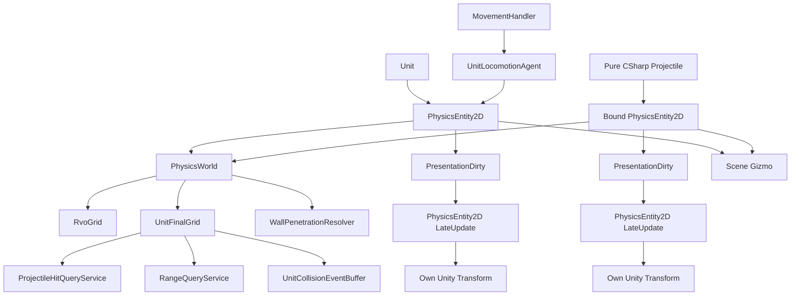
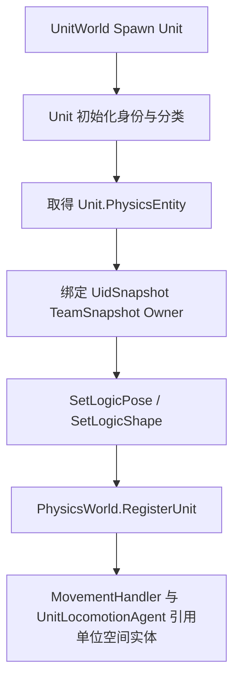
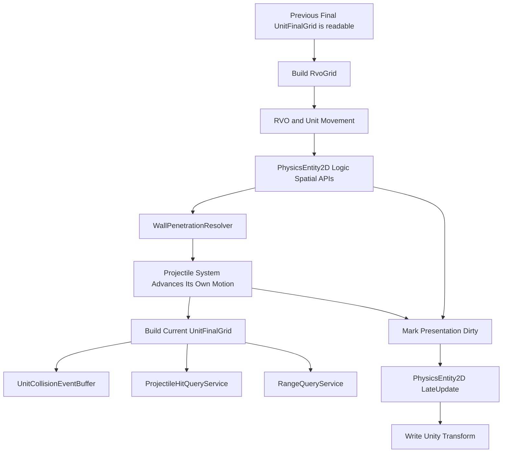

# MOBA 单位物理模拟与范围查询系统设计案 v13.1

> 适用范围：单位占位、投掷物命中查询、范围查询、单位碰撞事件、墙体内挤出修正、确定性逻辑空间状态、Unity `Transform` 的表现同步、Scene / Inspector 可视化。  
> 适配边界：单位侧遵循当前已冻结的 `MovementHandler / UnitLocomotionAgent / UnitWorld` 接口；投掷物侧仅向物理系统提供已经绑定并初始化完成的 `PhysicsEntity2D`，本文不规定投掷物实例、GameObject、Prefab、对象池或生命周期内部实现。  
> v13.1 小版本修订：冻结所有参与帧同步的 GameObject 根节点 Unity `Transform` 的唯一最终写入入口为 `PhysicsEntity2D.LateUpdate()`；其它 Gameplay、移动、投掷物、动画与表现组件不得重复写该根节点。`PhysicsEntityQueryInfo.UidSnapshot` 改为直接复用项目公共的只读运行时 UID 查询值，物理设计案不再重复声明或假设其内部字段类型。  
> `PhysicsEntity2D` 是 `MonoBehaviour`。它真正拥有并维护的是 `Transform2D / Shape / Bounds`；`UidSnapshot / TeamSnapshot / Kind / Owner` 只是从业务对象取得的查询镜像或回溯入口，不是业务真相源。  
> Inspector 上需要显示和修改的小数参数统一使用 `float`；进入 Gameplay 逻辑后统一转换为 `fp / fp2 / fp3`。  
> 本系统不追求精准刚体模拟，优先保证高效、稳定、规则清晰和易于调试。

---

## 目录

1. [总体设计结论](#一总体设计结论)
2. [`PhysicsEntity2D`：挂载在 GameObject 上的统一空间实体组件](#二physicsentity2d挂载在-gameobject-上的统一空间实体组件)
3. [实体注册、生命周期与类型来源](#三实体注册生命周期与类型来源)
4. [`PhysicsShape2D`：通用形状与点状支持](#四physicsshape2d通用形状与点状支持)
5. [`MovementHandler / UnitLocomotionAgent` 与空间写入边界](#五movementhandler--unitlocomotionagent-与空间写入边界)
6. [投掷物侧适配边界](#六投掷物侧适配边界)
7. [`PhysicsWorld` 与空间网格](#七physicsworld-与空间网格)
8. [`ProjectileHitQueryService`：投掷物命中查询](#八projectilehitqueryservice投掷物命中查询)
9. [`RangeQueryService`：通用范围查询](#九rangequeryservice通用范围查询)
10. [`UnitCollisionEventBuffer`：单位轻量碰撞事件](#十unitcollisioneventbuffer单位轻量碰撞事件)
11. [`WallPenetrationResolver`：墙体内挤出修正](#十一wallpenetrationresolver墙体内挤出修正)
12. [`PhysicsEntity2D` 逻辑空间写入与 LateUpdate 表现同步](#十二physicsentity2d-逻辑空间写入与-lateupdate-表现同步)
13. [Scene 可视化与 Inspector 配置](#十三scene-可视化与-inspector-配置)
14. [核心 Tick 流程](#十四核心-tick-流程)
15. [本版删除与简化项](#十五本版删除与简化项)
16. [推荐落地顺序](#十六推荐落地顺序)

---

# 一、总体设计结论

## 1.1 核心边界

本设计案是项目中 `PhysicsEntity2D`、`PhysicsTransform2D`、`PhysicsShape2D`、`PhysicsBounds2D` 与正式空间写入 API 的**唯一设计来源**。

其它系统只能引用并调用这里定义的公共契约，不再自行声明：

```text
另一套 PhysicsEntity2D
另一套 LogicTransform / LogicPose
另一套 OwnerBinding
另一套 ApplyUnitPose
绕过公共接口的逐字段空间写入
```

正式结构：

```text
PhysicsEntity2D : MonoBehaviour
    PhysicsTransform2D Transform2D
    PhysicsShape2D Shape
    PhysicsBounds2D Bounds
    PhysicsEntityQueryInfo QueryInfo

    SetLogicPosition(...)
    SetLogicPose(...)
    ApplyLogicPositionDelta(...)
    TeleportLogicPosition(...)
    SetLogicForward(...)
    SetLogicShape(...)

    LateUpdate()
```

权威来源固定为：

```text
UnitUid / TeamId / UnitKind / UnitSubKindId / UnitPrototypeId / LifeState / Capability
    -> Unit

单位所有位移业务入口
    -> MovementHandler

单位寻路、RVO、速度推进和移动结果计算
    -> UnitLocomotionAgent

ProjectileUid / Owner / Team / HitRule / HitMemory / 生命周期
    -> Projectile 及投掷物系统

投掷物具体运动方式
    -> Projectile

确定性 Position / PrevPosition / Forward / Right / Shape / Bounds
    -> PhysicsEntity2D

参与帧同步实体根节点的 Unity Transform
    -> PhysicsEntity2D.LateUpdate 根据最终逻辑姿态单向同步
    -> 这是唯一最终写入入口
```

`PhysicsEntity2D` 既保存空间状态，也提供修改空间状态的统一接口。  
外部模块不应绕过这些接口分别写 `Position / PrevPosition / Forward / Bounds`，否则容易出现 Sweep、AABB 和表现姿态不一致。

Gameplay 空间接口只更新确定性逻辑状态；它们不直接调用 `transform.position` 或 `transform.rotation`。同一组件在 Unity `LateUpdate` 中把本渲染帧最终逻辑姿态同步到自身 GameObject。

对于所有参与帧同步的 GameObject，挂载 `PhysicsEntity2D` 的实体根节点 `Transform` 只能由该组件的 `LateUpdate()` 写入。`MovementHandler`、`UnitLocomotionAgent`、`Projectile`、动画、VFX 和其它表现组件不得重复写这个根节点；模型偏移、动画骨骼、受击抖动等表现只能作用于 `RenderRoot` 或其它表现子节点。

`PhysicsEntityQueryInfo` 只为物理查询提供镜像索引或业务回溯入口。  
它不拥有、生成或解释单位与投掷物的业务状态。

`PhysicsWorld` 负责注册实体、构建空间索引、执行范围查询、检测轻量接触和计算墙体修正；它不决定单位如何移动，也不决定投掷物如何运动或结束。

## 1.2 Unit 与 PhysicsEntity2D

单位预制体通常挂载：

```text
Unit GameObject
    Unit
    MovementHandler
    UnitLocomotionAgent
    PhysicsEntity2D
```

这些组件保持平级关系：

```text
Unit
    -> PhysicsEntity2D

MovementHandler
    -> UnitLocomotionAgent

UnitLocomotionAgent
    -> PhysicsEntity2D
```

边界是：

```text
MovementHandler
    单位侧所有位移执行的统一业务入口。

UnitLocomotionAgent
    接收移动任务并计算移动结果。

PhysicsEntity2D
    保存最终确定性空间状态，
    通过统一接口更新 Position / PrevPosition / Forward / Bounds，
    并在 LateUpdate 中同步自身 Unity Transform。
```

物理设计案只依赖最终写入的 `PhysicsEntity2D`。  
`MovementHandler` 与 `UnitLocomotionAgent` 如何组织普通移动、Dash 和强制位移，以单位框架与移动系统设计为准。

单位身份、分类、生命周期和 Targetable 始终从 `Unit` 读取。

## 1.3 Projectile 与 PhysicsEntity2D

物理系统只要求投掷物侧在注册前提供：

```text
已经完成绑定和空间初始化的 PhysicsEntity2D
```

物理设计案不规定：

```text
Projectile 如何取得对应 GameObject
Projectile 与 GameObject 是否一一对象池化
Projectile Prefab 的内部组件布局
ProjectileWorld 如何创建、回收或复用表现对象
```

允许投掷物系统采用纯 C# `Projectile`，并持有或查询其对应的 `PhysicsEntity2D`。  
`PhysicsWorld` 不调用：

```text
projectile.GetComponent<PhysicsEntity2D>()
```

也不负责替投掷物系统建立绑定关系。

---

## 1.4 不使用 PhysicsEntityHandle

当前不是 ECS，也不允许外部修改 `PhysicsWorld` 的内部数组。  
`Unit`、`UnitLocomotionAgent` 和纯 C# `Projectile` 可以直接持有 `PhysicsEntity2D` 引用。

```text
PhysicsWorld
    private UnitEntities
    private ProjectileEntities
    RvoGrid
    UnitFinalGrid
```

跨 Tick 的 Gameplay 目标引用仍保存业务 UID，不保存物理数组下标。

---

## 1.5 查询元信息的定位

物理实体只需要一份轻量查询信息：

```text
PhysicsEntityQueryInfo
    RuntimeUidQueryValue UidSnapshot
    PhysicsEntityKind Kind
    TeamId TeamSnapshot
    object Owner
```

其中：

- `UidSnapshot` 直接复用项目公共的只读运行时 UID 查询值，由 `UnitUid` 或 `ProjectileUid` 转换得到。
- `Kind` 只用于选择单位或投掷物列表，以及决定如何回溯业务对象。
- `TeamSnapshot` 用于高频阵营初筛，权威值仍在 `Unit` 或投掷物业务对象。
- `Owner` 用于从候选空间实体回溯到 `Unit` 或投掷物对象。

不保存：

```text
Roles
Tags
Active
Version
UnitKind
UnitSubKindId
UnitPrototypeId
LifeState
CapabilityState
HitMemory
```

单位分类和目标状态在查询时从 `Unit` 读取。

---

## 1.6 总体结构



`PhysicsEntity2D` 的 Gameplay 空间接口只更新逻辑状态并标记 `PresentationDirty`。  
同一组件在 `LateUpdate` 中同步自身 Unity `Transform`，不新增全局同步系统或额外同步组件。

## 1.7 运行时原则

| 原则 | 说明 |
|---|---|
| 唯一定义来源 | `PhysicsEntity2D` 及其空间契约只由本设计案定义，其它系统只引用。 |
| 空间状态集中 | 位置、上一位置、朝向、形状和 AABB 集中保存在 `PhysicsEntity2D`。 |
| 空间写入统一 | 外部通过 `PhysicsEntity2D` 的公开空间接口修改逻辑空间状态，不逐字段散写。 |
| 单位移动边界 | `MovementHandler` 是单位位移业务入口；物理系统只消费最终空间结果。 |
| 投掷物边界最小 | 物理系统只读取已绑定的 `PhysicsEntity2D` 和调用方提供的命中规则。 |
| 最终网格不预过滤 | `UnitFinalGrid` 收录全部已注册且具有有效空间状态的单位。 |
| 过滤属于查询 | 阵营、分类、生命周期、Targetable 由每次查询参数决定。 |
| 网格是派生索引 | `RvoGrid / UnitFinalGrid` 不保存完整快照，恢复后重建。 |
| Tick 上下文统一 | 需要当前逻辑 Tick 时，函数内部读取 `SimulationTickContext.Current.Tick`，不在物理接口中重复传递 Context。 |
| 逻辑到表现单向 | Gameplay 只写 `Transform2D`；`PhysicsEntity2D.LateUpdate` 单向写 Unity `Transform`。 |
| 根 Transform 唯一写入 | 所有参与帧同步实体的 GameObject 根 `Transform` 只允许由 `PhysicsEntity2D.LateUpdate()` 写入；其它组件只能修改表现子节点。 |
| Scene Gizmo 只读 | 运行时默认读取逻辑姿态，可选显示表现姿态，不参与逻辑判断。 |

# 二、`PhysicsEntity2D`：挂载在 GameObject 上的统一空间实体组件

## 2.1 定位

`PhysicsEntity2D` 是单位和投掷物共同使用的空间实体组件，也是项目中该类型的唯一正式定义：

```text
PhysicsEntity2D : MonoBehaviour
    PhysicsTransform2D Transform2D
    PhysicsShape2D Shape
    PhysicsBounds2D Bounds
    PhysicsEntityQueryInfo QueryInfo

    PhysicsEntityAuthoring Authoring
    PhysicsEntityGizmoSettings Gizmo
```

真正拥有并维护的核心状态只有：

```text
Transform2D
Shape
Bounds
```

同时，它负责提供空间状态的统一修改接口，保证以下确定性数据同步变化：

```text
Position / PrevPosition
Forward / Right
Shape
Bounds
PresentationDirty
```

Unity `Transform` 不属于 Gameplay 权威状态。  
它只由 `PhysicsEntity2D.LateUpdate()` 根据最终逻辑姿态单向更新。

`QueryInfo` 只是查询镜像和业务回溯入口。

## 2.2 核心空间字段

| 字段 | 说明 |
|---|---|
| `Transform2D` | 当前位置、上一位置、Forward、Right。 |
| `Shape` | Point / Circle / Segment / Rect 与形状参数。 |
| `Bounds` | 当前形状的世界 AABB 与可选 `CellSpan` 缓存。 |

外部模块原则上不直接执行：

```text
entity.Transform2D.Position = ...
entity.Transform2D.Forward = ...
entity.Shape.Radius = ...
```

而是调用：

```text
SetLogicPosition
SetLogicPose
ApplyLogicPositionDelta
TeleportLogicPosition
SetLogicForward
SetLogicShape
```

每次修改后由 `PhysicsEntity2D` 统一更新 `Bounds` 并标记 `PresentationDirty`；Unity `Transform` 只在该组件的 `LateUpdate` 中同步。

## 2.3 `PhysicsEntityQueryInfo`

```text
PhysicsEntityQueryInfo
    RuntimeUidQueryValue UidSnapshot
    PhysicsEntityKind Kind
    TeamId TeamSnapshot
    object Owner
```

`RuntimeUidQueryValue` 是项目公共的只读运行时 UID 查询值。物理设计案直接复用该公共契约，不再单独声明 `SpawnLogicTick / RuntimeEntityPrefabId / SpawnSequenceInTick` 的基础字段类型，也不对不同业务 UID 的内部存储作额外假设。

### UidSnapshot

单位和投掷物仍分别由 `UnitUid` 与 `ProjectileUid` 权威维护运行时身份。注册或刷新查询信息时，由业务侧把权威 UID 转换或映射为同一个 `RuntimeUidQueryValue`：

```text
Unit.UnitUid
    -> RuntimeUidQueryValue
    -> PhysicsEntityQueryInfo.UidSnapshot

Projectile.ProjectileUid
    -> RuntimeUidQueryValue
    -> PhysicsEntityQueryInfo.UidSnapshot
```

物理系统只把这个完整只读值用于：

```text
网格候选去重
稳定排序
碰撞 PairKey
PreviousPairs
日志与断言
```

物理系统不拆解、分配或重新编码 UID，不决定序列号类型、作用域、重置和溢出规则，也不以 `UidSnapshot` 替代业务对象持有的权威 UID。

### Kind

```text
PhysicsEntityKind
    Unit
    Projectile
```

只表达业务来源类别。  
它不决定命中、移动、伤害或生命周期规则。

### TeamSnapshot

只用于高频初筛。  
阵营发生合法变化时，由业务系统刷新。权威阵营仍在业务对象。

### Owner

单位实体通常回溯到 `Unit`。  
投掷物实体的回溯对象由投掷物系统绑定。物理系统不规定绑定方式。

---

## 2.4 明确不属于 PhysicsEntity2D 的内容

```text
Unit.UnitUid
Unit.TeamId
Unit.UnitKind
Unit.UnitSubKindId
Unit.UnitPrototypeId
Unit.LifeState
Unit.Capability
Projectile.ProjectileUid
Projectile.HitMemory
Projectile 生命周期和 Pipeline
```

物理系统需要这些信息时，通过 `Owner` 回到业务对象读取，或由调用方把规则作为查询输入传入。

---

## 2.5 `PhysicsTransform2D`

```text
PhysicsTransform2D
    fp2 Position
    fp2 PrevPosition
    fp2 Forward
    fp2 Right
```

`Forward / Right` 直接服务于 Segment、Rect 和朝向同步，避免在高频检测中反复计算三角函数。

---

## 2.6 空间写入接口

正式接口：

```csharp
public sealed class PhysicsEntity2D : MonoBehaviour
{
    public PhysicsTransform2D Transform2D { get; private set; }
    public PhysicsShape2D Shape { get; private set; }
    public PhysicsBounds2D Bounds { get; private set; }

    public void SetLogicPosition(fp2 position);
    public void SetLogicPose(fp2 position, fp2 forward);
    public void ApplyLogicPositionDelta(fp2 delta);
    public void TeleportLogicPosition(fp2 position);
    public void SetLogicForward(fp2 forward);
    public void SetLogicShape(in PhysicsShape2D shape);
}
```

寻路和移动系统只需要依赖以下最小契约：

```text
读取：
    Position
    Forward
    Bounds

写入：
    ApplyLogicPositionDelta
    SetLogicPose
    TeleportLogicPosition
```

其它接口用于投掷物、生成初始化、形状变化或通用空间修改。

### 普通位置修改

```pseudo
function SetLogicPosition(newPosition):
    Transform2D.PrevPosition = Transform2D.Position
    Transform2D.Position = newPosition

    UpdateBounds()
    MarkPresentationDirty()
```

适用于普通移动、Dash 的离散推进、强制位移推进和墙体小幅修正。

### 位姿修改

```pseudo
function SetLogicPose(newPosition, newForward):
    Transform2D.PrevPosition = Transform2D.Position
    Transform2D.Position = newPosition

    if LengthSq(newForward) > epsilon:
        Transform2D.Forward = NormalizeFP(newForward)
        Transform2D.Right = PerpRight(Transform2D.Forward)

    UpdateBounds()
    MarkPresentationDirty()
```

当一次移动同时确定位置与朝向时，优先使用该接口，避免重复更新 Bounds。

### 增量修改

```pseudo
function ApplyLogicPositionDelta(delta):
    SetLogicPosition(
        Transform2D.Position + delta
    )
```

### 传送

```pseudo
function TeleportLogicPosition(newPosition):
    Transform2D.Position = newPosition
    Transform2D.PrevPosition = newPosition

    UpdateBounds()
    MarkPresentationDirty()
```

传送时让 `PrevPosition == Position`，避免 Point 或 Circle Sweep 产生从旧地点到新地点的超长误命中。

### 朝向修改

```pseudo
function SetLogicForward(forward):
    if LengthSq(forward) <= epsilon:
        return

    Transform2D.Forward = NormalizeFP(forward)
    Transform2D.Right = PerpRight(Transform2D.Forward)

    UpdateBounds()
    MarkPresentationDirty()
```

### 形状修改

```pseudo
function SetLogicShape(shape):
    Shape = SanitizeShape(shape)
    UpdateBounds()
```

形状变化必须立即刷新 AABB。它不要求修改 GameObject 的位置或旋转。

### 恢复空间状态

快照恢复不应逐字段调用普通移动接口，否则会错误覆盖 `PrevPosition`。推荐提供内部恢复入口：

```pseudo
function RestoreLogicSpatialState(snapshot):
    Transform2D = snapshot.Transform2D
    Shape = snapshot.Shape

    UpdateBounds()
    MarkPresentationDirty()
```

该入口只供所属聚合根恢复流程调用。

---

## 2.7 Unity Transform 表现同步边界

Gameplay 空间接口只写确定性逻辑状态，不直接写 Unity `Transform`。

同一个 `PhysicsEntity2D` 在 `LateUpdate()` 中完成表现同步，不新增额外同步组件。对于所有参与帧同步的 GameObject，这个 `LateUpdate()` 同时是实体根节点 Unity `Transform` 的唯一最终写入入口：

```pseudo
function LateUpdate():
    if not LogicStateInitialized:
        return

    if not PresentationDirty:
        return

    if SyncPosition:
        world3 = GridMap.ToWorld3D(Transform2D.Position)
        world3.y += HeightOffset
        transform.position = ToUnityVector3(world3)

    if SyncRotation:
        forward3 = Vector3(
            Transform2D.Forward.x,
            0,
            Transform2D.Forward.y
        )

        if forward3.sqrMagnitude > epsilon:
            transform.rotation =
                Quaternion.LookRotation(forward3, Vector3.up)

    PresentationDirty = false
```

这样在一个 Unity 渲染帧内发生多次 Gameplay Tick、回滚恢复或重演时，GameObject 只会在 `LateUpdate` 同步最终逻辑姿态，不会依次经过历史中间位置。

固定边界：

```text
允许：
    Gameplay 模块调用 PhysicsEntity2D 正式空间接口
    PhysicsEntity2D.LateUpdate 读取 Transform2D 并写自身实体根 Unity Transform
    动画、模型偏移、VFX 和受击抖动修改 RenderRoot 或其它表现子节点
    编辑器预览读取 Unity Transform
    Scene Gizmo 读取逻辑空间状态

禁止：
    Gameplay 空间接口直接写 transform.position / transform.rotation
    MovementHandler / UnitLocomotionAgent / Projectile 重复写实体根 Transform
    Animator、VFX、表现脚本或其它组件写参与帧同步实体的根 Transform
    Gameplay Tick 中读取 transform.position 作为逻辑位置
    Gameplay Tick 中读取 transform.rotation 作为逻辑朝向
    Unity Physics 结果反向覆盖逻辑空间状态
```

### MonoBehaviour 的实际价值

```text
1. 在单位或投掷物对应的 Unity GO 上承载空间组件
2. Inspector 配置 float 形状和表现同步参数
3. Scene 直接绘制 Point / Circle / Segment / Rect / Sweep / Bounds
4. LateUpdate 把最终逻辑姿态同步到自身 GameObject
5. 便于 Unit 或投掷物系统持有稳定组件引用
```

`PhysicsEntity2D` 是 Unity 空间宿主，不是 Unity Physics 的 `Collider / Rigidbody`。

# 三、实体注册、生命周期与类型来源

## 3.1 注册入口

`PhysicsWorld` 只接收已经完成业务绑定和空间初始化的实体：

```text
PhysicsWorld.RegisterUnit(PhysicsEntity2D entity)
PhysicsWorld.RegisterProjectile(PhysicsEntity2D entity)
PhysicsWorld.Unregister(PhysicsEntity2D entity)
```

注册成功后分别进入内部列表：

```text
private List<PhysicsEntity2D> UnitEntities
private List<PhysicsEntity2D> ProjectileEntities
```

列表不向外暴露可修改引用。

---

## 3.2 类型来源

类型只在注册时确定一次。

单位侧可以显式写入：

```text
entity.QueryInfo.Kind = Unit
```

投掷物侧在完成绑定后显式写入：

```text
entity.QueryInfo.Kind = Projectile
```

`PhysicsWorld` 不需要在 Gameplay Tick 中执行 `GetComponent` 或读取 Unity Tag。  
Tag / Component 是否用于业务系统内部定位对象，不属于物理设计案的职责。

---

## 3.3 单位注册

单位生成时，`UnitWorld` 从预制体实例取得 `PhysicsEntity2D`，绑定单位查询镜像和空间状态。单位框架 v23 的权威分类为：

```text
UnitKind
ushort UnitSubKindId
UnitPrototypeId
```

这些分类不复制到 `PhysicsEntity2D`。



伪代码：

```pseudo
function RegisterUnitFromUnitWorld(unit, spawnPosition, spawnForward):
    entity = unit.PhysicsEntity

    entity.ClearRuntime()

    entity.QueryInfo.UidSnapshot = CopyUid(unit.UnitUid)
    entity.QueryInfo.Kind = Unit
    entity.QueryInfo.TeamSnapshot = unit.TeamId
    entity.QueryInfo.Owner = unit

    entity.SetLogicPose(
        spawnPosition,
        spawnForward
    )

    entity.SetLogicShape(
        unit.Prototype.PhysicsProfile2D.Shape
    )

    PhysicsWorld.RegisterUnit(entity)
```

单位空间形状来自 `UnitPrototype.PhysicsProfile2D`，并与移动系统使用的半径语义保持一致。

单位侧注册和注销的调用权固定归 `UnitWorld`。  
`CombatSystem`、Buff、技能和控制系统不能直接把单位加入或移出 `PhysicsWorld`。

## 3.4 投掷物注册边界

物理系统不规定投掷物如何创建、如何取得 GO、如何池化，也不调用：

```text
projectile.GetComponent<PhysicsEntity2D>()
```

投掷物系统只需在合适时机完成：

```text
1. 将纯 C# Projectile 与某个 PhysicsEntity2D 绑定
2. 写入 UidSnapshot / Kind / TeamSnapshot / Owner
3. 初始化 Transform2D / Shape / Bounds
4. 调用 PhysicsWorld.RegisterProjectile(entity)
```

物理系统对外只看到：

```text
PhysicsEntity2D entity
```

示意接口：

```pseudo
function RegisterProjectileEntity(entity):
    assert entity.QueryInfo.Kind == Projectile
    assert entity.QueryInfo.Owner is valid
    assert entity.Bounds is updated

    PhysicsWorld.RegisterProjectile(entity)
```

这里不描述投掷物对象池、Prefab Root 或 GameObject 获取流程，避免越过投掷物系统边界。

---

## 3.5 反注册

单位侧：

```text
UnitWorld
    -> PhysicsWorld.UnregisterUnit(entity)
```

投掷物侧：

```text
ProjectileWorld 或投掷物系统当前生命周期管理入口
    -> PhysicsWorld.UnregisterProjectile(entity)
```

物理设计案不规定投掷物内部调用时机，只要求在实体不再参与空间查询或准备复用前完成反注册。

```pseudo
function UnregisterUnit(entity):
    RemoveFromUnitEntities(entity)
    RemoveFromRvoGrid(entity)
    RemoveFromUnitFinalGrid(entity)
    entity.ClearRuntime()

function UnregisterProjectile(entity):
    RemoveFromProjectileEntities(entity)
    entity.ClearRuntime()
```

内部列表不向外暴露可修改引用。

## 3.6 `ClearRuntime` 边界

只清理物理组件自己的运行时内容：

```text
Transform2D
Shape
Bounds
QueryInfo
```

不清理：

```text
Unit Handler / EventBus / Stats
Projectile HitMemory / ModuleState / Def
```

# 四、`PhysicsShape2D`：通用形状与点状支持

## 4.1 支持形状

本版必须支持：

```text
Point
Circle
Segment
Rect
```

```text
PhysicsShapeKind
    Point
    Circle
    Segment
    Rect
```

形状用途：

| 形状 | 用途 |
|---|---|
| `Point` | 远程普攻、小型飞弹、点状检测源。 |
| `Circle` | 单位占位、圆形飞弹、圆形区域。 |
| `Segment` | 直线射线、激光、细长命中带。 |
| `Rect` | 框形区域、矩形技能区域。 |

---

## 4.2 `PhysicsShape2D` 数据

```text
PhysicsShape2D
    PhysicsShapeKind Kind

    fp2 LocalOffset

    fp Radius
    fp Length
    fp Width
    fp2 HalfExtents

    bool SweepFromPrev
```

不同形状使用字段：

| Shape | 使用字段 |
|---|---|
| `Point` | `LocalOffset`, `SweepFromPrev` |
| `Circle` | `LocalOffset`, `Radius`, `SweepFromPrev` |
| `Segment` | `LocalOffset`, `Length`, `Width`, `SweepFromPrev` |
| `Rect` | `LocalOffset`, `HalfExtents`, `SweepFromPrev` 可选 |

`LocalOffset` 表示形状中心相对实体位置的偏移，偏移按实体 `Forward / Right` 解释。

---

## 4.3 Point 形状语义

`Point` 表示：

```text
实体自身没有命中半径。
命中成立条件由点与目标形状决定。
```

常见命中：

| 情况 | 检测方式 |
|---|---|
| 静止 Point vs 单位圆 | 点是否落在单位圆内。 |
| 移动 Point vs 单位圆 | `PrevPosition -> Position` 线段是否穿过单位圆。 |
| Point 查询范围 | 查询点所在格，候选单位由单位圆插入网格保证覆盖。 |
| Point Sweep 查询范围 | 查询 Sweep 线段 AABB 覆盖格。 |

点状飞弹不要再用“极小 Circle”硬凑。  
例如远程普攻弹体推荐：

```text
Shape.Kind = Point
Shape.SweepFromPrev = true
```

---

## 4.4 形状世界参数计算

所有形状都从 `PhysicsEntity2D.Transform2D` 推导世界参数。

### Point

```pseudo
function GetPointWorld(entity):
    return entity.Transform2D.Position
         + entity.Transform2D.Right   * entity.Shape.LocalOffset.x
         + entity.Transform2D.Forward * entity.Shape.LocalOffset.y
```

### Circle

```pseudo
function GetCircleWorld(entity):
    center = GetPointWorld(entity)
    radius = entity.Shape.Radius
    return center, radius
```

### Segment

```pseudo
function GetSegmentWorld(entity):
    center = GetPointWorld(entity)
    half = entity.Shape.Length / 2

    a = center - entity.Transform2D.Forward * half
    b = center + entity.Transform2D.Forward * half

    width = entity.Shape.Width
    return a, b, width
```

### Rect

```pseudo
function GetRectWorld(entity):
    center = GetPointWorld(entity)
    right = entity.Transform2D.Right
    forward = entity.Transform2D.Forward
    halfExtents = entity.Shape.HalfExtents

    return center, right, forward, halfExtents
```

---

## 4.5 AABB 更新

`PhysicsEntity2D` 每次位置或形状改变后，需要更新 `Bounds`。

```pseudo
function UpdateBounds(entity):
    switch entity.Shape.Kind:
        case Point:
            p = GetPointWorld(entity)
            if entity.Shape.SweepFromPrev:
                prev = entity.Transform2D.PrevPosition
                Bounds = AabbFromSegment(prev, p)
            else:
                Bounds = AabbFromPoint(p)

        case Circle:
            center, radius = GetCircleWorld(entity)
            Bounds = AabbFromCircle(center, radius)

            if entity.Shape.SweepFromPrev:
                prevCenter = entity.Transform2D.PrevPosition
                sweepBounds = AabbFromSegment(prevCenter, center).Expand(radius)
                Bounds = Union(Bounds, sweepBounds)

        case Segment:
            a, b, width = GetSegmentWorld(entity)
            Bounds = AabbFromSegment(a, b).Expand(width / 2)

        case Rect:
            Bounds = AabbFromOrientedRect(entity)
```

---

# 五、`MovementHandler / UnitLocomotionAgent` 与空间写入边界

## 5.1 平级关系

单位侧常见结构：

```text
UnitPrefabRoot
    Unit
    MovementHandler
    UnitLocomotionAgent
    PhysicsEntity2D
```

四者都是单位对象上的独立组件或服务引用，不形成“`PhysicsEntity2D` 属于 `UnitLocomotionAgent`”的所有权关系。

---

## 5.2 职责边界

```text
MovementHandler
    单位侧所有位移执行的统一业务入口。

UnitLocomotionAgent
    负责移动任务、路线解析、RVO 接入、速度推进和移动结果计算。

PhysicsEntity2D
    保存空间结果，
    提供统一空间写入接口，
    更新 Bounds，
    标记表现姿态待同步。
```

物理系统不规定 `MovementHandler` 与 `UnitLocomotionAgent` 的内部任务、仲裁和状态机。  
它只要求最终空间结果通过 `PhysicsEntity2D` 的公开接口写入。

---

## 5.3 位置和朝向写入

示意链路：

```text
主动移动 / Dash / 强制位移
    -> MovementHandler
    -> UnitLocomotionAgent
    -> PhysicsEntity2D.SetLogicPose / SetLogicPosition
```

示意伪代码：

```pseudo
function CommitComputedUnitMotion(entity, nextPosition, nextForward):
    entity.SetLogicPose(
        nextPosition,
        nextForward
    )
```

`UnitLocomotionAgent` 可以把以下属性作为便捷只读视图暴露给移动系统：

```pseudo
function GetLogicPosition2D():
    return PhysicsEntity.Transform2D.Position

function GetFacing2D():
    return PhysicsEntity.Transform2D.Forward
```

但不再自己保存第二份：

```text
LogicPosition2D
Facing2D
Shape
Radius
Bounds
```

---

## 5.4 墙体修正接缝

`WallPenetrationResolver` 只计算修正量，不越过单位侧移动入口直接修改单位空间状态。

推荐物理侧调用：

```text
unit.MovementHandler.ApplyMovementCorrection(
    correctionDelta,
    WallDepenetration
)
```

单位侧如何把修正转交给 `UnitLocomotionAgent`，由单位框架与移动系统决定。  
最终仍应落到：

```text
PhysicsEntity2D.ApplyLogicPositionDelta(...)
```

物理设计案不再冻结 `MovementHandler` 内部方法名；只冻结“单位空间修正必须走单位侧公开移动入口”。

---

## 5.5 单位形状

单位第一版统一使用圆形：

```text
PhysicsEntity2D.Shape.Kind = Circle
PhysicsEntity2D.Shape.Radius = PathAgentShape.RadiusFP
```

`PathAgentShape` 仍是移动半径和单位通行语义的来源。  
`PhysicsEntity2D` 保存当前运行时形状参数，供空间查询统一使用。

推荐规则：

```text
第一版：移动半径 == 受击半径 == 单位 Physics Circle Radius
```

后续如果拆分移动半径和受击半径，需要同时更新寻路、移动和命中查询语义。

# 六、投掷物侧适配边界

## 6.1 最小协作协议

物理系统只依赖以下事实：

```text
Projectile 是纯 C# Gameplay 对象。
Projectile 可以获得并持有一个已经绑定的 PhysicsEntity2D。
ProjectileHit 查询时，调用方能提供：
    PhysicsEntity2D SourceEntity
    ProjectileTargetFilter
    命中排序与形状测试所需输入
```

物理系统不规定 `Projectile` 的 GameObject、Prefab 和对象池结构。

---

## 6.2 空间状态

投掷物如何运动由 `Projectile` 自身规则决定。  
当投掷物需要改变位置、朝向或形状时，只需操作其已经绑定的 `PhysicsEntity2D`：

```text
PhysicsEntity2D.SetLogicPosition(...)
PhysicsEntity2D.SetLogicPose(...)
PhysicsEntity2D.ApplyLogicPositionDelta(...)
PhysicsEntity2D.TeleportLogicPosition(...)
PhysicsEntity2D.SetLogicForward(...)
PhysicsEntity2D.SetLogicShape(...)
```

物理系统不规定 `Projectile` 的运动模块、生命周期阶段或调用顺序。

投掷物自身继续拥有：

```text
ProjectileUid
Owner
HitRule
HitMemory
生命周期
运动运行时状态
Pipeline / Effect 提交
```

哪些空间字段进入 `ProjectileWorldSnapshot`，由投掷物系统统一聚合；`PhysicsRuntimeSnapshot` 不重复保存第二份。

## 6.3 HitCheck 调用

```pseudo
function HitCheck(projectile):
    sourceEntity = projectile.PhysicsEntity

    hits = PhysicsWorld.ProjectileHitQuery.Query(
        sourceEntity,
        projectile.TargetFilter,
        projectile.TempHitBuffer
    )

    projectile.ProcessHitCandidates(hits)
```

`ProjectileHitQueryService` 只返回候选命中。  
以下内容仍属于投掷物系统：

```text
HitEvent
HitMemory
PerTargetCooldown
MaxHitCount
穿透与反弹
命中后结束
效果提交
```

---

## 6.4 不写入投掷物系统的实现假设

物理设计案不再出现：

```text
ProjectilePrefabRoot 必须有哪些组件
ProjectileWorld 必须从哪个池取得 PhysicsEntity2D
Projectile.GetComponent
投掷物对象池激活与回收顺序
投掷物 SpawnPipeline 的完整阶段
```

只保留已绑定实体的消费接口。

# 七、`PhysicsWorld` 与空间网格

## 7.1 核心数据

```text
PhysicsWorld
    PhysicsWorldSettings Settings

    List<PhysicsEntity2D> UnitEntities
    List<PhysicsEntity2D> ProjectileEntities

    PhysicsSpatialGrid2D RvoGrid
    PhysicsSpatialGrid2D UnitFinalGrid

    ProjectileHitQueryService ProjectileHitQuery
    RangeQueryService RangeQuery
    UnitCollisionEventBuffer UnitCollisionEvents
    WallPenetrationResolver WallResolver
```

---

## 7.2 两张单位网格

| 网格 | 构建时机 | 用途 |
|---|---|---|
| `RvoGrid` | 单位移动前 | RVO 邻居查询。 |
| `UnitFinalGrid` | 单位移动和墙体修正后 | 投掷物命中、范围查询、单位碰撞事件。 |

投掷物默认不进入这两张单位目标网格。

---

## 7.3 UnitFinalGrid 不提前过滤业务状态

`UnitFinalGrid` 的含义是：

```text
当前已经注册并具有有效空间状态的全部单位实体
```

构建时不判断：

```text
Capability.IsTargetable
LifeState
UnitKind
UnitSubKindId
UnitPrototypeId
TeamRelation
```

伪代码：

```pseudo
function BuildUnitFinalGrid():
    UnitFinalGrid.Clear()

    for entity in UnitEntities:
        unit = entity.QueryInfo.Owner as Unit

        if unit is null:
            continue

        entity.UpdateBounds()

        span = Map.AabbToCellSpan(entity.Bounds)
        UnitFinalGrid.Insert(entity, span)
```

例如英雄处于 `Dead / Respawning` 且 GameObject 与空间实体仍保留时，可以继续存在于 `UnitFinalGrid`。  
正常战斗查询通过 `LifeStateMask` 和 `RequireTargetable` 排除它；特殊查询则可以显式包含。

---

## 7.4 RvoGrid 独立构建

RVO 的参与条件属于移动系统：

```pseudo
function BuildRvoGrid():
    RvoGrid.Clear()

    for entity in UnitEntities:
        unit = entity.QueryInfo.Owner as Unit

        if unit is null:
            continue

        if not unit.AbilityMask.HasMovement:
            continue

        if not unit.Locomotion.CanUseRvo():
            continue

        entity.UpdateBounds()
        RvoGrid.Insert(
            entity,
            Map.AabbToCellSpan(entity.Bounds)
        )
```

`UnitFinalGrid` 与 `RvoGrid` 使用不同构建规则，不需要 `Roles` 字段。

---

## 7.5 候选去重

同一个实体可能跨多个格子，因此任何跨格查询必须先去重。

```pseudo
function CollectUniqueCandidates(span, output, visited):
    output.Clear()
    visited.Clear()

    for cell in span:
        for entity in cell.Entities:
            key = entity.QueryInfo.UidSnapshot

            if visited.Contains(key):
                continue

            visited.Add(key)
            output.Add(entity)
```

去重键使用三字段 `UidSnapshot`。

---

## 7.6 空间网格与 `PhysicsRuntimeSnapshot`

`UnitFinalGrid`、`RvoGrid`、格子桶、Bounds 缓存和查询临时缓冲都是空间状态的派生数据，不保存完整快照。

正式结构：

```text
PhysicsRuntimeSnapshot
    UnitCollisionEventBufferSnapshot

UnitCollisionEventBufferSnapshot
    UnitContactPair[] PreviousPairs
```

只保存会影响恢复后 `Enter / Exit` 语义的 `PreviousPairs`。

不保存：

```text
CurrentPairs
UnitFinalGrid
RvoGrid
CellBuckets
TempCandidates
VisitedUid
Bounds
RangeQuery Ready 标记
Unity Transform
PresentationDirty
```

`PhysicsWorld` 作为聚合根实现统一回滚接口：

```csharp
public sealed class PhysicsWorld :
    IRollback<PhysicsRuntimeSnapshot>
{
    public void Capture(ref PhysicsRuntimeSnapshot state);
    public void Restore(in PhysicsRuntimeSnapshot state);
    public void Resolve(in RollbackContext context);
    public void Rebuild(in RollbackContext context);
}
```

### Capture

```pseudo
function Capture(ref state):
    sortedPairs = Copy(
        UnitCollisionEvents.PreviousPairs
    )

    Sort(
        sortedPairs,
        by MinUid,
        then MaxUid
    )

    state.UnitCollisionEventBuffer.PreviousPairs =
        sortedPairs
```

保存前必须稳定排序，不能让 `HashSet`、字典或内存遍历顺序进入快照。

### Restore

`Restore` 只读取快照并暂存接触历史，不立即重建网格，也不执行碰撞检测：

```pseudo
function Restore(in state):
    PendingRestoredPreviousPairs =
        Copy(state.UnitCollisionEventBuffer.PreviousPairs)

    RangeQuery.MarkNotReady()
```

### Resolve

当前 `PreviousPairs` 只保存稳定 UID 值，不持有需要重绑的对象引用，因此第一版可以为空实现：

```pseudo
function Resolve(in rollbackContext):
    // No external object references to resolve.
```

若后续 Pair 数据增加对象引用，也必须在这里通过 UID 注册表重新解析，不能把旧内存引用直接带过恢复点。

### Rebuild

恢复顺序固定为：

```text
1. UnitWorld 恢复单位及其 PhysicsEntity2D 空间状态
2. ProjectileWorld 恢复投掷物及其 PhysicsEntity2D 空间状态
3. PhysicsWorld.Rebuild 更新全部 Bounds
4. 重建 RvoGrid
5. 重建 UnitFinalGrid
6. 应用暂存的 UnitCollisionEventBuffer.PreviousPairs
7. RangeQuery 标记为 Ready
8. 下一 Tick 才执行正常 Collision Detect
```

```pseudo
function Rebuild(in rollbackContext):
    RangeQuery.MarkNotReady()

    for entity in UnitEntities:
        entity.UpdateBounds()
        entity.MarkPresentationDirty()

    for entity in ProjectileEntities:
        entity.UpdateBounds()
        entity.MarkPresentationDirty()

    BuildRvoGrid()
    BuildUnitFinalGrid()

    UnitCollisionEvents.RestorePreviousPairs(
        PendingRestoredPreviousPairs
    )

    PendingRestoredPreviousPairs.Clear()
    RangeQuery.MarkReady()
```

`PhysicsRuntimeSnapshot` 不保存 `PhysicsEntity2D` 空间状态。  
单位空间状态由 `UnitWorldSnapshot` 的聚合恢复入口写回；投掷物空间状态由 `ProjectileWorldSnapshot` 的聚合恢复入口写回。

Unity `Transform` 不进入任何 Gameplay 快照。恢复或重演完成后，由各 `PhysicsEntity2D.LateUpdate()` 同步最终逻辑姿态。

# 八、`ProjectileHitQueryService`：投掷物命中查询

## 8.1 定位

服务只负责：

```text
1. 读取已绑定 SourceEntity 的 Shape / Bounds
2. 查询 UnitFinalGrid
3. 去重
4. 根据 ProjectileTargetFilter 过滤 Unit
5. 做精确形状测试
6. 稳定排序
7. 返回候选
```

它不 Tick 投掷物，不维护命中记忆，不执行效果。

---

## 8.2 通用单位目标过滤

投掷物命中与普通范围查询复用：

```text
UnitTargetFilter
    TeamQueryRule TeamRule

    UnitKindMask UnitKindMask

    bool RequireSubKind
    ushort UnitSubKindId

    bool RequirePrototype
    int UnitPrototypeId

    UnitLifeStateMask LifeStateMask
    bool RequireTargetable
```

单位框架 v23 不使用运行时 `UnitTags`，也没有采用 `UnitQueryTraitMask`。  
主要分类改为：

```text
UnitKind
ushort UnitSubKindId
```

具体单位原型使用：

```text
UnitPrototypeId
```

所有字段从 `Unit` 读取。

---

## 8.3 输入输出

```text
ProjectileHitQueryInput
    PhysicsEntity2D SourceEntity
    UnitTargetFilter TargetFilter
    TempBuffer Candidates

ProjectileHitCandidate
    PhysicsEntity2D TargetEntity
    Unit TargetUnit
    fp HitDistance
    fp2 HitPosition
```

---

## 8.4 查询流程

```pseudo
function QueryProjectileHits(source, filter, temp):
    temp.Clear()

    if source.QueryInfo.Kind != Projectile:
        return temp.Empty

    raw = UnitFinalGrid.QueryAabb(source.Bounds)
    unique = DeduplicateByUid(raw)

    for target in unique:
        unit = target.QueryInfo.Owner as Unit

        if unit is null:
            continue

        if not PassUnitTargetFilter(
            requesterUid = source.QueryInfo.UidSnapshot,
            requesterTeam = source.QueryInfo.TeamSnapshot,
            unit = unit,
            filter = filter
        ):
            continue

        if not ShapeOverlap(
            source,
            target,
            out hitPoint,
            out hitDistance
        ):
            continue

        temp.Add(
            ProjectileHitCandidate(
                target,
                unit,
                hitDistance,
                hitPoint
            )
        )

    SortProjectileHits(temp, source)
    return temp
```

---

## 8.5 形状精确测试

### Point vs Unit Circle

```pseudo
function PointVsUnitCircle(point, unitCircle):
    d = point - unitCircle.center
    return Dot(d, d) <= unitCircle.radius * unitCircle.radius
```

### Swept Point vs Unit Circle

```pseudo
function SweptPointVsUnitCircle(prev, curr, unitCircle):
    closest = ClosestPointOnSegment(
        unitCircle.center,
        prev,
        curr
    )

    d = unitCircle.center - closest
    return Dot(d, d) <= unitCircle.radius * unitCircle.radius
```

### Circle vs Unit Circle

```pseudo
function CircleVsUnitCircle(circle, unitCircle):
    r = circle.radius + unitCircle.radius
    d = circle.center - unitCircle.center
    return Dot(d, d) <= r * r
```

### Segment vs Unit Circle

```pseudo
function SegmentVsUnitCircle(a, b, width, unitCircle):
    closest = ClosestPointOnSegment(unitCircle.center, a, b)
    r = unitCircle.radius + width / 2
    d = unitCircle.center - closest
    return Dot(d, d) <= r * r
```

### Rect vs Unit Circle

```pseudo
function RectVsUnitCircle(rect, unitCircle):
    local = WorldToRectLocal(unitCircle.center, rect)
    clamped = Clamp(
        local,
        -rect.halfExtents,
        rect.halfExtents
    )

    d = local - clamped
    return Dot(d, d) <= unitCircle.radius * unitCircle.radius
```

---

## 8.6 稳定排序

移动投掷物：

```text
1. 沿运动方向的 HitDistance
2. TargetEntity.UidSnapshot
```

静止区域：

```text
TargetEntity.UidSnapshot
```

命中数量、穿透数量和 `MaxHitCount` 由投掷物系统在候选已稳定排序后处理。

# 九、`RangeQueryService`：通用范围查询

## 9.1 定位

`RangeQueryService` 面向技能、AI、战斗和 Buff 等模块查询单位。  
默认读取移动与墙体修正后的 `UnitFinalGrid`。

---

## 9.2 查询描述

```text
RangeQueryDesc
    PhysicsShape2D Shape
    PhysicsTransform2D Transform

    UnitTargetFilter TargetFilter

    RangeQuerySortMode SortMode
    int MaxResult
```

复用的 `UnitTargetFilter`：

```text
TeamQueryRule TeamRule
UnitKindMask UnitKindMask

bool RequireSubKind
ushort UnitSubKindId

bool RequirePrototype
int UnitPrototypeId

UnitLifeStateMask LifeStateMask
bool RequireTargetable
```

没有：

```text
IncludeTags
ExcludeTags
UnitQueryTraitMask
```

---

## 9.3 TeamQueryRule

```text
TeamQueryRule
    Any
    EnemyOnly
    AllyOnly
    AllyOrSelf
    SelfOnly
```

| 规则 | 说明 |
|---|---|
| `Any` | 不限制阵营。 |
| `EnemyOnly` | 仅敌方有效。 |
| `AllyOnly` | 仅友方有效，不包含自己。 |
| `AllyOrSelf` | 友方和自己有效。 |
| `SelfOnly` | 仅自己有效。 |

---

## 9.4 单位分类过滤

```pseudo
function PassUnitClassification(unit, filter):
    if not filter.UnitKindMask.Contains(unit.UnitKind):
        return false

    if filter.RequireSubKind:
        if unit.UnitSubKindId != filter.UnitSubKindId:
            return false

    if filter.RequirePrototype:
        if unit.UnitPrototypeId != filter.UnitPrototypeId:
            return false

    return true
```

语义：

| 字段 | 用途 |
|---|---|
| `UnitKind` | Hero / Minion / Monster / Structure 等宽泛大类。 |
| `UnitSubKindId` | EpicMonster / Tower / CloneHero 等主要子分类。 |
| `UnitPrototypeId` | 指定某个具体 Gameplay 原型。 |

---

## 9.5 完整过滤

```pseudo
function PassUnitTargetFilter(
    requesterUid,
    requesterTeam,
    unit,
    filter
):
    if not PassTeamRule(
        requesterUid,
        requesterTeam,
        unit.UnitUid,
        unit.TeamId,
        filter.TeamRule
    ):
        return false

    if not filter.LifeStateMask.Contains(unit.LifeState):
        return false

    if filter.RequireTargetable:
        if not unit.Capability.IsTargetable:
            return false

    if not PassUnitClassification(unit, filter):
        return false

    return true
```

---

## 9.6 查询顺序

必须先完成全部候选处理，再截断：

```text
网格候选
    -> 按 UidSnapshot 去重
    -> Team / LifeState / Targetable / 分类过滤
    -> 精确形状测试
    -> 计算排序键
    -> 稳定排序
    -> 截取 MaxResult
```

错误顺序：

```text
遍历候选时达到 MaxResult 就 break
    -> 再排序
```

这会让结果受网格桶遍历顺序影响。

---

## 9.7 查询伪代码

```pseudo
function QueryUnits(
    desc,
    requesterUid,
    requesterTeam,
    result,
    scratch
):
    result.Clear()
    scratch.Clear()

    queryAabb = BuildAabb(desc.Transform, desc.Shape)
    raw = UnitFinalGrid.QueryAabb(queryAabb)
    unique = DeduplicateByUid(raw)

    for entity in unique:
        unit = entity.QueryInfo.Owner as Unit

        if unit is null:
            continue

        if not PassUnitTargetFilter(
            requesterUid,
            requesterTeam,
            unit,
            desc.TargetFilter
        ):
            continue

        if not ShapeOverlap(
            desc.Transform,
            desc.Shape,
            entity
        ):
            continue

        sortKey = BuildSortKey(
            desc.SortMode,
            desc.Transform.Position,
            entity.Transform2D.Position,
            entity.QueryInfo.UidSnapshot
        )

        scratch.Add(unit, sortKey)

    StableSort(scratch)

    count = Min(desc.MaxResult, scratch.Count)

    for i from 0 to count - 1:
        result.Add(scratch[i].Unit)
```

---

## 9.8 排序模式

```text
RangeQuerySortMode
    Uid
    Distance
    DistanceThenUid
```

建议默认：

```text
DistanceThenUid
```

`Uid` 始终作为最终稳定 Tie Break。

# 十、`UnitCollisionEventBuffer`：单位轻量碰撞事件

## 10.1 定位

单位之间不做推挤，只向双方单位的 `UnitEventBus` 即时发布强类型结果事件：

```text
UnitCollisionEnterEvent
UnitCollisionExitEvent
```

不发布 `Stay`，不修改单位位置，不引入全局 Gameplay 事件队列。

---

## 10.2 检测条件

```text
双方已注册为单位空间实体
阵营不同
双方通过单位碰撞自己的 LifeState 规则
双方 Circle 形状发生重叠
```

`IsTargetable` 不作为 `UnitFinalGrid` 构建条件。  
接触事件是否忽略 `Dead / Respawning`，由本模块自己的过滤规则决定。

---

## 10.3 PairKey

```text
UnitContactPair
    RuntimeUidQueryValue MinUid
    RuntimeUidQueryValue MaxUid
```

两个 UID 始终按升序存储，保证 PairKey 唯一。

```text
PreviousPairs
    上一 Tick 已成立的接触对。

CurrentPairs
    当前 Tick 临时检测出的接触对。
```

---

## 10.4 强类型事件

对 MinUid 单位：

```csharp
new UnitCollisionEnterEvent(
    otherUnitUid: maxUnit.UnitUid,
    contactNormal: normalFromMinToMax
)
```

对 MaxUid 单位：

```csharp
new UnitCollisionEnterEvent(
    otherUnitUid: minUnit.UnitUid,
    contactNormal: -normalFromMinToMax
)
```

Exit 只需要 `OtherUnitUid`。

事件中不保存 Tick。需要当前逻辑 Tick 时，生产者或具体 Handler 直接读取：

```csharp
int currentLogicTick =
    SimulationTickContext.Current.Tick;
```

---

## 10.5 检测与稳定分发流程

```pseudo
function DetectUnitCollisionEvents():
    currentPairs.Clear()
    enterPairs.Clear()
    exitPairs.Clear()

    for a in UnitEntities sorted by UidSnapshot:
        nearby = DeduplicateByUid(
            UnitFinalGrid.QueryAabb(a.Bounds)
        )

        for b in nearby sorted by UidSnapshot:
            if b.UidSnapshot <= a.UidSnapshot:
                continue

            unitA = a.QueryInfo.Owner as Unit
            unitB = b.QueryInfo.Owner as Unit

            if unitA is null or unitB is null:
                continue

            if unitA.TeamId == unitB.TeamId:
                continue

            if not PassCollisionLifeState(unitA, unitB):
                continue

            if not CircleOverlap(a, b):
                continue

            pair = MakePair(a.UidSnapshot, b.UidSnapshot)
            currentPairs.Add(pair)

            if not previousPairs.Contains(pair):
                enterPairs.Add(pair)

    for pair in previousPairs:
        if not currentPairs.Contains(pair):
            exitPairs.Add(pair)

    Sort(enterPairs, by MinUid, then MaxUid)
    Sort(exitPairs, by MinUid, then MaxUid)

    for pair in enterPairs:
        PublishEnterToBoth(pair)

    for pair in exitPairs:
        PublishExitToBoth(pair)

    Swap(previousPairs, currentPairs)
```

每个 Pair 内固定：

```text
先向 MinUid 单位发布
再向 MaxUid 单位发布
```

所有 Enter 发布完成后，再发布 Exit。  
`UnitEventBus` 按单位框架 v23 的固定 Handler 顺序即时同步处理。

---

## 10.6 发布伪代码

```pseudo
function PublishEnterToBoth(pair):
    minUnit = ResolveUnit(pair.MinUid)
    maxUnit = ResolveUnit(pair.MaxUid)

    if minUnit is null or maxUnit is null:
        return

    normal = ComputeContactNormal(
        minUnit.PhysicsEntity,
        maxUnit.PhysicsEntity
    )

    minUnit.EventBus.Publish(
        UnitCollisionEnterEvent(
            OtherUnitUid = maxUnit.UnitUid,
            ContactNormal = normal
        )
    )

    maxUnit.EventBus.Publish(
        UnitCollisionEnterEvent(
            OtherUnitUid = minUnit.UnitUid,
            ContactNormal = -normal
        )
    )

function PublishExitToBoth(pair):
    minUnit = ResolveUnit(pair.MinUid)
    maxUnit = ResolveUnit(pair.MaxUid)

    if minUnit is not null:
        minUnit.EventBus.Publish(
            UnitCollisionExitEvent(
                OtherUnitUid = pair.MaxUid
            )
        )

    if maxUnit is not null:
        maxUnit.EventBus.Publish(
            UnitCollisionExitEvent(
                OtherUnitUid = pair.MinUid
            )
        )
```

若某一方在本 Tick 已被 `UnitWorld` 注销，允许只向仍存在的一方发布 Exit；是否需要这种语义可由实现阶段用测试确认。

---

## 10.7 快照方案 A

保存：

```text
UnitCollisionEventBufferSnapshot
    PreviousPairs[]
```

`CurrentPairs / EnterPairs / ExitPairs` 都是当前调用的临时数据，不进入快照。

恢复后直接恢复 `PreviousPairs`，下一 Tick 正常比较，避免无故重复 Enter 或丢失 Exit。

# 十一、`WallPenetrationResolver`：墙体内挤出修正

## 11.1 定位

普通碰墙、滑墙和缩短位移由移动系统处理。  
本模块只处理单位异常进入静态阻挡后的兜底挤出。

---

## 11.2 触发、跳过与 Tick 读取

触发来源：

```text
Dash 结束
ForcedMove 结束
Teleport 后
移动系统标记疑似进入阻挡
上次挤出失败
```

是否处于 Dash、强制位移，以及下一次允许探测的 Tick，均从单位侧移动状态查询。

```pseudo
function ShouldProbeWall(unit):
    currentTick =
        SimulationTickContext.Current.Tick

    if unit.Locomotion.IsDashing:
        return false

    if unit.Locomotion.IsForcedMoving:
        return false

    if not unit.Locomotion.WallProbeSuspect:
        return false

    if currentTick < unit.Locomotion.NextWallProbeTick:
        return false

    return true
```

`SimulationTickContext` 不作为 `Resolve` 的传参，也不由物理系统复制成自己的 `CurrentTick`。

---

## 11.3 单位侧修正入口

`WallPenetrationResolver` 负责：

```text
确认单位确实进入阻挡
计算稳定、受上限约束的挤出方向和距离
把 correction 交给单位侧移动入口
```

它不直接散写：

```text
entity.Transform2D.Position
entity.Transform2D.PrevPosition
entity.Bounds
entity.transform
```

伪代码：

```pseudo
function ResolveWallPenetration():
    for entity in UnitEntities:
        unit = entity.QueryInfo.Owner as Unit

        if unit is null:
            continue

        if not ShouldProbeWall(unit):
            continue

        if IsCircleOutsideBlockedCells(entity):
            unit.Locomotion.WallProbeSuspect = false
            continue

        correction = ComputeDepenetration(entity)

        if not correction.Success:
            ScheduleNextProbe(unit)
            continue

        unit.MovementHandler.ApplyMovementCorrection(
            correction.Delta,
            reason = WallDepenetration
        )
```

这里的 `ApplyMovementCorrection` 代表单位侧公开修正接缝，具体方法名由单位框架和移动系统最终实现决定。  
最终空间写入必须调用 `PhysicsEntity2D.ApplyLogicPositionDelta()` 或等价统一接口。

物理系统不能在单位侧入口返回后再次叠加同一修正量。

## 11.4 全局参数

Inspector / Authoring：

```text
float WallSkin
float WallPenetrationEpsilon
float MaxWallDepenetration
float WallProbeIntervalSeconds
```

Gameplay 运行时：

```text
fp WallSkinFP
fp WallPenetrationEpsilonFP
fp MaxWallDepenetrationFP
int WallProbeIntervalTicks
```

初始化时一次性转换：

```pseudo
WallProbeIntervalTicks =
    SecondsToLogicTicks(WallProbeIntervalSeconds)
```

运行时只比较整数 Tick。  
这些属于 `PhysicsWorld.Settings`，不属于单个单位。

# 十二、`PhysicsEntity2D` 逻辑空间写入与 LateUpdate 表现同步

## 12.1 定位

`PhysicsEntity2D` 是确定性空间状态组件，也是挂在 GameObject 上的 `MonoBehaviour`。

它同时承担两件彼此单向依赖的工作：

```text
Gameplay 阶段：
    正式空间接口修改 Transform2D / Shape / Bounds
    不写 Unity Transform

Unity 表现阶段：
    PhysicsEntity2D.LateUpdate
    读取最终 Transform2D
    单向写自身 GameObject 根 Transform
    作为所有参与帧同步 GO 根 Transform 的唯一最终写入入口
```

第一版不新增：

```text
PhysicsTransformSyncSystem
PhysicsEntityPresentationSync
EntitiesToSync
Bind / Unbind Sync Entity
```

---

## 12.2 `PresentationDirty`

`PhysicsEntity2D` 内部保留非 Gameplay 权威的表现脏标记：

```text
bool PresentationDirty
bool LogicStateInitialized
```

以下操作设置 `PresentationDirty = true`：

```text
SetLogicPosition
SetLogicPose
ApplyLogicPositionDelta
TeleportLogicPosition
SetLogicForward
恢复 PhysicsEntity2D 空间状态
对象池实例重新初始化
```

`PresentationDirty`：

```text
不参与范围查询
不参与命中
不进入 GameplaySnapshot
不影响确定性结果
```

它只用于避免没有姿态变化时重复写 Unity Transform。

---

## 12.3 `LateUpdate` 唯一同步入口

第一版不做表现插值，直接同步准确逻辑姿态。所有参与帧同步的 GameObject，其实体根节点 `Transform` 只能在这里写入：

```pseudo
function LateUpdate():
    if not LogicStateInitialized:
        return

    if not PresentationDirty:
        return

    if SyncPosition:
        logicWorld3 = GridMap.ToWorld3D(
            Transform2D.Position
        )

        logicWorld3.y += HeightOffset

        transform.position =
            ToUnityVector3(logicWorld3)

    if SyncRotation:
        forward3 = Vector3(
            Transform2D.Forward.x,
            0,
            Transform2D.Forward.y
        )

        if forward3.sqrMagnitude > epsilon:
            transform.rotation =
                Quaternion.LookRotation(
                    forward3,
                    Vector3.up
                )

    PresentationDirty = false
```

根节点与表现子节点的写入边界：

```text
PhysicsEntity2D 所在实体根节点：
    只由 PhysicsEntity2D.LateUpdate 写 position / rotation。

RenderRoot、模型、骨骼、VFX Root 等表现子节点：
    可由动画和表现系统修改局部姿态，
    但不得把结果反向写回 Transform2D。
```

如果未来增加渲染插值，也只能在 `LateUpdate` 内计算 Unity 表现姿态，不得修改 `Transform2D / Shape / Bounds`。

---

## 12.4 回滚与多 Tick 重演

一个 Unity 渲染帧内可能执行：

```text
多个 Gameplay Tick
恢复
重演多个 Tick
Hard Resync 状态应用
```

这些过程只更新逻辑空间状态并持续标记 Dirty。

渲染帧结束时：

```text
PhysicsEntity2D.LateUpdate
    -> 只读取最终恢复或重演结果
    -> 只同步一次 Unity Transform
```

因此不会让 GameObject 在同一渲染帧中依次跳过历史位置。

---

## 12.5 编辑器初始化

编辑器模式允许从 Unity Transform 生成 Authoring 预览：

```text
PhysicsEntity2D.InitPreviewFromUnityTransform()
```

用途：

```text
Scene 摆放单位预览
Prefab 默认朝向预览
尚未初始化逻辑状态时的 Gizmo 预览
```

Gameplay Tick 中禁止反向读取：

```text
transform.position -> Transform2D.Position
transform.rotation -> Transform2D.Forward
```

运行时传送或外部设置位置必须调用 `PhysicsEntity2D` 的正式逻辑空间接口。

---

## 12.6 Inspector 同步设置

Inspector 可配置：

```text
bool SyncPosition
bool SyncRotation
float HeightOffset
```

这些字段只影响 Unity 表现，不进入 Gameplay 检测。

服务端、Headless 或没有表现对象的运行环境可以禁用同步；逻辑空间查询结果不受影响。

---

## 12.7 边界总结

允许：

```text
外部系统调用正式空间接口写 Transform2D / Shape
PhysicsEntity2D 更新 Bounds
PhysicsEntity2D.LateUpdate 写自身 Unity Transform
编辑器预览读取 Unity Transform
对象池控制 GameObject 激活状态
```

禁止：

```text
Gameplay 空间接口直接写 Unity Transform
Gameplay Tick 读取 Unity Transform 作为逻辑输入
Unity Physics 结果反向覆盖 PhysicsEntity2D
外部逐字段写 Position 后忘记更新 PrevPosition / Bounds
使用 transform.position 参与范围查询或命中判定
新增第二套 PhysicsEntity2D 或 LogicTransform
```

# 十三、Scene 可视化与 Inspector 配置

## 13.1 定位

`PhysicsEntity2D` 自身提供 Scene 可视化能力。  
它可以直接实现：

```text
OnDrawGizmos()
OnDrawGizmosSelected()
```

第一版不为 Transform 同步或 Gizmo 新增必需组件。

运行时 Gizmo 默认绘制**逻辑姿态**，而不是当前 Unity Transform。这样即使表现层正在插值或尚未执行本帧 `LateUpdate`，仍能看到真实 Gameplay 空间状态。

---

## 13.2 绘制姿态来源

```pseudo
function GetGizmoPose():
    if Application.isPlaying
       and LogicStateInitialized:
        return Transform2D

    return BuildAuthoringPreviewFromUnityTransform()
```

可选调试开关：

```text
DrawLogicPose
DrawPresentationPose
```

其中：

```text
DrawLogicPose
    使用 Transform2D.Position / Forward

DrawPresentationPose
    使用当前 Unity transform
    仅用于比较表现同步结果
```

查询、命中和 Bounds 永远使用逻辑姿态。

---

## 13.3 显示内容

| 内容 | 来源 |
|---|---|
| 逻辑当前位置 | `PhysicsEntity2D.Transform2D.Position` |
| 上一逻辑位置 | `PhysicsEntity2D.Transform2D.PrevPosition` |
| 逻辑朝向 | `PhysicsEntity2D.Transform2D.Forward` |
| 表现位置，可选 | Unity `transform.position` |
| Point | `PhysicsShape2D.Kind == Point` |
| Circle | `PhysicsShape2D.Kind == Circle` |
| Segment | `PhysicsShape2D.Kind == Segment` |
| Rect | `PhysicsShape2D.Kind == Rect` |
| Sweep | `PhysicsShape2D.SweepFromPrev` |
| AABB | `PhysicsEntity2D.Bounds` |
| CellSpan | `PhysicsEntity2D.Bounds.CellSpan` |

---

## 13.4 Inspector 参数

`PhysicsEntity2D` 上的 Inspector 参数分三类。

### Authoring 参数

这些参数用于编辑器配置和运行时初始化，使用 `float`：

```text
PhysicsEntity2D Authoring
    PhysicsShapeKind InitialShapeKind
    float Radius
    float Length
    float Width
    Vector2 LocalOffset
    Vector2 HalfExtents
    bool SweepFromPrev
```

进入逻辑运行时后转换为：

```text
fp Radius
fp Length
fp Width
fp2 LocalOffset
fp2 HalfExtents
```

### 表现同步参数

```text
bool SyncPosition
bool SyncRotation
float HeightOffset
```

只影响 `LateUpdate` 写入 Unity Transform。

### Gizmo 参数

这些参数只用于显示，可以使用 `float`：

```text
PhysicsEntity2D Gizmo
    bool DrawLogicPose
    bool DrawPresentationPose
    bool DrawShape
    bool DrawPoint
    bool DrawCircle
    bool DrawSegment
    bool DrawRect
    bool DrawSweep
    bool DrawBounds
    bool DrawCellSpan
    float PointSize
    float LineWidth
```

---

## 13.5 Point 绘制

`Point` 是正式形状，不是半径很小的圆。

Scene 中建议这样画：

```text
Point:
    绘制小十字或小圆点

Point + SweepFromPrev:
    绘制 PrevPosition -> Position 的线段
    同时绘制当前位置点
```

命中查询时：

```text
静止 Point:
    Point vs Unit Circle

移动 Point:
    Segment(PrevPosition, Position) vs Unit Circle
```

---

## 13.6 Rect / Segment 绘制

`Rect` 使用实体的逻辑 `Forward / Right` 绘制旋转矩形。

```pseudo
center = Transform2D.Position + Forward * LocalOffset.y + Right * LocalOffset.x
halfForward = Forward * Shape.HalfExtents.y
halfRight = Right * Shape.HalfExtents.x

p0 = center - halfForward - halfRight
p1 = center - halfForward + halfRight
p2 = center + halfForward + halfRight
p3 = center + halfForward - halfRight
```

`Segment` 使用逻辑 `Forward` 和长度绘制：

```pseudo
start = center
end = center + Forward * Shape.Length
```

如果 `Width > 0`，可以绘制一条带宽线段的近似矩形。

---

# 十四、核心 Tick 流程

## 14.1 Tick 上下文使用规则

物理接口保持简洁：

```text
PhysicsWorld.BuildRvoGrid()
WallPenetrationResolver.Resolve()
PhysicsWorld.BuildUnitFinalGrid()
UnitCollisionEventBuffer.DetectEnterExit()
```

需要当前逻辑 Tick 时，函数内部读取：

```csharp
int currentLogicTick =
    SimulationTickContext.Current.Tick;
```

不采用：

```text
BuildRvoGrid(context)
Resolve(context)
BuildUnitFinalGrid(context)
```

物理系统也不维护第二套 `CurrentTick / CurrentFrame / PhysicsClock`。

---

## 14.2 物理相关顺序

物理设计案只冻结与空间索引和查询相关的接缝：

```text
1. 当前 Tick 前半段可以读取上一 Tick 最终构建的 UnitFinalGrid
2. PhysicsWorld.BuildRvoGrid()
3. 移动系统执行 RVO 与单位移动
4. 单位最终空间结果通过 PhysicsEntity2D 接口写入
5. WallPenetrationResolver.Resolve()
6. 投掷物系统按自己的唯一入口推进投掷物运动与生命周期
7. PhysicsWorld.BuildUnitFinalGrid()
8. UnitCollisionEventBuffer.DetectEnterExit()
9. 投掷物系统调用 ProjectileHitQueryService 完成命中查询
10. RangeQuery 使用当前 Tick 最终网格
11. Unity LateUpdate 由各 PhysicsEntity2D 同步最终逻辑姿态到自身 GameObject
```

投掷物的具体 `AdvanceMotion / UpdateLifecycle / ResolveHits / EmitEffects / FlushDestroy` 顺序，以投掷物系统当前设计为准。  
物理系统不 Tick 投掷物，也不增加第二个命中入口。

---

## 14.3 正常 Tick 的 `UnitFinalGrid` 语义

正常推进时不在 Tick 开始把 `RangeQuery` 标记为不可用。

```text
Tick N 开始：
    UnitFinalGrid 保存 Tick N-1 的最终位置。
    这些位置也是 Tick N 的起始位置。

单位和投掷物运动完成后：
    原地重建 UnitFinalGrid，
    使其表示 Tick N 的最终单位位置。

重建后：
    单位接触和投掷物命中使用 Tick N 最终网格。
    该网格继续作为 Tick N+1 的起始查询网格。
```

第一版不需要为了这个语义维护两张 Final Grid。

---

## 14.4 流程图



---

## 14.5 恢复后的物理派生状态

恢复阶段与正常 Tick 不同。恢复期间空间网格尚未重建，因此先标记查询不可用：

```text
恢复 UnitWorld / ProjectileWorld
    -> 恢复各自 PhysicsEntity2D 空间状态
    -> Mark Presentation Dirty
    -> PhysicsWorld.Rebuild
    -> Update Bounds
    -> Build RvoGrid
    -> Build UnitFinalGrid
    -> Restore PreviousPairs
    -> RangeQuery Ready
    -> 下一次 LateUpdate 同步最终 Unity Transform
```

空间网格不从快照反序列化完整桶结构，Unity Transform 也不进入 Gameplay 快照。

# 十五、本版删除与简化项

| 删除 / 简化 | 说明 |
|---|---|
| `UnitPhysicsAgent` | 单位直接使用正式 `PhysicsEntity2D`。 |
| 第二套 `PhysicsEntity2D / LogicTransform / ApplyUnitPose` | 本设计案是唯一正式定义来源，其它系统只引用公共契约。 |
| `PhysicsEntityHandle` | 当前直接持有组件引用，不暴露物理数组下标。 |
| `Roles / Tags / Active / Version` | 用注册列表、不同网格和查询参数表达；单位分类从 `Unit` 读取。 |
| `UnitTags / IncludeTags / ExcludeTags` | 单位框架已删除运行时 `UnitTags`。 |
| `UnitQueryTraitMask` | 当前单位框架采用 `UnitKind + UnitSubKindId + UnitPrototypeId`。 |
| `projectile.GetComponent<PhysicsEntity2D>()` | 投掷物系统向物理系统提供已绑定实体。 |
| 投掷物对象池与 GO 绑定流程 | 不属于物理设计案。 |
| `UnitFinalGrid` 的 Targetable 预过滤 | 删除，改由每次查询决定。 |
| 完整空间网格快照 | 删除，恢复后重建。 |
| Unity Transform Gameplay 快照 | 删除，恢复后由 `LateUpdate` 同步最终逻辑姿态。 |
| Gameplay 空间接口直接写 Unity Transform | 删除，只修改确定性逻辑空间状态并标记表现 Dirty。 |
| 独立 `PhysicsTransformSyncSystem / PhysicsEntityPresentationSync` | 不新增组件，直接使用 `PhysicsEntity2D.LateUpdate()`。 |
| `SpawnSequenceInTick` 的 `byte` 镜像假设 | 删除，UID 镜像字段类型必须与权威 UID 完全一致。 |
| `SimulationTickContext` 接口传参 | 删除，模块内部统一读取 `SimulationTickContext.Current`。 |
| 全局 Gameplay 事件队列 | 单位碰撞事件通过双方 `UnitEventBus` 强类型即时发布。 |
| 外部逐字段写空间状态 | 删除，统一调用 `PhysicsEntity2D` 空间写入接口。 |
| 墙体修正直接写位置 | 删除，只计算 correction 并交给单位侧移动入口。 |
| 遍历中按 `MaxResult` 提前截断 | 删除，先稳定排序再截断。 |

# 十六、推荐落地顺序

## 16.1 `PhysicsEntity2D` 正式契约

先实现：

```text
PhysicsEntity2D : MonoBehaviour
PhysicsTransform2D
PhysicsShape2D
PhysicsBounds2D
PhysicsEntityQueryInfo
RuntimeUidQueryValue
```

空间写入接口：

```text
SetLogicPosition
SetLogicPose
ApplyLogicPositionDelta
TeleportLogicPosition
SetLogicForward
SetLogicShape
RestoreLogicSpatialState internal
```

确认项目中没有第二套同名空间类型或逐字段写入入口。

先支持 `Point / Circle`，随后扩展 `Segment / Rect`。

---

## 16.2 LateUpdate 与 Scene

实现：

```text
PresentationDirty
LogicStateInitialized
PhysicsEntity2D.LateUpdate
OnDrawGizmos / OnDrawGizmosSelected
DrawLogicPose / DrawPresentationPose
Point / Circle / Segment / Rect
Sweep
Bounds
CellSpan
```

验证：

```text
Gameplay 空间接口不写 Unity Transform
Gameplay 查询不读取 Unity Transform
一个渲染帧内多 Tick 重演只同步最终姿态
```

---

## 16.3 单位接入

完成：

```text
Unit.PhysicsEntity
UnitWorld 负责 RegisterUnit / UnregisterUnit
MovementHandler 作为单位位移业务入口
UnitLocomotionAgent 把计算结果写入 PhysicsEntity2D 正式接口
PhysicsProfile2D 初始化单位 Shape
```

分类查询使用：

```text
UnitKind
UnitSubKindId
UnitPrototypeId
LifeState
Capability.IsTargetable
```

---

## 16.4 PhysicsWorld、网格与回滚

完成：

```text
RegisterUnit / RegisterProjectile
UnregisterUnit / UnregisterProjectile
RvoGrid
UnitFinalGrid
跨格候选去重
上一 Tick Final Grid 的起始查询语义
IRollback<PhysicsRuntimeSnapshot>
Capture / Restore / Resolve / Rebuild
PreviousPairs 稳定捕获与恢复
```

验证 `UnitFinalGrid` 能查询到 `IsTargetable == false` 的已注册单位。

---

## 16.5 查询服务

完成：

```text
UnitTargetFilter
RangeQueryService
ProjectileHitQueryService
Point + SweepFromPrev
Circle / Segment / Rect 精确测试
稳定排序后 MaxResult 截断
```

---

## 16.6 接触事件

完成：

```text
UnitCollisionEventBuffer Enter / Exit
双方 UnitEventBus 强类型即时发布
稳定 PairKey 排序
PreviousPairs 跨 Tick 历史
```

---

## 16.7 墙体修正

完成：

```text
低频墙体内检测
SimulationTickContext.Current.Tick
稳定挤出算法
单位侧公开移动修正入口
PhysicsEntity2D.ApplyLogicPositionDelta 最终空间落点
```

# 最终核心结论

```text
本设计案是 PhysicsEntity2D 的唯一正式定义来源。

PhysicsEntity2D 是 MonoBehaviour。

它真正拥有并维护：
    Transform2D
    Shape
    Bounds

它提供统一空间写入接口：
    SetLogicPosition
    SetLogicPose
    ApplyLogicPositionDelta
    TeleportLogicPosition
    SetLogicForward
    SetLogicShape

Gameplay 空间接口负责：
    正确维护 PrevPosition
    更新 Forward / Right
    更新 Bounds
    标记 PresentationDirty

Gameplay 空间接口不直接写 Unity Transform。

PhysicsEntity2D.LateUpdate：
    读取本渲染帧最终 Transform2D
    单向写入自身 GameObject 根 Transform
    是所有参与帧同步 GO 根 Transform 的唯一最终写入入口
    不修改任何 Gameplay 状态

Unity Transform 永远不是 Gameplay 空间输入，
也不进入 GameplaySnapshot。

运行时 Gizmo：
    默认使用 Transform2D 逻辑姿态
    可选同时显示 Unity Transform 表现姿态

Unit 是以下数据的权威拥有者：
    UnitUid
    TeamId
    UnitKind
    UnitSubKindId
    UnitPrototypeId
    LifeState
    Capability

单位侧移动边界：
    MovementHandler 是位移业务入口
    UnitLocomotionAgent 计算移动结果
    PhysicsEntity2D 保存最终空间结果

Projectile 及其系统权威维护：
    ProjectileUid
    Owner
    HitRule
    HitMemory
    生命周期
    具体运动规则

物理系统不设计投掷物对象池、GO 获取和绑定流程，
只消费投掷物系统已经绑定好的 PhysicsEntity2D。

PhysicsEntity2D.QueryInfo 只是查询镜像：
    RuntimeUidQueryValue UidSnapshot
    Kind
    TeamSnapshot
    Owner

UidSnapshot：
    直接复用项目公共只读 Runtime UID 查询值
    不重复声明内部字段类型
    不缩窄、不截断、不重新编码
    物理系统不决定序列作用域、重置和溢出规则

UnitFinalGrid 注册全部已注册且具有有效空间状态的单位，
不预先过滤 Targetable、LifeState 或单位分类。

范围查询和投掷物命中过滤统一使用：
    TeamRelation
    UnitKind
    UnitSubKindId
    UnitPrototypeId
    LifeState
    Capability.IsTargetable

候选处理顺序：
    去重
    过滤
    精确形状测试
    稳定排序
    MaxResult 截断

PhysicsWorld 实现：
    IRollback<PhysicsRuntimeSnapshot>
    Capture
    Restore
    Resolve
    Rebuild

RvoGrid 和 UnitFinalGrid 是派生索引，
不保存完整快照，恢复后重建。

PhysicsRuntimeSnapshot 只保存：
    UnitCollisionEventBuffer.PreviousPairs

恢复顺序：
    恢复业务世界与 PhysicsEntity2D 空间状态
    更新 Bounds
    重建 RvoGrid
    重建 UnitFinalGrid
    恢复 PreviousPairs
    RangeQuery Ready
    下一次 LateUpdate 同步 Unity Transform

单位碰撞事件：
    只处理敌方 Enter / Exit
    不产生 Stay
    不推动单位
    通过双方 UnitEventBus 强类型即时发布

单位注册和注销：
    固定由 UnitWorld 执行

Tick 信息：
    统一读取 SimulationTickContext.Current.Tick
    不作为物理接口参数传递
    物理系统不维护第二套 Tick 时钟

墙体修正：
    PhysicsWorld 只计算 correction
    通过单位侧公开移动入口应用
    最终落到 PhysicsEntity2D 统一空间写入接口
```

