# MOBA 通用技能系统设计案 v15.2

> 设计中心：单位身上的 `AbilityHandler`。  
> 适配前提：顶层输入已经被翻译为统一的单位行为指令；单位框架最终通过 `AbilityAction` 接入 `AbilityHandler`。  
> 设计范围：专注技能系统本身。帧同步、玩家输入、AI、动画、Buff、控制、投射物、移动和战斗公式只说明技能系统的接入边界。  
> 设计目标：用较少的核心抽象表达多段、蓄力、引导、持续施法、重复确认、特殊施法条件、多套技能组和技能等级成长，同时允许英雄特例直接编写 ScriptableObject 逻辑，并支持主动技能附带被动与固定被动技能。

---

## 目录

1. [AbilityHandler：技能系统总入口](#一abilityhandler技能系统总入口)
2. [AbilityRuntime 与 AbilitySession：技能运行状态](#二abilityruntime-与-abilitysession技能运行状态)
3. [CastModelDef：施法过程的状态机](#三castmodeldef施法过程的状态机)
4. [StageDef：施法阶段的内容逻辑](#四stagedef施法阶段的内容逻辑)
5. [AbilityDef：主动技能配置与通用规则](#五abilitydef主动技能配置与通用规则)
6. [主动技能被动效果与固定被动技能](#六主动技能被动效果与固定被动技能)
7. [典型技能如何落到当前模型](#七典型技能如何落到当前模型)
8. [最终核心结构](#八最终核心结构)

---

# 一、AbilityHandler：技能系统总入口

`AbilityHandler` 是单位身上的技能系统门面。

除技能施放入口外，它还管理单位整体的待分配技能点、主动技能附带被动和单位固定被动，并接收 `UnitEventBus` 的强类型 Gameplay 结果事件。

单位行为框架不需要理解技能内部的蓄力阶段、引导阶段或英雄专属逻辑。它只把已经形成的 `AbilityAction` 交给 `AbilityHandler`，由 `AbilityHandler` 再翻译为技能系统内部能够理解的 `AbilitySignal`。

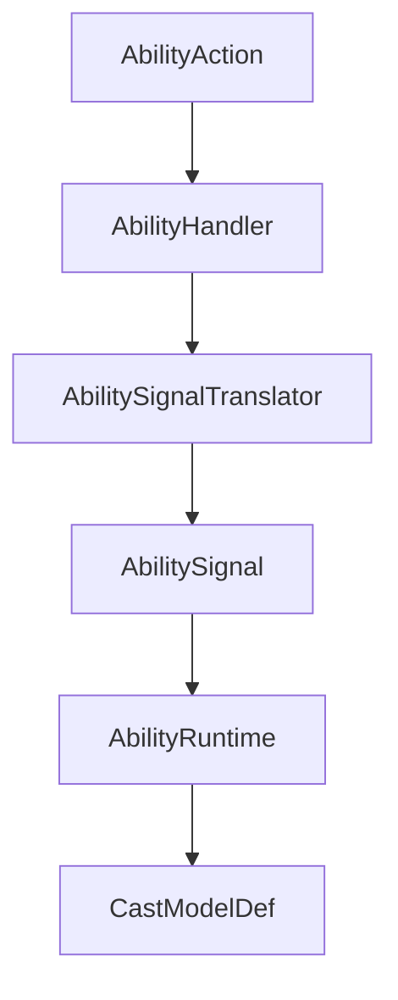

技能系统只从 `AbilitySignal` 开始讨论。

---

## 1.1 AbilitySignal：技能系统内部的最小语言

外部命名约定为：

```text
XXXCommand = 顶层输入指令
XXXOrder   = 单位行为指令
```

技能系统内部使用：

```text
AbilitySignal
```

`Signal` 表示“当前技能收到的一个操作信号”，避免继续使用 `Command` 或 `Order`。

核心动词只保留三个：

| Verb | 含义 |
|---|---|
| `Focus` | 开始关注、准备或进入需要持续保持的施法过程 |
| `Commit` | 确认执行当前技能允许的主要操作 |
| `Cancel` | 主动取消当前技能会话 |

推荐的最小结构：

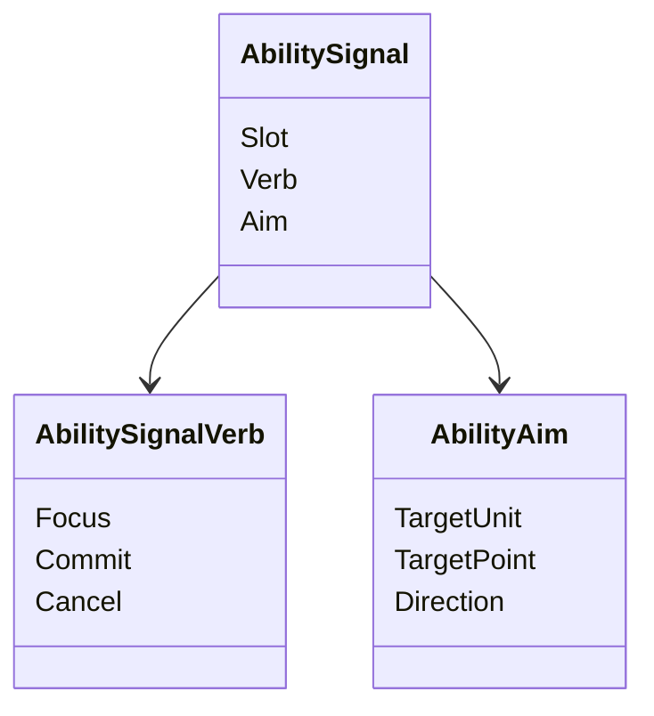

不要在 `AbilitySignal` 中加入：

```text
Press
Release
LeftClick
AIRequest
PlayerRequest
```

因为这些属于上游输入语义。

同一个 `Commit` 在不同施法模型中可以产生完全不同的结果：

```text
普通范围技能
Commit -> 开始施法

韦鲁斯 Q
Commit -> 从蓄力阶段进入释放阶段

泽拉斯 R
Commit -> 在大招持续阶段内发射一次
```

因此有一条核心原则：

> `AbilitySignal` 只表达意图。  
> Signal 是否创建会话、切换阶段或只触发当前阶段行为，由 `CastModelDef` 解释。

---

## 1.2 HandleSignal：只返回是否接受 Signal

`AbilityHandler` 接收真实技能 Signal：

```text
HandleSignal
```

即时返回只需要：

```text
bool
```

含义是：

> 当前技能系统是否接受了这个 Signal。

例如：

```text
Commit
-> 技能冷却中
-> false
```

```text
Focus
-> 韦鲁斯 Q 可以开始蓄力
-> true
```

这里不设计统一的：

```text
RejectReason
FailedStageId
FailurePayload
```

这些内容容易把技能入口变成一套复杂错误报告协议。

开发调试需要失败细节时，通过日志、Editor 校验或 Debug Trace 记录即可，不进入核心运行时接口。

---

## 1.3 AbilitySession 的结束回传

Signal 被接受，不代表整个技能最终一定成功。

例如：

```text
Focus
-> 韦鲁斯 Q 开始蓄力
-> true

之后被外部打断
-> 本次 AbilitySession 最终为 Interrupted
```

因此技能系统保留第二层返回：`AbilitySessionOutcome`。

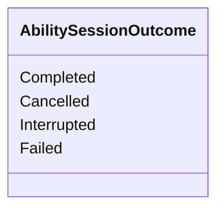

四种结果足够表达技能系统需要告诉外部的生命周期差异：

| Outcome | 含义 |
|---|---|
| `Completed` | 施法模型正常结束 |
| `Cancelled` | `Cancel` 导致会话取消 |
| `Interrupted` | 外部中断导致会话终止 |
| `Failed` | 会话已经开始，但某个阶段无法继续执行 |

不额外携带通用 `Reason`。

结束链路：

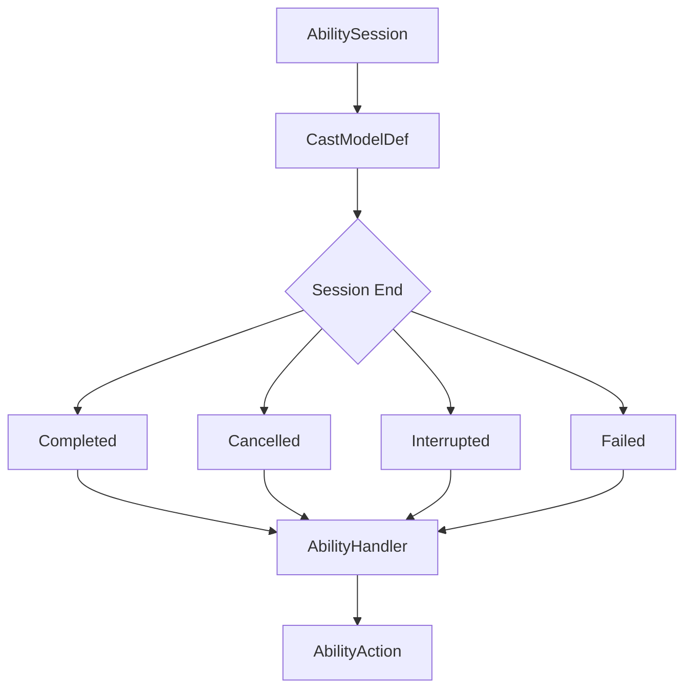

`AbilityHandler` 只负责把最终结果交还给外部行为层。

`AbilityAction` 如何释放行为占用、如何结束自己，仍由单位行为框架处理。

---

## 1.4 外部打断接口

普通技能 Signal 与外部打断分开。

```text
AbilitySignal
    Focus
    Commit
    Cancel

External Interrupt
    TryInterrupt
    ForceInterrupt
```

`AbilityHandler` 预留：

```text
TryInterrupt
ForceInterrupt
```

语义：

| 接口 | 说明 |
|---|---|
| `TryInterrupt` | 请求中断当前会话；当前 `CastModelDef` 可以拒绝 |
| `ForceInterrupt` | 强制终止当前会话 |

典型使用：

```text
移动尝试打断引导
-> TryInterrupt

普通外部行为替换当前施法
-> TryInterrupt

单位死亡
-> ForceInterrupt

单位销毁
-> ForceInterrupt
```

当前版本不把眩晕、击飞、沉默等原因全部塞进技能系统。

控制系统或单位行为层先决定是否提出中断请求，技能系统只决定当前施法过程是否接受普通中断。

如果以后出现明确需求：

```text
技能不怕 Stun
但会被 Knockup 打断
```

再把 `TryInterrupt` 扩展为带轻量标签的接口即可，不提前设计复杂的 `InterruptContext`。

打断流程：

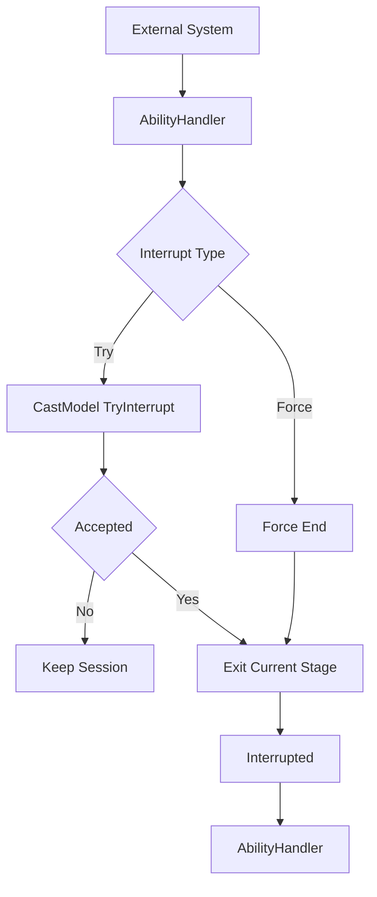

---

## 1.5 AbilityIndicatorController：本地指示器如何接入

技能指示器只在本地运行，因此不应该成为 `AbilityHandler` 的子模块，也不进入真实 `AbilitySession` 生命周期。

推荐关系：

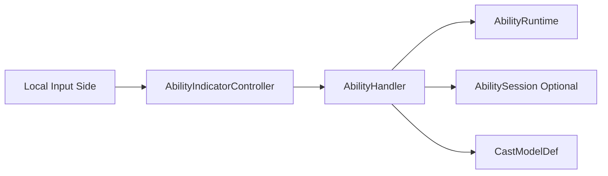

`AbilityIndicatorController` 是独立的本地模块。

它负责：

```text
本地技能键进入瞄准状态
维护本地 Aim
打开和关闭指示器
读取技能只读数据
选择本地 Indicator Resolver
驱动具体 Renderer
```

它不负责：

```text
创建 AbilitySession
发送 AbilitySignal
扣除资源
进入冷却
提交战斗请求
修改 AbilityBlackboard
```

因此真实技能链和本地指示器链彼此独立：

```text
真实技能

Command
-> Order
-> AbilityAction
-> AbilityHandler
-> AbilitySignal
```

```text
本地指示器

Local Input
-> AbilityIndicatorController
-> AbilityHandler 只读查询
-> Local Indicator Resolver
-> Renderer
```

两条链只在技能配置和当前技能运行状态处共享数据。

---

## 1.6 AbilityHandler 只提供轻量的指示器查询接缝

技能系统不提供 `AbilityPreviewDef`，也不要求 `StageDef` 实现任何 Preview 接口。

`AbilityHandler` 只需要提供一个只读查询入口。

概念上：

```text
TryGetIndicatorContext
```

返回一个轻量的：

```text
AbilityIndicatorContext
├── AbilityRuntime
├── AbilitySession optional
└── IndicatorStage
```

类关系：

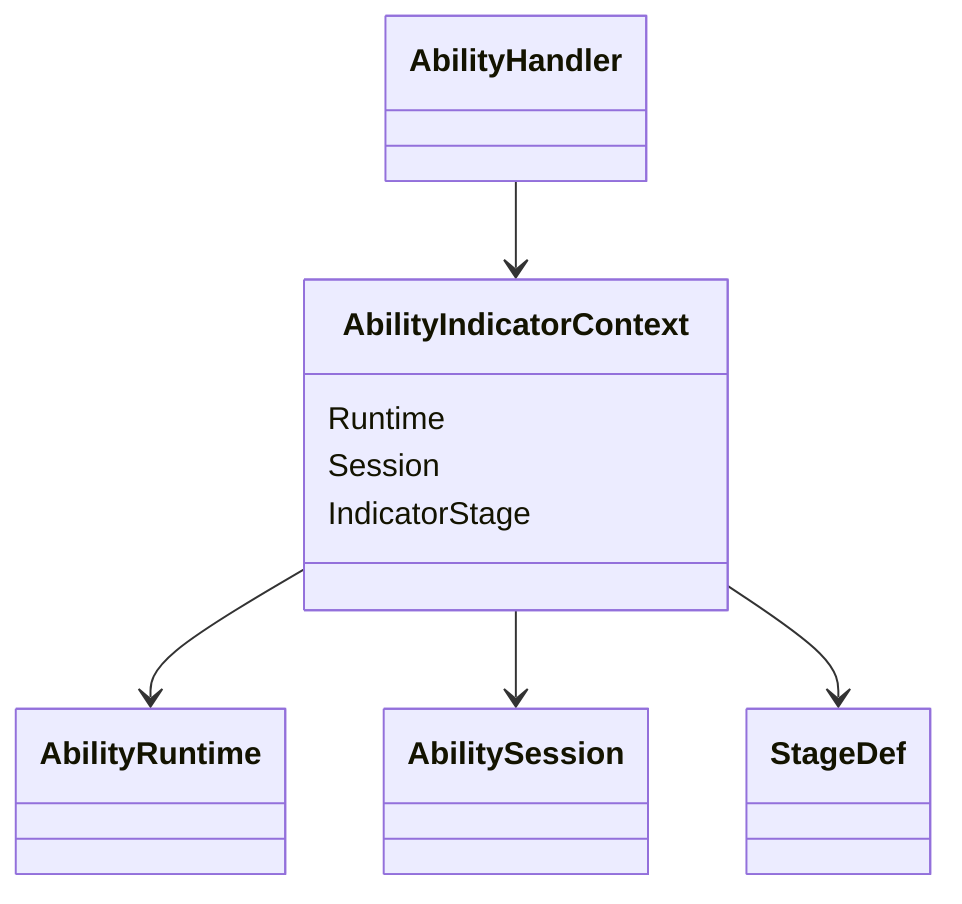

查询过程：

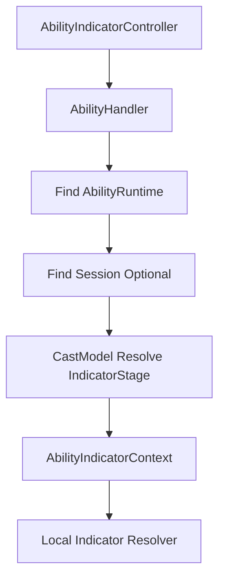

这里不会创建任何真实技能状态。

`AbilityIndicatorContext` 中的对象只允许本地指示器读取。

---

## 1.7 CastModelDef 只决定当前指示器应该参考哪个 Stage

指示器不能简单读取：

```text
AbilitySession.CurrentStage
```

因为当前实际执行的 Stage 和玩家正在瞄准的内容不一定相同。

例如韦鲁斯 Q：

```text
CurrentStage = HoldStage

玩家当前瞄准的是
ReleaseStage 的释放方向与射程
```

因此 `CastModelDef` 提供一个轻量规则：

```text
ResolveIndicatorStage
```

典型结果：

```text
CommitCastModelDef
    -> CastStage

HoldReleaseCastModelDef
    -> ReleaseStage

ActiveSignalCastModelDef
    -> ActiveStage
```

流程：

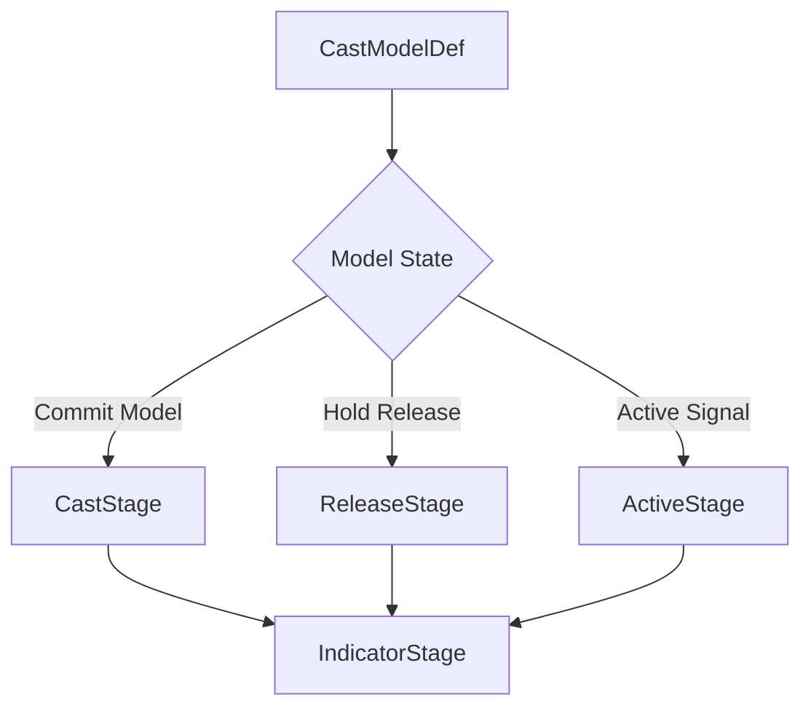

`CastModelDef` 只回答：

> 当前本地指示器应该参考哪个技能阶段。

它不负责：

```text
画圆
画线
决定材质
计算颜色
创建 Indicator GameObject
```

这仍然属于本地指示器模块。

如果某个技能当前不应该显示指示器：

```text
ResolveIndicatorStage
-> null
```

即可。

---

## 1.8 Indicator 直接读取 StageDef、Runtime 和可选 Blackboard

`StageDef` 继续只是技能阶段配置 SO。

它完全不知道指示器系统存在。

本地 `Indicator Resolver` 得到：

```text
StageDef
AbilityRuntime
AbilitySession optional
Local Aim
```

然后自己构造显示。

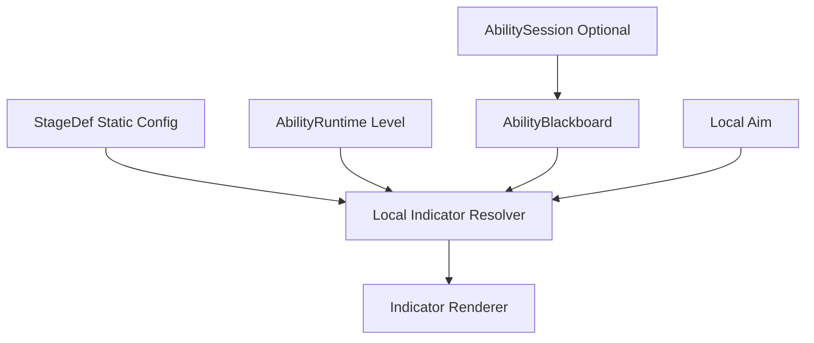

这里分为两种情况。

### 没有 AbilitySession

普通范围技能按下技能键时，真实施法尚未开始。

例如：

```text
按下 E
-> 本地打开指示器

鼠标确认
-> 才生成 Command
-> 最终进入 AbilityHandler
```

因此此时：

```text
AbilitySession = null
Blackboard = null
```

Indicator Resolver 直接读取：

```text
StageDef 静态配置
AbilityRuntime.Level
Local Aim
```

例如：

```text
AreaDamageStageDef
    RadiusByLevel
    TargetingSpec
```

本地 Resolver 自己解析一次当前等级半径并绘制圆形范围。

为本地显示重复计算一次 Range、Radius 或 Width 没有必要再增加额外的通用解析层。

### 已经存在 AbilitySession

韦鲁斯 Q 这类技能在显示指示器时已经存在真实 Session。

```text
Focus
-> Create AbilitySession
-> HoldStage Tick
```

`HoldStage` 可以把技能本身有意义的动态数据写入 Blackboard：

```text
ChargeRatio
CurrentRange
```

本地指示器只读这些数据：

```text
StageDef 静态配置
+ Runtime.Level
+ Blackboard.ChargeRatio
+ Local Aim
```

或者直接：

```text
Blackboard.CurrentRange
+ Local Aim
```

两种方式都允许。

核心原则只有一条：

> Blackboard 保存技能运行语义数据，而不是指示器表现数据。

适合写入：

```text
ChargeRatio
CurrentRange
CurrentRadius
RemainingShots
CapturedTarget
```

不适合写入：

```text
IndicatorLineLength
IndicatorColor
IndicatorMaterial
CircleRendererScale
```

Stage 可以为了真实技能逻辑计算动态数据并写入 Blackboard。

指示器可以复用这些数据，也可以为了本地显示重新计算一次。

框架不强制两者只能采用一种方式。

---

## 1.9 Local Indicator Resolver：由本地模块适配 Stage 类型

`StageDef` 基类没有统一的：

```text
Range
Radius
Width
Angle
```

这是合理的，因为不同技能阶段需要的数据完全不同。

因此不要为了指示器给 `StageDef` 基类增加一个巨大的通用 Preview 数据结构。

本地指示器系统维护自己的 Resolver。

例如：

```text
AreaDamageStageDef
-> CircleIndicatorResolver

ProjectileStageDef
-> LineIndicatorResolver

DashStageDef
-> DashIndicatorResolver

VarusQReleaseStageDef
-> VarusQIndicatorResolver

XerathRActiveStageDef
-> XerathRIndicatorResolver
```

关系：

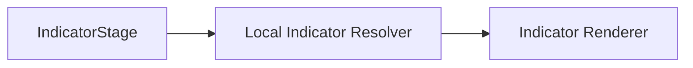

高频通用 Stage 提供通用 Resolver。

真正特殊的英雄 Stage 可以写英雄专属 Resolver。

这是纯本地代码，不会污染技能系统核心类型。

例如普通圆形技能：

```text
CircleIndicatorResolver

读取
    AreaDamageStageDef.RadiusByLevel
    TargetingSpec
    Runtime.Level
    Local Aim

输出
    圆形指示器显示
```

韦鲁斯 Q：

```text
VarusQIndicatorResolver

读取
    VarusQReleaseStageDef
    Runtime.Level
    Session.Blackboard.ChargeRatio
    Local Aim

输出
    当前蓄力射程线形指示器
```

泽拉斯 R：

```text
XerathRIndicatorResolver

读取
    XerathRActiveStageDef
    Runtime.Level
    Session.Blackboard
    Local Aim

输出
    最大施法范围
    当前落点范围
```

因此指示器的最终插入点只有两个：

```text
CastModelDef.ResolveIndicatorStage
    决定当前参考哪个 Stage

AbilityHandler.TryGetIndicatorContext
    向本地模块提供只读 Runtime、Session 和 Stage
```

完整链路：

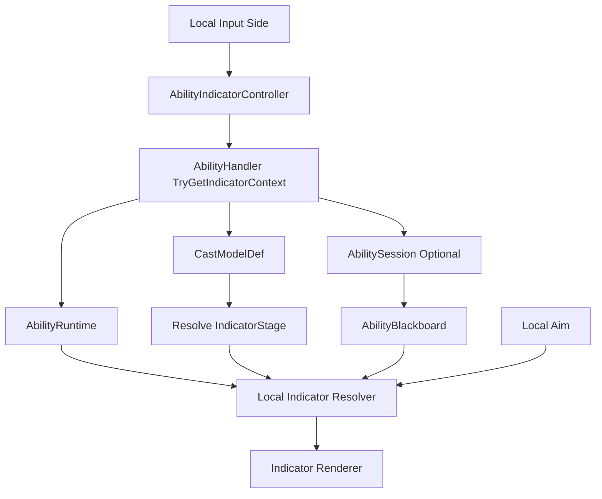

这种设计保持：

```text
StageDef
    不知道 Indicator

AbilitySession
    不保存本地表现状态

AbilitySignal
    不加入 Preview Domain

AbilityHandler
    只提供只读查询接缝

CastModelDef
    只选择当前有语义的 IndicatorStage

AbilityIndicatorController
    完全本地运行
```

---

## 1.10 AbilityCastView：外部系统读取当前施法状态

动画系统、UI、Debug UI 等外部系统经常需要知道：

```text
当前是否正在施法
正在施放哪个技能
使用哪个 CastModelDef
当前位于该施法模型的哪个位置
该位置绑定哪个 StageDef
当前阶段已经运行多久
当前阶段剩余多久
当前阶段进度是多少
Blackboard 中是否存在额外技能语义数据
```

这些系统不应该直接修改 `AbilitySession`。

`AbilityHandler` 提供：

```text
TryGetCurrentCast
```

返回只读的：

```text
AbilityCastView
```

推荐内容：

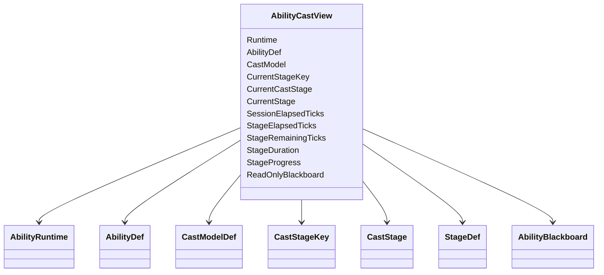

`AbilityCastView` 不是快照。

它由 `AbilityRuntime` 代理当前可选 `ActiveSession`，形成只读观察视图。

外部系统只能读取，不能通过它修改 Session 或 Blackboard。

其中：

```text
CastModel
    当前技能使用的施法模型

CurrentStageKey
    当前位于该 CastModelDef 的哪个位置

CurrentCastStage
    该位置上的 CastStage 配置

CurrentStage
    CurrentCastStage.Stage
```

`StageDef` 不知道自己位于施法模型的哪个位置。

位置由 `CastModelDef` 自己管理，并向外部提供对应的 `CastStageKey`。

例如：

```text
AbilityDef = VarusQ
CastModel = HoldReleaseCastModelDef
CurrentStageKey = Hold
CurrentStage = VarusQHoldStageDef
```

或者：

```text
AbilityDef = XerathR
CastModel = ActiveSignalCastModelDef
CurrentStageKey = Active
CurrentStage = XerathRActiveStageDef
```

外部系统通过：

```text
AbilityDef
+ CastModelDef
+ CurrentStageKey
+ StageDef
```

决定具体表现。

不再提供：

```text
CastStageTraits
ResolveStageTraits
Holding
Channeling
WaitingSignal
Recovery
```

这类通用语义推导。

阶段进度统一来自当前 `CastStage` 的静态 Duration：

```text
Finite Duration 且 DurationTicks > 0
-> StageProgress = Clamp01(StageElapsedTicks / DurationTicks)

Duration = 0 Tick
-> StageProgress = 1
-> 通常会在同一次技能更新内立即离开该阶段

Infinite Duration
-> StageProgress 无值
```

有限阶段还可以直接得到：

```text
StageRemainingTicks =
    Max(0, DurationTicks - StageElapsedTicks)
```

动画系统可以通过：

```text
AbilityDef + CastModelDef + CurrentStageKey
```

选择动画，再使用：

```text
StageProgress
ReadOnlyBlackboard
```

控制动画进度和额外参数。

例如：

```text
VarusQ
+ HoldReleaseCastModelDef
+ Hold

-> 播放 VarusQ Hold Animation
```

Blackboard 中应该保存：

```text
ChargeRatio
RemainingShots
CastDirection
RecastCount
```

而不是：

```text
AnimatorNormalizedTime
AnimationSpeed
LayerWeight
BlendTreeValue
```

技能系统只暴露技能语义，动画系统自行完成表现映射。

---

## 1.11 UI 读取槽位技能状态

技能 UI 通常先读取每个 `AbilitySlotRuntime`。

当前技能显示数据来自：

```text
AbilitySlotRuntime.ActiveAbilityId
-> AbilityRuntime
-> AbilityDef
```

包括：

```text
Name
Description
Icon
Cooldown
Level
Learned
```

如果某个技能当前正在 `AbilitySession` 中，UI 可以同时读取 `AbilityCastView`。

技能图标解析规则保持简单：

```text
CurrentCastStage.IconOverride 有值
-> 使用 IconOverride

否则
-> 使用 AbilityDef.Icon
```

流程：

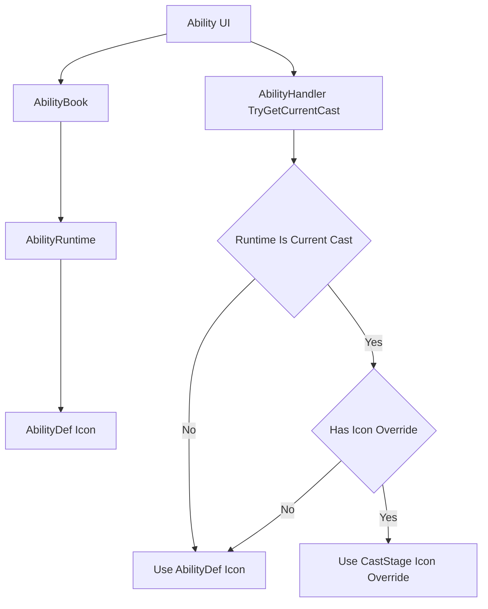

图标覆盖属于 `CastStage`，而不是 `StageDef`。

原因是：

> 同一个 `StageDef` 可以被不同技能或不同施法模型复用，但它们的 UI 图标不一定相同。

例如：

```text
LuxE AbilityDef.Icon
    = LuxE Default Icon

ActiveArea CastStage.IconOverride
    = LuxE Detonate Icon
```

UI 还可以读取：

```text
CastModelDef
CurrentStageKey
StageRemainingTicks
```

判断当前正在该施法模型的哪个位置，而不需要从 `StageDef` 类型推测它是蓄力、引导还是等待阶段。

对于没有活跃 Session，但技能已经通过 `AbilityRuntime` 切换为另一套技能或另一个 `AbilityDef` 的情况，UI 仍然直接读取当前槽位绑定的 `AbilityDef.Icon`。

技能点分配按钮不从 `AbilityRuntime` 单独读取。

UI 直接通过 `AbilityHandler` 读取：

```text
PendingSkillPoints
CanAllocateSkillPoint(slot)
```

具体分配流程见 `1.12 PendingSkillPoints`。

---

## 1.12 PendingSkillPoints：待分配技能点与槽位升级

`AbilityHandler` 负责管理单位当前尚未分配的技能点：

```text
PendingSkillPoints
```

技能点分配目标是：

```text
AbilitySlotRuntime
```

而不是当前槽位中临时激活的某个 `AbilityRuntime`。

原因是一个技能槽可以容纳多个主动技能，而绝大多数英雄的技能点规则是：

> 给槽位分配一点后，该槽位下的所有主动技能一起升级。

推荐关系：

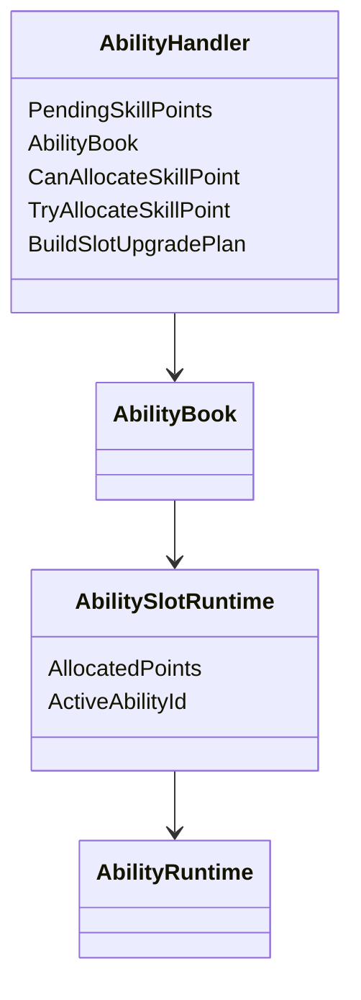

不增加额外的：

```text
IAbilitySkillPointService
IAbilitySkillPointExecutor
```

技能点权威状态和正式执行接口都直接归 `AbilityHandler`。

---

### 1.12.1 单位升级时增加技能点

单位框架在单位成功提升一级后，立即发布强类型：

```text
LevelUpEvent
```

`AbilityHandler.OnLevelUp` 每收到一次事件执行：

```text
PendingSkillPoints += 1
```

流程：

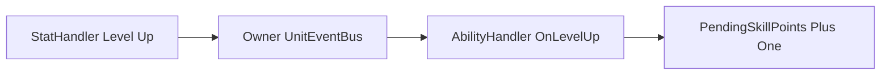

内部固定顺序：

```text
1. PendingSkillPoints += 1
2. FixedPassive 处理 LevelUp
3. 当前主动技能槽按槽位索引处理 LevelUp
```

初始化时的可分配技能点由单位初始化配置传入。

例如单位以 1 级出生并立即拥有一个技能点：

```text
InitialPendingSkillPoints = 1
```

不要通过伪造升级事件补初始技能点。

---

### 1.12.2 UI 读取与 Command 执行链

UI 直接读取 `AbilityHandler`：

```text
PendingSkillPoints
CanAllocateSkillPoint(slot)
```

| API | 说明 |
|---|---|
| `PendingSkillPoints` | 当前剩余可分配点数，只读 |
| `CanAllocateSkillPoint(slot)` | 当前技能槽是否允许增加一点 |
| `TryAllocateSkillPoint(slot)` | 正式执行槽位点数和具体技能等级变化 |

UI 显示逻辑：

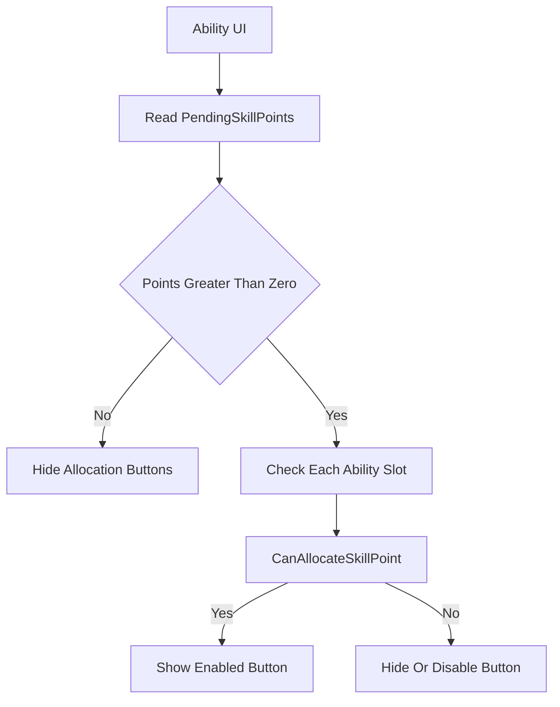

点击按钮后，UI 不直接修改运行状态。

确定性执行链：

```text
AllocateAbilitySkillPointCommand
-> CommandDispatcher 根据 UnitUid 查询 Unit
-> Unit.AbilityHandler.TryAllocateSkillPoint(slot)
```

技能点分配不是单位动作行为，因此不经过：

```text
Order
Intent
BehaviorPlanner
ActionRequest
ActionArbiter
ActionRuntime
```

---

### 1.12.3 槽位级加点配置

技能点上限和单位等级要求属于技能槽：

```text
AbilitySlotDef
├── MaxAllocatedPoints
└── RequiredUnitLevelByRank
```

不再属于单个 `AbilityDef`。

`RequiredUnitLevelByRank` 按槽位的目标点数索引。

例如终极技能槽：

```text
Point 1 requires Unit Level 6
Point 2 requires Unit Level 11
Point 3 requires Unit Level 16
```

当前槽位已投入点数保存在：

```text
AbilitySlotRuntime.AllocatedPoints
```

某个具体技能实际等级仍然保存在：

```text
AbilityRuntime.Level
```

普通英雄中两者通常相同。

特殊英雄允许它们不同。

---

### 1.12.4 BuildSlotUpgradePlan：特殊英雄扩展点

`TryAllocateSkillPoint(slot)` 保持统一公共流程，不建议让特殊英雄完整重写。

开放受控扩展点：

```text
protected virtual BuildSlotUpgradePlan(
    AbilitySlotRuntime slot,
    int nextAllocatedPoints,
    UpgradePlanBuffer output)
```

默认实现：

```text
槽位中的每个 AbilityRuntime
    TargetRank = CurrentRank + 1
```

特殊英雄的 `AbilityHandler` 子类只重写升级计划。

例如可以表达：

```text
只升级槽位中的某一个技能
根据当前形态选择升级对象
不同技能使用不同等级映射
某个技能在指定槽位点数时才升级
```

升级计划至少包含：

```text
AbilityRuntime
PreviousRank
TargetRank
```

公共执行框架仍然负责：

```text
PendingSkillPoints 校验
槽位点数上限校验
单位等级要求校验
升级计划完整校验
槽位点数增加
具体技能等级更新
技能被动刷新
RankUpEffect 调用
技能点扣除
```

这样特殊英雄不会遗漏公共状态和确定性规则。

---

### 1.12.5 TryAllocateSkillPoint 的原子流程

推荐顺序：

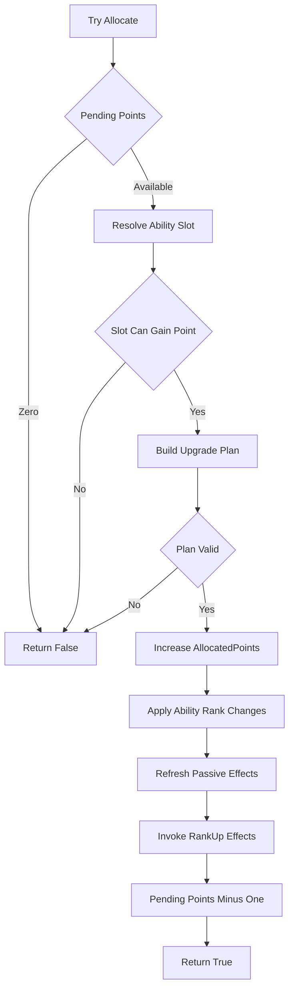

所有可能失败的检查都必须在正式写状态前完成。

成功后：

```text
AbilitySlotRuntime.AllocatedPoints += 1

按 AbilitySlotDef.Abilities 的稳定顺序：
    更新计划中的 AbilityRuntime.Level
    更新 Learned
    刷新主动技能附带被动
    调用该 AbilityDef.RankUpEffect

PendingSkillPoints -= 1
```

槽位点数增加、技能等级变化、升级模块调用和技能点扣除属于同一个确定性操作。

默认：

```text
槽位中任意 AbilityRuntime 正在施法
-> 不允许给该槽位加点
```

特殊英雄需要不同规则时，可以重写合法性或升级计划，但必须保证一次 `AbilitySession` 内读取到的技能等级一致。

固定被动技能不参与技能点分配。

---

## 1.13 SupportedUnitEvents：AbilityHandler 的固定事件契约

`AbilityHandler` 只实现当前技能业务确实需要的强类型 UnitEvent 回调。

正式支持：

```text
DamageTakenEvent
DamageDealtEvent
HealTakenEvent
HealDealtEvent
AbilityCastEvent
UnitDyingEvent
UnitDeathEvent
UnitKillEvent
LevelUpEvent
```

对应接口：

```text
OnDamageTaken
OnDamageDealt
OnHealTaken
OnHealDealt
OnAbilityCast
OnUnitDying
OnUnitDeath
OnUnitKill
OnLevelUp
```

暂不支持：

```text
UnitCollisionEnterEvent
UnitCollisionExitEvent
```

普通技能碰撞和范围逻辑继续通过：

```text
ProjectileSystem
AreaSystem
Physics Query
StageDef
BuffSystem
```

处理。

`SupportedUnitEvents` 是代码与设计契约，不是运行时订阅列表。

不增加：

```text
Subscribe
Unsubscribe
delegate
反射扫描
通用 HandleEvent
动态 Listener 表
```

`UnitEventBus` 使用固定代码路由即时调用对应函数，本身没有需要进入快照的订阅状态。

内部处理顺序：

```text
普通结果事件
    1. FixedPassiveRuntime
    2. 当前主动技能槽，从低索引到高索引

LevelUpEvent
    1. PendingSkillPoints += 1
    2. FixedPassiveRuntime
    3. 当前主动技能槽，从低索引到高索引

UnitDeathEvent
    1. 强制结束当前 ActiveSession
    2. FixedPassiveRuntime
    3. 当前主动技能槽，从低索引到高索引
    4. 执行死亡生命周期清理
```

`UnitDyingEvent` 不自动结束 Session。

只有正式 `UnitDeathEvent` 执行统一死亡中断和清理。

### 1.13.1 普通死亡只清理临时施法状态

`AbilityHandler.OnUnitDeath` 的默认流程：

```text
1. ForceInterrupt 当前 ActiveSession
2. 当前 Stage.OnExit
3. Session Outcome = Interrupted
4. 销毁 ActiveSession
5. 清理与该 Session 同生命周期的 Blackboard
6. FixedPassiveRuntime 处理 UnitDeath
7. 当前主动技能槽被动按索引处理 UnitDeath
```

普通死亡默认不执行：

```text
清空 AbilityBook
清空 AbilitySlotRuntime
重置 AbilitySlotRuntime.AllocatedPoints
重置 AbilityRuntime.Level
重置 PendingSkillPoints
重置技能冷却
销毁 FixedPassiveRuntime
停用当前主动技能附带被动
全量移除技能来源 Modifier
```

单位死亡本身不等价于：

```text
PassiveEffect.OnDeactivate
```

当前槽位绑定没有变化，主动技能也没有被卸载，因此长期被动状态、冷却和已存在的 Modifier 默认继续保留。

只有具体被动效果明确规定：

```text
死亡时清空层数
死亡时重置内部资源
死亡时移除某个临时 Modifier
死亡时停止某个专属状态
```

才由该被动自己的 `OnUnitDeath` 使用保存的 Handle 精确修改自身状态。

禁止调用：

```text
StatHandler.ClearModifiers
CombatModifierSet.Clear
```

或其它全量清理接口。

### 1.13.2 死亡事件中的 Gameplay 边界

正式死亡发生在 Combat Settlement 的即时调用链中：

```text
CombatSystem 确认死亡
-> UnitWorld 写入 Dead
-> UnitEventBus.Publish UnitDeathEvent
-> AbilityHandler.OnUnitDeath
```

技能被动在 `UnitDeathEvent` 中可以：

```text
更新自身 Runtime 状态
精确移除自身 Modifier
添加 Buff
提交新的 CombatRequest
```

但不能：

```text
修改已经完成的死亡结果
直接把 Dead 改回 Alive
绕过 CombatSystem 完成濒死复活
```

死亡阻止和濒死复活必须发生在正式写入 `Dead` 之前的战斗流程中。

### 1.13.3 ClearForRespawn：固定被动重建生命阶段 Handle

单位完成复活状态初始化后，单位框架按固定 Handler 顺序调用：

```text
AbilityHandler.ClearForRespawn
```

技能系统在这个接缝中只处理：

```text
跨死亡保留的 FixedPassiveRuntime
在新生命阶段需要重新建立的 Handle
```

流程：

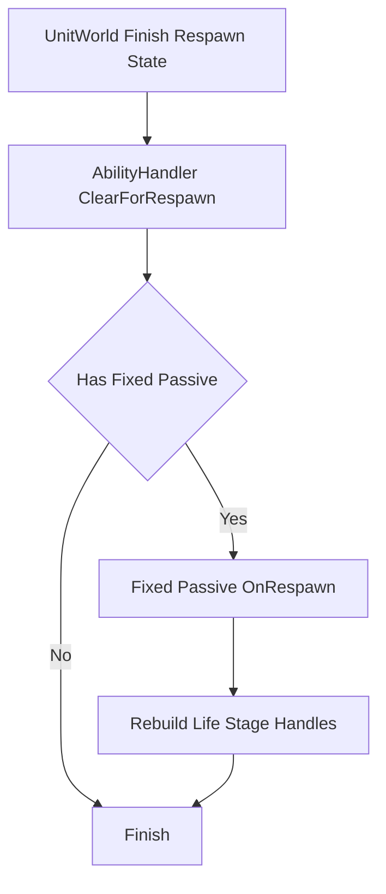

这里的“生命阶段 Handle”指：

```text
死亡时由所属系统清理
但固定被动 Runtime 本身跨死亡保留
并且复活后仍应重新生效的注册
```

例如：

```text
控制免疫 Handle
不可阻挡 Handle
当前生命阶段的特殊状态注册
其它明确声明为 Respawn 时重建的 Handle
```

固定被动可以在：

```text
PassiveAbilityEffectDef.OnRespawn
```

中根据自己的长期 Runtime 状态重新提交正式注册，并保存新 Handle。

如果死亡时已经将旧 Handle 移除，或者所属系统已统一清理，则必须先把对应 Runtime Handle 标记为：

```text
Invalid
```

复活时只对 Invalid 的生命阶段 Handle 重新注册。

---

### 1.13.4 Respawn 不重新创建永久 Modifier

`ClearForRespawn` 不是全量被动重新激活。

禁止默认调用：

```text
PassiveEffect.OnActivate
StatHandler.AddModifier
CombatModifierSet.Attach
```

如果固定被动提供的：

```text
StatModifier
CombatModifier
```

本来就跨死亡保留，并且其 Handle 仍然有效，则复活时不重复创建。

因此固定被动 Runtime 应区分：

```text
PersistentHandles
    跨死亡保留
    Respawn 不重建

LifeStageHandles
    死亡时失效
    Respawn 按需重建
```

`ClearForRespawn` 也不会：

```text
重置固定被动冷却
重置固定被动层数
重新初始化 FixedPassiveRuntime
触发技能学习或 RankUpEffect
恢复死亡前的临时主动 AbilitySession
```

临时来源不恢复。

固定被动的长期权威状态保持死亡后的当前值，只重新建立新生命阶段所需的注册。

---

### 1.13.5 Respawn 与回滚 Rebuild 是不同流程

必须区分：

```text
AbilityHandler.ClearForRespawn
    正常 Gameplay 生命周期
    可以创建新的生命阶段 Handle

AbilityHandler.Rebuild
    回滚恢复阶段
    不能重新 Add 或 Attach Gameplay Modifier
```

回滚时：

```text
StatHandler Modifier
CombatModifierSet Record
被动 Runtime 历史 Handle
```

都从同一历史快照直接恢复。

因此 `Rebuild` 仍然只处理查询和表现派生缓存。

不能因为增加了 Respawn 接缝，就在回滚 `Rebuild` 中调用：

```text
FixedPassive.OnRespawn
PassiveEffect.OnActivate
AddModifier
Attach CombatModifier
```

否则会生成重复注册。


---


# 二、AbilityRuntime 与 AbilitySession：技能运行状态

`AbilityHandler` 接受 Signal 后，首先找到单位身上的 `AbilityRuntime`。

如果当前施法模型需要开始真实技能过程，则创建 `AbilitySession`。

两者的生命周期完全不同。

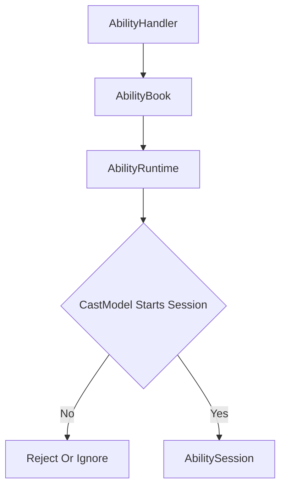

---

## 2.1 AbilityBook：一槽多技能的主动技能目录

`AbilityBook` 负责：

```text
主动技能槽 Runtime
槽位内主动技能 Runtime 注册
当前槽位激活技能
技能组或形态切换
槽位到当前 AbilityRuntime 的稳定查询
```

静态配置：

```text
AbilitySlotDef
├── SlotId
├── MaxAllocatedPoints
├── RequiredUnitLevelByRank
├── Abilities[]
└── InitialActiveAbilityId
```

运行结构：

```mermaid
classDiagram
class AbilityHandler
class AbilityBook
class AbilitySlotRuntime {
  Def
  AllocatedPoints
  ActiveAbilityId
}
class AbilitySlotDef {
  SlotId
  MaxAllocatedPoints
  RequiredUnitLevelByRank
  Abilities
  InitialActiveAbilityId
}
class AbilityRuntime
class PassiveAbilityRuntime

AbilityHandler --> AbilityBook
AbilityBook --> AbilitySlotRuntime
AbilitySlotRuntime --> AbilitySlotDef
AbilitySlotRuntime --> AbilityRuntime
AbilityHandler --> PassiveAbilityRuntime
```

一个技能槽可以包含一个或多个主动技能。

例如：

```text
Jayce Q Slot
├── ToTheSkies
└── ShockBlast
```

```text
Nidalee Q Slot
├── JavelinToss
└── Takedown
```

每个槽位通过：

```text
ActiveAbilityId
```

决定当前按下该槽位时实际施放哪个技能。

`AbilityHandler` 收到 `AbilitySignal` 后：

```text
Signal.Slot
-> AbilitySlotRuntime
-> ActiveAbilityId
-> AbilityRuntime
-> CastModelDef
```

输入层不需要知道当前形态下具体是哪一个 `AbilityDef`。

槽位中的所有 `AbilityRuntime` 都长期存在，以保留各自：

```text
技能等级
冷却
长期状态
主动技能附带被动状态
英雄专属资源
```

每个 `AbilityRuntime` 只能归属于一个 `AbilitySlotRuntime`。

不允许同一个 Runtime 同时挂在多个槽位。

---

### 2.1.1 槽位内技能切换

统一接口：

```text
TrySwitchAbilityInSlot(slot, abilityId)
```

默认合法性：

```text
目标 AbilityId 属于该槽位
目标不是当前 ActiveAbilityId
当前槽位没有正在运行的 AbilitySession
其它英雄规则允许切换
```

默认顺序：

```text
旧 Active Ability PassiveEffect Deactivate
-> 修改 ActiveAbilityId
-> 新 Active Ability PassiveEffect Activate
```

只切换当前激活技能，不创建或销毁 `AbilityRuntime`。

必须在施法过程中切换的特殊英雄可以重写切换规则，但必须明确：

```text
当前 Session 继续、取消或中断
旧被动何时失活
新被动何时生效
```

固定被动完全不参与槽位切换。

---

## 2.2 AbilityRuntime：始终存在的主动技能实例

`AbilityRuntime` 表示：

> 某个单位身上的某个具体主动技能实例。

它从技能被注册到对应 `AbilitySlotRuntime` 开始存在，无论当前是否是槽位的激活技能，也无论是否正在施放。

推荐核心数据：

```mermaid
classDiagram
class AbilityRuntime {
  Def
  OwnerSlot
  Level
  Learned
  CooldownState
  PersistentState
  PassiveEffectRuntime
  ActiveSession
}

class AbilityDef
class AbilitySlotRuntime
class CooldownState
class ActiveAbilityPassiveRuntime
class AbilitySession

AbilityRuntime --> AbilityDef
AbilityRuntime --> AbilitySlotRuntime
AbilityRuntime --> CooldownState
AbilityRuntime --> ActiveAbilityPassiveRuntime
AbilityRuntime --> AbilitySession
```

适合放在这里的状态：

```text
AbilityDef 引用
所属 AbilitySlotRuntime
具体技能实际等级
是否学习
技能冷却
英雄专属长期状态
单个主动技能被动 Runtime optional
当前 ActiveSession optional
```

`AbilityRuntime.Level` 表示该具体技能的实际等级。

它不再被假设始终等于：

```text
OwnerSlot.AllocatedPoints
```

普通英雄由默认升级计划保持同步。

特殊英雄可以通过重写 `BuildSlotUpgradePlan` 产生不同映射。

`AbilityRuntime` 继续作为外部查询具体技能状态的统一入口。

不增加独立 `StageRuntime`。

---

## 2.3 AbilitySession：单次施法的最小临时状态

`AbilitySession` 表示：

> 一次正在发生的真实主动技能施放过程。

它由 `AbilityRuntime` 创建并持有，施法结束后立即销毁或归还对象池。

推荐只保存本次施法无法从静态配置推导的最小动态数据：

```mermaid
classDiagram
class AbilitySession {
  Uid
  CurrentStageKey
  SessionElapsedTicks
  StageElapsedTicks
  Aim
  Blackboard
}

class AbilityRuntime
class AbilitySessionUid
class CastStageKey
class AbilityBlackboard

AbilityRuntime --> AbilitySession
AbilitySession --> AbilitySessionUid
AbilitySession --> CastStageKey
AbilitySession --> AbilityBlackboard
```

字段：

| 字段 | 作用 |
|---|---|
| `Uid` | 本次施法的稳定运行标识，类型为 `AbilitySessionUid` |
| `CurrentStageKey` | 当前位于 CastModel 的哪个位置 |
| `SessionElapsedTicks` | 整次施法已运行 Tick |
| `StageElapsedTicks` | 当前阶段已运行 Tick |
| `Aim` | 本次施法当前使用的目标信息 |
| `Blackboard` | 本次施法动态共享数据 |

对象内部直接使用：

```text
session.Uid
```

外部结构根据字段语义使用完整名称：

```text
AbilityCastEvent.AbilitySessionUid
CachedAbilitySessionUid
```

不在 `AbilitySession` 中重复保存：

```text
AbilityRuntime
CastModelDef
CurrentCastStage
CurrentStage
StageDuration
Outcome
```

这些数据可通过拥有者和静态配置解析。

`AbilityBlackboard` 的生命周期严格等于 `AbilitySession`：

```text
Create AbilitySession
-> Create Clean Blackboard

Session Running
-> Stage 共享 Blackboard

Session End
-> Dispose Or Pool Session
-> Blackboard Dispose Or Clear
```

固定被动技能不创建 `AbilitySession`。

---

## 2.4 AbilitySession 只保存状态，不决定流程

`AbilitySession` 不判断：

```text
Commit 是否切换 Stage
Hold 什么时候超时
Channel 什么时候完成
泽拉斯 R 的 Commit 是否发射一炮
```

这些规则全部来自：

```text
AbilityRuntime.Def.CastModel
```

关系：

```mermaid
flowchart LR
    A[AbilityRuntime] --> B[ActiveSession]
    A --> C[AbilityDef]
    C --> D[CastModelDef]
    D --> E[Flow Rules]
    B --> F[Minimal Mutable State]
```

职责：

```text
AbilityRuntime
    长期技能实例
    持有可选 ActiveSession
    对外代理查询当前阶段

AbilitySession
    单次施法最小动态状态

CastModelDef
    不可变的施法流程规则
```

这样不会引入第二套阶段状态机，也不会让临时 Session 持有大量可以从配置推导的数据。

---

## 2.5 AbilityHandlerSnapshot 与 IRollback

`AbilityHandler` 实现：

```text
IRollback<AbilityHandlerSnapshot>
```

统一接口命名：

```text
Capture
Restore
Resolve
Rebuild
```

不再使用：

```text
Capture
Restore
Resolve
Rebuild
```

技能系统不自行维护逐 Tick 快照历史。

顶层 Gameplay Snapshot 系统通过单位聚合根调用：

```text
Unit Capture
-> AbilityHandler Capture
```

推荐结构：

```text
AbilityHandlerSnapshot
├── PendingSkillPoints
├── AbilitySlotSnapshots[]
│   └── AbilitySlotSnapshot
│       ├── SlotId
│       ├── AllocatedPoints
│       └── ActiveAbilityId
├── AbilityRuntimeSnapshots[]
│   └── AbilityRuntimeSnapshot
│       ├── AbilityId
│       ├── Level
│       ├── Learned
│       ├── CooldownState
│       ├── PersistentState
│       ├── PassiveEffectRuntimeSnapshot optional
│       │   ├── StatModifierHandles
│       │   ├── CombatModifierHandles
│       │   └── EffectState
│       └── ActiveSessionSnapshot optional
│           ├── Uid
│           ├── CurrentStageKey
│           ├── SessionElapsedTicks
│           ├── StageElapsedTicks
│           ├── Aim
│           └── BlackboardSnapshot
└── FixedPassiveRuntimeSnapshot optional
    ├── PassiveAbilityId
    ├── CooldownState optional
    ├── StatModifierHandles
    ├── CombatModifierHandles
    └── EffectRuntimeSnapshot optional
```

同时保存：

```text
槽位投入点数
槽位当前激活 AbilityId
每个具体技能的实际等级
```

因为特殊英雄不保证槽位点数和所有技能等级始终一致。

---

### 2.5.1 Capture

保存所有会影响未来模拟的权威状态：

```text
PendingSkillPoints
AbilitySlotRuntime
AbilityRuntime
ActiveSession
Blackboard
主动技能附带被动状态
固定被动状态
被动持有的 StatModifierHandle
被动持有的 CombatModifierHandle
```

静态 Def 不复制进快照。

---

### 2.5.2 Restore

直接恢复历史权威状态。

禁止在 Restore 中调用：

```text
StatHandler.AddModifier
StatHandler.SetModifierValue
StatHandler.RemoveModifier
CombatModifierSet.Attach
CombatModifierSet.Detach
PassiveEffect.OnActivate
PassiveEffect.OnDeactivate
AbilityDef.RankUpEffect
UnitEventBus.Publish
```

`StatHandler` 的 Modifier、`StatSeq` 和 `CombatModifierSet` 的有效 Record 已由各自快照直接恢复。

来源被动 Runtime 同时恢复历史 Handle，因此 Handle 会继续指向历史 Modifier。

---

### 2.5.3 Resolve

根据稳定 Id 找回静态定义：

```text
AbilityId
-> AbilityDatabase
-> AbilityDef

PassiveAbilityId
-> AbilityDatabase
-> PassiveAbilityDef

SlotId
-> Unit Ability Loadout
-> AbilitySlotDef
```

同时按稳定 UID 处理：

```text
Blackboard 中的 UnitUid
ProjectileUid
EntityUid
被动效果状态中的目标 Uid
```

Handle 只包含稳定逻辑身份，不保存对象引用，不需要重新生成。

---

### 2.5.4 Rebuild

只重建真正的派生内容：

```text
只读查询缓存
AbilityCastView 派生引用
UI 和 Presentation 镜像
调试缓存
```

禁止在 Rebuild 中：

```text
重新 Add StatModifier
重新 Attach CombatModifier
生成新的 ModifierHandle
调用 RankUpEffect
触发 UnitEventBus
```

否则会产生重复 Modifier。

正常 Gameplay 中的技能切换和被动启停，仍然按正式业务流程执行 Add、Set、Remove、Attach 和 Detach。

回滚恢复与正常生命周期必须严格区分。

---

## 2.6 SimulationTickContext：统一当前 Tick 来源

技能系统不通过参数层层传递：

```text
SimulationTickContext
```

也不为此修改现有接口签名。

需要当前逻辑 Tick 时，在函数内部统一读取：

```text
SimulationTickContext.Current.Tick
```

例如：

```text
创建 AbilitySession.Uid
记录被动上次触发 LogicTick
启动或检查被动冷却
记录英雄专属长期状态
```

命名统一使用：

```text
LogicTick
StartLogicTick
EndLogicTick
ElapsedTicks
DurationTicks
```

技能系统不缓存第二套当前 Tick 权威。

### 2.6.1 新生单位的主动生效 Tick

单位框架统一规定：

```text
SimulationTickContext.Current.Tick > UnitUid.SpawnLogicTick
```

时，单位才开始执行主动 Gameplay。

因此生成 Tick 内：

```text
AbilityHandler 已完成初始化
AbilitySlotRuntime 和 AbilityRuntime 已存在
FixedPassiveRuntime 已存在
可以成为技能、伤害、Buff 和事件目标
可以接收 UnitEventBus 的即时结果事件
```

但不执行：

```text
AbilityHandler 主动 Tick
AbilitySession 普通阶段推进
主动技能 Command
主动技能槽切换 Command
技能点分配 Command
```

该规则由单位世界和 Command 调度层统一保证。

`AbilityHandler` 不额外保存：

```text
FirstActiveLogicTick
FirstAbilityTick
```

也不维护第二份出生 Tick 状态。

---

# 三、CastModelDef：施法过程的状态机

`CastModelDef` 是整个技能施放过程的核心。

定义：

> `CastModelDef` 是 `AbilitySignal` 与 `AbilitySession` 之间的施法协议和状态机。

它负责：

```text
什么 Signal 可以创建 Session
当前模型处于哪个 CastStage
Signal 在当前阶段意味着什么
什么时候调用 Stage.OnSignal
什么时候提前推进 Stage
阶段超时后如何处理
什么时候正常结束
Cancel 如何结束
TryInterrupt 是否接受
```

它不负责：

```text
造成多少伤害
生成什么投射物
给谁添加 Buff
蓄力比例如何参与伤害公式
```

这些属于 `StageDef`。

核心关系：

```mermaid
flowchart TD
    A[AbilitySignal] --> B[CastModelDef]
    B --> C{Model State}
    C --> D[Start Session]
    C --> E[Change CastStage]
    C --> F[Call Stage OnSignal]
    C --> G[End Session]
    C --> H[Reject Signal]
    I[Ability Tick] --> B
    B --> J[Call Stage OnTick]
    J --> K[Handle StageResult]
    B --> L[Handle Timeout]
```

---

## 3.1 删除 CastFlowDef 与 StageDriver

上一版中的：

```text
CastFlowDef
StageDriver
ImmediateStageDriver
TimedStageDriver
HoldStageDriver
ChannelStageDriver
WindowStageDriver
```

全部删除。

原因是这些对象都在重复回答：

```text
阶段持续多久
什么时候结束
收到 Signal 怎么办
```

这些本来就是“怎么施法”的问题，应该统一由 `CastModelDef` 负责。

调整后：

```text
CastModelDef
    管时间与阶段流程

StageDef
    管阶段内容
```

不存在第三个流程控制层。

---

## 3.2 CastStage：CastModel 中统一的阶段位置

具体 `CastModelDef` 不再持有裸 `StageDef` 字段。

每一个阶段位置统一使用：

```text
CastStage
├── Stage : StageDef
├── Duration : StageDuration
├── IconOverride optional
└── NotifyAbilityCastOnEnter
```

`CastStage` 是一个很轻的数据结构。

它没有：

```text
Id
Kind
Role
Driver
Transition
Condition
```

`StageDef` 决定：

> 这个阶段具体做什么、观察什么或与哪个外部系统协作。

`Duration` 决定：

> 这个阶段最多允许停留多久。

`IconOverride` 只负责：

> 当前技能处于这个阶段位置时，是否覆盖 `AbilityDef.Icon`。

`NotifyAbilityCastOnEnter` 负责：

> 声明成功进入当前模型位置时，是否由 AbilityHandler 向单位框架触发一次 AbilityCast 回调。

默认值为 `false`。

`CastStage` 在具体模型中的字段位置决定：

> 这个阶段在施法模型中承担哪个位置。

例如：

```text
HoldReleaseCastModelDef
├── Hold : CastStage
└── Release : CastStage
```

其中：

```text
Hold.Stage
    = VarusQHoldStageDef

Hold.Duration
    = 60 Tick
```

`Hold` 这个字段位置已经明确表达当前模型位置。

`StageDef` 本身不需要知道自己被放在 `Hold`、`Release` 或其它位置。

类关系：

```mermaid
classDiagram
class CastModelDef
class HoldReleaseCastModelDef
class CastStage {
  Stage
  Duration
  IconOverride
  NotifyAbilityCastOnEnter
}
class StageDuration
class StageDef

CastModelDef <|-- HoldReleaseCastModelDef
HoldReleaseCastModelDef --> CastStage
CastStage --> StageDuration
CastStage --> StageDef
```

具体模型直接定义自己需要多少个 `CastStage`：

```text
CommitCastModelDef
├── Cast : CastStage
└── Finish : CastStage optional

HoldReleaseCastModelDef
├── Hold : CastStage
├── HoldTimeoutPolicy
├── Release : CastStage
└── Finish : CastStage optional

ChannelCastModelDef
├── Channel : CastStage
├── Interruptible
└── Finish : CastStage optional

ActiveSignalCastModelDef
├── Active : CastStage
└── Finish : CastStage optional
```

因此施法模型从结构上限制：

```text
有多少个 Stage 位置
每个位置在模型中叫什么
每个位置绑定哪个 StageDef
```

### 所有 CastStage 都必须有 StageDef

不再允许：

```text
Stage = null
Empty Stage
Pure Time Stage
```

等待、前摇、后摇和两个内容阶段之间的短间隔，仍然是有语义的施法阶段。

它们通常需要承担至少一部分职责：

```text
切换图标
通知动画或其它表现
添加或观察 Buff
检查目标、区域实体或外部状态
等待 Signal
在退出时清理临时状态
通过 StageResult 提前完成或失败
```

因此应该配置一个对应的 `StageDef`。

例如：

```text
Windup
├── Stage = WindupStageDef
└── Duration = 15 Tick

Impact
├── Stage = DamageStageDef
└── Duration = 0 Tick

Interval
├── Stage = IntervalStageDef
└── Duration = 5 Tick

Recovery
├── Stage = RecoveryStageDef
└── Duration = 20 Tick
```

如果某个阶段确实只等待固定时长，可以复用非常轻的：

```text
DelayStageDef
```

但仍然保持：

```text
CurrentStage 始终存在
```

这能让 UI、动画、Debug 和阶段条件检查都保持一致。

---

## 3.3 CastStageKey：施法模型的位置标识

外部系统需要知道：

> 当前处于施法模型的哪个位置。

这不应该由 `StageDef` 提供，也不需要通过 Traits 自动推导。

具体 `CastModelDef` 本来就维护自己的状态机位置，因此它直接提供：

```text
GetCurrentStageKey
```

返回：

```text
CastStageKey
```

`CastStageKey` 只是当前模型位置的稳定标识。

例如：

```text
CommitCastModelDef
    Cast
    Finish

HoldReleaseCastModelDef
    Hold
    Release
    Finish

ChannelCastModelDef
    Channel
    Finish

ActiveSignalCastModelDef
    Active
    Finish
```

流程：

```mermaid
flowchart TD
    A[AbilitySession] --> B[CastModelDef]
    B --> C[Get Current Stage Key]
    C --> D[CastStageKey]
    D --> E[AbilityCastView]
```

`CastStageKey` 不参与技能流程控制。

核心状态机仍然由具体 `CastModelDef` 自己运行。

它只负责把当前模型位置暴露给外部系统。

`CastStageKey` 也不应该让设计人员在每个 `CastStage` 上自由填写字符串。

推荐由具体施法模型定义稳定常量或轻量枚举，并在生成 `AbilityCastView` 时提供。

例如：

```text
HoldReleaseCastModelDef
当前内部状态 = Hold
-> CurrentStageKey = Hold
-> CurrentCastStage = Hold 字段
```

外部观察时，以下组合能够准确描述当前施法状态：

```text
AbilityDef
CastModelDef
CastStageKey
StageDef
```

同一个 `StageDef` 即使被放到另一个模型位置，也不会误以为自己拥有固定的阶段类型。

---

## 3.4 NotifyAbilityCastOnEnter：单位技能施放回调

单位框架的 `UnitEventBus` 需要一个“单位施放技能”的强类型结果事件。

这里保持单一且明确的语义：

> 只有被标记的 `CastStage` 在成功进入时，才发布一次 `AbilityCastEvent`。

它不等于：

```text
创建 AbilitySession
推进任意 Stage
处理任意 Signal
技能内部发射一次效果
Session 结束
```

`CastStage` 只保留：

```text
NotifyAbilityCastOnEnter
```

默认：

```text
false
```

触发顺序：

```mermaid
flowchart TD
    A[CastModel Enter CastStage] --> B[Stage Enter]
    B --> C{StageResult}
    C -->|Failed| D[Session Failed]
    C -->|Running Or Completed| E{Notify On Enter}
    E -->|No| F[Handle StageResult]
    E -->|Yes| G[Create AbilityCastEvent]
    G --> H[Owner UnitEventBus Publish]
    H --> F
```

必须先确认：

```text
Stage.Enter
-> Running 或 Completed
```

才发布事件。

如果 `Stage.Enter` 返回 `Failed`，则不发布。

如果返回 `Completed`，先同步发布事件，再由 CastModel 推进。

`Stage.OnTick` 和 `Stage.OnSignal` 不检查这个标记。

---

### 3.4.1 为什么标记属于 CastStage

是否算作一次技能施放，取决于：

```text
StageDef 被放在当前 CastModelDef 的哪个位置
```

而不是 `StageDef` 类型本身。

因此标记放在：

```text
CastStage.NotifyAbilityCastOnEnter
```

而不是 `StageDef`。

同一个可复用 `StageDef` 在不同技能位置可以有不同回调语义。

---

### 3.4.2 AbilityCastEvent 与即时分发

事件结构与单位框架保持一致：

```text
AbilityCastEvent
├── AbilityId
└── AbilitySessionUid
```

创建时：

```text
AbilityId = runtime.Def.AbilityId
AbilitySessionUid = session.Uid
```

发布链路：

```mermaid
flowchart LR
    A[AbilityHandler] --> B[Owner UnitEventBus]
    B --> C[AbilityHandler OnAbilityCast]
    B --> D[BuffHandler OnAbilityCast]
    B --> E[EquipmentHandler OnAbilityCast]
```

`UnitEventBus.Publish` 是立即、同步、固定顺序分发。

不增加：

```text
IAbilityCastEventSink
GameplayEventQueue
EventSequence
EventKey
StageKey Event Payload
AbilityStageEvent
SessionFinishedEvent
SessionCancelledEvent
```

技能系统不维护任何事件序号。

`AbilityHandler.OnAbilityCast` 只用于驱动固定被动和主动技能附带被动。

为了避免在 `Stage.Enter` 中重入施法状态机，被动事件处理不得直接：

```text
切换当前 Stage
结束当前 AbilitySession
再次调用 HandleSignal
切换主动技能组
分配技能点
```

被动效果需要产生 Gameplay 结果时，应向对应系统提交正式 Request。

---

## 3.5 StageDuration：所有阶段都有明确的时间边界

每一个 `CastStage` 无一例外都必须配置 `Duration`。

Duration 只允许两种形式：

```text
Finite
    Ticks

Infinite
```

例如：

```text
Duration = 0 Tick
    立即阶段

Duration = 15 Tick
    有限阶段

Duration = 60 Tick
    有限阶段

Duration = Infinite
    无限等待阶段
```

阶段时长是 CastModel 的静态施法配置。

不允许：

```text
DurationByLevel
Duration 根据 ChargeRatio 改变
Duration 从 Blackboard 动态读取
```

等级成长、英雄属性或其它动态因素不改变 Stage 的最大时间边界。

这带来两个好处。

第一，所有有限且非零时长的阶段天然拥有统一进度：

```text
StageProgress =
    Clamp01(StageElapsedTicks / DurationTicks)
```

`0 Tick` 阶段视为立即阶段。

如果外部在该阶段仍可观察到它：

```text
StageProgress = 1
```

通常它会在同一次技能更新内执行 `Enter`、处理 `StageResult`，并立即进入 Timeout 处理，因此外部系统不应该依赖观察一个 `0 Tick` Stage 的中间状态。

第二，阶段始终存在明确的最晚处理点：

```text
提前完成
-> CastModel 提前推进

一直没有完成
-> 到达 Duration
-> CastModel 处理 Timeout
```

`Infinite` 阶段没有 `StageProgress`。

外部动画系统可以把它视为 Loop 或自行使用 Blackboard 中的其它技能语义数据。

---

## 3.6 StageResult：Stage 可以提前报告完成或失败

Duration 是阶段的最终时间边界，不是唯一推进条件。

Stage 内容可能因为技能自身的运行状态提前完成。

例如：

```text
位移已经结束
目标已经到达
区域实体已经消失
捕获数量达到要求
剩余发射次数归零
```

因此 Stage 生命周期返回统一的：

```text
StageResult
```

只保留三个结果：

| Result | 含义 |
|---|---|
| `Running` | 当前 Stage 继续运行 |
| `Completed` | 当前 Stage 内容已经完成 |
| `Failed` | 当前 Stage 无法继续 |

处理关系：

```mermaid
flowchart TD
    A[Stage Callback] --> B{StageResult}
    B -->|Running| C[Keep Current CastStage]
    B -->|Completed| D[CastModel Advance]
    B -->|Failed| E[Session Failed]
```

`Completed` 只表示：

> 当前 Stage 内容认为自己已经完成。

至于：

```text
进入下一个 CastStage
还是整个 Session Completed
```

仍然由当前 `CastModelDef` 决定。

这样特殊条件仍然由具体 Stage 自己理解。

CastModel 不需要知道：

```text
ProjectileId
AreaEntity
TargetMark
HitCount
RemainingShots
```

---

## 3.7 每 Tick 的统一推进顺序

当前阶段每 Tick 的流程固定为：

```text
1. 调用 CurrentStage.OnTick

2. 处理 StageResult

   Failed
       -> Session Failed

   Completed
       -> CastModel 按当前模型推进

   Running
       -> 继续

3. 如果仍停留在当前 CastStage
   检查 Duration 是否超时

4. 如果超时
   -> CastModel 处理当前阶段 Timeout
```

逻辑图：

```mermaid
flowchart TD
    A[Tick Current Stage] --> B[Stage OnTick]
    B --> C{StageResult}

    C -->|Failed| D[Session Failed]
    C -->|Completed| E[CastModel Advance]
    C -->|Running| F{Timeout}

    F -->|No| G[Keep Stage]
    F -->|Yes| H[CastModel Handle Timeout]
```

Signal 的流程则是：

```text
1. CastModel 接收 AbilitySignal

2. CastModel 判断当前模型状态如何解释 Signal

3. 如果模型决定触发当前 Stage 行为
   -> 调用 Stage.OnSignal

4. 处理 StageResult
```

因此：

> Signal 不一定推进 Stage。

它也可以只触发当前 Stage 的一次行为。

---

## 3.8 Timeout 必须由具体 CastModel 处理

阶段超时不统一等价于 `Completed`。

不同施法模型对超时的语义不同。

例如：

```text
Hold 超时
-> 自动 Release

确认等待超时
-> Cancelled

Channel 超时
-> 正常推进

特殊等待阶段超时
-> Failed
```

所以不在 `StageDef` 或 `CastStage` 上加入通用：

```text
TimeoutPolicy
```

超时处理属于具体 `CastModelDef`。

例如：

```text
HoldReleaseCastModelDef
    Hold Timeout
        -> AutoRelease 或 Cancel

    Release Timeout
        -> Advance

ChannelCastModelDef
    Channel Timeout
        -> Advance

ActiveSignalCastModelDef
    Active Timeout
        -> Advance
```

自定义施法状态机可以实现自己的 Timeout 行为。

这样：

```text
Duration
    提供统一时间边界

CastModel
    解释超时意味着什么
```

职责仍然清晰。

---

## 3.9 CommitCastModelDef：确认后开始的普通技能

适合：

```text
普通瞬发技能
普通目标技能
普通范围技能
投射物技能
一次性位移技能
```

结构：

```text
CommitCastModelDef
├── Cast : CastStage
└── Finish : CastStage optional
```

基本流程：

```mermaid
flowchart TD
    A[No Session] --> B[Commit]
    B --> C[Create Session]
    C --> D[Enter Cast]
    D --> E[Tick Cast]
    E --> F{StageResult}
    F -->|Completed| G[Advance]
    F -->|Running| H{Cast Timeout}
    H -->|No| E
    H -->|Yes| G
    G --> I{Has Finish}
    I -->|No| J[Completed]
    I -->|Yes| K[Enter Finish]
    K --> L[Finish Complete Or Timeout]
    L --> J
```

如果：

```text
Cast.Duration = 0 Tick
```

流程是：

```text
Enter Cast.Stage
-> 处理 Enter 返回的 StageResult
-> 如果仍为 Running
-> 当前 CastStage 立即 Timeout
-> CommitCastModel 推进
```

需要立即生效的逻辑直接写在 `Stage.Enter`。

不需要 `ImmediateStageDriver`。

---

## 3.10 HoldReleaseCastModelDef：蓄力与释放

适合：

```text
韦鲁斯 Q
泽拉斯 Q
蓄力后释放的方向技能
```

> **当前蓄力型施法模型的输入默认**：按下技能键进入蓄力（Focus），
> 技能键松开不产生任何 AbilitySignal（不 Commit、不 Cancel），左键
> Commit 施放。这是本版本蓄力型模型（HoldRelease）的默认输入预设
> （Player Input v1.1 §4.4），不是模型级硬约束；输入层仍允许每技能
> 模板自定义其它组合（须通过离线合法性检查）。模型本身不把"松键"
> 当作信号来源。

结构：

```text
HoldReleaseCastModelDef
├── Hold : CastStage
├── HoldTimeoutPolicy
├── Release : CastStage
└── Finish : CastStage optional
```

基本流程：

```mermaid
flowchart TD
    A[No Session] --> B[Focus]
    B --> C[Create Session]
    C --> D[Enter Hold]
    D --> E[Tick Hold]
    E --> F{Signal}
    F -->|Commit| G[Exit Hold]
    F -->|Cancel| H[Cancelled]
    F -->|None| I{Hold Timeout}
    I -->|No| E
    I -->|Yes| J[Hold Timeout Policy]
    J -->|Release| G
    J -->|Cancel| H
    G --> K[Enter Release]
    K --> L[Release Complete Or Timeout]
    L --> M[Completed]
```

模型负责：

```text
Focus 创建 Session
Commit 从 Hold 推进到 Release（当前默认由输入层左键提供）
技能键松开在当前默认预设下不产生信号，不参与模型推进
Cancel 取消
Hold 超时后自动释放还是取消
Release 完成或超时后的推进
```

`Hold.Stage` 自己不判断 Commit。

例如韦鲁斯 Q：

```text
Hold.Stage.OnTick
-> 根据 StageElapsedTicks 与 Hold.Duration 计算 ChargeRatio
-> 写 Blackboard
-> Running
```

如果某个特殊蓄力内容自己已经满足完成条件，也可以返回 `Completed`，由 `HoldReleaseCastModelDef` 决定如何推进。

---

## 3.11 ChannelCastModelDef：持续引导

适合：

```text
卡特琳娜 R
需要保持一段时间的持续施法
持续 Tick 的技能
```

结构：

```text
ChannelCastModelDef
├── Channel : CastStage
├── Interruptible
└── Finish : CastStage optional
```

流程：

```mermaid
flowchart TD
    A[Commit] --> B[Create Session]
    B --> C[Enter Channel]
    C --> D[Tick Channel]
    D --> E{StageResult}
    E -->|Failed| F[Failed]
    E -->|Completed| G[Advance]
    E -->|Running| H{Channel Timeout}
    H -->|No| D
    H -->|Yes| G
    G --> I{Has Finish}
    I -->|No| J[Completed]
    I -->|Yes| K[Enter Finish]
    K --> J
```

周期效果不需要 `PeriodicStageDriver`。

具体 `Channel.Stage.OnTick` 可以根据：

```text
StageElapsedTicks
TickInterval 配置
Blackboard 中的运行状态
```

在正确 Tick 提交伤害或其它请求。

`TryInterrupt` 是否被接受由 `ChannelCastModelDef` 决定。

---

## 3.12 ActiveSignalCastModelDef：持续阶段内重复接受 Signal

泽拉斯 R 暴露了一个重要事实：

> Signal 不一定意味着切换 Stage。

泽拉斯 R 激活后，整个大招持续期间仍然处于同一个时间阶段。

再次确认只表示：

```text
在当前 Active Stage 内执行一次主要动作
```

因此提供：

```text
ActiveSignalCastModelDef
```

结构：

```text
ActiveSignalCastModelDef
├── Active : CastStage
└── Finish : CastStage optional
```

流程：

```mermaid
flowchart TD
    A[No Session] --> B[Commit]
    B --> C[Create Session]
    C --> D[Enter Active]
    D --> E[Tick Active]
    E --> F{Commit Received}
    F -->|No| G{Active Timeout}
    F -->|Yes| H[Call Active Stage OnSignal]
    H --> I{StageResult}
    I -->|Running| G
    I -->|Completed| J[Advance]
    I -->|Failed| K[Failed]
    G -->|No| E
    G -->|Yes| J
    J --> L[Completed]
```

泽拉斯 R：

```text
第一次 Commit
-> 创建 Session
-> Active.Stage.Enter
-> Blackboard 写入 RemainingShots

持续期间再次 Commit
-> CastModel 接受 Commit
-> Active.Stage.OnSignal
-> 发射一次落点攻击
-> RemainingShots 减一

还有炮
-> Running

RemainingShots == 0
-> Completed
-> CastModel 推进并结束 Session
```

这里不再需要：

```text
EndCondition
```

因为“剩余炮数是否归零”属于泽拉斯 R 的技能内容。

`XerathRActiveStageDef.OnSignal` 自己理解这个动态状态，并通过 `StageResult` 告诉模型：

```text
继续当前 Stage
或者
当前 Stage 已完成
```

CastModel 仍然不知道“炮数”。

这样也不会出现：

```text
Active -> FireStage -> Active -> FireStage
```

这种为了“一次动作”反复切换时间阶段的结构。

---

## 3.13 CastModel 的扩展边界

不应该为了每个英雄技能都新增 CastModel。

判断标准：

> 差异发生在“技能做什么”，优先新增 StageDef。  
> 差异发生在“Signal、阶段位置和超时如何组织”，才新增 CastModelDef。

例如：

| 差异 | 扩展位置 |
|---|---|
| 伤害按距离变化 | StageDef |
| 投射物穿透后伤害衰减 | StageDef 或投射物逻辑 |
| 命中目标后添加标记 | StageDef |
| 蓄力期间范围增长 | StageDef |
| 某个动态条件达到后提前完成 | StageDef 返回 `Completed` |
| Commit 从 Hold 切到 Release | CastModelDef |
| Commit 在当前阶段重复触发动作 | CastModelDef |
| Hold 超时自动释放 | CastModelDef |
| 一个技能需要完全不同的 Signal 与阶段状态机 | 自定义 CastModelDef |

建议内置少量高频施法模型：

```text
CommitCastModelDef
HoldReleaseCastModelDef
ChannelCastModelDef
ActiveSignalCastModelDef
```

如果某种流程在多个英雄中重复出现，再增加新的通用模型。

单个英雄真正特殊的施法状态机，可以直接写自定义 `CastModelDef`，不要为了避免写代码而把通用模型撑成巨大配置语言。

---

# 四、StageDef：施法阶段的内容逻辑

重新定义 `StageDef`：

> `StageDef` 是 `CastModelDef` 所定义的某个施法时间阶段中的内容逻辑。

`CastModelDef` 与 `CastStage` 定义：

```text
这是 Hold 阶段
这是 Channel 阶段
这是 Active 阶段
这个阶段的静态 Duration 是多少
Signal 在这个阶段代表什么
阶段完成或超时后如何推进
```

`StageDef` 定义：

```text
进入这个阶段做什么
这个阶段每 Tick 做什么
模型要求当前阶段响应一次 Signal 时做什么
离开这个阶段做什么
当前技能内容是否已经完成或失败
```

因此 `StageDef` 不再拥有：

```text
StageId
StageKind
Duration
DurationPolicy
StageDriver
NextStage
BranchRule
EffectPlan
EffectStep
Gates
TimeoutPolicy
```

---

## 4.1 StageDef 生命周期与 StageResult

核心生命周期只保留四个：

```text
Enter
OnTick
OnSignal
OnExit
```

其中：

```text
Enter
OnTick
OnSignal
```

统一返回：

```text
StageResult
```

`OnExit` 不返回结果。

```mermaid
classDiagram
class StageDef {
  Enter
  OnTick
  OnSignal
  OnExit
}

class StageResult {
  Running
  Completed
  Failed
}
```

生命周期语义：

| 生命周期 | 调用者 | 说明 |
|---|---|---|
| `Enter` | CastModel | 进入阶段并执行初始化内容 |
| `OnTick` | CastModel | 当前阶段持续期间每 Tick 调用 |
| `OnSignal` | CastModel | 模型决定当前 Signal 应触发阶段行为时调用 |
| `OnExit` | CastModel | 离开当前阶段时调用 |

`StageResult`：

```text
Running
    当前阶段继续

Completed
    当前 Stage 内容已完成
    由 CastModel 决定下一步

Failed
    当前技能内容无法继续
    Session -> Failed
```

例如拉克丝 E 的爆炸阶段：

```text
Enter
-> Blackboard 中的 AreaEntity 已不存在
-> Failed
```

例如一个等待位移完成的 Stage：

```text
OnTick
-> Dash 尚未结束
-> Running

OnTick
-> Dash 已结束
-> Completed
```

例如泽拉斯 R：

```text
OnSignal
-> 发射一炮
-> RemainingShots > 0
-> Running

OnSignal
-> 发射最后一炮
-> RemainingShots == 0
-> Completed
```

注意：

> `StageDef.OnSignal` 不判断自己接受 `Focus` 还是 `Commit`。

例如泽拉斯 R：

```text
ActiveSignalCastModel 收到 Commit
-> 模型判断当前处于 Active
-> 模型调用 Active.Stage.OnSignal
```

`XerathRActiveStageDef` 只负责“发射一次大招落点攻击”。

它不关心这个调用来自：

```text
R 键
鼠标左键
AI
脚本
```

也不需要再次判断 `Commit`。

---

## 4.2 删除 EffectPlan 与 EffectStep

上一版关系是：

```text
StageDef
-> EffectPlan
-> EffectStep[]
```

这套模型理论上可以配置：

```text
DamageStep
ApplyBuffStep
SpawnProjectileStep
DashStep
```

但继续扩展复杂 MOBA 技能后，很容易变成：

```text
DamageByMissingHealthStep
DamageByDistanceStep
ConditionalDamageStep
ExecuteStep
ChainDamageStep
DelayedDamageStep
CustomTargetSource
CustomValueSource
CustomStopPolicy
```

最终是在 ScriptableObject 中重新发明一套低代码脚本语言。

因此当前版本删除：

```text
EffectPlan
EffectStep
EffectGraphDef
```

Stage 本身就是 ScriptableObject 逻辑。

```mermaid
classDiagram
class StageDef {
  Enter
  OnTick
  OnSignal
  OnExit
}

class GenericDamageStageDef
class SpawnProjectileStageDef
class ApplyBuffStageDef
class VarusQHoldStageDef
class VarusQReleaseStageDef
class XerathRActiveStageDef

StageDef <|-- GenericDamageStageDef
StageDef <|-- SpawnProjectileStageDef
StageDef <|-- ApplyBuffStageDef
StageDef <|-- VarusQHoldStageDef
StageDef <|-- VarusQReleaseStageDef
StageDef <|-- XerathRActiveStageDef
```

开发方式变成：

```text
高频通用内容
-> 写可复用 StageDef

英雄特殊内容
-> 写英雄专属 StageDef
```

例如：

```text
GenericDamageStageDef
├── DamageRecipe
├── BaseDamageByLevel
└── TargetingSpec
```

```text
VarusQReleaseStageDef
├── ProjectileDef
├── MinDamageByLevel
├── MaxDamageByLevel
├── MinRangeByLevel
└── MaxRangeByLevel
```

这些字段都是正常 ScriptableObject 配置。

逻辑由对应 StageDef 的代码完成。

这保留了配置化能力，同时不要求通用框架枚举所有英雄技能效果。

---

## 4.3 AbilityStageContext：Stage 的统一执行上下文

Stage 不应该拿到整个 `AbilityHandler` 后随意访问任何系统。

推荐提供：

```text
AbilityStageContext
```

```mermaid
classDiagram
class AbilityStageContext {
  Session
  Runtime
  Def
  SourceUnit
  Aim
  ElapsedTicks
  StageElapsedTicks
  Blackboard
  Ports
}

class AbilitySession
class AbilityRuntime
class AbilityDef
class AbilityBlackboard
class AbilityPorts

AbilityStageContext --> AbilitySession
AbilityStageContext --> AbilityRuntime
AbilityStageContext --> AbilityDef
AbilityStageContext --> AbilityBlackboard
AbilityStageContext --> AbilityPorts
```

Stage 可以从 Context 获取：

```text
当前 AbilityDef
技能等级
施法者
Aim
Session 时间
当前阶段时间
Blackboard
受控的外部系统接口
```

`SimulationTickContext` 不作为 Context 字段或函数参数层层传递。

Stage 确实需要当前逻辑 Tick 时，直接读取：

```text
SimulationTickContext.Current.Tick
```

例如韦鲁斯 Q：

```text
VarusQHoldStageDef.OnTick
    读取 StageElapsedTicks
    根据配置计算 ChargeRatio
    写入 Blackboard
```

```text
VarusQReleaseStageDef.Enter
    从 Blackboard 读取 ChargeRatio
    按等级配置计算伤害和距离
    通过 ProjectilePort 创建投射物
```

---

## 4.4 AbilityBlackboard：确定性单次施法数据

`AbilityBlackboard` 保存：

> 当前 `AbilitySession` 运行过程中产生，并且可能影响后续模拟的动态共享数据。

它由 `AbilitySession` 创建，并随 Session 结束销毁或归池时清空。

它不保存静态配置：

```text
基础伤害
技能射程
冷却成长
ManaCost
ProjectileDef
```

这些仍然属于 `AbilityDef` 或具体 `StageDef`。

典型 Blackboard 数据：

```text
ChargeRatio
ChargeStartTick
CreatedAreaEntityUid
CapturedTargetUid
HitCount
RemainingShots
LastCastPoint
```

关系：

```mermaid
flowchart TD
    A[AbilityDef And StageDef] --> B[Static Config]
    C[AbilitySession] --> D[AbilityBlackboard]
    D --> E[Deterministic Runtime Data]
    F[StageDef] --> D
    D --> G[Blackboard Snapshot]
```

### 4.4.1 不再使用 Dictionary string object

不允许继续使用：

```text
Dictionary<string, object>
```

原因：

```text
字符串 Key 难以稳定校验
object 不能保证确定性类型
引用对象无法可靠复制和恢复
浅拷贝无法形成有效快照
```

Blackboard 使用稳定 Key 和受限值类型：

```text
BlackboardEntry
├── KeyId
├── ValueKind
└── Value
```

建议首期支持：

```text
Int
Bool
Fp
Fp2
UnitUid
ProjectileUid
EntityUid
```

如果以后需要新类型，应显式增加确定性 ValueKind，而不是开放任意 object。

开发层可以使用强类型 Key：

```text
BlackboardKey<Fp> ChargeRatio
BlackboardKey<Int> RemainingShots
BlackboardKey<UnitUid> CapturedTarget
```

Stage 的调用方式仍然简单：

```text
Blackboard.Set ChargeRatio value
Blackboard.TryGet ChargeRatio out value
```

Typed Key 是代码层的类型安全工具，不是 ScriptableObject 配置，也不是预先写死的 Blackboard 内容。

### 4.4.2 只保存值或稳定 UID

可以保存：

```text
UnitUid
ProjectileUid
EntityUid
```

不能保存：

```text
Unit 对象
Projectile 实例
GameObject
Transform
List Unit
任意可变引用对象
```

恢复后通过对应 World 使用 UID 重新查询对象。

这保证 Blackboard 可以稳定复制、序列化和恢复。

### 4.4.3 Blackboard Snapshot

`AbilityHandler` 不维护 Blackboard 的逐 Tick历史。

顶层 Gameplay Snapshot 系统在保存回滚点时调用：

```text
AbilityRuntime Capture
-> ActiveSession Snapshot
-> Blackboard Capture
```

快照只复制当前确定性条目：

```text
AbilityBlackboardSnapshot
└── Entries
    ├── KeyId
    ├── ValueKind
    └── Value
```

恢复时：

```text
创建或重置 AbilitySession
-> 恢复 Blackboard Entries
```

动画、UI、指示器和 Debug 仍然读取当前 Blackboard 的只读视图，不读取 Snapshot。

---

## 4.5 Stage 自己持有等级成长配置

技能等级成长不再通过：

```text
StageLevelTable
GetValue by string key
StageResolvedView EffectValues
```

统一查找。

原则改为：

> 谁使用一个等级成长值，谁在自己的配置中持有它。

例如：

```text
GenericDamageStageDef
    BaseDamageByLevel
```

```text
VarusQReleaseStageDef
    MinDamageByLevel
    MaxDamageByLevel
    MinRangeByLevel
    MaxRangeByLevel
```

```text
AreaDamageStageDef
    RadiusByLevel
    BaseDamageByLevel
```

运行时：

```text
BaseDamageByLevel.Resolve(Runtime.Level)
```

这样外部逻辑不需要：

```text
GetValue("Damage")
GetValue("Range")
GetValue("Radius")
```

也不需要为了兼容所有技能，在 `StageResolvedView` 中提前定义：

```text
Damage
Heal
Shield
Range
Radius
Width
Angle
ProjectileSpeed
```

Stage 的 Inspector 直接展示它真正需要的字段。

---

## 4.6 TargetingSpec：Stage 按需使用的目标描述

不是每个 Stage 都需要目标和形状。

因此 `TargetingSpec` 不放进 `StageDef` 基类。

需要选目标的具体 Stage 自己持有：

```text
TargetingSpec
```

例如：

```text
GenericDamageStageDef
    TargetingSpec

SpawnProjectileStageDef
    TargetingSpec

VarusQReleaseStageDef
    TargetingSpec
```

目标描述由以下部分组合：

```text
AimMode
Anchor
Shape
Selection
Filters
Constraints
```

```mermaid
classDiagram
class TargetingSpec {
  AimMode
  Anchor
  Shape
  Selection
  Filters
  Constraints
}

class AimMode
class AnchorSpec
class ShapeSpec
class SelectionSpec
class FilterSet
class ConstraintSet

TargetingSpec --> AimMode
TargetingSpec --> AnchorSpec
TargetingSpec --> ShapeSpec
TargetingSpec --> SelectionSpec
TargetingSpec --> FilterSet
TargetingSpec --> ConstraintSet
```

组合逻辑：

```text
AimMode
    外部需要提供什么目标信息

Anchor
    几何查询从哪里开始

Shape
    使用什么形状

Selection
    形状内如何取目标

Filters
    哪些单位合法

Constraints
    施法者、Aim 或目标之间还需要满足什么限制
```

例如：

| 技能 | AimMode | Anchor | Shape | Selection |
|---|---|---|---|---|
| 安妮 Q | Unit | TargetUnit | SingleUnit | Single |
| 拉克丝 E | Point | TargetPoint | Circle | All |
| 伊泽瑞尔 Q | Direction | Caster | Capsule | FirstHit |
| 瑟提 W | Direction | Caster | Sector | All |
| 卡尔萨斯 R | None | Global | Global | All |
| 墨菲特 R | Point | TargetPoint | Circle | All |

因此“目标”和“形状”不是两个平行枚举。

完整语义是：

```text
Aim 提供目标信息
-> Anchor 确定查询基点
-> Shape 构造查询区域
-> Selection 从区域内选择
-> Filters 过滤单位
-> Constraints 检查额外限制
```

---

## 4.7 施法距离作为可选 Constraint

施法距离不是所有技能和所有 Stage 都有。

因此核心类不提供统一必填：

```text
CastRange
```

需要距离检查的 `TargetingSpec` 配置：

```text
RangeConstraint
```

不需要则完全不配置。

```mermaid
flowchart TD
    A[TargetingSpec] --> B[ConstraintSet]
    B --> C{Has Range Constraint}
    C -->|No| D[Skip Range Check]
    C -->|Yes| E[Resolve Stage Range]
    E --> F[Apply Cast Range Bonus]
    F --> G[Check Distance]
```

例子：

| 情况 | 放置位置 |
|---|---|
| 普通目标技能最大施法距离 | CastStage 的 TargetingSpec |
| 目标点技能最大距离 | CastStage 的 TargetingSpec |
| 蓄力释放距离 | ReleaseStage 的 TargetingSpec |
| 投射物最大飞行距离 | ProjectileDef 或具体 Stage 配置 |
| 全图技能 | 不配置 RangeConstraint |

由于 Range 值由真正使用它的 Stage 持有，所以等级成长也自然属于该 Stage：

```text
VarusQReleaseStageDef
    MinRangeByLevel
    MaxRangeByLevel
```

`RangeConstraint` 可以向 Stage 查询当前有效 Range，或由具体 Stage 在构造 Targeting 查询时提供。

不需要一个全局 `StageValueTable` 再通过 Key 找 `"Range"`。

---

## 4.8 Stage 与外部战斗系统只通过 AbilityPorts 接入

Stage 可以编写具体逻辑，但不应该直接绕过其它系统。

统一通过：

```text
AbilityPorts
```

```mermaid
classDiagram
class AbilityPorts {
  CombatPort
  MovementPort
  BuffPort
  ControlPort
  ProjectilePort
  AreaPort
}

class CombatPort
class MovementPort
class BuffPort
class ControlPort
class ProjectilePort
class AreaPort

AbilityPorts --> CombatPort
AbilityPorts --> MovementPort
AbilityPorts --> BuffPort
AbilityPorts --> ControlPort
AbilityPorts --> ProjectilePort
AbilityPorts --> AreaPort
```

例如：

```text
DamageStageDef
-> CombatPort Submit DamageRequest

HealStageDef
-> CombatPort Submit HealRequest

ShieldStageDef
-> CombatPort Submit ShieldRequest

DashStageDef
-> MovementPort Request Dash

ControlStageDef
-> ControlPort Apply Control

ProjectileStageDef
-> ProjectilePort Spawn Projectile
```

技能系统只负责：

```text
在正确的施法阶段
使用正确的动态参数
向对应系统提交请求
```

`AbilityCast` 回调不由 Stage 通过 Port 主动发出。

它由 `AbilityHandler` 在成功进入被标记的 `CastStage` 后，直接调用：

```text
Owner.EventBus.Publish(AbilityCastEvent)
```

不经过额外事件适配接口。

伤害公式仍由战斗系统的 Recipe 和 Pipeline 处理。

例如韦鲁斯 Q：

```text
ChargeRatio
-> Stage 计算本次技能基础参数
-> 构造 DamageRequest RuntimeParams
-> CombatPort
-> CombatSystem
```

技能系统不负责护甲、魔抗、吸血等最终战斗结算。

---

# 五、AbilityDef：主动技能配置与通用规则

`AbilityDef` 是一个具体主动技能的静态配置根。

技能槽的点数上限和单位等级要求属于 `AbilitySlotDef`。

具体技能的施法规则、等级数值、附带被动和升级瞬间模块属于 `AbilityDef`。

推荐结构：

```mermaid
classDiagram
class AbilityDef {
  AbilityId
  Name
  Description
  Icon
  CastModel
  Cooldown
  CostPlan
  CastConditions
  PassiveEffect
  RankUpEffect
}

class CastModelDef
class LevelValue
class AbilityCostPlan
class AbilityCastConditionDef
class ActiveAbilityPassiveEffectDef
class AbilityRankUpEffectDef

AbilityDef --> CastModelDef
AbilityDef --> LevelValue
AbilityDef --> AbilityCostPlan
AbilityDef --> AbilityCastConditionDef
AbilityDef --> ActiveAbilityPassiveEffectDef
AbilityDef --> AbilityRankUpEffectDef
```

基础信息：

| 字段 | 说明 |
|---|---|
| `AbilityId` | 稳定业务标识 |
| `Name` | 技能名称 |
| `Description` | 技能描述 |
| `Icon` | 默认技能图标 |

槽位加点限制不放在这里：

```text
MaxAllocatedPoints
RequiredUnitLevelByRank
```

它们属于 `AbilitySlotDef`。

如果项目使用本地化系统，`Name` 和 `Description` 保存本地化字符串引用或 Key。

不额外增加 `AbilityPresentation`。

`AbilityDef` 不持有：

```text
VariantDef
StageDef array
EffectGraphDef
EffectPlan
StageLevelTable
PassiveEffects array
```

Stage 的组织归 `CastModelDef`。

阶段图标覆盖归 `CastStage.IconOverride`。

主动技能可以额外配置：

```text
PassiveEffect optional
RankUpEffect optional
```

两者都最多一个。

---

## 5.1 AbilityRankUpEffectDef：技能升级瞬间模块

`RankUpEffect` 表示：

> 某个具体 `AbilityRuntime` 因正式技能点分配而提高等级时，需要执行的一次性技能升级逻辑。

它不是 `UnitEventBus.LevelUpEvent`，也不是槽位升级计划。

推荐接口语义：

```text
OnRankUp
```

上下文：

```text
AbilityRankUpContext
├── Handler
├── Slot
├── Runtime
├── PreviousRank
└── CurrentRank
```

当前 Tick 如有需要，在模块内部读取：

```text
SimulationTickContext.Current.Tick
```

调用顺序：

```text
记录 PreviousRank
-> 设置 AbilityRuntime.Level
-> 设置 Learned
-> PassiveEffect.OnAbilityRankChanged
-> RankUpEffect.OnRankUp
```

职责边界：

```text
PassiveEffect.OnAbilityRankChanged
    让持续被动效果与新技能等级一致
    更新已存在的 Modifier 数值
    更新被动长期状态

RankUpEffect.OnRankUp
    执行这次升级瞬间的一次性技能逻辑
```

典型用途：

```text
增加专属资源
解锁技能内部状态
调整已有弹药上限
刷新某项长期 Runtime 数据
```

`RankUpEffect` 不负责：

```text
扣除 PendingSkillPoints
修改 AbilitySlotRuntime.AllocatedPoints
决定哪些技能升级
修改其它 AbilityRuntime.Level
切换槽位当前技能
创建 AbilitySession
重入当前施法状态机
```

跨技能升级规则归 `BuildSlotUpgradePlan`。

同一槽位有多个技能一起升级时，按 `AbilitySlotDef.Abilities[]` 的稳定顺序调用各自 `RankUpEffect`。

以下情况不调用：

```text
单位初始化时直接设置初始等级
快照 Restore
对象池恢复
只切换 ActiveAbilityId
重新绑定技能组
只重新启用 PassiveEffect
```

---

## 5.2 技能级与 Stage 级等级成长严格分开

整个技能共用的数据放 `AbilityDef`。

例如：

```text
CooldownByLevel
CastResourceCostByLevel
HealthCostByLevel
```

某个阶段才使用的数据放对应 Stage。

例如：

```text
伤害
施法距离
半径
宽度
持续区域大小
投射物速度
```

关系：

```mermaid
flowchart TD
    A[Ability Level] --> B[AbilityDef Values]
    A --> C[StageDef Values]

    B --> D[Cooldown]
    B --> E[Cast Resource Cost]
    B --> F[Health Cost]

    C --> G[Damage]
    C --> H[Range]
    C --> I[Radius]
    C --> J[Projectile Values]
```

这样调用代码天然明确：

```text
Runtime.Def.Cooldown.Resolve level
```

或者：

```text
VarusQReleaseStage.MinDamage.Resolve level
VarusQReleaseStage.MaxRange.Resolve level
```

不通过字符串 Key 找数值。

---

## 5.3 CastConditions：通用开始检查与英雄特殊条件

技能真正创建 Session 前，`AbilityHandler` 执行技能级检查。

通用检查：

```text
技能存在
技能已学习
冷却完成
施法资源足够
基础目标要求满足
```

英雄特殊条件通过：

```text
AbilityCastConditionDef
```

扩展。

```mermaid
flowchart TD
    A[Signal May Start Session] --> B[Learned Check]
    B --> C[Cooldown Check]
    C --> D[Cost Check]
    D --> E[CastModel Start Target Check]
    E --> F[Custom Cast Conditions]
    F --> G{Pass}
    G -->|Yes| H[Create Session]
    G -->|No| I[Return False]
```

典型特殊条件：

```text
亚索 R
-> 目标必须处于可接大状态

纳尔 R
-> 当前形态必须满足技能要求

卡莎 R
-> 目标附近存在指定标记

莎弥拉 R
-> 当前评价状态满足要求
```

不要把这些条件塞进：

```text
AbilityConditionKind
```

巨大枚举。

具体英雄可以编写：

```text
YasuoRCastConditionDef
GnarRCastConditionDef
KaisaRCastConditionDef
```

条件只回答：

```text
CanCast
```

它不创建 Session，也不修改技能流程。

---

## 5.4 CostPlan：通用施法资源和生命消耗

施法消耗是技能级通用规则。

允许：

```text
无消耗
CastResource
Health
CastResource + Health
```

结构：

```mermaid
classDiagram
class AbilityCostPlan {
  CastResourceCost
  HealthCost
  CostTiming
}

class LevelValue
class CostTiming

AbilityCostPlan --> LevelValue
AbilityCostPlan --> CostTiming
```

`CastResourceCost` 与 `HealthCost` 都是可选的等级成长值。

例如：

```text
CastResourceCost
    50 / 55 / 60 / 65 / 70

HealthCost
    none
```

或：

```text
CastResourceCost
    none

HealthCost
    100 / 120 / 140
```

没有任何 Cost 时就是无消耗技能。

不在通用模板内预置：

```text
怒气
弹药
连击点
英雄专属层数
```

这些属于英雄特色状态。

如果某个技能必须消耗英雄特色状态，由具体 `AbilityCastConditionDef`、StageDef 或英雄专属 AbilityRuntime 扩展处理。

`CostTiming` 只保留少量通用时机，例如：

```text
OnSessionStart
OnFirstCommit
```

更特殊的消耗过程直接写自定义技能逻辑，不继续扩充通用枚举。

---

## 5.5 Cooldown：只保留默认冷却

通用技能只需要：

```text
BaseCooldownByLevel
CooldownStartTiming
CooldownState
```

```mermaid
classDiagram
class AbilityDef {
  BaseCooldownByLevel
  CooldownStartTiming
}

class AbilityRuntime {
  CooldownState
}

class CooldownState {
  ReadyTick
}

AbilityDef --> AbilityRuntime
AbilityRuntime --> CooldownState
```

默认冷却：

```text
读取当前技能等级基础冷却
-> 应用 StatHandler 的 CooldownReduction
-> 得到本次默认冷却
-> 更新 AbilityRuntime.CooldownState
```

特殊冷却不继续向 `AbilityDef` 添加：

```text
ChargeCooldown
SharedCooldown
HitCooldown
KillReset
MissRefund
```

这些通过冷却扩展接口或具体技能逻辑处理。

例如：

```text
充能技能
-> 自定义 AbilityRuntime 状态和冷却规则

共享冷却
-> 自定义规则修改多个 AbilityRuntime

命中返还冷却
-> 技能或战斗结果回调修改 CooldownState

击杀刷新
-> 监听对应战斗结果后重置
```

通用模板只保证默认冷却足够简单，并给特殊实现留下修改 `AbilityRuntime` 冷却状态的受控接口。

---

## 5.6 AbilityDef 与 CastModel 的最终所有权

最终配置树：

```text
AbilitySlotDef
├── SlotId
├── MaxAllocatedPoints
├── RequiredUnitLevelByRank
├── Abilities[]
└── InitialActiveAbilityId

AbilityDef
├── AbilityId
├── Name
├── Description
├── Icon
├── CooldownByLevel
├── CostPlan
├── CastConditions
├── PassiveEffect optional
├── RankUpEffect optional
└── CastModelDef
    └── 模型定义的有语义 Stage 位置
        └── CastStage
            ├── Stage : StageDef
            ├── Duration
            ├── IconOverride optional
            └── NotifyAbilityCastOnEnter
```

核心关系：

```mermaid
flowchart TD
    A[AbilitySlotDef] --> B[AbilityDef List]
    B --> C[AbilityDef]
    C --> D[CastModelDef]
    D --> E[CastStage]
    E --> F[StageDef]
    C --> G[PassiveEffect Optional]
    C --> H[RankUpEffect Optional]
```

所有权边界：

```text
槽位点数上限和单位等级要求
    属于 AbilitySlotDef

具体技能等级数值
    属于 AbilityDef 和各 StageDef

哪些技能在本次槽位加点中升级
    属于 AbilityHandler.BuildSlotUpgradePlan

技能升级瞬间的一次性逻辑
    属于 AbilityDef.RankUpEffect
```

---

## 5.7 AbilityDatabase：技能槽、主动与固定被动定义注册入口

全局静态技能定义统一注册到：

```text
GlobalGameplayData
└── AbilityDatabase
    ├── AbilitySlotDef[]
    ├── AbilityDef[]
    └── PassiveAbilityDef[]
```

要求：

```text
AbilityId 在主动技能与固定被动技能之间全局唯一
SlotId 唯一
AbilitySlotDef.Abilities 中的 AbilityId 必须存在
InitialActiveAbilityId 必须属于该槽位
同一个 AbilityDef 默认只属于一个 AbilitySlotDef
启动时完成全部引用和重复 Id 校验
```

关系：

```mermaid
classDiagram
class AbilityDatabase
class AbilitySlotDef
class AbilityDef
class PassiveAbilityDef

AbilityDatabase --> AbilitySlotDef
AbilitySlotDef --> AbilityDef
AbilityDatabase --> AbilityDef
AbilityDatabase --> PassiveAbilityDef
```

快照只保存稳定 Id 和动态运行数据。

静态 ScriptableObject 引用不复制进快照。

---

# 六、主动技能被动效果与固定被动技能

主动技能附带被动和英雄固定被动都属于 `AbilityHandler`，但生命周期和事件复杂度不同。

共同原则：

```text
一个技能只有一个完整 PassiveEffect
```

不设计：

```text
PassiveEffects[]
PassiveReactionGroups[]
动态事件订阅列表
```

区别：

```text
主动技能附带被动
    可选
    最多响应一个单位事件
    随技能学习状态和当前槽位启停
    数值通常读取主动技能等级

固定被动技能
    独立定义
    可以响应多个单位事件
    始终固定，不参与主动技能组切换
    可以有共享冷却，也可以完全没有冷却
```

---

## 6.1 主动技能附带的单个被动效果

主动 `AbilityDef` 增加：

```text
PassiveEffect : ActiveAbilityPassiveEffectDef optional
```

结构：

```mermaid
classDiagram
class AbilityDef {
  CastModel
  Cooldown
  CostPlan
  PassiveEffect
}

class ActiveAbilityPassiveEffectDef {
  ListenerMask
}

class AbilityRuntime {
  Level
  Learned
  PassiveEffectRuntime
}

AbilityDef --> ActiveAbilityPassiveEffectDef
AbilityRuntime --> AbilityDef
AbilityRuntime --> ActiveAbilityPassiveEffectDef
```

纯主动技能：

```text
PassiveEffect = null
```

带附加被动的主动技能：

```text
PassiveEffect = 某个具体 ActiveAbilityPassiveEffectDef
```

每个主动技能仍然只有一个被动效果模块。

这个模块可以同时承担：

```text
常驻属性修正
战斗公式修正
最多一个单位事件响应
```

例如：

```text
学习后增加攻击速度
并在 DamageDealt 时追加一个效果
```

仍然属于同一个被动效果，而不是两个被动。

---

## 6.2 主动技能被动最多响应一个单位事件

主动技能附带被动的 `ListenerMask` 只允许：

```text
零个事件位
或
一个事件位
```

零个事件位表示纯常驻效果：

```text
学习后增加某项属性
学习后挂载某个 CombatModifier
```

一个事件位表示响应一种强类型事件，例如：

```text
DamageDealt
DamageTaken
AbilityCast
HealDealt
UnitKill
LevelUp
```

Editor 或 Bake 校验必须保证：

```text
ActiveAbilityPassiveEffectDef.ListenerMask
最多只有一个事件位
```

不允许主动技能附带被动同时响应多个单位事件。

生命周期函数不算单位事件响应：

```text
OnActivate
OnDeactivate
OnAbilityRankChanged
Rebuild
```

它们只负责挂载、移除和刷新派生状态。

---

## 6.3 主动技能被动的生命周期

主动技能被动只有在以下条件同时满足时生效：

```text
AbilityRuntime.Learned = true
该 AbilityRuntime 当前绑定在激活主动技能槽
PassiveEffect != null
```

激活时：

```text
OnActivate
-> StatHandler.AddModifier
-> 保存 StatModifierHandle
-> CombatModifierSet.Attach
-> 保存 CombatModifierHandle
```

失活时：

```text
OnDeactivate
-> 使用保存的 Handle RemoveModifier
-> 使用保存的 Handle Detach CombatModifier
-> Handle 置为 Invalid
```

技能升级时：

```text
OnAbilityRankChanged
-> 使用 AbilityRuntime.Level 刷新数值
-> 可通过 StatHandler.SetModifierValue 更新已有 Modifier
```

`CombatModifierRecord` 在 Attach 后保持不可变。

如果某个稳定生效点的公式身份确实发生变化，应结束旧挂载，再以新的稳定 ModifierId 创建新挂载；不要把 `CombatModifierSet` 当成可变数值容器。

杰斯、豹女等切换主动技能组时：

```text
旧槽位被动按槽位顺序 Deactivate
-> 更新槽位绑定
-> 新槽位被动按槽位顺序 Activate
```

被换出的 `AbilityRuntime` 不销毁，只停止生效和接收事件。

---

## 6.4 主动技能被动的运行状态

长期状态放在：

```text
AbilityRuntime.PassiveEffectRuntime optional
```

可能保存：

```text
当前层数
触发次数
上次触发 LogicTick
目标 UnitUid
特殊效果自己的内部冷却
StatModifierHandle
CombatModifierHandle
其它确定性专属状态
```

不保存：

```text
delegate
动态订阅
Unit 对象引用
GameObject
Transform
任意 object
```

主动技能附带被动不提供统一通用冷却字段。

如果极少数效果需要内部冷却，由具体 `PassiveEffectRuntime` 自己保存。

纯常驻或无状态效果可以完全没有 Runtime。

---

## 6.5 PassiveAbilityDef：固定被动技能定义

固定被动技能不继承完整主动 `AbilityDef`，避免出现无意义字段：

```text
CastModelDef
CastStage
CostPlan
CastConditions
AbilitySession
技能点等级
```

单独定义：

```mermaid
classDiagram
class PassiveAbilityDef {
  AbilityId
  Name
  Description
  Icon
  PassiveEffect
  CooldownByUnitLevel
}

class PassiveAbilityEffectDef
class LevelValue

PassiveAbilityDef --> PassiveAbilityEffectDef
PassiveAbilityDef --> LevelValue
```

推荐字段：

```text
AbilityId
Name
Description
Icon
PassiveEffect required
CooldownByUnitLevel optional
```

`PassiveEffect` 仍然只有一个，不是数组。

固定被动技能：

```text
不消耗技能点
没有主动技能等级
不创建 AbilitySession
不占用主动技能槽
不参与主动技能组切换
```

---

## 6.6 固定被动可以响应多个单位事件

固定被动的单个 `PassiveAbilityEffectDef` 可以响应多个强类型事件。

例如：

```text
DamageTaken
DamageDealt
UnitKill
LevelUp
```

这些事件共同读写同一份被动运行状态。

固定被动不是多个 Reaction 数组，而是一个完整效果拥有多个强类型入口。

`AbilityHandler` 不动态订阅事件，也不扫描运行时监听者。

`UnitEventBus` 直接调用：

```text
AbilityHandler.OnDamageTaken
AbilityHandler.OnDamageDealt
AbilityHandler.OnAbilityCast
AbilityHandler.OnUnitKill
AbilityHandler.OnLevelUp
...
```

`AbilityHandler` 再按固定顺序转发给技能被动：

```text
1. FixedPassiveRuntime
2. 当前主动技能槽，从低槽位到高槽位
```

每个主动技能最多检查一个事件响应。

固定被动可以根据自己的 `ListenerMask` 响应多个强类型事件。

---

## 6.7 PassiveAbilityRuntime：固定被动运行状态

`AbilityHandler` 单独持有：

```text
FixedPassive : PassiveAbilityRuntime optional
```

推荐结构：

```mermaid
classDiagram
class AbilityHandler
class PassiveAbilityRuntime {
  Def
  CooldownState
  EffectRuntime
}

class PassiveAbilityDef
class PassiveEffectRuntime

AbilityHandler --> PassiveAbilityRuntime
PassiveAbilityRuntime --> PassiveAbilityDef
PassiveAbilityRuntime --> PassiveEffectRuntime
```

固定被动从单位初始化开始存在。

它不参与：

```text
主动技能槽切换
技能点分配
主动技能学习状态
AbilitySession 生命周期
```

`EffectRuntime` 可以保存多个事件共享的权威状态。

例如：

```text
DamageTaken 增加能量
DamageDealt 刷新能量持续时间
UnitKill 消耗能量并触发奖励
```

这些事件共享同一个 `EffectRuntime`。

固定被动 Runtime 还可以保存两类 Handle：

```text
PersistentHandles
    跨死亡持续有效

LifeStageHandles
    当前生命阶段有效
    死亡时失效
    复活时按需重建
```

固定被动效果提供生命周期钩子：

```text
OnUnitDeath
    精确处理死亡规则
    将已失效的 LifeStageHandle 标记为 Invalid

OnRespawn
    根据当前长期 Runtime 状态
    重建需要的新生命阶段 Handle
```

`OnRespawn` 不重新初始化固定被动，也不默认重新创建仍然有效的永久 Modifier。

---

## 6.8 固定被动冷却是可选的

固定被动可能有共享冷却，也可能完全没有冷却。

配置：

```text
CooldownByUnitLevel optional
```

### 没有冷却

```text
CooldownByUnitLevel = none
```

此时：

```text
PassiveAbilityRuntime 不创建 CooldownState
事件条件满足时可以直接触发
不执行任何冷却检查
```

这是完全合法的默认情况之一。

### 有共享冷却

```text
CooldownByUnitLevel = configured
```

此时：

```text
PassiveAbilityRuntime 创建一个共享 CooldownState
触发时按当前单位等级读取冷却
成功触发主要效果后启动冷却
```

多个事件入口默认共享这一套冷却。

具体某个事件是否真正消耗冷却，由被动效果逻辑决定。

单位在冷却期间升级：

```text
不追溯修改已经开始的冷却
新单位等级影响下一次启动冷却
```

如果特殊被动确实需要多套独立冷却，应由其 `EffectRuntime` 自定义，不把通用 `PassiveAbilityRuntime` 扩展成冷却数组。

---

## 6.9 强类型事件处理边界

被动效果处理的是已经正式成立的强类型结果事件。

它不能修改已经结算完成的本次结果。

例如收到 `DamageDealtEvent` 后：

```text
不能回头修改这次 DamageResult
可以提交新的 DamageRequest
可以添加 Buff
可以更新被动自身状态
可以挂载后续 CombatModifier
```

`UnitEventBus.Publish` 是即时同步调用。

被动处理期间不得直接重入主动施法状态机：

```text
不切换当前 Stage
不结束当前 AbilitySession
不再次调用 HandleSignal
不切换主动技能组
不分配技能点
```

需要产生新的 Gameplay 行为时，向所属系统提交正式 Request。

---

## 6.10 被动状态的快照与恢复

主动技能附带被动的权威状态进入：

```text
AbilityRuntimeSnapshot.PassiveEffectRuntimeSnapshot
```

固定被动状态进入：

```text
FixedPassiveRuntimeSnapshot
```

被动 Runtime 保存：

```text
冷却状态
层数
计数
上次触发 LogicTick
稳定 Uid
StatModifierHandle
CombatModifierHandle
其它影响未来模拟的确定性状态
```

不在技能快照中重复保存：

```text
PassiveEffectDef
Stat Modifier 内容
CombatModifierRecord 内容
UnitEventBus 路由状态
```

Modifier 本体由：

```text
StatHandler Snapshot
```

直接恢复。

Combat Modifier Record 由：

```text
CombatModifierSet Snapshot
```

直接恢复。

技能被动 Runtime 同时恢复自己持有的历史 Handle，包括：

```text
PersistentHandles
LifeStageHandles
```

快照恢复到单位存活状态时，历史有效 Handle 直接恢复，不调用 `OnRespawn`。

快照恢复到单位死亡状态时，生命阶段 Handle 应与该历史状态一致。

因此回滚阶段为：

```text
Capture
    保存被动权威状态和 Handle

Restore
    直接恢复历史状态
    不调用 Add、Set、Remove、Attach 或 Detach

Resolve
    按稳定 Uid 解析必要引用

Rebuild
    只重建查询、UI、Presentation 和调试缓存
    不重新挂载属性或战斗修正
```

正常 Gameplay 中：

```text
主动技能切入或被动启用
-> AddModifier / Attach

技能等级变化
-> SetModifierValue 或按稳定生效点更新正式状态

主动技能切出或被动失效
-> RemoveModifier / Detach
```

回滚恢复不能调用这些正常业务生命周期函数，否则会产生重复 Modifier。

---

# 七、典型技能如何落到当前模型

本节只验证系统表达能力，不增加新的核心抽象。

---

## 7.1 普通圆形范围技能

例如一个普通点选圆形范围技能：

```text
AbilityDef
└── CommitCastModelDef
    └── Cast : CastStage
        ├── Duration = 0 Tick
        └── Stage = AreaDamageStageDef
```

`AreaDamageStageDef`：

```text
TargetingSpec
    AimMode = Point
    Anchor = TargetPoint
    Shape = Circle
    Selection = All
    RangeConstraint = optional

RadiusByLevel
BaseDamageByLevel
DamageRecipe
```

本地指示器：

```text
CommitCastModel
-> ResolveIndicatorStage = Cast.Stage

CircleIndicatorResolver
-> 读取 AreaDamageStageDef
-> 读取 Runtime.Level
-> 读取 Local Aim
-> 使用同一 TargetingSpec 和 RadiusByLevel
```

确认后：

```text
Commit
-> Session
-> Cast.Stage.Enter
-> Submit DamageRequest
-> StageResult
-> Cast Duration = 0
-> CommitCastModel 完成
```

---

## 7.2 韦鲁斯 Q 一类蓄力技能

```text
AbilityDef
└── HoldReleaseCastModelDef
    ├── Hold : CastStage
    │   ├── Duration = 固定最大蓄力 Tick
    │   └── Stage = VarusQHoldStageDef
    └── Release : CastStage
        ├── Duration = 固定释放阶段 Tick
        └── Stage = VarusQReleaseStageDef
```

`Hold.Stage`：

```text
Enter
-> 初始化 ChargeRatio
-> Running

OnTick
-> 根据 StageElapsedTicks / Hold.Duration 计算 ChargeRatio
-> 写 Blackboard
-> Running

OnExit
-> 清理仅属于 Hold 的临时状态
```

`Release.Stage`：

```text
Enter
-> 读取 ChargeRatio
-> 解析 MinRange 和 MaxRange
-> 解析 MinDamage 和 MaxDamage
-> 创建投射物
-> Running 或 Completed
```

`HoldReleaseCastModelDef`：

```text
Focus
-> Hold

Commit
-> Release

Hold Timeout
-> 自动释放或取消

Release Completed 或 Timeout
-> 完成
```

本地指示器：

```text
HoldReleaseCastModel
-> ResolveIndicatorStage = Release.Stage

VarusQIndicatorResolver
-> 读取 Release.Stage 静态配置
-> 读取 Runtime.Level
-> 读取 Blackboard ChargeRatio
-> 动态计算当前 Range 和 Width
```

如果 `Hold.Stage` 已经为了真实技能逻辑计算并写入：

```text
Blackboard.CurrentRange
```

本地 Resolver 也可以直接读取该值。

框架不要求为了避免重复计算而增加额外的通用解析层。

动画系统则可以从 `AbilityCastView` 读取：

```text
CurrentStage = VarusQHoldStageDef
StageProgress = StageElapsedTicks / Hold.Duration
Blackboard.ChargeRatio
```

---

## 7.3 泽拉斯 R 一类持续确认技能

```text
AbilityDef
└── ActiveSignalCastModelDef
    └── Active : CastStage
        ├── Duration = 固定大招持续 Tick
        └── Stage = XerathRActiveStageDef
```

`Active.Stage.Enter`：

```text
Blackboard Set RemainingShots
-> Running
```

`Active.Stage.OnSignal`：

```text
读取当前 Aim
提交一次落点技能逻辑
RemainingShots -= 1

RemainingShots > 0
-> Running

RemainingShots == 0
-> Completed
```

模型：

```text
第一次 Commit
-> 创建 Session

持续期间 Commit
-> Active.Stage.OnSignal

Running
-> 保持 Active

Completed
-> 结束 Session

Active Timeout
-> 结束 Session
```

这里没有 `FireStage`。

因为“发射一炮”只是 Active 时间阶段中的一次动作，不是新的施法时间阶段。

---

## 7.4 卡特琳娜 R 一类引导技能

```text
AbilityDef
└── ChannelCastModelDef
    └── Channel : CastStage
        ├── Duration = 固定引导 Tick
        └── Stage = KatarinaRChannelStageDef
```

`Channel.Stage.OnTick`：

```text
达到周期 Tick
-> 查询范围目标
-> 提交对应战斗请求

仍需引导
-> Running
```

模型：

```text
Commit
-> 开始 Channel

Channel Completed
-> 完成

Channel Timeout
-> 完成

TryInterrupt
-> Accepted
-> Interrupted
```

如果某些引导不可被普通中断：

```text
ChannelCastModelDef.Interruptible = false
```

死亡仍然通过 `ForceInterrupt` 终止。

---

## 7.5 拉克丝 E 一类创建区域后再触发的技能

这类技能需要区分：

```text
一次 Session 内的连续流程
跨 Session 的二次施法窗口
```

如果设计为同一 Session：

```text
自定义 CastModelDef
├── Launch : CastStage
├── ActiveArea : CastStage
└── Detonate : CastStage
```

例如：

```text
Launch
    Duration = 固定 Launch Tick

ActiveArea
    Duration = 固定区域最大存在 Tick

Detonate
    Duration = 0 Tick
```

`Launch.Stage` 创建区域并把 Entity 引用写入 Blackboard。

`ActiveArea.Stage` 持续 Tick。

收到对应 Commit 后，自定义模型提前切换到 `Detonate`。

如果 `Detonate.Stage.Enter` 发现 AreaEntity 已不存在：

```text
Enter -> Failed
-> Session Failed
-> AbilityHandler 返回最终 Outcome
```

如果 `ActiveArea` 一直没有收到 Commit：

```text
ActiveArea Timeout
-> 自定义 CastModel 决定自动爆炸、正常结束或失败
```

如果项目中的二段技能被单位框架视为一次新的独立施法，则也可以：

```text
第一次 AbilitySession 创建区域
-> AbilityRuntime 保存长期二段可用状态
-> 技能槽切换到 Detonate AbilityDef
-> 第二次 AbilitySession 执行爆炸
```

选择依据是：

> 这两段是否属于同一次持续施法过程。

不要为了统一所有二段技能，强迫它们使用同一种生命周期。

---

## 7.6 同一 Session 内的短阶段间隔

有些技能两个内容阶段之间存在很短的内部间隔。

例如：

```text
First Stage
-> 6 Tick 间隔
-> Second Stage
```

不要把这个时间放进：

```text
AbilityRuntime.CooldownState
```

因为整个 `AbilitySession` 尚未结束。

配置一个有明确语义的间隔 Stage：

```text
CustomCastModelDef
├── First : CastStage
│   ├── Stage = FirstStageDef
│   └── Duration = ...
├── Interval : CastStage
│   ├── Stage = IntervalStageDef
│   ├── Duration = 6 Tick
│   └── IconOverride = optional
└── Second : CastStage
    ├── Stage = SecondStageDef
    └── Duration = ...
```

流程：

```mermaid
flowchart LR
    A[First] --> B[Interval 6 Ticks]
    B --> C[Second]
```

`IntervalStageDef` 不一定直接产生伤害或投射物。

它仍然可以负责：

```text
Enter
    添加或确认某个 Buff
    初始化阶段运行数据

OnTick
    检查 Buff 是否仍存在
    检查目标或区域实体是否仍有效
    条件满足时返回 Completed
    条件失效时返回 Failed

OnSignal
    如果当前 CastModel 允许 Signal 提前推进
    返回对应 StageResult

OnExit
    清理阶段临时状态
```

如果该间隔确实只等待固定时长，可以复用通用：

```text
DelayStageDef
```

但不使用 `Stage = null`。

只有当前一次 `AbilitySession` 已经结束，而下一次施法需要等待一个短时间时，才应该使用 `AbilityRuntime` 的特殊冷却或重施法状态扩展。

---

## 7.7 亚索 R、纳尔 R 等特殊施法条件

这类技能不要求新增 CastModel。

例如亚索 R：

```text
AbilityDef
├── YasuoRCastConditionDef
└── CommitCastModelDef
```

`YasuoRCastConditionDef` 检查：

```text
目标是否合法
目标是否处于可接大状态
其它英雄专属条件
```

通过后：

```text
CommitCastModelDef
-> 进入 Cast
```

纳尔 R 同理。

特殊条件和特殊施法流程是两回事：

```text
条件特殊
-> AbilityCastConditionDef

Signal、阶段和超时状态机特殊
-> CastModelDef
```

不要因为“这个英雄技能很特殊”就直接新增施法模型。

---

## 7.8 技能施放回调示例

技能施放回调只发生在：

```text
成功进入
NotifyAbilityCastOnEnter = true
的 CastStage
```

不会因为普通 Stage 推进或 `OnSignal` 自动触发。

### 亚托克斯三段 Q

三段 Q 都算一次技能施放：

```text
AatroxQCastModelDef
├── Q1 : CastStage
│   └── NotifyAbilityCastOnEnter = true
├── Q2 : CastStage
│   └── NotifyAbilityCastOnEnter = true
└── Q3 : CastStage
    └── NotifyAbilityCastOnEnter = true
```

因此成功进入 Q1、Q2、Q3 时分别回调一次。

### 韦鲁斯 W

韦鲁斯 W 不算一次主动技能施放：

```text
所有 CastStage
    NotifyAbilityCastOnEnter = false
```

整个流程不会触发 `UnitEventBus.AbilityCast`。

### 韦鲁斯 Q

只在开始蓄力的瞬间触发：

```text
Hold : CastStage
    NotifyAbilityCastOnEnter = true

Release : CastStage
    NotifyAbilityCastOnEnter = false
```

流程：

```text
Focus
-> 成功进入 Hold
-> AbilityHandler 触发 AbilityCast

Commit
-> 成功进入 Release
-> 不再次触发
```

### 泽拉斯 R

如果只把大招激活视为一次施放：

```text
Active : CastStage
    NotifyAbilityCastOnEnter = true
```

持续期间反复 `Commit` 发射，不会重复触发 AbilityCast。

这符合当前回调的唯一语义：

> 标记 Stage 成功进入时的技能施放开始瞬间。

---

# 八、最终核心结构

最终技能系统主链：

```mermaid
flowchart TD
    A[AbilityHandler] --> B[AbilityBook]
    B --> C[AbilitySlotRuntime]
    C --> D[AbilityRuntime]
    D --> E[ActiveSession Optional]
    D --> F[Active Passive Runtime Optional]
    D --> G[AbilityDef]

    G --> H[CastModelDef]
    H --> I[CastStage]
    I --> J[StageDef]
    E --> K[AbilityBlackboard]

    A --> L[Fixed Passive Runtime Optional]
    L --> M[PassiveAbilityDef]
```

职责：

```text
AbilityHandler
    技能系统总入口
    PendingSkillPoints 唯一权威
    Command 直调槽位加点接口
    BuildSlotUpgradePlan 特殊英雄扩展点
    Signal 接收和 Session Outcome 回传
    固定强类型 UnitEvent 回调
    发布 AbilityCastEvent
    实现 IRollback<AbilityHandlerSnapshot>

AbilityBook
    管理 AbilitySlotRuntime
    注册槽位内全部 AbilityRuntime

AbilitySlotRuntime
    AllocatedPoints
    ActiveAbilityId
    槽位内多个长期 AbilityRuntime

AbilityRuntime
    具体主动技能长期实例
    实际技能等级
    冷却和长期状态
    单个主动技能被动 Runtime optional
    ActiveSession optional

AbilitySession
    单次主动施法最小临时状态
    Uid
    CurrentStageKey
    Session 和 Stage 计时
    Aim
    Blackboard

AbilitySlotDef
    SlotId
    MaxAllocatedPoints
    RequiredUnitLevelByRank
    Abilities
    InitialActiveAbilityId

AbilityDef
    具体主动技能静态定义
    施法配置
    单个 PassiveEffect optional
    单个 RankUpEffect optional

PassiveAbilityDef
    固定被动技能静态定义
    单个 PassiveEffect
    CooldownByUnitLevel optional

PassiveAbilityRuntime
    跨死亡保留长期状态
    区分 PersistentHandles 与 LifeStageHandles
    在 ClearForRespawn 中按需重建生命阶段 Handle
```

配置所有权：

```text
AbilityDatabase
├── AbilitySlotDef[]
│   └── AbilitySlotDef
│       ├── SlotId
│       ├── MaxAllocatedPoints
│       ├── RequiredUnitLevelByRank
│       ├── Abilities[]
│       └── InitialActiveAbilityId
├── AbilityDef[]
│   └── AbilityDef
│       ├── AbilityId
│       ├── Name
│       ├── Description
│       ├── Icon
│       ├── Cooldown
│       ├── CostPlan
│       ├── CastConditions
│       ├── PassiveEffect optional
│       ├── RankUpEffect optional
│       └── CastModelDef
└── PassiveAbilityDef[]
```

槽位加点链路：

```mermaid
flowchart TD
    A[Ability UI] --> B[Allocate Skill Point Command]
    B --> C[CommandDispatcher]
    C --> D[Find Unit By Uid]
    D --> E[AbilityHandler TryAllocateSkillPoint]
    E --> F[Resolve AbilitySlotRuntime]
    F --> G[Build Slot Upgrade Plan]
    G --> H[Increase AllocatedPoints]
    H --> I[Apply Ability Rank Changes]
    I --> J[Refresh Passive Effects]
    J --> K[Invoke RankUp Effects]
    K --> L[Consume Pending Skill Point]
```

默认升级计划：

```text
槽位中的所有 AbilityRuntime
    Level += 1
```

特殊英雄只重写：

```text
BuildSlotUpgradePlan
```

不重写完整扣点流程。

槽位施法解析：

```text
AbilitySignal.Slot
-> AbilitySlotRuntime
-> ActiveAbilityId
-> AbilityRuntime
-> CastModelDef
```

槽位切换：

```text
旧激活技能被动 Deactivate
-> 修改 ActiveAbilityId
-> 新激活技能被动 Activate
```

所有槽内 `AbilityRuntime` 长期存在。

AbilityCast 链路：

```mermaid
flowchart TD
    A[Enter CastStage] --> B[Stage Enter]
    B --> C{Enter Success}
    C -->|No| D[Session Failed]
    C -->|Yes| E{Notify Ability Cast}
    E -->|No| F[Handle Stage Result]
    E -->|Yes| G[Create AbilityCastEvent]
    G --> H[Owner UnitEventBus Publish]
    H --> I[AbilityHandler OnAbilityCast]
    I --> F
```

`AbilityCastEvent` 只保存：

```text
AbilityId
AbilitySessionUid
```

技能系统不维护事件队列、EventKey 或事件序号。

SupportedUnitEvents：

```text
DamageTaken
DamageDealt
HealTaken
HealDealt
AbilityCast
UnitDying
UnitDeath
UnitKill
LevelUp
```

回滚：

```mermaid
flowchart LR
    A[Capture] --> B[Restore]
    B --> C[Resolve]
    C --> D[Rebuild]
```

规则：

```text
StatHandler Modifier 直接恢复
CombatModifierSet Record 直接恢复
技能被动 Runtime 恢复自己的历史 Handle
Rebuild 不重新 Add 或 Attach
```

当前 Tick 统一读取：

```text
SimulationTickContext.Current.Tick
```

本版最终边界：

```text
一个技能槽可以有多个主动技能
技能点分配给槽位
默认槽位下所有技能一起升级
特殊英雄只重写升级计划

每个主动技能最多一个 PassiveEffect
每个主动技能最多一个 RankUpEffect
固定被动可以完全没有冷却

不增加 StageRuntime
不增加事件等待 Runtime
不增加动态事件订阅
不增加事件队列或事件序号
不增加技能点 Order

普通死亡只中断 ActiveSession
不重置 AbilityHandler 长期状态
不自动停用主动技能被动
不全量清理技能来源 Modifier

新生单位在出生 Tick 内不执行主动技能逻辑
但技能系统运行对象已完成初始化

复活完成后由 AbilityHandler.ClearForRespawn
重建固定被动所需的生命阶段 Handle

Respawn 生命周期允许创建新生命阶段 Handle
回滚 Rebuild 仍禁止重新 Add 或 Attach Modifier
```
