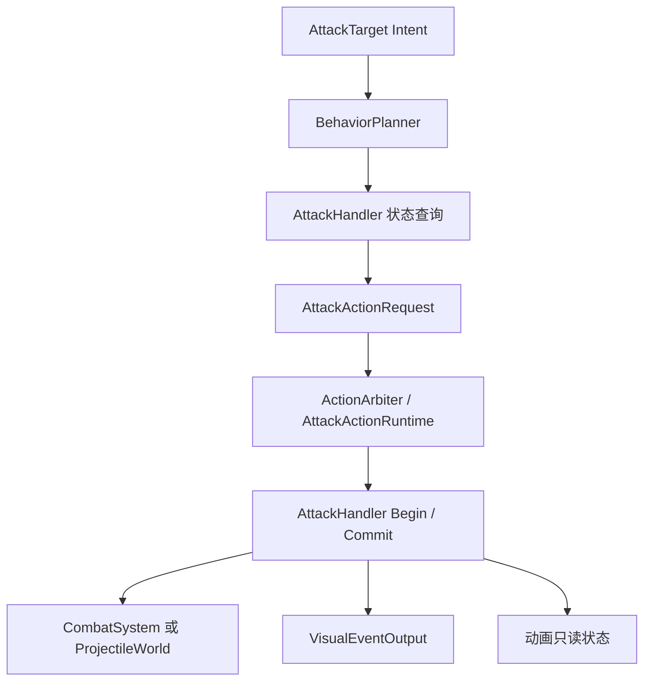
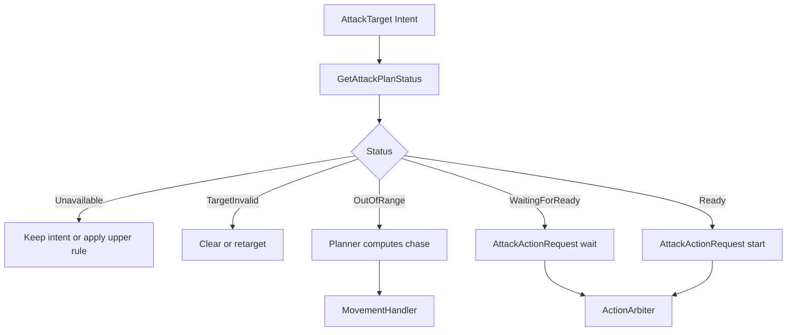
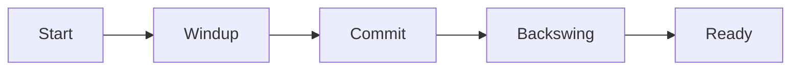
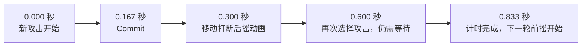
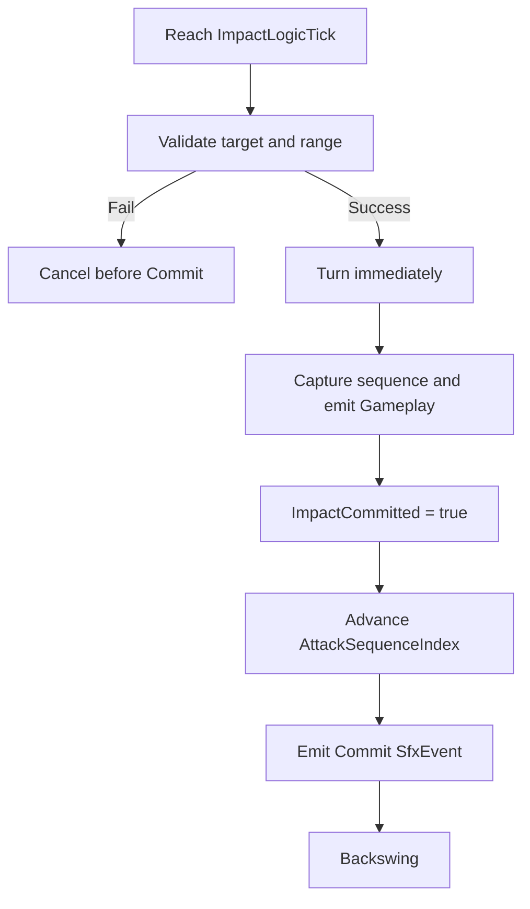
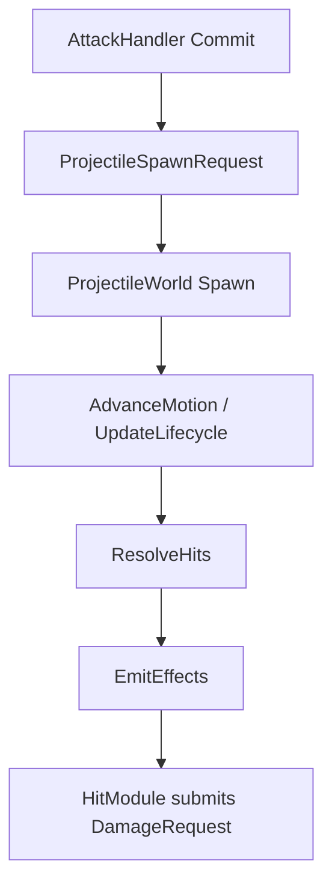
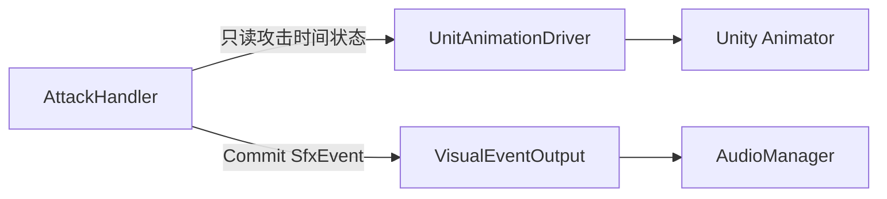
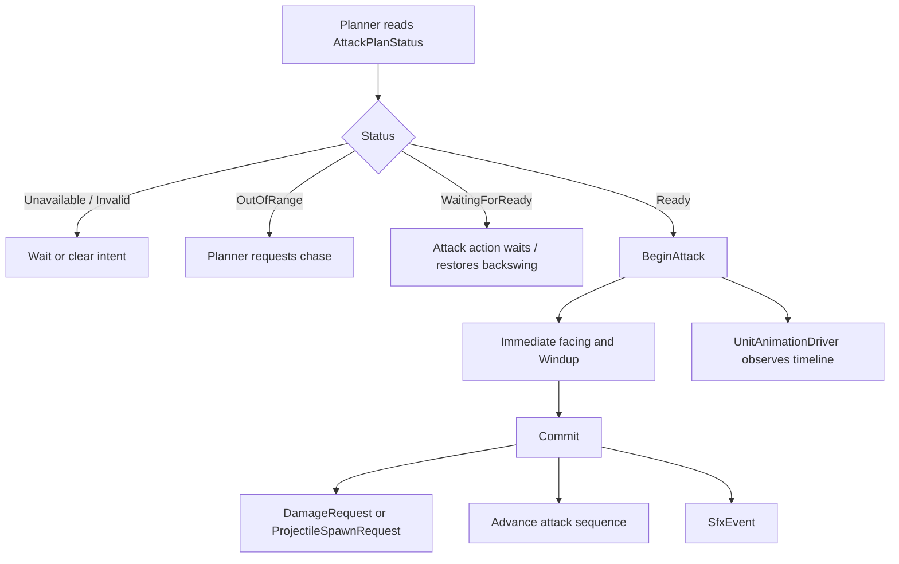

# Unity 帧同步 MOBA 单位攻击模块程序设计案 v6.2

> 适用范围：Unity、固定逻辑 Tick、确定性帧同步、类《英雄联盟》MOBA。  
> 核心类：`AttackHandler`。  
> 对齐文档：单位框架 v20、战斗系统 v8、投掷物系统 v14、表现层 v13.2。  
> 参考规则：[League of Legends Wiki：Autoattack](https://leagueoflegends.fandom.com/zh/wiki/Autoattack)。  
> 日期：2026-07-19。

---

# 目录

1. [总体定位与本版调整](#1-总体定位与本版调整)
2. [核心类：AttackHandler](#2-核心类attackhandler)
3. [攻击规划、追击与立即转向](#3-攻击规划追击与立即转向)
4. [攻击周期、前摇、Commit 与后摇](#4-攻击周期前摇commit-与后摇)
5. [Commit 的 Gameplay 输出](#5-commit-的-gameplay-输出)
6. [外部系统接缝](#6-外部系统接缝精简)
7. [最终结构与核心结论](#7-最终结构与核心结论)

---

# 1. 总体定位与本版调整

## 1.1 模块定位

攻击模块负责：

```text
判断当前目标能否进入普通攻击行为
维护普通攻击周期
解析本轮前摇和后摇时间
在 Commit Tick 产生近战伤害请求或远程投掷物生成请求
向表现层发出攻击 Commit 音效请求
向动画层提供确定性的只读攻击时间状态
```

总体链路：



## 1.2 本版核心调整

在此前版本基础上，本版作出以下调整：

1. 删除独立 `AttackProfile`；`AttackHandler` 只直接配置前摇比例、投掷物和 Commit 音效。
2. `AttackHandler` 改为可继承类，仅开放少量必要的 `virtual` 扩展点。
3. 删除 `AttackPlanResult`，Planner 直接读取 `AttackPlanStatus`。
4. `AttackHandler` 不计算追击停止距离；Planner 根据目标和 `StatHandler.AttackRange` 计算。
5. 删除朝向准备阶段。攻击成立后立即转向目标，朝向不再是攻击前提条件。
6. 攻击周期改为显式的 `StartLogicTick / ImpactLogicTick / NextAttackReadyLogicTick`。
7. 前摇只使用“本单位攻击前摇占整个攻击周期的比例”，不再设计 `BaseWindupSeconds + WindupModifier`。
8. 后摇动画可以被移动打断，但 `NextAttackReadyLogicTick` 不受影响。
9. 计时未结束时再次进入攻击行为，表现层恢复上一轮动画当前应处的后摇位置。
10. 远程普攻直接复用投掷物系统 v14 的 `ProjectileSpawnRequest`、`SpawnBoard` 和 `HitModules`，删除 `AttackImpactResolver`。
11. `AttackHandler` 可以配置 `CommitSfxEventId`，并在 Commit 成功后通过 `VisualEventOutput.SubmitSfx` 提交独立 `SfxEvent`。
12. 攻击动画仍由 `UnitAnimationDriver` 观察只读状态后操作 Animator；`AttackHandler` 不直接调用动画层。
13. 删除可配置的 `_basicAttackSourceId` 与 `_damageRecipeId`；默认普攻统一使用项目固定来源、固定基础普攻配方和当前攻击力。
14. 正式加入由各端 `AttackHandler` 确定性维护的 `byte AttackSequenceIndex`；表现层不再维护独立的本地攻击序列计数。
15. 公开接口不传递 Tick 参数，内部统一读取 `SimulationTickContext.Current.Tick`，且不得维护第二套逻辑时钟。
16. Commit 音效统一使用表现层定义的 `PresentationEventId`；`EventSequence` 复用本次攻击序列，不再分配第二套表现序号。
17. 明确 `SupportedUnitEvents = None`；死亡等生命周期变化由单位框架直接取消当前攻击行为，不为攻击模块新增单位事件入口。
18. 增加基于最后一次成功 Commit Tick 的攻击序列空闲重置；阈值从全局静态数据读取，不增加逐 Tick 计时器。
19. 对齐表现层 v13.2：不新增攻击专用 `SfxPort`，音效提交不返回播放结果，也不反向影响 Gameplay Commit。

## 1.3 职责边界

| 内容 | 权威模块 |
|---|---|
| 网络输入和 Command | 帧同步命令层 |
| `AttackTarget Intent` | 单位框架 |
| 追击路径与移动执行 | Planner、`MovementHandler`、`UnitLocomotionAgent` |
| 行为冲突、Reservation、取消和打断 | `ActionArbiter`、`AttackActionRuntime` |
| 普通攻击周期和 Commit | `AttackHandler` |
| 近战主伤害结算 | `CombatSystem` |
| 远程弹道、命中与回收 | `ProjectileWorld` |
| 暴击、护盾、吸血和攻击特效 | `CombatSystem` |
| 攻击 Animator 状态 | `UnitAnimationDriver` |
| Commit 音效记录与播放 | `VisualEventOutput`、`AudioManager` |

本设计仅描述其它系统与 `AttackHandler` 的最小接缝，不替单位框架、投掷物系统、战斗系统和表现层重复设计内部实现。

---

# 2. 核心类：AttackHandler

## 2.1 定位

`AttackHandler` 是 `Unit` 内部的普通攻击能力入口。

是否装配 `AttackHandler` 决定：

```text
Unit.AbilityMask.HasAttack
```

它负责：

| 职责 | 说明 |
|---|---|
| 配置普通攻击 | 前摇比例、远程投掷物和 Commit 音效 |
| 查询攻击规划状态 | 返回目标无效、距离不足、等待计时或可以开始 |
| 建立攻击周期 | 根据当前攻速解析 Start、Impact 和 Ready Tick |
| 保存长期计时 | 后摇 Runtime 被取消后仍继续等待 Ready Tick |
| 提交 Commit | 产生直接伤害请求或投掷物生成请求 |
| 维护攻击动画序列 | 成功 Commit 后推进 `AttackSequenceIndex`；空闲达到全局阈值后在下一次 Begin 前重置 |
| 提交音效记录 | Commit 时向 `VisualEventOutput` 提交 `SfxEvent` |
| 暴露动画时间 | 供 `UnitAnimationDriver` 读取，不直接操作 Animator |
| 攻击重置 | 允许明确的技能效果清空剩余攻击计时 |

它不负责：

```text
生成追击路径
计算 Planner 的追击停止距离
直接修改 MainRuntime / BaseRuntime
直接扣除生命或护盾
推进 Projectile
执行 Projectile 命中查询
设置 Animator Bool / Int / Float / Trigger
直接调用 AudioManager
直接调用 AudioSource.Play
新建攻击专用 SfxPort
```

## 2.2 配置字段

删除 `AttackProfile` 后，默认攻击参数直接属于 `AttackHandler`。

```csharp
public class AttackHandler
{
    [SerializeField, Range(0f, 1f)]
    private float _windupRatio = 0.2f;

    [SerializeField]
    private int _projectileDefId;

    [SerializeField]
    private int _commitSfxEventId;

    [SerializeField]
    private PresentationAnchor _commitSfxAnchor;
}
```

| 字段 | 说明 |
|---|---|
| `_windupRatio` | 本单位攻击前摇占完整攻击周期的比例 |
| `_projectileDefId` | `0` 表示直接攻击；非 `0` 表示远程普攻投掷物定义 |
| `_commitSfxEventId` | Commit 时发给表现层的稳定语义事件 ID；`0` 表示不发出音效事件 |
| `_commitSfxAnchor` | 音效跟随的语义挂点，例如攻击原点、武器或枪口 |

`AttackDamage`、`AttackSpeed` 和 `AttackRange` 不复制进 Handler 配置，统一从 `StatHandler` 读取。默认普攻的 `SourceId` 与伤害配方使用项目级固定值，不开放为单位配置：

```text
SourceId = CombatBuiltinSourceId.BasicAttack
RecipeId = CombatBuiltinRecipeId.BasicAttackDamage
BaseValue = Owner.StatHandler.AttackDamage
```

其中基础普攻配方只表达“以当前攻击力作为基础物理伤害进入战斗管线”。确实改变普攻伤害规则的少数单位，通过继承 `AttackHandler` 并重写伤害提交或投掷物构建步骤处理。

时间相关 Inspector 配置仍遵循项目约定：设计期使用秒和 `float`。本模块唯一直接配置的是无量纲 `_windupRatio`；运行时攻击时间统一解析为整数 Logic Tick。攻击动画序列的空闲重置阈值不在每个 Handler 重复配置，统一读取全局静态数据 `GlobalGameplayStaticData.AttackSequenceResetIntervalTicks`。

## 2.3 运行时状态

```csharp
public class AttackHandler
{
    public UnitUid CurrentTargetUid { get; protected set; }

    public int AttackStartLogicTick { get; protected set; }
    public int ImpactLogicTick { get; protected set; }
    public int NextAttackReadyLogicTick { get; protected set; }

    public bool ImpactCommitted { get; protected set; }
    public bool IsEmpoweredAttack { get; protected set; }
    public byte AttackSequenceIndex { get; protected set; }
    public int LastSuccessfulAttackLogicTick { get; protected set; }

    public int ResolvedAttackDurationTicks { get; protected set; }
    public int ResolvedWindupTicks { get; protected set; }
}
```

这些字段表达的是最近一次已经建立的正式攻击周期。即使攻击后摇对应的 `AttackActionRuntime` 被移动取消，它们仍保留到下一轮攻击建立或被攻击重置覆盖。

初始化约定保持简单：

```text
CurrentTargetUid = Invalid
AttackStartLogicTick = InvalidLogicTick
ImpactLogicTick = InvalidLogicTick
NextAttackReadyLogicTick = Owner.SpawnLogicTick
ImpactCommitted = false
AttackSequenceIndex = 0
LastSuccessfulAttackLogicTick = InvalidLogicTick
```

因此单位首次参与行为 Tick 时攻击计时已经就绪。`AttackStartLogicTick` 标识新攻击边沿，`AttackSequenceIndex + ImpactCommitted` 确定本轮动画序列；同一单位同一 Tick 最多正式执行一次 `BeginAttack`。

`AttackSequenceIndex` 是一个允许循环的攻击动画序列计数，不是战斗请求身份，也不等于已经删除的 `AttackSequenceId`。它不会写入 `DamageRequest`、`AttackSourceContext` 或 `ProjectileSourceDescriptor`。

其完整生命周期固定如下：

| 规则 | 约定 |
|---|---|
| 作用域 | 每个 `AttackHandler` 各自维护一份 |
| 类型 | `byte` |
| 初始化 | 新建单位及其 Handler 时初始化为 `0` |
| 跨 Tick | 持续保留，不按 Tick 重置 |
| 推进时点 | 仅在 Commit 的 Gameplay 输出成功后递增 |
| 不推进场景 | Commit 前取消、Commit 失败、普通移动、换目标、后摇取消 |
| 攻击重置 | `ResetAttackTimer` 不修改序列 |
| 回绕 | `255` 的下一次成功 Commit 回到 `0` |
| 空闲重置 | 下一次 `BeginAttack` 前，若距最后一次成功 Commit 已达到全局阈值，则先重置为 `0` |
| 死亡与复活 | 死亡本身不直接重置；若空闲时间达到阈值，复活后的下一次 `BeginAttack` 自然重置；新 Handler 从 `0` 开始 |
| 帧同步 | 纳入快照；预测回滚时恢复后再重演，不从表现层历史反推 |

因此“客户端不维护本地攻击序列计数”只表示表现层不另建私有计数。参与本地预测的客户端 `AttackHandler` 必须与其它模拟端一样维护并回滚这份 Gameplay 状态。

不增加：

```text
AttackSequenceId
AttackKind
AttackProfileId
AttackImpactPayload
AttackPlanResult
```

## 2.4 最小公开接口

```csharp
public class AttackHandler
{
    public virtual AttackPlanStatus GetAttackPlanStatus(UnitUid targetUid);

    public bool IsAttackReady()
        => SimulationTickContext.Current.Tick >= NextAttackReadyLogicTick;

    public virtual void BeginAttack(UnitUid targetUid);

    public virtual bool CommitAttack();

    public virtual void CancelBeforeCommit();

    public virtual void ResetAttackTimer(
        AttackTimerResetReason reason);
}
```

所有接口在函数内部统一读取：

```csharp
int currentLogicTick = SimulationTickContext.Current.Tick;
```

`AttackHandler` 不缓存 `SimulationTickContext`，不自行推进 Tick，也不访问其它命名的逻辑时钟。项目内统一使用 `SimulationTickContext.Current.Tick / DeltaTick / ExecutionMode`。

调用者：

| 接口 | 调用者 |
|---|---|
| `GetAttackPlanStatus` | `BehaviorPlanner`、`AttackActionRuntime` |
| `BeginAttack` | `AttackActionRuntime` 在计时就绪并正式进入新前摇时 |
| `CommitAttack` | `AttackActionRuntime` 到达 `ImpactLogicTick` 时；返回本次 Gameplay 输出是否成功 |
| `CancelBeforeCommit` | Commit 前被取消或打断时 |
| `ResetAttackTimer` | 明确具有攻击重置效果的技能逻辑 |

## 2.5 继承与可重写边界

`AttackHandler` 不再是 `sealed`。大多数英雄、小兵、野怪和防御塔直接使用基类；只有确实改变普通攻击 Gameplay 规则的少数单位才继承。

推荐开放的保护级扩展点：

```csharp
protected virtual fp ResolveWindupRatio();
protected virtual bool ValidateAdditionalTarget(Unit target);
protected virtual bool ResolveIsEmpoweredAttack();
protected virtual int ResolveProjectileDefId();
protected virtual int ResolveCommitSfxEventId();

protected virtual void EmitDirectAttack(Unit target);
protected virtual ProjectileSpawnRequest BuildProjectileSpawnRequest(Unit target);
```

基类公开的 `BeginAttack` 和 `CommitAttack` 仍负责以下共同不变量：

```text
解析和保存确定性时间轴
Commit 只能成功一次
统一更新 ImpactCommitted
统一在 Commit 成功后推进 AttackSequenceIndex
统一产生 Commit SfxEvent
统一维护表现层所需只读状态
```

派生类优先重写保护级步骤，而不是完整复制 `CommitAttack`。只有当某个单位连攻击周期语义都不同，才考虑重写公开方法。

典型派生需求：

| 特殊单位 | 可重写内容 |
|---|---|
| 近战/远程形态英雄 | `ResolveProjectileDefId` |
| 特殊弹药英雄 | `BuildProjectileSpawnRequest` |
| 特殊强化普攻或特殊伤害公式 | `ResolveIsEmpoweredAttack`、`EmitDirectAttack` 或 `BuildProjectileSpawnRequest` |
| 特殊攻击目标规则 | `ValidateAdditionalTarget` |
| 不同形态音效 | `ResolveCommitSfxEventId` |

不为尚未出现的特殊英雄预建通用 Modifier Collector、攻击节点图或配置继承树。

---

# 3. 攻击规划、追击与立即转向

## 3.1 AttackPlanStatus

Planner 直接从 `AttackHandler` 读取枚举，不再经过 `AttackPlanResult`：

```csharp
public enum AttackPlanStatus : byte
{
    Unavailable,
    TargetInvalid,
    OutOfRange,
    WaitingForReady,
    Ready
}
```

语义：

| 状态 | Planner 行为 |
|---|---|
| `Unavailable` | 当前不能普攻，保留或按上层规则处理 Intent，不提交攻击请求 |
| `TargetInvalid` | 清除或重新选择目标 |
| `OutOfRange` | Planner 自己建立 `ChaseForAttack` 移动请求 |
| `WaitingForReady` | 目标仍在范围内，申请或维持 Attack 行为以等待剩余后摇 |
| `Ready` | 申请 Attack 行为并正式开始新一轮前摇 |

## 3.2 Planner 自己计算追击

`AttackHandler` 只回答：

```text
目标是否有效
当前是否在攻击距离内
攻击计时是否完成
```

它不返回：

```text
ChaseStopDistance
MoveGoal
路径类型
到达容差
```

距离不足时，Planner 读取：

```text
Source.StatHandler.AttackRange
Source.PhysicsEntity
Target.PhysicsEntity
GlobalParamTable.DefaultAttackMoveStopPadding
```

并自行构建：

```text
MoveActionRequest(
    MoveGoal.ChaseForAttack(
        TargetUid,
        AttackRange + DefaultAttackMoveStopPadding))
```

真正的形状距离算法复用物理模拟系统已经提供的单位范围查询语义，Planner 和 `AttackHandler` 都不能再各自发明一套中心点半径公式。

`GetAttackPlanStatus` 的判断顺序固定为：

```text
GetAttackPlanStatus(targetUid):
    currentLogicTick = SimulationTickContext.Current.Tick

    if Owner 没有攻击能力 or CanAttack == false or AttackSpeed <= 0:
        return Unavailable

    target = UnitWorld.Resolve(targetUid)
    if target 不存在 or 已死亡 or 不可选中 or 不可敌对攻击:
        return TargetInvalid

    if PhysicsQuery.IsInAttackRange(Owner, target, Owner.StatHandler.AttackRange) == false:
        return OutOfRange

    if currentLogicTick < NextAttackReadyLogicTick:
        return WaitingForReady

    return Ready
```

这里的范围查询只回答布尔值；`OutOfRange` 之后追到哪里、使用什么 `StopDistance`，完全由 Planner 决定。距离判断先于计时判断，因此目标在攻击计时期间离开范围时，Planner 仍可继续追击，而不是原地等待。

## 3.3 规划流程



`WaitingForReady` 仍然允许进入 Attack 主行为，原因是表现层需要在玩家重新选择攻击时恢复上一轮动画当前应处的后摇位置。它不表示新一轮前摇已经开始，也不会重置 `AttackStartLogicTick`。

## 3.4 朝向不是攻击前提

删除：

```text
NeedFacing
CannotFaceTarget
等待转向完成后才能攻击
朝向角度不满足时拒绝 Commit
```

普通攻击行为成立时：

```text
direction = TargetPosition - SourcePosition

if direction is not zero:
    Source 通过单位框架认可的逻辑朝向入口
    立即把 Facing 设置为 Normalize(direction)
```

攻击前摇期间目标移动时，可以按项目单位朝向入口继续刷新朝向；无论是否刷新，朝向都不能成为 Start 或 Commit 的合法性条件。

```text
CanAttack 决定能不能攻击。
AttackRange 决定距离是否足够。
Facing 只是在攻击成立后立即得到的逻辑结果。
```

不能直接写 Unity `Transform.rotation`。逻辑朝向仍写入单位空间状态的权威入口，之后由物理同步或表现同步更新 Unity Transform。

---

# 4. 攻击周期、前摇、Commit 与后摇

## 4.1 完整攻击周期

一次普通攻击周期由三段组成：

```text
Start
    -> Windup
    -> Commit / Impact
    -> Backswing
    -> NextAttackReady
```



完整攻击周期在数值上为：

```text
AttackDurationSeconds = 1 / CurrentAttackSpeed
```

不同英雄和不同单位通过 `_windupRatio` 决定前摇占比：

```text
WindupSeconds = AttackDurationSeconds * WindupRatio
BackswingSeconds = AttackDurationSeconds - WindupSeconds
```

## 4.2 Tick 解析算法

新一轮攻击正式开始时读取当前 `StatHandler.AttackSpeed`，并锁定本轮时间：

```text
BeginAttack(target):
    currentLogicTick = SimulationTickContext.Current.Tick

    if LastSuccessfulAttackLogicTick != InvalidLogicTick
    and currentLogicTick - LastSuccessfulAttackLogicTick
        >= GlobalGameplayStaticData.AttackSequenceResetIntervalTicks:
        AttackSequenceIndex = 0

    attackSpeed = Owner.StatHandler.AttackSpeed
    durationTicks = Max(1, Ceil(TickRate / attackSpeed))

    ratio = Clamp01(ResolveWindupRatio())
    windupTicks = Clamp(
        RoundDeterministic(durationTicks * ratio),
        1,
        durationTicks)

    CurrentTargetUid = target
    AttackStartLogicTick = currentLogicTick
    ImpactLogicTick = currentLogicTick + windupTicks
    NextAttackReadyLogicTick = currentLogicTick + durationTicks

    ResolvedAttackDurationTicks = durationTicks
    ResolvedWindupTicks = windupTicks

    ImpactCommitted = false
    IsEmpoweredAttack = ResolveIsEmpoweredAttack()

    TurnToTargetImmediately(target)
```

`StatHandler` 必须保证可攻击单位的最终 `AttackSpeed` 大于 `0`，并在数值层完成攻速上下限处理。`AttackSpeed <= 0` 或 `Capability.CanAttack == false` 时，`GetAttackPlanStatus` 返回 `Unavailable`，不能进入上述除法。

本轮攻击开始后，`ImpactLogicTick` 和 `NextAttackReadyLogicTick` 不再因为动画被打断而变化。

序列空闲重置只在下一次正式 `BeginAttack` 建立时间轴前惰性检查，不给 `AttackHandler` 增加逐 Tick 累加器，也不在上一轮后摇期间直接修改序列。全局静态数据必须保证 `AttackSequenceResetIntervalTicks >= 1`。

重置判断以最后一次成功 Commit 为起点。Commit 前取消、Commit 失败、普通移动、换目标以及 `ResetAttackTimer` 都不刷新 `LastSuccessfulAttackLogicTick`。如果新攻击在阈值到达前已经正式 Begin，即使它的 Commit Tick 位于阈值之后，本轮仍沿用 Begin 时选定的攻击序列。

本轮中途发生的攻速变化默认从下一轮攻击开始生效，避免已经开始的完整攻击动画时间轴在中途重新拉伸。若未来确实需要某个技能动态改变当前攻击周期，应由该技能明确调用攻击重置或特殊 Handler 逻辑，不修改默认规则。

## 4.3 用户示例

给定：

```text
AttackSpeed = 1.2 次 / 秒
WindupRatio = 0.2
```

则：

```text
完整攻击时间 = 1 / 1.2 = 0.833 秒
攻击前摇 = 0.833 * 0.2 = 0.167 秒
攻击后摇 = 0.833 - 0.167 = 0.666 秒
```

在 30 Logic Tick/s 下：

```text
AttackDurationTicks = 25
WindupTicks = 5

StartTick = T
ImpactTick = T + 5
NextAttackReadyTick = T + 25
```

时间线：



玩家在 `0.3` 秒移动：

```text
攻击已经 Commit。
攻击动画后摇可以停止。
当前 AttackActionRuntime 可以按单位框架规则被移动行为取消。
NextAttackReadyLogicTick 仍然是 T + 25。
```

玩家在 `0.6` 秒再次选择攻击同一范围内目标：

```text
GetAttackPlanStatus = WaitingForReady
Planner 允许重新进入 Attack 行为
不能建立新一轮 Windup
还需要等待约 0.233 秒
```

到 `0.833` 秒：

```text
SimulationTickContext.Current.Tick >= NextAttackReadyLogicTick
GetAttackPlanStatus = Ready
正式建立下一轮攻击
重新解析新的 Start / Impact / Ready Tick
```

## 4.4 Commit

当：

```text
SimulationTickContext.Current.Tick >= ImpactLogicTick
且 ImpactCommitted == false
```

`AttackActionRuntime` 调用：

```text
AttackHandler.CommitAttack()
```

Commit 固定顺序：

```text
1. 再次解析当前目标。
2. 检查目标是否仍然有效、可选中且处于攻击距离内。
3. 立即刷新朝向，但不把朝向作为失败条件。
4. 捕获 `committedAttackSequenceIndex = AttackSequenceIndex`。
5. 产生直接攻击或 ProjectileSpawnRequest。
6. 成功后设置 `ImpactCommitted = true`，并记录 `LastSuccessfulAttackLogicTick`。
7. 循环递增 `AttackSequenceIndex`。
8. 使用捕获的序列与 `CommitSfxEventId` 发出 Commit SfxEvent。
9. 允许单位框架进入或继续后摇阶段。
```



序列推进算法固定为：

```text
committedAttackSequenceIndex = AttackSequenceIndex
LastSuccessfulAttackLogicTick = SimulationTickContext.Current.Tick

if AttackSequenceIndex == 255:
    AttackSequenceIndex = 0
else:
    AttackSequenceIndex += 1
```

该循环是允许的，因为 `AttackSequenceIndex` 只是可回滚的循环动画序列计数，不承担全局唯一身份。

## 4.5 Commit 前取消

如果 Windup 期间被玩家移动、停止、换目标或有效控制打断，并且本次攻击尚未 Commit：

```text
currentLogicTick = SimulationTickContext.Current.Tick
ImpactCommitted = false
NextAttackReadyLogicTick = currentLogicTick
AttackSequenceIndex 保持不变
```

本次没有生效的攻击不继续占用完整攻击周期。下一次正常规划机会可以重新开始前摇。

是否允许某个 Order 或控制打断 Windup，仍由单位框架和控制系统负责；攻击模块只接收“本次在 Commit 前被取消”的结果。

## 4.6 Commit 后取消后摇

Commit 后取消只影响当前行为和动画：

```text
不修改 ImpactCommitted。
不修改 NextAttackReadyLogicTick。
不撤回已经提交的 DamageRequest。
不撤回已经生成的 Projectile。
不重复播放 Commit 音效。
```

这就是走砍能够增加移动时间、但不会绕过攻速限制提高普通攻击频率的基础。

## 4.7 计时未结束时重新进入攻击

当目标在攻击距离内，但当前 Tick 尚未到 `NextAttackReadyLogicTick`：

```text
AttackPlanStatus = WaitingForReady
```

单位框架可以建立一个轻量的等待攻击行为，但不能调用 `BeginAttack`。这一阶段：

```text
沿用上一轮 AttackStart / Impact / Ready Tick。
沿用上一轮 ImpactCommitted 和 IsEmpoweredAttack。
不产生新的攻击实例边沿。
不触发新的 AttackStart Trigger。
不产生新的 SfxEvent。
```

表现层据此恢复上一轮完整攻击 Clip 当前应处的后摇位置。

## 4.8 攻击重置

普通移动、停止、换目标和后摇取消不能重置攻击计时。

默认只有明确标记为“攻击重置”的技能效果调用：

```text
ResetAttackTimer(reason):
    currentLogicTick = SimulationTickContext.Current.Tick
    NextAttackReadyLogicTick = currentLogicTick
```

攻击重置只修改 Ready Tick，不修改 `AttackSequenceIndex`，也不刷新 `LastSuccessfulAttackLogicTick`。只有成功 Commit 才会消耗一个攻击动画序列并刷新序列空闲计时起点。

如果上一轮已经 Commit：

```text
已产生的伤害或 Projectile 保留。
旧后摇等待立即结束。
下一次正常规划机会可以开始新前摇。
```

如果调用发生在未 Commit 的 Windup，技能或 `ActionArbiter` 应先按正常规则取消当前攻击行为，再执行重置，避免同一 Runtime 同时代表旧攻击与新攻击。

第一版不在同一 Tick 内递归运行 Planner，不允许一次重置在同一调用栈里无限创建攻击。

---

# 5. Commit 的 Gameplay 输出

本章只规定 `AttackHandler` 的最小输出接口。伤害管线和投掷物内部实现分别以战斗系统 v8、投掷物系统 v14 为准。

## 5.1 直接攻击

当：

```text
ResolveProjectileDefId() == 0
```

Commit 直接向 `CombatSystem` 提交主攻击伤害请求：

```text
DamageRequest
    Header.SourceUnitUid = Owner.UnitUid
    Header.TargetUnitUid = CurrentTargetUid
    Header.SourceDescriptor.SourceType = Attack
    Header.SourceDescriptor.SourceId = CombatBuiltinSourceId.BasicAttack
    Header.RecipeId = CombatBuiltinRecipeId.BasicAttackDamage
    BaseValue = Owner.StatHandler.AttackDamage
```

`CombatSeq` 由 `CombatSystem.Submit` 内部统一分配。

`SourceDescriptor.OwnerUnitUid / EmitterUnitUid` 继续由战斗系统现有归属规则解析：普通单位通常两者都是攻击者；召唤物或分身可以由真正拥有者归属伤害，而实际攻击单位作为 Emitter。攻击模块不重新设计击杀与归属规则。

攻击模块不自行计算：

```text
暴击
护甲和穿透
护盾吸收
生命偷取
全能吸血
攻击特效
濒死和死亡
```

## 5.2 远程攻击

当：

```text
ResolveProjectileDefId() != 0
```

Commit 不提交即时伤害，而是构建投掷物系统 v14 已有的：

```text
ProjectileSpawnRequest
    ProjectileDefId
    OwnerUnitUid
    ProjectileSourceDescriptor
    SpawnBoardInput
```

攻击模块至少提供：

```text
ProjectileDefId = ResolveProjectileDefId()
OwnerUnitUid = Owner.UnitUid
Source.SourceType = Attack
Source.SourceId = CombatBuiltinSourceId.BasicAttack
Input.TargetUnitUid = CurrentTargetUid
Input.SpawnPosition = 确定性逻辑攻击原点
```

远程普攻的 HitModule 使用同一固定基础普攻来源与基础普攻配方提交 `DamageRequest`；攻击力读取时点服从战斗系统 v8 的统一规则，不在 `AttackHandler` 增加第二份伤害配置。

实际字段必须服从对应 `ProjectileDef.SpawnSchema`，攻击模块不能使用任意 `object` 参数包。

远程普攻的推荐 `ProjectileDef` 组合直接复用投掷物系统 v14：

```text
PhysicsEntity2D.Shape = Point
SweepFromPrev = true

MotionModules
    直线移动或轻量跟踪

LifecycleModules
    目标失效检查
    最大寿命检查

HitPolicy
    SameTarget = Once
    EndOnFirstValidHit = true

HitModules
    提交 Attack Source DamageRequest
```



攻击模块不再增加：

```text
AttackImpactResolver
AttackImpactPayload
Projectile 命中回调到 AttackActionRuntime
Projectile 运动或命中状态副本
```

## 5.3 Commit 后的远程攻击

Projectile 生成成功后：

```text
Projectile 生命周期独立于 AttackActionRuntime。
攻击者移动不会撤回 Projectile。
攻击者的后摇被取消不会撤回 Projectile。
攻击者之后死亡是否影响 Projectile，服从投掷物系统和战斗来源规则。
目标过滤、IsTargetable、同目标命中、阻挡和回收由 ProjectileWorld 负责。
```

`AttackHandler` 不长期保存 Projectile 引用。

## 5.4 强化攻击与攻击特效

保持轻量边界：

| 效果 | 归属 |
|---|---|
| 强化攻击额外伤害 | `CombatModifierCollector` 或独立攻击来源请求 |
| 下一次攻击必暴击 | `CritPolicyModifier` |
| 装备攻击特效 | `AttackEffectProvider` |
| 临时攻击距离、攻速、攻击力 | `StatModifier` |
| 攻击重置 | `AttackHandler.ResetAttackTimer` |
| 强化攻击动画选择 | `AttackHandler.IsEmpoweredAttack` 只读状态 |

`AttackHandler` 不增加 `AttackKind`，也不遍历装备或 Buff 来直接执行全部攻击特效。

---

# 6. 外部系统接缝（精简）

本章只保留 `AttackHandler` 必须提供或遵守的接口契约。单位框架、表现层、帧同步和测试系统的内部结构以各自设计案为准。

## 6.1 表现层接缝

动画使用状态驱动，音效使用事件驱动：

| 输出 | `AttackHandler` 提供 | 表现层处理 |
|---|---|---|
| 攻击动画 | Start、Impact、Ready Tick，`ImpactCommitted`、`IsEmpoweredAttack`、`AttackSequenceIndex` | `UnitAnimationDriver` 设置 Animator 参数和状态 |
| Commit 音效 | 一次性 `SfxEvent` | `VisualEventOutput` 写入本 Tick SFX 缓冲，Tick 末由 `AudioManager` 消费 |



`AttackHandler` 不调用 Animator。`UnitAnimationDriver` 读取：

```text
AttackStartLogicTick
ImpactLogicTick
NextAttackReadyLogicTick
ImpactCommitted
IsEmpoweredAttack
AttackSequenceIndex
```

服务端权威模拟、客户端预测和客户端重演中的 `AttackHandler` 都正常维护 `AttackSequenceIndex`。禁止的是 `UnitAnimationDriver` 再维护一份表现层私有计数；它只能读取本端当前 Gameplay 状态。

动画使用的当前序列按攻击阶段推导：

```text
Windup 尚未 Commit:
    CurrentAnimationSequenceIndex = AttackSequenceIndex

已经 Commit，正在播放或恢复 Backswing:
    CurrentAnimationSequenceIndex =
        AttackSequenceIndex == 0
            ? 255
            : AttackSequenceIndex - 1

ClipIndex = CurrentAnimationSequenceIndex % NormalAttackClipCount
```

新攻击仍以“有效且发生变化的 `AttackStartLogicTick`”作为边沿；Commit 时 `AttackSequenceIndex` 的递增不是新攻击边沿。客户端只根据同步序列取模选择 Clip，不自行推进序列。

并按表现层 v13.2 处理三种入口：

| 场景 | Animator 入口 |
|---|---|
| 新攻击 | 设置 `IsAttacking`、`IsAttackRecovering = false`、强化与序列参数、`AttackMotionTime = 0`，最后触发 `AttackStart` |
| Ready 前重新进入攻击 | 不触发 `AttackStart`，设置 `IsAttackRecovering = true`，CrossFade 或 Play 到上一轮正确后摇位置 |
| 回滚恢复 | 不依赖历史 Trigger，直接定位到恢复后的 State 与 `AttackMotionTime` |

完整攻击 Clip 的采样映射仍为：

```text
Start -> Impact : 0 -> ImpactNormalizedTime
Impact -> Ready : ImpactNormalizedTime -> 1
```

Commit 的 Gameplay 输出成功后，`AttackHandler` 才使用本次 Commit 前捕获的攻击序列提交配置音效记录：

```text
commitSfxEventId = ResolveCommitSfxEventId()

if commitSfxEventId != 0:
    evt = SfxEvent(
        SfxEventId = commitSfxEventId
        Id = PresentationEventId(
            SourceLogicTick = SimulationTickContext.Current.Tick
            SourceKind = Unit
            SourceRuntimeUid = Owner.UnitUid
            EventSequence = committedAttackSequenceIndex
            EventKey = commitSfxEventId)
        Anchor = CommitSfxAnchor)

    VisualEventOutput.SubmitSfx(in evt)
```

`PresentationEventId` 完全复用表现层的统一结构。`EventSequence` 直接使用本次成功 Commit 对应的 `committedAttackSequenceIndex`，不再设计第二套表现序列；`EventKey` 使用稳定的 `CommitSfxEventId`。

`VisualEventOutput.SubmitSfx` 只校验并记录当前 Tick 的纯数据事件，不立即播放、不解析定义、没有“是否成功听到声音”的返回值，也不改变 `CommitAttack` 结果。Tick 末由表现层将独立 SFX 记录流交给 `AudioManager`；实际 `SfxDefId` 解析、回滚去重、`OneShotNoReplay`、音量、Pitch、挂点和对象池均属于表现层。

服务端、客户端预测和客户端重演均可构造相同记录；Dedicated Server 使用无 Unity 音频播放的消费者或丢弃最终本地播放结果，`AttackHandler` 不依赖客户端 `AudioManager` 实例。

## 6.2 单位框架接缝

单位框架只需遵守以下调用顺序：

```text
OutOfRange
    -> Planner 提交追击移动。

WaitingForReady
    -> 可以进入 Attack 行为恢复后摇。
    -> 不调用 BeginAttack。

Ready
    -> AttackActionRuntime 调用 BeginAttack。

到达 ImpactLogicTick
    -> 调用 CommitAttack。

Commit 前取消
    -> 调用 CancelBeforeCommit。

Commit 后取消
    -> 结束当前行为和动画，但不修改 Ready Tick。
```

等待旧攻击周期时不应再次占用 Movement；Windup 的资源占用和打断规则、Commit 后是否释放 Movement，由单位框架现有 `ActionArbiter` 与 Reservation 规则决定。

技能产生的攻击来源伤害直接由技能系统提交 `SourceType = Attack` 的战斗请求，不进入普通攻击计时。

单位生成 Tick 内不得主动运行 Planner、`AttackActionRuntime` 或普通攻击；该限制由单位框架根据 `SimulationTickContext.Current.Tick > Owner.UnitUid.SpawnLogicTick` 统一判断，`AttackHandler` 不增加 `FirstActiveLogicTick` 字段或重复门禁。

当前支持声明为：

```text
SupportedUnitEvents = None
```

`AttackHandler` 不注册任何单位事件入口。单位死亡时，单位框架按生命周期规则直接取消当前 `AttackActionRuntime`：若尚未 Commit，则走 `CancelBeforeCommit`；若已经 Commit，则只结束行为，不撤回伤害或投掷物，也不修改剩余攻击计时。死亡后立即复活等特殊技能若需要重置攻击计时，由其技能或生命周期逻辑显式调用 `ResetAttackTimer`，不为此增加死亡事件回调。

## 6.3 帧同步关注标记

需要由帧同步设计审查的 `AttackHandler` 运行状态：

```text
CurrentTargetUid
AttackStartLogicTick
ImpactLogicTick
NextAttackReadyLogicTick
ImpactCommitted
IsEmpoweredAttack
ResolvedAttackDurationTicks
ResolvedWindupTicks
AttackSequenceIndex
LastSuccessfulAttackLogicTick
```

`WindupRatio`、`ProjectileDefId`、`CommitSfxEventId` 和 `CommitSfxAnchor` 是单位静态配置；`AttackSequenceResetIntervalTicks` 来自全局静态数据。远程攻击生成后的状态全部属于 `ProjectileWorldSnapshot`，`AttackHandler` 不保存投掷物副本。

`AttackSequenceIndex` 与 `LastSuccessfulAttackLogicTick` 随 `AttackHandler` 一起进入快照。普通死亡本身不直接重置序列；如果死亡期间的空闲时间达到全局阈值，复活后的下一次 `BeginAttack` 将序列重置为 `0`。单位销毁并以新 `UnitUid`、新 Handler 重建时，两者分别初始化为 `0` 和 `InvalidLogicTick`。

确定性底线：

```text
不用 Time.time 或 deltaTime 推进攻击。
不用 Animator 或 Animation Event 决定 Commit。
不用 Unity Transform 判断逻辑距离或朝向。
不用 UnitAnimationDriver 维护第二份本地攻击序列。
回滚重演必须重建相同的 Gameplay 结果和相同 ID 的 `SfxEvent`；表现层不得因此重复播放已完成的 OneShot。
```

## 6.4 关键验收条件

| 场景 | 必须结果 |
|---|---|
| 背对目标发起攻击 | 攻击成立并立即逻辑转向 |
| 目标距离不足 | Handler 返回 `OutOfRange`，Planner 自行计算追击 |
| 攻速 1.2、前摇比例 0.2、30 TPS | 25 Tick 周期，第 5 Tick Commit |
| Commit 后移动取消动画 | Ready Tick 不变 |
| Ready 前再次攻击 | 只恢复后摇，不建立新前摇 |
| 普通移动或换目标 | 不重置攻击计时 |
| 明确攻击重置技能 | Ready Tick 设为当前 Tick |
| Commit 前取消 | `AttackSequenceIndex` 不递增 |
| Commit 成功 | Gameplay 输出成功后，`AttackSequenceIndex` 循环递增 |
| `AttackSequenceIndex` 从 255 递增 | 明确回到 0，所有预测端结果一致 |
| 空闲时间小于全局阈值 | 下一次 `BeginAttack` 沿用当前攻击序列 |
| 空闲时间达到全局阈值 | 下一次 `BeginAttack` 先将 `AttackSequenceIndex` 重置为 0 |
| Commit 前取消或失败 | 不刷新 `LastSuccessfulAttackLogicTick` |
| 同一单位实例死亡后复活 | 死亡不直接重置；若空闲达到阈值，则在下一次 `BeginAttack` 重置 |
| 单位销毁后以新 `UnitUid` 重建 | 新 Handler 的 `AttackSequenceIndex` 初始化为 0 |
| Commit 后恢复后摇 | 使用循环递增前的上一序列选择 Clip |
| 客户端预测与回滚 | Handler 序列可恢复重演，Driver 不另设计数 |
| 直接普攻 | 使用固定 BasicAttack 来源、固定基础普攻配方和当前攻击力 |
| 远程普攻 | Commit 生成 Projectile，由 HitModule 提交普攻伤害 |
| Commit 音效 | 使用配置的 `CommitSfxEventId` 与本次 Commit 捕获的攻击序列，只发出一次 |
| 回滚恢复 | Gameplay 结果不重复，动画定位正确，OneShot 不重复 |

---

# 7. 最终结构与核心结论

## 7.1 模块结构

```text
Unit
└── AttackHandler
    ├── Config
    │   ├── WindupRatio
    │   ├── ProjectileDefId
    │   ├── CommitSfxEventId
    │   └── CommitSfxAnchor
    │
    ├── Runtime State
    │   ├── CurrentTargetUid
    │   ├── AttackStartLogicTick
    │   ├── ImpactLogicTick
    │   ├── NextAttackReadyLogicTick
    │   ├── ImpactCommitted
    │   ├── IsEmpoweredAttack
    │   ├── AttackSequenceIndex : byte
    │   └── LastSuccessfulAttackLogicTick
    │
    ├── GetAttackPlanStatus
    ├── BeginAttack
    ├── CommitAttack
    ├── CancelBeforeCommit
    ├── ResetAttackTimer
    └── Protected Virtual Hooks

External Interfaces
├── BehaviorPlanner / MovementHandler
├── ActionArbiter / AttackActionRuntime
├── CombatSystem
├── ProjectileWorld
├── UnitAnimationDriver / Animator
└── VisualEventOutput / AudioManager
```

## 7.2 最终主流程



## 7.3 核心结论

1. 普通攻击只保留一个核心类 `AttackHandler`；删除独立 `AttackProfile`、`AttackPlanResult`、`AttackTargetValidator` 和 `AttackImpactResolver`。

2. 每个单位直接配置自己的 `WindupRatio`。完整攻击周期为 `1 / AttackSpeed`，前摇与后摇严格分割这一周期。

3. 后摇动画和行为可以被移动取消，但 `NextAttackReadyLogicTick` 必须继续计时；普通移动不能重置攻击周期。

4. 计时未完成时再次攻击范围内目标，进入等待攻击行为并恢复上一轮动画当前后摇位置；到 Ready Tick 后才开始新前摇。

5. 攻击成立后立即转向目标。朝向不是 Start 或 Commit 的前提条件。

6. Planner 直接读取 `AttackPlanStatus`，并自行根据目标与 `StatHandler.AttackRange` 计算追击。

7. 默认普攻不配置 SourceId 或 DamageRecipeId，统一使用项目固定的 BasicAttack 来源、基础普攻配方和当前攻击力；特殊规则由子类重写。

8. `ProjectileDefId = 0` 时直接提交攻击伤害；非 `0` 时复用 `ProjectileSpawnRequest`，由 Projectile HitModule 提交伤害。

9. `AttackHandler` 在 Commit Gameplay 输出成功后构造既有 `SfxEvent`，并调用 `VisualEventOutput.SubmitSfx(in evt)`；不直接调用 `AudioManager`、`AudioSource`，也不新增攻击专用音频端口。

10. Commit 音效身份使用表现层统一的 `PresentationEventId`；`EventSequence` 复用本次 Commit 前捕获的攻击序列，`EventKey` 使用配置的 `CommitSfxEventId`，不维护第二套表现序列。

11. `AttackHandler` 不调用攻击动画。`UnitAnimationDriver` 观察攻击时间状态，自行设置 Animator 参数、`AttackStart` Trigger、Motion Time 和后摇恢复 CrossFade。

12. 每个模拟端（包括客户端预测）的 `AttackHandler` 都确定性维护可回滚的 `byte AttackSequenceIndex`；只有成功 Commit 才循环递增，表现层不得另设计数。

13. `LastSuccessfulAttackLogicTick` 记录最后一次成功 Commit；下一次 `BeginAttack` 若发现空闲时间达到全局静态阈值，则将 `AttackSequenceIndex` 重置为 `0`，不增加逐 Tick 计时器。

14. `SupportedUnitEvents = None`；死亡等生命周期变化由单位框架直接取消攻击行为，攻击模块不新增事件驱动入口。

15. 所有接口内部统一读取 `SimulationTickContext.Current.Tick`，不传递 Context，也不维护第二套逻辑时钟。

16. 少数特殊单位通过继承 `AttackHandler` 并重写保护级步骤适配；默认系统不为特殊用例建立重量级配置与扩展框架。
