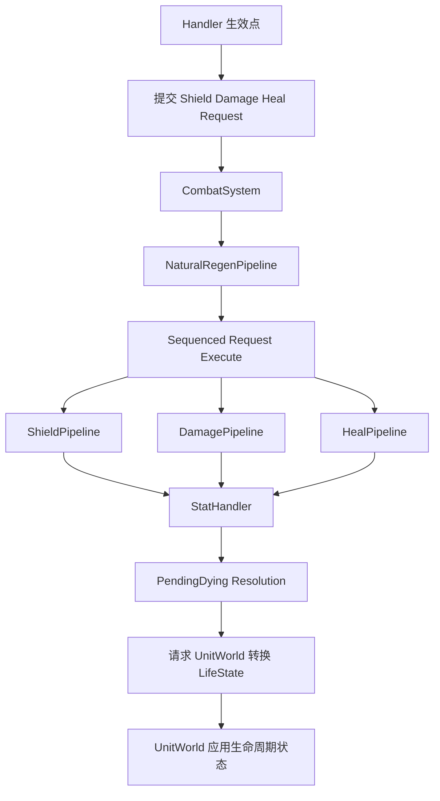
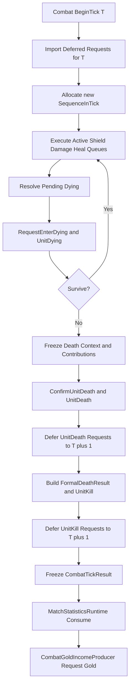
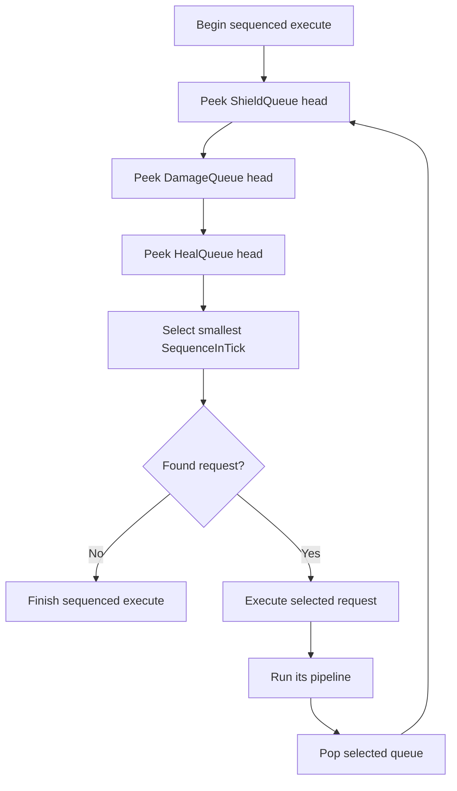
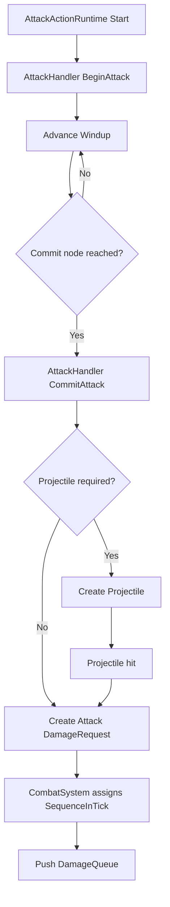
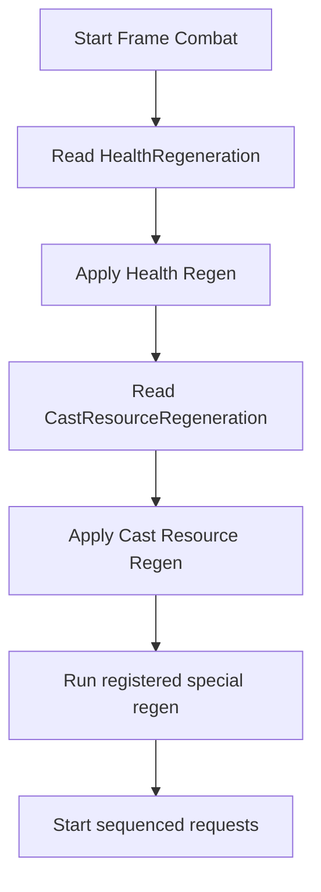
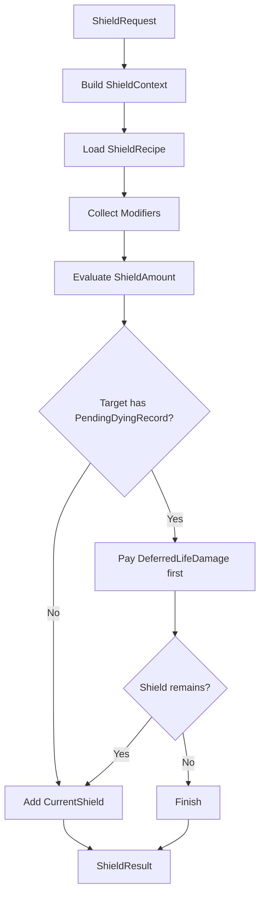
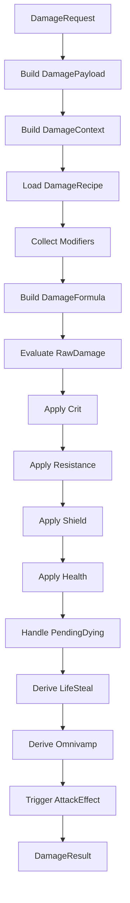
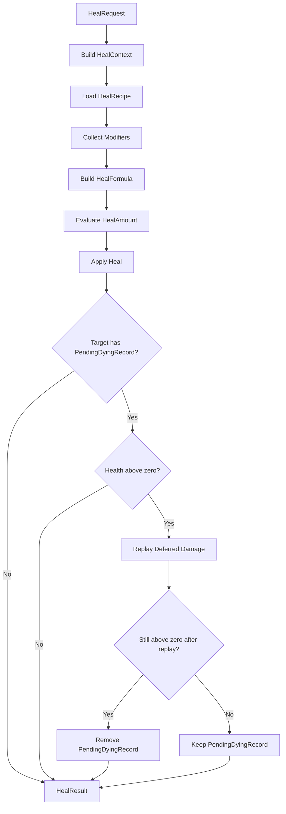
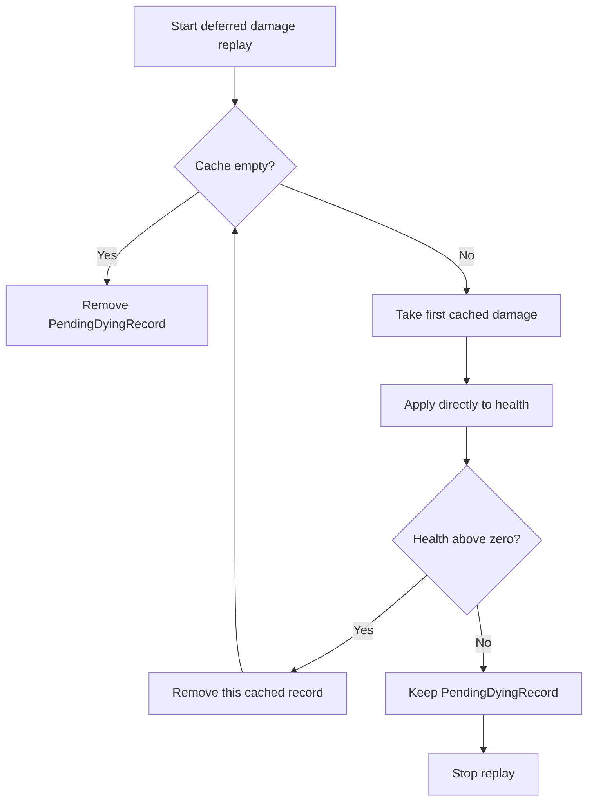
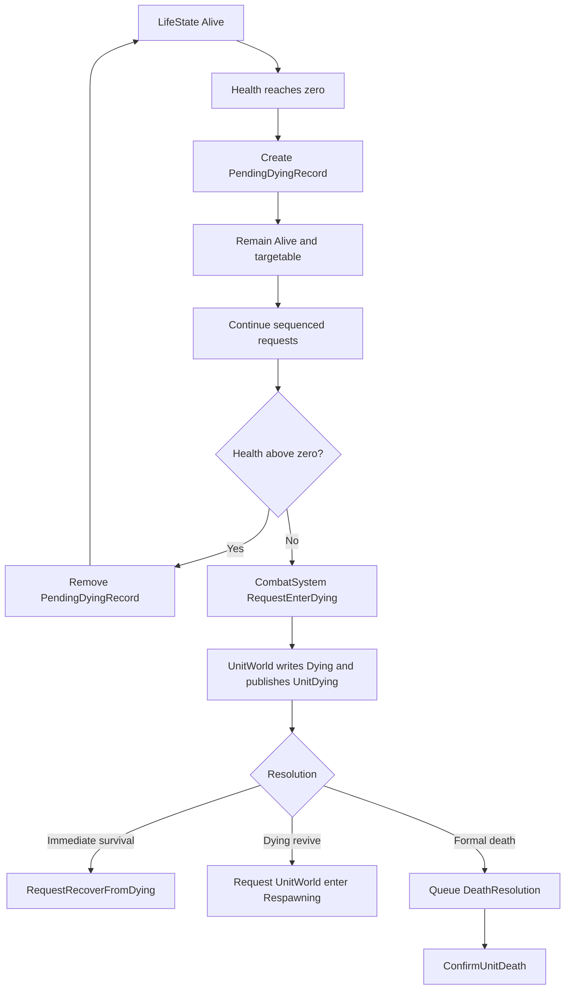

# 帧同步 MOBA 战斗系统框架设计案 v13.2

> 适配对象：单位行为框架 v27.1、帧同步与流程综合系统 v10.1、装备与金币系统 v11。  
> 设计范围：只设计战斗系统本身，不扩写输入、寻路、技能、控制、表现层、商店交易或顶层帧同步协议；CombatSystem 自身的跨 Tick Runtime 与快照契约属于本案。  
> 核心目标：用一套确定性、紧凑、可扩展的管线处理自然恢复、四类护盾、伤害、治疗、吸血、攻击特效、濒死、正式死亡、击杀归属、经验奖励与金币分配输出。  
> v13 在 v12 基础上完成第五轮编码前收口：正式定义跨 Tick `DamageContributionTracker` 与 `CombatSystemSnapshot`；助攻贡献按 `ActualShieldDamage + ActualLifeDamage` 计算；当前 Tick 的 `ShieldQueue / DamageQueue / HealQueue` 必须在 Capture 前清空；`UnitDeath / UnitKill` Reaction 产生的普通战斗请求不再回到当前 Tick，而是写入可快照的 `DeferredCombatRequestBuffer`，于下一 Tick 开始时按稳定顺序导入活动队列；`UnitDying` 与普通 Damage/Heal Reaction 仍在当前 Tick 执行；生命周期 API 统一为 `RequestEnterDying / RequestRecoverFromDying / ConfirmUnitDeath`；金币与统计输出顺序对齐第五轮全局 Pipeline。  
> 本版正式填写 CombatSystem 自身的快照字段、Capture 断言、Restore / Resolve / Rebuild 规则；顶层 GameplaySnapshot 聚合与网络确认协议仍由帧同步总控和快照附录定义。  
> v13.1 是 v13 的实现级修订：`Resolve` 不再静默删除无效伤害贡献引用，而是将其视为确定性恢复错误；同时正式冻结 `DeferredSequenceInSourceTick` 的独立分配器、每 Tick 重置、耗尽和非快照规则。
> v13.2 是 v13.1 的序列语义修订：`DeferredSequenceInSourceTick` 是延迟请求被正式接受时获得的稳定排序身份，不是当前缓冲数组的压缩索引；合法清理可以造成序列缺号，删除记录后禁止重新编号，Capture 只验证唯一性、结构合法性和规范升序。

---

# 目录

1. [总体战斗帧流程](#1-总体战斗帧流程)
2. [战斗请求与全局序列](#2-战斗请求与全局序列)
3. [请求来源与结算特征](#3-请求来源与结算特征)
4. [AttackHandler 与攻击来源伤害](#4-attackhandler-与攻击来源伤害)
5. [NaturalRegenPipeline](#5-naturalregenpipeline)
6. [ShieldPipeline](#6-shieldpipeline)
7. [DamagePipeline](#7-damagepipeline)
8. [HealPipeline](#8-healpipeline)
9. [CombatModifierRecord 与公式修改](#9-combatmodifierrecord-与公式修改)
10. [濒死与死亡判定管线](#10-濒死与死亡判定管线)
11. [死亡奖励、金币请求与比赛统计接缝](#11-死亡奖励金币请求与比赛统计接缝)
12. [跨 Tick Runtime 与 CombatSystemSnapshot](#12-跨-tick-runtime-与-combatsystemsnapshot)
13. [最终模块结构](#13-最终模块结构)
14. [核心结论](#14-核心结论)

---

# 1. 总体战斗帧流程

## 1.1 战斗系统嵌入位置

单位框架中，`Unit` 是战斗语义根对象；`AttackHandler / AbilityHandler / BuffHandler / EquipmentHandler` 等模块只在自己的确定性生效点提交护盾、伤害或治疗请求。

所有 Gameplay 模块统一直接读取：

```text
SimulationTickContext.Current
    Tick
    DeltaTick
    ExecutionMode
```

战斗系统不再维护第二套 `GameplayClock`，也不把 `SimulationTickContext` 作为参数层层传递。

战斗系统只处理已经成立的战斗请求，并负责：

```text
伤害、治疗、护盾结算
PendingDying 与欠伤处理
死亡阻止和濒死复活判定
正式死亡与击杀归属
经验结算、金币分配计算与金币输出
```

生命周期边界冻结为：

```text
CombatSystem
    判断发生什么，并向 UnitWorld 提交生命周期请求。

UnitWorld
    唯一正式写入 Unit.LifeState，
    执行 Dying / Dead / Respawning / Alive 状态转换、
    死亡表现、正常复活、回池、销毁和废墟生成。
```

`CombatSystem` 不直接写 `Unit.LifeState`，也不管理正常的 `Dead -> Respawning -> Alive`。



---

## 1.2 每个 LogicTick 的战斗阶段顺序

战斗系统需要区分两类请求：

```text
当前 Tick 活动请求
    ShieldQueue / DamageQueue / HealQueue
    必须在当前 Tick Combat Settlement 内全部结算完成。

规则明确要求下一 Tick 执行的请求
    DeferredCombatRequestBuffer
    是正式跨 Tick Gameplay 状态。
```

每个 LogicTick 的固定相对顺序为：

```text
1. CombatSystem.BeginTick(T)：
       清空本 Tick CombatTickResult 构建容器；
       重置 Tick 内请求与死亡序列；
       导入 ExecuteLogicTick == T 的 DeferredCombatRequest，
       按 DeferredSequenceInSourceTick 升序为其重新分配本 Tick SequenceInTick。

2. 其它 Gameplay 模块按全局 Pipeline 固定顺序提交本 Tick普通战斗请求。

3. 刷新必要的 Stat Dirty，执行 NaturalRegenPipeline。

4. 按 SequenceInTick 执行 Shield / Damage / Heal 三条强类型活动队列。

5. DamageTaken / DamageDealt / HealTaken / HealDealt Reaction
       新提交的普通战斗请求继续进入当前 Tick 活动队列。

6. 活动队列清空后处理 PendingDyingRecord。

7. CombatSystem 调用 UnitWorld.RequestEnterDying；
       UnitWorld 同步写入 Dying 并立即发布 UnitDying。

8. UnitDying Reaction 在当前 Tick 执行：
       死亡阻止与濒死复活通过 DyingResolutionScope 提交；
       其它普通战斗请求仍进入当前 Tick 活动队列。

9. 若 UnitDying Reaction 新增活动请求，先继续结算三队列，
       再重新检查 PendingDying 与死亡判定。

10. 对正式死亡候选，在调用 UnitWorld.ConfirmUnitDeath 前冻结：
        DeathResolution；
        DeathRewardContext；
        DeathSequenceInTick；
        FormalDeathResult 所需的助攻贡献输入。

11. UnitWorld.ConfirmUnitDeath 在当前调用栈内同步完成：
        写入 Dead；
        发布 UnitDeath；
        执行各 Handler 自己负责的死亡清理；
        更新非英雄管理关系并注销 AIController。

12. UnitDeath Reaction 新提交的普通 Shield / Damage / Heal Request
        写入 DeferredCombatRequestBuffer，ExecuteLogicTick = T + 1。

13. UnitWorld 返回后，CombatSystem：
        构建 FormalDeathResult；
        发布 UnitKill；
        应用 ExperienceAward；
        生成 GoldIncomeAllocation；
        生成 TeamBaseDestroyedSignal；
        删除该 Victim 的 DamageContributionTracker。

14. UnitKill Reaction 新提交的普通战斗请求同样写入
        DeferredCombatRequestBuffer，ExecuteLogicTick = T + 1。

15. 当前 Tick 活动队列、PendingDying 与 DyingResolutionScope 全部稳定结束后，
        冻结 CombatTickResult。

16. 所有模拟端的 MatchStatisticsRuntime
        按 FormalDeathResults 稳定顺序更新 KDA 与其它确定性统计。

17. CombatGoldIncomeProducer
        按 GoldIncomeAllocations 稳定顺序调用 GoldIncomeRuntime.RequestGoldIncome。
```



`UnitDeath / UnitKill` 回调本身仍在正式死亡 Tick 即时执行；延迟的是它们产生的普通战斗请求，而不是事件发布或来源 Runtime 状态变化。

为防止当前 Tick 的 Damage / Heal / UnitDying Reaction 形成无限连锁，战斗系统继续维护：

```text
MaxCombatSettlementCyclesPerTick
```

超过上限必须产生确定性错误，不允许静默截断。`UnitDeath / UnitKill` 请求已经转入下一 Tick，因此不计入当前 Tick 的继续结算循环。

## 1.3 LifeState 与战斗系统内部状态

正式状态仍为：

```text
Alive
Dying
Dead
Respawning
```

但权威边界是：

```text
Unit 保存 LifeState。
UnitWorld 唯一写入 LifeState。
CombatSystem 和其它系统只能通过 UnitWorld 正式接口请求状态转换。
```

战斗系统内部额外维护：

```text
PendingDyingRecord
DeferredLifeDamageCache
```

`PendingDyingRecord` 不是 `LifeState`。它只表示：

> 当前生命已经小于等于 0，但本轮护盾、伤害、治疗请求尚未全部结算，因此还不能请求 `UnitWorld` 正式进入 `Dying`。

关键规则：

```text
CurrentHealth <= 0 不等于 Unit 已经 Dying 或 Dead。
PendingDyingRecord 存在时，Unit.LifeState 仍为 Alive。
其它系统不得仅根据 CurrentHealth 推断单位已经死亡。
```

---

## 1.4 SimulationTickContext 的读取规则

战斗系统内部需要当前 Tick 或执行模式时，直接读取：

```csharp
int currentLogicTick =
    SimulationTickContext.Current.Tick;

SimulationExecutionMode executionMode =
    SimulationTickContext.Current.ExecutionMode;
```

约束：

```text
SimulationTickContext.Current 只由帧同步主循环设置。
Gameplay 系统只能读取。
同一 LogicTick 执行过程中不可改变。
任何模块不得缓存后在下一 Tick 继续使用旧 Context。
```


## 1.5 CombatTickResult：Tick 级确定性输出

CombatSystem 在当前 Tick 的活动请求、死亡批次和当前 Tick Reaction 稳定结算完成后冻结：

```text
CombatTickResult
    LogicTick
    FormalDeathResults[]
    GoldIncomeAllocations[]
    TeamBaseDestroyedSignals[]
```

定位：

```text
它是 Tick T 的只读确定性输出。
它不是 CombatSystem 的跨 Tick Runtime。
它不进入 CombatSystemSnapshot。
它不保存为历史队列。
回滚重演 Tick T 时会自然重新生成相同结果。
```

`DeferredCombatRequestBuffer` 不属于 `CombatTickResult`。它是下一 Tick Gameplay 必须继续执行的跨 Tick状态，单独进入 `CombatSystemSnapshot`。

所有模拟端都产生相同 `CombatTickResult`。固定消费边界：

```text
MatchStatisticsRuntime
    所有模拟端按 FormalDeathResults 的稳定顺序消费。

CombatGoldIncomeProducer
    在 GoldIncomeRuntime 已 BeginTick、尚未 SealTick 的固定阶段，
    按 GoldIncomeAllocations 的数组顺序调用 RequestGoldIncome。

Dedicated Server MatchRuleRuntime
    另外消费 TeamBaseDestroyedSignals，判定比赛结果。

Client PredictionRollbackCoordinator
    可以记录基地正式死亡的预测结束候选；
    不能据此写入权威胜负结果。
```

稳定顺序：

```text
FormalDeathResults
    按 DeathSequenceInTick 升序。

GoldIncomeAllocations
    先按 DeathSequenceInTick，
    再按同一死亡内 ReceiverPlayerSlot 升序。

TeamBaseDestroyedSignals
    复用对应死亡的 DeathSequenceInTick。
```

`GoldIncomeAllocation` 不携带 `IncomeSequenceInTick`。正式收入序号由 `GoldIncomeRuntime` 按全局金币生产阶段的实际稳定请求顺序分配。

## 1.6 UnitEventBus 输出边界

单位框架 v25 冻结的 11 种强类型单位事件为：

```text
DamageTaken
DamageDealt
HealTaken
HealDealt
AbilityCast
UnitDying
UnitDeath
UnitKill
LevelUp
UnitCollisionEnter
UnitCollisionExit
```

其中与 CombatSystem 有关的接缝只有 7 种：

```text
CombatSystem 直接发布：
    DamageTaken
    DamageDealt
    HealTaken
    HealDealt
    UnitKill

CombatSystem 请求生命周期转换后，由 UnitWorld 发布：
    UnitDying
    UnitDeath
```

以下事件不由 CombatSystem 产生：

```text
AbilityCast
LevelUp
UnitCollisionEnter
UnitCollisionExit
```

CombatSystem 不建立统一事件队列，不动态订阅委托，也不要求没有业务的 Handler 实现空事件函数。最终 Publish 路由由单位框架根据 Ability、Attack、Buff、Equipment、CrowdControl 等系统真实声明的 `SupportedUnitEvents` 固定生成。

---

# 2. 战斗请求与全局序列

## 2.1 当前 Tick 的三条强类型活动队列

当前 Tick 继续使用三条强类型活动队列：

```text
Queue<ShieldRequest> ShieldQueue
Queue<DamageRequest> DamageQueue
Queue<HealRequest>   HealQueue
```

它们表达：

> 已经进入本 Tick Combat Settlement、必须在本 Tick 完成结算的请求。

本案采用：

```text
三条强类型队列 + CombatRequestHeader + 公共 SequenceInTick
```

这既保留类型专用字段，也保证三类请求使用统一全局顺序。

硬性边界：

```text
Capture CombatSystemSnapshot 前：
    ShieldQueue empty
    DamageQueue empty
    HealQueue empty
```

活动队列非空表示当前 Tick 尚未结算完成，属于 Pipeline 错误，不能通过快照把半结算状态带到下一 Tick。

需要下一 Tick 执行的死亡 Reaction 请求使用独立的 `DeferredCombatRequestBuffer`，不能留在三条活动队列中。

## 2.2 CombatRequestSequence

战斗系统自行维护当前 Tick 活动请求序列：

```text
CurrentSequenceLogicTick
NextSequenceInTick : ushort
SequenceExhausted
```

`CombatSystem.BeginTick(T)` 显式重置：

```text
CurrentSequenceLogicTick = T
NextSequenceInTick = 0
SequenceExhausted = false
```

随后先导入本 Tick 到期的 `DeferredCombatRequest`，再接受其它 Gameplay 来源请求。每次真正进入 `ShieldQueue / DamageQueue / HealQueue` 时：

```text
request.Header.SequenceInTick = NextSequenceInTick

若 NextSequenceInTick == ushort.MaxValue：
    本次分配后标记 SequenceExhausted
否则：
    NextSequenceInTick++
```

若已经耗尽仍继续提交请求，抛出确定性模拟错误，禁止自然回绕。

延迟请求在来源 Tick 保存的是：

```text
DeferredSequenceInSourceTick
```

它只决定下一 Tick 的导入顺序。导入后必须重新分配执行 Tick 的正式 `SequenceInTick`，不能沿用上一 Tick 的请求序号。

延迟请求使用独立的 Tick 内序列分配器：

```text
NextDeferredSequenceInSourceTick : ushort
DeferredSequenceExhausted
```

`CombatSystem.BeginTick(T)` 同步重置：

```text
NextDeferredSequenceInSourceTick = 0
DeferredSequenceExhausted = false
```

所有在当前 `SourceLogicTick` 内由 `UnitDeath / UnitKill` Reaction 正式接受的延迟 `Shield / Damage / Heal` 请求共享这一条序列，不按事件类型、请求类型、单位或 Handler 分组。请求通过基本 Payload 与调度上下文验证、确定能够写入 `DeferredCombatRequestBuffer` 后，才分配序列：

```text
若 DeferredSequenceExhausted == true：
    产生确定性模拟错误

result = NextDeferredSequenceInSourceTick

若 result == ushort.MaxValue：
    DeferredSequenceExhausted = true
否则：
    NextDeferredSequenceInSourceTick++

record.DeferredSequenceInSourceTick = result
```

合法取值范围是 `0..ushort.MaxValue`。`ushort.MaxValue` 本身可以被最后一次合法分配；耗尽后再次申请必须产生确定性模拟错误，禁止自然回绕。

Tick 末快照不保存：

```text
CurrentSequenceLogicTick
NextSequenceInTick
SequenceExhausted
NextDeferredSequenceInSourceTick
DeferredSequenceExhausted
```

这些都是当前 Tick 的构建状态；活动请求已经全部结算，延迟请求中真正需要跨 Tick 保留的是各记录已经分配完成的 `SourceLogicTick + DeferredSequenceInSourceTick`。

`DeferredSequenceInSourceTick` 是请求在来源 Tick 被正式接受时获得的稳定排序身份，不是 `DeferredCombatRequestBuffer` 中的压缩数组索引。记录后续可以因为 Target 的非死亡 `DespawnUnit`、永久销毁或其它正式清理规则被删除，因此剩余记录允许存在序列缺号。任何清理入口都只能删除记录，不能修改或重新编号其它已生成记录；实现也不保留 Tombstone。

## 2.3 DeferredCombatRequestBuffer

`DeferredCombatRequestBuffer` 保存：

> 请求已经在 Tick T 的正式事件回调中产生，但规则明确指定到 Tick T + 1 执行。

当前只允许以下事件上下文产生延迟普通战斗请求：

```text
UnitDeath
UnitKill
```

`DamageTaken / DamageDealt / HealTaken / HealDealt / UnitDying` 产生的普通请求仍属于当前 Tick。

逻辑结构：

```text
DeferredCombatRequestBuffer
    Records[]
```

```text
DeferredCombatRequestRecord
    ExecuteLogicTick
    SourceLogicTick
    DeferredSequenceInSourceTick
    RequestKind
    RequestPayload
```

`RequestPayload` 为对应的强类型 `ShieldRequest / DamageRequest / HealRequest` 数据，但其中尚未写入执行 Tick 的 `SequenceInTick`。实现可以使用带 Kind 的序列化联合结构，也可以使用三组强类型 Payload 加统一顺序头；规范序列化语义必须一致。

产生规则：

```text
发布 UnitDeath / UnitKill 前：
    CombatReactionSchedulingScope = NextTick

Handler 调用正常 RequestShield / RequestDamage / RequestHeal：
    不进入当前活动队列；
    完成基本 Payload 与 NextTick SchedulingScope 验证；
    ExecuteLogicTick = CurrentTick + 1；
    通过统一延迟序列分配器分配 DeferredSequenceInSourceTick；
    追加到 DeferredCombatRequestBuffer。

非法或未被接受的请求不消耗 DeferredSequenceInSourceTick。

Publish 返回：
    关闭 SchedulingScope。
```

导入规则：

```text
CombatSystem.BeginTick(T)
    -> 取出 ExecuteLogicTick == T 的记录
    -> 按 SourceLogicTick、DeferredSequenceInSourceTick 稳定升序
    -> 验证 Request Payload 完整性与当前目标有效性
    -> 不重新要求 SourceUnit 处于 Alive；事件来源合法性已在 Tick T 成立
    -> 为每条请求分配 Tick T 的新 SequenceInTick
    -> 导入活动队列并删除已导入记录
```

来源单位保留规则：

```text
只要某 UnitUid 仍被 DeferredCombatRequest 作为 Source 引用，
UnitWorld 就不能完成该 UnitUid 的最终注销、回池或 Destroy。
```

CombatSystem 提供只读查询：

```csharp
bool HasDeferredRequestFrom(
    UnitUid sourceUnitUid);
```

`UnitWorld.ProcessPendingLifecycle` 在最终处置前检查该接缝。普通死亡不会清除来源的 Stat 与跨死亡 Modifier，因此延迟请求在 T + 1 仍可按原 Recipe 读取来源属性。目标生命状态、Targetable 与目标属性则以实际执行 Tick 为准。

只允许延迟一个 Tick。Capture 时若存在 `ExecuteLogicTick <= CurrentTick` 的未导入记录，视为 BeginTick 或 Pipeline 错误；若存在 `ExecuteLogicTick > CurrentTick + 1`，视为非法调度。

`DeferredCombatRequestBuffer` 可以在 Tick 末非空，必须进入 `CombatSystemSnapshot`。它不能被用于掩盖活动队列未清空、Settlement 超时或异常中断。

## 2.4 三队列头元素比较执行

为避免 Mermaid 图横向显示不完整，这里不用三路分支图，而用纵向流程表达。



`Execute selected request` 的含义：

| 选中的队列 | 执行 |
|---|---|
| `ShieldQueue` | `ShieldPipeline` |
| `DamageQueue` | `DamagePipeline` |
| `HealQueue` | `HealPipeline` |

比较规则：

```text
1. 分别读取三个队首请求。
2. 空队列视为没有候选。
3. 从非空候选中选 SequenceInTick 最小者。
4. 执行其对应管线。
5. 从对应队列 Pop。
6. 重复直到三个队列都为空。
```

伪代码语义：

```text
while ShieldQueue / DamageQueue / HealQueue 任一非空:
    candidate = MinBySequenceInTick(
        ShieldQueue.PeekOrNone(),
        DamageQueue.PeekOrNone(),
        HealQueue.PeekOrNone()
    )

    switch candidate.Type:
        Shield -> Run ShieldPipeline
        Damage -> Run DamagePipeline
        Heal   -> Run HealPipeline

    Pop candidate 所在队列
```

---

## 2.5 CombatRequestHeader

三种请求都拥有一份公共头部：

```text
CombatRequestHeader
```

| 字段 | 说明 |
|---|---|
| `SequenceInTick` | 当前 LogicTick 内由 CombatSystem 分配的战斗请求序号 |
| `SourceUnitUid` | 来源单位 UID，可使用无效值表示无单位来源 |
| `TargetUnitUid` | 目标单位 UID |
| `SourceDescriptor` | 来源描述 |
| `RecipeId` | 离线生成并校验的稳定配方 ID |
| `RuntimeParams` | 少量强类型运行时参数，例如 `fp` 蓄力比例、整数技能段数、命中序号；禁止任意 `object` 容器 |
| `KeywordTags` | 可选设计标签，只用于少量明确的业务匹配 |

请求结构：

```text
DamageRequest
    Header
    BaseValue
    DamageTypeOverride optional

HealRequest
    Header
    BaseValue

ShieldRequest
    Header
    BaseValue
    ShieldType
    DurationPolicy optional
```

`BaseValue` 是请求自身携带的基础值，不是最终结算值。

| 请求 | BaseValue 示例 |
|---|---|
| 普攻伤害 | 普攻 Commit 当刻读取的当前攻击力 |
| 技能伤害 | 技能配置中的当前等级基础伤害 |
| Buff Tick 伤害 | 本次 Tick 的基础伤害 |
| 治疗 | 技能、Buff、装备或派生吸血产生的基础治疗量 |
| 护盾 | 技能、Buff、装备产生的基础护盾量 |

提交方只负责提供基础数值和少量必要运行时参数，不负责拼完整公式。最终结果由对应 `Recipe`、公式上下文以及来源单位、目标单位当前挂载的 `CombatModifierRecord` 构建。

---
# 3. 请求来源与结算特征

## 3.1 SourceDescriptor

`SourceDescriptor` 只描述来源，不负责公式计算。

| 字段 | 说明 |
|---|---|
| `SourceType` | Attack / Ability / Buff / Equipment / AttackEffect / System |
| `SourceId` | 普攻模板、技能 ID、Buff ID、装备 ID 等 |
| `OwnerUnitUid` | 归属单位 UID，通常是伤害拥有者 |
| `EmitterUnitUid` | 实际发出单位 UID，可为无效值，例如召唤物、分身、宠物作为实际发出者时填写 |

`SourceType = Attack` 表示这是攻击来源伤害。

它可以来自：

| 来源 | SourceType | RecipeId |
|---|---|---|
| 普通普攻 | Attack | BasicAttackDamageRecipe |
| 强化普攻 | Attack | EmpoweredAttackDamageRecipe |
| EZ Q 这类可附着攻击特效的技能 | Attack | EzQDamageRecipe |
| 三项、破败等攻击特效伤害 | AttackEffect | 对应装备特效 Recipe |

关键规则：

```text
是否是攻击来源，由 SourceType = Attack 决定。
伤害怎么算，由 RecipeId 决定。
```

因此不需要额外设计：

```text
AttackSourceContext
AttackSequenceId
AttackKind
```

---

## 3.2 DamageChannel 不是 Tag

伤害类型是核心字段，不是标签。

```text
DamageChannel = Physical / Magic / True
```

| DamageChannel | 说明 |
|---|---|
| Physical | 进入护甲、护甲穿透、物理增减伤计算 |
| Magic | 进入魔抗、魔法穿透、魔法增减伤计算 |
| True | 跳过护甲和魔抗减伤，但仍可进入护盾、最终修正、生命扣减等阶段 |

所以不需要：

```text
TrueDamage Tag
IgnoreArmor Tag
```

这些语义都应当由 `DamageChannel` 和抗性阶段规则表达。

---

## 3.3 DeliveryDescriptor

很多“标签”其实是结构化结算特征，尤其影响全能吸血衰减。

建议用：

```text
DamageDeliveryDescriptor
```

| 字段 | 说明 |
|---|---|
| `Timing` | Instant / Periodic |
| `HitPattern` | SingleTarget / Area |
| `OwnershipRelation` | OwnerDirect / IndirectEmitter |

含义：

| 字段值 | 说明 |
|---|---|
| `Periodic` | 周期性伤害，例如持续灼烧 Tick |
| `Area` | 群体性、范围性伤害 |
| `IndirectEmitter` | 不直接来源于单位本人，例如召唤物、宠物、分身、陷阱等 |

这些不建议写成松散 Tag：

```text
IsDamageOverTime
IsAreaDamage
IsSingleTarget
```

因为它们是管线固定会读取的结构化信息。

---

## 3.4 KeywordTags 只保留设计标签

`KeywordTags` 只用于特殊规则匹配，不用于表达已经有固定字段的核心概念。

不应作为 Tag 的内容：

| 不作为 Tag | 原因 |
|---|---|
| `TrueDamage` | 已由 `DamageChannel` 表达 |
| `PhysicalDamage` | 已由 `DamageChannel` 表达 |
| `MagicDamage` | 已由 `DamageChannel` 表达 |
| `CanApplyLifeSteal` | 由 `SourceType = Attack` 推导 |
| `CanApplyOmnivamp` | 所有生命伤害默认可进入全能吸血阶段 |
| `CanTriggerAttackEffect` | 由 `SourceType = Attack` 推导 |
| `IsAreaDamage` | 已由 `DeliveryDescriptor.HitPattern` 表达 |
| `IsDamageOverTime` | 已由 `DeliveryDescriptor.Timing` 表达 |
| `IgnoreArmor` | 已由 `DamageChannel` 或抗性策略表达 |

可以作为 `KeywordTags` 的内容：

| KeywordTag | 示例用途 |
|---|---|
| `Empowered` | 强化普攻、强化技能的特殊匹配 |
| `SpellBladeCompatible` | 某些技能是否能消耗咒刃类效果，如果不能单靠 SourceType 判断 |
| `Execute` | 斩杀类效果匹配 |
| `Burn` | 灼烧类效果匹配 |
| `Poison` | 中毒类效果匹配 |
| `Bleed` | 流血类效果匹配 |

原则：

```text
固定管线一定会用到的内容，用字段。
少数玩法规则需要匹配的语义，用 KeywordTag。
```

---

# 4. AttackHandler 与攻击来源伤害

## 4.1 正式接缝

战斗系统对齐攻击模块 v4。单位行为层使用：

```text
GetAttackPlanStatus
IsAttackReady
BeginAttack
CommitAttack
CancelBeforeCommit
ResetAttackTimer
```

`AttackHandler` 自己负责攻击前摇、后摇、攻击计时器、目标验证和 `AttackSequenceIndex`。CombatSystem 不复制攻击状态机，也不维护攻击序列。

攻击真正到达 `CommitAttack` 时，AttackHandler 根据攻击配置选择：

```text
近战或即时命中
    -> 直接提交 SourceType = Attack 的 DamageRequest

需要弹道
    -> 创建 Projectile
    -> Projectile 命中后提交 SourceType = Attack 的 DamageRequest
```

---

## 4.2 普攻 Commit 链路



普通普攻伤害请求：

```text
DamageRequest
    Header.SourceDescriptor.SourceType = Attack
    Header.SourceDescriptor.SourceId = BasicAttack
    Header.RecipeId = BasicAttackDamageRecipe
    BaseValue = 正式伤害提交点读取的 Source.AttackDamage
    DamageTypeOverride = None
```

请求不携带：

```text
CanApplyLifeSteal
CanTriggerAttackEffect
AttackKind
AttackSequenceIndex
```

其中 `AttackSequenceIndex` 属于 AttackHandler 的可回滚运行状态，不是伤害公式输入。生命偷取和攻击特效资格由 `SourceType = Attack` 与最终 `DamageResult` 推导。

---

## 4.3 AttackLikeAbility

不单独设计 `AttackLikeAbility` 类型。像 EZ Q 这类技能可以在技能命中时提交攻击来源伤害：

```text
DamageRequest
    SourceType = Attack
    SourceId = EzQ
    RecipeId = EzQDamageRecipe
    BaseValue = EzQ 当前等级技能基础伤害
```

它自然具备攻击来源语义，可以触发生命偷取和攻击特效；具体公式仍由自己的 `RecipeId` 决定，不要求与普通普攻使用同一公式。

---

## 4.4 攻击特效伤害

攻击特效是独立来源：

```text
SourceType = AttackEffect
```

攻击来源 `DamageResult` 成立后，来源单位的 `DamageDealt` Reaction 可以追加新的攻击特效伤害请求：

```text
DamageRequest
    SourceType = AttackEffect
    SourceId = 对应装备、Buff 或技能被动
    RecipeId = 对应攻击特效配方
    BaseValue = 攻击特效自己的基础数值
```

`AttackEffect` 不再触发攻击特效，也不默认触发生命偷取，因此不会递归。
# 5. NaturalRegenPipeline

## 5.1 定位

`NaturalRegenPipeline` 放在每帧战斗阶段最前，只处理自然恢复。

| 恢复 | 来源 |
|---|---|
| 生命自然恢复 | `HealthRegeneration` |
| 施法资源自然恢复 | `CastResourceRegeneration` |

自然恢复不走 `HealPipeline`，不受治疗加成影响，也不触发治疗事件。

---

## 5.2 执行流程



---

## 5.3 特殊资源接入

通用框架不预设怒气、弹药、连击点等英雄特色资源。

如果某个英雄需要特殊资源自然恢复，可以注册独立恢复器：

```text
IRegisteredRegenSource
```

执行位置：

```text
NaturalRegenPipeline
    -> HealthRegeneration
    -> CastResourceRegeneration
    -> RegisteredSpecialRegenSources
```

特殊恢复器只对自己的资源负责，不影响通用生命恢复和施法资源恢复。

---

# 6. ShieldPipeline

## 6.1 ShieldRequest

`ShieldRequest` 表示给目标添加护盾。

| 字段 | 说明 |
|---|---|
| `Header` | SequenceInTick、来源、目标、RecipeId 等公共信息 |
| `BaseValue` | 基础护盾量，例如技能基础护盾、装备基础护盾 |
| `ShieldType` | 白盾、物理盾、魔法盾、黑盾 |
| `DurationPolicy` | 持续时间、刷新规则、叠加规则 |

提交方需要提交基础护盾量，但不需要提前计算最终护盾量。最终护盾量由 `ShieldRecipe` 和 `CombatModifierRecord` 在护盾公式槽位中结算。

四类护盾语义：

| ShieldType | 吸收规则 | 附加语义 |
|---|---|---|
| `White` | 吸收所有可被护盾吸收的伤害 | 无 |
| `Physical` | 只吸收物理伤害 | 无 |
| `Magic` | 只吸收魔法伤害 | 无 |
| `Black` | 只吸收魔法伤害 | 护盾有效期间由 `StatHandler` 通过控制系统既有免疫接口维持控制免疫 |

护盾耗尽、到期、主动移除、死亡、进入复活或对象池重置时，数值系统必须同步结束该护盾关联的运行效果。黑盾的控制免疫生命周期由数值系统与控制系统负责，CombatSystem 只按 `ShieldType` 进行伤害吸收匹配。


---

## 6.2 ShieldPipeline 流程



---

## 6.3 PendingDying 状态下的护盾请求

当目标存在 `PendingDyingRecord` 时，单位的正式 `LifeState` 仍然是 `Alive`，仍然可以被主动选中并提交新的护盾请求。

执行规则：

```text
新增护盾量
    -> 先按原顺序抵扣 DeferredLifeDamageCache
    -> 抵扣后还有剩余才加入 CurrentShield
```

注意：

```text
目标进入 PendingDying 之前已经存在的 CurrentShield，
不会被 DeferredLifeDamageCache 追溯抵扣。
```

| 护盾来源 | 是否抵扣已有伤害缓存 |
|---|---|
| 进入 PendingDying 前已经存在的 CurrentShield | 否 |
| PendingDying 期间新结算的 ShieldRequest | 是 |
| 后续新的 DamageRequest | 仍按正常伤害管线先扣当前护盾，再决定生命伤害或欠账 |

如果新护盾清空了全部欠账但目标生命仍为 0，目标仍保留 `PendingDyingRecord`；它需要后续治疗恢复生命，或在帧末进入正式濒死裁决。

---

# 7. DamagePipeline

## 7.1 DamagePipeline 总流程

`DamagePipeline` 内部包含：

```text
DamageRequest
DamagePayload
DamageContext
DamageRecipe
DamageFormula
DamageResult
```



---

## 7.2 DamageRequest

`DamageRequest` 是外部提交的最小请求。

| 字段 | 说明 |
|---|---|
| `Header` | 公共头部 |
| `BaseValue` | 基础伤害值，例如普攻当前攻击力、技能当前等级基础伤害、本次 Buff Tick 基础伤害 |
| `DamageChannelOverride` | 可选。为空则使用 Recipe 默认伤害类型 |

提交方必须给出 `BaseValue`，但不需要给出完整伤害公式。

不在请求中传：

| 不传 | 原因 |
|---|---|
| 完整公式项 | 由 DamageRecipe 提供 |
| 当前属性值 | 由 DamageContext 在结算时读取 |
| Buff 或装备影响 | 由 `CombatModifierCollector` 从 Unit.CombatModifierSet 收集 |
| 派生值结果 | 由 FormulaTerm 在结算时按需计算 |
| 攻击特效策略 | 攻击特效是独立来源伤害 |
| 吸血开关 | 由 SourceType 和结算结果推导 |
| 全能吸血开关 | 所有生命伤害默认进入全能吸血阶段 |

---

## 7.3 DamagePayload

`DamagePayload` 是管线内部运行时数据包。

它由 `DamagePipeline` 根据请求和当前上下文构建，不由提交方手动拼。

| 内容 | 来源 |
|---|---|
| Source / Target | DamageRequest.Header |
| SourceDescriptor | DamageRequest.Header |
| BaseValue | DamageRequest.BaseValue |
| RuntimeParams | DamageRequest.Header.RuntimeParams |
| KeywordTags | DamageRequest.Header.KeywordTags |
| DeliveryDescriptor | DamageRecipe 默认值 + 可选运行时覆盖 |
| Recipe | 根据 RecipeId 加载 |
| Context | 管线内部构建 |
| Modifiers | 从来源与目标的 `CombatModifierSet` 收集 |
| Formula | 管线内部构建 |

`DamagePayload` 不包含攻击特效策略，也不包含 Buff 或装备的具体影响数据。

---

## 7.4 DamageContext

`DamageContext` 是结算时上下文。

| 内容 | 获取方式 |
|---|---|
| 来源当前属性 | 结算时从 Source.StatHandler 读取 |
| 目标当前属性 | 结算时从 Target.StatHandler 读取 |
| 来源当前状态 | 从 Unit / Buff / 装备状态读取 |
| 目标当前状态 | 从 Unit / Buff / 控制状态读取 |
| 伤害通道 | DamageChannelOverride 或 Recipe 默认值 |
| 结算特征 | DeliveryDescriptor |
| 运行时参数 | RuntimeParams |

核心规则：

```text
所有数值都在该请求真正结算的那一刻读取。
持续伤害每个 Tick 都重新提交 DamageRequest。
每个 Tick 都重新读取当前属性。
```

---

## 7.5 DamageRecipe 与 DamageFormula

默认链路：

```text
DamageRecipe -> DamageFormula
```

不强制增加 `DamageComponent` 中间层。

| 概念 | 说明 |
|---|---|
| `DamageRecipe` | 配置层配方，说明基础项、属性加成项、派生项、默认伤害通道、默认结算特征 |
| `DamageFormula` | 运行时公式，由 Recipe + Context + CombatFormulaPatch 构建 |

如果编辑器里需要把复杂技能拆成多段显示，可以使用 `RecipeSection` 或 `FormulaGroup`，但它只是配置组织方式，不是运行时必需管线节点。

---

## 7.6 FormulaTerm

`FormulaTerm` 写在 `DamageRecipe` 里，不由提交方临时构造。

| Term | 说明 | 示例 |
|---|---|---|
| `BaseValueTerm` | 请求携带的基础数值 | DamageRequest.BaseValue |
| `ConstantTerm` | 配方固定额外值 | 80 |
| `SourceStatTerm` | 来源属性比例 | 1.1 × Source.AttackDamage |
| `TargetStatTerm` | 目标属性比例 | 0.04 × Target.MaxHealth |
| `SourceDerivedTerm` | 来源派生值 | Source.MissingHealthRatio |
| `TargetDerivedTerm` | 目标派生值 | Target.MissingHealthRatio |
| `ContextParamTerm` | 少量运行时参数 | ChargeRatio、StageIndex、HitIndex |

`BaseValueTerm` 是三类战斗请求都应具备的基础项。对于伤害来说，它通常是：

| 来源 | BaseValue |
|---|---|
| 普通普攻 | Impact 当刻读取的当前攻击力 |
| 强化普攻 | 强化普攻自身指定的基础伤害，或当前攻击力 |
| 技能伤害 | 技能当前等级基础伤害 |
| Buff Tick | 本次 Tick 的基础伤害 |
| 攻击特效 | 攻击特效自己的基础数值 |

`ContextParamTerm` 只用于蓄力比例、技能段位、命中次数这类请求必须携带的小参数。

它不用于传 Buff、装备、穿透、暴击等影响因素。

---

## 7.7 暴击阶段

暴击资格由 `DamageRecipe` 的默认策略与当前收集到的策略修改共同决定：

```text
CritPolicy = CannotCrit / CanCrit / ForceCrit
```

来源：

| 来源 | 示例 |
|---|---|
| Recipe 默认策略 | 普通普攻 `CanCrit`，普通持续伤害 `CannotCrit` |
| CombatPolicyPatch | 强化状态挂载 `ForceCrit` 或 `ForbidCrit` |
| 特殊规则 | 某些技能配方固定禁止暴击 |

固定冲突规则：

```text
ForbidCrit > ForceCrit > Recipe Default
```

例如“下一次攻击必定暴击”：

```text
装备被动进入强化就绪状态
    -> 动态创建 CombatModifierRecord
    -> Match 限定 SourceType = Attack
    -> Policies 添加 ForceCrit
    -> 挂载到来源 Unit.CombatModifierSet

攻击伤害结果成立
    -> EquipmentHandler 在 DamageDealt 即时事件中确认本次强化已完成
    -> 结束强化状态
    -> 使用自身缓存的 Handle 移除 Modifier
```

`CombatSystem` 不管理装备充能次数和强化状态生命周期。

---
## 7.8 抗性阶段

抗性阶段根据 `DamageChannel` 决定。

| DamageChannel | 抗性阶段 |
|---|---|
| Physical | 读取目标护甲，读取来源护甲穿透，计算有效护甲和物理伤害倍率 |
| Magic | 读取目标魔抗，读取来源魔法穿透，计算有效魔抗和魔法伤害倍率 |
| True | 跳过护甲和魔抗倍率计算 |

穿透、护甲、魔抗都是属性或属性修正结果，不需要在请求中单独塞字段。

---

## 7.9 护盾、生命与 PendingDying 处理

伤害经过公式、暴击、抗性后，进入护盾与生命应用阶段。

```text
FinalDamage
    -> Shield Stage
    -> Health Stage
    -> PendingDying Stage
```

如果目标不存在 `PendingDyingRecord`：

```text
先扣当前护盾
再扣当前生命
生命降到 0 时：
    CurrentHealth = 0
    创建 PendingDyingRecord
    Unit.LifeState 仍保持 Alive
    Unit 仍保持可选中
```

如果目标已经存在 `PendingDyingRecord`：

```text
本次伤害仍先经过当前护盾
护盾无法吸收的生命伤害不再直接把生命扣成负数
将该生命伤害按 SequenceInTick 写入 DeferredLifeDamageCache
```

此阶段不发布死亡事件，也不把 `LifeState` 改成 `Dying`。

`PendingDyingRecord` 至少需要在战斗系统内部关联：

| 内容 | 说明 |
|---|---|
| `TargetUnitUid` | 目标单位 |
| `EnteredSequenceInTick` | 本帧第一次生命归零时的序列位置 |
| `DeferredLifeDamageCache` | 后续欠下的生命伤害 |
| `LastLethalSource` | 当前用于最终死亡归因的致命来源候选 |
| `DyingCallbackResolved` | 防止同一次濒死过程重复触发濒死回调 |

> 【帧同步关注】`PendingDyingRecord`、欠下伤害及其归因会影响同一 Tick 后续结算或未来结果。具体记录边界由帧同步设计案确定，本设计案不定义快照结构。

---

## 7.10 生命偷取

生命偷取不是请求 Tag，而是 DamagePipeline 的派生阶段。

触发条件：

```text
SourceType = Attack
DamageResult.ActualLifeDamage > 0
SourceUnitUid 有效，且解析出的来源单位当前允许接受治疗
```

计算方式：

```text
LifeStealHeal = ActualLifeDamage × Source.LifeSteal
```

然后生成：

```text
HealRequest
    SourceType = System
    SourceId = LifeSteal
    RecipeId = LifeStealHealRecipe
    BaseValue = LifeStealHeal
```

并分配新的 `SequenceInTick`，进入 `HealQueue`。

关键点：

```text
只有攻击来源伤害触发生命偷取。
AttackEffect 不是 Attack，不再触发生命偷取。
```

如果某个攻击特效业务上也想享受生命偷取，应当明确把它设计为攻击来源的一部分，或让该装备自己提供治疗修正，而不是默认让所有 AttackEffect 都偷取。

---

## 7.11 全能吸血

全能吸血默认适用于所有实际生命伤害。

触发条件：

```text
DamageResult.ActualLifeDamage > 0
SourceUnitUid 有效，且解析出的来源单位当前允许接受治疗
```

基础计算：

```text
OmnivampHeal = ActualLifeDamage × Source.Omnivamp × OmnivampEfficiency
```

`OmnivampEfficiency` 由目标类型和伤害结算特征决定。

推荐规则：

| 条件 | 效率 |
|---|---:|
| 普通直接单体伤害，目标为英雄 | 1 |
| 目标是小兵 | 1/3 |
| 目标是野怪 | 1/3 |
| 周期性伤害 | 1/3 |
| 群体性伤害 | 1/3 |
| 不直接来源于单位本人，例如召唤物、宠物、陷阱 | 1/3 |

如果多个衰减条件同时满足：

```text
只取一次衰减，通常为 1/3。
不要 1/3 × 1/3 叠乘，除非全局规则明确要求。
```

判断来源：

```text
OwnerUnitUid == SourceUnitUid
且 EmitterUnitUid 无效或 EmitterUnitUid == SourceUnitUid
    -> OwnerDirect
否则
    -> IndirectEmitter
```

判断目标：

```text
Target.UnitKind = Hero / Minion / Monster / Structure
```

因此不需要：

```text
CanApplyOmnivamp Tag
```

---

## 7.12 攻击特效与 DamageDealt Reaction

攻击特效不再通过动态 `DamageDealt Reaction` 注册，也不作为 `DamagePayload` 中的策略。

攻击来源伤害形成有效 `DamageResult` 后：

```text
Target.EventBus.Publish(DamageTaken)
Source.EventBus.Publish(DamageDealt)
```

`EquipmentHandler / BuffHandler / AbilityHandler` 在单位框架固定路由的 `DamageDealt` 回调中，根据自己的静态 Reaction 配置和运行状态判断是否需要提交攻击特效：

```text
DamageDealt Reaction
    -> 创建新的 DamageRequest
    -> SourceType = AttackEffect
    -> RecipeId = 对应攻击特效配方
    -> CombatSystem 分配新的 SequenceInTick
    -> 进入 DamageQueue
```

攻击特效伤害的 `SourceType = AttackEffect`，因此不会再次满足“攻击来源伤害”条件，避免递归触发同类攻击特效。

如果多个 Reaction 同时提交请求，调用顺序由单位框架 `UnitEventBus` 的固定 Handler 路由顺序和各 Handler 内部稳定顺序共同决定，CombatSystem 只按新分配的 `SequenceInTick` 继续结算。

---

## 7.13 DamageResult 与单位事件

一次伤害完成公式计算、护盾吸收和生命写入后，先构建完整 `DamageResult`，再立即发布单位事件：

```text
1. Target.EventBus.Publish(DamageTakenEvent)
2. Source 有效时：Source.EventBus.Publish(DamageDealtEvent)
3. Reaction 新提交的请求进入三队列，等待后续 SequenceInTick
4. 当前 DamageRequest 结束
```

发布前提：

```text
DamageResult 已正式成立。
事件不能倒过来修改本次已经完成的 DamageResult。
Reaction 需要追加伤害、治疗或护盾时，只能提交新的战斗请求。
```

战斗系统不建立统一 GameplayEventQueue，不动态订阅委托。跨 Tick 的战斗交互（伤害/护盾/治疗）以 §7.14 的 `CombatContributionEventLog` 逐事件持久化（确定性、可快照、受窗口与容量约束），用于击杀者/助攻判定与审计；单位事件的结构、固定路由与 Handler 调用顺序仍以单位框架 v25 为准。

---
## 7.14 CombatContributionEventLog：跨 Tick 战斗事件日志

CombatSystem 为每个仍可能在未来死亡的受害单位维护一份轻量战斗事件日志。日志以**逐事件**方式保存窗口内该 Victim 受到/获得的有效战斗交互（伤害、护盾、治疗），支撑击杀者/助攻判定、死亡回放、伤害统计与后续审计：

```text
CombatContributionEventLog
    VictimUnitUid
    LastHitContributorUid
    Events[]          // 按 (LogicTick, SequenceInTick) 升序
```

```text
CombatContributionEvent
    VictimUnitUid
    ContributorHeroUid
    Kind              // Damage / Shield / Heal
    Amount : fp
    LogicTick
    SequenceInTick
```

### 7.14.1 事件记录与写入时机

三类事件都在对应战斗请求结算成立后写入：

```text
Damage
    Amount = DamageResult.ActualShieldDamage + DamageResult.ActualLifeDamage
    Amount > 0 才写入（免疫、未命中或最终无实际损失不写）

Shield
    Amount = 本次护盾请求实际生效值
    Amount > 0 才写入

Heal
    Amount = 本次治疗请求有效治疗量
    Amount > 0 才写入
```

同一 Tick 内三类请求共用 `SequenceInTick` 全局顺序，事件按结算顺序追加，顺序天然确定。

来源解析：

```text
来源是 Hero
    -> ContributorHeroUid = SourceUnitUid

来源是召唤物、分身、宠物、陷阱或投掷物
    -> 沿 SourceDescriptor 的稳定所有者链解析所属 Hero

无法解析到 Hero
    -> 不写入事件
```

还必须满足：

```text
ContributorHeroUid 有效
ContributorHeroUid != VictimUnitUid
Contributor 与 Victim 为敌对关系
```

不满足其中任意一条的交互不写入事件日志。

### 7.14.2 窗口、清理与容量

事件只在全局助攻时限内保留：

```text
AssistContributionDurationTicks（默认 150，约 5 秒）
```

CombatSystem 每 Tick 开始按 `VictimUnitUid` 升序对所有日志执行过期清理；读取某 Victim 的日志用于判定前再执行一次局部清理。过期条件：

```text
CurrentTick > ExpireLogicTick（= 事件 LogicTick + AssistContributionDurationTicks）
```

防御性容量上限：

```text
MaxContributionEventsPerVictim（默认 256）
```

超出上限时丢弃该 Victim 日志中最旧的事件（与过期语义一致），防止极端高频下日志无限增长。

以下场景删除整个 Victim 日志：

```text
Victim 正式死亡且 FormalDeathResult 已冻结
Victim 通过 UnitWorld.DespawnUnit 结束当前 UnitUid 生命周期
当前 UnitUid 被永久销毁或回滚拓扑静默移除
```

普通治疗、回满生命、脱战或仅进入 `Dying` 不立即清除日志，只由过期规则控制。

### 7.14.3 击杀者与助攻判定

冻结 `DeathRewardContext` 前：

```text
1. 对 Victim 日志执行过期清理。
2. 击杀者 = 最后一条 Kind=Damage 事件（按 LogicTick、SequenceInTick 序）的
   ContributorHeroUid；无有效 Damage 事件时击杀者为空。
3. 助攻者 = 窗口内全部 Kind=Damage 事件的 ContributorHeroUid 集合：
       移除击杀者；
       移除无效、非 Hero、非敌对或已结束 UnitUid 生命周期的记录；
       按 ContributorHeroUid 去重；
       按 ContributorHeroUid 稳定升序。
4. 写入 FormalDeathResult.KillerHeroUid / AssistantHeroUids。
```

击杀者判定**不是**累计贡献最高者，而是**最后造成有效伤害的英雄**（last hit）。助攻只需要"窗口内其他造成过有效伤害的英雄集合"，因此逐事件日志可以直接支撑，无需常驻聚合记录；死亡时如需贡献比例（奖励分配），由窗口事件按 `ContributorHeroUid` 汇总（O(窗口事件数)）。

`FormalDeathResult`、英雄/防御塔奖励分配与 `MatchStatisticsRuntime` 只使用冻结后的 `AssistantHeroUids`，不再次查询 Tracker。

### 7.14.4 快照与稳定顺序

`CombatSystemSnapshot` 保存：

```text
CombatContributionEventLogSnapshot[]
    VictimUnitUid（升序）
    LastHitContributorUid
    Events[]（按 LogicTick、SequenceInTick 升序）
```

事件写入按结算顺序追加；Capture 前校验稳定顺序（Victim 升序、事件序升序）。`SharedGameplayChecksum` 按事件逐条参与校验，保证两端事件日志逐位一致。

# 8. HealPipeline

## 8.1 HealRequest

`HealRequest` 表示一次治疗请求。

| 字段 | 说明 |
|---|---|
| `Header` | SequenceInTick、来源、目标、RecipeId 等公共信息 |
| `BaseValue` | 基础治疗量，例如技能基础治疗、Buff Tick 基础治疗、吸血派生治疗量 |

提交方需要提交基础治疗量，但 `HealRequest` 不携带 `HealKind`。普通技能治疗、Buff 治疗和吸血派生治疗都进入同一治疗管线；正常死亡后的复活和濒死复活过程由 `UnitWorld` 执行，其生命恢复不属于普通治疗。最终治疗量由 `HealRecipe` 和 `CombatModifierRecord` 在治疗公式槽位中结算。

---

## 8.2 HealPipeline 流程



---

## 8.3 治疗解除 PendingDying

只要目标仍处于：

```text
LifeState = Alive
并存在 PendingDyingRecord
```

它就仍可被主动选中并接受新的治疗请求。

治疗执行后：

```text
CurrentHealth > 0
    -> 按 SequenceInTick 重放 DeferredLifeDamageCache
```

重放规则：



注意：

```text
缓存伤害在第一次结算时已经完成自己的护盾、抗性和最终伤害阶段。
重放时只重新应用其尚未扣除的生命伤害，不再次扣护盾、不重复触发暴击、吸血或攻击特效。
```

结果：

| 结果 | 处理 |
|---|---|
| 所有欠账重放后生命仍大于 0 | 删除 `PendingDyingRecord`，单位继续保持 `Alive` |
| 重放过程中生命再次归零 | 停止重放，保留剩余欠账与 `PendingDyingRecord` |
| 治疗后生命仍不大于 0 | 保留 `PendingDyingRecord` |

普通 `HealRequest` 不负责复活。死亡阻止或濒死复活只能在 `Dying` 判定中产生，再由 CombatSystem 请求 UnitWorld 执行对应生命周期转换。


## 8.4 HealResult 与单位事件

一次治疗完成最终值计算和生命写入后，立即发布：

```text
1. Target.EventBus.Publish(HealTakenEvent)
2. Source 有效时：Source.EventBus.Publish(HealDealtEvent)
3. Reaction 新提交的请求获得新的 SequenceInTick
4. 当前 HealRequest 结束
```

事件只能响应已经成立的治疗结果，不能回头修改本次 `HealResult`。单位框架当前没有冻结通用 `ShieldGained` 单位事件，因此 `ShieldResult` 不通过 `UnitEventBus` 广播；护盾实例变化由 `StatHandler` 和相关效果实例自行管理。


---

# 9. CombatModifierRecord 与公式修改

## 9.1 定位

`CombatModifierRecord` 表示当前某个技能状态、Buff 实例、装备被动或其它明确生效点，对来源单位或目标单位战斗公式提供的一组运行时修改。

本版冻结：

```text
Modifier 由具体生效点动态创建，是纯 C# 数据对象。
Modifier 没有独立生命周期。
Modifier 不保存 Priority、ExpireTick 或 RemainingUses。
Modifier 必须与创建它的生效点共同存在和消失。
Modifier 统一挂载到 Unit.CombatModifierSet，方便 CombatSystem 查询。
```

职责边界：

```text
技能 / Buff / 装备等生效点
    判断条件。
    计算自身动态状态。
    创建和移除 Modifier；修正内容变化时重新挂载。
    在单位事件回调中决定状态是否结束。

Unit.CombatModifierSet
    保存当前有效 Record。
    按 Id 提供 Attach / Detach 和查询。

CombatSystem
    只读取 Record。
    根据 Match、FormulaSlot、Operation 和 Operand 修改固定公式。
    不管理来源效果的持续时间、次数、层数或冷却。
```

---

## 9.2 CombatModifierRecord

推荐结构：

```csharp
public sealed class CombatModifierRecord
{
    // 由挂载端填写的稳定 ID。Record 不缓存 Handle。
    public ulong Id;

    public CombatDomain Domain;
    public CombatModifierScope Scope;
    public CombatModifierMatch Match;

    public CombatFormulaPatch[] ValuePatches;
    public CombatPolicyPatch[] PolicyPatches;
}
```

```csharp
public enum CombatDomain : byte
{
    Damage,
    Heal,
    Shield
}

public enum CombatModifierScope : byte
{
    Outgoing,
    Incoming
}
```

`Outgoing` 表示从请求来源单位查询，`Incoming` 表示从请求目标单位查询。

一条 Record 可以包含多个 Patch。例如同一个强化状态可以同时提供：

```text
CoreValue + 50
FinalValue × 1.1
ForceCrit
```

共享同一条 Record，避免把一个生效点拆成多个难以统一管理的运行对象。

---

## 9.3 Id 与 Handle

`CombatModifierRecord` 只保存：

```text
Id
```

不保存：

```text
CombatModifierHandle
```

挂载端负责生成稳定 Id，通常由自己的稳定字符串信息计算确定性哈希，例如：

```text
"Buff/{BuffInstanceUid}/DamageReduction"
"Ability/{AbilityRuntimeUid}/EmpoweredDamage"
"Equipment/{EquipmentPassiveRuntimeUid}/ForceCrit"
```

推荐入口：

```csharp
ulong modifierId =
    CombatModifierId.FromStableString(stableText);
```

禁止使用：

```text
string.GetHashCode()
HashCode.Combine()
object.GetHashCode()
Unity InstanceId
当前内存地址
依赖当前系统区域文化的字符串格式化
```

`FromStableString` 必须使用项目冻结的 UTF-8 确定性哈希算法，例如固定实现的 `FNV-1a 64` 或 `xxHash64`。数值插入字符串时必须使用稳定、无区域差异的格式。

挂载：

```csharp
CombatModifierHandle handle =
    unit.CombatModifiers.Attach(record);
```

挂载端缓存 `handle`：

```text
BuffRuntime / AbilityRuntime / EquipmentPassiveRuntime
    保存自己当前挂载 Modifier 的 Handle。
```

后续移除：

```csharp
unit.CombatModifiers.Detach(handle);
```

Record 挂载后视为只读；若来源效果的层数、倍率或其它公式内容发生变化，挂载端必须先移除旧 Record，再创建并挂载新 Record：

```csharp
unit.CombatModifiers.Detach(handle);

CombatModifierRecord rebuiltRecord =
    BuildCombatModifierRecord();

handle = unit.CombatModifiers.Attach(rebuiltRecord);
```

重新挂载时可以继续使用原稳定 `Record.Id`，但必须缓存 `Attach` 返回的新 Handle。该替换过程只能发生在来源效果自己的合法同步执行点，禁止在 `CombatModifierSet.Collect` 遍历期间进行。

约束：

```text
Record.Id 在一次挂载生命周期内不可改变。
同一 Unit.CombatModifierSet 中 Id 必须唯一。
当前仍挂载相同 Id 时再次 Attach 必须确定性报错；只有旧 Record 已成功 Detach 后，才允许使用同一稳定 Id 重新 Attach。
Detach 成功后挂载端必须清空旧 Handle。
Record 不得通过 Handle 反向定位或控制挂载端效果。
```

`CombatModifierSet` 在 Attach 时应保留足够的调试来源信息用于检测哈希碰撞；相同 Id 但来源描述不一致时必须产生确定性碰撞错误，不能默认覆盖。

---

## 9.4 生命周期与事件驱动

Modifier 的生命周期完全由生效点管理：

```text
BuffRuntime 创建
    -> 动态创建 Record
    -> Attach 到 Owner Unit

Buff 层数或内部状态变化
    -> 使用 Handle Detach 旧 Record
    -> 重新计算并创建新 Record
    -> 使用原稳定 Id Attach
    -> 缓存新的 Handle

BuffRuntime 移除
    -> 使用 Handle Detach
```

技能和装备被动同理。

次数、持续时间、充能和冷却归来源 Runtime：

```text
下一次攻击必暴击
    不使用 RemainingUses。

装备被动进入“强化攻击就绪”
    -> 挂载 ForceCrit Record

匹配的 DamageDealt 事件成立
    -> EquipmentHandler 的 Reaction 结束强化状态
    -> 来源 Runtime 使用 Handle 移除 Record
```

条件判断也归具体生效点：

```text
目标生命低于 30% 时开启增伤
    -> 效果实例在自己的合法检查点读取 StatHandler
    -> 条件首次成立时挂载 Modifier
    -> 已挂载且修正值变化时 Detach 后重新 Attach
    -> 条件失效时移除 Modifier
```

事件回调只能影响后续请求。已经形成的 `DamageResult / HealResult / ShieldResult` 不允许被事件倒过来修改。

---

## 9.5 CombatModifierMatch

`Match` 只描述 Record 适用于哪些请求，不承载复杂 Gameplay 条件：

```csharp
public readonly struct CombatModifierMatch
{
    public readonly SourceTypeMask SourceTypes;

    // Invalid / 0 表示不限制。
    public readonly int SourceId;
    public readonly int RecipeId;

    public readonly DamageTypeMask DamageTypes;
}
```

用途示例：

| 效果 | Match |
|---|---|
| 所有造成伤害提高 | `Domain = Damage, Scope = Outgoing`，其余不限制 |
| 仅普攻必暴击 | `SourceTypes = Attack` |
| 仅某个技能伤害提高 | `SourceId = 对应 AbilityId` 或限定 `RecipeId` |
| 仅受到物理伤害降低 | `Scope = Incoming, DamageTypes = Physical` |

`Match` 不检查：

```text
目标当前生命比例
Buff 层数
技能 Stage
装备充能
冷却是否完成
```

这些动态条件由挂载端决定当前 Record 是否应该存在以及其数值是多少。

---

## 9.6 固定公式槽位

Modifier 不插入任意代码位置，只能修改战斗管线开放的固定中间值：

```csharp
public enum CombatFormulaSlot : byte
{
    CoreValue,
    PreDefenseValue,
    DefenseInput,
    PostDefenseValue,
    FinalValue,
    DerivedValue
}
```

| Slot | 含义 |
|---|---|
| `CoreValue` | Recipe 基础公式完成后的值 |
| `PreDefenseValue` | 护甲 / 魔抗减免前的伤害值 |
| `DefenseInput` | 本次参与抗性公式的有效护甲或魔抗 |
| `PostDefenseValue` | 抗性减免完成后的值 |
| `FinalValue` | 最终伤害、治疗或护盾应用前的值 |
| `DerivedValue` | 生命偷取、全能吸血等派生值 |

治疗和护盾通常只使用：

```text
CoreValue
FinalValue
```

伤害可以使用全部相关槽位。

暴击资格、护盾绕过等非数值规则不塞入数值槽，而由 `CombatPolicyPatch` 处理。

---

## 9.7 Operation

数值 Patch：

```csharp
public readonly struct CombatFormulaPatch
{
    public readonly CombatFormulaSlot Slot;
    public readonly CombatModifierOperation Operation;
    public readonly CombatOperand Operand;
}
```

```csharp
public enum CombatModifierOperation : byte
{
    Add,
    Multiply,
    ClampMin,
    ClampMax
}
```

不保留通用 `Override`，因为多个覆盖效果在没有 Priority 时缺少自然冲突规则。确实需要替换某项策略时，应增加明确的 `CombatPolicyPatch` 或专用公式槽。

---

## 9.8 CombatOperand：受限线性表达式

`CombatOperand` 不再是塞有大量互斥字段的 Kind 容器，而是一条统一的线性表达式：

```text
OperandValue = Constant + Σ(ValueRef × Coefficient)
```

推荐结构：

```csharp
public readonly struct CombatOperand
{
    public readonly fp Constant;
    public readonly CombatOperandTerm[] Terms;
}

public readonly struct CombatOperandTerm
{
    public readonly CombatValueRef Value;
    public readonly fp Coefficient;
}

public readonly struct CombatValueRef
{
    public readonly CombatValueRefKind Kind;
    public readonly ushort ValueId;
}
```

```csharp
public enum CombatValueRefKind : byte
{
    BaseValue,
    CurrentSlotValue,
    SourceStat,
    TargetStat
}
```

语义：

| ValueRef | 读取内容 |
|---|---|
| `BaseValue` | 当前请求提交的原始 `BaseValue` |
| `CurrentSlotValue` | 当前槽位进入 Modifier 合并前的固定输入值 |
| `SourceStat` | 来源单位 `StatHandler` 的指定 StatId |
| `TargetStat` | 目标单位 `StatHandler` 的指定 StatId |

示例：

```text
50
    -> Constant = 50

0.2 × Source.AP
    -> Constant = 0
    -> SourceStat(AP) × 0.2

50 + 0.2 × Source.AP + 0.05 × Target.MaxHealth
    -> Constant = 50
    -> SourceStat(AP) × 0.2
    -> TargetStat(MaxHealth) × 0.05
```

Buff 层数、技能蓄力、装备充能等来源 Runtime 数据不进入 `CombatValueRef`。来源效果先自行计算，再把结果写成 Operand 的 `Constant` 或 `Coefficient`；状态变化时使用 Handle 更新 Record。

---

## 9.9 同一槽位的稳定合并规则

删除 `Priority` 后，同一槽位不能按挂载顺序依次执行，否则加法和乘法顺序会改变结果。

对所有匹配且当前有效的 Patch，统一计算：

```text
AddTotal = 所有 Add OperandValue 之和
MultiplierTotal = 所有 Multiply OperandValue 之积
LowerBound = 所有 ClampMin OperandValue 中的最大值
UpperBound = 所有 ClampMax OperandValue 中的最小值
```

然后：

```text
SlotOutput = Clamp(
    (SlotInput + AddTotal) × MultiplierTotal,
    LowerBound,
    UpperBound
)
```

如果没有对应约束：

```text
AddTotal = 0
MultiplierTotal = 1
LowerBound = 无下限
UpperBound = 无上限
```

`CurrentSlotValue` 对同一槽位的所有 Operand 都表示相同的 `SlotInput`，不会随着某条 Patch 的处理而变化，因此结果与 Record 枚举顺序无关。

不同先后语义由不同 `FormulaSlot` 表达。例如：

```text
CoreValue Add 50
FinalValue Multiply 1.1
```

表示先增加基础值，再经过暴击和抗性，最后将最终值提高 10%。

---

## 9.10 Damage 最终值公式

伤害固定管线：

```text
1. RecipeValue = DamageRecipe(BaseValue, SourceStats, TargetStats, RuntimeParams)
2. CoreValue = ApplySlot(CoreValue, RecipeValue)
3. CritValue = ResolveCrit(CoreValue, RecipeDefault + PolicyPatches)
4. PreDefenseValue = ApplySlot(PreDefenseValue, CritValue)
5. BaseDefenseInput = ResolveArmorOrMagicResistance(Target, SourcePenetration)
6. EffectiveDefense = ApplySlot(DefenseInput, BaseDefenseInput)
7. MitigatedValue = ApplyResistanceFormula(PreDefenseValue, EffectiveDefense, DamageType)
8. PostDefenseValue = ApplySlot(PostDefenseValue, MitigatedValue)
9. CalculatedDamage = Max(0, ApplySlot(FinalValue, PostDefenseValue))
10. StatHandler 按 ShieldType 吸收伤害
11. ActualLifeDamage = CalculatedDamage - ActualShieldDamage
```

结果区分：

```text
CalculatedDamage
ActualShieldDamage
ActualLifeDamage
```

白盾吸收所有可吸收伤害；物理盾只吸收物理伤害；魔法盾和黑盾只吸收魔法伤害。

---

## 9.11 Heal 最终值公式

```text
1. RecipeValue = HealRecipe(BaseValue, SourceStats, TargetStats, RuntimeParams)
2. CoreValue = ApplySlot(CoreValue, RecipeValue)
3. CalculatedHeal = Max(0, ApplySlot(FinalValue, CoreValue))
4. ActualHeal = Min(CalculatedHeal, TargetMaxHealth - TargetCurrentHealth)
```

`CalculatedHeal` 是公式结果；`ActualHeal` 是扣除溢出治疗后真正写入生命的值。

---

## 9.12 Shield 最终值公式

```text
1. RecipeValue = ShieldRecipe(BaseValue, SourceStats, TargetStats, RuntimeParams)
2. CoreValue = ApplySlot(CoreValue, RecipeValue)
3. CalculatedShield = Max(0, ApplySlot(FinalValue, CoreValue))
4. ActualShield = StatHandler.AddShield(ShieldType, CalculatedShield, DurationPolicy)
```

如果没有护盾上限或拒绝规则：

```text
ActualShield = CalculatedShield
```

`ShieldType` 不改变护盾生成公式，只决定后续伤害吸收匹配和黑盾附加控制免疫语义。

---

## 9.13 CombatPolicyPatch

非数值规则使用独立结构：

```csharp
public readonly struct CombatPolicyPatch
{
    public readonly CombatPolicyKind Kind;
}
```

第一版可包含：

```text
ForceCrit
ForbidCrit
IgnoreAllShield
IgnorePhysicalShield
IgnoreMagicShield
```

冲突规则必须由代码冻结。例如：

```text
ForbidCrit > ForceCrit > Recipe Default
```

策略 Patch 不使用 Operand，也不依赖挂载顺序。

---

## 9.14 Collector 查询流程

`CombatModifierCollector` 不保存 Provider，也不允许动态注册委托。

每个请求结算时：

```text
1. 查询 SourceUnit.CombatModifierSet 的 Outgoing Record。
2. 查询 TargetUnit.CombatModifierSet 的 Incoming Record。
3. 使用 Domain、Scope 和 Match 做基础过滤。
4. 解析每条 Patch 的 Operand。
5. 按 FormulaSlot 汇总 Add / Multiply / Clamp。
6. 汇总 PolicyPatch。
7. 运行固定伤害、治疗或护盾管线。
```

Collector 在查询期间只读：

```text
不得 Attach / Detach Modifier。
不得发布单位事件。
不得提交新的战斗请求。
不得修改来源效果 Runtime。
```

Modifier 的增删改只能发生在具体效果自己的确定性生效点或单位事件回调中。

---

## 9.15 快照恢复与动态属性接缝

`Unit.CombatModifierSet` 的当前有效不可变 Record 是正式 Gameplay 状态，不在回滚恢复后重新挂载。

统一恢复规则：

```text
Capture
    -> 保存 CombatModifierSet 当前 Record 集合、确定性顺序与必要容器状态
    -> 来源 Runtime 同时保存自己持有的 CombatModifierHandle

Restore
    -> 直接恢复历史 Record 集合与来源 Runtime Handle
    -> 不调用 Attach / Detach / Clear
    -> 不触发来源效果、单位事件或战斗请求

Resolve
    -> 修复 OwnerUnitUid 与必要的跨系统稳定引用

Rebuild
    -> 只重建查询索引、临时 Buffer 与调试缓存
    -> 不重新 Attach CombatModifier
```

如果 Record 与来源 Runtime 的 Handle 在同一快照中不一致，应视为快照字段缺失或来源生命周期 Bug，不允许通过 Rebuild 重新执行生效逻辑来掩盖。

长期属性的动态换算由 Buff、技能或装备等来源 Runtime 在 Combat 阶段之前处理。例如装备用 Tick + `StatHandler.WatchHook.GetChangeThisTick` 发现来源属性变化，再通过 `SetModifierValue` 更新目标长期属性。CombatSystem 不参与属性依赖传播，只在请求结算时通过：

```csharp
Source.StatHandler.GetStat(statId)
Target.StatHandler.GetStat(statId)
```

读取当时已经成立的最终属性值。

# 10. 濒死与死亡判定管线

## 10.1 总体定位

生命第一次归零时不立即修改 `Unit.LifeState`，只建立 `PendingDyingRecord`。三条战斗队列清空后，仍未被救回的单位才进入正式死亡判定。

权威边界：

```text
CombatSystem
    判定致死、死亡阻止、濒死复活和正式死亡。
    向 UnitWorld 提交状态转换请求。
    不直接写 Unit.LifeState。

UnitWorld
    校验并正式写入 LifeState。
    发布 UnitDying / UnitDeath。
    管理正常 Dead -> Respawning -> Alive、死亡表现和对象处置。
```



---

## 10.2 PendingDying 阶段

当一次伤害使生命归零：

```text
CurrentHealth = 0
CombatSystem 创建 PendingDyingRecord
Unit.LifeState 仍为 Alive
不关闭 IsTargetable / IsAttackable / IsAbilityTargetable
```

允许：

| 行为 | 是否允许 |
|---|---:|
| 新的 DamageRequest | 允许 |
| 新的 HealRequest | 允许 |
| 新的 ShieldRequest | 允许 |
| 普攻或技能主动选中 | 允许 |
| 发布 UnitDying | 不允许，尚未正式进入 Dying |
| 发布 UnitDeath | 不允许 |
| 生成击杀结果 | 不允许 |

本 Tick 后续请求仍按真实 `SequenceInTick` 救回单位或继续形成欠账。

---

## 10.3 请求 UnitWorld 进入 Dying

当以下条件全部满足：

```text
ShieldQueue 为空
DamageQueue 为空
HealQueue 为空
目标仍有 PendingDyingRecord
CurrentHealth <= 0
Unit.LifeState = Alive
```

CombatSystem 调用正式接口：

```csharp
UnitWorld.RequestEnterDying(
    victimUnitUid,
    dyingContext);
```

同步语义：

```text
1. UnitWorld 校验 Alive -> Dying。
2. UnitWorld 正式写入 LifeState.Dying。
3. UnitWorld 立即发布 Victim.UnitEventBus.UnitDying。
4. UnitDying 的固定 Handler 回调在接口返回前完成。
5. CombatSystem 读取 DyingResolutionScope 中的死亡判定结果。
```

如果本次判定形成 `ImmediateSurvival`，CombatSystem 调用：

```csharp
UnitWorld.RequestRecoverFromDying(
    victimUnitUid,
    recoveryContext);
```

正式死亡则调用：

```csharp
UnitWorld.ConfirmUnitDeath(
    victimUnitUid,
    deathContext);
```

Combat、Unit Framework 与其它调用方统一使用以上三个名称，不保留 `EnterDying / RecoverFromDying / ConfirmDeath` 等别名。

进入正式判定前清理：

```text
DeferredLifeDamageCache
死亡前遗留的全部护盾实例
```

因此死亡阻止或濒死复活不会继承死亡前欠下的生命伤害，也不会继承死亡前护盾及黑盾免疫。同一次 `Alive -> Dying` 判定只允许发布一次 `UnitDying`。

## 10.4 UnitDying Reaction 与判定结果

`UnitDying` 是单位框架 v25 冻结的强类型即时事件。它既是“本单位进入死亡判定”的通知，也是技能、Buff、装备等效果提交死亡阻止或濒死复活候选的正式时机。

在请求 `UnitWorld` 进入 `Dying` 前，CombatSystem 为当前目标打开一个短生命周期的 `DyingResolutionScope`。`UnitDying` 的 Handler 回调只能通过该 Scope 对应的固定入口提交结果；`Publish` 返回后 Scope 立即关闭，后续调用一律拒绝。Scope 不跨 Tick，也不作为独立 Gameplay 状态长期保存。

Reaction 可以通过 CombatSystem 的固定死亡判定入口提交：

```text
ImmediateSurvival
DyingReviveCandidate
```

`ImmediateSurvival`：

```text
恢复指定生命
CombatSystem 请求 UnitWorld：Dying -> Alive
不生成 UnitDeath / UnitKill / 奖励
```

`DyingReviveCandidate` 建议包含：

```text
SourceType / SourceId
Priority
DurationTicks
RestoreHealthRule
RestoreResourceRule
ConsumePolicy
```

多个候选按稳定规则选择：

```text
Priority
    -> SourceType 固定顺序
    -> SourceId 稳定顺序
```

普通 `HealRequest / ShieldRequest` 不作为 `Dying` 阶段的死亡阻止接口。已经进入 `Dying` 后，Reaction 应提交上述专用结果，避免重新进入普通目标有效性和三队列语义。

---

## 10.5 濒死复活与正常复活边界

濒死复活：

```text
DyingReviveCandidate 被选中
    -> CombatSystem 请求 UnitWorld：Dying -> Respawning
    -> 同时提交本次濒死复活所需的执行规格
    -> UnitWorld 执行不可选中、恢复、位置和表现等生命周期过程
    -> 完成后由 UnitWorld：Respawning -> Alive
```

CombatSystem 只决定候选是否成立和选择哪个候选，不持有跨 Tick 的复活运行状态。

正常死亡后的复活：

```text
Dead
    -> UnitWorld 根据 UnitPrototype.RespawnConfig 等待
    -> Respawning
    -> Alive
```

完全由 `UnitWorld` 管理。CombatSystem 不负责：

```text
英雄死亡复活倒计时
Dead -> Respawning 触发时机
复活点
死亡对象保留
重新注册物理、AI 和目标查询
正常复活的生命与资源恢复
```

---

## 10.6 正式死亡批次

如果既没有 `ImmediateSurvival`，也没有有效 `DyingReviveCandidate`，CombatSystem 创建：

```text
DeathResolution
    VictimUnitUid
    KillerUnitUid
    FinalSourceDescriptor
    DeathReason
    DeathSequenceInTick
```

`DeathSequenceInTick` 由 CombatSystem 维护独立的 `byte` 帧内死亡序列；超过 255 时产生确定性错误。

正式死亡固定顺序：

```text
1. CombatSystem 确认死亡未被阻止。
2. 清理 Victim 过期的 DamageContributionRecord。
3. 按 §7.14.3 从 CombatContributionEventLog 判定并冻结 KillerHeroUid
       与 AssistantHeroUids（击杀者 = 最后有效伤害事件贡献者）。
4. 分配 DeathSequenceInTick。
5. 冻结 DeathResolution。
6. 冻结 DeathRewardContext：
       死亡位置；
       最终来源；
       击杀者与助攻者；
       范围共享者；
       基础奖励值；
       玩家槽位映射。
7. 调用 UnitWorld.ConfirmUnitDeath(victim, context)。
8. UnitWorld 在当前调用栈内：
       写入 LifeState.Dead；
       发布 Victim.UnitEventBus.UnitDeath；
       让各 Handler 只清理自身不跨死亡保留的临时状态；
       更新非英雄管理关系；
       注销非英雄 UnitUid -> UnitAIController 映射；
       刷新死亡后的 Capability 与目标有效性；
       返回 CombatSystem。
9. UnitDeath Reaction 产生的普通战斗请求已经写入
       DeferredCombatRequestBuffer(T + 1)，不回到当前 Tick 活动队列。
10. CombatSystem 根据冻结结果构建 FormalDeathResult。
11. 存在有效击杀者时发布 Killer.UnitEventBus.UnitKill。
12. UnitKill Reaction 产生的普通战斗请求写入
       DeferredCombatRequestBuffer(T + 1)。
13. 应用 ExperienceAward。
14. 生成 GoldIncomeAllocation。
15. 基地死亡时创建 TeamBaseDestroyedSignal。
16. 将结果写入本 Tick CombatTickResult。
17. 删除 Victim 对应 DamageContributionTracker。
```

普通死亡清理明确禁止：

```text
StatHandler.ClearModifiers()
Unit.CombatModifiers.Clear()
AbilityHandler 全量重置
EquipmentHandler 全量卸载
```

来源系统只移除自己在死亡时应结束的 Runtime 与 Handle；装备固定属性、常驻装备被动、技能固定被动和永久 Buff 等跨死亡状态继续保留。全量清理只允许用于 `DespawnUnit`、`ResetForPool`、新 `UnitUid` 初始化、永久销毁或回滚拓扑静默移除。

正常复活时，`UnitWorld` 按与死亡阶段一致的固定 Handler 顺序调用 `ClearForRespawn`。永久 Buff、常驻装备被动和固定技能被动可以根据自身 Runtime 重新建立“当前生命阶段 Handle”。这属于正常 Gameplay 生命周期接缝，不是回滚 `Rebuild`，不能与“快照恢复时禁止重新 Attach”混淆。

`UnitDeath / UnitKill` 回调中的非战斗状态变化仍在 Tick T 即时生效，例如消耗装备就绪状态、修改 Blackboard 或结束临时 Runtime；只有通过 CombatSystem 提交的普通 Shield / Damage / Heal 请求被调度到 Tick T + 1。

## 10.7 TeamBaseDestroyedSignal

本版暂不增加复杂结构角色系统。CombatSystem 初始化时从全局表读取并缓存：

```text
TeamBaseUnitSubKindId
```

正式死亡目标满足：

```text
Victim.UnitKind == Structure
Victim.UnitSubKindId == TeamBaseUnitSubKindId
```

则创建：

```text
TeamBaseDestroyedSignal
    BaseUnitUid
    OwnerTeamId
    DestroyedTick
    DeathSequenceInTick
```

CombatSystem 只产生轻量信号，不直接修改比赛阶段或决定胜负。所有模拟端都可以确定性地产生相同信号；只有 Dedicated Server 的 `MatchRuleRuntime` 在固定阶段消费红蓝基地信号并处理单方死亡或同 Tick 双方基地死亡。客户端只能据此记录预测结束候选，不能写入 `WinningTeamId`、`GameOverTick` 或比赛阶段。

# 11. 死亡奖励、金币请求与比赛统计接缝

## 11.1 总体定位

CombatSystem 在正式死亡前冻结奖励计算输入，在 UnitWorld 同步完成 `Dead / UnitDeath / 死亡清理` 后，根据已冻结上下文完成奖励分配。

奖励与统计分成三条边界：

```text
经验
    -> CombatSystem 生成并立即应用 ExperienceAward
    -> 属于可回滚 Gameplay 成长状态

金币
    -> CombatSystem 生成临时 GoldIncomeAllocation
    -> 写入 CombatTickResult.GoldIncomeAllocations
    -> 由 CombatGoldIncomeProducer 在 GoldIncomeRuntime.SealTick 前调用 GoldIncomeRuntime.RequestGoldIncome
    -> GoldIncomeRuntime 创建正式 GoldIncomeRecord、分配 IncomeSequenceInTick、确认累计并处理服务端持久化边界

KDA 与整局统计
    -> CombatSystem 输出 FormalDeathResult
    -> MatchStatisticsRuntime 按稳定顺序消费并更新
```

统一原则：

```text
CombatSystem 不创建 GoldIncomeRecord。
CombatSystem 不分配 IncomeSequenceInTick。
CombatSystem 不维护 ConfirmedEarnedGoldTotal 或确认进度。
CombatSystem 不实现账户队列、账户余额或商店金币历史。
CombatSystem 不持有 KDA 计数。
金币和经验接收者只允许是 Hero。
```

濒死复活和死亡阻止都不构成正式死亡，不产生经验、金币或 KDA 结果。正常 `Dead -> Respawning -> Alive` 不会重复生成奖励。

## 11.2 DeathRewardContext

`DeathRewardContext` 在正式死亡时一次性冻结奖励计算所需事实：

```text
DeathRewardContext
    ResultId
    DeathLogicTick

    VictimUnitUid
    VictimUnitKind
    VictimUnitSubKindId
    VictimTeamId
    DeathPosition

    BaseExperienceValue
    BaseGoldValue

    KillerHeroUid
    AssistantHeroUids
    MinionNearbyEnemyHeroUids
```

字段来源：

| 字段 | 来源 |
|---|---|
| `VictimUnitSubKindId` | 死亡单位 `Unit.UnitSubKindId`，用于在 `Structure` 大类中识别防御塔等稳定子类 |
| `BaseExperienceValue` | 死亡单位 `Unit.BaseExperienceValue` |
| `BaseGoldValue` | 死亡单位 `Unit.BaseGoldValue` |
| `KillerHeroUid` | 最终击杀来源解析得到的奖励归属英雄，可为空 |
| `AssistantHeroUids` | 当前助攻判定记录解析出的英雄集合 |
| `MinionNearbyEnemyHeroUids` | 小兵死亡位置一定范围内、与死亡小兵敌对的英雄集合 |

只有 `UnitKind.Hero` 可以进入奖励接收者集合。召唤物、分身、宠物等来源如果存在明确的英雄归属，应先解析为其所属英雄；无法解析到英雄时不作为奖励接收者。

接收者集合统一：

```text
去除 Invalid UnitUid
去除非 Hero 单位
去除重复 UnitUid
按 UnitUid 稳定升序排列
```

> 【帧同步关注】`DeathRewardContext` 会影响本地经验重演和 `FormalDeathResult` 的确定性重建。它不是服务端账户队列；具体保存与恢复边界由帧同步设计案确定。

---

## 11.3 全局奖励参数

通用分配参数从 `GlobalParamTable` 读取：

| 参数 | 说明 |
|---|---|
| `MinionRewardShareRadius` | 小兵死亡时查找敌方英雄共享者的范围 |
| `MinionKillerShareRatio` | 小兵奖励中英雄击杀者优先取得的比例 |
| `HeroKillerShareRatio` | 英雄或防御塔死亡奖励中，英雄击杀者优先取得的比例 |

同一类死亡的金币和经验使用相同的接收者与分配比例，只是写入时机不同。

配置校验：

```text
0 < MinionKillerShareRatio <= 1
0 < HeroKillerShareRatio <= 1
MinionRewardShareRadius >= 0
```

项目要求“击杀者占大头”时，两个比例应在配置校验中进一步要求大于 `0.5`。

---

## 11.4 小兵死亡奖励

### 接收者

小兵死亡时，奖励共享者是：

```text
以死亡小兵位置为中心
位于 MinionRewardShareRadius 内
与死亡小兵阵营关系为 Enemy
LifeState = Alive
UnitKind = Hero
```

这里必须以**死亡小兵的敌方英雄**为准，不以击杀来源当前所属单位类型简单代替阵营过滤。

有效 `KillerHeroUid` 满足以下条件时，即使其在击杀生效后已经略微离开共享范围，也应强制加入奖励接收者集合：

```text
KillerHeroUid 有效
UnitKind = Hero
与死亡小兵阵营关系为 Enemy
```

其他共享者仍必须位于配置范围内。

### 分配

存在有效英雄击杀者时：

```text
KillerAmount = floor(BaseReward * MinionKillerShareRatio)
RemainingAmount = BaseReward - KillerAmount
```

剩余部分由范围内其他有效敌方英雄均分。

如果没有其他共享英雄：

```text
击杀英雄获得全部 BaseReward
```

如果小兵由防御塔、其他小兵或无法归属到英雄的来源击杀：

```text
不存在击杀者优先份额
范围内全部有效敌方英雄均分完整 BaseReward
```

如果范围内不存在任何有效敌方英雄，则不发放该项奖励。

`BaseReward` 分别取：

```text
经验分配：BaseExperienceValue
金币分配：BaseGoldValue
```

---

## 11.5 英雄死亡奖励

英雄死亡时，奖励接收者为：

```text
KillerHeroUid
AssistantHeroUids
```

接收者必须满足：

```text
UnitKind = Hero
与死亡英雄阵营关系为 Enemy
不是死亡英雄本人
```

存在有效英雄击杀者时：

```text
KillerAmount = floor(BaseReward * HeroKillerShareRatio)
RemainingAmount = BaseReward - KillerAmount
```

剩余部分由有效协助英雄均分。

如果没有有效协助英雄：

```text
击杀英雄获得全部 BaseReward
```

如果最终击杀来源无法归属到英雄，但存在有效协助英雄：

```text
全部有效协助英雄均分完整 BaseReward
```

助攻资格由战斗系统既有的跨 Tick 伤害贡献和助攻判定规则决定，不在死亡位置重新做范围查询。

---

## 11.6 野怪死亡奖励

野怪死亡不进行范围共享，也不向助攻者分配基础奖励。

```text
存在有效 KillerHeroUid
    -> 该英雄获得全部 BaseExperienceValue
    -> 生成该玩家的全部 BaseGoldValue 对应 GoldIncomeAllocation

不存在有效 KillerHeroUid
    -> 不发放基础经验
    -> 不发放基础金币
```

普通野怪和史诗野怪均遵循这一基础价值规则。史诗野怪的全队金币、地图目标收益或额外团队经验属于比赛规则或特殊奖励效果，不隐含在通用 `BaseGoldValue / BaseExperienceValue` 分配中。

---

## 11.7 防御塔死亡奖励

防御塔通过以下稳定身份识别：

```text
VictimUnitKind = Structure
VictimUnitSubKindId = 全局 UnitSubKindTable 中配置的 Tower
```

不要把全部 `Structure` 都默认视为防御塔。水晶、基地核心、废墟等结构是否提供基础击杀奖励，应由各自单位原型和后续比赛规则明确决定。

### 接收者

防御塔死亡时，基础奖励接收者与英雄死亡相同：

```text
KillerHeroUid
AssistantHeroUids
```

接收者必须满足：

```text
UnitKind = Hero
与死亡防御塔阵营关系为 Enemy
去除重复 UnitUid
按 UnitUid 稳定升序排列
```

助攻资格沿用英雄死亡时的伤害贡献与助攻判定结果，不在防御塔死亡位置重新进行范围共享查询。

### 分配

防御塔复用英雄死亡的分配公式和全局参数：

```text
KillerShareRatio = HeroKillerShareRatio
```

存在有效英雄击杀者时：

```text
KillerAmount = floor(BaseReward * HeroKillerShareRatio)
RemainingAmount = BaseReward - KillerAmount
```

剩余部分由有效协助英雄均分。

如果没有有效协助英雄：

```text
击杀英雄获得全部 BaseReward
```

如果最终击杀来源无法归属到英雄，但存在有效协助英雄：

```text
全部有效协助英雄均分完整 BaseReward
```

### 经验与金币

防御塔单位原型应配置：

```text
BaseExperienceValue = 0
```

因此防御塔死亡不会产生有效经验奖励；`ExperienceSettlement` 对 `BaseExperienceValue <= 0` 的结果直接跳过，不生成零值 `ExperienceAward`。

防御塔金币仍以：

```text
BaseGoldValue
```

为基础，按上述击杀者与协助者规则生成最终 `GoldIncomeAllocation`。CombatSystem 只输出分配结果；外部 `CombatGoldIncomeProducer` 在固定金币生产阶段提交，记录、序号、确认和持久化均由 `GoldIncomeRuntime` 负责。

本版暂不考虑防御塔镀层。镀层属于防御塔尚未死亡时的阶段性结构奖励，不能隐含进防御塔死亡的 `BaseGoldValue`，后续应由独立的结构阶段奖励或比赛规则处理。

---

## 11.8 确定性整数分配

金币和经验均以非负整数结算。分配时不得通过各接收者独立四舍五入造成总量增加或减少。

击杀者优先份额：

```text
KillerAmount = floor(BaseReward * KillerShareRatio)
RemainingAmount = BaseReward - KillerAmount
```

多人均分：

```text
AverageAmount = RemainingAmount / RecipientCount
Remainder = RemainingAmount % RecipientCount
```

余数按照接收者 `UnitUid` 稳定升序依次每人追加 `1`，直到余数分配完毕。

必须保证：

```text
全部 ExperienceAward.Amount 或 GoldIncomeAllocation.Amount 之和 == 本次实际参与分配的 BaseReward
```

如果不存在任何有效接收者，则不生成 Award，不要求强行消耗基础价值。

---

## 11.9 ExperienceSettlement：本地帧立即结算

正式死亡所在 Gameplay LogicTick 立即生成：

```text
ExperienceAward
    HeroUnitUid
    Amount
```

应用顺序：

```text
按 HeroUnitUid 稳定升序
    -> hero.StatHandler.AddExperience(Amount)
```

经验结算规则：

- 客户端预测模拟执行；
- 服务端 Gameplay 模拟执行；
- 回滚时跟随英雄 `StatHandler` 的等级和经验状态恢复；
- 重演死亡 Tick 时重新得到相同接收者和数值；
- 经验增加导致的升级、技能点或成长属性变化由 `StatHandler.AddExperience` 及单位成长接口继续处理；
- `CanLevelUp = false`、达到最大等级等限制由 `StatHandler` 自己判断，奖励管线不重复实现。

固定时序：

```text
冻结 DeathRewardContext
    -> UnitWorld.ConfirmUnitDeath
    -> UnitDeath 与死亡清理完成
    -> CombatSystem 构建 FormalDeathResult
    -> 发布 UnitKill
    -> ExperienceSettlement
```

这样 `UnitDeath / UnitKill` Gameplay 回调读取的是奖励应用前状态，经验和升级随后在同一 LogicTick 内生效并影响后续模拟。

## 11.10 GoldIncomeAllocation 与统一金币请求

死亡所在 LogicTick 已经拥有完整的死亡位置、助攻、范围共享者和英雄到玩家归属，因此 CombatSystem 在该 Tick 直接计算：

```text
GoldIncomeAllocation
    DeathSequenceInTick
    ReceiverPlayerSlot
    Amount
    Reason
```

它是 CombatSystem 的 Tick 输出，不是正式金币记录：

```text
不包含 IncomeSequenceInTick。
不进入 CombatSystemSnapshot。
不保存为跨 Tick 历史。
不表示收入已经被 AuthorityFrame 确认。
```

稳定顺序：

```text
先按 DeathSequenceInTick 升序，
再按同一死亡内 ReceiverPlayerSlot 升序。
```

CombatSystem 只把分配结果写入：

```text
CombatTickResult.GoldIncomeAllocations[]
```

外部固定阶段的 `CombatGoldIncomeProducer` 执行：

```csharp
for each allocation in
    CombatTickResult.GoldIncomeAllocations:

    goldIncomeRuntime.RequestGoldIncome(
        allocation.ReceiverPlayerSlot,
        allocation.Amount,
        allocation.Reason);
```

调用前提：

```text
GoldIncomeRuntime 已 BeginTick。
GoldIncomeRuntime 仍处于 AcceptingRequests。
GoldIncomeRuntime 尚未 SealTick。
```

正式 `GoldIncomeRecord` 与 `IncomeSequenceInTick` 由 `GoldIncomeRuntime` 按全局 Pipeline 的实际稳定请求顺序创建和分配。CombatSystem 本体不持有 `IGoldIncomeRequester`，不自行合并同类记录，也不传入 LogicTick、序号、BatchId 或确认状态。

## 11.11 FormalDeathResult

正式死亡时生成：

```text
FormalDeathResult
    ResultId
    LogicTick
    DeathSequenceInTick

    VictimUnitUid
    VictimUnitKind
    VictimUnitSubKindId
    VictimTeamId

    KillerUnitUid
    KillerHeroUid
    AssistantHeroUids
    FinalSourceDescriptor
    DeathReason

    DeathRewardContext
    ExperienceAwards[]
```

名称中的 `Formal` 只表示：

```text
当前确定性模拟已经完成正式逻辑死亡判定。
```

它不表示：

```text
该预测 Tick 已被服务端权威确认。
AuthorityFrame 已经构建。
金币批次已经确认或持久化。
比赛结果已经最终提交。
```

事件与输出关系：

```text
CombatSystem 冻结 DeathRewardContext
    -> UnitWorld 写入 Victim.Dead
    -> Victim.EventBus.Publish(UnitDeath)
    -> UnitWorld 完成死亡阶段清理并返回
    -> CombatSystem 构建 FormalDeathResult
    -> Killer.EventBus.Publish(UnitKill)
    -> 应用 ExperienceAward
    -> 生成 GoldIncomeAllocation
    -> 写入 CombatTickResult
```

`FormalDeathResult` 是可预测、可回滚重演的 Tick 结果，不等于外部持久化比赛记录，也不进入 GameplaySnapshot 历史。

---

## 11.12 MatchStatisticsRuntime 与外部边界

KDA 和整局统计不由 CombatSystem 保存。

固定接缝：

```text
CombatSystem
    -> CombatTickResult.FormalDeathResults[]

MatchStatisticsRuntime
    -> 所有模拟端执行
    -> 按 DeathSequenceInTick 稳定消费
    -> Victim 对应 Death +1
    -> KillerHero 对应 Kill +1
    -> AssistantHeroUids 对应 Assist +1
    -> 更新其它确定性比赛统计
```

`MatchStatisticsRuntime`：

```text
属于 MatchRuleRuntime 的确定性 Gameplay 子状态。
客户端预测、服务端模拟和权威重演使用同一算法。
进入 MatchStatisticsRuntimeSnapshot。
不依赖账户或网络确认后再重新计算 KDA。
```

全局相对顺序冻结为：

```text
GoldIncomeRuntime.BeginTick(T)
    -> NaturalGoldIncomeSystem 按 PlayerSlot 升序请求
    -> CombatSystem.SettleTick
    -> MatchStatisticsRuntime.Consume(FormalDeathResults)
    -> CombatGoldIncomeProducer 按 GoldIncomeAllocations 请求
    -> Map / MatchRule Gold Producers 按代码固定顺序请求
    -> GoldIncomeRuntime.SealTick(T)
```

服务端专用 `MatchRuleRuntime` 另行消费 `TeamBaseDestroyedSignals`；它不能替代所有端执行的 `MatchStatisticsRuntime`。

外部边界：

```text
GoldIncomeRuntime
    负责 GoldIncomeRecord、IncomeSequenceInTick、未确认批次、摘要、确认累计与服务端持久化端口。

FrameSync Runtime
    负责 AuthorityFrame 对账、重演、Checksum 验证与连续确认。

EquipmentShopRuntime
    只读取 IConfirmedGoldIncomeView，并结合 OperationLog 派生 CurrentAvailableGold。

Server Settlement / Result
    可以读取已确认金币批次与 MatchStatisticsRuntime 的最终状态进行持久化，
    但不能反向改写 CombatSystem 的历史死亡结果。
```

# 12. 跨 Tick Runtime 与 CombatSystemSnapshot

## 12.1 快照边界

完整 Tick 结束时，CombatSystem 只允许保存真正影响未来 Tick 的两类状态：

```text
DamageContributionTracker
DeferredCombatRequestBuffer
```

正式结构：

```csharp
public struct CombatSystemSnapshot
{
    public DamageContributionTrackerSnapshot[]
        DamageContributionTrackers;

    public DeferredCombatRequestSnapshot[]
        DeferredRequests;
}
```

```csharp
public struct DamageContributionTrackerSnapshot
{
    public UnitUid VictimUnitUid;

    public DamageContributionRecordSnapshot[]
        Records;
}
```

```csharp
public struct DamageContributionRecordSnapshot
{
    public UnitUid ContributorHeroUid;
    public int LastContributionLogicTick;
    public fp ContributionValue;
    public int ExpireLogicTick;
}
```

```csharp
public struct DeferredCombatRequestSnapshot
{
    public int ExecuteLogicTick;
    public int SourceLogicTick;
    public ushort DeferredSequenceInSourceTick;
    public CombatRequestKind RequestKind;

    public ShieldRequestSnapshot Shield;
    public DamageRequestSnapshot Damage;
    public HealRequestSnapshot Heal;
}
```

`DeferredCombatRequestSnapshot` 的宽联合只是逻辑表示；实际实现可使用三种强类型快照数组和统一顺序头，但必须保持同样的规范顺序与唯一有效 Payload 约束。

## 12.2 Tick 末不保存的瞬态状态

以下内容必须在 Capture 前清空、关闭或完成消费：

```text
ShieldQueue
DamageQueue
HealQueue
PendingDyingRecord
DeferredLifeDamageCache
DyingReviveCandidateRuntime
DeathResolution 临时集合
DeathRewardContext 临时集合
FormalDeathResult 构建缓存
CombatTickResult 构建态
CurrentSequenceLogicTick
NextSequenceInTick
SequenceExhausted
DeathSequenceInTick
DeferredRequestBuildScope
DyingResolutionScope
```

以下输出不进入 `CombatSystemSnapshot`：

```text
CombatTickResult
FormalDeathResult 历史
GoldIncomeAllocation 历史
TeamBaseDestroyedSignal 历史
GoldIncomeRecordBatch
ConfirmedEarnedGoldTotal
MatchStatisticsRuntime 状态
账户持久化任务
```

其中 `CombatTickResult` 在重演对应 Tick 时重新生成；金币批次与确认累计由 `GoldIncomeRuntime` 管理；比赛统计由 `MatchStatisticsRuntimeSnapshot` 管理。

## 12.3 Capture 断言

`CombatSystem.Capture` 必须执行确定性断言：

```text
ShieldQueue empty
DamageQueue empty
HealQueue empty
PendingDyingRecordSet empty
DeferredLifeDamageCache empty
DyingResolutionScope closed
CombatReactionSchedulingScope closed
DeferredRequestBuildScope closed
CombatTickResult 已冻结
MatchStatisticsRuntime 已完成消费
GoldIncomeAllocations 已由 CombatGoldIncomeProducer 提交
```

同时验证：

```text
所有 DeferredRequest.ExecuteLogicTick == CurrentTick + 1
同一 SourceLogicTick 内 DeferredSequenceInSourceTick 不重复
DeferredSequenceInSourceTick 只能由统一延迟序列分配器生成，禁止自然回绕
删除 DeferredRequest 后不得重新编号其它记录；合法序列缺号允许保留
Capture 按 ExecuteLogicTick、SourceLogicTick、DeferredSequenceInSourceTick 稳定升序规范序列化
延迟记录顺序不按 RequestKind、事件类型或来源 Handler 分组
DamageContributionTracker 不包含重复 ContributorHeroUid
全部 Tracker / Record 按规范顺序可序列化
```

任一断言失败都表示 Tick Pipeline 或 Combat 生命周期错误：

```text
禁止保存半结算快照
记录确定性诊断
终止当前错误模拟路径
```

`DeferredCombatRequestBuffer` 非空是合法状态；三条活动队列非空不是合法状态。

## 12.4 Capture / Restore / Resolve / Rebuild

```text
Capture
    -> 按 VictimUnitUid 升序保存 DamageContributionTracker
    -> 每个 Tracker 内按 ContributorHeroUid 升序保存 Record
    -> 按 ExecuteLogicTick、SourceLogicTick、DeferredSequenceInSourceTick
       保存 DeferredCombatRequest

Restore
    -> 清空所有 Tick 内活动队列和瞬态 Scope
    -> 直接恢复 DamageContributionTracker 与 DeferredCombatRequestBuffer
    -> 不发布 UnitEventBus
    -> 不提交新的 CombatRequest

Resolve
    -> 验证每个 VictimUnitUid 在目标 UnitWorld 状态中存在
    -> 验证每个 ContributorHeroUid 在目标 UnitWorld 状态中存在且对应 Hero
    -> 验证同一 Tracker 内不存在重复 ContributorHeroUid
    -> 任一贡献引用验证失败时产生确定性恢复错误并终止当前恢复路径
    -> 不删除、不补建、不重新计算任何贡献记录
    -> 验证 DeferredRequest 的 Source / Target UnitUid 与静态 Recipe 引用

Rebuild
    -> 重建 VictimUnitUid -> Tracker 查询索引
    -> 重建 DeferredRequest 的 ExecuteLogicTick 查询索引
    -> 不重新计算历史贡献
    -> 不重新发布 UnitDeath / UnitKill
    -> 不重新创建延迟请求
```

恢复完成后，下一次 `CombatSystem.BeginTick(snapshotTick)` 正常导入到期 DeferredRequest。

`CombatSystem.Resolve` 只验证合法快照中的稳定引用和绑定关系，不负责把错误快照修剪成可运行状态。若贡献引用不存在，应优先暴露 `UnitWorldSnapshot` 与 `CombatSystemSnapshot` 不一致、清场接缝遗漏、快照字段缺失或恢复顺序错误，禁止通过静默删除掩盖问题。

## 12.5 与 UnitWorld 清场的接缝

正式死亡后，CombatSystem 在冻结 `FormalDeathResult` 后删除 Victim Tracker。

非死亡 `DespawnUnit`、永久销毁和回滚拓扑静默移除当前 UnitUid 时，UnitWorld 必须通过固定 Combat 清理接缝删除：

```text
该 UnitUid 作为 Victim 的 DamageContributionTracker
该 UnitUid 作为 Contributor 的贡献记录
以该 UnitUid 为 Target 的 DeferredCombatRequest
```

作为 Source 的 DeferredCombatRequest 不能在其执行前被静默删除。UnitWorld 必须先等待 `HasDeferredRequestFrom(UnitUid) == false`，再完成最终注销、回池或 Destroy。若是回滚拓扑恢复，则直接按目标快照恢复 DeferredRequest，不执行普通 Gameplay 等待规则。

正常英雄死亡与复活不全量清除其它单位对该英雄的合法跨 Tick状态；仅按上述 Victim 正式死亡规则和来源 Runtime 生命周期处理。

# 13. 最终模块结构

```text
CombatSystem
├── CombatRequestSequencer
│   ├── CurrentSequenceLogicTick
│   ├── NextSequenceInTick : ushort
│   ├── ShieldQueue
│   ├── DamageQueue
│   └── HealQueue
│
├── DeferredRequestRuntime
│   ├── CombatReactionSchedulingScope
│   ├── NextDeferredSequenceInSourceTick : ushort
│   ├── DeferredSequenceExhausted
│   ├── DeferredCombatRequestBuffer
│   ├── DeferredCombatRequestRecord
│   └── DeferredSequenceInSourceTick
│
├── RequestTypes
│   ├── CombatRequestHeader
│   ├── SourceDescriptor
│   ├── DeliveryDescriptor
│   ├── ShieldRequest
│   ├── DamageRequest
│   └── HealRequest
│
├── Pipelines
│   ├── NaturalRegenPipeline
│   ├── ShieldPipeline
│   ├── DamagePipeline
│   ├── HealPipeline
│   ├── DyingResolutionPipeline
│   │   ├── ImmediateSurvivalResolution
│   │   ├── DyingReviveCandidateResolution
│   │   └── DeathBatchFinalization
│   └── DeathRewardPipeline
│       ├── RewardRecipientResolver
│       ├── MinionRewardResolver
│       ├── HeroRewardResolver
│       ├── TowerRewardResolver
│       ├── MonsterRewardResolver
│       ├── ExperienceSettlement
│       ├── GoldIncomeAllocationBuilder
│       └── FormalDeathResultBuilder
│
├── LifeRuntime
│   ├── PendingDyingRecord
│   └── DeferredLifeDamageCache
│
├── ContributionRuntime
│   ├── DamageContributionTracker
│   ├── DamageContributionRecord
│   └── AssistResolver
│
├── Formula
│   ├── DamageRecipe / DamageFormula
│   ├── HealRecipe / HealFormula
│   ├── ShieldRecipe / ShieldFormula
│   ├── FormulaTerm
│   ├── CombatFormulaSlot
│   ├── CombatFormulaPatch
│   ├── CombatModifierOperation
│   ├── CombatOperand
│   ├── CombatOperandTerm
│   └── CombatValueRef
│
├── Modifier
│   ├── CombatModifierCollector
│   ├── CombatModifierRecord
│   ├── CombatModifierMatch
│   ├── CombatPolicyPatch
│   └── CombatModifierHandle
│
├── DeathAndRewards
│   ├── DeathResolution
│   ├── TeamBaseDestroyedSignal
│   ├── DeathRewardContext
│   ├── ExperienceAward
│   ├── GoldIncomeAllocation
│   └── FormalDeathResult
│
├── Snapshot
│   ├── CombatSystemSnapshot
│   ├── DamageContributionTrackerSnapshot
│   ├── DamageContributionRecordSnapshot
│   └── DeferredCombatRequestSnapshot
│
├── ExternalContracts
│   ├── CombatGoldIncomeProducer Output Contract
│   └── MatchStatisticsRuntime Consumer Contract
│
└── Results
    ├── DamageResult
    ├── HealResult
    ├── ShieldResult
    └── CombatTickResult
```

正式 `LifeState` 保存在 `Unit`，唯一写入权威为 `UnitWorld`。CombatSystem 不持有正常英雄复活 Runtime。

`GoldIncomeRuntime / MatchStatisticsRuntime / EquipmentShopRuntime / FrameSync Runtime` 均为外部正式消费者或服务，不属于 CombatSystem 内部模块树。

# 14. 核心结论

## 14.1 Tick 与请求顺序

```text
SimulationTickContext.Current
    是全部战斗逻辑的唯一当前 Tick / ExecutionMode 来源。

当前 Tick：
    三条强类型活动队列
    + CombatSystem 自己的 ushort SequenceInTick
    + 每次取三个队首中的最小序号。

跨 Tick：
    UnitDeath / UnitKill 产生的普通战斗请求
    -> DeferredCombatRequestBuffer
    -> 下一 Tick BeginTick 导入并重新分配 SequenceInTick。
```

三条活动队列必须在 Tick 末清空；合法延迟请求通过独立跨 Tick Buffer 快照。

## 14.2 战斗公式与 Modifier

```text
Recipe
    负责基础公式。

CombatModifierRecord
    由具体生效点动态创建并挂载到 Unit.CombatModifierSet。

CombatFormulaPatch
    = FormulaSlot + Operation + CombatOperand。

CombatOperand
    = Constant + Σ(ValueRef × Coefficient)。
```

Modifier 不保存 `Priority / ExpireTick / RemainingUses / Handle`。Record 只保存挂载端填写的稳定 `Id`；`Handle` 仅由挂载端持有，用于 `Detach`；修正内容变化时由挂载端 Detach 后重新 Attach。

Modifier 生命周期与来源效果实例严格绑定，CombatSystem 只查询和应用。

---

## 14.3 单位事件

单位框架冻结 11 种强类型单位事件，但 CombatSystem 只负责其中 7 种接缝：

```text
CombatSystem 直接发布：
    DamageTaken
    DamageDealt
    HealTaken
    HealDealt
    UnitKill

CombatSystem 请求 UnitWorld 转换 LifeState 后，UnitWorld 发布：
    UnitDying
    UnitDeath
```

调度规则：

```text
DamageTaken / DamageDealt / HealTaken / HealDealt
    -> 新普通战斗请求在当前 Tick 执行。

UnitDying
    -> DyingResolutionScope 在当前 Tick 完成；
    -> 其它普通战斗请求仍进入当前 Tick。

UnitDeath / UnitKill
    -> 回调本身在正式死亡 Tick 即时执行；
    -> 新普通战斗请求延迟到下一 Tick。
```

事件不能倒改已经成立的结果；没有业务的 Handler 不进入对应 Publish 路由，不增加空函数。

## 14.4 生命周期

```text
生命归零
    -> PendingDyingRecord，LifeState 仍为 Alive
    -> 活动队列清空后 CombatSystem 调用 RequestEnterDying
    -> UnitWorld 写入 Dying 并发布 UnitDying
    -> ImmediateSurvival：RequestRecoverFromDying
    -> DyingReviveCandidate：由正式濒死复活接缝交给 UnitWorld
    -> 无救回：冻结贡献、奖励上下文与 DeathResolution
    -> ConfirmUnitDeath
    -> UnitWorld 写入 Dead 并发布 UnitDeath
```

正式 API 统一为：

```text
UnitWorld.RequestEnterDying
UnitWorld.RequestRecoverFromDying
UnitWorld.ConfirmUnitDeath
```

正常的 `Dead -> Respawning -> Alive`、死亡表现、回池、销毁和废墟生成全部由 UnitWorld 管理。普通死亡不全量清空长期 Modifier。

## 14.5 护盾

```text
白盾：吸收所有可吸收伤害。
物理盾：只吸收物理伤害。
魔法盾：只吸收魔法伤害。
黑盾：只吸收魔法伤害，并在有效期间提供控制免疫。
```

黑盾免疫由 `StatHandler` 与 `CrowdControlHandler` 绑定生命周期，CombatSystem 只负责伤害吸收匹配。

---

## 14.6 奖励、助攻与统计

```text
小兵：死亡小兵范围内的敌方英雄共享，英雄击杀者占大头。
英雄：击杀英雄和协助英雄共享，击杀者占大头。
防御塔：与英雄相同，BaseExperienceValue = 0，暂不处理镀层。
野怪：仅击杀英雄。
金币和经验只发放给英雄单位。
```

助攻贡献采用：

```text
ActualShieldDamage + ActualLifeDamage
```

即 Kind=Damage 事件的 `Amount`。大于 0 才写入 `CombatContributionEventLog`（§7.14.1）；事件跨 Tick 保存，按全局助攻时限过期，受每 Victim 容量上限约束；正式死亡前按 §7.14.3 冻结 `KillerHeroUid / AssistantHeroUids`。

经验在死亡所在 Gameplay LogicTick 立即结算并可回滚。

金币先输出：

```text
GoldIncomeAllocation
```

随后由外部 `CombatGoldIncomeProducer` 在固定阶段请求 `GoldIncomeRuntime`。CombatSystem 不创建正式 `GoldIncomeRecord`，不分配 `IncomeSequenceInTick`，也不维护确认累计。

KDA 和整局统计由所有模拟端的：

```text
MatchStatisticsRuntime
    <- CombatTickResult.FormalDeathResults
```

统一更新。

## 14.7 帧同步边界

`CombatSystemSnapshot` 正式只保存：

```text
DamageContributionTrackerSnapshot[]
DeferredCombatRequestSnapshot[]
```

活动队列、PendingDying、死亡解析临时状态和 CombatTickResult 必须在 Capture 前清空或完成消费。Restore 直接恢复跨 Tick 状态，Rebuild 只重建索引，不重新发布事件、不重新创建历史请求。

`Resolve` 遇到不存在的 Victim 或 Contributor 引用时必须产生确定性恢复错误，不能静默删除贡献记录。`NextDeferredSequenceInSourceTick` 与耗尽标记只属于当前 Tick 构建状态，不进入快照；已写入 `DeferredCombatRequestSnapshot` 的 `SourceLogicTick + DeferredSequenceInSourceTick` 才是跨 Tick 正式状态。该序列是稳定排序身份而非压缩数组索引：合法删除可以留下缺号，剩余记录不得重新编号，Capture 只检查唯一性并按序列稳定升序序列化。
