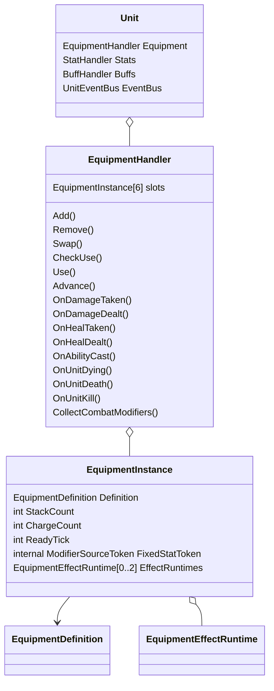
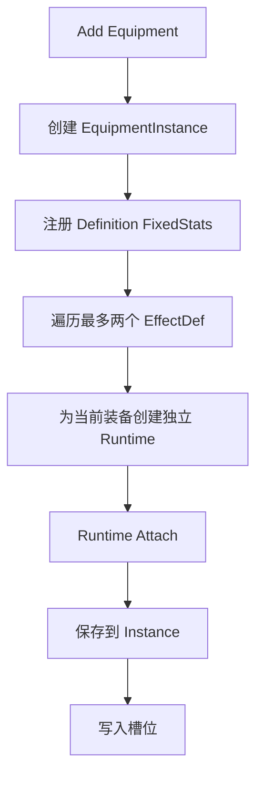
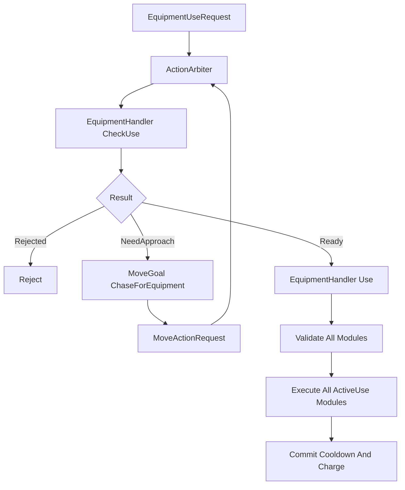
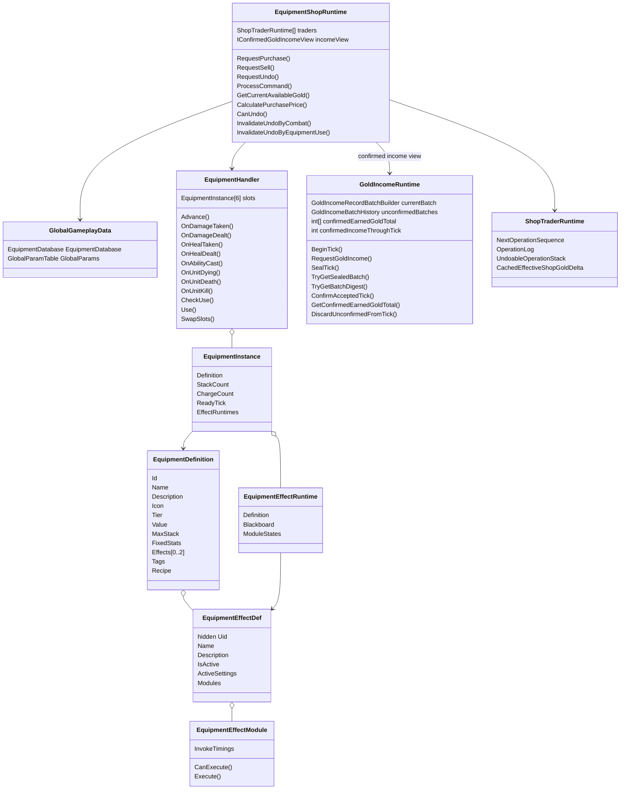

# Unity MOBA 装备、商店与金币获取系统程序设计案 v12

> 设计中心：单位身上的 `EquipmentHandler`、全局 `EquipmentShopRuntime` 与统一金币获取总控 `GoldIncomeRuntime`。  
> 事件与 Tick 接口以单位行为框架 v25 为准；战斗结算概念参考战斗系统 v10，冲突处以单位框架 v25 为准。  
> 帧同步、AuthorityFrame、回滚与 `AuthorityRecovery` 边界以《帧同步与流程管理综合系统程序设计案 v10》为准。  
> 所有 Gameplay 金币来源只能调用 `GoldIncomeRuntime.RequestGoldIncome`。  
> `GoldIncomeRuntime` 统一负责帧内金币记录、未确认批次、摘要、Accepted Tick 金币确认、累计获得金币与服务端持久化提交。  
> 帧同步总控负责 AuthorityFrame 接受、Command 对账、共享校验、快照选择和全局重演；金币总控不直接依赖网络帧结构。  
> `GoldIncomeRecordBatch[T]` 的规范摘要必须纳入 `SharedGameplayChecksum(T)`；AuthorityFrame 不传输具体金币记录。  
> 金币确认不会主动扫描或重演后续商店 Command；修正只通过正常 AuthorityFrame 对账与回滚流程发生。  
> 初始金币作为初始化基线，不生成金币请求；出售和撤销出售继续由商店 `OperationLog` 表达。  
> 当前可用金币由 `ConfirmedEarnedGoldTotal + EffectiveShopGoldDelta` 派生。  
> 普通死亡保留装备实例与跨死亡 Runtime；复活只重建当前生命阶段的外部 Handle。  
> 本版暂不设计饰品。

---

# 目录

1. EquipmentHandler：装备系统总入口
2. EquipmentDefinition：完整装备静态配置
3. EquipmentEffectDef 与 EquipmentEffectModule
4. 主动效果与模块执行
5. EquipmentShopRuntime：购买、卖出、撤销与交易链
6. GoldIncomeRuntime：统一金币获取、确认与账户结算
7. 快照、回滚、AuthorityRecovery、生命周期与接入
8. 完整结构与典型流程

---

# 一、EquipmentHandler：装备系统总入口

## 1.1 定位

`EquipmentHandler` 是 `Unit` 的装备系统门面。

它负责：

| 职责 | 说明 |
|---|---|
| 六格装备 | 保存六个 `EquipmentInstance` |
| 实例生命周期 | 加入、移除、交换、堆叠和变形 |
| 固定属性 | 注册和注销 `EquipmentDefinition.FixedStats` |
| 装备效果 | 创建和销毁装备自己的 `EquipmentEffectRuntime` |
| 单位事件 | 把 Gameplay 单位事件派发给效果 Runtime |
| 战斗修正 | 向 Combat Collector 提供装备效果修正 |
| 生命周期事件 | 派发 `UnitDying`、`UnitDeath` 与 `UnitKill` 给正式装备模块 |
| 主动使用 | 检查合法性、返回距离不足、合法后瞬发 |
| 查询 | 为 UI、AI 和调试工具提供只读信息 |

它不负责玩家金钱、账户 KDA、服务端账户同步、技能施法阶段、Dash 持续移动、最终战斗公式和 Buff 生命周期。

---

## 1.2 内部结构

```csharp
public sealed class EquipmentHandler
    : IRollback<EquipmentHandlerSnapshot>
{
    private const int SlotCount = 6;

    private Unit _owner;
    private EquipmentDatabase _database;
    private EquipmentPorts _ports;

    private readonly EquipmentInstance[] _slots =
        new EquipmentInstance[SlotCount];

    private readonly Dictionary<
        EquipmentCooldownGroupId,
        int> _sharedCooldowns;

    private readonly Queue<EquipmentChange>
        _pendingChanges;

    private int _dispatchDepth;
    private int _revision;
}
```



---

## 1.3 EquipmentInstance 不再需要 UID

```csharp
public sealed class EquipmentInstance
{
    public EquipmentDefinition Definition;

    public int StackCount;
    public int ChargeCount;
    public int ReadyTick;

    internal ModifierSourceToken?
        FixedStatToken;

    internal EquipmentEffectRuntime[]
        EffectRuntimes;
}
```

外部所有装备操作都通过槽位索引完成。

成装不允许重复购买；小件即使重复购买，也可以通过当前所在槽位区分。因此删除：

```text
EquipmentUid
EquipmentInstanceId
RuntimeKey
```

外部请求只保存：

```text
EquipmentSlot
```

例如：

```text
UseItemOrder
    Slot = 2

SellItemOrder
    Slot = 4
```

---

## 1.4 内部延迟变更如何定位装备

效果回调可能在结束后移除当前装备，例如最后一瓶药水被消耗。

延迟队列直接保存 `EquipmentInstance` 对象引用：

```text
QueueRemove(instance)
    ↓
Flush
    ↓
FindSlot(instance)
    ↓
Remove(slot)
```

即使装备在派发期间交换过槽位，也能通过引用找到当前位置，不需要永久 UID。

---

## 1.5 固定属性注册句柄

`FixedStatToken` 对应一整组固定属性来源，不是某一个属性。

例如：

```text
AttackDamage +40
MaxHealth +300
Armor +50
```

Handler 一次注册：

```text
ModifierSource
├── AttackDamage Flat +40
├── MaxHealth Flat +300
└── Armor Flat +50
```

`StatHandler` 返回一个 Token。移除装备时用该 Token 一次注销整组属性。

这个 Token 只能是 Handler 内部解绑凭证，不向 UI、AI 和 Effect 暴露。

---

## 1.6 固定属性只允许固定数值

装备直接提供的固定属性只允许固定数值加成。

允许：

```text
AttackDamage +40
AbilityPower +80
MaxHealth +300
Armor +50
MoveSpeed +45
```

不允许：

```text
AttackDamage +10%
MaxHealth +5%
MoveSpeed ×1.08
```

因此不复用可表达多种运算的通用 `StatModifierConfig`，而使用专用结构：

Authoring 配置使用 Unity 友好的浮点字段：

```csharp
[Serializable]
public struct EquipmentFixedStatAuthoring
{
    public StatKey Stat;
    public float Value;
}
```

离线 Bake 后进入 `EquipmentDatabase`：

```csharp
public readonly struct EquipmentFixedStat
{
    public readonly StatId Stat;
    public readonly fp Value;
}
```

Handler 读取 Bake 后的数据，并始终转换为：

```text
ModifierOperation.FlatAdd
```

百分比和乘法属性只能由装备效果或 Buff 提供。Gameplay Tick 不直接读取 Authoring `float`。

---

## 1.7 加入与移除

加入：



```text
Add(definition, slot):
    instance = new EquipmentInstance
    instance.Definition = definition
    instance.StackCount = 1
    instance.ChargeCount =
        ResolveInitialCharges(definition)

    if definition.FixedStats not empty:
        instance.FixedStatToken =
            RegisterFixedStats(
                definition.FixedStats
            )

    for index in definition.Effects:
        runtime =
            BuildEffectRuntime(
                instance,
                index,
                definition.Effects[index]
            )

        InitializeModuleRuntimeStates(runtime)
        ExecuteTiming(runtime, OnEquipped)
        instance.EffectRuntimes.Add(runtime)

    slots[slot] = instance
    revision++
```

移除：

```text
逐个执行 EffectRuntime 的 OnUnequipped 模块
    ↓
注销固定属性句柄
    ↓
清空槽位
    ↓
Reset / Pool EquipmentInstance
```

---

## 1.8 六格、交换与事件派发

Handler 直接保存 `_slots[0]` 到 `_slots[5]`。

交换只交换实例引用：

```csharp
(_slots[a], _slots[b]) =
    (_slots[b], _slots[a]);
```

不会重建 Runtime、重置冷却或重新注册固定属性。

Handler 统一接收：

```text
单位框架 v25 的强类型即时 UnitEventBus 回调
CombatModifierSet 的正式挂载与移除接缝
Unit Tick
ActionArbiter
```

`EquipmentHandler.Advance()` 和各模块在函数内部直接读取：

```text
SimulationTickContext.Current
```

不把 `SimulationTickContext` 层层作为参数传入，也不维护第二套逻辑时钟。

Handler 按以下稳定顺序遍历 Runtime：

```text
Slot 0 -> Slot 5
EffectIndex 0 -> 1
ModuleIndex 0 -> N
```

装备和 Buff 监听 Gameplay 内部击杀事件：

```text
UnitKill
```

不监听账户权威 `KillConfirmed`。

---

# 二、EquipmentDefinition：完整装备静态配置

## 2.1 定位与结构

`EquipmentDefinition` 是一件装备唯一的静态配置。

```csharp
[CreateAssetMenu(menuName = "MOBA/Equipment")]
public sealed class EquipmentDefinition
    : ScriptableObject
{
    public EquipmentId Id;

    public string Name;

    [TextArea]
    public string Description;

    public Sprite Icon;

    public EquipmentTier Tier;
    public int Value;

    public int MaxStack;

    public EquipmentFixedStat[] FixedStats;

    public EquipmentEffectDef[] Effects;

    public EquipmentTagDefinition[] Tags;

    public EquipmentRecipe Recipe;
}
```

它直接描述：

```text
装备身份
名称、描述和图标
装备等级
价值
消耗品最大堆叠
固定属性
最多两个附加效果
装备标签
合成配方
```

---

## 2.2 Id、名称和展示

`EquipmentId` 用于配置表索引、商店请求、合成配方和来源描述。

`Name`、`Description`、`Icon` 直接放在 Definition 根字段，不再额外包装 `EquipmentDisplayInfo`。

---

## 2.3 EquipmentTier

推荐至少区分：

```text
Consumable
Basic
Advanced
Finished
```

如果项目使用 `Basic / Epic / Legendary` 也可以，只要明确哪个 Tier 表示消耗品，哪个 Tier 表示成装。

Tier 直接参与两条规则：

```text
Consumable
    可以在一个槽位堆叠。

Finished
    同一个 EquipmentDefinition 不能重复持有。
```

---

## 2.4 删除 Stackable

是否可堆叠直接由 Tier 推导：

```csharp
public bool CanStack =>
    Tier == EquipmentTier.Consumable;
```

校验：

```text
Tier == Consumable
    -> MaxStack >= 1

Tier != Consumable
    -> MaxStack == 1
```

因此删除 `bool Stackable`。

---

## 2.5 Value

Definition 只保存一个价值：

```text
完整购买价 =
    Value

合成购买价 =
    Target.Value
    - ConsumedComponents.Value

出售价 =
    Value
    × GlobalParam.EquipmentSellRate
```

不保存单独的 `SellPrice`。

当前版本不在 `EquipmentDefinition` 增加：

```text
Purchasable
Sellable
```

商店不维护独立商品目录，直接读取：

```text
GlobalGameplayData.EquipmentDatabase.Definitions
```

当前注册进正式装备数据库的装备均视为可在标准商店中购买和卖出。未来特殊模式若需要排除某些装备，应由对应模式规则过滤，不提前给每件装备增加交易布尔字段。

---

## 2.6 FixedStats

`FixedStats` 直接属于装备本身，并且只允许固定数值。

Authoring 中配置：

```csharp
public EquipmentFixedStatAuthoring[] FixedStats;
```

离线 Bake 后由 `EquipmentDatabase` 保存只读 `EquipmentFixedStat[]`。

以下内容属于固定属性：

```text
AttackDamage +40
AbilityPower +80
MaxHealth +300
Armor +50
```

以下内容必须放入 Effect：

```text
最大生命值提高 10%
低生命时护甲提高 30%
移动速度提高 8%
```

基础属性不占两个效果槽。

---

## 2.7 Effects

```csharp
public EquipmentEffectDef[] Effects;
```

规则：

```text
Effects.Length <= 2
```

其中最多一个 `EquipmentEffectDef.IsActive == true`。

可以表达：

```text
固定属性 + 被动
固定属性 + 主动
固定属性 + 被动 + 主动
固定属性 + 光环 + 被动
消耗品主动
```

---

## 2.8 Tags

```csharp
public EquipmentTagDefinition[] Tags;
```

标签用于：

```text
商店分类
装备筛选
玩法识别
跨装备排他
```

例如：

```text
Attack
Magic
Defense
Boots
Stasis
Hydra
SpellShield
```

标签本身不一定唯一。是否产生排他由全局唯一性标签表决定。

---

## 2.9 EquipmentTagDefinition

```csharp
[CreateAssetMenu(
    menuName = "MOBA/Equipment Tag")]
public sealed class EquipmentTagDefinition
    : ScriptableObject
{
    [SerializeField, HideInInspector]
    private EquipmentTagUid uid;

    public string Name;

    [TextArea]
    public string Description;

    public EquipmentTagUid Uid => uid;
}
```

策划只创建标签资产、填写名称和描述，然后拖入 Definition 的 `Tags`。

不需要手填字符串 Key。

---

## 2.10 全局唯一性标签表

全局参数增加：

```csharp
public sealed class UniqueEquipmentTagTable
{
    public EquipmentTagDefinition[]
        UniqueTags;
}
```

也可以作为现有 `GlobalGameplayData` 或装备全局参数的一部分。

示例：

```text
UniqueTags
    Boots
    Stasis
    Hydra
```

规则：

> 两件装备拥有同一个标签，并且该标签存在于全局唯一性标签表中时，两件装备不能共存。

普通分类标签不在唯一性表中，因此不会产生排他。

---

## 2.11 成装重复与跨装备排他

成装本身禁止重复购买，直接由 Tier 检查：

```text
if Target.Tier == Finished
and postSlots 已存在相同 Definition:
    Reject
```

标签只处理不同 Definition 之间的排他，例如：

```text
不同鞋子
秒表与金身
不同 Hydra 装备
```

这样不需要为每件成装手工创建“只属于自己”的唯一标签。

---

## 2.12 排他检查

必须检查交易后的模拟六格。

```text
ValidatePostSlots(postSlots):
    seenFinishedDefinitions = empty
    uniqueTagOwner = empty

    for equipment in postSlots:
        definition = equipment.Definition

        if definition.Tier == Finished:
            if seenFinishedDefinitions contains definition:
                return Rejected

            add definition

        for tag in definition.Tags:
            if UniqueTagTable 不包含 tag:
                continue

            if uniqueTagOwner contains tag:
                return Rejected

            uniqueTagOwner[tag] = definition

    return Accepted
```

鞋子升级会先消耗基础鞋，因此交易后只有高级鞋，检查结果合法。

---

## 2.13 Recipe 与校验

```csharp
[Serializable]
public sealed class EquipmentRecipe
{
    public EquipmentRecipePart[] Components;
}

[Serializable]
public struct EquipmentRecipePart
{
    public EquipmentDefinition Item;
    public int Count;
}
```

编辑器应校验：

```text
Id 和 Name 不为空
Value >= 0
Consumable 的 MaxStack >= 1
非 Consumable 的 MaxStack == 1
Effects.Length <= 2
最多一个 `IsActive == true` 的 Effect
Tags 不重复
FixedStats 只包含固定值
Recipe 不循环引用
```

---

# 三、EquipmentEffectDef 与 EquipmentEffectModule

## 3.1 三层静态配置结构

装备效果静态配置固定为：

```text
EquipmentDefinition
    -> EquipmentEffectDef[0..2]
        -> EquipmentEffectModule[0..N]
```

不增加：

```text
EquipmentFunctionBinding
EquipmentEffectDefinitionData
EquipmentEffect 专用 Bake 镜像
运行时动态 Delegate 注册
```

三层职责：

| 层级 | 职责 |
|---|---|
| `EquipmentDefinition` | 装备身份、展示、价值、固定属性、标签、配方和最多两个效果 |
| `EquipmentEffectDef` | 一个完整效果的名称、说明、主动属性、公共主动规则和模块集合 |
| `EquipmentEffectModule` | 一项具体功能及其调用时机、静态参数和执行规则 |

---

## 3.2 EquipmentEffectDef 是非抽象配置资产

```csharp
[CreateAssetMenu(
    menuName = "MOBA/Equipment Effect")]
public sealed class EquipmentEffectDef
    : ScriptableObject
{
    [SerializeField, HideInInspector]
    private EquipmentEffectUid uid;

    public string Name;

    [TextArea]
    public string Description;

    public bool IsActive;

    public EquipmentActiveSettings
        ActiveSettings;

    [SerializeReference]
    public EquipmentEffectModule[]
        Modules;

    public EquipmentEffectUid Uid => uid;
}
```

`EquipmentEffectDef`：

```text
不是抽象类。
没有 Icon。
不通过子类区分咒刃、周期治疗或主动护盾。
```

功能差异完全由 `Modules` 中配置的模块类型和参数表达。

`Name` 与 `Description` 用于装备详情中的效果说明。

---

## 3.3 模块作为 EffectDef 的内嵌多态配置

```csharp
[Serializable]
public abstract class EquipmentEffectModule
{
    [SerializeField]
    private EquipmentEffectInvokeTiming[]
        invokeTimings;

    public IReadOnlyList<
        EquipmentEffectInvokeTiming>
        InvokeTimings => invokeTimings;

    public virtual bool CanExecute(
        ref EquipmentEffectExecutionContext context,
        ref EquipmentEffectModuleRuntimeState state)
    {
        return true;
    }

    public abstract void Execute(
        ref EquipmentEffectExecutionContext context,
        ref EquipmentEffectModuleRuntimeState state);

#if UNITY_EDITOR
    internal void ForceActiveUseTiming()
    {
        invokeTimings =
            new[]
            {
                EquipmentEffectInvokeTiming.ActiveUse
            };
    }
#endif
}
```

使用 `[SerializeReference]` 的原因：

```text
模块直接内嵌在 EquipmentEffectDef 中。
每个模块实例可以保存自己的类型和静态参数。
不需要为每一个小功能单独创建 ScriptableObject 资产。
不需要增加 Binding 包装层。
```

需要为 Unity Inspector 提供类型选择器和自定义 PropertyDrawer，但这只是编辑器显示工具，不构成运行时新层级。

---

## 3.4 调用时机

```csharp
public enum EquipmentEffectInvokeTiming
{
    OnEquipped,
    OnUnequipped,

    Tick,

    DamageTaken,
    DamageDealt,

    HealTaken,
    HealDealt,

    AbilityCast,

    UnitDying,
    UnitDeath,
    UnitKill,

    DynamicStatModifier,
    CombatModifier,

    ActiveUse
}
```

正式单位事件调用时机只有：

```text
DamageTaken
DamageDealt
HealTaken
HealDealt
AbilityCast
UnitDying
UnitDeath
UnitKill
```

其中：

```text
UnitDying
    进入濒死裁决，仍可能被救回。

UnitDeath
    正式死亡已经成立。

UnitKill
    击杀归属已经成立。
```

以下属于装备模块生命周期或固定系统入口，不是 `UnitEventBus` 事件：

```text
OnEquipped
OnUnequipped
Tick
DynamicStatModifier
CombatModifier
ActiveUse
```

当前不增加：

```text
LevelUp
UnitCollisionEnter
UnitCollisionExit
统一 GameplayEventRecord
GameplayEventQueue
DispatchPhase
动态事件 Subscribe
```

未来只有在单位框架正式增加事件且存在明确装备业务时，才同步扩展枚举与固定路由。

---

## 3.5 被动效果的模块时机

`IsActive == false` 时，每个模块可以选择一个或多个调用时机。

例如：

```text
DamageDealt
    造成伤害后追加攻击特效请求。

AbilityCast
    技能施放后设置咒刃就绪状态。

Tick
    每隔若干 Tick 执行恢复或检测。

DynamicStatModifier
    装备时挂载动态属性加成。

CombatModifier
    挂载战斗公式修正。

OnEquipped / OnUnequipped
    建立和解除长期来源。
```

一个效果内的多个模块可以通过同一个 `EquipmentEffectRuntime.Blackboard` 共享状态。

---

## 3.6 主动效果锁定调用时机

当：

```text
EquipmentEffectDef.IsActive == true
```

时，所有模块的调用时机必须强制为：

```text
ActiveUse
```

不允许主动 Effect 中出现：

```text
Tick
DamageTaken
AbilityCast
DynamicStatModifier
其它被动时机
```

编辑器行为：

```text
IsActive == false
    模块调用时机正常可编辑。

IsActive == true
    Inspector 将调用时机锁定并显示为 ActiveUse。
```

数据层同时使用 `OnValidate` 兜底：

```csharp
#if UNITY_EDITOR
private void OnValidate()
{
    if (!IsActive || Modules == null)
        return;

    for (int i = 0; i < Modules.Length; i++)
    {
        Modules[i]?.ForceActiveUseTiming();
    }
}
#endif
```

这样复制资产、脚本修改或旧数据迁移后也不会留下非法调用时机。

---

## 3.7 主动公共配置

```csharp
[Serializable]
public struct EquipmentActiveSettings
{
    public int CooldownTicks;
    public int ChargeCost;

    public EquipmentCooldownGroupId
        SharedCooldownGroup;

    public EquipmentTargetPolicy
        TargetPolicy;

    public fp CastRange;
}
```

只有 `IsActive == true` 时使用该配置。

主动公共规则统一负责：

```text
冷却。
Charge 消耗。
共享冷却。
目标类型。
阵营和 Targetable。
施放距离。
```

各模块只负责自己的具体功能，不分别重复扣除冷却或 Charge。

---

## 3.8 Effect 和 Module Runtime

静态配置仍然只有三层，但运行时状态必须与配置分离。

```csharp
public sealed class EquipmentEffectRuntime
{
    public EquipmentEffectDef Definition;

    public EquipmentEffectBlackboard
        Blackboard;

    public EquipmentEffectModuleRuntimeState[]
        ModuleStates;
}
```

```csharp
[Serializable]
public struct EquipmentEffectModuleRuntimeState
{
    public int NextExecuteTick;
    public int InternalCooldownReadyTick;

    public int StackCount;
    public int TriggerCount;

    public EquipmentEffectModuleBlackboard
        Blackboard;

    public EquipmentEffectSerializableHandles
        Handles;
}
```

Runtime 保存：

```text
下一执行 Tick。
内部冷却。
层数和触发次数。
跨 Tick Blackboard。
外部系统提供的可序列化句柄值。
```

Runtime 不保存：

```text
C# Delegate。
匿名函数。
运行时动态订阅列表。
修改后的 ScriptableObject 配置。
```

句柄本身的生成、序列号和恢复方式由句柄所属系统负责；装备案只把它视为可序列化值。

---

## 3.9 UID

`EquipmentEffectUid` 用于：

```text
配置引用。
运行时验证 EffectDef 是否匹配。
日志和调试。
快照恢复时验证静态配置。
```

UID 是隐藏序列化字段，策划只能读取，不能手工编辑。

复制资产后必须确保新资产获得不同 UID。具体编辑器 UID 生成方式由项目统一资产 ID 工具负责，本案不要求运行时动态分配。

模块不单独增加永久 UID。

模块运行时状态通过：

```text
EffectIndex + ModuleIndex
```

稳定对应。

---

## 3.10 不增加 Effect 专用 Bake 层

本案不定义：

```text
EquipmentEffectDefinition
EquipmentEffectDescriptor
EquipmentFunctionBindingData
```

运行时直接读取只读的：

```text
EquipmentDefinition
EquipmentEffectDef
EquipmentEffectModule
```

成立条件：

```text
静态配置在 Gameplay 开始后不可修改。
数组顺序稳定。
模块只保存静态参数。
运行时状态全部进入 Runtime。
所有逻辑数值使用项目允许的确定性类型。
资产引用由 GlobalGameplayData 统一收集、校验和版本握手。
```

全局配置系统仍可以对资产做：

```text
稳定 ID 校验。
空引用校验。
Effect 数量校验。
主动数量校验。
属性依赖循环校验。
配置版本哈希。
```

但不为 EquipmentEffect 再复制一套平行运行时数据结构。

---

## 3.11 典型模块类型

推荐从少量通用模块开始：

```text
SubmitDamageEquipmentEffectModule
SubmitHealEquipmentEffectModule
SubmitShieldEquipmentEffectModule

ApplyBuffEquipmentEffectModule
RemoveBuffEquipmentEffectModule

DynamicStatModifierEquipmentEffectModule
CombatModifierEquipmentEffectModule

ModifyCooldownEquipmentEffectModule
ModifyEffectStateEquipmentEffectModule

TeleportEquipmentEffectModule
EnterStasisEquipmentEffectModule
```

每个模块只承担一种明确功能。

---

## 3.12 事件驱动模块

例如攻击附伤：

```text
EquipmentEffectDef
    Name = 裂伤
    IsActive = false

    Modules[0]
        Type = SubmitDamageEquipmentEffectModule
        InvokeTimings = DamageDealt
        RequiredSourceType = Attack
        DamageRecipeId = BladeOnHit
        BaseValue = 40
```

调用链：

```text
CombatSystem 建立 DamageResult
    ↓
Source.UnitEventBus.Publish(DamageDealtEvent)
    ↓
EquipmentHandler.OnDamageDealt
    ↓
按 Slot / Effect / Module 稳定顺序扫描
    ↓
匹配 DamageDealt 的模块执行
    ↓
提交新的 AttackEffect DamageRequest
```

已经成立的 `DamageResult` 不会被倒过来修改。

攻击特效的新请求使用：

```text
SourceType = AttackEffect
```

避免再次满足“攻击来源伤害”的同类触发条件。

---

## 3.13 Tick 模块

例如每 30 Tick 提交一次治疗：

```text
EquipmentEffectDef
    IsActive = false

    Module
        Type = SubmitHealEquipmentEffectModule
        InvokeTimings = Tick
        IntervalTicks = 30
        HealRecipeId = PeriodicHeal
        BaseValue = 20
```

Runtime 保存：

```text
NextExecuteTick
```

`EquipmentHandler.Advance()` 直接读取：

```text
SimulationTickContext.Current.Tick
```

到达执行 Tick 后调用模块并推进下一执行 Tick。

---

## 3.14 动态属性模块

例如：

> 获得相当于最大生命值 2% 的攻击力。

```text
EquipmentEffectDef
    Name = 巨人之力
    IsActive = false

    Module
        Type = DynamicStatModifierEquipmentEffectModule
        InvokeTimings = DynamicStatModifier

        SourceStat = MaxHealth
        TargetStat = AttackDamage
        Coefficient = 0.02
        Operation = FlatAdd
```

装备时挂载动态属性来源，卸下时使用 Runtime 保存的可序列化句柄解除。

动态属性依赖关系由属性系统负责计算和检测循环；装备案只提供静态参数。

---

## 3.15 CombatModifier 模块

修改当前伤害、治疗或护盾公式的效果，不等待结果事件。

例如：

```text
本次攻击必定暴击。
攻击来源伤害提高 20%。
受到的魔法伤害降低。
```

使用：

```text
CombatModifierEquipmentEffectModule
```

在效果成立时向单位框架 v25 的 `CombatModifierSet` 挂载正式记录；效果结束时使用保存的句柄解除。

战斗系统 v10 中与单位框架 v25 冲突的旧接口不作为本案依据。

---

# 四、主动效果与模块执行

## 4.1 每件装备最多一个主动 Effect

校验规则：

```text
EquipmentDefinition.Effects.Length <= 2
IsActive == true 的 Effect 数量 <= 1
```

主动 Effect 中的所有 Module 都只能是：

```text
ActiveUse
```

主动使用时一次性执行该 Effect 挂载的全部模块。

---

## 4.2 CheckUse

`EquipmentHandler.CheckUse(slot, target)` 检查：

```text
槽位存在装备。
装备存在主动 Effect。
Owner 当前状态允许使用主动装备。
实例冷却完成。
共享冷却完成。
Stack 或 Charge 足够。
Target 类型合法。
阵营合法。
Targetable 合法。
距离合法。
全部主动模块 CanExecute 通过。
```

结果：

```text
Ready
NeedApproach
Rejected
```

模块的 `CanExecute` 不得修改 Gameplay 状态。

---

## 4.3 先验证全部模块，再统一执行

```text
找到主动 Effect
    ↓
按 ModuleIndex 顺序执行全部 CanExecute
    ↓
任一失败
        -> 不执行任何模块
        -> 不扣 Charge
        -> 不进入冷却
    ↓
全部通过
        -> 按 ModuleIndex 顺序执行全部 Execute
        -> 统一扣除 Charge
        -> 统一提交实例冷却
        -> 统一提交共享冷却
```

禁止出现：

```text
Module 0 已执行
Module 1 验证失败
主动效果只执行了一半
```

模块应把需要失败的条件放在 `CanExecute` 阶段。

---

## 4.4 ActionArbiter 接入



主动效果本身瞬发。

Dash、Blink 或其它持续行为由对应模块向已有系统提交正式请求，不在装备系统内部维护第二套移动状态机。

---

## 4.5 不使用 EquipmentInstanceUid

外部通过槽位调用：

```text
CheckUse(slot, target)
Use(slot, target)
```

`Use` 执行时重新读取当前槽位。

交换槽位只交换完整 `EquipmentInstance` 引用，EffectRuntime 和 ModuleRuntimeState 随实例一起移动。

不增加：

```text
EquipmentInstanceUid
EquipmentPassiveRuntimeUid
```

---

## 4.6 装备使用使商店撤销失效

主动装备成功执行后，`EquipmentHandler` 调用：

```csharp
shopRuntime.InvalidateUndoByEquipmentUse(
    ownerPlayerSlot,
    slot);
```

消耗品成功减少 Stack、Charge 或被移除时同样调用。

失败使用不触发撤销失效。

这样可以覆盖不会产生伤害、治疗或护盾的装备功能，例如：

```text
停滞。
纯移动。
清除控制。
纯加速。
```

---


## 4.7 普通死亡与复活接缝

普通死亡时调用：

```csharp
EquipmentHandler.ClearForDeath();
```

`ClearForDeath()` 不是清空装备栏。它保留：

```text
EquipmentInstance。
EquipmentDefinition 引用。
StackCount。
ChargeCount。
主动装备 ReadyTick 与冷却。
EquipmentEffectRuntime。
需要跨死亡保留的 Blackboard 和 ModuleRuntimeState。
```

它只清理当前生命阶段的外部注册和临时状态：

```text
当前生命阶段的属性 Modifier Handle。
控制免疫 Handle。
不可阻挡 Handle。
临时 Buff Handle。
生命周期绑定监听或注册。
模块明确声明为 DeathClear 的临时状态。
```

普通死亡禁止：

```text
EquipmentHandler.Clear。
删除六个装备槽。
对全部装备调用完整 OnUnequipped。
重置主动冷却、Stack 或 Charge。
丢失跨死亡 EffectRuntime。
```

复活阶段调用：

```csharp
EquipmentHandler.ClearForRespawn();
```

`ClearForRespawn()` 按固定顺序：

```text
Slot 0..5
    -> Effect 0..1
        -> Module 0..N
```

重新建立当前生命阶段需要的外部注册：

```text
固定属性 Modifier Handle。
控制免疫 Handle。
不可阻挡 Handle。
常驻被动所需生命周期 Handle。
模块声明的 Respawn Rebind Handle。
```

复活不是重新装备：

```text
不创建新的 EquipmentInstance。
不重置 Stack、Charge 或 ReadyTick。
不执行完整交易流程。
不调用完整 OnEquipped。
```

完整卸载装备来源只发生于出售、移除、变形、`ResetForPool`、`InitializeForNewRuntimeUid` 或 Unit Runtime 永久销毁。

---

## 4.8 UnitDeath 同 Tick 执行

`UnitDying`、`UnitDeath` 与 `UnitKill` 都通过单位框架正式的强类型即时路由执行。

```text
Alive
    -> Dying
    -> Dead
```

在 Combat Settlement 当前 Tick 内成立时，对应装备模块也在当前 Tick 即时执行。

`UnitDeath` 或 `UnitKill` 模块提交的新：

```text
DamageRequest。
HealRequest。
ShieldRequest。
Buff Request。
```

可以继续进入当前 Tick 后续 Combat Settlement Cycle。

禁止把正式死亡装备反应推迟到 Combat 阶段结束之后。

---

## 4.9 新生单位的装备生效边界

```text
FirstActiveLogicTick =
    UnitUid.SpawnLogicTick + 1
```

生成 Tick 内：

```text
固定装备属性已经存在。
装备常驻来源已经挂载。
装备可以响应外部强类型结果事件。
单位可以成为装备效果的目标。
```

生成 Tick 内禁止：

```text
EquipmentHandler.Advance 的 Tick 模块主动推进。
主动装备使用。
由新生单位主动发起装备行为。
```

从 `FirstActiveLogicTick` 起，装备 Tick 模块和主动使用正常推进。

---

# 五、EquipmentShopRuntime：购买、卖出、撤销与交易链

## 5.1 定位

`EquipmentShopRuntime` 是一局 Gameplay 中唯一的商店运行时。

```csharp
public sealed class EquipmentShopRuntime
    : IRollback<EquipmentShopRuntimeSnapshot>
{
    private EquipmentDatabase _equipmentDatabase;
    private EquipmentGlobalParams _globalParams;

    private ShopTraderRuntime?[]
        _tradersByPlayerSlot;

    private IConfirmedGoldIncomeView
        _confirmedGoldIncomeView;

    private IEquipmentShopCommandSubmitter
        _commandSubmitter;
}
```

所有模拟端都创建同样的商店运行时。

商店不解析网络 AuthorityFrame，也不维护金币确认进度；它只通过只读端口取得当前已确认累计收入。

它不是商店 UI Prefab 上的 `MonoBehaviour`。

---

## 5.2 商店没有独立静态商品配置

本案不增加：

```text
EquipmentShopDefinition
EquipmentShopDatabase
EquipmentShopId
商品 Catalog
```

商品直接来自：

```text
GlobalGameplayData.EquipmentDatabase
```

当前正式注册的装备都属于标准商店商品。

商店 UI 的分类、搜索和合成树使用：

```text
EquipmentTier
EquipmentTagDefinition
Name
Recipe
```

是否处于商店范围由地图或比赛规则系统提供：

```text
ShopAccessState.CanTrade
```

---

## 5.3 Gameplay 金币与商店交易金币严格分离

所有 Gameplay 金币来源只能调用：

```text
GoldIncomeRuntime.RequestGoldIncome
```

包括自然金币、补刀、击杀、助攻、地图目标、比赛规则和其它正式奖励。

商店购买、出售和撤销不是 Gameplay 金币获取。它们只通过：

```text
OperationLog + ShopOperationRecord.Reverted
```

表达交易金币变化。

正式冻结：

```text
Gameplay 奖励金币
    -> GoldIncomeRuntime。

购买、出售、撤销
    -> EquipmentShopRuntime.OperationLog。
```

出售金币不进入 `GoldIncomeRuntime`，避免确认收入与可逆商店交易形成双重权威。

---

## 5.4 确认收入只读端口

`GoldIncomeRuntime` 实现：

```csharp
public interface IConfirmedGoldIncomeView
{
    int GetConfirmedEarnedGoldTotal(
        PlayerSlot player);

    int ConfirmedIncomeThroughTick
    {
        get;
    }
}
```

`EquipmentShopRuntime` 只持有该只读接口：

```csharp
private IConfirmedGoldIncomeView
    _confirmedGoldIncomeView;
```

商店不负责接收金币请求、创建金币记录、封闭批次、确认 AuthorityFrame 或提交账户持久化。

---

## 5.5 商店金币事实与当前可用金币

```text
购买 GoldDelta < 0。
出售 GoldDelta > 0。
Reverted == true 的记录不计入当前金币结果。
```

```text
EffectiveShopGoldDelta =
    Sum(
        OperationLog 中所有
        Reverted == false 的 GoldDelta
    )
```

```text
CurrentAvailableGold =
    GoldIncomeRuntime
        .GetConfirmedEarnedGoldTotal(player)
    +
    EffectiveShopGoldDelta
```

`CurrentAvailableGold` 是只读派生值，不直接赋值、不网络同步、不进入 GameplaySnapshot，也不保存逐 Tick 历史。

---

## 5.6 可选派生缓存与交易链懒创建

允许维护：

```text
CachedConfirmedEarnedGoldTotal。
CachedEffectiveShopGoldDelta。
IsEffectiveShopGoldDeltaDirty。
```

它们只是可重建性能缓存，不得成为第二份权威状态。

商店初始没有 `ShopTraderRuntime`。玩家第一次成功购买或出售时创建：

```csharp
public sealed class ShopTraderRuntime
{
    public PlayerSlot Player;
    public UnitUid ControlledUnitUid;
    public int NextOperationSequence;

    public readonly List<ShopOperationRecord>
        OperationLog;

    public readonly List<int>
        UndoableOperationStack;

    // 派生缓存，不进入快照
    public int CachedEffectiveShopGoldDelta;
    public bool IsEffectiveShopGoldDeltaDirty;

    public ShopUndoInvalidReason
        LastUndoInvalidReason;

    public CombatParticipationFlags
        LastCombatParticipationFlags;

    public int RuntimeRevision;
}
```

未创建 TraderRuntime 时：

```text
EffectiveShopGoldDelta = 0。
CurrentAvailableGold =
    GoldIncomeRuntime
        .GetConfirmedEarnedGoldTotal(player)。
```

`NextOperationSequence` 是整场对局持续递增的 `int`，并进入 `EquipmentShopRuntimeSnapshot`。

---

## 5.7 交换槽位不属于商店

交换槽位走：

```text
SwapEquipmentSlotCommand
    -> CommandDispatcher
    -> Unit
    -> EquipmentHandler.SwapSlots
```

不进入：

```text
EquipmentShopRuntime.ProcessCommand
OperationLog
UndoableOperationStack
```

交换不会永久清空商店撤销栈。

撤销时重新检查原交易记录要求的槽位状态：

```text
当前槽位状态匹配记录
    -> 可以撤销。

当前不匹配
    -> 当前不可撤销。

之后重新交换回匹配状态
    -> 可以再次通过撤销检查。
```

---

## 5.8 两层检查

购买、出售和撤销只保留两层检查。

### 第一层：本地 RequestCheck

仅由发起操作的本地客户端调用：

```text
CheckPurchaseRequest
CheckSellRequest
CheckUndoRequest
```

作用：

```text
决定是否提交 Command。
立即向 UI 返回失败原因。
```

失败时不提交 Command，也不修改 Gameplay。

### 第二层：所有端 ProcessCommand 可行性检查

Command 在目标 Tick 执行时，所有端调用：

```text
EquipmentShopRuntime.ProcessCommand
```

所有端基于相同的：

```text
当前 Tick 确认收入基线。
有效 OperationLog.GoldDelta。
EquipmentHandler 状态。
ShopTraderRuntime。
装备配置。
Command 稳定顺序。
```

得到相同成功或失败结果。

不增加第三套服务端业务检查，也不增加：

```text
ShopOperationAuthorityResult
```

各端交易结果不一致属于程序错误或状态反同步。

---

## 5.9 Request 接口与 Command 边界

购买请求只表达：

```text
哪个 PlayerSlot。
想购买哪个 EquipmentId。
```

购买请求和购买 Command 都不携带：

```text
PreferredSlot。
TargetSlot。
DestinationSlot。
任何由客户端指定的目标装备槽位。
```

正式接口：

```csharp
public EquipmentShopRequestCheck
    RequestPurchase(
        PlayerSlot localPlayer,
        EquipmentId target);

public EquipmentShopRequestCheck
    RequestSell(
        PlayerSlot localPlayer,
        EquipmentSlot sourceSlot);

public EquipmentShopRequestCheck
    RequestUndo(
        PlayerSlot localPlayer);
```

请求通过后，商店通过帧同步层端口提交正式：

```text
EquipmentShopCommand
```

```csharp
public interface IEquipmentShopCommandSubmitter
{
    void SubmitPurchase(
        PlayerSlot player,
        EquipmentId item);

    void SubmitSell(
        PlayerSlot player,
        EquipmentSlot sourceSlot);

    void SubmitUndo(
        PlayerSlot player);
}
```

购买目标槽位不是玩家意图，而是目标 Tick 执行交易时，根据当时装备栏、配方组件和堆叠状态确定性派生的交易结果。

Command 字段、TargetTick、CommandSequence、网络发送和重演由帧同步设计负责。

### 金币敏感命令分类

```csharp
public bool IsGoldSensitive(
    in EquipmentShopCommand command);
```

正式分类：

```text
Purchase -> true。
Undo     -> true。
Sell     -> false。
```

`Undo` 统一视为金币敏感，因为撤销卖出需要支付原出售所得金币。

该接口只用于 RequestCheck/ProcessCommand 规则一致性、确定性测试、协议说明和诊断；不用于金币确认后扫描历史 Command、主动触发后缀重演或自动补买。

---

## 5.10 可用金币查询与确定性购买计划

### 可用金币

```csharp
public int GetCurrentAvailableGold(
    PlayerSlot player)
{
    int confirmedIncome =
        _confirmedGoldIncomeView
            .GetConfirmedEarnedGoldTotal(
                player);

    int shopDelta =
        GetEffectiveShopGoldDelta(player);

    return confirmedIncome + shopDelta;
}
```

```csharp
private int GetEffectiveShopGoldDelta(
    PlayerSlot player)
{
    ShopTraderRuntime trader =
        TryGetTrader(player);

    if (trader == null)
        return 0;

    if (trader.IsEffectiveShopGoldDeltaDirty)
    {
        trader.CachedEffectiveShopGoldDelta =
            RecalculateEffectiveShopGoldDelta(
                trader.OperationLog);

        trader.IsEffectiveShopGoldDeltaDirty =
            false;
    }

    return trader.CachedEffectiveShopGoldDelta;
}
```

UI、本地 RequestCheck 和所有端 `ProcessCommand` 必须调用同一查询入口。

预测但尚未确认的 `GoldIncomeRecordBatch` 不进入该查询。

### UI 动态购买价格

UI 商店视图绑定当前本地玩家，并提供：

```csharp
public int CalculatePurchasePrice(
    EquipmentId targetEquipmentId);
```

计算规则：

```text
读取目标装备基础价格。
按正式配方与稳定槽位顺序选择当前已有小件。
扣除这些小件的配置价值。
返回最终动态购买价格。
```

公式：

```text
PurchasePrice =
    TargetEquipment.Value
    -
    Sum(当前可消耗配方小件的 Value)
```

该函数：

```text
只返回价格。
不判断金币是否足够。
不判断最终是否可以买下。
不修改 EquipmentHandler。
不提交 Command。
```

目标装备来自正式商店列表，因此 UI 不需要额外的 Preview 结构或失败原因包装。

内部组件匹配规则必须与 `TryBuildPurchasePlan` 完全一致，避免 UI 显示价格与正式购买价格不同。

### EquipmentPurchasePlan

购买检查和购买执行必须共用同一个纯查询规划器：

```csharp
public struct EquipmentPurchasePlan
{
    public EquipmentId TargetEquipmentId;

    public int PurchaseCost;

    public EquipmentSlot[]
        ConsumedComponentSlots;

    public bool MergeIntoExistingStack;

    public EquipmentSlot DestinationSlot;

    public EquipmentSlotChange[]
        SlotChanges;
}
```

```csharp
private EquipmentPurchasePlanResult
    TryBuildPurchasePlan(
        PlayerSlot player,
        EquipmentId target);
```

规划器：

```text
只读取当前 Gameplay 状态。
不修改 EquipmentHandler。
不修改 OperationLog。
不修改撤销栈。
不修改任何金币状态。
不提交 Command。
```

返回结果包含完整的交易后六格状态和失败原因。

购买 Command 不携带 `EquipmentPurchasePlan`。所有端在目标 Tick 根据当时的确定性状态重新构建计划。

---

## 5.11 购买 RequestCheck

本地请求检查调用：

```text
TryBuildPurchasePlan(localPlayer, target)
```

规划顺序固定为：

```text
1. 验证本地玩家、ControlledUnitUid 和商店范围。
2. 从正式 EquipmentDatabase 取得目标装备。
3. 解析目标装备配方。
4. 按稳定规则选择要消耗的小件槽位。
5. 在模拟六格中先删除这些小件。
6. 基于删除后的模拟六格自动确定：
       可合并的目标同类 Stack；
       或最低合法空槽位。
7. 把目标装备写入模拟六格。
8. 对完整交易后状态执行全部合法性检查。
9. 计算 PurchaseCost。
10. 检查 GetCurrentAvailableGold(player) 是否足够。
```

完整检查至少包括：

```text
配方可解析。
组件数量足够。
组件槽位选择确定。
交易后的六格存在合法放置结果。
Stack 不超过 MaxStack。
成装不会重复。
全局唯一标签不会冲突。
目标消耗品可以合并，或存在自动分配槽位。
购买价格合法。
当前可用金币足够。
```

当前版本没有：

```text
Definition.Purchasable
```

RequestCheck 只使用规划结果决定是否提交 Command。

它不会实际删除小件或加入目标装备。

检查通过也只表示当前本地状态允许提交，不保证目标 Tick 执行时仍然成功。

---

## 5.12 购买 ProcessCommand

所有端在目标 Tick 调用：

```text
TryBuildPurchasePlan(player, target)
```

并按相同状态、槽位顺序和配方顺序得到相同计划。

失败：

```text
不修改 EquipmentHandler。
不追加 OperationLog。
不修改 UndoableOperationStack。
不修改派生金币缓存。
```

成功后严格按以下顺序提交：

```text
1. 记录计划中全部受影响槽位的 Before。
2. 按槽位升序删除 ConsumedComponentSlots 中的小件。
3. 小件全部删除完成后：
       若 MergeIntoExistingStack == true，
           合并到计划确定的 DestinationSlot；
       否则，
           在计划确定的 DestinationSlot 创建目标装备。
4. 记录全部受影响槽位的 After。
5. 验证实际 After 与计划 SlotChanges.After 一致。
6. 追加 Purchase Record：
       GoldDelta = -PurchaseCost
       Reverted = false
7. 将 OperationSequence 压入 UndoableOperationStack。
8. 标记 EffectiveShopGoldDelta 缓存 Dirty。
```

强制规则：

> 完整交易计划验证通过后，必须先真实删除全部配方小件，再合并或放入目标装备。

禁止：

```text
先把目标装备放入当前装备栏，再删除组件。
因交易前没有空槽而拒绝本可通过合成释放槽位的购买。
在提交过程中临时出现第七件装备。
让 Command 指定目标装备槽位。
```

购买不修改：

```text
GoldIncomeRuntime.ConfirmedEarnedGoldTotal。
GoldIncomeRecordBatch。
独立余额字段。
```

---

## 5.13 配方组件选择、自动分配与合成价格

### 组件选择

购买时优先消耗玩家当前持有的完整配方组件。

同一种组件存在多件时：

```text
低槽位优先。
```

不同组件的处理顺序：

```text
按 Recipe 配置数组顺序。
```

组件槽位确定后，先在模拟六格中全部删除。

### 自动分配目标装备

模拟删除小件后，按以下稳定规则确定目标装备位置：

```text
1. 若目标装备允许堆叠，并存在可继续合并的同类实例：
       选择最低槽位的可合并实例。

2. 否则：
       选择模拟删除组件后的最低空槽位。

3. 没有合法合并位置或空槽：
       购买失败。
```

配方组件释放的槽位可以用于放置目标装备。

例如交易前六格已满，但目标装备会消耗 Slot 0 和 Slot 2 的小件：

```text
模拟删除后：
    Slot 0 为空。
    Slot 2 为空。

目标装备：
    自动进入最低空槽 Slot 0。
```

### 交易后合法性

成装重复、唯一标签和 Stack 检查必须基于：

```text
删除组件并加入目标装备后的完整模拟六格。
```

不能基于交易前装备栏判断。

例如高级鞋会消耗基础鞋：

```text
交易前：
    基础鞋带有 Boots 唯一标签。

模拟交易：
    先删除基础鞋。
    再加入高级鞋。

交易后：
    六格中仍只有一个 Boots 标签。
```

因此升级合法。

### 合成价格

```text
PurchaseCost =
    Target.Value
    -
    Sum(ConsumedComponents.Value)
```

`ConsumedComponents` 必须与计划中实际选择并删除的小件完全一致。

必须先完成整份 `EquipmentPurchasePlan`，再提交任何 Gameplay 状态变化。

---

## 5.14 卖出

RequestCheck：

```text
当前允许访问商店。
SourceSlot 合法。
槽位存在装备。
```

出售金额：

```text
SellValue =
    Definition.Value
    × GlobalParamTable.EquipmentSellRate
```

所有端成功执行：

```text
记录 Slot Before
    ↓
EquipmentHandler 移除装备
    ↓
记录 Slot After
    ↓
追加 Sell Record
    GoldDelta = +SellValue
    Reverted = false
    ↓
压入 UndoableOperationStack
    ↓
标记 EffectiveShopGoldDelta 缓存 Dirty
```

出售不会增加：

```text
GoldIncomeRuntime.ConfirmedEarnedGoldTotal。
GoldIncomeRecordBatch。
```

当前版本没有：

```text
Definition.Sellable
```

---

## 5.15 交易记录

```csharp
public struct ShopOperationRecord
{
    public int OperationSequence;

    public EquipmentShopOperationType
        OperationType;

    public PlayerSlot Player;
    public UnitUid ControlledUnitUid;

    public int LogicTick;
    public int GoldDelta;

    public EquipmentSlotChange[]
        SlotChanges;

    public bool Reverted;
    public int RevertedLogicTick;

    public int EquipmentRevisionBefore;
    public int EquipmentRevisionAfter;
}
```

操作类型：

```csharp
public enum EquipmentShopOperationType
{
    Purchase,
    Sell
}
```

当前版本直接保留整场 `OperationLog`。

撤销不追加新的 Undo 记录。

---

## 5.16 UndoableOperationStack

撤销栈保存：

```text
OperationSequence
```

使用：

```text
Push
Peek
Pop
Clear
```

只允许后进先出。

---

## 5.17 撤销查询与 RequestCheck

UI 商店视图提供：

```csharp
public bool CanUndo();
```

它只返回当前本地玩家是否可以撤销：

```text
true：
    UI 启用撤销按钮。

false：
    UI 禁用撤销按钮。
```

`CanUndo()` 与 `RequestUndo`、Undo `ProcessCommand` 共用同一套撤销可行性检查，但不提交 Command，也不修改任何状态。

正式检查包括：

```text
当前允许访问商店。
当前 TraderRuntime 存在。
UndoableOperationStack 非空。
没有发生永久撤销失效。
当前 ControlledUnitUid 与原记录一致。
原记录 Reverted == false。
当前受影响槽位仍匹配原记录 After。
撤销卖出时 GetCurrentAvailableGold(player)
    足以支付 Original.GoldDelta。
```

原卖出记录的 `GoldDelta > 0`，撤销后该记录不再计入余额，因此需要当前金币至少覆盖该返还金额。

失败时不提交 Undo Command。

---

## 5.18 撤销 ProcessCommand

所有端：

```text
取得撤销栈顶 OperationSequence
    ↓
读取原 Purchase 或 Sell Record
    ↓
重新执行相同可行性检查
    ↓
通过 EquipmentHandler 恢复全部 Before
    ↓
OriginalRecord.Reverted = true
    ↓
OriginalRecord.RevertedLogicTick = Current Tick
    ↓
弹出撤销栈顶
    ↓
标记 EffectiveShopGoldDelta 缓存 Dirty
```

撤销只修改：

```text
EquipmentHandler。
OperationLog 中的原记录。
UndoableOperationStack。
派生金币缓存 Dirty 标记。
```

不会修改账户或任何独立余额字段。

---

## 5.19 永久撤销失效规则

以下情况清空对应玩家的撤销栈：

```text
走出商店范围。
接受有效伤害。
造成有效伤害。
接受有效治疗。
造成有效治疗。
接受有效护盾。
造成有效护盾。
成功使用主动装备。
成功消耗商店购买的消耗品、Stack 或 Charge。
```

失效只清空：

```text
UndoableOperationStack
```

不清空或删除：

```text
OperationLog
```

---

## 5.20 离开商店范围

当：

```text
ShopAccessState.CanTrade
    true -> false
```

时调用：

```csharp
InvalidateUndo(
    player,
    ShopUndoInvalidReason.LeftShopRange);
```

关闭商店 UI 不等于离开商店范围。

---

## 5.21 CombatSystem 帧内参与记录

CombatSystem 基于有效伤害、治疗和护盾结果维护当前 Combat Phase 的参与掩码：

```csharp
[Flags]
public enum CombatParticipationFlags
{
    None = 0,

    DamageDealt = 1 << 0,
    DamageTaken = 1 << 1,

    HealDealt = 1 << 2,
    HealTaken = 1 << 3,

    ShieldGranted = 1 << 4,
    ShieldReceived = 1 << 5
}
```

有效条件：

```text
EffectiveDamage > 0
EffectiveHeal > 0
EffectiveShield > 0
```

0 伤害、完全免疫、0 有效治疗和失败护盾不计入。

自然恢复不经过普通治疗结果，不触发商店撤销失效。

---

## 5.22 CombatSystem 调用商店接口

Combat Phase 结算完成后，CombatSystem 按 `PlayerSlot` 稳定升序调用：

```csharp
public interface IEquipmentShopUndoInvalidator
{
    void InvalidateUndoByCombat(
        PlayerSlot player,
        CombatParticipationFlags flags);
}
```

商店内部自行检查：

```text
TraderRuntime 是否存在。
UndoableOperationStack 是否为空。
```

CombatSystem 不读取交易链，也不管理撤销资格。

自我伤害、自我治疗或自我护盾只对同一玩家执行一次幂等失效。

---

## 5.23 FailureReason

```csharp
public enum EquipmentShopFailureReason
{
    None,

    InvalidLocalPlayer,
    ControlledUnitNotFound,

    NotInShopRange,
    ItemNotFound,

    InsufficientGold,
    InventoryFull,
    InvalidRecipe,

    DuplicateFinishedItem,
    UniqueTagConflict,

    InvalidSlot,
    EmptySlot,

    NoUndoableTransaction,
    UndoInvalidatedByLeavingShop,
    UndoInvalidatedByCombat,
    UndoInvalidatedByEquipmentUse,
    TransactionStateChanged
}
```

---

# 六、GoldIncomeRuntime：统一金币获取、确认与账户结算

## 6.1 定位

`GoldIncomeRuntime` 是一局比赛内所有 Gameplay 金币获取的唯一总控，存在于客户端、Dedicated Server、回放模拟端和确定性测试端。

它统一负责：

```text
接收所有金币获取请求。
生成当前 Tick 的 GoldIncomeRecord。
封闭 GoldIncomeRecordBatch[T]。
保存未确认批次。
生成 GoldIncomeBatchDigest[T]。
把摘要接入 SharedGameplayChecksum(T)。
根据已接受的 AuthorityFrame 确认对应批次。
维护 ConfirmedEarnedGoldTotal。
维护 ConfirmedIncomeThroughTick。
服务端提交确认批次到账户持久化层。
普通回滚时丢弃并重建未确认批次。
```

它不负责网络收包、全局 Command 对账、选择快照、驱动其它 Gameplay 重演、商店交易或数据库写入实现。

---

## 6.2 对外接口

所有金币来源只依赖：

```csharp
public interface IGoldIncomeRequester
{
    void RequestGoldIncome(
        PlayerSlot receiver,
        int amount,
        GoldIncomeReason reason);
}
```

商店和 UI 只依赖：

```csharp
public interface IConfirmedGoldIncomeView
{
    int GetConfirmedEarnedGoldTotal(
        PlayerSlot player);

    int ConfirmedIncomeThroughTick
    {
        get;
    }
}
```

帧同步总控只能通过以下正式接口访问金币批次和摘要：

```csharp
public bool TryGetSealedBatch(
    int logicTick,
    out GoldIncomeRecordBatch batch);

public bool TryGetBatchDigest(
    int logicTick,
    out GoldIncomeBatchDigest digest);

public void DiscardUnconfirmedFromTick(
    int replayFromTick);

public void ConfirmAcceptedTick(
    int logicTick);
```

服务端持久化端口：

```csharp
public interface IConfirmedGoldSettlementSink
{
    void SubmitConfirmedGoldIncome(
        in GoldIncomeRecordBatch batch);
}
```

帧同步总控不得绕过接口直接读取内部构建器、批次历史、摘要历史或累计金币数组。

---

## 6.3 主体结构与唯一所有权

```csharp
public sealed class GoldIncomeRuntime :
    IGoldIncomeRequester,
    IConfirmedGoldIncomeView
{
    private GoldIncomeRecordBatchBuilder
        _currentBatchBuilder;

    private GoldIncomeBatchHistory
        _unconfirmedBatchHistory;

    private GoldIncomeBatchDigestHistory
        _batchDigestHistory;

    private int[]
        _initialEarnedGoldByPlayer;

    private int[]
        _confirmedEarnedGoldTotalByPlayer;

    private int _confirmedIncomeThroughTick;
    private int _currentBuildingTick;
    private int _nextIncomeSequenceInTick;

    private GoldIncomeBuildState
        _buildState;

    private IConfirmedGoldSettlementSink
        _serverSettlementSink;
}
```

`GoldIncomeRuntime` 是以下状态的唯一所有者：

```text
CurrentBatchBuilder。
UnconfirmedBatchHistory。
GoldIncomeBatchDigestHistory。
ConfirmedEarnedGoldTotalByPlayer。
ConfirmedIncomeThroughTick。
```

帧同步总控不得维护第二份预测金币批次、确认账本、金币摘要历史或确认金币总量。

当前 Tick 必须经过：

```text
BeginTick
    -> RequestGoldIncome[0..N]
    -> SealTick
```

---

## 6.4 初始化与初始金币

初始金币不生成金币获取请求，而是初始化基线：

```csharp
public void Initialize(
    int matchStartTick,
    ReadOnlySpan<int>
        initialEarnedGoldByPlayer);
```

初始化后：

```text
ConfirmedEarnedGoldTotalByPlayer[player]
    =
    InitialEarnedGoldByPlayer[player]。

ConfirmedIncomeThroughTick
    =
    MatchStartTick - 1。
```

初始金币不生成 `GoldIncomeRecord`，不进入批次，不等待 AuthorityFrame，也不重复提交账户奖励。

比赛内累计获得金币的唯一 Gameplay 权威由 `GoldIncomeRuntime` 持有。

---

## 6.5 所有金币来源必须请求总控

所有 Gameplay 金币只能通过：

```csharp
IGoldIncomeRequester.RequestGoldIncome(
    PlayerSlot receiver,
    int amount,
    GoldIncomeReason reason);
```

调用方只传 `Receiver / Amount / Reason`，不传 Tick、帧内序号、BatchId、确认标记或累计金币。

职责划分：

```text
NaturalGoldIncomeSystem
    负责自然金币请求。

CombatSystem
    只结算战斗并产出 FormalDeathResults
    与其它正式战斗结果。

MatchStatisticsRuntime
    消费 FormalDeathResults，
    生成稳定 GoldIncomeAllocations。

CombatGoldIncomeProducer
    按 GoldIncomeAllocations 数组顺序
    调用 RequestGoldIncome。

MapGoldIncomeProducer
    负责地图目标金币请求。

MatchRuleGoldIncomeProducer
    负责比赛规则金币请求。
```

禁止其它系统直接修改累计金币、创建金币记录、封闭批次、写批次/摘要历史或提交账户持久化。

---

## 6.6 金币记录与稳定请求顺序

```csharp
public struct GoldIncomeRecord
{
    public PlayerSlot Receiver;
    public int Amount;
    public GoldIncomeReason Reason;
    public int IncomeSequenceInTick;
}
```

每 Tick 开始：

```text
NextIncomeSequenceInTick = 0。
```

每次合法请求：

```text
IncomeSequenceInTick =
    NextIncomeSequenceInTick++。
```

Tick `T` 的请求顺序正式冻结：

```text
A. GoldIncomeRuntime.BeginTick(T)。

B. NaturalGoldIncomeSystem：
       按 PlayerSlot 升序请求自然金币。

C. CombatSystem.SettleTick：
       产出 FormalDeathResults
       和其它正式战斗结果。

D. MatchStatisticsRuntime：
       消费 FormalDeathResults，
       生成 GoldIncomeAllocations。

E. CombatGoldIncomeProducer：
       按 GoldIncomeAllocations 数组稳定顺序
       请求补刀、击杀、助攻等金币。

F. Map / MatchRule Gold Producers：
       按代码固定生产者顺序执行，
       各生产者内部使用稳定顺序。

G. GoldIncomeRuntime.SealTick(T)。
```

`IncomeSequenceInTick` 禁止依赖组件注册顺序、`Dictionary/HashSet` 枚举顺序、ScriptableObject 资源枚举顺序、Unity Object 创建顺序或非稳定事件订阅顺序。

同类记录不自动合并。

---

## 6.7 BeginTick、Request 与 Seal

```csharp
public void BeginTick();
```

读取 `SimulationTickContext.Current.Tick`，清空当前构建器，序号归零并进入 `AcceptingRequests`。

```csharp
public void RequestGoldIncome(
    PlayerSlot receiver,
    int amount,
    GoldIncomeReason reason);
```

要求：

```text
BuildState == AcceptingRequests。
PlayerSlot 合法。
Amount > 0。
Reason 合法。
```

成功后自动创建记录并分配帧内序号。非法请求属于程序错误。

```csharp
public GoldIncomeRecordBatch SealTick();
```

`SealTick` 在本 Tick 所有金币来源完成后执行，生成并保存：

```text
GoldIncomeRecordBatch[T]。
GoldIncomeBatchDigest[T]。
```

Seal 后禁止继续提交本 Tick 金币请求。

---

## 6.8 批次、摘要与正式查询

```csharp
public struct GoldIncomeRecordBatch
{
    public int LogicTick;

    public GoldIncomeRecord[]
        Records;
}
```

```csharp
public readonly struct GoldIncomeBatchDigest
{
    public readonly ulong Value;
}
```

```csharp
public bool TryGetSealedBatch(
    int logicTick,
    out GoldIncomeRecordBatch batch);

public bool TryGetBatchDigest(
    int logicTick,
    out GoldIncomeBatchDigest digest);
```

查询只返回已经 Seal 的 Tick，不创建批次、不触发确认、不修改累计金币，也不暴露内部可变集合。

摘要必须覆盖 LogicTick、记录数量、Receiver、Amount、Reason、IncomeSequenceInTick 和稳定记录顺序。

```text
GoldIncomeRecordBatch[T]
    -> 规范序列化
    -> GoldIncomeBatchDigest[T]
    -> SharedGameplayChecksum(T)。
```

`AuthorityFrame.SharedGameplayChecksum` 必填。

本地完整 Checksum 历史由帧同步层持有；`GoldIncomeRuntime` 只提供金币摘要，不持有 `LocalFrameVerificationRecordByTick`。

---

## 6.9 已接受 Tick 的金币确认

帧同步总控先完成 AuthorityFrame 连续性检查、`CanonicalCommandBytes` 对账、必要的 Gameplay 回滚与重演，以及 `SharedGameplayChecksum` 校验。

Tick `T` 被正式接受后调用：

```csharp
public void ConfirmAcceptedTick(
    int logicTick);
```

内部要求：

```text
logicTick
    ==
ConfirmedIncomeThroughTick + 1。

GoldIncomeRecordBatch[logicTick]
    已经 Seal。

GoldIncomeBatchDigest[logicTick]
    已经存在。
```

然后按记录顺序累计 `ConfirmedEarnedGoldTotalByPlayer`，推进 `ConfirmedIncomeThroughTick`，淘汰对应未确认批次/摘要，并在服务端提交持久化。

`GoldIncomeRuntime` 不接收 AuthorityFrame、CanonicalCommandBytes、GameplaySnapshot 或完整 SharedGameplayChecksum 记录。

---

## 6.10 客户端与服务端统一确认

客户端：

```text
收到 AuthorityFrame(T)。
帧同步总控完成对账、必要重演和 Checksum 验证。
帧同步总控正式接受 Tick T。
GoldIncomeRuntime.ConfirmAcceptedTick(T)。
```

服务端：

```text
完成 Tick T。
GoldIncomeRuntime.SealTick(T)。
构建 AuthorityFrame(T)。
完成服务端 SharedGameplayChecksum。
服务端正式接受 Tick T。
GoldIncomeRuntime.ConfirmAcceptedTick(T)。
开始 Tick T + 1。
```

客户端与服务端使用同一个金币确认入口。

---

## 6.11 收入可用时机

Tick `T` 产生的金币在对应 AuthorityFrame 被接受并确认后：

```text
从 Tick T + 1 起可用于商店。
```

Tick `T` 内不能消费本 Tick 新生成的金币。

服务端必须在开始 Tick `T + 1` 前确认 Tick `T` 的金币批次。

---

## 6.12 累计金币与账户职责移交

统一查询：

```csharp
public int GetConfirmedEarnedGoldTotal(
    PlayerSlot player);
```

`GoldIncomeRuntime` 统一保存：

```text
InitialEarnedGoldByPlayer。
ConfirmedEarnedGoldTotalByPlayer。
ConfirmedIncomeThroughTick。
```

删除其它 Gameplay Runtime 中独立维护的累计金币总量与确认进度。

服务端账户或战绩系统只持久化已确认批次，不再成为比赛内第二份金币权威。

---

## 6.13 服务端账户持久化

服务端确认批次后调用：

```csharp
IConfirmedGoldSettlementSink
    .SubmitConfirmedGoldIncome(batch);
```

持久化层负责数据库、战绩、审计日志、幂等和失败重试。

它不重新计算奖励、不决定批次是否确认、不修改比赛内累计金币，也不通知商店增加余额。

---

## 6.14 出售金币不进入 GoldIncomeRuntime

装备出售由：

```text
ShopOperationRecord.GoldDelta > 0。
```

表达。撤销出售由：

```text
OriginalRecord.Reverted = true。
```

表达。

出售不调用 `RequestGoldIncome`。`GoldIncomeRuntime` 只处理 Gameplay 奖励金币，商店 `OperationLog` 独立重建可逆交易变化。

---

## 6.15 普通回滚

`GoldIncomeRuntime` 不进入 `GameplaySnapshot`。

普通回滚必须满足：

```text
ReplayFromTick
    >=
LatestAuthorityFrameTick + 1。
```

因此整个可回滚预测区间使用固定的 `ConfirmedEarnedGoldTotal / ConfirmedIncomeThroughTick` 基线。

回滚前：

```csharp
GoldIncomeRuntime.DiscardUnconfirmedFromTick(
    replayFromTick);
```

删除 `replayFromTick` 及之后的未确认批次和摘要，清空受影响构建器，但保留确认金币总量与确认进度。

随后恢复 GameplaySnapshot，并由各金币来源重新请求、重新生成批次和摘要。

不需要确认金币逐 Tick 镜像、确认金币历史快照、按重演 Tick 查询历史确认金币或金币确认后缀回滚。

---

## 6.16 金币确认不主动触发商店重演

```csharp
GoldIncomeRuntime.ConfirmAcceptedTick(T);
```

只确认 Tick `T` 的金币批次、累计确认金币、推进确认进度并提交服务端持久化。

它不扫描后续商店 Command，不生成 GoldDirtyTick，不选择 GameplaySnapshot，不主动触发预测后缀重演，也不自动补买。

本地玩家当时金币不足时：

```text
RequestCheck 失败。
没有 Purchase Command。
金币后来确认后需要玩家重新点击购买。
```

远端商店 Command 在本地预测时若因确认金币不足而暂时失败，不在金币确认时主动修正。等待该 Command 所属 Tick 的 AuthorityFrame：

```text
Checksum 一致
    -> 接受当前结果。

Checksum 不一致
    -> 走正常 AuthorityFrame
       回滚与重演流程。
```

`Purchase` 与 `Undo` 仍属于金币敏感命令，但该分类不用于确认金币后的历史扫描。

---

## 6.17 AuthorityRecovery

当前 `AuthorityRecovery` 只补发缺失 AuthorityFrame。

补齐后，总控按 Tick 接受帧，必要时重演，并逐帧调用：

```text
GoldIncomeRuntime.ConfirmAcceptedTick。
```

当前版本不提供金币 Seed、累计金币镜像包、BaseSnapshot、中途加入或客户端进程重启恢复。

---

## 6.18 生命周期约束

```text
BeginTick(T)
    早于本 Tick 所有 RequestGoldIncome。

SealTick(T)
    晚于本 Tick所有金币来源，
    早于 SharedGameplayChecksum(T)。

ConfirmAcceptedTick(T)
    晚于总控接受 AuthorityFrame(T)，
    且严格按连续 Tick 调用。
```

开发环境对重复 Begin、Seal 后请求、跳 Tick Confirm 或缺失批次直接报错。

---

# 七、快照、回滚、AuthorityRecovery、生命周期与接入

## 7.1 统一回滚接口

```csharp
public interface IRollback<TState>
{
    void Capture(ref TState state);
    void Restore(in TState state);

    void Resolve(
        in RollbackContext context);

    void Rebuild(
        in RollbackContext context);
}
```

正式实现：

```text
EquipmentHandler
    IRollback<EquipmentHandlerSnapshot>

EquipmentShopRuntime
    IRollback<EquipmentShopRuntimeSnapshot>
```

`GoldIncomeRuntime` 不属于 GameplaySnapshot。

普通回滚通过 `DiscardUnconfirmedFromTick` 丢弃未确认批次，再由各金币来源在重演中重新提交请求。

---

## 7.2 EquipmentHandlerSnapshot

```csharp
public struct EquipmentHandlerSnapshot
{
    public EquipmentSlotSnapshot[] Slots;

    public EquipmentSharedCooldownSnapshot[]
        SharedCooldowns;

    public int RuntimeRevision;
}
```

槽位快照至少覆盖：

```text
Occupied。
EquipmentId。
StackCount。
ChargeCount。
ReadyTick。
固定属性可序列化句柄。
EquipmentEffectRuntimeSnapshot[]。
```

普通死亡不会清空这些状态。

---

## 7.3 Effect Runtime 快照

```csharp
public struct EquipmentEffectRuntimeSnapshot
{
    public EquipmentEffectUid EffectUid;

    public EquipmentEffectBlackboard
        Blackboard;

    public EquipmentEffectModuleRuntimeState[]
        ModuleStates;
}
```

模块状态中的外部句柄按对应系统提供的可序列化值保存。

本案不定义句柄内部结构或恢复算法。

---

## 7.4 EquipmentShopRuntimeSnapshot

```csharp
public struct EquipmentShopRuntimeSnapshot
{
    public ShopTraderRuntimeSnapshot[]
        CreatedTraders;
}
```

```csharp
public struct ShopTraderRuntimeSnapshot
{
    public PlayerSlot Player;
    public UnitUid ControlledUnitUid;

    public int NextOperationSequence;

    public ShopOperationRecord[]
        OperationLog;

    public int[]
        UndoableOperationStack;

    public ShopUndoInvalidReason
        LastUndoInvalidReason;

    public CombatParticipationFlags
        LastCombatParticipationFlags;

    public int RuntimeRevision;
}
```

不保存：

```text
ConfirmedEarnedGoldTotal。
ConfirmedIncomeThroughTick。
CurrentAvailableGold。
EffectiveShopGoldDelta。
CachedEffectiveShopGoldDelta。
CachedConfirmedEarnedGoldTotal。
派生 Dirty 标记。
GoldIncomeRecordBatch 缓存。
```

---

## 7.5 Restore / Resolve / Rebuild

### Restore

恢复：

```text
装备槽位和 EquipmentInstance。
EffectRuntime 和 ModuleRuntimeState。
OperationLog。
Reverted 状态。
UndoableOperationStack。
NextOperationSequence。
撤销失效状态。
```

### Resolve

修复：

```text
UnitUid。
静态 EquipmentDefinition / EquipmentEffectDef 引用。
外部系统提供的可序列化句柄引用关系。
```

### Rebuild

重建：

```text
固定属性挂载。
模块派生状态。
共享冷却查询。
CachedEffectiveShopGoldDelta。
其它未进入快照的派生缓存和索引。
```

随后重新读取：

```text
ConfirmedEarnedGoldTotal
```

派生：

```text
CurrentAvailableGold。
```

---

## 7.6 GoldIncomeRuntime、账户和商店边界

比赛内累计获得金币的唯一权威是：

```text
GoldIncomeRuntime。
```

它统一持有初始金币、确认累计总量、确认进度和未确认批次历史。

服务端账户与战绩系统只通过 `IConfirmedGoldSettlementSink` 接收确认批次做持久化。

商店交易只修改装备状态、`OperationLog`、`Reverted`、撤销栈和派生缓存，不修改 `GoldIncomeRuntime`。

出售金币不进入 `GoldIncomeRuntime`；初始金币不生成 `RequestGoldIncome`。

---

## 7.7 UI 边界

UI 使用绑定当前本地玩家的只读商店视图：

```csharp
public interface IEquipmentShopView
{
    int GetCurrentAvailableGold();

    int CalculatePurchasePrice(
        EquipmentId targetEquipmentId);

    bool CanUndo();
}
```

其中：

```text
CalculatePurchasePrice
    用于刷新当前选中目标装备的动态购买价格。

CanUndo
    用于刷新撤销按钮是否可用。
```

这两个函数只读取当前本地模拟状态，不提交 Command，也不修改 Gameplay。

UI 读取：

```text
EquipmentDatabase。
本地 EquipmentHandler 只读镜像。
本地 ShopTraderRuntime 只读视图。
IEquipmentShopView.GetCurrentAvailableGold()。
IEquipmentShopView.CalculatePurchasePrice(targetEquipmentId)。
IEquipmentShopView.CanUndo()。
```

UI 调用：

```text
RequestPurchase。
RequestSell。
RequestUndo。
```

UI 不直接：

```text
创建具体 Command 字节。
调用 ProcessCommand。
修改装备。
修改确认收入。
写 OperationLog。
修改 Reverted。
清空撤销栈。
计算另一套金币余额。
```

可选显示：

```text
待确认金币表现。
```

但待确认金币不能计入可购买余额。

---

## 7.8 SimulationTickContext

装备与商店统一直接读取：

```text
SimulationTickContext.Current
    Tick
    DeltaTick
    ExecutionMode
```

不修改现有函数签名以传递 Context。

只有帧同步主循环能设置 `Current`；Gameplay 系统只读。

---

## 7.9 Tick Pipeline 接入

Tick `T` 的金币请求顺序正式冻结：

```text
A. 设置 SimulationTickContext.Current，
   GoldIncomeRuntime.BeginTick(T)。

B. NaturalGoldIncomeSystem：
   按 PlayerSlot 升序 RequestGoldIncome。

C. CombatSystem.SettleTick：
   产出 FormalDeathResults，
   不直接创建 GoldIncomeRecord。

D. MatchStatisticsRuntime：
   消费 FormalDeathResults，
   生成稳定 GoldIncomeAllocations。

E. CombatGoldIncomeProducer：
   按 GoldIncomeAllocations 数组顺序
   RequestGoldIncome。

F. Map / MatchRule Gold Producers：
   按代码固定生产者顺序执行，
   各自内部保持稳定顺序。

G. GoldIncomeRuntime.SealTick(T)。
```

商店在本 Tick 开始读取确认累计金币并从 `OperationLog` 派生当前可用金币。CombatSystem 帧末通知撤销失效。

保存 `SnapshotTick = T + 1` 后，帧同步层通过 `TryGetBatchDigest(T)` 获取金币摘要，并把它强制纳入 `SharedGameplayChecksum(T)`。

服务端开始 Tick `T + 1` 前、客户端正式接受 Tick `T` 后，均调用：

```csharp
GoldIncomeRuntime.ConfirmAcceptedTick(T);
```

---

## 7.10 AuthorityFrame 与金币确认接入

AuthorityFrame 携带 Tick、规范 Command、FrameFlags 和必填的 `SharedGameplayChecksum`，不携带具体金币记录。

帧同步总控负责帧连续性、Command 对账、必要回滚重演、本地 Checksum 历史、共享校验比较和正式接受 Tick。

金币结果只能通过：

```csharp
GoldIncomeRuntime.TryGetSealedBatch(
    logicTick,
    out batch);

GoldIncomeRuntime.TryGetBatchDigest(
    logicTick,
    out digest);
```

读取。

正式接受 Tick `T` 后：

```csharp
GoldIncomeRuntime.ConfirmAcceptedTick(T);
```

金币确认不主动触发商店 Command 后缀重演。

开发环境建议保留 `EquipmentChecksum / ShopChecksum / GoldIncomeBatchChecksum` 分段诊断。

---

## 7.11 AuthorityRecovery 边界

装备案不定义 AuthorityRecovery 网络包、AuthorityFrame 补发协议、快照保留策略或连接终止策略。

只要求：

```text
恢复前：
    GoldIncomeRuntime
        .DiscardUnconfirmedFromTick(
            replayFromTick)。

恢复后：
    EquipmentShopRuntime.Rebuild
    从 OperationLog 重建交易金币派生缓存。

补齐 AuthorityFrame 后：
    帧同步总控逐 Tick 完成对账、
    必要重演和 SharedGameplayChecksum 校验。

正式接受 Tick 后：
    GoldIncomeRuntime
        .ConfirmAcceptedTick(tick)。
```

不设计金币 Seed 或独立余额恢复协议。

---

## 7.12 死亡与复活生命周期要求

普通死亡：

```csharp
EquipmentHandler.ClearForDeath();
```

保留装备实例、跨死亡 EffectRuntime、主动冷却、Stack 与 Charge，只清理当前生命阶段临时 Handle。

复活：

```csharp
EquipmentHandler.ClearForRespawn();
```

按 `Slot / Effect / Module` 固定顺序重建当前生命阶段 Handle；不重新购买、不创建新实例、不执行完整 `OnEquipped`，也不重置跨死亡 Runtime。

永久销毁或重用 Unit Runtime 时才执行完整装备卸载。

---

## 7.13 新生单位要求

生成 Tick：

```text
固定属性和常驻装备来源有效。
可以被动响应外部事件。
不能主动推进 Tick 模块。
不能主动使用装备。
```

下一 Tick 起正常执行装备主动行为。

---

## 7.14 帧同步设计关注标记

帧同步设计负责：

```text
EquipmentShopCommand 的正式字段。
TargetTick 与 CommandSequence。
同 Tick 多个商店 Command 的稳定顺序。
AuthorityFrame 顺序接受与 Accepted Tick。
本地 SharedGameplayChecksum 历史。
普通回滚和安全恢复点选择。
SharedGameplayChecksum 算法和字节规范。
AuthorityRecovery。
```

装备案只冻结与商店有关的读取和派生边界。

---

## 7.15 确定性要求

```text
交易规划按固定槽位顺序。
Recipe 按配置数组顺序。
模块执行按 Slot / Effect / Module 顺序。
所有 Tick 读取 SimulationTickContext.Current。
OperationSequence 使用整场持续递增 int。
Restore 后从 OperationLog 重建金币派生缓存。
所有金币来源只调用 GoldIncomeRuntime。
自然金币按 PlayerSlot 升序请求。
CombatSystem 只产出正式战斗结果。
CombatGoldIncomeProducer 按稳定 Allocation 顺序请求金币。
Map / MatchRule 生产者按固定代码顺序执行。
IncomeSequenceInTick 由总控按请求顺序分配。
不依赖 Dictionary、组件注册或 Unity Object 创建顺序。
相同输入生成相同 GoldIncomeRecordBatch。
GoldIncomeRecordBatch 使用固定规范序列化。
其摘要强制纳入 SharedGameplayChecksum。
ConfirmAcceptedTick 不触发商店后缀重演。
运行时不修改 SO 配置。
不使用动态 Delegate 作为 Gameplay 状态。
```

---

# 八、完整结构与典型流程

## 8.1 核心结构



---

## 8.2 主动多模块示例

```text
EquipmentEffectDef
    Name = 战斗护符
    IsActive = true

    ActiveSettings
        CooldownTicks = 1200
        ChargeCost = 1
        TargetPolicy = Self

    Modules[0]
        SubmitShieldModule
        InvokeTimings = ActiveUse

    Modules[1]
        ApplyMoveSpeedBuffModule
        InvokeTimings = ActiveUse

    Modules[2]
        RemoveSlowControlModule
        InvokeTimings = ActiveUse
```

使用时先验证三个模块，再按数组顺序全部执行。

---

## 8.3 UnitDeath 模块示例

```text
EquipmentEffectDef
    Name = 死亡回响
    IsActive = false

    Module
        Type = SubmitAreaEffectModule
        InvokeTimings = UnitDeath
```

`UnitDeath` 只在正式死亡成立后调用。

进入 `UnitDying` 但被挽救时，不会触发该模块。

---

## 8.4 咒刃示例

```text
EquipmentEffectDef
    Name = 咒刃
    IsActive = false

    Module 0
        Type = ModifyEffectStateModule
        InvokeTimings = AbilityCast
        Action = SetReady

    Module 1
        Type = SubmitDamageModule
        InvokeTimings = DamageDealt
        Require SourceType = Attack
        Require Blackboard.Ready = true

    Module 2
        Type = ModifyEffectStateModule
        InvokeTimings = DamageDealt
        Action = ConsumeReady
```

三个模块共享当前 EffectRuntime 的 Blackboard。

---

## 8.5 确认收入与派生金币示例

确认收入层：

```text
ConfirmedEarnedGoldTotal = 3000
```

现有有效交易：

```text
Purchase A
    GoldDelta = -800
    Reverted = false

Sell B
    GoldDelta = +300
    Reverted = false
```

派生：

```text
EffectiveShopGoldDelta =
    -800 + 300
    = -500

CurrentAvailableGold =
    3000 - 500
    = 2500
```

商店不保存独立的 `2500` 余额字段。

---

## 8.6 统一金币请求、摘要与确认示例

Tick 200：

```text
GoldIncomeRuntime.BeginTick。
自然金币系统 RequestGoldIncome(Player0, 2, NaturalIncome)。
战斗系统 RequestGoldIncome(Player1, 300, UnitKill)。
GoldIncomeRuntime.SealTick。
```

总控生成：

```text
Record 0：
    Player0 +2
    IncomeSequenceInTick = 0。

Record 1：
    Player1 +300
    IncomeSequenceInTick = 1。
```

`GoldIncomeBatchDigest[200]` 强制纳入 `SharedGameplayChecksum(200)`。

帧同步总控正式接受 Tick 200 后调用：

```csharp
GoldIncomeRuntime.ConfirmAcceptedTick(
    200);
```

结果：

```text
Player0 确认累计金币 +2。
Player1 确认累计金币 +300。
ConfirmedIncomeThroughTick = 200。
该批收入从 Tick 201 起用于商店。
```

初始金币直接作为 Initialize 基线；装备出售只追加正数 `GoldDelta`，两者都不调用 `RequestGoldIncome`。

---

## 8.7 撤销示例

原卖出：

```text
OperationSequence = 2
Type = Sell
GoldDelta = +700
Reverted = false
```

撤销前：

```text
EffectiveShopGoldDelta 包含 +700
```

撤销后：

```text
恢复 Slot Before。
Record.Reverted = true。
Record.RevertedLogicTick = Current Tick。
从 UndoableOperationStack 弹出 Sequence 2。
标记派生金币缓存 Dirty。
```

重新派生时，该 `+700` 不再计入金币。

不会追加第三条 Undo 记录，也不会修改确认收入。

---

## 8.8 满装备栏合成示例

交易前：

```text
Slot 0：配方小件 A
Slot 1：其它装备
Slot 2：配方小件 B
Slot 3：其它装备
Slot 4：其它装备
Slot 5：其它装备
```

购买目标装备需要：

```text
小件 A
小件 B
```

`TryBuildPurchasePlan`：

```text
先在模拟六格删除 Slot 0 和 Slot 2。
最低空槽为 Slot 0。
目标装备自动分配到 Slot 0。
```

正式提交：

```text
删除 Slot 0 小件 A。
删除 Slot 2 小件 B。
在 Slot 0 创建目标装备。
```

Command 不传入 Slot 0；该槽位完全由所有端的确定性规划器自动得出。

---

## 8.9 普通回滚与新收入确认示例

客户端已预测到 Tick 210。

随后连续处理：

```text
AuthorityFrame(200)
```

并确认 Tick 200 的收入。

该收入从：

```text
Tick 201
```

可用。

若 Tick 205 已经执行过实际 Purchase Command：

```text
确认收入可能改变 Purchase 的可行性。
帧同步从安全恢复点重演 Tick 205。
```

若 Tick 205 的本地 RequestCheck 当时因金币不足没有提交 Command：

```text
不存在历史 Command。
不会自动补买。
```

普通回滚只恢复 `OperationLog` 等 Gameplay 状态；确认收入总量不随 GameplaySnapshot 后退。

---

## 8.10 战斗参与导致撤销失效

Combat Phase 内：

```text
Player 0 造成有效伤害。
Player 1 接受有效伤害。
Player 2 提供有效护盾。
Player 3 接受有效护盾。
```

帧末 CombatSystem 调用：

```text
InvalidateUndoByCombat(Player 0, DamageDealt)
InvalidateUndoByCombat(Player 1, DamageTaken)
InvalidateUndoByCombat(Player 2, ShieldGranted)
InvalidateUndoByCombat(Player 3, ShieldReceived)
```

商店只清空存在的撤销栈。

---

## 8.11 鞋子和金身标签

全局唯一标签表：

```text
Boots
Stasis
Hydra
```

购买交易检查模拟后的六格。

基础鞋被合成消耗后，交易后只剩高级鞋，因此升级合法。

---

## 8.12 最终结论

### EquipmentDefinition

```text
不包含 Purchasable。
不包含 Sellable。
保存最多两个 EquipmentEffectDef。
```

### EquipmentEffectDef

```text
非抽象 ScriptableObject。
没有 Icon。
持有多个内嵌 EquipmentEffectModule。
可以设置被动模块调用时机。
IsActive 为 true 时强制全部模块仅 ActiveUse。
不增加 Effect 专用 Bake 数据层。
```

### EquipmentEffectModule

```text
抽象的内嵌静态功能配置。
保存调用时机和功能参数。
通过固定 CanExecute / Execute 入口执行。
不保存动态 Runtime 状态或 Delegate。
```

### 正式单位事件

```text
DamageTaken。
DamageDealt。
HealTaken。
HealDealt。
AbilityCast。
UnitDying。
UnitDeath。
UnitKill。
```

### EquipmentHandler

```text
装备槽与 EquipmentInstance 状态权威。
对接单位框架 v25 的强类型即时 UnitEventBus。
按 Slot / Effect / Module 稳定顺序执行。
交换槽位由 Handler 自己负责，不经过商店。
实现 IRollback<EquipmentHandlerSnapshot>。
```

### GoldIncomeRuntime

```text
客户端、服务端、回放和测试端使用同一实现。
所有金币来源只能请求该类。
帧内自动分配收入序号。
总控接受 AuthorityFrame 后由该类确认金币批次。
比赛内累计金币总量不在账户 Runtime 重复保存。
```

### EquipmentShopRuntime

```text
所有端接收所有玩家累计收入镜像。
交易链按成功购买或出售懒创建。
本地 RequestCheck 决定是否提交 Command。
所有端 ProcessCommand 执行交易可行性检查。
购买 Command 不携带目标槽位。
购买规划先模拟删除配方小件，
再自动合并或选择最低合法空槽。
正式提交时先删除全部小件，再放入目标装备。
UI 通过 CalculatePurchasePrice(targetEquipmentId)
读取动态购买价格。
UI 通过 CanUndo()
读取当前撤销按钮是否可用。
不增加服务端第三套业务检查。
不增加 ShopOperationAuthorityResult。
撤销直接修改原交易记录的 Reverted。
实现 IRollback<EquipmentShopRuntimeSnapshot>。
```

### GoldIncomeRuntime

```text
一局比赛内唯一 Gameplay 金币获取总控。
所有金币来源统一 RequestGoldIncome。
统一维护金币记录、批次、摘要、未确认历史、
Accepted Tick 金币确认、累计总量和持久化提交。

AuthorityFrame 不传输具体金币记录。
GoldIncomeBatchDigest[T]
    强制纳入 SharedGameplayChecksum(T)。

帧同步总控正式接受 Tick 后：
    GoldIncomeRuntime.ConfirmAcceptedTick(T)。

金币确认不扫描后续商店 Command，
不主动重演预测后缀，
也不自动补买。

初始金币作为初始化基线。
出售金币只进入 OperationLog。
```

### 商店金币

```text
CurrentAvailableGold =
    GoldIncomeRuntime.ConfirmedEarnedGoldTotal
    + EffectiveShopGoldDelta。

预测收入确认前不可消费。
Tick T 的确认收入从 Tick T+1 起可用。
```

### 回滚与 AuthorityRecovery

```text
普通回滚：
    恢复 GameplaySnapshot。
    从 OperationLog 重建交易金币变化。
    ConfirmedEarnedGoldTotal 不随快照后退。

AuthorityRecovery：
    只补发缺失 AuthorityFrame。
    不发送金币 Seed。
    不发送 BaseSnapshot。
```

### 撤销失效

```text
离开商店范围。
参与有效伤害、治疗或护盾。
成功使用主动装备或消耗装备资源。
```

CombatSystem 帧末通过固定接口通知商店；EquipmentHandler 在装备成功使用时直接通知商店。

### 死亡与新生单位

```text
普通死亡调用 ClearForDeath，
保留装备实例与跨死亡 Runtime。
复活调用 ClearForRespawn，
按固定顺序重建生命阶段 Handle。
UnitDeath 模块在当前 Combat Settlement Tick 即时执行。
生成 Tick 内固定属性和被动响应有效。
主动 Tick 模块与主动装备从 SpawnLogicTick + 1 起执行。
```

---

# 参考设计

- 《MOBA 单位行为框架设计案 v25》
- 《帧同步 MOBA 战斗系统框架设计案 v10》
- 《帧同步与流程管理综合系统程序设计案 v10》
- 《Buff 系统设计案》
- 《MOBA 通用技能系统设计案》
- 《MOBA UI 与 Lua 系统程序设计案》
- 《MOBA 项目第五轮修正意见稿》
