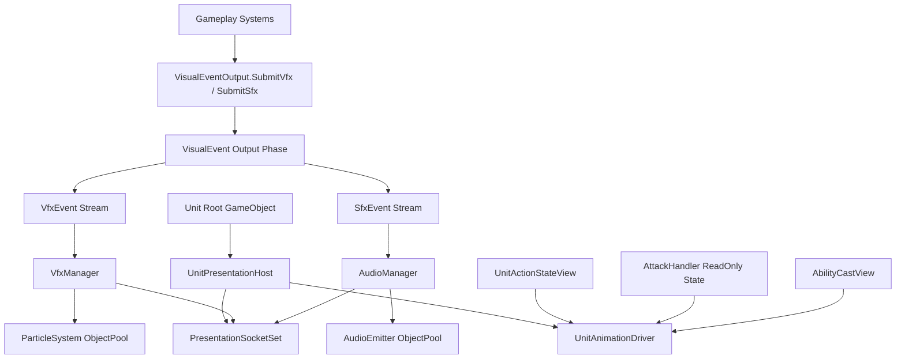
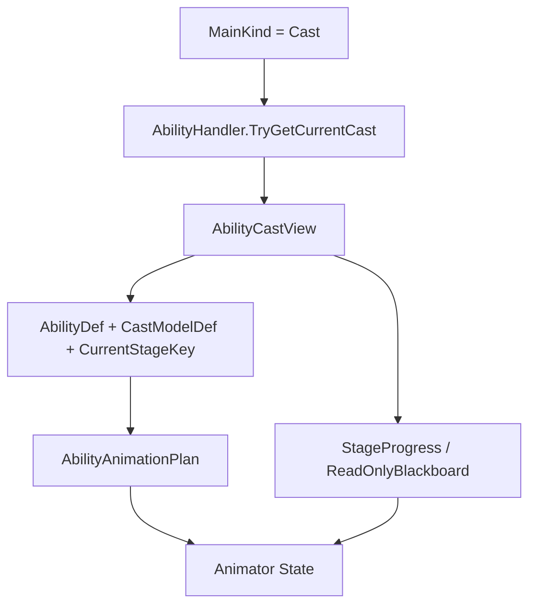
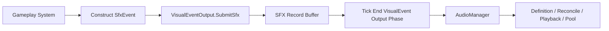
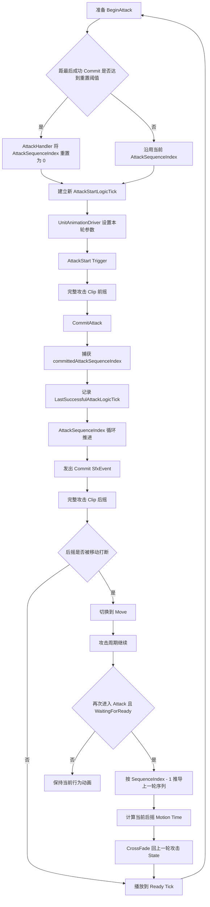
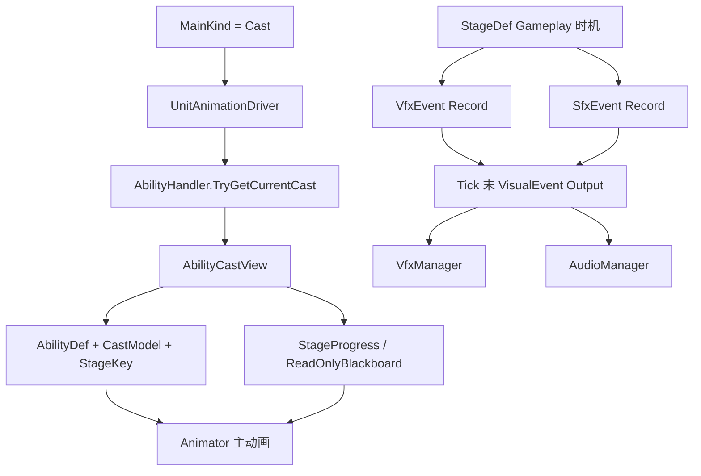

# 帧同步 MOBA 表现层综合系统程序设计案 v13.2

> 本版目标：作为 v13.1 的小版本更新，对齐第五轮修改意见中的 AttackHandler 音频接入契约。
> 核心修正：正式定义现有 `VisualEventOutput.SubmitSfx(in SfxEvent evt)` 作为 Gameplay 系统提交确定性音效记录的统一入口；`AttackHandler` 在 Commit Gameplay 输出成功后构造既有 `SfxEvent` 并调用该入口，不直接调用 `AudioManager` 或 `AudioSource`，也不新增攻击专用 `SfxPort`。Tick 末仍由 `VisualEvent Output Phase` 将独立 SFX 流交给 `AudioManager`，`PresentationEventId` 结构保持不变。

---

# 目录

1. [总体边界与模块结构](#一总体边界与模块结构)
2. [`UnitPresentationHost`：单位表现宿主与注册](#二unitpresentationhost单位表现宿主与注册)
3. [`UnitAnimationDriver`：对齐单位框架 v20 的单位动画驱动](#三unitanimationdriver对齐单位框架-v20-的单位动画驱动)
4. [`VfxManager`：ParticleSystem 特效总管理器](#四vfxmanagerparticlesystem-特效总管理器)
5. [`AudioManager`：音效总管理器](#五audiomanager音效总管理器)
6. [`PresentationSocketSet`：单位语义挂点](#六presentationsocketset单位语义挂点)
7. [`GlobalPrefabTable`：运行时引用边界](#七globalprefabtable运行时引用边界)
8. [`PresentationEventId`：稳定事件身份与回滚适配](#八presentationeventid稳定事件身份与回滚适配)
9. [典型流程](#九典型流程)
10. [当前依赖的最小公开接口与配置约束](#十当前依赖的最小公开接口与配置约束)
11. [最终结论](#十一最终结论)

---

# 一、总体边界与模块结构

## 1.1 表现层负责什么

当前版本只负责三类表现：单位动画、基于 `ParticleSystem` 的特效，以及音效。

暂不纳入 UI、镜头反馈、投掷物表现同步、单位生成回收、`UnitWorld`、物理注册查询和 `PhysicsEntity2D` 内部维护。

表现层只消费单位框架、技能系统、战斗系统和 Buff 系统在确定性时机给出的状态或事件，不反向决定 Gameplay 结果。

---

## 1.2 三个表现模块彼此独立

本设计不设置横跨动画、特效和音效的统一表现管理器。

动画直接读取单位当前状态；Gameplay 系统通过 `VisualEventOutput` 的独立提交函数写入 VFX 或 SFX 纯数据记录，固定 Tick 末再由输出阶段交给各自管理器。



| 模块 | 主要驱动方式 | 实例管理者 | 单位承担的职责 |
|---|---|---|---|
| 动画 | 单位行为状态、攻击只读状态、`AbilityCastView` | 本单位的 `UnitAnimationDriver` | 持有 Animator 和动画配置 |
| VFX | Tick 末输出的独立 `VfxEvent` | 全局 `VfxManager` | 只提供语义挂点 |
| SFX | Tick 末输出的独立 `SfxEvent` | 全局 `AudioManager` | 只提供语义挂点 |
| 挂点 | `PresentationSocketSet` 查询 | 不管理播放实例 | 配置 Transform |

`VisualEventOutput` 只是固定输出阶段的纯数据收集入口，不是统一 Cue 系统，也不拥有跨动画、VFX、SFX 的共同生命周期。其 VFX 与 SFX 函数、缓冲和消费流彼此独立。

VFX 与 SFX 可以来自同一个 Gameplay 行为，但仍然拥有独立的：

- 事件记录；
- 定义 ID；
- 发生 LogicTick；
- 参数；
- 播放策略；
- 回滚账本；
- 对象池。

攻击和技能主动画不通过 VisualEvent 驱动。

## 1.3 与 `PhysicsEntity2D` 的边界

`PhysicsEntity2D` 是参与帧同步实体的确定性空间组件。表现层不重新定义、不注册，也不修改它的 Gameplay 空间规则。

当前项目正式冻结：

```text
参与帧同步的 GameObject 根 Transform
    唯一写入点 = PhysicsEntity2D.LateUpdate
```

职责链：

```text
Gameplay Tick
    -> 移动、寻路、强制位移和物理修正只修改 PhysicsEntity2D 的逻辑姿态

PhysicsEntity2D.LateUpdate
    -> 读取本 Tick 最终逻辑姿态
    -> 同步到实体根 Unity Transform
```

`PhysicsEntity2D.LateUpdate` 在这里属于最终 Presentation Sync 写入阶段，不是新的 Gameplay 位置权威。

禁止其它组件再次写入参与帧同步实体的根 `Transform.position / rotation`，包括：

- `UnitAnimationDriver`；
- `MovementHandler`；
- `UnitLocomotionAgent`；
- 寻路系统；
- AIController；
- VFX / SFX Binder；
- 其它表现同步脚本。

Animator 对骨骼、挂点和模型子节点的正常动画写入不受此限制，但不能通过 Root Motion 改写实体根 Transform。当前帧同步单位默认关闭会影响根逻辑姿态的 Root Motion。

特效或音效需要跟随单位时，管理器通过 `PresentationSocketSet` 获取骨骼或子节点 Transform，不读取或改写 `PhysicsEntity2D` 的逻辑状态。

## 1.4 数据恢复标记

为方便帧同步设计师审查，本文使用三类数据标记。

| 标记 | 含义 | 是否进入 Gameplay 快照树 |
|---|---|---:|
| **帧同步设计关注点** | 会影响回滚后事件生成、事件身份或后续 Gameplay 结果的数据 | 由所属 Gameplay 系统决定 |
| **表现回滚缓存** | 本地客户端为避免重复播放和修正当前画面保存的缓存 | 否 |
| **可重建表现状态** | 可以根据恢复后的 Gameplay 状态和表现事件重新建立的数据 | 否 |

典型归类：

- 技能发射计数、Buff 触发计数、战斗事件序号、逻辑开始与结束 Tick，属于帧同步设计关注点。
- `ExpectedEventSet`、`PlayingEventMap`、`CompletedOneShotSet` 属于表现回滚缓存。
- Animator 当前状态、ParticleSystem 模拟状态、AudioSource 播放位置和对象池空闲列表属于可重建表现状态。

表现层不会自行定义 `GameplaySnapshot` 的结构，只标记上游哪些数据必须能够在回滚后重现相同表现事件。

## 1.5 `SimulationTickContext` 的使用规则

表现层接入 Gameplay LogicTick 时遵循项目统一规则：

```text
需要当前 Tick
    -> 在函数内部读取 SimulationTickContext.Current.Tick

需要执行模式
    -> 在函数内部读取 SimulationTickContext.Current.ExecutionMode
```

禁止：

```text
UnitAnimationDriver.Advance(context)
VfxManager.Reconcile(context)
AudioManager.Consume(event, context)
```

也禁止为了接入统一 Tick 修改上游既有接口。

表现层不缓存第二套 Gameplay 当前 Tick，不增加：

```text
GameplayClock
LogicClock
GlobalCurrentTick
PresentationLogicTick
```

Unity 渲染时间、Animator 过渡时间、ParticleSystem 本地模拟时间和 AudioSource 播放时间可以继续使用，但只能用于本地平滑与播放，不能成为 Gameplay 判断、事件身份或回滚边界的权威。

统一命名：

| 语义 | 命名 |
|---|---|
| 当前 Tick | `SimulationTickContext.Current.Tick` |
| 逻辑发生时刻 | `...LogicTick` |
| 逻辑持续时间 | `...DurationTicks` |
| 已经过 Tick | `...ElapsedTicks` |
| 表现事件序号 | `EventSequence` |
| 快照恢复边界 | `SnapshotTick` |


# 二、`UnitPresentationHost`：单位表现宿主与注册

## 2.1 定位

`UnitPresentationHost` 是单位根 GO 上的轻量表现宿主。

它只负责：

```text
1. 持有本单位 Animator 驱动入口。
2. 持有本单位 PresentationSocketSet。
3. 在启用 / 禁用时向表现层注册表登记。
4. 提供只读查询，不管理特效和音效实例。
```

推荐结构：

```text
UnitPresentationHost : MonoBehaviour
    Unit OwnerUnit
    UnitAnimationDriver AnimationDriver
    PresentationSocketSet SocketSet
```

不再包含：

```text
UnitVfxBinder
UnitAudioEmitter
VfxSockets
AudioSource 管理
ParticleSystem 实例列表
```

原因是：

```text
单位身上的特效源、循环特效、命中特效、音效源都应该由 VfxManager / AudioManager 统一管理。
单位只提供“挂到哪里”的信息，不负责“谁创建、谁停止、谁回收”。
```

---

## 2.2 `UnitPresentationRegistry`

特效和音效总管理器需要根据 `UnitUid` 找到单位表现宿主，但不应依赖 `UnitWorld`。

因此表现层内部可以维护一个只服务表现层的注册表：

```text
UnitPresentationRegistry
    Register(UnitUid, UnitPresentationHost)
    Unregister(UnitUid, UnitPresentationHost)
    TryGetHost(UnitUid, out host)
    TryGetSocket(UnitUid, socketKey, out Transform)
```

注册时机：

```text
UnitPresentationHost.OnEnable
    -> 从 OwnerUnit 读取 UnitUid
    -> Register(UnitUid, this)

UnitPresentationHost.OnDisable
    -> Unregister(UnitUid, this)
    -> 通知 VfxManager / AudioManager：该 OwnerUid 的跟随实例不再有有效宿主
```

注意：`OnDisable` 不是单位死亡逻辑，也不是回收逻辑。它只是表现层知道这个表现宿主不可用了。

---

## 2.3 Host 不做的事

`UnitPresentationHost` 不做：

```text
不播放特效。
不播放音效。
不维护 ParticleSystem 实例。
不维护 AudioSource 实例。
不解析 VFX / SFX 配置。
不读取 PhysicsEntity2D。
不查询 UnitWorld。
不决定单位死亡后如何处理。
```

它的职责应该非常窄：

```text
本单位动画入口 + 本单位挂点入口 + 表现注册。
```

---

# 三、`UnitAnimationDriver`：对齐单位框架 v20 的单位动画驱动

## 3.1 动画状态来源

动画系统只读取当前可恢复的 Gameplay 状态，不通过技能施放事件驱动主动画。

| 来源 | 读取内容 | 动画用途 |
|---|---|---|
| `Unit.LifeState` | `Alive / Dying / Dead / Respawning` | 决定正常行为、死亡和复活表现 |
| `Unit.ActionStateView` | `MainKind / BaseKind` 等 Action 层状态 | 判断 Attack、Cast、Control、Move、Dash |
| `AttackHandler` | `AttackStartLogicTick`、Impact、Ready、Commit、强化与序列状态 | 驱动完整攻击 Clip、恢复剩余后摇和触发新一轮攻击 |
| `AbilityHandler.TryGetCurrentCast()` | 当前只读 `AbilityCastView` | 选择技能 Stage 主动画、进度和技能语义参数 |
| `UnitAnimationProfile` | 本单位 AnimatorController、参数映射和动画绑定 | 把 Gameplay 状态翻译为 Animator 参数与 State |

`AbilityCastEvent` 是技能 Gameplay 结果事件，只供 Buff、装备被动、固定被动等 Gameplay 规则使用。`UnitAnimationDriver` 不订阅、不缓存，也不根据它播放技能动画。

攻击系统和技能系统都不直接操作 Animator。`UnitAnimationDriver` 每次更新读取当前状态，自行设置 Bool、Int、Float、Trigger，并在后摇恢复或回滚时定位到正确 State 与 normalized time。

## 3.2 动画不是全局请求

动画不走：

```text
AnimationManager.Play(unitUid, animKey)
GameplayPresentationPort.PlayAnimation(...)
VisualEvent -> UnitAnimationDriver
AbilityCastEvent -> Animator
```

动画是单位当前 Gameplay 状态的视觉投影。

只有单位本地的 `UnitAnimationDriver` 才知道自己的：

- AnimatorController；
- Animator State；
- Layer；
- Transition；
- BlendTree；
- Motion Time；
- 英雄或单位专属参数。

VFX 与 SFX 可以通过纯数据事件输出，但攻击和技能主动画必须由状态读取驱动。

## 3.3 动画决策优先级

生命周期先于普通行为，但 `Dying` 不代表已经死亡。

| 当前状态 | 处理规则 |
|---|---|
| `LifeState == Dead` | 播放 Death，完成后保持 DeadPose |
| `LifeState == Respawning` | 播放可选 Respawn；未配置时保持复活准备姿势 |
| `LifeState == Dying` | 不切换到 Death，维持当前表现，等待死亡管线确认 |
| `LifeState == Alive` 且 `MainKind == Control` | 播放 Control |
| `LifeState == Alive` 且 `MainKind == Cast` | 查询 `AbilityCastView` 并解析技能动画 |
| `LifeState == Alive` 且 `MainKind == Attack` | 查询攻击只读状态；恢复上一轮剩余后摇或启动新一轮完整攻击 Clip |
| `LifeState == Alive` 且 `BaseKind == Dash / ForcedMove` | 播放位移动画 |
| `LifeState == Alive` 且 `BaseKind == Move` | 播放 Move |
| `LifeState == Alive` 且没有行为 | 播放 Idle |

攻击命令被 Planner 接受后，单位会立即进入 Attack 主行为。即使下一次攻击尚未就绪，表现层也必须提供攻击状态的连续反馈；本版通过恢复上一轮攻击 Clip 当前应处的后摇位置实现，不增加独立的 ReadyWait 或攻击准备动画。

可移动施法或其它上下身分离需求可以使用 Animator Layer 与 AvatarMask，但不会要求单位框架增加表现专用字段。

## 3.4 行为状态与专项只读状态的两级解释

`UnitActionStateView` 只回答单位当前属于哪一种高层行为。攻击和技能的内部动画时间由各自系统已有状态提供，单位框架不复制第二套阶段状态。

技能动画链：

```text
MainKind == Cast
    -> AbilityHandler.TryGetCurrentCast()
    -> AbilityCastView
    -> AbilityAnimationPlan
    -> Animator
```

攻击动画链：

```text
MainKind == Attack
    -> AttackHandler 当前状态
    -> AttackAnimationPlan
    -> Animator
```

攻击状态存在两种需要区别的表现情况：

| 攻击情况 | 判断依据 | 动画处理 |
|---|---|---|
| 上一轮后摇恢复 | `ImpactCommitted == true` 且当前 Tick 尚未到 `NextAttackReadyLogicTick` | 回到上一轮完整攻击 Clip 当前应处的后摇位置 |
| 新一轮攻击开始 | 有效的 `AttackStartLogicTick` 与上一次观察值不同 | 设置本轮参数并触发 `AttackStart` |

`AttackStartLogicTick` 是新攻击边沿。攻击模块 v6.1 已规定同一单位同一 LogicTick 最多正式执行一次 `BeginAttack`，因此不增加额外攻击实例 ID。

如果回滚后 Animator 与 Gameplay 不一致，表现层不依靠重放 Trigger 逐步恢复，而是读取恢复后的攻击或技能状态，直接进入正确 State 和 normalized time。

## 3.5 Unity Animator 与 Inspector 组织

每个英雄使用自己的 AnimatorController。需要独立动画拓扑的其它单位类型也使用自己的 AnimatorController。

当前版本采用单位专属 AnimatorController，不设计共享基础 Controller 后的运行时 Clip 替换，也不在运行时修改 Controller 拓扑。

`UnitAnimationProfile` 保存本单位 Controller 的参数 Hash、攻击绑定、技能绑定、Layer 规则和必要的 State Hash。

### 3.5.1 AnimatorController 的职责

AnimatorController 负责：

- State Machine 与 Sub-State Machine；
- 普通攻击、强化攻击、技能、控制、死亡和复活 State；
- Transition 条件、时长和打断规则；
- BlendTree；
- Animator Layer 与 AvatarMask；
- State Motion Time；
- 英雄或单位专属动画结构；
- 少量纯表现用 `StateMachineBehaviour`。

`UnitAnimationDriver` 负责：

- 读取 Gameplay 只读状态；
- 把状态翻译为 Animator Bool、Int、Float 和 Trigger；
- 检测新的攻击开始 Tick和技能 Stage 变化；
- 在攻击后摇恢复与回滚时精确定位 State；
- 将 `AbilityCastView.ReadOnlyBlackboard` 中已有技能语义映射为 Animator 参数；
- 校验 Animator 是否仍与当前 Gameplay 状态一致。

Animator 不决定攻击 Commit、技能 Stage 推进、强化攻击消费、伤害提交或行为结束。

### 3.5.2 公共 Animator 参数

各英雄 Controller 的基础参数命名必须统一。

| 参数 | 类型 | 作用 |
|---|---|---|
| `IsMoving` | Bool | Locomotion 状态选择 |
| `MoveSpeed` | Float | 移动 BlendTree |
| `IsAttacking` | Bool | 当前是否处于 Attack 主行为 |
| `IsEmpoweredAttack` | Bool | 当前攻击是否使用强化攻击 State |
| `IsAttackRecovering` | Bool | 当前是否正在恢复上一轮后摇 |
| `AttackSequenceIndex` | Int | 当前完整攻击动画对应的普通序列槽位 |
| `AttackMotionTime` | Float | 当前完整攻击 Clip 的 normalized time |
| `AttackStart` | Trigger | 一轮新的正式攻击前摇开始 |
| `IsCasting` | Bool | 当前是否存在可观察的 `AbilityCastView` |
| `AbilityStageProgress` | Float | 当前有限 CastStage 的进度 |
| `LifeState` | Int | 生命周期表现分支 |
| `IsControlled` | Bool | 当前是否处于单位框架确认的控制行为 |

英雄专属技能可以增加自己的参数，例如蓄力比例、剩余发射次数或技能专属阶段值，但必须来自 `AbilityCastView` 及其只读 Blackboard。

### 3.5.3 推荐的单英雄 Controller 结构

```text
Hero AnimatorController
├── Base Layer
│   ├── Locomotion
│   │   ├── Idle
│   │   └── Move BlendTree
│   ├── Attack
│   │   ├── NormalAttack_0
│   │   ├── NormalAttack_1
│   │   └── EmpoweredAttack
│   ├── Ability
│   ├── Control
│   ├── Death
│   └── Respawn
├── Optional UpperBody Layer
└── Optional Additive Layer
```

不同英雄可以拥有完全不同的技能 Sub-State Machine 和 Layer 结构，不要求为了共享 Controller 而保留无意义的占位 State。

### 3.5.4 `AttackAnimationPlan`

| 配置 | 说明 |
|---|---|
| `NormalAttackBindings` | 本英雄普通攻击序列中的 Animator State、Clip 和命中姿势位置 |
| `EmpoweredAttackBinding` | 可选的强化攻击 State、Clip 和命中姿势位置 |
| `EnterCrossFade` | 正常新攻击的默认过渡 |
| `RecoverCrossFade` | 从当前姿势恢复到上一轮后摇的过渡 |
| `AnimatorParameterMap` | 公共参数名或预计算 Hash |

攻击计划不再提供任何改变普通攻击序列推进方式的表现配置。

攻击序列只由 `AttackHandler.AttackSequenceIndex` 决定。任何成功 `CommitAttack` 都按攻击模块 v6.1 的规则循环推进序号；空闲达到全局阈值后，`AttackHandler` 在下一次 `BeginAttack` 前把序列重置为 0。表现层不能维护第二套序列规则或本地重置计时器。

### 3.5.5 `StateMachineBehaviour` 边界

`StateMachineBehaviour` 可以用于：

- 清理纯 Animator 参数；
- 记录 State 进入和退出；
- 开发期校验；
- 通知 `UnitAnimationDriver` 某个表现 Transition 已完成。

它不能提交伤害、消耗被动、修改攻击计时、推进技能 Stage 或改变 Unit 行为。

## 3.6 完整攻击 Clip、序列空闲重置、剩余后摇恢复与强化攻击

### 3.6.1 一次攻击只有一个完整动画

每一种普通攻击或强化攻击都只配置一个完整 `AnimationClip`。Clip 同时包含：

- 攻击前摇；
- Commit 姿势；
- 攻击后摇。

表现层不把攻击拆成独立前摇、等待和后摇 Clip，也不动态创建 AnimationClip。

攻击模块是攻击周期和攻击序列的唯一权威。表现层不读取攻击速度自行重算时间，只读取 `AttackHandler` 已锁定的：

```text
AttackStartLogicTick
ImpactLogicTick
NextAttackReadyLogicTick
ImpactCommitted
IsEmpoweredAttack
AttackSequenceIndex
```

`LastSuccessfulAttackLogicTick` 和 `AttackSequenceResetIntervalTicks` 由攻击模块用于决定下一次 Begin 前是否重置序列，动画层不需要读取它们。

### 3.6.2 新攻击边沿

`AttackStartLogicTick` 表示最近一轮正式 `BeginAttack` 的开始 Tick。

`UnitAnimationDriver` 只缓存：

```text
LastObservedAttackStartLogicTick
```

当以下条件成立时，视为新一轮正式攻击：

```text
MainKind == Attack
AttackStartLogicTick 有效
AttackStartLogicTick != LastObservedAttackStartLogicTick
ImpactCommitted == false
```

动画层随后：

1. 读取攻击模块已经确定的本轮序列；
2. 设置 `IsEmpoweredAttack`；
3. 设置 Animator 的 `AttackSequenceIndex`；
4. 设置 `AttackMotionTime = 0`；
5. 设置 `AttackStart` Trigger；
6. 更新 `LastObservedAttackStartLogicTick`。

Commit 时 `AttackSequenceIndex` 的变化不是新攻击边沿，不能再次触发 `AttackStart`。

### 3.6.3 `AttackSequenceIndex + ImpactCommitted` 的语义

攻击模块 v6.1 规定：

```text
BeginAttack
    AttackSequenceIndex 不递增

CommitAttack Gameplay 输出成功
    先捕获本轮 committedAttackSequenceIndex
    再循环递增 AttackSequenceIndex

CancelBeforeCommit 或 Commit 失败
    AttackSequenceIndex 不变
```

因此当前完整攻击动画使用的原始序列值为：

```text
ImpactCommitted == false
    -> CurrentSequence = AttackSequenceIndex

ImpactCommitted == true
    -> CurrentSequence =
        AttackSequenceIndex == 0
            ? 255
            : AttackSequenceIndex - 1
```

普通攻击实际 State 槽位：

```text
AnimatorSequenceSlot =
    CurrentSequence % NormalAttackBindings.Count
```

`AttackSequenceIndex` 是可回滚的循环攻击动画序号，允许从 255 回到 0。

表现层禁止：

- 自行递增攻击序列；
- 维护本地下一段攻击索引；
- 根据动画播放完成推进序列；
- 自行判断长时间未攻击后是否回到第一段；
- 在强化攻击后自行保持、重置或推进序列。

### 3.6.4 攻击序列空闲重置

攻击动画控制器不维护攻击循环计时器。

攻击模块 v6.1 保存：

```text
LastSuccessfulAttackLogicTick
AttackSequenceIndex
```

并从全局静态数据读取：

```text
GlobalGameplayStaticData.AttackSequenceResetIntervalTicks
```

下一次正式 `BeginAttack` 建立时间轴之前，攻击模块执行惰性检查：

```text
if LastSuccessfulAttackLogicTick 有效
and currentLogicTick - LastSuccessfulAttackLogicTick
    >= AttackSequenceResetIntervalTicks:
    AttackSequenceIndex = 0
```

随后才设置新的 `AttackStartLogicTick` 并建立本轮攻击。

因此：

```text
连续攻击且空闲时间未达到阈值
    -> 下一次沿用当前 AttackSequenceIndex

空闲时间达到阈值
    -> 下一次 BeginAttack 前序列重置为 0
    -> UnitAnimationDriver 观察新 AttackStartLogicTick
    -> 播放 NormalAttack_0
```

表现层不保存上一次攻击动画时间、本地序列重置倒计时或本地重置截止 Tick。

重置判断只以最后一次成功 Commit 为起点。Commit 前取消、Commit 失败、移动、换目标、后摇打断和 `ResetAttackTimer` 都不刷新该时间。

如果新攻击在阈值到达前已经正式 Begin，即使其 Commit 时刻越过阈值，本轮仍使用 Begin 时已经选定的序列。

### 3.6.5 完整 Clip 的分段时间映射

每个普通攻击 Binding 和强化攻击 Binding 分别配置 `ImpactNormalizedTime`，表示 Clip 中 Commit 姿势的位置。

| Gameplay 时间段 | Clip 采样区间 |
|---|---|
| `AttackStartLogicTick → ImpactLogicTick` | `0 → ImpactNormalizedTime` |
| `ImpactLogicTick → NextAttackReadyLogicTick` | `ImpactNormalizedTime → 1` |

`UnitAnimationDriver` 在函数内部读取：

```text
currentLogicTick = SimulationTickContext.Current.Tick
```

并计算 `AttackMotionTime`。

本轮攻击中途发生的攻速变化不重新拉伸当前动画；攻击模块已经锁定 Start、Impact 和 Ready Tick，新的攻速从下一轮攻击开始生效。

### 3.6.6 Commit 前取消

若前摇期间被取消且 `ImpactCommitted == false`：

- 攻击模块将攻击计时恢复为可重新规划；
- `AttackSequenceIndex` 不递增；
- `LastSuccessfulAttackLogicTick` 不刷新；
- 本次攻击动画退出；
- 下一次正式 Begin 仍使用同一个序列，除非届时空闲重置条件成立；
- 表现层不记录“已经消耗一段动画”。

是否允许取消由单位框架和攻击 Runtime 决定。

### 3.6.7 Commit 后打断后摇

Commit 后，移动等行为可以取消当前攻击后摇动画，但：

- `ImpactCommitted` 保持 true；
- `NextAttackReadyLogicTick` 不变化；
- 已提交伤害或投掷物不撤回；
- `LastSuccessfulAttackLogicTick` 已记录本次成功 Commit；
- `AttackSequenceIndex` 已经推进；
- Animator 可以切换到 Move 或其它行为动画。

旧攻击 Clip 不暂停在被打断画面。不可见期间逻辑后摇仍继续推进。

### 3.6.8 `WaitingForReady` 时恢复上一轮后摇

攻击模块在目标仍在范围内但计时未结束时返回：

```text
WaitingForReady
```

Planner 可以重新建立或维持 Attack 主行为，但不能调用新的 `BeginAttack`。

此时沿用上一轮：

```text
AttackStartLogicTick
ImpactLogicTick
NextAttackReadyLogicTick
ImpactCommitted == true
IsEmpoweredAttack
AttackSequenceIndex
```

动画层：

1. 设置 `IsAttacking = true`；
2. 设置 `IsAttackRecovering = true`；
3. 根据 `AttackSequenceIndex - 1` 的循环结果恢复上一轮普通攻击序列；
4. 或根据 `IsEmpoweredAttack` 恢复强化攻击 State；
5. 计算当前逻辑后摇对应的 `AttackMotionTime`；
6. CrossFade 到上一轮攻击 State 的当前 normalized time；
7. 持续推进到 `NextAttackReadyLogicTick`。

恢复旧后摇不设置 `AttackStart` Trigger，也不会触发序列空闲重置。空闲重置只发生在下一次正式 `BeginAttack` 前。

### 3.6.9 强化攻击

强化攻击首期只区分：

```text
普通攻击
强化攻击
```

攻击系统在 `BeginAttack` 时解析并锁定 `IsEmpoweredAttack`。表现层不查询 Buff、装备或英雄被动。

新攻击时：

```text
IsEmpoweredAttack == false
    -> NormalAttack_N

IsEmpoweredAttack == true
    -> EmpoweredAttack
```

强化攻击成功 Commit 后与普通攻击一样推进 `AttackSequenceIndex` 并刷新 `LastSuccessfulAttackLogicTick`。表现层不配置强化攻击对普通序列的特殊处理策略。

### 3.6.10 正常播放、后摇恢复与回滚入口

| 场景 | Animator 入口 |
|---|---|
| 正常新攻击 | 设置参数后触发 `AttackStart`，由 Controller Transition 选择 State |
| 后摇恢复 | 不触发 Trigger，直接 CrossFade 到上一轮 State 当前 Motion Time |
| 回滚校正 | 直接 Play 或 CrossFade 到恢复后的正确 State 与 Motion Time |
| 普通行为切换 | 根据当前单位行为进入 Move、Idle、Control、Cast 等 State |

### 3.6.11 回滚边界

**帧同步设计关注点：**

- `AttackStartLogicTick`；
- `ImpactLogicTick`；
- `NextAttackReadyLogicTick`；
- `ImpactCommitted`；
- `IsEmpoweredAttack`；
- `AttackSequenceIndex`；
- `LastSuccessfulAttackLogicTick`。

这些数据由 `AttackHandlerSnapshot` 恢复。`AttackSequenceResetIntervalTicks` 是全局静态配置，不进入快照。

**表现回滚缓存：**

- `LastObservedAttackStartLogicTick`；
- 当前解析出的 Animator State Hash；
- 当前是否已经执行后摇恢复 CrossFade。

不保存本地普攻轮换索引，也不保存攻击序列空闲计时器。

**可重建表现状态：**

- Animator 当前 State；
- `AttackMotionTime`；
- Trigger 消费状态；
- CrossFade 混合过程。

## 3.7 技能动画：只读取 `AbilityCastView`

### 3.7.1 唯一驱动链

技能代码不调用 Animator。`UnitAnimationDriver` 在：

```text
MainKind == Cast
```

时调用：

```text
AbilityHandler.TryGetCurrentCast()
```

并读取返回的 `AbilityCastView`。



禁止：

```text
监听 AbilityCastEvent 播放技能动画
监听 AbilityStage Event 播放技能动画
GameplayEventQueue -> UnitAnimationDriver
VisualEvent -> UnitAnimationDriver
StageDef 直接调用 Animator
```

### 3.7.2 `StageAnimationBinding`

每个英雄的 `AbilityAnimationPlan` 使用：

```text
AbilityDef
+ CastModelDef
+ CurrentStageKey
```

选择当前 Stage 主动画。

Binding 可以配置：

- Animator State；
- Layer；
- CrossFade；
- Motion Time 或 State Speed 的驱动方式；
- `StageProgress` 映射；
- Blackboard 参数映射；
- Stage 退出后的恢复规则。

技能系统不保存 Animator State、Clip、Layer、速度或 Transition。

### 3.7.3 同一 Stage 内重复动作

`ActiveSignalCastModelDef` 等模型可以在 `CurrentStageKey` 不变化时重复执行技能动作。

表现层仍然只读取 `AbilityCastView`，可以观察 `ReadOnlyBlackboard` 中技能本来就维护的确定性语义，例如：

- `RemainingShots`；
- `FiredShotCount`；
- `RecastCount`；
- 某个英雄专属动作计数；
- 某个需要映射为 Bool、Int、Float 的运行状态。

`UnitAnimationDriver` 将这些值与上一帧的表现缓存比较，再设置英雄 Controller 的技能专属 Trigger 或参数。

这不是监听 Gameplay Event，而是解释当前 `AbilityCastView` 的状态变化。

限制：

- 被观察字段必须本来就属于技能 Gameplay；
- 字段必须能够随 `AbilitySessionSnapshot` 和 Blackboard 恢复；
- 不得为了动画增加 `PlayAnimation`、`ShouldFireAnimation`、`AnimationSequence` 等纯表现字段；
- 回滚后重新读取 View，必要时直接恢复主 Stage 动画，不把本地比较缓存写入 Gameplay 快照。

### 3.7.4 0 Tick Stage

`Duration = 0 Tick` 的 CastStage 通常会在同一次技能更新内进入并离开，表现层不能保证通过轮询 `AbilityCastView` 观察到它。

因此：

| 需求 | 处理 |
|---|---|
| 需要持续播放单位主动画 | 将动画绑定到可观察的非 0 Tick Stage |
| Gameplay 立即生效但需要后摇 | 使用可观察的 Finish Stage |
| 只需要瞬时粒子或音效 | Stage 分别输出 `VfxEvent`、`SfxEvent` |
| 0 Tick Stage 只执行逻辑 | 不要求单位主动画观察它 |

禁止通过监听 `AbilityCastEvent` 补偿 0 Tick Stage 看不到的问题。

### 3.7.5 典型技能

**盲僧 Q1：**可观察 Cast Stage 绑定出拳动画；投掷物在技能确定性时机生成，动画不决定生成 Tick。

**盲僧 Q2：**若 Prepare、Dash、Finish 在 Gameplay 上具有不同时间边界，则自定义 CastModel 暴露对应 StageKey，动画逐段读取 `AbilityCastView`。

**韦鲁斯 Q：**Hold 绑定蓄力循环，Release 绑定释放动作；`ChargeRatio` 从 `ReadOnlyBlackboard` 驱动 Blend 或其它参数。

**泽拉斯 R：**Active 绑定瞄准循环；`RemainingShots` 或 `FiredShotCount` 的确定性变化由 `UnitAnimationDriver` 解释为一次开炮动作，但数据源始终是当前 `AbilityCastView`。

## 3.8 Control 动画

Control 动画以单位框架行为结果为准。

推荐规则：

```text
如果单位框架通过 ControlActionRequest 创建 ControlActionRuntime：
    UnitActionStateView.MainKind == Control
    UnitAnimationDriver 播放 Control 动画

如果单位框架只通过 CapabilityState 限制移动 / 攻击 / 施法，但没有 Control Runtime：
    表现层不能自行猜测并播放 Control 动画
    需要单位框架通过 UnitEventBus 明确发布 Control 行为启动或中断事件
```

第一版所有控制共用同一个 `ControlState`。

动画优先级：

```text
Death > Control > Cast > Attack > Dash / ForcedMove > Move > Idle
```

关于不可打断施法：

```text
是否立即进入 Control 动画，不由表现层判断。
单位框架的 ActionArbiter / Runtime 决定当前 Cast 是否被打断。
如果不可打断，ActionStateView 仍保持 Cast，表现层继续 Cast 动画。
等单位框架切到 Control Runtime，表现层再切 Control 动画。
```

这样可以避免表现层越权判断技能是否可打断。

---

## 3.9 Death 与 Respawn 动画

死亡和复活表现只根据单位框架 v20 的权威 `LifeState` 处理。

| LifeState | 表现行为 |
|---|---|
| `Alive` | 正常读取 Action 状态 |
| `Dying` | 不播放死亡动画，维持当前表现并等待战斗死亡管线完成 |
| `Dead` | 首次进入时播放 Death，结束后保持 DeadPose |
| `Respawning` | 播放可选 Respawn 动画或保持复活准备姿势 |
| `Respawning -> Alive` | 恢复当前正常行为；无行为时进入 Idle |

表现层不判断致死效果能否被挽救，也不负责修改 LifeState、复活单位、回收单位、销毁对象或生成废墟。

死亡动画完成不是 Gameplay 状态转换条件。`UnitWorld` 按自己的生命周期规则处理对象；表现层最多提供调试信息，不能成为权威处置入口。

**帧同步设计关注点：**`Dead` 和 `Respawning` 的开始 LogicTick 会影响回滚后动画进度。如果需要准确恢复，应由单位生命周期状态或相关逻辑时间字段提供，不由表现层写回 Gameplay。

## 3.10 Animation Event 的使用边界

Unity Animation Event 可以用于表现打点，例如：

```text
挥砍音效
武器拖尾开关
脚步声
施法手部粒子
```

但它不能用于 Gameplay：

```text
不能造成伤害。
不能生成 Gameplay 投掷物。
不能判定命中。
不能修改 Buff / Stat / Unit 状态。
```

Animation Event 如果要触发粒子或音效，也不直接实例化对象，而是调用：

```text
VfxManager.SubmitLocalVisualCue(...)
AudioManager.SubmitLocalAudioCue(...)
```

这类本地动画打点表现通常不参与帧同步回滚；如果必须参与回滚，则应由 Gameplay 确定性事件触发，而不是由 Animation Event 触发。

---

# 四、`VfxManager`：`ParticleSystem` 特效总管理器

## 4.1 定位

`VfxManager` 是所有 ParticleSystem 特效实例的全局管理入口。它读取 VFX 配置，解析动态参数和语义挂点，使用 Unity `ObjectPool<T>` 租借与回收实例，并处理回滚后的保留、停止、重建和进度校正。

单位不保存 VFX 实例，只通过 `PresentationSocketSet` 提供挂点。`VfxManager` 不播放动画、不播放音效，也不判断技能命中和单位死亡。

---

## 4.2 `VfxDefinition`

`VfxDefinition` 描述一个特效如何表现，而不是某一次 Gameplay 事件何时发生。

| 配置 | 说明 |
|---|---|
| `VfxDefId` | 稳定表现配置 ID |
| `ParticlePrefabId` | 全局预制体表中的 ParticleSystem 预制体 ID |
| `PlaybackPolicy` | `OneShotNoReplay / DurationCorrectable / LoopState` |
| `DurationResolveMode` | 固定、ParticleSystem 自身、参数化、跟随 Gameplay 状态 |
| `DurationAuthoring` | 固定秒数、最小最大值、插值曲线等表现配置 |
| `DefaultAnchorPolicy` | 世界、来源挂点、目标挂点或根节点 |
| `DefaultSocketKey` | 默认语义挂点 |
| `ParameterBindings` | ChargeRatio、SourceDurationTicks、Intensity 等语义参数如何影响缩放、速度、发射率和持续时间 |
| `PoolConfig` | 预热、容量、扩容和 CollectionCheck |

同一个 ParticleSystem 预制体可以被多个 `VfxDefinition` 复用。对象池按 `ParticlePrefabId` 分池，表现规则按 `VfxDefId` 解析。

---

## 4.3 VFX 持续时间的三种来源

“持续时间归表现配置”表示解析规则归 VFX，而不是所有持续时间都必须写死。

### 固定表现时长

普通命中火花、短暂治疗闪光等特效，可以直接使用固定秒数或 ParticleSystem 自身时长。Gameplay 不传持续时间。

### 参数化表现时长

蓄力、强度或飞行时间会影响特效时，Gameplay 事件提供技能语义参数，例如 `ChargeRatio`、`ChargeTicks`、`SourceDurationTicks` 或 `Intensity`。`VfxDefinition` 决定这些参数如何映射为最终持续时间、缩放、播放速度和发射率。

Gameplay 提供的是逻辑语义，不直接指定 ParticleSystem 必须播放多少秒。

### 跟随 Gameplay 生命周期

Buff 光环、引导、持续区域等特效使用 `LoopState`。只要对应逻辑状态仍存在，特效就保持；状态结束后停止。也可以使用确定性的 Start / End 事件或逻辑过期 Tick。

**帧同步设计关注点：**影响事件重演和生命周期判断的 ChargeTicks、ExpireLogicTick、Buff 实例状态等数据由其 Gameplay 所属系统负责保存。`VfxManager` 解析出的最终秒数属于可重建表现状态。

---

## 4.4 独立 `VfxEvent`

VFX 使用独立事件通道，不与 SFX 合并。Gameplay 侧先生成纯数据记录，并在固定 Tick 末的 `VisualEvent Output Phase` 输出给 `VfxManager`。

一条 `VfxEvent` 至少包含稳定事件身份、`VfxDefId`、开始 LogicTick、来源或目标挂点、世界位置和方向，以及该特效真正需要的少量确定性语义参数。

事件不携带 `PlaybackPolicy`，因为策略由 `VfxDefinition` 决定。事件也不直接携带最终 ParticleSystem 持续秒数、播放速度和缩放；这些由定义根据语义参数解析。

动态参数不使用任意 `object` 字典。首期使用少量稳定值类型字段；英雄专属特效需要更多参数时，使用明确的专用参数结构。

---

## 4.5 Unity `ObjectPool`

`VfxManager` 为每个 `ParticlePrefabId` 维护独立 `ObjectPool<PooledParticleInstance>`。

租借时完成定义解析、挂点绑定、局部变换、ParticleSystem 参数和回滚起始进度设置。回收时必须停止粒子、清理父节点、缩放、局部坐标、事件身份和所有运行时覆盖参数，避免对象池污染下一次播放。

持续特效、单位挂点特效和世界区域特效都由同一个 `VfxManager` 管理，但它们使用各自的播放策略和 Anchor 配置。

# 五、`AudioManager`：音效总管理器

## 5.1 定位

`AudioManager` 是独立于 `VfxManager` 的全局音效管理器。它负责 AudioClip 和 AudioEmitter 配置、2D/3D 声源、一次性音效、循环音效、音频内部序列、Unity 对象池，以及回滚后的去重、恢复和停止。

VFX 与 SFX 可以由同一技能产生，但必须各自决定发生 Tick、定义 ID、动态参数和回滚策略。

---

## 5.2 `SfxDefinition`

| 配置 | 说明 |
|---|---|
| `SfxDefId` | 稳定音效配置 ID |
| `AudioClipId / ClipSet` | 一个或多个音频资源 |
| `AudioEmitterPrefabId` | 可选的全局声源预制体 ID |
| `PlaybackShape` | OneShot、Loop、Charge 或 IntroLoopOutro |
| `PlaybackPolicy` | `OneShotNoReplay / DurationCorrectable / LoopState` |
| `SpatialMode` | 2D 或 3D |
| `DefaultVolume / Pitch` | 默认音频参数 |
| `ParameterBindings` | ChargeRatio、Intensity 等语义参数如何影响音量、音调和片段选择 |
| `PoolConfig` | AudioEmitter 池配置 |

短音头接长循环、循环结束后播放尾音等纯音频编排，可以由 `SfxDefinition` 的 `IntroLoopOutro` 结构处理。它仍然只属于音频模块，不和 VFX 组成统一表现包。

---

## 5.3 独立 `SfxEvent` 与正式提交入口

SFX 使用自己的事件通道和 `PresentationEventId`。Gameplay 系统只构造纯数据 `SfxEvent`，然后调用表现层现有的正式入口：

```csharp
VisualEventOutput.SubmitSfx(in SfxEvent evt);
```

该函数只负责：

```text
1. 校验 SfxEvent 的最小字段。
2. 写入当前 LogicTick 的独立 SFX 记录缓冲。
3. 保持记录原始顺序。
4. 等待 Tick 末 VisualEvent Output Phase。
```

它不负责：

```text
立即播放 AudioSource
查询或租借 AudioEmitter
解析 SfxDefinition
执行回滚去重
修改 Gameplay
给 AttackHandler 返回播放结果
```

固定链路：



`VisualEventOutput` 同时可以提供独立的：

```csharp
VisualEventOutput.SubmitVfx(in VfxEvent evt);
```

但两类函数写入不同缓冲，最终由不同管理器消费；这不构成统一 VFX/SFX Cue 或共同生命周期。

`SfxEvent` 至少包含：

```text
PresentationEventId Id
SfxEventId
PresentationAnchor Anchor
音频真正需要的少量确定性语义参数
```

`SfxEventId` 是稳定音效语义或定义查询 ID。`PresentationEventId` 负责回滚身份与去重。事件不携带 `PlaybackPolicy`，播放策略仍由 `SfxDefinition` 决定。

服务端权威模拟、客户端预测与客户端重演都可以生成相同的纯数据记录。Dedicated Server 使用无 Unity 音频播放的输出消费者或直接丢弃最终本地播放结果，不能要求 `AttackHandler` 依赖客户端 `AudioManager` 实例。

例如某次技能可以在不同 Tick 分别提交启动短音、持续长音开始和持续长音停止；VFX 则通过 `SubmitVfx` 在另一个 Tick 独立提交和结束。音效与特效不共享事件或持续时间。

## 5.4 Unity `ObjectPool`

`AudioManager` 按 `AudioEmitterPrefabId` 维护 `ObjectPool<PooledAudioEmitter>`。

OneShot 播放完成后自动回收；Loop、Charge 和区域环境音根据当前 `LoopState` 启动、维持或停止。归还对象池前必须清理 Clip、Loop、父节点、位置、音量、Pitch、滤镜状态和事件身份。

---

## 5.5 音效回滚边界

已经听到的 OneShot 无法撤销，因此 OneShot 采用不重复播放和有限补播策略。循环和持续音效可以根据当前 Expected 状态恢复、停止或重新定位。

音频事件账本与 VFX 账本完全独立。即使某个 VFX 因回滚重新创建，也不代表对应 OneShot 必须再次播放。

# 六、`PresentationSocketSet`：单位语义挂点

## 6.1 定位

`PresentationSocketSet` 是单位本地的表现挂点表。它只提供 Transform，不管理任何表现实例。

```text
PresentationSocketSet
    SocketBindings
    SocketFallbackRules
    TryGetSocket(socketKey, out Transform)
```

---

## 6.2 语义挂点

不要让特效和音效直接找骨骼名。

使用语义挂点：

```text
Root
Center
Head
Chest
LeftHand
RightHand
Weapon
WeaponTip
FootLeft
FootRight
Ground
Custom01
Custom02
```

不同单位可以把同一个语义挂点绑定到不同骨骼：

```text
Garen:
    Weapon -> sword_root
    WeaponTip -> sword_tip

Annie:
    Weapon -> tibbers_root
    WeaponTip -> hand_r

Minion:
    Weapon -> spear_root
    WeaponTip -> spear_tip
```

---

## 6.3 挂点缺失处理

每个请求可以指定缺失策略：

| 策略 | 说明 |
|---|---|
| `Fallback` | 按 fallback 链寻找替代挂点 |
| `Skip` | 没有挂点就不播放 |
| `UseRoot` | 强制回退到 Root |
| `LogError` | 开发期报错 |

示例 fallback：

```text
WeaponTip -> Weapon -> RightHand -> Chest -> Root
Head      -> Chest -> Center -> Root
Ground    -> Root
```

---

## 6.4 `SocketProfile`

```text
PresentationSocketProfile
    ProfileId
    RequiredSockets
    FallbackRules
```

单位预制体上配置：

```text
PresentationSocketSet
    SocketProfileId
    SocketBindings
```

校验规则：

```text
1. 关键 Socket 缺失时给出编辑器警告。
2. VfxDefinition / SfxDefinition 引用的默认 Socket 必须能 fallback。
3. 同类单位可以复用 SocketProfile，个别单位覆盖 Transform。
```

---

# 七、`GlobalPrefabTable`：运行时引用边界

表现层只引用项目公共的 `GlobalPrefabTable` 运行时契约，不定义第二套 Prefab 表，也不负责该表的 Unity 编辑器实现。

## 7.1 表现层使用的最小运行时语义

表现层只需要能够通过公共 Bake 数据查询：

```text
PrefabId
PrefabKind
UnityPrefab / Runtime Loader Key
GameplayConfigId optional
```

典型用途：

| 消费者 | `PrefabKind` | 用途 |
|---|---|---|
| `VfxManager` | `ParticleVfx` | 查询 ParticleSystem 表现预制体并按 `PrefabId` 分池 |
| `AudioManager` | `AudioEmitter` | 查询 AudioEmitter 预制体并按 `PrefabId` 分池 |
| 单位表现装配 | `Unit` | 读取公共单位 Prefab 契约，不重新定义 Unit Prefab 表 |
| 投掷物表现接入 | `Projectile` | 读取公共投掷物 Prefab 契约，不重新定义 Projectile Prefab 表 |

单位和投掷物的 `PrefabId` 在 Gameplay 中可作为 `RuntimeEntityPrefabId` 参与对应 UID；Particle VFX、AudioEmitter 等普通表现对象不会因此成为 Gameplay 实体。

## 7.2 表现定义与 PrefabId 分离

`VfxDefId` 和 `SfxDefId` 是表现规则 ID，`PrefabId` 是实际资源 ID。

一个 VFX 或 SFX 定义可以引用一个表现 Prefab，并配置自己的挂点、时长、参数映射和播放策略；多个定义也可以复用同一个 Prefab。

对象池按 `PrefabId` 分池，定义表按 `VfxDefId / SfxDefId` 查询。

## 7.3 职责边界

表现层文档不负责：

```text
GlobalPrefabTable Authoring 结构
自定义 Inspector
PrefabKind 分组编辑
ID 范围编辑
PrefabId 自动分配
排序、搜索和批量导入
重复、越界和未分配校验
Required Component 编辑器规则
Bake 生成流程
PrefabId 重新分配和稳定性工具
```

这些属于公共 Prefab 资源基础设施与帧同步总控约束。

`UnitAnimationDriver`、`VfxManager`、`AudioManager` 和 `UnitPresentationHost` 都只是公共 Bake 数据的消费者，不拥有或维护 `GlobalPrefabTable`。

`PrefabId` 不进入 `PresentationEventId`。同一个逻辑事件即使解析为不同的本地表现资源，其事件身份仍保持不变。

# 八、`PresentationEventId`：稳定事件身份与回滚适配

## 8.1 通用稳定事件身份

VFX 与 SFX 使用彼此独立的事件通道，但复用同一种稳定事件身份结构：

```text
PresentationEventId
    SourceLogicTick
    SourceKind
    SourceRuntimeUid
    EventSequence
    EventKey
```

字段语义：

| 字段 | 说明 |
|---|---|
| `SourceLogicTick` | 产生该表现事件的 Gameplay LogicTick |
| `SourceKind` | 当前来源类型：Unit 或 Projectile |
| `SourceRuntimeUid` | `UnitUid` 或 `ProjectileUid` 的公共稳定原始值 |
| `EventSequence` | 事件生产系统提供的确定性序列 |
| `EventKey` | 稳定语义事件 ID，例如 `CommitSfxEventId` |

当前版本只支持：

```text
SourceKind.Unit
SourceKind.Projectile
```

对应关系：

| `SourceKind` | `SourceRuntimeUid` |
|---|---|
| `Unit` | `UnitUid` |
| `Projectile` | `ProjectileUid` |

不提前扩展 World、System 或其它复合来源。未来确有业务来源时，再扩展 `SourceKind`。

相同逻辑事件在回滚重演后必须生成相同 ID。实现上使用紧凑只读结构作为字典 Key，并比较完整字段，不只依赖哈希。

`PlaybackPolicy` 属于 `VfxDefinition / SfxDefinition`，不进入 `PresentationEventId`。

## 8.2 `EventSequence` 的权威来源

`EventSequence` 不能由 `VfxManager` 或 `AudioManager` 在客户端本地递增。

它由产生表现事件的 Gameplay 系统确定性提供。每个生产系统自行冻结：

```text
序列作用域
数据类型
何时重置
溢出行为
```

表现层不统一要求序列固定采用某种类型或生命周期。

不同生产系统可以采用不同规则，例如投掷物表现事件可以使用投掷物自身的 Tick 内序列，战斗表现事件可以使用战斗系统的稳定请求或结果序列。

攻击 Commit 音效是明确的特殊映射：

```text
EventSequence = committedAttackSequenceIndex
EventKey = CommitSfxEventId
```

其中 `committedAttackSequenceIndex` 是 `CommitAttack` 成功输出 Gameplay 前后流程中，递增 `AttackSequenceIndex` 之前捕获的本轮攻击序列。

因此攻击模块不再分配第二套表现序列。构造完整 `SfxEvent` 后调用 `VisualEventOutput.SubmitSfx(in evt)`；这里复用的是攻击模块已经冻结的确定性本轮攻击序列，不代表所有攻击相关表现事件都必须使用 `AttackSequenceIndex`。

**帧同步设计关注点：**只要某个序列参与 `PresentationEventId`，其生产系统就必须保证相同快照、输入和配置重演后得到相同值。

## 8.3 三种回滚播放策略

播放策略配置在 `VfxDefinition` 或 `SfxDefinition` 中，而不是由单次事件临时决定。

| 策略 | 典型对象 | 回滚后的规则 |
|---|---|---|
| `OneShotNoReplay` | 短音效、瞬时闪光、一次爆点 | 已完成则不重复；未播放且仍在补播窗口内可以补播 |
| `DurationCorrectable` | 有限爆炸、冲击波、残留粒子、可定位的持续音效 | 当前时刻仍应存在时重建并快进；已结束则不创建 |
| `LoopState` | Buff 光环、引导、区域循环粒子和循环音效 | 根据当前逻辑状态保证存在或停止，不关心历史是否完成 |

`LoopState` 不进入 Completed OneShot 集合。`DurationCorrectable` 即使以前已经播放完，只要回滚后的当前时间重新落入有效区间，仍允许重建。

---

## 8.4 各管理器独立账本

`VfxManager` 与 `AudioManager` 各自维护：

| 记录 | 作用 |
|---|---|
| `ExpectedEventSet` | 当前重演结果中应该存在或应该发生的事件 |
| `PlayingEventMap` | 当前正在播放的实例及解析后运行信息 |
| `CompletedOneShotSet` | 已经完成且不应因回滚重复播放的 OneShot |

两套管理器的集合不共享。一个 VFX 是否重建不会直接改变 SFX 的 OneShot 去重结果。

这些集合属于**表现回滚缓存**，不进入 `GameplaySnapshot`。

---

## 8.5 回滚对账流程

项目快照语义为：

```text
SnapshotTick
    = 恢复该快照后下一次应该执行的 Gameplay Tick
```

当 Gameplay 恢复到 `SnapshotTick` 时，表现层执行：

1. 失效或删除 `SourceLogicTick >= SnapshotTick` 的 Expected 记录。
2. 从 `SnapshotTick` 开始随 Gameplay 重演重新收集 VFX 与 SFX 事件。
3. 分别比较新的 Expected 集合与当前 Playing 集合。
4. 按定义中的播放策略保留、停止、补播或重建实例。
5. 修正挂点、世界位置和持续进度。
6. 清理早于最旧可回滚 Tick 的完成记录。

### `OneShotNoReplay`

已存在于 Completed 集合时不再播放。重演后首次出现且没有超过定义允许的补播窗口时可以补播。已经听到的声音无法撤销；已播放的瞬时 VFX 只做停止或淡出，不反向修改 Gameplay。

### `DurationCorrectable`

使用：

```text
currentLogicTick = SimulationTickContext.Current.Tick
eventAgeTicks = currentLogicTick - SourceLogicTick
```

再由 Definition 解析最终表现持续时间。当前仍在有效区间时，从对象池重建并快进。

### `LoopState`

根据恢复后的当前 Gameplay 状态或确定性的 Begin / End 输出重新建立 Expected 状态。Expected 有则保证实例存在，Expected 无则停止并回收。

## 8.6 快照与重建边界

### 帧同步设计关注点

以下数据由其 Gameplay 所属系统审查：

- 参与 `PresentationEventId.EventSequence` 的确定性序列；
- 各生产系统自己的序列作用域、类型、重置和溢出规则；
- 攻击模块的 Start、Impact、Ready、Commit、强化和攻击序列状态；
- 技能 Blackboard 中影响未来技能运行的计数、蓄力和阶段状态；
- Buff 实例的开始、结束和周期状态；
- 战斗事件序号；
- 持续区域或逻辑效果的 Start / Expire LogicTick；
- 会影响 VFX 或 SFX 动态参数的确定性语义值。

### 表现回滚缓存

以下数据只存在于客户端表现层：

- VFX 与 SFX 各自的 Expected、Playing、Completed 记录；
- 已解析的 Definition、挂点和表现年龄；
- `LastObservedAttackStartLogicTick`；
- 技能动画对上一帧 `AbilityCastView` 语义值的比较缓存；
- Animator State Hash 和本地过渡标记。

不包含表现层私有攻击序列计数，也不包含本地生成的表现事件序列。

### 可重建表现状态

以下内容不进入 Gameplay 快照：

- Animator 当前 State 和 normalized time；
- Animator Trigger 消费状态和 CrossFade 过程；
- ParticleSystem 内部粒子；
- AudioSource 当前采样位置；
- Unity ObjectPool 的空闲列表；
- 已租借实例的 Unity 引用关系。

回滚后根据当前 Gameplay 状态、稳定 VFX/SFX 事件和表现配置重新建立。

# 九、典型流程

## 9.1 攻击序列空闲重置、后摇恢复与新攻击流程



关键规则：

- 序列空闲重置属于 `AttackHandler.BeginAttack` 前的惰性 Gameplay 判断。
- `UnitAnimationDriver` 不维护攻击循环计时器。
- 新攻击边沿只看有效且发生变化的 `AttackStartLogicTick`。
- Commit 时 `AttackSequenceIndex` 的递增不是新攻击。
- Commit 前取消不推进序列，也不刷新 `LastSuccessfulAttackLogicTick`。
- 后摇恢复不触发 `AttackStart`，也不执行空闲重置。
- 强化攻击与普通攻击成功 Commit 后都推进同一个攻击序列。

## 9.2 多阶段技能流程



技能主动画只读取 `AbilityCastView`。

同一 Stage 内重复动作通过 `ReadOnlyBlackboard` 中技能已有的确定性状态变化映射为 Animator 参数或 Trigger，不监听 `AbilityCastEvent`。

VFX 和 SFX 由 Stage 在各自正确的 Gameplay 时机生成独立记录，并在 Tick 末分别输出。

## 9.3 动态蓄力表现

例如一个蓄力技能：

- Hold Stage 的主动画通过 `ChargeRatio` 驱动 Blend。
- 蓄力音效可以在 Focus 成功的 Tick 发出独立 Loop `SfxEvent`。
- 释放短音可以在 Commit 成功的 Tick 单独发出。
- 释放 VFX 可以在投掷物生成或释放 Stage 的确定性 Tick 发出。
- `VfxDefinition` 和 `SfxDefinition` 分别使用 `ChargeRatio / ChargeTicks` 解析缩放、音调和表现持续时间。

这些事件彼此独立，不需要组成统一 cue。

---

## 9.4 Buff 持续特效与音效

Buff 的确定性运行状态决定 LoopState 是否存在。VFX 和 SFX 可以分别选择是否配置：

- Buff 创建后建立持续 VFX；
- Buff 创建后建立循环 SFX；
- Buff 刷新时只更新参数，不重新创建；
- Buff 结束或回滚后不存在时，各管理器分别停止并回收。

单位本身不保存实例。

---

## 9.5 Control 动画流程

控制系统和单位框架决定当前 Action 是否被打断以及是否进入 `ControlActionRuntime`。只有当 `ActionStateView.MainKind == Control` 时，表现层才播放 Control 动画。

表现层不自行判断控制能否打断当前技能。

---

## 9.6 死亡与复活表现流程

`Dying` 期间不播放死亡动画。战斗死亡管线确认后，单位进入 `Dead`，`UnitAnimationDriver` 才开始 Death，并在结束后保持 DeadPose。

英雄进入 `Respawning` 后播放可选 Respawn 表现；当单位框架完成复活初始化并切回 `Alive` 时，动画恢复当前行为或 Idle。

死亡 VFX 和 SFX 使用各自独立事件；它们的发生 Tick、播放策略和持续时间分别配置。

# 十、当前依赖的最小公开接口与配置约束

## 10.1 单位框架 v20 侧

表现层读取：

- `Unit.LifeState`；
- `Unit.ActionStateView`；
- `Unit.AbilityHandler.TryGetCurrentCast()`；
- `Unit.AttackHandler` 当前只读状态；
- `UnitPresentationHost / PresentationSocketSet`。

生命周期按 `Alive / Dying / Dead / Respawning` 解释。`Dying` 不触发死亡动画。

`AbilityCastEvent` 属于 Gameplay 事件，不是动画接口。表现层不得通过事件监听播放技能动画。

## 10.2 技能系统 v14 侧

技能动画唯一依赖 `AbilityCastView`：

| 字段 | 用途 |
|---|---|
| `AbilityDef` | 定位本英雄的 `AbilityAnimationPlan` |
| `CastModel` | 区分施法模型 |
| `CurrentStageKey` | 定位模型位置 |
| `CurrentCastStage / CurrentStage` | 校验当前 Stage 配置 |
| `StageElapsedTicks / StageRemainingTicks` | 循环和过渡 |
| `StageProgress` | 有限 Stage 的 Motion Time 或其它进度参数 |
| `ReadOnlyBlackboard` | 蓄力比例、剩余次数和技能专属确定性语义 |

表现层不能：

- 修改 Blackboard；
- 强制切换 Stage；
- 调用 Stage 生命周期；
- 根据动画结束推进技能；
- 监听 `AbilityCastEvent` 或其它技能事件播放动画；
- 为动画要求技能系统增加纯表现字段。

同一 Stage 内的重复动作只允许解释 `AbilityCastView.ReadOnlyBlackboard` 中本来就存在且可恢复的 Gameplay 语义。

## 10.3 攻击系统 v6.1 侧最小接缝

表现层直接读取 `AttackHandler` 已有状态：

| 字段 | 用途 |
|---|---|
| `AttackStartLogicTick` | 判断是否正式开始新一轮攻击，并计算前摇进度 |
| `ImpactLogicTick` | 对齐 Clip 的 `ImpactNormalizedTime` |
| `NextAttackReadyLogicTick` | 计算后摇进度与恢复位置 |
| `ImpactCommitted` | 判断使用当前序号还是循环减一后的上一轮序号 |
| `IsEmpoweredAttack` | 选择普通或强化攻击 State |
| `AttackSequenceIndex` | 确定性选择普通攻击动画序列 |

攻击模块另外维护：

```text
LastSuccessfulAttackLogicTick
GlobalGameplayStaticData.AttackSequenceResetIntervalTicks
```

它们用于在下一次 `BeginAttack` 前惰性决定是否把 `AttackSequenceIndex` 重置为 0。`UnitAnimationDriver` 不读取这两个值，也不维护本地重置计时器；它只在新的 `AttackStartLogicTick` 出现后读取已经确定的序列结果。

当前动画序列推导：

```text
ImpactCommitted == false
    -> CurrentSequence = AttackSequenceIndex

ImpactCommitted == true
    -> CurrentSequence =
        AttackSequenceIndex == 0
            ? 255
            : AttackSequenceIndex - 1
```

普通攻击 State 槽位：

```text
CurrentSequence % NormalAttackBindings.Count
```

接口边界：

- `AttackHandler` 不调用 `UnitAnimationDriver`；
- `AttackHandler` 不设置 Animator 参数；
- `UnitAnimationDriver` 不读取 Buff 判断强化攻击；
- 表现层不维护本地攻击序列或序列重置计时器；
- 攻击系统不根据动画结束修改计时；
- Animation Event 不提交攻击效果；
- 所有当前 Tick 查询在函数内部读取 `SimulationTickContext.Current.Tick`。

## 10.4 VFX 与 SFX 事件接口

Gameplay 系统通过表现层现有输出入口提交两类独立纯数据记录：

```csharp
VisualEventOutput.SubmitVfx(in VfxEvent evt);
VisualEventOutput.SubmitSfx(in SfxEvent evt);
```

| 记录 | Tick 末消费者 |
|---|---|
| `VfxEvent` | `VfxManager` |
| `SfxEvent` | `AudioManager` |

固定流程：

```text
Gameplay 系统构造确定性记录
    -> VisualEventOutput.SubmitVfx / SubmitSfx
    -> 当前 Tick 对应的独立记录缓冲
    -> Tick 末 VisualEvent Output Phase
    -> VfxManager / AudioManager 分别消费
```

`VisualEventOutput` 不实例化 Unity 对象，不解析定义，也不执行播放。它只是当前表现架构已有的纯数据输出接缝，不是新增的攻击专用音频端口。

攻击 Commit 音效采用攻击模块 v6.1 的固定映射：

```text
CommitAttack Gameplay 输出成功
    -> committedAttackSequenceIndex = Commit 前捕获的 AttackSequenceIndex
    -> commitSfxEventId = ResolveCommitSfxEventId()

若 commitSfxEventId != 0：
    evt = SfxEvent
        SfxEventId = commitSfxEventId
        Id.SourceLogicTick = SimulationTickContext.Current.Tick
        Id.SourceKind = Unit
        Id.SourceRuntimeUid = Owner.UnitUid
        Id.EventSequence = committedAttackSequenceIndex
        Id.EventKey = commitSfxEventId
        Anchor = CommitSfxAnchor

    VisualEventOutput.SubmitSfx(in evt)
```

该音效只在 Gameplay 输出成功后提交一次。

禁止：

```text
AttackHandler 直接调用 AudioManager
AttackHandler 直接调用 AudioSource.Play
AttackHandler 绕过 PresentationEventId
AttackHandler 新建攻击专用 SfxPort
AttackHandler 根据实际是否听到声音改变 Commit 结果
```

`AudioManager` 负责预测播放、回滚去重、`OneShotNoReplay`、定义解析、挂点、Pitch、音量和对象池。提交函数没有“播放成功”返回值，不反向影响 Gameplay。

投掷物来源的 VFX / SFX 使用：

```text
SourceKind = Projectile
SourceRuntimeUid = ProjectileUid
```

VisualEvent 输出阶段不向 `UnitAnimationDriver` 发送攻击或技能主动画事件。

## 10.5 公共 `GlobalPrefabTable` 运行时接缝

表现层只依赖公共运行时契约。当前 `PrefabKind` 由代码固定：

```csharp
public enum PrefabKind
{
    Unit,
    Projectile,
    ParticleVfx,
    AudioEmitter,
    Misc
}
```

运行时最小字段：

```text
PrefabId
PrefabKind
UnityPrefab / Runtime Loader Key
GameplayConfigId optional
```

表现层消费关系：

```text
VfxManager
    -> PrefabKind.ParticleVfx

AudioManager
    -> PrefabKind.AudioEmitter
```

表现层不设计 `GlobalPrefabTable` 的 Authoring、Inspector、ID 自动分配、Bake 和编辑器校验，也不允许通过表现层扩展或修改核心 `PrefabKind` 语义。

单位、投掷物与表现对象使用同一公共 Prefab 契约，但各自只读取与自身固定 `PrefabKind` 相关的数据。

`PrefabId` 不进入 `PresentationEventId`。同一个逻辑事件可以解析为不同的本地表现资源，但事件身份保持不变。

当前版本的动画资源直接属于单位自己的 AnimatorController。

## 10.6 帧同步审查清单

1. VFX / SFX 事件生产者能否在回滚后生成相同的 `PresentationEventId`。
2. 每个参与 `EventSequence` 的生产系统是否明确自己的序列作用域、类型、重置和溢出规则。
3. Gameplay 系统是否通过 `VisualEventOutput.SubmitVfx / SubmitSfx` 提交纯数据记录。
4. `VisualEventOutput` 是否只收集记录，没有实例化、定义解析或立即播放职责。
5. 攻击 Commit 音效是否使用 Commit 前捕获的 `committedAttackSequenceIndex`，没有第二套表现序列。
6. `AttackHandler` 是否没有直接调用 `AudioManager`、`AudioSource` 或攻击专用 `SfxPort`。
7. 当前表现来源是否只使用 Unit 或 Projectile，并写入正确的 `SourceKind + SourceRuntimeUid`。
8. 动态持续时间使用的 ChargeTicks、ExpireTick、Buff 状态等是否可恢复。
9. 技能动画依赖的 Blackboard 字段是否本来就是可恢复 Gameplay 状态。
10. 技能动画是否完全通过 `AbilityCastView` 驱动，没有 AbilityCast 事件监听后门。
11. `AttackStartLogicTick`、Impact、Ready、Commit、强化、`AttackSequenceIndex` 和 `LastSuccessfulAttackLogicTick` 是否随 AttackHandler 快照恢复。
12. 攻击序列空闲重置是否只由 `AttackHandler` 在下一次 Begin 前执行。
13. 表现层是否没有自己的攻击序列计数或攻击循环计时器。
14. `SnapshotTick` 是否按“恢复后下一次执行 Tick”处理，并从该 Tick 开始重演表现事件。
15. Expected、Playing、Completed 和 Animator 本地缓存是否排除在 GameplaySnapshot 之外。
16. Animator、Trigger、Motion Time、CrossFade、ParticleSystem、AudioSource 和对象池是否作为可重建表现状态。
17. 所有需要当前逻辑 Tick 的函数是否直接读取 `SimulationTickContext.Current`，没有修改接口传递 Context。
18. 参与帧同步实体的根 Unity Transform 是否只有 `PhysicsEntity2D.LateUpdate` 一个写入点。
19. Animator Root Motion 是否不会改写参与帧同步实体的根逻辑姿态。
20. 每个英雄或单位类型是否直接使用自己的 AnimatorController。
21. 表现层是否只引用代码固定的公共 `PrefabKind` 和 `GlobalPrefabTable` 运行时契约。

# 十一、最终结论

v13.2 在 v13.1 基础上落实第五轮音频接缝收口后，最终规则如下：

1. 单位动画、VFX、SFX 仍是三个独立模块，不建立统一表现总管理器。
2. 攻击和技能主动画由单位当前状态读取驱动，不经过 VisualEvent。
3. Gameplay 系统通过 `VisualEventOutput.SubmitVfx / SubmitSfx` 提交独立纯数据表现记录。
4. `VisualEventOutput` 只负责当前 Tick 的记录收集和 Tick 末输出，不实例化 Unity 对象、不解析 Definition、不直接播放。
5. Tick 末由 `VfxManager` 和 `AudioManager` 分别消费自己的独立事件流。
6. 参与帧同步的 GameObject 根 Unity Transform 唯一写入点是 `PhysicsEntity2D.LateUpdate`。
7. Gameplay Tick 只修改确定性逻辑姿态；其它组件不得重复写实体根 Transform。
8. 一次普通或强化攻击只使用一个同时包含前摇和后摇的完整 AnimationClip。
9. `AttackHandler` 是攻击 Start、Impact、Ready、Commit、强化状态与攻击序列的唯一权威。
10. `UnitAnimationDriver` 不维护本地攻击序列或攻击循环计时器。
11. `AttackHandler` 使用 `LastSuccessfulAttackLogicTick` 和全局阈值，在下一次 `BeginAttack` 前惰性重置序列。
12. 技能动画唯一数据源是 `AbilityCastView`，禁止通过技能 Gameplay 事件驱动主动画。
13. 每个英雄或需要独立动画拓扑的单位类型使用自己的 AnimatorController。
14. `PresentationEventId` 保持 `SourceLogicTick + SourceKind + SourceRuntimeUid + EventSequence + EventKey`。
15. 当前 `SourceKind` 只支持 Unit 与 Projectile。
16. 攻击 Commit 音效在 Gameplay 输出成功后构造既有 `SfxEvent`。
17. 攻击 Commit 音效的 `EventSequence` 复用 Commit 前捕获的攻击序列，`EventKey` 使用 `CommitSfxEventId`。
18. `AttackHandler` 调用 `VisualEventOutput.SubmitSfx(in evt)`，不直接调用 `AudioManager` 或 `AudioSource`。
19. 不新增攻击专用 `SfxPort`，也不建立第二套音频事件身份。
20. SFX 提交没有播放成功返回值，音频播放结果不反向影响 Gameplay Commit。
21. `PlaybackPolicy` 继续属于 VFX/SFX Definition，不进入事件身份。
22. `SnapshotTick` 表示恢复后下一次执行的 Tick；表现事件从该 Tick 开始重新收集。
23. 所有函数需要当前逻辑 Tick 时直接读取 `SimulationTickContext.Current`，不传递 Context、不维护第二套 Gameplay 时钟。
24. Animator、ParticleSystem、AudioSource、对象池和表现账本均属于表现缓存或可重建状态，不进入 GameplaySnapshot。
25. 公共 `PrefabKind` 由代码固定，表现层只消费公共 `GlobalPrefabTable` 运行时数据。

