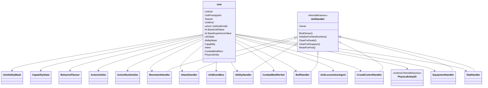
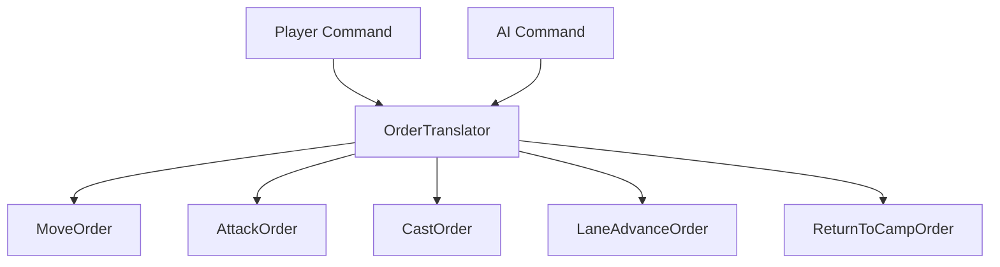
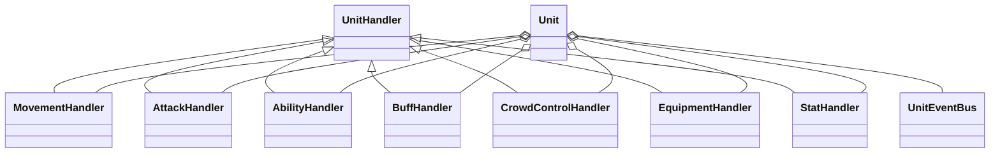
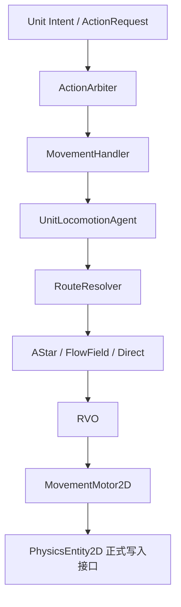
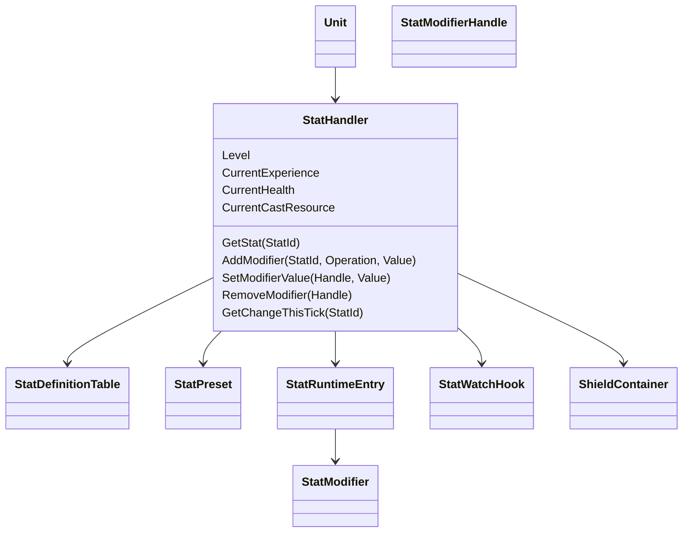
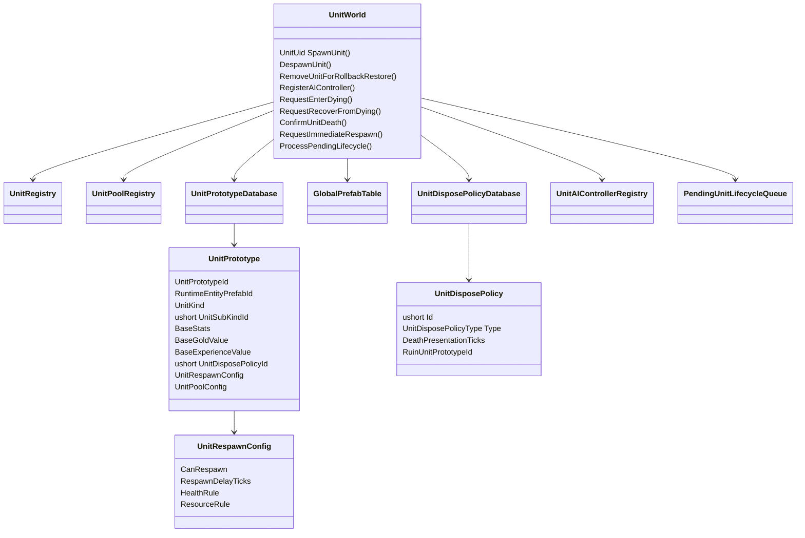

# MOBA 单位行为框架设计案 v27.3

> v27.3 是 v27.2 的第五轮编码前接口收口版。  
> 本版不改变既有总体架构，只冻结单位生命周期正式 API 名称、补齐死亡与复活阶段的固定 Handler 调用顺序，并清理 `UnitEventBus` 中调用不存在方法的示例。  
> `UnitWorld.RequestEnterDying`、`UnitWorld.RequestRecoverFromDying`、`UnitWorld.ConfirmUnitDeath` 成为全项目统一名称，不再保留“实现阶段可改名”的表述。  
> 死亡与复活使用同一组 Handler、同一稳定顺序调用 `ClearForDeath / ClearForRespawn`；跨死亡保留的 Runtime 只在复活阶段重建明确标记为“当前生命阶段”的 Handle，永久 Handle 不重复挂载。  
> v27.2 已冻结的 `CombatModifierRecord.Id` 规则、同步生成、非死亡清场、AIController 唯一映射、完整数值快照和主动生效门槛保持不变。

---

# 目录

1. [专题一：Unit 单位根对象](#专题一unit-单位根对象)
2. [专题二：输入翻译层与 Order](#专题二输入翻译层与-order)
3. [专题三：单位行为链路总设计：Intent、BehaviorPlanner、ActionArbiter、Reservation 与 Runtime](#专题三单位行为链路总设计intentbehaviorplanneractionarbiterreservation-与-runtime)
4. [专题四：Handler 架构、能力装配与移动边界](#专题四handler-架构能力装配与移动边界)
5. [专题五：数值系统 StatHandler](#专题五数值系统-stathandler)
6. [专题六：单位内部事件中心 UnitEventBus](#专题六单位内部事件中心-uniteventbus)
7. [专题七：UnitWorld、生成、死亡处理与多单位对象池](#专题七unitworld生成死亡处理与多单位对象池)
8. [专题八：全局参数表与静态配置](#专题八全局参数表与静态配置)
9. [专题九：单位框架主流程与系统接缝](#专题九单位框架主流程与系统接缝)

---
# 专题一：Unit 单位根对象

## 1.1 定位

`Unit` 是单位行为、战斗语义、运行时身份和生命周期状态的根对象。

它负责：

| 内容 | 说明 |
|---|---|
| 运行时身份 | `UnitUid`、`TeamId` |
| 静态身份引用 | `UnitPrototypeId`、`UnitKind`、`UnitSubKindId` |
| 击杀收益基准 | `BaseGoldValue`、`BaseExperienceValue` |
| 存活状态 | `LifeState` |
| 能力装配结果 | 由 `HandlerLoadout` 推导出的 `UnitAbilityMask` |
| 当前能力 | `CapabilityState` |
| 当前意图 | `UnitIntent` |
| 行为规划 | `BehaviorPlanner` |
| 行为仲裁 | `ActionArbiter` |
| 行为运行 | `ActionRuntimeSet` |
| 数值容器 | `StatHandler` |
| 战斗公式修正 | `CombatModifierSet` |
| 单位事件 | `UnitEventBus` |
| 移动执行引用 | `UnitLocomotionAgent` |
| 空间状态组件引用 | `PhysicsEntity2D` |

`Unit` 不负责实际寻路、RVO、空间网格、墙体挤出、碰撞求解和范围查询算法。  
`Unit` 也不负责直接修改自己的生命周期状态，或决定死亡后是复活、回收、销毁还是生成废墟；这些统一交给 `UnitWorld`。

本版需要特别明确：

```text
Unit 是单位身份、分类和玩法运行状态的核心拥有者。
LifeState 保存在 Unit 上，但正式写权限归 UnitWorld。
PhysicsEntity2D 是空间状态组件，不是单位身份中心。
```

也就是说：

```text
Unit.UnitUid 是权威身份。
Unit.TeamId 是权威阵营。
Unit.UnitKind / Unit.UnitSubKindId 是权威单位分类。
Unit.LifeState 是生命周期状态的权威存储；状态转换由 UnitWorld 权威应用。

PhysicsEntity2D 是物理系统提供的权威空间状态组件。
单位框架只持有引用并调用物理系统正式接口；查询镜像字段和内部空间结构由物理系统设计案定义。
```

> **帧同步设计关注点**  
> `Unit` 聚合了会影响后续逻辑 Tick 的运行时状态。具体哪些字段进入快照、如何恢复 Handler 引用和运行状态，由帧同步设计案统一决定；单位框架不在此定义 `UnitSnapshot`。

## 1.2 Unit 核心属性

| 属性 | 说明 |
|---|---|
| `UnitUid` | 帧同步运行时唯一 ID，由 `SpawnLogicTick + RuntimeEntityPrefabId + SpawnSequenceInTick` 组成 |
| `UnitPrototypeId` | 单位 Gameplay 原型编号，来自 `GlobalUnitPrototypeTable` |
| `TeamId` | 阵营，单位侧权威数据 |
| `UnitKind` | 单位稳定大类 |
| `UnitSubKindId` | `UnitKind` 下的主要子分类，直接使用 `ushort` |
| `BaseGoldValue` | 本单位被击杀时，击杀者金币收益的静态基准值 |
| `BaseExperienceValue` | 本单位被击杀时，击杀者经验收益的静态基准值 |
| `LifeState` | `Alive / Dying / Dead / Respawning` |
| `AbilityMask` | 根据是否装配对应 Handler 自动推导 |
| `Capability` | 当前是否允许启动对应行为 |
| `Intent` | 当前长期行为意图 |
| `Handlers` | 移动、攻击、技能、Buff、群体控制、装备等能力模块 |
| `Stats` | 数值系统入口 |
| `CombatModifiers` | 当前有效战斗公式修正的统一挂载与查询容器 |
| `EventBus` | 单位内部强类型结果事件路由器 |
| `Locomotion` | 移动执行代理引用 |
| `PhysicsEntity` | 单位当前空间状态组件引用 |

v27.1 不保留第二套 `UnitId`。  
跨系统身份统一使用 `UnitUid`；`UnitRegistry` 如果需要数组槽位或紧凑索引，可以维护内部 `RegistryIndex`，但它不是单位身份，也不能对外替代 `UnitUid`。

v27.1 也不恢复运行时 `UnitTags`。  
稳定大类由 `UnitKind` 表达，所属大类下的主要分类由 `UnitSubKindId` 表达；基础数值、Handler 装配、死亡处理、对象池和空间形状仍然由 `UnitPrototype` 的独立配置字段直接表达。

## 1.3 UnitUid

`UnitUid` 是帧同步内的单位运行时唯一身份。  
它必须由确定性数据构成，不能依赖 Unity `InstanceId`、对象池内存地址、随机 GUID 或客户端本地非确定性对象地址。

推荐结构：

```csharp
public readonly struct UnitUid
{
    public readonly int SpawnLogicTick;
    public readonly int RuntimeEntityPrefabId;
    public readonly byte SpawnSequenceInTick;

    public UnitUid(
        int spawnLogicTick,
        int runtimeEntityPrefabId,
        byte spawnSequenceInTick)
    {
        SpawnLogicTick = spawnLogicTick;
        RuntimeEntityPrefabId = runtimeEntityPrefabId;
        SpawnSequenceInTick = spawnSequenceInTick;
    }
}
```

构成规则：

```text
UnitUid
    = SpawnLogicTick
    + RuntimeEntityPrefabId
    + SpawnSequenceInTick
```

| 字段 | 说明 |
|---|---|
| `SpawnLogicTick` | 单位被确定性生成的逻辑 Tick |
| `RuntimeEntityPrefabId` | 全局运行时实体预制体表中的稳定编号 |
| `SpawnSequenceInTick` | `UnitWorld` 在当前 LogicTick 内分配的单位生成序号 |

`UnitPrototypeId` 与 `RuntimeEntityPrefabId` 不是同一个概念：

| 编号 | 作用 |
|---|---|
| `UnitPrototypeId` | 查找单位 Gameplay 配置，例如分类、Handler、基础数值和生命周期配置 |
| `RuntimeEntityPrefabId` | 查找实际运行时预制体，并参与构造运行时 UID |

序号权威归 `UnitWorld`：

```csharp
public sealed class UnitWorld
{
    private int _currentSequenceLogicTick;
    private byte _nextSpawnSequenceInTick;
    private bool _spawnSequenceExhausted;

    private byte AllocateSpawnSequence()
    {
        int currentLogicTick =
            SimulationTickContext.Current.Tick;

        if (_currentSequenceLogicTick != currentLogicTick)
        {
            _currentSequenceLogicTick = currentLogicTick;
            _nextSpawnSequenceInTick = 0;
            _spawnSequenceExhausted = false;
        }

        if (_spawnSequenceExhausted)
        {
            throw new DeterministicSimulationException(
                "Unit spawn sequence overflow in one LogicTick."
            );
        }

        byte result = _nextSpawnSequenceInTick;

        if (_nextSpawnSequenceInTick == byte.MaxValue)
        {
            _spawnSequenceExhausted = true;
        }
        else
        {
            _nextSpawnSequenceInTick++;
        }

        return result;
    }
}
```

本版采用一个 `UnitWorld` 内的帧内单位生成序号空间，不再按 `RuntimeEntityPrefabId` 分别维护计数器。  
因此同一 Tick 内生成的所有单位依次获得不同的 `SpawnSequenceInTick`。

示例：

```text
Current Tick = 1200

近战小兵：1200 / 1001 / 0
远程小兵：1200 / 1002 / 1
英雄分身：1200 / 2005 / 2
```

超过本 Tick 可分配数量时必须产生确定性错误，不允许回绕到 `0` 后继续生成重复 UID。

新生单位的主动 Gameplay 生效时间直接由 `UnitUid.SpawnLogicTick` 推导，不增加额外状态字段：

```csharp
public bool CanRunActiveGameplayThisTick =>
    SimulationTickContext.Current.Tick
    > UnitUid.SpawnLogicTick;
```

等价于：

```text
FirstActiveLogicTick
    = UnitUid.SpawnLogicTick + 1
```

生成 Tick 内，单位已经存在并注册，可以：

```text
被查询与成为目标
参与物理碰撞
受到伤害、治疗、Buff 和控制
接收 UnitEventBus 被动结果事件
```

但不能执行：

```text
主动 AI 决策
主动 Order
BehaviorPlanner
ActionRuntime 主动推进
普通主动移动
普通攻击
主动技能推进
```

`CanRunActiveGameplayThisTick` 是派生查询，不进入快照。

物理模拟系统可以镜像同一份 UID 用于空间查询。  
但在单位框架内，权威归属仍然是：

```text
Unit.UnitUid
```

> **帧同步设计关注点**  
> `UnitWorld` 的当前序号 Tick、下一个帧内序号、同 Tick 生成调用顺序以及回滚后的恢复方式会影响后续 UID。具体快照字段由帧同步设计案决定。

## 1.4 UnitKind 与 UnitSubKindId

单位分类仍然只是 `Unit` 专题中的一个小板块，不单独扩展成大型分类系统。

稳定大类：

```csharp
public enum UnitKind : byte
{
    Hero,
    Minion,
    Monster,
    Structure
}
```

大类下属分类直接使用基础数字字段：

```csharp
public UnitKind UnitKind { get; private set; }
public ushort UnitSubKindId { get; private set; }
```

`UnitSubKindId` 不再封装成额外结构体。  
在 `UnitPrototype` 和全局分类映射表中，它就是可序列化、可在 Inspector 编辑的 `ushort` 字段。

选择 `ushort` 的原因：

```text
只表达非负 ID。
0 可以保留为 None / Unspecified。
范围足够容纳长期扩展的下属分类。
无需为一个简单分类编号再增加值类型包装。
```

`UnitKind` 和 `UnitSubKindId` 的职责：

| 字段 | 职责 |
|---|---|
| `UnitKind` | 表达稳定的大类，用于 Hero / Minion / Monster / Structure 等宽泛查询 |
| `UnitSubKindId` | 表达该大类下唯一的主要子分类 |
| `UnitPrototypeId` | 标识具体单位原型，不等同于分类 |
| 独立配置字段 | 表达 Handler、数值、死亡策略、对象池、空间形状等具体能力 |

示例：

| 单位 | UnitKind | UnitSubKindId 对应名称 |
|---|---|---|
| 普通英雄 | Hero | `NormalHero` |
| 英雄克隆体 | Hero | `CloneHero` |
| 近战小兵 | Minion | `MeleeMinion` |
| 炮车兵 | Minion | `SiegeMinion` |
| 普通野怪 | Monster | `NormalMonster` |
| 史诗野怪 | Monster | `EpicMonster` |
| 防御塔 | Structure | `Tower` |
| 水晶 | Structure | `Inhibitor` |
| 防御塔废墟 | Structure | `TowerRuin` |

这里的 `EpicMonster`、`Tower` 等只是全局配置表中的分类名称，不是代码层新增的 `UnitKind` 枚举成员。

权威配置来源：

```text
UnitPrototype
├── UnitKind
└── ushort UnitSubKindId
```

运行时初始化后，`Unit` 只读持有这两个值，不允许 Buff、技能或临时状态修改。

推荐查询：

```csharp
registry.GetByKind(UnitKind.Monster);

registry.GetBySubKind(
    UnitKind.Monster,
    epicMonsterSubKindId
);
```

`UnitSubKindId` 表示一个主要子分类，不承担任意标签组合。  
如果一个玩法特征不能被自然地视为该 `UnitKind` 下的唯一主分类，就不应强塞进 `UnitSubKindId`，而应由对应系统的独立配置表达。

死亡策略也不通过分类隐式推导：

```text
UnitKind / UnitSubKindId
    用于身份查询。

UnitPrototype.UnitDisposePolicyId / RespawnConfig
    分别决定死亡表现后的对象处置和 UnitWorld 正常复活规则。
```

全局 `UnitSubKindTable` 负责提供：

```text
ushort Id
ParentUnitKind
DebugName
```

并在加载阶段校验 `UnitPrototype.UnitKind` 与映射表中的 `ParentUnitKind` 一致。具体表结构见专题八。

## 1.5 PhysicsEntity2D 作为 Unit 的空间状态引用

`PhysicsEntity2D` 由物理与范围查询系统唯一定义。  
它是挂在单位预制体或子节点上的 Unity `MonoBehaviour`；`Unit` 只缓存组件引用，不通过 `new` 创建，也不在单位框架中重复声明其内部字段。

单位框架只冻结以下接缝：

```text
Unit.UnitUid / TeamId / UnitKind / UnitSubKindId / LifeState
    仍由 Unit 权威保存。

PhysicsEntity2D
    权威保存物理系统定义的逻辑空间状态。

UnitWorld
    生成时绑定组件、写入查询身份并调用 SetLogicPose。

UnitLocomotionAgent
    通过 ApplyLogicPositionDelta / SetLogicPose /
    TeleportLogicPosition / SetLogicForward 等正式接口更新空间状态。

Presentation Sync
    根据逻辑状态写 Unity Transform。
```

单位框架不再定义或复制：

```text
PhysicsTransform2D
Shape
Bounds
UidSnapshot
TeamSnapshot
OwnerBinding
```

这些结构、读写接口、查询快照和派生 AABB 规则全部以物理系统设计案为准。

关键限制：

```text
PhysicsEntity2D 不拥有 Unit 的 Gameplay 身份和生命周期。
单位 Gameplay 代码不直接写 PhysicsEntity2D 内部字段。
单位 Gameplay 代码不直接写 Unity Transform。
```

## 1.6 UnitPrototype 作为 Unit 的静态配置来源

单位分类、默认动作能力、基础数值、等级经验、击杀收益基准、对象处置策略、复活配置、对象池配置和空间形状配置都必须提前配置，不能在生成函数中临时拼装。

推荐结构：

```csharp
[Serializable]
public sealed class UnitPrototype
{
    public int UnitPrototypeId;
    public string Name;

    // 指向全局运行时实体预制体表。
    public int RuntimeEntityPrefabId;

    public UnitKind UnitKind;

    // Inspector 直接编辑，不增加包装结构体。
    public ushort UnitSubKindId;

    public HandlerLoadout HandlerLoadout;
    public StatPreset BaseStats;

    [Min(0)]
    public int BaseGoldValue;

    [Min(0)]
    public int BaseExperienceValue;

    public LocomotionProfile LocomotionProfile;
    public PhysicsProfile2D PhysicsProfile;

    // 逻辑死亡表现结束后，如何处理实体对象。
    public ushort UnitDisposePolicyId;

    // Dead -> Respawning -> Alive 的 UnitWorld 配置。
    public UnitRespawnConfig RespawnConfig;

    public UnitPoolConfig PoolConfig;
}

[Serializable]
public sealed class UnitRespawnConfig
{
    public bool CanRespawn;

    [Min(0)]
    public int RespawnDelayTicks;

    public RespawnHealthRule HealthRule;
    public RespawnResourceRule ResourceRule;
}
```

`UnitDisposePolicyId` 和 `RespawnConfig` 的职责必须分开：

```text
UnitDisposePolicy
    负责死亡表现结束后：
    KeepAliveObject / Pool / Destroy / DestroyAndSpawnRuin。

UnitRespawnConfig
    负责保留对象单位：
    是否允许复活、等待多久、以什么生命和资源规则恢复。
```

二者都由 `UnitWorld` 读取和执行。  
`CombatSystem` 不负责解释对象池、废墟或正常英雄复活等待规则。

`BaseGoldValue` 与 `BaseExperienceValue` 的权威配置来源是 `UnitPrototype`。  
生成时将它们复制到 `Unit` 的只读运行时属性，之后不能被 Buff、装备或普通 `StatModifier` 修改。

```csharp
public int BaseGoldValue { get; private set; }
public int BaseExperienceValue { get; private set; }
```

单位框架只提供基础价值查询接口，不负责奖励计算、分配、保存与发放。

`BaseExperienceValue` 与 `StatHandler.CurrentExperience` 不是同一个概念：

```text
BaseExperienceValue
    是“其它单位击杀本单位可以得到多少经验”的基准值。

CurrentExperience
    是“本单位自己已经积累了多少升级经验”的运行时状态。
```

两套配置关系：

```text
GlobalUnitPrototypeTable
    UnitPrototypeId
        -> Unit Gameplay 配置
        -> RuntimeEntityPrefabId
        -> UnitDisposePolicyId
        -> UnitRespawnConfig

GlobalPrefabTable
    RuntimeEntityPrefabId
        -> Unity Prefab

UnitDisposePolicyTable
    UnitDisposePolicyId
        -> 对象处置与死亡表现配置
```

`PhysicsProfile2D` 只表示单位空间形状的静态配置，例如默认形状、形状参数、初始 Forward 和是否需要注册到物理空间查询。  
它不是目标规则配置，也不是技能命中规则配置。

配置加载阶段必须验证：

```text
UnitSubKindId 存在且 ParentUnitKind 与 UnitKind 一致。
RuntimeEntityPrefabId 能在全局运行时预制体表中找到。
UnitDisposePolicyId 能在 UnitDisposePolicyTable 中找到。
RespawnConfig.CanRespawn 与 DisposePolicy 类型相容。
需要对象池的策略拥有有效 PoolConfig。
需要生成废墟的策略拥有有效 RuinUnitPrototypeId。
```

`UnitPrototype` 在开局加载后只读。  
生成函数只能读取它，不能修改它。

> **帧同步设计关注点**  
> `UnitPrototype` 和各全局映射表属于静态确定性配置。帧同步设计需要确认配置版本和稳定数字 ID 在所有参与模拟的客户端完全一致。

## 1.7 默认动作能力由 Handler 决定

v27.1 继续明确：默认动作能力不是独立手填的单位类型字段，而是由是否装配对应 Handler 推导。

```csharp
public readonly struct UnitAbilityMask
{
    public readonly bool HasMovement;
    public readonly bool HasAttack;
    public readonly bool HasAbility;
}
```

推导规则：

```csharp
public static UnitAbilityMask BuildAbilityMask(HandlerLoadout loadout)
{
    return new UnitAbilityMask(
        hasMovement: loadout.MovementHandler != null,
        hasAttack: loadout.AttackHandler != null,
        hasAbility: loadout.AbilityHandler != null
    );
}
```

常见配置：

| 单位 | UnitKind / UnitSubKind | MovementHandler | AttackHandler | AbilityHandler |
|---|---|---:|---:|---:|
| 英雄 | Hero / NormalHero | 有 | 有 | 有 |
| 小兵 | Minion / 按兵种配置 | 有 | 有 | 无 |
| 普通野怪 | Monster / NormalMonster | 有 | 有 | 无 |
| 史诗野怪 | Monster / EpicMonster | 有 | 有 | 按配置 |
| 防御塔 | Structure / Tower | 无 | 有 | 无 |
| TowerRuin | Structure / TowerRuin | 无 | 无 | 无 |

不纳入 `UnitAbilityMask`：

```text
Buff
Control
Equipment
Targetable
PhysicsEntity2D
Locomotion
```

这些不是主动动作能力，而是状态、表现、空间或外部执行能力。

## 1.8 LifeState

```csharp
public enum LifeState : byte
{
    Alive,
    Dying,
    Dead,
    Respawning
}
```

| 状态 | 说明 |
|---|---|
| `Alive` | 正常参与单位行为和战斗模拟 |
| `Dying` | 已触发致死条件，正在当前 Combat Settlement Cycle 中进行死亡阻止与正式死亡判定 |
| `Dead` | `UnitWorld` 已接受正式死亡判决并同步写入逻辑死亡 |
| `Respawning` | `UnitWorld` 已开始正常复活初始化，但单位尚未恢复主动行为 |

`Unit` 保存 `LifeState`，但不公开任意写入口：

```csharp
public LifeState LifeState { get; private set; }

internal void ApplyLifeStateFromUnitWorld(
    LifeState newState)
{
    LifeState = newState;
}
```

权威边界：

```text
Unit
    保存 LifeState。

UnitWorld
    唯一正式写入 LifeState。
    校验状态转换。
    管理死亡表现、正常复活、回池、销毁和废墟生成。

CombatSystem
    判定致死、死亡阻止和正式死亡结果。
    在当前 Combat Settlement Cycle 内同步请求 UnitWorld
    写入 Dying / Alive / Dead。
    不直接写 Unit.LifeState。

其它系统
    可以通过 UnitWorld 的正式接口请求生命周期变化。
    不能绕过 UnitWorld 修改状态。
```

完整状态转换：

```text
Alive
    ↓ CombatSystem 同步请求进入死亡判定
Dying
    ├── 死亡被阻止
    │       ↓ UnitWorld 在当前 Combat 循环内同步应用
    │     Alive
    │
    └── CombatSystem 提交正式死亡判决
            ↓ UnitWorld 在当前 Combat 循环内同步应用
          Dead
            ↓ UnitWorld 的正常复活等待完成
       Respawning
            ↓ UnitWorld 完成复活初始化
          Alive
```

`Dying` 与 `Dead` 不能被排入 Combat 阶段结束后的生命周期队列。  
`UnitDying`、`UnitDeath` 和 `UnitKill` Reaction 产生的新 CombatRequest 可以继续进入当前 Tick 的 Combat Settlement Cycle。

Combat 阶段之后，`UnitWorld` 的跨 Tick 生命周期队列只处理：

```text
死亡动画等待
对象池回收
Destroy
TowerRuin 生成
Dead -> Respawning
Respawning -> Alive
其它明确的跨 Tick 生命周期节点
```

`Dying` 不表示正在播放死亡动画，也不等于已经死亡。  
只有 `UnitWorld` 将状态写为 `Dead` 后，才会发布 `UnitDeath`、执行死亡回调、清理来源自身不应跨死亡保留的状态并播放死亡动画。

`Respawning` 只用于保留同一运行时对象和同一 `UnitUid` 的复活流程，例如英雄。  
对象池中的小兵、普通野怪和召唤物再次出现时属于新的生成，获得新的 `UnitUid`，通常不经过 `Respawning`。

逻辑死亡与权威比赛记录仍然不同：

```text
LifeState.Dead
    表示当前确定性模拟中已经逻辑死亡。

权威 Tick 确认后的击杀记录
    属于战斗系统与比赛流程总控。
```

死亡动画结束不是 `UnitEventBus` 事件。  
动画结束后的对象保留、回收、销毁和废墟生成属于 `UnitWorld` 内部生命周期管理。

> **帧同步设计关注点**  
> `LifeState`、待处理死亡表现、复活就绪 Tick 和跨 Tick 生命周期队列会影响后续模拟。`Dying / Dead` 写入本身在 Combat 调用栈内同步完成，不作为延迟生命周期节点保存。具体快照字段由帧同步设计案决定。

## 1.9 CapabilityState

`CapabilityState` 是单位行为层的粗粒度能力状态，只回答单位当前能否主动发起基础行为：

| 字段 | 说明 |
|---|---|
| `CanMove` | 当前是否允许主动移动 |
| `CanAttack` | 当前是否允许主动普攻 |
| `CanCast` | 当前是否允许主动施法 |
| `CanTurn` | 当前是否允许主动转向 |
| `IsTargetable` | 当前是否可被选中或命中 |

它不回答：

```text
能否被击退
能否被拉取
能否被击飞
能否被强制改变位置
当前具体受到了哪种控制
不可阻挡为什么允许某个动作继续
```

`CapabilityState` 由单位已有能力、生命状态和控制系统最终汇总结果共同刷新，但不会复制一套细粒度控制 Mask：

```text
Handler 装配
LifeState
CrowdControlStateView
其它单位级规则
    ↓
Unit.RefreshCapabilityState()
```

例如：

```text
单位存在 MovementHandler
    -> HasMovement = true

CrowdControlStateView 禁止主动移动
    -> CanMove = false
```

这里必须明确：

```text
主动移动 != 强制位移
```

因此：

```csharp
Capability.CanMove = false;
```

只阻止单位通过 `BehaviorPlanner -> ActionArbiter -> MoveActionRuntime` 发起主动移动，不会阻止击退、拉取、击飞位移等强制位移。强制位移不播放普通移动动画，也不经过普通移动 Action。

`ActionArbiter` 在判断新行为和当前 Runtime 时，可以直接读取：

```text
unit.CapabilityState
unit.CrowdControlHandler.State
```

不需要再增加：

```text
OnCrowdControlStateChanged(previous, current)
UnitActionRestrictionState
单位框架自己的不可阻挡 Mask
```

控制系统内部如何处理不可阻挡、控制优先级和最终 Block 结果，不属于单位框架。

`Dying` 不应简单等同于：

```text
DisableAllActions
IsTargetable = false
```

因为 `Dying` 表示 `UnitWorld` 已接受“进入死亡判定”的请求，而 `CombatSystem` 仍在处理本次死亡结算，所以它可能恢复为 `Alive`。推荐让该阶段在当前战斗结算流程内完成，不让普通 `BehaviorPlanner` 和 `ActionRuntime` 在此临时状态下额外推进一次。

只有 `UnitWorld` 正式写入 `Dead` 后，才由 `UnitWorld` 统一组织：

```text
Capability.DisableAllActions()
Capability.IsTargetable = false
Intent.Clear()
ActionRuntimeSet.CancelAll()
CrowdControlHandler.ClearForDeath()
```

进入 `Respawning` 后仍保持：

```text
CanMove = false
CanAttack = false
CanCast = false
CanTurn = false
IsTargetable = false
```

并再次执行幂等的控制清理。复活位置、生命资源、空间状态和必要表现初始化完成后，才切换为：

```text
LifeState = Alive
Capability.ResetAliveDefault(AbilityMask)
```

英雄等待复活时：

```text
LifeState = Dead
IsTargetable = false
UnitObject 保持在原地
表现层停在死亡动画最后一帧
PhysicsEntity2D 保持死亡位置，但查询规则不再把它作为正常战斗目标
```

> **帧同步设计关注点**  
> `CapabilityState`、`CrowdControlStateView` 对行为判定有直接影响。具体保存聚合结果还是保存其来源状态，由帧同步设计案决定。

## 1.10 CombatModifierSet：战斗公式修正挂载入口

`CombatModifierSet` 是 `Unit` 当前有效战斗公式修正的统一容器。

```csharp
public CombatModifierSet CombatModifiers
{
    get;
    private set;
}
```

单位完成基础绑定时创建一次：

```csharp
CombatModifiers =
    new CombatModifierSet(this);
```

对象池复用时不重新创建容器，只执行生命周期清理。  
容器不能缓存旧的 `UnitUid`；校验 Handle 时应读取 Owner 当前的权威 `UnitUid`。

它负责：

```text
保存当前 Unit 上已经生效的不可变 CombatModifierRecord。
校验同一 Unit 内的 ModifierId 唯一性。
向挂载端返回只属于本次挂载的 CombatModifierHandle。
根据 CombatModifierQuery 为 CombatSystem 收集匹配候选。
在来源 Runtime 正常结束时按 Handle 精确清理；仅在非死亡 Despawn、回池、新运行时初始化或永久销毁等完整终止场景中全量清理。回滚恢复时直接替换历史状态。
```

它不负责：

```text
计算伤害、治疗或护盾。
判断 Buff、技能、装备是否仍然有效。
保存层数、持续时间、剩余次数、充能或冷却。
Tick Modifier。
替代 StatHandler。
理解或校验来源 Runtime 的业务状态。
```

正式接口冻结为：

```csharp
public sealed class CombatModifierSet
{
    public CombatModifierHandle Attach(
        CombatModifierRecord record);

    public bool Detach(
        CombatModifierHandle handle);

    public void Collect(
        in CombatModifierQuery query,
        CombatModifierBuffer output);

    public void Clear();
}
```

本版**不提供 `Update`**。

### 不可变 Record

`CombatModifierRecord` 在提交给 `Attach` 后必须保持完全不可变，包括其内部 Patch 集合。

```text
Attach 之后：
    不允许改 Id。
    不允许改 Match。
    不允许改 FormulaPatch。
    不允许改 PolicyPatch。
    不允许修改 Record 内部数组或集合。
```

来源 Runtime 的可变状态不能塞进 Record：

```text
Buff 层数。
技能蓄力进度。
装备充能。
剩余触发次数。
持续时间。
冷却。
```

这些状态继续由来源 Runtime 权威保存。

动态战斗效果按以下方式表达：

```text
效果开始或某个稳定生效点成立
    -> Attach 一条不可变 Record。

效果结束或该稳定生效点失效
    -> 使用自己缓存的 Handle Detach。

随当前属性自然变化的数值
    -> 由 CombatOperand 在正式结算时读取
       SourceStat / TargetStat。

多层效果
    -> 每层使用独立稳定生效点，
       或由来源 Runtime 按离散状态挂载 / 移除不同 Record。

无法通过稳定挂载或当前 Stat 表达的动态量
    -> 留在来源技能、Buff、装备或 CombatRequest / Recipe 中，
       不通过修改已挂载 Record 实现。
```

禁止：

```text
为了层数变化替换同一条 Record。
为了蓄力进度持续重写 Modifier。
把 CombatModifierSet 当作可变 Gameplay 状态数据库。
通过 Detach 后用相同 Id 立即 Attach 来伪装 Update。
```

如果公式身份或生效点发生了真实变化，应结束旧挂载，并在新生效点创建时根据当前 `LogicTick` 与新的稳定字符串生成新的确定性 ID。

### Handle 与 Record

```csharp
public readonly struct CombatModifierHandle
{
    public readonly UnitUid OwnerUnitUid;
    public readonly ulong ModifierId;
}
```

边界：

```text
CombatModifierRecord
    只保存创建处根据当前 LogicTick 与稳定字符串生成的确定性 Id。
    不保存 Handle。

CombatModifierHandle
    只由 Attach 返回。
    只由创建该挂载的 Runtime 持有。
    不作为 CombatSystem 的公式数据。
```

挂载端：

```csharp
_modifierHandle =
    Owner.CombatModifiers.Attach(record);
```

结束时：

```csharp
Owner.CombatModifiers.Detach(
    _modifierHandle);

_modifierHandle = default;
```

`Detach` 必须校验：

```text
Handle.OwnerUnitUid 与当前 Owner.UnitUid 一致。
Handle.ModifierId 当前仍然存在。
```

正常业务不提供 `RemoveById`。  
来源 Runtime 只能使用自己缓存的 Handle 结束自己的挂载。

### 确定性 ID

`CombatModifierRecord.Id` 由 **创建处** 在调用 `Attach` 前生成。

ID 由两部分组成：

```text
CombatModifierRecord.Id
├── CreationLogicTick
└── ModifierKeyHash
```

其中：

| 部分 | 说明 |
|---|---|
| `CreationLogicTick` | 创建该 Modifier 时的 `SimulationTickContext.Current.Tick` |
| `ModifierKeyHash` | 调用处传入字符串经过项目统一确定性算法得到的哈希值 |

推荐使用一个 `ulong` 保存组合结果：

```text
高 32 位：CreationLogicTick
低 32 位：ModifierKeyHash
```

概念接口：

```csharp
int currentLogicTick =
    SimulationTickContext.Current.Tick;

record.Id =
    CombatModifierId.Create(
        currentLogicTick,
        modifierKey);
```

等价的概念组合：

```csharp
ulong modifierId =
    ((ulong)(uint)currentLogicTick << 32)
    | DeterministicHash32.Utf8(modifierKey);
```

具体位运算和哈希算法由公共确定性工具冻结；Gameplay 调用处不自行实现另一套算法。

`modifierKey` 由创建处传入，通常使用技能、Buff 或装备效果的稳定名称，例如：

```text
Ability.AatroxE.PassiveOmnivamp
Buff.Berserk.DamageReduction
Equipment.InfinityEdge.ForceCrit
```

字符串必须是代码或静态配置中的稳定键，不得使用本地化显示名称。

当同一个效果在同一 `LogicTick` 内最多只创建一条 Record 时，效果名称本身即可作为 `modifierKey`。

当同一 Tick 内可能创建多个同名 Modifier 时，创建处必须加入确定性的区分后缀，例如：

```text
Buff.Berserk/{BuffInstanceSeq}/DamageReduction
Ability.MultiCast/{AbilityRuntimeSeq}/EmpoweredDamage
Equipment.Aura/{EmitterUnitUid}/AttackBonus
```

该后缀必须来自可回滚、可复现的 Gameplay 身份或序号，不能使用随机数、对象地址或 Unity 实例编号。

因此，同一 Unit 当前生命周期中的 ID 规则是：

```text
ModifierId =
    CreationLogicTick
    +
    Hash32(modifierKey)
```

这里的 `+` 表示组合，不是普通算术相加。

禁止：

```text
string.GetHashCode
HashCode.Combine
object.GetHashCode
Unity InstanceId
对象引用地址
随机数
依赖系统区域文化的 ToString
本地化显示名称
```

同一个 `CombatModifierSet` 中出现重复 ID：

```text
Attach
    -> 确定性错误。
```

哈希碰撞或同 Tick 同 Key 冲突都不能静默覆盖。

回滚后再次模拟到同一个创建 Tick，并由同一调用处传入同一个稳定字符串时，必须生成完全相同的 `CombatModifierRecord.Id`。

### Collect

`Collect` 是 `CombatSystem` 的只读查询入口：

```text
CombatSystem 构造 CombatModifierQuery
    ↓
SourceUnit.CombatModifiers.Collect(...)
    ↓
TargetUnit.CombatModifiers.Collect(...)
    ↓
CombatSystem 使用 CombatModifierBuffer 计算固定公式
```

`Collect`：

```text
只读取当前已挂载 Record。
只输出与 Query 匹配的候选。
不执行战斗公式。
不修改容器。
不结束任何来源效果。
```

查询期间禁止 `Attach / Detach / Clear`。  
输出顺序必须确定，建议按 `ModifierId` 升序写入 `CombatModifierBuffer`。

> **帧同步设计关注点**  
> `CombatModifierSet` 当前有效的不可变 Record、确定性容器顺序和来源 Runtime 持有的 Handle 均作为正式回滚状态保存。  
> `Restore` 直接恢复历史集合，不重新调用 `Attach / Detach / Clear`，也不触发来源效果。

---

## 1.11 Unit 类图



`UnitEventBus` 是 `Unit` 的固定路由服务，不是 `UnitHandler`，也不参与动态订阅。  
`CombatModifierSet` 是普通 C# 查询容器，同样不是 `UnitHandler`。


---

# 专题二：输入翻译层与 Order

## 2.1 Command 与 Order

帧同步输入指令统一称为 `XXXCommand`。  
只有需要转成单位长期目标或动作规划语义的输入，才进入 `XXXOrder`。

| 层级 | 示例 | 说明 |
|---|---|---|
| Command | `MoveCommand`、`AttackCommand`、`CastCommand` | 玩家或 AI 的确定性输入事实 |
| Order | `MoveOrder`、`AttackOrder`、`CastOrder` | 可以改变单位 Intent 的语义指令 |

不是所有 Command 都必须生成 Order。

技能点分配属于对 `AbilityHandler` 配置状态的直接确定性操作：

```text
AllocateAbilitySkillPointCommand
    ↓
CommandDispatcher 根据 UnitUid 查询 Unit
    ↓
Unit.AbilityHandler.TryAllocateSkillPoint(slot)
```

它不经过：

```text
Order
Intent
BehaviorPlanner
ActionRequest
ActionArbiter
ActionRuntime
```

Command 直达 Handler 不代表绕过校验。  
技能槽合法性、剩余技能点、等级上限和当前规则仍由 `AbilityHandler` 的正式接口验证。

## 2.2 统一翻译器

不拆多个 Resolver。  
统一使用 `OrderTranslator`。



可以有 `PlayerOrderTranslator` 与 `AIOrderTranslator` 作为来源适配，但输出必须是同一套 Order。

## 2.3 Order 类型

| Order | 说明 |
|---|---|
| `MoveOrder` | 移动到位置 |
| `AttackOrder` | 攻击目标 |
| `CastOrder` | 释放技能 |
| `LaneAdvanceOrder` | 小兵沿兵线推进 |
| `ReturnToCampOrder` | 野怪返回营地 |

暂不设计 `HoldOrder`。没有 Intent 或没有可执行行为时，单位自然待机。  
暂不设计通用 `StopOrder`。技能与普攻的取消分别使用对应模块正式接口。

以下操作不属于 Order：

```text
分配技能点
直接的系统生命周期请求
控制系统强制位移
CombatSystem 提交的死亡判决
```

## 2.4 Order 不携带寻路策略

Order 不携带：

| 不携带 | 原因 |
|---|---|
| A* / FlowField / Direct | 寻路策略由移动系统根据移动任务语义决定 |
| RVO 开关 | 由移动系统统一处理 |
| FlowFieldId | 由移动系统运行时查询或分配 |
| 重寻路间隔 | 移动系统全局参数 |
| StopRangeSource | 停止距离由 Planner 动态计算 |
| 路径平滑参数 | 移动系统内部细节 |

Order 只表达玩家或 AI 想做什么，不表达底层怎么走。

---


# 专题三：单位行为链路总设计：Intent、Planner、Arbiter、Reservation 与 Runtime

## 3.1 定位与主链路

本专题把 `Intent`、`BehaviorPlanner`、`ActionArbiter`、`ReservationState` 和 `ActionRuntime` 作为一条完整链路看待。  
它们不是彼此孤立的模块，而是单位内部从“长期目标”推进到“当前行为执行”的稳定内核。

```text
Order
    ↓
Intent
    ↓
BehaviorPlanner
    ↓
ActionRequest
    ↓
ActionArbiter
    ↓
ActionRuntimeSet
    ↓
ActionRuntime
    ↓
Handler
    ↓
External Systems
```

每一层只回答一个问题：

| 层级 | 职责 |
|---|---|
| `Order` | 外部输入或 AI 决策希望单位做什么 |
| `Intent` | 单位当前长期目标是什么 |
| `BehaviorPlanner` | 在需要规划时，为推进当前目标应该申请哪个行为 |
| `ActionRequest` | 一次性描述“我想启动这个行为” |
| `ActionArbiter` | 判断行为能否启动，是否需要取消或打断已有行为 |
| `ReservationState` | 描述当前 Runtime 占用了哪些行为资源 |
| `ActionRuntimeSet` | 保存当前正在执行的主行为和基础行为 |
| `ActionRuntime` | 管理 Action 层启动后的生命周期、占用、取消、打断和结束；技能 Stage 由 AbilitySession 管理 |
| `Handler` | 执行具体能力入口，对接移动、战斗、技能等外部系统 |

核心原则：

```text
Intent 保持目标。
Planner 生成请求。
Arbiter 决定能不能开始。
Runtime 负责开始之后怎么推进。
Handler 负责具体能力实现。
```

---

## 3.2 Intent 与 BehaviorPlanner

`Intent` 表示单位当前想达成的长期目标。  
它不是当前动作，也不是当前 Runtime。

例如：

| Intent | 当前实际行为可能是 |
|---|---|
| `AttackTarget` | 追击、转向、普攻前摇、普攻后摇 |
| `CastAbility` | 走到施法距离、转向、施法、等待技能会话结束 |
| `MoveToPosition` | 寻路移动、等待移动资源、到达后结束 |
| `LaneAdvance` | 沿兵线推进、发现目标后攻击 |
| `ReturnToCamp` | 回营地移动、到达后恢复 |
| `None` | 待机 |

推荐结构：

```csharp
public struct UnitIntent
{
    public IntentKind Kind;

    public UnitUid TargetUnit;
    public fp2 TargetPosition;

    public AbilityId AbilityId;

    public bool AllowChase;
    public bool AllowReplan;
}
```

`Intent` 不保存：

```text
当前是否能攻击
当前是否能施法
当前行为占用了哪些资源
普攻前摇还剩几个 Tick
技能是否已经释放
移动任务句柄
控制系统当前强制行为胜者
```

这些分别属于 `CapabilityState`、`ReservationState`、`ActionRuntime`、Handler 和 `CrowdControlHandler`。

`BehaviorPlanner` 的输入不只有普通 `Intent`。它必须先读取控制系统已经稳定选出的强制行为胜者：

```text
CrowdControlHandler
    汇总多个强制行为控制
    ↓
CrowdControlBehaviorOverride
    描述行为类型、目标、方向、优先级和来源实例
    ↓
BehaviorPlanner
```

规划顺序：

```text
1. 检查 Unit.CanRunActiveGameplayThisTick。
2. 检查 LifeState 是否允许规划。
3. 调用 CrowdControlHandler.TryGetBehaviorOverride。
4. 有强制行为胜者：
       以 Override 为最高优先输入。
5. 没有强制行为胜者：
       读取 UnitIntent。
6. 仅在需要启动、补充或切换行为时生成 ActionRequest。
```

生成 Tick 内即使单位已经可查询、可受击并可接收被动事件，`BehaviorPlanner` 也不会主动规划。

强制行为不会覆盖 `UnitIntent`：

```text
原 Intent = AttackTarget(A)
    ↓
受到 Fear
    ↓
Planner 根据 BehaviorOverride 规划逃离移动
    ↓
Fear 结束
    ↓
BehaviorOverride 消失
    ↓
Planner 继续读取原 AttackTarget(A)
```

强制行为使用已有的类型化请求：

| 强制行为 | Planner 生成 |
|---|---|
| 恐惧 | `MoveActionRequest` |
| 魅惑 | `MoveActionRequest` |
| 嘲讽接近目标 | `MoveActionRequest` |
| 嘲讽攻击目标 | `AttackActionRequest` |

不再设计：

```text
ControlActionRequest
ActionKind.Control
ControlActionRuntime
```

攻击意图示例：

```text
AttackTarget Intent
    目标无效
        -> 清空 Intent

    目标存在但距离不足
        -> MoveActionRequest(ChaseForAttack)

    目标距离满足
        -> AttackActionRequest(Target)
```

施法意图示例：

```text
CastAbility Intent
    技能不可用
        -> 清空或等待

    距离不足且允许追击施法
        -> MoveActionRequest(ChaseForCast)

    距离满足
        -> CastActionRequest(Ability, Target)
```

Planner 只产出请求，不保证请求一定能启动。真正的启动检查必须交给 `ActionArbiter`。

> **帧同步设计关注点**  
> `UnitIntent`、Planner 持有的持续规划状态、目标引用，以及控制系统提供的强制行为胜者都会影响后续行为。具体快照边界由帧同步设计案决定。

## 3.3 ActionRequest：类型化的一次性行为申请

`ActionRequest` 表示：

```text
BehaviorPlanner 认为当前需要尝试启动某个行为，
于是向 ActionArbiter 提交的一次性申请。
```

它不是行为本身，也不是行为状态，只在以下调用链中短暂存在：

```text
BehaviorPlanner.Plan(unit)
    ↓
返回 ActionRequest?
    ↓
ActionArbiter.Submit(unit, request)
    ↓
通过后创建或切换 ActionRuntime
    ↓
ActionRequest 生命周期结束
```

因此，`ActionRequest` 不需要设计成帧同步数据、网络命令、长期状态对象，也不需要请求缓存池。

继续使用少量稳定的类型化请求：

```csharp
public abstract class ActionRequest
{
    public abstract ActionKind Kind { get; }
}

public sealed class MoveActionRequest : ActionRequest
{
    public override ActionKind Kind => ActionKind.Move;
    public MoveGoal Goal { get; }

    public MoveActionRequest(MoveGoal goal)
    {
        Goal = goal;
    }
}

public sealed class AttackActionRequest : ActionRequest
{
    public override ActionKind Kind => ActionKind.Attack;
    public UnitUid TargetUid { get; }

    public AttackActionRequest(UnitUid targetUid)
    {
        TargetUid = targetUid;
    }
}

public sealed class CastActionRequest : ActionRequest
{
    public override ActionKind Kind => ActionKind.Cast;
    public AbilityId AbilityId { get; }
    public ActionTarget Target { get; }

    public CastActionRequest(
        AbilityId abilityId,
        ActionTarget target)
    {
        AbilityId = abilityId;
        Target = target;
    }
}
```

不同请求只携带自己的数据，`ActionKind` 由具体请求派生，用于日志、状态视图和 Runtime 分派。

强制行为不需要独立请求类型：

```text
CrowdControlBehaviorOverride
    ↓
BehaviorPlanner
    ↓
MoveActionRequest / AttackActionRequest
```

强制位移也不生成 `ActionRequest`，而是直接调用 `MovementHandler` 的强制位移入口。

请求核心字段中不需要：

```text
RequestId
CreatedLogicTick
SourceIntentId
OwnerUid
SourceCrowdControlInstanceId
```

原因：

| 字段 | 为什么不进入公共请求 |
|---|---|
| `RequestId` | 请求不会长期存在，也不会跨系统回查 |
| `CreatedLogicTick` | 请求不是同步命令，当前 Tick 已由外层调用上下文确定 |
| `SourceIntentId` | 普通请求来自当前 Intent，不需要重复来源 ID |
| `OwnerUid` | `Submit(unit, request)` 已经明确单位 |
| `SourceCrowdControlInstanceId` | 强制行为来源保留在 `CrowdControlBehaviorOverride` 中，不复制进所有请求 |

Planner 的概念代码：

```csharp
public ActionRequest Plan(Unit unit)
{
    if (unit.CrowdControlHandler.TryGetBehaviorOverride(
        out CrowdControlBehaviorOverride behavior))
    {
        return PlanForcedBehavior(unit, behavior);
    }

    return PlanIntent(unit, unit.CurrentIntent);
}
```

实际实现仍应避免在已有 Runtime 可以继续时无意义地重复提交相同请求：

```text
当前 Runtime 已经满足当前 Intent / BehaviorOverride
    ↓
不提交新请求

目标、强制行为胜者、距离或当前 Runtime 状态发生变化
    ↓
生成临时 ActionRequest
    ↓
Arbiter 立即处理
    ↓
Request 生命周期结束
```

本设计不引入 `UnitActionRequestBuffer`。如果未来性能分析证明请求分配成为热点，再做局部实现优化，而不是改变请求的一次性语义。

约束：

```text
ActionRuntime 创建时复制自己需要的数据。
ActionRuntime 不保存 ActionRequest 引用。
ActionRequest 不进入 UnitActionStateView。
ActionRequest 不发布给外部系统。
ActionRequest 不被对象池或 Buffer 长期管理。
```

移动目标继续使用 `MoveGoal`：

```csharp
public readonly struct MoveGoal
{
    public readonly MovePurpose Purpose;
    public readonly fp2 TargetPosition;
    public readonly UnitUid TargetUnit;
    public readonly fp StopDistance;
}
```

`MoveGoal` 只描述移动目的，不携带寻路路径、RVO 状态、当前速度或空间 Transform。

## 3.4 ActionArbiter 与 ReservationState

`ActionArbiter` 是单位内部普通行为请求的唯一入口：

```csharp
public sealed class ActionArbiter
{
    public ActionSubmitResult Submit(
        Unit unit,
        ActionRequest request)
    {
        CrowdControlStateView controlState =
            unit.CrowdControlHandler.State;

        return request switch
        {
            MoveActionRequest move =>
                SubmitMove(unit, controlState, move),

            AttackActionRequest attack =>
                SubmitAttack(unit, controlState, attack),

            CastActionRequest cast =>
                SubmitCast(unit, controlState, cast),

            _ => ActionSubmitResult.Rejected(
                ActionRejectReason.UnknownRequest)
        };
    }
}
```

普通行为不能绕过它直接启动：

```text
MovementHandler.StartVoluntaryMove()
AttackHandler.BeginAttack()
AbilityHandler.HandleSignal()
```

否则会跳过：

```text
Handler 是否存在
CapabilityState 是否允许
CrowdControlStateView 是否禁止该动作
Reservation 是否冲突
当前 Runtime 是否可取消或可打断
UnitActionStateView 和 UnitEventBus 是否同步更新
```

推荐的新行为检查顺序：

```text
1. Unit 基础状态检查
2. Handler 存在性检查
3. CapabilityState 检查
4. 直接读取 CrowdControlStateView
5. 请求目标、距离和其它运行条件检查
6. 临时计算 ActionStartSpec
7. Reservation 冲突检查
8. Runtime 取消 / 打断处理
9. 创建并启动 ActionRuntime
10. 更新 UnitActionStateView
11. 发布必要的 UnitEventBus 事件
```

`ActionArbiter` 还需要在每个逻辑 Tick 的固定阶段检查当前 Runtime 是否仍然允许继续：

```csharp
public void EvaluateCurrentRuntimes(Unit unit)
{
    CrowdControlStateView controlState =
        unit.CrowdControlHandler.State;

    EvaluateRuntime(
        unit,
        unit.ActionRuntimeSet.MainRuntime,
        controlState);

    EvaluateRuntime(
        unit,
        unit.ActionRuntimeSet.BaseRuntime,
        controlState);
}
```

这里不增加：

```text
OnCrowdControlStateChanged
previous / current 状态回调
单位框架不可阻挡策略
```

原因是控制系统已经在本 Tick 先完成推进与汇总，`ActionArbiter` 直接读取最终状态即可。不可阻挡如何影响最终控制结果，由控制系统内部负责，单位框架不重复解释。

`ActionStartSpec` 仍是本次启动的临时说明：

```csharp
public readonly struct ActionStartSpec
{
    public readonly ActionSlot Slot;
    public readonly ActionResource RequiredFree;
    public readonly ActionResource OccupyOnStart;
    public readonly ActionInterruptLevel InterruptLevel;
    public readonly bool CanCancelSameSlotRuntime;
}
```

来源：

| 请求 | StartSpec 来源 |
|---|---|
| `MoveActionRequest` | `MovementHandler`、`LocomotionProfile`、移动目的 |
| `AttackActionRequest` | `AttackHandler`、攻击配置、目标距离 |
| `CastActionRequest` | `AbilityHandler`、技能配置、是否允许移动施法 |

`ReservationState` 表示当前正在运行的 Runtime 占用了哪些行为资源，不表示单位有没有能力做某件事。

| 概念 | 含义 | 来源 |
|---|---|---|
| `CapabilityState` | 当前单位是否允许主动启动某类基础行为 | Handler 装配、生命状态、控制汇总和其它单位规则 |
| `CrowdControlStateView` | 当前控制系统汇总后的动作限制与控制状态 | `CrowdControlHandler` |
| `ReservationState` | 当前 Runtime 占用了哪些行为资源 | 正在运行的 `ActionRuntime` |

例如：

```text
CapabilityState.CanMove = false
    表示单位当前不能主动移动。

ReservationState 占用 Movement
    表示当前某个 Runtime 正在使用移动资源，
    例如普通移动、Dash 或站桩施法锁移动。

强制位移
    不属于 ActionRuntime 的 Reservation。
    它由 MovementHandler 自己管理其执行优先级。
```

推荐使用简单位掩码：

```csharp
[Flags]
public enum ActionResource
{
    None = 0,

    MainAction = 1 << 0,
    BaseAction = 1 << 1,

    Movement = 1 << 2,
    Facing = 1 << 3,

    Attack = 1 << 4,
    Ability = 1 << 5
}
```

第一版不引入 `ReservationProfile`、可配置冲突矩阵或控制专用资源。复杂技能差异先落在技能配置与 Handler，再由 Arbiter 临时换算成本次 `ActionStartSpec`。

## 3.5 ActionRuntimeSet 与 ActionRuntime

一个单位不建议永远只有一个 Runtime。第一版继续使用两个固定执行槽：

```csharp
public sealed class ActionRuntimeSet
{
    public ActionRuntime MainRuntime { get; private set; }
    public ActionRuntime BaseRuntime { get; private set; }
}
```

| 槽位 | 说明 |
|---|---|
| `MainRuntime` | 主行为槽，用于普攻与技能 |
| `BaseRuntime` | 基础执行槽，用于普通移动、追击与 Dash |

`BaseRuntime` 不是 C# 的“基类 Runtime”，而是单位当前正在执行的基础动作槽。

是否允许两个 Runtime 并存，由：

```text
CapabilityState
CrowdControlStateView
ReservationState
ActionStartSpec
当前 Runtime 的取消 / 打断规则
```

共同决定。

示例：

| 场景 | MainRuntime | BaseRuntime |
|---|---|---|
| 普通移动 | `null` | `MoveActionRuntime` |
| 追击目标 | `null` | `MoveActionRuntime` |
| 普攻前摇锁移动 | `AttackActionRuntime` | `null` 或被取消 |
| 可移动施法 | `AbilityActionRuntime` | `MoveActionRuntime` |
| Dash 技能 | `AbilityActionRuntime` | `DashActionRuntime` |
| 恐惧逃离 | `null` 或被控制状态处理 | `MoveActionRuntime` |
| 嘲讽攻击 | `AttackActionRuntime` | 视距离可能先运行 `MoveActionRuntime` |

击退、拉取和击飞位移不创建 `ForcedMoveActionRuntime`：

```text
CrowdControlHandler
    ↓
MovementHandler.StartForcedDisplacement
    ↓
UnitLocomotionAgent
```

它们属于移动执行层的强制位移任务，不占用 `MainRuntime / BaseRuntime`。当前普通 Runtime 是否继续或被中断，由 `ActionArbiter` 在固定阶段读取最新 `CrowdControlStateView` 决定。

`ActionRuntime` 是行为真正启动后的生命周期实例：

```csharp
public abstract class ActionRuntime
{
    public ActionKind Kind { get; protected set; }
    public ActionSlot Slot { get; protected set; }

    public ActionPhase Phase { get; protected set; }

    public int ElapsedTicks { get; protected set; }
    public int PhaseElapsedTicks { get; protected set; }

    public ActionResource CurrentReservation { get; protected set; }

    public virtual void Start(Unit unit) {}
    public virtual void Tick(Unit unit) {}
    public virtual void Cancel(
        Unit unit,
        ActionCancelReason reason) {}
    public virtual void Interrupt(
        Unit unit,
        ActionInterruptReason reason) {}
    public virtual void Finish(Unit unit) {}
}
```

通用规则：

```text
Runtime 存在于 Unit.ActionRuntimeSet 内。
Runtime 方法总是通过当前 Unit 访问 Handler。
Runtime 只复制启动后自己需要的稳定参数。
Runtime 不保存 ActionRequest 引用。
Runtime 不需要 OwnerUid。
Runtime 不需要 SourceIntentId。
```

普通攻击阶段由 `AttackActionRuntime` 管理：

```text
Windup
    ↓
HitFrame
    ↓
BackSwing
    ↓
Finish
```

基础动作 Runtime：

```text
MoveActionRuntime
DashActionRuntime
```

它们不直接修改 `PhysicsEntity2D` 内部状态，而是通过 `MovementHandler` 和 `UnitLocomotionAgent` 提交移动执行。

### AbilityActionRuntime 的特殊边界

`AbilityActionRuntime` 仍然存在，但不维护技能施法阶段。

```text
AbilityActionRuntime
    负责 Action 层启动、占用、取消、打断和结束外壳。

AbilityHandler / AbilitySession / CastModelDef
    负责技能 Stage、Stage 计时、Signal 处理和施法结果。
```

启动：

```text
AbilityActionRuntime.Start
    ↓
AbilityHandler.HandleSignal
    ↓
AbilitySession 创建或继续运行
    ↓
CastModelDef 推进技能 Stage
```

运行期间，`AbilityActionRuntime` 不复制 `CurrentStage`、`StageElapsedTicks`，也不决定技能何时释放。

技能会话结束：

```text
AbilitySessionOutcome
    ↓
AbilityHandler
    ↓
AbilityActionRuntime
    ↓
Finish / Cancel / Interrupt
    ↓
释放 Reservation
```

外部系统查询当前技能时，直接调用：

```text
Unit.AbilityHandler.TryGetCurrentCast()
```

不增加中间状态投影。

> **帧同步设计关注点**  
> `ActionRuntimeSet`、`ReservationState`、Runtime 阶段与 Tick 计数会影响后续行为。单位框架只标记关注点，不定义具体快照结构。

## 3.6 Runtime、Handler 与外部系统

行为链路下半部分的职责边界：

| 模块 | 职责 |
|---|---|
| `ActionRuntime` | 管理 Action 层生命周期、占用、取消、打断和结束 |
| `Handler` | 提供单位能力入口，并持有对应能力系统的接入状态 |
| 外部系统 | 实现战斗、技能、移动等具体业务 |
| `AbilitySession` | 技能系统内部一次真实施法的生命周期实例 |
| `CrowdControlHandler` | 管理控制实例并提供最终 `StateView / BehaviorOverride` |

普通行为调用关系：

```text
ActionRuntime
    ├── MovementHandler
    │       ↓
    │   UnitLocomotionAgent / MovementSystem
    │
    ├── AttackHandler
    │       ↓
    │   CombatSystem / ProjectileWorld
    │
    └── AbilityHandler
            ↓
        AbilitySession / CastModelDef / StageDef
```

控制系统从上游影响行为：

```text
CrowdControlHandler.State
    ├── Unit 刷新 CapabilityState
    └── ActionArbiter 直接读取并判断当前 / 新动作

CrowdControlHandler.BehaviorOverride
    ↓
BehaviorPlanner
    ↓
MoveActionRequest / AttackActionRequest
```

强制位移走独立接缝：

```text
CrowdControlHandler
    ↓
MovementHandler.StartForcedDisplacement
    ↓
UnitLocomotionAgent
```

它不经过 `Intent / ActionRequest / ActionArbiter`。

Handler 可以通过所属 `Unit` 直接读取：

```text
Unit.StatHandler
Unit.CrowdControlHandler.State
```

不需要增加属性代理、控制数值适配器或中间状态对象。

### 普通攻击正式接口

行为链路对齐攻击模块 v4：

```csharp
public abstract class AttackHandler : UnitHandler
{
    public abstract AttackPlanStatus GetAttackPlanStatus(
        UnitUid targetUid);

    public bool IsAttackReady();

    public abstract void BeginAttack(
        UnitUid targetUid);

    public abstract bool CommitAttack();

    public abstract void CancelBeforeCommit();

    public abstract void ResetAttackTimer(
        AttackTimerResetReason reason);
}
```

对应调用：

```text
BehaviorPlanner
    -> AttackHandler.GetAttackPlanStatus(targetUid)
    -> 判断追击、等待或申请攻击

AttackActionRuntime.Start
    -> AttackHandler.BeginAttack(targetUid)

AttackActionRuntime 到达正式 Commit 节点
    -> AttackHandler.CommitAttack()

Commit 前取消
    -> AttackHandler.CancelBeforeCommit()

明确的攻击重置规则
    -> AttackHandler.ResetAttackTimer(reason)
```

不再使用：

```text
AttackHandler.CommitHit
CombatSystem.SubmitAttackHit
```

`AttackSequenceIndex`、攻击计时器、Impact 是否已提交等攻击内部运行状态归 `AttackHandler`。  
单位框架只定义行为层接缝，不复制攻击模块内部状态机。

### 技能行为

```text
AbilityActionRuntime.Start
    ↓
AbilityHandler 启动 AbilitySession
    ↓
AbilitySession 管理技能 Stage
    ↓
AbilitySessionOutcome
    ↓
AbilityActionRuntime 结束并释放 Reservation
```

Runtime 不直接修改 `StatHandler`、写 `PhysicsEntity2D` 内部状态、创建伤害结果、实现技能 Stage 或维护控制实例。  
Handler 不维护 Action 生命周期；外部系统不直接创建或替换 `ActionRuntime`。

## 3.7 UnitActionStateView 与外部查询

外部系统需要知道单位当前在做什么，但不应该直接读写 Runtime。

统一查询入口：

```text
Unit.ActionStateView
```

`UnitActionStateView` 保持精简：

```csharp
public readonly struct UnitActionStateView
{
    public readonly ActionKind MainKind;
    public readonly ActionPhase MainPhase;

    public readonly ActionKind BaseKind;
    public readonly ActionPhase BasePhase;

    public readonly ActionResource OccupiedResources;
    public readonly UnitUid FocusTarget;
}
```

它只回答：

```text
主行为是什么。
基础行为是什么。
Action 层处于哪个粗粒度阶段。
当前占用了哪些行为资源。
当前主要关注目标是谁。
```

当：

```text
MainKind == ActionKind.Cast
```

`MainPhase` 只表示 `AbilityActionRuntime` 的 Action 外壳状态，不表示技能的 `CastStage`。  
需要知道当前技能、施法模型、Stage 和进度时，使用：

```text
Unit.AbilityHandler.TryGetCurrentCast()
```

常用判断可以做成扩展方法，而不是继续把字段塞进 View。

`UnitEventBus` 不发布 ActionStarted、ActionPhaseChanged、ActionFinished 等额外行为事件。  
v27.1 暂时只保留专题六冻结的 11 种单位 Gameplay 结果事件。

外部系统不能通过 `ActionStateView` 或 `UnitEventBus` 反向改写行为。  
修改行为必须通过 Order / Intent、控制汇总结果或内部系统提交给 `ActionArbiter` 的正式请求。

## 3.8 行为链路示例与最终原则

普通攻击：

```text
AttackTarget Intent
    ↓
BehaviorPlanner
    ↓
AttackActionRequest
    ↓
ActionArbiter
    ↓
AttackActionRuntime
    ↓
AttackHandler
    ↓
CombatSystem
```

追击：

```text
AttackTarget Intent
    ↓
BehaviorPlanner 判断距离不足
    ↓
MoveActionRequest(ChaseForAttack)
    ↓
ActionArbiter
    ├── 检查 MovementHandler
    ├── 检查 CapabilityState.CanMove
    ├── 直接读取 CrowdControlStateView
    ├── 检查 Movement Reservation
    └── 创建 MoveActionRuntime 到 BaseRuntime
        ↓
MovementHandler.StartVoluntaryMove
```

恐惧：

```text
CrowdControlHandler 汇总多个强制行为控制
    ↓
稳定选择 Fear 胜者
    ↓
CrowdControlBehaviorOverride(FleeDirection)
    ↓
BehaviorPlanner 优先读取 Override
    ↓
MoveActionRequest(ControlMove)
    ↓
ActionArbiter
    ↓
MoveActionRuntime
    ↓
MovementHandler
```

魅惑与嘲讽使用相同总链路，只是 Planner 根据 Override 生成不同的移动或攻击请求。

眩晕等限制型控制：

```text
CrowdControlHandler.Advance / Rebuild
    ↓
CrowdControlStateView 更新
    ↓
Unit 刷新 CapabilityState
    ↓
ActionArbiter.EvaluateCurrentRuntimes
    直接读取最新 StateView
    ↓
必要时中断 MainRuntime / BaseRuntime
```

这里不创建 `ControlActionRequest`，也不依赖 `OnCrowdControlStateChanged` 回调。

击退：

```text
CrowdControlHandler
    ↓
MovementHandler.StartForcedDisplacement
    ↓
UnitLocomotionAgent
    ↓
PhysicsEntity2D 正式位移接口
```

击退不要求 `Capability.CanMove == true`，不创建 `MoveActionRuntime`，也不播放普通移动动画。

最终原则：

```text
Intent 是长期目标。
CrowdControlBehaviorOverride 是当前强制行为输入，不覆盖 Intent。
BehaviorPlanner 在需要启动、补充或切换行为时生成一次性 ActionRequest。
ActionRequest 只保留 Move / Attack / Cast 等稳定类型。
ActionArbiter 是普通行为唯一入口。
ActionArbiter 在固定阶段直接读取 CrowdControlStateView。
ReservationState 是 Runtime 资源占用表，不是能力开关。
ActionRuntimeSet 用 MainRuntime + BaseRuntime 表达并存行为。
强制位移属于 MovementHandler 执行入口，不属于 ActionRuntime。
不可阻挡与 CrowdControl Signal 归控制系统，不在单位框架重复设计。
```

# 专题四：Handler 架构、能力装配与移动边界

## 4.1 Handler 总体结构

所有 Handler 使用统一父类，但父类只提供共同基础设施：

```csharp
public abstract class UnitHandler : MonoBehaviour
{
    public Unit Owner { get; private set; }

    internal void BindOwner(Unit owner)
    {
        Owner = owner;
        OnOwnerBound();
    }

    protected virtual void OnOwnerBound()
    {
    }

    public virtual void InitializeForNewRuntime()
    {
    }

    public virtual void ClearForDeath()
    {
    }

    public virtual void ClearForRespawn()
    {
    }

    public virtual void ClearForDespawn(
        UnitDespawnReason reason)
    {
    }

    public virtual void ResetForPool()
    {
    }
}
```

公共父类适合承载：

```text
Owner 引用。
新运行时初始化。
死亡后清理。
复活初始化清理。
非死亡规则移除前的来源清理。
对象池重置。
公共调试和校验接缝。
```

公共父类不包含全部 Gameplay 事件的虚方法。  
否则每增加一个事件都必须修改所有 Handler 的共同基类，并让大量无关 Handler 继承无意义方法。

`ClearForDespawn` 只用于当前 `UnitUid` 生命周期被非死亡规则正式终止时，让 Handler 结束自己拥有的 Runtime、句柄和外部关系。它不发布 `UnitDeath`，也不能提交死亡奖励或死亡 Reaction。  
`ResetForPool` 是静默重置接口，不得发布 `UnitEventBus` 事件、提交 Gameplay Request 或依赖当前帧业务规则；因此它也可以被回滚拓扑清理用于移除快照中不存在的多余运行时对象。

v27.1 也不采用“一事件一个接口”。  
当前 Handler 集合稳定，`UnitEventBus` 直接知道哪些具体 Handler 提供哪些强类型回调，代码更直接、更容易审查。



Handler 是 `Unit` 内部的能力或状态模块。  
`UnitEventBus` 是固定路由服务，不继承 `UnitHandler`。

> **帧同步设计关注点**  
> 某个 Handler 如果持有会影响后续 LogicTick 的可变运行状态，应由帧同步设计师判断其保存和恢复方式。无状态 Handler 不需要为了结构对称而强制设计空快照。

## 4.2 Handler 分类

| Handler | 是否由 `UnitAbilityMask` 控制 | 说明 |
|---|---|---|
| `MovementHandler` | 是 | 主动移动、Dash 与强制位移的单位侧执行入口 |
| `AttackHandler` | 是 | 普攻能力入口，对齐攻击模块 v4 |
| `AbilityHandler` | 是 | 技能系统总入口，持有当前 `AbilitySession` 接入状态并提供只读查询 |
| `BuffHandler` | 否 | Buff 管理、查询和 Reaction 入口 |
| `CrowdControlHandler` | 否 | 控制实例、汇总状态与强制行为胜者的唯一运行时入口 |
| `EquipmentHandler` | 否 | 装备管理与 Reaction 入口 |
| `StatHandler` | 否 | 通用数值容器 |
| `UnitEventBus` | 不适用 | Unit 固定持有的强类型事件路由服务，不是 Handler |
| `CombatModifierSet` | 不适用 | Unit 固定持有的战斗公式修正挂载与查询容器，不是 Handler |

不是每个 Handler 都对应一个具体行为。Buff、控制、装备和数值系统不放进 `UnitAbilityMask`。

`AbilityHandler` 的边界：

```text
AbilityActionRuntime
    只管理 Action 层外壳和 Reservation。

AbilityHandler
    接收 AbilitySignal。
    持有和推进 AbilitySession。
    将 AbilitySessionOutcome 回传给行为层。
    提供 TryGetCurrentCast() 只读查询。
    在技能配置要求时发布 AbilityCast。

AbilitySession / CastModelDef / StageDef
    管理技能 Stage、阶段计时和具体技能流程。
```

`CrowdControlHandler` 的边界：

```text
管理控制实例、免疫和内部规则。
汇总 CrowdControlStateView。
稳定选择 CrowdControlBehaviorOverride。
内部处理不可阻挡和 CrowdControl Signal。
必要时直接调用 MovementHandler 的强制位移入口。
```

单位框架不增加控制状态回调层、不可阻挡模型或 Signal 转发层。

## 4.3 Handler 交互原则

推荐交互路径：

| 场景 | 推荐路径 |
|---|---|
| 技能启动 Dash | `AbilityHandler -> DashRequest -> ActionArbiter -> MovementHandler` |
| 恐惧、魅惑、嘲讽 | `CrowdControlBehaviorOverride -> BehaviorPlanner -> Move/AttackActionRequest -> ActionArbiter -> Handler` |
| 控制产生击退 | `CrowdControlHandler -> MovementHandler.StartForcedDisplacement` |
| 普攻提交 Gameplay 输出 | `AttackActionRuntime -> AttackHandler.CommitAttack()` |
| 普攻产生伤害 | `AttackHandler / Projectile -> DamageRequest -> CombatSystem -> StatHandler` |
| 技能加护盾 | `AbilityHandler -> ShieldRequest -> CombatSystem -> StatHandler` |
| 黑盾建立或解除控制免疫 | `StatHandler -> CrowdControlHandler.AddImmunity / RemoveImmunity` |
| Buff 修改属性 | `BuffHandler -> StatHandler.AddModifier / SetModifierValue / RemoveModifier` |
| 技能、Buff、装备建立战斗公式修正 | `AbilityHandler / BuffHandler / EquipmentHandler -> Unit.CombatModifiers.Attach` |
| 生效点结束战斗公式修正 | `来源 Runtime -> Unit.CombatModifiers.Detach(handle)` |
| 战斗系统查询公式修正 | `CombatSystem -> Source/Target Unit.CombatModifiers.Collect` |
| 外部查询当前施法 | `Unit -> AbilityHandler.TryGetCurrentCast()` |
| 技能会话结束 | `AbilitySessionOutcome -> AbilityHandler -> AbilityActionRuntime` |
| Gameplay 结果回调 | `Result Producer -> UnitEventBus.Publish(SpecificEvent) -> 具体 Handler 回调` |

Handler 之间不通过任意改写对方内部状态完成协作。

需要产生普通行为时提交 `ActionRequest`；需要产生战斗结果时提交对应系统请求；需要读取持续状态时使用公开只读接口。

允许的直接执行接缝必须数量有限、语义明确：

```text
CrowdControlHandler
    -> MovementHandler.StartForcedDisplacement

StatHandler
    -> CrowdControlHandler.AddImmunity / RemoveImmunity
       仅用于黑盾的控制免疫生命周期绑定

UnitEventBus
    -> 固定顺序直接调用已知 Handler 的强类型事件回调

AbilityHandler / BuffHandler / EquipmentHandler
    -> CombatModifierSet.Attach / Detach

CombatSystem
    -> CombatModifierSet.Collect
```

`UnitEventBus` 的直接调用不是任意 Handler 互调，而是单位框架冻结的事件路由职责。  
其它 Handler 可以通过所属 `Unit` 直接访问 `unit.StatHandler`、`unit.CrowdControlHandler.State` 和 `unit.CombatModifiers`，不新增中间适配层。  
`CombatModifierSet` 只允许 Ability、Buff、Equipment 等明确生效点挂载和移除自己的 Record；`CombatSystem` 只读查询。

## 4.4 三层边界

```text
Unit:
    行为、战斗、身份和生命周期语义根对象。
    持有 PhysicsEntity2D 引用，但不直接实现空间模拟。

MovementHandler:
    Unit Handler 架构中的移动能力入口。
    接收移动类请求，参与能力与占用判断，桥接到 Locomotion。

UnitLocomotionAgent:
    移动执行侧代理。
    负责移动任务、路径状态、RVO 接入、速度推进和移动结果写入。
    它不再自己拥有位置、朝向、形状和 Bounds。
    最终空间结果通过 `PhysicsEntity2D.ApplyLogicPositionDelta / SetLogicPose / TeleportLogicPosition` 等物理系统正式接口写入。
```



`PhysicsEntity2D` 在本专题中只作为写入目标出现。  
空间网格、碰撞求解、Sweep、AABB 更新等属于物理模拟系统，不在单位框架展开。

## 4.5 MovementHandler

`MovementHandler` 是单位侧所有位移执行的统一入口，但必须区分三种语义：

| 类型 | 入口来源 | 是否经过 ActionArbiter | 是否检查 `CanMove` | 是否播放普通移动动画 |
|---|---|---:|---:|---:|
| 主动移动 | `MoveActionRuntime` | 是 | 是 | 通常是 |
| Dash / Mobility | `DashActionRuntime` | 是 | 读取对应技能与控制规则 | 由技能表现决定 |
| 强制位移 | `CrowdControlHandler` | 否 | 否 | 否 |

推荐接口：

```csharp
public sealed class MovementHandler : MonoBehaviour
{
    public void StartVoluntaryMove(
        in MoveGoal goal);

    public void StartDash(
        in DashSpec spec);

    public void StartForcedDisplacement(
        in ForcedDisplacementSpec spec);
}
```

职责：

| 职责 | 说明 |
|---|---|
| 表达移动能力存在 | 主动移动能力对应 `UnitAbilityMask.HasMovement` |
| 接收已仲裁主动移动 | `MoveActionRuntime` 调用 |
| 接收已仲裁 Dash | `DashActionRuntime` 调用 |
| 接收强制位移 | `CrowdControlHandler` 直接调用 |
| 桥接移动执行 | 将任务交给 `UnitLocomotionAgent` |
| 暴露移动状态 | 给 Planner 和 Runtime 查询到达、失败、移动中等状态 |
| 管理任务优先级 | 强制位移优先覆盖普通移动执行，具体叠加规则由移动系统定义 |

`Capability.CanMove` 只约束 `StartVoluntaryMove` 对应的主动移动链路，不约束 `StartForcedDisplacement`。

强制位移不代表单位“正在走路”：

```text
不创建 MoveActionRuntime。
不占用 ActionRuntimeSet。
不播放普通移动循环动画。
不要求单位拥有主动移动能力。
```

但如果预制体完全没有 `MovementHandler`，例如固定防御塔，则不能执行强制位移。

`MovementHandler` 不负责：

```text
A*
FlowField
RVO
墙体约束
空间网格
范围查询
单位形状参数
AABB 维护
控制系统不可阻挡判断
控制系统 Signal
```

## 4.6 UnitLocomotionAgent

`UnitLocomotionAgent` 与 `Unit` 大致平级，不是 Unit 内部普通 Handler。

v27.1 中它的定位保持为“移动结果写入者”。

职责：

| 职责 | 说明 |
|---|---|
| 当前移动任务 | 普通移动、追踪、流场、Direct、Dash、ForcedMove |
| 路线解析 | A* / FlowField / Direct 的选择由移动系统处理 |
| RVO 接入 | 参与动态避障 |
| 速度推进 | 根据移动目的、速度和外部约束计算下一逻辑 Tick 位移 |
| 空间写入 | 通过物理系统正式接口写入 `Unit.PhysicsEntity2D` 的逻辑姿态 |
| 物理修正接收 | 接收墙体挤出、传送、外部位置修正后的结果 |
| 移动状态查询 | 暴露到达、失败、移动中等状态给 `MovementHandler` / Planner |

不再拥有：

```text
LogicPosition2D
Facing2D
Shape
Radius
Bounds
```

这些空间状态由物理系统定义的 `PhysicsEntity2D` 权威保存。  
单位框架只调用其正式读写接口，不重复定义内部 `Transform / Shape / Bounds` 结构，也不直接写 Unity `Transform`。

> **帧同步设计关注点**  
> `UnitLocomotionAgent` 的当前移动任务和会影响下一逻辑 Tick 的移动运行状态需要被帧同步设计师审查；单位框架不规定其具体快照字段。

## 4.7 PhysicsEntity2D 的单位侧接入边界

单位框架只依赖物理系统公开的最小接口：

```text
读取：
    LogicPosition
    LogicForward
    Bounds 或正式查询视图

写入：
    SetLogicPosition
    SetLogicPose
    ApplyLogicPositionDelta
    TeleportLogicPosition
    SetLogicForward
    SetLogicShape
```

单位侧约定：

| 场景 | 接口 |
|---|---|
| 出生初始化 | `SetLogicPose` |
| 普通移动 / Dash / 强制位移 | `ApplyLogicPositionDelta` 或物理系统指定入口 |
| 传送 | `TeleportLogicPosition` |
| 转向 | `SetLogicForward` |
| 原型形状初始化 | `SetLogicShape` |

单位框架不直接读写：

```text
PhysicsEntity2D.Transform
PhysicsEntity2D.Shape
PhysicsEntity2D.Bounds
Unity Transform
```

空间网格、碰撞求解、Sweep、AABB 更新、查询镜像与 Unity 表现同步都归对应系统。

## 4.8 控制移动解耦

控制系统通过两个只读结果和一个直接执行入口接入单位行为框架：

```text
CrowdControlStateView
    当前控制汇总状态与动作限制

CrowdControlBehaviorOverride
    当前稳定胜出的强制行为

MovementHandler.StartForcedDisplacement
    强制位移直接执行入口
```

限制型控制流程：

```text
CrowdControlHandler.Advance
    ↓
CrowdControlHandler.Rebuild
    ↓
CrowdControlStateView
    ├── Unit 刷新粗粒度 CapabilityState
    └── ActionArbiter 在固定阶段直接读取
```

单位框架不需要状态变化回调：

```text
不保存 previous / current。
不发布 OnCrowdControlStateChanged。
不依赖事件补发。
```

因为在同一逻辑 Tick 中，控制系统会先完成汇总，行为系统随后读取最新状态。

强制行为流程：

```text
CrowdControlHandler
    汇总多个强制行为控制并稳定选出胜者
    ↓
CrowdControlBehaviorOverride
    BehaviorType
    Target
    Direction
    Priority
    SourceInstanceId
    ↓
BehaviorPlanner
    优先于普通 Intent 读取
    ↓
MoveActionRequest / AttackActionRequest
    ↓
ActionArbiter
    ↓
MovementHandler / AttackHandler
```

强制位移流程：

```text
CrowdControlHandler
    ↓
MovementHandler.StartForcedDisplacement
    ↓
UnitLocomotionAgent
    ↓
PhysicsEntity2D 正式位移接口
```

边界：

| 控制类型 | 单位框架处理 |
|---|---|
| 恐惧、魅惑、嘲讽 | 通过 `BehaviorOverride -> Planner -> ActionRequest` |
| 禁锢、沉默、眩晕等限制 | 由 `StateView` 影响 Capability 与 Arbiter 判断 |
| 击退、拉取、击飞位移 | 直接调用 `MovementHandler` |
| 不可阻挡 | 控制系统内部处理 |
| CrowdControl Signal | 控制系统内部处理 |

控制系统不会覆盖 `UnitIntent`。强制行为结束后，Planner 可以自然恢复原 Intent。

## 4.9 技能位移解耦

技能系统不直接写 `PhysicsEntity2D` 内部状态。

```text
AbilityHandler
    -> DashRequest
    -> ActionArbiter
    -> MovementHandler
    -> UnitLocomotionAgent
    -> PhysicsEntity2D 正式位移接口
```

这样技能系统不关心 A*、RVO、墙体、空间形状，也不会绕过移动仲裁。

## 4.10 防御塔

防御塔没有移动能力，但仍然需要空间实体。

| 能力 / 引用 | 状态 |
|---|---|
| `HasMovement` | false |
| `MovementHandler` | 无 |
| `UnitLocomotionAgent` | 可无，或使用静态模式 |
| `PhysicsEntity2D` | 有 |
| `PhysicsProfile2D` | 有，来自 `UnitPrototype` |

防御塔没有 `MovementHandler`，因此不能启动主动移动、Dash，也不能执行强制位移。  
它仍然持有物理系统定义的 `PhysicsEntity2D`，并通过正式注册接口进入物理模拟与范围查询。

---


# 专题五：数值系统 StatHandler

## 5.1 定位与整体结构

`StatHandler` 是单位长期属性、当前数值状态、等级成长、属性 Modifier、帧间变化查询和护盾实例的统一入口。

它负责：

| 内容 | 说明 |
|---|---|
| 属性定义接入 | 根据 `StatDefinitionTable` 识别每个 `StatId` 的边界和计算规则 |
| 单位基础配置 | 从 `UnitPrototype.BaseStats` 读取 `StatPreset` |
| 等级成长 | 根据当前等级计算等级基础值 |
| 属性 Modifier | 由 `StatHandler` 创建、编号、修改、移除并维护 Dirty |
| 最终值计算 | 按固定公式汇总同一属性下的 Modifier |
| 统一查询 | 通过 `GetStat(StatId)` 返回当前最终属性 |
| 帧间变化查询 | 通过只读 `WatchHook` 查询相较上一 LogicTick 的变化 |
| 当前状态值 | 保存生命、施法资源、等级和经验 |
| 护盾 | 管理不同类型的 `ShieldInstance` |
| 回滚 | 完整保存并恢复数值系统的逻辑状态 |

`StatHandler` 不负责：

```text
伤害、治疗、暴击、穿透和减伤公式。
技能、Buff、装备自身的运行状态。
判断某条 Modifier 的业务来源是否仍然有效。
下一次攻击必暴击、某次伤害减免等战斗公式修正。
金币和击杀经验奖励结算。
```

这些职责分别属于 `CombatSystem`、对应 Handler / Runtime 和 `CombatModifierSet`。



---

## 5.2 一项属性如何定义与配置

数值系统将“属性是什么”“某个单位的初始值是多少”“运行时最终值是多少”分成三层。

### 5.2.1 `StatId`：稳定属性身份

所有通用属性使用稳定的 `StatId`。

```csharp
public enum StatId : ushort
{
    MaxHealth,
    HealthRegeneration,

    MaxCastResource,
    CastResourceRegeneration,

    AttackDamage,
    AbilityPower,

    Armor,
    MagicResistance,

    AttackSpeed,
    AttackRange,
    MoveSpeed,
    CastRangeBonus,
    CooldownReduction,

    CriticalStrikeChance,
    CriticalStrikeDamage,

    ArmorPenetrationRatio,
    FlatArmorPenetration,
    MagicPenetrationRatio,
    FlatMagicPenetration,

    LifeSteal,
    Omnivamp,
    HealPower,
    ShieldPower,
    Tenacity,
}
```

当前生命、当前经验、当前施法资源和当前护盾不是 `StatId`：

```text
CurrentHealth
CurrentExperience
CurrentCastResource
CurrentShield
```

它们是会被实际消耗和恢复的运行时状态，不参与普通属性 Modifier 计算。

### 5.2.2 `StatDefinition`：全局定义

每个 `StatId` 在全局 `StatDefinitionTable` 中只有一条定义：

```csharp
[Serializable]
public sealed class StatDefinition
{
    public StatId Id;
    public string DebugName;

    public fp DefaultBaseValue;
    public bool SupportsLevelGrowth;

    public bool HasMinValue;
    public fp MinValue;

    public bool HasMaxValue;
    public fp MaxValue;
}
```

它负责描述：

```text
稳定 StatId。
Inspector 与调试名称。
单位未配置时的默认基础值。
是否允许等级成长。
最终值的统一下限和上限。
```

具体单位的基础值与成长值不放在 `StatDefinition` 中。

### 5.2.3 `StatPreset`：单位原型的基础与成长

`UnitPrototype.BaseStats` 的正式类型为：

```csharp
[Serializable]
public sealed class StatPreset
{
    public LevelExperienceConfig LevelExperience;
    public List<StatPresetEntry> Stats;
}
```

```csharp
[Serializable]
public struct StatPresetEntry
{
    public StatId StatId;

    // 1 级基础值。
    public fp BaseValue;

    // 等级成长值；不成长时填写 0。
    public fp GrowthValue;
}
```

这些值在 Inspector 中提前配置。`SpawnUnit` 只读取配置，不能临时传入基础值或成长值。

加载时验证：

```text
同一 StatPreset 内 StatId 不得重复。
StatId 必须存在于 StatDefinitionTable。
SupportsLevelGrowth == false 时 GrowthValue 必须为 0。
BaseValue 和 GrowthValue 必须使用确定性 fp。
所有必需属性必须存在，或有明确 DefaultBaseValue。
```

### 5.2.4 `StatRuntimeEntry`：运行时状态

每项属性拥有一个运行时条目：

```csharp
internal sealed class StatRuntimeEntry
{
    public fp LevelBaseValue;
    public fp FinalValue;

    // 上一个完整 LogicTick 结束时的最终值。
    public fp PreviousLogicTickFinalValue;

    public bool Dirty;

    // 当前属性下的 Modifier。
    public List<StatModifier> Modifiers;
}
```

`StatRuntimeEntry` 属于 `StatHandler` 的正式可快照状态。  
恢复时直接恢复它，不要求技能、Buff 或装备重新挂载 Modifier。

---

## 5.3 属性最终值如何计算

### 5.3.1 等级基础值

设：

```text
L = max(Level - 1, 0)
```

等级成长公式：

```text
LevelGrowth
    = GrowthValue × L × (StatGrowthC + StatGrowthD × L)

LevelBaseValue
    = BaseValue + LevelGrowth
```

`StatGrowthC` 和 `StatGrowthD` 来自 `GlobalParamTable`。

### 5.3.2 `StatModifierOperation`

普通长期属性修正保留三种运算：

```csharp
public enum StatModifierOperation : byte
{
    FlatAdd,
    BaseRatioAdd,
    FinalRatioAdd,
}
```

| Operation | 说明 |
|---|---|
| `FlatAdd` | 在等级基础值之外增加固定数值 |
| `BaseRatioAdd` | 按等级基础值增加百分比 |
| `FinalRatioAdd` | 对前两步结果做最终百分比修正 |

百分比使用归一化小数：

```text
0.20 代表 +20%
-0.15 代表 -15%
```

普通属性系统不提供：

```text
Override
SetFinalValue
按优先级覆盖
任意公式回调
```

具体一次伤害、治疗、暴击或护盾公式的规则使用 `CombatModifierSet`。

### 5.3.3 固定计算顺序

对某个 `StatId`：

```text
FlatSum
    = 该属性所有 FlatAdd 之和

BaseRatioSum
    = 该属性所有 BaseRatioAdd 之和

FinalRatioSum
    = 该属性所有 FinalRatioAdd 之和
```

最终值：

```text
BeforeFinalRatio
    = LevelBaseValue × (1 + BaseRatioSum)
      + FlatSum

UnclampedFinalValue
    = BeforeFinalRatio × (1 + FinalRatioSum)

FinalValue
    = ClampByStatDefinition(UnclampedFinalValue)
```

同组 Modifier 先求和，不按照添加顺序逐个连乘。  
`StatSeq` 只负责定位，不参与计算优先级。

### 5.3.4 通用属性与消费者

| 属性 | 主要消费者 |
|---|---|
| `MaxHealth` | `StatHandler`、`CombatSystem`、UI |
| `HealthRegeneration` | 生命恢复流程 |
| `MaxCastResource` | `AbilityHandler`、资源恢复流程 |
| `CastResourceRegeneration` | 资源恢复流程 |
| `AttackDamage` | `AttackHandler`、`CombatSystem` |
| `AbilityPower` | 技能系统、`CombatSystem` |
| `Armor / MagicResistance` | `CombatSystem` |
| `AttackSpeed / AttackRange` | `AttackHandler`、`BehaviorPlanner` |
| `MoveSpeed` | `MovementHandler` |
| `CastRangeBonus / CooldownReduction` | `AbilityHandler` |
| 暴击、穿透、吸血、治疗和护盾属性 | `CombatSystem` |
| `Tenacity` | `CrowdControlHandler` |

消费者通过：

```csharp
public fp GetStat(StatId statId);
```

读取当前最终值，不直接改写内部缓存。

---

## 5.4 Modifier、句柄与 StatSeq

### 5.4.1 不再使用 `StatModifierSource`

v27.1 删除：

```text
StatModifierSource
StatModifierSourceKind
AttachSource
DetachSource
Source.Rebuild
```

数值系统只维护每项属性下的独立 Modifier。  
技能、Buff、装备或英雄 Runtime 自己保存所创建的 `StatModifierHandle`，并负责在正常业务生命周期中修改或移除。

一个来源需要提供多项属性时，来源 Runtime 保存多个句柄即可；数值系统不额外创建“来源容器”中间层。

### 5.4.2 `StatModifier`

Modifier 由 `StatHandler` 内部创建：

```csharp
internal struct StatModifier
{
    public uint StatSeq;
    public StatModifierOperation Operation;
    public fp Value;
}
```

Modifier 不重复保存 `StatId`，因为它已经存放在对应 `StatRuntimeEntry` 的集合中。

### 5.4.3 `ModifierId = StatId + StatSeq`

这里的：

```text
ModifierId = StatId + StatSeq
```

表示组合身份：

```text
(StatId, StatSeq)
```

不是普通整数加法，也不要求位打包成另一个字段。  
如果直接做算术相加，会出现：

```text
StatId = 1, StatSeq = 2
StatId = 2, StatSeq = 1
```

得到相同结果的问题。

因此不额外定义 `ModifierId` 类型，正式定位信息直接放在句柄中：

```csharp
public readonly struct StatModifierHandle
{
    public readonly UnitUid OwnerUnitUid;
    public readonly StatId StatId;
    public readonly uint StatSeq;
}
```

| 字段 | 作用 |
|---|---|
| `OwnerUnitUid` | 防止对象池旧句柄操作新生命周期单位 |
| `StatId` | 直接定位属性容器 |
| `StatSeq` | 定位该属性下的具体 Modifier |

### 5.4.4 StatSeq 分配规则

每个 `StatHandler` 维护一个统一序列：

```csharp
private uint _nextStatSeq = 1;
```

`0` 表示无效句柄。

规则：

```text
作用域：
    当前 UnitUid 对应的 StatHandler 运行时生命周期。

生成者：
    StatHandler。

分配：
    所有 StatId 共用同一个 _nextStatSeq。
    每次 AddModifier 单调递增。

删除：
    已分配 StatSeq 不回收、不复用。

英雄死亡和复活：
    UnitUid 不变，StatSeq 不重置。

对象池新生命周期：
    获得新 UnitUid 后，StatSeq 重置为 1。

回滚：
    _nextStatSeq 和所有 Modifier 的 StatSeq 直接快照和恢复。

溢出：
    产生确定性错误，禁止回绕。
```

虽然 `StatSeq` 在当前 `StatHandler` 内已经全局唯一，句柄仍保存 `StatId`，因为 Modifier 按属性分组存储，能避免额外维护 `StatSeq -> StatId` 索引。

### 5.4.5 正式接口

```csharp
public sealed class StatHandler
{
    public StatModifierHandle AddModifier(
        StatId statId,
        StatModifierOperation operation,
        fp value);

    public bool SetModifierValue(
        StatModifierHandle handle,
        fp newValue);

    public bool RemoveModifier(
        StatModifierHandle handle);

    public bool TryGetModifier(
        StatModifierHandle handle,
        out StatModifierView view);

    public fp GetStat(
        StatId statId);

    public StatChange GetChangeThisTick(
        StatId statId);

    public void ClearModifiers();
}
```

只读查询结果：

```csharp
public readonly struct StatModifierView
{
    public readonly StatId StatId;
    public readonly uint StatSeq;
    public readonly StatModifierOperation Operation;
    public readonly fp Value;
}
```

不提供：

```text
GetMutableModifier
外部创建内部 StatModifier
外部指定 StatSeq
RemoveBySource
RemoveByValue
```

### 5.4.6 Add、修改与删除

`AddModifier`：

```text
验证 StatId。
验证 Operation。
分配 StatSeq。
由 StatHandler 创建内部 Modifier。
加入 StatId 对应容器。
标记该属性 Dirty。
返回 Handle。
```

```csharp
StatModifierHandle handle =
    Owner.StatHandler.AddModifier(
        StatId.Omnivamp,
        StatModifierOperation.FlatAdd,
        omnivampValue);
```

当技能等级、Buff 层数或装备状态改变时：

```csharp
Owner.StatHandler.SetModifierValue(
    handle,
    newValue);
```

`SetModifierValue` 必须：

```text
验证 OwnerUnitUid。
通过 StatId 找到属性容器。
通过 StatSeq 找到 Modifier。
只修改 Value。
值变化时标记对应属性 Dirty。
```

正常效果结束时：

```csharp
Owner.StatHandler.RemoveModifier(handle);
```

`RemoveModifier` 成功后标记对应属性 Dirty。  
调用方应将自己缓存的 Handle 置为 Invalid。

数值系统不实时检查：

```text
对应 Buff 是否还存在。
对应技能 Runtime 是否有效。
对应装备是否仍装备。
```

来源 Runtime 没有正确移除 Modifier 属于来源模块生命周期错误，不能由 `StatHandler` 自动扫描和修复。

---

## 5.5 Dirty、帧间变化与 WatchHook

### 5.5.1 Dirty 重算

以下操作标记属性 Dirty：

```text
AddModifier
SetModifierValue
RemoveModifier
Level 改变
StatPreset 初始化
明确的基础配置重置
```

`GetStat`：

```text
属性不是 Dirty
    -> 直接返回 FinalValue

属性是 Dirty
    -> 重新计算 LevelBaseValue
    -> 聚合该属性全部 Modifier
    -> 应用 StatDefinition 上下限
    -> 保存 FinalValue
    -> 清除 Dirty
```

`StatHandler` 不需要每个 LogicTick 全量重算全部属性。  
但在全局 Tick 的数值收尾阶段，应至少重新计算本 Tick 仍为 Dirty 的属性，保证下一 Tick 的“上一帧值”基线完整。

### 5.5.2 WatchHook 改为纯查询服务

`WatchHook` 不再提供：

```text
Watch
Unwatch
Listener
监听句柄
回调广播
运行时监听关系
UI 订阅
```

它只是 `StatHandler` 的帧间变化查询入口。

```csharp
public readonly struct StatChange
{
    public readonly bool Changed;
    public readonly fp Delta;
}
```

```csharp
public StatChange GetChangeThisTick(
    StatId statId);
```

语义：

```text
Delta
    = 当前 LogicTick 的最终值
      - 上一个 LogicTick 结束时的最终值

Changed
    = Delta != 0
```

查询时如果属性 Dirty，先完成当前最终值计算，再返回结果。

同一 Tick 内多次改变只看净变化：

```text
上一 Tick：1000
当前 Tick：+200，再 -50
当前结果：1150

Changed = true
Delta = +150
```

如果最终回到 1000：

```text
Changed = false
Delta = 0
```

数值系统不保存：

```text
谁查询过。
为什么查询。
请求端是否还存在。
UI 或 Gameplay 监听关系。
```

请求端需要变化信息时，在自己的固定 Tick 阶段主动查询。  
回滚后还需要查询就继续查询，不需要就不查询，不存在监听关系重建问题。

### 5.5.3 帧间基线

每项 `StatRuntimeEntry` 保存：

```text
FinalValue
PreviousLogicTickFinalValue
Dirty
```

在固定数值收尾阶段：

```text
1. 重算仍为 Dirty 的属性。
2. 当前 Tick 结束后，FinalValue 成为下一 Tick 的 PreviousLogicTickFinalValue 基线。
```

这些字段属于正式快照状态。  
回滚恢复后，`GetChangeThisTick` 能继续回答历史 Tick 对应的变化结果。

---

## 5.6 等级、经验与属性成长

### 5.6.1 静态配置

```csharp
[Serializable]
public sealed class LevelExperienceConfig
{
    public bool CanLevelUp;

    [Min(1)]
    public ushort InitialLevel = 1;

    [Min(1)]
    public ushort MaxLevel = 1;

    [Min(0)]
    public int InitialExperience;

    public List<int> RequiredExperiencePerLevel;

    public LevelUpCurrentValueRule HealthOnLevelUp;
    public LevelUpCurrentValueRule CastResourceOnLevelUp;
}
```

```csharp
public enum LevelUpCurrentValueRule : byte
{
    KeepCurrent,
    AddMaximumDelta,
    PreserveRatio,
    Refill,
}
```

普通小兵、建筑和普通野怪通常不可升级。  
英雄或特殊成长单位配置完整经验表。

### 5.6.2 运行时状态

```csharp
public ushort Level { get; private set; }
public int CurrentExperience { get; private set; }
public ushort MaxLevel { get; private set; }

public bool CanLevelUp { get; }
public int ExperienceRequiredForNextLevel { get; }
```

经验入口：

```csharp
public ExperienceGainResult AddExperience(
    int amount);
```

它只应用外部系统已经确定的经验量，不负责击杀奖励计算与分配。

### 5.6.3 升级流程

```text
CurrentExperience += amount
    ↓
达到本级需求
    ↓
记录升级前 MaxHealth / MaxCastResource
    ↓
扣除本级经验
    ↓
Level += 1
    ↓
成长属性 Dirty
    ↓
重新读取新的最大值
    ↓
按 LevelUpCurrentValueRule 调整当前值
    ↓
发布一次 LevelUp
    ↓
继续检查是否还能升级
```

连续升级逐级发布 `LevelUp`。

普通 Modifier 导致最大值变化时：

```text
最大值降低：
    当前值高于新最大值时向下 Clamp。

最大值提高：
    默认保持当前值不变。
```

不会隐式当成治疗。

### 5.6.4 生命周期

```text
英雄 Dead -> Respawning -> Alive：
    默认保留 Level 和 CurrentExperience。

对象池单位以新 UnitUid 生成：
    重新应用 InitialLevel 和 InitialExperience。

整局重开或明确玩法重置：
    才重新读取完整初始等级配置。
```

---

## 5.7 当前状态值、资源与自然恢复

`StatHandler` 保存：

```text
CurrentHealth
CurrentCastResource
CurrentExperience
ShieldInstances
```

约束：

```text
0 <= CurrentHealth <= GetStat(MaxHealth)
0 <= CurrentCastResource <= GetStat(MaxCastResource)
CurrentExperience 遵守等级经验配置
CurrentShield 由有效 ShieldInstance 汇总
```

这些数值不能通过普通 `StatModifier` 直接增加或减少。

蓝量和能量统一抽象为 `CastResource`：

| 属性或状态 | 说明 |
|---|---|
| `MaxCastResource` | 可被成长和 Modifier 修正的上限 |
| `CurrentCastResource` | 当前运行时资源 |
| `CastResourceRegeneration` | 自然恢复属性 |

怒气、弹药、连击点等英雄特色资源由英雄或技能 Runtime 扩展。

自然恢复在哪个全局阶段应用，由全局 Gameplay Pipeline 决定。  
`StatHandler` 不维护第二套时间系统。

---

## 5.8 护盾类型、实例与吸收流程

护盾使用带类型和独立生命周期的实例列表。

```csharp
public enum ShieldType : byte
{
    AllDamage = 0,
    PhysicalDamage = 1,
    MagicDamage = 2,
    MagicDamageAndCrowdControlImmunity = 3,
}
```

| 类型 | 常用称呼 | 吸收范围 | 附加效果 |
|---|---|---|---|
| `AllDamage` | 白盾 | 所有允许被护盾吸收的伤害 | 无 |
| `PhysicalDamage` | 物理盾 | 物理伤害 | 无 |
| `MagicDamage` | 魔法盾 | 魔法伤害 | 无 |
| `MagicDamageAndCrowdControlImmunity` | 黑盾 | 魔法伤害 | 有效期间提供控制免疫 |

概念实例：

```csharp
public sealed class ShieldInstance
{
    public int ShieldInstanceId;
    public ShieldType ShieldType;

    public fp CurrentValue;
    public fp MaxValue;

    public int StartLogicTick;
    public int ExpireLogicTick;

    public SourceToken Source;

    public CrowdControlImmunityHandle
        CrowdControlImmunityHandle;
}
```

多个匹配护盾按 `ShieldInstanceId` 升序稳定消耗。

黑盾创建成功后通过 `CrowdControlHandler` 添加免疫并保存句柄。  
护盾耗尽、到期、主动移除、进入 `Dead`、进入 `Respawning` 或对象池重置时，通过正式路径移除对应免疫。

`StatHandler` 不解释哪些控制可被免疫，只管理护盾与控制免疫句柄的同生共灭。

---

## 5.9 完整快照、恢复与可定位性

### 5.9.1 StatHandler 是数值状态快照权威

数值快照包含：

```text
Level
CurrentExperience
CurrentHealth
CurrentCastResource

每项 StatRuntimeEntry：
    LevelBaseValue
    FinalValue
    PreviousLogicTickFinalValue
    Dirty
    全部 StatModifier：
        StatSeq
        Operation
        Value

_nextStatSeq

全部 ShieldInstance：
    ShieldInstanceId
    ShieldType
    CurrentValue
    MaxValue
    StartLogicTick
    ExpireLogicTick
    SourceToken
    CrowdControlImmunityHandle

护盾与其它数值运行时计数器
```

不进入快照：

```text
StatDefinitionTable
StatPreset
LevelExperienceConfig
其它只读静态配置
临时计算 Buffer
UI 关系
谁曾经查询 WatchHook
```

### 5.9.2 回滚不走正常业务接口

`Restore` 直接整体替换内部状态，不调用：

```text
AddModifier
SetModifierValue
RemoveModifier
ClearModifiers
护盾正常添加或移除回调
属性变化事件
```

恢复不是在当前世界逐条删除再重新添加，而是把 `StatHandler` 直接替换成历史 LogicTick 的状态。

来源 Runtime 的快照同时保存自己持有的 `StatModifierHandle`。  
恢复后：

```text
Runtime.Handle:
    OwnerUnitUid + StatId + StatSeq

StatHandler:
    对应 StatId 下存在相同 StatSeq
```

二者自然重新对应，不需要重新挂载。

### 5.9.3 不实时校验业务来源

`StatHandler` 不主动理解：

```text
这条 Modifier 来自哪个 Buff。
技能 Runtime 是否还存在。
装备是否仍穿戴。
```

正常业务由持有 Handle 的 Runtime 负责修改与移除。  
回滚由各系统恢复到同一历史 Tick。

开发环境可以提供一致性诊断，但不能自动删除或修复 Gameplay 状态。

### 5.9.4 CombatModifierSet 使用相同回滚原则

`CombatModifierSet` 的有效不可变 Record 和容器顺序也作为单位战斗状态直接快照。  
来源 Runtime 同时保存自己的 `CombatModifierHandle`。

恢复时不执行：

```text
Attach
Detach
Clear
RebuildCombatModifiers
```

正常 Gameplay 仍然只使用：

```text
Attach
Detach
Collect
Clear
```

### 5.9.5 与 CombatModifierSet 的边界

| 效果 | 使用模块 |
|---|---|
| +50 攻击力 | `StatHandler.AddModifier` |
| 技能等级提供全能吸血 | `AddModifier + SetModifierValue` |
| Buff 层数改变护甲 | `SetModifierValue` |
| 装备按最大生命值换算攻击力 | 请求端查询 `MaxHealth` 帧间变化后，使用句柄更新攻击力 Modifier |
| 下一次普通攻击必定暴击 | `CombatModifierSet` |
| 受到某来源伤害降低 30% | `CombatModifierSet` |

```text
StatHandler
    维护持续单位属性。

CombatModifierSet
    维护具体战斗公式修正。
```

两者都可完整快照，但不能合并。


# 专题六：单位内部事件中心 UnitEventBus

## 6.1 定位

`UnitEventBus` 是每个 `Unit` 固定持有的确定性 Gameplay 结果事件路由器。

它负责：

```text
接收已经正式成立的强类型结果事件。
立即、同步、按固定顺序调用具体 Handler。
把事件交给各 Handler 自己的 Reaction 静态配置处理。
```

它不负责：

```text
动态 C# delegate 订阅。
运行时注册监听者。
统一 UnitEventRecord。
统一 EventType + Payload。
全局事件队列。
Tick 末 Drain。
事件历史持久化。
伤害、治疗、技能、攻击或控制的业务结算。
表现层广播。
```

`UnitEventBus` 不是 `UnitHandler`，也不继承 `MonoBehaviour`。  
它由 `Unit` 创建或持有，并直接引用 `Unit` 已缓存的具体 Handler。

结果事件与请求必须区分：

```text
Request
    表示希望某系统之后执行一项业务。
    例如 DamageRequest、HealRequest、ShieldRequest。

Result Event
    表示某项业务已经正式结算成立。
    例如 DamageTaken、HealDealt、UnitDeath。
```

Reaction 如果需要产生新的 Gameplay 结果，必须向对应系统提交正式请求，不能由 `UnitEventBus` 自己结算。

---

## 6.2 冻结事件清单

v27.1 暂时只保留以下 11 种事件，不多加也不少减：

| 事件 | 语义 |
|---|---|
| `DamageTaken` | 本单位受到伤害 |
| `DamageDealt` | 本单位对其它单位造成伤害 |
| `HealTaken` | 本单位受到治疗 |
| `HealDealt` | 本单位对其它单位造成治疗 |
| `AbilityCast` | `AbilityHandler` 在推进技能 Stage 时，根据技能配置确认需要触发的一次施法回调 |
| `UnitDying` | 本单位触发致死条件，进入当前死亡判定 |
| `UnitDeath` | `CombatSystem` 完成死亡结算，`UnitWorld` 接受死亡判决并让本单位进入逻辑死亡 |
| `UnitKill` | `CombatSystem` 结算出本单位击杀另一单位后创建、保存并发布的逻辑事件；它本身不是权威击杀 |
| `LevelUp` | 本单位成功提升一级；连续升级时逐级发布 |
| `UnitCollisionEnter` | 与敌方单位进入轻量碰撞 |
| `UnitCollisionExit` | 与敌方单位离开轻量碰撞 |

不新增：

```text
AttackStarted
AttackCommitted
AttackHit
ActionStarted
ActionPhaseChanged
ActionFinished
AbilityStage
DeathAnimationFinished
DeathDisposed
```

这些如果属于其它模块内部信号或查询状态，应由对应模块自己管理，不进入当前 `UnitEventBus` 清单。

---

## 6.3 每种事件使用独立强类型结构

不同事件需要的字段不同，因此不设计统一：

```text
UnitEventRecord
UnitEventType
UnitEventPayload
PayloadKind
object Payload
```

每种事件拥有自己的强类型数据：

```csharp
public readonly struct DamageTakenEvent
{
    public readonly UnitUid SourceUnitUid;

    public readonly SourceDescriptor Source;
    public readonly int RecipeId;
    public readonly DamageType DamageType;

    public readonly fp CalculatedDamage;
    public readonly fp ActualShieldDamage;
    public readonly fp ActualLifeDamage;

    public readonly bool WasCritical;
    public readonly fp RemainingHealth;
}

public readonly struct DamageDealtEvent
{
    public readonly UnitUid TargetUnitUid;

    public readonly SourceDescriptor Source;
    public readonly int RecipeId;
    public readonly DamageType DamageType;

    public readonly fp CalculatedDamage;
    public readonly fp ActualShieldDamage;
    public readonly fp ActualLifeDamage;

    public readonly bool WasCritical;
}

public readonly struct HealTakenEvent
{
    public readonly UnitUid SourceUnitUid;

    public readonly SourceDescriptor Source;
    public readonly int RecipeId;

    public readonly fp CalculatedHeal;
    public readonly fp ActualHeal;
    public readonly fp CurrentHealth;
}

public readonly struct HealDealtEvent
{
    public readonly UnitUid TargetUnitUid;

    public readonly SourceDescriptor Source;
    public readonly int RecipeId;

    public readonly fp CalculatedHeal;
    public readonly fp ActualHeal;
}

public readonly struct AbilityCastEvent
{
    public readonly AbilityId AbilityId;
    public readonly AbilitySessionUid AbilitySessionUid;
}

public readonly struct UnitDyingEvent
{
    public readonly UnitUid SourceUnitUid;
    public readonly DyingReason Reason;
}

public readonly struct UnitDeathEvent
{
    public readonly UnitUid KillerUnitUid;
    public readonly DeathReason Reason;
    public readonly fp2 DeathPosition;
}

public readonly struct UnitKillEvent
{
    public readonly UnitUid VictimUnitUid;
    public readonly KillReason Reason;
}

public readonly struct LevelUpEvent
{
    public readonly int PreviousLevel;
    public readonly int CurrentLevel;
}

public readonly struct UnitCollisionEnterEvent
{
    public readonly UnitUid OtherUnitUid;
    public readonly fp2 ContactNormal;
}

public readonly struct UnitCollisionExitEvent
{
    public readonly UnitUid OtherUnitUid;
}
```

伤害字段语义：

| 字段 | 说明 |
|---|---|
| `CalculatedDamage` | 完成战斗公式计算后、护盾吸收前的伤害 |
| `ActualShieldDamage` | 实际由匹配护盾吸收的数值 |
| `ActualLifeDamage` | 实际从生命值扣除的数值 |
| `RemainingHealth` | 本次伤害结算完成后的目标生命 |
| `WasCritical` | 本次结果是否以暴击成立 |

治疗字段语义：

| 字段 | 说明 |
|---|---|
| `CalculatedHeal` | 完成战斗公式计算后的治疗值 |
| `ActualHeal` | 排除生命上限溢出后真正写入的治疗量 |
| `CurrentHealth` | 本次治疗结算完成后的目标生命 |

`SourceDescriptor + RecipeId` 用于让 Buff、技能和装备 Reaction 精确判断结果来源。  
事件中不携带：

```text
CombatModifierHandle
CombatModifierRecord
AppliedModifierIds
```

来源效果根据自身 Runtime 状态和本次结果决定是否结束，并使用自己缓存的 Handle 执行 `Detach`。  
事件只能影响后续 Gameplay 请求，不能倒过来修改已经成立的本次伤害或治疗结果。

事件中不保存：

```text
EventLogicTick
```

事件写入后立即分发。需要当前 Tick 时，生产者或监听者直接读取：

```csharp
int currentLogicTick =
    SimulationTickContext.Current.Tick;
```

只有确实需要跨 Tick 保存、权威确认或回滚定位的外部结果记录，才由其所属系统自行保存对应 LogicTick。

---

## 6.4 UnitEventBus 直接路由具体 Handler

`UnitEventBus` 不扫描接口、不动态订阅、不构建运行时监听者列表。  
程序在每个 `Publish` 重载中直接调用真正支持该事件的具体 Handler。

冻结规则：

```text
1. Ability、Attack、Buff、Equipment、CrowdControl 等模块
   在各自设计案中声明真实 SupportedUnitEvents。

2. UnitEventBus 只写入这些真实支持关系。

3. 不支持某事件的 Handler 不进入对应 Publish。

4. 不为了凑齐路由而增加空函数。

5. 路由顺序由代码固定，是确定性 Gameplay 规则。
```

以 `UnitDeath` 为例，`Publish` 中只能保留各模块最新版 `SupportedUnitEvents` 已正式声明的方法。  
当前文档不再示例调用未声明存在的：

```text
AttackHandler.OnUnitDeath
CrowdControlHandler.OnUnitDeath
```

概念写法：

```csharp
public void Publish(in UnitDeathEvent evt)
{
    // 仅保留最新版模块设计案明确支持 UnitDeath 的直接调用。
    _owner.AbilityHandler?.OnUnitDeath(evt);
    _owner.BuffHandler?.OnUnitDeath(evt);
}
```

这里仍然是编译期明确的直接路由，不是动态订阅、反射或运行时接口扫描。  
未来某个 Handler 新增真实 Reaction 时，必须同时修改该模块的 `SupportedUnitEvents` 和 `UnitEventBus` 对应固定路由。

## 6.5 Handler 回调与 Reaction 配置

每个具体 Handler 只实现自己在 `SupportedUnitEvents` 中声明的强类型回调。以下仅以 BuffHandler 为示意：

```csharp
public sealed class BuffHandler : UnitHandler
{
    public void OnDamageTaken(
        in DamageTakenEvent evt);

    public void OnDamageDealt(
        in DamageDealtEvent evt);

    public void OnHealTaken(
        in HealTakenEvent evt);

    public void OnAbilityCast(
        in AbilityCastEvent evt);

    public void OnUnitDying(
        in UnitDyingEvent evt);

    public void OnUnitDeath(
        in UnitDeathEvent evt);

    public void OnUnitKill(
        in UnitKillEvent evt);

    public void OnLevelUp(
        in LevelUpEvent evt);
}
```

不需要统一：

```text
HandleUnitEvent(UnitEventRecord)
```

也不要求所有 Handler 为所有事件实现空方法。

Handler 收到事件后，再查询自己的 Reaction 静态配置：

```text
UnitEventBus.Publish(DamageTakenEvent)
    ↓
BuffHandler.OnDamageTaken
    ↓
查询 Buff Reaction 配置
    ↓
满足触发条件
    ↓
向对应系统提交正式 Request
```

`UnitEventBus` 不理解具体 Buff、装备、技能被动和 Reaction 条件。

---

## 6.6 即时同步分发

事件生产者在结果正式成立后直接调用：

```csharp
unit.EventBus.Publish(evt);
```

`Publish` 返回前，当前事件的所有固定 Handler 回调已经完成。

不增加：

```text
PendingEvents
IsDispatching
Drain
MaxEventsPerTick
全局 GameplayEventQueue
```

通常不会形成事件递归，因为 Gameplay 业务采用“请求先缓存、系统统一结算”的方式：

```text
DamageTaken Reaction
    ↓
提交新的 DamageRequest
    ↓
CombatSystem 缓存并按自己的固定顺序处理
    ↓
新的 DamageResult 正式成立
    ↓
再发布新的 DamageTaken / DamageDealt
```

请求何时被对应系统消费由该系统设计案决定，不由 `UnitEventBus` 规定。

---

## 6.7 事件生产接缝

### 伤害

```text
CombatSystem 完成 DamageResult
    ↓
Target.EventBus.Publish(DamageTaken)
    ↓
Source.EventBus.Publish(DamageDealt)
```

### 治疗

```text
CombatSystem 完成 HealResult
    ↓
Target.EventBus.Publish(HealTaken)
    ↓
Source.EventBus.Publish(HealDealt)
```

### 技能施放

```text
AbilityHandler 推进 AbilitySession Stage
    ↓
技能配置确认当前节点需要触发施法回调
    ↓
Owner.EventBus.Publish(AbilityCast)
```

`AbilityCast` 不负责多段技能、技能 Stage 广播、表现动作或 Session 结束通知。

### 死亡判定

```text
CombatSystem 发现致死条件
    ↓
请求 UnitWorld 进入 Dying
    ↓
UnitWorld 写入 LifeState.Dying
    ↓
Victim.EventBus.Publish(UnitDying)
```

### 逻辑死亡

```text
CombatSystem 完成死亡结算
    ↓
请求 UnitWorld 确认死亡
    ↓
UnitWorld 写入 LifeState.Dead
    ↓
Victim.EventBus.Publish(UnitDeath)
    ↓
死亡回调完成
    ↓
UnitWorld 清理非必要状态
```

### 击杀

```text
CombatSystem 完成击杀归属结算并保存逻辑击杀结果
    ↓
Killer.EventBus.Publish(UnitKill)
```

`UnitKill` 不是权威帧确认后的正式比赛记录。

### 升级

```text
StatHandler.AddExperience
    ↓
成功提升一级
    ↓
Owner.EventBus.Publish(LevelUp)
```

连续升级时逐级发布。

### 轻量单位碰撞

```text
Physics / Unit Collision Bridge
    ↓
碰撞关系正式进入或离开
    ↓
对应 Unit.EventBus.Publish(UnitCollisionEnter / Exit)
```

---

## 6.8 生命周期与事件顺序

`UnitDeath` 必须先于死亡清理：

```text
LifeState = Dead
    ↓
Publish UnitDeath
    ↓
所有死亡 Reaction 完成
    ↓
清理 Action、Intent、Buff、护盾、控制等非必要状态
    ↓
播放死亡动画
```

这样死亡时 Reaction 仍能读取和处理本单位死亡前保留的必要运行状态。

死亡动画播放完成不是 Gameplay 事件。  
之后是否保留、回池、销毁或生成废墟由 `UnitWorld` 继续处理。

对象池重置时不需要“清理事件订阅”，因为 `UnitEventBus` 没有动态订阅。  
只需要保证它重新绑定到当前 `Unit` 固定 Handler 引用，或在预制体结构稳定时保持原绑定。

> **帧同步设计关注点**  
> `UnitEventBus` 本身不保存跨 Tick 事件队列。事件生产所依赖的正式结果、Reaction 提交的请求以及回滚重放边界由对应系统和帧同步设计案确定。

# 专题七：UnitWorld、生成、生命周期与多单位对象池

## 7.1 定位

`UnitWorld` 是单位实体和单位生命周期的权威管理中心。

它负责：

```text
同步生成 Unit。
分配 UnitUid。
注册和反注册 Unit。
管理多单位对象池。
唯一正式写入 Unit.LifeState。
校验 LifeState 转换。
接受 CombatSystem 和其它系统的生命周期请求。
管理死亡表现、复活等待和复活初始化。
管理回收、销毁和 TowerRuin 生成。
```

它不负责：

```text
伤害与治疗结算。
死亡是否被战斗效果阻止。
击杀归属。
金币、经验和 KDA 计算。
技能、攻击、Buff 或控制内部规则。
```

核心边界：

```text
CombatSystem
    判定战斗结果。
    请求 UnitWorld 进入 Dying、返回 Alive 或确认 Dead。

UnitWorld
    决定并执行单位生命周期状态转换。
    管理 Dead 之后的实体生命周期。

Unit
    保存 LifeState。
    不对外暴露写权限。
```

---

## 7.2 UnitWorld 核心结构

```text
UnitWorld
├── UnitRegistry
├── UnitPoolRegistry
├── UnitPrototypeDatabase
├── GlobalPrefabTable
├── UnitDisposePolicyDatabase
├── UnitAIControllerRegistry
├── PendingUnitLifecycleQueue
├── UnitSpawnService
├── UnitLifecycleService
└── UnitRespawnService
```

其中 `UnitAIControllerRegistry` 是项目内唯一的：

```text
UnitUid -> UnitAIController
```

映射容器。任何小兵、野怪、建筑或其它单位管理模块都不得建立同义的第二份 Controller 映射。

推荐公开能力：

```csharp
public sealed class UnitWorld
{
    public UnitUid SpawnUnit(
        in UnitSpawnRequest request);

    public bool TryGetUnit(
        UnitUid unitUid,
        out Unit unit);

    // 正常 Gameplay 的非死亡移除入口。
    public bool DespawnUnit(
        in UnitDespawnRequest request);

    // 以下三个接口必须在调用栈内同步应用 LifeState。
    public bool RequestEnterDying(
        UnitUid unitUid,
        in UnitDyingContext context);

    public bool RequestRecoverFromDying(
        UnitUid unitUid,
        in DyingRecoveryContext context);

    public bool ConfirmUnitDeath(
        UnitUid unitUid,
        in UnitDeathContext context);

    public bool RequestImmediateRespawn(
        UnitUid unitUid,
        in UnitRespawnRequest request);

    // 只处理跨 Tick 生命周期节点。
    public void ProcessPendingLifecycle();
}
```

以下三个生命周期接口名称已经冻结，所有调用方必须统一使用，不再保留同义别名：

```text
所有 LifeState 写入集中在 UnitWorld。
外部系统只能提交请求或判决上下文。
UnitWorld 负责验证当前状态和允许的转换。
Dying / Alive / Dead 转换由同步接口立即完成。
DespawnUnit 不伪造 LifeState 转换，而是直接结束当前 UnitUid 生命周期。
PendingUnitLifecycleQueue 不保存本 Tick 的 Dying / Dead 正式写入，也不保存同步 Despawn。
```

`PendingUnitLifecycleQueue` 仅允许保存：

```text
死亡表现完成节点
对象池回收节点
Destroy / SpawnRuin 节点
英雄复活就绪节点
Respawning 完成节点
其它明确需要跨 Tick 等待的生命周期节点
```

---

## 7.3 UnitSpawnRequest 与同步 SpawnUnit

`SpawnUnit` 保持同步接口：

```csharp
public UnitUid SpawnUnit(
    in UnitSpawnRequest request);
```

`UnitSpawnRequest` 只携带运行时变量：

```csharp
public readonly struct UnitSpawnRequest
{
    public readonly int UnitPrototypeId;
    public readonly TeamId TeamId;

    public readonly fp2 Position;
    public readonly fp2 Forward;

    public readonly UnitUid OwnerUid;
    public readonly UnitSpawnReason Reason;
}
```

不允许传入：

```text
SpawnLogicTick
RuntimeEntityPrefabId
UnitKind
UnitSubKindId
BaseStats
HandlerLoadout
DisposePolicy
RespawnConfig
PoolConfig
```

`SpawnLogicTick` 直接读取：

```csharp
int currentLogicTick =
    SimulationTickContext.Current.Tick;
```

同步生成流程：

```text
SpawnUnit
    ↓
读取 UnitPrototype
    ↓
解析 RuntimeEntityPrefabId
    ↓
通过公共 GlobalPrefabTable 取得 PrefabKind = Unit 的预制体
    ↓
UnitWorld 分配 byte SpawnSequenceInTick
    ↓
构造 UnitUid
    ↓
按 UnitPrototypeId Rent 或 Instantiate
    ↓
InitializeForNewRuntime
    ↓
通过 PhysicsEntity2D.SetLogicPose 初始化逻辑姿态
    ↓
注册 UnitRegistry 与 PhysicsEntity2D
    ↓
返回 UnitUid
```

`SpawnUnit` 返回前，单位已经同步生成并注册：

```csharp
UnitUid unitUid = unitWorld.SpawnUnit(request);

bool exists = unitWorld.TryGetUnit(
    unitUid,
    out Unit unit);
// 此处必须为 true。
```

不存在：

```text
SubmitSpawnRequest
PendingSpawnQueue
FlushSpawnRequests
待生成单位查询
```

`UnitSpawnRequest` 中的 Request 只表示生成输入，不代表异步任务。

---

## 7.4 帧内单位生成序号

`UnitWorld` 维护：

```csharp
private int _currentSequenceLogicTick;
private byte _nextSpawnSequenceInTick;
```

首次在新 Tick 生成单位时重置：

```text
_currentSequenceLogicTick = Current.Tick
_nextSpawnSequenceInTick = 0
_spawnSequenceExhausted = false
```

每次同步生成依次分配 `0..255`。  
当 `255` 已被分配后，将 `_spawnSequenceExhausted` 设为 `true`；本 Tick 再次申请序号时抛出确定性错误。

它是当前 `UnitWorld` 内所有单位共享的帧内序号空间，不按 Prototype 或 Prefab 分开计数。

当本 Tick 生成数量超过 256 个时：

```text
产生确定性错误。
禁止回绕。
禁止静默覆盖。
禁止改用本地非确定性补救。
```

---

## 7.5 UnitRegistry

```csharp
public sealed class UnitRegistry
{
    public void Register(Unit unit);
    public void Unregister(Unit unit);

    public bool TryGet(
        UnitUid uid,
        out Unit unit);

    public IEnumerable<Unit> GetAll();
    public IEnumerable<Unit> GetByTeam(
        TeamId teamId);
    public IEnumerable<Unit> GetByKind(
        UnitKind kind);
    public IEnumerable<Unit> GetBySubKind(
        UnitKind kind,
        ushort unitSubKindId);
}
```

推荐索引：

```text
UnitUid -> Unit
TeamId -> Unit Set
UnitKind -> Unit Set
(UnitKind, UnitSubKindId) -> Unit Set
```

英雄处于 `Dead / Respawning` 时对象继续存在，可以保留在全量注册表；正常战斗查询必须根据 `LifeState` 和目标规则过滤。

进入对象池或被销毁前必须先 `Unregister`。

---

## 7.5.1 AIController 分配、注册与唯一映射

`UnitWorld` 不根据 `UnitKind` 猜测单位应该使用哪一种 AI，也不负责决定 Lane、Wave、Camp、Formation、Leash 等玩法上下文。

具体管理方负责决定 AI 分配：

```text
MinionSystem
    保存自己管理的 Minion UnitUid
    决定 MinionAIProfile / Lane / Wave / Formation
    创建或取得已完成初始配置的 MinionAIController
    调用 UnitWorld.RegisterAIController

JungleCamp
    保存自己管理的 Monster UnitUid
    决定 MonsterAIProfile / Camp / CombatGroup / Leash
    创建或取得已完成初始配置的 MonsterAIController
    调用 UnitWorld.RegisterAIController

地图装配或建筑管理方
    保存自己管理的 Structure UnitUid
    决定 TowerAIProfile / Team / Targeting
    创建或取得已完成初始配置的 TowerAIController
    调用 UnitWorld.RegisterAIController
```

注册完成后，`UnitWorld` 成为下列关系的唯一维护者：

```text
UnitAIControllerRegistry
    UnitUid -> UnitAIController
```

小兵、野怪或建筑管理方不得再维护第二份：

```text
UnitUid -> UnitAIController
```

也不长期保存：

```text
Unit 引用
UnitAIController 引用
Controller 容器下标
依赖对象地址或 Unity InstanceId 的绑定关系
```

管理方只保存：

```text
自己管理的 UnitUid 集合
AIProfileId / AI 分配结果
Lane / Wave / Formation
Camp / CombatGroup / Leash
推进目标、回营目标或其它业务行为状态
```

需要访问 Controller 时，统一通过 `UnitWorld` 查询：

```csharp
public bool RegisterAIController(
    UnitUid ownerUnitUid,
    UnitAIController controller);

public bool UnregisterAIController(
    UnitUid ownerUnitUid);

public bool TryGetAIController(
    UnitUid ownerUnitUid,
    out UnitAIController controller);
```

注册职责：

```text
具体管理方：
    决定 Controller 类型与 AIProfile。
    创建或取得 Controller。
    完成首次业务配置。
    将 Controller 交给 UnitWorld 注册。
    注册后只保存 UnitUid 和自身业务状态。

UnitWorld：
    校验 Owner UnitUid 当前存在。
    校验该 UnitUid 尚未绑定其它 Controller。
    校验 Controller 的 Owner 与 UnitUid 一致。
    保存唯一 UnitUid -> UnitAIController 映射。
    按稳定顺序遍历和 Tick Controller。
    提供统一查询入口。
    在正式死亡、复活、回池和销毁时停用、恢复或注销。
    聚合 Controller 的回滚状态和注册关系。
```

`RegisterAIController` 成功后，Controller 的运行时归属关系由 `UnitWorld` 管理。管理方若需要改变行为，应：

```text
通过 UnitUid 查询 Controller 后调用正式接口
    或
向自己保存的 AI 分配 / 行为状态写入新结果，
由 Controller 在规定阶段读取
```

不得绕过 `UnitWorld` 持有并操作另一份长期 Controller 引用。

主动生效采用统一派生规则：

```csharp
bool canTickAI =
    SimulationTickContext.Current.Tick
    > owner.UnitUid.SpawnLogicTick;
```

因此：

```text
Unit 在 SpawnUnit 返回时已经存在并可查询。
AIController 可以在生成 Tick 内完成注册。
生成 Tick 内不执行主动 AI Tick。
从下一 LogicTick 开始 Tick。
```

不保存：

```text
FirstAITickLogicTick
FirstActiveLogicTick
仅用于表达生成 Tick 禁止主动行为的 EnabledForAITick
```

AIController 的 Tick 条件由以下状态共同推导：

```text
UnitUid -> UnitAIController 注册关系存在
Owner Unit 仍可查询
Owner LifeState 允许主动行为
CurrentTick > Owner.UnitUid.SpawnLogicTick
```

生命周期：

```text
非英雄 Unit 正式进入 Dead
    -> 对应管理模块注销或更新成员状态。
    -> UnitWorld 立即注销 UnitUid -> UnitAIController 映射。
    -> 实体仍可保留到死亡动画结束。

Hero 进入 Dead / Respawning
    -> 当前版本没有英雄 AI，不建立额外规则。
    -> 若未来存在英雄 AI，其保留或注销由英雄 AI 设计明确。

Unit 回到 Alive
    -> 只有仍存在合法 Controller 注册关系时才能恢复 AI Tick。

Unit 回池或销毁
    -> UnitWorld 确认不存在残留 UnitUid -> UnitAIController 映射。

池化对象以新 UnitUid 再次生成
    -> 对应管理方根据新 UnitUid 重新完成 AI 分配和注册。
```

回滚职责：

```text
UnitWorld
    保存和恢复 UnitUid -> UnitAIController 唯一映射。
    聚合 Controller 自身的权威运行状态。

MinionSystem / JungleCamp / 建筑管理方
    保存自己管理的 UnitUid 集合。
    保存 AIProfile 分配和玩法业务状态。
    不保存 Controller 引用或第二份映射。

Resolve
    UnitWorld 按 UnitUid 修复 Controller Owner 关系。
    管理方只修复自己管理的 UnitUid 与业务记录。
```

AI 是否能够 Tick 由注册关系、`LifeState` 和 `UnitUid.SpawnLogicTick` 推导，不进入 Controller 快照。

---

## 7.6 UnitDisposePolicy 与 UnitRespawnConfig

对象处置和复活规则分离。

### UnitDisposePolicy

```csharp
public enum UnitDisposePolicyType : byte
{
    KeepAliveObject,
    PoolAfterDeathPresentation,
    DestroyAfterDeathPresentation,
    DestroyAndSpawnRuinAfterDeathPresentation
}

[Serializable]
public sealed class UnitDisposePolicy
{
    public ushort Id;
    public UnitDisposePolicyType Type;

    [Min(0)]
    public int DeathPresentationTicks;

    public int RuinUnitPrototypeId;
}
```

它只回答：

```text
逻辑死亡后播放多久死亡表现。
表现结束后保留、回池、销毁还是生成废墟。
```

它不保存：

```text
击杀归属。
金币经验。
死亡是否被阻止。
正常英雄复活等待规则。
```

### UnitRespawnConfig

```csharp
[Serializable]
public sealed class UnitRespawnConfig
{
    public bool CanRespawn;
    public int RespawnDelayTicks;

    public RespawnHealthRule HealthRule;
    public RespawnResourceRule ResourceRule;
}
```

它由 `UnitWorld` 使用，负责：

```text
Dead 后是否进入正常复活流程。
何时进入 Respawning。
复活时生命和资源如何初始化。
```

默认映射：

| 单位 | DisposePolicy | RespawnConfig |
|---|---|---|
| Hero | `KeepAliveObject` | `CanRespawn = true` |
| Minion | `PoolAfterDeathPresentation` | 不复活 |
| 普通 Monster | `PoolAfterDeathPresentation` | 不复活 |
| Epic Monster | `DestroyAfterDeathPresentation` | 不复活 |
| Tower | `DestroyAndSpawnRuinAfterDeathPresentation` | 不复活 |

运行时不通过 `UnitKind` 临时推导，最终以 `UnitPrototype` 配置为准。

---

## 7.7 LifeState 写权限和转换接口

`UnitWorld` 内部统一应用状态：

```csharp
private void ApplyLifeState(
    Unit unit,
    LifeState targetState)
{
    ValidateTransition(
        unit.LifeState,
        targetState);

    unit.ApplyLifeStateFromUnitWorld(
        targetState);
}
```

允许的基础转换：

```text
Alive -> Dying
Dying -> Alive
Dying -> Dead
Dead -> Respawning
Respawning -> Alive
```

其它特殊转换必须通过明确的 `UnitWorld` API 和规则验证，不能由外部系统直接写字段。

外部系统接入示例：

```text
CombatSystem
    -> RequestEnterDying
    -> RequestRecoverFromDying
    -> ConfirmUnitDeath

GameFlowController
    -> RequestImmediateRespawn
    -> 修改或提供复活规则输入

地图脚本
    -> 需要非死亡清场时调用 DespawnUnit
    -> 其它特殊状态转换通过 UnitWorld 的专用生命周期接口请求
```

这些系统拥有接入权，但不拥有最终写权限。

其中：

```text
RequestEnterDying
RequestRecoverFromDying
ConfirmUnitDeath
```

都是同步接口。调用返回前，目标状态、对应 `UnitEventBus` 回调以及该状态下必须立即完成的 Handler 清理和非英雄关系注销已经完成。

它们不能只向 `PendingUnitLifecycleQueue` 写入请求后延迟返回。  
跨 Tick 队列只处理死亡表现、对象处置与正常复活等后续节点。

---

## 7.8 致死、死亡回调与死亡清理

`Alive -> Dying -> Alive / Dead` 必须在 `CombatSystem` 当前 Tick 的 Combat Settlement Cycle 内同步完成：

```text
CombatSystem 发现致死条件
    ↓
同步调用 UnitWorld.RequestEnterDying
    ↓
UnitWorld: Alive -> Dying
    ↓
Victim.EventBus.Publish(UnitDying)
    ↓
UnitDying Reaction 提交的新 CombatRequest
继续进入当前 Combat Settlement Cycle
    ↓
CombatSystem 继续死亡阻止与正式死亡结算
    ├── 死亡被阻止
    │       ↓
    │   同步调用 UnitWorld.RequestRecoverFromDying
    │       ↓
    │   Dying -> Alive
    │
    └── 确认正式死亡
            ↓
        同步调用 UnitWorld.ConfirmUnitDeath
            ↓
        Dying -> Dead
            ↓
        Victim.EventBus.Publish(UnitDeath)
            ↓
        UnitDeath Reaction 提交的新 CombatRequest
        继续进入当前 Combat Settlement Cycle
            ↓
        清理各来源自身不应跨死亡保留的临时状态
            ↓
        注销非英雄管理关系与 AIController
            ↓
        启动死亡表现
```

核心实现顺序：

```csharp
public bool ConfirmUnitDeath(
    UnitUid unitUid,
    in UnitDeathContext context)
{
    if (!_registry.TryGet(unitUid, out Unit unit))
        return false;

    if (unit.LifeState != LifeState.Dying)
        return false;

    ApplyLifeState(unit, LifeState.Dead);

    // 必须先回调，后清理。
    unit.EventBus.Publish(
        new UnitDeathEvent(
            context.KillerUnitUid,
            context.Reason,
            unit.PhysicsEntity.GetLogicPosition()
        )
    );

    ClearNonPersistentStateForDeath(
        unit,
        context
    );

    if (unit.UnitKind != UnitKind.Hero)
    {
        NotifyNonHeroManagerFormalDeath(
            unit.UnitUid
        );

        UnregisterAIController(
            unit.UnitUid
        );
    }

    BeginDeathPresentation(
        unit,
        context
    );

    return true;
}
```

`NotifyNonHeroManagerFormalDeath` 是单位框架对非英雄管理模块的生命周期接缝，具体接口由对应系统定义，例如：

```text
MinionSystem.UnregisterManagedUnit(UnitUid)

JungleCamp.OnMemberDeath(UnitUid)
    或按 Member Slot 更新死亡状态

其它非英雄管理模块
    注销或更新自己的管理关系
```

死亡回调完成后，各 Handler 只清理自己负责且不应跨死亡保留的状态：

```text
ActionRuntimeSet
    终止当前行为和 Reservation。

AttackHandler
    清理当前攻击过程和临时攻击状态。

AbilityHandler
    中断当前施法 / 引导。
    保留技能等级、冷却、固定被动和明确允许跨死亡保留的 Runtime。

BuffHandler
    清理不跨死亡保留的 Buff。
    被清理 BuffRuntime 使用自己保存的 Handle
    移除自己挂载的 StatModifier / CombatModifier。
    永久或明确跨死亡保留的 Buff 继续存在。

CrowdControlHandler
    清理控制实例、控制免疫和强制行为胜者。
    控制来源移除自己挂载的 Modifier。

EquipmentHandler
    通常保留装备实例、装备属性、常驻被动和对应 Handle。

StatHandler / CombatModifierSet
    不主动判断来源是否应保留。
    不在普通死亡流程中全量清空。
```

普通死亡明确禁止：

```text
StatHandler.ClearModifiers()
Unit.CombatModifiers.Clear()
```

因为它们会错误删除：

```text
技能等级提供的固定属性
装备属性与常驻装备被动
英雄永久被动
永久或跨死亡保留 Buff
其它明确允许跨死亡保留的 Modifier
```

每个 Modifier 来源只移除自己应结束的 Handle。  
`StatHandler` 和 `CombatModifierSet` 不实时扫描 Buff、技能或装备来源是否合法。

`UnitDeath` 回调必须先于这些清理，保证死亡 Reaction 可以读取必要的死亡前 Runtime、Modifier、护盾、技能和装备状态。

CombatSystem 完成击杀归属后：

```text
保存自身的逻辑击杀结果
    ↓
Killer.EventBus.Publish(UnitKill)
```

`UnitKill` Reaction 产生的新 CombatRequest 同样可以继续进入当前 Tick 的 Combat Settlement Cycle。  
`UnitKill` 是否成为权威击杀不由 `UnitWorld` 决定。

---

## 7.9 死亡表现与最终处置

进入 `Dead` 后：

```csharp
private void BeginDeathPresentation(
    Unit unit,
    in UnitDeathContext context)
{
    UnitPrototype prototype =
        _prototypeDatabase.Get(
            unit.UnitPrototypeId);

    UnitDisposePolicy policy =
        _disposePolicyDatabase.Get(
            prototype.UnitDisposePolicyId);

    PlayDeathAnimation(unit);

    int endLogicTick =
        SimulationTickContext.Current.Tick
        + policy.DeathPresentationTicks;

    _pendingLifecycleQueue.Enqueue(
        UnitLifecycleItem.DeathPresentationEnd(
            unit.UnitUid,
            endLogicTick,
            policy.Id
        )
    );

    if (policy.Type ==
        UnitDisposePolicyType.KeepAliveObject)
    {
        ScheduleNormalRespawnIfEnabled(
            unit,
            prototype.RespawnConfig
        );
    }
}
```

死亡动画结束不发布额外单位事件。

表现完成后：

```text
KeepAliveObject
    保持 Dead 对象，等待 UnitWorld 正常复活节点。

PoolAfterDeathPresentation
    反注册并回收到 UnitPoolRegistry。

DestroyAfterDeathPresentation
    反注册并销毁 GameObject。

DestroyAndSpawnRuinAfterDeathPresentation
    反注册并销毁本体，
    再通过正常 UnitWorld.SpawnUnit 生成 TowerRuin。
```

TowerRuin 是独立 `UnitPrototype`，不是 Tower 的模型状态。

---

## 7.10 英雄死亡与复活

英雄通常配置：

```text
DisposePolicy = KeepAliveObject
RespawnConfig.CanRespawn = true
```

流程：

```text
Dying
    ↓ UnitWorld 在 Combat 当前结算循环内接受死亡判决
Dead
    ↓ 播放死亡动画
    ↓ 保持动画最后一帧
    ↓ UnitWorld 等待 RespawnDelayTicks
Respawning
    ↓ 清理仅限复活前应结束的临时状态
    ↓ 恢复位置、生命和资源
    ↓ 播放复活表现
Alive
```

`Dead -> Respawning` 是 `UnitWorld` 的正常英雄生命周期，不由 `CombatSystem` 管理。

复活就绪 Tick：

```csharp
int respawnReadyLogicTick =
    deathLogicTick
    + prototype.RespawnConfig.RespawnDelayTicks;
```

死亡表现和复活等待可以重叠。  
进入 `Respawning` 的最早 Tick 不应早于必要的死亡表现节点。

进入 `Respawning` 时：

```text
LifeState = Respawning。
先清理 Intent、ActionRuntime、Reservation 和强制位移等临时行为状态。
再按 7.14 冻结顺序调用全部 Handler.ClearForRespawn。
再次执行幂等控制清理。
清理全部护盾及黑盾免疫，除非护盾规则明确允许跨复活保留。
清理不允许跨复活保留的 Buff。
跨死亡保留的 Ability / Buff / Equipment Runtime
    只重建自己明确标记为 LifeStageHandle 的当前生命阶段 Handle。
PersistentHandle 继续保留，不重复 Attach。
恢复复活位置。
按 RespawnConfig 恢复生命和资源。
重置移动执行状态。
仍不可接受普通主动行为。
```

进入 `Respawning` 时同样禁止全量调用：

```text
StatHandler.ClearModifiers()
Unit.CombatModifiers.Clear()
```

以下状态继续由其来源规则决定是否保留：

```text
技能等级与冷却
固定技能被动
装备实例、装备属性与常驻装备被动
英雄永久成长
永久 Buff
其它明确配置为跨死亡 / 复活保留的 Modifier
```

复活完成后：

```text
重建或刷新必要派生状态。
LifeState = Alive。
恢复正常目标、行为和空间参与。
```

英雄保留：

```text
同一个 Unit 对象。
同一个 UnitUid。
UnitPrototypeId。
TeamId。
UnitKind / UnitSubKindId。
Level / CurrentExperience，除非游戏规则明确修改。
仍然有效的 StatModifierHandle / CombatModifierHandle。
```

控制实例编号和 `StatSeq` 在英雄死亡和复活时都不重置，因为 `UnitUid` 未改变。

---

## 7.11 对象池单位的新生命周期

小兵、普通野怪和大部分召唤物通常配置：

```text
PoolAfterDeathPresentation
```

流程：

```text
Dead
    ↓ UnitDeath 回调
    ↓ 清理死亡状态
    ↓ 播放死亡动画
    ↓ 表现结束
    ↓ UnitRegistry.Unregister
    ↓ PhysicsWorld.Unregister
    ↓ UnitLocomotionAgent.Deactivate
    ↓ UnitHandler.ResetForPool
    ↓ UnitPoolRegistry.Return
```

回池时清理：

```text
UnitUid
TeamId
OwnerUid
LifeState
Intent
ActionRuntimeSet
ReservationState
Buff 实例
护盾实例和黑盾免疫句柄
控制实例、免疫和强制行为胜者
临时 Modifier
攻击与技能运行状态
物理注册状态和查询快照
移动路径与碰撞状态
表现层临时对象
```

不需要清理动态事件订阅，因为 `UnitEventBus` 没有动态订阅。

再次 `SpawnUnit` 时：

```text
视为新的运行时生命周期。
分配新的 UnitUid。
重置 StatHandler.StatSeq 为 1。
重置控制实例编号。
重新应用 UnitPrototype 配置。
重新绑定空间查询快照。
重新初始化 Level / CurrentExperience 的初始规则。
```

---

## 7.12 非死亡规则移除与回滚清场

单位可能因为非死亡规则结束当前运行时生命周期，例如：

```text
召唤物持续时间结束。
临时单位被拥有者主动解除。
地图脚本清场。
比赛阶段切换或房间重置。
回滚恢复时，当前世界中存在但目标快照中不存在该单位。
```

这些情况都不是死亡，不能伪装成：

```text
Alive -> Dying -> Dead
UnitDying
UnitDeath
UnitKill
死亡动画
金币、经验、KDA 或赏金结算
```

### Gameplay 非死亡移除入口

单位框架统一使用 `Despawn` 表达正常 Gameplay 规则导致的非死亡移除：

```csharp
public enum UnitDespawnReason : byte
{
    SummonExpired,
    OwnerRemoved,
    ScriptedCleanup,
    MatchCleanup
}

public enum UnitDespawnMode : byte
{
    Pool,
    Destroy
}

public readonly struct UnitDespawnRequest
{
    public readonly UnitUid UnitUid;
    public readonly UnitDespawnReason Reason;
    public readonly UnitDespawnMode Mode;
}

public bool DespawnUnit(
    in UnitDespawnRequest request);
```

`DespawnUnit` 是同步入口。返回 `true` 时，目标 `UnitUid` 已经结束运行时生命周期，并且：

```text
UnitRegistry 已注销。
PhysicsWorld 已注销。
UnitUid -> UnitAIController 映射已注销。
非英雄管理方已更新或注销受管关系。
TryGetUnit(UnitUid) 返回 false。
该 UnitUid 不再接受新的 Order、战斗请求、Buff、控制或事件。
```

`DespawnUnit` 的固定顺序：

```text
1. 验证 UnitUid 当前存在，且尚未进入其它最终处置流程。

2. 立即停止主动行为、Intent、ActionRuntime、Reservation、
   普通移动和强制位移。

3. 按固定顺序调用 Handler.ClearForDespawn(reason)。
   每个 Handler 结束自己拥有的 Runtime、句柄和外部关系。

4. 清理护盾、控制、临时技能、Buff、装备运行时和其它单位状态。

5. 因为当前 UnitUid 生命周期正式结束，
   允许执行 StatHandler.ClearModifiers()
   和 Unit.CombatModifiers.Clear() 作为完整兜底清理。

6. 通知对应非英雄管理方按“非死亡移除”更新关系。
   该通知不能被记录成死亡、击杀或营地战斗死亡。

7. UnitWorld 注销 UnitUid -> UnitAIController 唯一映射。

8. 注销 PhysicsEntity2D 和 UnitRegistry。

9. 根据 UnitDespawnMode 立即回池或 Destroy。
```

`DespawnUnit` 不读取 `UnitDisposePolicy.DeathPresentationTicks`，也不播放死亡动画。`Pool` 模式必须验证目标 Prototype 允许对象池复用；不允许池化时必须使用 `Destroy`。需要消失、传送或解散表现时，先由表现层创建纯表现对象，再结束 Gameplay Unit；表现不得延迟该 `UnitUid` 的逻辑注销。

召唤物到期示例：

```text
Summon Runtime 到达 EndLogicTick
    ↓
UnitWorld.DespawnUnit(
    UnitUid,
    SummonExpired,
    Pool / Destroy
)
    ↓
无 UnitDying / UnitDeath / UnitKill
    ↓
当前 UnitUid 立即失效
```

### 回滚拓扑重建入口

回滚恢复不是 Gameplay 规则，不能调用公开的 `DespawnUnit`，也不能触发 Handler 的普通业务清理。`UnitWorld.Restore` 在恢复单位拓扑时使用内部静默入口：

```csharp
private void RemoveUnitForRollbackRestore(
    UnitUid unitUid);
```

它只处理“当前世界存在、目标快照不存在”的多余单位：

```text
不修改 LifeState。
不发布 UnitEventBus。
不调用 ClearForDeath / ClearForRespawn / ClearForDespawn。
不通知 Gameplay 非英雄死亡或移除规则。
不播放任何表现。
不提交 CombatRequest。
```

静默移除顺序：

```text
注销 UnitUid -> UnitAIController 映射。
注销 Physics 和 UnitRegistry。
直接清理当前 Unit 的本地运行时容器。
执行无副作用的 ResetForPool 或等价静默重置。
将对象返回对应 Prototype 的对象池，或按恢复实现销毁。
```

同时：

```text
目标快照中仍存在的单位
    -> 直接 Restore，不先执行正常生命周期清理。

目标快照中存在但当前世界缺失的单位
    -> 由 UnitWorld 按快照身份创建运行时载体，
       再 Restore / Resolve / Rebuild。

MinionSystem / JungleCamp 等管理方
    -> 直接恢复自己的 UnitUid 集合和业务状态，
       不接收回滚期间的 Gameplay 注销通知。
```

因此，非死亡清场分为两个明确入口：

| 场景 | 入口 | 是否 Gameplay | 是否发布事件 |
|---|---|---:|---:|
| 召唤物到期、脚本清场 | `DespawnUnit` | 是 | 否 |
| 回滚拓扑重建 | `RemoveUnitForRollbackRestore` | 否 | 否 |
| 正式死亡 | `ConfirmUnitDeath` | 是 | `UnitDeath` |

三者不能互相替代。

---

## 7.13 多单位对象池

对象池按：

```text
UnitPrototypeId
```

分池，而不是按：

```text
UnitKind
UnitSubKindId
RuntimeEntityPrefabId
```

原因：

```text
同一 Prefab 可能承载不同 Gameplay Prototype。
不同 Prototype 的 Handler 配置、基础数值和重置边界可能不同。
对象池复用必须严格匹配单位原型。
```

推荐结构：

```csharp
public sealed class UnitPoolRegistry
{
    private readonly Dictionary<
        int,
        UnitPool
    > _pools;

    public bool TryRent(
        int unitPrototypeId,
        out Unit unit);

    public Unit RentOrCreate(
        int unitPrototypeId);

    public void Return(
        Unit unit);
}
```

池为空时是否扩容、最大池容量和预热数量来自 `UnitPoolConfig`。

波次生成可以批量调用同步 `SpawnUnit`。  
UnitWorld 依照调用顺序分配帧内 `byte` 序号，调用方必须提供稳定顺序。

---

## 7.14 生命周期清理顺序

`UnitWorld` 对单位 Handler 的生命周期调用顺序正式冻结为：

```text
1. MovementHandler
2. AttackHandler
3. AbilityHandler
4. BuffHandler
5. CrowdControlHandler
6. EquipmentHandler
7. StatHandler
```

规则：

```text
死亡阶段：
    按上述顺序调用 ClearForDeath。

复活阶段：
    按完全相同的顺序调用 ClearForRespawn。

非死亡 Despawn：
    按完全相同的顺序调用 ClearForDespawn。
```

`ActionRuntimeSet.CancelAll`、`Intent.Clear` 和 Reservation 释放位于 Handler 生命周期调用之前，它们不是 Handler 路由的一部分。

固定顺序的目的不是要求每个 Handler 删除全部状态，而是让各模块在稳定位置处理自己拥有的生命周期接缝：

```text
MovementHandler
    终止普通移动与强制位移执行状态。

AttackHandler
    清理当前攻击生命周期。

AbilityHandler
    中断当前施法；
    固定技能被动 Runtime 按规则保留。

BuffHandler
    清理非永久 Buff；
    永久 Buff Runtime 按规则保留。

CrowdControlHandler
    清理当前生命阶段的控制、免疫和不可阻挡 Handle。

EquipmentHandler
    保留装备与常驻被动 Runtime。

StatHandler
    不全量清空 Modifier；
    只完成数值系统自身的生命阶段收口。
```

复活时，跨死亡保留的来源根据自身 Runtime 重建**当前生命阶段 Handle**：

```text
固定技能被动
    -> AbilityHandler.ClearForRespawn 中重建生命阶段 Handle。

永久 Buff
    -> BuffHandler.ClearForRespawn 中重建生命阶段 Handle。

常驻装备被动
    -> EquipmentHandler.ClearForRespawn 中重建生命阶段 Handle。
```

必须区分：

```text
PersistentHandle
    跨死亡持续存在，不在复活时重复 Attach。

LifeStageHandle
    死亡时结束，复活时由保留 Runtime 重新建立。
```

复活不是再次执行死亡清理；`ClearForRespawn` 只执行各 Handler 自己的复活阶段逻辑。

正式死亡清理顺序：

```text
1. CombatSystem 在当前 Combat Settlement Cycle 内
   同步请求 UnitWorld 写入 Dead。

2. UnitEventBus 立即发布 UnitDeath。

3. 全部 Handler 完成 UnitDeath Reaction；
   新 CombatRequest 继续进入当前 Combat Settlement Cycle。

4. 终止 ActionRuntime、Reservation 和当前主动行为。

5. AttackHandler 清理当前攻击的临时状态。

6. AbilityHandler 中断当前施法 / 引导，
   但保留技能等级、冷却、固定被动和应跨死亡保留的 Runtime。

7. BuffHandler 只清理不跨死亡保留的 Buff；
   被清理来源通过自身 Handle 移除自己的 Modifier。

8. CrowdControlHandler 清理控制、控制免疫和强制行为胜者；
   控制来源通过自身 Handle 移除自己的 Modifier。

9. EquipmentHandler 通常保留装备、装备属性与常驻被动。

10. 清理护盾；黑盾通过正式路径解除对应免疫，
    除非具体规则明确允许跨死亡保留。

11. 禁止普通 Order、Planner、Action 和主动移动。

12. 非英雄管理模块注销或更新该 UnitUid 的管理关系。

13. UnitWorld 注销非英雄 UnitUid -> UnitAIController 映射。

14. 播放死亡动画。

15. 死亡表现结束后执行 DisposePolicy。
```

普通死亡和进入 `Respawning` 都禁止：

```text
StatHandler.ClearModifiers()
Unit.CombatModifiers.Clear()
```

每个来源只移除自己应结束的 Modifier。  
全量清空只允许用于：

```text
非死亡 Despawn 正式终止当前 UnitUid 生命周期
ResetForPool
InitializeForNewRuntimeUid
Unit Runtime 永久销毁
回滚拓扑中静默移除目标快照不存在的多余单位
确认所有挂载来源都已销毁的完整重置
```

进入 `Respawning` 时再次执行幂等临时状态清理，但不能把“幂等清理”解释为删除全部属性与战斗 Modifier。

对象池新运行时初始化顺序：

```text
Rent / Instantiate
    ↓
Bind Owner 与固定 Handler
    ↓
创建或绑定 Unit.CombatModifiers
    ↓
在所有旧来源 Runtime 已经销毁后执行完整重置
    ↓
StatHandler.ClearModifiers
    ↓
CombatModifiers.Clear
    ↓
InitializeForNewRuntime
    ↓
应用 Prototype 静态数据
    ↓
分配新 UnitUid / Team
    ↓
重置 StatSeq 和其它新生命周期计数器
    ↓
初始化 Stat / Ability / Attack / Buff / CrowdControl
    ↓
绑定 PhysicsEntity2D 查询快照
    ↓
注册 Unit 和 Physics
```

---

## 7.15 帧同步关注点与统一回滚接缝

统一回滚协议：

```csharp
public interface IRollback<TState>
{
    void Capture(ref TState state);
    void Restore(in TState state);
    void Resolve(in RollbackContext context);
    void Rebuild(in RollbackContext context);
}
```

`UnitWorld` 是单位、`UnitUid -> UnitAIController` 唯一映射、Controller 运行状态和待处理跨 Tick 生命周期节点的聚合入口；小兵、野怪等管理方只聚合自己管理的 `UnitUid`、AI 分配与玩法业务状态。  
只有包含影响未来模拟的权威运行状态的 Handler 才需要实现对应 `IRollback<TState>`；不为无状态 Handler 创建空快照。

单位框架标记以下状态：

```text
UnitWorld 注册关系。
UnitWorld 帧内单位生成序号。
UnitUid -> UnitAIController 唯一注册关系。
Controller 自身真实存在的运行状态。
待处理死亡表现和正常复活节点。
Unit LifeState。
对象池逻辑激活状态。
Intent、ActionRuntimeSet 和有状态 Handler。
英雄复活就绪 Tick。
UnitUid 与跨系统引用。
StatHandler 的完整逻辑状态。
CombatModifierSet 的完整有效 Record 状态。
```

不保存：

```text
FirstAITickLogicTick
FirstActiveLogicTick
仅由注册关系、LifeState 和 SpawnLogicTick 推导的 AI Enabled 状态
```

主动 Gameplay 是否可执行统一由：

```csharp
SimulationTickContext.Current.Tick
    > unit.UnitUid.SpawnLogicTick
```

推导。

四阶段接缝：

```text
Capture
    保存 UnitWorld、Unit、唯一 AIController 注册关系、
    Controller 真实运行状态和有状态 Handler。
    MinionSystem / JungleCamp 只保存受管 UnitUid、
    AIProfile 分配和自身业务状态。
    StatHandler 直接保存属性条目、Modifier、StatSeq、
    当前状态、护盾和帧间变化基线。
    CombatModifierSet 直接保存当前有效的不可变 Record。
    来源 Runtime 同时保存自己的 StatModifierHandle
    和 CombatModifierHandle。

Restore
    先由 UnitWorld 对齐当前运行时拓扑与目标快照：
        当前存在但快照不存在的单位
            -> RemoveUnitForRollbackRestore 静默移除。
        快照存在但当前缺失的单位
            -> 创建运行时载体。
        双方都存在的单位
            -> 保留对象并直接恢复。

    随后直接恢复历史状态。
    不调用 Add / Set / Remove / Attach / Detach / Clear。
    不触发 UnitEventBus、属性变化通知或护盾业务回调。
    不能通过普通死亡清理或 Gameplay Despawn 替代回滚恢复。

Resolve
    由 UnitWorld 按 UnitUid 修复 Owner、Target、
    AIController 唯一绑定；
    小兵、野怪管理方只修复受管 UnitUid 与业务记录，
    然后继续修复技能和其它跨系统引用。
    Handle 只包含稳定逻辑身份，不保存对象引用。

Rebuild
    只重建真正的派生内容：
        Physics 空间索引。
        CapabilityState。
        CrowdControlStateView。
        UI / Presentation 镜像。
        临时查询和调试缓存。

    不重建 StatModifier。
    不重新 Attach CombatModifier。
    不重建 WatchHook 监听关系，因为 WatchHook 没有监听注册。
    不重建 FirstAITickLogicTick，因为该字段不存在。
```

具体快照字段布局和序列化格式仍由帧同步设计案统一定义。  
`SimulationTickContext` 不作为普通参数层层传递；需要当前 Tick 时读取：

```csharp
SimulationTickContext.Current.Tick
```

## 7.16 UnitWorld 类图



# 专题八：全局参数表与静态配置

## 8.1 定位

单位框架读取以下开局前加载并冻结的静态配置：

```text
GlobalParamTable
StatDefinitionTable
GlobalUnitPrototypeTable
GlobalPrefabTable
UnitSubKindTable
UnitDisposePolicyTable
```

运行时只读，不允许生成函数临时补记录或修改稳定 ID。

---

## 8.2 GlobalUnitPrototypeTable

每个 `UnitPrototype` 至少包含：

| 字段 | 说明 |
|---|---|
| `UnitPrototypeId` | 单位 Gameplay 原型编号 |
| `RuntimeEntityPrefabId` | 全局运行时实体预制体编号 |
| `UnitKind` | 单位稳定大类 |
| `UnitSubKindId` | `ushort` 下属分类 ID |
| `HandlerLoadout` | 默认 Handler 装配 |
| `BaseStats` | `StatPreset`：各 `StatId` 的基础值、成长值、等级初始值和每级经验需求 |
| `BaseGoldValue` | 被击杀时金币收益基准值，Inspector 可编辑 |
| `BaseExperienceValue` | 被击杀时经验收益基准值，Inspector 可编辑 |
| `LocomotionProfile` | 移动执行侧配置 |
| `PhysicsProfile2D` | 空间形状配置 |
| `UnitDisposePolicyId` | 死亡表现后对象处置策略 |
| `RespawnConfig` | UnitWorld 管理的正常复活配置 |
| `PoolConfig` | 对象池配置 |

生成单位时只能传入 `UnitPrototypeId` 和运行时变量。  
其它内容全部由静态配置解析。

---

## 8.3 GlobalPrefabTable

单位框架不再定义独立的运行时 Prefab 表，只引用项目公共契约：

```text
GlobalPrefabTable
    PrefabKind = Unit
    PrefabId = RuntimeEntityPrefabId
```

关系：

```text
UnitSpawnRequest.UnitPrototypeId
    ↓
GlobalUnitPrototypeTable
    ↓
RuntimeEntityPrefabId
    ↓
GlobalPrefabTable
    ↓
PrefabKind 必须为 Unit
    ↓
UnityPrefab / RuntimeLoaderKey
```

`UnitUid` 使用 `RuntimeEntityPrefabId`。  
对象池仍按 `UnitPrototypeId` 分池。

单位框架只负责：

```text
引用 RuntimeEntityPrefabId。
验证对应 PrefabKind == Unit。
通过公共运行时查询入口取得 Prefab。
```

公共表的 Inspector、ID 范围、批量导入和自动分配规则归公共 Prefab 设计案。

---

## 8.4 UnitSubKindTable

`UnitSubKindId` 直接使用 `ushort`，不增加包装结构体。

```csharp
[Serializable]
public sealed class UnitSubKindRecord
{
    public ushort Id;
    public UnitKind ParentUnitKind;
    public string DebugName;
}
```

规则：

```text
0 保留为 None / Unspecified。
1..65535 由全局表分配。
Id 全局唯一。
UnitPrototype.UnitKind 必须与 ParentUnitKind 一致。
```

Inspector 可以直接编辑 `ushort`；可选自定义 PropertyDrawer 显示映射名称，但底层字段不变。

全局配置额外提供稳定只读入口：

```csharp
public ushort TeamBaseUnitSubKindId
{
    get;
}
```

加载时验证：

```text
TeamBaseUnitSubKindId != 0。
UnitSubKindTable 中存在该记录。
该记录的 ParentUnitKind == Structure。
```

`CombatSystem` 可以在初始化时读取并缓存，用于查询：

```csharp
unit.UnitKind == UnitKind.Structure
&& unit.UnitSubKindId
    == TeamBaseUnitSubKindId
```

单位框架只提供稳定 ID 和查询入口，不负责基地被摧毁后的胜负判断。

---

## 8.5 UnitDisposePolicyTable

```csharp
[CreateAssetMenu(
    menuName = "MOBA/Config/Unit Dispose Policy Table")]
public sealed class UnitDisposePolicyTable
    : ScriptableObject
{
    [SerializeField]
    private List<UnitDisposePolicy> records;
}
```

每条记录：

| 字段 | 说明 |
|---|---|
| `Id` | 稳定 `ushort` 策略编号 |
| `Type` | 保留、回池、销毁或销毁并生成废墟 |
| `DeathPresentationTicks` | 逻辑死亡后死亡表现持续时间 |
| `RuinUnitPrototypeId` | 需要生成废墟时填写 |

这张表不包含：

```text
死亡是否被阻止。
击杀归属。
金币经验。
KDA。
英雄正常复活等待。
```

正常复活由 `UnitPrototype.RespawnConfig` 和 `UnitWorld` 管理。

---

## 8.6 StatDefinitionTable 与数值成长参数

`StatDefinitionTable` 是所有通用 `StatId` 的静态定义表。

每条记录至少包含：

| 字段 | 说明 |
|---|---|
| `StatId` | 稳定属性身份 |
| `DebugName` | Inspector、日志和调试面板名称 |
| `DefaultBaseValue` | UnitPrototype 未填写时的明确默认值 |
| `SupportsLevelGrowth` | 是否允许 `StatPresetEntry.GrowthValue` |
| `HasMinValue / MinValue` | 最终值统一下限 |
| `HasMaxValue / MaxValue` | 最终值统一上限 |

属性成长曲线参数继续放在统一 `GlobalParamTable`：

```text
L = Level - 1

LevelBaseValue
    = BaseValue
      + GrowthValue × L
        × (StatGrowthC + StatGrowthD × L)
```

| 参数 | 默认值 | 使用位置 |
|---|---:|---|
| `StatGrowthC` | `0.7025` | `StatHandler` 等级成长 |
| `StatGrowthD` | `0.0175` | `StatHandler` 等级成长 |

这些参数是全局静态配置，不在 `StatHandler` 代码中硬编码。

每级所需经验属于 `UnitPrototype.BaseStats.LevelExperience`。  
多个原型需要共用经验表时，可以在配置工具层引用同一静态资源，但运行时仍解析为只读确定性配置。

`StatDefinitionTable` 加载时必须验证：

```text
StatId 唯一。
MinValue <= MaxValue。
百分比属性使用统一的归一化 fp 语义。
StatPreset 中的每个 StatId 都存在于表中。
不支持成长的属性没有非零 GrowthValue。
所有参与模拟的客户端使用完全一致的定义表版本。
```

---

## 8.7 移速与抗性参数

| 参数 | 默认值 | 使用位置 |
|---|---:|---|
| `MoveSpeedToLogicVelocityScale` | `0.01` | `StatHandler.MoveSpeed -> 移动系统速度输入` |
| `ArmorDamageReductionConstant` | `100` | 战斗系统物理减伤 |
| `MagicResistDamageReductionConstant` | `100` | 战斗系统魔法减伤 |

负抗性、穿透和最终伤害规则由战斗系统决定。

---

## 8.8 到达与追踪参数

| 参数 | 默认值 | 使用位置 |
|---|---:|---|
| `DefaultPointMoveArriveDistance` | `0.05` | Planner 计算点地移动停止距离 |
| `DefaultAttackMoveStopPadding` | `0` | 攻击追踪停止距离补偿 |
| `DefaultCastMoveStopPadding` | `0` | 施法追踪停止距离补偿 |

RVO、寻路、墙体挤出和物理半径等级仍归对应系统配置。

---

## 8.9 加载校验

开局前至少验证：

```text
UnitPrototypeId 唯一。
RuntimeEntityPrefabId 存在且稳定。
Prefab 上存在 Unit。
需要空间查询时存在 PhysicsEntity2D。
UnitKind 与 UnitSubKindId 映射一致。
TeamBaseUnitSubKindId 存在且属于 Structure。
HandlerLoadout 与能力要求一致。
StatDefinitionTable 完整且 StatId 唯一。
BaseStats 的 StatId 不重复，基础值、成长值和等级经验配置合法。
不支持成长的属性没有非零 GrowthValue。
BaseGoldValue / BaseExperienceValue 不小于 0。
UnitDisposePolicyId 存在。
DisposePolicy 与 PoolConfig 相容。
KeepAliveObject 与 RespawnConfig 相容。
RuinUnitPrototypeId 在需要时有效。
所有参与模拟的客户端使用一致配置版本。
```

# 专题九：单位框架主流程与系统接缝

## 9.1 开局初始化

```text
加载 GlobalPrefabTable
    ↓
加载 StatDefinitionTable 与 GlobalParamTable
    ↓
加载 UnitSubKindTable 与 TeamBaseUnitSubKindId
    ↓
加载 UnitDisposePolicyTable
    ↓
加载 GlobalUnitPrototypeTable
    ↓
统一配置校验
    ↓
UnitPoolRegistry Prewarm
    ↓
UnitWorld Ready
```

初始化时固定 Unit 预制体中的 Handler 结构、`UnitEventBus` 路由依赖和 `CombatModifierSet` 容器接缝。

---

## 9.2 同步生成与 AIController 注册

```text
调用 UnitWorld.SpawnUnit(request)
    ↓
内部读取 SimulationTickContext.Current.Tick
    ↓
读取 UnitPrototype
    ↓
通过 GlobalPrefabTable 解析 RuntimeEntityPrefabId
    ↓
UnitWorld 分配 byte SpawnSequenceInTick
    ↓
构造 UnitUid
    ↓
按 UnitPrototypeId Rent / Instantiate
    ↓
绑定 UnitHandler.Owner
    ↓
初始化 StatHandler 与 CombatModifierSet
    ↓
通过 PhysicsEntity2D.SetLogicPose 初始化逻辑姿态
    ↓
注册 UnitRegistry 和 PhysicsEntity2D
    ↓
同步返回 UnitUid
```

返回后：

```csharp
UnitUid unitUid =
    unitWorld.SpawnUnit(request);

unitWorld.TryGetUnit(
    unitUid,
    out Unit unit);
// 必须立即成功。
```

具体管理方随后决定 AI 分配并完成首次注册：

```text
MinionSystem / JungleCamp / 地图装配
    ↓
只把 unitUid 加入自己的受管 UID 集合
    ↓
确定 AIProfile、Lane / Wave / Camp / Team 等业务配置
    ↓
创建或取得已配置的具体 AIController
    ↓
UnitWorld.RegisterAIController(unitUid, controller)
    ↓
UnitWorld 唯一保存 UnitUid -> UnitAIController
    ↓
管理方不再保存 Controller 引用或第二份映射
```

后续管理方只保留 `UnitUid` 与自身 AI 分配、波次、营地、编队和行为状态。需要访问 Controller 时统一通过 `UnitWorld.TryGetAIController`。

新单位不延迟生成，也不存在 Pending Spawn。  
主动 Gameplay 从下一 `LogicTick` 开始，直接由以下条件推导：

```csharp
bool canRunActiveGameplay =
    SimulationTickContext.Current.Tick
    > unitUid.SpawnLogicTick;
```

生成 Tick 内：

```text
Unit 已注册并可查询。
可以成为目标并参与碰撞。
可以受到伤害、治疗、Buff 和控制。
可以接收 UnitEventBus 被动结果事件。
AIController 可以完成注册。
```

生成 Tick 内不执行：

```text
主动 AI 决策
主动 Order
BehaviorPlanner
ActionRuntime 主动推进
普通主动移动
普通攻击
主动技能推进
```

不保存 `FirstAITickLogicTick` 或 `FirstActiveLogicTick`。  
不传 `SimulationTickContext` 参数。  
不把 `SpawnLogicTick` 放入 `UnitSpawnRequest`。  
不改成 Submit + Flush 形式。

---

## 9.3 行为总流程

```text
Command
    ↓
需要行为语义时翻译为 Order
    ↓
更新 Intent
    ↓
BehaviorPlanner
    先读取 CrowdControlBehaviorOverride
    没有强制行为时读取普通 Intent
    ↓
ActionRequest
    ↓
ActionArbiter
    读取 Capability、CrowdControlStateView、
    当前 Runtime 和 Reservation
    ↓
ActionRuntime
    ↓
MovementHandler / AttackHandler / AbilityHandler
```

强制位移：

```text
CrowdControlHandler
    ↓
MovementHandler.StartForcedDisplacement
```

技能点：

```text
AllocateAbilitySkillPointCommand
    ↓
CommandDispatcher
    ↓
Unit.AbilityHandler.TryAllocateSkillPoint
```

不进入 Order 或 Action 链路。

---

## 9.4 攻击行为接缝

```text
BehaviorPlanner
    ↓
AttackHandler.GetAttackPlanStatus(targetUid)
    ├── 需要追击
    ├── 等待攻击就绪
    └── 可以申请 AttackAction

AttackActionRuntime.Start
    ↓
AttackHandler.BeginAttack(targetUid)

到达 Commit 节点
    ↓
AttackHandler.CommitAttack()

Commit 前取消
    ↓
AttackHandler.CancelBeforeCommit()

正式攻击计时器重置规则
    ↓
AttackHandler.ResetAttackTimer(reason)
```

攻击模块内部如何生成 DamageRequest 或 Projectile，遵循攻击模块 v4。  
攻击模块需要产生本单位的 11 种正式结果事件时，通过 `UnitEventBus` 的对应强类型入口发布，不引入另一套 GameplayEventQueue。

---

## 9.5 UnitEventBus 即时结果流

```text
外部系统完成正式结果
    ↓
构造具体强类型事件
    ↓
对应 Unit.EventBus.Publish(evt)
    ↓
UnitEventBus 直接按固定顺序调用具体 Handler
    ↓
Handler 查询自己的 Reaction 静态配置
    ↓
如需后续 Gameplay 业务，提交对应系统 Request
```

没有：

```text
统一 UnitEventRecord
EventLogicTick
动态订阅
内部 Pending 队列
Tick 末 Drain
```

事件只保留专题六冻结的 11 种。  
伤害与治疗事件可以携带 `SourceDescriptor / RecipeId / Calculated / Actual` 等结果字段，但不携带 Modifier Record、Handle 或命中 ID 列表。

---

## 9.6 死亡与复活总流程

```text
CombatSystem 当前 Combat Settlement Cycle
    ↓
发现致死条件
    ↓
同步请求 UnitWorld: Alive -> Dying
    ↓
Publish UnitDying
    ↓
UnitDying Reaction 新请求继续进入当前 Combat 循环
    ↓
CombatSystem 处理死亡阻止
    ├── 被阻止
    │       ↓
    │   同步请求 UnitWorld: Dying -> Alive
    │
    └── 确认正式死亡
            ↓
        同步请求 UnitWorld.ConfirmUnitDeath
            ↓
        UnitWorld: Dying -> Dead
            ↓
        Publish UnitDeath
            ↓
        UnitDeath Reaction 新请求继续进入当前 Combat 循环
            ↓
        各 Handler 只清理自身不跨死亡保留的临时状态
            ↓
        非英雄管理方注销或更新管理关系
            ↓
        UnitWorld 注销非英雄 AIController
            ↓
        播放死亡动画
            ↓
        UnitWorld 按 DisposePolicy 处理
```

普通死亡和进入 `Respawning` 都不执行：

```text
StatHandler.ClearModifiers
CombatModifiers.Clear
```

永久技能被动、装备属性、常驻装备被动、永久 Buff 和其它允许跨死亡保留的 Modifier 继续存在。  
只有对应来源 Runtime 结束时，才使用自己的 Handle 移除 Modifier。

英雄：

```text
Dead
    ↓ UnitWorld 等待 RespawnDelayTicks
Respawning
    ↓ 按与死亡阶段相同的固定 Handler 顺序调用 ClearForRespawn
    ↓ 保留 Runtime 重建 LifeStageHandle，PersistentHandle 不重复挂载
    ↓ 恢复位置、生命和资源
Alive
```

小兵和普通野怪：

```text
Dead
    ↓ 正式死亡时立即注销管理关系和 AIController
    ↓ 死亡动画完成
Pool
```

史诗野怪：

```text
Dead
    ↓ 正式死亡时立即注销管理关系和 AIController
    ↓ 死亡动画完成
Destroy
```

防御塔：

```text
Dead
    ↓ 正式死亡时更新对应建筑管理关系并注销 AIController
    ↓ 死亡动画完成
Destroy Tower
    ↓
UnitWorld.SpawnUnit(TowerRuinPrototype)
```

CombatSystem 完成击杀归属后，保存自己的逻辑结果并向 Killer 的 `UnitEventBus` 发布 `UnitKill`。  
正式权威击杀、KDA、金币和经验结算仍归战斗系统与比赛流程总控。

---

## 9.6.1 非死亡规则清场总流程

正常 Gameplay 非死亡移除：

```text
召唤物到期 / 脚本清场 / 拥有者解除
    ↓
UnitWorld.DespawnUnit
    ↓
停止行为和空间执行
    ↓
Handler.ClearForDespawn
    ↓
完整清理 Modifier、护盾、控制和 Runtime
    ↓
更新非英雄管理关系
    ↓
注销 AIController、Physics 和 UnitRegistry
    ↓
Pool / Destroy
```

该流程不进入 `Dying / Dead`，不发布 `UnitDying / UnitDeath / UnitKill`，也不产生死亡奖励。

回滚拓扑重建：

```text
UnitWorld.Restore
    ↓
比较当前 UnitUid 集合与目标快照
    ↓
多余单位
    -> RemoveUnitForRollbackRestore 静默移除

缺失单位
    -> 创建运行时载体

仍存在单位
    -> 保留对象
    ↓
Restore / Resolve / Rebuild
```

回滚期间不调用 `DespawnUnit`，不产生 Gameplay 清场回调，也不播放表现。

---

## 9.7 与全局 Gameplay Pipeline 的关系

单位框架不再维护另一套完整 Tick 步骤列表。  
完整顺序以全局 Gameplay Pipeline 设计案为唯一权威。

单位框架只要求以下相对顺序：

```text
控制系统完成 Advance / Rebuild
    早于
Capability 刷新、BehaviorPlanner 和 ActionArbiter

新生单位主动 Gameplay 检查
    通过 CurrentTick > UnitUid.SpawnLogicTick 推导
    早于主动 Order、Planner、Runtime 和 AI Tick

BehaviorPlanner
    早于
ActionRuntime / Handler 推进

移动执行
    在全局移动和物理阶段写入 PhysicsEntity2D

CombatSystem 当前结算循环
    同步请求 UnitWorld 写入 Dying / Alive / Dead
    并立即调用对应 UnitEventBus

UnitWorld 确认 Dead
    先发布 UnitDeath
    后清理来源自身不跨死亡保留的状态
    再注销非英雄管理关系与 AIController

Combat 阶段结束后的 UnitWorld 生命周期阶段
    只处理死亡表现、回池、Destroy、SpawnRuin
    和正常复活等跨 Tick 节点

Gameplay 规则触发的非死亡 Despawn
    在对应规则的固定阶段同步完成；
    不进入 Combat 死亡流程，也不进入死亡表现队列

死亡动画完成
    早于 UnitWorld 最终回池 / 销毁

快照保存
    位于全局 Pipeline 规定的最终阶段
```

所有 Gameplay 时间命名统一使用：

```text
LogicTick
Ticks
StartLogicTick
EndLogicTick
ElapsedTicks
```

模块内部需要当前 Tick 时读取：

```csharp
SimulationTickContext.Current.Tick
```

不把 Context 作为普通参数层层传递，也不维护第二套本地时钟。

---

## 9.8 统一回滚接缝

```csharp
public interface IRollback<TState>
{
    void Capture(ref TState state);
    void Restore(in TState state);
    void Resolve(in RollbackContext context);
    void Rebuild(in RollbackContext context);
}
```

单位框架接缝：

```text
Capture
    UnitWorld 聚合 Unit、AIController、生命周期节点和有状态 Handler。
    StatHandler 保存完整数值状态。
    CombatModifierSet 保存当前有效 Record。
    来源 Runtime 保存对应 Handle。

Restore
    先由 UnitWorld 静默移除目标快照中不存在的多余单位，
    并为快照中缺失的单位创建运行时载体。
    然后直接恢复历史状态。
    不调用正常 Gameplay 的添加、修改、移除和清理接口。
    不调用 DespawnUnit。
    不触发 UnitEventBus、数值变化或护盾回调。

Resolve
    按 UnitUid 修复 Owner、Target、AI 和跨系统引用。
    AI 主动生效时间不恢复额外字段，
    由 CurrentTick > Owner.UnitUid.SpawnLogicTick 推导。

Rebuild
    只重建 Physics 索引、CapabilityState、
    CrowdControlStateView、UI / Presentation 镜像和临时缓存。
```

不再：

```text
重建 StatModifier。
重新 Attach CombatModifier。
恢复 UnitEventBus 队列。
恢复 WatchHook 监听关系。
```

`UnitEventBus` 没有跨 Tick 队列；`WatchHook` 只是查询服务，因此二者没有独立快照关系。

具体快照字段和序列化格式由帧同步设计案决定。

---

## 9.9 最终边界

```text
Unit
    保存单位身份、分类、LifeState、Intent、行为链路和 Handler 引用。
    不公开 LifeState 写权限。

UnitWorld
    唯一正式写入 LifeState。
    同步生成单位并返回 UnitUid。
    提供 DespawnUnit 作为召唤物到期、脚本清场等非死亡 Gameplay 移除入口。
    提供内部 RemoveUnitForRollbackRestore 作为无事件、无表现的回滚拓扑清理入口。
    管理单位注册，并唯一维护 UnitUid -> UnitAIController 映射、Controller 查询、Tick、停用、恢复与注销。
    管理死亡表现、正常复活、回池、销毁和废墟生成。
    作为单位回滚聚合入口。

CombatSystem
    结算伤害、治疗、死亡阻止和击杀归属。
    通过 UnitWorld 请求生命周期转换。
    管理金币、经验、KDA 和权威确认。

UnitEventBus
    只路由冻结的 11 种强类型结果事件。
    只调用各 Handler 正式声明支持的回调。
    直接、即时、固定代码顺序分发。

CombatModifierSet
    保存当前有效的不可变战斗公式修正。
    只提供 Attach / Detach / Collect / Clear。
    正常 Gameplay 不提供 Update。
    Record.Id 由创建时 LogicTick 与调用处稳定字符串的确定性哈希组合生成。
    当前有效 Record 可直接快照恢复。

StatHandler
    根据 StatDefinition、StatPreset、等级成长和独立 StatModifier
    计算单位最终长期属性。
    自己创建 Modifier 并分配 StatSeq。
    通过 OwnerUnitUid + StatId + StatSeq 的 Handle 定位 Modifier。
    提供 AddModifier / SetModifierValue / RemoveModifier。
    完整快照属性、Modifier、护盾、缓存、Dirty 和帧间变化基线。

WatchHook
    不是订阅系统。
    只查询某个 StatId 相较上一 LogicTick 是否变化以及 Delta。

PhysicsEntity2D
    由物理系统唯一定义。
    单位框架只调用正式逻辑姿态接口，不直接写内部 Transform 或 Unity Transform。
```

# 附：核心结论

1. `UnitWorld` 是单位生命周期权威；其它系统只能通过正式接口请求 `LifeState` 转换。

2. `Alive -> Dying -> Alive / Dead` 必须在 Combat 当前 Tick 的结算循环内同步完成，不能排入 Combat 后的延迟生命周期队列。

3. `UnitDying`、`UnitDeath` 和 `UnitKill` Reaction 产生的新 CombatRequest 可以继续进入当前 Tick 的 Combat Settlement Cycle。

4. Combat 阶段之后，`UnitWorld` 只处理死亡表现、正常复活、回池、销毁、废墟生成等跨 Tick 生命周期工作。

5. `Dead -> Respawning -> Alive`、死亡表现、正常复活、回池、销毁和废墟生成均由 `UnitWorld` 管理。

6. `UnitWorld.SpawnUnit` 同步立即生成并返回 `UnitUid`；返回后 `TryGetUnit` 必须立即成功。

7. 不存在 Pending Spawn、Spawn Flush 或待生成单位查询。

8. 新生单位主动 Gameplay 是否生效统一由 `CurrentTick > UnitUid.SpawnLogicTick` 推导；不保存 `FirstAITickLogicTick` 或 `FirstActiveLogicTick`。

9. 生成 Tick 内单位可被查询、成为目标、参与碰撞、受伤、受治疗、获得 Buff/控制并接收被动事件，但不执行主动 AI、Order、Planner、Runtime、攻击、移动和技能推进。

10. 具体管理方决定 AI 分配并完成 Controller 的首次创建与配置；注册后 `UnitWorld` 唯一维护 `UnitUid -> UnitAIController` 映射。管理方只保存受管 `UnitUid` 与自身业务状态。

11. 非英雄单位正式进入 `Dead` 后，先完成 `UnitDeath` 回调和 Handler 临时状态清理，再注销管理关系与 AIController；实体对象可保留到死亡动画结束。

12. 任何单位普通死亡或进入 `Respawning` 都禁止全量调用 `StatHandler.ClearModifiers()` 与 `CombatModifierSet.Clear()`。

13. 每个 Modifier 来源只使用自己持有的 Handle 移除应结束的 Modifier；技能固定被动、装备属性、常驻装备被动、永久 Buff 等跨死亡状态继续保留。

14. Modifier 全量清空只允许用于非死亡 `Despawn` 正式终止当前 `UnitUid`、`ResetForPool`、`InitializeForNewRuntimeUid`、Runtime 永久销毁、回滚拓扑静默移除多余单位，或确认所有来源已销毁的完整重置。

15. `UnitUid = SpawnLogicTick + RuntimeEntityPrefabId + byte SpawnSequenceInTick`；单位生成序号由 `UnitWorld` 自己维护。

16. 单位 Prefab 统一引用公共 `GlobalPrefabTable`，并验证 `PrefabKind == Unit`。

17. `UnitEventBus` 只保留 11 种冻结事件，每种事件使用独立强类型结构并即时同步分发。

18. `UnitEventBus` 直接调用具体 Handler；只路由各 Handler 设计案真实声明支持的事件，不增加空回调。

19. `UnitDeath` 在非必要状态清理之前即时发布；死亡动画结束后才由 `UnitWorld` 执行最终实体处置。

20. `PhysicsEntity2D` 由物理系统唯一定义；单位和移动模块只调用正式逻辑姿态接口，Unity Transform 仅由唯一 Presentation Sync 写入点更新。

21. 回滚接口统一为 `Capture / Restore / Resolve / Rebuild`。

22. `StatHandler` 直接管理每项属性下的独立 Modifier，不再使用 `StatModifierSource`。

23. Modifier 由 `StatHandler.AddModifier(statId, operation, value)` 创建，调用方不创建内部 Modifier，也不指定序列。

24. `StatModifierHandle = OwnerUnitUid + StatId + StatSeq`。

25. `ModifierId = StatId + StatSeq` 表示组合身份 `(StatId, StatSeq)`，不是算术相加，也不额外封装 ModifierId 类型。

26. `StatSeq` 由当前 `StatHandler` 从 1 开始单调递增；0 为无效值，删除后不复用。

27. 英雄死亡和复活不重置 `StatSeq`；对象池新 `UnitUid` 生命周期重置为 1。

28. `StatHandler.SetModifierValue(handle, value)` 允许挂载端修改 Modifier 数值，并自动标记对应属性 Dirty。

29. `StatHandler.RemoveModifier(handle)` 根据 Handle 中的 `StatId + StatSeq` 直接定位和删除。

30. 数值系统不实时检查 Buff、技能或装备来源是否合法；来源 Runtime 对自己持有的 Handle 负责。

31. `WatchHook` 不再注册监听者，只提供 `GetChangeThisTick(StatId)`，返回 `Changed + Delta`。

32. `StatHandler` 完整快照等级、经验、当前值、属性缓存、Dirty、Modifier、`StatSeq`、护盾和帧间变化基线。

33. 回滚恢复直接替换数值状态，不执行 Add、Set、Remove、Clear，不触发事件。

34. `CombatModifierSet` 的当前有效不可变 Record 同样直接快照恢复，不在恢复阶段重新 Attach。

35. `StatHandler.GetStat(StatId)` 继续作为所有 Handler 和战斗系统的统一属性读取接口。

36. 基础金币价值和基础经验价值只由单位配置提供；奖励结算不属于单位框架。

37. `UnitKind + ushort UnitSubKindId` 继续表达单位大类与下属分类。

38. `UnitWorld.DespawnUnit` 是召唤物到期、拥有者解除、脚本清场和比赛清场的统一非死亡 Gameplay 入口；它不进入 `Dying / Dead`，不发布死亡事件，也不产生死亡奖励。

39. 回滚恢复通过内部 `RemoveUnitForRollbackRestore` 静默移除目标快照中不存在的多余单位；它不能调用 `DespawnUnit`，也不能触发 Handler Gameplay 清理、管理方 Gameplay 通知或表现。

40. 正式死亡、Gameplay 非死亡 Despawn 与回滚拓扑清理是三个独立入口，不能互相替代。

41. 单位框架不维护第二套完整 Gameplay Tick Pipeline，只声明必要接缝和相对顺序。

42. `CombatModifierRecord.Id` 由创建时的 `SimulationTickContext.Current.Tick` 与调用处传入稳定字符串的确定性 32 位哈希组合为 `ulong`；同 Tick 多个同名 Modifier 必须使用确定性后缀区分，冲突不得静默覆盖。

43. 生命周期 API 名称正式冻结为 `UnitWorld.RequestEnterDying / RequestRecoverFromDying / ConfirmUnitDeath`，不得保留同义别名。

44. 死亡、复活和非死亡 Despawn 使用同一组 Handler 与同一稳定调用顺序；复活阶段只重建 `LifeStageHandle`，跨死亡持续存在的 `PersistentHandle` 不重复挂载。

45. `UnitEventBus` 示例和实现只能直接调用各模块 `SupportedUnitEvents` 明确声明的方法，不得为了示例或路由增加空回调。
