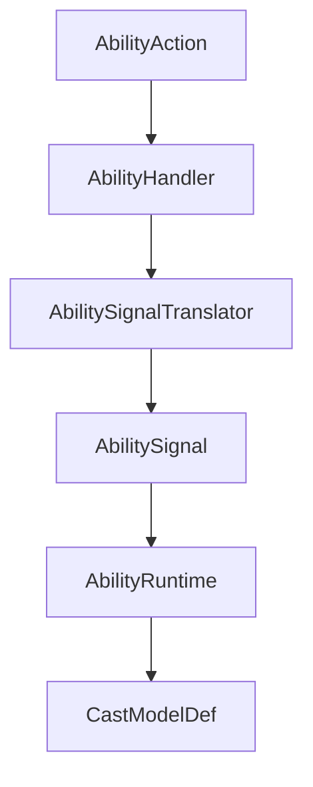
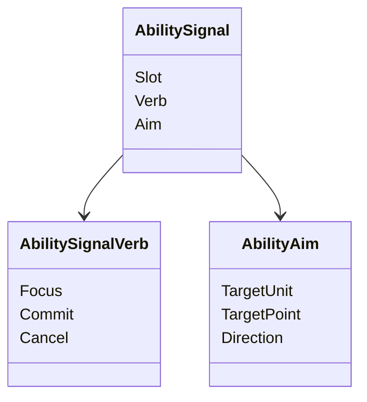
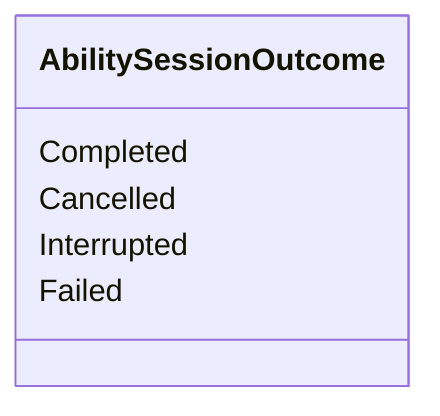
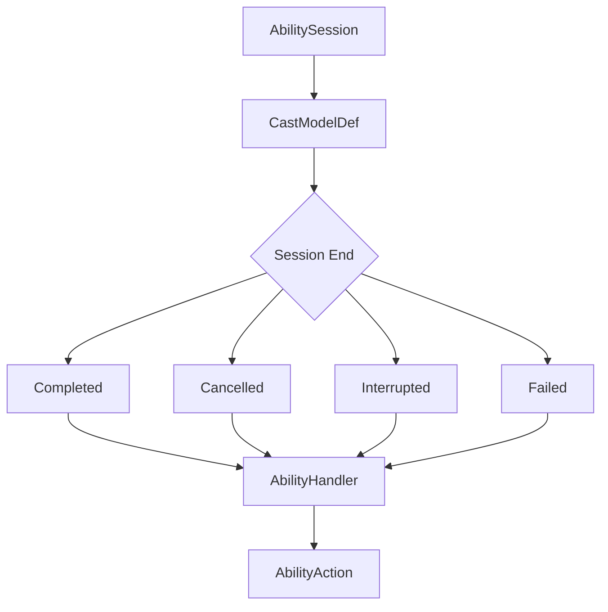
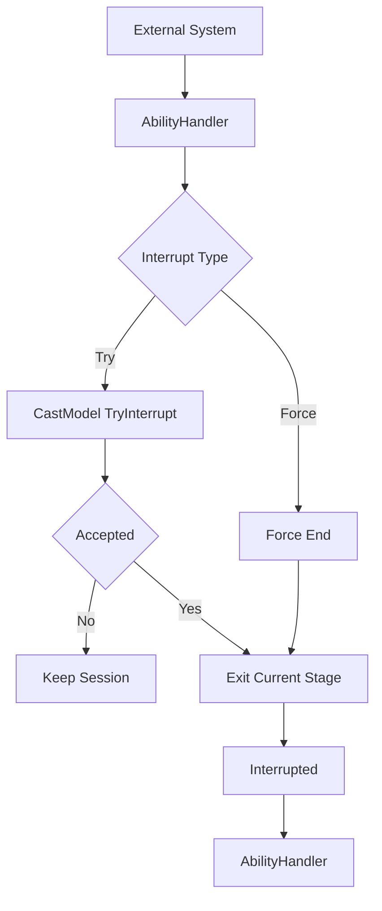

# 技能信号接受与施法结束

## 本功能范围

本案细化“技能信号与会话状态”中的技能信号接受与施法结束，仅覆盖下列明确接口与边界。

## 目标实现

Focus、Commit、Cancel 等信号只通过技能门面进入单次施法状态。

## 技术方案

AbilityHandler 接受 AbilitySignal，AbilityRuntime 常驻，AbilitySession 只承载本次施法；Session 结束回传执行器，外部只读 AbilityCastView。

## 边界情况

HandleSignal 返回是否接受，不让 Planner 私自推进 Session；同 Tick Focus 和 Commit 需正式 CommandSeq 顺序。

## 验收条件

- 正常路径达到上述目标，并由所属模块唯一拥有权威状态。
- 以上边界情况有明确返回、拒绝或可见失败；不得用占位成功代替行为。
- 确定性逻辑比较重复执行、改变插入顺序以及捕获/恢复/重演结果；只读界面不得改变 Gameplay。

## 工程实际核查

实现证据与已有测试位置关联总案；字段存在不能认定行为已验收。

## 附录：精确接口、公式与配置

附录保留本功能必须精确表达的接口、运算和配置语义，原系统章节已拆到所属功能。若与上面的已接受修订仍有冲突，进入待确认清单而不是按旧版本执行。

### 一、AbilityHandler：技能系统总入口

`AbilityHandler` 是单位身上的技能系统门面。

除技能施放入口外，它还管理单位整体的待分配技能点、主动技能附带被动和单位固定被动，并接收 `UnitEventBus` 的强类型 Gameplay 结果事件。

单位行为框架不需要理解技能内部的蓄力阶段、引导阶段或英雄专属逻辑。它只把已经形成的 `AbilityAction` 交给 `AbilityHandler`，由 `AbilityHandler` 再翻译为技能系统内部能够理解的 `AbilitySignal`。



技能系统只从 `AbilitySignal` 开始讨论。

---

### AbilitySignal：技能系统内部的最小语言

外部命名约定为：

```text
XXXCommand = 顶层输入指令
XXXOrder   = 单位行为指令
```

技能系统内部使用：

```text
AbilitySignal
```

`Signal` 表示“当前技能收到的一个操作信号”，避免继续使用 `Command` 或 `Order`。

核心动词只保留三个：

| Verb | 含义 |
|---|---|
| `Focus` | 开始关注、准备或进入需要持续保持的施法过程 |
| `Commit` | 确认执行当前技能允许的主要操作 |
| `Cancel` | 主动取消当前技能会话 |

推荐的最小结构：



不要在 `AbilitySignal` 中加入：

```text
Press
Release
LeftClick
AIRequest
PlayerRequest
```

因为这些属于上游输入语义。

同一个 `Commit` 在不同施法模型中可以产生完全不同的结果：

```text
普通范围技能
Commit -> 开始施法

韦鲁斯 Q
Commit -> 从蓄力阶段进入释放阶段

泽拉斯 R
Commit -> 在大招持续阶段内发射一次
```

因此有一条核心原则：

> `AbilitySignal` 只表达意图。  
> Signal 是否创建会话、切换阶段或只触发当前阶段行为，由 `CastModelDef` 解释。

---

### HandleSignal：只返回是否接受 Signal

`AbilityHandler` 接收真实技能 Signal：

```text
HandleSignal
```

即时返回只需要：

```text
bool
```

含义是：

> 当前技能系统是否接受了这个 Signal。

例如：

```text
Commit
-> 技能冷却中
-> false
```

```text
Focus
-> 韦鲁斯 Q 可以开始蓄力
-> true
```

这里不设计统一的：

```text
RejectReason
FailedStageId
FailurePayload
```

这些内容容易把技能入口变成一套复杂错误报告协议。

开发调试需要失败细节时，通过日志、Editor 校验或 Debug Trace 记录即可，不进入核心运行时接口。

---

### AbilitySession 的结束回传

Signal 被接受，不代表整个技能最终一定成功。

例如：

```text
Focus
-> 韦鲁斯 Q 开始蓄力
-> true

之后被外部打断
-> 本次 AbilitySession 最终为 Interrupted
```

因此技能系统保留第二层返回：`AbilitySessionOutcome`。



四种结果足够表达技能系统需要告诉外部的生命周期差异：

| Outcome | 含义 |
|---|---|
| `Completed` | 施法模型正常结束 |
| `Cancelled` | `Cancel` 导致会话取消 |
| `Interrupted` | 外部中断导致会话终止 |
| `Failed` | 会话已经开始，但某个阶段无法继续执行 |

不额外携带通用 `Reason`。

结束链路：



`AbilityHandler` 只负责把最终结果交还给外部行为层。

`AbilityAction` 如何释放行为占用、如何结束自己，仍由单位行为框架处理。

---

### 外部打断接口

普通技能 Signal 与外部打断分开。

```text
AbilitySignal
    Focus
    Commit
    Cancel

External Interrupt
    TryInterrupt
    ForceInterrupt
```

`AbilityHandler` 预留：

```text
TryInterrupt
ForceInterrupt
```

语义：

| 接口 | 说明 |
|---|---|
| `TryInterrupt` | 请求中断当前会话；当前 `CastModelDef` 可以拒绝 |
| `ForceInterrupt` | 强制终止当前会话 |

典型使用：

```text
移动尝试打断引导
-> TryInterrupt

普通外部行为替换当前施法
-> TryInterrupt

单位死亡
-> ForceInterrupt

单位销毁
-> ForceInterrupt
```

当前版本不把眩晕、击飞、沉默等原因全部塞进技能系统。

控制系统或单位行为层先决定是否提出中断请求，技能系统只决定当前施法过程是否接受普通中断。

如果以后出现明确需求：

```text
技能不怕 Stun
但会被 Knockup 打断
```

再把 `TryInterrupt` 扩展为带轻量标签的接口即可，不提前设计复杂的 `InterruptContext`。

打断流程：



---


## 需求演进

### 2026-10-02

变动内容：输入模式从施法模型离线派生，不重复 Gameplay 配置。

legacyDecision：D-016

### 2026-10-02

变动内容：松键和左键合并为一次 Commit，右键不取消蓄力。

legacyDecision：D-017

