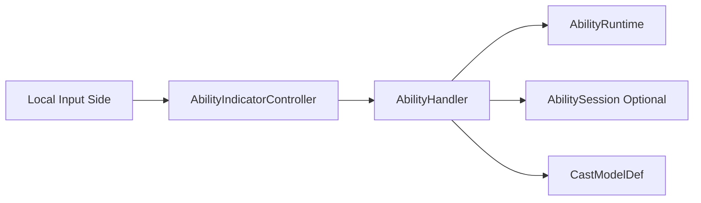
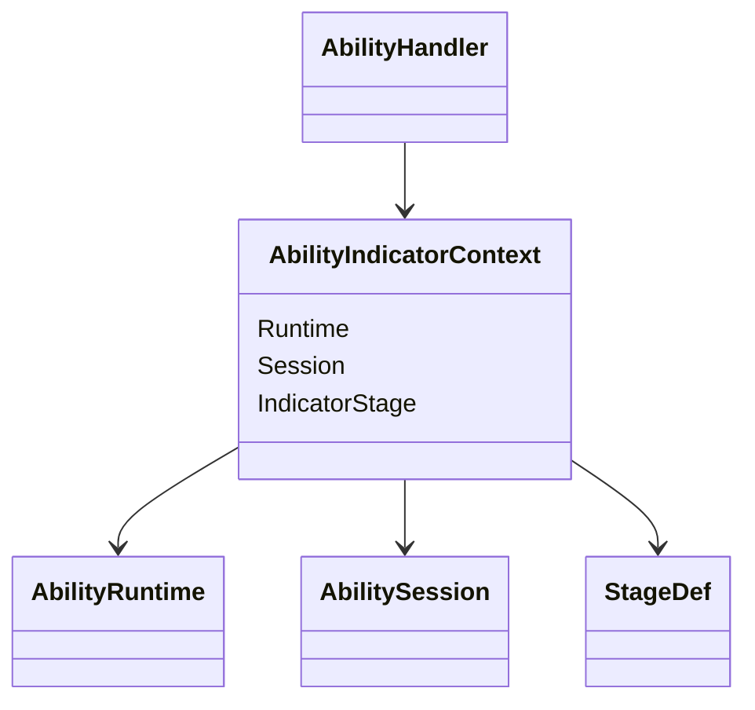
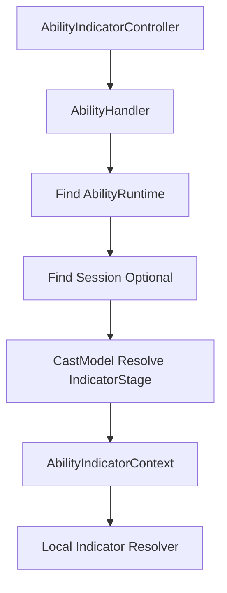
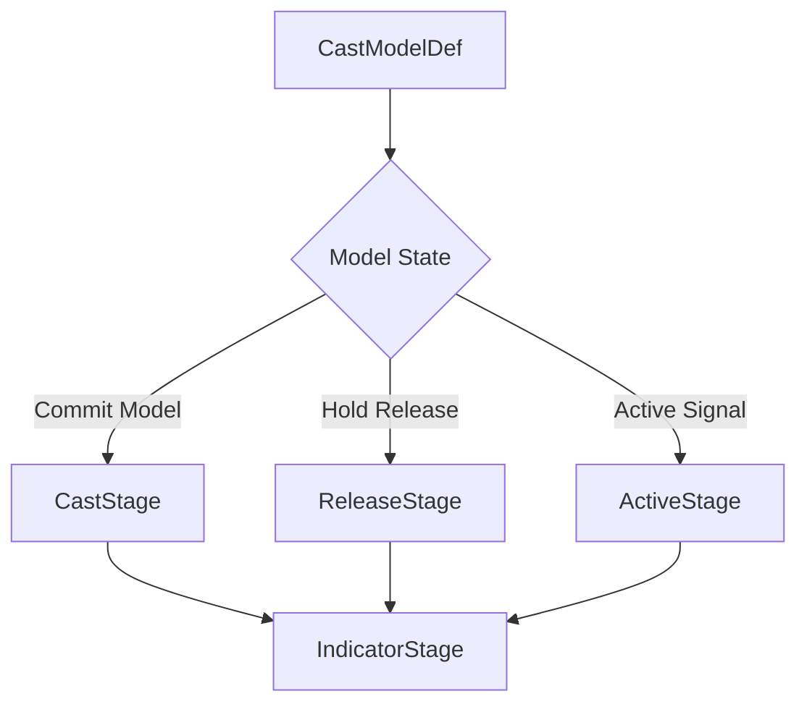
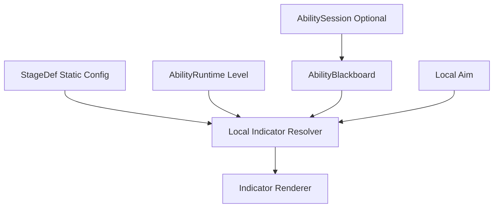
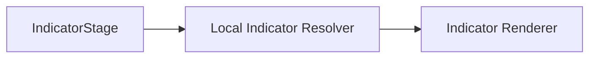
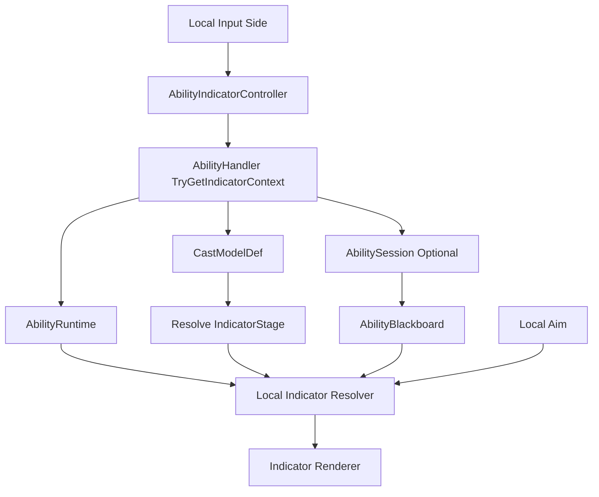

# 技能本地指示器查询

## 本功能范围

本案细化“技能信号与会话状态”中的技能本地指示器查询，仅覆盖下列明确接口与边界。

## 目标实现

Focus、Commit、Cancel 等信号只通过技能门面进入单次施法状态。

## 技术方案

AbilityHandler 接受 AbilitySignal，AbilityRuntime 常驻，AbilitySession 只承载本次施法；Session 结束回传执行器，外部只读 AbilityCastView。

## 边界情况

HandleSignal 返回是否接受，不让 Planner 私自推进 Session；同 Tick Focus 和 Commit 需正式 CommandSeq 顺序。

## 验收条件

- 正常路径达到上述目标，并由所属模块唯一拥有权威状态。
- 以上边界情况有明确返回、拒绝或可见失败；不得用占位成功代替行为。
- 确定性逻辑比较重复执行、改变插入顺序以及捕获/恢复/重演结果；只读界面不得改变 Gameplay。

## 工程实际核查

实现证据与已有测试位置关联总案；字段存在不能认定行为已验收。

### AbilityIndicatorController：本地指示器如何接入

技能指示器只在本地运行，因此不应该成为 `AbilityHandler` 的子模块，也不进入真实 `AbilitySession` 生命周期。

推荐关系：



`AbilityIndicatorController` 是独立的本地模块。

它负责：

```text
本地技能键进入瞄准状态
维护本地 Aim
打开和关闭指示器
读取技能只读数据
选择本地 Indicator Resolver
驱动具体 Renderer
```

它不负责：

```text
创建 AbilitySession
发送 AbilitySignal
扣除资源
进入冷却
提交战斗请求
修改 AbilityBlackboard
```

因此真实技能链和本地指示器链彼此独立：

```text
真实技能

Command
-> Order
-> AbilityAction
-> AbilityHandler
-> AbilitySignal
```

```text
本地指示器

Local Input
-> AbilityIndicatorController
-> AbilityHandler 只读查询
-> Local Indicator Resolver
-> Renderer
```

两条链只在技能配置和当前技能运行状态处共享数据。

---

### AbilityHandler 只提供轻量的指示器查询接缝

技能系统不提供 `AbilityPreviewDef`，也不要求 `StageDef` 实现任何 Preview 接口。

`AbilityHandler` 只需要提供一个只读查询入口。

概念上：

```text
TryGetIndicatorContext
```

返回一个轻量的：

```text
AbilityIndicatorContext
├── AbilityRuntime
├── AbilitySession optional
└── IndicatorStage
```

类关系：



查询过程：



这里不会创建任何真实技能状态。

`AbilityIndicatorContext` 中的对象只允许本地指示器读取。

---

### CastModelDef 只决定当前指示器应该参考哪个 Stage

指示器不能简单读取：

```text
AbilitySession.CurrentStage
```

因为当前实际执行的 Stage 和玩家正在瞄准的内容不一定相同。

例如韦鲁斯 Q：

```text
CurrentStage = HoldStage

玩家当前瞄准的是
ReleaseStage 的释放方向与射程
```

因此 `CastModelDef` 提供一个轻量规则：

```text
ResolveIndicatorStage
```

典型结果：

```text
CommitCastModelDef
    -> CastStage

HoldReleaseCastModelDef
    -> ReleaseStage

ActiveSignalCastModelDef
    -> ActiveStage
```

流程：



`CastModelDef` 只回答：


它不负责：

```text
画圆
画线
决定材质
计算颜色
创建 Indicator GameObject
```

这仍然属于本地指示器模块。

如果某个技能当前不应该显示指示器：

```text
ResolveIndicatorStage
-> null
```

即可。

---

### Indicator 直接读取 StageDef、Runtime 和可选 Blackboard

`StageDef` 继续只是技能阶段配置 SO。

它完全不知道指示器系统存在。

本地 `Indicator Resolver` 得到：

```text
StageDef
AbilityRuntime
AbilitySession optional
Local Aim
```

然后自己构造显示。



这里分为两种情况。

#### 没有 AbilitySession

普通范围技能按下技能键时，真实施法尚未开始。

例如：

```text
按下 E
-> 本地打开指示器

鼠标确认
-> 才生成 Command
-> 最终进入 AbilityHandler
```

因此此时：

```text
AbilitySession = null
Blackboard = null
```

Indicator Resolver 直接读取：

```text
StageDef 静态配置
AbilityRuntime.Level
Local Aim
```

例如：

```text
AreaDamageStageDef
    RadiusByLevel
    TargetingSpec
```

本地 Resolver 自己解析一次当前等级半径并绘制圆形范围。

为本地显示重复计算一次 Range、Radius 或 Width 没有必要再增加额外的通用解析层。

#### 已经存在 AbilitySession

韦鲁斯 Q 这类技能在显示指示器时已经存在真实 Session。

```text
Focus
-> Create AbilitySession
-> HoldStage Tick
```

`HoldStage` 可以把技能本身有意义的动态数据写入 Blackboard：

```text
ChargeRatio
CurrentRange
```

本地指示器只读这些数据：

```text
StageDef 静态配置
+ Runtime.Level
+ Blackboard.ChargeRatio
+ Local Aim
```

或者直接：

```text
Blackboard.CurrentRange
+ Local Aim
```

两种方式都允许。

核心原则只有一条：

> Blackboard 保存技能运行语义数据，而不是指示器表现数据。

适合写入：

```text
ChargeRatio
CurrentRange
CurrentRadius
RemainingShots
CapturedTarget
```

不适合写入：

```text
IndicatorLineLength
IndicatorColor
IndicatorMaterial
CircleRendererScale
```

Stage 可以为了真实技能逻辑计算动态数据并写入 Blackboard。

指示器可以复用这些数据，也可以为了本地显示重新计算一次。

框架不强制两者只能采用一种方式。

---

### Local Indicator Resolver：由本地模块适配 Stage 类型

`StageDef` 基类没有统一的：

```text
Range
Radius
Width
Angle
```

这是合理的，因为不同技能阶段需要的数据完全不同。

因此不要为了指示器给 `StageDef` 基类增加一个巨大的通用 Preview 数据结构。

本地指示器系统维护自己的 Resolver。

例如：

```text
AreaDamageStageDef
-> CircleIndicatorResolver

ProjectileStageDef
-> LineIndicatorResolver

DashStageDef
-> DashIndicatorResolver

VarusQReleaseStageDef
-> VarusQIndicatorResolver

XerathRActiveStageDef
-> XerathRIndicatorResolver
```

关系：



高频通用 Stage 提供通用 Resolver。

真正特殊的英雄 Stage 可以写英雄专属 Resolver。

这是纯本地代码，不会污染技能系统核心类型。

例如普通圆形技能：

```text
CircleIndicatorResolver

读取
    AreaDamageStageDef.RadiusByLevel
    TargetingSpec
    Runtime.Level
    Local Aim

输出
    圆形指示器显示
```

韦鲁斯 Q：

```text
VarusQIndicatorResolver

读取
    VarusQReleaseStageDef
    Runtime.Level
    Session.Blackboard.ChargeRatio
    Local Aim

输出
    当前蓄力射程线形指示器
```

泽拉斯 R：

```text
XerathRIndicatorResolver

读取
    XerathRActiveStageDef
    Runtime.Level
    Session.Blackboard
    Local Aim

输出
    最大施法范围
    当前落点范围
```

因此指示器的最终插入点只有两个：

```text
CastModelDef.ResolveIndicatorStage
    决定当前参考哪个 Stage

AbilityHandler.TryGetIndicatorContext
    向本地模块提供只读 Runtime、Session 和 Stage
```

完整链路：



这种设计保持：

```text
StageDef
    不知道 Indicator

AbilitySession
    不保存本地表现状态

AbilitySignal
    不加入 Preview Domain

AbilityHandler
    只提供只读查询接缝

CastModelDef
    只选择当前有语义的 IndicatorStage

AbilityIndicatorController
    完全本地运行
```

---


## 需求演进

### 2026-10-02

变动内容：输入模式从施法模型离线派生，不重复 Gameplay 配置。

legacyDecision：D-016

### 2026-10-02

变动内容：松键和左键合并为一次 Commit，右键不取消蓄力。

legacyDecision：D-017

