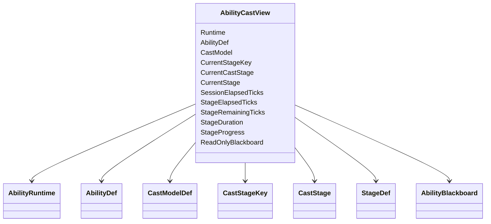
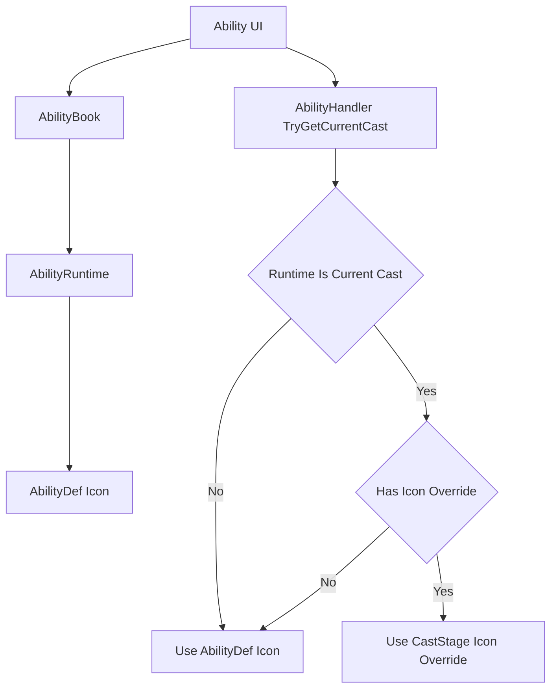
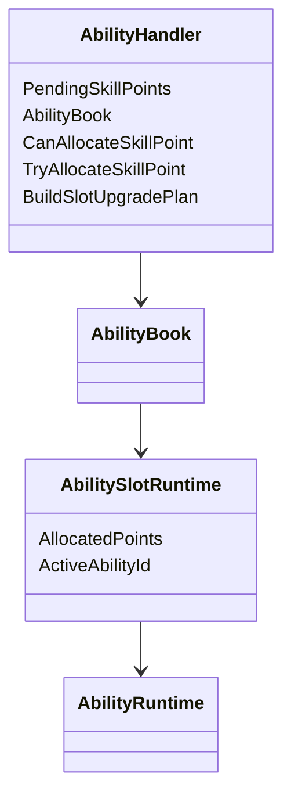
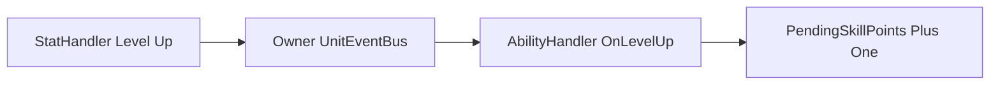
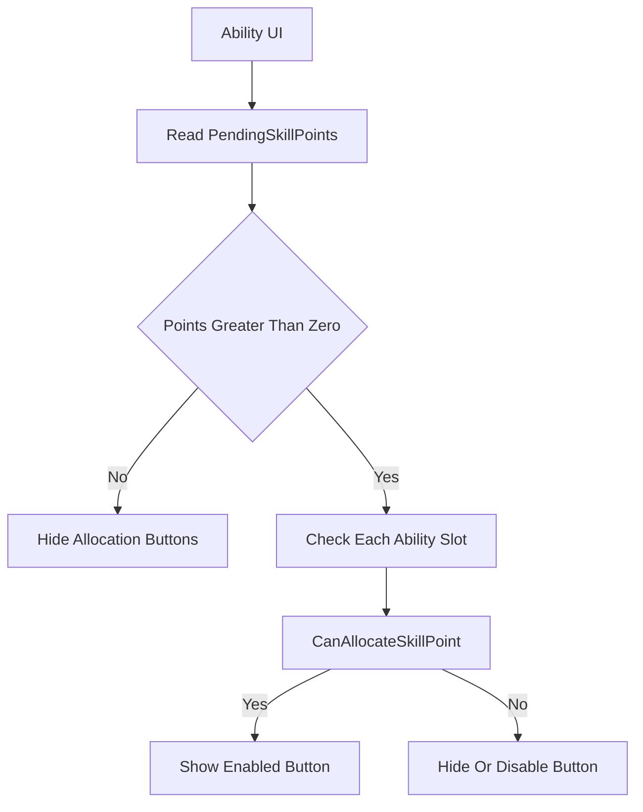
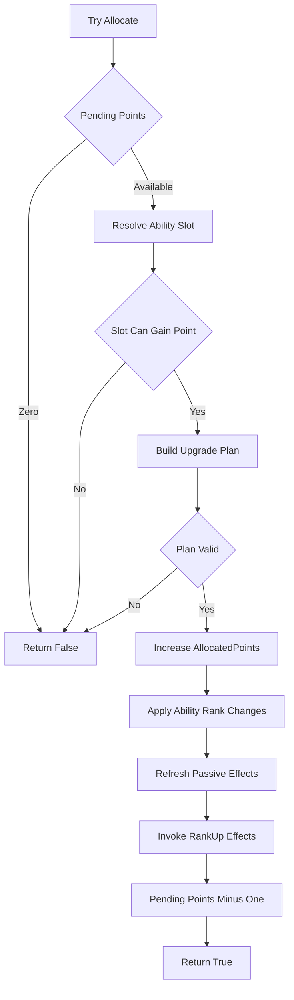
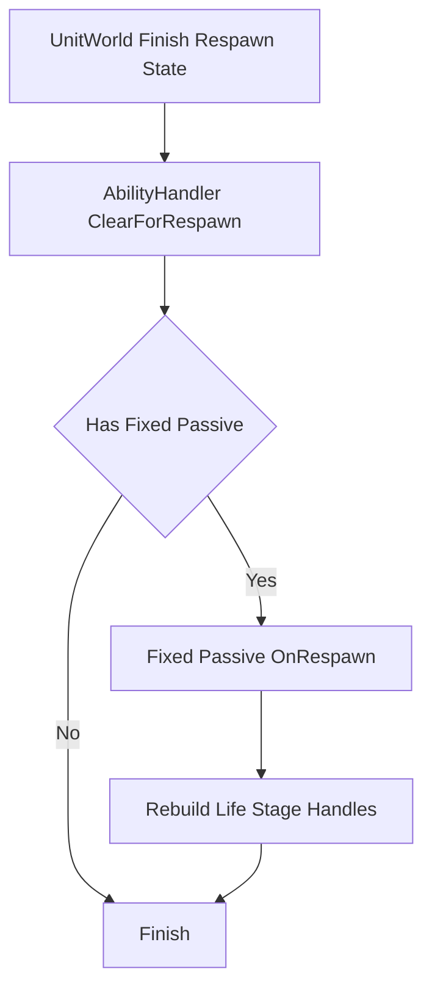

# 技能界面查询与单位事件

## 本功能范围

本案细化“技能信号与会话状态”中的技能界面查询与单位事件，仅覆盖下列明确接口与边界。

## 目标实现

Focus、Commit、Cancel 等信号只通过技能门面进入单次施法状态。

## 技术方案

AbilityHandler 接受 AbilitySignal，AbilityRuntime 常驻，AbilitySession 只承载本次施法；Session 结束回传执行器，外部只读 AbilityCastView。

## 边界情况

HandleSignal 返回是否接受，不让 Planner 私自推进 Session；同 Tick Focus 和 Commit 需正式 CommandSeq 顺序。

## 验收条件

- 正常路径达到上述目标，并由所属模块唯一拥有权威状态。
- 以上边界情况有明确返回、拒绝或可见失败；不得用占位成功代替行为。
- 确定性逻辑比较重复执行、改变插入顺序以及捕获/恢复/重演结果；只读界面不得改变 Gameplay。

## 工程实际核查

实现证据与已有测试位置关联总案；字段存在不能认定行为已验收。

### AbilityCastView：外部系统读取当前施法状态

动画系统、UI、Debug UI 等外部系统经常需要知道：

```text
当前是否正在施法
正在施放哪个技能
使用哪个 CastModelDef
当前位于该施法模型的哪个位置
该位置绑定哪个 StageDef
当前阶段已经运行多久
当前阶段剩余多久
当前阶段进度是多少
Blackboard 中是否存在额外技能语义数据
```

这些系统不应该直接修改 `AbilitySession`。

`AbilityHandler` 提供：

```text
TryGetCurrentCast
```

返回只读的：

```text
AbilityCastView
```

推荐内容：



`AbilityCastView` 不是快照。

它由 `AbilityRuntime` 代理当前可选 `ActiveSession`，形成只读观察视图。

外部系统只能读取，不能通过它修改 Session 或 Blackboard。

其中：

```text
CastModel
    当前技能使用的施法模型

CurrentStageKey
    当前位于该 CastModelDef 的哪个位置

CurrentCastStage
    该位置上的 CastStage 配置

CurrentStage
    CurrentCastStage.Stage
```

`StageDef` 不知道自己位于施法模型的哪个位置。

位置由 `CastModelDef` 自己管理，并向外部提供对应的 `CastStageKey`。

例如：

```text
AbilityDef = VarusQ
CastModel = HoldReleaseCastModelDef
CurrentStageKey = Hold
CurrentStage = VarusQHoldStageDef
```

或者：

```text
AbilityDef = XerathR
CastModel = ActiveSignalCastModelDef
CurrentStageKey = Active
CurrentStage = XerathRActiveStageDef
```

外部系统通过：

```text
AbilityDef
+ CastModelDef
+ CurrentStageKey
+ StageDef
```

决定具体表现。

不再提供：

```text
CastStageTraits
ResolveStageTraits
Holding
Channeling
WaitingSignal
Recovery
```

这类通用语义推导。

阶段进度统一来自当前 `CastStage` 的静态 Duration：

```text
Finite Duration 且 DurationTicks > 0
-> StageProgress = Clamp01(StageElapsedTicks / DurationTicks)

Duration = 0 Tick
-> StageProgress = 1
-> 通常会在同一次技能更新内立即离开该阶段

Infinite Duration
-> StageProgress 无值
```

有限阶段还可以直接得到：

```text
StageRemainingTicks =
    Max(0, DurationTicks - StageElapsedTicks)
```

动画系统可以通过：

```text
AbilityDef + CastModelDef + CurrentStageKey
```

选择动画，再使用：

```text
StageProgress
ReadOnlyBlackboard
```

控制动画进度和额外参数。

例如：

```text
VarusQ
+ HoldReleaseCastModelDef
+ Hold

-> 播放 VarusQ Hold Animation
```

Blackboard 中应该保存：

```text
ChargeRatio
RemainingShots
CastDirection
RecastCount
```

而不是：

```text
AnimatorNormalizedTime
AnimationSpeed
LayerWeight
BlendTreeValue
```

技能系统只暴露技能语义，动画系统自行完成表现映射。

---

### UI 读取槽位技能状态

技能 UI 通常先读取每个 `AbilitySlotRuntime`。

当前技能显示数据来自：

```text
AbilitySlotRuntime.ActiveAbilityId
-> AbilityRuntime
-> AbilityDef
```

包括：

```text
Name
Description
Icon
Cooldown
Level
Learned
```

如果某个技能当前正在 `AbilitySession` 中，UI 可以同时读取 `AbilityCastView`。

技能图标解析规则保持简单：

```text
CurrentCastStage.IconOverride 有值
-> 使用 IconOverride

否则
-> 使用 AbilityDef.Icon
```

流程：



图标覆盖属于 `CastStage`，而不是 `StageDef`。

原因是：

> 同一个 `StageDef` 可以被不同技能或不同施法模型复用，但它们的 UI 图标不一定相同。

例如：

```text
LuxE AbilityDef.Icon
    = LuxE Default Icon

ActiveArea CastStage.IconOverride
    = LuxE Detonate Icon
```

UI 还可以读取：

```text
CastModelDef
CurrentStageKey
StageRemainingTicks
```

判断当前正在该施法模型的哪个位置，而不需要从 `StageDef` 类型推测它是蓄力、引导还是等待阶段。

对于没有活跃 Session，但技能已经通过 `AbilityRuntime` 切换为另一套技能或另一个 `AbilityDef` 的情况，UI 仍然直接读取当前槽位绑定的 `AbilityDef.Icon`。

技能点分配按钮不从 `AbilityRuntime` 单独读取。

UI 直接通过 `AbilityHandler` 读取：

```text
PendingSkillPoints
CanAllocateSkillPoint(slot)
```

具体分配流程见 `1.12 PendingSkillPoints`。

---

### PendingSkillPoints：待分配技能点与槽位升级

`AbilityHandler` 负责管理单位当前尚未分配的技能点：

```text
PendingSkillPoints
```

技能点分配目标是：

```text
AbilitySlotRuntime
```

而不是当前槽位中临时激活的某个 `AbilityRuntime`。

原因是一个技能槽可以容纳多个主动技能，而绝大多数英雄的技能点规则是：

> 给槽位分配一点后，该槽位下的所有主动技能一起升级。

推荐关系：



不增加额外的：

```text
IAbilitySkillPointService
IAbilitySkillPointExecutor
```

技能点权威状态和正式执行接口都直接归 `AbilityHandler`。

---

#### 单位升级时增加技能点

单位框架在单位成功提升一级后，立即发布强类型：

```text
LevelUpEvent
```

`AbilityHandler.OnLevelUp` 每收到一次事件执行：

```text
PendingSkillPoints += 1
```

流程：



内部固定顺序：

```text
1. PendingSkillPoints += 1
2. FixedPassive 处理 LevelUp
3. 当前主动技能槽按槽位索引处理 LevelUp
```

初始化时的可分配技能点由单位初始化配置传入。

例如单位以 1 级出生并立即拥有一个技能点：

```text
InitialPendingSkillPoints = 1
```

不要通过伪造升级事件补初始技能点。

---

#### UI 读取与 Command 执行链

UI 直接读取 `AbilityHandler`：

```text
PendingSkillPoints
CanAllocateSkillPoint(slot)
```

| API | 说明 |
|---|---|
| `PendingSkillPoints` | 当前剩余可分配点数，只读 |
| `CanAllocateSkillPoint(slot)` | 当前技能槽是否允许增加一点 |
| `TryAllocateSkillPoint(slot)` | 正式执行槽位点数和具体技能等级变化 |

UI 显示逻辑：



点击按钮后，UI 不直接修改运行状态。

确定性执行链：

```text
AllocateAbilitySkillPointCommand
-> CommandDispatcher 根据 UnitUid 查询 Unit
-> Unit.AbilityHandler.TryAllocateSkillPoint(slot)
```

技能点分配不是单位动作行为，因此不经过：

```text
Order
Intent
BehaviorPlanner
ActionRequest
ActionArbiter
ActionRuntime
```

---

#### 槽位级加点配置

技能点上限和单位等级要求属于技能槽：

```text
AbilitySlotDef
├── MaxAllocatedPoints
└── RequiredUnitLevelByRank
```

不再属于单个 `AbilityDef`。

`RequiredUnitLevelByRank` 按槽位的目标点数索引。

例如终极技能槽：

```text
Point 1 requires Unit Level 6
Point 2 requires Unit Level 11
Point 3 requires Unit Level 16
```

当前槽位已投入点数保存在：

```text
AbilitySlotRuntime.AllocatedPoints
```

某个具体技能实际等级仍然保存在：

```text
AbilityRuntime.Level
```

普通英雄中两者通常相同。

特殊英雄允许它们不同。

---

#### BuildSlotUpgradePlan：特殊英雄扩展点

`TryAllocateSkillPoint(slot)` 保持统一公共流程，不建议让特殊英雄完整重写。

开放受控扩展点：

```text
protected virtual BuildSlotUpgradePlan(
    AbilitySlotRuntime slot,
    int nextAllocatedPoints,
    UpgradePlanBuffer output)
```

默认实现：

```text
槽位中的每个 AbilityRuntime
    TargetRank = CurrentRank + 1
```

特殊英雄的 `AbilityHandler` 子类只重写升级计划。

例如可以表达：

```text
只升级槽位中的某一个技能
根据当前形态选择升级对象
不同技能使用不同等级映射
某个技能在指定槽位点数时才升级
```

升级计划至少包含：

```text
AbilityRuntime
PreviousRank
TargetRank
```

公共执行框架仍然负责：

```text
PendingSkillPoints 校验
槽位点数上限校验
单位等级要求校验
升级计划完整校验
槽位点数增加
具体技能等级更新
技能被动刷新
RankUpEffect 调用
技能点扣除
```

这样特殊英雄不会遗漏公共状态和确定性规则。

---

#### TryAllocateSkillPoint 的原子流程

推荐顺序：



所有可能失败的检查都必须在正式写状态前完成。

成功后：

```text
AbilitySlotRuntime.AllocatedPoints += 1

按 AbilitySlotDef.Abilities 的稳定顺序：
    更新计划中的 AbilityRuntime.Level
    更新 Learned
    刷新主动技能附带被动
    调用该 AbilityDef.RankUpEffect

PendingSkillPoints -= 1
```

槽位点数增加、技能等级变化、升级模块调用和技能点扣除属于同一个确定性操作。

默认：

```text
槽位中任意 AbilityRuntime 正在施法
-> 不允许给该槽位加点
```

特殊英雄需要不同规则时，可以重写合法性或升级计划，但必须保证一次 `AbilitySession` 内读取到的技能等级一致。

固定被动技能不参与技能点分配。

---

### SupportedUnitEvents：AbilityHandler 的固定事件契约

`AbilityHandler` 只实现当前技能业务确实需要的强类型 UnitEvent 回调。

正式支持：

```text
DamageTakenEvent
DamageDealtEvent
HealTakenEvent
HealDealtEvent
AbilityCastEvent
UnitDyingEvent
UnitDeathEvent
UnitKillEvent
LevelUpEvent
```

对应接口：

```text
OnDamageTaken
OnDamageDealt
OnHealTaken
OnHealDealt
OnAbilityCast
OnUnitDying
OnUnitDeath
OnUnitKill
OnLevelUp
```

暂不支持：

```text
UnitCollisionEnterEvent
UnitCollisionExitEvent
```

普通技能碰撞和范围逻辑继续通过：

```text
ProjectileSystem
AreaSystem
Physics Query
StageDef
BuffSystem
```

处理。

`SupportedUnitEvents` 是代码与设计契约，不是运行时订阅列表。

不增加：

```text
Subscribe
Unsubscribe
delegate
反射扫描
通用 HandleEvent
动态 Listener 表
```

`UnitEventBus` 使用固定代码路由即时调用对应函数，本身没有需要进入快照的订阅状态。

内部处理顺序：

```text
普通结果事件
    1. FixedPassiveRuntime
    2. 当前主动技能槽，从低索引到高索引

LevelUpEvent
    1. PendingSkillPoints += 1
    2. FixedPassiveRuntime
    3. 当前主动技能槽，从低索引到高索引

UnitDeathEvent
    1. 强制结束当前 ActiveSession
    2. FixedPassiveRuntime
    3. 当前主动技能槽，从低索引到高索引
    4. 执行死亡生命周期清理
```

`UnitDyingEvent` 不自动结束 Session。

只有正式 `UnitDeathEvent` 执行统一死亡中断和清理。

#### 普通死亡只清理临时施法状态

`AbilityHandler.OnUnitDeath` 的默认流程：

```text
1. ForceInterrupt 当前 ActiveSession
2. 当前 Stage.OnExit
3. Session Outcome = Interrupted
4. 销毁 ActiveSession
5. 清理与该 Session 同生命周期的 Blackboard
6. FixedPassiveRuntime 处理 UnitDeath
7. 当前主动技能槽被动按索引处理 UnitDeath
```

普通死亡默认不执行：

```text
清空 AbilityBook
清空 AbilitySlotRuntime
重置 AbilitySlotRuntime.AllocatedPoints
重置 AbilityRuntime.Level
重置 PendingSkillPoints
重置技能冷却
销毁 FixedPassiveRuntime
停用当前主动技能附带被动
全量移除技能来源 Modifier
```

单位死亡本身不等价于：

```text
PassiveEffect.OnDeactivate
```

当前槽位绑定没有变化，主动技能也没有被卸载，因此长期被动状态、冷却和已存在的 Modifier 默认继续保留。

只有具体被动效果明确规定：

```text
死亡时清空层数
死亡时重置内部资源
死亡时移除某个临时 Modifier
死亡时停止某个专属状态
```

才由该被动自己的 `OnUnitDeath` 使用保存的 Handle 精确修改自身状态。

禁止调用：

```text
StatHandler.ClearModifiers
CombatModifierSet.Clear
```

或其它全量清理接口。

#### 死亡事件中的 Gameplay 边界

正式死亡发生在 Combat Settlement 的即时调用链中：

```text
CombatSystem 确认死亡
-> UnitWorld 写入 Dead
-> UnitEventBus.Publish UnitDeathEvent
-> AbilityHandler.OnUnitDeath
```

技能被动在 `UnitDeathEvent` 中可以：

```text
更新自身 Runtime 状态
精确移除自身 Modifier
添加 Buff
提交新的 CombatRequest
```

但不能：

```text
修改已经完成的死亡结果
直接把 Dead 改回 Alive
绕过 CombatSystem 完成濒死复活
```

死亡阻止和濒死复活必须发生在正式写入 `Dead` 之前的战斗流程中。

#### ClearForRespawn：固定被动重建生命阶段 Handle

单位完成复活状态初始化后，单位框架按固定 Handler 顺序调用：

```text
AbilityHandler.ClearForRespawn
```

技能系统在这个接缝中只处理：

```text
跨死亡保留的 FixedPassiveRuntime
在新生命阶段需要重新建立的 Handle
```

流程：



这里的“生命阶段 Handle”指：

```text
死亡时由所属系统清理
但固定被动 Runtime 本身跨死亡保留
并且复活后仍应重新生效的注册
```

例如：

```text
控制免疫 Handle
不可阻挡 Handle
当前生命阶段的特殊状态注册
其它明确声明为 Respawn 时重建的 Handle
```

固定被动可以在：

```text
PassiveAbilityEffectDef.OnRespawn
```

中根据自己的长期 Runtime 状态重新提交正式注册，并保存新 Handle。

如果死亡时已经将旧 Handle 移除，或者所属系统已统一清理，则必须先把对应 Runtime Handle 标记为：

```text
Invalid
```

复活时只对 Invalid 的生命阶段 Handle 重新注册。

---

#### Respawn 不重新创建永久 Modifier

`ClearForRespawn` 不是全量被动重新激活。

禁止默认调用：

```text
PassiveEffect.OnActivate
StatHandler.AddModifier
CombatModifierSet.Attach
```

如果固定被动提供的：

```text
StatModifier
CombatModifier
```

本来就跨死亡保留，并且其 Handle 仍然有效，则复活时不重复创建。

因此固定被动 Runtime 应区分：

```text
PersistentHandles
    跨死亡保留
    Respawn 不重建

LifeStageHandles
    死亡时失效
    Respawn 按需重建
```

`ClearForRespawn` 也不会：

```text
重置固定被动冷却
重置固定被动层数
重新初始化 FixedPassiveRuntime
触发技能学习或 RankUpEffect
恢复死亡前的临时主动 AbilitySession
```

临时来源不恢复。

固定被动的长期权威状态保持死亡后的当前值，只重新建立新生命阶段所需的注册。

---

#### Respawn 与回滚 Rebuild 是不同流程

必须区分：

```text
AbilityHandler.ClearForRespawn
    正常 Gameplay 生命周期
    可以创建新的生命阶段 Handle

AbilityHandler.Rebuild
    回滚恢复阶段
    不能重新 Add 或 Attach Gameplay Modifier
```

回滚时：

```text
StatHandler Modifier
CombatModifierSet Record
被动 Runtime 历史 Handle
```

都从同一历史快照直接恢复。

因此 `Rebuild` 仍然只处理查询和表现派生缓存。

不能因为增加了 Respawn 接缝，就在回滚 `Rebuild` 中调用：

```text
FixedPassive.OnRespawn
PassiveEffect.OnActivate
AddModifier
Attach CombatModifier
```

否则会生成重复注册。


---


## 需求演进

### 2026-10-02

变动内容：输入模式从施法模型离线派生，不重复 Gameplay 配置。

legacyDecision：D-016

### 2026-10-02

变动内容：松键和左键合并为一次 Commit，右键不取消蓄力。

legacyDecision：D-017

