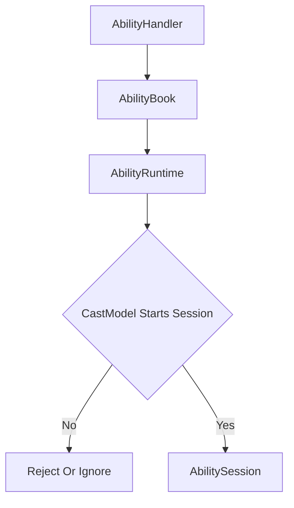
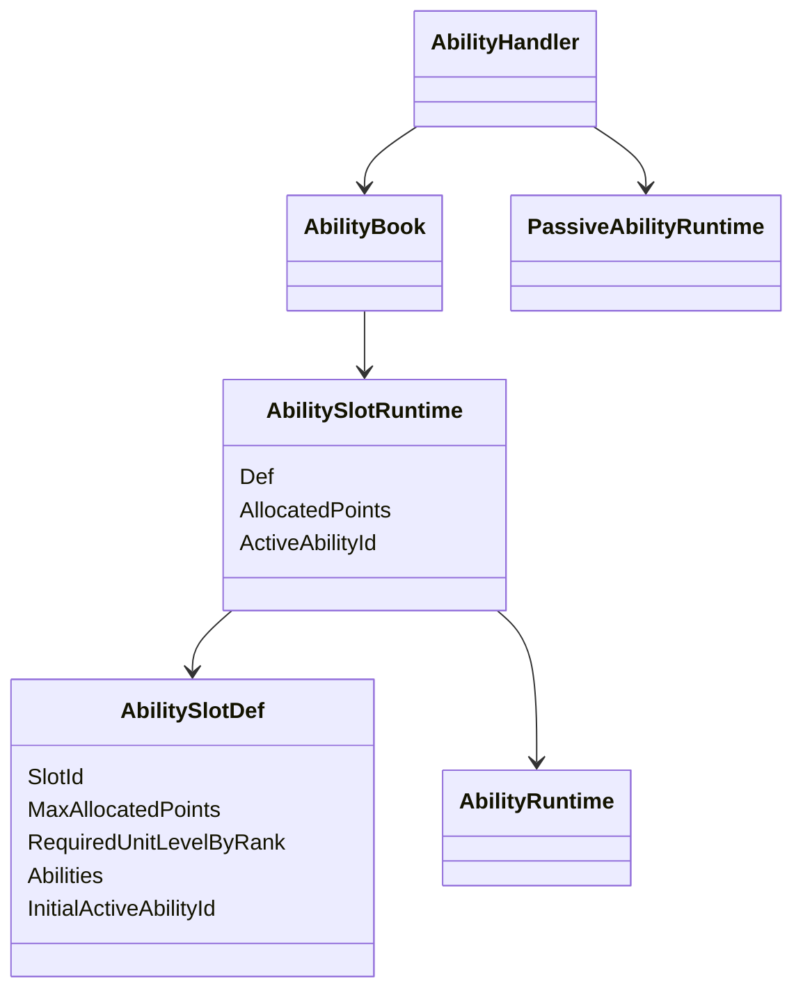
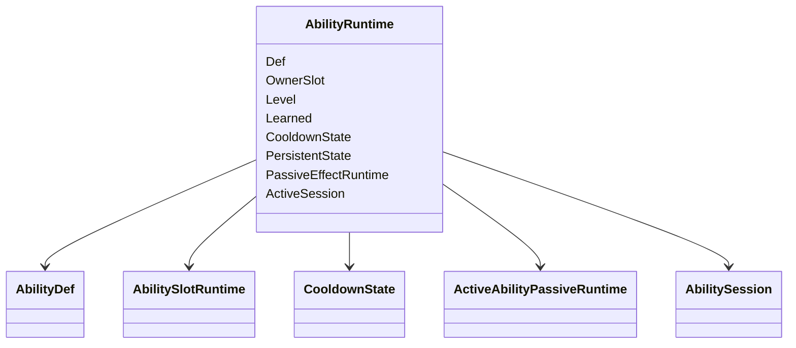
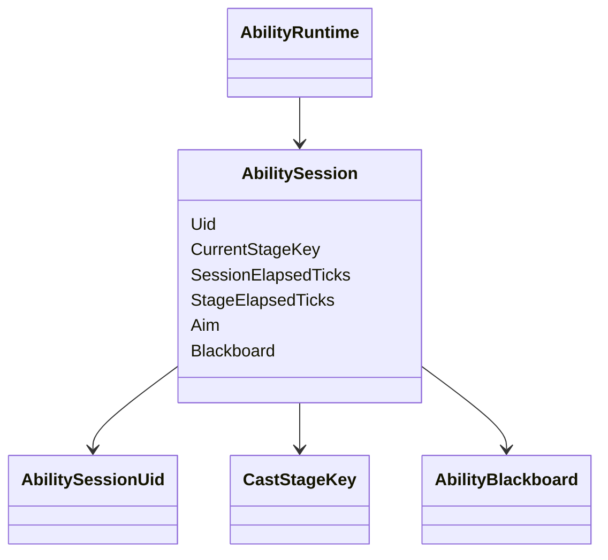
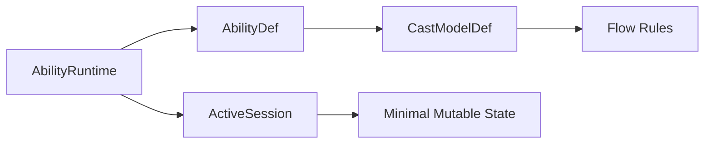

# 技能目录运行时与会话归属

## 本功能范围

本案细化“技能信号与会话状态”中的技能目录运行时与会话归属，仅覆盖下列明确接口与边界。

## 目标实现

Focus、Commit、Cancel 等信号只通过技能门面进入单次施法状态。

## 技术方案

AbilityHandler 接受 AbilitySignal，AbilityRuntime 常驻，AbilitySession 只承载本次施法；Session 结束回传执行器，外部只读 AbilityCastView。

## 边界情况

HandleSignal 返回是否接受，不让 Planner 私自推进 Session；同 Tick Focus 和 Commit 需正式 CommandSeq 顺序。

## 验收条件

- 正常路径达到上述目标，并由所属模块唯一拥有权威状态。
- 以上边界情况有明确返回、拒绝或可见失败；不得用占位成功代替行为。
- 确定性逻辑比较重复执行、改变插入顺序以及捕获/恢复/重演结果；只读界面不得改变 Gameplay。

## 工程实际核查

实现证据与已有测试位置关联总案；字段存在不能认定行为已验收。

### 二、AbilityRuntime 与 AbilitySession：技能运行状态

`AbilityHandler` 接受 Signal 后，首先找到单位身上的 `AbilityRuntime`。

如果当前施法模型需要开始真实技能过程，则创建 `AbilitySession`。

两者的生命周期完全不同。



---

### AbilityBook：一槽多技能的主动技能目录

`AbilityBook` 负责：

```text
主动技能槽 Runtime
槽位内主动技能 Runtime 注册
当前槽位激活技能
技能组或形态切换
槽位到当前 AbilityRuntime 的稳定查询
```

静态配置：

```text
AbilitySlotDef
├── SlotId
├── MaxAllocatedPoints
├── RequiredUnitLevelByRank
├── Abilities[]
└── InitialActiveAbilityId
```

运行结构：



一个技能槽可以包含一个或多个主动技能。

例如：

```text
Jayce Q Slot
├── ToTheSkies
└── ShockBlast
```

```text
Nidalee Q Slot
├── JavelinToss
└── Takedown
```

每个槽位通过：

```text
ActiveAbilityId
```

决定当前按下该槽位时实际施放哪个技能。

`AbilityHandler` 收到 `AbilitySignal` 后：

```text
Signal.Slot
-> AbilitySlotRuntime
-> ActiveAbilityId
-> AbilityRuntime
-> CastModelDef
```

输入层不需要知道当前形态下具体是哪一个 `AbilityDef`。

槽位中的所有 `AbilityRuntime` 都长期存在，以保留各自：

```text
技能等级
冷却
长期状态
主动技能附带被动状态
英雄专属资源
```

每个 `AbilityRuntime` 只能归属于一个 `AbilitySlotRuntime`。

不允许同一个 Runtime 同时挂在多个槽位。

---

#### 槽位内技能切换

统一接口：

```text
TrySwitchAbilityInSlot(slot, abilityId)
```

默认合法性：

```text
目标 AbilityId 属于该槽位
目标不是当前 ActiveAbilityId
当前槽位没有正在运行的 AbilitySession
其它英雄规则允许切换
```

默认顺序：

```text
旧 Active Ability PassiveEffect Deactivate
-> 修改 ActiveAbilityId
-> 新 Active Ability PassiveEffect Activate
```

只切换当前激活技能，不创建或销毁 `AbilityRuntime`。

必须在施法过程中切换的特殊英雄可以重写切换规则，但必须明确：

```text
当前 Session 继续、取消或中断
旧被动何时失活
新被动何时生效
```

固定被动完全不参与槽位切换。

---

### AbilityRuntime：始终存在的主动技能实例

`AbilityRuntime` 表示：

> 某个单位身上的某个具体主动技能实例。

它从技能被注册到对应 `AbilitySlotRuntime` 开始存在，无论当前是否是槽位的激活技能，也无论是否正在施放。

推荐核心数据：



适合放在这里的状态：

```text
AbilityDef 引用
所属 AbilitySlotRuntime
具体技能实际等级
是否学习
技能冷却
英雄专属长期状态
单个主动技能被动 Runtime optional
当前 ActiveSession optional
```

`AbilityRuntime.Level` 表示该具体技能的实际等级。

它不再被假设始终等于：

```text
OwnerSlot.AllocatedPoints
```

普通英雄由默认升级计划保持同步。

特殊英雄可以通过重写 `BuildSlotUpgradePlan` 产生不同映射。

`AbilityRuntime` 继续作为外部查询具体技能状态的统一入口。

不增加独立 `StageRuntime`。

---

### AbilitySession：单次施法的最小临时状态

`AbilitySession` 表示：

> 一次正在发生的真实主动技能施放过程。

它由 `AbilityRuntime` 创建并持有，施法结束后立即销毁或归还对象池。

推荐只保存本次施法无法从静态配置推导的最小动态数据：



字段：

| 字段 | 作用 |
|---|---|
| `Uid` | 本次施法的稳定运行标识，类型为 `AbilitySessionUid` |
| `CurrentStageKey` | 当前位于 CastModel 的哪个位置 |
| `SessionElapsedTicks` | 整次施法已运行 Tick |
| `StageElapsedTicks` | 当前阶段已运行 Tick |
| `Aim` | 本次施法当前使用的目标信息 |
| `Blackboard` | 本次施法动态共享数据 |

对象内部直接使用：

```text
session.Uid
```

外部结构根据字段语义使用完整名称：

```text
AbilityCastEvent.AbilitySessionUid
CachedAbilitySessionUid
```

不在 `AbilitySession` 中重复保存：

```text
AbilityRuntime
CastModelDef
CurrentCastStage
CurrentStage
StageDuration
Outcome
```

这些数据可通过拥有者和静态配置解析。

`AbilityBlackboard` 的生命周期严格等于 `AbilitySession`：

```text
Create AbilitySession
-> Create Clean Blackboard

Session Running
-> Stage 共享 Blackboard

Session End
-> Dispose Or Pool Session
-> Blackboard Dispose Or Clear
```

固定被动技能不创建 `AbilitySession`。

---

### AbilitySession 只保存状态，不决定流程

`AbilitySession` 不判断：

```text
Commit 是否切换 Stage
Hold 什么时候超时
Channel 什么时候完成
泽拉斯 R 的 Commit 是否发射一炮
```

这些规则全部来自：

```text
AbilityRuntime.Def.CastModel
```

关系：



职责：

```text
AbilityRuntime
    长期技能实例
    持有可选 ActiveSession
    对外代理查询当前阶段

AbilitySession
    单次施法最小动态状态

CastModelDef
    不可变的施法流程规则
```

这样不会引入第二套阶段状态机，也不会让临时 Session 持有大量可以从配置推导的数据。

---


## 需求演进

### 2026-10-02

变动内容：输入模式从施法模型离线派生，不重复 Gameplay 配置。

legacyDecision：D-016

### 2026-10-02

变动内容：松键和左键合并为一次 Commit，右键不取消蓄力。

legacyDecision：D-017

