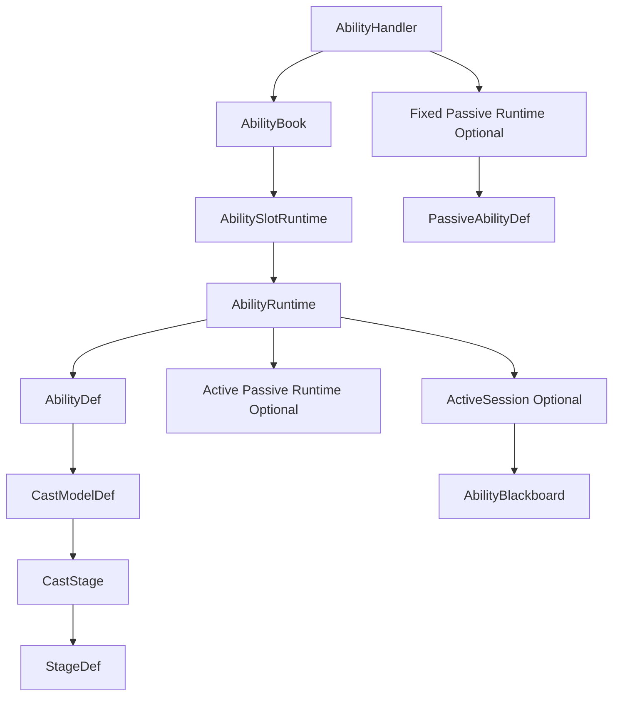
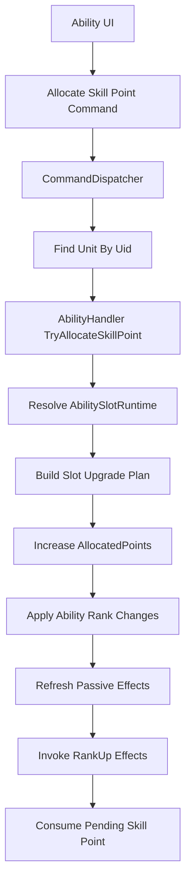
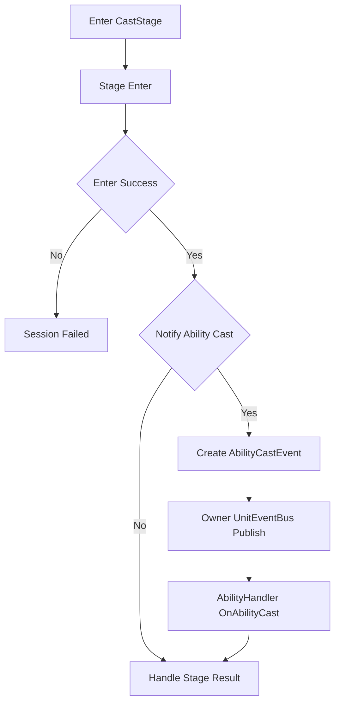
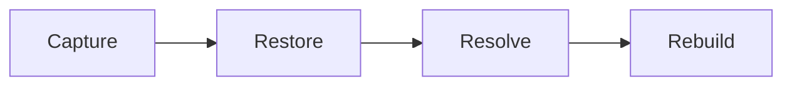

# 技能状态快照与统一Tick

## 本功能范围

本案细化“技能信号与会话状态”中的技能状态快照与统一Tick，仅覆盖下列明确接口与边界。

## 目标实现

Focus、Commit、Cancel 等信号只通过技能门面进入单次施法状态。

## 技术方案

AbilityHandler 接受 AbilitySignal，AbilityRuntime 常驻，AbilitySession 只承载本次施法；Session 结束回传执行器，外部只读 AbilityCastView。

## 边界情况

HandleSignal 返回是否接受，不让 Planner 私自推进 Session；同 Tick Focus 和 Commit 需正式 CommandSeq 顺序。

## 验收条件

- 正常路径达到上述目标，并由所属模块唯一拥有权威状态。
- 以上边界情况有明确返回、拒绝或可见失败；不得用占位成功代替行为。
- 确定性逻辑比较重复执行、改变插入顺序以及捕获/恢复/重演结果；只读界面不得改变 Gameplay。

## 工程实际核查

实现证据与已有测试位置关联总案；字段存在不能认定行为已验收。

### AbilityHandlerSnapshot 与 IRollback

`AbilityHandler` 实现：

```text
IRollback<AbilityHandlerSnapshot>
```

统一接口命名：

```text
Capture
Restore
Resolve
Rebuild
```

不再使用：

```text
Capture
Restore
Resolve
Rebuild
```

技能系统不自行维护逐 Tick 快照历史。

顶层 Gameplay Snapshot 系统通过单位聚合根调用：

```text
Unit Capture
-> AbilityHandler Capture
```

推荐结构：

```text
AbilityHandlerSnapshot
├── PendingSkillPoints
├── AbilitySlotSnapshots[]
│   └── AbilitySlotSnapshot
│       ├── SlotId
│       ├── AllocatedPoints
│       └── ActiveAbilityId
├── AbilityRuntimeSnapshots[]
│   └── AbilityRuntimeSnapshot
│       ├── AbilityId
│       ├── Level
│       ├── Learned
│       ├── CooldownState
│       ├── PersistentState
│       ├── PassiveEffectRuntimeSnapshot optional
│       │   ├── StatModifierHandles
│       │   ├── CombatModifierHandles
│       │   └── EffectState
│       └── ActiveSessionSnapshot optional
│           ├── Uid
│           ├── CurrentStageKey
│           ├── SessionElapsedTicks
│           ├── StageElapsedTicks
│           ├── Aim
│           └── BlackboardSnapshot
└── FixedPassiveRuntimeSnapshot optional
    ├── PassiveAbilityId
    ├── CooldownState optional
    ├── StatModifierHandles
    ├── CombatModifierHandles
    └── EffectRuntimeSnapshot optional
```

同时保存：

```text
槽位投入点数
槽位当前激活 AbilityId
每个具体技能的实际等级
```

因为特殊英雄不保证槽位点数和所有技能等级始终一致。

---

#### Capture

保存所有会影响未来模拟的权威状态：

```text
PendingSkillPoints
AbilitySlotRuntime
AbilityRuntime
ActiveSession
Blackboard
主动技能附带被动状态
固定被动状态
被动持有的 StatModifierHandle
被动持有的 CombatModifierHandle
```

静态 Def 不复制进快照。

---

#### Restore

直接恢复历史权威状态。

禁止在 Restore 中调用：

```text
StatHandler.AddModifier
StatHandler.SetModifierValue
StatHandler.RemoveModifier
CombatModifierSet.Attach
CombatModifierSet.Detach
PassiveEffect.OnActivate
PassiveEffect.OnDeactivate
AbilityDef.RankUpEffect
UnitEventBus.Publish
```

`StatHandler` 的 Modifier、`StatSeq` 和 `CombatModifierSet` 的有效 Record 已由各自快照直接恢复。

来源被动 Runtime 同时恢复历史 Handle，因此 Handle 会继续指向历史 Modifier。

---

#### Resolve

根据稳定 Id 找回静态定义：

```text
AbilityId
-> AbilityDatabase
-> AbilityDef

PassiveAbilityId
-> AbilityDatabase
-> PassiveAbilityDef

SlotId
-> Unit Ability Loadout
-> AbilitySlotDef
```

同时按稳定 UID 处理：

```text
Blackboard 中的 UnitUid
ProjectileUid
EntityUid
被动效果状态中的目标 Uid
```

Handle 只包含稳定逻辑身份，不保存对象引用，不需要重新生成。

---

#### Rebuild

只重建真正的派生内容：

```text
只读查询缓存
AbilityCastView 派生引用
UI 和 Presentation 镜像
调试缓存
```

禁止在 Rebuild 中：

```text
重新 Add StatModifier
重新 Attach CombatModifier
生成新的 ModifierHandle
调用 RankUpEffect
触发 UnitEventBus
```

否则会产生重复 Modifier。

正常 Gameplay 中的技能切换和被动启停，仍然按正式业务流程执行 Add、Set、Remove、Attach 和 Detach。

回滚恢复与正常生命周期必须严格区分。

---

### SimulationTickContext：统一当前 Tick 来源

技能系统不通过参数层层传递：

```text
SimulationTickContext
```

也不为此修改现有接口签名。

需要当前逻辑 Tick 时，在函数内部统一读取：

```text
SimulationTickContext.Current.Tick
```

例如：

```text
创建 AbilitySession.Uid
记录被动上次触发 LogicTick
启动或检查被动冷却
记录英雄专属长期状态
```

命名统一使用：

```text
LogicTick
StartLogicTick
EndLogicTick
ElapsedTicks
DurationTicks
```

技能系统不缓存第二套当前 Tick 权威。

#### 新生单位的主动生效 Tick

单位框架统一规定：

```text
SimulationTickContext.Current.Tick > UnitUid.SpawnLogicTick
```

时，单位才开始执行主动 Gameplay。

因此生成 Tick 内：

```text
AbilityHandler 已完成初始化
AbilitySlotRuntime 和 AbilityRuntime 已存在
FixedPassiveRuntime 已存在
可以成为技能、伤害、Buff 和事件目标
可以接收 UnitEventBus 的即时结果事件
```

但不执行：

```text
AbilityHandler 主动 Tick
AbilitySession 普通阶段推进
主动技能 Command
主动技能槽切换 Command
技能点分配 Command
```

该规则由单位世界和 Command 调度层统一保证。

`AbilityHandler` 不额外保存：

```text
FirstActiveLogicTick
FirstAbilityTick
```

也不维护第二份出生 Tick 状态。

---

### 八、最终核心结构

最终技能系统主链：



职责：

```text
AbilityHandler
    技能系统总入口
    PendingSkillPoints 唯一权威
    Command 直调槽位加点接口
    BuildSlotUpgradePlan 特殊英雄扩展点
    Signal 接收和 Session Outcome 回传
    固定强类型 UnitEvent 回调
    发布 AbilityCastEvent
    实现 IRollback<AbilityHandlerSnapshot>

AbilityBook
    管理 AbilitySlotRuntime
    注册槽位内全部 AbilityRuntime

AbilitySlotRuntime
    AllocatedPoints
    ActiveAbilityId
    槽位内多个长期 AbilityRuntime

AbilityRuntime
    具体主动技能长期实例
    实际技能等级
    冷却和长期状态
    单个主动技能被动 Runtime optional
    ActiveSession optional

AbilitySession
    单次主动施法最小临时状态
    Uid
    CurrentStageKey
    Session 和 Stage 计时
    Aim
    Blackboard

AbilitySlotDef
    SlotId
    MaxAllocatedPoints
    RequiredUnitLevelByRank
    Abilities
    InitialActiveAbilityId

AbilityDef
    具体主动技能静态定义
    施法配置
    单个 PassiveEffect optional
    单个 RankUpEffect optional

PassiveAbilityDef
    固定被动技能静态定义
    单个 PassiveEffect
    CooldownByUnitLevel optional

PassiveAbilityRuntime
    跨死亡保留长期状态
    区分 PersistentHandles 与 LifeStageHandles
    在 ClearForRespawn 中按需重建生命阶段 Handle
```

配置所有权：

```text
AbilityDatabase
├── AbilitySlotDef[]
│   └── AbilitySlotDef
│       ├── SlotId
│       ├── MaxAllocatedPoints
│       ├── RequiredUnitLevelByRank
│       ├── Abilities[]
│       └── InitialActiveAbilityId
├── AbilityDef[]
│   └── AbilityDef
│       ├── AbilityId
│       ├── Name
│       ├── Description
│       ├── Icon
│       ├── Cooldown
│       ├── CostPlan
│       ├── CastConditions
│       ├── PassiveEffect optional
│       ├── RankUpEffect optional
│       └── CastModelDef
└── PassiveAbilityDef[]
```

槽位加点链路：



默认升级计划：

```text
槽位中的所有 AbilityRuntime
    Level += 1
```

特殊英雄只重写：

```text
BuildSlotUpgradePlan
```

不重写完整扣点流程。

槽位施法解析：

```text
AbilitySignal.Slot
-> AbilitySlotRuntime
-> ActiveAbilityId
-> AbilityRuntime
-> CastModelDef
```

槽位切换：

```text
旧激活技能被动 Deactivate
-> 修改 ActiveAbilityId
-> 新激活技能被动 Activate
```

所有槽内 `AbilityRuntime` 长期存在。

AbilityCast 链路：



`AbilityCastEvent` 只保存：

```text
AbilityId
AbilitySessionUid
```

技能系统不维护事件队列、EventKey 或事件序号。

SupportedUnitEvents：

```text
DamageTaken
DamageDealt
HealTaken
HealDealt
AbilityCast
UnitDying
UnitDeath
UnitKill
LevelUp
```

回滚：



规则：

```text
StatHandler Modifier 直接恢复
CombatModifierSet Record 直接恢复
技能被动 Runtime 恢复自己的历史 Handle
Rebuild 不重新 Add 或 Attach
```

当前 Tick 统一读取：

```text
SimulationTickContext.Current.Tick
```

本版最终边界：

```text
一个技能槽可以有多个主动技能
技能点分配给槽位
默认槽位下所有技能一起升级
特殊英雄只重写升级计划

每个主动技能最多一个 PassiveEffect
每个主动技能最多一个 RankUpEffect
固定被动可以完全没有冷却

不增加 StageRuntime
不增加事件等待 Runtime
不增加动态事件订阅
不增加事件队列或事件序号
不增加技能点 Order

普通死亡只中断 ActiveSession
不重置 AbilityHandler 长期状态
不自动停用主动技能被动
不全量清理技能来源 Modifier

新生单位在出生 Tick 内不执行主动技能逻辑
但技能系统运行对象已完成初始化

复活完成后由 AbilityHandler.ClearForRespawn
重建固定被动所需的生命阶段 Handle

Respawn 生命周期允许创建新生命阶段 Handle
回滚 Rebuild 仍禁止重新 Add 或 Attach Modifier
```


## 需求演进

### 2026-10-02

变动内容：输入模式从施法模型离线派生，不重复 Gameplay 配置。

legacyDecision：D-016

### 2026-10-02

变动内容：松键和左键合并为一次 Commit，右键不取消蓄力。

legacyDecision：D-017

