# 施法模型与阶段推进

## 目标实现

普通提交、蓄力、引导、持续信号和切换类技能由可配置状态机组合。

## 技术方案

CastModelDef 决定 CastStageKey、阶段进入/退出及 Timeout，StageDef 独立返回完成或失败；每阶段明确时长，0 Tick 阶段有限推进。

## 边界情况

不重建已删除 CastFlowDef、StageDriver；切换不必触发主动施法事件；蓄力 timeout 的自动释放或取消及退款由模型明确。

## 验收条件

- 正常路径达到上述目标，并由所属模块唯一拥有权威状态。
- 以上边界情况有明确返回、拒绝或可见失败；不得用占位成功代替行为。
- 确定性逻辑比较重复执行、改变插入顺序以及捕获/恢复/重演结果；只读界面不得改变 Gameplay。

## 工程实际核查

本期检索的是当前源码和测试定义。存在实现不等于完成全部需求，存在测试不等于本期已运行通过。

- `Assets/Scripts/Gameplay/Ability/CastModelDef.cs`：当前关联实现定义 CastModelKind、CastStage、CastModelDef、CommitCastModelDef、HoldReleaseCastModelDef（以源码为实际命名）。

### 已有测试位置

- `Assets/Scripts/Gameplay/Tests/ChargeAbilityTests.cs`：ChargeStage_RatioIncreasesWithElapsedTicks、ChargeStage_SelfSlowAppliesWhileChargingAndRemovesOnRelease、ChargeStage_TimeoutCancelsAndRefundsHalfCost、ChargeStage_ConsumesActiveToggleAndStartsCooldown、ChargeProjectileStage_InterpolatesDamageRangeAndOverride、ChargeProjectile_SnapshotRoundTrip_PreservesOverride。
- `Assets/Scripts/Gameplay/Tests/AbilityCostAndCastTests.cs`：SessionStartCost_UsesLevelResourceAndHealth、FailedStage_DoesNotConsumeCost、HoldRelease_FirstCommitPaysOnceAndStoresAim、InvalidAimRange_ConsumesNothing、Snapshot_PreservesFirstCommitPayment、Toggle_FirstCommitActivatesAndSecondCommitTurnsOff、Toggle_TurnOffDoesNotStartCooldown。
- `Assets/Scripts/Gameplay/Tests/ActionArbiterConcurrencyTests.cs`：LockedMainCast_AllowsAuthoredDashInBaseSlot、MovableHold_AllowsMove_ReleasePreemptsMove、HoldTimeout_ReconcilesReleaseResourcesAndRestores、SameAbilityStageTransition_MigratesMainToBaseSlot、AutomaticDashTransition_MigratesWithoutCancellingSession、SequentialRecastWindow_ReleasesMainRuntimeButKeepsSession、Planner_DoesNotResubmitEquivalentActiveMove。
- `Assets/Scripts/PlayerInput/Tests/AbilityInputMappingTests.cs`：HoldReleaseDefault_PressFocus_LeftCommit_ReleaseNone、Channel_DefaultsLikeHoldRelease、CommitNoAim_ReturnsPressCommit、ToggleNoAim_ReturnsImmediatePressCommit、CommitWithAim_ReturnsLocalAim、CommitWithSelfAim_ReturnsPressCommit、ActiveSignal_ReturnsPressCommit。
- `Assets/Scripts/PlayerInput/Tests/PlayerCommandRequesterTests.cs`：EventBuffer_AssignsStableSequenceAndRejectsOverflow、HoldRelease_AllocatesFocusBeforeCommitAtSameTargetTick、ControlledUnitChange_ClearsLocalAbilityState、TargetTickResolver_UsesFormalLeadFormulaAndBuildTick、ShopRequests_UseCanonicalCommandsAndSharedSequence、SkillPointRequest_UsesCanonicalCommandAndSharedSequence、HoldReleaseDefault_PressFocus_ReleaseNoOp_LeftClickCommitsAndDedups。

## 附录：精确接口、公式与配置

附录保留本功能必须精确表达的接口、运算和配置语义，原系统章节已拆到所属功能。若与上面的已接受修订仍有冲突，进入待确认清单而不是按旧版本执行。

### 三、CastModelDef：施法过程的状态机

`CastModelDef` 是整个技能施放过程的核心。

定义：

> `CastModelDef` 是 `AbilitySignal` 与 `AbilitySession` 之间的施法协议和状态机。

它负责：

```text
什么 Signal 可以创建 Session
当前模型处于哪个 CastStage
Signal 在当前阶段意味着什么
什么时候调用 Stage.OnSignal
什么时候提前推进 Stage
阶段超时后如何处理
什么时候正常结束
Cancel 如何结束
TryInterrupt 是否接受
```

它不负责：

```text
造成多少伤害
生成什么投射物
给谁添加 Buff
蓄力比例如何参与伤害公式
```

这些属于 `StageDef`。

核心关系：

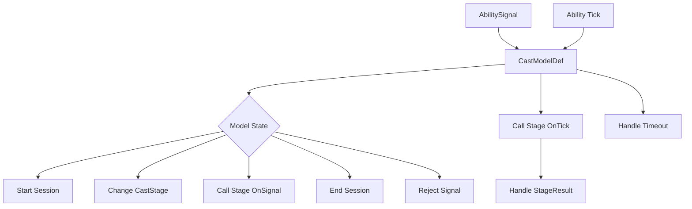

---

### 删除 CastFlowDef 与 StageDriver

上一版中的：

```text
CastFlowDef
StageDriver
ImmediateStageDriver
TimedStageDriver
HoldStageDriver
ChannelStageDriver
WindowStageDriver
```

全部删除。

原因是这些对象都在重复回答：

```text
阶段持续多久
什么时候结束
收到 Signal 怎么办
```

这些本来就是“怎么施法”的问题，应该统一由 `CastModelDef` 负责。

调整后：

```text
CastModelDef
    管时间与阶段流程

StageDef
    管阶段内容
```

不存在第三个流程控制层。

---

### CastStage：CastModel 中统一的阶段位置

具体 `CastModelDef` 不再持有裸 `StageDef` 字段。

每一个阶段位置统一使用：

```text
CastStage
├── Stage : StageDef
├── Duration : StageDuration
├── IconOverride optional
└── NotifyAbilityCastOnEnter
```

`CastStage` 是一个很轻的数据结构。

它没有：

```text
Id
Kind
Role
Driver
Transition
Condition
```

`StageDef` 决定：

> 这个阶段具体做什么、观察什么或与哪个外部系统协作。

`Duration` 决定：

> 这个阶段最多允许停留多久。

`IconOverride` 只负责：

> 当前技能处于这个阶段位置时，是否覆盖 `AbilityDef.Icon`。

`NotifyAbilityCastOnEnter` 负责：

> 声明成功进入当前模型位置时，是否由 AbilityHandler 向单位框架触发一次 AbilityCast 回调。

默认值为 `false`。

`CastStage` 在具体模型中的字段位置决定：

> 这个阶段在施法模型中承担哪个位置。

例如：

```text
HoldReleaseCastModelDef
├── Hold : CastStage
└── Release : CastStage
```

其中：

```text
Hold.Stage
    = VarusQHoldStageDef

Hold.Duration
    = 60 Tick
```

`Hold` 这个字段位置已经明确表达当前模型位置。

`StageDef` 本身不需要知道自己被放在 `Hold`、`Release` 或其它位置。

类关系：

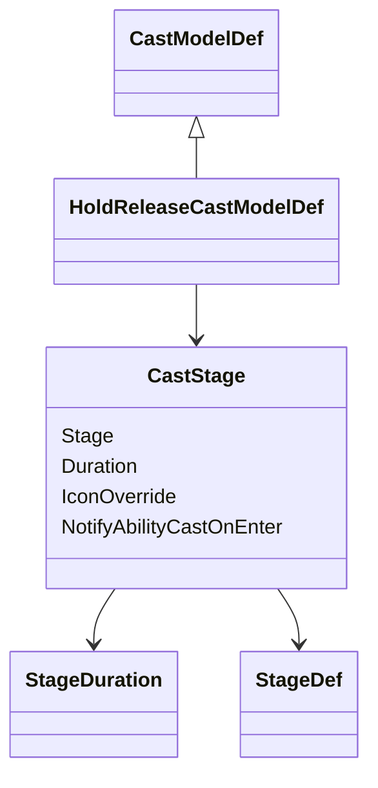

具体模型直接定义自己需要多少个 `CastStage`：

```text
CommitCastModelDef
├── Cast : CastStage
└── Finish : CastStage optional

HoldReleaseCastModelDef
├── Hold : CastStage
├── HoldTimeoutPolicy
├── Release : CastStage
└── Finish : CastStage optional

ChannelCastModelDef
├── Channel : CastStage
├── Interruptible
└── Finish : CastStage optional

ActiveSignalCastModelDef
├── Active : CastStage
└── Finish : CastStage optional
```

因此施法模型从结构上限制：

```text
有多少个 Stage 位置
每个位置在模型中叫什么
每个位置绑定哪个 StageDef
```

#### 所有 CastStage 都必须有 StageDef

不再允许：

```text
Stage = null
Empty Stage
Pure Time Stage
```

等待、前摇、后摇和两个内容阶段之间的短间隔，仍然是有语义的施法阶段。

它们通常需要承担至少一部分职责：

```text
切换图标
通知动画或其它表现
添加或观察 Buff
检查目标、区域实体或外部状态
等待 Signal
在退出时清理临时状态
通过 StageResult 提前完成或失败
```

因此应该配置一个对应的 `StageDef`。

例如：

```text
Windup
├── Stage = WindupStageDef
└── Duration = 15 Tick

Impact
├── Stage = DamageStageDef
└── Duration = 0 Tick

Interval
├── Stage = IntervalStageDef
└── Duration = 5 Tick

Recovery
├── Stage = RecoveryStageDef
└── Duration = 20 Tick
```

如果某个阶段确实只等待固定时长，可以复用非常轻的：

```text
DelayStageDef
```

但仍然保持：

```text
CurrentStage 始终存在
```

这能让 UI、动画、Debug 和阶段条件检查都保持一致。

---

### CastStageKey：施法模型的位置标识

外部系统需要知道：

> 当前处于施法模型的哪个位置。

这不应该由 `StageDef` 提供，也不需要通过 Traits 自动推导。

具体 `CastModelDef` 本来就维护自己的状态机位置，因此它直接提供：

```text
GetCurrentStageKey
```

返回：

```text
CastStageKey
```

`CastStageKey` 只是当前模型位置的稳定标识。

例如：

```text
CommitCastModelDef
    Cast
    Finish

HoldReleaseCastModelDef
    Hold
    Release
    Finish

ChannelCastModelDef
    Channel
    Finish

ActiveSignalCastModelDef
    Active
    Finish
```

流程：

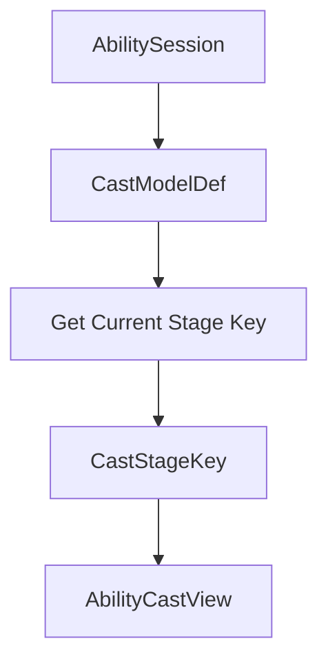

`CastStageKey` 不参与技能流程控制。

核心状态机仍然由具体 `CastModelDef` 自己运行。

它只负责把当前模型位置暴露给外部系统。

`CastStageKey` 也不应该让设计人员在每个 `CastStage` 上自由填写字符串。

推荐由具体施法模型定义稳定常量或轻量枚举，并在生成 `AbilityCastView` 时提供。

例如：

```text
HoldReleaseCastModelDef
当前内部状态 = Hold
-> CurrentStageKey = Hold
-> CurrentCastStage = Hold 字段
```

外部观察时，以下组合能够准确描述当前施法状态：

```text
AbilityDef
CastModelDef
CastStageKey
StageDef
```

同一个 `StageDef` 即使被放到另一个模型位置，也不会误以为自己拥有固定的阶段类型。

---

### NotifyAbilityCastOnEnter：单位技能施放回调

单位框架的 `UnitEventBus` 需要一个“单位施放技能”的强类型结果事件。

这里保持单一且明确的语义：

> 只有被标记的 `CastStage` 在成功进入时，才发布一次 `AbilityCastEvent`。

它不等于：

```text
创建 AbilitySession
推进任意 Stage
处理任意 Signal
技能内部发射一次效果
Session 结束
```

`CastStage` 只保留：

```text
NotifyAbilityCastOnEnter
```

默认：

```text
false
```

触发顺序：

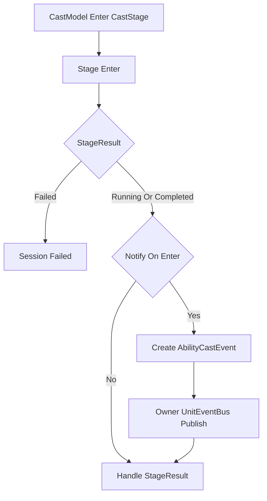

必须先确认：

```text
Stage.Enter
-> Running 或 Completed
```

才发布事件。

如果 `Stage.Enter` 返回 `Failed`，则不发布。

如果返回 `Completed`，先同步发布事件，再由 CastModel 推进。

`Stage.OnTick` 和 `Stage.OnSignal` 不检查这个标记。

---

#### 为什么标记属于 CastStage

是否算作一次技能施放，取决于：

```text
StageDef 被放在当前 CastModelDef 的哪个位置
```

而不是 `StageDef` 类型本身。

因此标记放在：

```text
CastStage.NotifyAbilityCastOnEnter
```

而不是 `StageDef`。

同一个可复用 `StageDef` 在不同技能位置可以有不同回调语义。

---

#### AbilityCastEvent 与即时分发

事件结构与单位框架保持一致：

```text
AbilityCastEvent
├── AbilityId
└── AbilitySessionUid
```

创建时：

```text
AbilityId = runtime.Def.AbilityId
AbilitySessionUid = session.Uid
```

发布链路：

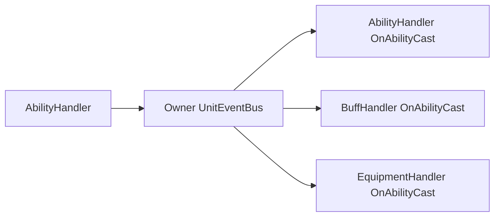

`UnitEventBus.Publish` 是立即、同步、固定顺序分发。

不增加：

```text
IAbilityCastEventSink
GameplayEventQueue
EventSequence
EventKey
StageKey Event Payload
AbilityStageEvent
SessionFinishedEvent
SessionCancelledEvent
```

技能系统不维护任何事件序号。

`AbilityHandler.OnAbilityCast` 只用于驱动固定被动和主动技能附带被动。

为了避免在 `Stage.Enter` 中重入施法状态机，被动事件处理不得直接：

```text
切换当前 Stage
结束当前 AbilitySession
再次调用 HandleSignal
切换主动技能组
分配技能点
```

被动效果需要产生 Gameplay 结果时，应向对应系统提交正式 Request。

---

### StageDuration：所有阶段都有明确的时间边界

每一个 `CastStage` 无一例外都必须配置 `Duration`。

Duration 只允许两种形式：

```text
Finite
    Ticks

Infinite
```

例如：

```text
Duration = 0 Tick
    立即阶段

Duration = 15 Tick
    有限阶段

Duration = 60 Tick
    有限阶段

Duration = Infinite
    无限等待阶段
```

阶段时长是 CastModel 的静态施法配置。

不允许：

```text
DurationByLevel
Duration 根据 ChargeRatio 改变
Duration 从 Blackboard 动态读取
```

等级成长、英雄属性或其它动态因素不改变 Stage 的最大时间边界。

这带来两个好处。

第一，所有有限且非零时长的阶段天然拥有统一进度：

```text
StageProgress =
    Clamp01(StageElapsedTicks / DurationTicks)
```

`0 Tick` 阶段视为立即阶段。

如果外部在该阶段仍可观察到它：

```text
StageProgress = 1
```

通常它会在同一次技能更新内执行 `Enter`、处理 `StageResult`，并立即进入 Timeout 处理，因此外部系统不应该依赖观察一个 `0 Tick` Stage 的中间状态。

第二，阶段始终存在明确的最晚处理点：

```text
提前完成
-> CastModel 提前推进

一直没有完成
-> 到达 Duration
-> CastModel 处理 Timeout
```

`Infinite` 阶段没有 `StageProgress`。

外部动画系统可以把它视为 Loop 或自行使用 Blackboard 中的其它技能语义数据。

---

### StageResult：Stage 可以提前报告完成或失败

Duration 是阶段的最终时间边界，不是唯一推进条件。

Stage 内容可能因为技能自身的运行状态提前完成。

例如：

```text
位移已经结束
目标已经到达
区域实体已经消失
捕获数量达到要求
剩余发射次数归零
```

因此 Stage 生命周期返回统一的：

```text
StageResult
```

只保留三个结果：

| Result | 含义 |
|---|---|
| `Running` | 当前 Stage 继续运行 |
| `Completed` | 当前 Stage 内容已经完成 |
| `Failed` | 当前 Stage 无法继续 |

处理关系：

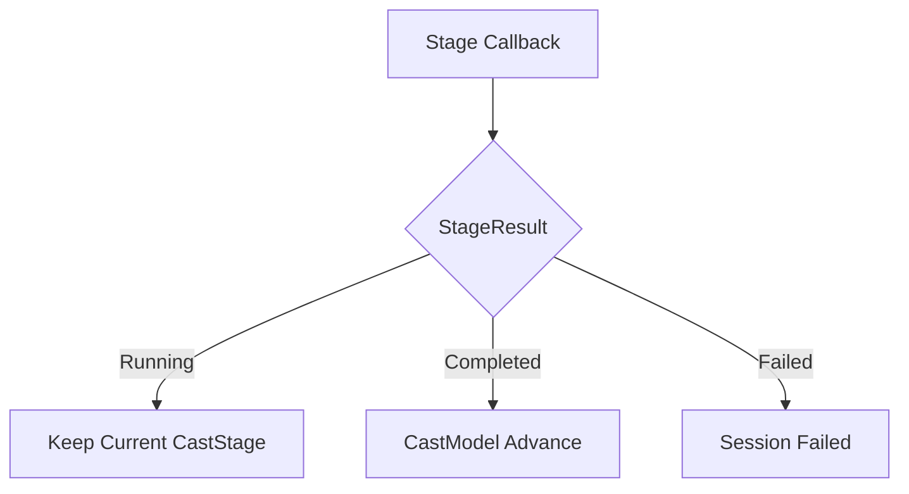

`Completed` 只表示：

> 当前 Stage 内容认为自己已经完成。

至于：

```text
进入下一个 CastStage
还是整个 Session Completed
```

仍然由当前 `CastModelDef` 决定。

这样特殊条件仍然由具体 Stage 自己理解。

CastModel 不需要知道：

```text
ProjectileId
AreaEntity
TargetMark
HitCount
RemainingShots
```

---

### 每 Tick 的统一推进顺序

当前阶段每 Tick 的流程固定为：

```text
1. 调用 CurrentStage.OnTick

2. 处理 StageResult

   Failed
       -> Session Failed

   Completed
       -> CastModel 按当前模型推进

   Running
       -> 继续

3. 如果仍停留在当前 CastStage
   检查 Duration 是否超时

4. 如果超时
   -> CastModel 处理当前阶段 Timeout
```

逻辑图：

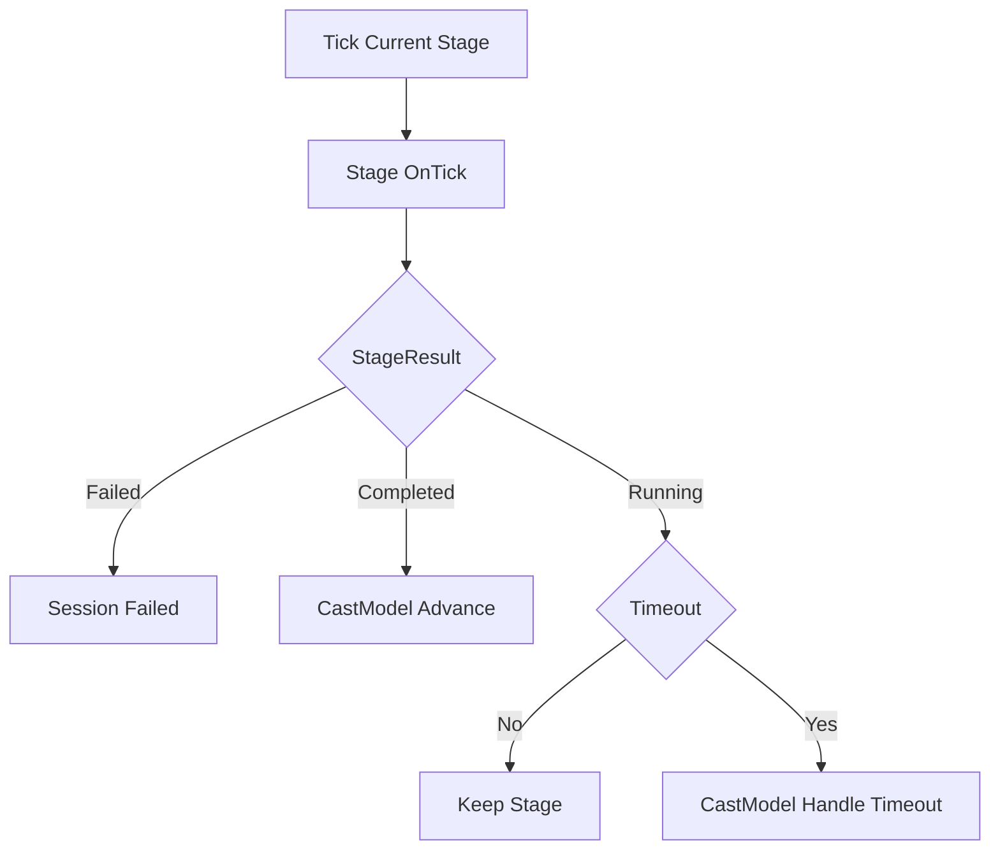

Signal 的流程则是：

```text
1. CastModel 接收 AbilitySignal

2. CastModel 判断当前模型状态如何解释 Signal

3. 如果模型决定触发当前 Stage 行为
   -> 调用 Stage.OnSignal

4. 处理 StageResult
```

因此：

> Signal 不一定推进 Stage。

它也可以只触发当前 Stage 的一次行为。

---

### Timeout 必须由具体 CastModel 处理

阶段超时不统一等价于 `Completed`。

不同施法模型对超时的语义不同。

例如：

```text
Hold 超时
-> 自动 Release

确认等待超时
-> Cancelled

Channel 超时
-> 正常推进

特殊等待阶段超时
-> Failed
```

所以不在 `StageDef` 或 `CastStage` 上加入通用：

```text
TimeoutPolicy
```

超时处理属于具体 `CastModelDef`。

例如：

```text
HoldReleaseCastModelDef
    Hold Timeout
        -> AutoRelease 或 Cancel

    Release Timeout
        -> Advance

ChannelCastModelDef
    Channel Timeout
        -> Advance

ActiveSignalCastModelDef
    Active Timeout
        -> Advance
```

自定义施法状态机可以实现自己的 Timeout 行为。

这样：

```text
Duration
    提供统一时间边界

CastModel
    解释超时意味着什么
```

职责仍然清晰。

---

### CommitCastModelDef：确认后开始的普通技能

适合：

```text
普通瞬发技能
普通目标技能
普通范围技能
投射物技能
一次性位移技能
```

结构：

```text
CommitCastModelDef
├── Cast : CastStage
└── Finish : CastStage optional
```

基本流程：

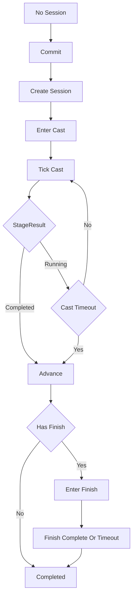

如果：

```text
Cast.Duration = 0 Tick
```

流程是：

```text
Enter Cast.Stage
-> 处理 Enter 返回的 StageResult
-> 如果仍为 Running
-> 当前 CastStage 立即 Timeout
-> CommitCastModel 推进
```

需要立即生效的逻辑直接写在 `Stage.Enter`。

不需要 `ImmediateStageDriver`。

---

### HoldReleaseCastModelDef：蓄力与释放

适合：

```text
韦鲁斯 Q
泽拉斯 Q
蓄力后释放的方向技能
```

> **当前蓄力型施法模型的输入默认**：按下技能键进入蓄力（Focus），
> 技能键松开不产生任何 AbilitySignal（不 Commit、不 Cancel），左键
> 模板自定义其它组合（须通过离线合法性检查）。模型本身不把"松键"
> 当作信号来源。

结构：

```text
HoldReleaseCastModelDef
├── Hold : CastStage
├── HoldTimeoutPolicy
├── Release : CastStage
└── Finish : CastStage optional
```

基本流程：

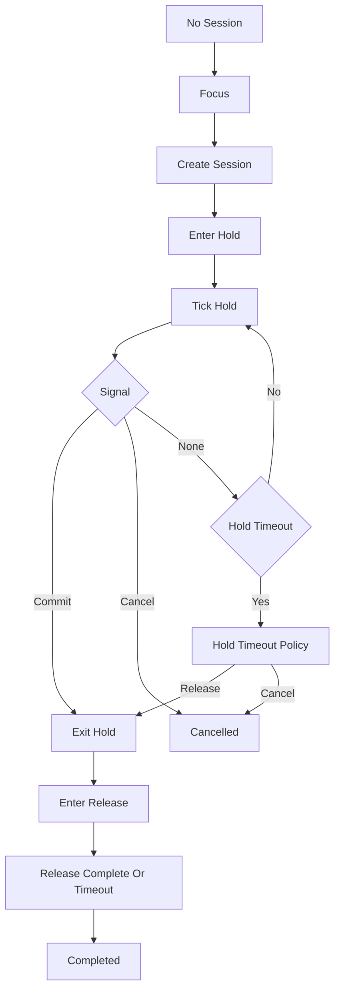

模型负责：

```text
Focus 创建 Session
Commit 从 Hold 推进到 Release（当前默认由输入层左键提供）
技能键松开在当前默认预设下不产生信号，不参与模型推进
Cancel 取消
Hold 超时后自动释放还是取消
Release 完成或超时后的推进
```

`Hold.Stage` 自己不判断 Commit。

例如韦鲁斯 Q：

```text
Hold.Stage.OnTick
-> 根据 StageElapsedTicks 与 Hold.Duration 计算 ChargeRatio
-> 写 Blackboard
-> Running
```

如果某个特殊蓄力内容自己已经满足完成条件，也可以返回 `Completed`，由 `HoldReleaseCastModelDef` 决定如何推进。

---

### ChannelCastModelDef：持续引导

适合：

```text
卡特琳娜 R
需要保持一段时间的持续施法
持续 Tick 的技能
```

结构：

```text
ChannelCastModelDef
├── Channel : CastStage
├── Interruptible
└── Finish : CastStage optional
```

流程：

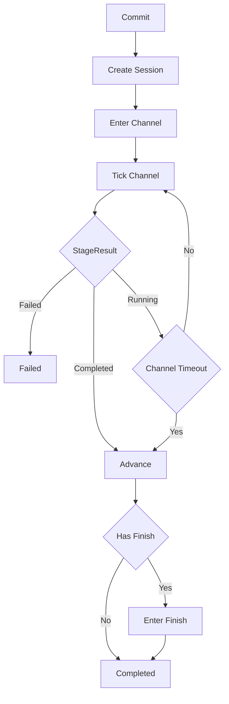

周期效果不需要 `PeriodicStageDriver`。

具体 `Channel.Stage.OnTick` 可以根据：

```text
StageElapsedTicks
TickInterval 配置
Blackboard 中的运行状态
```

在正确 Tick 提交伤害或其它请求。

`TryInterrupt` 是否被接受由 `ChannelCastModelDef` 决定。

---

### ActiveSignalCastModelDef：持续阶段内重复接受 Signal

泽拉斯 R 暴露了一个重要事实：

> Signal 不一定意味着切换 Stage。

泽拉斯 R 激活后，整个大招持续期间仍然处于同一个时间阶段。

再次确认只表示：

```text
在当前 Active Stage 内执行一次主要动作
```

因此提供：

```text
ActiveSignalCastModelDef
```

结构：

```text
ActiveSignalCastModelDef
├── Active : CastStage
└── Finish : CastStage optional
```

流程：

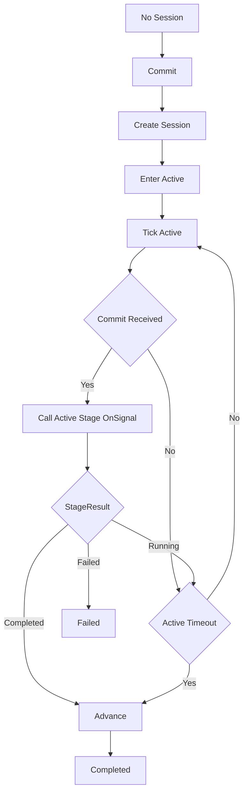

泽拉斯 R：

```text
第一次 Commit
-> 创建 Session
-> Active.Stage.Enter
-> Blackboard 写入 RemainingShots

持续期间再次 Commit
-> CastModel 接受 Commit
-> Active.Stage.OnSignal
-> 发射一次落点攻击
-> RemainingShots 减一

还有炮
-> Running

RemainingShots == 0
-> Completed
-> CastModel 推进并结束 Session
```

这里不再需要：

```text
EndCondition
```

因为“剩余炮数是否归零”属于泽拉斯 R 的技能内容。

`XerathRActiveStageDef.OnSignal` 自己理解这个动态状态，并通过 `StageResult` 告诉模型：

```text
继续当前 Stage
或者
当前 Stage 已完成
```

CastModel 仍然不知道“炮数”。

这样也不会出现：

```text
Active -> FireStage -> Active -> FireStage
```

这种为了“一次动作”反复切换时间阶段的结构。

---

### CastModel 的扩展边界

不应该为了每个英雄技能都新增 CastModel。

判断标准：

> 差异发生在“技能做什么”，优先新增 StageDef。  
> 差异发生在“Signal、阶段位置和超时如何组织”，才新增 CastModelDef。

例如：

| 差异 | 扩展位置 |
|---|---|
| 伤害按距离变化 | StageDef |
| 投射物穿透后伤害衰减 | StageDef 或投射物逻辑 |
| 命中目标后添加标记 | StageDef |
| 蓄力期间范围增长 | StageDef |
| 某个动态条件达到后提前完成 | StageDef 返回 `Completed` |
| Commit 从 Hold 切到 Release | CastModelDef |
| Commit 在当前阶段重复触发动作 | CastModelDef |
| Hold 超时自动释放 | CastModelDef |
| 一个技能需要完全不同的 Signal 与阶段状态机 | 自定义 CastModelDef |

建议内置少量高频施法模型：

```text
CommitCastModelDef
HoldReleaseCastModelDef
ChannelCastModelDef
ActiveSignalCastModelDef
```

如果某种流程在多个英雄中重复出现，再增加新的通用模型。

单个英雄真正特殊的施法状态机，可以直接写自定义 `CastModelDef`，不要为了避免写代码而把通用模型撑成巨大配置语言。

---


## 需求演进

### 2026-10-02

变动内容：韦鲁斯测试套件使用普通点/方向提交、hold-release 与纯开关组合。

legacyDecision：D-029

### 2026-08-06

变动内容：按等级冷却、蓄力减速/超时退款和复仇被动；旧启动授权携带方案已由后续修订替代。

legacyDecision：D-031

