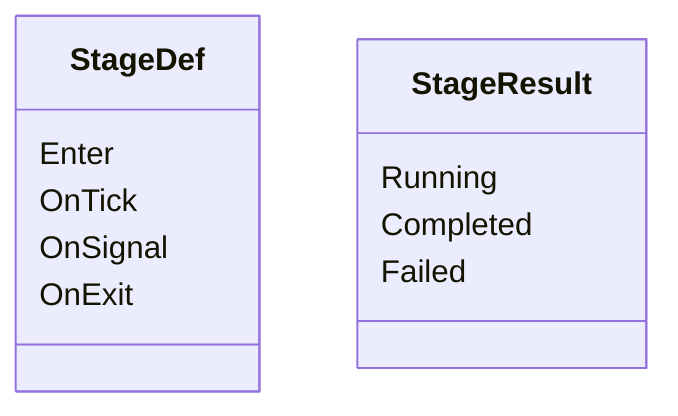
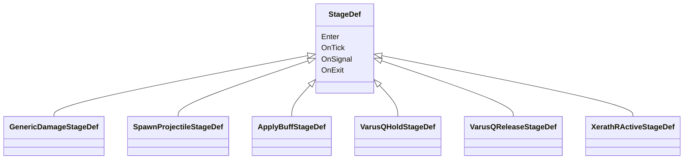
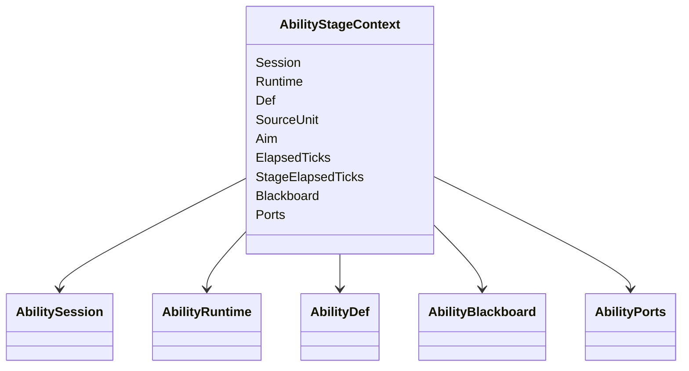
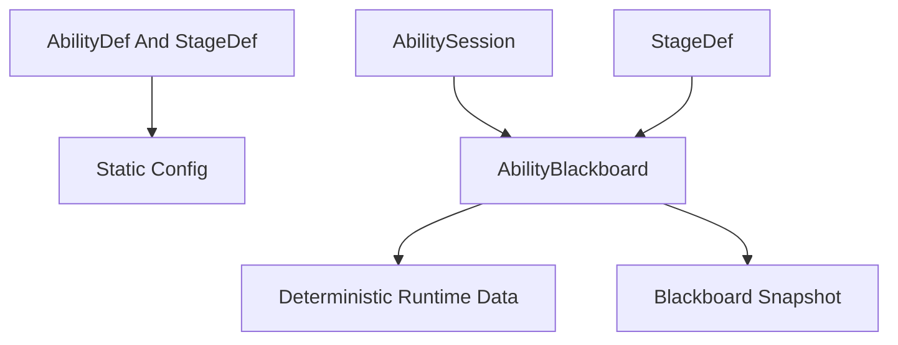
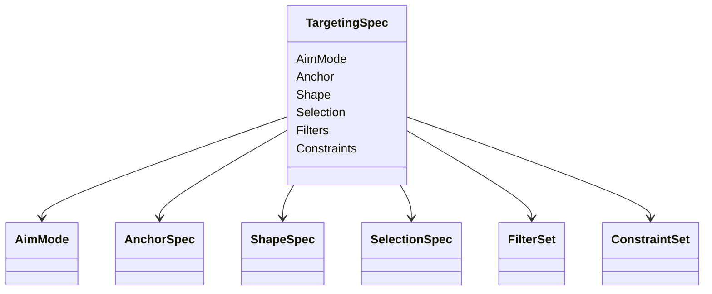
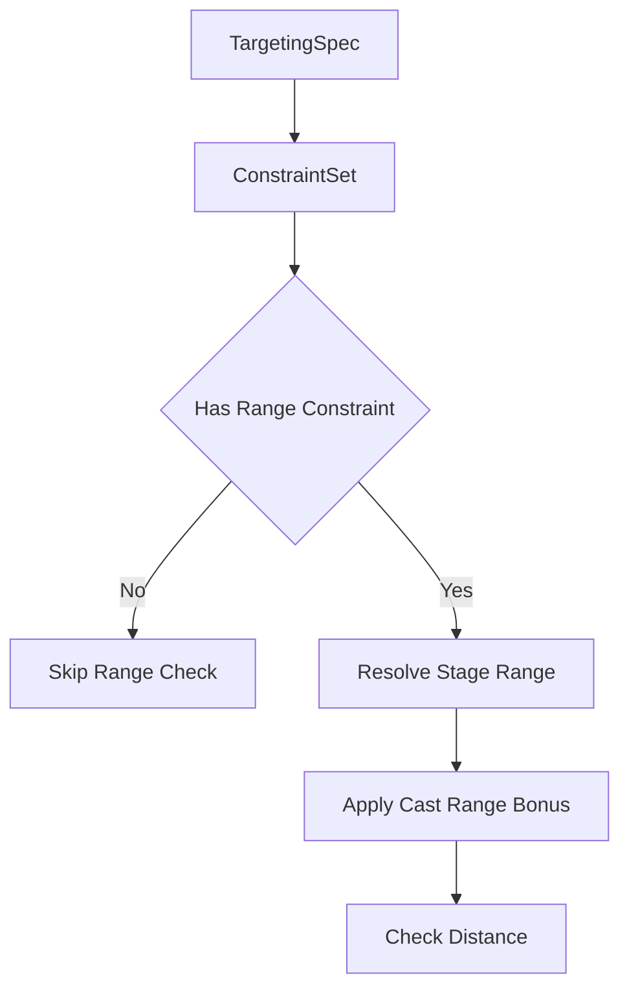
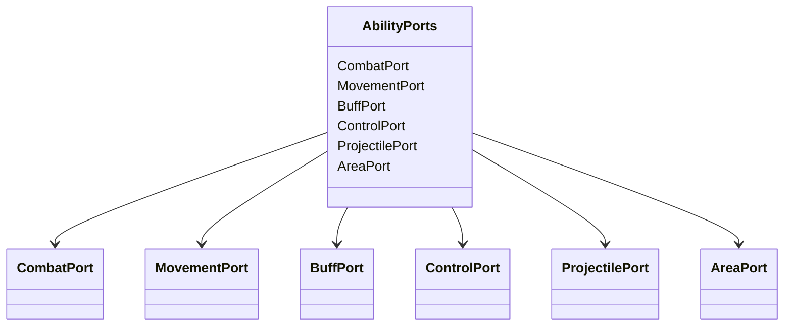

# 阶段效果与确定性黑板

## 目标实现

每阶段可用自己的等级数值、目标和生命周期组合效果。

## 技术方案

StageDef 用 AbilityStageContext、AbilityPorts 和受限 AbilityBlackboard；技能范围约束按需启用，效果写入所属系统，不增加 EffectPlan/EffectStep。

## 边界情况

Handle 由创建 Effect 自己清理；Stage 成长不放在 AbilityDef 全局重复字段；结构过滤配置之外仍保留中央准入。

## 验收条件

- 正常路径达到上述目标，并由所属模块唯一拥有权威状态。
- 以上边界情况有明确返回、拒绝或可见失败；不得用占位成功代替行为。
- 确定性逻辑比较重复执行、改变插入顺序以及捕获/恢复/重演结果；只读界面不得改变 Gameplay。

## 工程实际核查

本期检索的是当前源码和测试定义。存在实现不等于完成全部需求，存在测试不等于本期已运行通过。

- `Assets/Scripts/Gameplay/Ability/AbilityBlackboard.cs`：当前关联实现定义 AbilityBlackboardKey、AbilityBlackboardValueKind、AbilityBlackboardEntrySnapshot、AbilityBlackboardSnapshot、AbilityBlackboard（以源码为实际命名）。
- `Assets/Scripts/Gameplay/Ability/StageDef.cs`：当前关联实现定义 StageDef、StageResult（以源码为实际命名）。

### 已有测试位置

- `Assets/Scripts/Gameplay/Tests/StageDefBakeTests.cs`：AreaDamageStageDef_OnEnter_WithoutWorld_ReturnsFailed、SpawnProjectileStageDef_OnEnter_WithoutWorld_ReturnsFailed、ApplyBuffStageDef_OnEnter_WithoutWorld_ReturnsFailed、DashStageDef_OnEnter_WithValidConfig_ReturnsRunning、DashStageDef_OnTick_WithoutWorld_ReturnsFailed、AreaDamageAuthoring_Bake_ProducesValidStageDef、AreaDamageAuthoring_Bake_RejectsEmptyTargetMasks。
- `Assets/Scripts/Gameplay/Tests/AbilityCostAndCastTests.cs`：SessionStartCost_UsesLevelResourceAndHealth、FailedStage_DoesNotConsumeCost、HoldRelease_FirstCommitPaysOnceAndStoresAim、InvalidAimRange_ConsumesNothing、Snapshot_PreservesFirstCommitPayment、Toggle_FirstCommitActivatesAndSecondCommitTurnsOff、Toggle_TurnOffDoesNotStartCooldown。

## 附录：精确接口、公式与配置

附录保留本功能必须精确表达的接口、运算和配置语义，原系统章节已拆到所属功能。若与上面的已接受修订仍有冲突，进入待确认清单而不是按旧版本执行。

### 四、StageDef：施法阶段的内容逻辑

重新定义 `StageDef`：

> `StageDef` 是 `CastModelDef` 所定义的某个施法时间阶段中的内容逻辑。

`CastModelDef` 与 `CastStage` 定义：

```text
这是 Hold 阶段
这是 Channel 阶段
这是 Active 阶段
这个阶段的静态 Duration 是多少
Signal 在这个阶段代表什么
阶段完成或超时后如何推进
```

`StageDef` 定义：

```text
进入这个阶段做什么
这个阶段每 Tick 做什么
模型要求当前阶段响应一次 Signal 时做什么
离开这个阶段做什么
当前技能内容是否已经完成或失败
```

因此 `StageDef` 不再拥有：

```text
StageId
StageKind
Duration
DurationPolicy
StageDriver
NextStage
BranchRule
EffectPlan
EffectStep
Gates
TimeoutPolicy
```

---

### StageDef 生命周期与 StageResult

核心生命周期只保留四个：

```text
Enter
OnTick
OnSignal
OnExit
```

其中：

```text
Enter
OnTick
OnSignal
```

统一返回：

```text
StageResult
```

`OnExit` 不返回结果。



生命周期语义：

| 生命周期 | 调用者 | 说明 |
|---|---|---|
| `Enter` | CastModel | 进入阶段并执行初始化内容 |
| `OnTick` | CastModel | 当前阶段持续期间每 Tick 调用 |
| `OnSignal` | CastModel | 模型决定当前 Signal 应触发阶段行为时调用 |
| `OnExit` | CastModel | 离开当前阶段时调用 |

`StageResult`：

```text
Running
    当前阶段继续

Completed
    当前 Stage 内容已完成
    由 CastModel 决定下一步

Failed
    当前技能内容无法继续
    Session -> Failed
```

例如拉克丝 E 的爆炸阶段：

```text
Enter
-> Blackboard 中的 AreaEntity 已不存在
-> Failed
```

例如一个等待位移完成的 Stage：

```text
OnTick
-> Dash 尚未结束
-> Running

OnTick
-> Dash 已结束
-> Completed
```

例如泽拉斯 R：

```text
OnSignal
-> 发射一炮
-> RemainingShots > 0
-> Running

OnSignal
-> 发射最后一炮
-> RemainingShots == 0
-> Completed
```

注意：

> `StageDef.OnSignal` 不判断自己接受 `Focus` 还是 `Commit`。

例如泽拉斯 R：

```text
ActiveSignalCastModel 收到 Commit
-> 模型判断当前处于 Active
-> 模型调用 Active.Stage.OnSignal
```

`XerathRActiveStageDef` 只负责“发射一次大招落点攻击”。

它不关心这个调用来自：

```text
R 键
鼠标左键
AI
脚本
```

也不需要再次判断 `Commit`。

---

### 删除 EffectPlan 与 EffectStep

上一版关系是：

```text
StageDef
-> EffectPlan
-> EffectStep[]
```

这套模型理论上可以配置：

```text
DamageStep
ApplyBuffStep
SpawnProjectileStep
DashStep
```

但继续扩展复杂 MOBA 技能后，很容易变成：

```text
DamageByMissingHealthStep
DamageByDistanceStep
ConditionalDamageStep
ExecuteStep
ChainDamageStep
DelayedDamageStep
CustomTargetSource
CustomValueSource
CustomStopPolicy
```

最终是在 ScriptableObject 中重新发明一套低代码脚本语言。

因此当前版本删除：

```text
EffectPlan
EffectStep
EffectGraphDef
```

Stage 本身就是 ScriptableObject 逻辑。



开发方式变成：

```text
高频通用内容
-> 写可复用 StageDef

英雄特殊内容
-> 写英雄专属 StageDef
```

例如：

```text
GenericDamageStageDef
├── DamageRecipe
├── BaseDamageByLevel
└── TargetingSpec
```

```text
VarusQReleaseStageDef
├── ProjectileDef
├── MinDamageByLevel
├── MaxDamageByLevel
├── MinRangeByLevel
└── MaxRangeByLevel
```

这些字段都是正常 ScriptableObject 配置。

逻辑由对应 StageDef 的代码完成。

这保留了配置化能力，同时不要求通用框架枚举所有英雄技能效果。

---

### AbilityStageContext：Stage 的统一执行上下文

Stage 不应该拿到整个 `AbilityHandler` 后随意访问任何系统。

推荐提供：

```text
AbilityStageContext
```



Stage 可以从 Context 获取：

```text
当前 AbilityDef
技能等级
施法者
Aim
Session 时间
当前阶段时间
Blackboard
受控的外部系统接口
```

`SimulationTickContext` 不作为 Context 字段或函数参数层层传递。

Stage 确实需要当前逻辑 Tick 时，直接读取：

```text
SimulationTickContext.Current.Tick
```

例如韦鲁斯 Q：

```text
VarusQHoldStageDef.OnTick
    读取 StageElapsedTicks
    根据配置计算 ChargeRatio
    写入 Blackboard
```

```text
VarusQReleaseStageDef.Enter
    从 Blackboard 读取 ChargeRatio
    按等级配置计算伤害和距离
    通过 ProjectilePort 创建投射物
```

---

### AbilityBlackboard：确定性单次施法数据

`AbilityBlackboard` 保存：

> 当前 `AbilitySession` 运行过程中产生，并且可能影响后续模拟的动态共享数据。

它由 `AbilitySession` 创建，并随 Session 结束销毁或归池时清空。

它不保存静态配置：

```text
基础伤害
技能射程
冷却成长
ManaCost
ProjectileDef
```

这些仍然属于 `AbilityDef` 或具体 `StageDef`。

典型 Blackboard 数据：

```text
ChargeRatio
ChargeStartTick
CreatedAreaEntityUid
CapturedTargetUid
HitCount
RemainingShots
LastCastPoint
```

关系：



#### 不再使用 Dictionary string object

不允许继续使用：

```text
Dictionary<string, object>
```

原因：

```text
字符串 Key 难以稳定校验
object 不能保证确定性类型
引用对象无法可靠复制和恢复
浅拷贝无法形成有效快照
```

Blackboard 使用稳定 Key 和受限值类型：

```text
BlackboardEntry
├── KeyId
├── ValueKind
└── Value
```

建议首期支持：

```text
Int
Bool
Fp
Fp2
UnitUid
ProjectileUid
EntityUid
```

如果以后需要新类型，应显式增加确定性 ValueKind，而不是开放任意 object。

开发层可以使用强类型 Key：

```text
BlackboardKey<Fp> ChargeRatio
BlackboardKey<Int> RemainingShots
BlackboardKey<UnitUid> CapturedTarget
```

Stage 的调用方式仍然简单：

```text
Blackboard.Set ChargeRatio value
Blackboard.TryGet ChargeRatio out value
```

Typed Key 是代码层的类型安全工具，不是 ScriptableObject 配置，也不是预先写死的 Blackboard 内容。

#### 只保存值或稳定 UID

可以保存：

```text
UnitUid
ProjectileUid
EntityUid
```

不能保存：

```text
Unit 对象
Projectile 实例
GameObject
Transform
List Unit
任意可变引用对象
```

恢复后通过对应 World 使用 UID 重新查询对象。

这保证 Blackboard 可以稳定复制、序列化和恢复。

#### Blackboard Snapshot

`AbilityHandler` 不维护 Blackboard 的逐 Tick历史。

顶层 Gameplay Snapshot 系统在保存回滚点时调用：

```text
AbilityRuntime Capture
-> ActiveSession Snapshot
-> Blackboard Capture
```

快照只复制当前确定性条目：

```text
AbilityBlackboardSnapshot
└── Entries
    ├── KeyId
    ├── ValueKind
    └── Value
```

恢复时：

```text
创建或重置 AbilitySession
-> 恢复 Blackboard Entries
```

动画、UI、指示器和 Debug 仍然读取当前 Blackboard 的只读视图，不读取 Snapshot。

---

### Stage 自己持有等级成长配置

技能等级成长不再通过：

```text
StageLevelTable
GetValue by string key
StageResolvedView EffectValues
```

统一查找。

原则改为：

> 谁使用一个等级成长值，谁在自己的配置中持有它。

例如：

```text
GenericDamageStageDef
    BaseDamageByLevel
```

```text
VarusQReleaseStageDef
    MinDamageByLevel
    MaxDamageByLevel
    MinRangeByLevel
    MaxRangeByLevel
```

```text
AreaDamageStageDef
    RadiusByLevel
    BaseDamageByLevel
```

运行时：

```text
BaseDamageByLevel.Resolve(Runtime.Level)
```

这样外部逻辑不需要：

```text
GetValue("Damage")
GetValue("Range")
GetValue("Radius")
```

也不需要为了兼容所有技能，在 `StageResolvedView` 中提前定义：

```text
Damage
Heal
Shield
Range
Radius
Width
Angle
ProjectileSpeed
```

Stage 的 Inspector 直接展示它真正需要的字段。

---

### TargetingSpec：Stage 按需使用的目标描述

不是每个 Stage 都需要目标和形状。

因此 `TargetingSpec` 不放进 `StageDef` 基类。

需要选目标的具体 Stage 自己持有：

```text
TargetingSpec
```

例如：

```text
GenericDamageStageDef
    TargetingSpec

SpawnProjectileStageDef
    TargetingSpec

VarusQReleaseStageDef
    TargetingSpec
```

目标描述由以下部分组合：

```text
AimMode
Anchor
Shape
Selection
Filters
Constraints
```



组合逻辑：

```text
AimMode
    外部需要提供什么目标信息

Anchor
    几何查询从哪里开始

Shape
    使用什么形状

Selection
    形状内如何取目标

Filters
    哪些单位合法

Constraints
    施法者、Aim 或目标之间还需要满足什么限制
```

例如：

| 技能 | AimMode | Anchor | Shape | Selection |
|---|---|---|---|---|
| 安妮 Q | Unit | TargetUnit | SingleUnit | Single |
| 拉克丝 E | Point | TargetPoint | Circle | All |
| 伊泽瑞尔 Q | Direction | Caster | Capsule | FirstHit |
| 瑟提 W | Direction | Caster | Sector | All |
| 卡尔萨斯 R | None | Global | Global | All |
| 墨菲特 R | Point | TargetPoint | Circle | All |

因此“目标”和“形状”不是两个平行枚举。

完整语义是：

```text
Aim 提供目标信息
-> Anchor 确定查询基点
-> Shape 构造查询区域
-> Selection 从区域内选择
-> Filters 过滤单位
-> Constraints 检查额外限制
```

---

### 施法距离作为可选 Constraint

施法距离不是所有技能和所有 Stage 都有。

因此核心类不提供统一必填：

```text
CastRange
```

需要距离检查的 `TargetingSpec` 配置：

```text
RangeConstraint
```

不需要则完全不配置。



例子：

| 情况 | 放置位置 |
|---|---|
| 普通目标技能最大施法距离 | CastStage 的 TargetingSpec |
| 目标点技能最大距离 | CastStage 的 TargetingSpec |
| 蓄力释放距离 | ReleaseStage 的 TargetingSpec |
| 投射物最大飞行距离 | ProjectileDef 或具体 Stage 配置 |
| 全图技能 | 不配置 RangeConstraint |

由于 Range 值由真正使用它的 Stage 持有，所以等级成长也自然属于该 Stage：

```text
VarusQReleaseStageDef
    MinRangeByLevel
    MaxRangeByLevel
```

`RangeConstraint` 可以向 Stage 查询当前有效 Range，或由具体 Stage 在构造 Targeting 查询时提供。

不需要一个全局 `StageValueTable` 再通过 Key 找 `"Range"`。

---

### Stage 与外部战斗系统只通过 AbilityPorts 接入

Stage 可以编写具体逻辑，但不应该直接绕过其它系统。

统一通过：

```text
AbilityPorts
```



例如：

```text
DamageStageDef
-> CombatPort Submit DamageRequest

HealStageDef
-> CombatPort Submit HealRequest

ShieldStageDef
-> CombatPort Submit ShieldRequest

DashStageDef
-> MovementPort Request Dash

ControlStageDef
-> ControlPort Apply Control

ProjectileStageDef
-> ProjectilePort Spawn Projectile
```

技能系统只负责：

```text
在正确的施法阶段
使用正确的动态参数
向对应系统提交请求
```

`AbilityCast` 回调不由 Stage 通过 Port 主动发出。

它由 `AbilityHandler` 在成功进入被标记的 `CastStage` 后，直接调用：

```text
Owner.EventBus.Publish(AbilityCastEvent)
```

不经过额外事件适配接口。

伤害公式仍由战斗系统的 Recipe 和 Pipeline 处理。

例如韦鲁斯 Q：

```text
ChargeRatio
-> Stage 计算本次技能基础参数
-> 构造 DamageRequest RuntimeParams
-> CombatPort
-> CombatSystem
```

技能系统不负责护甲、魔抗、吸血等最终战斗结算。

---

### 七、典型技能如何落到当前模型

本节只验证系统表达能力，不增加新的核心抽象。

---

### 普通圆形范围技能

例如一个普通点选圆形范围技能：

```text
AbilityDef
└── CommitCastModelDef
    └── Cast : CastStage
        ├── Duration = 0 Tick
        └── Stage = AreaDamageStageDef
```

`AreaDamageStageDef`：

```text
TargetingSpec
    AimMode = Point
    Anchor = TargetPoint
    Shape = Circle
    Selection = All
    RangeConstraint = optional

RadiusByLevel
BaseDamageByLevel
DamageRecipe
```

本地指示器：

```text
CommitCastModel
-> ResolveIndicatorStage = Cast.Stage

CircleIndicatorResolver
-> 读取 AreaDamageStageDef
-> 读取 Runtime.Level
-> 读取 Local Aim
-> 使用同一 TargetingSpec 和 RadiusByLevel
```

确认后：

```text
Commit
-> Session
-> Cast.Stage.Enter
-> Submit DamageRequest
-> StageResult
-> Cast Duration = 0
-> CommitCastModel 完成
```

---

### 韦鲁斯 Q 一类蓄力技能

```text
AbilityDef
└── HoldReleaseCastModelDef
    ├── Hold : CastStage
    │   ├── Duration = 固定最大蓄力 Tick
    │   └── Stage = VarusQHoldStageDef
    └── Release : CastStage
        ├── Duration = 固定释放阶段 Tick
        └── Stage = VarusQReleaseStageDef
```

`Hold.Stage`：

```text
Enter
-> 初始化 ChargeRatio
-> Running

OnTick
-> 根据 StageElapsedTicks / Hold.Duration 计算 ChargeRatio
-> 写 Blackboard
-> Running

OnExit
-> 清理仅属于 Hold 的临时状态
```

`Release.Stage`：

```text
Enter
-> 读取 ChargeRatio
-> 解析 MinRange 和 MaxRange
-> 解析 MinDamage 和 MaxDamage
-> 创建投射物
-> Running 或 Completed
```

`HoldReleaseCastModelDef`：

```text
Focus
-> Hold

Commit
-> Release

Hold Timeout
-> 自动释放或取消

Release Completed 或 Timeout
-> 完成
```

本地指示器：

```text
HoldReleaseCastModel
-> ResolveIndicatorStage = Release.Stage

VarusQIndicatorResolver
-> 读取 Release.Stage 静态配置
-> 读取 Runtime.Level
-> 读取 Blackboard ChargeRatio
-> 动态计算当前 Range 和 Width
```

如果 `Hold.Stage` 已经为了真实技能逻辑计算并写入：

```text
Blackboard.CurrentRange
```

本地 Resolver 也可以直接读取该值。

框架不要求为了避免重复计算而增加额外的通用解析层。

动画系统则可以从 `AbilityCastView` 读取：

```text
CurrentStage = VarusQHoldStageDef
StageProgress = StageElapsedTicks / Hold.Duration
Blackboard.ChargeRatio
```

---

### 泽拉斯 R 一类持续确认技能

```text
AbilityDef
└── ActiveSignalCastModelDef
    └── Active : CastStage
        ├── Duration = 固定大招持续 Tick
        └── Stage = XerathRActiveStageDef
```

`Active.Stage.Enter`：

```text
Blackboard Set RemainingShots
-> Running
```

`Active.Stage.OnSignal`：

```text
读取当前 Aim
提交一次落点技能逻辑
RemainingShots -= 1

RemainingShots > 0
-> Running

RemainingShots == 0
-> Completed
```

模型：

```text
第一次 Commit
-> 创建 Session

持续期间 Commit
-> Active.Stage.OnSignal

Running
-> 保持 Active

Completed
-> 结束 Session

Active Timeout
-> 结束 Session
```

这里没有 `FireStage`。

因为“发射一炮”只是 Active 时间阶段中的一次动作，不是新的施法时间阶段。

---

### 卡特琳娜 R 一类引导技能

```text
AbilityDef
└── ChannelCastModelDef
    └── Channel : CastStage
        ├── Duration = 固定引导 Tick
        └── Stage = KatarinaRChannelStageDef
```

`Channel.Stage.OnTick`：

```text
达到周期 Tick
-> 查询范围目标
-> 提交对应战斗请求

仍需引导
-> Running
```

模型：

```text
Commit
-> 开始 Channel

Channel Completed
-> 完成

Channel Timeout
-> 完成

TryInterrupt
-> Accepted
-> Interrupted
```

如果某些引导不可被普通中断：

```text
ChannelCastModelDef.Interruptible = false
```

死亡仍然通过 `ForceInterrupt` 终止。

---

### 拉克丝 E 一类创建区域后再触发的技能

这类技能需要区分：

```text
一次 Session 内的连续流程
跨 Session 的二次施法窗口
```

如果设计为同一 Session：

```text
自定义 CastModelDef
├── Launch : CastStage
├── ActiveArea : CastStage
└── Detonate : CastStage
```

例如：

```text
Launch
    Duration = 固定 Launch Tick

ActiveArea
    Duration = 固定区域最大存在 Tick

Detonate
    Duration = 0 Tick
```

`Launch.Stage` 创建区域并把 Entity 引用写入 Blackboard。

`ActiveArea.Stage` 持续 Tick。

收到对应 Commit 后，自定义模型提前切换到 `Detonate`。

如果 `Detonate.Stage.Enter` 发现 AreaEntity 已不存在：

```text
Enter -> Failed
-> Session Failed
-> AbilityHandler 返回最终 Outcome
```

如果 `ActiveArea` 一直没有收到 Commit：

```text
ActiveArea Timeout
-> 自定义 CastModel 决定自动爆炸、正常结束或失败
```

如果项目中的二段技能被单位框架视为一次新的独立施法，则也可以：

```text
第一次 AbilitySession 创建区域
-> AbilityRuntime 保存长期二段可用状态
-> 技能槽切换到 Detonate AbilityDef
-> 第二次 AbilitySession 执行爆炸
```

选择依据是：

> 这两段是否属于同一次持续施法过程。

不要为了统一所有二段技能，强迫它们使用同一种生命周期。

---

### 同一 Session 内的短阶段间隔

有些技能两个内容阶段之间存在很短的内部间隔。

例如：

```text
First Stage
-> 6 Tick 间隔
-> Second Stage
```

不要把这个时间放进：

```text
AbilityRuntime.CooldownState
```

因为整个 `AbilitySession` 尚未结束。

配置一个有明确语义的间隔 Stage：

```text
CustomCastModelDef
├── First : CastStage
│   ├── Stage = FirstStageDef
│   └── Duration = ...
├── Interval : CastStage
│   ├── Stage = IntervalStageDef
│   ├── Duration = 6 Tick
│   └── IconOverride = optional
└── Second : CastStage
    ├── Stage = SecondStageDef
    └── Duration = ...
```

流程：


`IntervalStageDef` 不一定直接产生伤害或投射物。

它仍然可以负责：

```text
Enter
    添加或确认某个 Buff
    初始化阶段运行数据

OnTick
    检查 Buff 是否仍存在
    检查目标或区域实体是否仍有效
    条件满足时返回 Completed
    条件失效时返回 Failed

OnSignal
    如果当前 CastModel 允许 Signal 提前推进
    返回对应 StageResult

OnExit
    清理阶段临时状态
```

如果该间隔确实只等待固定时长，可以复用通用：

```text
DelayStageDef
```

但不使用 `Stage = null`。

只有当前一次 `AbilitySession` 已经结束，而下一次施法需要等待一个短时间时，才应该使用 `AbilityRuntime` 的特殊冷却或重施法状态扩展。

---

### 亚索 R、纳尔 R 等特殊施法条件

这类技能不要求新增 CastModel。

例如亚索 R：

```text
AbilityDef
├── YasuoRCastConditionDef
└── CommitCastModelDef
```

`YasuoRCastConditionDef` 检查：

```text
目标是否合法
目标是否处于可接大状态
其它英雄专属条件
```

通过后：

```text
CommitCastModelDef
-> 进入 Cast
```

纳尔 R 同理。

特殊条件和特殊施法流程是两回事：

```text
条件特殊
-> AbilityCastConditionDef

Signal、阶段和超时状态机特殊
-> CastModelDef
```

不要因为“这个英雄技能很特殊”就直接新增施法模型。

---

### 技能施放回调示例

技能施放回调只发生在：

```text
成功进入
NotifyAbilityCastOnEnter = true
的 CastStage
```

不会因为普通 Stage 推进或 `OnSignal` 自动触发。

#### 亚托克斯三段 Q

三段 Q 都算一次技能施放：

```text
AatroxQCastModelDef
├── Q1 : CastStage
│   └── NotifyAbilityCastOnEnter = true
├── Q2 : CastStage
│   └── NotifyAbilityCastOnEnter = true
└── Q3 : CastStage
    └── NotifyAbilityCastOnEnter = true
```

因此成功进入 Q1、Q2、Q3 时分别回调一次。

#### 韦鲁斯 W

韦鲁斯 W 不算一次主动技能施放：

```text
所有 CastStage
    NotifyAbilityCastOnEnter = false
```

整个流程不会触发 `UnitEventBus.AbilityCast`。

#### 韦鲁斯 Q

只在开始蓄力的瞬间触发：

```text
Hold : CastStage
    NotifyAbilityCastOnEnter = true

Release : CastStage
    NotifyAbilityCastOnEnter = false
```

流程：

```text
Focus
-> 成功进入 Hold
-> AbilityHandler 触发 AbilityCast

Commit
-> 成功进入 Release
-> 不再次触发
```

#### 泽拉斯 R

如果只把大招激活视为一次施放：

```text
Active : CastStage
    NotifyAbilityCastOnEnter = true
```

持续期间反复 `Commit` 发射，不会重复触发 AbilityCast。

这符合当前回调的唯一语义：

> 标记 Stage 成功进入时的技能施放开始瞬间。

---


## 需求演进

### 2026-08-05

变动内容：Q 蓄力和 W 印记由通用 Stage、Buff 与投射物覆盖实现。

legacyDecision：D-030

### 2026-09-01

变动内容：建筑中央准入仅允许规定外源普通攻击，自身效果允许，合法拒绝是成功空操作。

legacyDecision：D-054

