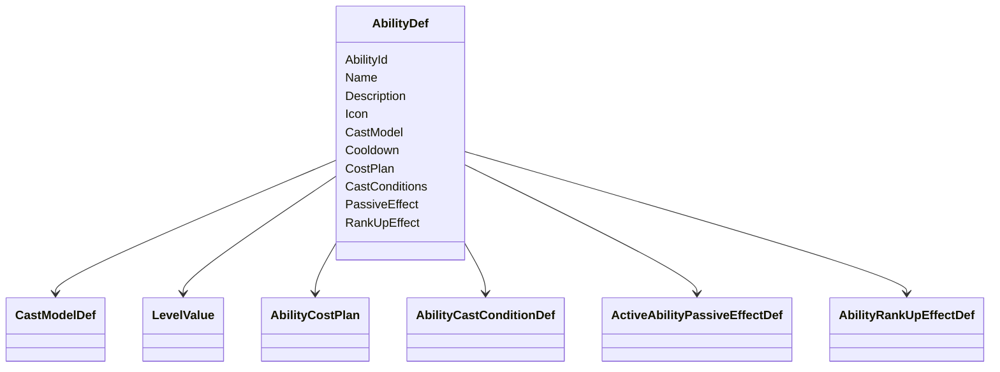
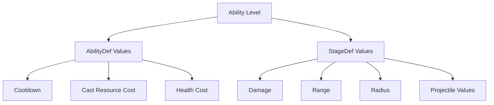
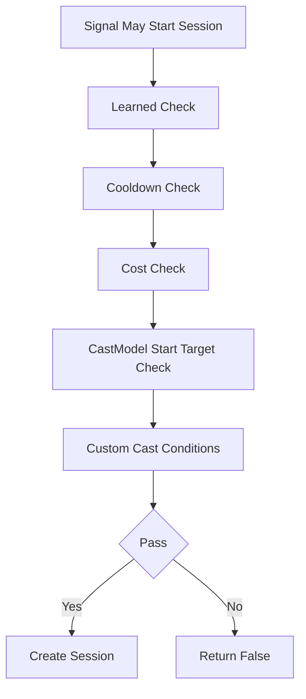
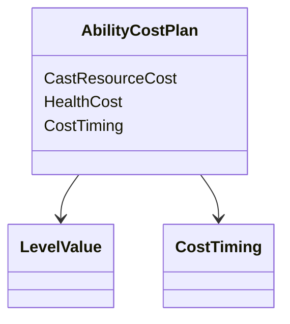
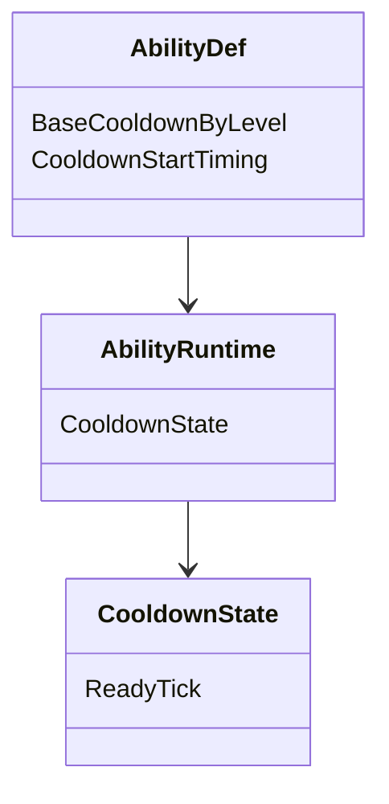
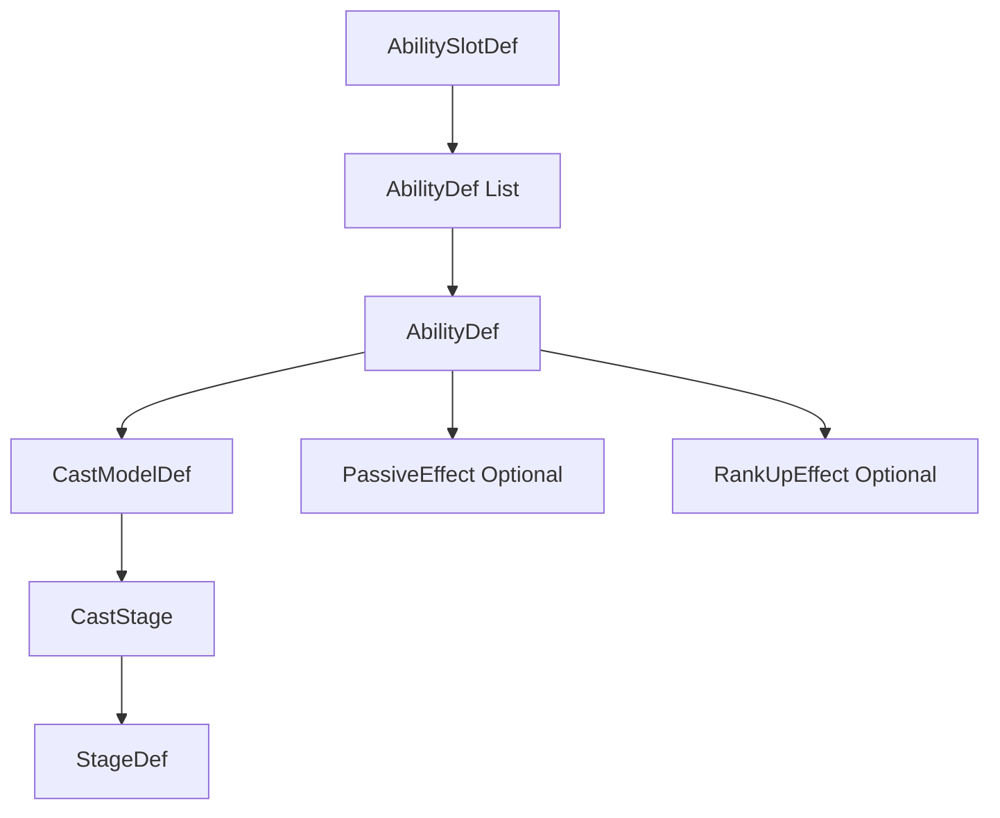
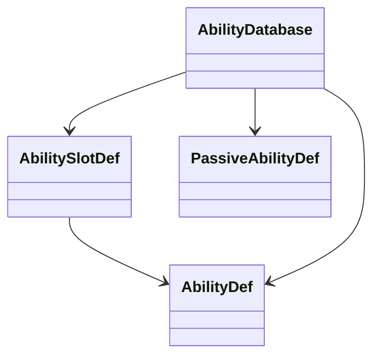

# 技能目录消耗冷却与升级

## 目标实现

槽位可含多个主动定义，费用、冷却和升级有唯一规则。

## 技术方案

AbilityBook 登记槽位；AbilityDef 提供条件、CostPlan 与按等级默认冷却；AbilityRankUpEffectDef 管理升级瞬时效果。

## 边界情况

资源不足、技能满级、无技能点拒绝；特殊模型冷却不回写统一默认字段；连续再施法 UI 只投影当前可用段。

## 验收条件

- 正常路径达到上述目标，并由所属模块唯一拥有权威状态。
- 以上边界情况有明确返回、拒绝或可见失败；不得用占位成功代替行为。
- 确定性逻辑比较重复执行、改变插入顺序以及捕获/恢复/重演结果；只读界面不得改变 Gameplay。

## 工程实际核查

本期检索的是当前源码和测试定义。存在实现不等于完成全部需求，存在测试不等于本期已运行通过。

- `Assets/Scripts/Gameplay/Ability/AbilityDef.cs`：当前关联实现定义 AbilityDef、AbilityLevelValue、AbilityCostTiming、AbilityCostPlan、AbilityCastContext（以源码为实际命名）。
- `Assets/Scripts/Gameplay/Ability/AbilityHandler.cs`：当前关联实现定义 AbilityHandler、PassiveEventKind、AbilityHandlerSnapshot、AbilityBook、AbilitySlotRuntime（以源码为实际命名）。

### 已有测试位置

- `Assets/Scripts/Bootstrap/Tests/PlayMode/VarusAnimationPlayModeTests.cs`：BoundDriver_QFocusMovementChangesResolveLoopSameFrame。
- `Assets/Scripts/FrameSync/Tests/LocalCommandGoldMatchFlowTests.cs`：FutureCommand_IsRetainedAndConsumedOnlyAtTargetTick、CastIntentAndAction_PreserveCommitVerbAndDirectionAim、PlanCastIntent_UsesAbilityCastRange_NotHardcoded、NaturalGold_IsTickDerivedCanonicalAndInsideOpenBatch、ClientPredictionCannotEnterEnding_ButServerAuthorityCan。
- `Assets/Scripts/FrameSync/Tests/SnapshotChecksumCompletenessTests.cs`：AggregateSnapshot_RestoresIntentDashAndLocomotion、SharedChecksum_ChangesForIntentDashAndLocomotionState、CombatModifierCapture_IsCanonicalAndDetachRepairsShiftedIndices、AggregateSnapshot_CapturesLiveActionRuntime、ExecuteTick_FormalDeathInvalidationCapturesRestorableBoundary、SharedChecksum_SerializesEveryActionRuntimeSlotMember、Restore_RejectsActionRuntimeWithoutOwningHandlerState。
- `Assets/Scripts/Gameplay/Tests/AatroxFormalContentTests.cs`：CombinedAbilityCatalog_BakesAatroxAndVarus、DarkinBlade_UsesExactThreeZonesAndRecastDelay、DarkinBlade_VfxDurationUsesConfiguredGameplayTickRate、WProjectile_FliesStraightAlongCastDirection_IgnoringTargetPosition、SequentialRecastSession_SnapshotRoundTripPreservesWindowState、SequentialRecastWindow_ExposesShortHudCooldown、FormalCatalogs_RegisterAatroxRuntimeContent。
- `Assets/Scripts/Gameplay/Tests/AbilityAimStageTests.cs`：AreaDamageStage_CentersOnAimTargetPoint、AreaDamageStage_DoesNotDamageEnemyStructure、SpawnProjectileStage_FiresTowardAimDirection。

## 附录：精确接口、公式与配置

附录保留本功能必须精确表达的接口、运算和配置语义，原系统章节已拆到所属功能。若与上面的已接受修订仍有冲突，进入待确认清单而不是按旧版本执行。

### 五、AbilityDef：主动技能配置与通用规则

`AbilityDef` 是一个具体主动技能的静态配置根。

技能槽的点数上限和单位等级要求属于 `AbilitySlotDef`。

具体技能的施法规则、等级数值、附带被动和升级瞬间模块属于 `AbilityDef`。

推荐结构：



基础信息：

| 字段 | 说明 |
|---|---|
| `AbilityId` | 稳定业务标识 |
| `Name` | 技能名称 |
| `Description` | 技能描述 |
| `Icon` | 默认技能图标 |

槽位加点限制不放在这里：

```text
MaxAllocatedPoints
RequiredUnitLevelByRank
```

它们属于 `AbilitySlotDef`。

如果项目使用本地化系统，`Name` 和 `Description` 保存本地化字符串引用或 Key。

不额外增加 `AbilityPresentation`。

`AbilityDef` 不持有：

```text
VariantDef
StageDef array
EffectGraphDef
EffectPlan
StageLevelTable
PassiveEffects array
```

Stage 的组织归 `CastModelDef`。

阶段图标覆盖归 `CastStage.IconOverride`。

主动技能可以额外配置：

```text
PassiveEffect optional
RankUpEffect optional
```

两者都最多一个。

---

### AbilityRankUpEffectDef：技能升级瞬间模块

`RankUpEffect` 表示：

> 某个具体 `AbilityRuntime` 因正式技能点分配而提高等级时，需要执行的一次性技能升级逻辑。

它不是 `UnitEventBus.LevelUpEvent`，也不是槽位升级计划。

推荐接口语义：

```text
OnRankUp
```

上下文：

```text
AbilityRankUpContext
├── Handler
├── Slot
├── Runtime
├── PreviousRank
└── CurrentRank
```

当前 Tick 如有需要，在模块内部读取：

```text
SimulationTickContext.Current.Tick
```

调用顺序：

```text
记录 PreviousRank
-> 设置 AbilityRuntime.Level
-> 设置 Learned
-> PassiveEffect.OnAbilityRankChanged
-> RankUpEffect.OnRankUp
```

职责边界：

```text
PassiveEffect.OnAbilityRankChanged
    让持续被动效果与新技能等级一致
    更新已存在的 Modifier 数值
    更新被动长期状态

RankUpEffect.OnRankUp
    执行这次升级瞬间的一次性技能逻辑
```

典型用途：

```text
增加专属资源
解锁技能内部状态
调整已有弹药上限
刷新某项长期 Runtime 数据
```

`RankUpEffect` 不负责：

```text
扣除 PendingSkillPoints
修改 AbilitySlotRuntime.AllocatedPoints
决定哪些技能升级
修改其它 AbilityRuntime.Level
切换槽位当前技能
创建 AbilitySession
重入当前施法状态机
```

跨技能升级规则归 `BuildSlotUpgradePlan`。

同一槽位有多个技能一起升级时，按 `AbilitySlotDef.Abilities[]` 的稳定顺序调用各自 `RankUpEffect`。

以下情况不调用：

```text
单位初始化时直接设置初始等级
快照 Restore
对象池恢复
只切换 ActiveAbilityId
重新绑定技能组
只重新启用 PassiveEffect
```

---

### 技能级与 Stage 级等级成长严格分开

整个技能共用的数据放 `AbilityDef`。

例如：

```text
CooldownByLevel
CastResourceCostByLevel
HealthCostByLevel
```

某个阶段才使用的数据放对应 Stage。

例如：

```text
伤害
施法距离
半径
宽度
持续区域大小
投射物速度
```

关系：



这样调用代码天然明确：

```text
Runtime.Def.Cooldown.Resolve level
```

或者：

```text
VarusQReleaseStage.MinDamage.Resolve level
VarusQReleaseStage.MaxRange.Resolve level
```

不通过字符串 Key 找数值。

---

### CastConditions：通用开始检查与英雄特殊条件

技能真正创建 Session 前，`AbilityHandler` 执行技能级检查。

通用检查：

```text
技能存在
技能已学习
冷却完成
施法资源足够
基础目标要求满足
```

英雄特殊条件通过：

```text
AbilityCastConditionDef
```

扩展。



典型特殊条件：

```text
亚索 R
-> 目标必须处于可接大状态

纳尔 R
-> 当前形态必须满足技能要求

卡莎 R
-> 目标附近存在指定标记

莎弥拉 R
-> 当前评价状态满足要求
```

不要把这些条件塞进：

```text
AbilityConditionKind
```

巨大枚举。

具体英雄可以编写：

```text
YasuoRCastConditionDef
GnarRCastConditionDef
KaisaRCastConditionDef
```

条件只回答：

```text
CanCast
```

它不创建 Session，也不修改技能流程。

---

### CostPlan：通用施法资源和生命消耗

施法消耗是技能级通用规则。

允许：

```text
无消耗
CastResource
Health
CastResource + Health
```

结构：



`CastResourceCost` 与 `HealthCost` 都是可选的等级成长值。

例如：

```text
CastResourceCost
    50 / 55 / 60 / 65 / 70

HealthCost
    none
```

或：

```text
CastResourceCost
    none

HealthCost
    100 / 120 / 140
```

没有任何 Cost 时就是无消耗技能。

不在通用模板内预置：

```text
怒气
弹药
连击点
英雄专属层数
```

这些属于英雄特色状态。

如果某个技能必须消耗英雄特色状态，由具体 `AbilityCastConditionDef`、StageDef 或英雄专属 AbilityRuntime 扩展处理。

`CostTiming` 只保留少量通用时机，例如：

```text
OnSessionStart
OnFirstCommit
```

更特殊的消耗过程直接写自定义技能逻辑，不继续扩充通用枚举。

---

### Cooldown：只保留默认冷却

通用技能只需要：

```text
BaseCooldownByLevel
CooldownStartTiming
CooldownState
```



默认冷却：

```text
读取当前技能等级基础冷却
-> 应用 StatHandler 的 CooldownReduction
-> 得到本次默认冷却
-> 更新 AbilityRuntime.CooldownState
```

特殊冷却不继续向 `AbilityDef` 添加：

```text
ChargeCooldown
SharedCooldown
HitCooldown
KillReset
MissRefund
```

这些通过冷却扩展接口或具体技能逻辑处理。

例如：

```text
充能技能
-> 自定义 AbilityRuntime 状态和冷却规则

共享冷却
-> 自定义规则修改多个 AbilityRuntime

命中返还冷却
-> 技能或战斗结果回调修改 CooldownState

击杀刷新
-> 监听对应战斗结果后重置
```

通用模板只保证默认冷却足够简单，并给特殊实现留下修改 `AbilityRuntime` 冷却状态的受控接口。

---

### AbilityDef 与 CastModel 的最终所有权

最终配置树：

```text
AbilitySlotDef
├── SlotId
├── MaxAllocatedPoints
├── RequiredUnitLevelByRank
├── Abilities[]
└── InitialActiveAbilityId

AbilityDef
├── AbilityId
├── Name
├── Description
├── Icon
├── CooldownByLevel
├── CostPlan
├── CastConditions
├── PassiveEffect optional
├── RankUpEffect optional
└── CastModelDef
    └── 模型定义的有语义 Stage 位置
        └── CastStage
            ├── Stage : StageDef
            ├── Duration
            ├── IconOverride optional
            └── NotifyAbilityCastOnEnter
```

核心关系：



所有权边界：

```text
槽位点数上限和单位等级要求
    属于 AbilitySlotDef

具体技能等级数值
    属于 AbilityDef 和各 StageDef

哪些技能在本次槽位加点中升级
    属于 AbilityHandler.BuildSlotUpgradePlan

技能升级瞬间的一次性逻辑
    属于 AbilityDef.RankUpEffect
```

---

### AbilityDatabase：技能槽、主动与固定被动定义注册入口

全局静态技能定义统一注册到：

```text
GlobalGameplayData
└── AbilityDatabase
    ├── AbilitySlotDef[]
    ├── AbilityDef[]
    └── PassiveAbilityDef[]
```

要求：

```text
AbilityId 在主动技能与固定被动技能之间全局唯一
SlotId 唯一
AbilitySlotDef.Abilities 中的 AbilityId 必须存在
InitialActiveAbilityId 必须属于该槽位
同一个 AbilityDef 默认只属于一个 AbilitySlotDef
启动时完成全部引用和重复 Id 校验
```

关系：



快照只保存稳定 Id 和动态运行数据。

静态 ScriptableObject 引用不复制进快照。

---


## 需求演进

### 2026-08-06

变动内容：按等级冷却、蓄力减速/超时退款和复仇被动；旧启动授权携带方案已由后续修订替代。

legacyDecision：D-031

### 2026-08-12

变动内容：连续再施法界面只读投影，施法朝向保持 Gameplay 授权。

legacyDecision：D-042

