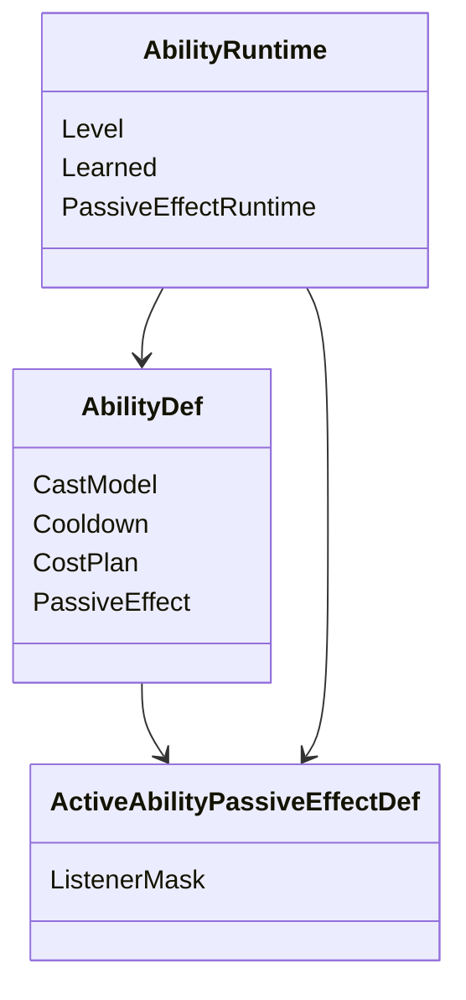
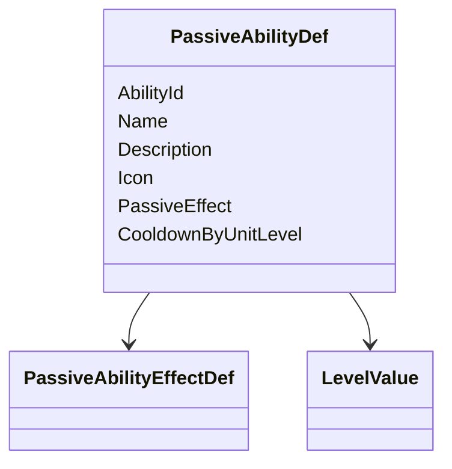
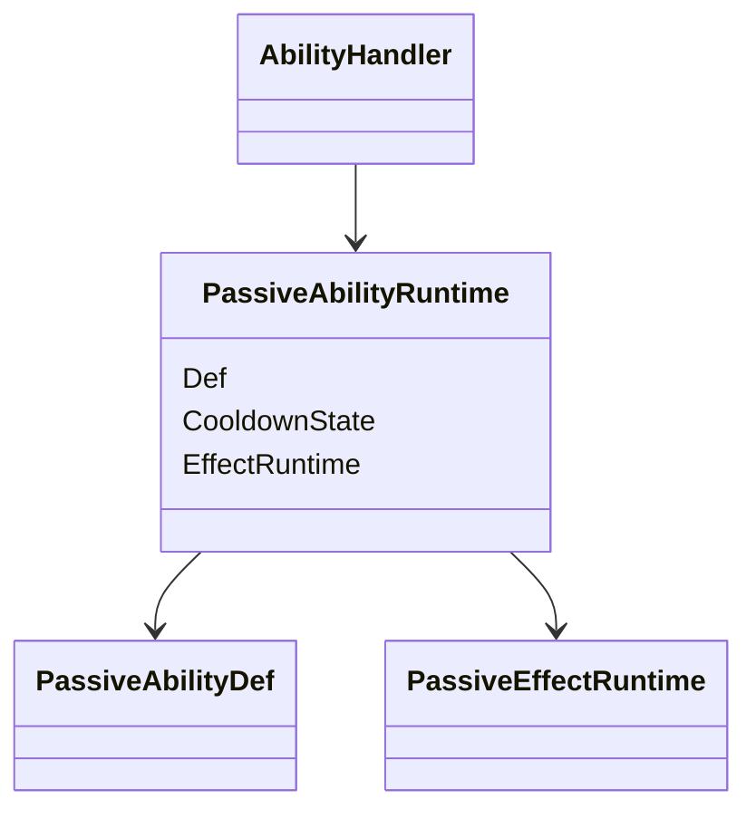

# 主动附带被动与固定被动

## 目标实现

可配置被动监听正式事件，跨死亡状态和冷却能恢复。

## 技术方案

主动技能附带单事件被动，固定 PassiveAbilityDef 可支持多事件；Runtime Blackboard 与 owning ability level 是权威状态。

## 边界情况

强类型事件而非动态订阅；自身来源伤害不能递归引爆同一被动；固定被动生命清理与重新建立按 Handler 接缝。

## 验收条件

- 正常路径达到上述目标，并由所属模块唯一拥有权威状态。
- 以上边界情况有明确返回、拒绝或可见失败；不得用占位成功代替行为。
- 确定性逻辑比较重复执行、改变插入顺序以及捕获/恢复/重演结果；只读界面不得改变 Gameplay。

## 工程实际核查

本期检索的是当前源码和测试定义。存在实现不等于完成全部需求，存在测试不等于本期已运行通过。

- `Assets/Scripts/Gameplay/Ability/AbilityPassiveRuntime.cs`：当前关联实现定义 AbilityPassiveListenerMask、AbilityPassiveEffectDefBase、ActiveAbilityPassiveEffectDef、PassiveAbilityEffectDef、PassiveAbilityDef（以源码为实际命名）。
- `Assets/Scripts/Gameplay/Ability/ApplyBuffPassiveEffectDef.cs`：当前关联实现定义 ApplyBuffPassiveEffectDef（以源码为实际命名）。

### 已有测试位置

- `Assets/Scripts/Gameplay/Tests/AssistEventIntegrationTests.cs`：HeroDeath_RaisesAssistOnce_AndEmpowersAssistantRevenge、Killer_IsHighestEffectiveLifeDamageContributorInLethalBatch。
- `Assets/Scripts/Gameplay/Tests/PassivePAbilityTests.cs`：KillNonHero_GrantsAttackSpeedAndDerivedStats、KillHero_AppliesThreeTimesBonus、Kill_RefreshesBuffDurationToFiveSeconds、Cooldown_ResolvesPerAbilityLevel、EmpoweredExpiry_ReappliesOneNormalBuffAfterNonHeroKills、AssistHero_AppliesEmpoweredBonusToAssistant。
- `Assets/Scripts/Bootstrap/Tests/PlayMode/HeroTestSceneEquipmentPlayModeTests.cs`：BuildWorld_LoadsSelectedVarusPartition、BuildWorld_LoadsFormalEquipmentCatalogForShop、LocalTickShop_UsesFormalGoldPurchaseRecipeAndUndo。
- `Assets/Scripts/FrameSync/Tests/ChecksumNewStateCoverageTests.cs`：Checksum_ChangesWhenProjectileOnHitOverrideDiffers、Checksum_ChangesWhenPendingLifetimeOverrideDiffers、Checksum_ChangesWhenPassiveAbilityLevelDiffers、Checksum_ChangesWhenMinionThreatRefreshTickDiffers、Checksum_ChangesWhenMinionThreatTableDiffers、Checksum_ChangesWhenEquipmentTriggerCountDiffers、Checksum_ChangesWhenGameplayParticipantIdDiffers。
- `Assets/Scripts/Gameplay/Tests/AatroxFormalContentTests.cs`：CombinedAbilityCatalog_BakesAatroxAndVarus、DarkinBlade_UsesExactThreeZonesAndRecastDelay、DarkinBlade_VfxDurationUsesConfiguredGameplayTickRate、WProjectile_FliesStraightAlongCastDirection_IgnoringTargetPosition、SequentialRecastSession_SnapshotRoundTripPreservesWindowState、SequentialRecastWindow_ExposesShortHudCooldown、FormalCatalogs_RegisterAatroxRuntimeContent。

## 附录：精确接口、公式与配置

附录保留本功能必须精确表达的接口、运算和配置语义，原系统章节已拆到所属功能。若与上面的已接受修订仍有冲突，进入待确认清单而不是按旧版本执行。

### 六、主动技能被动效果与固定被动技能

主动技能附带被动和英雄固定被动都属于 `AbilityHandler`，但生命周期和事件复杂度不同。

共同原则：

```text
一个技能只有一个完整 PassiveEffect
```

不设计：

```text
PassiveEffects[]
PassiveReactionGroups[]
动态事件订阅列表
```

区别：

```text
主动技能附带被动
    可选
    最多响应一个单位事件
    随技能学习状态和当前槽位启停
    数值通常读取主动技能等级

固定被动技能
    独立定义
    可以响应多个单位事件
    始终固定，不参与主动技能组切换
    可以有共享冷却，也可以完全没有冷却
```

---

### 主动技能附带的单个被动效果

主动 `AbilityDef` 增加：

```text
PassiveEffect : ActiveAbilityPassiveEffectDef optional
```

结构：



纯主动技能：

```text
PassiveEffect = null
```

带附加被动的主动技能：

```text
PassiveEffect = 某个具体 ActiveAbilityPassiveEffectDef
```

每个主动技能仍然只有一个被动效果模块。

这个模块可以同时承担：

```text
常驻属性修正
战斗公式修正
最多一个单位事件响应
```

例如：

```text
学习后增加攻击速度
并在 DamageDealt 时追加一个效果
```

仍然属于同一个被动效果，而不是两个被动。

---

### 主动技能被动最多响应一个单位事件

主动技能附带被动的 `ListenerMask` 只允许：

```text
零个事件位
或
一个事件位
```

零个事件位表示纯常驻效果：

```text
学习后增加某项属性
学习后挂载某个 CombatModifier
```

一个事件位表示响应一种强类型事件，例如：

```text
DamageDealt
DamageTaken
AbilityCast
HealDealt
UnitKill
LevelUp
```

Editor 或 Bake 校验必须保证：

```text
ActiveAbilityPassiveEffectDef.ListenerMask
最多只有一个事件位
```

不允许主动技能附带被动同时响应多个单位事件。

生命周期函数不算单位事件响应：

```text
OnActivate
OnDeactivate
OnAbilityRankChanged
Rebuild
```

它们只负责挂载、移除和刷新派生状态。

---

### 主动技能被动的生命周期

主动技能被动只有在以下条件同时满足时生效：

```text
AbilityRuntime.Learned = true
该 AbilityRuntime 当前绑定在激活主动技能槽
PassiveEffect != null
```

激活时：

```text
OnActivate
-> StatHandler.AddModifier
-> 保存 StatModifierHandle
-> CombatModifierSet.Attach
-> 保存 CombatModifierHandle
```

失活时：

```text
OnDeactivate
-> 使用保存的 Handle RemoveModifier
-> 使用保存的 Handle Detach CombatModifier
-> Handle 置为 Invalid
```

技能升级时：

```text
OnAbilityRankChanged
-> 使用 AbilityRuntime.Level 刷新数值
-> 可通过 StatHandler.SetModifierValue 更新已有 Modifier
```

`CombatModifierRecord` 在 Attach 后保持不可变。

如果某个稳定生效点的公式身份确实发生变化，应结束旧挂载，再以新的稳定 ModifierId 创建新挂载；不要把 `CombatModifierSet` 当成可变数值容器。

杰斯、豹女等切换主动技能组时：

```text
旧槽位被动按槽位顺序 Deactivate
-> 更新槽位绑定
-> 新槽位被动按槽位顺序 Activate
```

被换出的 `AbilityRuntime` 不销毁，只停止生效和接收事件。

---

### 主动技能被动的运行状态

长期状态放在：

```text
AbilityRuntime.PassiveEffectRuntime optional
```

可能保存：

```text
当前层数
触发次数
上次触发 LogicTick
目标 UnitUid
特殊效果自己的内部冷却
StatModifierHandle
CombatModifierHandle
其它确定性专属状态
```

不保存：

```text
delegate
动态订阅
Unit 对象引用
GameObject
Transform
任意 object
```

主动技能附带被动不提供统一通用冷却字段。

如果极少数效果需要内部冷却，由具体 `PassiveEffectRuntime` 自己保存。

纯常驻或无状态效果可以完全没有 Runtime。

---

### PassiveAbilityDef：固定被动技能定义

固定被动技能不继承完整主动 `AbilityDef`，避免出现无意义字段：

```text
CastModelDef
CastStage
CostPlan
CastConditions
AbilitySession
技能点等级
```

单独定义：



推荐字段：

```text
AbilityId
Name
Description
Icon
PassiveEffect required
CooldownByUnitLevel optional
```

`PassiveEffect` 仍然只有一个，不是数组。

固定被动技能：

```text
不消耗技能点
没有主动技能等级
不创建 AbilitySession
不占用主动技能槽
不参与主动技能组切换
```

---

### 固定被动可以响应多个单位事件

固定被动的单个 `PassiveAbilityEffectDef` 可以响应多个强类型事件。

例如：

```text
DamageTaken
DamageDealt
UnitKill
LevelUp
```

这些事件共同读写同一份被动运行状态。

固定被动不是多个 Reaction 数组，而是一个完整效果拥有多个强类型入口。

`AbilityHandler` 不动态订阅事件，也不扫描运行时监听者。

`UnitEventBus` 直接调用：

```text
AbilityHandler.OnDamageTaken
AbilityHandler.OnDamageDealt
AbilityHandler.OnAbilityCast
AbilityHandler.OnUnitKill
AbilityHandler.OnLevelUp
...
```

`AbilityHandler` 再按固定顺序转发给技能被动：

```text
1. FixedPassiveRuntime
2. 当前主动技能槽，从低槽位到高槽位
```

每个主动技能最多检查一个事件响应。

固定被动可以根据自己的 `ListenerMask` 响应多个强类型事件。

---

### PassiveAbilityRuntime：固定被动运行状态

`AbilityHandler` 单独持有：

```text
FixedPassive : PassiveAbilityRuntime optional
```

推荐结构：



固定被动从单位初始化开始存在。

它不参与：

```text
主动技能槽切换
技能点分配
主动技能学习状态
AbilitySession 生命周期
```

`EffectRuntime` 可以保存多个事件共享的权威状态。

例如：

```text
DamageTaken 增加能量
DamageDealt 刷新能量持续时间
UnitKill 消耗能量并触发奖励
```

这些事件共享同一个 `EffectRuntime`。

固定被动 Runtime 还可以保存两类 Handle：

```text
PersistentHandles
    跨死亡持续有效

LifeStageHandles
    当前生命阶段有效
    死亡时失效
    复活时按需重建
```

固定被动效果提供生命周期钩子：

```text
OnUnitDeath
    精确处理死亡规则
    将已失效的 LifeStageHandle 标记为 Invalid

OnRespawn
    根据当前长期 Runtime 状态
    重建需要的新生命阶段 Handle
```

`OnRespawn` 不重新初始化固定被动，也不默认重新创建仍然有效的永久 Modifier。

---

### 固定被动冷却是可选的

固定被动可能有共享冷却，也可能完全没有冷却。

配置：

```text
CooldownByUnitLevel optional
```

#### 没有冷却

```text
CooldownByUnitLevel = none
```

此时：

```text
PassiveAbilityRuntime 不创建 CooldownState
事件条件满足时可以直接触发
不执行任何冷却检查
```

这是完全合法的默认情况之一。

#### 有共享冷却

```text
CooldownByUnitLevel = configured
```

此时：

```text
PassiveAbilityRuntime 创建一个共享 CooldownState
触发时按当前单位等级读取冷却
成功触发主要效果后启动冷却
```

多个事件入口默认共享这一套冷却。

具体某个事件是否真正消耗冷却，由被动效果逻辑决定。

单位在冷却期间升级：

```text
不追溯修改已经开始的冷却
新单位等级影响下一次启动冷却
```

如果特殊被动确实需要多套独立冷却，应由其 `EffectRuntime` 自定义，不把通用 `PassiveAbilityRuntime` 扩展成冷却数组。

---

### 强类型事件处理边界

被动效果处理的是已经正式成立的强类型结果事件。

它不能修改已经结算完成的本次结果。

例如收到 `DamageDealtEvent` 后：

```text
不能回头修改这次 DamageResult
可以提交新的 DamageRequest
可以添加 Buff
可以更新被动自身状态
可以挂载后续 CombatModifier
```

`UnitEventBus.Publish` 是即时同步调用。

被动处理期间不得直接重入主动施法状态机：

```text
不切换当前 Stage
不结束当前 AbilitySession
不再次调用 HandleSignal
不切换主动技能组
不分配技能点
```

需要产生新的 Gameplay 行为时，向所属系统提交正式 Request。

---

### 被动状态的快照与恢复

主动技能附带被动的权威状态进入：

```text
AbilityRuntimeSnapshot.PassiveEffectRuntimeSnapshot
```

固定被动状态进入：

```text
FixedPassiveRuntimeSnapshot
```

被动 Runtime 保存：

```text
冷却状态
层数
计数
上次触发 LogicTick
稳定 Uid
StatModifierHandle
CombatModifierHandle
其它影响未来模拟的确定性状态
```

不在技能快照中重复保存：

```text
PassiveEffectDef
Stat Modifier 内容
CombatModifierRecord 内容
UnitEventBus 路由状态
```

Modifier 本体由：

```text
StatHandler Snapshot
```

直接恢复。

Combat Modifier Record 由：

```text
CombatModifierSet Snapshot
```

直接恢复。

技能被动 Runtime 同时恢复自己持有的历史 Handle，包括：

```text
PersistentHandles
LifeStageHandles
```

快照恢复到单位存活状态时，历史有效 Handle 直接恢复，不调用 `OnRespawn`。

快照恢复到单位死亡状态时，生命阶段 Handle 应与该历史状态一致。

因此回滚阶段为：

```text
Capture
    保存被动权威状态和 Handle

Restore
    直接恢复历史状态
    不调用 Add、Set、Remove、Attach 或 Detach

Resolve
    按稳定 Uid 解析必要引用

Rebuild
    只重建查询、UI、Presentation 和调试缓存
    不重新挂载属性或战斗修正
```

正常 Gameplay 中：

```text
主动技能切入或被动启用
-> AddModifier / Attach

技能等级变化
-> SetModifierValue 或按稳定生效点更新正式状态

主动技能切出或被动失效
-> RemoveModifier / Detach
```

回滚恢复不能调用这些正常业务生命周期函数，否则会产生重复 Modifier。

---


## 需求演进

### 2026-08-05

变动内容：Q 蓄力和 W 印记由通用 Stage、Buff 与投射物覆盖实现。

legacyDecision：D-030

### 2026-08-06

变动内容：按等级冷却、蓄力减速/超时退款和复仇被动；旧启动授权携带方案已由后续修订替代。

legacyDecision：D-031

### 2026-08-06

变动内容：助攻事件和复仇反应接入正式贡献链。

legacyDecision：D-034

