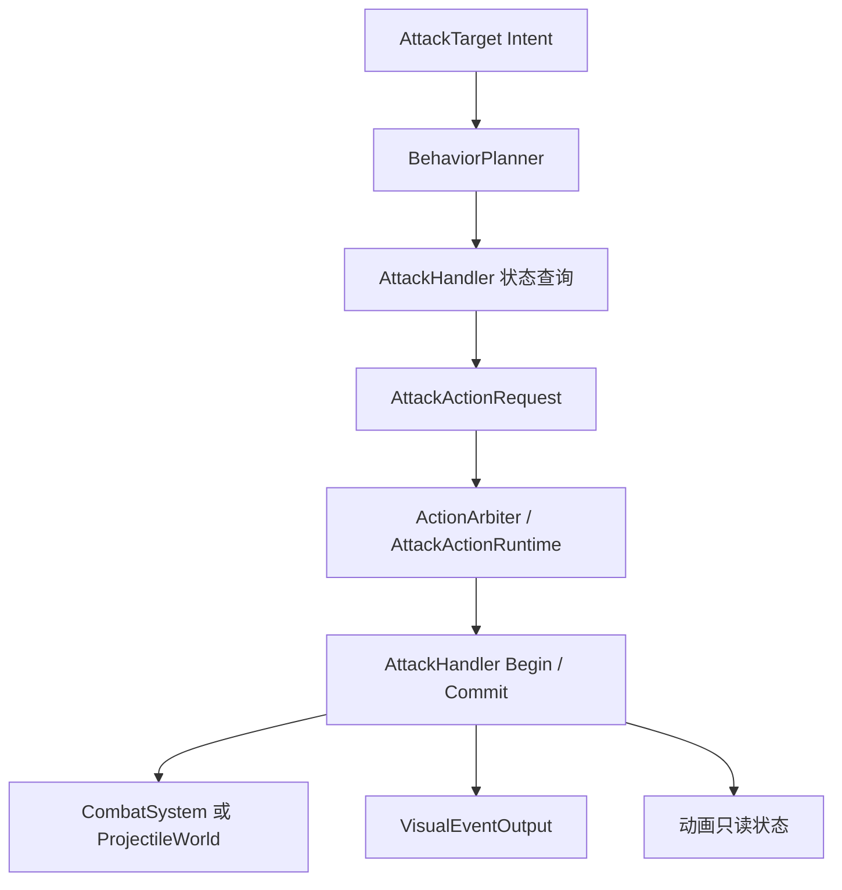
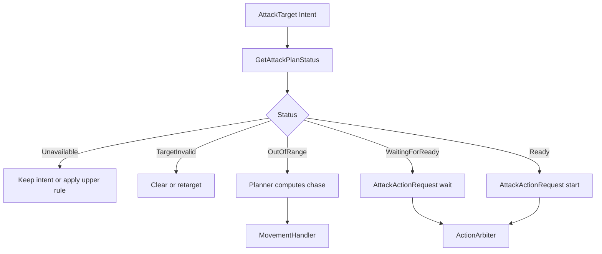
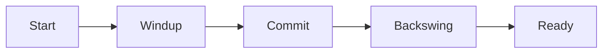
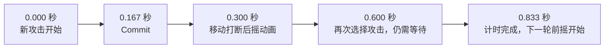
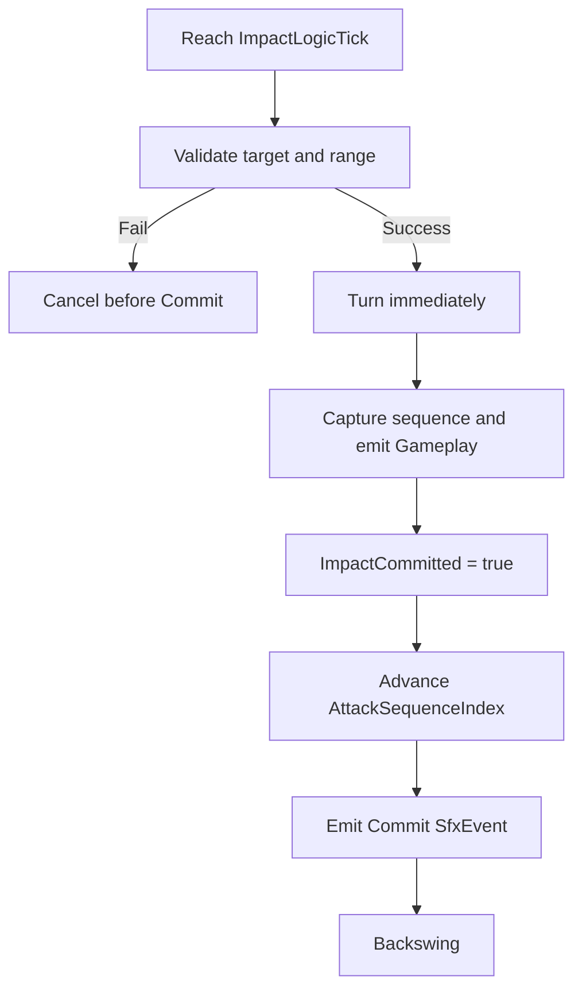
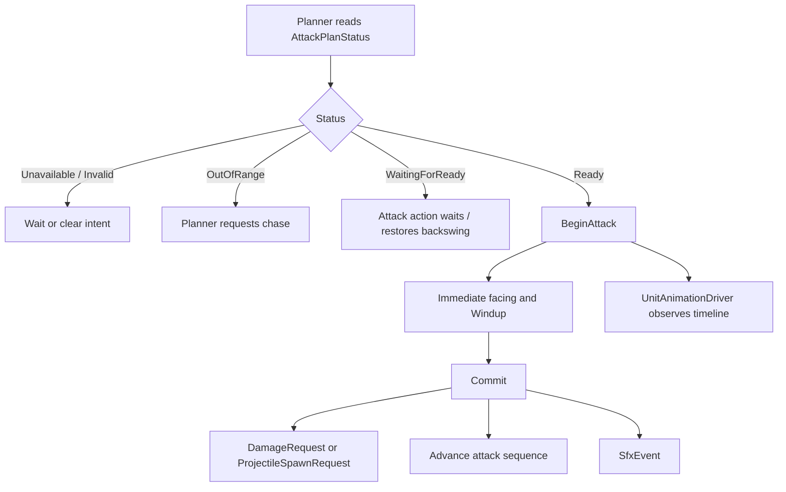

# 攻击周期规划与 Commit

## 目标实现

普攻追击、前摇提交和后摇可准确恢复。

## 技术方案

AttackHandler 锁定 StartLogicTick、ImpactLogicTick、NextAttackReadyLogicTick，Planner 决定追击停距；成立后立即转向，不增加转向前提。

## 边界情况

Commit 前取消不造成命中；Commit 后取消后摇不缩短 Ready；死亡使失效攻击立即终止；恢复上一轮后摇不重新 Commit。

## 验收条件

- 正常路径达到上述目标，并由所属模块唯一拥有权威状态。
- 以上边界情况有明确返回、拒绝或可见失败；不得用占位成功代替行为。
- 确定性逻辑比较重复执行、改变插入顺序以及捕获/恢复/重演结果；只读界面不得改变 Gameplay。

## 工程实际核查

本期检索的是当前源码和测试定义。存在实现不等于完成全部需求，存在测试不等于本期已运行通过。

- `Assets/Scripts/Gameplay/Attack/AttackHandler.cs`：当前关联实现定义 AttackPlanStatus、AttackTimerResetReason、AttackHandler（以源码为实际命名）。

### 已有测试位置

- `Assets/Scripts/Gameplay/Tests/AttackHandlerTests.cs`：FormalDeathInvalidation_AtomicallyClearsWindupAndMainRuntime、FormalDeathInvalidation_ClearsChaseRouteAndAttackIntentBeforeSnapshot、DespawnTarget_AtomicallyClearsWindupAndMainRuntime、FormalDeathInvalidation_DoesNotRevokeCommittedAttack、DespawnTarget_DoesNotRevokeCommittedAttack、FormalDeathInvalidation_RejectsNonIncreasingSequence、BeginAndCancel_DoNotConsumeSequence。
- `Assets/Scripts/Gameplay/Tests/TowerAttackHandlerTests.cs`：HeroRamp_FirstHitIsBase_ThenMultipliesByOnePointFive、HeroRamp_CapsAtSixHundred、Ramp_WithZeroHits_ReturnsBaseEvenForSmallBase。
- `Assets/Scripts/FrameSync/Tests/SnapshotChecksumCompletenessTests.cs`：AggregateSnapshot_RestoresIntentDashAndLocomotion、SharedChecksum_ChangesForIntentDashAndLocomotionState、CombatModifierCapture_IsCanonicalAndDetachRepairsShiftedIndices、AggregateSnapshot_CapturesLiveActionRuntime、ExecuteTick_FormalDeathInvalidationCapturesRestorableBoundary、SharedChecksum_SerializesEveryActionRuntimeSlotMember、Restore_RejectsActionRuntimeWithoutOwningHandlerState。
- `Assets/Scripts/FrameSync/Tests/UnitAnimationAssetTests.cs`：FullMatchAnimationFixtures_HaveCompleteBindableControllers、RuntimeUnits_HaveCompleteRuntimeComposition、FormalAnimatedUnits_BindAttackAndMovePlaybackToGameplayStats、FormalStructures_HaveNoAttackAnimation。
- `Assets/Scripts/Gameplay/Tests/AatroxFormalContentTests.cs`：CombinedAbilityCatalog_BakesAatroxAndVarus、DarkinBlade_UsesExactThreeZonesAndRecastDelay、DarkinBlade_VfxDurationUsesConfiguredGameplayTickRate、WProjectile_FliesStraightAlongCastDirection_IgnoringTargetPosition、SequentialRecastSession_SnapshotRoundTripPreservesWindowState、SequentialRecastWindow_ExposesShortHudCooldown、FormalCatalogs_RegisterAatroxRuntimeContent。

## 附录：精确接口、公式与配置

附录保留本功能必须精确表达的接口、运算和配置语义，原系统章节已拆到所属功能。若与上面的已接受修订仍有冲突，进入待确认清单而不是按旧版本执行。

### 模块定位

攻击模块负责：

```text
判断当前目标能否进入普通攻击行为
维护普通攻击周期
解析本轮前摇和后摇时间
在 Commit Tick 产生近战伤害请求或远程投掷物生成请求
向表现层发出攻击 Commit 音效请求
向动画层提供确定性的只读攻击时间状态
```

总体链路：



### 职责边界

| 内容 | 权威模块 |
|---|---|
| 网络输入和 Command | 帧同步命令层 |
| `AttackTarget Intent` | 单位框架 |
| 追击路径与移动执行 | Planner、`MovementHandler`、`UnitLocomotionAgent` |
| 行为冲突、Reservation、取消和打断 | `ActionArbiter`、`AttackActionRuntime` |
| 普通攻击周期和 Commit | `AttackHandler` |
| 近战主伤害结算 | `CombatSystem` |
| 远程弹道、命中与回收 | `ProjectileWorld` |
| 暴击、护盾、吸血和攻击特效 | `CombatSystem` |
| 攻击 Animator 状态 | `UnitAnimationDriver` |
| Commit 音效记录与播放 | `VisualEventOutput`、`AudioManager` |

本设计仅描述其它系统与 `AttackHandler` 的最小接缝，不替单位框架、投掷物系统、战斗系统和表现层重复设计内部实现。

---

### 定位

`AttackHandler` 是 `Unit` 内部的普通攻击能力入口。

是否装配 `AttackHandler` 决定：

```text
Unit.AbilityMask.HasAttack
```

它负责：

| 职责 | 说明 |
|---|---|
| 配置普通攻击 | 前摇比例、远程投掷物和 Commit 音效 |
| 查询攻击规划状态 | 返回目标无效、距离不足、等待计时或可以开始 |
| 建立攻击周期 | 根据当前攻速解析 Start、Impact 和 Ready Tick |
| 保存长期计时 | 后摇 Runtime 被取消后仍继续等待 Ready Tick |
| 提交 Commit | 产生直接伤害请求或投掷物生成请求 |
| 维护攻击动画序列 | 成功 Commit 后推进 `AttackSequenceIndex`；空闲达到全局阈值后在下一次 Begin 前重置 |
| 提交音效记录 | Commit 时向 `VisualEventOutput` 提交 `SfxEvent` |
| 暴露动画时间 | 供 `UnitAnimationDriver` 读取，不直接操作 Animator |
| 攻击重置 | 允许明确的技能效果清空剩余攻击计时 |

它不负责：

```text
生成追击路径
计算 Planner 的追击停止距离
直接修改 MainRuntime / BaseRuntime
直接扣除生命或护盾
推进 Projectile
执行 Projectile 命中查询
设置 Animator Bool / Int / Float / Trigger
直接调用 AudioManager
直接调用 AudioSource.Play
新建攻击专用 SfxPort
```

### 配置字段

删除 `AttackProfile` 后，默认攻击参数直接属于 `AttackHandler`。

```csharp
public class AttackHandler
{
    [SerializeField, Range(0f, 1f)]
    private float _windupRatio = 0.2f;

    [SerializeField]
    private int _projectileDefId;

    [SerializeField]
    private int _commitSfxEventId;

    [SerializeField]
    private PresentationAnchor _commitSfxAnchor;
}
```

| 字段 | 说明 |
|---|---|
| `_windupRatio` | 本单位攻击前摇占完整攻击周期的比例 |
| `_projectileDefId` | `0` 表示直接攻击；非 `0` 表示远程普攻投掷物定义 |
| `_commitSfxEventId` | Commit 时发给表现层的稳定语义事件 ID；`0` 表示不发出音效事件 |
| `_commitSfxAnchor` | 音效跟随的语义挂点，例如攻击原点、武器或枪口 |

`AttackDamage`、`AttackSpeed` 和 `AttackRange` 不复制进 Handler 配置，统一从 `StatHandler` 读取。默认普攻的 `SourceId` 与伤害配方使用项目级固定值，不开放为单位配置：

```text
SourceId = CombatBuiltinSourceId.BasicAttack
RecipeId = CombatBuiltinRecipeId.BasicAttackDamage
BaseValue = Owner.StatHandler.AttackDamage
```

其中基础普攻配方只表达“以当前攻击力作为基础物理伤害进入战斗管线”。确实改变普攻伤害规则的少数单位，通过继承 `AttackHandler` 并重写伤害提交或投掷物构建步骤处理。

时间相关 Inspector 配置仍遵循项目约定：设计期使用秒和 `float`。本模块唯一直接配置的是无量纲 `_windupRatio`；运行时攻击时间统一解析为整数 Logic Tick。攻击动画序列的空闲重置阈值不在每个 Handler 重复配置，统一读取全局静态数据 `GlobalGameplayStaticData.AttackSequenceResetIntervalTicks`。

### 运行时状态

```csharp
public class AttackHandler
{
    public UnitUid CurrentTargetUid { get; protected set; }

    public int AttackStartLogicTick { get; protected set; }
    public int ImpactLogicTick { get; protected set; }
    public int NextAttackReadyLogicTick { get; protected set; }

    public bool ImpactCommitted { get; protected set; }
    public bool IsEmpoweredAttack { get; protected set; }
    public byte AttackSequenceIndex { get; protected set; }
    public int LastSuccessfulAttackLogicTick { get; protected set; }

    public int ResolvedAttackDurationTicks { get; protected set; }
    public int ResolvedWindupTicks { get; protected set; }
}
```

这些字段表达的是最近一次已经建立的正式攻击周期。即使攻击后摇对应的 `AttackActionRuntime` 被移动取消，它们仍保留到下一轮攻击建立或被攻击重置覆盖。

初始化约定保持简单：

```text
CurrentTargetUid = Invalid
AttackStartLogicTick = InvalidLogicTick
ImpactLogicTick = InvalidLogicTick
NextAttackReadyLogicTick = Owner.SpawnLogicTick
ImpactCommitted = false
AttackSequenceIndex = 0
LastSuccessfulAttackLogicTick = InvalidLogicTick
```

因此单位首次参与行为 Tick 时攻击计时已经就绪。`AttackStartLogicTick` 标识新攻击边沿，`AttackSequenceIndex + ImpactCommitted` 确定本轮动画序列；同一单位同一 Tick 最多正式执行一次 `BeginAttack`。

`AttackSequenceIndex` 是一个允许循环的攻击动画序列计数，不是战斗请求身份，也不等于已经删除的 `AttackSequenceId`。它不会写入 `DamageRequest`、`AttackSourceContext` 或 `ProjectileSourceDescriptor`。

其完整生命周期固定如下：

| 规则 | 约定 |
|---|---|
| 作用域 | 每个 `AttackHandler` 各自维护一份 |
| 类型 | `byte` |
| 初始化 | 新建单位及其 Handler 时初始化为 `0` |
| 跨 Tick | 持续保留，不按 Tick 重置 |
| 推进时点 | 仅在 Commit 的 Gameplay 输出成功后递增 |
| 不推进场景 | Commit 前取消、Commit 失败、普通移动、换目标、后摇取消 |
| 攻击重置 | `ResetAttackTimer` 不修改序列 |
| 回绕 | `255` 的下一次成功 Commit 回到 `0` |
| 空闲重置 | 下一次 `BeginAttack` 前，若距最后一次成功 Commit 已达到全局阈值，则先重置为 `0` |
| 死亡与复活 | 死亡本身不直接重置；若空闲时间达到阈值，复活后的下一次 `BeginAttack` 自然重置；新 Handler 从 `0` 开始 |
| 帧同步 | 纳入快照；预测回滚时恢复后再重演，不从表现层历史反推 |

因此“客户端不维护本地攻击序列计数”只表示表现层不另建私有计数。参与本地预测的客户端 `AttackHandler` 必须与其它模拟端一样维护并回滚这份 Gameplay 状态。

不增加：

```text
AttackSequenceId
AttackKind
AttackProfileId
AttackImpactPayload
AttackPlanResult
```

### 最小公开接口

```csharp
public class AttackHandler
{
    public virtual AttackPlanStatus GetAttackPlanStatus(UnitUid targetUid);

    public bool IsAttackReady()
        => SimulationTickContext.Current.Tick >= NextAttackReadyLogicTick;

    public virtual void BeginAttack(UnitUid targetUid);

    public virtual bool CommitAttack();

    public virtual void CancelBeforeCommit();

    public virtual void ResetAttackTimer(
        AttackTimerResetReason reason);
}
```

所有接口在函数内部统一读取：

```csharp
int currentLogicTick = SimulationTickContext.Current.Tick;
```

`AttackHandler` 不缓存 `SimulationTickContext`，不自行推进 Tick，也不访问其它命名的逻辑时钟。项目内统一使用 `SimulationTickContext.Current.Tick / DeltaTick / ExecutionMode`。

调用者：

| 接口 | 调用者 |
|---|---|
| `GetAttackPlanStatus` | `BehaviorPlanner`、`AttackActionRuntime` |
| `BeginAttack` | `AttackActionRuntime` 在计时就绪并正式进入新前摇时 |
| `CommitAttack` | `AttackActionRuntime` 到达 `ImpactLogicTick` 时；返回本次 Gameplay 输出是否成功 |
| `CancelBeforeCommit` | Commit 前被取消或打断时 |
| `ResetAttackTimer` | 明确具有攻击重置效果的技能逻辑 |

### 继承与可重写边界

`AttackHandler` 不再是 `sealed`。大多数英雄、小兵、野怪和防御塔直接使用基类；只有确实改变普通攻击 Gameplay 规则的少数单位才继承。

推荐开放的保护级扩展点：

```csharp
protected virtual fp ResolveWindupRatio();
protected virtual bool ValidateAdditionalTarget(Unit target);
protected virtual bool ResolveIsEmpoweredAttack();
protected virtual int ResolveProjectileDefId();
protected virtual int ResolveCommitSfxEventId();

protected virtual void EmitDirectAttack(Unit target);
protected virtual ProjectileSpawnRequest BuildProjectileSpawnRequest(Unit target);
```

基类公开的 `BeginAttack` 和 `CommitAttack` 仍负责以下共同不变量：

```text
解析和保存确定性时间轴
Commit 只能成功一次
统一更新 ImpactCommitted
统一在 Commit 成功后推进 AttackSequenceIndex
统一产生 Commit SfxEvent
统一维护表现层所需只读状态
```

派生类优先重写保护级步骤，而不是完整复制 `CommitAttack`。只有当某个单位连攻击周期语义都不同，才考虑重写公开方法。

典型派生需求：

| 特殊单位 | 可重写内容 |
|---|---|
| 近战/远程形态英雄 | `ResolveProjectileDefId` |
| 特殊弹药英雄 | `BuildProjectileSpawnRequest` |
| 特殊强化普攻或特殊伤害公式 | `ResolveIsEmpoweredAttack`、`EmitDirectAttack` 或 `BuildProjectileSpawnRequest` |
| 特殊攻击目标规则 | `ValidateAdditionalTarget` |
| 不同形态音效 | `ResolveCommitSfxEventId` |

不为尚未出现的特殊英雄预建通用 Modifier Collector、攻击节点图或配置继承树。

---

### AttackPlanStatus

Planner 直接从 `AttackHandler` 读取枚举，不再经过 `AttackPlanResult`：

```csharp
public enum AttackPlanStatus : byte
{
    Unavailable,
    TargetInvalid,
    OutOfRange,
    WaitingForReady,
    Ready
}
```

语义：

| 状态 | Planner 行为 |
|---|---|
| `Unavailable` | 当前不能普攻，保留或按上层规则处理 Intent，不提交攻击请求 |
| `TargetInvalid` | 清除或重新选择目标 |
| `OutOfRange` | Planner 自己建立 `ChaseForAttack` 移动请求 |
| `WaitingForReady` | 目标仍在范围内，申请或维持 Attack 行为以等待剩余后摇 |
| `Ready` | 申请 Attack 行为并正式开始新一轮前摇 |

### Planner 自己计算追击

`AttackHandler` 只回答：

```text
目标是否有效
当前是否在攻击距离内
攻击计时是否完成
```

它不返回：

```text
ChaseStopDistance
MoveGoal
路径类型
到达容差
```

距离不足时，Planner 读取：

```text
Source.StatHandler.AttackRange
Source.PhysicsEntity
Target.PhysicsEntity
GlobalParamTable.DefaultAttackMoveStopPadding
```

并自行构建：

```text
MoveActionRequest(
    MoveGoal.ChaseForAttack(
        TargetUid,
        AttackRange + DefaultAttackMoveStopPadding))
```

真正的攻击距离判定复用物理模拟系统提供的统一单位范围查询，正式语义为：

```text
distance(SourceCenter, TargetCenter) - Target.CollisionRadius <= Source.AttackRange
```

只扣除目标碰撞半径，不扣除攻击者碰撞半径。Planner 和 `AttackHandler` 都不能再各自实现另一套距离公式。

`GetAttackPlanStatus` 的判断顺序固定为：

```text
GetAttackPlanStatus(targetUid):
    currentLogicTick = SimulationTickContext.Current.Tick

    if Owner 没有攻击能力 or CanAttack == false or AttackSpeed <= 0:
        return Unavailable

    target = UnitWorld.Resolve(targetUid)
    if target 不存在 or 已死亡 or 不可选中 or 不可敌对攻击:
        return TargetInvalid

    if PhysicsQuery.IsInAttackRange(Owner, target, Owner.StatHandler.AttackRange) == false:
        return OutOfRange

    if currentLogicTick < NextAttackReadyLogicTick:
        return WaitingForReady

    return Ready
```

这里的范围查询只回答布尔值；`OutOfRange` 之后追到哪里、使用什么 `StopDistance`，完全由 Planner 决定。距离判断先于计时判断，因此目标在攻击计时期间离开范围时，Planner 仍可继续追击，而不是原地等待。

### 规划流程



`WaitingForReady` 仍然允许进入 Attack 主行为，原因是表现层需要在玩家重新选择攻击时恢复上一轮动画当前应处的后摇位置。它不表示新一轮前摇已经开始，也不会重置 `AttackStartLogicTick`。

### 朝向不是攻击前提

删除：

```text
NeedFacing
CannotFaceTarget
等待转向完成后才能攻击
朝向角度不满足时拒绝 Commit
```

普通攻击行为成立时：

```text
direction = TargetPosition - SourcePosition

if direction is not zero:
    Source 通过单位框架认可的逻辑朝向入口
    立即把 Facing 设置为 Normalize(direction)
```

攻击前摇期间目标移动时，可以按项目单位朝向入口继续刷新朝向；无论是否刷新，朝向都不能成为 Start 或 Commit 的合法性条件。

```text
CanAttack 决定能不能攻击。
AttackRange 决定距离是否足够。
Facing 只是在攻击成立后立即得到的逻辑结果。
```

不能直接写 Unity `Transform.rotation`。逻辑朝向仍写入单位空间状态的权威入口，之后由物理同步或表现同步更新 Unity Transform。

---

### 完整攻击周期

一次普通攻击周期由三段组成：

```text
Start
    -> Windup
    -> Commit / Impact
    -> Backswing
    -> NextAttackReady
```



完整攻击周期在数值上为：

```text
AttackDurationSeconds = 1 / CurrentAttackSpeed
```

不同英雄和不同单位通过 `_windupRatio` 决定前摇占比：

```text
WindupSeconds = AttackDurationSeconds * WindupRatio
BackswingSeconds = AttackDurationSeconds - WindupSeconds
```

### Tick 解析算法

新一轮攻击正式开始时读取当前 `StatHandler.AttackSpeed`，并锁定本轮时间：

```text
BeginAttack(target):
    currentLogicTick = SimulationTickContext.Current.Tick

    if LastSuccessfulAttackLogicTick != InvalidLogicTick
    and currentLogicTick - LastSuccessfulAttackLogicTick
        >= GlobalGameplayStaticData.AttackSequenceResetIntervalTicks:
        AttackSequenceIndex = 0

    attackSpeed = Owner.StatHandler.AttackSpeed
    durationTicks = Max(1, Ceil(TickRate / attackSpeed))

    ratio = Clamp01(ResolveWindupRatio())
    windupTicks = Clamp(
        RoundDeterministic(durationTicks * ratio),
        1,
        durationTicks)

    CurrentTargetUid = target
    AttackStartLogicTick = currentLogicTick
    ImpactLogicTick = currentLogicTick + windupTicks
    NextAttackReadyLogicTick = currentLogicTick + durationTicks

    ResolvedAttackDurationTicks = durationTicks
    ResolvedWindupTicks = windupTicks

    ImpactCommitted = false
    IsEmpoweredAttack = ResolveIsEmpoweredAttack()

    TurnToTargetImmediately(target)
```

`StatHandler` 必须保证可攻击单位的最终 `AttackSpeed` 大于 `0`，并在数值层完成攻速上下限处理。`AttackSpeed <= 0` 或 `Capability.CanAttack == false` 时，`GetAttackPlanStatus` 返回 `Unavailable`，不能进入上述除法。

本轮攻击开始后，`ImpactLogicTick` 和 `NextAttackReadyLogicTick` 不再因为动画被打断而变化。

序列空闲重置只在下一次正式 `BeginAttack` 建立时间轴前惰性检查，不给 `AttackHandler` 增加逐 Tick 累加器，也不在上一轮后摇期间直接修改序列。全局静态数据必须保证 `AttackSequenceResetIntervalTicks >= 1`。

重置判断以最后一次成功 Commit 为起点。Commit 前取消、Commit 失败、普通移动、换目标以及 `ResetAttackTimer` 都不刷新 `LastSuccessfulAttackLogicTick`。如果新攻击在阈值到达前已经正式 Begin，即使它的 Commit Tick 位于阈值之后，本轮仍沿用 Begin 时选定的攻击序列。

本轮中途发生的攻速变化默认从下一轮攻击开始生效，避免已经开始的完整攻击动画时间轴在中途重新拉伸。若未来确实需要某个技能动态改变当前攻击周期，应由该技能明确调用攻击重置或特殊 Handler 逻辑，不修改默认规则。

### 用户示例

给定：

```text
AttackSpeed = 1.2 次 / 秒
WindupRatio = 0.2
```

则：

```text
完整攻击时间 = 1 / 1.2 = 0.833 秒
攻击前摇 = 0.833 * 0.2 = 0.167 秒
攻击后摇 = 0.833 - 0.167 = 0.666 秒
```

在 30 Logic Tick/s 下：

```text
AttackDurationTicks = 25
WindupTicks = 5

StartTick = T
ImpactTick = T + 5
NextAttackReadyTick = T + 25
```

时间线：



玩家在 `0.3` 秒移动：

```text
攻击已经 Commit。
攻击动画后摇可以停止。
当前 AttackActionRuntime 可以按单位框架规则被移动行为取消。
NextAttackReadyLogicTick 仍然是 T + 25。
```

玩家在 `0.6` 秒再次选择攻击同一范围内目标：

```text
GetAttackPlanStatus = WaitingForReady
Planner 允许重新进入 Attack 行为
不能建立新一轮 Windup
还需要等待约 0.233 秒
```

到 `0.833` 秒：

```text
SimulationTickContext.Current.Tick >= NextAttackReadyLogicTick
GetAttackPlanStatus = Ready
正式建立下一轮攻击
重新解析新的 Start / Impact / Ready Tick
```

### Commit

当：

```text
SimulationTickContext.Current.Tick >= ImpactLogicTick
且 ImpactCommitted == false
```

`AttackActionRuntime` 调用：

```text
AttackHandler.CommitAttack()
```

Commit 固定顺序：

```text
1. 再次解析当前目标。
2. 检查目标是否仍然有效、可选中且处于攻击距离内。
3. 立即刷新朝向，但不把朝向作为失败条件。
4. 捕获 `committedAttackSequenceIndex = AttackSequenceIndex`。
5. 产生直接攻击或 ProjectileSpawnRequest。
6. 成功后设置 `ImpactCommitted = true`，并记录 `LastSuccessfulAttackLogicTick`。
7. 循环递增 `AttackSequenceIndex`。
8. 使用捕获的序列与 `CommitSfxEventId` 发出 Commit SfxEvent。
9. 允许单位框架进入或继续后摇阶段。
```



序列推进算法固定为：

```text
committedAttackSequenceIndex = AttackSequenceIndex
LastSuccessfulAttackLogicTick = SimulationTickContext.Current.Tick

if AttackSequenceIndex == 255:
    AttackSequenceIndex = 0
else:
    AttackSequenceIndex += 1
```

该循环是允许的，因为 `AttackSequenceIndex` 只是可回滚的循环动画序列计数，不承担全局唯一身份。

### Commit 前取消

如果 Windup 期间被玩家移动、停止、换目标或有效控制打断，并且本次攻击尚未 Commit：

```text
currentLogicTick = SimulationTickContext.Current.Tick
ImpactCommitted = false
NextAttackReadyLogicTick = currentLogicTick
AttackSequenceIndex 保持不变
```

本次没有生效的攻击不继续占用完整攻击周期。下一次正常规划机会可以重新开始前摇。

是否允许某个 Order 或控制打断 Windup，仍由单位框架和控制系统负责；攻击模块只接收“本次在 Commit 前被取消”的结果。

### Commit 后取消后摇

Commit 后取消只影响当前行为和动画：

```text
不修改 ImpactCommitted。
不修改 NextAttackReadyLogicTick。
不撤回已经提交的 DamageRequest。
不撤回已经生成的 Projectile。
不重复播放 Commit 音效。
```

这就是走砍能够增加移动时间、但不会绕过攻速限制提高普通攻击频率的基础。

### 计时未结束时重新进入攻击

当目标在攻击距离内，但当前 Tick 尚未到 `NextAttackReadyLogicTick`：

```text
AttackPlanStatus = WaitingForReady
```

单位框架可以建立一个轻量的等待攻击行为，但不能调用 `BeginAttack`。这一阶段：

```text
沿用上一轮 AttackStart / Impact / Ready Tick。
沿用上一轮 ImpactCommitted 和 IsEmpoweredAttack。
不产生新的攻击实例边沿。
不触发新的 AttackStart Trigger。
不产生新的 SfxEvent。
```

表现层据此恢复上一轮完整攻击 Clip 当前应处的后摇位置。

### 攻击重置

普通移动、停止、换目标和后摇取消不能重置攻击计时。

默认只有明确标记为“攻击重置”的技能效果调用：

```text
ResetAttackTimer(reason):
    currentLogicTick = SimulationTickContext.Current.Tick
    NextAttackReadyLogicTick = currentLogicTick
```

攻击重置只修改 Ready Tick，不修改 `AttackSequenceIndex`，也不刷新 `LastSuccessfulAttackLogicTick`。只有成功 Commit 才会消耗一个攻击动画序列并刷新序列空闲计时起点。

如果上一轮已经 Commit：

```text
已产生的伤害或 Projectile 保留。
旧后摇等待立即结束。
下一次正常规划机会可以开始新前摇。
```

如果调用发生在未 Commit 的 Windup，技能或 `ActionArbiter` 应先按正常规则取消当前攻击行为，再执行重置，避免同一 Runtime 同时代表旧攻击与新攻击。

第一版不在同一 Tick 内递归运行 Planner，不允许一次重置在同一调用栈里无限创建攻击。

---

### 模块结构

```text
Unit
└── AttackHandler
    ├── Config
    │   ├── WindupRatio
    │   ├── ProjectileDefId
    │   ├── CommitSfxEventId
    │   └── CommitSfxAnchor
    │
    ├── Runtime State
    │   ├── CurrentTargetUid
    │   ├── AttackStartLogicTick
    │   ├── ImpactLogicTick
    │   ├── NextAttackReadyLogicTick
    │   ├── ImpactCommitted
    │   ├── IsEmpoweredAttack
    │   ├── AttackSequenceIndex : byte
    │   └── LastSuccessfulAttackLogicTick
    │
    ├── GetAttackPlanStatus
    ├── BeginAttack
    ├── CommitAttack
    ├── CancelBeforeCommit
    ├── ResetAttackTimer
    └── Protected Virtual Hooks

External Interfaces
├── BehaviorPlanner / MovementHandler
├── ActionArbiter / AttackActionRuntime
├── CombatSystem
├── ProjectileWorld
├── UnitAnimationDriver / Animator
└── VisualEventOutput / AudioManager
```

### 最终主流程




## 需求演进

### 2026-10-02

变动内容：正式死亡由 UnitWorld 同步执行，来源系统仅清理自己的句柄。

legacyDecision：D-009

