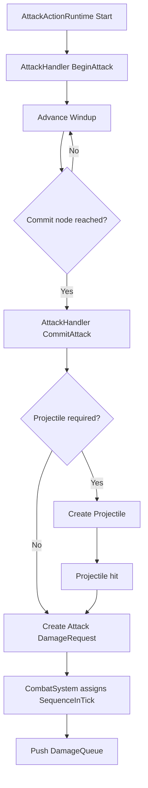
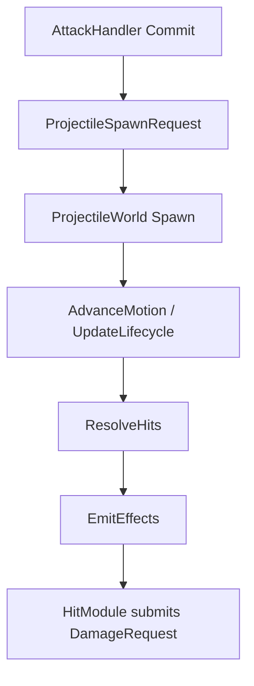
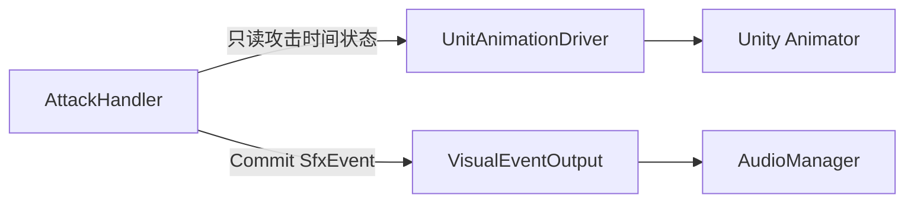

# 近战远程与攻击特效输出

## 目标实现

一次普攻 Commit 生成一次正式近战请求或投射物生成请求。

## 技术方案

默认普通攻击采用固定来源和配方；远程输出 ProjectileSpawnRequest；AttackSequenceIndex 为确定性 byte，音效通过独立 SfxEvent。

## 边界情况

在途飞弹目标锁定不跟随攻击者换目标；强化攻击、On-Hit 重复必须保留来源与动作身份，防止递归二次触发。

## 验收条件

- 正常路径达到上述目标，并由所属模块唯一拥有权威状态。
- 以上边界情况有明确返回、拒绝或可见失败；不得用占位成功代替行为。
- 确定性逻辑比较重复执行、改变插入顺序以及捕获/恢复/重演结果；只读界面不得改变 Gameplay。

## 工程实际核查

本期检索的是当前源码和测试定义。存在实现不等于完成全部需求，存在测试不等于本期已运行通过。

- `Assets/Scripts/Gameplay/Attack/AttackHandler.cs`：当前关联实现定义 AttackPlanStatus、AttackTimerResetReason、AttackHandler（以源码为实际命名）。
- `Assets/Scripts/Gameplay/Equipment/OnHitRepeatModule.cs`：当前关联实现定义 OnHitRepeatModule（以源码为实际命名）。
- `Assets/Scripts/Gameplay/Projectile/ProjectileSpawnRequest.cs`：当前关联实现定义 ProjectileSpawnRequest（以源码为实际命名）。

### 已有测试位置

- `Assets/Scripts/Gameplay/Tests/AttackHandlerTests.cs`：FormalDeathInvalidation_AtomicallyClearsWindupAndMainRuntime、FormalDeathInvalidation_ClearsChaseRouteAndAttackIntentBeforeSnapshot、DespawnTarget_AtomicallyClearsWindupAndMainRuntime、FormalDeathInvalidation_DoesNotRevokeCommittedAttack、DespawnTarget_DoesNotRevokeCommittedAttack、FormalDeathInvalidation_RejectsNonIncreasingSequence、BeginAndCancel_DoNotConsumeSequence。
- `Assets/Scripts/Gameplay/Tests/TowerAttackHandlerTests.cs`：HeroRamp_FirstHitIsBase_ThenMultipliesByOnePointFive、HeroRamp_CapsAtSixHundred、Ramp_WithZeroHits_ReturnsBaseEvenForSmallBase。
- `Assets/Scripts/Gameplay/Tests/AatroxFormalContentTests.cs`：CombinedAbilityCatalog_BakesAatroxAndVarus、DarkinBlade_UsesExactThreeZonesAndRecastDelay、DarkinBlade_VfxDurationUsesConfiguredGameplayTickRate、WProjectile_FliesStraightAlongCastDirection_IgnoringTargetPosition、SequentialRecastSession_SnapshotRoundTripPreservesWindowState、SequentialRecastWindow_ExposesShortHudCooldown、FormalCatalogs_RegisterAatroxRuntimeContent。
- `Assets/Scripts/ClientContent/Tests/PlayMode/ProjectileViewBinderPlayModeTests.cs`：ProjectileViewLeaseStaysResidentAcrossLifetimes。
- `Assets/Scripts/FrameSync/Tests/ProjectileCombatPipelineTests.cs`：EqualDistanceHits_AreFairnessKeyOrderedAndUseCombat、EndOnFirstHit_RejectsLaterSameTickCandidate、EqualDistanceArbitration_UidRelabelKeepsParticipantWinner、PierceBudget_EndsAtConfiguredHitCount、ProjectileDamage_UsesCombatShieldPipeline、EnemyFilter_ExcludesFriendlyTarget、EnemyFilter_IncludesStructureTarget。

## 附录：精确接口、公式与配置

附录保留本功能必须精确表达的接口、运算和配置语义，原系统章节已拆到所属功能。若与上面的已接受修订仍有冲突，进入待确认清单而不是按旧版本执行。

### 正式接缝

战斗系统对齐攻击模块 v4。单位行为层使用：

```text
GetAttackPlanStatus
IsAttackReady
BeginAttack
CommitAttack
CancelBeforeCommit
ResetAttackTimer
```

`AttackHandler` 自己负责攻击前摇、后摇、攻击计时器、目标验证和 `AttackSequenceIndex`。CombatSystem 不复制攻击状态机，也不维护攻击序列。

攻击真正到达 `CommitAttack` 时，AttackHandler 根据攻击配置选择：

```text
近战或即时命中
    -> 直接提交 SourceType = Attack 的 DamageRequest

需要弹道
    -> 创建 Projectile
    -> Projectile 命中后提交 SourceType = Attack 的 DamageRequest
```

---

### 普攻 Commit 链路



普通普攻伤害请求：

```text
DamageRequest
    Header.SourceDescriptor.SourceType = Attack
    Header.SourceDescriptor.SourceId = BasicAttack
    Header.RecipeId = BasicAttackDamageRecipe
    BaseValue = 正式伤害提交点读取的 Source.AttackDamage
    DamageTypeOverride = None
```

请求不携带：

```text
CanApplyLifeSteal
CanTriggerAttackEffect
AttackKind
AttackSequenceIndex
```

其中 `AttackSequenceIndex` 属于 AttackHandler 的可回滚运行状态，不是伤害公式输入。生命偷取和攻击特效资格由 `SourceType = Attack` 与最终 `DamageResult` 推导。

---

### AttackLikeAbility

不单独设计 `AttackLikeAbility` 类型。像 EZ Q 这类技能可以在技能命中时提交攻击来源伤害：

```text
DamageRequest
    SourceType = Attack
    SourceId = EzQ
    RecipeId = EzQDamageRecipe
    BaseValue = EzQ 当前等级技能基础伤害
```

它自然具备攻击来源语义，可以触发生命偷取和攻击特效；具体公式仍由自己的 `RecipeId` 决定，不要求与普通普攻使用同一公式。

---

### 攻击特效伤害

攻击特效是独立来源：

```text
SourceType = AttackEffect
```

攻击来源 `DamageResult` 成立后，来源单位的 `DamageDealt` Reaction 可以追加新的攻击特效伤害请求：

```text
DamageRequest
    SourceType = AttackEffect
    SourceId = 对应装备、Buff 或技能被动
    RecipeId = 对应攻击特效配方
    BaseValue = 攻击特效自己的基础数值
```

`AttackEffect` 不再触发攻击特效，也不默认触发生命偷取，因此不会递归。

### . Commit 的 Gameplay 输出

本章只规定 `AttackHandler` 的最小输出接口。伤害管线和投掷物内部实现分别以战斗系统 v8、投掷物系统 v14 为准。

### 直接攻击

当：

```text
ResolveProjectileDefId() == 0
```

Commit 直接向 `CombatSystem` 提交主攻击伤害请求：

```text
DamageRequest
    Header.SourceUnitUid = Owner.UnitUid
    Header.TargetUnitUid = CurrentTargetUid
    Header.SourceDescriptor.SourceType = Attack
    Header.SourceDescriptor.SourceId = CombatBuiltinSourceId.BasicAttack
    Header.RecipeId = CombatBuiltinRecipeId.BasicAttackDamage
    BaseValue = Owner.StatHandler.AttackDamage
```

`CombatSeq` 由 `CombatSystem.Submit` 内部统一分配。

`SourceDescriptor.OwnerUnitUid / EmitterUnitUid` 继续由战斗系统现有归属规则解析：普通单位通常两者都是攻击者；召唤物或分身可以由真正拥有者归属伤害，而实际攻击单位作为 Emitter。攻击模块不重新设计击杀与归属规则。

攻击模块不自行计算：

```text
暴击
护甲和穿透
护盾吸收
生命偷取
全能吸血
攻击特效
濒死和死亡
```

### 远程攻击

当：

```text
ResolveProjectileDefId() != 0
```

Commit 不提交即时伤害，而是构建投掷物系统 v14 已有的：

```text
ProjectileSpawnRequest
    ProjectileDefId
    OwnerUnitUid
    ProjectileSourceDescriptor
    SpawnBoardInput
```

攻击模块至少提供：

```text
ProjectileDefId = ResolveProjectileDefId()
OwnerUnitUid = Owner.UnitUid
Source.SourceType = Attack
Source.SourceId = CombatBuiltinSourceId.BasicAttack
Input.TargetUnitUid = CurrentTargetUid
Input.SpawnPosition = 确定性逻辑攻击原点
```

远程普攻的 HitModule 使用同一固定基础普攻来源与基础普攻配方提交 `DamageRequest`；攻击力读取时点服从战斗系统 v8 的统一规则，不在 `AttackHandler` 增加第二份伤害配置。

实际字段必须服从对应 `ProjectileDef.SpawnSchema`，攻击模块不能使用任意 `object` 参数包。

远程普攻的推荐 `ProjectileDef` 组合直接复用投掷物系统 v14：

```text
PhysicsEntity2D.Shape = Point
SweepFromPrev = true

MotionModules
    直线移动或轻量跟踪

LifecycleModules
    目标失效检查
    最大寿命检查

HitPolicy
    SameTarget = Once
    EndOnFirstValidHit = true

HitModules
    提交 Attack Source DamageRequest
```



攻击模块不再增加：

```text
AttackImpactResolver
AttackImpactPayload
Projectile 命中回调到 AttackActionRuntime
Projectile 运动或命中状态副本
```

### Commit 后的远程攻击

Projectile 生成成功后：

```text
Projectile 生命周期独立于 AttackActionRuntime。
攻击者移动不会撤回 Projectile。
攻击者的后摇被取消不会撤回 Projectile。
攻击者之后死亡是否影响 Projectile，服从投掷物系统和战斗来源规则。
目标过滤、IsTargetable、同目标命中、阻挡和回收由 ProjectileWorld 负责。
```

`AttackHandler` 不长期保存 Projectile 引用。

### 强化攻击与攻击特效

保持轻量边界：

| 效果 | 归属 |
|---|---|
| 强化攻击额外伤害 | `CombatModifierCollector` 或独立攻击来源请求 |
| 下一次攻击必暴击 | `CritPolicyModifier` |
| 装备攻击特效 | `AttackEffectProvider` |
| 临时攻击距离、攻速、攻击力 | `StatModifier` |
| 攻击重置 | `AttackHandler.ResetAttackTimer` |
| 强化攻击动画选择 | `AttackHandler.IsEmpoweredAttack` 只读状态 |

`AttackHandler` 不增加 `AttackKind`，也不遍历装备或 Buff 来直接执行全部攻击特效。

---

### . 外部系统接缝（精简）

本章只保留 `AttackHandler` 必须提供或遵守的接口契约。单位框架、表现层、帧同步和测试系统的内部结构以各自设计案为准。

### 表现层接缝

动画使用状态驱动，音效使用事件驱动：

| 输出 | `AttackHandler` 提供 | 表现层处理 |
|---|---|---|
| 攻击动画 | Start、Impact、Ready Tick，`ImpactCommitted`、`IsEmpoweredAttack`、`AttackSequenceIndex` | `UnitAnimationDriver` 设置 Animator 参数和状态 |
| Commit 音效 | 一次性 `SfxEvent` | `VisualEventOutput` 写入本 Tick SFX 缓冲，Tick 末由 `AudioManager` 消费 |



`AttackHandler` 不调用 Animator。`UnitAnimationDriver` 读取：

```text
AttackStartLogicTick
ImpactLogicTick
NextAttackReadyLogicTick
ImpactCommitted
IsEmpoweredAttack
AttackSequenceIndex
```

服务端权威模拟、客户端预测和客户端重演中的 `AttackHandler` 都正常维护 `AttackSequenceIndex`。禁止的是 `UnitAnimationDriver` 再维护一份表现层私有计数；它只能读取本端当前 Gameplay 状态。

动画使用的当前序列按攻击阶段推导：

```text
Windup 尚未 Commit:
    CurrentAnimationSequenceIndex = AttackSequenceIndex

已经 Commit，正在播放或恢复 Backswing:
    CurrentAnimationSequenceIndex =
        AttackSequenceIndex == 0
            ? 255
            : AttackSequenceIndex - 1

ClipIndex = CurrentAnimationSequenceIndex % NormalAttackClipCount
```

新攻击仍以“有效且发生变化的 `AttackStartLogicTick`”作为边沿；Commit 时 `AttackSequenceIndex` 的递增不是新攻击边沿。客户端只根据同步序列取模选择 Clip，不自行推进序列。

并按表现层 v13.2 处理三种入口：

| 场景 | Animator 入口 |
|---|---|
| 新攻击 | 设置 `IsAttacking`、`IsAttackRecovering = false`、强化与序列参数、`AttackMotionTime = 0`，最后触发 `AttackStart` |
| Ready 前重新进入攻击 | 不触发 `AttackStart`，设置 `IsAttackRecovering = true`，CrossFade 或 Play 到上一轮正确后摇位置 |
| 回滚恢复 | 不依赖历史 Trigger，直接定位到恢复后的 State 与 `AttackMotionTime` |

完整攻击 Clip 的采样映射仍为：

```text
Start -> Impact : 0 -> ImpactNormalizedTime
Impact -> Ready : ImpactNormalizedTime -> 1
```

Commit 的 Gameplay 输出成功后，`AttackHandler` 才使用本次 Commit 前捕获的攻击序列提交配置音效记录：

```text
commitSfxEventId = ResolveCommitSfxEventId()

if commitSfxEventId != 0:
    evt = SfxEvent(
        SfxEventId = commitSfxEventId
        Id = PresentationEventId(
            SourceLogicTick = SimulationTickContext.Current.Tick
            SourceKind = Unit
            SourceRuntimeUid = Owner.UnitUid
            EventSequence = committedAttackSequenceIndex
            EventKey = commitSfxEventId)
        Anchor = CommitSfxAnchor)

    VisualEventOutput.SubmitSfx(in evt)
```

`PresentationEventId` 完全复用表现层的统一结构。`EventSequence` 直接使用本次成功 Commit 对应的 `committedAttackSequenceIndex`，不再设计第二套表现序列；`EventKey` 使用稳定的 `CommitSfxEventId`。

`VisualEventOutput.SubmitSfx` 只校验并记录当前 Tick 的纯数据事件，不立即播放、不解析定义、没有“是否成功听到声音”的返回值，也不改变 `CommitAttack` 结果。Tick 末由表现层将独立 SFX 记录流交给 `AudioManager`；实际 `SfxDefId` 解析、回滚去重、`OneShotNoReplay`、音量、Pitch、挂点和对象池均属于表现层。

服务端、客户端预测和客户端重演均可构造相同记录；Dedicated Server 使用无 Unity 音频播放的消费者或丢弃最终本地播放结果，`AttackHandler` 不依赖客户端 `AudioManager` 实例。

### 单位框架接缝

单位框架只需遵守以下调用顺序：

```text
OutOfRange
    -> Planner 提交追击移动。

WaitingForReady
    -> 可以进入 Attack 行为恢复后摇。
    -> 不调用 BeginAttack。

Ready
    -> AttackActionRuntime 调用 BeginAttack。

到达 ImpactLogicTick
    -> 调用 CommitAttack。

Commit 前取消
    -> 调用 CancelBeforeCommit。

Commit 后取消
    -> 结束当前行为和动画，但不修改 Ready Tick。
```

等待旧攻击周期时不应再次占用 Movement；Windup 的资源占用和打断规则、Commit 后是否释放 Movement，由单位框架现有 `ActionArbiter` 与 Reservation 规则决定。

技能产生的攻击来源伤害直接由技能系统提交 `SourceType = Attack` 的战斗请求，不进入普通攻击计时。

单位生成 Tick 内不得主动运行 Planner、`AttackActionRuntime` 或普通攻击；该限制由单位框架根据 `SimulationTickContext.Current.Tick > Owner.UnitUid.SpawnLogicTick` 统一判断，`AttackHandler` 不增加 `FirstActiveLogicTick` 字段或重复门禁。

当前支持声明为：

```text
SupportedUnitEvents = None
```

`AttackHandler` 不注册任何单位事件入口。单位死亡时，单位框架按生命周期规则直接取消当前 `AttackActionRuntime`：若尚未 Commit，则走 `CancelBeforeCommit`；若已经 Commit，则只结束行为，不撤回伤害或投掷物，也不修改剩余攻击计时。死亡后立即复活等特殊技能若需要重置攻击计时，由其技能或生命周期逻辑显式调用 `ResetAttackTimer`，不为此增加死亡事件回调。

### 帧同步关注标记

需要由帧同步设计审查的 `AttackHandler` 运行状态：

```text
CurrentTargetUid
AttackStartLogicTick
ImpactLogicTick
NextAttackReadyLogicTick
ImpactCommitted
IsEmpoweredAttack
ResolvedAttackDurationTicks
ResolvedWindupTicks
AttackSequenceIndex
LastSuccessfulAttackLogicTick
```

`WindupRatio`、`ProjectileDefId`、`CommitSfxEventId` 和 `CommitSfxAnchor` 是单位静态配置；`AttackSequenceResetIntervalTicks` 来自全局静态数据。远程攻击生成后的状态全部属于 `ProjectileWorldSnapshot`，`AttackHandler` 不保存投掷物副本。

`AttackSequenceIndex` 与 `LastSuccessfulAttackLogicTick` 随 `AttackHandler` 一起进入快照。普通死亡本身不直接重置序列；如果死亡期间的空闲时间达到全局阈值，复活后的下一次 `BeginAttack` 将序列重置为 `0`。单位销毁并以新 `UnitUid`、新 Handler 重建时，两者分别初始化为 `0` 和 `InvalidLogicTick`。

确定性底线：

```text
不用 Time.time 或 deltaTime 推进攻击。
不用 Animator 或 Animation Event 决定 Commit。
不用 Unity Transform 判断逻辑距离或朝向。
不用 UnitAnimationDriver 维护第二份本地攻击序列。
回滚重演必须重建相同的 Gameplay 结果和相同 ID 的 `SfxEvent`；表现层不得因此重复播放已完成的 OneShot。
```

### 关键验收条件

| 场景 | 必须结果 |
|---|---|
| 背对目标发起攻击 | 攻击成立并立即逻辑转向 |
| 目标距离不足 | Handler 返回 `OutOfRange`，Planner 自行计算追击 |
| 攻速 1.2、前摇比例 0.2、30 TPS | 25 Tick 周期，第 5 Tick Commit |
| Commit 后移动取消动画 | Ready Tick 不变 |
| Ready 前再次攻击 | 只恢复后摇，不建立新前摇 |
| 普通移动或换目标 | 不重置攻击计时 |
| 明确攻击重置技能 | Ready Tick 设为当前 Tick |
| Commit 前取消 | `AttackSequenceIndex` 不递增 |
| Commit 成功 | Gameplay 输出成功后，`AttackSequenceIndex` 循环递增 |
| `AttackSequenceIndex` 从 255 递增 | 明确回到 0，所有预测端结果一致 |
| 空闲时间小于全局阈值 | 下一次 `BeginAttack` 沿用当前攻击序列 |
| 空闲时间达到全局阈值 | 下一次 `BeginAttack` 先将 `AttackSequenceIndex` 重置为 0 |
| Commit 前取消或失败 | 不刷新 `LastSuccessfulAttackLogicTick` |
| 同一单位实例死亡后复活 | 死亡不直接重置；若空闲达到阈值，则在下一次 `BeginAttack` 重置 |
| 单位销毁后以新 `UnitUid` 重建 | 新 Handler 的 `AttackSequenceIndex` 初始化为 0 |
| Commit 后恢复后摇 | 使用循环递增前的上一序列选择 Clip |
| 客户端预测与回滚 | Handler 序列可恢复重演，Driver 不另设计数 |
| 直接普攻 | 使用固定 BasicAttack 来源、固定基础普攻配方和当前攻击力 |
| 远程普攻 | Commit 生成 Projectile，由 HitModule 提交普攻伤害 |
| Commit 音效 | 使用配置的 `CommitSfxEventId` 与本次 Commit 捕获的攻击序列，只发出一次 |
| 回滚恢复 | Gameplay 结果不重复，动画定位正确，OneShot 不重复 |

---


## 需求演进

### 2026-10-02

变动内容：稳定表现事件身份由逻辑来源持有，Gameplay 不直接播放音效。

legacyDecision：D-014

### 2026-08-10

变动内容：正式装备目录和可重复 On-Hit 的来源防重入。

legacyDecision：D-039

### 2026-08-24

变动内容：动作键暴击和等距中性裁决；覆盖先前对 UID 耦合随机样本和目标平局的许可。

legacyDecision：D-050

