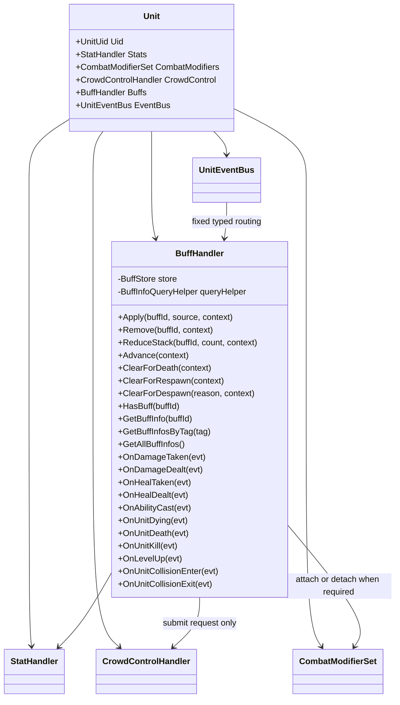
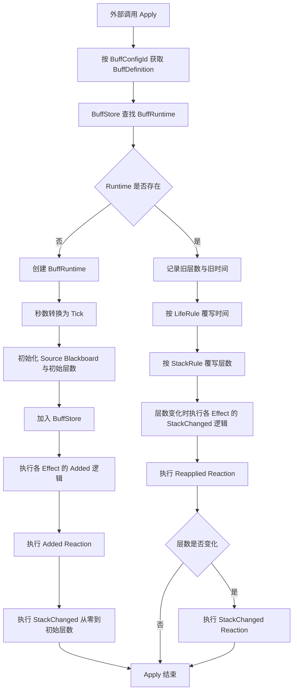
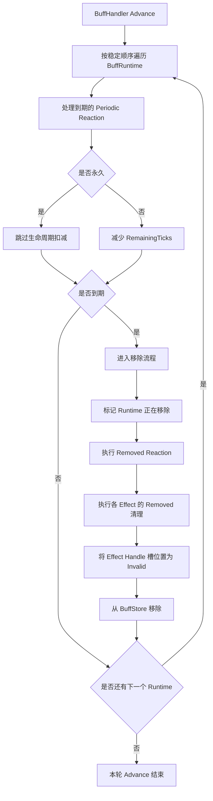
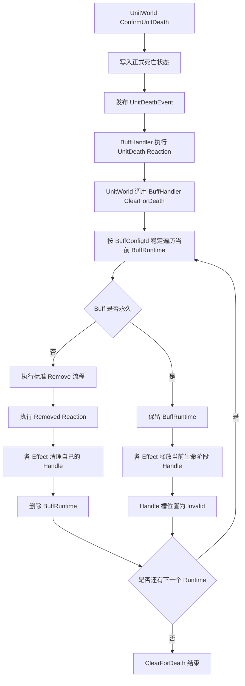
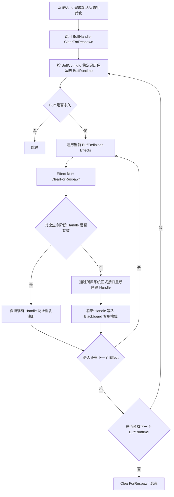
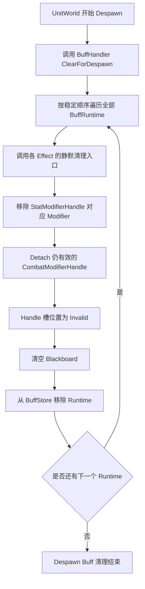
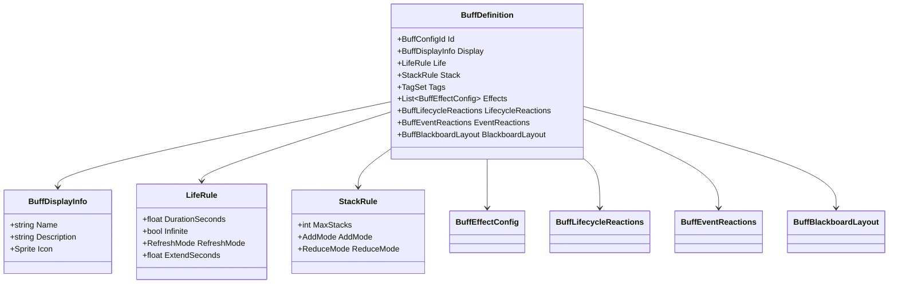
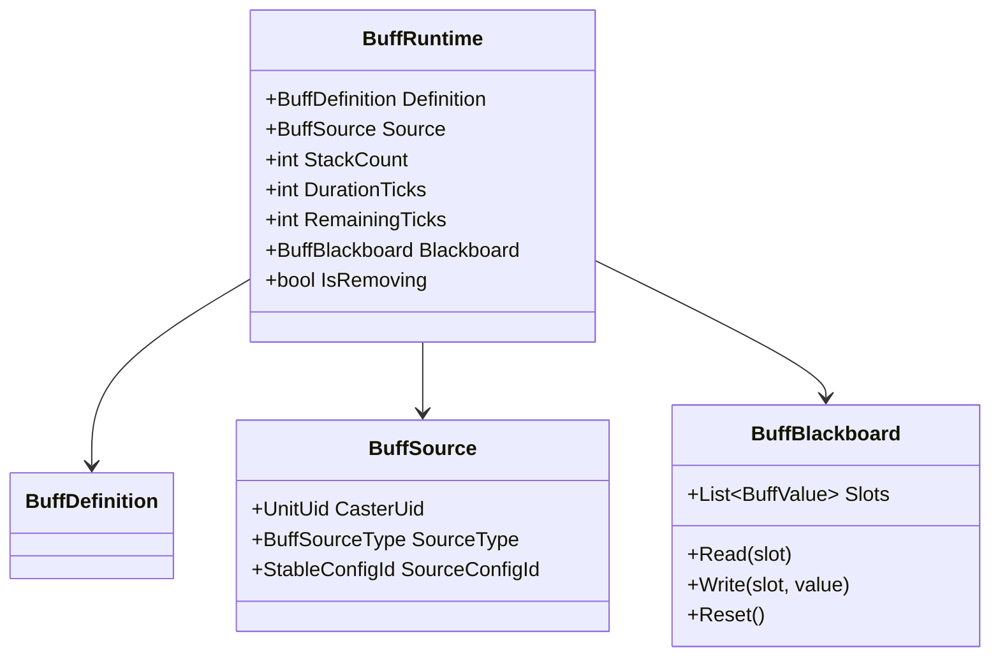
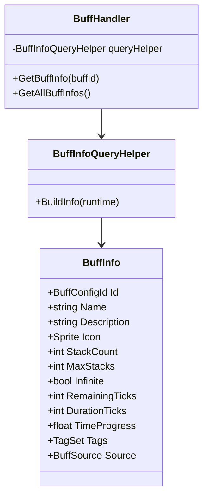
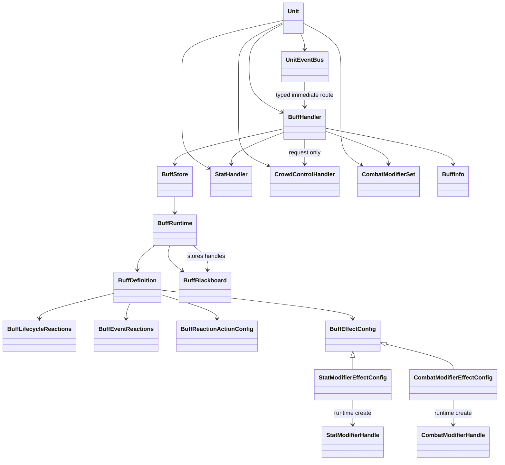

# Buff 施加覆写与运行身份

## 目标实现

同配置 Buff 保持唯一运行实例，通过标准施加与移除流程更新。

## 技术方案

BuffHandler 保存按 ConfigId 稳定的 BuffRuntime，重复 Apply 覆写、更新 stack/duration；BuffSource 与黑板只承载正式数据。

## 边界情况

不新增平行 Buff 身份；Added、Reapplied、StackChanged、Removed 顺序明确；结构外源 Buff 先拒绝再创建。

## 验收条件

- 正常路径达到上述目标，并由所属模块唯一拥有权威状态。
- 以上边界情况有明确返回、拒绝或可见失败；不得用占位成功代替行为。
- 确定性逻辑比较重复执行、改变插入顺序以及捕获/恢复/重演结果；只读界面不得改变 Gameplay。

## 工程实际核查

本期检索的是当前源码和测试定义。存在实现不等于完成全部需求，存在测试不等于本期已运行通过。

- `Assets/Scripts/Gameplay/Buff/BuffBlackboard.cs`：当前关联实现定义 BuffBlackboard、BuffValueSnapshot、BuffBlackboardSnapshot（以源码为实际命名）。
- `Assets/Scripts/Gameplay/Buff/BuffDefinition.cs`：当前关联实现定义 BuffDefinition（以源码为实际命名）。
- `Assets/Scripts/Gameplay/Buff/BuffHandler.cs`：当前关联实现定义 BuffHandler、BuffReactionKind（以源码为实际命名）。
- `Assets/Scripts/Gameplay/Buff/BuffRuntime.cs`：当前关联实现定义 BuffRuntime（以源码为实际命名）。

### 已有测试位置

- `Assets/Scripts/Gameplay/Tests/BuffReactionAndInfoTests.cs`：Blackboard_StaticLayout_ReadWriteResetAndRoundTrip、FirstApply_FiresStackChanged_ZeroToInitial、Reapply_FiresReapplied_AndStackChangedOnChange、PeriodicReaction_FiresOnIntervalSlot、EventReactions_AbilityCastAndLevelUp_Fire、RemovedReaction_FiresOnRemove_ButNotOnDespawn、BuffInfo_ExposesReadOnlyFields_AndTagQuery。
- `Assets/Scripts/Gameplay/Tests/CorruptionVineSpreadTests.cs`：Spread_InfectsOnlyEnemyHeroesOfOriginalCaster、Spread_DoesNotReinfectAnInfectedHero、Spread_RequiresContinuousContactInsideRadius、Spread_AppliesSameRDamageAndRoot、SecondR_StartsAFreshSpread、SecondR_UsesADifferentTagUid、Blight_StacksAreAppliedAtConfiguredTicks。
- `Assets/Scripts/Gameplay/Tests/GuinsoosRagebladeEquipmentTests.cs`：FormalCatalog_ContainsExpectedStatsRecipeAndModules、GameScene_UsesCorePartitionInsteadOfDirectEquipmentCatalog、SixRealHits_StackBuffAndRepeatThirdFullStackOnHitOnce、OnHitEquipmentEffects_DoNotApplyToStructure、TriggerCounter_RestoreReplaysSameRepeatedOnHit、EquipmentModuleState_SurvivesDeathRespawnHandleRebuild。
- `Assets/Scripts/Bootstrap/Tests/PlayMode/BlightStackMarkStructurePlayModeTests.cs`：ExternalBlightOnStructure_CreatesNoPresentationMark。
- `Assets/Scripts/FrameSync/Tests/ProjectileCombatPipelineTests.cs`：EqualDistanceHits_AreFairnessKeyOrderedAndUseCombat、EndOnFirstHit_RejectsLaterSameTickCandidate、EqualDistanceArbitration_UidRelabelKeepsParticipantWinner、PierceBudget_EndsAtConfiguredHitCount、ProjectileDamage_UsesCombatShieldPipeline、EnemyFilter_ExcludesFriendlyTarget、EnemyFilter_IncludesStructureTarget。

## 附录：精确接口、公式与配置

附录保留本功能必须精确表达的接口、运算和配置语义，原系统章节已拆到所属功能。若与上面的已接受修订仍有冲突，进入待确认清单而不是按旧版本执行。

### 定位

`BuffHandler` 是 `UnitHandler`，也是外部系统操作和查询当前单位 Buff 的唯一入口。

它负责：

- 保存当前单位的全部 `BuffRuntime`
- 施加 Buff
- 覆写已存在的同配置 Buff
- 移除 Buff
- 减少 Buff 层数
- 推进持续时间与周期 Reaction
- 接收 `UnitEventBus` 的强类型事件
- 执行 Buff 的静态 Reaction 配置
- 通过具体 Buff Effect 调用 `StatHandler` 的 Modifier 接口
- 提供 Buff 信息查询接口
- 响应 `UnitWorld` 显式发起的 `ClearForDeath / ClearForRespawn / ClearForDespawn` 生命周期接缝

它不负责：

- 群体控制状态
- 最终属性计算
- 伤害或治疗公式
- 护盾值与护盾实例
- 技能、攻击或装备 Runtime
- 动态事件订阅
- Gameplay 事件排队与延迟分发
- 在 `OnUnitDeath` 内自行清理 Buff
- 扫描 Blackboard 猜测并清理外部 Handle

---

### 与 Unit 的关系



`BuffHandler` 可以向 `CrowdControlHandler` 提交正式控制请求，但不保存控制 Runtime，也不参与控制结果汇总。

---

### 对外操作接口

```text
Apply
    BuffConfigId
    BuffSource
    SimulationTickContext

Remove
    BuffConfigId
    SimulationTickContext

ReduceStack
    BuffConfigId
    Count
    SimulationTickContext

Advance
    SimulationTickContext

ClearForDeath
    SimulationTickContext

ClearForRespawn
    SimulationTickContext

ClearForDespawn
    UnitDespawnReason
    SimulationTickContext
```

典型调用方：

| 调用方 | 操作 |
|---|---|
| `AttackHandler` | 攻击结果成立后施加 Buff |
| `AbilityHandler` 或技能 Stage | 施加、移除或减层 |
| `EquipmentHandler` | 装备效果施加 Buff |
| 环境系统 | 区域效果施加 Buff |
| Buff Reaction | 对目标或自身施加、移除、减层 |
| UI、AI、技能条件 | 通过查询接口读取 Buff |

---

### BuffStore

`BuffStore` 以 `BuffConfigId` 作为当前单位内的唯一键。

规则：

```text
同一 Unit
同一 BuffConfigId
最多存在一个 BuffRuntime
```

推荐内部同时维护：

```text
Lookup
    BuffConfigId -> BuffRuntime
    只用于快速查找

OrderedRuntimes
    按 BuffConfigId 稳定排序
    用于 Advance 和事件 Reaction 遍历
```

禁止依赖：

- `Dictionary` 枚举顺序
- `HashSet` 枚举顺序
- Unity 对象地址
- ScriptableObject 实例地址

Reaction 的业务含义不应依赖执行顺序，但实现仍使用稳定顺序保证确定性重演。

---

### Apply 流程



#### 首次施加的固定语义

首次创建时按以下顺序执行：

```text
1. 创建并初始化 BuffRuntime
2. 加入 BuffStore
3. 执行具体 Buff Effect 的 Added 逻辑并创建所需运行时 Handle
4. 执行 Added Reaction
5. 执行 StackChanged 0 -> InitialStack
```

初始层数从 0 变为 1，也属于一次真实的层数变化。

这样：

- `Added` 表达“Buff 第一次出现”
- `StackChanged` 始终只表达“层数确实发生变化”
- 层数阈值 Reaction 不需要特殊区分首次施加

---

### 重复施加只允许覆写

当同一 `BuffConfigId` 已存在时：

```text
不创建第二个 BuffRuntime
不按来源拆分实例
不保留旧 Runtime 与新 Runtime 并存
```

只允许：

```text
按 LifeRule 更新现有 Runtime 的时间
按 StackRule 更新现有 Runtime 的层数
根据新的 Apply 请求更新 Source
执行 Reapplied
层数真实变化时执行 StackChanged
```

`BuffSource` 保存最近一次成功 Apply 的来源。

如果某个玩法将来要求“多来源分别计时”，它不属于当前 Buff 模型，应设计成其它独立 Runtime，而不是破坏当前单实例规则。

---

### Advance 流程



Buff 运行阶段统一读取：

```text
SimulationTickContext.Current.Tick
```

运行阶段不使用：

- `Time.deltaTime`
- 渲染帧时间
- `float RemainingSeconds`

---

### 移除流程的固定语义

移除原因可以包括：

- 持续时间结束
- 外部主动 Remove
- 层数减至 0
- Unit 生命周期清理
- Reaction 主动移除

固定顺序：

```text
1. 防止重复进入移除流程
2. 执行 Removed Reaction
3. 由每个具体 Effect 清理自己创建的外部 Handle
4. 将对应 Blackboard Handle 槽位置为 Invalid
5. 从 BuffStore 删除 BuffRuntime
```

执行 `Removed` 时，当前 Runtime 仍然可以被本次 Reaction Context 读取。  
完成 `Removed` 后，该 Runtime 不再参与后续 Advance 或事件响应。

---

### 死亡与复活接缝

`BuffHandler` 覆写单位框架生命周期接口：

```text
ClearForDeath
    SimulationTickContext

ClearForRespawn
    SimulationTickContext
```

这两个接口都由 `UnitWorld` 按单位框架冻结的 Handler 顺序显式调用。

`BuffHandler.OnUnitDeath` 不调用 `ClearForDeath`。  
`OnUnitDeath` 只负责处理 `UnitDeathEvent` 对应的 Buff Event Reaction。

#### 死亡阶段

推荐调用关系：



固定语义：

#### 非永久 Buff

```text
LifeRule.Infinite = false
```

处理规则：

- 使用标准 Remove 流程。
- 正常执行 `Removed Reaction`。
- 各 Effect 正常清理自己创建的 Handle。
- 从 BuffStore 删除 Runtime。
- `RemovalReason = DeathCleanup`。

#### 永久 Buff

```text
LifeRule.Infinite = true
```

处理规则：

- 保留原 `BuffRuntime`。
- 保留 `BuffSource`、层数和非 Handle Blackboard 状态。
- 不执行 `Removed Reaction`。
- 不重新执行 `Added` 或 `StackChanged`。
- 各 Effect 释放自己在当前生命阶段创建的 Handle。
- 对应 Handle 槽位置为 `Invalid`。
- 不在死亡阶段立即重新创建 Handle。

“当前生命阶段 Handle”包括由永久 Buff 持续提供、但会随着本次生命结束而注销的外部注册，例如：

```text
StatModifierHandle
CombatModifierHandle
其它由具体 Effect 明确定义的生命阶段 Handle
```

BuffHandler 不统一扫描 Blackboard。  
具体 Handle 是否属于生命阶段注册，以及如何释放，由创建该 Handle 的 Effect 决定。

#### 复活阶段

`UnitWorld` 完成复活状态初始化后，按与死亡阶段一致的固定 Handler 顺序调用：

```text
BuffHandler.ClearForRespawn
```

推荐流程：



固定语义：

- 只处理死亡阶段保留下来的永久 Buff Runtime。
- 不恢复已经被死亡清理删除的临时 Buff。
- 不创建第二个相同 `BuffRuntime`。
- 不执行 `Added`。
- 不执行 `Reapplied`。
- 不执行 `StackChanged`。
- 不执行 `Removed`。
- 不提交与 Handle 重建无关的 Gameplay Reaction。
- 只复刻该永久 Buff 在新生命阶段应持续提供的注册。
- Handle 已有效时不得重复 Add 或 Attach。
- 重复调用必须保持幂等。

#### Effect 生命周期接口

具体 Effect 增加两个固定生命周期入口：

```text
ClearForDeath(context)
ClearForRespawn(context)
```

它们不是动态 Delegate，也不进入运行时回调桶。

典型 `StatModifierEffectConfig`：

```text
ClearForDeath
    读取 StatModifierHandle
    Handle 有效时调用 RemoveModifier
    HandleSlot 写回 Invalid

ClearForRespawn
    Handle 无效时按当前 BuffRuntime.StackCount 重新计算数值
    调用 AddModifier
    将返回 Handle 写回 HandleSlot
```

典型持续型 `CombatModifierEffectConfig`：

```text
ClearForDeath
    Handle 有效时按 CombatModifierSet 正式接口注销
    HandleSlot 写回 Invalid

ClearForRespawn
    仅当该 Effect 定义为永久 Buff 的生命阶段持续注册时
    重新建立对应 CombatModifier
    将返回 Handle 写回 HandleSlot
```

由事件 Reaction 临时创建且已经被消费的 Handle，不因为 Buff 永久就自动重建。  
是否需要在复活时重新建立，必须由具体 Effect 的静态语义决定。

---

### Despawn 清理

`BuffHandler` 覆写：

```text
ClearForDespawn
    UnitDespawnReason
    SimulationTickContext
```

该接口由 `UnitWorld` 在正式 Despawn 流程中调用。

固定语义采用方案 B：

```text
清理全部 Buff
包括永久 Buff
清理所有 Effect 创建的外部 Handle
不执行 Gameplay Removed Reaction
不提交新的 Gameplay Request
```

推荐流程：



与普通 Remove 的区别：

| 路径 | 清理 Effect Handle | 执行 `Removed Reaction` | 允许提交 Gameplay Request |
|---|---:|---:|---:|
| 普通 Remove | 是 | 是 | 是 |
| 自然到期 | 是 | 是 | 是 |
| `ClearForDeath` | 是 | 是 | 是 |
| `ClearForDespawn` | 是 | 否 | 否 |
| `ResetForPool` | 静默重置 | 否 | 否 |
| 回滚拓扑移除 | 静默恢复/移除 | 否 | 否 |

需要“召唤物消失时爆炸”等玩法时，应由拥有 Despawn 决策权的系统在调用 `DespawnUnit` 前显式提交对应 Gameplay 请求，而不是依赖 Buff 的 `Removed Reaction`。

---

### 定位

`BuffDefinition` 是 Unity `ScriptableObject` 静态配置。

```text
BuffDefinition : ScriptableObject
```

它在运行期间不可修改，不保存任何 Runtime 状态。

不额外增加：

```text
BuffDefinitionSO
Bake 后 BuffDefinition
```

当前项目直接使用单一 ScriptableObject 配置即可。

---

### 结构



---

### BuffDisplayInfo

```text
Name
Description
Sprite Icon
```

统一 UI 规则：

| 内容 | 规则 |
|---|---|
| Buff 图标 | 所有 Buff 都显示 |
| 层数 | `MaxStacks > 1` 时显示 |
| 时间进度 | 非永久 Buff 显示 |
| 永久 Buff | 不显示时间进度 |
| 描述 | Buff 详情或悬停面板显示 |

剩余时间不显示干巴巴的秒数。

UI 使用：

```text
TimeProgress = RemainingTicks / DurationTicks
```

驱动：

- 时钟指针
- 圆形遮罩
- 冷却扇形

`TimeProgress` 是表现数据，可以使用 `float`，但不能参与 Gameplay 逻辑。

---

### LifeRule

Inspector 配置：

```text
float DurationSeconds
bool Infinite
RefreshMode
float ExtendSeconds
```

`RefreshMode`：

| 模式 | 说明 |
|---|---|
| `NoChange` | 重复 Apply 不改变剩余时间 |
| `RefreshToFull` | 重置为完整持续时间 |
| `ExtendByAmount` | 增加指定秒数 |

创建或覆写 BuffRuntime 时转换：

```text
DurationSeconds -> DurationTicks
ExtendSeconds -> ExtendTicks
```


---

### StackRule

```text
int MaxStacks
AddMode AddMode
ReduceMode ReduceMode
```

`AddMode`：

| 模式 | 说明 |
|---|---|
| `Add` | Apply 时增加层数并 Clamp |
| `Ignore` | Apply 时不改变层数 |

`ReduceMode`：

| 模式 | 说明 |
|---|---|
| `Reduce` | 减少 N 层，默认 N 为 1 |
| `ClearAll` | 清空全部层数 |

`StackRule` 只负责层数变化。

满层触发、减层触发和阈值触发都属于 `StackChanged Reaction`。

---

### 唯一运行时对象

Buff 系统只保留一个运行时对象：

```text
BuffRuntime
```

删除：

```text
BuffInstance
BuffEffectRuntime
TriggerRuntimeState 独立对象
```

`BuffRuntime` 是 Buff 动态状态的唯一权威。

---

### 结构



不保存：

- 动态 Delegate
- 回调桶
- 事件订阅列表
- `BuffInstanceUid`
- 第二套 Effect Runtime
- Control Runtime
- 顶层通用 `StatModifierHandle[]`
- 顶层通用 `CombatModifierHandle[]`
- Sprite 副本

---

### BuffSource

```text
UnitUid CasterUid
BuffSourceType SourceType
StableConfigId SourceConfigId
```

`BuffSourceType`：

```text
None
Attack
Ability
Item
Talent
Rune
Environment
Script
```

规则：

- `CasterUid` 是场上具体单位身份。
- `SourceConfigId` 来自稳定静态配置。
- 不使用 Unity `InstanceID`。
- 不使用对象地址或临时数组索引。
- 覆写 Buff 时更新为最近一次成功 Apply 的来源。

---

### Runtime 身份

当前 Unit 内，Runtime 由以下组合唯一定位：

```text
Owner UnitUid
BuffConfigId
```

不使用 `BuffInstanceUid`。

原因：

- 同一配置不允许并存两个 Runtime。
- 事件即时同步分发，不存在旧事件延迟命中新 Runtime 的队列问题。
- 重复 Apply 只覆写当前 Runtime。

---

### 外部入口

外部只能通过目标单位的 BuffHandler 查询：

```text
unit.BuffHandler.HasBuff
unit.BuffHandler.GetBuffInfo
unit.BuffHandler.GetBuffInfosByTag
unit.BuffHandler.GetAllBuffInfos
```

不直接暴露：

- `BuffStore`
- `BuffRuntime`
- `BuffInfoQueryHelper`

---

### BuffInfo



查询只是组合：

```text
BuffDefinition 静态展示数据
BuffRuntime 当前运行数据
```

`BuffInfo` 不是权威运行状态。

---

### . 帧同步设计关注标记

> 本节只标记影响未来 LogicTick 的状态。  
> 本文不设计 Snapshot、Capture 或 Restore 类型。

### 动态权威状态

| 状态 | 原因 |
|---|---|
| 当前存在的 `BuffConfigId` | 决定后续 Gameplay 状态 |
| `BuffSource` | Reaction 可能依赖来源 |
| `StackCount` | 影响属性和触发条件 |
| `DurationTicks` | 影响生命周期解释 |
| `RemainingTicks` | 决定过期时机 |
| Blackboard Slots | 保存周期、冷却与共享状态 |
| Blackboard 中的 StatModifierHandle | 用于更新、死亡释放和复活重建对应 Modifier |
| Blackboard 中的 CombatModifierHandle | 用于查询、消费识别、死亡释放或复活重建对应记录 |
| 永久 Buff 的死亡至复活阶段 | Runtime 保留，但生命阶段 Handle 槽应为 Invalid |
| 正在移除状态的确定性处理 | 避免重复执行 Removed |

### 静态或可派生内容

| 内容 | 说明 |
|---|---|
| `BuffDefinition` | 静态 ScriptableObject |
| Name Description Sprite | 表现数据 |
| LifecycleReaction 配置 | 静态配置 |
| EventReaction 配置 | 静态配置 |
| `BuffInfo` | 查询时即时组合 |
| StatHandler 内的实际 Modifier | 由 StatHandler 自己保存和恢复 |
| CombatModifierSet 内的实际 Record | 由 CombatModifierSet 自己保存和恢复 |
| UI 时间指针 | 由 Tick 数据计算 |

### 所有权提醒

帧同步设计师需要与相关系统确定：

```text
BuffRuntime 是 Buff 状态唯一权威
Blackboard 中的 StatModifierHandle 只是定位凭证，不成为第二套 Modifier 状态
Blackboard 中的 CombatModifierHandle 只是定位凭证，不成为第二套 CombatModifier 状态
CrowdControl Runtime 完全归 CrowdControlHandler
```

本文不规定快照类型与恢复实现；但正常死亡至复活生命周期中，永久 Buff 保留 Runtime，并通过 `ClearForRespawn` 重新建立当前生命阶段 Handle。

---

### . 最终关系图



---


## 需求演进

### 2026-09-01

变动内容：建筑中央准入仅允许规定外源普通攻击，自身效果允许，合法拒绝是成功空操作。

legacyDecision：D-054

