# Buff 反应与句柄生命周期

## 目标实现

效果可响应强类型事件并准确创建、更新和释放 Modifier。

## 技术方案

静态 BuffEffect/ReactionConfig + Runtime Blackboard；创建者持有 StatModifierHandle/CombatModifierHandle，BuffHandler 不扫描黑板兜底释放。

## 边界情况

RemovedComplete 在 store 移除后运行；死亡回调不自行清空 Buff；普通死亡保留永久 Runtime，复活重建本生命 Handle。

## 验收条件

- 正常路径达到上述目标，并由所属模块唯一拥有权威状态。
- 以上边界情况有明确返回、拒绝或可见失败；不得用占位成功代替行为。
- 确定性逻辑比较重复执行、改变插入顺序以及捕获/恢复/重演结果；只读界面不得改变 Gameplay。

## 工程实际核查

本期检索的是当前源码和测试定义。存在实现不等于完成全部需求，存在测试不等于本期已运行通过。

- `Assets/Scripts/Gameplay/Buff/BuffEffect.cs`：当前关联实现定义 BuffEffect、StatModifierBuffEffect、CombatModifierBuffEffect（以源码为实际命名）。

### 已有测试位置

- `Assets/Scripts/Gameplay/Tests/BuffReactionAndInfoTests.cs`：Blackboard_StaticLayout_ReadWriteResetAndRoundTrip、FirstApply_FiresStackChanged_ZeroToInitial、Reapply_FiresReapplied_AndStackChangedOnChange、PeriodicReaction_FiresOnIntervalSlot、EventReactions_AbilityCastAndLevelUp_Fire、RemovedReaction_FiresOnRemove_ButNotOnDespawn、BuffInfo_ExposesReadOnlyFields_AndTagQuery。
- `Assets/Scripts/Gameplay/Tests/BuffEffectLibraryTests.cs`：PeriodicDamage_DealsDamageEachInterval、PeriodicDamage_NoDamageWithoutCombatSystem、HealOverTime_RestoresHealthEachInterval、CurrentHealthOnHit_DealsThreePercentOfPreHitHealth、ShieldOverTime_GrantsShieldEachInterval、OnKillStat_GrantsStatOnKill、OnKillStat_StacksUpToMax。
- `Assets/Scripts/Bootstrap/Tests/EditMode/MurkWolfFormalContentTests.cs`：UnitCatalog_ContainsAuthoredGreaterAndMiniWolfValues、GreaterWolf_OnHitBuff_IsPermanentThreePercentCurrentHealth、MapPrefab_AuthorsTwoVisualizedThreeWolfCamps、MapPrefab_AllWolfSpawnSlotsAreWalkableForTheirRadius、MapCampUpsert_PreservesVisualAuthoringAndOtherCamps。

## 附录：精确接口、公式与配置

附录保留本功能必须精确表达的接口、运算和配置语义，原系统章节已拆到所属功能。若与上面的已接受修订仍有冲突，进入待确认清单而不是按旧版本执行。

### 采用 v26 延续的强类型即时路由

单位框架 v27.1 延续的事件规则：

```text
强类型事件
立即同步 Publish
固定调用具体 Handler
不动态 Subscribe
不构建监听者列表
不使用统一 EventRecord
不使用 GameplayEventQueue
```

`UnitEventBus` 直接调用 `BuffHandler` 的对应入口。

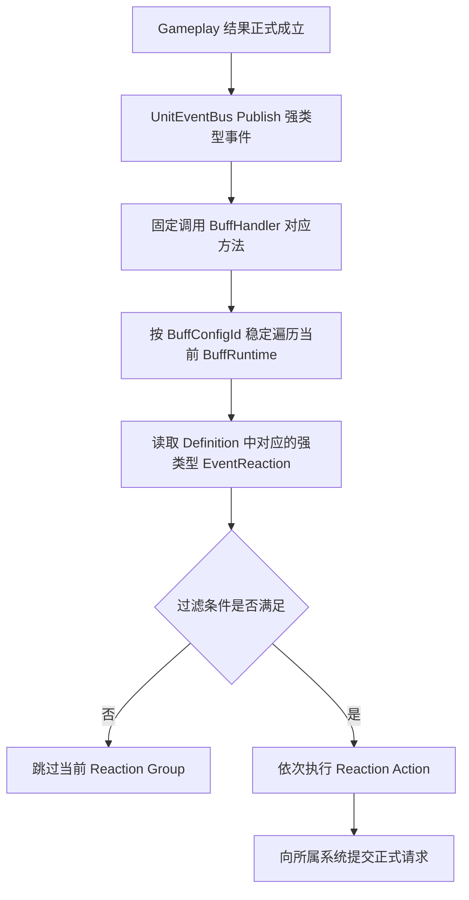
```mermaid
flowchart TD
    A[Gameplay 结果正式成立] --> B[UnitEventBus Publish 强类型事件]
    B --> C[固定调用 BuffHandler 对应方法]
    C --> D[按 BuffConfigId 稳定遍历当前 BuffRuntime]
    D --> E[读取 Definition 中对应的强类型 EventReaction]
    E --> F{过滤条件是否满足}
    F -- 否 --> G[跳过当前 Reaction Group]
    F -- 是 --> H[依次执行 Reaction Action]
    H --> I[向所属系统提交正式请求]
```

BuffHandler 不维护 `BuffListenerIndex`。

如果未来性能测试证明全量扫描成为热点，可以在 BuffHandler 内增加私有派生缓存；它不是领域模型，也不能改变公开接口或权威状态。

---

### BuffHandler 的强类型事件入口

```text
OnDamageTaken in DamageTakenEvent
OnDamageDealt in DamageDealtEvent
OnHealTaken in HealTakenEvent
OnHealDealt in HealDealtEvent
OnAbilityCast in AbilityCastEvent
OnUnitDying in UnitDyingEvent
OnUnitDeath in UnitDeathEvent
OnUnitKill in UnitKillEvent
OnLevelUp in LevelUpEvent
OnUnitCollisionEnter in UnitCollisionEnterEvent
OnUnitCollisionExit in UnitCollisionExitEvent
```

不存在以下 Buff 事件入口：

```text
ControlApplied
ControlRemoved
AttackCommitted
AttackHit
AbilityStage
```

除非单位框架未来正式增加对应的强类型事件接缝。

---

### AbilityCast 的正式语义

`AbilityCastEvent` 采用单位框架 v27.1 延续的字段：

```text
AbilityId
AbilitySessionUid
```

Buff 不读取：

```text
StageKey
EventKey
EventSequenceInTick
```

触发条件仍遵守技能系统 v12：

> 只有被技能配置标记为需要触发施法回调的 CastStage，在成功进入时，AbilityHandler 才发布 AbilityCast。

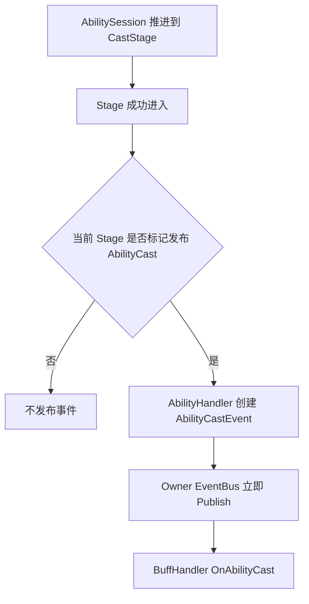
```mermaid
flowchart TD
    A[AbilitySession 推进到 CastStage] --> B[Stage 成功进入]
    B --> C{当前 Stage 是否标记发布 AbilityCast}
    C -- 否 --> D[不发布事件]
    C -- 是 --> E[AbilityHandler 创建 AbilityCastEvent]
    E --> F[Owner EventBus 立即 Publish]
    F --> G[BuffHandler OnAbilityCast]
```

Buff 可以根据：

- `AbilityId`
- `AbilitySessionUid`

判断和处理技能施放 Reaction。

---

### Reaction 产生的新请求

事件已经表示一个正式成立的 Gameplay 结果。

因此 Buff Reaction：

- 可以提交新的伤害请求
- 可以提交新的治疗请求
- 可以施加或移除 Buff
- 可以请求 CrowdControlHandler 添加控制
- 可以修改资源
- 可以挂载或解除 CombatModifier

但不能倒过来修改已经成立的当前事件结果。

例如：

```text
DamageTaken 已经发布
    当前伤害结果不可被 Buff Reaction 改写

反伤 Buff 触发
    提交一个新的 DamageRequest
    由 CombatSystem 按自己的正式流程处理
```

事件是即时同步分发，但跨系统结果仍必须经过目标系统的正式接口，不能直接篡改其它系统内部状态。

---

### 定位

Blackboard 保存同一个 BuffRuntime 内 Reaction 之间共享的确定性动态状态。

例如：

- 下一次周期触发 Tick
- 内部冷却结束 Tick
- 是否已触发
- 累计值
- 临时目标 UnitUid
- 上一次处理的逻辑 Tick

不使用：

```text
Dictionary string object
```

---

### 静态布局与运行槽位

`BuffDefinition` 直接保存：

```text
BuffBlackboardLayout
    BuffStateSlotDefinition[]
```

这只是 ScriptableObject 内的一段静态布局配置，不是 Bake 层。

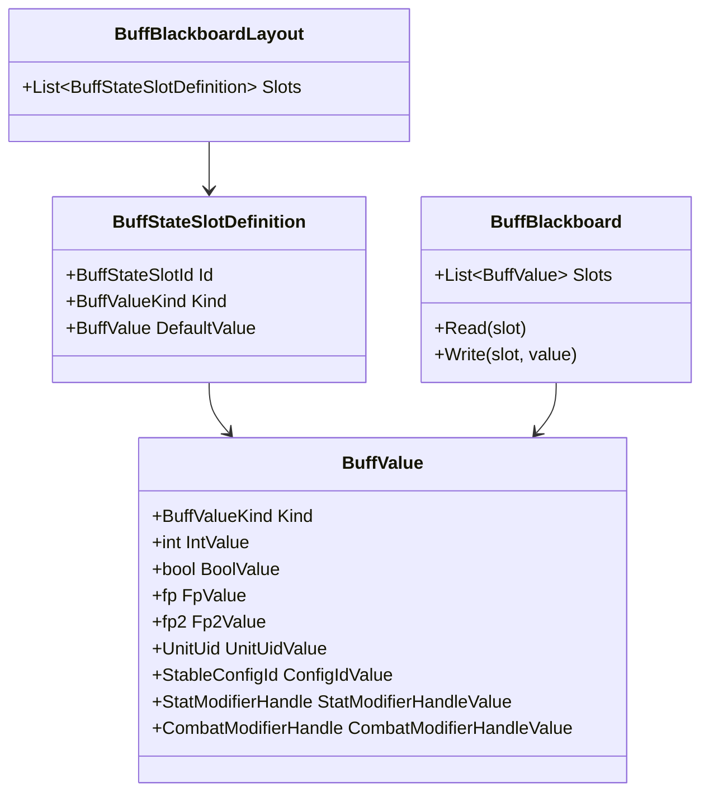
```mermaid
classDiagram
direction TB

class BuffBlackboardLayout {
  +List~BuffStateSlotDefinition~ Slots
}

class BuffStateSlotDefinition {
  +BuffStateSlotId Id
  +BuffValueKind Kind
  +BuffValue DefaultValue
}

class BuffBlackboard {
  +List~BuffValue~ Slots
  +Read(slot)
  +Write(slot, value)
}

class BuffValue {
  +BuffValueKind Kind
  +int IntValue
  +bool BoolValue
  +fp FpValue
  +fp2 Fp2Value
  +UnitUid UnitUidValue
  +StableConfigId ConfigIdValue
  +StatModifierHandle StatModifierHandleValue
  +CombatModifierHandle CombatModifierHandleValue
}

BuffBlackboardLayout --> BuffStateSlotDefinition
BuffStateSlotDefinition --> BuffValue
BuffBlackboard --> BuffValue
```

Reaction 配置通过稳定 `BuffStateSlotId` 访问对应槽位。

运行时不使用字符串查找，也不使用任意 `object`。

---

### 允许的值类型

```text
Int
Bool
Fp
Fp2
UnitUid
StableConfigId
StatModifierHandle
CombatModifierHandle
```

禁止存入：

- `GameObject`
- `Transform`
- `MonoBehaviour`
- `ScriptableObject`
- `Sprite`
- 任意 CLR Object
- 动态委托
- 临时集合引用
- `StatModifier` 对象引用
- `CombatModifierRecord` 对象引用
- `StatHandler` 或 `CombatModifierSet` 引用

---

### 静态 Effect 模块

继续删除运行时动态拼装结构：

```text
BuffEffectBuilder
BuffEffectRuntime
动态 Callback Bucket
运行时 Delegate 注册
```

但允许存在静态 Buff Effect 实现模块：

```text
StatModifierEffectConfig
CombatModifierEffectConfig
PeriodicDamageEffectConfig
ApplyBuffEffectConfig
CrowdControlRequestEffectConfig
```

`BuffDefinition.Effects` 保存这些静态模块所需的配置数据。

每个 Effect：

- 只保存静态参数和 Blackboard SlotId。
- 在固定生命周期函数中动态调用所属系统接口。
- 将运行时生成的 Handle 写入自己的 Blackboard 槽位。
- 对自己创建的 Handle 的创建、更新和清理负全责。
- 不把 Handle 写回 ScriptableObject。
- 不要求 BuffHandler 理解其内部 Handle 语义。

概念接口：

```text
BuffEffectConfig
    OnAdded(context)
    OnReapplied(context)
    OnStackChanged(context)
    OnAdvance(context)
    OnRemoved(context)
    OnTypedUnitEvent(context)
    ClearForDeath(context)
    ClearForRespawn(context)
    ClearForDespawn(context)
    ResetForPool(context)
```

这不是运行时委托桶，而是具体 Effect 类型的固定执行路径。  
动态状态只能写入当前 `BuffRuntime.Blackboard`。

---

### Handle 的运行时所有权

Handle 不属于静态配置。

静态 Effect 只配置创建 Handle 所需的数据，例如：

```text
StatModifierEffectConfig
    StatId
    Operation
    BaseValue
    ValuePerStack
    StatModifierHandleSlot

CombatModifierEffectConfig
    ModifierType
    Parameters
    CombatModifierHandleSlot
```

运行时流程：

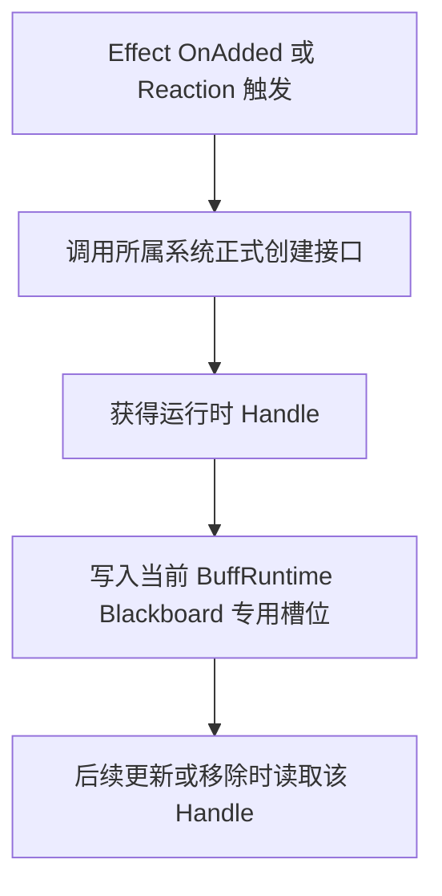
```mermaid
flowchart TD
    A[Effect OnAdded 或 Reaction 触发] --> B[调用所属系统正式创建接口]
    B --> C[获得运行时 Handle]
    C --> D[写入当前 BuffRuntime Blackboard 专用槽位]
    D --> E[后续更新或移除时读取该 Handle]
```

规则：

- `StatModifierHandle` 与 `CombatModifierHandle` 不进入 `BuffDefinition` 的运行值。
- Handle 不放入 `BuffRuntime` 顶层通用数组。
- 哪个 Effect 创建 Handle，哪个 Effect 负责保存、更新和清理。
- 永久 Buff 的生命阶段 Handle，由该 Effect 在 `ClearForDeath` 中释放、在 `ClearForRespawn` 中重建。
- BuffHandler 不扫描 Blackboard 做通用 Handle 清理。
- Handle 槽位默认值必须是明确的 `Invalid`。
- Handle 清理成功后必须立即写回 `Invalid`。
- Handle 只保存定位信息，不保存外部对象引用。

---

### Reaction Action

`BuffReactionActionConfig` 是静态、无状态的配置基类。

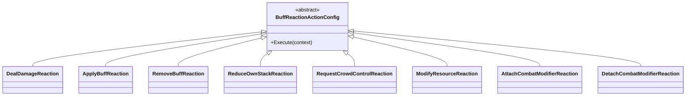
```mermaid
classDiagram
direction TB

class BuffReactionActionConfig {
  <<abstract>>
  +Execute(context)
}

class DealDamageReaction
class ApplyBuffReaction
class RemoveBuffReaction
class ReduceOwnStackReaction
class RequestCrowdControlReaction
class ModifyResourceReaction
class AttachCombatModifierReaction
class DetachCombatModifierReaction

BuffReactionActionConfig <|-- DealDamageReaction
BuffReactionActionConfig <|-- ApplyBuffReaction
BuffReactionActionConfig <|-- RemoveBuffReaction
BuffReactionActionConfig <|-- ReduceOwnStackReaction
BuffReactionActionConfig <|-- RequestCrowdControlReaction
BuffReactionActionConfig <|-- ModifyResourceReaction
BuffReactionActionConfig <|-- AttachCombatModifierReaction
BuffReactionActionConfig <|-- DetachCombatModifierReaction
```

推荐使用：

- `[SerializeReference]` 的具体配置子类
- 或嵌套的具体 `ScriptableObject`

是否拆成独立资源取决于复用需求，不改变运行模型。

每个 Action：

- 只保存静态参数
- 不保存触发次数和冷却
- 不保存 Runtime 对象引用
- 不注册 Delegate
- 不通过中心化 Factory 识别类型
- 通过自身固定的 `Execute` 路径执行
- 只能使用 `BuffReactionContext` 提供的正式系统入口

---

### ReactionContext

```text
BuffReactionContext
    Owner Unit
    BuffHandler
    Current BuffRuntime
    SimulationTickContext
    Optional typed event data
    PreviousStack
    CurrentStack
    RemovalReason
```

不同事件使用不同的强类型 Context，例如：

```text
DamageTakenBuffReactionContext
AbilityCastBuffReactionContext
StackChangedBuffReactionContext
PeriodicBuffReactionContext
```

不使用：

```text
EventType + object Payload
```

---

### 类型

固定支持：

```text
Added
Reapplied
StackChanged
Periodic
Removed
```

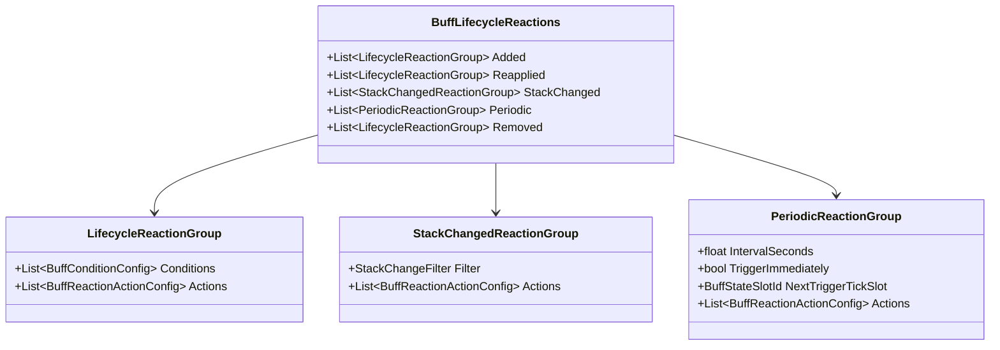
```mermaid
classDiagram
direction TB

class BuffLifecycleReactions {
  +List~LifecycleReactionGroup~ Added
  +List~LifecycleReactionGroup~ Reapplied
  +List~StackChangedReactionGroup~ StackChanged
  +List~PeriodicReactionGroup~ Periodic
  +List~LifecycleReactionGroup~ Removed
}

class LifecycleReactionGroup {
  +List~BuffConditionConfig~ Conditions
  +List~BuffReactionActionConfig~ Actions
}

class StackChangedReactionGroup {
  +StackChangeFilter Filter
  +List~BuffReactionActionConfig~ Actions
}

class PeriodicReactionGroup {
  +float IntervalSeconds
  +bool TriggerImmediately
  +BuffStateSlotId NextTriggerTickSlot
  +List~BuffReactionActionConfig~ Actions
}

BuffLifecycleReactions --> LifecycleReactionGroup
BuffLifecycleReactions --> StackChangedReactionGroup
BuffLifecycleReactions --> PeriodicReactionGroup
```

---

### Added

首次创建 Runtime 后执行一次。

执行时：

- Runtime 已加入 BuffStore
- 初始层数已经写入
- 各 Effect 的 `OnAdded` 初始化已经完成，所需 Handle 已写入 Blackboard
- Blackboard 已经初始化

适合：

- 首次施加时产生一次效果
- 初始化共享状态
- 向其它系统提交一次请求

---

### Reapplied

已存在的 Buff 再次成功 Apply 后执行。

执行前：

- 时间已经按 LifeRule 覆写
- 层数已经按 StackRule 覆写
- Source 已经更新
- 层数相关 Effect 已通过保存的 Handle 完成 `SetModifierValue`

即使层数没有变化，也会执行 `Reapplied`。

---

### StackChanged

只有层数确实变化时执行。

Context 提供：

```text
PreviousStack
CurrentStack
Delta
```

首次创建时：

```text
PreviousStack = 0
CurrentStack = InitialStack
```

也会执行一次。

适合：

- 三层触发
- 减层触发
- 层数达到阈值
- 层数归零前的特殊逻辑
- 按层数刷新外部投影

---

### Periodic

配置：

```text
float IntervalSeconds
bool TriggerImmediately
BuffStateSlotId NextTriggerTickSlot
Actions
```

初始化时转换：

```text
IntervalSeconds -> IntervalTicks
```

`NextTriggerTick` 存在当前唯一 `BuffRuntime.Blackboard` 中。

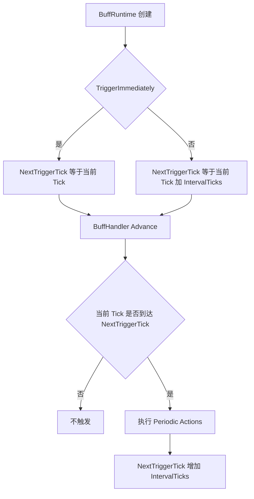
```mermaid
flowchart TD
    A[BuffRuntime 创建] --> B{TriggerImmediately}
    B -- 是 --> C[NextTriggerTick 等于当前 Tick]
    B -- 否 --> D[NextTriggerTick 等于当前 Tick 加 IntervalTicks]

    C --> E[BuffHandler Advance]
    D --> E
    E --> F{当前 Tick 是否到达 NextTriggerTick}
    F -- 否 --> G[不触发]
    F -- 是 --> H[执行 Periodic Actions]
    H --> I[NextTriggerTick 增加 IntervalTicks]
```

如果一次推进跨过多个周期点，是否补触发全部次数应由项目统一时间规则决定。  
当前建议按固定 Tick 每 Tick 推进，不设计跨 Tick 跳跃。

---

### Removed

Buff 即将正式从 Store 删除时执行。

适合：

- 到期时爆炸
- 结束时提交一次效果
- 清理由 Reaction 动态创建且尚未失效的外部 Handle

具体 Effect 可以在自己的 `OnRemoved` 中清理自己创建的运行时 Handle。

不适合：

- 直接操作 BuffStore
- 清理其它 Effect 创建的 Handle
- 扫描整个 Blackboard 猜测资源所有权

BuffStore 删除仍由 BuffHandler 的固定移除流程负责。

---

### 强类型 Reaction Set

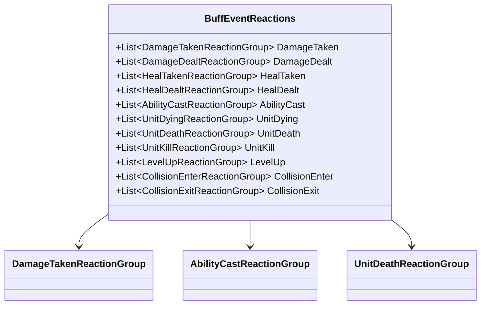
```mermaid
classDiagram
direction TB

class BuffEventReactions {
  +List~DamageTakenReactionGroup~ DamageTaken
  +List~DamageDealtReactionGroup~ DamageDealt
  +List~HealTakenReactionGroup~ HealTaken
  +List~HealDealtReactionGroup~ HealDealt
  +List~AbilityCastReactionGroup~ AbilityCast
  +List~UnitDyingReactionGroup~ UnitDying
  +List~UnitDeathReactionGroup~ UnitDeath
  +List~UnitKillReactionGroup~ UnitKill
  +List~LevelUpReactionGroup~ LevelUp
  +List~CollisionEnterReactionGroup~ CollisionEnter
  +List~CollisionExitReactionGroup~ CollisionExit
}

class DamageTakenReactionGroup
class AbilityCastReactionGroup
class UnitDeathReactionGroup

BuffEventReactions --> DamageTakenReactionGroup
BuffEventReactions --> AbilityCastReactionGroup
BuffEventReactions --> UnitDeathReactionGroup
```

每种 ReactionGroup 拥有与事件对应的强类型 Filter。

---

### DamageTaken 示例过滤项

可读取单位框架 v27.1 延续的正式字段，例如：

```text
CalculatedDamage
ActualShieldDamage
ActualLifeDamage
RemainingHealth
WasCritical
SourceDescriptor
RecipeId
```

可能的过滤条件：

- 实际生命伤害大于 0
- 实际护盾伤害大于 0
- 是否暴击
- DamageType
- 来源单位
- 来源 RecipeId

Buff Reaction 不能修改本次已经成立的伤害结果，只能产生后续请求。

---

### AbilityCast 示例过滤项

`AbilityCastReactionGroup` 可配置：

```text
指定 AbilityId
任意 Ability
是否要求指定 AbilitySessionUid
```

通常只需要按 `AbilityId` 过滤。

`AbilitySessionUid` 主要用于同一次技能会话内的玩法关联，不暴露 StageKey。

---

### v27.1 延续的正式接口

Buff 不再使用：

```text
StatModifierSource
AttachSource
DetachSource
Source Rebuild
```

具体 `StatModifierEffectConfig` 使用：

```text
StatHandler.AddModifier
StatHandler.SetModifierValue
StatHandler.RemoveModifier
```

`StatHandler` 保存真实 Modifier。  
Buff Effect 只保存返回的 `StatModifierHandle`。

---

### StatModifierEffectConfig

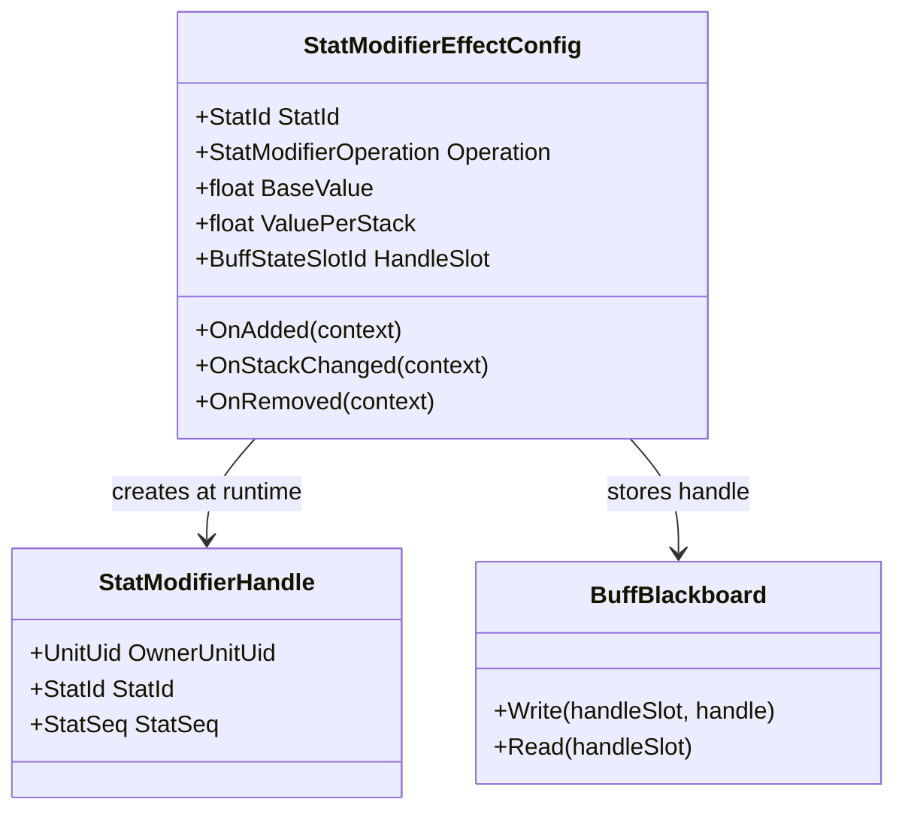
```mermaid
classDiagram
direction TB

class StatModifierEffectConfig {
  +StatId StatId
  +StatModifierOperation Operation
  +float BaseValue
  +float ValuePerStack
  +BuffStateSlotId HandleSlot
  +OnAdded(context)
  +OnStackChanged(context)
  +OnRemoved(context)
}

class StatModifierHandle {
  +UnitUid OwnerUnitUid
  +StatId StatId
  +StatSeq StatSeq
}

class BuffBlackboard {
  +Write(handleSlot, handle)
  +Read(handleSlot)
}

StatModifierEffectConfig --> StatModifierHandle : creates at runtime
StatModifierEffectConfig --> BuffBlackboard : stores handle
```

静态配置中保存：

```text
StatId
Operation
BaseValue
ValuePerStack
HandleSlotId
```

静态配置中不保存：

```text
StatModifierHandle
StatSeq
实际 Modifier
StatHandler 引用
```

`Operation` 限制为单位框架 v26 正式支持的类型：

```text
FlatAdd
BaseRatioAdd
FinalRatioAdd
```

Inspector 可以使用普通浮点数编辑，调用 Gameplay 接口前转换为项目定点数 `fp`。

---

### 创建、更新与清理

#### Added

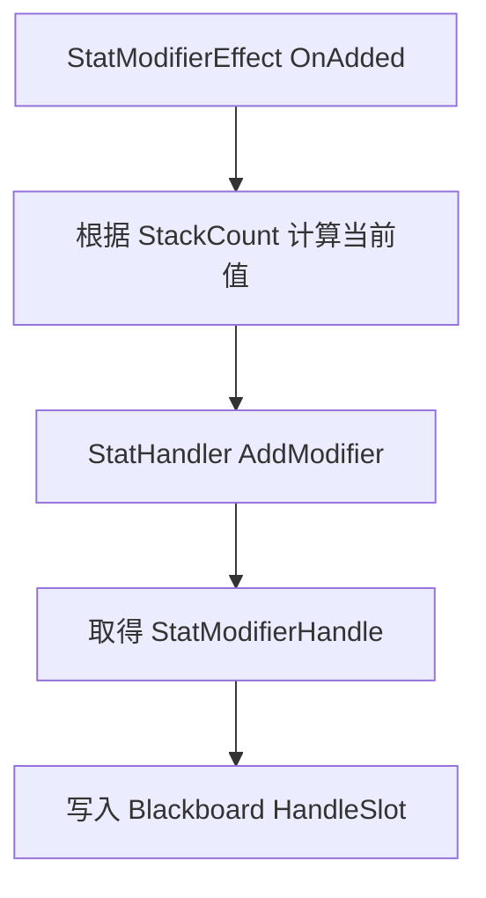
```mermaid
flowchart TD
    A[StatModifierEffect OnAdded] --> B[根据 StackCount 计算当前值]
    B --> C[StatHandler AddModifier]
    C --> D[取得 StatModifierHandle]
    D --> E[写入 Blackboard HandleSlot]
```

#### StackChanged

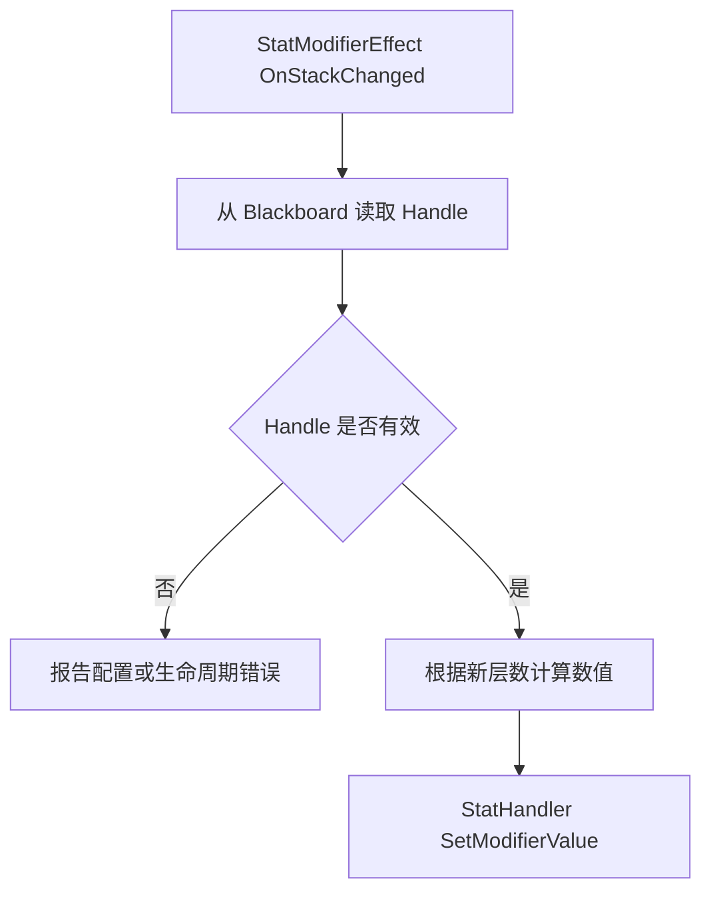
```mermaid
flowchart TD
    A[StatModifierEffect OnStackChanged] --> B[从 Blackboard 读取 Handle]
    B --> C{Handle 是否有效}
    C -- 否 --> D[报告配置或生命周期错误]
    C -- 是 --> E[根据新层数计算数值]
    E --> F[StatHandler SetModifierValue]
```

#### Removed

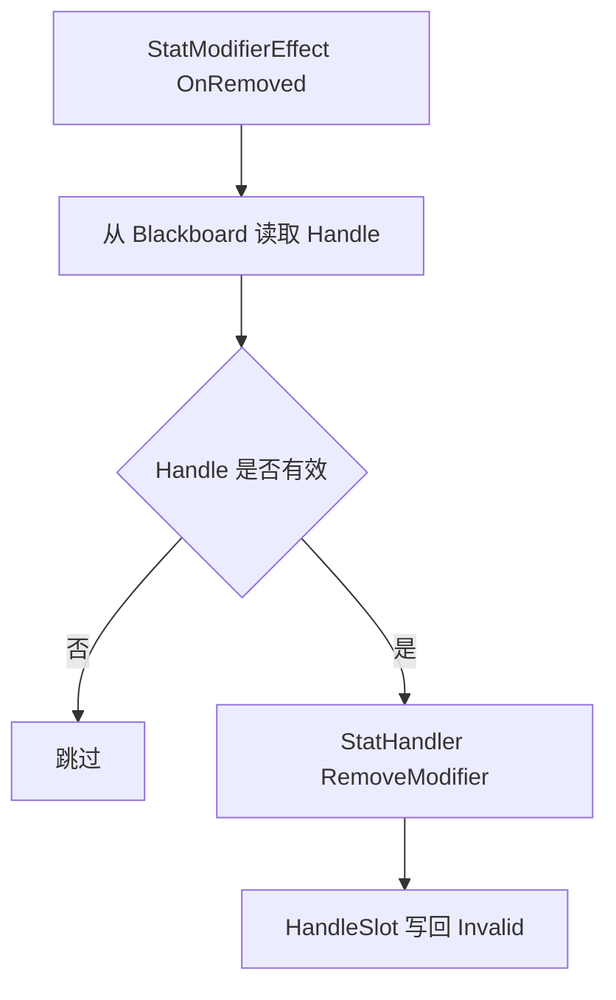
```mermaid
flowchart TD
    A[StatModifierEffect OnRemoved] --> B[从 Blackboard 读取 Handle]
    B --> C{Handle 是否有效}
    C -- 否 --> D[跳过]
    C -- 是 --> E[StatHandler RemoveModifier]
    E --> F[HandleSlot 写回 Invalid]
```

#### ClearForDeath 与 ClearForRespawn

永久 Buff 不执行 `OnRemoved`，但当前生命阶段的属性 Modifier 仍需要注销。

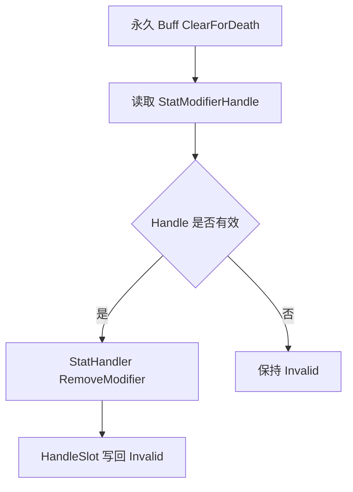
```mermaid
flowchart TD
    A[永久 Buff ClearForDeath] --> B[读取 StatModifierHandle]
    B --> C{Handle 是否有效}
    C -- 是 --> D[StatHandler RemoveModifier]
    C -- 否 --> E[保持 Invalid]
    D --> F[HandleSlot 写回 Invalid]
```

复活时：

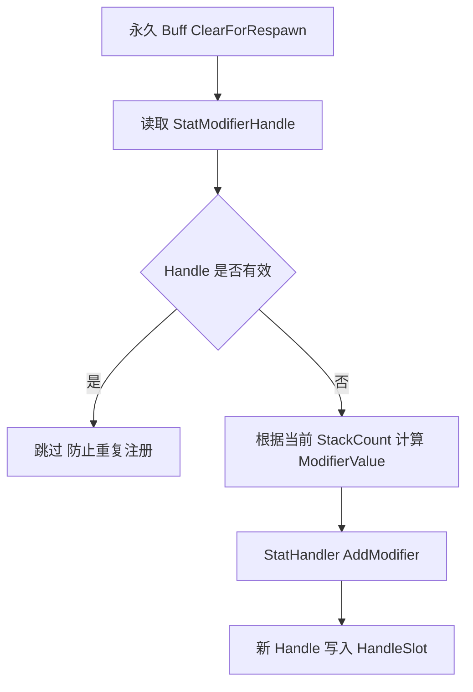
```mermaid
flowchart TD
    A[永久 Buff ClearForRespawn] --> B[读取 StatModifierHandle]
    B --> C{Handle 是否有效}
    C -- 是 --> D[跳过 防止重复注册]
    C -- 否 --> E[根据当前 StackCount 计算 ModifierValue]
    E --> F[StatHandler AddModifier]
    F --> G[新 Handle 写入 HandleSlot]
```

数值计算：

```text
ModifierValue
    = BaseValue
    + ValuePerStack * StackCount
```

层数变化时使用同一个 Handle 更新数值，不重复 Remove 再 Add。

---

### Handle 不是第二套 Modifier 状态

`StatModifierHandle` 只用于定位：

```text
OwnerUnitUid
StatId
StatSeq
```

它不保存：

- Modifier 当前值
- Modifier Operation
- 属性容器
- Dirty 状态

真实 Modifier 仍归 `StatHandler`。

BuffRuntime 通过 Blackboard 保存 Handle，是为了未来：

- 更新自己创建的 Modifier
- 删除自己创建的 Modifier
- 在确定性恢复后重新定位同一条 Modifier

具体快照还是稳定字段重解析，由帧同步设计决定。

---

### CombatModifierEffectConfig

CombatModifier 采用相同边界：

```text
静态 Effect
    保存创建参数与 CombatModifierHandleSlot

运行时
    CombatModifierSet Attach
    获得 CombatModifierHandle
    写入 Blackboard

消费或结束
    查询 Handle 是否仍有效
    有效则 Detach
    槽位置为 Invalid
```

`CombatModifierSet` 是实际 Record 的权威。  
Buff 只保存定位 Handle，不保存 `CombatModifierRecord` 对象。

### 点燃

#### Definition

```text
Display
    Name = 点燃
    Description = 每隔一秒受到一次伤害
    Icon = IgniteSprite

Life
    DurationSeconds = 5
    Infinite = false
    RefreshMode = RefreshToFull

Stack
    MaxStacks = 1
    AddMode = Ignore

LifecycleReactions
    Periodic
        IntervalSeconds = 1
        TriggerImmediately = false
        Action = DealDamage
```

#### 流程

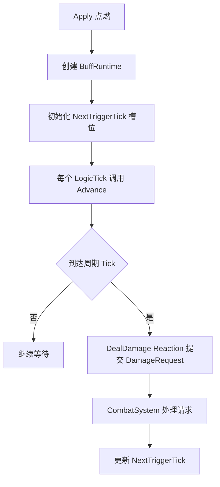
```mermaid
flowchart TD
    A[Apply 点燃] --> B[创建 BuffRuntime]
    B --> C[初始化 NextTriggerTick 槽位]
    C --> D[每个 LogicTick 调用 Advance]
    D --> E{到达周期 Tick}
    E -- 否 --> F[继续等待]
    E -- 是 --> G[DealDamage Reaction 提交 DamageRequest]
    G --> H[CombatSystem 处理请求]
    H --> I[更新 NextTriggerTick]
```

---

### 施法后强化

#### Definition

```text
EventReactions
    AbilityCast
        Filter AbilityId = 指定技能
        Actions
            ApplyBuff 强化普攻
```

#### 流程

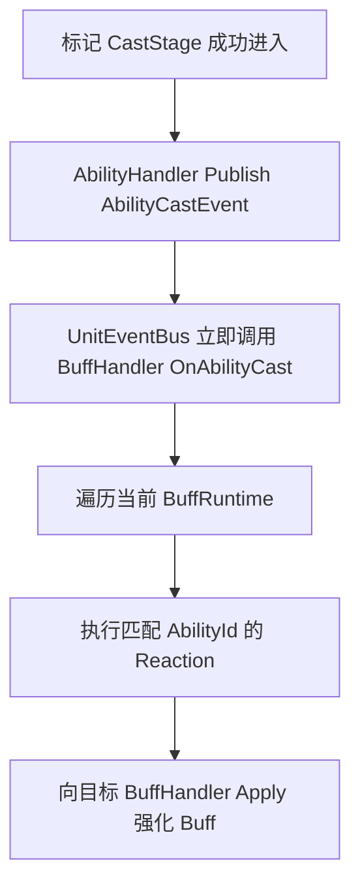
```mermaid
flowchart TD
    A[标记 CastStage 成功进入] --> B[AbilityHandler Publish AbilityCastEvent]
    B --> C[UnitEventBus 立即调用 BuffHandler OnAbilityCast]
    C --> D[遍历当前 BuffRuntime]
    D --> E[执行匹配 AbilityId 的 Reaction]
    E --> F[向目标 BuffHandler Apply 强化 Buff]
```

---

### 三环

#### Definition

```text
Stack
    MaxStacks = 3
    AddMode = Add

LifecycleReactions
    StackChanged
        Filter CurrentStack >= 3
        Actions
            提交三环效果
            ReduceOwnStack 3
```

#### 流程

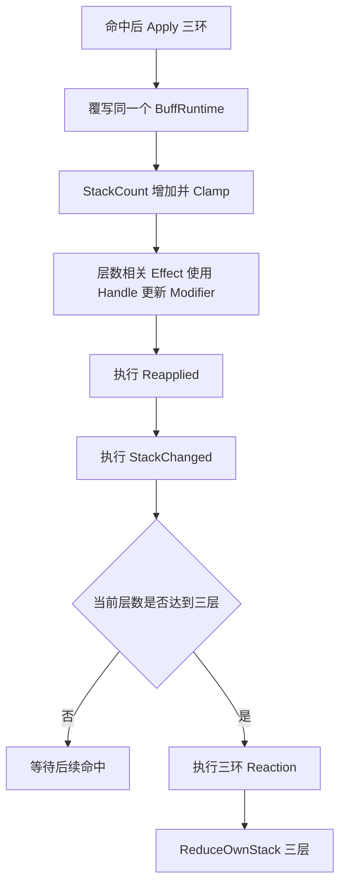
```mermaid
flowchart TD
    A[命中后 Apply 三环] --> B[覆写同一个 BuffRuntime]
    B --> C[StackCount 增加并 Clamp]
    C --> D[层数相关 Effect 使用 Handle 更新 Modifier]
    D --> E[执行 Reapplied]
    E --> F[执行 StackChanged]
    F --> G{当前层数是否达到三层}
    G -- 否 --> H[等待后续命中]
    G -- 是 --> I[执行三环 Reaction]
    I --> J[ReduceOwnStack 三层]
```

---

### 受伤反击

#### Definition

```text
EventReactions
    DamageTaken
        Filter ActualLifeDamage > 0
        Actions
            DealDamage
                Target = Event Source Unit
```

#### 流程

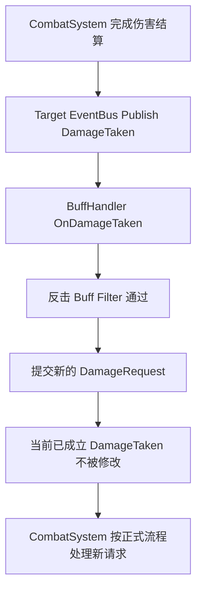
```mermaid
flowchart TD
    A[CombatSystem 完成伤害结算] --> B[Target EventBus Publish DamageTaken]
    B --> C[BuffHandler OnDamageTaken]
    C --> D[反击 Buff Filter 通过]
    D --> E[提交新的 DamageRequest]
    E --> F[当前已成立 DamageTaken 不被修改]
    F --> G[CombatSystem 按正式流程处理新请求]
```

---

### 层数加速

#### Definition

```text
Effects
    StatModifierEffectConfig
        StatId = MoveSpeed
    Operation = FinalRatioAdd
    BaseValue = 0
    ValuePerStack = 0.05
```

#### 流程

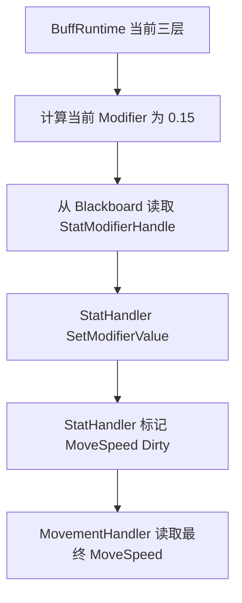
```mermaid
flowchart TD
    A[BuffRuntime 当前三层] --> B[计算当前 Modifier 为 0.15]
    B --> C[从 Blackboard 读取 StatModifierHandle]
    C --> D[StatHandler SetModifierValue]
    D --> E[StatHandler 标记 MoveSpeed Dirty]
    E --> F[MovementHandler 读取最终 MoveSpeed]
```

---

### 永久光环 Buff 跨死亡保留

#### Definition

```text
Life
    Infinite = true

Effects
    StatModifierEffectConfig
        StatId = Armor
        Operation = FlatAdd
        BaseValue = 20
        HandleSlot = ArmorModifierHandleSlot
```

#### 生命周期

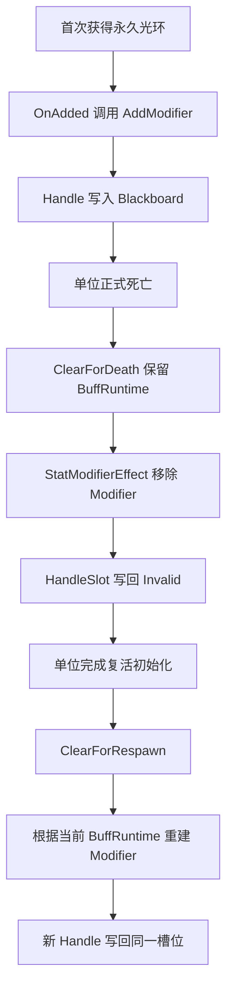
```mermaid
flowchart TD
    A[首次获得永久光环] --> B[OnAdded 调用 AddModifier]
    B --> C[Handle 写入 Blackboard]

    C --> D[单位正式死亡]
    D --> E[ClearForDeath 保留 BuffRuntime]
    E --> F[StatModifierEffect 移除 Modifier]
    F --> G[HandleSlot 写回 Invalid]

    G --> H[单位完成复活初始化]
    H --> I[ClearForRespawn]
    I --> J[根据当前 BuffRuntime 重建 Modifier]
    J --> K[新 Handle 写回同一槽位]
```

该流程不会再次执行：

```text
Added
Reapplied
StackChanged
Removed
```

---

### . 生命周期与单位框架接缝

`BuffHandler` 作为 `UnitHandler`，遵守单位框架 v27.2 的生命周期接口：

```text
InitializeForNewRuntime
ClearForDeath
ClearForDespawn
ClearForRespawn
ResetForPool
```

### 生命周期矩阵

| 接口 | BuffRuntime | Effect Handle | Gameplay Reaction |
|---|---|---|---|
| `ClearForDeath` 非永久 Buff | 删除 | 清理 | 执行 `Removed` |
| `ClearForDeath` 永久 Buff | 保留 | 释放当前生命阶段 Handle | 不执行 `Removed` |
| `ClearForRespawn` 永久 Buff | 复用原 Runtime | 重建当前生命阶段 Handle | 不执行 Added/Reapplied 等 Reaction |
| `ClearForDespawn` | 全部删除 | 静默清理 | 不执行 `Removed` |
| `ResetForPool` | 全部重置 | 静默重置 | 不提交 Gameplay Request |
| 回滚拓扑移除 | 按回滚系统恢复 | 按历史状态恢复 | 不走正常生命周期 Reaction |

### 固定要求

BuffHandler 必须保证：

- 生命周期清理幂等。
- 以稳定的 `BuffConfigId` 顺序处理 Runtime。
- 非永久 Buff 在死亡时不保留。
- 永久 Buff 在死亡和复活之间保留同一个 Runtime。
- 永久 Buff 的 Handle 槽在死亡后为 `Invalid`。
- 复活后由具体 Effect 重建生命阶段 Handle。
- 每个 Effect 只管理自己创建的 Handle。
- 对象池重用前不残留旧 Runtime。
- 不清理其它 Handler 所拥有的状态。
- 不把 `ClearForRespawn` 当成再次执行死亡清理。
- 不在 Respawn 中再次触发 `Added / Reapplied / StackChanged / Removed`。

### 调用所有权

---


## 需求演进

### 2026-10-02

变动内容：正式死亡由 UnitWorld 同步执行，来源系统仅清理自己的句柄。

legacyDecision：D-009

### 2026-10-02

变动内容：死亡和击杀反应即时分发，产生的新普通战斗请求延至下一 Tick。

legacyDecision：D-010

### 2026-08-06

变动内容：强化复仇结束后最多补一个普通 Buff；分段 checksum 和 StatSeq 排序便于定位。

legacyDecision：D-032

