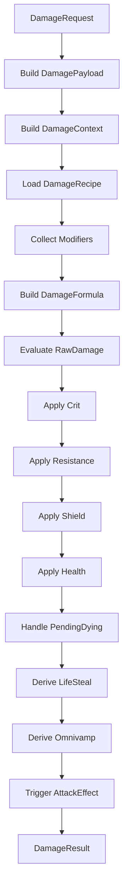

# 伤害配方抗性与吸血

## 目标实现

伤害按正式配方和修正阶段计算，得到可记录的实际损失。

## 技术方案

DamageRecipe/FormulaTerm 生成伤害，固定槽位 Modifier 合并后进入暴击、抗性、盾、生命、偷取及反应；超额伤害按定点权重分摊 ActualLifeDamage。

## 边界情况

免疫、零伤害、纯盾伤害和纯过量不计击杀优势；非法请求仍报错；结构拒绝政策合法拒绝是成功空操作。

## 验收条件

- 正常路径达到上述目标，并由所属模块唯一拥有权威状态。
- 以上边界情况有明确返回、拒绝或可见失败；不得用占位成功代替行为。
- 确定性逻辑比较重复执行、改变插入顺序以及捕获/恢复/重演结果；只读界面不得改变 Gameplay。

## 工程实际核查

本期检索的是当前源码和测试定义。存在实现不等于完成全部需求，存在测试不等于本期已运行通过。

- `Assets/Scripts/Gameplay/Combat/CombatSystem.cs`：当前关联实现定义 CombatSystem、ShieldRequestComparer、HealRequestComparer、DamageRequestComparer、DamageAllocationGroup（以源码为实际命名）。
- `Assets/Scripts/Gameplay/Combat/DamageContext.cs`：当前关联实现定义 DamageContext（以源码为实际命名）。

### 已有测试位置

- `Assets/Scripts/Gameplay/Tests/CombatSystemTests.cs`：SubmitDamage_ValidRequest_ReducesHealth、Omnivamp_HealsSourceForFractionOfSettledDamage、NaturalRegen_AppliesPerInterval_ForHealthAndCastResource、DamageFormula_ArmorReducesDamage、ZeroArmor_FullDamageApplied、CombatModifiers_ApplyOutgoingAndIncomingFinalPatches、FatalDamage_CompletesFormalDeathSettlement。
- `Assets/Scripts/Bootstrap/Tests/PlayMode/ClientBootstrapFirstWavePlayModeTests.cs`：GameScene_FirstWaveUsesFlowFieldsAndMoves、GameScene_MapViewAnchorsToStaticTopologyRootAtWorldOrigin。
- `Assets/Scripts/FrameSync/Tests/ProjectileCombatPipelineTests.cs`：EqualDistanceHits_AreFairnessKeyOrderedAndUseCombat、EndOnFirstHit_RejectsLaterSameTickCandidate、EqualDistanceArbitration_UidRelabelKeepsParticipantWinner、PierceBudget_EndsAtConfiguredHitCount、ProjectileDamage_UsesCombatShieldPipeline、EnemyFilter_ExcludesFriendlyTarget、EnemyFilter_IncludesStructureTarget。
- `Assets/Scripts/FrameSync/Tests/ProjectileFalloffTests.cs`：PiercingFalloff_ReducesDamagePerExtraHit、PiercingFalloff_OverridePath_MatchesStaticConfig、PiercingFalloff_ClampsAtMinDamageRatio。
- `Assets/Scripts/FrameSync/Tests/SnapshotChecksumCompletenessTests.cs`：AggregateSnapshot_RestoresIntentDashAndLocomotion、SharedChecksum_ChangesForIntentDashAndLocomotionState、CombatModifierCapture_IsCanonicalAndDetachRepairsShiftedIndices、AggregateSnapshot_CapturesLiveActionRuntime、ExecuteTick_FormalDeathInvalidationCapturesRestorableBoundary、SharedChecksum_SerializesEveryActionRuntimeSlotMember、Restore_RejectsActionRuntimeWithoutOwningHandlerState。

## 附录：精确接口、公式与配置

附录保留本功能必须精确表达的接口、运算和配置语义，原系统章节已拆到所属功能。若与上面的已接受修订仍有冲突，进入待确认清单而不是按旧版本执行。

### SourceDescriptor

`SourceDescriptor` 只描述来源，不负责公式计算。

| 字段 | 说明 |
|---|---|
| `SourceType` | Attack / Ability / Buff / Equipment / AttackEffect / System |
| `SourceId` | 普攻模板、技能 ID、Buff ID、装备 ID 等 |
| `OwnerUnitUid` | 归属单位 UID，通常是伤害拥有者 |
| `EmitterUnitUid` | 实际发出单位 UID，可为无效值，例如召唤物、分身、宠物作为实际发出者时填写 |

`SourceType = Attack` 表示这是攻击来源伤害。

它可以来自：

| 来源 | SourceType | RecipeId |
|---|---|---|
| 普通普攻 | Attack | BasicAttackDamageRecipe |
| 强化普攻 | Attack | EmpoweredAttackDamageRecipe |
| EZ Q 这类可附着攻击特效的技能 | Attack | EzQDamageRecipe |
| 三项、破败等攻击特效伤害 | AttackEffect | 对应装备特效 Recipe |

关键规则：

```text
是否是攻击来源，由 SourceType = Attack 决定。
伤害怎么算，由 RecipeId 决定。
```

因此不需要额外设计：

```text
AttackSourceContext
AttackSequenceId
AttackKind
```

---

### DamageChannel 不是 Tag

伤害类型是核心字段，不是标签。

```text
DamageChannel = Physical / Magic / True
```

| DamageChannel | 说明 |
|---|---|
| Physical | 进入护甲、护甲穿透、物理增减伤计算 |
| Magic | 进入魔抗、魔法穿透、魔法增减伤计算 |
| True | 跳过护甲和魔抗减伤，但仍可进入护盾、最终修正、生命扣减等阶段 |

所以不需要：

```text
TrueDamage Tag
IgnoreArmor Tag
```

这些语义都应当由 `DamageChannel` 和抗性阶段规则表达。

---

### DeliveryDescriptor

很多“标签”其实是结构化结算特征，尤其影响全能吸血衰减。

建议用：

```text
DamageDeliveryDescriptor
```

| 字段 | 说明 |
|---|---|
| `Timing` | Instant / Periodic |
| `HitPattern` | SingleTarget / Area |
| `OwnershipRelation` | OwnerDirect / IndirectEmitter |

含义：

| 字段值 | 说明 |
|---|---|
| `Periodic` | 周期性伤害，例如持续灼烧 Tick |
| `Area` | 群体性、范围性伤害 |
| `IndirectEmitter` | 不直接来源于单位本人，例如召唤物、宠物、分身、陷阱等 |

这些不建议写成松散 Tag：

```text
IsDamageOverTime
IsAreaDamage
IsSingleTarget
```

因为它们是管线固定会读取的结构化信息。

---

### KeywordTags 只保留设计标签

`KeywordTags` 只用于特殊规则匹配，不用于表达已经有固定字段的核心概念。

不应作为 Tag 的内容：

| 不作为 Tag | 原因 |
|---|---|
| `TrueDamage` | 已由 `DamageChannel` 表达 |
| `PhysicalDamage` | 已由 `DamageChannel` 表达 |
| `MagicDamage` | 已由 `DamageChannel` 表达 |
| `CanApplyLifeSteal` | 由 `SourceType = Attack` 推导 |
| `CanApplyOmnivamp` | 所有生命伤害默认可进入全能吸血阶段 |
| `CanTriggerAttackEffect` | 由 `SourceType = Attack` 推导 |
| `IsAreaDamage` | 已由 `DeliveryDescriptor.HitPattern` 表达 |
| `IsDamageOverTime` | 已由 `DeliveryDescriptor.Timing` 表达 |
| `IgnoreArmor` | 已由 `DamageChannel` 或抗性策略表达 |

可以作为 `KeywordTags` 的内容：

| KeywordTag | 示例用途 |
|---|---|
| `Empowered` | 强化普攻、强化技能的特殊匹配 |
| `SpellBladeCompatible` | 某些技能是否能消耗咒刃类效果，如果不能单靠 SourceType 判断 |
| `Execute` | 斩杀类效果匹配 |
| `Burn` | 灼烧类效果匹配 |
| `Poison` | 中毒类效果匹配 |
| `Bleed` | 流血类效果匹配 |

原则：

```text
固定管线一定会用到的内容，用字段。
少数玩法规则需要匹配的语义，用 KeywordTag。
```

---

### DamagePipeline 总流程

`DamagePipeline` 内部包含：

```text
DamageRequest
DamagePayload
DamageContext
DamageRecipe
DamageFormula
DamageResult
```



---

### DamageRequest

`DamageRequest` 是外部提交的最小请求。

| 字段 | 说明 |
|---|---|
| `Header` | 公共头部 |
| `BaseValue` | 基础伤害值，例如普攻当前攻击力、技能当前等级基础伤害、本次 Buff Tick 基础伤害 |
| `DamageChannelOverride` | 可选。为空则使用 Recipe 默认伤害类型 |

提交方必须给出 `BaseValue`，但不需要给出完整伤害公式。

不在请求中传：

| 不传 | 原因 |
|---|---|
| 完整公式项 | 由 DamageRecipe 提供 |
| 当前属性值 | 由 DamageContext 在结算时读取 |
| Buff 或装备影响 | 由 `CombatModifierCollector` 从 Unit.CombatModifierSet 收集 |
| 派生值结果 | 由 FormulaTerm 在结算时按需计算 |
| 攻击特效策略 | 攻击特效是独立来源伤害 |
| 吸血开关 | 由 SourceType 和结算结果推导 |
| 全能吸血开关 | 所有生命伤害默认进入全能吸血阶段 |

---

### DamagePayload

`DamagePayload` 是管线内部运行时数据包。

它由 `DamagePipeline` 根据请求和当前上下文构建，不由提交方手动拼。

| 内容 | 来源 |
|---|---|
| Source / Target | DamageRequest.Header |
| SourceDescriptor | DamageRequest.Header |
| BaseValue | DamageRequest.BaseValue |
| RuntimeParams | DamageRequest.Header.RuntimeParams |
| KeywordTags | DamageRequest.Header.KeywordTags |
| DeliveryDescriptor | DamageRecipe 默认值 + 可选运行时覆盖 |
| Recipe | 根据 RecipeId 加载 |
| Context | 管线内部构建 |
| Modifiers | 从来源与目标的 `CombatModifierSet` 收集 |
| Formula | 管线内部构建 |

`DamagePayload` 不包含攻击特效策略，也不包含 Buff 或装备的具体影响数据。

---

### DamageContext

`DamageContext` 是结算时上下文。

| 内容 | 获取方式 |
|---|---|
| 来源当前属性 | 结算时从 Source.StatHandler 读取 |
| 目标当前属性 | 结算时从 Target.StatHandler 读取 |
| 来源当前状态 | 从 Unit / Buff / 装备状态读取 |
| 目标当前状态 | 从 Unit / Buff / 控制状态读取 |
| 伤害通道 | DamageChannelOverride 或 Recipe 默认值 |
| 结算特征 | DeliveryDescriptor |
| 运行时参数 | RuntimeParams |

核心规则：

```text
所有数值都在该请求真正结算的那一刻读取。
持续伤害每个 Tick 都重新提交 DamageRequest。
每个 Tick 都重新读取当前属性。
```

---

### DamageRecipe 与 DamageFormula

默认链路：

```text
DamageRecipe -> DamageFormula
```

不强制增加 `DamageComponent` 中间层。

| 概念 | 说明 |
|---|---|
| `DamageRecipe` | 配置层配方，说明基础项、属性加成项、派生项、默认伤害通道、默认结算特征 |
| `DamageFormula` | 运行时公式，由 Recipe + Context + CombatFormulaPatch 构建 |

如果编辑器里需要把复杂技能拆成多段显示，可以使用 `RecipeSection` 或 `FormulaGroup`，但它只是配置组织方式，不是运行时必需管线节点。

---

### FormulaTerm

`FormulaTerm` 写在 `DamageRecipe` 里，不由提交方临时构造。

| Term | 说明 | 示例 |
|---|---|---|
| `BaseValueTerm` | 请求携带的基础数值 | DamageRequest.BaseValue |
| `ConstantTerm` | 配方固定额外值 | 80 |
| `SourceStatTerm` | 来源属性比例 | 1.1 × Source.AttackDamage |
| `TargetStatTerm` | 目标属性比例 | 0.04 × Target.MaxHealth |
| `SourceDerivedTerm` | 来源派生值 | Source.MissingHealthRatio |
| `TargetDerivedTerm` | 目标派生值 | Target.MissingHealthRatio |
| `ContextParamTerm` | 少量运行时参数 | ChargeRatio、StageIndex、HitIndex |

`BaseValueTerm` 是三类战斗请求都应具备的基础项。对于伤害来说，它通常是：

| 来源 | BaseValue |
|---|---|
| 普通普攻 | Impact 当刻读取的当前攻击力 |
| 强化普攻 | 强化普攻自身指定的基础伤害，或当前攻击力 |
| 技能伤害 | 技能当前等级基础伤害 |
| Buff Tick | 本次 Tick 的基础伤害 |
| 攻击特效 | 攻击特效自己的基础数值 |

`ContextParamTerm` 只用于蓄力比例、技能段位、命中次数这类请求必须携带的小参数。

它不用于传 Buff、装备、穿透、暴击等影响因素。

---

### 抗性阶段

抗性阶段根据 `DamageChannel` 决定。

| DamageChannel | 抗性阶段 |
|---|---|
| Physical | 读取目标护甲，读取来源护甲穿透，计算有效护甲和物理伤害倍率 |
| Magic | 读取目标魔抗，读取来源魔法穿透，计算有效魔抗和魔法伤害倍率 |
| True | 跳过护甲和魔抗倍率计算 |

穿透、护甲、魔抗都是属性或属性修正结果，不需要在请求中单独塞字段。

---

### 护盾、生命与 PendingDying 处理

伤害经过公式、暴击、抗性后，进入护盾与生命应用阶段。

```text
FinalDamage
    -> Shield Stage
    -> Health Stage
    -> PendingDying Stage
```

如果目标不存在 `PendingDyingRecord`：

```text
先扣当前护盾
再扣当前生命
生命降到 0 时：
    CurrentHealth = 0
    创建 PendingDyingRecord
    Unit.LifeState 仍保持 Alive
    Unit 仍保持可选中
```

如果目标已经存在 `PendingDyingRecord`：

```text
本次伤害仍先经过当前护盾
护盾无法吸收的生命伤害不再直接把生命扣成负数
将该生命伤害按 SequenceInTick 写入 DeferredLifeDamageCache
```

此阶段不发布死亡事件，也不把 `LifeState` 改成 `Dying`。

`PendingDyingRecord` 至少需要在战斗系统内部关联：

| 内容 | 说明 |
|---|---|
| `TargetUnitUid` | 目标单位 |
| `EnteredSequenceInTick` | 本帧第一次生命归零时的序列位置 |
| `DeferredLifeDamageCache` | 后续欠下的生命伤害 |
| `LastLethalSource` | 当前用于最终死亡归因的致命来源候选 |
| `DyingCallbackResolved` | 防止同一次濒死过程重复触发濒死回调 |


---

### 生命偷取

生命偷取不是请求 Tag，而是 DamagePipeline 的派生阶段。

触发条件：

```text
SourceType = Attack
DamageResult.ActualLifeDamage > 0
SourceUnitUid 有效，且解析出的来源单位当前允许接受治疗
```

计算方式：

```text
LifeStealHeal = ActualLifeDamage × Source.LifeSteal
```

然后生成：

```text
HealRequest
    SourceType = System
    SourceId = LifeSteal
    RecipeId = LifeStealHealRecipe
    BaseValue = LifeStealHeal
```

并分配新的 `SequenceInTick`，进入 `HealQueue`。

关键点：

```text
只有攻击来源伤害触发生命偷取。
AttackEffect 不是 Attack，不再触发生命偷取。
```

如果某个攻击特效业务上也想享受生命偷取，应当明确把它设计为攻击来源的一部分，或让该装备自己提供治疗修正，而不是默认让所有 AttackEffect 都偷取。

---

### 全能吸血

全能吸血默认适用于所有实际生命伤害。

触发条件：

```text
DamageResult.ActualLifeDamage > 0
SourceUnitUid 有效，且解析出的来源单位当前允许接受治疗
```

基础计算：

```text
OmnivampHeal = ActualLifeDamage × Source.Omnivamp × OmnivampEfficiency
```

`OmnivampEfficiency` 由目标类型和伤害结算特征决定。

推荐规则：

| 条件 | 效率 |
|---|---:|
| 普通直接单体伤害，目标为英雄 | 1 |
| 目标是小兵 | 1/3 |
| 目标是野怪 | 1/3 |
| 周期性伤害 | 1/3 |
| 群体性伤害 | 1/3 |
| 不直接来源于单位本人，例如召唤物、宠物、陷阱 | 1/3 |

如果多个衰减条件同时满足：

```text
只取一次衰减，通常为 1/3。
不要 1/3 × 1/3 叠乘，除非全局规则明确要求。
```

判断来源：

```text
OwnerUnitUid == SourceUnitUid
且 EmitterUnitUid 无效或 EmitterUnitUid == SourceUnitUid
    -> OwnerDirect
否则
    -> IndirectEmitter
```

判断目标：

```text
Target.UnitKind = Hero / Minion / Monster / Structure
```

因此不需要：

```text
CanApplyOmnivamp Tag
```

---

### 攻击特效与 DamageDealt Reaction

攻击特效不再通过动态 `DamageDealt Reaction` 注册，也不作为 `DamagePayload` 中的策略。

攻击来源伤害形成有效 `DamageResult` 后：

```text
Target.EventBus.Publish(DamageTaken)
Source.EventBus.Publish(DamageDealt)
```

`EquipmentHandler / BuffHandler / AbilityHandler` 在单位框架固定路由的 `DamageDealt` 回调中，根据自己的静态 Reaction 配置和运行状态判断是否需要提交攻击特效：

```text
DamageDealt Reaction
    -> 创建新的 DamageRequest
    -> SourceType = AttackEffect
    -> RecipeId = 对应攻击特效配方
    -> CombatSystem 分配新的 SequenceInTick
    -> 进入 DamageQueue
```

攻击特效伤害的 `SourceType = AttackEffect`，因此不会再次满足“攻击来源伤害”条件，避免递归触发同类攻击特效。

如果多个 Reaction 同时提交请求，调用顺序由单位框架 `UnitEventBus` 的固定 Handler 路由顺序和各 Handler 内部稳定顺序共同决定，CombatSystem 只按新分配的 `SequenceInTick` 继续结算。

---

### DamageResult 与单位事件

一次伤害完成公式计算、护盾吸收和生命写入后，先构建完整 `DamageResult`，再立即发布单位事件：

```text
1. Target.EventBus.Publish(DamageTakenEvent)
2. Source 有效时：Source.EventBus.Publish(DamageDealtEvent)
3. Reaction 新提交的请求进入三队列，等待后续 SequenceInTick
4. 当前 DamageRequest 结束
```

发布前提：

```text
DamageResult 已正式成立。
事件不能倒过来修改本次已经完成的 DamageResult。
Reaction 需要追加伤害、治疗或护盾时，只能提交新的战斗请求。
```

战斗系统不建立统一 GameplayEventQueue，不动态订阅委托。跨 Tick 的战斗交互（伤害/护盾/治疗）以 §7.14 的 `CombatContributionEventLog` 逐事件持久化（确定性、可快照、受窗口与容量约束），用于击杀者/助攻判定与审计；单位事件的结构、固定路由与 Handler 调用顺序仍以单位框架 v25 为准。

---

### 同目标批次起始状态

同一 Target、同一 Wave 的请求冻结批次起始：

```text
Health / MaxHealth / LifeState
CurrentShield instances
本批公式需要的来源与目标 Stat / CombatModifier 读取结果
```

同批请求不能读取兄弟请求刚写入的生命、护盾或 Modifier 状态。正式多段机制若要求
后一段读取前一段结果，必须使用不同 `EffectOrdinal` 阶段或下一 Wave 明确表达。

### 护盾、治疗与伤害提交

同一目标批次固定语义：

1. 根据批次起始状态计算各有效 Shield、Heal、Damage 结果。
2. 有效治疗先合并并以 MaxHealth 截断，不保存超额治疗。
3. 本批有效护盾加入可吸收集合；护盾类型匹配与实例消费采用正式稳定策略。
4. 伤害按类型与策略分配护盾吸收，再计算进入生命的候选伤害。
5. 对目标一次性提交最终护盾与生命状态。
6. 按封存后的规范事件序发布逐请求 Result；其 Reaction 进入下一 Wave。

```text
HealedHealth = min(MaxHealth, BatchStartHealth + TotalEffectiveHeal)
FinalHealth = max(0, HealedHealth - TotalActualLifeDamage)
```

若同批候选生命伤害总量超过可损失生命，则按每条请求候选生命伤害的固定点比例分配
`ActualLifeDamage`。分配必须守恒、与插入顺序无关；最小表示余数使用第 7 节的中性
平局分值分配。


## 需求演进

### 2026-08-24

变动内容：战斗封存波次和冻结批次起始状态；击杀按最高有效生命伤害，取代末次伤害者。

legacyDecision：D-049

### 2026-09-01

变动内容：建筑中央准入仅允许规定外源普通攻击，自身效果允许，合法拒绝是成功空操作。

legacyDecision：D-054

