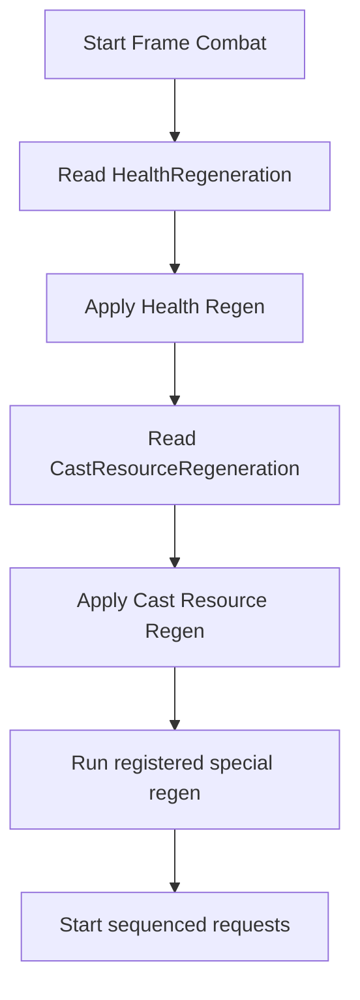
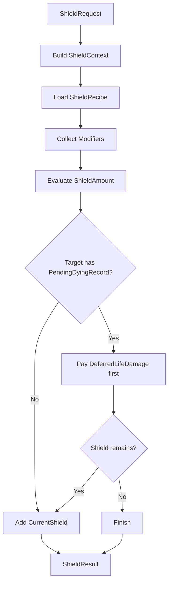
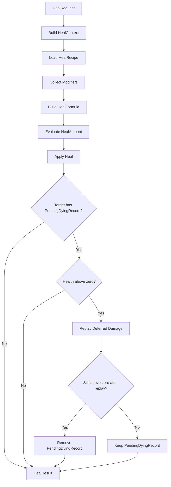
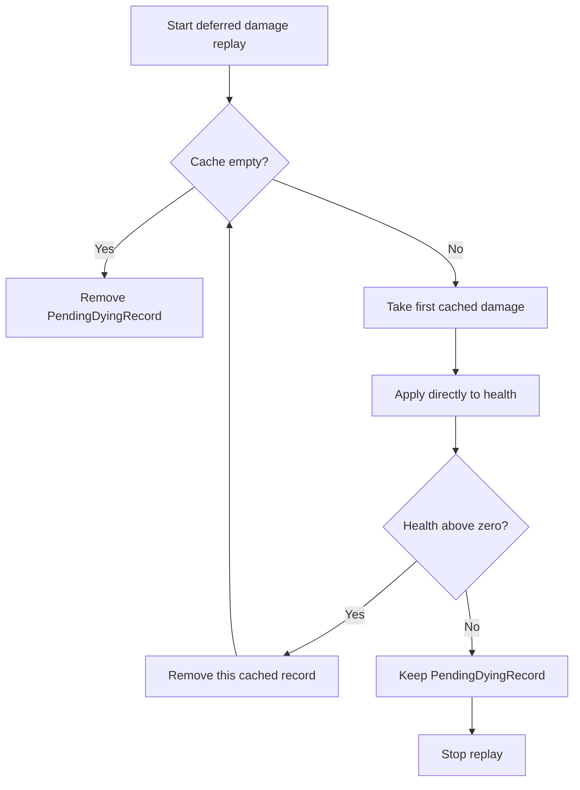

# 治疗护盾与再生结算

## 目标实现

治疗和护盾与伤害的批次结算能恢复合法生存状态。

## 技术方案

HealPipeline、ShieldPipeline、NaturalRegenPipeline 接受明确强类型请求，使用正式 Modifier 与属性入口；同目标批次统一可用生命与盾。

## 边界情况

治疗不超过 MaxHealth；Dying 与正常复活边界不能混用；外源结构治疗/护盾在中央入口拒绝。

## 验收条件

- 正常路径达到上述目标，并由所属模块唯一拥有权威状态。
- 以上边界情况有明确返回、拒绝或可见失败；不得用占位成功代替行为。
- 确定性逻辑比较重复执行、改变插入顺序以及捕获/恢复/重演结果；只读界面不得改变 Gameplay。

## 工程实际核查

本期检索的是当前源码和测试定义。存在实现不等于完成全部需求，存在测试不等于本期已运行通过。

- `Assets/Scripts/Gameplay/Combat/CombatSystem.cs`：当前关联实现定义 CombatSystem、ShieldRequestComparer、HealRequestComparer、DamageRequestComparer、DamageAllocationGroup（以源码为实际命名）。
- `Assets/Scripts/Gameplay/Combat/Requests/HealRequest.cs`：当前关联实现定义 HealRequest（以源码为实际命名）。
- `Assets/Scripts/Gameplay/Combat/Requests/ShieldRequest.cs`：当前关联实现定义 ShieldRequest、ShieldType（以源码为实际命名）。

### 已有测试位置

- `Assets/Scripts/Gameplay/Tests/CombatSystemTests.cs`：SubmitDamage_ValidRequest_ReducesHealth、Omnivamp_HealsSourceForFractionOfSettledDamage、NaturalRegen_AppliesPerInterval_ForHealthAndCastResource、DamageFormula_ArmorReducesDamage、ZeroArmor_FullDamageApplied、CombatModifiers_ApplyOutgoingAndIncomingFinalPatches、FatalDamage_CompletesFormalDeathSettlement。
- `Assets/Scripts/Gameplay/Tests/CombatSameTickFairnessTests.cs`：HealAndDamage_AreIndependentOfSubmissionOrder、ShieldAndDamage_AreIndependentOfSubmissionOrder、LethalBatch_HighestEffectiveLifeDamageWins_AfterUidAndSubmissionMirror、LethalBatch_ExactTie_IsStableForSeedAndIndependentOfSubmissionOrder、ConfiguredMatchSeedOverridesCompositionFallbackForExactTie、ConfiguredMatchSeed_IsIdempotentButImmutable、LethalBatch_ExactTie_SeedCorpusDoesNotPermanentlyFavorOneUid。
- `Assets/Scripts/Gameplay/Tests/StructureExternalEffectPolicyTests.cs`：ExternalOrdinaryAttackDamage_IsAccepted、ExternalNonAttackDamage_IsRejected、AttackTypedNonBasicSource_IsRejected、ExternalHealAndShield_AreRejected、SelfOwnedStructureBuff_IsAllowedButExternalBuffIsRejected、ExternalCrowdControl_IsRejectedButSelfOwnedIsAllowed、ExternalBuffToHandlerlessTower_IsConsumedNoOp。
- `Assets/Scripts/Bootstrap/Tests/PlayMode/ClientBootstrapFirstWavePlayModeTests.cs`：GameScene_FirstWaveUsesFlowFieldsAndMoves、GameScene_MapViewAnchorsToStaticTopologyRootAtWorldOrigin。
- `Assets/Scripts/FrameSync/Tests/ProjectileCombatPipelineTests.cs`：EqualDistanceHits_AreFairnessKeyOrderedAndUseCombat、EndOnFirstHit_RejectsLaterSameTickCandidate、EqualDistanceArbitration_UidRelabelKeepsParticipantWinner、PierceBudget_EndsAtConfiguredHitCount、ProjectileDamage_UsesCombatShieldPipeline、EnemyFilter_ExcludesFriendlyTarget、EnemyFilter_IncludesStructureTarget。

## 附录：精确接口、公式与配置

附录保留本功能必须精确表达的接口、运算和配置语义，原系统章节已拆到所属功能。若与上面的已接受修订仍有冲突，进入待确认清单而不是按旧版本执行。

### 定位

`NaturalRegenPipeline` 放在每帧战斗阶段最前，只处理自然恢复。

| 恢复 | 来源 |
|---|---|
| 生命自然恢复 | `HealthRegeneration` |
| 施法资源自然恢复 | `CastResourceRegeneration` |

自然恢复不走 `HealPipeline`，不受治疗加成影响，也不触发治疗事件。

---

### 执行流程



---

### 特殊资源接入

通用框架不预设怒气、弹药、连击点等英雄特色资源。

如果某个英雄需要特殊资源自然恢复，可以注册独立恢复器：

```text
IRegisteredRegenSource
```

执行位置：

```text
NaturalRegenPipeline
    -> HealthRegeneration
    -> CastResourceRegeneration
    -> RegisteredSpecialRegenSources
```

特殊恢复器只对自己的资源负责，不影响通用生命恢复和施法资源恢复。

---

### ShieldRequest

`ShieldRequest` 表示给目标添加护盾。

| 字段 | 说明 |
|---|---|
| `Header` | SequenceInTick、来源、目标、RecipeId 等公共信息 |
| `BaseValue` | 基础护盾量，例如技能基础护盾、装备基础护盾 |
| `ShieldType` | 白盾、物理盾、魔法盾、黑盾 |
| `DurationPolicy` | 持续时间、刷新规则、叠加规则 |

提交方需要提交基础护盾量，但不需要提前计算最终护盾量。最终护盾量由 `ShieldRecipe` 和 `CombatModifierRecord` 在护盾公式槽位中结算。

四类护盾语义：

| ShieldType | 吸收规则 | 附加语义 |
|---|---|---|
| `White` | 吸收所有可被护盾吸收的伤害 | 无 |
| `Physical` | 只吸收物理伤害 | 无 |
| `Magic` | 只吸收魔法伤害 | 无 |
| `Black` | 只吸收魔法伤害 | 护盾有效期间由 `StatHandler` 通过控制系统既有免疫接口维持控制免疫 |

护盾耗尽、到期、主动移除、死亡、进入复活或对象池重置时，数值系统必须同步结束该护盾关联的运行效果。黑盾的控制免疫生命周期由数值系统与控制系统负责，CombatSystem 只按 `ShieldType` 进行伤害吸收匹配。


---

### ShieldPipeline 流程



---

### PendingDying 状态下的护盾请求

当目标存在 `PendingDyingRecord` 时，单位的正式 `LifeState` 仍然是 `Alive`，仍然可以被主动选中并提交新的护盾请求。

执行规则：

```text
新增护盾量
    -> 先按原顺序抵扣 DeferredLifeDamageCache
    -> 抵扣后还有剩余才加入 CurrentShield
```

注意：

```text
目标进入 PendingDying 之前已经存在的 CurrentShield，
不会被 DeferredLifeDamageCache 追溯抵扣。
```

| 护盾来源 | 是否抵扣已有伤害缓存 |
|---|---|
| 进入 PendingDying 前已经存在的 CurrentShield | 否 |
| PendingDying 期间新结算的 ShieldRequest | 是 |
| 后续新的 DamageRequest | 仍按正常伤害管线先扣当前护盾，再决定生命伤害或欠账 |

如果新护盾清空了全部欠账但目标生命仍为 0，目标仍保留 `PendingDyingRecord`；它需要后续治疗恢复生命，或在帧末进入正式濒死裁决。

---

### HealRequest

`HealRequest` 表示一次治疗请求。

| 字段 | 说明 |
|---|---|
| `Header` | SequenceInTick、来源、目标、RecipeId 等公共信息 |
| `BaseValue` | 基础治疗量，例如技能基础治疗、Buff Tick 基础治疗、吸血派生治疗量 |

提交方需要提交基础治疗量，但 `HealRequest` 不携带 `HealKind`。普通技能治疗、Buff 治疗和吸血派生治疗都进入同一治疗管线；正常死亡后的复活和濒死复活过程由 `UnitWorld` 执行，其生命恢复不属于普通治疗。最终治疗量由 `HealRecipe` 和 `CombatModifierRecord` 在治疗公式槽位中结算。

---

### HealPipeline 流程



---

### 治疗解除 PendingDying

只要目标仍处于：

```text
LifeState = Alive
并存在 PendingDyingRecord
```

它就仍可被主动选中并接受新的治疗请求。

治疗执行后：

```text
CurrentHealth > 0
    -> 按 SequenceInTick 重放 DeferredLifeDamageCache
```

重放规则：



注意：

```text
缓存伤害在第一次结算时已经完成自己的护盾、抗性和最终伤害阶段。
重放时只重新应用其尚未扣除的生命伤害，不再次扣护盾、不重复触发暴击、吸血或攻击特效。
```

结果：

| 结果 | 处理 |
|---|---|
| 所有欠账重放后生命仍大于 0 | 删除 `PendingDyingRecord`，单位继续保持 `Alive` |
| 重放过程中生命再次归零 | 停止重放，保留剩余欠账与 `PendingDyingRecord` |
| 治疗后生命仍不大于 0 | 保留 `PendingDyingRecord` |

普通 `HealRequest` 不负责复活。死亡阻止或濒死复活只能在 `Dying` 判定中产生，再由 CombatSystem 请求 UnitWorld 执行对应生命周期转换。

### HealResult 与单位事件

一次治疗完成最终值计算和生命写入后，立即发布：

```text
1. Target.EventBus.Publish(HealTakenEvent)
2. Source 有效时：Source.EventBus.Publish(HealDealtEvent)
3. Reaction 新提交的请求获得新的 SequenceInTick
4. 当前 HealRequest 结束
```

事件只能响应已经成立的治疗结果，不能回头修改本次 `HealResult`。单位框架当前没有冻结通用 `ShieldGained` 单位事件，因此 `ShieldResult` 不通过 `UnitEventBus` 广播；护盾实例变化由 `StatHandler` 和相关效果实例自行管理。


---


## 需求演进

### 2026-08-24

变动内容：战斗封存波次和冻结批次起始状态；击杀按最高有效生命伤害，取代末次伤害者。

legacyDecision：D-049

### 2026-09-01

变动内容：建筑中央准入仅允许规定外源普通攻击，自身效果允许，合法拒绝是成功空操作。

legacyDecision：D-054

