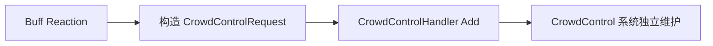

# 控制处理器装配与生命周期

## 本功能范围

本案细化“控制实例与模块参数”中的控制处理器装配与生命周期，仅覆盖下列明确接口与边界。

## 目标实现

配置型控制通过静态模块表和有界参数块执行。

## 技术方案

CrowdControlHandler 唯一运行入口；Definition 经 Bake 形成 module op 与 ParamLayout；实例按 Key 暴露、按 Offset 存储，不创建每实例模块对象。

## 边界情况

不新增 Kind、软硬控枚举或 Combat 控制管线；模块重入使用明确延迟规则；缺键和容量溢出可见失败。

## 验收条件

- 正常路径达到上述目标，并由所属模块唯一拥有权威状态。
- 以上边界情况有明确返回、拒绝或可见失败；不得用占位成功代替行为。
- 确定性逻辑比较重复执行、改变插入顺序以及捕获/恢复/重演结果；只读界面不得改变 Gameplay。

## 工程实际核查

实现证据与已有测试位置关联总案；字段存在不能认定行为已验收。

## 附录：精确接口、公式与配置

附录保留本功能必须精确表达的接口、运算和配置语义，原系统章节已拆到所属功能。若与上面的已接受修订仍有冲突，进入待确认清单而不是按旧版本执行。

### . 与 CrowdControlHandler 的边界

Buff 不保存：

- 控制 Runtime
- 控制剩余时间
- 控制优先级
- 不可阻挡状态
- `ControlSource`
- `ControlSourceId`

需要施加控制时：

“眩晕”本身属于 CrowdControl Runtime，不属于 BuffRuntime。

如果 UI 要同时显示 Buff 和控制图标，状态栏分别查询：

- `BuffHandler`
- `CrowdControlHandler`

由 UI 组合显示。

---

### 一句话结构

~~~mermaid
flowchart TD
    A["外部效果生效点"] --> B["目标 Unit.CrowdControlHandler.Add"]
    B --> C["全局控制配置表"]
    C --> D["模块执行表"]
    D --> E["CrowdControlInstance"]
    E --> F["CrowdControlHandler 汇总"]
    F --> G["单位框架动作限制"]
~~~

核心所有权：

| 内容 | 拥有者 |
|---|---|
| 所有控制静态配置 | 全局 Gameplay 配置单例 |
| 控制实例与持续时间 | 目标 CrowdControlHandler |
| 控制免疫、不可阻挡与信号缓存 | 目标 CrowdControlHandler |
| 唯一生效的强制位移控制 | 目标 CrowdControlHandler |
| 模块函数注册表 | 全局只读模块执行表 |
| 单位动作中断 | 单位框架 / ActionArbiter |
| 已获准强制位移的轨迹执行 | MovementHandler |
| 伤害、治疗、护盾 | CombatSystem |
| Buff 生命周期 | BuffHandler |

CrowdControlHandler 不缓存 Database，不持有 BuffHandler，不保存技能或装备来源描述。

### 控制系统的硬边界

控制模块允许：

- 汇总被禁止的单位动作；
- 汇总状态标签；
- 汇总减速、攻速降低、视野限制等控制数值；
- 提供一个强制行为候选，供 BehaviorPlanner 生成 MoveActionRequest 或 AttackActionRequest 并交由 ActionArbiter 仲裁；
- 由 Handler 向 MovementHandler 提交已经仲裁通过的强制位移；
- 在自然到期或收到控制信号时添加、移除控制。

控制模块禁止：

- 创建 DamageRequest；
- 创建 HealRequest；
- 创建 ShieldRequest；
- 直接修改生命、资源、护盾或属性；
- 直接改写 ActionRuntimeSet；
- 直接写 PhysicsEntity2D.Transform；
- 创建或删除 Buff；
- 播放动画、音效和 VFX。

如果一个技能同时造成伤害和眩晕，它是两个明确步骤：

~~~text
CombatSystem 结算伤害
CrowdControlHandler 添加眩晕
~~~

不是“眩晕模块顺便造成伤害”。

---

### Unity 角色

CrowdControlHandler 继承单位框架的 `UnitHandler`。`UnitHandler` 本身继承 MonoBehaviour，因此 Handler 仍然是挂在 Unit 对象上的 Unity 组件。

它使用 MonoBehaviour 的原因：

- 与 Unit 预制体装配一致；
- 可直接由 Unit 缓存；
- 生命周期随 Unit；
- 方便确认单位是否具备控制管理能力。

它不使用：

- Update；
- FixedUpdate；
- Coroutine；
- Time.time；
- deltaTime；
- Invoke。

所有 Gameplay 时间直接读取全局参数 SimulationTickContext.Current.Tick。

Handler 的对外接口不接收 Tick、SimulationTickContext 或 deltaTime 参数。

### 推荐类轮廓

~~~csharp
[DisallowMultipleComponent]
public sealed class CrowdControlHandler :
    UnitHandler,
    IRollback<CrowdControlHandlerSnapshot>
{
    private readonly List<CrowdControlInstance> instances = new(8);
    private readonly List<CrowdControlImmunity> immunities = new(4);
    private readonly List<CrowdControlUnstoppable> unstoppables = new(2);
    private readonly List<ControlModuleCommand> pendingCommands = new(4);

    private CrowdControlSignalMask pendingSignals;
    private readonly int[] signalEffectiveTicks =
        new int[(int)CrowdControlSignalType.Count];

    private int nextInstanceId = 1;
    private int nextImmunityId = 1;
    private int nextUnstoppableId = 1;
    private CrowdControlHandle activeForcedMoveHandle;
    private CrowdControlStateView state;
    private CrowdControlBehaviorOverride behaviorOverride;
    private bool dirty;
    private int batchDepth;

    public CrowdControlStateView State => state;
    public int Count => instances.Count;
    public bool IsUnstoppable => unstoppables.Count != 0;

    public override void InitializeForNewRuntime();
    public override void ClearForDeath();
    public override void ClearForRespawn();
    public override void ResetForPool();

    public CrowdControlAddResult Add(
        CrowdControlId id,
        int durationTicks,
        in CrowdControlParamWriter parameters);

    public bool Remove(CrowdControlHandle handle, ControlRemoveReason reason);
    public int RemoveAll(ControlRemoveReason reason);
    public int Cleanse(in CrowdControlCleanseSpec spec);

    public CrowdControlImmunityHandle AddImmunity(
        in CrowdControlImmunitySpec spec);

    public bool RemoveImmunity(CrowdControlImmunityHandle handle);

    public CrowdControlUnstoppableHandle AddUnstoppable(
        in CrowdControlUnstoppableSpec spec);

    public bool RemoveUnstoppable(
        CrowdControlUnstoppableHandle handle);

    public void Advance();

    public void OnDamageTaken(
        in DamageTakenEvent evt);

    public void OnOwnerActionStarted();
    public void OnForcedMoveFinished(
        CrowdControlHandle sourceHandle);

    public bool HasAnyTag(CrowdControlTagMask tags);
    public bool MatchesTags(in CrowdControlTagQuery query);
    public bool TryGetBehaviorOverride(
        out CrowdControlBehaviorOverride value);

    public void Capture(
        ref CrowdControlHandlerSnapshot state);

    public void Restore(
        in CrowdControlHandlerSnapshot state);

    public void Resolve(
        in RollbackContext context);

    public void Rebuild(
        in RollbackContext context);
}
~~~

接口轮廓强调职责和数据方向，不要求逐字照抄。

Owner 由 `UnitHandler.BindOwner` 统一绑定，CrowdControlHandler 不再保存第二份所属单位字段，也不提供重复的 Initialize 接口。

### Handler 的重要字段

| 字段 | 是否权威运行状态 | 作用 |
|---|---:|---|
| Owner | 否 | 继承自 UnitHandler 的所属 Unit 引用；不进入控制快照 |
| instances | 是 | 当前全部控制实例，按 InstanceId 升序 |
| immunities | 是 | 当前全部控制免疫规则 |
| unstoppables | 是 | 当前全部不可阻挡来源；非空即抑制控制输出 |
| pendingSignals | 是 | 尚未在 Advance 中广播的信号位 |
| signalEffectiveTicks | 是 | 每种信号最近一次发生的 EffectiveTick；保留两 Tick 语义 |
| pendingCommands | 临时 | 模块回调产生的延迟命令，防止重入修改实例列表 |
| nextInstanceId | 是 | 生成单位内唯一控制实例 ID |
| nextImmunityId | 是 | 生成单位内唯一免疫 ID |
| nextUnstoppableId | 是 | 生成单位内唯一不可阻挡来源 ID |
| activeForcedMoveHandle | 是 | 当前唯一生效的强制位移控制实例 |
| state | 可重建 | 当前轻量汇总结果 |
| behaviorOverride | 可重建 | 当前唯一强制行为结果 |
| dirty | 否 | 是否需要重新汇总 |
| batchDepth | 临时 | 批量移除期间推迟 RebuildOutputs，结束时只重算一次 |

没有：

- Database 字段；
- BuffHandler 字段；
- CombatSystem 字段；
- 按 Kind 建立的控制状态字段；
- 每种控制一张实例列表。

RebuildOutputsIfDirty 只有在 dirty = true 且 batchDepth = 0 时执行。Cleanse、RemoveAll 和模块命令批处理通过 batchDepth 保证一次批量变化只汇总一次。

### UnitHandler 生命周期与真实单位事件

CrowdControlHandler 使用单位框架 v26 的统一生命周期，不把生命周期清理伪装成 UnitEvent Reaction。

#### 新运行时初始化

~~~text
InitializeForNewRuntime():
    断言 instances、immunities、unstoppables 均为空
    nextInstanceId = 1
    nextImmunityId = 1
    nextUnstoppableId = 1
    activeForcedMoveHandle = Invalid
    pendingSignals = None
    signalEffectiveTicks 全部设为 InvalidTick
    state = Empty
    behaviorOverride = Empty
    dirty = false
~~~

只有对象池单位获得新 UnitUid、进入新的运行时生命周期时，三个 ID 才重置为 1。英雄死亡和复活期间 UnitUid 不变，因此不重置。

#### 死亡、复活与回池

~~~text
ClearForDeath():
    RemoveAll(Death)

ClearForRespawn():
    RemoveAll(Respawn)
    // 只做幂等兜底清理，不重建外部来源 Handle

ResetForPool():
    RemoveAll(Despawn)
~~~

三个入口都必须可重复调用，但正式死亡流程只由 UnitWorld 在生命周期清理阶段调用一次 `ClearForDeath()`。它会清除控制实例、免疫、不可阻挡、信号和强制行为，并停止仍匹配当前来源 Handle 的强制位移。

`immunities` 与 `unstoppables` 中的全部条目都属于当前生命阶段。`ClearForDeath()` 会统一使其 Handle 失效，不提供 `SurviveDeath` 配置。即使创建它们的 Buff、技能、装备或其它来源跨死亡保留，也不得继续使用死亡前的旧 Handle。

复活时，UnitWorld 在完成复活状态初始化后按固定 Handler 顺序调用 `ClearForRespawn()`。CrowdControlHandler 的职责到清空自身残留状态为止；它不读取永久 Buff、常驻装备被动或固定技能被动，也不替这些来源重建 Handle。跨死亡保留的来源必须在各自的复活逻辑中，根据当前 Runtime 重新调用 `AddImmunity()` 或 `AddUnstoppable()`；临时来源不恢复。

唯一顺序约束是：外部来源重新注册必须晚于本单位的 `CrowdControlHandler.ClearForRespawn()`，否则随后执行的兜底清理会使新 Handle 失效。本设计只声明这一接入前置条件，不规定 UnitWorld 的完整 Handler 排序表。

CrowdControlHandler 不声明 `OnUnitDeath`，也不进入 `UnitDeathEvent` 的 UnitEventBus 路由。死亡对控制系统只有生命周期清理，没有独立 Reaction。

#### SupportedUnitEvents

控制系统当前只声明一个真实单位结果事件：

| UnitEvent | 正式入口 | 真实用途 |
|---|---|---|
| DamageTaken | OnDamageTaken(in DamageTakenEvent evt) | `ActualLifeDamage > 0` 时记录 ActualDamageTaken 信号，用于解除 Sleep 等控制 |

~~~text
OnDamageTaken(evt):
    若 evt.ActualLifeDamage <= 0:
        return

    RaiseSignal(ActualDamageTaken)
~~~

事件结构只在即时入口中读取，不进入信号缓存。`OnOwnerActionStarted` 是 ActionArbiter 的直接固定调用；`OnForcedMoveFinished` 是 MovementHandler 的直接回调，二者都不进入 UnitEventBus。

### 全局配置访问

Handler 需要静态定义时，直接通过 GameplayConfig.Instance.CrowdControls.Get(controlId) 读取项目现有全局配置。

Handler 不缓存单个 Database 引用。

建议 Handler 在一次函数调用开始时把 CrowdControlDefinition 存入局部变量，避免同一调用反复访问全局属性；函数结束后不保存。

~~~mermaid
flowchart LR
    A["Handler.Add"] --> B["GameplayConfig 单例"]
    B --> C["CrowdControls.Get(id)"]
    C --> D["局部 definition"]
    D --> E["执行本次 Add"]
~~~

## 需求演进

### 2026-08-06

变动内容：控制配置采用唯一 Definition、模块表和参数布局，不引入额外分类层。

legacyDecision：D-036

