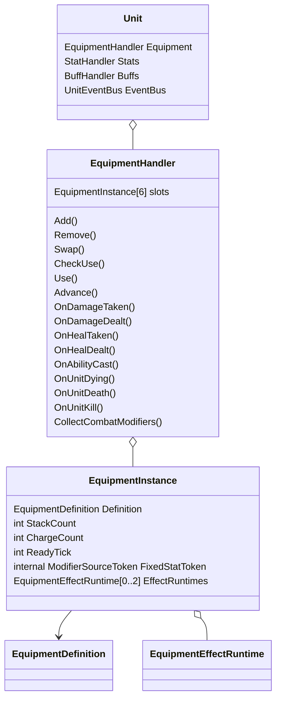
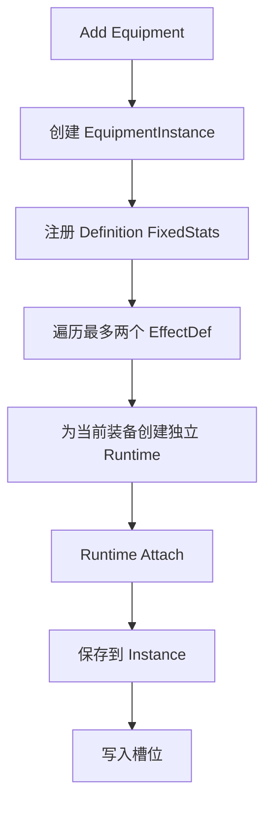
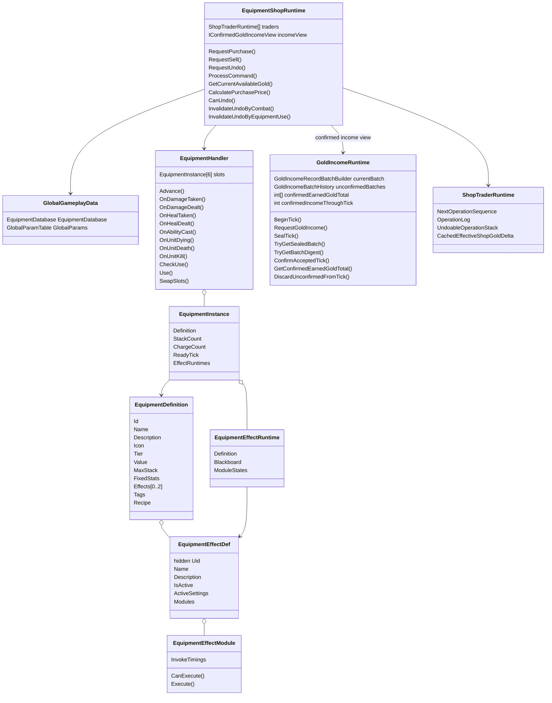

# 六格装备配方与唯一标签

## 目标实现

六格装备支持堆叠、合成、交换、变形和排他标签。

## 技术方案

EquipmentHandler 保存 EquipmentInstance 和 EffectRuntime；装备本身不用第二个 UID，内部延迟变更通过正式 slot/instance 定位。Recipe 与唯一标签在配置校验。

## 边界情况

满栏合成先有确定购买计划；成装重复和跨装备排他显式；固定属性使用本装备持有的句柄。

## 验收条件

- 正常路径达到上述目标，并由所属模块唯一拥有权威状态。
- 以上边界情况有明确返回、拒绝或可见失败；不得用占位成功代替行为。
- 确定性逻辑比较重复执行、改变插入顺序以及捕获/恢复/重演结果；只读界面不得改变 Gameplay。

## 工程实际核查

本期检索的是当前源码和测试定义。存在实现不等于完成全部需求，存在测试不等于本期已运行通过。

- `Assets/Scripts/Gameplay/Equipment/EquipmentDefinition.cs`：当前关联实现定义 EquipmentDefinition、EquipmentFixedStatAuthoring、EquipmentRecipe、EquipmentRecipePart（以源码为实际命名）。
- `Assets/Scripts/Gameplay/Equipment/EquipmentHandler.cs`：当前关联实现定义 EquipmentHandler、EquipmentInstance、EquipmentUseCheckResult、EquipmentFixedStat、EquipmentTier（以源码为实际命名）。
- `Assets/Scripts/Gameplay/Equipment/UniqueEquipmentTagTable.cs`：当前关联实现定义 UniqueEquipmentTagTable（以源码为实际命名）。

### 已有测试位置

- `Assets/Scripts/Gameplay/Tests/EquipmentTagAndCatalogTests.cs`：UniqueTagInTable_ConflictingPurchase_Rejected、NonUniqueTag_NotInTable_AllowsCoexistence、Catalog_Bake_SealsDefinitionsAndUniqueTags、Catalog_Bake_DuplicateId_Throws。
- `Assets/Scripts/Bootstrap/Tests/PlayMode/HeroTestSceneEquipmentPlayModeTests.cs`：BuildWorld_LoadsSelectedVarusPartition、BuildWorld_LoadsFormalEquipmentCatalogForShop、LocalTickShop_UsesFormalGoldPurchaseRecipeAndUndo。
- `Assets/Scripts/Gameplay/Tests/EquipmentShopRequestTests.cs`：RequestPurchase_Allowed_SubmitsCanonicalCommand、InitialRequestCheck_UsesPlayerSlotMappingWithoutCreatingTrader、RequestPurchase_InsufficientGold_RejectsWithoutSubmission、RequestSell_EmptySlot_RejectsWithoutSubmission、RequestSell_Allowed_SubmitsSlot、RequestUndo_AfterSettledSell_Allowed、RequestUndo_NoTransactions_Rejects。
- `Assets/Scripts/Gameplay/Tests/EquipmentShopTransactionTests.cs`：Purchase_UsesOwnedRecipePartAndFreedLowestSlot、SellUndo_RequiresReturnedGoldAndRestoresSlot、DuplicateRule_AllowsSmallItemsAndRejectsFinishedItems、SequentialPurchases_AfterSnapshotRestore_MatchContinuousState。
- `Assets/Scripts/Gameplay/Tests/GuinsoosRagebladeEquipmentTests.cs`：FormalCatalog_ContainsExpectedStatsRecipeAndModules、GameScene_UsesCorePartitionInsteadOfDirectEquipmentCatalog、SixRealHits_StackBuffAndRepeatThirdFullStackOnHitOnce、OnHitEquipmentEffects_DoNotApplyToStructure、TriggerCounter_RestoreReplaysSameRepeatedOnHit、EquipmentModuleState_SurvivesDeathRespawnHandleRebuild。

## 附录：精确接口、公式与配置

附录保留本功能必须精确表达的接口、运算和配置语义，原系统章节已拆到所属功能。若与上面的已接受修订仍有冲突，进入待确认清单而不是按旧版本执行。

### 定位

`EquipmentHandler` 是 `Unit` 的装备系统门面。

它负责：

| 职责 | 说明 |
|---|---|
| 六格装备 | 保存六个 `EquipmentInstance` |
| 实例生命周期 | 加入、移除、交换、堆叠和变形 |
| 固定属性 | 注册和注销 `EquipmentDefinition.FixedStats` |
| 装备效果 | 创建和销毁装备自己的 `EquipmentEffectRuntime` |
| 单位事件 | 把 Gameplay 单位事件派发给效果 Runtime |
| 战斗修正 | 向 Combat Collector 提供装备效果修正 |
| 生命周期事件 | 派发 `UnitDying`、`UnitDeath` 与 `UnitKill` 给正式装备模块 |
| 主动使用 | 检查合法性、返回距离不足、合法后瞬发 |
| 查询 | 为 UI、AI 和调试工具提供只读信息 |

它不负责玩家金钱、账户 KDA、服务端账户同步、技能施法阶段、Dash 持续移动、最终战斗公式和 Buff 生命周期。

---

### 内部结构

```csharp
public sealed class EquipmentHandler
    : IRollback<EquipmentHandlerSnapshot>
{
    private const int SlotCount = 6;

    private Unit _owner;
    private EquipmentDatabase _database;
    private EquipmentPorts _ports;

    private readonly EquipmentInstance[] _slots =
        new EquipmentInstance[SlotCount];

    private readonly Dictionary<
        EquipmentCooldownGroupId,
        int> _sharedCooldowns;

    private readonly Queue<EquipmentChange>
        _pendingChanges;

    private int _dispatchDepth;
    private int _revision;
}
```



---

### EquipmentInstance 不再需要 UID

```csharp
public sealed class EquipmentInstance
{
    public EquipmentDefinition Definition;

    public int StackCount;
    public int ChargeCount;
    public int ReadyTick;

    internal ModifierSourceToken?
        FixedStatToken;

    internal EquipmentEffectRuntime[]
        EffectRuntimes;
}
```

外部所有装备操作都通过槽位索引完成。

成装不允许重复购买；小件即使重复购买，也可以通过当前所在槽位区分。因此删除：

```text
EquipmentUid
EquipmentInstanceId
RuntimeKey
```

外部请求只保存：

```text
EquipmentSlot
```

例如：

```text
UseItemOrder
    Slot = 2

SellItemOrder
    Slot = 4
```

---

### 内部延迟变更如何定位装备

效果回调可能在结束后移除当前装备，例如最后一瓶药水被消耗。

延迟队列直接保存 `EquipmentInstance` 对象引用：

```text
QueueRemove(instance)
    ↓
Flush
    ↓
FindSlot(instance)
    ↓
Remove(slot)
```

即使装备在派发期间交换过槽位，也能通过引用找到当前位置，不需要永久 UID。

---

### 固定属性注册句柄

`FixedStatToken` 对应一整组固定属性来源，不是某一个属性。

例如：

```text
AttackDamage +40
MaxHealth +300
Armor +50
```

Handler 一次注册：

```text
ModifierSource
├── AttackDamage Flat +40
├── MaxHealth Flat +300
└── Armor Flat +50
```

`StatHandler` 返回一个 Token。移除装备时用该 Token 一次注销整组属性。

这个 Token 只能是 Handler 内部解绑凭证，不向 UI、AI 和 Effect 暴露。

---

### 固定属性只允许固定数值

装备直接提供的固定属性只允许固定数值加成。

允许：

```text
AttackDamage +40
AbilityPower +80
MaxHealth +300
Armor +50
MoveSpeed +45
```

不允许：

```text
AttackDamage +10%
MaxHealth +5%
MoveSpeed ×1.08
```

因此不复用可表达多种运算的通用 `StatModifierConfig`，而使用专用结构：

Authoring 配置使用 Unity 友好的浮点字段：

```csharp
[Serializable]
public struct EquipmentFixedStatAuthoring
{
    public StatKey Stat;
    public float Value;
}
```

离线 Bake 后进入 `EquipmentDatabase`：

```csharp
public readonly struct EquipmentFixedStat
{
    public readonly StatId Stat;
    public readonly fp Value;
}
```

Handler 读取 Bake 后的数据，并始终转换为：

```text
ModifierOperation.FlatAdd
```

百分比和乘法属性只能由装备效果或 Buff 提供。Gameplay Tick 不直接读取 Authoring `float`。

---

### 加入与移除

加入：



```text
Add(definition, slot):
    instance = new EquipmentInstance
    instance.Definition = definition
    instance.StackCount = 1
    instance.ChargeCount =
        ResolveInitialCharges(definition)

    if definition.FixedStats not empty:
        instance.FixedStatToken =
            RegisterFixedStats(
                definition.FixedStats
            )

    for index in definition.Effects:
        runtime =
            BuildEffectRuntime(
                instance,
                index,
                definition.Effects[index]
            )

        InitializeModuleRuntimeStates(runtime)
        ExecuteTiming(runtime, OnEquipped)
        instance.EffectRuntimes.Add(runtime)

    slots[slot] = instance
    revision++
```

移除：

```text
逐个执行 EffectRuntime 的 OnUnequipped 模块
    ↓
注销固定属性句柄
    ↓
清空槽位
    ↓
Reset / Pool EquipmentInstance
```

---

### 六格、交换与事件派发

Handler 直接保存 `_slots[0]` 到 `_slots[5]`。

交换只交换实例引用：

```csharp
(_slots[a], _slots[b]) =
    (_slots[b], _slots[a]);
```

不会重建 Runtime、重置冷却或重新注册固定属性。

Handler 统一接收：

```text
单位框架 v25 的强类型即时 UnitEventBus 回调
CombatModifierSet 的正式挂载与移除接缝
Unit Tick
ActionArbiter
```

`EquipmentHandler.Advance()` 和各模块在函数内部直接读取：

```text
SimulationTickContext.Current
```

不把 `SimulationTickContext` 层层作为参数传入，也不维护第二套逻辑时钟。

Handler 按以下稳定顺序遍历 Runtime：

```text
Slot 0 -> Slot 5
EffectIndex 0 -> 1
ModuleIndex 0 -> N
```

装备和 Buff 监听 Gameplay 内部击杀事件：

```text
UnitKill
```

不监听账户权威 `KillConfirmed`。

---

### 定位与结构

`EquipmentDefinition` 是一件装备唯一的静态配置。

```csharp
[CreateAssetMenu(menuName = "MOBA/Equipment")]
public sealed class EquipmentDefinition
    : ScriptableObject
{
    public EquipmentId Id;

    public string Name;

    [TextArea]
    public string Description;

    public Sprite Icon;

    public EquipmentTier Tier;
    public int Value;

    public int MaxStack;

    public EquipmentFixedStat[] FixedStats;

    public EquipmentEffectDef[] Effects;

    public EquipmentTagDefinition[] Tags;

    public EquipmentRecipe Recipe;
}
```

它直接描述：

```text
装备身份
名称、描述和图标
装备等级
价值
消耗品最大堆叠
固定属性
最多两个附加效果
装备标签
合成配方
```

---

### Id、名称和展示

`EquipmentId` 用于配置表索引、商店请求、合成配方和来源描述。

`Name`、`Description`、`Icon` 直接放在 Definition 根字段，不再额外包装 `EquipmentDisplayInfo`。

---

### EquipmentTier

推荐至少区分：

```text
Consumable
Basic
Advanced
Finished
```

如果项目使用 `Basic / Epic / Legendary` 也可以，只要明确哪个 Tier 表示消耗品，哪个 Tier 表示成装。

Tier 直接参与两条规则：

```text
Consumable
    可以在一个槽位堆叠。

Finished
    同一个 EquipmentDefinition 不能重复持有。
```

---

### 删除 Stackable

是否可堆叠直接由 Tier 推导：

```csharp
public bool CanStack =>
    Tier == EquipmentTier.Consumable;
```

校验：

```text
Tier == Consumable
    -> MaxStack >= 1

Tier != Consumable
    -> MaxStack == 1
```

因此删除 `bool Stackable`。

---

### Value

Definition 只保存一个价值：

```text
完整购买价 =
    Value

合成购买价 =
    Target.Value
    - ConsumedComponents.Value

出售价 =
    Value
    × GlobalParam.EquipmentSellRate
```

不保存单独的 `SellPrice`。

当前版本不在 `EquipmentDefinition` 增加：

```text
Purchasable
Sellable
```

商店不维护独立商品目录，直接读取：

```text
GlobalGameplayData.EquipmentDatabase.Definitions
```

当前注册进正式装备数据库的装备均视为可在标准商店中购买和卖出。未来特殊模式若需要排除某些装备，应由对应模式规则过滤，不提前给每件装备增加交易布尔字段。

---

### FixedStats

`FixedStats` 直接属于装备本身，并且只允许固定数值。

Authoring 中配置：

```csharp
public EquipmentFixedStatAuthoring[] FixedStats;
```

离线 Bake 后由 `EquipmentDatabase` 保存只读 `EquipmentFixedStat[]`。

以下内容属于固定属性：

```text
AttackDamage +40
AbilityPower +80
MaxHealth +300
Armor +50
```

以下内容必须放入 Effect：

```text
最大生命值提高 10%
低生命时护甲提高 30%
移动速度提高 8%
```

基础属性不占两个效果槽。

---

### Effects

```csharp
public EquipmentEffectDef[] Effects;
```

规则：

```text
Effects.Length <= 2
```

其中最多一个 `EquipmentEffectDef.IsActive == true`。

可以表达：

```text
固定属性 + 被动
固定属性 + 主动
固定属性 + 被动 + 主动
固定属性 + 光环 + 被动
消耗品主动
```

---

### Tags

```csharp
public EquipmentTagDefinition[] Tags;
```

标签用于：

```text
商店分类
装备筛选
玩法识别
跨装备排他
```

例如：

```text
Attack
Magic
Defense
Boots
Stasis
Hydra
SpellShield
```

标签本身不一定唯一。是否产生排他由全局唯一性标签表决定。

---

### EquipmentTagDefinition

```csharp
[CreateAssetMenu(
    menuName = "MOBA/Equipment Tag")]
public sealed class EquipmentTagDefinition
    : ScriptableObject
{
    [SerializeField, HideInInspector]
    private EquipmentTagUid uid;

    public string Name;

    [TextArea]
    public string Description;

    public EquipmentTagUid Uid => uid;
}
```

策划只创建标签资产、填写名称和描述，然后拖入 Definition 的 `Tags`。

不需要手填字符串 Key。

---

### 全局唯一性标签表

全局参数增加：

```csharp
public sealed class UniqueEquipmentTagTable
{
    public EquipmentTagDefinition[]
        UniqueTags;
}
```

也可以作为现有 `GlobalGameplayData` 或装备全局参数的一部分。

示例：

```text
UniqueTags
    Boots
    Stasis
    Hydra
```

规则：

> 两件装备拥有同一个标签，并且该标签存在于全局唯一性标签表中时，两件装备不能共存。

普通分类标签不在唯一性表中，因此不会产生排他。

---

### 成装重复与跨装备排他

成装本身禁止重复购买，直接由 Tier 检查：

```text
if Target.Tier == Finished
and postSlots 已存在相同 Definition:
    Reject
```

标签只处理不同 Definition 之间的排他，例如：

```text
不同鞋子
秒表与金身
不同 Hydra 装备
```

这样不需要为每件成装手工创建“只属于自己”的唯一标签。

---

### 排他检查

必须检查交易后的模拟六格。

```text
ValidatePostSlots(postSlots):
    seenFinishedDefinitions = empty
    uniqueTagOwner = empty

    for equipment in postSlots:
        definition = equipment.Definition

        if definition.Tier == Finished:
            if seenFinishedDefinitions contains definition:
                return Rejected

            add definition

        for tag in definition.Tags:
            if UniqueTagTable 不包含 tag:
                continue

            if uniqueTagOwner contains tag:
                return Rejected

            uniqueTagOwner[tag] = definition

    return Accepted
```

鞋子升级会先消耗基础鞋，因此交易后只有高级鞋，检查结果合法。

---

### Recipe 与校验

```csharp
[Serializable]
public sealed class EquipmentRecipe
{
    public EquipmentRecipePart[] Components;
}

[Serializable]
public struct EquipmentRecipePart
{
    public EquipmentDefinition Item;
    public int Count;
}
```

编辑器应校验：

```text
Id 和 Name 不为空
Value >= 0
Consumable 的 MaxStack >= 1
非 Consumable 的 MaxStack == 1
Effects.Length <= 2
最多一个 `IsActive == true` 的 Effect
Tags 不重复
FixedStats 只包含固定值
Recipe 不循环引用
```

---

### 统一回滚接口

```csharp
public interface IRollback<TState>
{
    void Capture(ref TState state);
    void Restore(in TState state);

    void Resolve(
        in RollbackContext context);

    void Rebuild(
        in RollbackContext context);
}
```

正式实现：

```text
EquipmentHandler
    IRollback<EquipmentHandlerSnapshot>

EquipmentShopRuntime
    IRollback<EquipmentShopRuntimeSnapshot>
```

`GoldIncomeRuntime` 不属于 GameplaySnapshot。

普通回滚通过 `DiscardUnconfirmedFromTick` 丢弃未确认批次，再由各金币来源在重演中重新提交请求。

---

### EquipmentHandlerSnapshot

```csharp
public struct EquipmentHandlerSnapshot
{
    public EquipmentSlotSnapshot[] Slots;

    public EquipmentSharedCooldownSnapshot[]
        SharedCooldowns;

    public int RuntimeRevision;
}
```

槽位快照至少覆盖：

```text
Occupied。
EquipmentId。
StackCount。
ChargeCount。
ReadyTick。
固定属性可序列化句柄。
EquipmentEffectRuntimeSnapshot[]。
```

普通死亡不会清空这些状态。

---

### Effect Runtime 快照

```csharp
public struct EquipmentEffectRuntimeSnapshot
{
    public EquipmentEffectUid EffectUid;

    public EquipmentEffectBlackboard
        Blackboard;

    public EquipmentEffectModuleRuntimeState[]
        ModuleStates;
}
```

模块状态中的外部句柄按对应系统提供的可序列化值保存。

本案不定义句柄内部结构或恢复算法。

---

### EquipmentShopRuntimeSnapshot

```csharp
public struct EquipmentShopRuntimeSnapshot
{
    public ShopTraderRuntimeSnapshot[]
        CreatedTraders;
}
```

```csharp
public struct ShopTraderRuntimeSnapshot
{
    public PlayerSlot Player;
    public UnitUid ControlledUnitUid;

    public int NextOperationSequence;

    public ShopOperationRecord[]
        OperationLog;

    public int[]
        UndoableOperationStack;

    public ShopUndoInvalidReason
        LastUndoInvalidReason;

    public CombatParticipationFlags
        LastCombatParticipationFlags;

    public int RuntimeRevision;
}
```

不保存：

```text
ConfirmedEarnedGoldTotal。
ConfirmedIncomeThroughTick。
CurrentAvailableGold。
EffectiveShopGoldDelta。
CachedEffectiveShopGoldDelta。
CachedConfirmedEarnedGoldTotal。
派生 Dirty 标记。
GoldIncomeRecordBatch 缓存。
```

---

### Restore / Resolve / Rebuild

#### Restore

恢复：

```text
装备槽位和 EquipmentInstance。
EffectRuntime 和 ModuleRuntimeState。
OperationLog。
Reverted 状态。
UndoableOperationStack。
NextOperationSequence。
撤销失效状态。
```

#### Resolve

修复：

```text
UnitUid。
静态 EquipmentDefinition / EquipmentEffectDef 引用。
外部系统提供的可序列化句柄引用关系。
```

#### Rebuild

重建：

```text
固定属性挂载。
模块派生状态。
共享冷却查询。
CachedEffectiveShopGoldDelta。
其它未进入快照的派生缓存和索引。
```

随后重新读取：

```text
ConfirmedEarnedGoldTotal
```

派生：

```text
CurrentAvailableGold。
```

---

### GoldIncomeRuntime、账户和商店边界

比赛内累计获得金币的唯一权威是：

```text
GoldIncomeRuntime。
```

它统一持有初始金币、确认累计总量、确认进度和未确认批次历史。

服务端账户与战绩系统只通过 `IConfirmedGoldSettlementSink` 接收确认批次做持久化。

商店交易只修改装备状态、`OperationLog`、`Reverted`、撤销栈和派生缓存，不修改 `GoldIncomeRuntime`。

出售金币不进入 `GoldIncomeRuntime`；初始金币不生成 `RequestGoldIncome`。

---

### UI 边界

UI 使用绑定当前本地玩家的只读商店视图：

```csharp
public interface IEquipmentShopView
{
    int GetCurrentAvailableGold();

    int CalculatePurchasePrice(
        EquipmentId targetEquipmentId);

    bool CanUndo();
}
```

其中：

```text
CalculatePurchasePrice
    用于刷新当前选中目标装备的动态购买价格。

CanUndo
    用于刷新撤销按钮是否可用。
```

这两个函数只读取当前本地模拟状态，不提交 Command，也不修改 Gameplay。

UI 读取：

```text
EquipmentDatabase。
本地 EquipmentHandler 只读镜像。
本地 ShopTraderRuntime 只读视图。
IEquipmentShopView.GetCurrentAvailableGold()。
IEquipmentShopView.CalculatePurchasePrice(targetEquipmentId)。
IEquipmentShopView.CanUndo()。
```

UI 调用：

```text
RequestPurchase。
RequestSell。
RequestUndo。
```

UI 不直接：

```text
创建具体 Command 字节。
调用 ProcessCommand。
修改装备。
修改确认收入。
写 OperationLog。
修改 Reverted。
清空撤销栈。
计算另一套金币余额。
```

可选显示：

```text
待确认金币表现。
```

但待确认金币不能计入可购买余额。

---

### SimulationTickContext

装备与商店统一直接读取：

```text
SimulationTickContext.Current
    Tick
    DeltaTick
    ExecutionMode
```

不修改现有函数签名以传递 Context。

只有帧同步主循环能设置 `Current`；Gameplay 系统只读。

---

### Tick Pipeline 接入

Tick `T` 的金币请求顺序正式冻结：

```text
A. 设置 SimulationTickContext.Current，
   GoldIncomeRuntime.BeginTick(T)。

B. NaturalGoldIncomeSystem：
   按 PlayerSlot 升序 RequestGoldIncome。

C. CombatSystem.SettleTick：
   产出 FormalDeathResults，
   不直接创建 GoldIncomeRecord。

D. MatchStatisticsRuntime：
   消费 FormalDeathResults，
   生成稳定 GoldIncomeAllocations。

E. CombatGoldIncomeProducer：
   按 GoldIncomeAllocations 数组顺序
   RequestGoldIncome。

F. Map / MatchRule Gold Producers：
   按代码固定生产者顺序执行，
   各自内部保持稳定顺序。

G. GoldIncomeRuntime.SealTick(T)。
```

商店在本 Tick 开始读取确认累计金币并从 `OperationLog` 派生当前可用金币。CombatSystem 帧末通知撤销失效。

保存 `SnapshotTick = T + 1` 后，帧同步层通过 `TryGetBatchDigest(T)` 获取金币摘要，并把它强制纳入 `SharedGameplayChecksum(T)`。

服务端开始 Tick `T + 1` 前、客户端正式接受 Tick `T` 后，均调用：

```csharp
GoldIncomeRuntime.ConfirmAcceptedTick(T);
```

---

### AuthorityFrame 与金币确认接入

AuthorityFrame 携带 Tick、规范 Command、FrameFlags 和必填的 `SharedGameplayChecksum`，不携带具体金币记录。

帧同步总控负责帧连续性、Command 对账、必要回滚重演、本地 Checksum 历史、共享校验比较和正式接受 Tick。

金币结果只能通过：

```csharp
GoldIncomeRuntime.TryGetSealedBatch(
    logicTick,
    out batch);

GoldIncomeRuntime.TryGetBatchDigest(
    logicTick,
    out digest);
```

读取。

正式接受 Tick `T` 后：

```csharp
GoldIncomeRuntime.ConfirmAcceptedTick(T);
```

金币确认不主动触发商店 Command 后缀重演。

开发环境建议保留 `EquipmentChecksum / ShopChecksum / GoldIncomeBatchChecksum` 分段诊断。

---

### AuthorityRecovery 边界

装备案不定义 AuthorityRecovery 网络包、AuthorityFrame 补发协议、快照保留策略或连接终止策略。

只要求：

```text
恢复前：
    GoldIncomeRuntime
        .DiscardUnconfirmedFromTick(
            replayFromTick)。

恢复后：
    EquipmentShopRuntime.Rebuild
    从 OperationLog 重建交易金币派生缓存。

补齐 AuthorityFrame 后：
    帧同步总控逐 Tick 完成对账、
    必要重演和 SharedGameplayChecksum 校验。

正式接受 Tick 后：
    GoldIncomeRuntime
        .ConfirmAcceptedTick(tick)。
```

不设计金币 Seed 或独立余额恢复协议。

---

### 死亡与复活生命周期要求

普通死亡：

```csharp
EquipmentHandler.ClearForDeath();
```

保留装备实例、跨死亡 EffectRuntime、主动冷却、Stack 与 Charge，只清理当前生命阶段临时 Handle。

复活：

```csharp
EquipmentHandler.ClearForRespawn();
```

按 `Slot / Effect / Module` 固定顺序重建当前生命阶段 Handle；不重新购买、不创建新实例、不执行完整 `OnEquipped`，也不重置跨死亡 Runtime。

永久销毁或重用 Unit Runtime 时才执行完整装备卸载。

---

### 新生单位要求

生成 Tick：

```text
固定属性和常驻装备来源有效。
可以被动响应外部事件。
不能主动推进 Tick 模块。
不能主动使用装备。
```

下一 Tick 起正常执行装备主动行为。

---

### 帧同步设计关注标记

帧同步设计负责：

```text
EquipmentShopCommand 的正式字段。
TargetTick 与 CommandSequence。
同 Tick 多个商店 Command 的稳定顺序。
AuthorityFrame 顺序接受与 Accepted Tick。
本地 SharedGameplayChecksum 历史。
普通回滚和安全恢复点选择。
SharedGameplayChecksum 算法和字节规范。
AuthorityRecovery。
```

装备案只冻结与商店有关的读取和派生边界。

---

### 确定性要求

```text
交易规划按固定槽位顺序。
Recipe 按配置数组顺序。
模块执行按 Slot / Effect / Module 顺序。
所有 Tick 读取 SimulationTickContext.Current。
OperationSequence 使用整场持续递增 int。
Restore 后从 OperationLog 重建金币派生缓存。
所有金币来源只调用 GoldIncomeRuntime。
自然金币按 PlayerSlot 升序请求。
CombatSystem 只产出正式战斗结果。
CombatGoldIncomeProducer 按稳定 Allocation 顺序请求金币。
Map / MatchRule 生产者按固定代码顺序执行。
IncomeSequenceInTick 由总控按请求顺序分配。
不依赖 Dictionary、组件注册或 Unity Object 创建顺序。
相同输入生成相同 GoldIncomeRecordBatch。
GoldIncomeRecordBatch 使用固定规范序列化。
其摘要强制纳入 SharedGameplayChecksum。
ConfirmAcceptedTick 不触发商店后缀重演。
运行时不修改 SO 配置。
不使用动态 Delegate 作为 Gameplay 状态。
```

---

### 核心结构



---

### 主动多模块示例

```text
EquipmentEffectDef
    Name = 战斗护符
    IsActive = true

    ActiveSettings
        CooldownTicks = 1200
        ChargeCost = 1
        TargetPolicy = Self

    Modules[0]
        SubmitShieldModule
        InvokeTimings = ActiveUse

    Modules[1]
        ApplyMoveSpeedBuffModule
        InvokeTimings = ActiveUse

    Modules[2]
        RemoveSlowControlModule
        InvokeTimings = ActiveUse
```

使用时先验证三个模块，再按数组顺序全部执行。

---

### UnitDeath 模块示例

```text
EquipmentEffectDef
    Name = 死亡回响
    IsActive = false

    Module
        Type = SubmitAreaEffectModule
        InvokeTimings = UnitDeath
```

`UnitDeath` 只在正式死亡成立后调用。

进入 `UnitDying` 但被挽救时，不会触发该模块。

---

### 咒刃示例

```text
EquipmentEffectDef
    Name = 咒刃
    IsActive = false

    Module 0
        Type = ModifyEffectStateModule
        InvokeTimings = AbilityCast
        Action = SetReady

    Module 1
        Type = SubmitDamageModule
        InvokeTimings = DamageDealt
        Require SourceType = Attack
        Require Blackboard.Ready = true

    Module 2
        Type = ModifyEffectStateModule
        InvokeTimings = DamageDealt
        Action = ConsumeReady
```

三个模块共享当前 EffectRuntime 的 Blackboard。

---

### 确认收入与派生金币示例

确认收入层：

```text
ConfirmedEarnedGoldTotal = 3000
```

现有有效交易：

```text
Purchase A
    GoldDelta = -800
    Reverted = false

Sell B
    GoldDelta = +300
    Reverted = false
```

派生：

```text
EffectiveShopGoldDelta =
    -800 + 300
    = -500

CurrentAvailableGold =
    3000 - 500
    = 2500
```

商店不保存独立的 `2500` 余额字段。

---

### 统一金币请求、摘要与确认示例

Tick 200：

```text
GoldIncomeRuntime.BeginTick。
自然金币系统 RequestGoldIncome(Player0, 2, NaturalIncome)。
战斗系统 RequestGoldIncome(Player1, 300, UnitKill)。
GoldIncomeRuntime.SealTick。
```

总控生成：

```text
Record 0：
    Player0 +2
    IncomeSequenceInTick = 0。

Record 1：
    Player1 +300
    IncomeSequenceInTick = 1。
```

`GoldIncomeBatchDigest[200]` 强制纳入 `SharedGameplayChecksum(200)`。

帧同步总控正式接受 Tick 200 后调用：

```csharp
GoldIncomeRuntime.ConfirmAcceptedTick(
    200);
```

结果：

```text
Player0 确认累计金币 +2。
Player1 确认累计金币 +300。
ConfirmedIncomeThroughTick = 200。
该批收入从 Tick 201 起用于商店。
```

初始金币直接作为 Initialize 基线；装备出售只追加正数 `GoldDelta`，两者都不调用 `RequestGoldIncome`。

---

### 撤销示例

原卖出：

```text
OperationSequence = 2
Type = Sell
GoldDelta = +700
Reverted = false
```

撤销前：

```text
EffectiveShopGoldDelta 包含 +700
```

撤销后：

```text
恢复 Slot Before。
Record.Reverted = true。
Record.RevertedLogicTick = Current Tick。
从 UndoableOperationStack 弹出 Sequence 2。
标记派生金币缓存 Dirty。
```

重新派生时，该 `+700` 不再计入金币。

不会追加第三条 Undo 记录，也不会修改确认收入。

---

### 满装备栏合成示例

交易前：

```text
Slot 0：配方小件 A
Slot 1：其它装备
Slot 2：配方小件 B
Slot 3：其它装备
Slot 4：其它装备
Slot 5：其它装备
```

购买目标装备需要：

```text
小件 A
小件 B
```

`TryBuildPurchasePlan`：

```text
先在模拟六格删除 Slot 0 和 Slot 2。
最低空槽为 Slot 0。
目标装备自动分配到 Slot 0。
```

正式提交：

```text
删除 Slot 0 小件 A。
删除 Slot 2 小件 B。
在 Slot 0 创建目标装备。
```

Command 不传入 Slot 0；该槽位完全由所有端的确定性规划器自动得出。

---

### 普通回滚与新收入确认示例

客户端已预测到 Tick 210。

随后连续处理：

```text
AuthorityFrame(200)
```

并确认 Tick 200 的收入。

该收入从：

```text
Tick 201
```

可用。

若 Tick 205 已经执行过实际 Purchase Command：

```text
确认收入可能改变 Purchase 的可行性。
帧同步从安全恢复点重演 Tick 205。
```

若 Tick 205 的本地 RequestCheck 当时因金币不足没有提交 Command：

```text
不存在历史 Command。
不会自动补买。
```

普通回滚只恢复 `OperationLog` 等 Gameplay 状态；确认收入总量不随 GameplaySnapshot 后退。

---

### 战斗参与导致撤销失效

Combat Phase 内：

```text
Player 0 造成有效伤害。
Player 1 接受有效伤害。
Player 2 提供有效护盾。
Player 3 接受有效护盾。
```

帧末 CombatSystem 调用：

```text
InvalidateUndoByCombat(Player 0, DamageDealt)
InvalidateUndoByCombat(Player 1, DamageTaken)
InvalidateUndoByCombat(Player 2, ShieldGranted)
InvalidateUndoByCombat(Player 3, ShieldReceived)
```

商店只清空存在的撤销栈。

---

### 鞋子和金身标签

全局唯一标签表：

```text
Boots
Stasis
Hydra
```

购买交易检查模拟后的六格。

基础鞋被合成消耗后，交易后只剩高级鞋，因此升级合法。

---


## 需求演进

### 2026-08-10

变动内容：正式装备目录和可重复 On-Hit 的来源防重入。

legacyDecision：D-039

