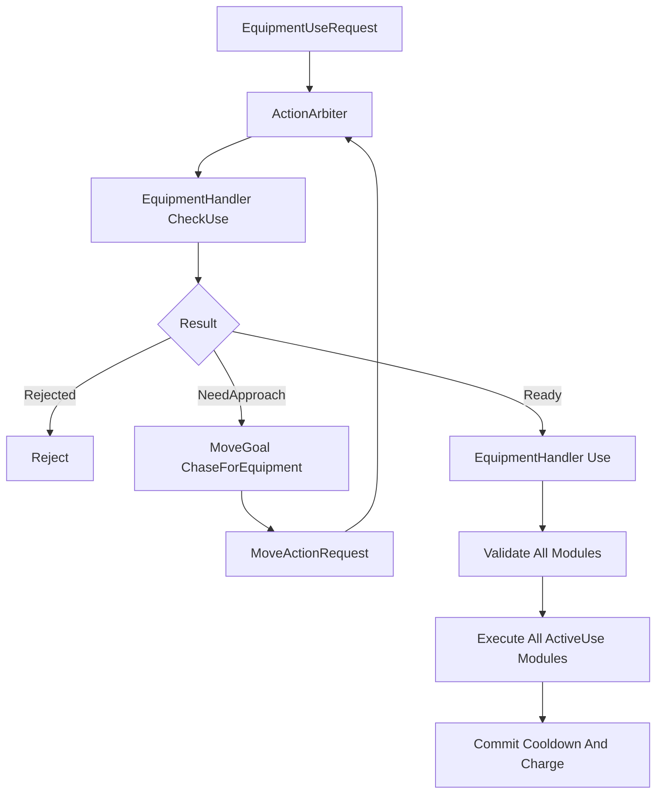

# 装备主动被动与可重复命中

## 目标实现

多个模块统一验证后执行，跨死亡效果状态有明确边界。

## 技术方案

EquipmentEffectDef 内嵌多态 Module，Runtime 持有 EffectUid/Module state；主动一次验证全部模块，再通过仲裁瞬发；On-Hit 重复保留源动作。

## 边界情况

每装备最多一个主动 Effect；装备使用使撤销失效；EquipmentTargetPolicy 目前只存在概念提及，待用户确认是否采用及值域。

## 验收条件

- 正常路径达到上述目标，并由所属模块唯一拥有权威状态。
- 以上边界情况有明确返回、拒绝或可见失败；不得用占位成功代替行为。
- 确定性逻辑比较重复执行、改变插入顺序以及捕获/恢复/重演结果；只读界面不得改变 Gameplay。

## 工程实际核查

本期检索的是当前源码和测试定义。存在实现不等于完成全部需求，存在测试不等于本期已运行通过。

- `Assets/Scripts/Gameplay/Equipment/EquipmentEffect.cs`：当前关联实现定义 EquipmentEffectDef、EquipmentActiveSettings、EquipmentEffectInvokeTiming、EquipmentEffectModule、IEmpoweredAttackProvider（以源码为实际命名）。
- `Assets/Scripts/Gameplay/Equipment/OnHitRepeatModule.cs`：当前关联实现定义 OnHitRepeatModule（以源码为实际命名）。

### 已有测试位置

- `Assets/Scripts/Gameplay/Tests/GuinsoosRagebladeEquipmentTests.cs`：FormalCatalog_ContainsExpectedStatsRecipeAndModules、GameScene_UsesCorePartitionInsteadOfDirectEquipmentCatalog、SixRealHits_StackBuffAndRepeatThirdFullStackOnHitOnce、OnHitEquipmentEffects_DoNotApplyToStructure、TriggerCounter_RestoreReplaysSameRepeatedOnHit、EquipmentModuleState_SurvivesDeathRespawnHandleRebuild。

## 附录：精确接口、公式与配置

附录保留本功能必须精确表达的接口、运算和配置语义，原系统章节已拆到所属功能。若与上面的已接受修订仍有冲突，进入待确认清单而不是按旧版本执行。

### 三层静态配置结构

装备效果静态配置固定为：

```text
EquipmentDefinition
    -> EquipmentEffectDef[0..2]
        -> EquipmentEffectModule[0..N]
```

不增加：

```text
EquipmentFunctionBinding
EquipmentEffectDefinitionData
EquipmentEffect 专用 Bake 镜像
运行时动态 Delegate 注册
```

三层职责：

| 层级 | 职责 |
|---|---|
| `EquipmentDefinition` | 装备身份、展示、价值、固定属性、标签、配方和最多两个效果 |
| `EquipmentEffectDef` | 一个完整效果的名称、说明、主动属性、公共主动规则和模块集合 |
| `EquipmentEffectModule` | 一项具体功能及其调用时机、静态参数和执行规则 |

---

### EquipmentEffectDef 是非抽象配置资产

```csharp
[CreateAssetMenu(
    menuName = "MOBA/Equipment Effect")]
public sealed class EquipmentEffectDef
    : ScriptableObject
{
    [SerializeField, HideInInspector]
    private EquipmentEffectUid uid;

    public string Name;

    [TextArea]
    public string Description;

    public bool IsActive;

    public EquipmentActiveSettings
        ActiveSettings;

    [SerializeReference]
    public EquipmentEffectModule[]
        Modules;

    public EquipmentEffectUid Uid => uid;
}
```

`EquipmentEffectDef`：

```text
不是抽象类。
没有 Icon。
不通过子类区分咒刃、周期治疗或主动护盾。
```

功能差异完全由 `Modules` 中配置的模块类型和参数表达。

`Name` 与 `Description` 用于装备详情中的效果说明。

---

### 模块作为 EffectDef 的内嵌多态配置

```csharp
[Serializable]
public abstract class EquipmentEffectModule
{
    [SerializeField]
    private EquipmentEffectInvokeTiming[]
        invokeTimings;

    public IReadOnlyList<
        EquipmentEffectInvokeTiming>
        InvokeTimings => invokeTimings;

    public virtual bool CanExecute(
        ref EquipmentEffectExecutionContext context,
        ref EquipmentEffectModuleRuntimeState state)
    {
        return true;
    }

    public abstract void Execute(
        ref EquipmentEffectExecutionContext context,
        ref EquipmentEffectModuleRuntimeState state);

#if UNITY_EDITOR
    internal void ForceActiveUseTiming()
    {
        invokeTimings =
            new[]
            {
                EquipmentEffectInvokeTiming.ActiveUse
            };
    }
#endif
}
```

使用 `[SerializeReference]` 的原因：

```text
模块直接内嵌在 EquipmentEffectDef 中。
每个模块实例可以保存自己的类型和静态参数。
不需要为每一个小功能单独创建 ScriptableObject 资产。
不需要增加 Binding 包装层。
```

需要为 Unity Inspector 提供类型选择器和自定义 PropertyDrawer，但这只是编辑器显示工具，不构成运行时新层级。

---

### 调用时机

```csharp
public enum EquipmentEffectInvokeTiming
{
    OnEquipped,
    OnUnequipped,

    Tick,

    DamageTaken,
    DamageDealt,

    HealTaken,
    HealDealt,

    AbilityCast,

    UnitDying,
    UnitDeath,
    UnitKill,

    DynamicStatModifier,
    CombatModifier,

    ActiveUse
}
```

正式单位事件调用时机只有：

```text
DamageTaken
DamageDealt
HealTaken
HealDealt
AbilityCast
UnitDying
UnitDeath
UnitKill
```

其中：

```text
UnitDying
    进入濒死裁决，仍可能被救回。

UnitDeath
    正式死亡已经成立。

UnitKill
    击杀归属已经成立。
```

以下属于装备模块生命周期或固定系统入口，不是 `UnitEventBus` 事件：

```text
OnEquipped
OnUnequipped
Tick
DynamicStatModifier
CombatModifier
ActiveUse
```

当前不增加：

```text
LevelUp
UnitCollisionEnter
UnitCollisionExit
统一 GameplayEventRecord
GameplayEventQueue
DispatchPhase
动态事件 Subscribe
```

未来只有在单位框架正式增加事件且存在明确装备业务时，才同步扩展枚举与固定路由。

---

### 被动效果的模块时机

`IsActive == false` 时，每个模块可以选择一个或多个调用时机。

例如：

```text
DamageDealt
    造成伤害后追加攻击特效请求。

AbilityCast
    技能施放后设置咒刃就绪状态。

Tick
    每隔若干 Tick 执行恢复或检测。

DynamicStatModifier
    装备时挂载动态属性加成。

CombatModifier
    挂载战斗公式修正。

OnEquipped / OnUnequipped
    建立和解除长期来源。
```

一个效果内的多个模块可以通过同一个 `EquipmentEffectRuntime.Blackboard` 共享状态。

---

### 主动效果锁定调用时机

当：

```text
EquipmentEffectDef.IsActive == true
```

时，所有模块的调用时机必须强制为：

```text
ActiveUse
```

不允许主动 Effect 中出现：

```text
Tick
DamageTaken
AbilityCast
DynamicStatModifier
其它被动时机
```

编辑器行为：

```text
IsActive == false
    模块调用时机正常可编辑。

IsActive == true
    Inspector 将调用时机锁定并显示为 ActiveUse。
```

数据层同时使用 `OnValidate` 兜底：

```csharp
#if UNITY_EDITOR
private void OnValidate()
{
    if (!IsActive || Modules == null)
        return;

    for (int i = 0; i < Modules.Length; i++)
    {
        Modules[i]?.ForceActiveUseTiming();
    }
}
#endif
```

这样复制资产、脚本修改或旧数据迁移后也不会留下非法调用时机。

---

### 主动公共配置

```csharp
[Serializable]
public struct EquipmentActiveSettings
{
    public int CooldownTicks;
    public int ChargeCost;

    public EquipmentCooldownGroupId
        SharedCooldownGroup;

    public EquipmentTargetPolicy
        TargetPolicy;

    public fp CastRange;
}
```

只有 `IsActive == true` 时使用该配置。

主动公共规则统一负责：

```text
冷却。
Charge 消耗。
共享冷却。
目标类型。
阵营和 Targetable。
施放距离。
```

各模块只负责自己的具体功能，不分别重复扣除冷却或 Charge。

---

### Effect 和 Module Runtime

静态配置仍然只有三层，但运行时状态必须与配置分离。

```csharp
public sealed class EquipmentEffectRuntime
{
    public EquipmentEffectDef Definition;

    public EquipmentEffectBlackboard
        Blackboard;

    public EquipmentEffectModuleRuntimeState[]
        ModuleStates;
}
```

```csharp
[Serializable]
public struct EquipmentEffectModuleRuntimeState
{
    public int NextExecuteTick;
    public int InternalCooldownReadyTick;

    public int StackCount;
    public int TriggerCount;

    public EquipmentEffectModuleBlackboard
        Blackboard;

    public EquipmentEffectSerializableHandles
        Handles;
}
```

Runtime 保存：

```text
下一执行 Tick。
内部冷却。
层数和触发次数。
跨 Tick Blackboard。
外部系统提供的可序列化句柄值。
```

Runtime 不保存：

```text
C# Delegate。
匿名函数。
运行时动态订阅列表。
修改后的 ScriptableObject 配置。
```

句柄本身的生成、序列号和恢复方式由句柄所属系统负责；装备案只把它视为可序列化值。

---

### UID

`EquipmentEffectUid` 用于：

```text
配置引用。
运行时验证 EffectDef 是否匹配。
日志和调试。
快照恢复时验证静态配置。
```

UID 是隐藏序列化字段，策划只能读取，不能手工编辑。

复制资产后必须确保新资产获得不同 UID。具体编辑器 UID 生成方式由项目统一资产 ID 工具负责，本案不要求运行时动态分配。

模块不单独增加永久 UID。

模块运行时状态通过：

```text
EffectIndex + ModuleIndex
```

稳定对应。

---

### 不增加 Effect 专用 Bake 层

本案不定义：

```text
EquipmentEffectDefinition
EquipmentEffectDescriptor
EquipmentFunctionBindingData
```

运行时直接读取只读的：

```text
EquipmentDefinition
EquipmentEffectDef
EquipmentEffectModule
```

成立条件：

```text
静态配置在 Gameplay 开始后不可修改。
数组顺序稳定。
模块只保存静态参数。
运行时状态全部进入 Runtime。
所有逻辑数值使用项目允许的确定性类型。
资产引用由 GlobalGameplayData 统一收集、校验和版本握手。
```

全局配置系统仍可以对资产做：

```text
稳定 ID 校验。
空引用校验。
Effect 数量校验。
主动数量校验。
属性依赖循环校验。
配置版本哈希。
```

但不为 EquipmentEffect 再复制一套平行运行时数据结构。

---

### 典型模块类型

推荐从少量通用模块开始：

```text
SubmitDamageEquipmentEffectModule
SubmitHealEquipmentEffectModule
SubmitShieldEquipmentEffectModule

ApplyBuffEquipmentEffectModule
RemoveBuffEquipmentEffectModule

DynamicStatModifierEquipmentEffectModule
CombatModifierEquipmentEffectModule

ModifyCooldownEquipmentEffectModule
ModifyEffectStateEquipmentEffectModule

TeleportEquipmentEffectModule
EnterStasisEquipmentEffectModule
```

每个模块只承担一种明确功能。

---

### 事件驱动模块

例如攻击附伤：

```text
EquipmentEffectDef
    Name = 裂伤
    IsActive = false

    Modules[0]
        Type = SubmitDamageEquipmentEffectModule
        InvokeTimings = DamageDealt
        RequiredSourceType = Attack
        DamageRecipeId = BladeOnHit
        BaseValue = 40
```

调用链：

```text
CombatSystem 建立 DamageResult
    ↓
Source.UnitEventBus.Publish(DamageDealtEvent)
    ↓
EquipmentHandler.OnDamageDealt
    ↓
按 Slot / Effect / Module 稳定顺序扫描
    ↓
匹配 DamageDealt 的模块执行
    ↓
提交新的 AttackEffect DamageRequest
```

已经成立的 `DamageResult` 不会被倒过来修改。

攻击特效的新请求使用：

```text
SourceType = AttackEffect
```

避免再次满足“攻击来源伤害”的同类触发条件。

---

### Tick 模块

例如每 30 Tick 提交一次治疗：

```text
EquipmentEffectDef
    IsActive = false

    Module
        Type = SubmitHealEquipmentEffectModule
        InvokeTimings = Tick
        IntervalTicks = 30
        HealRecipeId = PeriodicHeal
        BaseValue = 20
```

Runtime 保存：

```text
NextExecuteTick
```

`EquipmentHandler.Advance()` 直接读取：

```text
SimulationTickContext.Current.Tick
```

到达执行 Tick 后调用模块并推进下一执行 Tick。

---

### 动态属性模块

例如：

> 获得相当于最大生命值 2% 的攻击力。

```text
EquipmentEffectDef
    Name = 巨人之力
    IsActive = false

    Module
        Type = DynamicStatModifierEquipmentEffectModule
        InvokeTimings = DynamicStatModifier

        SourceStat = MaxHealth
        TargetStat = AttackDamage
        Coefficient = 0.02
        Operation = FlatAdd
```

装备时挂载动态属性来源，卸下时使用 Runtime 保存的可序列化句柄解除。

动态属性依赖关系由属性系统负责计算和检测循环；装备案只提供静态参数。

---

### CombatModifier 模块

修改当前伤害、治疗或护盾公式的效果，不等待结果事件。

例如：

```text
本次攻击必定暴击。
攻击来源伤害提高 20%。
受到的魔法伤害降低。
```

使用：

```text
CombatModifierEquipmentEffectModule
```

在效果成立时向单位框架 v25 的 `CombatModifierSet` 挂载正式记录；效果结束时使用保存的句柄解除。

战斗系统 v10 中与单位框架 v25 冲突的旧接口不作为本案依据。

---

### 每件装备最多一个主动 Effect

校验规则：

```text
EquipmentDefinition.Effects.Length <= 2
IsActive == true 的 Effect 数量 <= 1
```

主动 Effect 中的所有 Module 都只能是：

```text
ActiveUse
```

主动使用时一次性执行该 Effect 挂载的全部模块。

---

### CheckUse

`EquipmentHandler.CheckUse(slot, target)` 检查：

```text
槽位存在装备。
装备存在主动 Effect。
Owner 当前状态允许使用主动装备。
实例冷却完成。
共享冷却完成。
Stack 或 Charge 足够。
Target 类型合法。
阵营合法。
Targetable 合法。
距离合法。
全部主动模块 CanExecute 通过。
```

结果：

```text
Ready
NeedApproach
Rejected
```

模块的 `CanExecute` 不得修改 Gameplay 状态。

---

### 先验证全部模块，再统一执行

```text
找到主动 Effect
    ↓
按 ModuleIndex 顺序执行全部 CanExecute
    ↓
任一失败
        -> 不执行任何模块
        -> 不扣 Charge
        -> 不进入冷却
    ↓
全部通过
        -> 按 ModuleIndex 顺序执行全部 Execute
        -> 统一扣除 Charge
        -> 统一提交实例冷却
        -> 统一提交共享冷却
```

禁止出现：

```text
Module 0 已执行
Module 1 验证失败
主动效果只执行了一半
```

模块应把需要失败的条件放在 `CanExecute` 阶段。

---

### ActionArbiter 接入



主动效果本身瞬发。

Dash、Blink 或其它持续行为由对应模块向已有系统提交正式请求，不在装备系统内部维护第二套移动状态机。

---

### 不使用 EquipmentInstanceUid

外部通过槽位调用：

```text
CheckUse(slot, target)
Use(slot, target)
```

`Use` 执行时重新读取当前槽位。

交换槽位只交换完整 `EquipmentInstance` 引用，EffectRuntime 和 ModuleRuntimeState 随实例一起移动。

不增加：

```text
EquipmentInstanceUid
EquipmentPassiveRuntimeUid
```

---

### 装备使用使商店撤销失效

主动装备成功执行后，`EquipmentHandler` 调用：

```csharp
shopRuntime.InvalidateUndoByEquipmentUse(
    ownerPlayerSlot,
    slot);
```

消耗品成功减少 Stack、Charge 或被移除时同样调用。

失败使用不触发撤销失效。

这样可以覆盖不会产生伤害、治疗或护盾的装备功能，例如：

```text
停滞。
纯移动。
清除控制。
纯加速。
```

---

### 普通死亡与复活接缝

普通死亡时调用：

```csharp
EquipmentHandler.ClearForDeath();
```

`ClearForDeath()` 不是清空装备栏。它保留：

```text
EquipmentInstance。
EquipmentDefinition 引用。
StackCount。
ChargeCount。
主动装备 ReadyTick 与冷却。
EquipmentEffectRuntime。
需要跨死亡保留的 Blackboard 和 ModuleRuntimeState。
```

它只清理当前生命阶段的外部注册和临时状态：

```text
当前生命阶段的属性 Modifier Handle。
控制免疫 Handle。
不可阻挡 Handle。
临时 Buff Handle。
生命周期绑定监听或注册。
模块明确声明为 DeathClear 的临时状态。
```

普通死亡禁止：

```text
EquipmentHandler.Clear。
删除六个装备槽。
对全部装备调用完整 OnUnequipped。
重置主动冷却、Stack 或 Charge。
丢失跨死亡 EffectRuntime。
```

复活阶段调用：

```csharp
EquipmentHandler.ClearForRespawn();
```

`ClearForRespawn()` 按固定顺序：

```text
Slot 0..5
    -> Effect 0..1
        -> Module 0..N
```

重新建立当前生命阶段需要的外部注册：

```text
固定属性 Modifier Handle。
控制免疫 Handle。
不可阻挡 Handle。
常驻被动所需生命周期 Handle。
模块声明的 Respawn Rebind Handle。
```

复活不是重新装备：

```text
不创建新的 EquipmentInstance。
不重置 Stack、Charge 或 ReadyTick。
不执行完整交易流程。
不调用完整 OnEquipped。
```

完整卸载装备来源只发生于出售、移除、变形、`ResetForPool`、`InitializeForNewRuntimeUid` 或 Unit Runtime 永久销毁。

---

### UnitDeath 同 Tick 执行

`UnitDying`、`UnitDeath` 与 `UnitKill` 都通过单位框架正式的强类型即时路由执行。

```text
Alive
    -> Dying
    -> Dead
```

在 Combat Settlement 当前 Tick 内成立时，对应装备模块也在当前 Tick 即时执行。

`UnitDeath` 或 `UnitKill` 模块提交的新：

```text
DamageRequest。
HealRequest。
ShieldRequest。
Buff Request。
```

可以继续进入当前 Tick 后续 Combat Settlement Cycle。

禁止把正式死亡装备反应推迟到 Combat 阶段结束之后。

---

### 新生单位的装备生效边界

```text
FirstActiveLogicTick =
    UnitUid.SpawnLogicTick + 1
```

生成 Tick 内：

```text
固定装备属性已经存在。
装备常驻来源已经挂载。
装备可以响应外部强类型结果事件。
单位可以成为装备效果的目标。
```

生成 Tick 内禁止：

```text
EquipmentHandler.Advance 的 Tick 模块主动推进。
主动装备使用。
由新生单位主动发起装备行为。
```

从 `FirstActiveLogicTick` 起，装备 Tick 模块和主动使用正常推进。

---


## 需求演进

### 2026-08-10

变动内容：正式装备目录和可重复 On-Hit 的来源防重入。

legacyDecision：D-039

