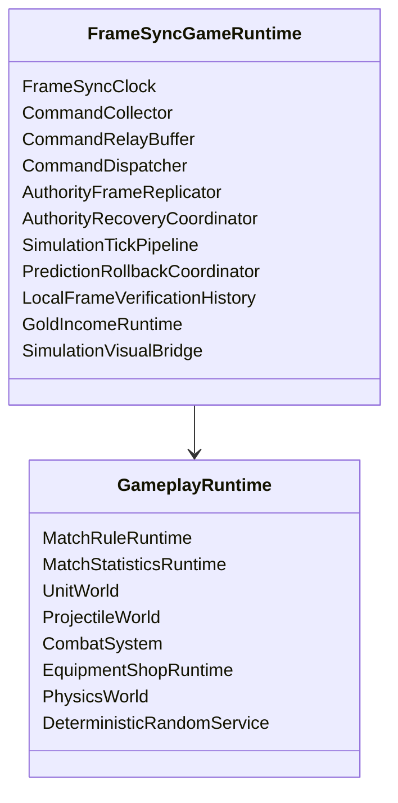

# 逻辑时钟与 Tick 推进

## 目标实现

所有确定性系统读取同一个 Tick 含义和执行模式。

## 技术方案

ServerTick、LocalSimulationTick 都是下一待执行 Tick；LatestAuthorityFrameTick 是最近连续接受权威帧，SnapshotTick 是恢复后下一 Tick。SimulationTickContext 提供只读上下文。

## 边界情况

预测领先上限和每 Unity 帧执行上限明确；重演不读取渲染耗时或输入设备。

## 验收条件

- 正常路径达到上述目标，并由所属模块唯一拥有权威状态。
- 以上边界情况有明确返回、拒绝或可见失败；不得用占位成功代替行为。
- 确定性逻辑比较重复执行、改变插入顺序以及捕获/恢复/重演结果；只读界面不得改变 Gameplay。

## 工程实际核查

本期检索的是当前源码和测试定义。存在实现不等于完成全部需求，存在测试不等于本期已运行通过。

- `Assets/Scripts/Deterministic/Core/SimulationTickContext.cs`：当前关联实现定义 SimulationTickContext（以源码为实际命名）。
- `Assets/Scripts/FrameSync/FrameSyncGameRuntime.cs`：当前关联实现定义 FrameSyncGameRuntime（以源码为实际命名）。

### 已有测试位置

- `Assets/Scripts/Deterministic/Tests/SimulationTickContextTests.cs`：ExecutionMode_ValuesAreStable、BeginTick_PublishesImmutableRequestedContext、BeginTick_WhenAlreadyActive_RejectsNestedTickWithoutReplacingCurrent、SecondController_CannotReplaceActiveContext、EndTick_RetainsLatestPublishedContext、BeginTick_AfterCompletedTick_ReplacesPublishedContext、EndTick_WithoutOwnership_Throws。
- `Assets/Scripts/Bootstrap/Tests/EditMode/GameplayIntegrationTests.cs`：TickContext_InitializesWithCorrectTick、TickContext_AdvancesCorrectly、DeterministicRandom_ProducesSameSequenceForSameSeed、UnitUid_ComparisonAndSorting、PathGrid_Initialise_ProducesValidGrid、AStar_FindPath_ReturnsValidPath、FlowField_BuildAndQuery_ReturnsValidDirection。
- `Assets/Scripts/Bootstrap/Tests/PlayMode/ClientBootstrapFirstWavePlayModeTests.cs`：GameScene_FirstWaveUsesFlowFieldsAndMoves、GameScene_MapViewAnchorsToStaticTopologyRootAtWorldOrigin。
- `Assets/Scripts/FrameSync/Tests/AuthorityReplicationTests.cs`：CommandBundle_ProducesStablePerTickReplacementRelays、LateCommand_IsRetargetedToCurrentServerTick_NotRejected、AcceptedCommand_AfterTickFreeze_LateDuplicateIsIgnored、AcceptedCommand_AfterOwnerInvalidation_DuplicateSkipsAuthorization、DistinctCommandSequences_OnAdjacentTicks_AreBothAccepted、DirectionAim_CastAbility_RoundTripsCanonically、WireContracts_DoNotExposeCallerOwnedByteArrays。
- `Assets/Scripts/FrameSync/Tests/BootstrapDeterminismProbeTests.cs`：ServerFirstTick_MatchesClientPredictionFirstTick。

## 附录：精确接口、公式与配置

附录保留本功能必须精确表达的接口、运算和配置语义，原系统章节已拆到所属功能。若与上面的已接受修订仍有冲突，进入待确认清单而不是按旧版本执行。

### 结构



`GoldIncomeRuntime` 属于 Tick 输出构建和权威确认层，不进入 GameplaySnapshot。

### 服务端职责

```text
同步 ServerTick。
冻结并规范化 Tick Command。
推进权威 Gameplay Tick。
生成 GoldIncomeRecordBatch 与 Digest。
生成必填 SharedGameplayChecksum。
构建 AuthorityFrame。
确认本地 Tick 金币记录。
提交已确认金币批次。
广播 AuthorityFrame。
响应 AuthorityRecoveryRequest。
发送 MatchResultState。
```

Dedicated Server 不做 Gameplay 回滚。

### 客户端职责

```text
采集并发送本地 GameplayCommand。
接收 AcceptedCommandRelay。
推进 LocalSimulationTick。
由 GoldIncomeRuntime 保存未确认金币批次和摘要。
保存 LocalFrameVerificationRecord。
逐 Tick 对账 AuthorityFrame。
必要时恢复快照并重演。
按连续 Tick 确认金币记录。
金币确认本身不主动回滚。
缺帧时暂停并发起 AuthorityRecovery。
处理预测结束候选和最终 Result。
```

---

### 固定逻辑 Tick

Gameplay 使用固定：

```text
TickRate
LogicDeltaFp
```

所有 Gameplay 系统通过 `SimulationTickContext` 获得 Tick，不读取 Unity 渲染帧、`Time.deltaTime`、Transform 或 Unity Physics。

### `ServerTick`

Dedicated Server 通过 NetworkVariable 同步：

```text
ServerTick
```

定义：

> 服务端下一次准备执行的逻辑 Tick。

例如：

```text
ServerTick = 100
```

表示 Tick 99 已完成，下一次执行 Tick 100。

服务端开始执行 Tick `T` 时，该 Tick 命令集合隐式封闭，不需要独立 `SealedTick`。

```text
ServerFinalizedTick =
    ServerTick - 1
```

### `LatestAuthorityFrameTick`

定义：

> 客户端当前已经完整接收、完成权威对账并确认本地确定性输出的最新连续权威帧号。

若已收到 Tick 102，但 Tick 101 缺失：

```text
LatestAuthorityFrameTick = 100
```

Tick 102 暂存于 AuthorityFrameBuffer，不能越过缺口，也不能提前确认 Tick 102 的金币记录。

### `LocalSimulationTick`

定义：

> 客户端下一次准备执行的 Gameplay Tick。

```text
LatestAuthorityFrameTick = 100
LocalSimulationTick = 106
```

表示客户端已经预测执行 Tick 101～105。

普通回滚只改变 `LocalSimulationTick`，不会撤销已经连续确认的权威帧或已确认金币收入。

### `SimulationTickContext`

```text
SimulationTickContext
    Tick
    DeltaTick
    ExecutionMode
```

```text
ExecutionMode
    ServerAuthority
    ClientPrediction
    ClientReplay
```

系统可保存自己的 `RespawnTick`、`ReadyTick`、`ExpireTick` 等状态，但不得维护第二套当前逻辑 Tick 权威。

### 预测暂停原因

```csharp
[Flags]
public enum PredictionPauseReason
{
    None                  = 0,
    MissingAuthorityFrame = 1 << 0,
    PredictionLeadLimit   = 1 << 1,
    MatchEndCandidate     = 1 << 2
}
```

暂停期间仍然：

```text
接收网络。
缓存 AuthorityFrame。
发起 AuthorityRecovery。
采集并发送玩家 Command。
更新 Unity 表现。
```

只是暂不执行新的本地预测 Tick。

### 最大预测领先

```text
PredictedTickCount =
    LocalSimulationTick
    - (LatestAuthorityFrameTick + 1)
```

达到：

```text
PredictedTickCount >= MaxPredictionLeadTicks
```

时添加 `PredictionLeadLimit`。

配置必须满足：

```text
MaxPredictionLeadTicks < SnapshotWindowTicks
```

### `MaxLogicTicksPerUnityFrame`

该参数只作为客户端 CPU 保护阀，用于 Unity 卡顿补跑和回滚重演。

### Unity 推进伪代码

```pseudo
function UnityUpdate():
    PumpNetwork()
    ProcessAuthorityRecovery()
    ProcessAuthorityFramesSequentially()
    ProcessDirtyPredictionRollback()

    if PredictionPauseReasons != None:
        UpdatePresentationOnly()
        return

    accumulator += GetUnscaledElapsedTime()
    executed = 0

    while accumulator >= LogicDelta:
        if executed >= MaxLogicTicksPerUnityFrame:
            break

        if GetPredictedTickCount()
           >= MaxPredictionLeadTicks:
            AddPause(PredictionLeadLimit)
            break

        RunClientSimulationTick(
            LocalSimulationTick,
            ClientPrediction
        )

        LocalSimulationTick += 1
        accumulator -= LogicDelta
        executed += 1
```

---


## 需求演进

### 2026-10-02

变动内容：明确所有 Tick 表示下一待执行帧，普通回滚不穿越连续权威确认边界。

legacyDecision：D-001

