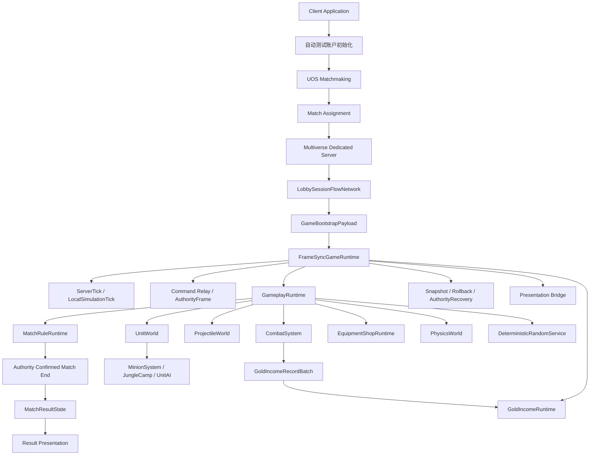

# 全局阶段与同步 Tick 管线

## 目标实现

同一 Tick 的处理顺序可解释且各端一致。

## 技术方案

SimulationTickPipeline 按全局 Handler 子阶段推进 Tag、Buff、Equipment、HitReaction、Ability、Movement、Attack，然后封存并结算战斗波次。

## 边界情况

UnitUid 只用于稳定遍历，不能通过先处理整只单位制造跨 Handler 优势；捕获前瞬态队列必须清空。

## 验收条件

- 正常路径达到上述目标，并由所属模块唯一拥有权威状态。
- 以上边界情况有明确返回、拒绝或可见失败；不得用占位成功代替行为。
- 确定性逻辑比较重复执行、改变插入顺序以及捕获/恢复/重演结果；只读界面不得改变 Gameplay。

## 工程实际核查

本期检索的是当前源码和测试定义。存在实现不等于完成全部需求，存在测试不等于本期已运行通过。

- `Assets/Scripts/FrameSync/SimulationTickPipeline.cs`：当前关联实现定义 SimulationTickPipeline、InitialSpawnEntry（以源码为实际命名）。
- `Assets/Scripts/Gameplay/Combat/CombatSystem.cs`：当前关联实现定义 CombatSystem、ShieldRequestComparer、HealRequestComparer、DamageRequestComparer、DamageAllocationGroup（以源码为实际命名）。

### 已有测试位置

- `Assets/Scripts/Gameplay/Tests/CombatSystemTests.cs`：SubmitDamage_ValidRequest_ReducesHealth、Omnivamp_HealsSourceForFractionOfSettledDamage、NaturalRegen_AppliesPerInterval_ForHealthAndCastResource、DamageFormula_ArmorReducesDamage、ZeroArmor_FullDamageApplied、CombatModifiers_ApplyOutgoingAndIncomingFinalPatches、FatalDamage_CompletesFormalDeathSettlement。
- `Assets/Scripts/FrameSync/Tests/SnapshotChecksumCompletenessTests.cs`：AggregateSnapshot_RestoresIntentDashAndLocomotion、SharedChecksum_ChangesForIntentDashAndLocomotionState、CombatModifierCapture_IsCanonicalAndDetachRepairsShiftedIndices、AggregateSnapshot_CapturesLiveActionRuntime、ExecuteTick_FormalDeathInvalidationCapturesRestorableBoundary、SharedChecksum_SerializesEveryActionRuntimeSlotMember、Restore_RejectsActionRuntimeWithoutOwningHandlerState。
- `Assets/Scripts/Bootstrap/Tests/PlayMode/ClientBootstrapFirstWavePlayModeTests.cs`：GameScene_FirstWaveUsesFlowFieldsAndMoves、GameScene_MapViewAnchorsToStaticTopologyRootAtWorldOrigin。
- `Assets/Scripts/FrameSync/Tests/AggregateSnapshotContractTests.cs`：Restore_UsesStableUnitUidAndRestoresRandomAndPhysicsState、Restore_RejectsNonCanonicalOrMissingUnitIdentity、Restore_RejectsDuplicateGameplayParticipantIdentity、Restore_RejectsMissingGameplayParticipantIdentity、SnapshotStore_WritesExplicitOuterSchemaAndNextTick。
- `Assets/Scripts/FrameSync/Tests/AuthorityReplicationTests.cs`：CommandBundle_ProducesStablePerTickReplacementRelays、LateCommand_IsRetargetedToCurrentServerTick_NotRejected、AcceptedCommand_AfterTickFreeze_LateDuplicateIsIgnored、AcceptedCommand_AfterOwnerInvalidation_DuplicateSkipsAuthorization、DistinctCommandSequences_OnAdjacentTicks_AreBothAccepted、DirectionAim_CastAbility_RoundTripsCanonically、WireContracts_DoNotExposeCallerOwnedByteArrays。

## 附录：精确接口、公式与配置

附录保留本功能必须精确表达的接口、运算和配置语义，原系统章节已拆到所属功能。若与上面的已接受修订仍有冲突，进入待确认清单而不是按旧版本执行。

### 运行模式

当前版本只保留：

```text
Dedicated Server
Client
```

不保留 Host、离线 Gameplay、中途加入进行中对局或客户端进程重启后的状态恢复。UOS Multiverse 托管 Dedicated Server；客户端通过 UOS Matchmaking 获得服务器分配结果后连接公网 IP 与端口。

### 总体逻辑图



### 权威边界

| 内容 | 权威来源 | 客户端是否预测 | 是否进入 Gameplay 回滚 |
|---|---|---:|---:|
| 玩家 GameplayCommand | 服务端最终规范命令序列 | 是 | Command Buffer 不进入 GameplaySnapshot |
| 单位、技能、Buff、投掷物、战斗 | 确定性 Gameplay 模拟 | 是 | 是 |
| Unit 创建、LifeState 写入与实体生命周期执行 | `UnitWorld` | 是 | 是 |
| 致死、正式死亡与濒死复活判定 | `CombatSystem` | 是 | 是 |
| 每 Tick 金币获取记录 | 所有端根据相同输入确定性生成；AuthorityFrame 确认该 Tick 输入 | 是，但确认前只缓存、不可消费 | 记录批次不进入 GameplaySnapshot |
| 已确认金币总收入 | 连续 AuthorityFrame 确认后的本地金币记录累计 | 否 | 不回滚，是确认层状态 |
| 商店交易记录链 | `EquipmentShopRuntime` | 是 | 是 |
| `CurrentAvailableGold` | 已确认总收入与当前预测交易记录链的只读计算结果 | 间接预测支出 | 不进入快照 |
| 服务端金币记录持久化 | Dedicated Server 提交已确认金币批次 | 否 | 否 |
| 比赛结束 | 服务端 AuthorityFrame 对目标 Tick 的确认 | 客户端只预测结束候选 | MatchRule 状态进入快照 |
| 最终结果载荷 | Dedicated Server `MatchResultState` | 否 | 否 |
| UOS 会话与连接 | UOS / 网络层 | 否 | 否 |
| Unity 动画、粒子和音效 | 客户端表现层 | 可预测普通 Gameplay 表现 | 否 |

### 当前版本删除项

当前版本不设计：

```text
玩家手动登录界面
Host
离线 Gameplay 模式
中途加入进行中对局
客户端进程重启后的 BaseSnapshot 恢复
皮肤
战争迷雾与视野得分
AI 控制英雄
地图信号
表情与投降
聊天
复杂观战
服务端 Gameplay 回滚
AuthorityResultBytes
ResolvedGameplayMutationBytes
金币获取结果网络载荷
外部累计金币状态同步
GoldStateRevision
EarnedGoldStateEntry
EarnedGoldStateHistory
EarnedGoldFrameHistory
EarnedGoldHistorySeed
每 Tick 累计收入镜像快照
通用 GameplayEventQueue
UnitEventBus 委托快照
```

相同快照、权威命令、配置和随机状态重演后仍不一致，视为程序 Bug 或快照字段缺失，记录诊断后终止该客户端对局，不通过额外结果同步掩盖。

---

### 聚合根

```text
GameplayRuntime
    MatchRuleRuntime
    MatchStatisticsRuntime
    UnitWorld
    ProjectileWorld
    CombatSystem
    EquipmentShopRuntime
    PhysicsWorld
    DeterministicRandomService
```

帧同步组合根另外维护：

```text
GoldIncomeRuntime
LocalFrameVerificationRecordByTick
```

二者不进入 GameplaySnapshot。

### Tick 顺序

```text
01. Begin Tick T
02. 设置 SimulationTickContext.Current
03. CombatSystem.BeginTick(T)
        重置当前 Tick 活动请求序列
        重置延迟请求分配器
        按稳定顺序导入 ExecuteLogicTick == T 的 DeferredCombatRequest
04. GoldIncomeRuntime.BeginTick(T)
05. EquipmentShopRuntime.BeginTick
06. 其它系统执行自己的内部 BeginTick 与序列重置

07. NaturalGoldIncomeSystem
        按 PlayerSlot 升序请求自然金币

08. 分发本 Tick GameplayCommand
09. 推进 MatchPhase 的非胜负时间状态
10. UnitWorld 推进正常复活和跨 Tick 生命周期
        完成复活状态初始化后
        按固定 Handler 顺序调用 ClearForRespawn

11. MinionSystem / JungleCamp 等生成单位并注册 AIController
12. UnitWorld 建立稳定 AI 遍历集合
13. Tick AIController
14. Unit 处理玩家和 AI Order
15. CrowdControlHandler.Advance
16. 刷新 CapabilityState
17. BehaviorPlanner / ActionArbiter / ActionRuntime
18. Ability / Buff / Attack / Equipment Advance

19. PhysicsWorld.BuildRvoGrid
20. DeterministicRVO
21. UnitLocomotionAgent 写逻辑位置
22. WallPenetrationResolver 修正

23. ProjectileWorld.CommitSpawns
24. ProjectileWorld.AdvanceMotion
25. ProjectileWorld.UpdateLifecycle
26. PhysicsWorld.BuildUnitFinalGrid
27. 产生并路由碰撞事件
28. ProjectileWorld.ResolveHits
29. ProjectileWorld.EmitEffects
30. ProjectileWorld.FlushDestroy

31. CombatSystem.SettleTick
        UnitDying 和普通 Damage / Heal Reaction
            产生的请求继续进入当前 Tick
        生命周期 API：
            UnitWorld.RequestEnterDying
            UnitWorld.RequestRecoverFromDying
            UnitWorld.ConfirmUnitDeath
        UnitDeath / UnitKill 回调立即执行
        其新建 Shield / Damage / Heal Request
            写入 DeferredCombatRequestBuffer
            ExecuteLogicTick = T + 1

32. CombatSystem 冻结 CombatTickResult
        FormalDeathResults[]
        TeamBaseDestroyedSignals[]
        GoldIncomeAllocations[]

33. MatchStatisticsRuntime
        所有模拟端按 FormalDeathResults 稳定顺序更新

34. EquipmentShopRuntime
        处理战斗参与导致的撤销失效

35. CombatGoldIncomeProducer
        按 GoldIncomeAllocations 规范顺序请求金币

36. MatchRuleRuntime
        所有端推进共享规则状态
        Dedicated Server 消费 TeamBaseDestroyedSignals

37. Map / MatchRule Gold Producers
        按代码固定顺序请求金币

38. GoldIncomeRuntime.SealTick(T)
        生成 GoldIncomeRecordBatch[T]
        生成 GoldIncomeBatchDigest[T]

39. 构建 SharedGameplayChecksum(T)
40. 输出 VisualSnapshot / PresentationEvent
41. 保存 LocalFrameVerificationRecord[T]
42. 保存 SnapshotTick = T + 1
43. End Gameplay Tick T

44. Dedicated Server 构建 AuthorityFrame(T)
45. Dedicated Server 接受本地 Tick T
46. Dedicated Server 确认 GoldIncomeRecordBatch[T]
47. Dedicated Server 提交确认批次
48. ServerTick 前进到 T + 1
49. Dedicated Server 广播 AuthorityFrame(T)
```

### Projectile Spawn Sequence

FrameSync 不要求外部调用 `ProjectileWorld.BeginTick()`。

ProjectileWorld 自己保证：

```text
每个 LogicTick 的 SpawnSequenceInTick 从 0 开始。
同 Tick 后续分配稳定递增。
```

具体在自身 Tick 逻辑或 UID 分配入口完成，以 Projectile v18 为准。

### Unit Spawn 与主动生效

```text
FirstActiveLogicTick =
    UnitUid.SpawnLogicTick + 1
```

生成 Tick 内单位可以被查询、成为目标、参与碰撞并受到效果，但不执行主动 AI、Order、Planner、移动、攻击和主动技能。

不保存独立 FirstActive 或 FirstAI Tick 字段。

### 正式死亡、复活和延迟处置

正式死亡在 Combat Settlement 内通过：

```text
UnitWorld.RequestEnterDying
UnitWorld.RequestRecoverFromDying
UnitWorld.ConfirmUnitDeath
```

`ConfirmUnitDeath` 同步完成：

```text
写 LifeState = Dead
发布 UnitDeath
按固定 Handler 顺序 ClearForDeath
注销非英雄管理关系
注销 AIController
刷新目标与碰撞有效性
```

正式死亡不调用：

```text
StatHandler.ClearModifiers()
CombatModifiers.Clear()
```

来源系统只移除自己持有的 Handle：

```text
BuffHandler.ClearForDeath
CrowdControlHandler.ClearForDeath
Ability 中断应中断的 Session
Equipment 保留装备与常驻 Runtime
```

复活完成状态初始化后，按同一固定 Handler 顺序调用 `ClearForRespawn`。跨死亡保留的 Buff、装备被动和技能被动在该接缝重建当前生命阶段 Handle。

若 Dead Unit 仍作为延迟战斗请求 Source：

```text
CombatSystem.HasDeferredRequestFrom(UnitUid)
    == true
```

则可以立即停止 AI、碰撞和选择，但不能最终从 Unit Registry 注销、回池或 Destroy，必须等待来源延迟请求执行完毕。

### Combat Reaction

```text
DamageTaken / DamageDealt
HealTaken / HealDealt
UnitDying
    -> 新普通战斗请求在当前 Tick执行。

UnitDeath / UnitKill
    -> 回调立即执行。
    -> 新普通战斗请求延迟到下一 Tick。
```

### UnitEventBus 与表现

UnitEventBus 是即时强类型固定路由，不动态订阅、不进入快照。只有 `SupportedUnitEvents` 声明支持的 Handler 才进入路由。

Gameplay Tick 只写逻辑姿态；`PhysicsEntity2D.LateUpdate` 是实体根 Transform 唯一写入点。

AttackHandler 的 Commit 音效适配现有 Presentation / Audio `SfxEvent` 入口，不直接调用 `AudioSource.Play()`，事件身份继续使用现有 `PresentationEventId`。

---

### 应用与大厅

```text
UOS Matchmaking
LobbySessionFlowNetwork
GameBootstrapPayload
统一 StartTick
InitialEarnedGold 初始化 GoldIncomeRuntime
```

### 帧同步

```text
ServerTick
LatestAuthorityFrameTick
LocalSimulationTick
AuthorityFrame
必填 SharedGameplayChecksum
LocalFrameVerificationRecordByTick
AuthorityRecovery
PredictionPauseReason
```

### Gameplay

```text
UnitWorld.SpawnUnit
SpawnLogicTick 主动生效门槛
CombatSystem.BeginTick 导入 DeferredRequest
Combat 内即时 Dying / Dead
UnitDeath / UnitKill 新普通请求延迟一 Tick
MatchStatisticsRuntime 所有端消费
固定 ClearForDeath / ClearForRespawn
ProjectileWorld
EquipmentShopRuntime
PhysicsWorld
```

### 金币

```text
GoldIncomeRuntime 唯一所有权
GoldIncomeRecordBatch
GoldIncomeBatchDigest
固定金币来源请求顺序
ConfirmedEarnedGoldTotal
CurrentAvailableGold
金币确认不主动回滚
确认批次幂等持久化
```

### 快照与回滚

```text
SnapshotIntervalTicks = 1
RollbackAnchorTick
LocalFrameVerificationRecord 生命周期
ProjectileWorldSnapshot v18
CombatSystemSnapshot v13.2
Relay Dirty Tick
AuthorityRecovery 仅补 AuthorityFrame
```

---

### 全局 Handler 子阶段

`SimulationTickPipeline` 不再逐 Unit 执行完整 Handler 组。固定阶段为：

```text
All Unit.TickTags
All BuffHandler.Advance
All EquipmentHandler.AdvanceEffects
All HitReaction.TickUpdate
All AbilityHandler.TickUpdate
All MovementHandler.TickUpdate
All AttackHandler.TickUpdate
```

每一子阶段内部继续按 `UnitRegistry` 的规范 UnitUid 顺序遍历；该顺序只负责确定性，
不能决定最终的同批生命、护盾、死亡或非平局击杀归属。


## 需求演进

### 2026-10-02

变动内容：生成 Tick 可被动参与，主动工作晚于出生 Tick。

legacyDecision：D-008

### 2026-08-24

变动内容：战斗封存波次和冻结批次起始状态；击杀按最高有效生命伤害，取代末次伤害者。

legacyDecision：D-049

