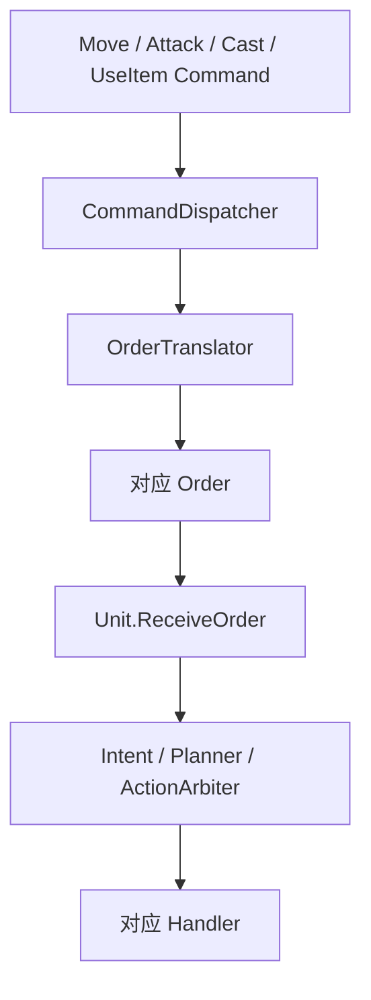
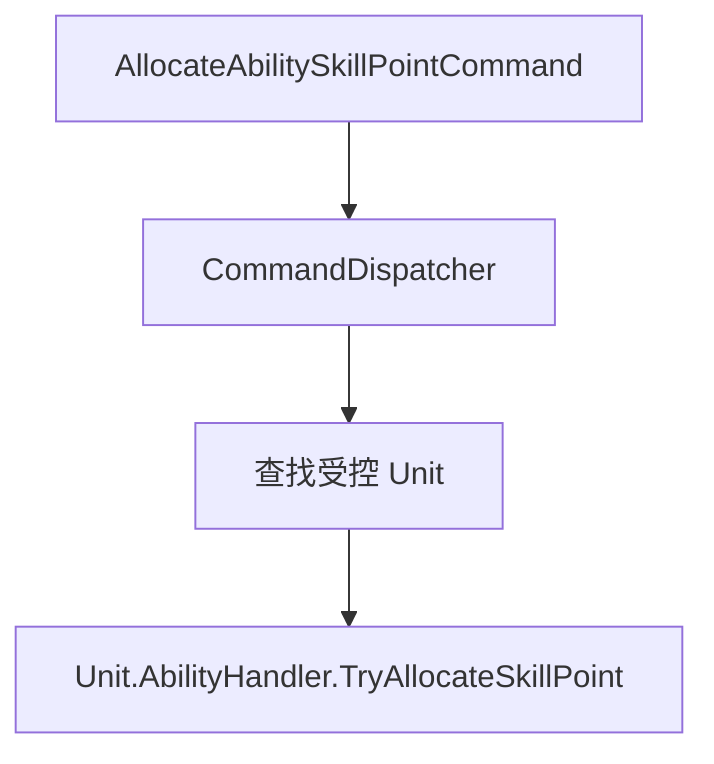

# 命令序列化与类型化派发

## 目标实现

玩家意图成为能重发、对账和重演的确定性命令。

## 技术方案

GameplayCommand 采用唯一 CommandHeader 与强类型负载、规范字节序；CommandDispatcher 按正式 Command 类型进入所属系统。

## 边界情况

完整 canonical 字节参与对账；无效单位或槽位不能按示例静默修复；输入事件仅翻译一次。

## 验收条件

- 正常路径达到上述目标，并由所属模块唯一拥有权威状态。
- 以上边界情况有明确返回、拒绝或可见失败；不得用占位成功代替行为。
- 确定性逻辑比较重复执行、改变插入顺序以及捕获/恢复/重演结果；只读界面不得改变 Gameplay。

## 工程实际核查

本期检索的是当前源码和测试定义。存在实现不等于完成全部需求，存在测试不等于本期已运行通过。

- `Assets/Scripts/Deterministic/Serialization/CanonicalByteWriter.cs`：当前关联实现定义 CanonicalByteWriter（以源码为实际命名）。
- `Assets/Scripts/FrameSync/GameplayCommand.cs`：当前关联实现定义 CommandHeader、GameplayCommandIdentity、AbilityCancelReason、EquipmentShopCommandOperationType、GameplayCommand（以源码为实际命名）。

### 已有测试位置

- `Assets/Scripts/FrameSync/Tests/GameplayCommandContractTests.cs`：AimFactories_ClearEveryUnusedPayloadField、CanonicalBytes_IncludeHeaderIdentityAndMinimalMovePayload、Collector_ProducesSameCanonicalOrderForDifferentInsertionOrder、MoveMerge_UsesHighestCommandSequenceForSameFormalKey。
- `Assets/Scripts/Bootstrap/Tests/EditMode/GameplayCommandSendLedgerTests.cs`：UnchangedCollector_BuildsOnlyOneReliableBundleCandidate、AdjacentToggleInputs_SendTheirDistinctCommandSequences、RebuiltCollector_DoesNotResendSuccessfulIdentity。
- `Assets/Scripts/Deterministic/Tests/CanonicalByteWriterTests.cs`：MixedPrimitives_MatchCanonicalLittleEndianGoldenBytes、SignedBoundaries_PreserveTwosComplementBits、Reset_ReusesCallerBufferFromOffsetZero、InsufficientCapacity_LeavesCursorAndBufferUnchanged、NullBuffer_IsRejected。
- `Assets/Scripts/FrameSync/Tests/FrameSyncPipelineTests.cs`：GameplayCommand_CreateMove_WritesCanonicalBytes、CommandCollector_MergeMove_LastWins、CommandCollector_ContentRevisionTracksCanonicalMutations、Pipeline_SingleUnit_MovesWithCommand、Checksum_SameState_SameHash、Checksum_DifferentState_DifferentHash、Pipeline_Deterministic_SameCommandsSameResult。
- `Assets/Scripts/Bootstrap/Tests/EditMode/ApplicationFlowTests.cs`：TestAccount_CommandLineOverridesPersistedIdentity、Lobby_RequiresEveryAssignedPlayerAtFullReadyBarrier、VersionHandshake_RejectsAnyCriticalMismatch、ClientFlow_ReachesLobbyOnlyAfterNgoConnects、ClientConnectionLifecycle_HasExactlyOneOwnerPerFlowMode、ClientFlow_CancelWaitingAssignment_DeletesTicketAndReturnsMain、ClientFlow_CancelWhileTicketCreationIsPending_DeletesLateTicket。

## 附录：精确接口、公式与配置

附录保留本功能必须精确表达的接口、运算和配置语义，原系统章节已拆到所属功能。若与上面的已接受修订仍有冲突，进入待确认清单而不是按旧版本执行。

### 当前命令范围

| CommandKind | 用途 |
|---|---|
| `Move` | 点地移动 |
| `Attack` | 攻击目标 |
| `CastAbility` | 释放或确认技能 |
| `CancelAbility` | 取消技能 |
| `AllocateAbilitySkillPoint` | 为指定槽位分配技能点 |
| `EquipmentShop` | 购买、出售或撤销 |
| `SwapEquipmentSlot` | 交换两个装备槽位 |
| `UseItem` | 使用主动装备 |

不加入地图信号、表情、投降、聊天或观战命令。

### `CommandHeader`

```text
CommandHeader
    CommandSeq
    ClientId
    PlayerSlot
    ControlledUnitUid
    TargetTick
    CommandKind
    BuildLocalTick
    PayloadByteLength
    SchemaVersion
```

网络入口只检查身份、绑定、序号、目标 Tick、Schema 和字节格式。

单位死亡、控制、沉默、技能点不足、金币不足和商店范围等 Gameplay 条件，不在网络入口判断。

### Payload

| CommandKind | Payload |
|---|---|
| `Move` | `TargetPoint fp2` |
| `Attack` | `TargetUnitUid` |
| `CastAbility` | `AbilitySlot`、`AimSnapshot`、`CastPhase` |
| `CancelAbility` | `AbilitySlot`、`CancelReason` |
| `AllocateAbilitySkillPoint` | `AbilitySlot` |
| `EquipmentShop` | `OperationType` 与对应操作的最小 Payload |
| `SwapEquipmentSlot` | `SourceSlot`、`TargetSlot` |
| `UseItem` | `SourceSlot`、`AimSnapshot` |

```text
EquipmentShopOperationType
    Purchase
    Sell
    Undo
```

操作对应 Payload：

```text
Purchase
    EquipmentId

Sell
    SourceSlot

Undo
    无额外 Payload
```

购买 Command 不携带：

```text
PreferredSlot
TargetSlot
DestinationSlot
EquipmentPurchasePlan
任何由客户端指定的目标装备槽位
```

目标装备槽位不是玩家输入意图。所有端在目标 Tick 调用装备系统正式规划器：

```text
TryBuildPurchasePlan(
    PlayerSlot,
    EquipmentId
)
```

并根据目标 Tick 的确定性状态自动派生：

```text
ConsumedComponentSlots
MergeIntoExistingStack
DestinationSlot
PurchaseCost
SlotChanges
```

自动分配规则由装备系统负责：

```text
1. 模拟删除实际消耗的配方组件。
2. 若目标装备可堆叠，选择最低槽位的可合并实例。
3. 否则选择模拟删除后的最低合法空槽。
4. 没有合法放置结果则购买失败。
```

成功交易后，`DestinationSlot` 可以作为 `ShopOperationRecord.SlotChanges` 的一部分保存，用于回滚和撤销，但不进入购买 Command。

Command 也不携带当前金币、价格、交易结果或最终装备槽变化。

### 普通单位行为命令



即使单位当前死亡或状态不允许执行，Command 仍保留在权威命令字节中，由 Unit 内部判断 Order 是否成立。

新生单位满足：

```text
CurrentTick <= UnitUid.SpawnLogicTick
```

时，不执行主动 Order、Planner、ActionRuntime、普通移动、普通攻击或主动技能推进。

### 技能点分配直接调用 AbilityHandler



不经过 Intent、Planner、ActionArbiter 或 ActionRuntime。

### 商店 Command

```text
EquipmentShopCommand
    -> CommandDispatcher
    -> EquipmentShopRuntime.ProcessCommand
```

购买、出售和撤销的唯一执行者是 `EquipmentShopRuntime`。

购买执行入口只接收：

```text
PlayerSlot
EquipmentId
```

所有端在目标 Tick 重新调用：

```text
TryBuildPurchasePlan(PlayerSlot, EquipmentId)
```

Command 不指定目标槽位；规划器根据配方组件、堆叠状态和模拟删除后的最低合法空槽生成 `DestinationSlot`。

出售执行入口接收：

```text
PlayerSlot
SourceSlot
```

撤销执行入口只需要：

```text
PlayerSlot
```

执行时读取：

```text
ConfirmedEarnedGoldTotal
OperationLog
UndoableOperationStack
EffectiveShopGoldDelta =
    Sum(所有未撤销记录的 GoldDelta)

CurrentAvailableGold =
    ConfirmedEarnedGoldTotal
    + EffectiveShopGoldDelta

EquipmentHandler 状态
ShopTraderRuntime
装备静态配置
Command 顺序
```

交易成功后：

```text
修改 EquipmentHandler。
追加或更新 ShopOperationRecord。
更新 UndoableOperationStack。
标记派生交易金币缓存为 Dirty，或增量更新缓存。
```

不直接写入：

```text
ConfirmedEarnedGoldTotal
任何账户金币总量字段
CurrentAvailableGold
独立累计支出字段
```

所有模拟端在相同确认收入基线和相同 Command 下应得到相同成功或失败结果，不增加 `ShopOperationAuthorityResult`。

### 交换槽位

```text
SwapEquipmentSlotCommand
    -> CommandDispatcher
    -> Unit
    -> EquipmentHandler.SwapSlots
```

交换槽位不进入商店交易链。

### Request 与 Process 分离

本地 UI 可调用 RequestCheck 决定是否提交 Command，但 Request 阶段不得修改：

```text
装备槽
OperationLog
UndoableOperationStack
ShopOperationRecord.Reverted
```

若本地 RequestCheck 因确认金币不足而失败：

```text
不生成 EquipmentShopCommand。
后续收入确认不会追溯创建过去不存在的 Command。
玩家需在收入确认后重新发起购买请求。
```

`CurrentAvailableGold` 和 `EffectiveShopGoldDelta` 都是只读派生值。

---


## 需求演进

### 2026-10-02

变动内容：权威帧必须校验完整规范命令字节及共享校验，包含金币批次摘要。

legacyDecision：D-002

