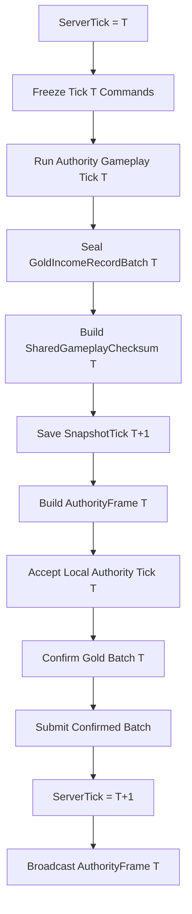

# 权威帧校验与恢复

## 目标实现

客户端能够确认一致结果并通过现有本地快照恢复缺失权威帧。

## 技术方案

AuthorityFrame 必须含 SharedGameplayChecksum；完整 Command 字节和金币批次摘要参与校验。AuthorityRecovery 仅补发缺失帧。

## 边界情况

不提供进程重启恢复、局中加入或 BaseSnapshot；本地恢复锚点丢失即终止当前对局连接。

## 验收条件

- 正常路径达到上述目标，并由所属模块唯一拥有权威状态。
- 以上边界情况有明确返回、拒绝或可见失败；不得用占位成功代替行为。
- 确定性逻辑比较重复执行、改变插入顺序以及捕获/恢复/重演结果；只读界面不得改变 Gameplay。

## 工程实际核查

本期检索的是当前源码和测试定义。存在实现不等于完成全部需求，存在测试不等于本期已运行通过。

- `Assets/Scripts/FrameSync/AuthorityFrame.cs`：当前关联实现定义 AuthorityFrameFlags、AuthorityFrame、CanonicalCommandCodec、CanonicalReader（以源码为实际命名）。
- `Assets/Scripts/FrameSync/AuthorityReplication.cs`：当前关联实现定义 GameplayCommandBundle、AcceptedCommandRelay、CommandRelayBuffer、TickRelayState、AuthorityRecoveryArchive（以源码为实际命名）。
- `Assets/Scripts/FrameSync/PredictionRollbackCoordinator.cs`：当前关联实现定义 PredictionPauseReason、LocalFrameVerificationRecord、MissingAuthorityFrameRange、AuthorityRecoveryRequest、AuthorityRecoveryResponse（以源码为实际命名）。

### 已有测试位置

- `Assets/Scripts/FrameSync/Tests/AuthorityReplicationTests.cs`：CommandBundle_ProducesStablePerTickReplacementRelays、LateCommand_IsRetargetedToCurrentServerTick_NotRejected、AcceptedCommand_AfterTickFreeze_LateDuplicateIsIgnored、AcceptedCommand_AfterOwnerInvalidation_DuplicateSkipsAuthorization、DistinctCommandSequences_OnAdjacentTicks_AreBothAccepted、DirectionAim_CastAbility_RoundTripsCanonically、WireContracts_DoNotExposeCallerOwnedByteArrays。
- `Assets/Scripts/Bootstrap/Tests/EditMode/ApplicationFlowTests.cs`：TestAccount_CommandLineOverridesPersistedIdentity、Lobby_RequiresEveryAssignedPlayerAtFullReadyBarrier、VersionHandshake_RejectsAnyCriticalMismatch、ClientFlow_ReachesLobbyOnlyAfterNgoConnects、ClientConnectionLifecycle_HasExactlyOneOwnerPerFlowMode、ClientFlow_CancelWaitingAssignment_DeletesTicketAndReturnsMain、ClientFlow_CancelWhileTicketCreationIsPending_DeletesLateTicket。

## 附录：精确接口、公式与配置

附录保留本功能必须精确表达的接口、运算和配置语义，原系统章节已拆到所属功能。若与上面的已接受修订仍有冲突，进入待确认清单而不是按旧版本执行。

### `AuthorityFrame`

```text
AuthorityFrame
    Tick
    FrameSequence
    FinalCommandRevision
    CanonicalCommandBytes
    FrameFlags
    SharedGameplayChecksum
```

`SharedGameplayChecksum` 第一版必填。

AuthorityFrame 不携带：

```text
GoldIncomeRecord
GoldIncomeRecordBatch
ConfirmedIncomeIncreaseRecord
AuthorityResultBytes
ResolvedGameplayMutationBytes
ResolvedShopOperation
```

它确认相同输入和确定性 Tick 输出，不传输战斗或金币结果。

### 服务端流程



服务端在开始 Tick `T + 1` 前确认 Tick `T` 的金币批次。

### `SharedGameplayChecksum`

必须覆盖：

```text
MatchRuleRuntime
MatchStatisticsRuntime
UnitWorld
ProjectileWorld
CombatSystem 跨 Tick状态
EquipmentHandler
EquipmentShopRuntime
PhysicsWorld
DeterministicRandomService
GoldIncomeBatchDigest[T]
```

Combat 部分包括：

```text
DamageContributionTracker
DeferredCombatRequestBuffer
```

延迟请求摘要覆盖：

```text
ExecuteLogicTick
SourceLogicTick
DeferredSequenceInSourceTick
RequestKind
唯一有效 RequestPayload
稳定记录顺序
```

不包含：

```text
ConfirmedEarnedGoldTotal
ConfirmedIncomeThroughTick
网络缓冲
服务端持久化任务
Unity 表现状态
```

### 本地校验历史

客户端执行完 Tick `T` 后保存：

```text
LocalFrameVerificationRecord
    LogicTick
    SharedGameplayChecksum
```

由：

```text
PredictionRollbackCoordinator
    LocalFrameVerificationRecordByTick
```

持有。

生命周期：

```text
完成预测或重演 Tick T
    -> 写入或覆盖 Record[T]。

从 Tick T 开始重演
    -> 删除 T 及之后旧记录。
    -> 重演后重新生成。

AuthorityFrame(T) 通过
    -> 淘汰 Record[T]。

AuthorityFrame 缺口
    -> 保留最早未确认 Tick 及之后记录。
```

它不进入 GameplaySnapshot。

### AuthorityRecovery

当前版本只补发缺失 AuthorityFrame：

```text
AuthorityRecoveryRequest
    RequestSequence
    MissingRanges[]
        FromTick
        ToTick
```

```text
AuthorityRecoveryResponse
    RequestSequence
    AuthorityFrames[]
```

客户端保留最早缺失 Tick 对应的：

```text
Snapshot
Command 历史
GoldIncomeRuntime 未确认批次和摘要
LocalFrameVerificationRecord
```

补齐后逐 Tick完成：

```text
Command 对账
Checksum 对账
必要权威纠错重演
GoldIncomeRuntime.ConfirmAuthorityFrame
LatestAuthorityFrameTick 推进
```

不提供 BaseSnapshot、中途加入、客户端进程重启恢复或金币种子。本地恢复点不存在时终止该客户端对局连接。

### 传输策略

```text
GameplayCommandBundle        Reliable Ordered
AcceptedCommandRelay         Reliable Ordered
AuthorityFrame               Reliable Ordered
AuthorityRecoveryRequest     Reliable
AuthorityRecoveryResponse    Reliable Ordered
MatchResultState             Reliable Ordered
```

---

### 十四、`AuthorityRecovery` 与本地确认历史

当前版本只补发缺失 AuthorityFrame。

客户端必须保留最早缺失 Tick 对应的：

```text
Gameplay Snapshot
Command 历史
GoldIncomeRuntime 未确认批次和摘要
LocalFrameVerificationRecord
```

恢复流程：

```text
缓存缺口之后的 AuthorityFrame。
暂停预测。
补发缺失帧。
按 Tick 连续完成：
    Command 对账
    SharedGameplayChecksum 对账
    必要权威纠错重演
    GoldIncomeRuntime.ConfirmAuthorityFrame
    LatestAuthorityFrameTick 推进
```

金币确认本身不主动重演后续预测 Tick。

不提供 BaseSnapshot、金币种子、客户端进程重启恢复或中途加入。本地恢复点不存在时终止该客户端对局连接。

---


## 需求演进

### 2026-10-02

变动内容：权威帧必须校验完整规范命令字节及共享校验，包含金币批次摘要。

legacyDecision：D-002

### 2026-10-02

变动内容：权威恢复只重传缺失帧，不支持新进程/局中加入；本地锚点丢失终止。

legacyDecision：D-003

