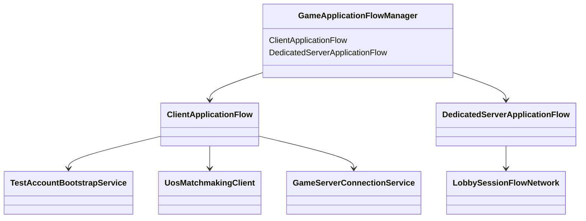
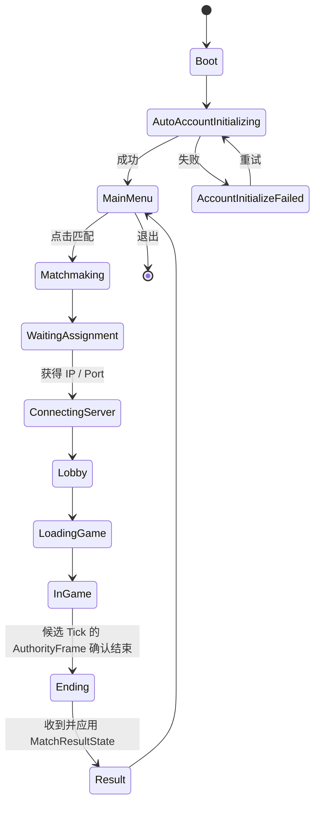
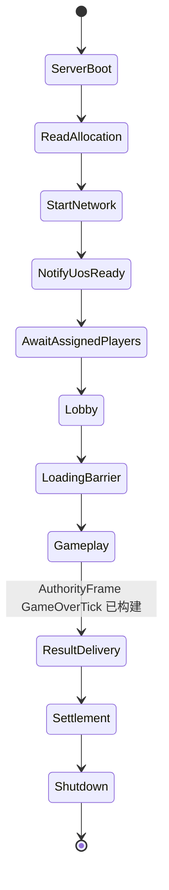
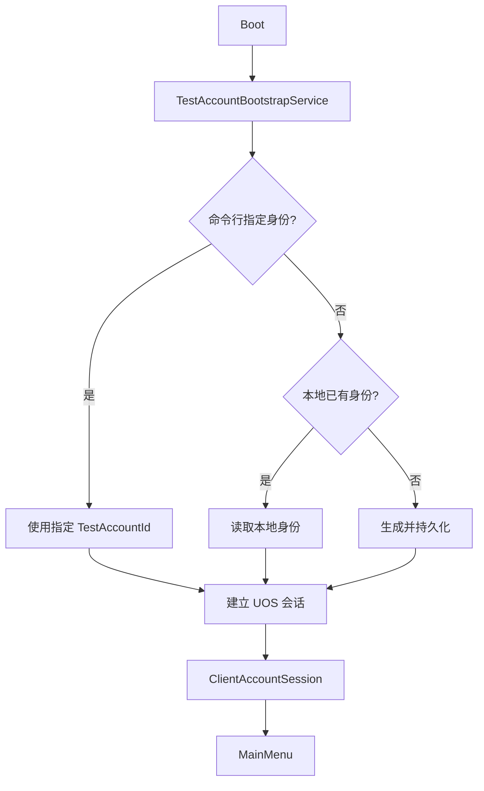

# 应用启动与跨场景流程

## 目标实现

客户端和服务器能从启动进入大厅、对局和结果页。

## 技术方案

GameApplicationFlowManager 管理逻辑状态，GameSessionContext 负责跨场景交接；NGO 根保持单一生命周期。客户端 ClientBootstrap、服务器 ServerBootstrap 均依次进入 Lobby、GameScene。

## 边界情况

本地直连与 UOS 在线各有唯一连接生命周期负责人；模式变化不能让两套回调同时通知连接。

## 验收条件

- 正常路径达到上述目标，并由所属模块唯一拥有权威状态。
- 以上边界情况有明确返回、拒绝或可见失败；不得用占位成功代替行为。
- 确定性逻辑比较重复执行、改变插入顺序以及捕获/恢复/重演结果；只读界面不得改变 Gameplay。

## 工程实际核查

本期检索的是当前源码和测试定义。存在实现不等于完成全部需求，存在测试不等于本期已运行通过。

- `Assets/Scripts/Bootstrap/ApplicationFlow.cs`：当前关联实现定义 ClientApplicationState、DedicatedServerApplicationState、LobbyPlayerSlotState、ClientAccountSession、LobbySelectionSnapshot（以源码为实际命名）。
- `Assets/Scripts/Bootstrap/GameSessionContext.cs`：当前关联实现定义 FrameFlowMode、GameSessionContext（以源码为实际命名）。
- `Assets/Scripts/Bootstrap/LocalNgoEndpointDriver.cs`：当前关联实现定义 LocalNgoEndpointDriver（以源码为实际命名）。

### 已有测试位置

- `Assets/Scripts/Bootstrap/Tests/PlayMode/ClientBootstrapFirstWavePlayModeTests.cs`：GameScene_FirstWaveUsesFlowFieldsAndMoves、GameScene_MapViewAnchorsToStaticTopologyRootAtWorldOrigin。
- `Assets/Scripts/Bootstrap/Tests/PlayMode/LocalNgoEndpointSceneTests.cs`：ClientBootstrap_TransitionsToLobbyAndBindsSession、ClientBootstrap_OnlineFlowOverride_SelectsUosSession、ServerBootstrap_TransitionsToLobbyAndStartsServer。
- `Assets/Scripts/Bootstrap/Tests/EditMode/ApplicationFlowTests.cs`：TestAccount_CommandLineOverridesPersistedIdentity、Lobby_RequiresEveryAssignedPlayerAtFullReadyBarrier、VersionHandshake_RejectsAnyCriticalMismatch、ClientFlow_ReachesLobbyOnlyAfterNgoConnects、ClientConnectionLifecycle_HasExactlyOneOwnerPerFlowMode、ClientFlow_CancelWaitingAssignment_DeletesTicketAndReturnsMain、ClientFlow_CancelWhileTicketCreationIsPending_DeletesLateTicket。
- `Assets/Scripts/Bootstrap/Tests/EditMode/LocalNgoSceneConfigurationTests.cs`：EndpointScene_UsesApplicationOwnedSceneAndPlayerLifecycle、LocalServerSlots_MatchGameSceneInitialSpawns。
- `Assets/Scripts/Bootstrap/Tests/EditMode/MatchScopedContentConfigurationTests.cs`：FormalRoot_SelectsOnlyCoreMapAndRequestedHeroes、FormalPartitions_ArePathOnlyAndCoverTwentyTwoEntries、SelectedHeroCatalogs_BakeWithoutOtherHero、UnitCatalogPartitions_CoreAloneOwnsSharedDisposePolicies、LogicAndHeroGroups_AreLocalAndPartitioned、SessionSelection_IsStableAndResettable、FormalGameScene_HasNoLegacyDirectCatalogReferences。

## 附录：精确接口、公式与配置

附录保留本功能必须精确表达的接口、运算和配置语义，原系统章节已拆到所属功能。若与上面的已接受修订仍有冲突，进入待确认清单而不是按旧版本执行。

### 定位

`GameApplicationFlowManager` 是应用流程组合根，但客户端和 Dedicated Server 使用两条不同的子状态机。



运行时根据构建目标只启用一条子流程，避免客户端状态和服务端状态混在同一个枚举中。

### 客户端状态机



客户端预测到结束候选时只暂停预测。候选 Tick 的 AuthorityFrame 权威重演确认结束后进入 Ending；最终 Result 页面数据以服务端 `MatchResultState` 为准。

### Dedicated Server 状态机



Dedicated Server 负责：

```text
读取 UOS Allocation 和 Matchmaking 玩家信息。
启动网络监听。
通知 UOS Ready。
建立大厅槽位。
运行权威 Gameplay。
在 GameOverTick 的 AuthorityFrame 构建后发送 MatchResultState。
冲刷已确认金币记录、战绩与其它非回滚持久化任务。
调用 UOS Shutdown。
```

### 自动测试账户

当前个人项目阶段没有玩家手动登录界面。

启动时：

```text
命令行 TestAccountId
    > 本地持久化 TestAccountId
    > 首次启动自动生成
```



`ClientAccountSession` 只属于应用层，不进入 `GameStartConfig`、GameplayCommand 或回滚快照。

账户身份运行时只处理身份、会话与持久化关联，不保存比赛内金币总量。

### 与帧同步的边界

```text
GameApplicationFlowManager
    负责账户初始化、Matchmaking、连接、场景与 Result 流程。

LobbySessionFlowNetwork
    负责进入 Gameplay 前的多人就绪屏障。

FrameSyncGameRuntime
    负责 Gameplay 内的帧同步、比赛规则、预测和回滚。
```

---


## 需求演进

### 2026-10-02

变动内容：Bootstrap、Lobby、GameScene 分离，跨场景数据与 NGO 根有唯一 owner。

legacyDecision：D-026

