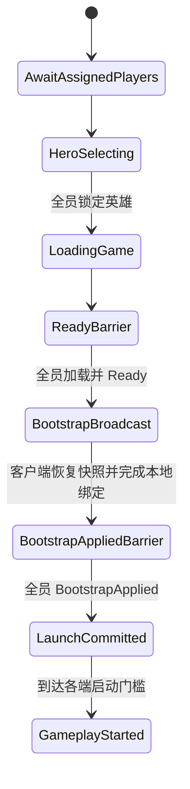

# 大厅槽位与开局配置

## 目标实现

锁定玩家、英雄和地图后形成各端一致的开局配置。

## 技术方案

LobbySessionFlowNetwork 和 LobbyNetworkBridge 管理玩家槽位与屏障；GameStartConfig 固定 PlayerSlotConfig 列表。英雄可重复选择，正 HeroConfigId 由内容闭包校验。

## 边界情况

断线、重复 Ready、人数不一致、内容或版本不一致必须有明确失败状态；大厅消息不进入 GameplayCommand。

## 验收条件

- 正常路径达到上述目标，并由所属模块唯一拥有权威状态。
- 以上边界情况有明确返回、拒绝或可见失败；不得用占位成功代替行为。
- 确定性逻辑比较重复执行、改变插入顺序以及捕获/恢复/重演结果；只读界面不得改变 Gameplay。

## 工程实际核查

本期检索的是当前源码和测试定义。存在实现不等于完成全部需求，存在测试不等于本期已运行通过。

- `Assets/Scripts/Bootstrap/ApplicationFlow.cs`：当前关联实现定义 ClientApplicationState、DedicatedServerApplicationState、LobbyPlayerSlotState、ClientAccountSession、LobbySelectionSnapshot（以源码为实际命名）。
- `Assets/Scripts/Bootstrap/LobbyNetworkBridge.cs`：当前关联实现定义 LocalLobbySlotDefinition、LobbyNetworkBridge、LobbyIdentity、LobbyWireCodec（以源码为实际命名）。
- `Assets/Scripts/FrameSync/ApplicationFlowContracts.cs`：当前关联实现定义 PlayerSlotConfig、GameStartConfig、FrameSyncVersionHandshake、PlayerSlotUnitMapping、GameBootstrapPayload（以源码为实际命名）。

### 已有测试位置

- `Assets/Scripts/Bootstrap/Tests/EditMode/ApplicationFlowTests.cs`：TestAccount_CommandLineOverridesPersistedIdentity、Lobby_RequiresEveryAssignedPlayerAtFullReadyBarrier、VersionHandshake_RejectsAnyCriticalMismatch、ClientFlow_ReachesLobbyOnlyAfterNgoConnects、ClientConnectionLifecycle_HasExactlyOneOwnerPerFlowMode、ClientFlow_CancelWaitingAssignment_DeletesTicketAndReturnsMain、ClientFlow_CancelWhileTicketCreationIsPending_DeletesLateTicket。
- `Assets/Scripts/Bootstrap/Tests/EditMode/BootstrapPayloadWireCodecTests.cs`：Payload_RoundTrip_IsCanonical、Payload_TrailingBytes_AreRejected。
- `Assets/Scripts/Bootstrap/Tests/EditMode/FrameworkSmokeBootstrapTests.cs`：Bootstrap_BakesAssetsSpawnsUnitAndBoundsCatchUpTicks、Bootstrap_BindsSelectedHeroPrototypeToPlayerSpawn。
- `Assets/Scripts/Bootstrap/Tests/EditMode/MatchLaunchProtocolTests.cs`：Messages_RoundTripCanonically、Barrier_CompletesOnceAfterEveryFrozenClient、Barrier_RejectsWrongMatchOrUnknownClient。
- `Assets/Scripts/Bootstrap/Tests/PlayMode/GameBootstrapPlayModeTests.cs`：ClientComposition_InitializesFromProjectAssets、DestroyDuringContentLoad_ReleasesTransferredScope、ExternalFlow_PrimesLoadingBeforeContentInitialization、GenericSkillIndicators_BindDedicatedRuntimeMaterials、GenericSkillIndicators_RebindBeforeLeaseRelease_ReplacesOwnedInstances。

## 附录：精确接口、公式与配置

附录保留本功能必须精确表达的接口、运算和配置语义，原系统章节已拆到所属功能。若与上面的已接受修订仍有冲突，进入待确认清单而不是按旧版本执行。

### 定位

`LobbySessionFlowNetwork` 管理 Matchmaking 已分配玩家进入 Dedicated Server 后的大厅阶段。

它不负责寻找玩家，也不负责战斗内帧同步。

### 玩家槽位状态

```text
LobbyPlayerSlotState
    Assigned
    Connected
    IdentityVerified
    HeroSelected
    HeroLocked
    GameplaySceneLoaded
    Ready
```

每个 Matchmaking 分配玩家都必须绑定到唯一 `PlayerSlot`。

### 大厅状态机



### 开局条件

不能只判断当前连接人数。

必须同时满足：

```text
AssignedPlayerCount == GameStartPlayerCount

每个 Assigned Player：
    已连接
    身份验证成功
    已锁定英雄
    已加载 Gameplay Scene
    已提交 Ready
```

然后服务端选择未来逻辑帧：

```text
StartTick = ServerTick + StartLeadTicks
```

并广播统一启动数据。`StartTick` 只定义首个 Gameplay Tick，不直接授权任何端开始模拟。

### `GameBootstrapPayload`

```text
GameBootstrapPayload
    GameStartConfig
    GameplayDataVersion
    MapDataVersion
    GlobalPrefabTableVersion
    InitialGameplaySnapshot
    InitialSnapshotTick
    StartTick
    InitialRandomSeed
    PlayerSlotMappings
```

`GameBootstrapPayload` 只负责冻结开局配置、初始快照和控制权映射，不携带任何开局
时间戳。Bootstrap wire version 为 3，旧 wire v2 包必须拒绝，禁止通过保留的 UTC
字段形成第二个启动授权入口。

客户端恢复快照并完成本地受控单位绑定后发送：

```text
BootstrapAppliedConfirmation
    MatchId
    StartTick
```

服务端只接受冻结 `PlayerSlots` 中的 `ControllerClientId`，按 PlayerSlot 顺序维护确认
屏障。相同客户端对相同 MatchId/StartTick 的重复确认幂等；错误比赛、错误 StartTick
或未知客户端必须显式失败。

全员确认后，服务端才计算并广播：

```text
MatchLaunchCommit
    MatchId
    StartTick
    LaunchServerTimeMilliseconds =
        SynchronizedServerTimeMilliseconds + LaunchDelayMilliseconds
```

服务端和客户端都在 NGO 同步服务端时间域到达阈值时获得启动资格。客户端可在该时刻前
`MaxPredictionLeadTicks - 1` 个 Tick 开始预测，因此其实际等待时间自然等于
`LaunchDelayMilliseconds - 消息传输耗时 - 提前预测时长`。端点越过阈值后以本机
单调毫秒时钟建立 pacing 原点；客户端同时受权威预测窗口、单调启动上限和连续收到的
AuthorityFrame 积压约束。消息晚到本身不得推导历史积压，也不得依赖本机日历 UTC。

语义：

```text
InitialSnapshotTick
    恢复初始快照后，下一次应执行的逻辑 Tick。

StartTick
    本局客户端和服务端第一次共同推进的逻辑 Tick。
```

通常：

```text
InitialSnapshotTick == StartTick
```

GoldIncomeRuntime 统一初始化为：

```text
ConfirmedEarnedGoldTotal[player] =
    GameModeConfig.InitialEarnedGold

ConfirmedIncomeThroughTick =
    StartTick - 1
```

不需要额外金币种子、余额快照或累计收入状态同步。

### 不属于 GameplayCommand 的大厅消息

```text
选择英雄
锁定英雄
场景加载完成
大厅 Ready
BootstrapApplied
LaunchCommit
```

这些使用大厅网络消息，不进入玩家 GameplayCommand。

---

### 单一游戏开始人数

只保留：

```text
GameStartPlayerCount
```

合法范围：

```text
1～10
```

含义：

```text
设置为 1：一名分配玩家完成大厅条件即可开局。
设置为 10：十名分配玩家全部完成大厅条件才可开局。
```

不使用：

```text
MaxHumanPlayers
MinHumanPlayersForTest
```

### `PlayerSlotConfig`

```text
PlayerSlotConfig
    PlayerSlot
    AccountId
    ControllerClientId
    TeamId
    HeroConfigId
    SpawnPointId
```

不增加 `InputAuthority` 字段。

```text
ControllerClientId
```

已经表达“哪个客户端可以为该玩家控制单位提交 GameplayCommand”。

服务端命令入口检查：

```text
Command.ClientId == PlayerSlotConfig.ControllerClientId
Command.ControlledUnitUid == 当前 PlayerSlot 绑定单位
```

### `GameStartConfig`

```text
GameStartConfig
    MatchId
    GameModeId
    MapConfigId
    GameStartPlayerCount
    TeamCount
    PlayerSlots[]
    StartTick
    InitialRandomSeed
    GameplayDataVersion
```

`PlayerSlots.Length` 必须等于 `GameStartPlayerCount`。

### 匹配人数一致性

同一局的以下配置必须一致：

```text
UOS Matchmaking 队列或规则人数
GameStartPlayerCount
GameStartConfig.PlayerSlots 数量
大厅开局检查
队伍和出生点分配
```

测试 1～10 人时，应选择与当前 `GameStartPlayerCount` 对应的测试匹配配置。

---


## 需求演进

### 2026-10-02

变动内容：英雄列表按目录驱动，正 HeroConfigId 可重复选择，由最终内容闭包验证。

legacyDecision：D-028

### 2026-10-02

变动内容：英雄出生槽位从大厅锁定选择绑定，不依赖场景对象顺序。

legacyDecision：D-046

