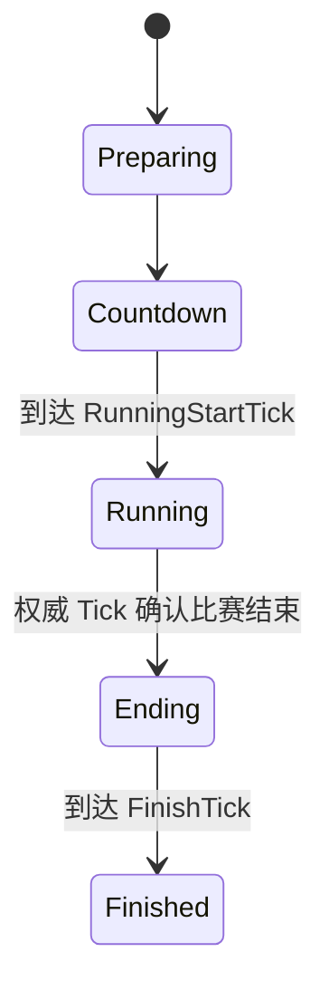

# 比赛结束与全端统计

## 目标实现

基地毁灭形成一致结果，客户端等待对应权威帧后展示结算。

## 技术方案

MatchRuleRuntime 管理阶段与预测结束候选；MatchStatisticsRuntime 在所有模拟端消费 FormalDeathResult。

## 边界情况

预测结果不先落为最终结果；统计不只在 Dedicated Server 执行；账户持久化不反写 Gameplay。

## 验收条件

- 正常路径达到上述目标，并由所属模块唯一拥有权威状态。
- 以上边界情况有明确返回、拒绝或可见失败；不得用占位成功代替行为。
- 确定性逻辑比较重复执行、改变插入顺序以及捕获/恢复/重演结果；只读界面不得改变 Gameplay。

## 工程实际核查

本期检索的是当前源码和测试定义。存在实现不等于完成全部需求，存在测试不等于本期已运行通过。

- `Assets/Scripts/FrameSync/ApplicationFlowContracts.cs`：当前关联实现定义 PlayerSlotConfig、GameStartConfig、FrameSyncVersionHandshake、PlayerSlotUnitMapping、GameBootstrapPayload（以源码为实际命名）。
- `Assets/Scripts/FrameSync/MatchRuleRuntime.cs`：当前关联实现定义 MatchPhase、MatchEndReason、MatchTopologyRole、MatchStatisticsEntry、MatchStatisticsRuntimeSnapshot（以源码为实际命名）。

### 已有测试位置

- `Assets/Scripts/Bootstrap/Tests/EditMode/ApplicationFlowTests.cs`：TestAccount_CommandLineOverridesPersistedIdentity、Lobby_RequiresEveryAssignedPlayerAtFullReadyBarrier、VersionHandshake_RejectsAnyCriticalMismatch、ClientFlow_ReachesLobbyOnlyAfterNgoConnects、ClientConnectionLifecycle_HasExactlyOneOwnerPerFlowMode、ClientFlow_CancelWaitingAssignment_DeletesTicketAndReturnsMain、ClientFlow_CancelWhileTicketCreationIsPending_DeletesLateTicket。
- `Assets/Scripts/FrameSync/Tests/LocalCommandGoldMatchFlowTests.cs`：FutureCommand_IsRetainedAndConsumedOnlyAtTargetTick、CastIntentAndAction_PreserveCommitVerbAndDirectionAim、PlanCastIntent_UsesAbilityCastRange_NotHardcoded、NaturalGold_IsTickDerivedCanonicalAndInsideOpenBatch、ClientPredictionCannotEnterEnding_ButServerAuthorityCan。
- `Assets/Scripts/FrameSync/Tests/MatchFlowStateMachineTests.cs`：MatchFlow_InitialState_Preparing、MatchFlow_AfterCountdown_TransitionsToRunning、MatchFlow_CommandsGatedDuringCountdown、MatchResultSnapshot_DefaultIsEmpty、MatchResultSnapshot_StoresResult、MatchFlow_AcceptsCommands_OnlyRunningOrEnding。
- `Assets/Scripts/FrameSync/Tests/MatchGoldRewardTests.cs`：GoldAllocation_UsesIntegerAmountContract、MinionLastHit_ConfirmsFullConfiguredGold、MonsterLastHit_UsesAuthoredCreepScoreValue、HeroKill_WithTwoAssistants_Splits300As180_60_60、HeroKill_WithoutAssistants_ConfirmsFull300ToKiller。
- `Assets/Scripts/FrameSync/Tests/MatchRewardDistanceTests.cs`：MinionExperienceRadius_UsesStatToLogicDistanceScale。

## 附录：精确接口、公式与配置

附录保留本功能必须精确表达的接口、运算和配置语义，原系统章节已拆到所属功能。若与上面的已接受修订仍有冲突，进入待确认清单而不是按旧版本执行。

### 定位

`MatchRuleRuntime` 负责：

```text
比赛阶段
RunningStartTick
基地死亡结果判断
GameOverTick
FinishTick
WinningTeamId
EndReason
MatchResultState 构建
比赛统计
```

客户端预测阶段不提交比赛结束；服务端权威 Tick 和客户端权威重演可以提交相同结果。

### 比赛阶段



### 基地规则

地图初始化时注册：

```text
BlueBaseUnitUid
RedBaseUnitUid
```

CombatSystem 正式确认基地死亡时生成：

```text
TeamBaseDestroyedSignal
    BaseUnitUid
    OwnerTeamId
    DestroyedTick
    Sequence
```

服务端在 Tick 末统一判断：

```text
仅蓝方基地死亡 -> 红方胜利
仅红方基地死亡 -> 蓝方胜利
双方同 Tick 死亡 -> Draw
```

### 客户端预测结束候选

客户端预测 Tick `T` 完整执行并完成 Combat Reaction 后，若基地最终 `LifeState == Dead`：

```text
PredictedMatchEndCandidateTick = T
添加 MatchEndCandidate 暂停
```

不能在 `HP <= 0` 或 `Dying` 时提前暂停。

客户端预测阶段不写入：

```text
WinningTeamId
GameOverTick
MatchPhase.Ending
```

### 对应权威帧到达

当连续权威帧到达 Tick `T` 后，客户端使用权威 Command 重演 Tick `T`。

#### 权威重演后未结束

```text
清除 PredictedMatchEndCandidateTick。
解除 MatchEndCandidate 暂停。
继续预测并重演暂停期间缓存的 Command。
```

#### 权威重演后确实结束

客户端在权威 Tick 重演完成后显式调用：

```text
MatchRuleRuntime.EvaluateAuthorityConfirmedTick(
    tick = T,
    unitWorld
)
```

该入口只能在 `LatestAuthorityFrameTick >= T` 时调用，不允许预测 Tick 调用。

```text
权威计算并写入 MatchRuleRuntime 的 Ending 状态。
GameOverTick = T。
LocalSimulationTick 停在 T + 1。
丢弃 T 之后的预测历史。
不再恢复 Gameplay 预测。
```

AuthorityFrame 对该 Tick 的命令确认，构成客户端停止 Gameplay 推进所需的权威确认。

### `MatchResultState`

服务端在 `AuthorityFrame(GameOverTick)` 构建完成后可靠发送：

```text
MatchResultState
    MatchId
    ResultRevision
    GameOverTick
    WinningTeamId
    EndReason
```

客户端可在权威重演确认结束后进入 Ending 并播放服务端已确认的结束表现；Result 页面和最终结果数据以 `MatchResultState` 为准。

若 `MatchResultState` 先到达而对应 AuthorityFrame 尚未连续补齐，则缓存结果并发起 AuthorityRecovery。

若客户端权威重演结果与 `MatchResultState` 不一致，视为程序 Bug 或配置不一致，记录诊断并终止客户端对局。

### Snapshot

```text
MatchRuleRuntimeSnapshot
    CurrentPhase
    PhaseEnterTick
    RunningStartTick
    BlueBaseUnitUid
    RedBaseUnitUid
    GameOverTick
    FinishTick
    WinningTeamId
    EndReason
    MatchStatisticsRuntimeSnapshot
```

`PredictedMatchEndCandidateTick` 属于 PredictionRollbackCoordinator 的本地控制状态，不进入 GameplaySnapshot。

---

### 四、`MatchRuleRuntimeSnapshot`

```text
CurrentPhase
PhaseEnterTick
RunningStartTick
BlueBaseUnitUid
RedBaseUnitUid
GameOverTick
FinishTick
WinningTeamId
EndReason
MatchStatisticsRuntimeSnapshot
```

客户端预测阶段不会提交结束状态。客户端只在候选 Tick 的 AuthorityFrame 权威重演确认结束后写入 Ending 状态。

---

### 十五、预测结束候选

```text
PredictedMatchEndCandidateTick
```

属于客户端 PredictionRollbackCoordinator，不进入 GameplaySnapshot。

规则：

```text
预测 Tick T 完整结算后基地正式 Dead
    -> 暂停预测。

连续 AuthorityFrame 到达 T 并权威重演：
    基地未死 -> 清除候选，恢复预测。
    基地确实死亡 -> MatchRuleRuntime 进入 Ending，
                     LocalSimulationTick 停在 T + 1。
```

最终 Result 数据以服务端 `MatchResultState` 为准。

---


## 需求演进

### 2026-10-02

变动内容：全模拟端消费正式死亡统计，不只服务器。

legacyDecision：D-013

