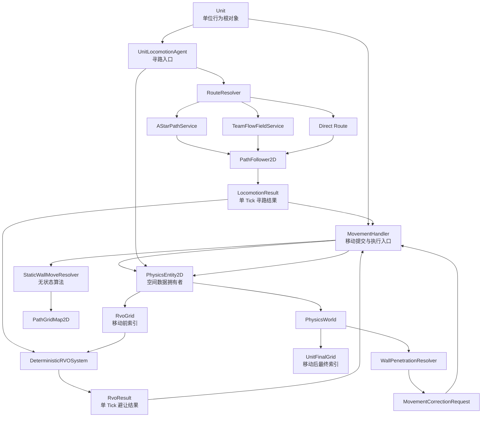
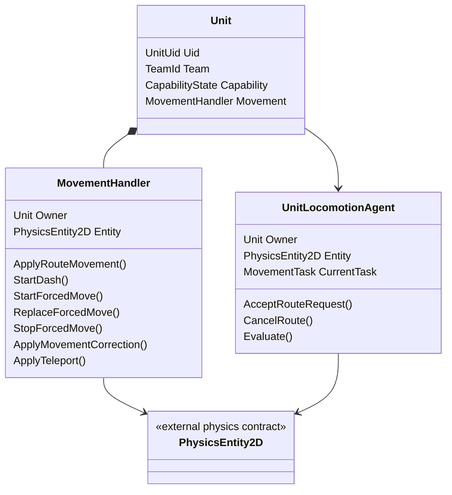

# 移动职责与提交接口

## 本功能范围

本案细化“普通移动冲刺与强制位移”中的移动职责与提交接口，仅覆盖下列明确接口与边界。

## 目标实现

普通路线、Dash、控制位移与传送均由统一移动入口提交空间。

## 技术方案

MovementHandler 依正式优先级执行 Route、Dash 和 ResolvedForcedMove；ForcedMove 胜者仅由控制系统选出。

## 边界情况

死亡清理移动任务；仲裁决定占用而不让技能控制直接写 Transform；墙体约束与异常挤出分开。

## 验收条件

- 正常路径达到上述目标，并由所属模块唯一拥有权威状态。
- 以上边界情况有明确返回、拒绝或可见失败；不得用占位成功代替行为。
- 确定性逻辑比较重复执行、改变插入顺序以及捕获/恢复/重演结果；只读界面不得改变 Gameplay。

## 工程实际核查

实现证据与已有测试位置关联总案；字段存在不能认定行为已验收。

## 附录：精确接口、公式与配置

附录保留本功能必须精确表达的接口、运算和配置语义，原系统章节已拆到所属功能。若与上面的已接受修订仍有冲突，进入待确认清单而不是按旧版本执行。

### 平级关系

单位侧常见结构：

```text
UnitPrefabRoot
    Unit
    MovementHandler
    UnitLocomotionAgent
    PhysicsEntity2D
```

四者都是单位对象上的独立组件或服务引用，不形成“`PhysicsEntity2D` 属于 `UnitLocomotionAgent`”的所有权关系。

---

### 职责边界

```text
MovementHandler
    单位侧所有位移执行的统一业务入口。

UnitLocomotionAgent
    负责移动任务、路线解析、RVO 接入、速度推进和移动结果计算。

PhysicsEntity2D
    保存空间结果，
    提供统一空间写入接口，
    更新 Bounds，
    标记表现姿态待同步。
```

物理系统不规定 `MovementHandler` 与 `UnitLocomotionAgent` 的内部任务、仲裁和状态机。  
它只要求最终空间结果通过 `PhysicsEntity2D` 的公开接口写入。

---

### 位置和朝向写入

示意链路：

```text
主动移动 / Dash / 强制位移
    -> MovementHandler
    -> UnitLocomotionAgent
    -> PhysicsEntity2D.SetLogicPose / SetLogicPosition
```

示意伪代码：

```pseudo
function CommitComputedUnitMotion(entity, nextPosition, nextForward):
    entity.SetLogicPose(
        nextPosition,
        nextForward
    )
```

`UnitLocomotionAgent` 可以把以下属性作为便捷只读视图暴露给移动系统：

```pseudo
function GetLogicPosition2D():
    return PhysicsEntity.Transform2D.Position

function GetFacing2D():
    return PhysicsEntity.Transform2D.Forward
```

但不再自己保存第二份：

```text
LogicPosition2D
Facing2D
Shape
Radius
Bounds
```

---

### 墙体修正接缝

`WallPenetrationResolver` 只计算修正量，不越过单位侧移动入口直接修改单位空间状态。

推荐物理侧调用：

```text
unit.MovementHandler.ApplyMovementCorrection(
    correctionDelta,
    WallDepenetration
)
```

单位侧如何把修正转交给 `UnitLocomotionAgent`，由单位框架与移动系统决定。  
最终仍应落到：

```text
PhysicsEntity2D.ApplyLogicPositionDelta(...)
```

物理设计案不再冻结 `MovementHandler` 内部方法名；只冻结“单位空间修正必须走单位侧公开移动入口”。

---

### 单位形状

单位第一版统一使用圆形：

```text
PhysicsEntity2D.Shape.Kind = Circle
PhysicsEntity2D.Shape.Radius = PathAgentShape.RadiusFP
```

`PathAgentShape` 仍是移动半径和单位通行语义的来源。  
`PhysicsEntity2D` 保存当前运行时形状参数，供空间查询统一使用。

推荐规则：

```text
第一版：移动半径 == 受击半径 == 单位 Physics Circle Radius
```

后续如果拆分移动半径和受击半径，需要同时更新寻路、移动和命中查询语义。

### 核心架构



---

### 职责一句话版

| 模块 | 最终职责 |
|---|---|
| `Unit` | 身份、阵营、能力状态、Intent、Action、Handler 聚合。 |
| `PhysicsEntity2D` | 物理系统正式定义的 Unity `MonoBehaviour` 逻辑空间组件；本文只读取并调用其公开 API。 |
| `UnitLocomotionAgent` | 接收寻路请求，拥有路线任务、路径和游标，每 Tick 输出 `LocomotionResult`。 |
| `MovementHandler` | 消费单 Tick 移动结果，执行普通移动、Dash、强制位移、传送和修正，并提交空间状态。 |
| `PathGridMap2D` | 静态旋转网格、坐标转换、半径通行层。 |
| `AStarPathService` | 确定性点到点寻路。 |
| `TeamFlowFieldService` | 离线队伍级静态流场。 |
| `PathFollower2D` | 在 `UnitLocomotionAgent` 内维护路径跟随、偏离检测和到达判断。 |
| `PhysicsWorld` | 管理空间实体注册和移动系统需要的空间索引，不直接写单位位置。 |
| `RvoGrid` | 使用移动前位置提供 RVO 邻居候选。 |
| `UnitFinalGrid` | 使用移动完成后的最终位置提供后续空间查询。 |
| `DeterministicRVOSystem` | 根据所有单位当前 Tick 的期望速度输出避让结果，不写位置。 |
| `WallPenetrationResolver` | 检测异常穿墙并生成修正请求，不写位置。 |
| `CrowdControlHandler` | 决定唯一生效的强制位移控制实例并完成优先级仲裁。 |

---

### 运行时确定性要求

Gameplay Tick 禁止：

```text
float
Vector2 / Vector3
Mathf
Time.deltaTime
Unity Physics
把 Unity Transform 当作逻辑输入
不稳定容器遍历顺序
并行写单位移动结果
```

Gameplay Tick 使用：

```text
fp / fp2
SimulationTickContext
整数逻辑 Tick
固定顺序数组
稳定 UnitUid 排序
离线 Bake 数据
确定性几何算法
```

Inspector 与 Authoring 可以使用 `float / Vector2 / Vector3 / Transform`。  
进入 Gameplay 前转换成 `fp / fp2 / int / 稳定配置 ID`。

`SimulationTickContext` 是 Gameplay 当前 Tick 的统一只读全局上下文：

```text
SimulationTickContext
    static SimulationTickContext Current

    int Tick
    int DeltaTick
    ExecutionMode ExecutionMode
```

```text
ExecutionMode
    ServerAuthority
    ClientPrediction
    ClientReplay
```

接入规则：

```text
顶层 Gameplay Tick 驱动器：
    每 Tick 开始时设置 SimulationTickContext.Current。
    每 Tick 结束时清理或切换 Current。
    只有顶层 Tick 驱动器可以写入 Current。

其它 Gameplay 系统：
    只能在函数内部读取 SimulationTickContext.Current。
    不把 SimulationTickContext 作为方法参数逐层传递。
    不自行缓存第二份 Tick、DeltaTick 或 ExecutionMode。
```

统一读取写法：

```text
SimulationTickContext.Current.Tick
SimulationTickContext.Current.DeltaTick
SimulationTickContext.Current.ExecutionMode
```

统一命名要求：

```text
类型名：SimulationTickContext
当前上下文入口：SimulationTickContext.Current
逻辑帧：SimulationTickContext.Current.Tick
步长：SimulationTickContext.Current.DeltaTick
执行模式：SimulationTickContext.Current.ExecutionMode
```

禁止使用并行命名：

```text
context
tickContext
LogicTickContext
GameplayTickContext
CurrentLogicTick
GlobalCurrentFrame
```

普通模拟、预测和重演均逐 Tick 执行，第一版要求 `DeltaTick = 1`。  
`ExecutionMode` 不得改变移动、寻路和 RVO 的 Gameplay 结果。

---

### 帧同步标记图例

| 标记 | 含义 |
|---|---|
| `【需要帧同步保存】` | 会跨 Tick 影响未来模拟，需要由帧同步设计纳入对应权威系统状态。 |
| `【可确定性重建】` | 恢复权威状态后可以确定性重建。 |
| `【静态配置】` | 离线或初始化后只读，不进入运行时快照。 |
| `【查询引用】` | 指向其它权威对象，不在本模块复制状态。 |
| `【单 Tick 临时】` | Tick 内产生并消费，不跨 Tick。 |

本文只标记需求，不定义顶层 `GameplaySnapshot`、聚合树或序列化协议。

原则：

```text
空间数据只在 PhysicsEntity2D 空间状态中保存一次。
路线和路径游标只在 UnitLocomotionAgent 对应状态中保存一次。
Dash 与强制位移轨迹只在 MovementHandler 对应状态中保存一次。
RvoGrid、UnitFinalGrid、Bounds、A* 临时搜索状态均可重建。
```

---

### 对象关系



推荐装配：

```text
Unit GameObject
    Unit
    PhysicsEntity2D
    UnitLocomotionAgent

Unit 内部 Handler 集合
    MovementHandler
```

`MovementHandler` 可以是 `Unit` 内部普通 C# Handler。  
`UnitLocomotionAgent` 与 `Unit` 大致平级，由单位装配器显式绑定。  
二者通过单 Tick 数据结果协作，不互相保存对方的运行状态。

---

### `MovementHandler`：移动提交与执行入口

`MovementHandler` 负责：

```text
接收当前 Tick 的 LocomotionResult 和 RvoResult
执行普通路线移动
执行 Dash
执行 CrowdControlHandler 已批准的强制位移
执行传送
执行静态墙体约束
应用 PhysicsWorld 返回的位置修正
计算最终位置与朝向
调用 PhysicsEntity2D 应用空间变化
发布移动执行结果
```

`MovementHandler` 不负责：

```text
保存 A* 路径
保存 PathCursor
选择 A* / FlowField / Direct
判断是否偏离规划路线
追踪目标重寻路
RVO 邻居搜索和速度求解
比较强制位移控制优先级
判断控制免疫或控制叠加
墙体穿透几何检测
```

`MovementHandler` 只消费当前 Tick 的寻路结果，不持有完整路径或路线恢复策略。

---

### `UnitLocomotionAgent`：寻路入口

`UnitLocomotionAgent` 负责：

```text
接收普通寻路请求
维护 MovementTask
根据 MovePurpose 选择 Direct / AStar / FlowField
调用 AStarPathService
读取 TeamFlowFieldService
维护 PathFollower2D
每 Tick 读取 PhysicsEntity2D 当前空间数据
推进路径游标
判断当前位置是否偏离规划路线
判断是否到达目标
处理追踪目标重寻路
输出当前 Tick 的 LocomotionResult
```

它不负责：

```text
写 Position / PrevPosition / Forward
把完整路径传给 MovementHandler
执行 Dash 或强制位移
应用 RVO 后速度
处理移动执行优先级
提交最终位移
```

路径、游标、目标追踪和 `NeedRepath` 都留在 `UnitLocomotionAgent` 内部。

---

### 空间读取与写入规则

`PhysicsEntity2D` 持有单位空间数据，其正式结构和 API 由物理与范围查询系统定义。  
本系统只依赖其公开的只读空间信息和正式写入接口。

读取关系：

```text
UnitLocomotionAgent：
    读取 Position / Forward / Shape / Radius / RadiusClass，
    用于寻路、路径跟随、偏离检测与到达判断。

DeterministicRVOSystem：
    读取 Position / Bounds / Radius，
    用于邻居查询和速度避让。

MovementHandler：
    读取 Position / Forward / Shape，
    计算本 Tick 最终姿态。
```

单位侧所有 Gameplay 空间变化必须先进入 `MovementHandler`，再由它调用正式物理 API：

```text
普通移动、Dash、强制位移：
    PhysicsEntity2D.SetLogicPose(...)

墙体挤出或轻量位置修正：
    PhysicsEntity2D.ApplyLogicPositionDelta(...)

传送：
    PhysicsEntity2D.TeleportLogicPosition(...)
    必要时再调用 PhysicsEntity2D.SetLogicForward(...)
```

禁止直接修改 `PhysicsEntity2D` 内部空间字段：

```text
Unit
UnitLocomotionAgent
PhysicsWorld
DeterministicRVOSystem
AbilityHandler
BuffHandler
CrowdControlHandler
PathFollower2D
表现层
```

外部模块需要改变单位位置时，只能调用：

```text
MovementHandler.ApplyMovementCorrection(...)
MovementHandler.ApplyTeleport(...)
MovementHandler.StartDash(...)
CrowdControlHandler.OnAdd
    -> MovementHandler.StartForcedMove(...)
```

`MovementHandler` 是单位移动的业务提交入口；  
`PhysicsEntity2D` 是正式空间状态与空间写入 API 的提供者。

### 核心接口

#### `UnitLocomotionAgent`

```text
UnitLocomotionAgent
    MoveAcceptResult AcceptRouteRequest(RouteMoveRequest request)
    void CancelRoute(MoveCancelReason reason)
    LocomotionResult Evaluate()
```

#### `MovementHandler`

```text
MovementHandler
    void ApplyRouteMovement(
        in LocomotionResult locomotion,
        in RvoResult rvo
    )

    MoveAcceptResult StartDash(in DashRequest request)
    void StartForcedMove(in ResolvedForcedMove request)
    void ReplaceForcedMove(in ResolvedForcedMove request)
    void StopForcedMove(CrowdControlHandle sourceHandle)
    void AdvanceSpecialMovement()

    void ApplyMovementCorrection(
        fp2 delta,
        MovementCorrectionReason reason
    )

    void ApplyTeleport(
        fp2 position,
        fp2 forward,
        TeleportReason reason
    )
```

上述函数需要 Tick、`DeltaTick` 或执行模式时，在函数内部读取：

```text
SimulationTickContext.Current
```

`LocomotionResult` 是当前 Tick 的值对象。  
`MovementHandler` 不缓存路径，不把 `LocomotionResult` 当作跨 Tick 状态保存。

接口不因为帧同步而增加 Tick 参数。需要当前逻辑帧的实现函数在内部读取：

```pseudo
tick = SimulationTickContext.Current.Tick
deltaTick = SimulationTickContext.Current.DeltaTick
executionMode = SimulationTickContext.Current.ExecutionMode
```

---

### 移动执行优先级

第一版固定：

```text
Teleport / Correction
    一次性提交，不作为持续模式。

ForcedMove
    当前存在有效 ForcedMoveRuntime 时执行。

Dash
    当前存在有效 DashRuntime 时执行。

RouteMove
    当前 Tick 存在有效 LocomotionResult 时执行。

Idle
```

派生模式：

```pseudo
function ResolveMovementMode(locomotionResult):
    if ForcedMoveRuntime.IsActive:
        return ForcedMove

    if DashRuntime.IsActive:
        return Dash

    if locomotionResult.HasMovement:
        return RouteMove

    return Idle
```

`MovementMode` 是当前状态的派生结果，不作为独立跨 Tick 权威状态。

强制位移是否生效不由本优先级函数仲裁。  
它已经由 `CrowdControlHandler` 在控制实例 `OnAdd / Replace / OnRemove` 阶段裁决完成。

---

### 帧同步定位

| 数据 | 标记 |
|---|---|
| 单位空间状态 | `PhysicsEntity2D`：`【需要由物理回滚服务恢复】` |
| 当前寻路任务、A* 路径、PathCursor、重寻路计时 | `UnitLocomotionAgent`：`【需要帧同步保存】` |
| Dash 与强制位移轨迹执行状态 | `MovementHandler`：`【需要帧同步保存】` |
| `MovementMode` | `【可确定性重建】` |
| `LocomotionResult / RvoResult` | `【单 Tick 临时】` |
| `Bounds` | `【可确定性重建】` |

### 新生单位生成 Tick 的执行边界

新生单位在生成 Tick 已完成注册，并继续执行各 Handler 的 Tick。  
这样 Buff、控制、数值、冷却和其它被动运行状态可以按照统一 Tick 管线正常推进。

主动 Gameplay 是否允许执行，统一读取单位框架提供的派生查询：

```csharp
public bool CanRunActiveGameplayThisTick =>
    SimulationTickContext.Current.Tick
    > UnitUid.SpawnLogicTick;
```

本系统不得另外保存：

```text
FirstActiveLogicTick
FirstMovementTick
SpawnMovementEnabled
```

生成 Tick 的移动规则：

```text
UnitLocomotionAgent：
    仍可被移动管线调用，但当 CanRunActiveGameplayThisTick == false 时，
    不推进普通主动寻路任务，不重寻路，不输出 RouteMove。

MovementHandler：
    仍执行本 Tick 的 Handler 逻辑。
    已经由 CrowdControlHandler 裁决并在本 Tick 生效的外部强制位移正常推进。
    墙体修正、传送和生命周期空间初始化仍可正常提交。
    普通 RouteMove 与主动 Dash 不执行。

CrowdControlHandler：
    生成 Tick 可以接收控制、推进被动控制状态，
    并在控制实例 OnAdd 时通知 MovementHandler 启动强制位移。
```

强制位移能否在生成 Tick 产生首段位移，取决于它是否在本 Tick 的 `MovementHandler.Advance()` 之前生效：

```text
在移动执行阶段之前生效：
    本 Tick 正常推进强制位移。

在移动执行阶段之后生效：
    从下一 Tick 的 MovementHandler.Advance() 开始推进。
```

这不是移动系统的特殊延迟规则，而是统一 Tick 阶段顺序的自然结果。

帧同步标记：

```text
CanRunActiveGameplayThisTick
    【可确定性推导】
    不进入快照。

生成 Tick 的 Handler Tick 调度
    【由 UnitWorld / 单位框架 Tick Pipeline 冻结】
    移动系统不维护第二套调度状态。
```

---


## 需求演进

### 2026-08-06

变动内容：控制配置采用唯一 Definition、模块表和参数布局，不引入额外分类层。

legacyDecision：D-036

### 2026-08-22

变动内容：结构化仲裁和固定 Main/Base Runtime；覆盖旧申请列表/执行器所有权。

legacyDecision：D-047

