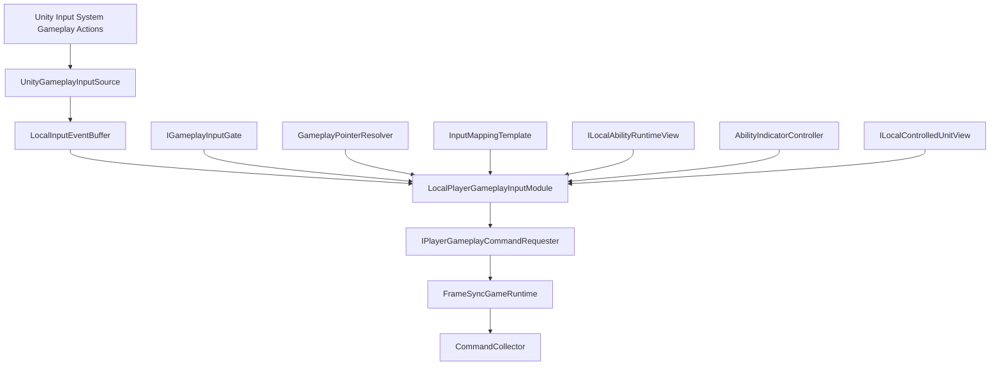

# 设备事件缓冲与 UI 门禁

## 目标实现

本地按键和鼠标进入有序事件缓冲，不直接修改 Gameplay。

## 技术方案

PlayerInputController 显式订阅 InputAction，回调记录本地事件；GameplayInputGate 处理 ActionMap、UI 指针阻断和受控单位变化。

## 边界情况

回放不再读设备；同帧顺序、缓冲上限、禁用时清理和松键行为明确；UI 使用 Unity Input System UI 整合。

## 验收条件

- 正常路径达到上述目标，并由所属模块唯一拥有权威状态。
- 以上边界情况有明确返回、拒绝或可见失败；不得用占位成功代替行为。
- 确定性逻辑比较重复执行、改变插入顺序以及捕获/恢复/重演结果；只读界面不得改变 Gameplay。

## 工程实际核查

本期检索的是当前源码和测试定义。存在实现不等于完成全部需求，存在测试不等于本期已运行通过。

- `Assets/Scripts/PlayerInput/GameplayInputGate.cs`：当前关联实现定义 IGameplayInputGate、GameplayInputGate（以源码为实际命名）。
- `Assets/Scripts/PlayerInput/PlayerInputController.cs`：当前关联实现定义 PlayerInputController（以源码为实际命名）。

### 已有测试位置

- `Assets/Scripts/Bootstrap/Tests/PlayMode/PlayerInputSimulationPlayModeTests.cs`：HoldReleaseDefault_RightClickMoveThenLeftClickCommitsOnce、UiPointerBlocking_SimulatedClicks_ProduceNoWorldCommands、LocalAimDefault_SimulatedPressAimOnly_LeftCommit_RightClosesAim、ToggleNoAim_SimulatedWPressCommitsImmediately、VarusWThenQ_PendingFocusKeepsIndicatorAndBothCommands。
- `Assets/Scripts/Bootstrap/Tests/PlayMode/ClientFrameworkSmokeSceneTests.cs`：ClientFixture_BindsAssignedUnitAndAdvances。
- `Assets/Scripts/Bootstrap/Tests/PlayMode/GameBootstrapPlayModeTests.cs`：ClientComposition_InitializesFromProjectAssets、DestroyDuringContentLoad_ReleasesTransferredScope、ExternalFlow_PrimesLoadingBeforeContentInitialization、GenericSkillIndicators_BindDedicatedRuntimeMaterials、GenericSkillIndicators_RebindBeforeLeaseRelease_ReplacesOwnedInstances。
- `Assets/Scripts/PlayerInput/Tests/PlayerCommandRequesterTests.cs`：EventBuffer_AssignsStableSequenceAndRejectsOverflow、HoldRelease_AllocatesFocusBeforeCommitAtSameTargetTick、ControlledUnitChange_ClearsLocalAbilityState、TargetTickResolver_UsesFormalLeadFormulaAndBuildTick、ShopRequests_UseCanonicalCommandsAndSharedSequence、SkillPointRequest_UsesCanonicalCommandAndSharedSequence、HoldReleaseDefault_PressFocus_ReleaseNoOp_LeftClickCommitsAndDedups。

## 附录：精确接口、公式与配置

附录保留本功能必须精确表达的接口、运算和配置语义，原系统章节已拆到所属功能。若与上面的已接受修订仍有冲突，进入待确认清单而不是按旧版本执行。

### 模块职责

玩家输入模块负责：

```text
监听 Unity Input System 的 Gameplay Action。
把按下、松开和鼠标点击转换为稳定的本地输入事件。
读取当前鼠标屏幕坐标。
把鼠标解析为地面 fp2 和候选 UnitUid。
解析右键移动或普通攻击。
处理 Q/W/E/R 技能槽输入。
读取由 CastModelDef / 技能数据离线校验的输入映射模板。
维护本地技能输入状态。
调用技能指示器。
把输入事件与映射模板分析为施法意图（Proposal）。
把施法意图交给单位 Planner / Arbiter 裁断；
通过后翻译为现有 AbilitySignal 语言并生成类型化 Command。
防止重复 Commit（重复左键、快速连按）产生重复 Command。
处理 UI、Application Flow 和受控单位变化造成的输入阻断。
```

它不负责：

```text
定义第二套 Ability 协议。
定义第二套网络 Command Schema。
直接创建最终 CanonicalCommandBytes。
分配最终 CommandSeq 或 TargetTick。
向网络发送数据。
执行 AbilityHandler。
计算蓄力时间、最大蓄力时间、伤害或射程。
判断目标 Tick 时技能一定能成功。
替 AI 设计技能决策层。
修改 Unit、AbilityRuntime、AttackHandler 或 Locomotion。
驱动普通 UI。
进入 GameplaySnapshot 或 SharedGameplayChecksum。
回滚时重新读取设备输入。
```

### 当前输入范围

```text
鼠标右键：
    普通状态下解析为 Attack 或 Move。
    尚未发送真实 Focus 的本地 Aim 中，取消本地 Aim。
    已发送 Focus 的技能中，不发送 Cancel；
    按普通规则继续解析 Attack 或 Move。

鼠标左键：
    当前存在可 Commit 的本地技能输入上下文时，
    默认生成 Commit。
    没有技能输入上下文时不生成 Gameplay Command。

Escape：
    本地 Aim 阶段关闭本地指示器。
    已启用的技能是否允许玩家 Cancel，
    由离线派生的输入模式决定。
    当前 HoldRelease 默认不允许玩家 Cancel。

Q / W / E / R：
    固定对应 AbilitySlot 0 / 1 / 2 / 3。
```

当前不加入：

```text
A 键攻击移动
S 键停止
H 键保持
强制攻击
多单位编队
宠物快捷键
智能施法
自动寻找最近目标
手柄和触屏
```

### UI 边界

UI 使用自己的 Unity Input System UI Action：

```text
Point
Click
RightClick
ScrollWheel
Navigate
Submit
Cancel
```

由：

```text
EventSystem
InputSystemUIInputModule
Lua / C# UI 页面
```

直接处理。

玩家输入模块：

```text
不转发 UI 输入。
不替 UI 生成 GameplayCommand。
只查询 UI 是否阻断 Gameplay 键盘或鼠标输入。
```

---

### 二、总体结构



### 核心对象

```text
LocalPlayerGameplayInputModule
    本模块组合根。
    按本地事件顺序处理输入。
    维护本地技能输入状态和提交去重。

UnityGameplayInputSource
    订阅 Unity InputAction。
    只写 LocalInputEventBuffer。

LocalInputEventBuffer
    保存本 Unity 帧内的按下、松开和鼠标事件。

GameplayPointerResolver
    把屏幕坐标解析为地面坐标和候选 UnitUid。

InputMappingTemplate
    每技能一份，由 CastModelDef / 技能数据离线校验。
    只描述物理输入如何翻译为现有技能信号。

ILocalAbilityRuntimeView
    只读观察当前受控单位的 AbilitySession 和阶段。
    不修改技能 Runtime。

AbilityIndicatorController
    显示本地 Aim 和 Gameplay Session 指示器。
    不执行技能。

IGameplayInputGate
    判断 UI 和应用流程是否阻断 Gameplay 输入。

IPlayerGameplayCommandRequester
    由 FrameSync Request 层实现。
```

### 玩家与 AI 的分流

```text
玩家：
Unity Input System
    -> 玩家输入模块
    -> CastAbilityCommand
    -> OrderTranslator
    -> AbilityAction
    -> AbilityHandler
    -> AbilitySignal

AI：
AIController
    -> AbilityAction
    -> AbilityHandler
    -> AbilitySignal
```

AI：

```text
不经过 Unity Input System。
不经过玩家输入模块。
不生成帧同步网络 Command。
不读取 InputMappingTemplate。
```

玩家和 AI 只在现有技能系统的：

```text
AbilityAction
AbilitySignal
AbilityRuntime
CastModelDef
```

语义上汇合。

---

### Action Map

```text
PlayerInputActions.inputactions
    Gameplay
    UI
```

`UI` Map 配置给 `InputSystemUIInputModule`。

`Gameplay` Map：

| Action | Type | Control Type | 默认绑定 |
|---|---|---|---|
| `PointerPosition` | Value | Vector2 | `<Pointer>/position` |
| `PrimaryClick` | Button | Button | `<Mouse>/leftButton` |
| `SecondaryClick` | Button | Button | `<Mouse>/rightButton` |
| `Cancel` | Button | Button | `<Keyboard>/escape` |
| `AbilityQ` | Button | Button | `<Keyboard>/q` |
| `AbilityW` | Button | Button | `<Keyboard>/w` |
| `AbilityE` | Button | Button | `<Keyboard>/e` |
| `AbilityR` | Button | Button | `<Keyboard>/r` |

### 技能键按下与松开都采集为事件

```text
AbilityQ / W / E / R performed
    -> AbilityKeyPressed

AbilityQ / W / E / R canceled
    -> AbilityKeyReleased
```

`AbilityKeyReleased` 是**原始输入事件**，不直接等于任何信号。它翻译
成什么由该技能的输入组合决定（见 §4.2）：

```text
本版本默认组合
    AbilityKeyReleased -> None（不 Commit、不 Cancel）

其它技能可以配置
    AbilityKeyReleased -> Commit
    AbilityKeyReleased -> Cancel（默认不启用）
```

禁止在输入层把某一事件硬编码为"永远无信号"或"永远等于某信号"；
每个事件到信号的映射都由该技能的映射模板确定（离线检查，不做
Bake；运行时只读取已校验配置）。

`PointerPosition` 不写事件队列，只用于：

```text
每帧更新指示器。
按钮事件发生时捕获 ScreenPositionAtEvent。
```

### 显式订阅

推荐使用：

```text
InputActionReference
或生成的强类型 InputAction Wrapper
```

禁止：

```text
SendMessage
BroadcastMessage
字符串方法名回调
运行时反射寻找 Action
```

`OnEnable` 订阅，`OnDisable` 取消订阅。

---

### 回调只写事件

InputAction 回调中禁止：

```text
访问 Gameplay Runtime。
执行 Raycast。
修改本地技能状态。
调用 Command Request。
```

回调只写 `LocalInputEventBuffer`。

在：

```text
LocalPlayerGameplayInputModule.LateUpdate()
```

中统一处理，使：

```text
UI 已经有机会处理本帧输入。
同 Unity 帧事件拥有明确顺序。
Command Request 只从一个入口生成。
```

### 事件结构

```csharp
public enum LocalGameplayInputEventKind : byte
{
    PrimaryClick,
    SecondaryClick,
    Cancel,
    AbilityKeyPressed,
    AbilityKeyReleased
}
```

```csharp
public struct LocalGameplayInputEvent
{
    public ulong LocalEventSequence;
    public LocalGameplayInputEventKind Kind;
    public AbilitySlot AbilitySlot;
    public Vector2 ScreenPositionAtEvent;
}
```

对于非技能键事件：

```text
AbilitySlot 写入规范默认值。
```

`LocalEventSequence`：

```text
只用于本地稳定处理顺序。
不进入 GameplayCommand。
不发送网络。
不进入快照。
```

### 同帧顺序

严格按：

```text
LocalEventSequence 升序
```

处理。

例如快速点击：

```text
Q performed
Q canceled
```

可在同一 Unity 帧中依次生成：

```text
Focus
Commit
```

Command Request 层按调用顺序分配 `CommandSeq`。

### 缓冲上限

建议：

```text
MaxLocalInputEventsPerUnityFrame = 64
```

溢出时：

```text
记录本地诊断。
丢弃新事件。
不产生不完整 Command。
```

它不是确定性 Gameplay 错误。

---

### 接口

```csharp
public interface IGameplayInputGate
{
    bool CanAcceptKeyboardGameplayInput
    {
        get;
    }

    bool IsPointerGameplayBlocked(
        Vector2 screenPosition);
}
```

### 普通阻断

以下情况阻断新的 Gameplay 输入：

```text
输入框拥有键盘焦点。
聊天或控制台正在输入。
鼠标位于消费点击的 UI 上。
UI 捕获 Pointer。
存在模态页面。
Application Flow 不在 GameplayRunning。
本地玩家未绑定 ControlledUnitUid。
比赛已经权威结束。
```

### 松键语义由技能输入组合决定

一旦玩家输入模块成功发送 `Focus Request`，技能键松开映射成什么由
该技能的映射模板组合决定；本版本默认组合为 None。键盘 Gate 关闭、
聊天框获得焦点等场景都不会让松键额外改变技能 Session。

但以下情况可以直接清理本地输入上下文：

```text
离开对局。
客户端断线。
ControlledUnitUid 改变。
Gameplay Action Map 被永久禁用。
```

Gameplay 中真实 AbilitySession 的中断由 Unit / Ability 生命周期负责。

### 门禁不是最终合法性

门禁不判断：

```text
沉默
眩晕
冷却
法力
目标 Tick 距离
目标 Tick 目标存活
```

这些由正式 Gameplay 执行层判断。

---

### Gameplay Action Map 启用

```text
Application Flow == GameplayRunning
本地 PlayerSlot 已绑定
ControlledUnitUid 有效
Gameplay Scene 已加载
```

### 禁用

以下情况禁用 Gameplay Action Map 并清理本地输入状态：

```text
离开 Gameplay Scene。
进入最终 Result。
客户端断线。
失去 ControlledUnit。
进入观战状态。
```

真实 AbilitySession 由 Unit / Ability 生命周期中断，输入模块不伪造 Cancel。

### ControlledUnit 变化

本地状态保存：

```text
ControlledUnitUidAtBegin
```

当前受控 UnitUid 不一致时：

```text
关闭本地指示器。
清理本地输入状态。
不向新单位补发旧 Commit。
```

### UI 阻断指针

```text
PrimaryClick 位于阻断 UI 上
    -> 不 Commit。

SecondaryClick 位于阻断 UI 上
    -> 不生成 Move / Attack。
    -> 不改变已启用技能 Session。
```

### UI 打开后的技能键

已经成功发送 Focus 后，技能键松开（本版本默认组合）：

```text
不产生任何 AbilitySignal（不 Commit、不 Cancel）。
```

普通新技能键 Press 仍受键盘 Gate 阻断。
若该技能显式配置了松键翻译，则按映射模板组合执行。

---

### 本地状态不参与 Gameplay 确定性

以下不进入 GameplaySnapshot 或 Checksum：

```text
InputAction phase
鼠标屏幕坐标
Hover Collider
LocalInputEventBuffer
LocalEventSequence
InputMappingTemplate
LocalAbilityInputState
Request Receipt
技能指示器
UI Gate
Gameplay Camera
```

### Command 是输入事实

一旦 Request 成功创建：

```text
Command Header
AbilitySignalVerb
AimSnapshot
```

它就是帧同步输入事实。

回滚时：

```text
不重新读取鼠标键盘。
不再次处理 LocalInputEvent。
不重新解析 ScreenPosition。
不重新执行玩家输入状态机。
```

只重放已有：

```text
AuthorityFrame Command
AcceptedCommandRelay
本地预测 Command
```

### Focus / Commit 的 Tick 决定蓄力

```text
FocusLogicTick
CommitLogicTick
```

来自确定性 Gameplay Command 执行 Tick。

不使用：

```text
Unity Time
InputAction 持续秒数
本地 Stopwatch
渲染帧数量
```

### 本地状态与 Gameplay Runtime 同步

`ILocalAbilityRuntimeView` 至少提供等价只读信息：

```text
指定 Owner 和 Slot 是否存在活动 Session。
Session 当前是否仍等待 Commit。
当前 Stage 是否需要指示器。
```

同步规则：

```text
FocusRequested：
    到达 Receipt.TargetTick 后观察到 Focus Session
        -> GameplayFocusing。

    到达 Receipt.TargetTick 后仍无 Session
        -> Idle，并关闭指示器。

CommitRequested：
    Session 已结束或离开等待 Commit 的 Stage
        -> Idle。

    Commit 的 TargetTick 已执行，
    但 Session 仍明确等待 Commit
        -> 该 Commit 未被 Gameplay 接受。
        -> 回到 GameplayFocusing。
```

输入模块不修改 AbilityRuntime，只观察。

---

### 本地诊断

```text
GameplayInputDiagnostic
    LocalEventSequence
    EventKind
    Result
    ScreenPosition
    ControlledUnitUid
    AbilitySlot
    RequestReceipt optional
```

结果例如：

```text
AcceptedRequest
BlockedByUi
NoControlledUnit
NoGroundPoint
MappingTemplateMissing
AimBuildFailed
RequestGatewayRejected
DuplicateCommitIgnored
LocalEventBufferOverflow
```

不发送网络，不进入 Gameplay。

### 离线检查错误

以下情况必须在编辑期离线检查阶段失败：

```text
CastModelDef 无法派生输入映射模板。
需要 Aim 但没有合法 Indicator / Aim 定义。
HoldRelease 模型无法产生 Focus 或 Commit 信号。
QWER 槽位引用不存在的 AbilityDef。
同一 Trigger 绑定多条翻译。
蓄力/引导类技能没有任何 Commit 来源。
```

运行时不临时猜测。

### 无每帧 GC

避免：

```text
每帧 new List
LINQ
闭包捕获
字符串 Action 查找
Physics RaycastAll 新数组
```

推荐：

```text
缓存 InputAction。
复用 LocalInputEventBuffer。
使用 NonAlloc Raycast。
复用候选缓冲。
AimSnapshot 和事件使用 struct。
只在非 Idle 状态更新技能指示器。
```

---

### 十九、当前版本明确不做

```text
智能施法
按下立即朝鼠标快速施法的独立模式
按键重绑定 UI
A 键攻击移动
左键单位选择
自动选择最近目标
输入层自动 Clamp 技能距离
输入层计算蓄力参数
AI 模拟玩家输入
AI 经过网络 Command
通用 AI AbilityControlOrder 中间层
多本地玩家
手柄
触屏
输入宏
```

当前已经支持：

```text
普通本地 Aim 后左键 Commit。
按键立即 Commit。
按下 Focus、左键 Commit。
本版本默认：技能键松开不产生任何信号；
组合层允许按技能配置松键/三段式触发。
重复左键/重复提交去重。
已启用 HoldRelease 技能期间右键继续 Move / Attack。
```

---

### 二十、推荐实现顺序

```text
1. 配置 Gameplay 和 UI Action Map。
2. 实现 UnityGameplayInputSource。
3. 实现 LocalInputEventBuffer。
4. 实现 IGameplayInputGate。
5. 实现 GameplayPointerResolver。
6. 接通 Move / Attack Request。
7. 为 CastModelDef 增加输入映射模板与离线合法性检查。
8. 接通 AbilitySlot -> ActiveAbilityId -> 映射模板查询。
9. 实现 Idle / LocalAiming。
10. 接通 PressCommit 和 LocalAimPrimaryCommit。
11. 扩展 CastAbility Request 返回 RequestReceipt。
12. 实现 FocusRequested / GameplayFocusing / CommitRequested。
13. 接通技能键 performed / canceled。
14. 实现蓄力默认组合（Focus + PrimaryClick Commit）与可选松键绑定。
15. 实现重复 Commit 去重。
16. 接入 ILocalAbilityRuntimeView。
17. 接入 AbilityIndicatorController。
18. 增加 UI 与 Application Flow 生命周期。
19. 增加同 Tick Focus / Commit 测试。
20. 增加回滚不重读设备测试。
```

---

### 结论

```text
玩家输入模块 v1.1：
    Go，可以进入编码阶段。
```

本版已经覆盖当前基础需求：

```text
移动
普通攻击
Q/W/E/R
普通非智能施法
无目标立即施法
本地 Aim 后左键 Commit
按下启用的蓄力技能
本版本默认技能键松开不提交（左键提交）
鼠标左键 Commit
重复 Commit 去重
已启用技能期间右键不取消
玩家与 AI 复用同一技能系统语言
```

### 编码时必须保持的三个跨模块契约

```text
1. CastModelDef / 技能数据可以离线校验输入映射模板的合法性，
   且不复制任何技能时间或数值配置；
   运行时直接读取已校验模板，不做 Bake。

2. FrameSync CastAbility Request 返回或暴露等价的
   TargetTick + CommandSeq 回执，
   用于 Focus / Commit 本地状态关联和去重。

3. Ability 系统提供只读 Runtime View，
   让输入与指示器观察 Session 是否活动、
   是否仍等待 Commit，以及当前 Stage 是否需要指示器。
```

这三项已经在本设计中给出明确职责，不是待定架构问题。

### 不允许程序员自行改变

```text
左键、松键等不同物理事件若都触发 Commit，必须映射为同一个
AbilitySignal.Commit，不得发明第二个 Commit 信号。
松键是否映射、映射成什么由技能映射模板组合决定（本版本默认 None）。
不得让右键自动发送 HoldRelease Cancel。
不得在输入模块重复配置 MinFocusTicks 或 MaxFocusTicks。
不得让 AI 模拟 Unity 输入。
不得在回滚时重新读取 InputAction。
不得在输入模块生成第二套 Ability 协议或网络 Command。
```

满足上述契约后，本模块可以直接开始实现和集成测试。


## 需求演进

### 2026-10-02

变动内容：设备回调只入本地缓冲，UI 输入独立，回滚不重读设备。

legacyDecision：D-015

