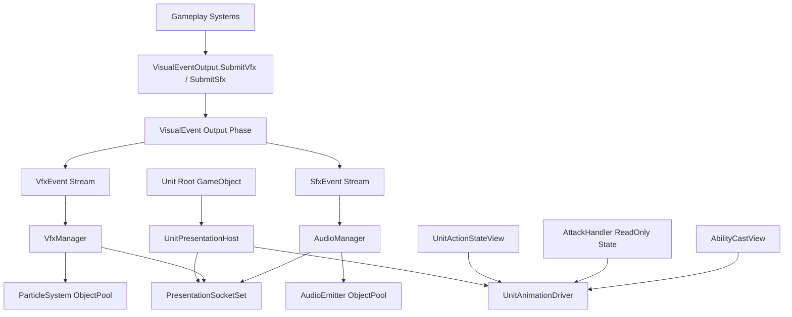
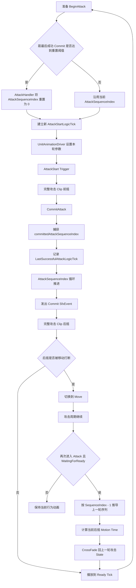
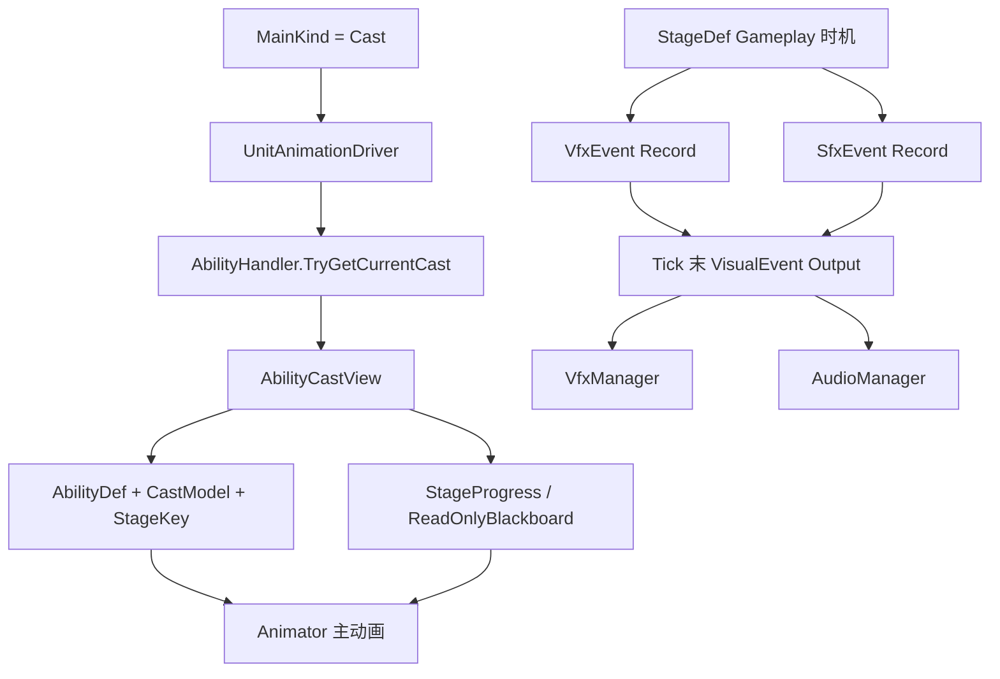

# 单位视图绑定与语义挂点

## 目标实现

逻辑实体能与可重建视图绑定，VFX 和音效使用稳定语义挂点。

## 技术方案

UnitPresentationHost/Registry 和 PresentationSocketSet 只读逻辑；SocketProfile 定义挂点，缺失挂点按可见校验策略处理。

## 边界情况

视图不能反写 Gameplay；异步加载不能复用旧生命；逻辑空间所有者不随模型层级变化。

## 验收条件

- 正常路径达到上述目标，并由所属模块唯一拥有权威状态。
- 以上边界情况有明确返回、拒绝或可见失败；不得用占位成功代替行为。
- 确定性逻辑比较重复执行、改变插入顺序以及捕获/恢复/重演结果；只读界面不得改变 Gameplay。

## 工程实际核查

本期检索的是当前源码和测试定义。存在实现不等于完成全部需求，存在测试不等于本期已运行通过。

- `Assets/Scripts/FrameSync/PresentationSocketSet.cs`：当前关联实现定义 PresentationSocketSet（以源码为实际命名）。
- `Assets/Scripts/FrameSync/UnitPresentationHost.cs`：当前关联实现定义 UnitPresentationHost（以源码为实际命名）。
- `Assets/Scripts/FrameSync/UnitPresentationRegistry.cs`：当前关联实现定义 UnitPresentationRegistry（以源码为实际命名）。

### 已有测试位置

- `Assets/Scripts/Bootstrap/Tests/EditMode/MurkWolfFormalContentTests.cs`：UnitCatalog_ContainsAuthoredGreaterAndMiniWolfValues、GreaterWolf_OnHitBuff_IsPermanentThreePercentCurrentHealth、MapPrefab_AuthorsTwoVisualizedThreeWolfCamps、MapPrefab_AllWolfSpawnSlotsAreWalkableForTheirRadius、MapCampUpsert_PreservesVisualAuthoringAndOtherCamps。
- `Assets/Scripts/Bootstrap/Tests/EditMode/UnitAddressablesMigrationTests.cs`：AllFormalUnitEntriesResolveLogicPrefabAndAddressableView、LogicPrefabsContainNoPresentationComponentsOrAssets、ClientViewsContainPresentationHostButNoGameplayRoot、ClientViewRootsAreAtWorldOrigin。
- `Assets/Scripts/Bootstrap/Tests/PlayMode/AatroxPrefabPlayModeTests.cs`：RuntimePrefab_InstantiatesWithModelAndEditorGizmo、ClientUnitOutline_CoversEveryAatroxSubMesh、TetherArea_InstantiatesAsStationaryProjectile、AnimatorController_RoutesPassiveUltimateAndEmpoweredAttack、AnimatorController_LocomotionVariantsAdvanceWithoutSelfReentry、UnitAnimationDriver_UsesNewLocomotionStateOnChangeFrame、AnimatorController_UltimateEndPlaysExitClip。
- `Assets/Scripts/Bootstrap/Tests/PlayMode/MurkWolfPrefabPlayModeTests.cs`：GreaterWolf_AlertAndMoveRoutesPlayLoopedMotion、MiniWolf_AlertAndMoveRoutesPlayLoopedMotion、BoundDriver_AlertRouteUsesAuthoredTransitionClips。
- `Assets/Scripts/Bootstrap/Tests/PlayMode/VarusAnimationPlayModeTests.cs`：BoundDriver_QFocusMovementChangesResolveLoopSameFrame。

## 附录：精确接口、公式与配置

附录保留本功能必须精确表达的接口、运算和配置语义，原系统章节已拆到所属功能。若与上面的已接受修订仍有冲突，进入待确认清单而不是按旧版本执行。

### 表现层负责什么

当前版本只负责三类表现：单位动画、基于 `ParticleSystem` 的特效，以及音效。

暂不纳入 UI、镜头反馈、投掷物表现同步、单位生成回收、`UnitWorld`、物理注册查询和 `PhysicsEntity2D` 内部维护。

表现层只消费单位框架、技能系统、战斗系统和 Buff 系统在确定性时机给出的状态或事件，不反向决定 Gameplay 结果。

---

### 三个表现模块彼此独立

本设计不设置横跨动画、特效和音效的统一表现管理器。

动画直接读取单位当前状态；Gameplay 系统通过 `VisualEventOutput` 的独立提交函数写入 VFX 或 SFX 纯数据记录，固定 Tick 末再由输出阶段交给各自管理器。



| 模块 | 主要驱动方式 | 实例管理者 | 单位承担的职责 |
|---|---|---|---|
| 动画 | 单位行为状态、攻击只读状态、`AbilityCastView` | 本单位的 `UnitAnimationDriver` | 持有 Animator 和动画配置 |
| VFX | Tick 末输出的独立 `VfxEvent` | 全局 `VfxManager` | 只提供语义挂点 |
| SFX | Tick 末输出的独立 `SfxEvent` | 全局 `AudioManager` | 只提供语义挂点 |
| 挂点 | `PresentationSocketSet` 查询 | 不管理播放实例 | 配置 Transform |

`VisualEventOutput` 只是固定输出阶段的纯数据收集入口，不是统一 Cue 系统，也不拥有跨动画、VFX、SFX 的共同生命周期。其 VFX 与 SFX 函数、缓冲和消费流彼此独立。

VFX 与 SFX 可以来自同一个 Gameplay 行为，但仍然拥有独立的：

- 事件记录；
- 定义 ID；
- 发生 LogicTick；
- 参数；
- 播放策略；
- 回滚账本；
- 对象池。

攻击和技能主动画不通过 VisualEvent 驱动。

### 与 `PhysicsEntity2D` 的边界

`PhysicsEntity2D` 是参与帧同步实体的确定性空间组件。表现层不重新定义、不注册，也不修改它的 Gameplay 空间规则。

当前项目正式冻结：

```text
参与帧同步的 GameObject 根 Transform
    唯一写入点 = PhysicsEntity2D.LateUpdate
```

职责链：

```text
Gameplay Tick
    -> 移动、寻路、强制位移和物理修正只修改 PhysicsEntity2D 的逻辑姿态

PhysicsEntity2D.LateUpdate
    -> 读取本 Tick 最终逻辑姿态
    -> 同步到实体根 Unity Transform
```

`PhysicsEntity2D.LateUpdate` 在这里属于最终 Presentation Sync 写入阶段，不是新的 Gameplay 位置权威。

禁止其它组件再次写入参与帧同步实体的根 `Transform.position / rotation`，包括：

- `UnitAnimationDriver`；
- `MovementHandler`；
- `UnitLocomotionAgent`；
- 寻路系统；
- AIController；
- VFX / SFX Binder；
- 其它表现同步脚本。

Animator 对骨骼、挂点和模型子节点的正常动画写入不受此限制，但不能通过 Root Motion 改写实体根 Transform。当前帧同步单位默认关闭会影响根逻辑姿态的 Root Motion。

特效或音效需要跟随单位时，管理器通过 `PresentationSocketSet` 获取骨骼或子节点 Transform，不读取或改写 `PhysicsEntity2D` 的逻辑状态。

### 数据恢复标记

为方便帧同步设计师审查，本文使用三类数据标记。

| 标记 | 含义 | 是否进入 Gameplay 快照树 |
|---|---|---:|
| **帧同步设计关注点** | 会影响回滚后事件生成、事件身份或后续 Gameplay 结果的数据 | 由所属 Gameplay 系统决定 |
| **表现回滚缓存** | 本地客户端为避免重复播放和修正当前画面保存的缓存 | 否 |
| **可重建表现状态** | 可以根据恢复后的 Gameplay 状态和表现事件重新建立的数据 | 否 |

典型归类：

- 技能发射计数、Buff 触发计数、战斗事件序号、逻辑开始与结束 Tick，属于帧同步设计关注点。
- `ExpectedEventSet`、`PlayingEventMap`、`CompletedOneShotSet` 属于表现回滚缓存。
- Animator 当前状态、ParticleSystem 模拟状态、AudioSource 播放位置和对象池空闲列表属于可重建表现状态。

表现层不会自行定义 `GameplaySnapshot` 的结构，只标记上游哪些数据必须能够在回滚后重现相同表现事件。

### `SimulationTickContext` 的使用规则

表现层接入 Gameplay LogicTick 时遵循项目统一规则：

```text
需要当前 Tick
    -> 在函数内部读取 SimulationTickContext.Current.Tick

需要执行模式
    -> 在函数内部读取 SimulationTickContext.Current.ExecutionMode
```

禁止：

```text
UnitAnimationDriver.Advance(context)
VfxManager.Reconcile(context)
AudioManager.Consume(event, context)
```

也禁止为了接入统一 Tick 修改上游既有接口。

表现层不缓存第二套 Gameplay 当前 Tick，不增加：

```text
GameplayClock
LogicClock
GlobalCurrentTick
PresentationLogicTick
```

Unity 渲染时间、Animator 过渡时间、ParticleSystem 本地模拟时间和 AudioSource 播放时间可以继续使用，但只能用于本地平滑与播放，不能成为 Gameplay 判断、事件身份或回滚边界的权威。

统一命名：

| 语义 | 命名 |
|---|---|
| 当前 Tick | `SimulationTickContext.Current.Tick` |
| 逻辑发生时刻 | `...LogicTick` |
| 逻辑持续时间 | `...DurationTicks` |
| 已经过 Tick | `...ElapsedTicks` |
| 表现事件序号 | `EventSequence` |
| 快照恢复边界 | `SnapshotTick` |

### 定位

`UnitPresentationHost` 是单位根 GO 上的轻量表现宿主。

它只负责：

```text
1. 持有本单位 Animator 驱动入口。
2. 持有本单位 PresentationSocketSet。
3. 在启用 / 禁用时向表现层注册表登记。
4. 提供只读查询，不管理特效和音效实例。
```

推荐结构：

```text
UnitPresentationHost : MonoBehaviour
    Unit OwnerUnit
    UnitAnimationDriver AnimationDriver
    PresentationSocketSet SocketSet
```

不再包含：

```text
UnitVfxBinder
UnitAudioEmitter
VfxSockets
AudioSource 管理
ParticleSystem 实例列表
```

原因是：

```text
单位身上的特效源、循环特效、命中特效、音效源都应该由 VfxManager / AudioManager 统一管理。
单位只提供“挂到哪里”的信息，不负责“谁创建、谁停止、谁回收”。
```

---

### `UnitPresentationRegistry`

特效和音效总管理器需要根据 `UnitUid` 找到单位表现宿主，但不应依赖 `UnitWorld`。

因此表现层内部可以维护一个只服务表现层的注册表：

```text
UnitPresentationRegistry
    Register(UnitUid, UnitPresentationHost)
    Unregister(UnitUid, UnitPresentationHost)
    TryGetHost(UnitUid, out host)
    TryGetSocket(UnitUid, socketKey, out Transform)
```

注册时机：

```text
UnitPresentationHost.OnEnable
    -> 从 OwnerUnit 读取 UnitUid
    -> Register(UnitUid, this)

UnitPresentationHost.OnDisable
    -> Unregister(UnitUid, this)
    -> 通知 VfxManager / AudioManager：该 OwnerUid 的跟随实例不再有有效宿主
```

注意：`OnDisable` 不是单位死亡逻辑，也不是回收逻辑。它只是表现层知道这个表现宿主不可用了。

---

### Host 不做的事

`UnitPresentationHost` 不做：

```text
不播放特效。
不播放音效。
不维护 ParticleSystem 实例。
不维护 AudioSource 实例。
不解析 VFX / SFX 配置。
不读取 PhysicsEntity2D。
不查询 UnitWorld。
不决定单位死亡后如何处理。
```

它的职责应该非常窄：

```text
本单位动画入口 + 本单位挂点入口 + 表现注册。
```

---

### 定位

`PresentationSocketSet` 是单位本地的表现挂点表。它只提供 Transform，不管理任何表现实例。

```text
PresentationSocketSet
    SocketBindings
    SocketFallbackRules
    TryGetSocket(socketKey, out Transform)
```

---

### 语义挂点

不要让特效和音效直接找骨骼名。

使用语义挂点：

```text
Root
Center
Head
Chest
LeftHand
RightHand
Weapon
WeaponTip
FootLeft
FootRight
Ground
Custom01
Custom02
```

不同单位可以把同一个语义挂点绑定到不同骨骼：

```text
Garen:
    Weapon -> sword_root
    WeaponTip -> sword_tip

Annie:
    Weapon -> tibbers_root
    WeaponTip -> hand_r

Minion:
    Weapon -> spear_root
    WeaponTip -> spear_tip
```

---

### 挂点缺失处理

每个请求可以指定缺失策略：

| 策略 | 说明 |
|---|---|
| `Fallback` | 按 fallback 链寻找替代挂点 |
| `Skip` | 没有挂点就不播放 |
| `UseRoot` | 强制回退到 Root |
| `LogError` | 开发期报错 |

示例 fallback：

```text
WeaponTip -> Weapon -> RightHand -> Chest -> Root
Head      -> Chest -> Center -> Root
Ground    -> Root
```

---

### `SocketProfile`

```text
PresentationSocketProfile
    ProfileId
    RequiredSockets
    FallbackRules
```

单位预制体上配置：

```text
PresentationSocketSet
    SocketProfileId
    SocketBindings
```

校验规则：

```text
1. 关键 Socket 缺失时给出编辑器警告。
2. VfxDefinition / SfxDefinition 引用的默认 Socket 必须能 fallback。
3. 同类单位可以复用 SocketProfile，个别单位覆盖 Transform。
```

---

### 攻击序列空闲重置、后摇恢复与新攻击流程



关键规则：

- 序列空闲重置属于 `AttackHandler.BeginAttack` 前的惰性 Gameplay 判断。
- `UnitAnimationDriver` 不维护攻击循环计时器。
- 新攻击边沿只看有效且发生变化的 `AttackStartLogicTick`。
- Commit 时 `AttackSequenceIndex` 的递增不是新攻击。
- Commit 前取消不推进序列，也不刷新 `LastSuccessfulAttackLogicTick`。
- 后摇恢复不触发 `AttackStart`，也不执行空闲重置。
- 强化攻击与普通攻击成功 Commit 后都推进同一个攻击序列。

### 多阶段技能流程



技能主动画只读取 `AbilityCastView`。

同一 Stage 内重复动作通过 `ReadOnlyBlackboard` 中技能已有的确定性状态变化映射为 Animator 参数或 Trigger，不监听 `AbilityCastEvent`。

VFX 和 SFX 由 Stage 在各自正确的 Gameplay 时机生成独立记录，并在 Tick 末分别输出。

### 动态蓄力表现

例如一个蓄力技能：

- Hold Stage 的主动画通过 `ChargeRatio` 驱动 Blend。
- 蓄力音效可以在 Focus 成功的 Tick 发出独立 Loop `SfxEvent`。
- 释放短音可以在 Commit 成功的 Tick 单独发出。
- 释放 VFX 可以在投掷物生成或释放 Stage 的确定性 Tick 发出。
- `VfxDefinition` 和 `SfxDefinition` 分别使用 `ChargeRatio / ChargeTicks` 解析缩放、音调和表现持续时间。

这些事件彼此独立，不需要组成统一 cue。

---

### Buff 持续特效与音效

Buff 的确定性运行状态决定 LoopState 是否存在。VFX 和 SFX 可以分别选择是否配置：

- Buff 创建后建立持续 VFX；
- Buff 创建后建立循环 SFX；
- Buff 刷新时只更新参数，不重新创建；
- Buff 结束或回滚后不存在时，各管理器分别停止并回收。

单位本身不保存实例。

---

### Control 动画流程

控制系统和单位框架决定当前 Action 是否被打断以及是否进入 `ControlActionRuntime`。只有当 `ActionStateView.MainKind == Control` 时，表现层才播放 Control 动画。

表现层不自行判断控制能否打断当前技能。

---

### 死亡与复活表现流程

`Dying` 期间不播放死亡动画。战斗死亡管线确认后，单位进入 `Dead`，`UnitAnimationDriver` 才开始 Death，并在结束后保持 DeadPose。

英雄进入 `Respawning` 后播放可选 Respawn 表现；当单位框架完成复活初始化并切回 `Alive` 时，动画恢复当前行为或 Idle。

死亡 VFX 和 SFX 使用各自独立事件；它们的发生 Tick、播放策略和持续时间分别配置。

### 单位框架 v20 侧

表现层读取：

- `Unit.LifeState`；
- `Unit.ActionStateView`；
- `Unit.AbilityHandler.TryGetCurrentCast()`；
- `Unit.AttackHandler` 当前只读状态；
- `UnitPresentationHost / PresentationSocketSet`。

生命周期按 `Alive / Dying / Dead / Respawning` 解释。`Dying` 不触发死亡动画。

`AbilityCastEvent` 属于 Gameplay 事件，不是动画接口。表现层不得通过事件监听播放技能动画。

### 技能系统 v14 侧

技能动画唯一依赖 `AbilityCastView`：

| 字段 | 用途 |
|---|---|
| `AbilityDef` | 定位本英雄的 `AbilityAnimationPlan` |
| `CastModel` | 区分施法模型 |
| `CurrentStageKey` | 定位模型位置 |
| `CurrentCastStage / CurrentStage` | 校验当前 Stage 配置 |
| `StageElapsedTicks / StageRemainingTicks` | 循环和过渡 |
| `StageProgress` | 有限 Stage 的 Motion Time 或其它进度参数 |
| `ReadOnlyBlackboard` | 蓄力比例、剩余次数和技能专属确定性语义 |

表现层不能：

- 修改 Blackboard；
- 强制切换 Stage；
- 调用 Stage 生命周期；
- 根据动画结束推进技能；
- 监听 `AbilityCastEvent` 或其它技能事件播放动画；
- 为动画要求技能系统增加纯表现字段。

同一 Stage 内的重复动作只允许解释 `AbilityCastView.ReadOnlyBlackboard` 中本来就存在且可恢复的 Gameplay 语义。

### 攻击系统 v6.1 侧最小接缝

表现层直接读取 `AttackHandler` 已有状态：

| 字段 | 用途 |
|---|---|
| `AttackStartLogicTick` | 判断是否正式开始新一轮攻击，并计算前摇进度 |
| `ImpactLogicTick` | 对齐 Clip 的 `ImpactNormalizedTime` |
| `NextAttackReadyLogicTick` | 计算后摇进度与恢复位置 |
| `ImpactCommitted` | 判断使用当前序号还是循环减一后的上一轮序号 |
| `IsEmpoweredAttack` | 选择普通或强化攻击 State |
| `AttackSequenceIndex` | 确定性选择普通攻击动画序列 |

攻击模块另外维护：

```text
LastSuccessfulAttackLogicTick
GlobalGameplayStaticData.AttackSequenceResetIntervalTicks
```

它们用于在下一次 `BeginAttack` 前惰性决定是否把 `AttackSequenceIndex` 重置为 0。`UnitAnimationDriver` 不读取这两个值，也不维护本地重置计时器；它只在新的 `AttackStartLogicTick` 出现后读取已经确定的序列结果。

当前动画序列推导：

```text
ImpactCommitted == false
    -> CurrentSequence = AttackSequenceIndex

ImpactCommitted == true
    -> CurrentSequence =
        AttackSequenceIndex == 0
            ? 255
            : AttackSequenceIndex - 1
```

普通攻击 State 槽位：

```text
CurrentSequence % NormalAttackBindings.Count
```

接口边界：

- `AttackHandler` 不调用 `UnitAnimationDriver`；
- `AttackHandler` 不设置 Animator 参数；
- `UnitAnimationDriver` 不读取 Buff 判断强化攻击；
- 表现层不维护本地攻击序列或序列重置计时器；
- 攻击系统不根据动画结束修改计时；
- Animation Event 不提交攻击效果；
- 所有当前 Tick 查询在函数内部读取 `SimulationTickContext.Current.Tick`。

### VFX 与 SFX 事件接口

Gameplay 系统通过表现层现有输出入口提交两类独立纯数据记录：

```csharp
VisualEventOutput.SubmitVfx(in VfxEvent evt);
VisualEventOutput.SubmitSfx(in SfxEvent evt);
```

| 记录 | Tick 末消费者 |
|---|---|
| `VfxEvent` | `VfxManager` |
| `SfxEvent` | `AudioManager` |

固定流程：

```text
Gameplay 系统构造确定性记录
    -> VisualEventOutput.SubmitVfx / SubmitSfx
    -> 当前 Tick 对应的独立记录缓冲
    -> Tick 末 VisualEvent Output Phase
    -> VfxManager / AudioManager 分别消费
```

`VisualEventOutput` 不实例化 Unity 对象，不解析定义，也不执行播放。它只是当前表现架构已有的纯数据输出接缝，不是新增的攻击专用音频端口。

攻击 Commit 音效采用攻击模块 v6.1 的固定映射：

```text
CommitAttack Gameplay 输出成功
    -> committedAttackSequenceIndex = Commit 前捕获的 AttackSequenceIndex
    -> commitSfxEventId = ResolveCommitSfxEventId()

若 commitSfxEventId != 0：
    evt = SfxEvent
        SfxEventId = commitSfxEventId
        Id.SourceLogicTick = SimulationTickContext.Current.Tick
        Id.SourceKind = Unit
        Id.SourceRuntimeUid = Owner.UnitUid
        Id.EventSequence = committedAttackSequenceIndex
        Id.EventKey = commitSfxEventId
        Anchor = CommitSfxAnchor

    VisualEventOutput.SubmitSfx(in evt)
```

该音效只在 Gameplay 输出成功后提交一次。

禁止：

```text
AttackHandler 直接调用 AudioManager
AttackHandler 直接调用 AudioSource.Play
AttackHandler 绕过 PresentationEventId
AttackHandler 新建攻击专用 SfxPort
AttackHandler 根据实际是否听到声音改变 Commit 结果
```

`AudioManager` 负责预测播放、回滚去重、`OneShotNoReplay`、定义解析、挂点、Pitch、音量和对象池。提交函数没有“播放成功”返回值，不反向影响 Gameplay。

投掷物来源的 VFX / SFX 使用：

```text
SourceKind = Projectile
SourceRuntimeUid = ProjectileUid
```

VisualEvent 输出阶段不向 `UnitAnimationDriver` 发送攻击或技能主动画事件。

### 公共 `GlobalPrefabTable` 运行时接缝

表现层只依赖公共运行时契约。当前 `PrefabKind` 由代码固定：

```csharp
public enum PrefabKind
{
    Unit,
    Projectile,
    ParticleVfx,
    AudioEmitter,
    Misc
}
```

运行时最小字段：

```text
PrefabId
PrefabKind
UnityPrefab / Runtime Loader Key
GameplayConfigId optional
```

表现层消费关系：

```text
VfxManager
    -> PrefabKind.ParticleVfx

AudioManager
    -> PrefabKind.AudioEmitter
```

表现层不设计 `GlobalPrefabTable` 的 Authoring、Inspector、ID 自动分配、Bake 和编辑器校验，也不允许通过表现层扩展或修改核心 `PrefabKind` 语义。

单位、投掷物与表现对象使用同一公共 Prefab 契约，但各自只读取与自身固定 `PrefabKind` 相关的数据。

`PrefabId` 不进入 `PresentationEventId`。同一个逻辑事件可以解析为不同的本地表现资源，但事件身份保持不变。

当前版本的动画资源直接属于单位自己的 AnimatorController。

### 帧同步审查清单

1. VFX / SFX 事件生产者能否在回滚后生成相同的 `PresentationEventId`。
2. 每个参与 `EventSequence` 的生产系统是否明确自己的序列作用域、类型、重置和溢出规则。
3. Gameplay 系统是否通过 `VisualEventOutput.SubmitVfx / SubmitSfx` 提交纯数据记录。
4. `VisualEventOutput` 是否只收集记录，没有实例化、定义解析或立即播放职责。
5. 攻击 Commit 音效是否使用 Commit 前捕获的 `committedAttackSequenceIndex`，没有第二套表现序列。
6. `AttackHandler` 是否没有直接调用 `AudioManager`、`AudioSource` 或攻击专用 `SfxPort`。
7. 当前表现来源是否只使用 Unit 或 Projectile，并写入正确的 `SourceKind + SourceRuntimeUid`。
8. 动态持续时间使用的 ChargeTicks、ExpireTick、Buff 状态等是否可恢复。
9. 技能动画依赖的 Blackboard 字段是否本来就是可恢复 Gameplay 状态。
10. 技能动画是否完全通过 `AbilityCastView` 驱动，没有 AbilityCast 事件监听后门。
11. `AttackStartLogicTick`、Impact、Ready、Commit、强化、`AttackSequenceIndex` 和 `LastSuccessfulAttackLogicTick` 是否随 AttackHandler 快照恢复。
12. 攻击序列空闲重置是否只由 `AttackHandler` 在下一次 Begin 前执行。
13. 表现层是否没有自己的攻击序列计数或攻击循环计时器。
14. `SnapshotTick` 是否按“恢复后下一次执行 Tick”处理，并从该 Tick 开始重演表现事件。
15. Expected、Playing、Completed 和 Animator 本地缓存是否排除在 GameplaySnapshot 之外。
16. Animator、Trigger、Motion Time、CrossFade、ParticleSystem、AudioSource 和对象池是否作为可重建表现状态。
17. 所有需要当前逻辑 Tick 的函数是否直接读取 `SimulationTickContext.Current`，没有修改接口传递 Context。
18. 参与帧同步实体的根 Unity Transform 是否只有 `PhysicsEntity2D.LateUpdate` 一个写入点。
19. Animator Root Motion 是否不会改写参与帧同步实体的根逻辑姿态。
20. 每个英雄或单位类型是否直接使用自己的 AnimatorController。
21. 表现层是否只引用代码固定的公共 `PrefabKind` 和 `GlobalPrefabTable` 运行时契约。


## 需求演进

### 2026-10-02

变动内容：稳定表现事件身份由逻辑来源持有，Gameplay 不直接播放音效。

legacyDecision：D-014

### 2026-08-23

变动内容：客户端视图可重建、句柄唯一释放。直接逻辑引用和完全服务器排除 Addressables 部分已被后续内容闭包修订取代。

legacyDecision：D-048

