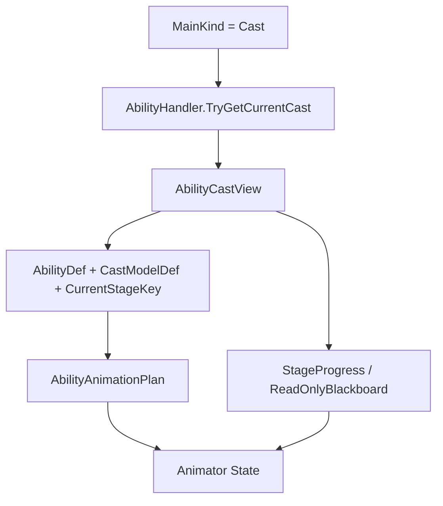

# 攻击技能动画与插值采样

## 目标实现

动画按逻辑状态展示且采样频率可独立配置。

## 技术方案

UnitAnimationDriver 读取 Attack 锁定时间与 AbilityCastView；客户端默认 20 Hz 插值，Bootstrap 发布按 UnitWorld 拥有的连续逻辑时间投影。

## 边界情况

不得跨未 Commit 的 Impact 或 Ready；loop 相位由逻辑 epoch 和实时倍率重建；未知 TickRate 不硬回退 30 Hz；独立采样不新增 Gameplay Tick。

## 验收条件

- 正常路径达到上述目标，并由所属模块唯一拥有权威状态。
- 以上边界情况有明确返回、拒绝或可见失败；不得用占位成功代替行为。
- 确定性逻辑比较重复执行、改变插入顺序以及捕获/恢复/重演结果；只读界面不得改变 Gameplay。

## 工程实际核查

本期检索的是当前源码和测试定义。存在实现不等于完成全部需求，存在测试不等于本期已运行通过。

- `Assets/Scripts/FrameSync/UnitAnimationDriver.cs`：当前关联实现定义 UnitAnimationDriver（以源码为实际命名）。
- `Assets/Scripts/Gameplay/Presentation/AttackAnimationPlan.cs`：当前关联实现定义 AttackAnimationPlan（以源码为实际命名）。

### 已有测试位置

- `Assets/Scripts/Bootstrap/Tests/EditMode/MurkWolfFormalContentTests.cs`：UnitCatalog_ContainsAuthoredGreaterAndMiniWolfValues、GreaterWolf_OnHitBuff_IsPermanentThreePercentCurrentHealth、MapPrefab_AuthorsTwoVisualizedThreeWolfCamps、MapPrefab_AllWolfSpawnSlotsAreWalkableForTheirRadius、MapCampUpsert_PreservesVisualAuthoringAndOtherCamps。
- `Assets/Scripts/Bootstrap/Tests/EditMode/UnitAddressablesMigrationTests.cs`：AllFormalUnitEntriesResolveLogicPrefabAndAddressableView、LogicPrefabsContainNoPresentationComponentsOrAssets、ClientViewsContainPresentationHostButNoGameplayRoot、ClientViewRootsAreAtWorldOrigin。
- `Assets/Scripts/Bootstrap/Tests/EditMode/UnitPrefabAnimatorTopologyTests.cs`：AttackSequence_MapsOntoAuthoredAnimationVariantCount、UnitPrefabs_DoNotEnterLoopingMovementFromAnyState。
- `Assets/Scripts/Bootstrap/Tests/PlayMode/AatroxPrefabPlayModeTests.cs`：RuntimePrefab_InstantiatesWithModelAndEditorGizmo、ClientUnitOutline_CoversEveryAatroxSubMesh、TetherArea_InstantiatesAsStationaryProjectile、AnimatorController_RoutesPassiveUltimateAndEmpoweredAttack、AnimatorController_LocomotionVariantsAdvanceWithoutSelfReentry、UnitAnimationDriver_UsesNewLocomotionStateOnChangeFrame、AnimatorController_UltimateEndPlaysExitClip。
- `Assets/Scripts/Bootstrap/Tests/PlayMode/MurkWolfPrefabPlayModeTests.cs`：GreaterWolf_AlertAndMoveRoutesPlayLoopedMotion、MiniWolf_AlertAndMoveRoutesPlayLoopedMotion、BoundDriver_AlertRouteUsesAuthoredTransitionClips。

## 附录：精确接口、公式与配置

附录保留本功能必须精确表达的接口、运算和配置语义，原系统章节已拆到所属功能。若与上面的已接受修订仍有冲突，进入待确认清单而不是按旧版本执行。

### 动画状态来源

动画系统只读取当前可恢复的 Gameplay 状态，不通过技能施放事件驱动主动画。

| 来源 | 读取内容 | 动画用途 |
|---|---|---|
| `Unit.LifeState` | `Alive / Dying / Dead / Respawning` | 决定正常行为、死亡和复活表现 |
| `Unit.ActionStateView` | `MainKind / BaseKind` 等 Action 层状态 | 判断 Attack、Cast、Control、Move、Dash |
| `AttackHandler` | `AttackStartLogicTick`、Impact、Ready、Commit、强化与序列状态 | 驱动完整攻击 Clip、恢复剩余后摇和触发新一轮攻击 |
| `AbilityHandler.TryGetCurrentCast()` | 当前只读 `AbilityCastView` | 选择技能 Stage 主动画、进度和技能语义参数 |
| `UnitAnimationProfile` | 本单位 AnimatorController、参数映射和动画绑定 | 把 Gameplay 状态翻译为 Animator 参数与 State |

`AbilityCastEvent` 是技能 Gameplay 结果事件，只供 Buff、装备被动、固定被动等 Gameplay 规则使用。`UnitAnimationDriver` 不订阅、不缓存，也不根据它播放技能动画。

攻击系统和技能系统都不直接操作 Animator。`UnitAnimationDriver` 每次更新读取当前状态，自行设置 Bool、Int、Float、Trigger，并在后摇恢复或回滚时定位到正确 State 与 normalized time。

### 动画不是全局请求

动画不走：

```text
AnimationManager.Play(unitUid, animKey)
GameplayPresentationPort.PlayAnimation(...)
VisualEvent -> UnitAnimationDriver
AbilityCastEvent -> Animator
```

动画是单位当前 Gameplay 状态的视觉投影。

只有单位本地的 `UnitAnimationDriver` 才知道自己的：

- AnimatorController；
- Animator State；
- Layer；
- Transition；
- BlendTree；
- Motion Time；
- 英雄或单位专属参数。

VFX 与 SFX 可以通过纯数据事件输出，但攻击和技能主动画必须由状态读取驱动。

### 动画决策优先级

生命周期先于普通行为，但 `Dying` 不代表已经死亡。

| 当前状态 | 处理规则 |
|---|---|
| `LifeState == Dead` | 播放 Death，完成后保持 DeadPose |
| `LifeState == Respawning` | 播放可选 Respawn；未配置时保持复活准备姿势 |
| `LifeState == Dying` | 不切换到 Death，维持当前表现，等待死亡管线确认 |
| `LifeState == Alive` 且 `MainKind == Control` | 播放 Control |
| `LifeState == Alive` 且 `MainKind == Cast` | 查询 `AbilityCastView` 并解析技能动画 |
| `LifeState == Alive` 且 `MainKind == Attack` | 查询攻击只读状态；恢复上一轮剩余后摇或启动新一轮完整攻击 Clip |
| `LifeState == Alive` 且 `BaseKind == Dash / ForcedMove` | 播放位移动画 |
| `LifeState == Alive` 且 `BaseKind == Move` | 播放 Move |
| `LifeState == Alive` 且没有行为 | 播放 Idle |

攻击命令被 Planner 接受后，单位会立即进入 Attack 主行为。即使下一次攻击尚未就绪，表现层也必须提供攻击状态的连续反馈；本版通过恢复上一轮攻击 Clip 当前应处的后摇位置实现，不增加独立的 ReadyWait 或攻击准备动画。

可移动施法或其它上下身分离需求可以使用 Animator Layer 与 AvatarMask，但不会要求单位框架增加表现专用字段。

### 行为状态与专项只读状态的两级解释

`UnitActionStateView` 只回答单位当前属于哪一种高层行为。攻击和技能的内部动画时间由各自系统已有状态提供，单位框架不复制第二套阶段状态。

技能动画链：

```text
MainKind == Cast
    -> AbilityHandler.TryGetCurrentCast()
    -> AbilityCastView
    -> AbilityAnimationPlan
    -> Animator
```

攻击动画链：

```text
MainKind == Attack
    -> AttackHandler 当前状态
    -> AttackAnimationPlan
    -> Animator
```

攻击状态存在两种需要区别的表现情况：

| 攻击情况 | 判断依据 | 动画处理 |
|---|---|---|
| 上一轮后摇恢复 | `ImpactCommitted == true` 且当前 Tick 尚未到 `NextAttackReadyLogicTick` | 回到上一轮完整攻击 Clip 当前应处的后摇位置 |
| 新一轮攻击开始 | 有效的 `AttackStartLogicTick` 与上一次观察值不同 | 设置本轮参数并触发 `AttackStart` |

`AttackStartLogicTick` 是新攻击边沿。攻击模块 v6.1 已规定同一单位同一 LogicTick 最多正式执行一次 `BeginAttack`，因此不增加额外攻击实例 ID。

如果回滚后 Animator 与 Gameplay 不一致，表现层不依靠重放 Trigger 逐步恢复，而是读取恢复后的攻击或技能状态，直接进入正确 State 和 normalized time。

### Unity Animator 与 Inspector 组织

每个英雄使用自己的 AnimatorController。需要独立动画拓扑的其它单位类型也使用自己的 AnimatorController。

当前版本采用单位专属 AnimatorController，不设计共享基础 Controller 后的运行时 Clip 替换，也不在运行时修改 Controller 拓扑。

`UnitAnimationProfile` 保存本单位 Controller 的参数 Hash、攻击绑定、技能绑定、Layer 规则和必要的 State Hash。

#### AnimatorController 的职责

AnimatorController 负责：

- State Machine 与 Sub-State Machine；
- 普通攻击、强化攻击、技能、控制、死亡和复活 State；
- Transition 条件、时长和打断规则；
- BlendTree；
- Animator Layer 与 AvatarMask；
- State Motion Time；
- 英雄或单位专属动画结构；
- 少量纯表现用 `StateMachineBehaviour`。

`UnitAnimationDriver` 负责：

- 读取 Gameplay 只读状态；
- 把状态翻译为 Animator Bool、Int、Float 和 Trigger；
- 检测新的攻击开始 Tick和技能 Stage 变化；
- 在攻击后摇恢复与回滚时精确定位 State；
- 按客户端可配置频率采样攻击与循环动画进度，并在渲染帧之间插值；
- 将 `AbilityCastView.ReadOnlyBlackboard` 中已有技能语义映射为 Animator 参数；
- 校验 Animator 是否仍与当前 Gameplay 状态一致。

Animator 不决定攻击 Commit、技能 Stage 推进、强化攻击消费、伤害提交或行为结束。

#### 公共 Animator 参数

各英雄 Controller 的基础参数命名必须统一。

| 参数 | 类型 | 作用 |
|---|---|---|
| `IsMoving` | Bool | Locomotion 状态选择 |
| `MoveSpeed` | Float | 移动状态的实时播放倍率 |
| `LoopMotionTime` | Float | Idle/Walk/Move 循环 Clip 的插值 normalized time |
| `IsAttacking` | Bool | 当前是否处于 Attack 主行为 |
| `IsEmpoweredAttack` | Bool | 当前攻击是否使用强化攻击 State |
| `IsAttackRecovering` | Bool | 当前是否正在恢复上一轮后摇 |
| `AttackSequenceIndex` | Int | 当前完整攻击动画对应的普通序列槽位 |
| `AttackMotionTime` | Float | 当前完整攻击 Clip 的 normalized time |
| `AttackStart` | Trigger | 一轮新的正式攻击前摇开始 |
| `IsCasting` | Bool | 当前是否存在可观察的 `AbilityCastView` |
| `AbilityStageProgress` | Float | 当前有限 CastStage 的进度 |
| `LifeState` | Int | 生命周期表现分支 |
| `IsControlled` | Bool | 当前是否处于单位框架确认的控制行为 |

英雄专属技能可以增加自己的参数，例如蓄力比例、剩余发射次数或技能专属阶段值，但必须来自 `AbilityCastView` 及其只读 Blackboard。

#### 推荐的单英雄 Controller 结构

```text
Hero AnimatorController
├── Base Layer
│   ├── Locomotion
│   │   ├── Idle
│   │   └── Move BlendTree
│   ├── Attack
│   │   ├── NormalAttack_0
│   │   ├── NormalAttack_1
│   │   └── EmpoweredAttack
│   ├── Ability
│   ├── Control
│   ├── Death
│   └── Respawn
├── Optional UpperBody Layer
└── Optional Additive Layer
```

不同英雄可以拥有完全不同的技能 Sub-State Machine 和 Layer 结构，不要求为了共享 Controller 而保留无意义的占位 State。

#### `AttackAnimationPlan`

| 配置 | 说明 |
|---|---|
| `NormalAttackBindings` | 本英雄普通攻击序列中的 Animator State、Clip 和命中姿势位置 |
| `EmpoweredAttackBinding` | 可选的强化攻击 State、Clip 和命中姿势位置 |
| `EnterCrossFade` | 正常新攻击的默认过渡 |
| `RecoverCrossFade` | 从当前姿势恢复到上一轮后摇的过渡 |
| `AnimatorParameterMap` | 公共参数名或预计算 Hash |

攻击计划不再提供任何改变普通攻击序列推进方式的表现配置。

攻击序列只由 `AttackHandler.AttackSequenceIndex` 决定。任何成功 `CommitAttack` 都按攻击模块 v6.1 的规则循环推进序号；空闲达到全局阈值后，`AttackHandler` 在下一次 `BeginAttack` 前把序列重置为 0。表现层不能维护第二套序列规则或本地重置计时器。

#### `StateMachineBehaviour` 边界

`StateMachineBehaviour` 可以用于：

- 清理纯 Animator 参数；
- 记录 State 进入和退出；
- 开发期校验；
- 通知 `UnitAnimationDriver` 某个表现 Transition 已完成。

它不能提交伤害、消耗被动、修改攻击计时、推进技能 Stage 或改变 Unit 行为。

#### 独立动画采样频率与连续表现时间

客户端动画不建立 `PresentationTick`，也不要求动画采样频率等于 Gameplay `TickRate`。`MobaCameraPresentationConfig` 统一配置 `AnimationSynchronizationRateHz` 和 `InterpolateAnimationProgress`；正式默认值为 20 Hz 并启用插值，允许范围为 1 到 240 Hz。离线对局仍可独立配置 Gameplay `TickRate`，两者互不改写。

Bootstrap 在每帧完成本次 Gameplay 推进后发布只读 `AnimationPresentationTime`：

```text
LogicTimeTicks = CompletedLogicTick + SubTickAlpha
LogicTimeSeconds = LogicTimeTicks / GameplayTickRate
```

`CompletedLogicTick` 必须读取当前 `FrameSyncGameRuntime` 自有的最后完成 Tick，而不能读取进程级遗留的 `SimulationTickContext`。时钟按精确 `UnitWorld` 身份发布和查询，并由所属对局清理；即使同一进程连续两局使用相同 TickRate，新局也不能读取或被旧局清理时钟。`SubTickAlpha` 只来自调度器尚未消费的时间累积，限制在 `[0, 1]`。该投影不拥有 Tick、不执行 Gameplay，也不进入网络消息、Command、Snapshot、Checksum 或回滚权威；Dedicated Server 不发布它。未取得有效 `UnitWorld.TickRate` 的单位不能使用硬编码频率替代。

动画采样器按自己的同步间隔读取当前目标进度与下一采样点预测值。启用插值时，各渲染帧在两个样本端点间插值；关闭时保持上一样本直到下一个动画采样边界。确定性状态键变化、攻击阶段变化或逻辑时间回退时必须立即重置样本段，以当前 Gameplay 投影重新建立表现状态。由 Animator 参数驱动的 Idle/Walk/Move 路由必须在状态变化当帧先解析出目标 State/Clip，再计算循环相位；不能先使用旧 State 采样、下一渲染帧再校正。

Idle/Walk/Move 的循环相位在首次观察、状态变化、播放倍率变化和时间回退时从匹配逻辑时间原点重建，而不能以本地 View 实例化帧或本地保存的速率历史作为零点；因此不同客户端即使在不同渲染帧取得同一 View，或只有一端发生回滚，也能从相同 Gameplay 时间与当前播放倍率得到相同规范相位。计算使用当前 State 基础倍率、移动时的 `MoveSpeed` 与活动 Clip 长度；写入 `LoopMotionTime` 前对 1 取模。倍率变化必须立即重建插值段，不能继续沿旧速率预测后回跳。该无历史方案允许倍率突变时发生一次纯表现相位校正，以避免引入 Gameplay Snapshot 字段或永久跨端相位分叉。Structure 没有攻击动画，也不因此新增攻击 State。

### 完整攻击 Clip、序列空闲重置、剩余后摇恢复与强化攻击

#### 一次攻击只有一个完整动画

每一种普通攻击或强化攻击都只配置一个完整 `AnimationClip`。Clip 同时包含：

- 攻击前摇；
- Commit 姿势；
- 攻击后摇。

表现层不把攻击拆成独立前摇、等待和后摇 Clip，也不动态创建 AnimationClip。

攻击模块是攻击周期和攻击序列的唯一权威。表现层不读取攻击速度自行重算时间，只读取 `AttackHandler` 已锁定的：

```text
AttackStartLogicTick
ImpactLogicTick
NextAttackReadyLogicTick
ImpactCommitted
IsEmpoweredAttack
AttackSequenceIndex
```

`LastSuccessfulAttackLogicTick` 和 `AttackSequenceResetIntervalTicks` 由攻击模块用于决定下一次 Begin 前是否重置序列，动画层不需要读取它们。

#### 新攻击边沿

`AttackStartLogicTick` 表示最近一轮正式 `BeginAttack` 的开始 Tick。

`UnitAnimationDriver` 只缓存：

```text
LastObservedAttackStartLogicTick
```

当以下条件成立时，视为新一轮正式攻击：

```text
MainKind == Attack
AttackStartLogicTick 有效
AttackStartLogicTick != LastObservedAttackStartLogicTick
ImpactCommitted == false
```

动画层随后：

1. 读取攻击模块已经确定的本轮序列；
2. 设置 `IsEmpoweredAttack`；
3. 设置 Animator 的 `AttackSequenceIndex`；
4. 设置 `AttackMotionTime = 0`；
5. 设置 `AttackStart` Trigger；
6. 更新 `LastObservedAttackStartLogicTick`。

Commit 时 `AttackSequenceIndex` 的变化不是新攻击边沿，不能再次触发 `AttackStart`。

#### `AttackSequenceIndex + ImpactCommitted` 的语义

攻击模块 v6.1 规定：

```text
BeginAttack
    AttackSequenceIndex 不递增

CommitAttack Gameplay 输出成功
    先捕获本轮 committedAttackSequenceIndex
    再循环递增 AttackSequenceIndex

CancelBeforeCommit 或 Commit 失败
    AttackSequenceIndex 不变
```

因此当前完整攻击动画使用的原始序列值为：

```text
ImpactCommitted == false
    -> CurrentSequence = AttackSequenceIndex

ImpactCommitted == true
    -> CurrentSequence =
        AttackSequenceIndex == 0
            ? 255
            : AttackSequenceIndex - 1
```

普通攻击实际 State 槽位：

```text
AnimatorSequenceSlot =
    CurrentSequence % NormalAttackBindings.Count
```

`AttackSequenceIndex` 是可回滚的循环攻击动画序号，允许从 255 回到 0。

表现层禁止：

- 自行递增攻击序列；
- 维护本地下一段攻击索引；
- 根据动画播放完成推进序列；
- 自行判断长时间未攻击后是否回到第一段；
- 在强化攻击后自行保持、重置或推进序列。

#### 攻击序列空闲重置

攻击动画控制器不维护攻击循环计时器。

攻击模块 v6.1 保存：

```text
LastSuccessfulAttackLogicTick
AttackSequenceIndex
```

并从全局静态数据读取：

```text
GlobalGameplayStaticData.AttackSequenceResetIntervalTicks
```

下一次正式 `BeginAttack` 建立时间轴之前，攻击模块执行惰性检查：

```text
if LastSuccessfulAttackLogicTick 有效
and currentLogicTick - LastSuccessfulAttackLogicTick
    >= AttackSequenceResetIntervalTicks:
    AttackSequenceIndex = 0
```

随后才设置新的 `AttackStartLogicTick` 并建立本轮攻击。

因此：

```text
连续攻击且空闲时间未达到阈值
    -> 下一次沿用当前 AttackSequenceIndex

空闲时间达到阈值
    -> 下一次 BeginAttack 前序列重置为 0
    -> UnitAnimationDriver 观察新 AttackStartLogicTick
    -> 播放 NormalAttack_0
```

表现层不保存上一次攻击动画时间、本地序列重置倒计时或本地重置截止 Tick。

重置判断只以最后一次成功 Commit 为起点。Commit 前取消、Commit 失败、移动、换目标、后摇打断和 `ResetAttackTimer` 都不刷新该时间。

如果新攻击在阈值到达前已经正式 Begin，即使其 Commit 时刻越过阈值，本轮仍使用 Begin 时已经选定的序列。

#### 完整 Clip 的分段时间映射

每个普通攻击 Binding 和强化攻击 Binding 分别配置 `ImpactNormalizedTime`，表示 Clip 中 Commit 姿势的位置。

| Gameplay 时间段 | Clip 采样区间 |
|---|---|
| `AttackStartLogicTick → ImpactLogicTick` | `0 → ImpactNormalizedTime` |
| `ImpactLogicTick → NextAttackReadyLogicTick` | `ImpactNormalizedTime → 1` |

`UnitAnimationDriver` 读取攻击模块锁定的 Start、Impact、Ready Tick，并使用 3.5.6 的连续表现时间计算：

```text
currentLogicTimeTicks = CompletedLogicTick + SubTickAlpha
```

随后按独立动画采样频率生成当前值和下一样本端点，再逐渲染帧插值得到 `AttackMotionTime`。Commit 尚未由 Gameplay 确认时，预测端点不能越过 `ImpactLogicTick`；任何预测端点都不能越过 `NextAttackReadyLogicTick`。如果边界早于完整动画采样间隔，插值段的结束时间必须同步缩短到该逻辑边界，不能把边界姿势摊到完整间隔后再跳变。Ready 边界和 Ready 之后的恢复进度保持 1，不能在退出攻击 State 前回跳到 Commit 姿势。

`UnitAnimationDriver` 必须在 Bootstrap 发布本帧连续表现时间之后、Animator 常规求值之前写入 Motion Time；不得在 `LateUpdate` 才写入并把不同渲染帧率各自的一帧延迟带入最终姿势。

本轮攻击中途发生的攻速变化不重新拉伸当前动画；攻击模块已经锁定 Start、Impact 和 Ready Tick，新的攻速从下一轮攻击开始生效。

#### Commit 前取消

若前摇期间被取消且 `ImpactCommitted == false`：

- 攻击模块将攻击计时恢复为可重新规划；
- `AttackSequenceIndex` 不递增；
- `LastSuccessfulAttackLogicTick` 不刷新；
- 本次攻击动画退出；
- 下一次正式 Begin 仍使用同一个序列，除非届时空闲重置条件成立；
- 表现层不记录“已经消耗一段动画”。

是否允许取消由单位框架和攻击 Runtime 决定。

#### Commit 后打断后摇

Commit 后，移动等行为可以取消当前攻击后摇动画，但：

- `ImpactCommitted` 保持 true；
- `NextAttackReadyLogicTick` 不变化；
- 已提交伤害或投掷物不撤回；
- `LastSuccessfulAttackLogicTick` 已记录本次成功 Commit；
- `AttackSequenceIndex` 已经推进；
- Animator 可以切换到 Move 或其它行为动画。

旧攻击 Clip 不暂停在被打断画面。不可见期间逻辑后摇仍继续推进。

#### `WaitingForReady` 时恢复上一轮后摇

攻击模块在目标仍在范围内但计时未结束时返回：

```text
WaitingForReady
```

Planner 可以重新建立或维持 Attack 主行为，但不能调用新的 `BeginAttack`。

此时沿用上一轮：

```text
AttackStartLogicTick
ImpactLogicTick
NextAttackReadyLogicTick
ImpactCommitted == true
IsEmpoweredAttack
AttackSequenceIndex
```

动画层：

1. 设置 `IsAttacking = true`；
2. 设置 `IsAttackRecovering = true`；
3. 根据 `AttackSequenceIndex - 1` 的循环结果恢复上一轮普通攻击序列；
4. 或根据 `IsEmpoweredAttack` 恢复强化攻击 State；
5. 计算当前逻辑后摇对应的 `AttackMotionTime`；
6. CrossFade 到上一轮攻击 State 的当前 normalized time；
7. 持续推进到 `NextAttackReadyLogicTick`。

恢复旧后摇不设置 `AttackStart` Trigger，也不会触发序列空闲重置。空闲重置只发生在下一次正式 `BeginAttack` 前。

#### 强化攻击

强化攻击首期只区分：

```text
普通攻击
强化攻击
```

攻击系统在 `BeginAttack` 时解析并锁定 `IsEmpoweredAttack`。表现层不查询 Buff、装备或英雄被动。

新攻击时：

```text
IsEmpoweredAttack == false
    -> NormalAttack_N

IsEmpoweredAttack == true
    -> EmpoweredAttack
```

强化攻击成功 Commit 后与普通攻击一样推进 `AttackSequenceIndex` 并刷新 `LastSuccessfulAttackLogicTick`。表现层不配置强化攻击对普通序列的特殊处理策略。

#### 正常播放、后摇恢复与回滚入口

| 场景 | Animator 入口 |
|---|---|
| 正常新攻击 | 设置参数后触发 `AttackStart`，由 Controller Transition 选择 State |
| 后摇恢复 | 不触发 Trigger，直接 CrossFade 到上一轮 State 当前 Motion Time |
| 回滚校正 | 直接 Play 或 CrossFade 到恢复后的正确 State 与 Motion Time |
| 普通行为切换 | 根据当前单位行为进入 Move、Idle、Control、Cast 等 State |

#### 回滚边界

**帧同步设计关注点：**

- `AttackStartLogicTick`；
- `ImpactLogicTick`；
- `NextAttackReadyLogicTick`；
- `ImpactCommitted`；
- `IsEmpoweredAttack`；
- `AttackSequenceIndex`；
- `LastSuccessfulAttackLogicTick`。

这些数据由 `AttackHandlerSnapshot` 恢复。`AttackSequenceResetIntervalTicks` 是全局静态配置，不进入快照。

**表现回滚缓存：**

- `LastObservedAttackStartLogicTick`；
- 当前解析出的 Animator State Hash；
- 当前是否已经执行后摇恢复 CrossFade。

不保存本地普攻轮换索引，也不保存攻击序列空闲计时器。

**可重建表现状态：**

- Animator 当前 State；
- `AttackMotionTime`；
- Trigger 消费状态；
- CrossFade 混合过程。

### 技能动画：只读取 `AbilityCastView`

#### 唯一驱动链

技能代码不调用 Animator。`UnitAnimationDriver` 在：

```text
MainKind == Cast
```

时调用：

```text
AbilityHandler.TryGetCurrentCast()
```

并读取返回的 `AbilityCastView`。



禁止：

```text
监听 AbilityCastEvent 播放技能动画
监听 AbilityStage Event 播放技能动画
GameplayEventQueue -> UnitAnimationDriver
VisualEvent -> UnitAnimationDriver
StageDef 直接调用 Animator
```

#### `StageAnimationBinding`

每个英雄的 `AbilityAnimationPlan` 使用：

```text
AbilityDef
+ CastModelDef
+ CurrentStageKey
```

选择当前 Stage 主动画。

Binding 可以配置：

- Animator State；
- Layer；
- CrossFade；
- Motion Time 或 State Speed 的驱动方式；
- `StageProgress` 映射；
- Blackboard 参数映射；
- Stage 退出后的恢复规则。

技能系统不保存 Animator State、Clip、Layer、速度或 Transition。

#### 同一 Stage 内重复动作

`ActiveSignalCastModelDef` 等模型可以在 `CurrentStageKey` 不变化时重复执行技能动作。

表现层仍然只读取 `AbilityCastView`，可以观察 `ReadOnlyBlackboard` 中技能本来就维护的确定性语义，例如：

- `RemainingShots`；
- `FiredShotCount`；
- `RecastCount`；
- 某个英雄专属动作计数；
- 某个需要映射为 Bool、Int、Float 的运行状态。

`UnitAnimationDriver` 将这些值与上一帧的表现缓存比较，再设置英雄 Controller 的技能专属 Trigger 或参数。

这不是监听 Gameplay Event，而是解释当前 `AbilityCastView` 的状态变化。

限制：

- 被观察字段必须本来就属于技能 Gameplay；
- 字段必须能够随 `AbilitySessionSnapshot` 和 Blackboard 恢复；
- 不得为了动画增加 `PlayAnimation`、`ShouldFireAnimation`、`AnimationSequence` 等纯表现字段；
- 回滚后重新读取 View，必要时直接恢复主 Stage 动画，不把本地比较缓存写入 Gameplay 快照。

#### 0 Tick Stage

`Duration = 0 Tick` 的 CastStage 通常会在同一次技能更新内进入并离开，表现层不能保证通过轮询 `AbilityCastView` 观察到它。

因此：

| 需求 | 处理 |
|---|---|
| 需要持续播放单位主动画 | 将动画绑定到可观察的非 0 Tick Stage |
| Gameplay 立即生效但需要后摇 | 使用可观察的 Finish Stage |
| 只需要瞬时粒子或音效 | Stage 分别输出 `VfxEvent`、`SfxEvent` |
| 0 Tick Stage 只执行逻辑 | 不要求单位主动画观察它 |

禁止通过监听 `AbilityCastEvent` 补偿 0 Tick Stage 看不到的问题。

#### 典型技能

**盲僧 Q1：**可观察 Cast Stage 绑定出拳动画；投掷物在技能确定性时机生成，动画不决定生成 Tick。

**盲僧 Q2：**若 Prepare、Dash、Finish 在 Gameplay 上具有不同时间边界，则自定义 CastModel 暴露对应 StageKey，动画逐段读取 `AbilityCastView`。

**韦鲁斯 Q：**Hold 绑定蓄力循环，Release 绑定释放动作；`ChargeRatio` 从 `ReadOnlyBlackboard` 驱动 Blend 或其它参数。

**泽拉斯 R：**Active 绑定瞄准循环；`RemainingShots` 或 `FiredShotCount` 的确定性变化由 `UnitAnimationDriver` 解释为一次开炮动作，但数据源始终是当前 `AbilityCastView`。

### Control 动画

Control 动画以单位框架行为结果为准。

推荐规则：

```text
如果单位框架通过 ControlActionRequest 创建 ControlActionRuntime：
    UnitActionStateView.MainKind == Control
    UnitAnimationDriver 播放 Control 动画

如果单位框架只通过 CapabilityState 限制移动 / 攻击 / 施法，但没有 Control Runtime：
    表现层不能自行猜测并播放 Control 动画
    需要单位框架通过 UnitEventBus 明确发布 Control 行为启动或中断事件
```

第一版所有控制共用同一个 `ControlState`。

动画优先级：

```text
Death > Control > Cast > Attack > Dash / ForcedMove > Move > Idle
```

关于不可打断施法：

```text
是否立即进入 Control 动画，不由表现层判断。
单位框架的 ActionArbiter / Runtime 决定当前 Cast 是否被打断。
如果不可打断，ActionStateView 仍保持 Cast，表现层继续 Cast 动画。
等单位框架切到 Control Runtime，表现层再切 Control 动画。
```

这样可以避免表现层越权判断技能是否可打断。

---

### Death 与 Respawn 动画

死亡和复活表现只根据单位框架 v20 的权威 `LifeState` 处理。

| LifeState | 表现行为 |
|---|---|
| `Alive` | 正常读取 Action 状态 |
| `Dying` | 不播放死亡动画，维持当前表现并等待战斗死亡管线完成 |
| `Dead` | 首次进入时播放 Death，结束后保持 DeadPose |
| `Respawning` | 播放可选 Respawn 动画或保持复活准备姿势 |
| `Respawning -> Alive` | 恢复当前正常行为；无行为时进入 Idle |

表现层不判断致死效果能否被挽救，也不负责修改 LifeState、复活单位、回收单位、销毁对象或生成废墟。

死亡动画完成不是 Gameplay 状态转换条件。`UnitWorld` 按自己的生命周期规则处理对象；表现层最多提供调试信息，不能成为权威处置入口。

**帧同步设计关注点：**`Dead` 和 `Respawning` 的开始 LogicTick 会影响回滚后动画进度。如果需要准确恢复，应由单位生命周期状态或相关逻辑时间字段提供，不由表现层写回 Gameplay。

### Animation Event 的使用边界

Unity Animation Event 可以用于表现打点，例如：

```text
挥砍音效
武器拖尾开关
脚步声
施法手部粒子
```

但它不能用于 Gameplay：

```text
不能造成伤害。
不能生成 Gameplay 投掷物。
不能判定命中。
不能修改 Buff / Stat / Unit 状态。
```

Animation Event 如果要触发粒子或音效，也不直接实例化对象，而是调用：

```text
VfxManager.SubmitLocalVisualCue(...)
AudioManager.SubmitLocalAudioCue(...)
```

这类本地动画打点表现通常不参与帧同步回滚；如果必须参与回滚，则应由 Gameplay 确定性事件触发，而不是由 Animation Event 触发。

---


## 需求演进

### 2026-08-12

变动内容：连续再施法界面只读投影，施法朝向保持 Gameplay 授权。

legacyDecision：D-042

### 2026-08-29

变动内容：客户端动画默认 20 Hz 插值，按逻辑 epoch 重建相位且不会推进 Gameplay。

legacyDecision：D-052

