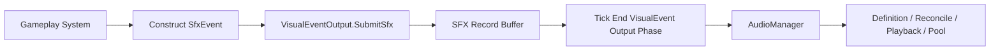

# 特效音效与回滚账本

## 目标实现

事件身份稳定，回滚不重复播放已完成一次性音效。

## 技术方案

VfxManager、AudioManager 分别管理定义、池和回滚账本；PresentationEventId=SourceLogicTick+SourceKind+SourceRuntimeUid+EventSequence+EventKey，支持 OneShotNoReplay、DurationCorrectable、LoopState。

## 边界情况

Gameplay 不直接 Play 音效；每 manager 独立账本；事件序号归源运行时所有，表现不新增第二序号。

## 验收条件

- 正常路径达到上述目标，并由所属模块唯一拥有权威状态。
- 以上边界情况有明确返回、拒绝或可见失败；不得用占位成功代替行为。
- 确定性逻辑比较重复执行、改变插入顺序以及捕获/恢复/重演结果；只读界面不得改变 Gameplay。

## 工程实际核查

本期检索的是当前源码和测试定义。存在实现不等于完成全部需求，存在测试不等于本期已运行通过。

- `Assets/Scripts/FrameSync/AudioManager.cs`：当前关联实现定义 AudioManager（以源码为实际命名）。
- `Assets/Scripts/FrameSync/VfxManager.cs`：当前关联实现定义 VfxManager（以源码为实际命名）。
- `Assets/Scripts/Gameplay/Presentation/PresentationEventId.cs`：当前关联实现定义 PresentationSourceKind、SfxAnchor、PresentationEventKeys、PresentationEventId（以源码为实际命名）。

### 已有测试位置

- `Assets/Scripts/FrameSync/Tests/VfxManagerPreloadTests.cs`：PreloadAsync_LoadsOnceAndCreatesOneInactivePoolInstance、PreloadAsync_SkipsVfxOwnedByUnselectedHeroes。
- `Assets/Scripts/Bootstrap/Tests/EditMode/PresentationEventDispatcherTests.cs`：Replay_DoesNotDispatchCompletedEventAgain、CompleteIdentity_KeepsDistinctEvents、VfxAndSfx_UseIndependentHistories。

## 附录：精确接口、公式与配置

附录保留本功能必须精确表达的接口、运算和配置语义，原系统章节已拆到所属功能。若与上面的已接受修订仍有冲突，进入待确认清单而不是按旧版本执行。

### 定位

`VfxManager` 是所有 ParticleSystem 特效实例的全局管理入口。它读取 VFX 配置，解析动态参数和语义挂点，使用 Unity `ObjectPool<T>` 租借与回收实例，并处理回滚后的保留、停止、重建和进度校正。

单位不保存 VFX 实例，只通过 `PresentationSocketSet` 提供挂点。`VfxManager` 不播放动画、不播放音效，也不判断技能命中和单位死亡。

---

### `VfxDefinition`

`VfxDefinition` 描述一个特效如何表现，而不是某一次 Gameplay 事件何时发生。

| 配置 | 说明 |
|---|---|
| `VfxDefId` | 稳定表现配置 ID |
| `ParticlePrefabId` | 全局预制体表中的 ParticleSystem 预制体 ID |
| `PlaybackPolicy` | `OneShotNoReplay / DurationCorrectable / LoopState` |
| `DurationResolveMode` | 固定、ParticleSystem 自身、参数化、跟随 Gameplay 状态 |
| `DurationAuthoring` | 固定秒数、最小最大值、插值曲线等表现配置 |
| `DefaultAnchorPolicy` | 世界、来源挂点、目标挂点或根节点 |
| `DefaultSocketKey` | 默认语义挂点 |
| `ParameterBindings` | ChargeRatio、SourceDurationTicks、Intensity 等语义参数如何影响缩放、速度、发射率和持续时间 |
| `PoolConfig` | 预热、容量、扩容和 CollectionCheck |

同一个 ParticleSystem 预制体可以被多个 `VfxDefinition` 复用。对象池按 `ParticlePrefabId` 分池，表现规则按 `VfxDefId` 解析。

---

### VFX 持续时间的三种来源

“持续时间归表现配置”表示解析规则归 VFX，而不是所有持续时间都必须写死。

#### 固定表现时长

普通命中火花、短暂治疗闪光等特效，可以直接使用固定秒数或 ParticleSystem 自身时长。Gameplay 不传持续时间。

#### 参数化表现时长

蓄力、强度或飞行时间会影响特效时，Gameplay 事件提供技能语义参数，例如 `ChargeRatio`、`ChargeTicks`、`SourceDurationTicks` 或 `Intensity`。`VfxDefinition` 决定这些参数如何映射为最终持续时间、缩放、播放速度和发射率。

Gameplay 提供的是逻辑语义，不直接指定 ParticleSystem 必须播放多少秒。

#### 跟随 Gameplay 生命周期

Buff 光环、引导、持续区域等特效使用 `LoopState`。只要对应逻辑状态仍存在，特效就保持；状态结束后停止。也可以使用确定性的 Start / End 事件或逻辑过期 Tick。

**帧同步设计关注点：**影响事件重演和生命周期判断的 ChargeTicks、ExpireLogicTick、Buff 实例状态等数据由其 Gameplay 所属系统负责保存。`VfxManager` 解析出的最终秒数属于可重建表现状态。

---

### 独立 `VfxEvent`

VFX 使用独立事件通道，不与 SFX 合并。Gameplay 侧先生成纯数据记录，并在固定 Tick 末的 `VisualEvent Output Phase` 输出给 `VfxManager`。

一条 `VfxEvent` 至少包含稳定事件身份、`VfxDefId`、开始 LogicTick、来源或目标挂点、世界位置和方向，以及该特效真正需要的少量确定性语义参数。

事件不携带 `PlaybackPolicy`，因为策略由 `VfxDefinition` 决定。事件也不直接携带最终 ParticleSystem 持续秒数、播放速度和缩放；这些由定义根据语义参数解析。

动态参数不使用任意 `object` 字典。首期使用少量稳定值类型字段；英雄专属特效需要更多参数时，使用明确的专用参数结构。

---

### Unity `ObjectPool`

`VfxManager` 为每个 `ParticlePrefabId` 维护独立 `ObjectPool<PooledParticleInstance>`。

租借时完成定义解析、挂点绑定、局部变换、ParticleSystem 参数和回滚起始进度设置。回收时必须停止粒子、清理父节点、缩放、局部坐标、事件身份和所有运行时覆盖参数，避免对象池污染下一次播放。

持续特效、单位挂点特效和世界区域特效都由同一个 `VfxManager` 管理，但它们使用各自的播放策略和 Anchor 配置。

### 定位

`AudioManager` 是独立于 `VfxManager` 的全局音效管理器。它负责 AudioClip 和 AudioEmitter 配置、2D/3D 声源、一次性音效、循环音效、音频内部序列、Unity 对象池，以及回滚后的去重、恢复和停止。

VFX 与 SFX 可以由同一技能产生，但必须各自决定发生 Tick、定义 ID、动态参数和回滚策略。

---

### `SfxDefinition`

| 配置 | 说明 |
|---|---|
| `SfxDefId` | 稳定音效配置 ID |
| `AudioClipId / ClipSet` | 一个或多个音频资源 |
| `AudioEmitterPrefabId` | 可选的全局声源预制体 ID |
| `PlaybackShape` | OneShot、Loop、Charge 或 IntroLoopOutro |
| `PlaybackPolicy` | `OneShotNoReplay / DurationCorrectable / LoopState` |
| `SpatialMode` | 2D 或 3D |
| `DefaultVolume / Pitch` | 默认音频参数 |
| `ParameterBindings` | ChargeRatio、Intensity 等语义参数如何影响音量、音调和片段选择 |
| `PoolConfig` | AudioEmitter 池配置 |

短音头接长循环、循环结束后播放尾音等纯音频编排，可以由 `SfxDefinition` 的 `IntroLoopOutro` 结构处理。它仍然只属于音频模块，不和 VFX 组成统一表现包。

---

### 独立 `SfxEvent` 与正式提交入口

SFX 使用自己的事件通道和 `PresentationEventId`。Gameplay 系统只构造纯数据 `SfxEvent`，然后调用表现层现有的正式入口：

```csharp
VisualEventOutput.SubmitSfx(in SfxEvent evt);
```

该函数只负责：

```text
1. 校验 SfxEvent 的最小字段。
2. 写入当前 LogicTick 的独立 SFX 记录缓冲。
3. 保持记录原始顺序。
4. 等待 Tick 末 VisualEvent Output Phase。
```

它不负责：

```text
立即播放 AudioSource
查询或租借 AudioEmitter
解析 SfxDefinition
执行回滚去重
修改 Gameplay
给 AttackHandler 返回播放结果
```

固定链路：



`VisualEventOutput` 同时可以提供独立的：

```csharp
VisualEventOutput.SubmitVfx(in VfxEvent evt);
```

但两类函数写入不同缓冲，最终由不同管理器消费；这不构成统一 VFX/SFX Cue 或共同生命周期。

`SfxEvent` 至少包含：

```text
PresentationEventId Id
SfxEventId
PresentationAnchor Anchor
音频真正需要的少量确定性语义参数
```

`SfxEventId` 是稳定音效语义或定义查询 ID。`PresentationEventId` 负责回滚身份与去重。事件不携带 `PlaybackPolicy`，播放策略仍由 `SfxDefinition` 决定。

服务端权威模拟、客户端预测与客户端重演都可以生成相同的纯数据记录。Dedicated Server 使用无 Unity 音频播放的输出消费者或直接丢弃最终本地播放结果，不能要求 `AttackHandler` 依赖客户端 `AudioManager` 实例。

例如某次技能可以在不同 Tick 分别提交启动短音、持续长音开始和持续长音停止；VFX 则通过 `SubmitVfx` 在另一个 Tick 独立提交和结束。音效与特效不共享事件或持续时间。

### Unity `ObjectPool`

`AudioManager` 按 `AudioEmitterPrefabId` 维护 `ObjectPool<PooledAudioEmitter>`。

OneShot 播放完成后自动回收；Loop、Charge 和区域环境音根据当前 `LoopState` 启动、维持或停止。归还对象池前必须清理 Clip、Loop、父节点、位置、音量、Pitch、滤镜状态和事件身份。

---

### 音效回滚边界

已经听到的 OneShot 无法撤销，因此 OneShot 采用不重复播放和有限补播策略。循环和持续音效可以根据当前 Expected 状态恢复、停止或重新定位。

音频事件账本与 VFX 账本完全独立。即使某个 VFX 因回滚重新创建，也不代表对应 OneShot 必须再次播放。

### 通用稳定事件身份

VFX 与 SFX 使用彼此独立的事件通道，但复用同一种稳定事件身份结构：

```text
PresentationEventId
    SourceLogicTick
    SourceKind
    SourceRuntimeUid
    EventSequence
    EventKey
```

字段语义：

| 字段 | 说明 |
|---|---|
| `SourceLogicTick` | 产生该表现事件的 Gameplay LogicTick |
| `SourceKind` | 当前来源类型：Unit 或 Projectile |
| `SourceRuntimeUid` | `UnitUid` 或 `ProjectileUid` 的公共稳定原始值 |
| `EventSequence` | 事件生产系统提供的确定性序列 |
| `EventKey` | 稳定语义事件 ID，例如 `CommitSfxEventId` |

当前版本只支持：

```text
SourceKind.Unit
SourceKind.Projectile
```

对应关系：

| `SourceKind` | `SourceRuntimeUid` |
|---|---|
| `Unit` | `UnitUid` |
| `Projectile` | `ProjectileUid` |

不提前扩展 World、System 或其它复合来源。未来确有业务来源时，再扩展 `SourceKind`。

相同逻辑事件在回滚重演后必须生成相同 ID。实现上使用紧凑只读结构作为字典 Key，并比较完整字段，不只依赖哈希。

`PlaybackPolicy` 属于 `VfxDefinition / SfxDefinition`，不进入 `PresentationEventId`。

### `EventSequence` 的权威来源

`EventSequence` 不能由 `VfxManager` 或 `AudioManager` 在客户端本地递增。

它由产生表现事件的 Gameplay 系统确定性提供。每个生产系统自行冻结：

```text
序列作用域
数据类型
何时重置
溢出行为
```

表现层不统一要求序列固定采用某种类型或生命周期。

不同生产系统可以采用不同规则，例如投掷物表现事件可以使用投掷物自身的 Tick 内序列，战斗表现事件可以使用战斗系统的稳定请求或结果序列。

攻击 Commit 音效是明确的特殊映射：

```text
EventSequence = committedAttackSequenceIndex
EventKey = CommitSfxEventId
```

其中 `committedAttackSequenceIndex` 是 `CommitAttack` 成功输出 Gameplay 前后流程中，递增 `AttackSequenceIndex` 之前捕获的本轮攻击序列。

因此攻击模块不再分配第二套表现序列。构造完整 `SfxEvent` 后调用 `VisualEventOutput.SubmitSfx(in evt)`；这里复用的是攻击模块已经冻结的确定性本轮攻击序列，不代表所有攻击相关表现事件都必须使用 `AttackSequenceIndex`。

**帧同步设计关注点：**只要某个序列参与 `PresentationEventId`，其生产系统就必须保证相同快照、输入和配置重演后得到相同值。

### 三种回滚播放策略

播放策略配置在 `VfxDefinition` 或 `SfxDefinition` 中，而不是由单次事件临时决定。

| 策略 | 典型对象 | 回滚后的规则 |
|---|---|---|
| `OneShotNoReplay` | 短音效、瞬时闪光、一次爆点 | 已完成则不重复；未播放且仍在补播窗口内可以补播 |
| `DurationCorrectable` | 有限爆炸、冲击波、残留粒子、可定位的持续音效 | 当前时刻仍应存在时重建并快进；已结束则不创建 |
| `LoopState` | Buff 光环、引导、区域循环粒子和循环音效 | 根据当前逻辑状态保证存在或停止，不关心历史是否完成 |

`LoopState` 不进入 Completed OneShot 集合。`DurationCorrectable` 即使以前已经播放完，只要回滚后的当前时间重新落入有效区间，仍允许重建。

---

### 各管理器独立账本

`VfxManager` 与 `AudioManager` 各自维护：

| 记录 | 作用 |
|---|---|
| `ExpectedEventSet` | 当前重演结果中应该存在或应该发生的事件 |
| `PlayingEventMap` | 当前正在播放的实例及解析后运行信息 |
| `CompletedOneShotSet` | 已经完成且不应因回滚重复播放的 OneShot |

两套管理器的集合不共享。一个 VFX 是否重建不会直接改变 SFX 的 OneShot 去重结果。

这些集合属于**表现回滚缓存**，不进入 `GameplaySnapshot`。

---

### 回滚对账流程

项目快照语义为：

```text
SnapshotTick
    = 恢复该快照后下一次应该执行的 Gameplay Tick
```

当 Gameplay 恢复到 `SnapshotTick` 时，表现层执行：

1. 失效或删除 `SourceLogicTick >= SnapshotTick` 的 Expected 记录。
2. 从 `SnapshotTick` 开始随 Gameplay 重演重新收集 VFX 与 SFX 事件。
3. 分别比较新的 Expected 集合与当前 Playing 集合。
4. 按定义中的播放策略保留、停止、补播或重建实例。
5. 修正挂点、世界位置和持续进度。
6. 清理早于最旧可回滚 Tick 的完成记录。

#### `OneShotNoReplay`

已存在于 Completed 集合时不再播放。重演后首次出现且没有超过定义允许的补播窗口时可以补播。已经听到的声音无法撤销；已播放的瞬时 VFX 只做停止或淡出，不反向修改 Gameplay。

#### `DurationCorrectable`

使用：

```text
currentLogicTick = SimulationTickContext.Current.Tick
eventAgeTicks = currentLogicTick - SourceLogicTick
```

再由 Definition 解析最终表现持续时间。当前仍在有效区间时，从对象池重建并快进。

#### `LoopState`

根据恢复后的当前 Gameplay 状态或确定性的 Begin / End 输出重新建立 Expected 状态。Expected 有则保证实例存在，Expected 无则停止并回收。

### 快照与重建边界

#### 帧同步设计关注点

以下数据由其 Gameplay 所属系统审查：

- 参与 `PresentationEventId.EventSequence` 的确定性序列；
- 各生产系统自己的序列作用域、类型、重置和溢出规则；
- 攻击模块的 Start、Impact、Ready、Commit、强化和攻击序列状态；
- 技能 Blackboard 中影响未来技能运行的计数、蓄力和阶段状态；
- Buff 实例的开始、结束和周期状态；
- 战斗事件序号；
- 持续区域或逻辑效果的 Start / Expire LogicTick；
- 会影响 VFX 或 SFX 动态参数的确定性语义值。

#### 表现回滚缓存

以下数据只存在于客户端表现层：

- VFX 与 SFX 各自的 Expected、Playing、Completed 记录；
- 已解析的 Definition、挂点和表现年龄；
- `LastObservedAttackStartLogicTick`；
- 技能动画对上一帧 `AbilityCastView` 语义值的比较缓存；
- Animator State Hash 和本地过渡标记。

不包含表现层私有攻击序列计数，也不包含本地生成的表现事件序列。

#### 可重建表现状态

以下内容不进入 Gameplay 快照：

- Animator 当前 State 和 normalized time；
- Animator Trigger 消费状态和 CrossFade 过程；
- ParticleSystem 内部粒子；
- AudioSource 当前采样位置；
- Unity ObjectPool 的空闲列表；
- 已租借实例的 Unity 引用关系。

回滚后根据当前 Gameplay 状态、稳定 VFX/SFX 事件和表现配置重新建立。


## 需求演进

### 2026-10-02

变动内容：稳定表现事件身份由逻辑来源持有，Gameplay 不直接播放音效。

legacyDecision：D-014

