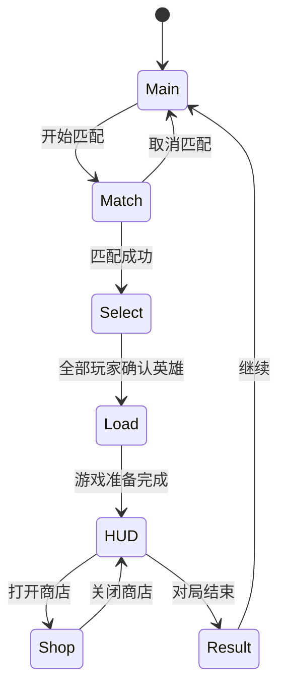
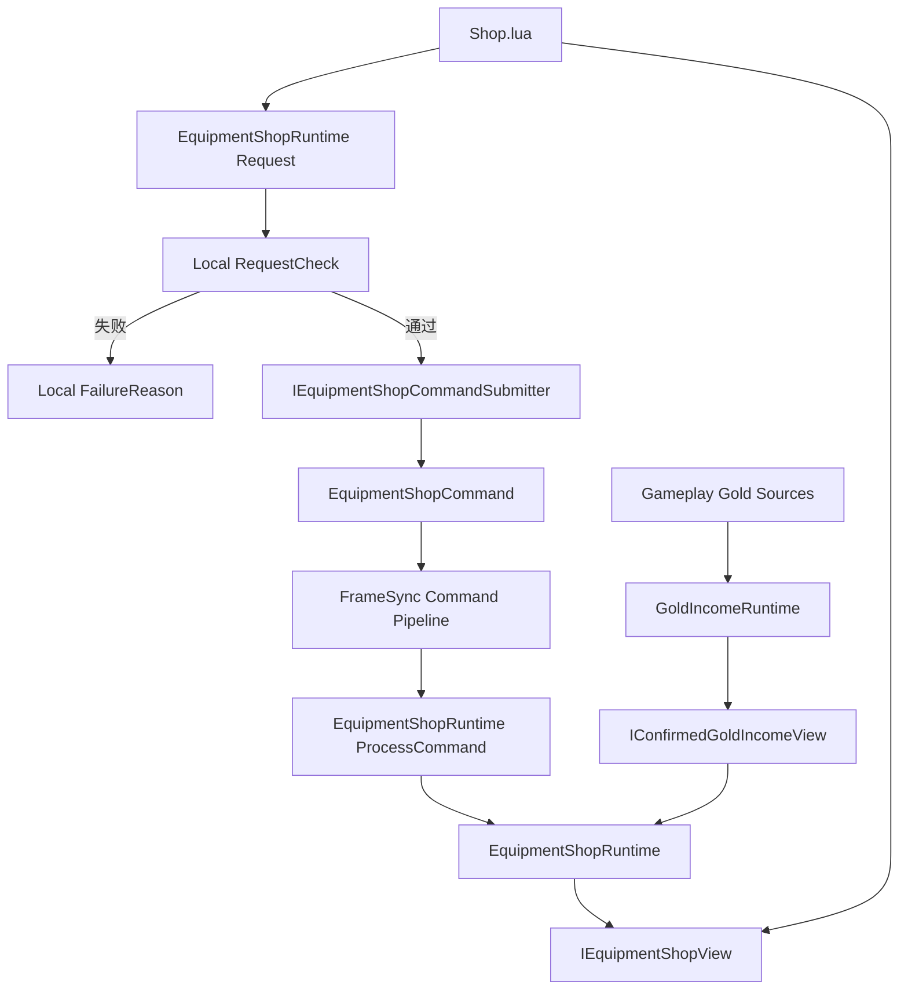
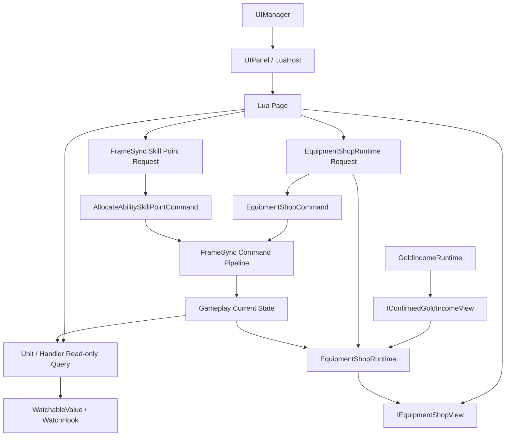
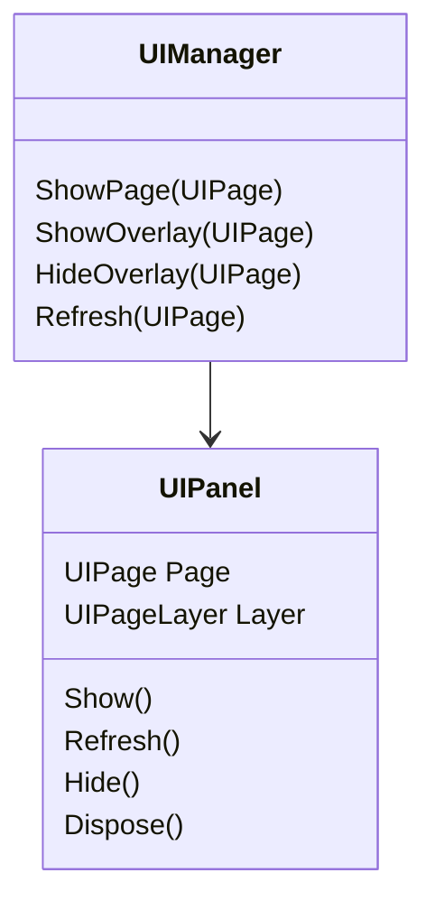
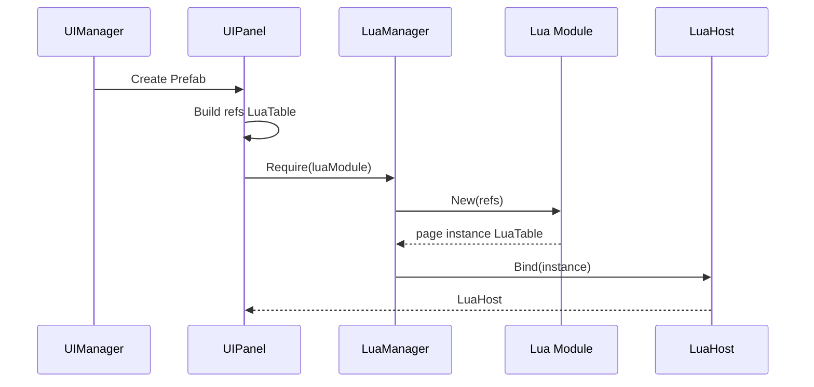

# 页面层级与 Lua 实例生命周期

## 目标实现

Main、Match、Select、Load、Result 与 HUD/Shop 覆盖页按流程显示。

## 技术方案

UIManager、UIPanel/UIPage 管理页面，LuaManager 管理环境，LuaHost 管理实例；UIList/UICell 复用格子，显式绑定与解绑。

## 边界情况

不由 UI 决定预测或回滚；页面关闭移除观察者；主机单元和页面实例不共用意外 mutable 状态。

## 验收条件

- 正常路径达到上述目标，并由所属模块唯一拥有权威状态。
- 以上边界情况有明确返回、拒绝或可见失败；不得用占位成功代替行为。
- 确定性逻辑比较重复执行、改变插入顺序以及捕获/恢复/重演结果；只读界面不得改变 Gameplay。

## 工程实际核查

本期检索的是当前源码和测试定义。存在实现不等于完成全部需求，存在测试不等于本期已运行通过。

- `Assets/Scripts/Bootstrap/UI/UIManager.cs`：当前关联实现定义 UIManager、PageRegistration（以源码为实际命名）。
- `Assets/Scripts/Bootstrap/UI/UIPanel.cs`：当前关联实现定义 UIPanel（以源码为实际命名）。
- `Assets/Scripts/LuaBridge/LuaHost.cs`：当前关联实现定义 LuaHost（以源码为实际命名）。
- `Assets/Scripts/LuaBridge/LuaManager.cs`：当前关联实现定义 LuaManager（以源码为实际命名）。
- `Assets/Scripts/LuaBridge/UI/UIList.cs`：当前关联实现定义 UIList（以源码为实际命名）。

### 已有测试位置

- `Assets/Scripts/LuaBridge/Tests/LuaHostAndManagerTests.cs`：CreateDefault_ExecutesLuaInit_AndBecomesReady、PageHost_DrivesLuaLifecycle、TwoPageInstances_AreIndependent、CellHost_SetIndexAndBind_DriveLua、Dispose_Twice_IsSafe、ManagerDispose_ReleasesOutstandingHosts、MissingNew_Throws。
- `Assets/Scripts/Bootstrap/Tests/PlayMode/UIManagerPrefabPlayModeTests.cs`：SpriteClear_RejectsAnOlderAsyncGeneration、DesignApi_ShowShowOverlayHideAndFocus、PrefabOwnsPageLifecycleAndControllers。
- `Assets/Scripts/Bootstrap/Tests/PlayMode/UiLuaPagesSmokeTests.cs`：LuaPages_BootAndFlowRoutes。
- `Assets/Scripts/Bootstrap/Tests/EditMode/PresentationAddressablesMigrationTests.cs`：ProjectilesAreSplitIntoLogicAndAddressableViews、ProjectileViewRootsAreAtWorldOrigin、MapLogicAndClientViewHaveDisjointResponsibilities、VfxAndAudioLibrariesContainAddressesNotDirectAssets、GameplayConfigurationsHaveNoDirectSpriteDependencies、UiPagesAndPresentationRootsAreAddressableAndOutsideResources、GenericSkillIndicatorsUseSupportedTransparentShader。
- `Assets/Scripts/Bootstrap/Tests/PlayMode/ClientBootstrapFirstWavePlayModeTests.cs`：GameScene_FirstWaveUsesFlowFieldsAndMoves、GameScene_MapViewAnchorsToStaticTopologyRootAtWorldOrigin。

## 附录：精确接口、公式与配置

附录保留本功能必须精确表达的接口、运算和配置语义，原系统章节已拆到所属功能。若与上面的已接受修订仍有冲突，进入待确认清单而不是按旧版本执行。

### 当前页面

| 页面 | 定位 | 当前交互 |
|---|---|---|
| `Main` | 显示系统分配的账户名 | 开始匹配、退出 |
| `Match` | 显示匹配状态和等待时间 | 取消匹配 |
| `Select` | 显示英雄头像和名字 | 选择英雄、确认英雄 |
| `Load` | 显示本地加载进度 | 无 |
| `HUD` | 显示地图、对局状态、英雄状态、属性、技能、金币和装备 | 技能悬停、技能升级申请、装备格交互、展开属性 |
| `Shop` | 展示可购买装备、详情、配方和撤销信息 | 分类、搜索、选择、购买、卖出、撤销、关闭 |
| `Result` | 显示胜利或失败 | 返回主菜单 |

当前不设计：

```text
Login
Register
独立 Lobby 页面
Settings
Chat
Signal
Scoreboard
Spectator
Replay
Skin
Mail
Social
Achievement
BattlePass
```

### 页面层级

主页面同一时间只显示一个：

```text
Main
Match
Select
Load
HUD
Result
```

局内页面作为 `BattleOverlay` 覆盖在 HUD 上：

```text
Shop
```

未来增加的计分板、局内设置、英雄信息等页面，也使用相同的 Overlay 规则。

UI 系统只定义页面层级，不定义同屏布局。

### 页面流程



非 Gameplay 流程仍由对应流程系统决定：

```text
开始匹配
取消匹配
选择英雄
确认英雄
加载完成
进入结算
返回主菜单
```

### UI 当前接触的 C# 内容

Lua UI 可以直接访问：

```text
静态配置数据库
Unit 与 Handler 的公开只读查询
WatchableValue / WatchHook
IEquipmentShopView
应用和大厅流程入口
帧同步或 Gameplay 的类型化 Request 入口
```

#### 静态配置数据库

```text
GlobalGameplayData.EquipmentDatabase
GlobalGameplayData.GlobalParamTable
GlobalGameplayData.HeroConfigTable
GlobalGameplayData.AbilityDatabase
地图表现配置
```

商店商品直接来自：

```text
EquipmentDatabase.Definitions
```

当前正式注册的装备均属于标准商店商品，不使用：

```text
Definition.Purchasable
Definition.Sellable
EquipmentShopDefinition
EquipmentShopDatabase
独立 Shop Catalog
ShopId
```

Lua 可以读取：

```text
EquipmentDefinition.Id
Name
Description
Icon
Tier
Value
MaxStack
CanStack
FixedStats
Effects
Tags
Recipe
```

#### Unit 与 Handler 的公开只读查询

HUD 可以读取：

```text
Unit.StatHandler
Unit.AbilityHandler
Unit.EquipmentHandler
Unit.ActionStateView
```

技能栏读取：

```text
AbilityHandler.PendingSkillPoints
AbilityHandler.CanAllocateSkillPoint(slot)
AbilityBook
AbilityRuntime
AbilityHandler.TryGetCurrentCast()
```

装备栏读取：

```text
EquipmentHandler 的六个只读槽位
EquipmentInstance.Definition
EquipmentInstance.StackCount
EquipmentInstance.ChargeCount
EquipmentInstance.ReadyTick
```

#### `IEquipmentShopView`

UI 使用绑定当前本地玩家的只读商店视图：

```csharp
public interface IEquipmentShopView
{
    int GetCurrentAvailableGold();

    int CalculatePurchasePrice(
        EquipmentId targetEquipmentId);

    bool CanUndo();
}
```

用途：

```text
GetCurrentAvailableGold
    HUD 金币。

CalculatePurchasePrice
    当前选中商品的动态实际购买价格。

CanUndo
    撤销按钮是否可用。
```

这些查询不提交 Command，也不修改 Gameplay。

#### WatchableValue / WatchHook

UI 可按需监听：

```text
CurrentHealth
CurrentShield
CurrentResource
Level
CurrentExperience
指定 StatId 的最终值
```

`WatchHook`：

```text
不进入 GameplaySnapshot
不决定 Gameplay 结果
回调只刷新 UI
```

Lua 不动态订阅 `UnitEventBus`。

#### 类型化 Request 入口

技能升级：

```text
FrameSyncGameRuntime.RequestAllocateAbilitySkillPoint(slot)
```

商店：

```text
EquipmentShopRuntime.RequestPurchase(player, equipmentId)
EquipmentShopRuntime.RequestSell(player, equipmentSlot)
EquipmentShopRuntime.RequestUndo(player)
```

购买不传目标槽位。

### `EquipmentShopRuntime` 与 `GoldIncomeRuntime` 的定位

`GoldIncomeRuntime` 是一局内所有 Gameplay 金币获取的唯一总控：

```text
初始金币基线
自然金币
补刀奖励
击杀与助攻奖励
地图目标和比赛规则奖励
金币请求批次
未确认批次历史
金币批次摘要
连续 AuthorityFrame 确认
ConfirmedEarnedGoldTotal
ConfirmedIncomeThroughTick
```

`EquipmentShopRuntime` 负责：

```text
购买
卖出
撤销
购买计划
装备槽位变化
OperationLog
UndoableOperationStack
EffectiveShopGoldDelta
```

两者关系：

```text
GoldIncomeRuntime
    -> IConfirmedGoldIncomeView
    -> EquipmentShopRuntime

EquipmentShopRuntime
    -> IEquipmentShopView
    -> HUD / Shop
```

`EquipmentShopRuntime` 只读取：

```text
GoldIncomeRuntime.GetConfirmedEarnedGoldTotal(player)
```

然后派生：

```text
CurrentAvailableGold =
    ConfirmedEarnedGoldTotal
    + EffectiveShopGoldDelta
```

UI 不直接使用 `IConfirmedGoldIncomeView`。

### UI 与商店系统的边界



UI 负责：

```text
显示配置与当前装备
显示当前可用金币
显示动态购买价格
显示单个单位的卖出金额
调用 Request
```

UI 不负责：

```text
RequestGoldIncome
金币批次构建与 Seal
AuthorityFrame 金币确认
构建 PurchasePlan
选择组件
决定目标槽位
执行堆叠增减
修改装备
写 OperationLog
维护撤销栈
```

### UI 不参与预测和回滚

UI 不处理：

```text
CommandHeader
CommandSequence
TargetTick
AuthorityFrame
Snapshot
Rollback
Replay
AuthorityRecovery
```

状态恢复或重演完成后，UI 重新查询当前公开状态。

### 不同 UI 操作走不同通路

| UI 操作 | 通路 |
|---|---|
| 开始/取消匹配 | 应用流程 |
| 选择/确认英雄 | 大厅流程 |
| 技能 Hover | Lua 页面状态 |
| 点击技能升级按钮 | `RequestAllocateAbilitySkillPoint(slot)` |
| 按住 C 展开属性 | Lua 页面状态 |
| 选择分类、搜索和商品 | Lua 页面状态 |
| 点击 HUD 装备格 | Shop 页面焦点 |
| 购买 | `RequestPurchase(player, equipmentId)` |
| 卖出 | `RequestSell(player, slot)` |
| 撤销 | `RequestUndo(player)` |
| 交换槽位 | 当前 UI 不实现 |
| 使用主动物品 | 当前 HUD 不实现 |

### 总体结构



### 定位

`UIManager` 是 UI 运行时单例和页面组合根。

它负责：

| 职责 | 说明 |
|---|---|
| 页面注册 | 保存 `UIPage -> UIPanel Prefab` |
| 页面创建 | 第一次使用时实例化 |
| 主页面切换 | 切换 Main、Match、Select、Load、HUD、Result |
| Overlay 管理 | 在 HUD 上方显示 Shop 等局内页面 |
| 页面查找 | 在内部查找已经创建的 `UIPanel` |
| 页面刷新 | 调用目标 `UIPanel.Refresh()` |
| 页面释放 | 应用或场景退出时释放 Lua 与 Prefab |

它不负责：

```text
保存页面业务数据
读取商品数据库
构建商店列表
构建 HUD 属性
创建 EquipmentShopCommand
执行技能点分配
逐帧调用全部 Lua Update
通过字符串调用任意 Lua 方法
```

### `UIPage`

```csharp
public enum UIPage
{
    Main,
    Match,
    Select,
    Load,
    HUD,
    Shop,
    Result
}
```

`UIPage` 是页面稳定 ID。

它用于：

```text
注册页面
查找页面
显示页面
隐藏页面
刷新页面
```

它不保存：

```text
页面数据
LuaTable
Prefab 实例
生命周期状态
```

### 页面层级

```csharp
public enum UIPageLayer
{
    Main,
    BattleOverlay
}
```

```text
Main Layer:
    Main
    Match
    Select
    Load
    HUD
    Result

BattleOverlay Layer:
    Shop
```

第一版同一时间只打开一个 `BattleOverlay`。

### 页面根节点

```text
UIRoot
├── PageRoot
└── OverlayRoot
```

`Shop` 打开时，HUD 不执行 `Hide`。

### 核心接口

```csharp
public sealed class UIManager : MonoBehaviour
{
    public static UIManager Instance { get; private set; }

    public void ShowPage(UIPage page);
    public void ShowOverlay(UIPage page);

    public void HideOverlay(UIPage page);

    public void Refresh(UIPage page);
    public bool IsOpen(UIPage page);

    public void CloseAll();

    // HUD 装备格和 Shop 页面之间的固定、类型明确的 UI 事件。
    public event Action<int, int> ShopOwnedEquipmentFocused;

    public void FocusShopOwnedEquipment(
        int slot,
        int equipmentId);
}
```

`FocusShopOwnedEquipment` 只发布：

```text
slot
equipmentId
```

它不卖出装备，也不调用 `EquipmentShopRuntime`。

Shop Lua 在页面显示期间订阅 `ShopOwnedEquipmentFocused`，从而更新纯页面焦点。这样不需要：

```text
跨页面字符串方法调用
UIStore
直接取得其它页面 LuaTable
```

当前 Lua 页面可以在必要时直接使用：

```lua
CS.UIManager.Instance:HideOverlay(UIPage.Shop)
```

不需要把 `UIManager` 放进 `UIContext` 或缓存到每个页面实例中。

### 显示主页面

```pseudo
function ShowPage(page):
    assert page belongs to Main layer

    hide current overlay

    if current main page is different:
        hide current main page
        current main page = get or create page
        current main page.Show()

    current main page.Refresh()
```

`Refresh()` 不再接收统一 DTO。

页面 Lua 在刷新时自行查询 C# 配置和客户端镜像。

### 显示 Overlay

```pseudo
function ShowOverlay(page):
    assert current main page is HUD
    assert page belongs to BattleOverlay layer

    if another overlay exists:
        hide it

    overlay = get or create page
    overlay.Show()
    overlay.Refresh()

    current overlay = overlay
```

### 固定刷新入口

```csharp
public void Refresh(UIPage page)
{
    if (!openedPanels.TryGetValue(page, out var panel))
        return;

    if (!panel.IsShown)
        return;

    panel.Refresh();
}
```

该入口适用于：

```text
C# 状态镜像变化后统一触发页面刷新
调试工具强制刷新
购买或出售权威结果到达后刷新
```

页面也可以自己监听 C# Changed 事件并刷新局部区域。

不再提供：

```text
CallLua(page, methodName)
CallLuaMethodInTargetPanel
```

### 生命周期关系



---

### `UIPanel` 的定位

`UIPanel` 是页面 Prefab 根节点上的 C# 组件。

它负责：

```text
保存 UIPage
保存 UIPageLayer
保存 Lua 模块路径
保存 Inspector 配置的 UIRef
创建页面 Lua 实例
持有 LuaHost
转发 Show / Refresh / Hide / Dispose
```

它不负责：

```text
页面业务
商品查询
装备交易
命令字段计算
HUD 数据格式化
页面跳转条件
```

### `UIRef`

```csharp
[Serializable]
public struct UIRef
{
    public string Name;
    public UnityEngine.Object Value;
}
```

例如 Shop Prefab：

```text
CategoryList
ItemList
DetailRoot
ItemIcon
ItemNameText
DescriptionText
BuyBtn
SellBtn
CloseBtn
StateText
```

`UIPanel` 把这些引用转换成 LuaTable：

```text
refs.CategoryList
refs.ItemList
refs.BuyBtn
```

`UIRef` 只解决：

```text
Lua 如何访问当前 Prefab 上的 Unity 组件
```

它不是依赖注入容器，也不保存业务系统。

### 页面创建



Lua 页面构造统一为：

```lua
function Page.New(refs)
```

不再传入：

```text
UIContext
UIServiceSet
Actions
UIPage
UIManager
```

### 页面生命周期

```text
Create
    ↓
New(refs)
    ↓
Show
    ↓
Refresh 0..N
    ↓
Hide
    ↓
Show / Refresh 可重复
    ↓
Dispose
```

没有统一 `Update`。

### `UIPanel` 接口示意

```csharp
public sealed class UIPanel : MonoBehaviour
{
    [SerializeField] private UIPage page;
    [SerializeField] private UIPageLayer layer;
    [SerializeField] private string luaModule;
    [SerializeField] private UIRef[] refs;

    private LuaHost host;

    public UIPage Page => page;
    public UIPageLayer Layer => layer;
    public bool IsShown { get; private set; }

    public void Build(LuaManager luaManager)
    {
        LuaTable refTable = BuildRefTable(luaManager.Env, refs);
        host = luaManager.CreatePageHost(luaModule, refTable);
    }

    public void Show()
    {
        gameObject.SetActive(true);
        IsShown = true;
        host.Show();
    }

    public void Refresh()
    {
        if (IsShown)
            host.Refresh();
    }

    public void Hide()
    {
        if (!IsShown)
            return;

        host.Hide();
        IsShown = false;
        gameObject.SetActive(false);
    }

    public void Dispose()
    {
        host?.Dispose();
        host = null;
    }
}
```

---

### 两者的区别

```text
LuaManager
    管理整个 LuaEnv。

LuaHost
    封装一个具体页面或 Cell 的 LuaTable 实例。
```

### `LuaManager`

职责：

```text
创建唯一 LuaEnv
注册 Lua Loader
执行 LuaInit.lua
require Lua 模块
调用 module.New(refs)
创建 LuaHost
执行 LuaEnv.Tick
应用退出时 Dispose LuaEnv
```

它不负责页面切换和业务逻辑。

### 模块原型与页面实例

Lua `require` 会缓存模块。

```text
require("UI.Shop")
    -> Shop 模块原型

Shop.New(refs)
    -> 当前 Shop 页面自己的 LuaTable 实例
```

模块中不能保存页面运行状态。

错误：

```lua
local Shop = {}
Shop.selectedEquipmentId = 0
return Shop
```

正确：

```lua
local Shop = {}
Shop.__index = Shop

function Shop.New(refs)
    local self = setmetatable({}, Shop)
    self.ui = refs
    self.selectedEquipmentId = 0
    return self
end

return Shop
```

### `LuaHost` 的定位

`LuaHost` 是 C# 对一个 Lua 实例 `LuaTable` 的轻量代理。

它负责：

```text
持有实例 LuaTable
创建时缓存固定生命周期委托
向 UIPanel 或 UICell 提供类型明确的方法
集中释放 Lua 委托和 LuaTable
```

它不是：

```text
业务中间层
数据缓存
事件总线
另一个 LuaManager
页面路由器
```

### 为什么保留 `LuaHost`

如果 `UIPanel` 直接操作 LuaTable：

```csharp
var refresh = table.Get<LuaFunction>("Refresh");
refresh.Call(table);
```

每个 Panel 和 Cell 都需要重复：

```text
查找函数
处理 self
处理空函数
释放 LuaFunction
释放 LuaTable
```

使用 `LuaHost` 后：

```csharp
host.Refresh();
```

`UIPanel` 不再了解 LuaTable 的调用细节。

### 页面 Host 与 Cell Host

页面 Host 缓存：

```text
Show
Refresh
Hide
Dispose
```

Cell Host 缓存：

```text
SetIndex
Bind
Dispose
```

不提供：

```text
Call(string)
InvokeAny(string)
SendMessage(string)
```

### `LuaHost` 接口示意

```csharp
public sealed class LuaHost : IDisposable
{
    private LuaTable instance;

    private Action<LuaTable> show;
    private Action<LuaTable> refresh;
    private Action<LuaTable> hide;
    private Action<LuaTable> dispose;

    public void BindPage(LuaTable value)
    {
        instance = value;

        show = value.Get<Action<LuaTable>>("Show");
        refresh = value.Get<Action<LuaTable>>("Refresh");
        hide = value.Get<Action<LuaTable>>("Hide");
        dispose = value.Get<Action<LuaTable>>("Dispose");
    }

    public void Show() => show?.Invoke(instance);
    public void Refresh() => refresh?.Invoke(instance);
    public void Hide() => hide?.Invoke(instance);

    public void Dispose()
    {
        dispose?.Invoke(instance);

        show = null;
        refresh = null;
        hide = null;
        dispose = null;

        instance?.Dispose();
        instance = null;
    }
}
```

---

### 基础 Lua 文件

```text
LuaInit.lua
UIBase.lua
UICellBase.lua
UIFormat.lua
```

| 文件 | 定位 |
|---|---|
| `LuaInit.lua` | 注册 UI Lua 常用类型和基础模块 |
| `UIBase.lua` | 页面 Lua 基类 |
| `UICellBase.lua` | Cell Lua 基类 |
| `UIFormat.lua` | 表现字符串格式化 |

### `LuaInit.lua`

```lua
GameObject = CS.UnityEngine.GameObject
Transform = CS.UnityEngine.Transform
RectTransform = CS.UnityEngine.RectTransform
Vector2 = CS.UnityEngine.Vector2
Vector3 = CS.UnityEngine.Vector3
Color = CS.UnityEngine.Color

UI = CS.UnityEngine.UI
TMP = CS.TMPro
TMP_Text = CS.TMPro.TextMeshProUGUI

UIPage = CS.UIPage
EquipmentShopOperationType = CS.EquipmentShopOperationType
EquipmentShopFailureReason = CS.EquipmentShopFailureReason
EquipmentSlotConstants = CS.EquipmentSlotConstants

function import(moduleName)
    return require(moduleName)
end

UIBase = require("UI.Core.UIBase")
UICellBase = require("UI.Core.UICellBase")
UIFormat = require("UI.Core.UIFormat")

print("Lua UI initialized")
```

不注册：

```text
Time
Input
GameManager 全局实例
UIManager 全局实例
FrameSyncGameRuntime 全局实例
```

需要单例时由页面在使用位置读取，避免持有已经失效的旧实例。

### `UIBase.lua`

定位：

```text
保存 UIRef
记录 UnityEvent 监听
记录 C# 变化监听的取消函数
统一释放
提供默认生命周期
```

```lua
local UIBase = {}
UIBase.__index = UIBase

function UIBase.New(class, refs)
    local self = setmetatable({}, class or UIBase)

    self.ui = refs

    self._unityListeners = {}
    self._unsubscribers = {}
    self._disposed = false

    return self
end

function UIBase:BindEvent(event, callback)
    event:AddListener(callback)

    table.insert(self._unityListeners, {
        Event = event,
        Callback = callback
    })

    return callback
end

function UIBase:BindClick(button, callback)
    return self:BindEvent(button.onClick, callback)
end

function UIBase:AddUnsubscriber(callback)
    table.insert(self._unsubscribers, callback)
end

function UIBase:UnbindUnityEvents()
    for i = #self._unityListeners, 1, -1 do
        local item = self._unityListeners[i]

        if item.Event ~= nil and item.Callback ~= nil then
            item.Event:RemoveListener(item.Callback)
        end

        self._unityListeners[i] = nil
    end
end

function UIBase:UnsubscribeRuntimeEvents()
    for i = #self._unsubscribers, 1, -1 do
        local callback = self._unsubscribers[i]

        if callback ~= nil then
            callback()
        end

        self._unsubscribers[i] = nil
    end
end

function UIBase:Show()
end

function UIBase:Refresh()
end

function UIBase:Hide()
    self:UnsubscribeRuntimeEvents()
end

function UIBase:Dispose()
    if self._disposed then
        return
    end

    self._disposed = true

    self:UnsubscribeRuntimeEvents()
    self:UnbindUnityEvents()

    self.ui = nil
end

return UIBase
```

### `UICellBase.lua`

```lua
local UICellBase = {}
UICellBase.__index = UICellBase

function UICellBase.New(class, refs)
    local self = setmetatable({}, class or UICellBase)

    self.ui = refs
    self.data = nil
    self.index = -1

    self._listeners = {}
    self._disposed = false

    return self
end

function UICellBase:BindEvent(event, callback)
    event:AddListener(callback)

    table.insert(self._listeners, {
        Event = event,
        Callback = callback
    })

    return callback
end

function UICellBase:BindClick(button, callback)
    return self:BindEvent(button.onClick, callback)
end

function UICellBase:SetIndex(index)
    self.index = index
end

function UICellBase:Bind(data)
    self.data = data
end

function UICellBase:Dispose()
    if self._disposed then
        return
    end

    self._disposed = true

    for i = #self._listeners, 1, -1 do
        local item = self._listeners[i]

        if item.Event ~= nil and item.Callback ~= nil then
            item.Event:RemoveListener(item.Callback)
        end

        self._listeners[i] = nil
    end

    self.data = nil
    self.ui = nil
end

return UICellBase
```

### `UIFormat.lua`

```lua
local UIFormat = {}

function UIFormat.Time(totalSeconds)
    local total = math.max(0, totalSeconds or 0)

    local minute = math.floor(total / 60)
    local second = total % 60

    return string.format("%02d:%02d", minute, second)
end

function UIFormat.Int(value)
    return tostring(value or 0)
end

function UIFormat.Decimal2(value)
    return string.format("%.2f", value or 0)
end

function UIFormat.Percent(value)
    return string.format("%d%%", value or 0)
end

return UIFormat
```

---

### 当前使用列表的区域

```text
Select.HeroList
HUD.SkillList
HUD.EquipList
HUD.MapIconList
Shop.ItemList
Shop.CategoryList，可选
```

### `UIList` 定位

`UIList` 负责：

```text
创建所需数量的 UICell
复用已创建的 Cell
调用 Cell.SetIndex
调用 Cell.Bind
隐藏多余 Cell
```

它不解析业务数据。

### `UICell` 定位

`UICell` 是 Cell Prefab 的 C# Lua 宿主。

```text
UICell
    -> UIRef LuaTable
    -> Cell Module.New(refs)
    -> Cell LuaHost
```

每个 Cell 必须有独立 Lua 实例。

### 列表刷新

```pseudo
function SetItems(items):
    ensure cells count >= items count

    for each created cell:
        if index < items count:
            show cell
            cell.SetIndex(index)
            cell.Bind(items[index])
        else:
            hide cell
```

第一版不设计：

```text
复杂 Diff
StableKey Patch
虚拟滚动
多模板混排
跨页面共享池
```

### Lua 构建 Cell 数据

Lua 可以直接读取 C# 配置和镜像，再构建轻量 Lua table：

```lua
local cells = {}

for i = 0, configs.Count - 1 do
    local config = configs[i]

    cells[#cells + 1] = {
        EquipmentId = config.EquipmentId,
        Name = config.DisplayName,
        Icon = config.Icon,
        Price = config.Value,
        Affordable = money >= config.Value
    }
end

self.ui.ItemList:SetItems(cells)
```

`Affordable` 只用于按钮和颜色显示。

它不是服务端购买合法性的最终结果。

---

### 关键组件

```text
NameText
StartBtn
QuitBtn
```

### 数据来源

```text
ClientAccountSession
GameApplicationFlowManager
Matchmaking
```

### Lua

```lua
local UIBase = require("UI.Core.UIBase")

local Main = setmetatable({}, { __index = UIBase })
Main.__index = Main

function Main.New(refs)
    local self = UIBase.New(Main, refs)

    self:BindClick(self.ui.StartBtn, function()
        CS.GameApplicationFlowManager.Instance
            :StartMatchmaking()
    end)

    self:BindClick(self.ui.QuitBtn, function()
        CS.GameApplicationFlowManager.Instance
            :QuitApplication()
    end)

    return self
end

function Main:Refresh()
    local session =
        CS.GameApplicationFlowManager.Instance
            .ClientAccountSession

    self.ui.NameText.text =
        session ~= nil and session.DisplayName or ""

    self.ui.StartBtn.interactable =
        CS.GameApplicationFlowManager.Instance
            :CanStartMatchmaking()
end

return Main
```

### 关键组件

```text
StateText
TimeText
CancelBtn
SearchingRoot
```

### Lua

```lua
local UIBase = require("UI.Core.UIBase")
local UIFormat = require("UI.Core.UIFormat")

local Match = setmetatable({}, { __index = UIBase })
Match.__index = Match

function Match.New(refs)
    local self = UIBase.New(Match, refs)

    self:BindClick(self.ui.CancelBtn, function()
        CS.GameApplicationFlowManager.Instance
            :CancelMatchmaking()
    end)

    return self
end

function Match:Refresh()
    local view =
        CS.GameApplicationFlowManager.Instance
            .MatchmakingView

    self.ui.StateText.text =
        tostring(view.State)

    self.ui.TimeText.text =
        UIFormat.Time(view.ElapsedSeconds)

    self.ui.CancelBtn.interactable =
        view.CanCancel

    self.ui.SearchingRoot:SetActive(view.IsSearching)
end

return Match
```

### 规则

```text
无倒计时。
无英雄详细面板。
HeroCell 只显示头像和名字。
等待全部玩家确认。
```

### 关键组件

```text
HeroList
ConfirmBtn
ConfirmBtnText
ConfirmStateText
```

### Lua

```lua
local UIBase = require("UI.Core.UIBase")

local Select = setmetatable({}, { __index = UIBase })
Select.__index = Select

function Select.New(refs)
    local self = UIBase.New(Select, refs)

    self:BindClick(self.ui.ConfirmBtn, function()
        CS.LobbySessionFlowNetwork.Instance
            :ConfirmLocalHero()
    end)

    return self
end

function Select:Refresh()
    local lobby =
        CS.LobbySessionFlowNetwork.Instance

    local heroTable =
        CS.GlobalGameplayData.Instance.HeroConfigTable

    local availableHeroes =
        lobby:GetSelectableHeroes()

    local cells = {}

    for i = 0, availableHeroes.Count - 1 do
        local state = availableHeroes[i]
        local config = heroTable:Get(state.HeroConfigId)

        cells[#cells + 1] = {
            HeroId = state.HeroConfigId,
            Name = config.DisplayName,
            Icon = config.Icon,
            Available = state.Available,
            Selected = state.SelectedByLocal
        }
    end

    self.ui.HeroList:SetItems(cells)

    self.ui.ConfirmStateText.text =
        string.format(
            "已确认 %d / %d",
            lobby.ConfirmedCount,
            lobby.PlayerCount)

    self.ui.ConfirmBtn.interactable =
        lobby:CanConfirmLocalHero()

    self.ui.ConfirmBtnText.text =
        lobby.LocalHeroConfirmed
        and "已确认"
        or "确认选择"
end

return Select
```

### `HeroCell.lua`

```lua
local UICellBase = require("UI.Core.UICellBase")

local HeroCell = setmetatable({}, { __index = UICellBase })
HeroCell.__index = HeroCell

function HeroCell.New(refs)
    local self = UICellBase.New(HeroCell, refs)

    self.heroId = 0

    self:BindClick(self.ui.Button, function()
        if self.heroId == 0 then
            return
        end

        CS.LobbySessionFlowNetwork.Instance
            :ChooseLocalHero(self.heroId)
    end)

    return self
end

function HeroCell:Bind(data)
    UICellBase.Bind(self, data)

    self.heroId = data.HeroId

    self.ui.Icon.sprite = data.Icon
    self.ui.NameText.text = data.Name or ""

    self.ui.Selected:SetActive(data.Selected)
    self.ui.Disabled:SetActive(not data.Available)

    self.ui.Button.interactable = data.Available
end

return HeroCell
```

### 关键组件

```text
ProgressBar
ProgressText
```

### Lua

```lua
local UIBase = require("UI.Core.UIBase")

local Load = setmetatable({}, { __index = UIBase })
Load.__index = Load

function Load.New(refs)
    return UIBase.New(Load, refs)
end

function Load:Refresh()
    local value =
        CS.GameApplicationFlowManager.Instance
            .LocalLoadProgress

    value = math.max(0, math.min(1, value))

    self.ui.ProgressBar.value = value
    self.ui.ProgressText.text =
        string.format("%d%%", math.floor(value * 100))
end

return Load
```

### 关键组件

```text
TitleText
ContinueBtn
```

### Lua

```lua
local UIBase = require("UI.Core.UIBase")

local Result = setmetatable({}, { __index = UIBase })
Result.__index = Result

function Result.New(refs)
    local self = UIBase.New(Result, refs)

    self:BindClick(self.ui.ContinueBtn, function()
        CS.GameApplicationFlowManager.Instance
            :ReturnMainMenu()
    end)

    return self
end

function Result:Refresh()
    local result =
        CS.GameApplicationFlowManager.Instance
            .LastMatchResult

    self.ui.TitleText.text =
        result.Victory and "胜利" or "失败"
end

return Result
```

---

### UI 关键外部依赖

```text
FrameSyncGameRuntime
EquipmentShopRuntime
IEquipmentShopView
EquipmentShopRequestCheck
EquipmentShopFailureReason
EquipmentDatabase
EquipmentDefinition
EquipmentHandler
EquipmentInstance
EquipmentSlot
EquipmentId
GlobalParamTable.EquipmentSellRate
AbilityHandler
AbilityRuntime
WatchableValue / WatchHook
```

`GoldIncomeRuntime` 和 `IConfirmedGoldIncomeView` 是商店系统的上游依赖。Lua 不直接调用它们。

### UI Prefab 调整

Shop 保留：

```text
BuyBtn
SellBtn
UndoBtn
BaseValueText
PurchasePriceText
StateText
```

删除：

```text
UndoStateText
UndoGoldText
```

EquipCell 区分：

```text
StackText
ChargeText
InfoSellPriceText
```

### 删除旧接口和概念

```text
GetCurrentAvailableGold
CalculatePurchasePrice
动态购买价格查询
GetSellPreview
GetUndoPreview
UndoGoldChange
UndoOperationType UI 显示
UndoFailureReason UI 显示
旧的独立金币确认层
旧的确认收入增量记录
ShopGoldFrameHistory
金币 Seed / 累计收入镜像 Seed
购买目标槽位参数
```

统一使用：

```text
IEquipmentShopView.GetCurrentAvailableGold
IEquipmentShopView.CalculatePurchasePrice
IEquipmentShopView.CanUndo
```

### 最小验证闭环

#### 动态购买价格

```text
拥有一个合成小件
    -> CalculatePurchasePrice
    -> 显示原价减小件价值
```

#### 普通装备卖出

```text
RequestSell(slot)
    -> 槽位清空
    -> 增加单件 SellValue
```

#### 堆叠消耗品卖出

```text
StackCount = 3
    -> UI 显示卖出 1 个的价格
    -> RequestSell(slot)
    -> StackCount = 2

StackCount = 1
    -> RequestSell(slot)
    -> 槽位清空
```

#### 撤销出售

```text
卖出堆叠中的 1 个
    -> CanUndo = true
    -> RequestUndo
    -> 恢复 1 个 Stack
```

---


## 需求演进

### 2026-10-02

变动内容：设备回调只入本地缓冲，UI 输入独立，回滚不重读设备。

legacyDecision：D-015

### 2026-10-02

变动内容：Bootstrap、Lobby、GameScene 分离，跨场景数据与 NGO 根有唯一 owner。

legacyDecision：D-026

