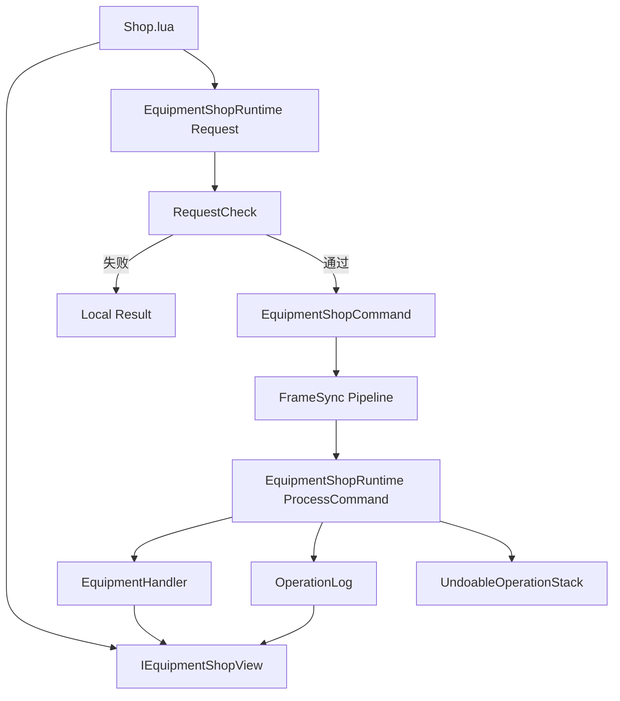

# 商店商品详情与余额刷新

## 目标实现

界面显示动态合成价格、出售金额、撤销可用性和确认余额。

## 技术方案

Shop.lua 直接调用 IEquipmentShopView 与 Request 接口；CurrentAvailableGold 来自 GoldIncomeRuntime 确认累计加商店增量。

## 边界情况

预测收入不提前可用；普通回滚和 AuthorityRecovery 后修订通知重刷；界面不暴露 ProcessCommand 或写交易状态。

## 验收条件

- 正常路径达到上述目标，并由所属模块唯一拥有权威状态。
- 以上边界情况有明确返回、拒绝或可见失败；不得用占位成功代替行为。
- 确定性逻辑比较重复执行、改变插入顺序以及捕获/恢复/重演结果；只读界面不得改变 Gameplay。

## 工程实际核查

本期检索的是当前源码和测试定义。存在实现不等于完成全部需求，存在测试不等于本期已运行通过。

- `Assets/Scripts/FrameSync/GoldIncomeRuntime.cs`：当前关联实现定义 GoldIncomeBatchDigest、GoldIncomeReason、GoldIncomeRecord、GoldIncomeRecordBatch、GoldIncomeSnapshot（以源码为实际命名）。

### 已有测试位置

- `Assets/Scripts/FrameSync/Tests/GoldIncomeRuntimeContractTests.cs`：EmptyAndNonemptyTicks_SealDigestAndConfirmContinuously、Restore_RejectsTamperedDigest。
- `Assets/Scripts/Bootstrap/Tests/EditMode/GameplayIntegrationTests.cs`：TickContext_InitializesWithCorrectTick、TickContext_AdvancesCorrectly、DeterministicRandom_ProducesSameSequenceForSameSeed、UnitUid_ComparisonAndSorting、PathGrid_Initialise_ProducesValidGrid、AStar_FindPath_ReturnsValidPath、FlowField_BuildAndQuery_ReturnsValidDirection。
- `Assets/Scripts/FrameSync/Tests/EquipmentShopViewTests.cs`：CurrentAvailableGold_UsesConfirmedIncomeAndEffectiveShopDelta。
- `Assets/Scripts/FrameSync/Tests/LocalCommandGoldMatchFlowTests.cs`：FutureCommand_IsRetainedAndConsumedOnlyAtTargetTick、CastIntentAndAction_PreserveCommitVerbAndDirectionAim、PlanCastIntent_UsesAbilityCastRange_NotHardcoded、NaturalGold_IsTickDerivedCanonicalAndInsideOpenBatch、ClientPredictionCannotEnterEnding_ButServerAuthorityCan。
- `Assets/Scripts/FrameSync/Tests/MatchGoldRewardTests.cs`：GoldAllocation_UsesIntegerAmountContract、MinionLastHit_ConfirmsFullConfiguredGold、MonsterLastHit_UsesAuthoredCreepScoreValue、HeroKill_WithTwoAssistants_Splits300As180_60_60、HeroKill_WithoutAssistants_ConfirmsFull300ToKiller。

## 附录：精确接口、公式与配置

附录保留本功能必须精确表达的接口、运算和配置语义，原系统章节已拆到所属功能。若与上面的已接受修订仍有冲突，进入待确认清单而不是按旧版本执行。

### Shop 的职责

Shop Lua 负责：

```text
读取 EquipmentDatabase
分类、搜索和选择商品
显示装备详情和配方
读取 IEquipmentShopView
显示动态购买价格
显示单个单位的卖出金额
调用 RequestPurchase / RequestSell / RequestUndo
显示购买和卖出的本地 RequestCheck FailureReason
```

Shop Lua 不负责：

```text
创建 EquipmentShopCommand
访问 CommandCollector
计算购买组件
决定购买目标槽位
执行堆叠变化
修改金币或装备
读取撤销交易详情
```

### 关键组件

```text
CategoryList
SearchInput
ItemList

DetailRoot
ItemIcon
ItemNameText
TierText
BaseValueText
PurchasePriceText
DescriptionText
FixedStatsList
EffectsList
TagsList
RecipeList

BuyBtn
SellBtn
UndoBtn

CloseBtn
StateText
```

删除：

```text
UndoStateText
UndoGoldText
TransactionList
```

### Shop 本地页面状态

Lua 只保存：

```text
currentCategory
searchText
focusKind
selectedEquipmentId
focusOwnedSlot
scrollPosition
detailExpanded
```

不保存：

```text
金币副本
交易记录
撤销栈
购买计划
组件槽位
目标放置槽位
装备对象引用
```

### 获取商店对象

```lua
function Shop:GetShopRuntime()
    local frame =
        CS.FrameSyncGameRuntime.Instance

    if frame == nil
        or frame.GameplayRuntime == nil then
        return nil
    end

    return frame.GameplayRuntime.EquipmentShopRuntime
end

function Shop:GetShopView()
    local frame =
        CS.FrameSyncGameRuntime.Instance

    return frame ~= nil
        and frame.LocalEquipmentShopView
        or nil
end

function Shop:GetLocalPlayerSlot()
    local frame =
        CS.FrameSyncGameRuntime.Instance

    return frame ~= nil
        and frame.LocalPlayerSlot
        or CS.PlayerSlot.Invalid
end
```

### 商品数据来源

遍历：

```text
GlobalGameplayData.EquipmentDatabase.Definitions
```

Lua 只按分类、标签、Tier 和搜索文字筛选。

### 选择商品

选择商品时保存：

```text
focusKind = CatalogEquipment
selectedEquipmentId
```

然后刷新：

```text
详情
动态购买价格
购买按钮
```

### 从 HUD 选择已拥有装备

```text
EquipCell 点击
    -> Shop 保存 focusOwnedSlot
    -> 每次刷新重新读取该槽位当前 EquipmentInstance
```

UI 不保存旧装备对象。

### 商品详情

静态展示读取：

```text
Name
Description
Icon
Tier
Value
FixedStats
Effects
Tags
Recipe
```

`BaseValueText` 显示 `Definition.Value`。

`PurchasePriceText` 显示：

```text
IEquipmentShopView.CalculatePurchasePrice(
    selectedEquipmentId)
```

### 动态购买价格

```lua
function Shop:RefreshPurchasePrice()
    local view = self:GetShopView()

    if view == nil
        or self.selectedEquipmentId == 0 then
        self.ui.PurchasePriceText.text = "--"
        return
    end

    local price =
        view:CalculatePurchasePrice(
            self.selectedEquipmentId)

    self.ui.PurchasePriceText.text =
        tostring(price)
end
```

该价格会扣除正式交易规划当前可以消耗的小件价值。

UI 不读取组件列表。

### 购买

```lua
function Shop:OnBuyClicked()
    local shop = self:GetShopRuntime()

    if shop == nil then
        return
    end

    local result =
        shop:RequestPurchase(
            self:GetLocalPlayerSlot(),
            self.selectedEquipmentId)

    if not result.Allowed then
        self:ShowFailure(
            result.FailureReason)
    end

    self:Refresh()
end
```

购买请求不携带槽位。

### 卖出金额

卖出金额由 Lua 计算：

```lua
function Shop:GetSingleUnitSellValue(
    equipmentInstance)

    if equipmentInstance == nil then
        return 0
    end

    local definition =
        equipmentInstance.Definition

    local rate =
        CS.GlobalGameplayData.Instance
            .GlobalParamTable
            .EquipmentSellRate

    return UIFormat.CalculateSellValue(
        definition.Value,
        rate)
end
```

含义：

```text
普通装备：
    显示整个装备的卖出金额。

堆叠消耗品：
    显示卖出 1 个消耗品的金额。
    不乘 StackCount。
```

### 卖出与堆叠消耗品

```lua
function Shop:OnSellClicked()
    local shop = self:GetShopRuntime()

    if shop == nil then
        return
    end

    local result =
        shop:RequestSell(
            self:GetLocalPlayerSlot(),
            self.focusOwnedSlot)

    if not result.Allowed then
        self:ShowFailure(
            result.FailureReason)
    end

    self:Refresh()
end
```

正式语义：

```text
非堆叠装备：
    RequestSell(slot)
    -> 清空槽位。

Consumable 且 StackCount > 1：
    RequestSell(slot)
    -> 只卖出 1 个。
    -> StackCount -= 1。

Consumable 且 StackCount == 1：
    RequestSell(slot)
    -> 清空槽位。
```

每次成功卖出只追加一笔单单位出售交易记录。

撤销该笔出售时，也只恢复这一个单位。

UI 不在点击时提前修改 `StackCount`。

### 撤销

撤销 UI 只保留：

```text
UndoBtn
```

刷新：

```lua
function Shop:RefreshUndo()
    local view = self:GetShopView()

    self.ui.UndoBtn.interactable =
        view ~= nil
        and view:CanUndo()
end
```

点击：

```lua
function Shop:OnUndoClicked()
    local shop = self:GetShopRuntime()

    if shop == nil then
        return
    end

    shop:RequestUndo(
        self:GetLocalPlayerSlot())

    self:RefreshUndo()
end
```

UI 不显示：

```text
撤销购买或撤销卖出
撤销后的金币变化
撤销失败原因
```

### Shop.lua 主结构

```lua
function Shop:Refresh()
    self:RefreshCatalog()
    self:RefreshDetail()
    self:RefreshPurchasePrice()
    self:RefreshSellDetail()
    self:RefreshButtons()
    self:RefreshUndo()
end
```

关闭 Shop 页面不会取消已提交 Command，也不等于离开商店范围。

---

### 正式 Request

```csharp
public EquipmentShopRequestCheck RequestPurchase(
    PlayerSlot localPlayer,
    EquipmentId target);

public EquipmentShopRequestCheck RequestSell(
    PlayerSlot localPlayer,
    EquipmentSlot sourceSlot);

public EquipmentShopRequestCheck RequestUndo(
    PlayerSlot localPlayer);
```

### 购买边界

购买只表达：

```text
哪个玩家
购买哪个 EquipmentId
```

不携带：

```text
目标槽位
组件槽位
购买计划
最终价格
交易后六格
```

这些均由目标 LogicTick 的交易规划派生。

### 卖出边界

卖出只表达：

```text
哪个玩家
卖出哪个 EquipmentSlot
```

方案 B 正式冻结：

```text
非堆叠装备：
    移除整个 EquipmentInstance。

CanStack == true 且 StackCount > 1：
    只减少 1 个 Stack。

CanStack == true 且 StackCount == 1：
    清空槽位。
```

卖出金额：

```text
SingleUnitSellValue =
    Definition.Value
    × EquipmentSellRate
```

堆叠出售不乘当前 `StackCount`。

实现兼容要求：

```text
EquipmentShopRuntime.ProcessCommand(Sell)
    若 Definition.CanStack == true
    且 StackCount > 1
        -> 只减少一个 Stack。

    否则
        -> 清空槽位。
```

装备系统文档若只写“EquipmentHandler 移除装备”，实现时必须按上述已冻结规则细化，不能整组卖出。

### RequestCheck 与 ProcessCommand

RequestCheck：

```text
只检查当前本地请求
通过时提交 Command
不修改 Gameplay
```

ProcessCommand：

```text
在目标 Tick 重新读取当前状态
重新执行正式规则
成功后原子修改装备和交易记录
```

### Command 提交端口

```csharp
public interface IEquipmentShopCommandSubmitter
{
    void SubmitPurchase(
        PlayerSlot player,
        EquipmentId item);

    void SubmitSell(
        PlayerSlot player,
        EquipmentSlot sourceSlot);

    void SubmitUndo(
        PlayerSlot player);
}
```

UI 不获取该端口。

### `IEquipmentShopView`

```csharp
public interface IEquipmentShopView
{
    int GetCurrentAvailableGold();

    int CalculatePurchasePrice(
        EquipmentId targetEquipmentId);

    bool CanUndo();
}
```

它绑定当前本地玩家。

### Request 结果

```text
Allowed == false
    未提交 Command。
    购买或卖出可以显示 FailureReason。

Allowed == true
    Command 已提交。
    不表示交易已经成功。
```

撤销失败原因当前 UI 不显示。

### 最终链路



### UI 不暴露的内容

```text
EquipmentPurchasePlan
ConsumedComponentSlots
DestinationSlot
SlotChanges
OperationLog
UndoableOperationStack
确认收入记录
```

---

### 金币唯一权威

所有 Gameplay 金币来源统一调用：

```text
GoldIncomeRuntime.RequestGoldIncome
```

包括：

```text
自然金币
补刀
击杀
助攻
地图目标
比赛规则奖励
```

商店购买、出售和撤销不调用 `RequestGoldIncome`。

它们只通过：

```text
EquipmentShopRuntime.OperationLog
ShopOperationRecord.GoldDelta
ShopOperationRecord.Reverted
```

表达可逆交易变化。

### 当前可用金币

```text
CurrentAvailableGold =
    ConfirmedEarnedGoldTotal
    + EffectiveShopGoldDelta
```

```text
ConfirmedEarnedGoldTotal
    由 GoldIncomeRuntime 维护。

EffectiveShopGoldDelta
    由 EquipmentShopRuntime 从未撤销交易记录派生。
```

Lua 只调用：

```text
IEquipmentShopView.GetCurrentAvailableGold()
```

`CurrentAvailableGold`：

```text
是只读派生值
不能直接赋值
不网络同步
不进入 GameplaySnapshot
不保存逐 Tick 历史
```

### 预测收入的显示与可用性

客户端预测阶段可以生成：

```text
GoldIncomeRecordBatch[T]
```

但未确认批次：

```text
不增加 ConfirmedEarnedGoldTotal
不增加 CurrentAvailableGold
不参与购买 RequestCheck
不参与商店 ProcessCommand
```

Tick `T` 的收入只有在对应 AuthorityFrame 被接受并确认后，才从 Tick `T + 1` 起可用于购买。

HUD 不显示另一套“预测可购买余额”。

项目将来可以单独增加待确认金币表现，但它不能进入 `GetCurrentAvailableGold()`。

### 购买、出售和撤销的预测余额

商店交易仍属于可回滚 Gameplay：

```text
预测购买成功
    -> 有效负 GoldDelta
    -> GetCurrentAvailableGold 下降。

预测出售成功
    -> 有效正 GoldDelta
    -> GetCurrentAvailableGold 上升。

撤销成功
    -> 原记录 Reverted = true
    -> 该 GoldDelta 不再计入。
```

UI 不区分预测和权威，只重新查询当前值。

### 动态购买价格

```text
IEquipmentShopView.CalculatePurchasePrice(equipmentId)
```

只返回当前配方与装备栏状态下的动态应付价格。

金币确认、装备变化、交易回滚或重演后，都需要重新查询该价格。

### 卖出金额

Lua 使用：

```text
Definition.Value
GlobalParamTable.EquipmentSellRate
```

计算卖出一个单位的金额。

堆叠消耗品不乘当前 `StackCount`。

取整规则必须与 Gameplay 一致。

### 普通回滚

回滚前：

```text
GoldIncomeRuntime.DiscardUnconfirmedFromTick(
    ReplayFromTick)
```

效果：

```text
删除受影响的未确认批次和摘要
保留 ConfirmedEarnedGoldTotal
保留 ConfirmedIncomeThroughTick
重演时重新生成金币请求
```

`EquipmentShopRuntime` 随 GameplaySnapshot 恢复：

```text
OperationLog
Reverted
UndoableOperationStack
装备槽位
```

回滚结束后 UI 执行一次完整刷新。

### AuthorityRecovery

当前 `AuthorityRecovery` 只补发缺失 AuthorityFrame。

补齐后：

```text
总控按连续 Tick 接受 AuthorityFrame
必要时重演
GoldIncomeRuntime 确认对应金币批次
```

当前版本不要求 Lua 处理：

```text
金币 Seed
累计金币镜像包
BaseSnapshot
中途加入恢复
```

恢复完成后 UI 重新查询当前状态。

### 刷新时机

以下节点完成后刷新：

```text
普通客户端 Tick 完成
连续 AuthorityFrame 接受完成
金币确认导致选择性重演完成
普通 Replay 完成
AuthorityRecovery 完成
本地控制 Unit 切换
页面重新 Show
```

刷新内容：

```text
HUD 金币
HUD 装备栏
Shop 动态购买价格
Shop 单单位卖出金额
Shop 撤销按钮
```

Lua 不订阅：

```text
GoldIncomeRecordBatch
GoldIncomeBatchDigest
AuthorityFrame
OperationLog
GameplaySnapshot
```

### WatchHook 与装备栏

生命、资源、经验和属性继续使用 `WatchableValue / WatchHook`。

装备栏每次刷新重新读取当前六格。

堆叠消耗品出售后：

```text
StackCount > 1
    -> 同槽位数量减一。

StackCount == 1
    -> 槽位变空。
```

Shop 保留 `focusOwnedSlot`，但详情始终按该槽位当前内容重新查询。

### 页面关闭

关闭 Shop 不会：

```text
取消已提交 Command
清空撤销栈
离开商店范围
修改 GoldIncomeRuntime
修改装备或交易记录
```

---


## 需求演进

### 2026-10-02

变动内容：金币总控唯一拥有 builder、未确认批次、摘要和确认累计。

legacyDecision：D-005

### 2026-10-02

变动内容：可用金币为确认累计加有效商店增量，只读派生且不保存快照。

legacyDecision：D-007

### 2026-08-11

变动内容：商店 Trader 懒创建，小兵奖励距离按正式数值边界转换。

legacyDecision：D-040

