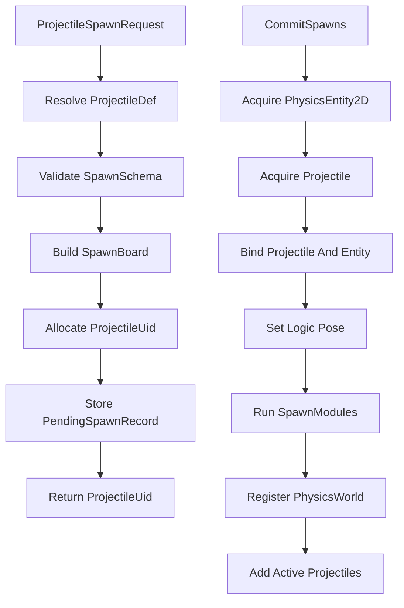

# 定义与强类型生成黑板

## 目标实现

定义配置与每次生成数据分离，运行实例保持有限且可快照状态。

## 技术方案

ProjectileDef 配置逻辑、PrefabId、阶段模块和形状；SpawnBoard 是静态布局的强类型黑板，RequestSpawn 形成稳定 pending record。

## 边界情况

逻辑配置 ID 与 PrefabId 不合并；不使用任意 object 字典；OnHitDamageOverride、MaxLifetime 与动作来源均保存到所属快照。

## 验收条件

- 正常路径达到上述目标，并由所属模块唯一拥有权威状态。
- 以上边界情况有明确返回、拒绝或可见失败；不得用占位成功代替行为。
- 确定性逻辑比较重复执行、改变插入顺序以及捕获/恢复/重演结果；只读界面不得改变 Gameplay。

## 工程实际核查

本期检索的是当前源码和测试定义。存在实现不等于完成全部需求，存在测试不等于本期已运行通过。

- `Assets/Scripts/Gameplay/Projectile/ProjectileDef.cs`：当前关联实现定义 ProjectileDef（以源码为实际命名）。
- `Assets/Scripts/Gameplay/Projectile/ProjectileSpawnRequest.cs`：当前关联实现定义 ProjectileSpawnRequest（以源码为实际命名）。

### 已有测试位置

- `Assets/Scripts/FrameSync/Tests/ProjectileCombatPipelineTests.cs`：EqualDistanceHits_AreFairnessKeyOrderedAndUseCombat、EndOnFirstHit_RejectsLaterSameTickCandidate、EqualDistanceArbitration_UidRelabelKeepsParticipantWinner、PierceBudget_EndsAtConfiguredHitCount、ProjectileDamage_UsesCombatShieldPipeline、EnemyFilter_ExcludesFriendlyTarget、EnemyFilter_IncludesStructureTarget。
- `Assets/Scripts/FrameSync/Tests/ProjectileFalloffTests.cs`：PiercingFalloff_ReducesDamagePerExtraHit、PiercingFalloff_OverridePath_MatchesStaticConfig、PiercingFalloff_ClampsAtMinDamageRatio。
- `Assets/Scripts/Gameplay/Tests/AatroxFormalContentTests.cs`：CombinedAbilityCatalog_BakesAatroxAndVarus、DarkinBlade_UsesExactThreeZonesAndRecastDelay、DarkinBlade_VfxDurationUsesConfiguredGameplayTickRate、WProjectile_FliesStraightAlongCastDirection_IgnoringTargetPosition、SequentialRecastSession_SnapshotRoundTripPreservesWindowState、SequentialRecastWindow_ExposesShortHudCooldown、FormalCatalogs_RegisterAatroxRuntimeContent。
- `Assets/Scripts/ClientContent/Tests/PlayMode/ProjectileViewBinderPlayModeTests.cs`：ProjectileViewLeaseStaysResidentAcrossLifetimes。
- `Assets/Scripts/Gameplay/Tests/AbilityAimStageTests.cs`：AreaDamageStage_CentersOnAimTargetPoint、AreaDamageStage_DoesNotDamageEnemyStructure、SpawnProjectileStage_FiresTowardAimDirection。

## 附录：精确接口、公式与配置

附录保留本功能必须精确表达的接口、运算和配置语义，原系统章节已拆到所属功能。若与上面的已接受修订仍有冲突，进入待确认清单而不是按旧版本执行。

### 定位

`ProjectileDef` 是一种投掷物的唯一静态逻辑定义。

它回答：

```text
这是什么逻辑投掷物？
它使用哪个运行时实体预制体？
生成时需要哪些外部参数？
它如何运动和推进生命周期？
它可以命中哪些单位？
命中后执行哪些逻辑？
结束时执行哪些逻辑？
```

它不回答：

```text
当前实例在哪里？
当前实例命中过谁？
当前实例还剩多少寿命？
当前实例绑定哪个 GO？
当前实例的形状参数是多少？
```

---

### 核心字段

```text
ProjectileDef
    int Id
    int PrefabId

    ProjectileTags Tags

    SpawnBoardSchema SpawnSchema
    ProjectileLifeRule LifeRule
    ProjectileTargetFilter TargetFilter
    ProjectileHitPolicy HitPolicy

    ProjectileModuleList SpawnModules
    ProjectileModuleList MotionModules
    ProjectileModuleList LifecycleModules
    ProjectileModuleList HitModules
    ProjectileModuleList EndModules
```

字段说明：

| 字段 | 说明 |
|---|---|
| `Id` | 投掷物逻辑配置 ID。技能、普攻和 Buff 通过该 ID 请求生成投掷物 |
| `PrefabId` | 指向全局运行时实体预制体表的编号 |
| `Tags` | 只描述投掷物自身的少量设计语义 |
| `SpawnSchema` | 声明生成黑板允许和必须提供的稳定字段 |
| `LifeRule` | 默认寿命、距离限制和基础结束规则 |
| `TargetFilter` | 单位候选过滤规则 |
| `HitPolicy` | 同目标命中、穿透、弹跳和结束策略 |
| `SpawnModules` | 创建并完成基础绑定后调用一次 |
| `MotionModules` | `AdvanceMotion` 阶段调用 |
| `LifecycleModules` | `UpdateLifecycle` 阶段调用 |
| `HitModules` | 已确认命中后在 `EmitEffects` 阶段调用 |
| `EndModules` | 投掷物结束时调用一次 |

---

### 为什么内部字段叫 `PrefabId`

公共跨系统契约使用：

```text
GlobalPrefabTable
PrefabKind = Projectile
RuntimeEntityPrefabId
```

但在 `ProjectileDef` 内部已经具有明确的投掷物定义语境，因此字段保持简洁：

```text
ProjectileDef.PrefabId
```

对应关系：

```text
ProjectileDef.PrefabId
    = RuntimeEntityPrefabId
```

解析关系：

```text
ProjectileDef.PrefabId
    -> GlobalPrefabTable
    -> PrefabKind.Projectile
    -> Projectile Prefab GO
```

`PrefabId` 必须满足：

```text
1. 来自公共 GlobalPrefabTable。
2. 条目所属 PrefabKind 必须是 Projectile。
3. 与单位的 RuntimeEntityPrefabId 处于统一稳定编号契约中。
4. 参与构成 ProjectileUid。
5. 不等于表现层 VFX Prefab ID。
6. 不允许使用 Unity InstanceId 或运行时随机编号。
```

`PrefabKind` 是公共代码固定枚举，不通过 Inspector 或配置文件动态创建新类型。  
投掷物系统固定使用：

```text
PrefabKind.Projectile
```

投掷物文档不重复定义 `GlobalPrefabTable` 的表结构、Inspector、ID 范围或自动分配规则，这些由公共 Prefab 契约负责。

### `Id` 与 `PrefabId` 不合并

| 编号 | 职责 |
|---|---|
| `ProjectileDef.Id` | 选择投掷物 Gameplay 逻辑配置 |
| `ProjectileDef.PrefabId` | 选择运行时实体预制体，并参与构造 UID |

允许多个逻辑定义复用同一个运行时预制体：

```text
ProjectileDef 1001
    PrefabId 5001
    普通直线飞弹逻辑

ProjectileDef 1002
    PrefabId 5001
    强化直线飞弹逻辑
```

两个定义可以共享同一个 GO 结构和 `PhysicsEntity2D` 初始形状，但使用不同的速度、生命周期、命中模块和效果模块。

---

### `Tags` 的严格边界

`ProjectileTags` 可以保留，但只用于投掷物自身的规则识别，例如：

```text
Flying
Area
AttackSource
SpellSource
Persistent
```

禁止用 `Tags` 表达：

```text
运动方式
是否会命中
是否穿透
是否弹跳
是否能被某个技能阻挡
目标单位分类
空间形状
生命周期阶段
```

这些应分别由模块、命中策略、技能系统和 `PhysicsEntity2D` 表达。

外部规则读取 `Tags` 时，必须明确它读取的是投掷物设计语义，而不是物理能力推导结果。

---

### 明确删除的字段

`ProjectileDef` 不保存：

```text
ProjectileKind
Traits
Visual
PresentationPrefabId
CanBeBlockedByProjectileWall
ParentProjectile
RandomSeed
Shape
ShapeTemplate
PhysicsShape2D
Position
Direction
TargetUnit Runtime Reference
GameObject
Unity Prefab Reference
```

说明：

| 删除项 | 原因 |
|---|---|
| `ProjectileKind` | 容易与模块组合冲突 |
| `Traits` | 推导成本高，且可能与真实模块不一致 |
| `Visual` | 表现配置另行设计 |
| `CanBeBlockedByProjectileWall` | 风墙规则属于技能系统 |
| `Shape` | 空间形状由预制体上的 `PhysicsEntity2D` 负责 |
| Unity Prefab 引用 | 通过 `PrefabId` 查全局表 |
| Parent / Seed | 当前没有父子生命周期；随机由确定性随机模块负责 |

---

### 空间形状来源

`ProjectileDef` 不保存形状。

投掷物初始空间配置来自：

```text
ProjectileDef.PrefabId
    -> GlobalPrefabTable
    -> PrefabKind.Projectile
    -> Projectile Prefab GO
    -> PhysicsEntity2D
```

具体 Shape 数据结构、Authoring 和恢复规则由物理系统定义，投掷物文档不重复声明。

如果运行时需要变形、扩张或切换形状，对应模块只能调用物理系统正式接口：

```text
PhysicsEntity2D.SetLogicShape(...)
```

例如：

```text
ExpandAreaModule
SetRectSizeModule
SwitchToPointSweepModule
RotateSegmentModule
```

模块修改的是运行时物理实体状态，不反向修改 `ProjectileDef`。

### 定位

`SpawnBoard` 是投掷物本次生成时的只读参考书。

它解决：

```text
不同投掷物的初始化条件不同。
ProjectileDef 不应混入目标点、蓄力比例、技能等级等运行时参数。
模块不应直接长期引用 AbilitySession、AttackRuntime 或 BuffRuntime。
```

外部系统提交 `ProjectileSpawnRequest`，`ProjectileWorld` 按 `SpawnSchema` 构建 `SpawnBoard`。  
生成后，模块只能读取 Board，不能随意修改。

---

### 黑板不是任意对象字典

禁止：

```text
Dictionary<string, object>
任意字符串键
运行时反射取值
Unity Object 作为 Gameplay 值
```

推荐使用稳定 Key ID 和确定性值类型：

```text
Int
Bool
Fp
Fp2
UnitUid
ProjectileUid
StableConfigId
```

`SpawnBoardSchema` 负责声明：

```text
KeyId
ValueKind
Required
Lifetime
DefaultValue 可选
```

---

### 字段生命周期

每个黑板字段标记为：

| 生命周期 | 说明 |
|---|---|
| `InitOnly` | 只在 SpawnModules 中读取，完成初始化后不再保留 |
| `RuntimeRead` | 后续 Motion、Lifecycle、Hit 或 End 模块仍会读取 |

这样可避免所有初始化参数无条件跟随投掷物整个生命周期。

快照规则：

```text
InitOnly
    Spawn 结束后丢弃，不进入快照。

RuntimeRead
    如果会影响后续逻辑 Tick，则进入 ProjectileSnapshot。
```

---

### 常见稳定字段

```text
OwnerUnitUid
StartPosition
StartDirection
TargetUnitUid
TargetPoint
ChargeRatio
AbilityLevel
SegmentIndex
ShotIndex
CastSessionId
CustomStableKey Values
```

不建议保存 `Unit` 强引用作为黑板权威值。  
跨 Tick 目标引用保存 `UnitUid`，使用时通过 `UnitRegistry` 解析。

---

### 与 `PhysicsEntity2D` 的关系

Board 可以提供初始空间输入：

```text
StartPosition
StartDirection
```

`ProjectileWorld` 在 `CommitSpawns` 阶段通过物理正式接口初始化：

```text
PhysicsEntity2D.SetLogicPose(...)
```

Board 不拥有运行时位置。

初始空间形状来自 Prefab GO 上的物理配置，不来自 Board 或 `ProjectileDef`。  
如需根据蓄力或技能等级改变形状，由 SpawnModules 调用：

```text
PhysicsEntity2D.SetLogicShape(...)
```

投掷物文档不声明这些接口内部如何更新 PreviousPosition、派生方向或 Bounds。

### 初始化请求与提交

`RequestSpawn` 不立即创建 `Projectile` 或取得 `PhysicsEntity2D`。  
它先把外部输入冻结成一个确定性的待生成记录。



因此：

```text
SpawnBoard 在 RequestSpawn 时完成构建并冻结。
Projectile 和 PhysicsEntity2D 在 CommitSpawns 时才真正取得。
```

这保证调用者在生成尚未提交时也能获得稳定 `ProjectileUid`，同时不会在任意业务调用栈中修改活跃投掷物集合。

---

### 模块组织原则

不再设计一个大而全的 `ProjectileMotionController`。

投掷物功能由阶段模块组合：

```text
SpawnModules
MotionModules
LifecycleModules
HitModules
EndModules
```

模块不声明自己参与哪些阶段。  
模块放在哪个列表，就由对应阶段执行模块调用。

---

### 阶段模块表

| 模块列表 | 调用者 | 调用时机 | 常见职责 |
|---|---|---|---|
| `SpawnModules` | `ProjectileWorld.CommitSpawns` | 实例绑定完成后一次 | 设置速度、按蓄力改参数、设置目标 |
| `MotionModules` | `AdvanceMotion` | 每逻辑 Tick | 直线、跟踪、旋转、扩张、保持静止 |
| `LifecycleModules` | `UpdateLifecycle` | 每逻辑 Tick | 寿命、距离、目标失效、阶段切换 |
| `HitModules` | `EmitEffects` | 每个已确认命中 | 伤害、Buff、控制、生成新投掷物 |
| `EndModules` | `FlushDestroy` | 结束时一次 | 结束结算、生成结束区域 |

---

### 不存在独立 HitCheck 模块

命中查询不是可任意配置的行为模块。

错误方向：

```text
StepPipeline
    Move
    HitCheck
    EndCheck
```

正确方向：

```text
AdvanceMotion
    -> MotionModules

UpdateLifecycle
    -> LifecycleModules

ResolveHits
    -> 固定系统入口

EmitEffects
    -> HitModules
```

投掷物是否参与命中查询，由 `ProjectileDef.HitPolicy` 的启用状态和查询间隔决定，而不是由设计师手动塞入一个 `HitCheckModule`。

---

### 不再设计的阶段

删除：

```text
ShapeStage
FilterStage
PostTickStage
StayEventStage
ProjectileActionRunner
ProjectileEmitter
```

原因：

| 删除项 | 原因 |
|---|---|
| `ShapeStage` | Shape 属于 `PhysicsEntity2D`，需要变化时由当前阶段模块直接修改 |
| `FilterStage` | 常规过滤由统一 `ProjectileTargetFilter` 处理 |
| `PostTickStage` | 临时资源由创建阶段的调用者管理并在同阶段释放 |
| `StayEventStage` | 持续 Stay 事件成本高，命中收益有限 |
| `ActionRunner` | HitModules 和 EndModules 已经有明确调用者 |
| `Emitter` | 投掷物不需要额外事件中心 |

---

### 模块运行状态

静态模块定义保存在 `ProjectileDef`。  
每个实例的可变状态保存在：

```text
Projectile.ModuleStates
```

原则：

```text
静态参数不复制到每个 Projectile。
运行状态不写回 ProjectileDef。
禁止模块用私有 Unity 对象保存 Gameplay 状态。
禁止使用 Dictionary<string, object>。
```

推荐为需要状态的模块分配稳定模块槽位：

```text
ModuleSlotIndex
ModuleStateKind
Typed Runtime State
```

例如：

| 模块 | 运行状态 |
|---|---|
| 跟踪转向 | 当前丢失目标 Tick、剩余转向延迟 |
| 曲线运动 | 当前曲线 Tick、阶段索引 |
| 弹跳 | 当前目标、已排除目标集合或剩余次数 |
| 扩张区域 | 当前半径阶段或扩张 Tick |
| 周期查询 | 下次允许查询的 LogicTick |

会影响未来逻辑 Tick 的模块状态必须可被 `ProjectileSnapshot` 聚合。

---

### 远程普攻飞弹

预制体空间配置：

```text
物理预制体配置 = Point Sweep
```

逻辑组合：

```text
SpawnModules
    设置目标单位
    设置初始速度

MotionModules
    直线移动或轻量跟踪

LifecycleModules
    目标失效检查
    最大寿命检查

HitPolicy
    SameTarget = Once
    EndOnFirstValidHit = true

HitModules
    提交 Attack Source DamageRequest
```

小型弹体直接使用 Point Sweep，不用极小圆形硬凑。

---

### 普通直线技能弹

空间形状由物理预制体配置为 Point 或 Circle；具体字段由物理系统定义。

```text
MotionModules
    LinearMove

LifecycleModules
    MaxDistance
    RemainingTicks

HitPolicy
    Once
    InitialPierceCount 可配置

HitModules
    SubmitDamage
    ApplyBuff 可选
```

穿透次数属于 `Projectile.State.RemainingPierceCount`，不需要新增一种 ProjectileKind。

---

### 跟踪投掷物

```text
SpawnBoard
    TargetUnitUid

MotionModules
    ResolveTarget
    TurnTowardTarget
    MoveForward

LifecycleModules
    TargetInvalidPolicy
    MaxLife

HitPolicy
    Once
    EndOnFirstValidHit
```

目标引用跨 Tick 保存 UID，不长期依赖外部 `Unit` 引用。

---

### 静止矩形区域

预制体空间配置：

```text
物理预制体配置 = Rect
```

逻辑组合：

```text
MotionModules
    无

LifecycleModules
    Duration
    Optional Rotate Or Follow Anchor

HitPolicy
    QueryIntervalTicks
    SameTarget = Cooldown

HitModules
    Damage
    Buff
    Control
```

静止区域仍然是投掷物，因为它具有独立空间实体、生命周期和命中规则。  
“不运动”不需要额外 Motion 类型。

---

### 飞行投掷物命中后生成框形区域

例如先发射一个飞行实体，命中后创建限制区域：

```text
Projectile A
    Point or Circle
    LinearMove
    HitModule = SubmitSpawnRequest Projectile B
    EndOnFirstValidHit

Projectile B
    Rect Shape From Prefab PhysicsEntity2D
    No Motion
    Duration Lifecycle
    Cooldown Hit Policy
```

A 和 B 没有父子生命周期。

它们只有：

```text
A 的 HitModule 提交 B 的 ProjectileSpawnRequest
B 的 SourceDescriptor 可记录来源技能和触发 Uid
```

A 被回收不会自动回收 B。

---

### 大范围落地区域或天瀑类效果

```text
Projectile
    初始为静止区域
    或在 SpawnModules 设置落地点

MotionModules
    无
    或更新区域扩张和旋转

LifecycleModules
    预警阶段
    生效阶段
    结束阶段

HitPolicy
    在生效阶段启用
    按规则查询一次或周期查询

HitModules
    范围伤害
    控制
```

不需要把这类效果伪装成“飞行箭矢”。

---

### 弹跳投掷物

```text
State
    RemainingBounceCount
    CurrentTargetUid

HitModules
    结算当前目标
    选择下一目标
    更新 TargetUnitUid
    RemainingBounceCount--
    重设 Entity Forward
```

下一目标选择必须使用稳定排序：

```text
距离
UnitUid
```

不依赖哈希表或 Unity Physics 返回顺序。

---


## 需求演进

### 2026-10-02

变动内容：投射物保存 pending/active 状态，生成序列由 ProjectileWorld 拥有。

legacyDecision：D-012

### 2026-08-05

变动内容：Q 蓄力和 W 印记由通用 Stage、Buff 与投射物覆盖实现。

legacyDecision：D-030

### 2026-08-24

变动内容：动作键暴击和等距中性裁决；覆盖先前对 UID 耦合随机样本和目标平局的许可。

legacyDecision：D-050

