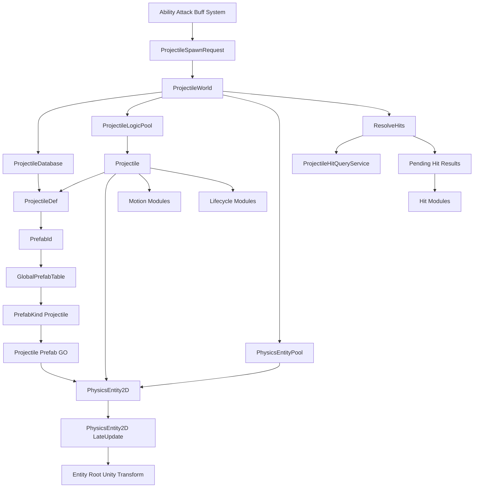

# 投射物状态与空间归属

## 本功能范围

本案细化“提交运动寿命与回收”中的投射物状态与空间归属，仅覆盖下列明确接口与边界。

## 目标实现

投射物在固定 Tick 阶段提交、移动、命中和回收。

## 技术方案

ProjectileWorld 拥有每 Tick spawn sequence；CommitSpawns 是唯一创建入口，随后 AdvanceMotion、UpdateLifecycle、ResolveHits、EmitEffects、FlushDestroy。

## 边界情况

FrameSync 不维护第二个投射物 BeginTick 序列；Pending 与 Active 状态均可恢复；池化实体和逻辑实例各有释放 owner。

## 验收条件

- 正常路径达到上述目标，并由所属模块唯一拥有权威状态。
- 以上边界情况有明确返回、拒绝或可见失败；不得用占位成功代替行为。
- 确定性逻辑比较重复执行、改变插入顺序以及捕获/恢复/重演结果；只读界面不得改变 Gameplay。

## 工程实际核查

实现证据与已有测试位置关联总案；字段存在不能认定行为已验收。

## 附录：精确接口、公式与配置

附录保留本功能必须精确表达的接口、运算和配置语义，原系统章节已拆到所属功能。若与上面的已接受修订仍有冲突，进入待确认清单而不是按旧版本执行。

### 六、`ProjectileWorldSnapshot`

正式与 Projectile v18 对齐：

```text
ProjectileWorldSnapshot
    PendingSpawnRecordSnapshot[] PendingSpawns
    ProjectileSnapshot[] ActiveProjectiles
```

`ProjectileRuntimeSnapshot` 额外保存每实例的：

```text
ProjectileOnHitDamage[] OnHitDamageOverride
```

`PendingSpawnRecordSnapshot` 额外保存：

```text
ProjectileOnHitDamage[] OnHitDamageOverride
int MaxLifetimeTicksOverride
```

`ProjectileOnHitDamage` 的快照成员为：

```text
Amount
DamageType
DamageRatio
MissingHpRatio
FalloffPerHitPercent
MinDamageRatio
RecipeId
```

这些成员参与 `SharedGameplayChecksum`（蓄力技能按实例覆盖投射物伤害与射程，必须两端一致）。

恢复后重建：

```text
PendingSpawnByUid
ActiveRegistry
ActiveProjectiles 稳定排序索引
查询缓存
```

不进入 Tick 末快照：

```text
PendingHitBuffer
PendingEndBuffer
PendingDestroyRequests
NextSpawnSequenceInTick
CurrentSequenceTick
销毁历史
```

ProjectileWorld 自己保证每个 LogicTick 的 `SpawnSequenceInTick` 从 0 开始。

---

### 系统定位

投掷物不等同于“会飞的箭”。

本系统中的投掷物是具有独立生命周期、空间实体和阶段行为的 Gameplay 实体，可以表现为：

```text
飞行弹体
跟踪弹体
穿透弹体
弹跳弹体
静止区域
持续矩形区域
扩张区域
命中后生成的新区域
完全不移动的空间事件实体
```

投掷物可由技能、普攻、Buff 或系统事件创建，但第一版必须归属于一个 `Unit`。  
暂不考虑归属于世界的投掷物，以降低来源、阵营和结算归属复杂度。

投掷物系统负责：

| 内容 | 说明 |
|---|---|
| 类型解析 | 根据 `ProjectileDef.Id` 取得逻辑定义 |
| 实体生成 | 取得逻辑对象和挂有 `PhysicsEntity2D` 的预制体实例 |
| 运行时身份 | 分配 `ProjectileUid` |
| 初始化 | 构建只读 `SpawnBoard`，绑定空间组件 |
| 行为推进 | 推进运动与生命周期模块 |
| 命中调度 | 在唯一入口统一查询和确认命中 |
| 效果派发 | 对确认命中执行命中模块 |
| 生命周期结束 | 执行结束模块、反注册并回收 |
| 快照聚合 | 聚合本系统会影响后续逻辑 Tick 的运行时状态 |

投掷物系统不负责：

```text
技能是否合法
普攻是否成立
伤害最终公式
Buff 生命周期
单位移动执行
Unity Transform 作为逻辑输入
动画、VFX、音效播放策略
风墙技能如何创建或管理阻挡区域
完整帧同步、回滚和网络协议
```

---

### 三个核心对象的关系

```text
ProjectileDef
    投掷物类型的静态逻辑定义。
    来自 ProjectileDatabase。
    保存 Id、PrefabId、初始化需求、逻辑规则和阶段模块。
    不保存运行时状态，不保存空间形状，不直接引用 Unity Prefab。

Projectile
    一次投掷物生命周期的纯 C# 逻辑对象。
    不继承 MonoBehaviour，不挂在 GO 上。
    是 Uid、Owner、Team、Source、运行状态和命中记忆的权威拥有者。
    显式引用预制体 GO 上的 PhysicsEntity2D。

Projectile Prefab GO
    由全局运行时实体预制体表通过 PrefabId 解析。
    必须挂载 PhysicsEntity2D MonoBehaviour。
    PhysicsEntity2D 保存位置、朝向、形状和 Bounds。
    GO Transform 只接收 PhysicsEntity2D 的单向同步。
```

一句话：

```text
Def 定义投掷物逻辑。
Projectile 执行一次运行时生命周期。
PhysicsEntity2D 保存这次实例的空间状态。
PrefabId 选择带有 PhysicsEntity2D 的 Unity 预制体。
```

---

### 核心关系图



### 权威数据边界

| 数据 | 权威拥有者 |
|---|---|
| `ProjectileUid` | `Projectile` |
| `ProjectileDefId` | `Projectile` |
| `OwnerUnitUid` | `Projectile` |
| `TeamId` | `Projectile` |
| `SourceDescriptor` | `Projectile` |
| 生命周期、速度、命中计数 | `Projectile.State` |
| 同目标命中记录 | `Projectile.HitMemory` |
| 模块运行状态 | `Projectile.ModuleStates` |
| 确定性逻辑姿态、空间形状和派生空间数据 | `PhysicsEntity2D` |
| 实体根 Unity `Transform` | `PhysicsEntity2D.LateUpdate` 的最终输出，不是 Gameplay 权威输入 |

`PhysicsEntity2D` 的正式类型、内部状态和公开接口只由物理与范围查询系统定义。  
投掷物文档只保存组件引用并调用正式物理接口，不再重复声明 `PhysicsTransform2D`、Shape、Bounds 或查询信息的内部结构。

投掷物身份、阵营和业务来源仍由 `Projectile` 权威拥有。  
物理系统如果维护查询镜像，它们也只能是从 `Projectile` 同步得到的派生数据。

### 空间写入链路

```text
Motion Module
    -> 计算确定性位移或目标姿态
    -> 调用 PhysicsEntity2D 正式逻辑接口
    -> ResolveHits 通过物理查询接口读取空间结果
    -> Gameplay Tick 完成
    -> PhysicsEntity2D.LateUpdate 写实体根 Unity Transform
```

投掷物系统可调用的物理接口以物理设计案为准，例如：

```text
SetLogicPosition
SetLogicPose
ApplyLogicPositionDelta
TeleportLogicPosition
SetLogicForward
SetLogicShape
```

禁止：

```text
Projectile 读取 transform.position 参与逻辑
Motion Module 直接写 Unity Transform
Motion Module 直接写 PhysicsEntity2D 内部字段
投掷物系统手动维护 PreviousPosition、Right 或 Bounds
Unity Physics 结果反向覆盖确定性逻辑姿态
通过表现对象位置决定是否命中
```

### 定位

`Projectile` 表示一次真实投掷物生命周期。

它是纯 C# Gameplay 对象：

```text
不继承 MonoBehaviour
不挂在 GameObject 上
不依赖 Unity Update
不通过 GetComponent 查找自身空间组件
```

`ProjectileWorld` 在生成阶段取得 `PhysicsEntity2D` 后，将两者显式绑定。

---

### 核心结构

```text
Projectile
    ProjectileUid Uid
    int DefId
    ProjectileDef Def

    UnitUid OwnerUnitUid
    Unit Owner
    TeamId Team
    ProjectileSourceDescriptor Source

    PhysicsEntity2D Entity

    SpawnBoard Board
    ProjectileState State
    ProjectileHitMemory HitMemory
    ProjectileModuleStateSet ModuleStates
```

字段说明：

| 字段 | 说明 |
|---|---|
| `Uid` | 本次生命周期的运行时唯一 ID |
| `DefId` | 用于重新解析静态定义 |
| `Def` | 当前只读逻辑定义 |
| `OwnerUnitUid` | 归属单位 UID |
| `Owner` | 当前解析出的单位引用 |
| `Team` | 投掷物业务阵营快照 |
| `Source` | 技能、普攻、Buff 或系统事件来源 |
| `Entity` | 预制体 GO 上的 `PhysicsEntity2D` |
| `Board` | 本次生成的只读初始化黑板 |
| `State` | 生命周期与公共运行状态 |
| `HitMemory` | 同目标命中记录 |
| `ModuleStates` | 模块所需的强类型或固定槽位运行状态 |

---

### `ProjectileUid`

```text
ProjectileUid
    int SpawnLogicTick
    int RuntimeEntityPrefabId
    byte SpawnSequenceInTick
```

构成规则：

```text
ProjectileUid
    = SpawnLogicTick
    + RuntimeEntityPrefabId
    + SpawnSequenceInTick
```

字段来源：

| 字段 | 来源 |
|---|---|
| `SpawnLogicTick` | `RequestSpawn` 成功接受请求并预分配 UID 时的 `SimulationTickContext.Current.Tick` |
| `RuntimeEntityPrefabId` | `ProjectileDef.PrefabId` |
| `SpawnSequenceInTick` | `ProjectileWorld` 在本 Tick 内部依次分配的投掷物生成序号 |

`SpawnLogicTick` 表示本次投掷物身份被确定性签发的请求 Tick。  
它不要求 `Projectile` 与 `PhysicsEntity2D` 已经在该 Tick 完成实例创建。

因此：

```text
CommitSpawns 前请求
    Uid.SpawnLogicTick = 当前 Tick
    当前 Tick 创建

CommitSpawns 后请求
    Uid.SpawnLogicTick = 当前 Tick
    下一 Tick 创建
```

`CommitSpawns` 必须沿用请求中已经预分配的 UID，不能把其中的 Tick 改成实际创建 Tick。

要求：

```text
同一个实体销毁后不得复用 Uid。
对象池复用不等于身份复用。
单位和投掷物的 RuntimeEntityPrefabId 共用同一全局编号空间。
Uid 不依赖 GameObject InstanceId、内存地址或随机 GUID。
```

投掷物系统不额外维护第二套不兼容的 UID 规则。

同一 Tick 内所有投掷物生成请求共用 `ProjectileWorld` 自己的一套 `SpawnSequenceInTick`，不按 `PrefabId` 分别计数，也不使用跨系统共享序号。

类型必须统一：

```text
ProjectileUid.SpawnSequenceInTick
PendingSpawnRecord 中的 Uid Seq
快照序列化中的 ProjectileUid Seq
PhysicsEntity2D 查询身份镜像中的 Projectile Uid Seq
    全部使用 byte
```

不得在序列化层或物理查询镜像中重新扩展为另一种 Seq 类型。

---

### `ProjectileState`

推荐公共状态：

```text
ProjectileState
    ProjectileLifeState LifeState

    int AgeTicks
    int RemainingTicks

    fp Speed
    fp TravelDistance

    UnitUid TargetUnitUid
    fp2 TargetPoint
    fp2 TargetDirection

    int TotalHitCount
    int RemainingPierceCount
    int RemainingBounceCount

    bool EndRequested
    ProjectileEndReason EndReason
```

`ProjectileLifeState` 第一版保持简单：

```text
Active
PendingEnd
```

说明：

| 字段 | 说明 |
|---|---|
| `AgeTicks` | 已存在 Tick 数 |
| `RemainingTicks` | 剩余寿命 |
| `Speed` | 当前公共速度；复杂运动可使用模块状态 |
| `TravelDistance` | 累计移动距离 |
| `TargetUnitUid` | 跟踪或锁定目标 |
| `TargetPoint` | 目标点 |
| `TargetDirection` | 固定方向或初始化方向 |
| `RemainingPierceCount` | 剩余可穿透次数 |
| `RemainingBounceCount` | 剩余弹跳次数 |
| `EndRequested` | 是否已经请求结束 |
| `EndReason` | 生命周期、命中、距离、目标失效或外部取消等原因 |

并非所有投掷物都使用全部字段。  
模块专用状态继续放在 `ModuleStates`，避免把所有特殊运动参数都塞进 `ProjectileState`。

---

### `Projectile` 不保存的内容

```text
GameObject 独立字段
Unity Transform
第二套逻辑位置
第二套朝向
第二套空间形状
第二套 Bounds
表现播放状态
物理候选列表
```

GO 可以通过：

```text
projectile.Entity.gameObject
```

访问，但 Gameplay Tick 不读取 GO `Transform` 作为逻辑数据。

空间读取和写入统一通过物理系统为 `PhysicsEntity2D` 冻结的正式接口。  
投掷物文档不依赖其内部字段布局。

---

### 空间写入边界

运动模块只负责计算确定性运动结果，并按语义调用：

```text
ApplyLogicPositionDelta
SetLogicPosition
SetLogicPose
TeleportLogicPosition
SetLogicForward
SetLogicShape
```

具体选用哪个接口，由运动语义决定：

| 运动语义 | 推荐接口 |
|---|---|
| 常规增量移动 | `ApplyLogicPositionDelta` |
| 设置完整位置与朝向 | `SetLogicPose` |
| 瞬移 | `TeleportLogicPosition` |
| 只调整朝向 | `SetLogicForward` |
| 动态改变区域形状 | `SetLogicShape` |

`PreviousPosition`、派生方向、Bounds 和其它物理内部状态由物理系统接口维护。

禁止：

```text
读取或写入 Unity Transform 参与 Gameplay
调用 Unity Physics 决定投掷物位置
直接写 PhysicsEntity2D 内部 Transform 或 Shape 字段
把位置副本长期保存在 Projectile.State
由 ProjectileDef 保存运行时空间状态
```

### 定位

`ProjectileWorld` 是投掷物系统的运行时根对象。

它负责：

```text
接收延迟生成请求
静态定义解析与请求校验
预分配 ProjectileUid
待生成状态查询
逻辑对象与空间组件绑定
激活投掷物管理
固定 Tick 阶段调度
唯一命中入口
效果派发
结束与对象池回收
快照聚合
```

它不负责物理空间算法本身，也不负责战斗结算公式。

---

### 核心数据

```text
ProjectileWorld
    ProjectileDatabase Database
    ProjectileLogicPool LogicPool
    PhysicsEntityPool EntityPool

    int SpawnSequenceTick
    byte NextSpawnSequenceInTick
    bool SpawnSequenceExhausted

    PendingSpawnQueue PendingSpawns
    PendingSpawnIndex PendingSpawnByUid

    ActiveProjectileCollection ActiveProjectiles
    ProjectileRegistry ActiveRegistry

    PendingHitBuffer PendingHits
    PendingEndBuffer PendingEnds
```

说明：

| 数据 | 说明 |
|---|---|
| `SpawnSequenceTick` | 当前帧内 Seq 计数器所对应的逻辑 Tick；它只是计数器标签，不是第二套系统时钟 |
| `NextSpawnSequenceInTick` | 当前 `SpawnSequenceTick` 下下一次成功生成请求使用的 Seq |
| `SpawnSequenceExhausted` | 当前 Tick 的 `byte` 序号是否已经耗尽 |
| `PendingSpawns` | 已分配 UID、尚未提交创建的请求，按 UID 中的请求 Tick 与帧内 Seq 排列 |
| `PendingSpawnByUid` | `ProjectileUid -> PendingSpawnRecord`，用于查询 `Pending` |
| `ActiveProjectiles` | 当前参与 Tick 的投掷物 |
| `ActiveRegistry` | `ProjectileUid -> Projectile`，只包含 `Active` 实例 |
| `PendingHits` | `ResolveHits` 产生、`EmitEffects` 消费的临时结果 |
| `PendingEnds` | 本 Tick 请求结束的投掷物 |

`SpawnSequenceTick / NextSpawnSequenceInTick / SpawnSequenceExhausted` 共同组成投掷物系统内部的帧内生成序号状态。

它们具有以下边界：

```text
只在 RequestSpawn / UID 分配入口中使用。
不作为 ProjectileWorld 当前时钟。
不参与外部 Tick 调度。
不按 PrefabId 分组。
不进入 Tick 末快照。
```

本版不维护：

```text
DestroyedRecords
Projectile Tombstone
已销毁 UID 历史集合
```

一个 UID 既不在待生成索引中，也不在活跃注册表中时，外部统一视为 `Missing`。


## 需求演进

### 2026-10-02

变动内容：投射物保存 pending/active 状态，生成序列由 ProjectileWorld 拥有。

legacyDecision：D-012

