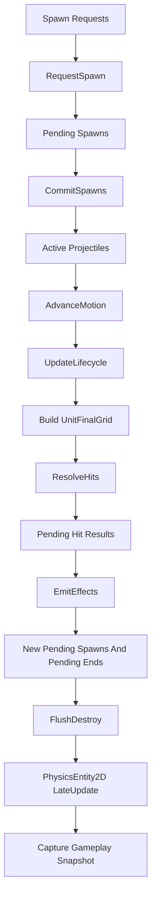

# 投射物跨模块接缝与主流程

## 本功能范围

本案细化“提交运动寿命与回收”中的投射物跨模块接缝与主流程，仅覆盖下列明确接口与边界。

## 目标实现

投射物在固定 Tick 阶段提交、移动、命中和回收。

## 技术方案

ProjectileWorld 拥有每 Tick spawn sequence；CommitSpawns 是唯一创建入口，随后 AdvanceMotion、UpdateLifecycle、ResolveHits、EmitEffects、FlushDestroy。

## 边界情况

FrameSync 不维护第二个投射物 BeginTick 序列；Pending 与 Active 状态均可恢复；池化实体和逻辑实例各有释放 owner。

## 验收条件

- 正常路径达到上述目标，并由所属模块唯一拥有权威状态。
- 以上边界情况有明确返回、拒绝或可见失败；不得用占位成功代替行为。
- 确定性逻辑比较重复执行、改变插入顺序以及捕获/恢复/重演结果；只读界面不得改变 Gameplay。

## 工程实际核查

实现证据与已有测试位置关联总案；字段存在不能认定行为已验收。

### 与物理系统的边界

物理系统唯一负责定义：

```text
PhysicsEntity2D
PhysicsEntityState
PhysicsShape2D
Bounds
PhysicsEntityQueryInfo

SetLogicPosition
SetLogicPose
ApplyLogicPositionDelta
TeleportLogicPosition
SetLogicForward
SetLogicShape

UnitFinalGrid
ProjectileHitQueryService 的空间检测
物理生命周期 Reset 接口
PhysicsWorld.Rebuild
```

投掷物系统负责：

```text
何时请求移动
如何计算投掷物运动结果
何时请求命中查询
目标业务过滤
同目标命中规则
命中结果消费
效果提交
生命周期和回收
```

投掷物系统不得：

```text
重复声明 PhysicsEntity2D 内部结构
直接写 PhysicsTransform2D 或 Shape 字段
手动维护 Bounds
重建物理空间索引
写 Unity Transform
```

`PhysicsWorld` 不主动 Tick 投掷物，也不主动执行 HitModules。

### 与单位框架的边界

投掷物查询单位时读取：

```text
UnitUid
TeamId
UnitKind
UnitSubKindId
UnitPrototypeId
LifeState
Capability.IsTargetable
```

不恢复运行时 `UnitTags`。  
不让 `PhysicsEntity2D` 决定单位业务分类。

投掷物造成强制位移或控制时，提交对应系统请求，不直接写单位空间位置。

单位框架采用强类型即时 `UnitEventBus`。投掷物系统不建立统一 `GameplayEventRecord / GameplayEventQueue`，也不动态订阅 C# delegate。

投掷物命中只提交正式业务请求；由真正完成结果结算的系统在结果成立后发布单位事件。例如：

```text
Projectile HitModule
    -> DamageRequest
    -> CombatSystem 完成 DamageResult
    -> Target.UnitEventBus.Publish(DamageTaken)
    -> Source.UnitEventBus.Publish(DamageDealt)
```

`ProjectileWorld` 不直接发布 `DamageTaken / DamageDealt / UnitDeath / UnitKill`。

---

### 与战斗系统的边界

投掷物命中后只提交基础战斗请求：

```text
DamageRequest
HealRequest
ShieldRequest
```

请求携带：

```text
SourceDescriptor
OwnerUnit
TargetUnit
RecipeId
BaseValue
RuntimeParams
```

最终公式、护盾吸收、死亡和治疗由 CombatSystem 负责。

---

### 与技能系统的边界

技能系统负责：

```text
决定何时创建投掷物
构建 ProjectileSpawnRequest
提供稳定 SpawnBoardInput
管理技能会话和技能阶段
创建风墙等技能实体及其规则
```

投掷物系统不复制 `AbilitySession` 阶段，也不通过投掷物生命周期反向控制完整技能时间轴。

---

### 与表现层的边界

当前投掷物设计案只冻结表现事件来源身份：

```text
PresentationEventId.SourceKind = Projectile
PresentationEventId.SourceRuntimeUid = ProjectileUid
```

未来的投掷物创建、命中和结束表现都使用这一来源身份。

投掷物系统不在本文定义：

```text
完整 PresentationEventId 结构
EventSequence 生成规则
具体 Spawn / Hit / End 表现事件类型
播放、去重和回滚重建策略
VFX、SFX 或动画实例池
```

这些由表现层统一设计。

### 投掷物系统内部

```text
ProjectileWorld
ProjectileDatabase
ProjectileDef

Projectile
ProjectileState
ProjectileUid
ProjectileSourceDescriptor

ProjectileSpawnRequest
SpawnBoardSchema
SpawnBoard

ProjectileModuleList
ProjectileModuleStateSet

ProjectileTargetFilter
ProjectileHitPolicy
ProjectileHitMemory
ProjectileHitResult

ProjectileLogicPool
PhysicsEntityPool

ProjectileWorldSnapshot
ProjectileSnapshot
```

---

### 外部依赖

```text
GlobalPrefabTable
PrefabKind.Projectile

SimulationTickContext
IRollback
RollbackContext

UnitRegistry
Unit
UnitUid
UnitEventBus

PhysicsWorld
PhysicsEntity2D
PhysicsEntityState
PhysicsEntityPool
UnitFinalGrid
ProjectileHitQueryService
PhysicsEntity2D.LateUpdate

CombatSystem
BuffSystem
ControlSystem
AbilitySystem
Presentation System
```

### 最终主流程



---


## 需求演进

### 2026-10-02

变动内容：投射物保存 pending/active 状态，生成序列由 ProjectileWorld 拥有。

legacyDecision：D-012

