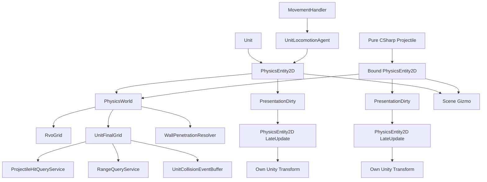
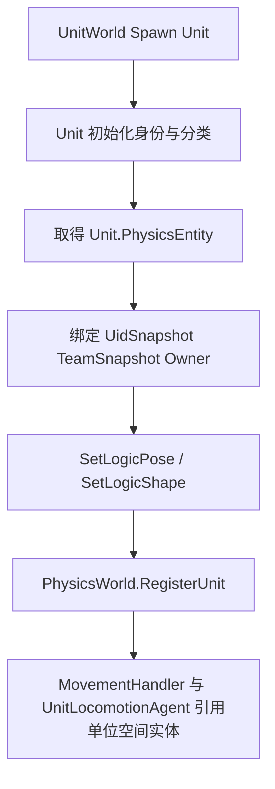

# 空间实体注册与写入

## 目标实现

单位和投射物共用明确的逻辑空间实体。

## 技术方案

PhysicsEntity2D 拥有位置、朝向、形状和稳定查询信息；PhysicsWorld 注册/反注册，Movement 与投射物通过正式写入接口修改逻辑。

## 边界情况

不新增 PhysicsEntityHandle；Physics 不执行 Combat；PrevPosition 每 Tick 冻结，传送和恢复有明确语义；Unity Transform 为派生表现。

## 验收条件

- 正常路径达到上述目标，并由所属模块唯一拥有权威状态。
- 以上边界情况有明确返回、拒绝或可见失败；不得用占位成功代替行为。
- 确定性逻辑比较重复执行、改变插入顺序以及捕获/恢复/重演结果；只读界面不得改变 Gameplay。

## 工程实际核查

本期检索的是当前源码和测试定义。存在实现不等于完成全部需求，存在测试不等于本期已运行通过。

- `Assets/Scripts/Physics/Core/PhysicsEntity2D.cs`：当前关联实现定义 PhysicsEntity2D（以源码为实际命名）。
- `Assets/Scripts/Physics/Core/PhysicsEntityQueryInfo.cs`：当前关联实现定义 PhysicsEntityQueryInfo（以源码为实际命名）。
- `Assets/Scripts/Physics/Geometry/PhysicsTransform2D.cs`：当前关联实现定义 PhysicsTransform2D（以源码为实际命名）。

### 已有测试位置

- `Assets/Scripts/Physics/Tests/PhysicsEntityQueryInfoTests.cs`：PhysicsEntityKind_HasExactlyUnitAndProjectile、RuntimeUidQueryValue_StoresAllThreeComponents、RuntimeUidQueryValue_Equality、RuntimeUidQueryValue_GetHashCode_Stable、RuntimeUidQueryValue_Default_IsAllZero、QueryInfo_StoresAllFourFields、QueryInfo_IsSet_ReturnsTrueWhenInitialized。
- `Assets/Scripts/Physics/Tests/PlayMode/PhysicsEntity2DPlayModeTests.cs`：OrdinaryPositionAndDelta_AdvancePreviousPosition、Teleport_SetsPreviousAndCurrentToSamePosition、PoseAndForward_NormalizeFacingAndRefreshOffsetBounds、ZeroFacing_PreservesPriorFacingWhilePoseStillMoves、ShapeChange_RefreshesBoundsWithoutChangingPose、SegmentShape_UsesLogicalPoseAndWidthExpandedBounds、RectBounds_RefreshAfterFacingAndPositionChanges。
- `Assets/Scripts/Gameplay/Tests/RangeQueryServiceTests.cs`：Query_EmptyGrid_ReturnsEmpty、Query_SingleUnitInRange_ReturnsIt、Query_UnitOutOfRange_ReturnsEmpty、Query_EnemyOnly_FiltersCorrectly、Query_AllyOnly_FiltersCorrectly、Query_SelfOnly_ReturnsOnlySelf、Query_LifeStateFilter_DeadUnitExcluded。
- `Assets/Scripts/Physics/Tests/PhysicsSpatialGrid2DTests.cs`：Insert_SingleEntity_CollectReturnsIt、Insert_MultipleEntities_CollectReturnsAll、Collect_CrossCellEntity_AppearsOnce、Collect_OutputSortedByUidSnapshot、Collect_Deterministic_DifferentInsertOrder_SameOutput、Collect_NoOverlap_ReturnsEmpty、Clear_RemovesAllEntities。
- `Assets/Scripts/Physics/Tests/PlayMode/PhysicsWorldBuildFinalGridTests.cs`：BuildUnitFinalGrid_AllRegisteredUnits_Inserted、BuildUnitFinalGrid_NullOwner_Skipped、BuildUnitFinalGrid_ClearsPreviousGrid、BuildUnitFinalGrid_Deterministic_SameRegistration_SameGridState、BuildUnitFinalGrid_DoesNotFilterByBusinessState。

## 附录：精确接口、公式与配置

附录保留本功能必须精确表达的接口、运算和配置语义，原系统章节已拆到所属功能。若与上面的已接受修订仍有冲突，进入待确认清单而不是按旧版本执行。

### 核心边界

本设计案是项目中 `PhysicsEntity2D`、`PhysicsTransform2D`、`PhysicsShape2D`、`PhysicsBounds2D` 与正式空间写入 API 的**唯一设计来源**。

其它系统只能引用并调用这里定义的公共契约，不再自行声明：

```text
另一套 PhysicsEntity2D
另一套 LogicTransform / LogicPose
另一套 OwnerBinding
另一套 ApplyUnitPose
绕过公共接口的逐字段空间写入
```

正式结构：

```text
PhysicsEntity2D : MonoBehaviour
    PhysicsTransform2D Transform2D
    PhysicsShape2D Shape
    PhysicsBounds2D Bounds
    PhysicsEntityQueryInfo QueryInfo

    SetLogicPosition(...)
    SetLogicPose(...)
    ApplyLogicPositionDelta(...)
    TeleportLogicPosition(...)
    SetLogicForward(...)
    SetLogicShape(...)

    LateUpdate()
```

权威来源固定为：

```text
UnitUid / TeamId / UnitKind / UnitSubKindId / UnitPrototypeId / LifeState / Capability
    -> Unit

单位所有位移业务入口
    -> MovementHandler

单位寻路、RVO、速度推进和移动结果计算
    -> UnitLocomotionAgent

ProjectileUid / Owner / Team / HitRule / HitMemory / 生命周期
    -> Projectile 及投掷物系统

投掷物具体运动方式
    -> Projectile

确定性 Position / PrevPosition / Forward / Right / Shape / Bounds
    -> PhysicsEntity2D

参与帧同步实体根节点的 Unity Transform
    -> PhysicsEntity2D.LateUpdate 根据最终逻辑姿态单向同步
    -> 这是唯一最终写入入口
```

`PhysicsEntity2D` 既保存空间状态，也提供修改空间状态的统一接口。  
外部模块不应绕过这些接口分别写 `Position / PrevPosition / Forward / Bounds`，否则容易出现 Sweep、AABB 和表现姿态不一致。

Gameplay 空间接口只更新确定性逻辑状态；它们不直接调用 `transform.position` 或 `transform.rotation`。同一组件在 Unity `LateUpdate` 中把本渲染帧最终逻辑姿态同步到自身 GameObject。

对于所有参与帧同步的 GameObject，挂载 `PhysicsEntity2D` 的实体根节点 `Transform` 只能由该组件的 `LateUpdate()` 写入。`MovementHandler`、`UnitLocomotionAgent`、`Projectile`、动画、VFX 和其它表现组件不得重复写这个根节点；模型偏移、动画骨骼、受击抖动等表现只能作用于 `RenderRoot` 或其它表现子节点。

`PhysicsEntityQueryInfo` 只为物理查询提供镜像索引或业务回溯入口。  
它不拥有、生成或解释单位与投掷物的业务状态。

`PhysicsWorld` 负责注册实体、构建空间索引、执行范围查询、检测轻量接触和计算墙体修正；它不决定单位如何移动，也不决定投掷物如何运动或结束。

### Unit 与 PhysicsEntity2D

单位预制体通常挂载：

```text
Unit GameObject
    Unit
    MovementHandler
    UnitLocomotionAgent
    PhysicsEntity2D
```

这些组件保持平级关系：

```text
Unit
    -> PhysicsEntity2D

MovementHandler
    -> UnitLocomotionAgent

UnitLocomotionAgent
    -> PhysicsEntity2D
```

边界是：

```text
MovementHandler
    单位侧所有位移执行的统一业务入口。

UnitLocomotionAgent
    接收移动任务并计算移动结果。

PhysicsEntity2D
    保存最终确定性空间状态，
    通过统一接口更新 Position / PrevPosition / Forward / Bounds，
    并在 LateUpdate 中同步自身 Unity Transform。
```

物理设计案只依赖最终写入的 `PhysicsEntity2D`。  
`MovementHandler` 与 `UnitLocomotionAgent` 如何组织普通移动、Dash 和强制位移，以单位框架与移动系统设计为准。

单位身份、分类、生命周期和 Targetable 始终从 `Unit` 读取。

### Projectile 与 PhysicsEntity2D

物理系统只要求投掷物侧在注册前提供：

```text
已经完成绑定和空间初始化的 PhysicsEntity2D
```

物理设计案不规定：

```text
Projectile 如何取得对应 GameObject
Projectile 与 GameObject 是否一一对象池化
Projectile Prefab 的内部组件布局
ProjectileWorld 如何创建、回收或复用表现对象
```

允许投掷物系统采用纯 C# `Projectile`，并持有或查询其对应的 `PhysicsEntity2D`。  
`PhysicsWorld` 不调用：

```text
projectile.GetComponent<PhysicsEntity2D>()
```

也不负责替投掷物系统建立绑定关系。

---

### 不使用 PhysicsEntityHandle

当前不是 ECS，也不允许外部修改 `PhysicsWorld` 的内部数组。  
`Unit`、`UnitLocomotionAgent` 和纯 C# `Projectile` 可以直接持有 `PhysicsEntity2D` 引用。

```text
PhysicsWorld
    private UnitEntities
    private ProjectileEntities
    RvoGrid
    UnitFinalGrid
```

跨 Tick 的 Gameplay 目标引用仍保存业务 UID，不保存物理数组下标。

---

### 查询元信息的定位

物理实体只需要一份轻量查询信息：

```text
PhysicsEntityQueryInfo
    RuntimeUidQueryValue UidSnapshot
    PhysicsEntityKind Kind
    TeamId TeamSnapshot
    object Owner
```

其中：

- `UidSnapshot` 直接复用项目公共的只读运行时 UID 查询值，由 `UnitUid` 或 `ProjectileUid` 转换得到。
- `Kind` 只用于选择单位或投掷物列表，以及决定如何回溯业务对象。
- `TeamSnapshot` 用于高频阵营初筛，权威值仍在 `Unit` 或投掷物业务对象。
- `Owner` 用于从候选空间实体回溯到 `Unit` 或投掷物对象。

不保存：

```text
Roles
Tags
Active
Version
UnitKind
UnitSubKindId
UnitPrototypeId
LifeState
CapabilityState
HitMemory
```

单位分类和目标状态在查询时从 `Unit` 读取。

---

### 总体结构



`PhysicsEntity2D` 的 Gameplay 空间接口只更新逻辑状态并标记 `PresentationDirty`。  
同一组件在 `LateUpdate` 中同步自身 Unity `Transform`，不新增全局同步系统或额外同步组件。

### 运行时原则

| 原则 | 说明 |
|---|---|
| 唯一定义来源 | `PhysicsEntity2D` 及其空间契约只由本设计案定义，其它系统只引用。 |
| 空间状态集中 | 位置、上一位置、朝向、形状和 AABB 集中保存在 `PhysicsEntity2D`。 |
| 空间写入统一 | 外部通过 `PhysicsEntity2D` 的公开空间接口修改逻辑空间状态，不逐字段散写。 |
| 单位移动边界 | `MovementHandler` 是单位位移业务入口；物理系统只消费最终空间结果。 |
| 投掷物边界最小 | 物理系统只读取已绑定的 `PhysicsEntity2D` 和调用方提供的命中规则。 |
| 最终网格不预过滤 | `UnitFinalGrid` 收录全部已注册且具有有效空间状态的单位。 |
| 过滤属于查询 | 阵营、分类、生命周期、Targetable 由每次查询参数决定。 |
| 网格是派生索引 | `RvoGrid / UnitFinalGrid` 不保存完整快照，恢复后重建。 |
| Tick 上下文统一 | 需要当前逻辑 Tick 时，函数内部读取 `SimulationTickContext.Current.Tick`，不在物理接口中重复传递 Context。 |
| 逻辑到表现单向 | Gameplay 只写 `Transform2D`；`PhysicsEntity2D.LateUpdate` 单向写 Unity `Transform`。 |
| 根 Transform 唯一写入 | 所有参与帧同步实体的 GameObject 根 `Transform` 只允许由 `PhysicsEntity2D.LateUpdate()` 写入；其它组件只能修改表现子节点。 |
| Scene Gizmo 只读 | 运行时默认读取逻辑姿态，可选显示表现姿态，不参与逻辑判断。 |

### 定位

`PhysicsEntity2D` 是单位和投掷物共同使用的空间实体组件，也是项目中该类型的唯一正式定义：

```text
PhysicsEntity2D : MonoBehaviour
    PhysicsTransform2D Transform2D
    PhysicsShape2D Shape
    PhysicsBounds2D Bounds
    PhysicsEntityQueryInfo QueryInfo

    PhysicsEntityAuthoring Authoring
    PhysicsEntityGizmoSettings Gizmo
```

真正拥有并维护的核心状态只有：

```text
Transform2D
Shape
Bounds
```

同时，它负责提供空间状态的统一修改接口，保证以下确定性数据同步变化：

```text
Position / PrevPosition
Forward / Right
Shape
Bounds
PresentationDirty
```

Unity `Transform` 不属于 Gameplay 权威状态。  
它只由 `PhysicsEntity2D.LateUpdate()` 根据最终逻辑姿态单向更新。

`QueryInfo` 只是查询镜像和业务回溯入口。

### 核心空间字段

| 字段 | 说明 |
|---|---|
| `Transform2D` | 当前位置、上一位置、Forward、Right。 |
| `Shape` | Point / Circle / Segment / Rect 与形状参数。 |
| `Bounds` | 当前形状的世界 AABB 与可选 `CellSpan` 缓存。 |

外部模块原则上不直接执行：

```text
entity.Transform2D.Position = ...
entity.Transform2D.Forward = ...
entity.Shape.Radius = ...
```

而是调用：

```text
SetLogicPosition
SetLogicPose
ApplyLogicPositionDelta
TeleportLogicPosition
SetLogicForward
SetLogicShape
```

每次修改后由 `PhysicsEntity2D` 统一更新 `Bounds` 并标记 `PresentationDirty`；Unity `Transform` 只在该组件的 `LateUpdate` 中同步。

### `PhysicsEntityQueryInfo`

```text
PhysicsEntityQueryInfo
    RuntimeUidQueryValue UidSnapshot
    PhysicsEntityKind Kind
    TeamId TeamSnapshot
    object Owner
```

`RuntimeUidQueryValue` 是项目公共的只读运行时 UID 查询值。物理设计案直接复用该公共契约，不再单独声明 `SpawnLogicTick / RuntimeEntityPrefabId / SpawnSequenceInTick` 的基础字段类型，也不对不同业务 UID 的内部存储作额外假设。

#### UidSnapshot

单位和投掷物仍分别由 `UnitUid` 与 `ProjectileUid` 权威维护运行时身份。注册或刷新查询信息时，由业务侧把权威 UID 转换或映射为同一个 `RuntimeUidQueryValue`：

```text
Unit.UnitUid
    -> RuntimeUidQueryValue
    -> PhysicsEntityQueryInfo.UidSnapshot

Projectile.ProjectileUid
    -> RuntimeUidQueryValue
    -> PhysicsEntityQueryInfo.UidSnapshot
```

物理系统只把这个完整只读值用于：

```text
网格候选去重
稳定排序
碰撞 PairKey
PreviousPairs
日志与断言
```

物理系统不拆解、分配或重新编码 UID，不决定序列号类型、作用域、重置和溢出规则，也不以 `UidSnapshot` 替代业务对象持有的权威 UID。

#### Kind

```text
PhysicsEntityKind
    Unit
    Projectile
```

只表达业务来源类别。  
它不决定命中、移动、伤害或生命周期规则。

#### TeamSnapshot

只用于高频初筛。  
阵营发生合法变化时，由业务系统刷新。权威阵营仍在业务对象。

#### Owner

单位实体通常回溯到 `Unit`。  
投掷物实体的回溯对象由投掷物系统绑定。物理系统不规定绑定方式。

---

### 明确不属于 PhysicsEntity2D 的内容

```text
Unit.UnitUid
Unit.TeamId
Unit.UnitKind
Unit.UnitSubKindId
Unit.UnitPrototypeId
Unit.LifeState
Unit.Capability
Projectile.ProjectileUid
Projectile.HitMemory
Projectile 生命周期和 Pipeline
```

物理系统需要这些信息时，通过 `Owner` 回到业务对象读取，或由调用方把规则作为查询输入传入。

---

### `PhysicsTransform2D`

```text
PhysicsTransform2D
    fp2 Position
    fp2 PrevPosition
    fp2 Forward
    fp2 Right
```

`Forward / Right` 直接服务于 Segment、Rect 和朝向同步，避免在高频检测中反复计算三角函数。

---

### 空间写入接口

正式接口：

```csharp
public sealed class PhysicsEntity2D : MonoBehaviour
{
    public PhysicsTransform2D Transform2D { get; private set; }
    public PhysicsShape2D Shape { get; private set; }
    public PhysicsBounds2D Bounds { get; private set; }

    public void SetLogicPosition(fp2 position);
    public void SetLogicPose(fp2 position, fp2 forward);
    public void ApplyLogicPositionDelta(fp2 delta);
    public void TeleportLogicPosition(fp2 position);
    public void SetLogicForward(fp2 forward);
    public void SetLogicShape(in PhysicsShape2D shape);
}
```

寻路和移动系统只需要依赖以下最小契约：

```text
读取：
    Position
    Forward
    Bounds

写入：
    ApplyLogicPositionDelta
    SetLogicPose
    TeleportLogicPosition
```

其它接口用于投掷物、生成初始化、形状变化或通用空间修改。

#### 普通位置修改

```pseudo
function SetLogicPosition(newPosition):
    Transform2D.PrevPosition = Transform2D.Position
    Transform2D.Position = newPosition

    UpdateBounds()
    MarkPresentationDirty()
```

适用于普通移动、Dash 的离散推进、强制位移推进和墙体小幅修正。

#### 位姿修改

```pseudo
function SetLogicPose(newPosition, newForward):
    Transform2D.PrevPosition = Transform2D.Position
    Transform2D.Position = newPosition

    if LengthSq(newForward) > epsilon:
        Transform2D.Forward = NormalizeFP(newForward)
        Transform2D.Right = PerpRight(Transform2D.Forward)

    UpdateBounds()
    MarkPresentationDirty()
```

当一次移动同时确定位置与朝向时，优先使用该接口，避免重复更新 Bounds。

#### 增量修改

```pseudo
function ApplyLogicPositionDelta(delta):
    SetLogicPosition(
        Transform2D.Position + delta
    )
```

#### 传送

```pseudo
function TeleportLogicPosition(newPosition):
    Transform2D.Position = newPosition
    Transform2D.PrevPosition = newPosition

    UpdateBounds()
    MarkPresentationDirty()
```

传送时让 `PrevPosition == Position`，避免 Point 或 Circle Sweep 产生从旧地点到新地点的超长误命中。

#### 朝向修改

```pseudo
function SetLogicForward(forward):
    if LengthSq(forward) <= epsilon:
        return

    Transform2D.Forward = NormalizeFP(forward)
    Transform2D.Right = PerpRight(Transform2D.Forward)

    UpdateBounds()
    MarkPresentationDirty()
```

#### 形状修改

```pseudo
function SetLogicShape(shape):
    Shape = SanitizeShape(shape)
    UpdateBounds()
```

形状变化必须立即刷新 AABB。它不要求修改 GameObject 的位置或旋转。

#### 恢复空间状态

快照恢复不应逐字段调用普通移动接口，否则会错误覆盖 `PrevPosition`。推荐提供内部恢复入口：

```pseudo
function RestoreLogicSpatialState(snapshot):
    Transform2D = snapshot.Transform2D
    Shape = snapshot.Shape

    UpdateBounds()
    MarkPresentationDirty()
```

该入口只供所属聚合根恢复流程调用。

---

### Unity Transform 表现同步边界

Gameplay 空间接口只写确定性逻辑状态，不直接写 Unity `Transform`。

同一个 `PhysicsEntity2D` 在 `LateUpdate()` 中完成表现同步，不新增额外同步组件。对于所有参与帧同步的 GameObject，这个 `LateUpdate()` 同时是实体根节点 Unity `Transform` 的唯一最终写入入口：

```pseudo
function LateUpdate():
    if not LogicStateInitialized:
        return

    if not PresentationDirty:
        return

    if SyncPosition:
        world3 = GridMap.ToWorld3D(Transform2D.Position)
        world3.y += HeightOffset
        transform.position = ToUnityVector3(world3)

    if SyncRotation:
        forward3 = Vector3(
            Transform2D.Forward.x,
            0,
            Transform2D.Forward.y
        )

        if forward3.sqrMagnitude > epsilon:
            transform.rotation =
                Quaternion.LookRotation(forward3, Vector3.up)

    PresentationDirty = false
```

这样在一个 Unity 渲染帧内发生多次 Gameplay Tick、回滚恢复或重演时，GameObject 只会在 `LateUpdate` 同步最终逻辑姿态，不会依次经过历史中间位置。

固定边界：

```text
允许：
    Gameplay 模块调用 PhysicsEntity2D 正式空间接口
    PhysicsEntity2D.LateUpdate 读取 Transform2D 并写自身实体根 Unity Transform
    动画、模型偏移、VFX 和受击抖动修改 RenderRoot 或其它表现子节点
    编辑器预览读取 Unity Transform
    Scene Gizmo 读取逻辑空间状态

禁止：
    Gameplay 空间接口直接写 transform.position / transform.rotation
    MovementHandler / UnitLocomotionAgent / Projectile 重复写实体根 Transform
    Animator、VFX、表现脚本或其它组件写参与帧同步实体的根 Transform
    Gameplay Tick 中读取 transform.position 作为逻辑位置
    Gameplay Tick 中读取 transform.rotation 作为逻辑朝向
    Unity Physics 结果反向覆盖逻辑空间状态
```

#### MonoBehaviour 的实际价值

```text
1. 在单位或投掷物对应的 Unity GO 上承载空间组件
2. Inspector 配置 float 形状和表现同步参数
3. Scene 直接绘制 Point / Circle / Segment / Rect / Sweep / Bounds
4. LateUpdate 把最终逻辑姿态同步到自身 GameObject
5. 便于 Unit 或投掷物系统持有稳定组件引用
```

`PhysicsEntity2D` 是 Unity 空间宿主，不是 Unity Physics 的 `Collider / Rigidbody`。

### 注册入口

`PhysicsWorld` 只接收已经完成业务绑定和空间初始化的实体：

```text
PhysicsWorld.RegisterUnit(PhysicsEntity2D entity)
PhysicsWorld.RegisterProjectile(PhysicsEntity2D entity)
PhysicsWorld.Unregister(PhysicsEntity2D entity)
```

注册成功后分别进入内部列表：

```text
private List<PhysicsEntity2D> UnitEntities
private List<PhysicsEntity2D> ProjectileEntities
```

列表不向外暴露可修改引用。

---

### 类型来源

类型只在注册时确定一次。

单位侧可以显式写入：

```text
entity.QueryInfo.Kind = Unit
```

投掷物侧在完成绑定后显式写入：

```text
entity.QueryInfo.Kind = Projectile
```

`PhysicsWorld` 不需要在 Gameplay Tick 中执行 `GetComponent` 或读取 Unity Tag。  
Tag / Component 是否用于业务系统内部定位对象，不属于物理设计案的职责。

---

### 单位注册

单位生成时，`UnitWorld` 从预制体实例取得 `PhysicsEntity2D`，绑定单位查询镜像和空间状态。单位框架 v23 的权威分类为：

```text
UnitKind
ushort UnitSubKindId
UnitPrototypeId
```

这些分类不复制到 `PhysicsEntity2D`。



伪代码：

```pseudo
function RegisterUnitFromUnitWorld(unit, spawnPosition, spawnForward):
    entity = unit.PhysicsEntity

    entity.ClearRuntime()

    entity.QueryInfo.UidSnapshot = CopyUid(unit.UnitUid)
    entity.QueryInfo.Kind = Unit
    entity.QueryInfo.TeamSnapshot = unit.TeamId
    entity.QueryInfo.Owner = unit

    entity.SetLogicPose(
        spawnPosition,
        spawnForward
    )

    entity.SetLogicShape(
        unit.Prototype.PhysicsProfile2D.Shape
    )

    PhysicsWorld.RegisterUnit(entity)
```

单位空间形状来自 `UnitPrototype.PhysicsProfile2D`，并与移动系统使用的半径语义保持一致。

单位侧注册和注销的调用权固定归 `UnitWorld`。  
`CombatSystem`、Buff、技能和控制系统不能直接把单位加入或移出 `PhysicsWorld`。

### 投掷物注册边界

物理系统不规定投掷物如何创建、如何取得 GO、如何池化，也不调用：

```text
projectile.GetComponent<PhysicsEntity2D>()
```

投掷物系统只需在合适时机完成：

```text
1. 将纯 C# Projectile 与某个 PhysicsEntity2D 绑定
2. 写入 UidSnapshot / Kind / TeamSnapshot / Owner
3. 初始化 Transform2D / Shape / Bounds
4. 调用 PhysicsWorld.RegisterProjectile(entity)
```

物理系统对外只看到：

```text
PhysicsEntity2D entity
```

示意接口：

```pseudo
function RegisterProjectileEntity(entity):
    assert entity.QueryInfo.Kind == Projectile
    assert entity.QueryInfo.Owner is valid
    assert entity.Bounds is updated

    PhysicsWorld.RegisterProjectile(entity)
```

这里不描述投掷物对象池、Prefab Root 或 GameObject 获取流程，避免越过投掷物系统边界。

---

### 反注册

单位侧：

```text
UnitWorld
    -> PhysicsWorld.UnregisterUnit(entity)
```

投掷物侧：

```text
ProjectileWorld 或投掷物系统当前生命周期管理入口
    -> PhysicsWorld.UnregisterProjectile(entity)
```

物理设计案不规定投掷物内部调用时机，只要求在实体不再参与空间查询或准备复用前完成反注册。

```pseudo
function UnregisterUnit(entity):
    RemoveFromUnitEntities(entity)
    RemoveFromRvoGrid(entity)
    RemoveFromUnitFinalGrid(entity)
    entity.ClearRuntime()

function UnregisterProjectile(entity):
    RemoveFromProjectileEntities(entity)
    entity.ClearRuntime()
```

内部列表不向外暴露可修改引用。

### `ClearRuntime` 边界

只清理物理组件自己的运行时内容：

```text
Transform2D
Shape
Bounds
QueryInfo
```

不清理：

```text
Unit Handler / EventBus / Stats
Projectile HitMemory / ModuleState / Def
```

### `PhysicsEntity2D` 正式契约

先实现：

```text
PhysicsEntity2D : MonoBehaviour
PhysicsTransform2D
PhysicsShape2D
PhysicsBounds2D
PhysicsEntityQueryInfo
RuntimeUidQueryValue
```

空间写入接口：

```text
SetLogicPosition
SetLogicPose
ApplyLogicPositionDelta
TeleportLogicPosition
SetLogicForward
SetLogicShape
RestoreLogicSpatialState internal
```

确认项目中没有第二套同名空间类型或逐字段写入入口。

先支持 `Point / Circle`，随后扩展 `Segment / Rect`。

---

### LateUpdate 与 Scene

实现：

```text
PresentationDirty
LogicStateInitialized
PhysicsEntity2D.LateUpdate
OnDrawGizmos / OnDrawGizmosSelected
DrawLogicPose / DrawPresentationPose
Point / Circle / Segment / Rect
Sweep
Bounds
CellSpan
```

验证：

```text
Gameplay 空间接口不写 Unity Transform
Gameplay 查询不读取 Unity Transform
一个渲染帧内多 Tick 重演只同步最终姿态
```

---

### 单位接入

完成：

```text
Unit.PhysicsEntity
UnitWorld 负责 RegisterUnit / UnregisterUnit
MovementHandler 作为单位位移业务入口
UnitLocomotionAgent 把计算结果写入 PhysicsEntity2D 正式接口
PhysicsProfile2D 初始化单位 Shape
```

分类查询使用：

```text
UnitKind
UnitSubKindId
UnitPrototypeId
LifeState
Capability.IsTargetable
```

---

### PhysicsWorld、网格与回滚

完成：

```text
RegisterUnit / RegisterProjectile
UnregisterUnit / UnregisterProjectile
RvoGrid
UnitFinalGrid
跨格候选去重
上一 Tick Final Grid 的起始查询语义
IRollback<PhysicsRuntimeSnapshot>
Capture / Restore / Resolve / Rebuild
PreviousPairs 稳定捕获与恢复
```

验证 `UnitFinalGrid` 能查询到 `IsTargetable == false` 的已注册单位。

---

### 查询服务

完成：

```text
UnitTargetFilter
RangeQueryService
ProjectileHitQueryService
Point + SweepFromPrev
Circle / Segment / Rect 精确测试
稳定排序后 MaxResult 截断
```

---

### 接触事件

完成：

```text
UnitCollisionEventBuffer Enter / Exit
双方 UnitEventBus 强类型即时发布
稳定 PairKey 排序
PreviousPairs 跨 Tick 历史
```

---

### 墙体修正

完成：

```text
低频墙体内检测
SimulationTickContext.Current.Tick
稳定挤出算法
单位侧公开移动修正入口
PhysicsEntity2D.ApplyLogicPositionDelta 最终空间落点
```

### 正式定义来源

`PhysicsEntity2D`、`PhysicsTransform2D`、形状、Bounds、实体身份绑定和空间写入 API，统一由**物理与范围查询系统设计案**定义。

本文不再重复声明：

```text
PhysicsEntity2D 的内部字段结构
LogicTransform
IPhysicsEntityOwner / OwnerBinding
TryGetUnitUid / TryGetProjectileUid
Bounds 刷新算法
PhysicsEntity2D 的具体快照结构
```

项目中只能存在一个正式 `PhysicsEntity2D` 类型。

`PhysicsEntity2D` 仍是 Unity `MonoBehaviour` 逻辑空间组件，但：

```text
不是 Rigidbody
不是 Collider
不依赖 Unity Physics
不以 Unity Transform 作为 Gameplay 逻辑输入或位置权威
```

---

### 本系统需要的只读空间信息

物理系统需要向寻路、移动和 RVO 提供等价的只读查询能力：

```text
Position
Forward
Bounds
ShapeKind
Radius
RadiusClass
```

用途：

| 数据 | 使用者 | 用途 |
|---|---|---|
| `Position` | `UnitLocomotionAgent`、`MovementHandler`、RVO | 路径跟随、偏离检测、移动和邻居求解 |
| `Forward` | `MovementHandler` | 无位移时保留朝向、转向计算 |
| `Bounds` | `RvoGrid` | 宽相邻居查询 |
| `Radius` | A*、移动、RVO、墙体约束 | 单位圆形占位 |
| `RadiusClass` | A*、流场 | 选择半径通行层 |
| `ShapeKind` | 移动与物理适配 | 验证单位使用受支持形状 |

正式属性名和承载结构以物理设计案为准。  
本文伪代码中的 `Entity.Position / Entity.Forward / Entity.Shape / Entity.Bounds` 只表示读取正式物理接口，不重新定义物理数据结构。

---

### 本系统使用的正式空间写入 API

| API | 移动系统中的用途 |
|---|---|
| `SetLogicPosition` | 初始化、复活或恢复阶段的显式位置设置；不用于普通逐 Tick 移动 |
| `SetLogicPose` | 普通移动、Dash、强制位移提交最终位置与朝向 |
| `ApplyLogicPositionDelta` | 墙体挤出和轻量位置修正，默认不改变朝向 |
| `TeleportLogicPosition` | 瞬移、传送、出生点重置等非连续空间变化 |
| `SetLogicForward` | 原地转向，或传送后单独提交朝向 |
| `SetLogicShape` | 玩法允许运行时改变空间形状时使用 |

普通移动、Dash 和强制位移必须通过 `SetLogicPose()` 提交；  
墙体修正必须通过 `ApplyLogicPositionDelta()` 提交；  
传送必须通过 `TeleportLogicPosition()` 提交。

---

### 同一 Tick 的 `PrevPosition` 冻结语义

连续空间移动在同一 Tick 内可能被多次提交，例如：

```text
先提交普通移动
再应用墙体挤出修正
```

为保证 Sweep 覆盖整个 Tick 的移动段，正式物理接口必须遵守：

```text
每个逻辑 Tick 第一次连续空间写入：
    PrevPosition = Tick 开始时的 Position

同一 Tick 后续的 SetLogicPose / ApplyLogicPositionDelta：
    继续更新 Position
    不再覆盖 PrevPosition
```

结果始终为：

```text
PrevPosition = 本 Tick 开始位置
Position     = 本 Tick 所有连续移动和修正完成后的最终位置
```

等价伪代码：

```pseudo
function EnsurePreviousPositionLatched():
    tick = SimulationTickContext.Current.Tick

    if LastLogicPoseWriteTick == tick:
        return

    PrevPosition = Position
    LastLogicPoseWriteTick = tick
```

`LastLogicPoseWriteTick` 的真实字段、恢复和重建方式由物理与帧同步设计负责；本文只冻结移动系统依赖的行为语义。

---

### 传送的 `PrevPosition` 冻结语义

传送是非连续空间变化，不应形成从旧位置到目标位置的 Sweep：

```pseudo
function TeleportLogicPosition(target):
    Position = target
    PrevPosition = target
    RefreshDerivedSpatialData()
```

因此：

```text
普通移动 / Dash / 强制位移 / 墙体修正：
    PrevPosition 保持 Tick 开始位置。

传送：
    PrevPosition 与 Position 同时设置为传送目标。
```

特殊技能如果需要检测传送路径，应由该技能显式定义，不复用普通物理 Sweep。

---

### Presentation Sync 边界

Gameplay 移动系统只产生确定性逻辑姿态：

```text
UnitLocomotionAgent
MovementHandler
DeterministicRVOSystem
PhysicsWorld
WallPenetrationResolver
```

以上模块均不得在 Gameplay Tick 中读写 Unity `Transform`。

对所有参与帧同步的 GameObject，Unity `Transform` 的唯一写入入口冻结为：

```text
PhysicsEntity2D.LateUpdate
```

`PhysicsEntity2D.LateUpdate` 属于 Presentation Sync 阶段，只负责：

```text
读取 PhysicsEntity2D 的最终逻辑姿态
写入实体根 Unity Transform
```

它不得：

```text
把 Unity Transform 反向写回 Gameplay 逻辑姿态
参与寻路、RVO、墙体判定或碰撞规则
根据渲染帧时间修改确定性 Gameplay 状态
```

项目内禁止其它组件重复写参与帧同步实体的根 `Transform`。  
本文不设计：

```text
渲染插值
回滚后的表现校正
Root Motion
VFX 跟随
LateUpdate 内部的具体表现插值算法
```

编辑器 Bake 阶段读取地图中心 Transform 和初始摆放不属于 Gameplay Tick，可继续使用。

---

### 帧同步服务标记

```text
PhysicsEntity2D 的空间状态：
    【需要由物理回滚服务恢复】
    具体字段、Capture、Restore、Resolve、Rebuild 由物理设计案定义。

Bounds、注册索引、RvoGrid、UnitFinalGrid：
    【可确定性重建】

空间查询视图：
    【查询引用或可重建缓存】

本 Tick 的空间写入结果：
    【在 Tick 内由正式物理 API 提交】
```

本文不定义 `PhysicsEntity2D` 的正式快照结构。


## 需求演进

### 2026-10-02

变动内容：作者 float 仅在 Bake/初始化边界转正式 fp，Tick 内不回转作为权威。

legacyDecision：D-022

