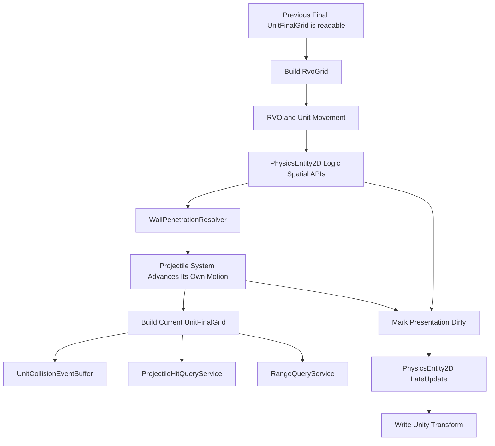

# 移动前后网格与碰撞事实

## 目标实现

避让与命中各自使用正确时间点的网格。

## 技术方案

RvoGrid 使用移动前位置，UnitFinalGrid 在全部移动提交后构建；UnitCollisionEventBuffer 使用稳定 PairKey 发布轻量接触事实。

## 边界情况

网格不提前按业务存活状态删候选；碰撞缓存跨 Tick 部分按快照合同；恢复后 Rebuild 派生网格。

## 验收条件

- 正常路径达到上述目标，并由所属模块唯一拥有权威状态。
- 以上边界情况有明确返回、拒绝或可见失败；不得用占位成功代替行为。
- 确定性逻辑比较重复执行、改变插入顺序以及捕获/恢复/重演结果；只读界面不得改变 Gameplay。

## 工程实际核查

本期检索的是当前源码和测试定义。存在实现不等于完成全部需求，存在测试不等于本期已运行通过。

- `Assets/Scripts/Physics/Core/PhysicsSpatialGrid2D.cs`：当前关联实现定义 PhysicsSpatialGrid2D、CellKey（以源码为实际命名）。
- `Assets/Scripts/Physics/Core/PhysicsWorld.cs`：当前关联实现定义 PhysicsWorld（以源码为实际命名）。
- `Assets/Scripts/Physics/Core/UnitCollisionEventBuffer.cs`：当前关联实现定义 UnitCollisionEventBuffer（以源码为实际命名）。

### 已有测试位置

- `Assets/Scripts/Physics/Tests/UnitCollisionEventBufferTests.cs`：DetectCaptureRestore_PreservesEnterExitSemantics。
- `Assets/Scripts/Physics/Tests/PhysicsSpatialGrid2DTests.cs`：Insert_SingleEntity_CollectReturnsIt、Insert_MultipleEntities_CollectReturnsAll、Collect_CrossCellEntity_AppearsOnce、Collect_OutputSortedByUidSnapshot、Collect_Deterministic_DifferentInsertOrder_SameOutput、Collect_NoOverlap_ReturnsEmpty、Clear_RemovesAllEntities。
- `Assets/Scripts/Physics/Tests/PlayMode/PhysicsWorldBuildFinalGridTests.cs`：BuildUnitFinalGrid_AllRegisteredUnits_Inserted、BuildUnitFinalGrid_NullOwner_Skipped、BuildUnitFinalGrid_ClearsPreviousGrid、BuildUnitFinalGrid_Deterministic_SameRegistration_SameGridState、BuildUnitFinalGrid_DoesNotFilterByBusinessState。
- `Assets/Scripts/Physics/Tests/PlayMode/PhysicsWorldRegistrationTests.cs`：RegisterUnit_AddsToUnitEntities、RegisterProjectile_AddsToProjectileEntities、Unregister_FromUnitList_RemovesEntity、Unregister_FromProjectileList_RemovesEntity、UnregisterUnit_RemovesFromUnitListOnly、UnregisterProjectile_RemovesFromProjectileListOnly、Unregister_NotRegistered_Throws。
- `Assets/Scripts/Bootstrap/Tests/PlayMode/GameBootstrapPlayModeTests.cs`：ClientComposition_InitializesFromProjectAssets、DestroyDuringContentLoad_ReleasesTransferredScope、ExternalFlow_PrimesLoadingBeforeContentInitialization、GenericSkillIndicators_BindDedicatedRuntimeMaterials、GenericSkillIndicators_RebindBeforeLeaseRelease_ReplacesOwnedInstances。

## 附录：精确接口、公式与配置

附录保留本功能必须精确表达的接口、运算和配置语义，原系统章节已拆到所属功能。若与上面的已接受修订仍有冲突，进入待确认清单而不是按旧版本执行。

### 十、`PhysicsRuntimeSnapshot`

必须保存：

```text
UnitCollisionEventBufferSnapshot
    PreviousPairs[]
```

不保存：

```text
RvoGrid
UnitFinalGrid
Bounds
Cell Buckets
CurrentPairs
查询缓存
Unity Transform
```

恢复顺序：

```text
Restore PhysicsEntity 逻辑状态
Rebuild Bounds / RvoGrid / UnitFinalGrid
恢复并激活 PreviousPairs
进入下一 Tick Collision Detect
```

`PhysicsEntity2D.LateUpdate` 属于 Presentation Sync，只把最终逻辑姿态写到 Unity Transform。

---

### 核心数据

```text
PhysicsWorld
    PhysicsWorldSettings Settings

    List<PhysicsEntity2D> UnitEntities
    List<PhysicsEntity2D> ProjectileEntities

    PhysicsSpatialGrid2D RvoGrid
    PhysicsSpatialGrid2D UnitFinalGrid

    ProjectileHitQueryService ProjectileHitQuery
    RangeQueryService RangeQuery
    UnitCollisionEventBuffer UnitCollisionEvents
    WallPenetrationResolver WallResolver
```

---

### 两张单位网格

| 网格 | 构建时机 | 用途 |
|---|---|---|
| `RvoGrid` | 单位移动前 | RVO 邻居查询。 |
| `UnitFinalGrid` | 单位移动和墙体修正后 | 投掷物命中、范围查询、单位碰撞事件。 |

投掷物默认不进入这两张单位目标网格。

---

### UnitFinalGrid 不提前过滤业务状态

`UnitFinalGrid` 的含义是：

```text
当前已经注册并具有有效空间状态的全部单位实体
```

构建时不判断：

```text
Capability.IsTargetable
LifeState
UnitKind
UnitSubKindId
UnitPrototypeId
TeamRelation
```

伪代码：

```pseudo
function BuildUnitFinalGrid():
    UnitFinalGrid.Clear()

    for entity in UnitEntities:
        unit = entity.QueryInfo.Owner as Unit

        if unit is null:
            continue

        entity.UpdateBounds()

        span = Map.AabbToCellSpan(entity.Bounds)
        UnitFinalGrid.Insert(entity, span)
```

例如英雄处于 `Dead / Respawning` 且 GameObject 与空间实体仍保留时，可以继续存在于 `UnitFinalGrid`。  
正常战斗查询通过 `LifeStateMask` 和 `RequireTargetable` 排除它；特殊查询则可以显式包含。

---

### RvoGrid 独立构建

RVO 的参与条件属于移动系统：

```pseudo
function BuildRvoGrid():
    RvoGrid.Clear()

    for entity in UnitEntities:
        unit = entity.QueryInfo.Owner as Unit

        if unit is null:
            continue

        if not unit.AbilityMask.HasMovement:
            continue

        if not unit.Locomotion.CanUseRvo():
            continue

        entity.UpdateBounds()
        RvoGrid.Insert(
            entity,
            Map.AabbToCellSpan(entity.Bounds)
        )
```

`UnitFinalGrid` 与 `RvoGrid` 使用不同构建规则，不需要 `Roles` 字段。

---

### 候选去重

同一个实体可能跨多个格子，因此任何跨格查询必须先去重。

```pseudo
function CollectUniqueCandidates(span, output, visited):
    output.Clear()
    visited.Clear()

    for cell in span:
        for entity in cell.Entities:
            key = entity.QueryInfo.UidSnapshot

            if visited.Contains(key):
                continue

            visited.Add(key)
            output.Add(entity)
```

去重键使用三字段 `UidSnapshot`。

---

### 空间网格与 `PhysicsRuntimeSnapshot`

`UnitFinalGrid`、`RvoGrid`、格子桶、Bounds 缓存和查询临时缓冲都是空间状态的派生数据，不保存完整快照。

正式结构：

```text
PhysicsRuntimeSnapshot
    UnitCollisionEventBufferSnapshot

UnitCollisionEventBufferSnapshot
    UnitContactPair[] PreviousPairs
```

只保存会影响恢复后 `Enter / Exit` 语义的 `PreviousPairs`。

不保存：

```text
CurrentPairs
UnitFinalGrid
RvoGrid
CellBuckets
TempCandidates
VisitedUid
Bounds
RangeQuery Ready 标记
Unity Transform
PresentationDirty
```

`PhysicsWorld` 作为聚合根实现统一回滚接口：

```csharp
public sealed class PhysicsWorld :
    IRollback<PhysicsRuntimeSnapshot>
{
    public void Capture(ref PhysicsRuntimeSnapshot state);
    public void Restore(in PhysicsRuntimeSnapshot state);
    public void Resolve(in RollbackContext context);
    public void Rebuild(in RollbackContext context);
}
```

#### Capture

```pseudo
function Capture(ref state):
    sortedPairs = Copy(
        UnitCollisionEvents.PreviousPairs
    )

    Sort(
        sortedPairs,
        by MinUid,
        then MaxUid
    )

    state.UnitCollisionEventBuffer.PreviousPairs =
        sortedPairs
```

保存前必须稳定排序，不能让 `HashSet`、字典或内存遍历顺序进入快照。

#### Restore

`Restore` 只读取快照并暂存接触历史，不立即重建网格，也不执行碰撞检测：

```pseudo
function Restore(in state):
    PendingRestoredPreviousPairs =
        Copy(state.UnitCollisionEventBuffer.PreviousPairs)

    RangeQuery.MarkNotReady()
```

#### Resolve

当前 `PreviousPairs` 只保存稳定 UID 值，不持有需要重绑的对象引用，因此第一版可以为空实现：

```pseudo
function Resolve(in rollbackContext):
    // No external object references to resolve.
```

若后续 Pair 数据增加对象引用，也必须在这里通过 UID 注册表重新解析，不能把旧内存引用直接带过恢复点。

#### Rebuild

恢复顺序固定为：

```text
1. UnitWorld 恢复单位及其 PhysicsEntity2D 空间状态
2. ProjectileWorld 恢复投掷物及其 PhysicsEntity2D 空间状态
3. PhysicsWorld.Rebuild 更新全部 Bounds
4. 重建 RvoGrid
5. 重建 UnitFinalGrid
6. 应用暂存的 UnitCollisionEventBuffer.PreviousPairs
7. RangeQuery 标记为 Ready
8. 下一 Tick 才执行正常 Collision Detect
```

```pseudo
function Rebuild(in rollbackContext):
    RangeQuery.MarkNotReady()

    for entity in UnitEntities:
        entity.UpdateBounds()
        entity.MarkPresentationDirty()

    for entity in ProjectileEntities:
        entity.UpdateBounds()
        entity.MarkPresentationDirty()

    BuildRvoGrid()
    BuildUnitFinalGrid()

    UnitCollisionEvents.RestorePreviousPairs(
        PendingRestoredPreviousPairs
    )

    PendingRestoredPreviousPairs.Clear()
    RangeQuery.MarkReady()
```

`PhysicsRuntimeSnapshot` 不保存 `PhysicsEntity2D` 空间状态。  
单位空间状态由 `UnitWorldSnapshot` 的聚合恢复入口写回；投掷物空间状态由 `ProjectileWorldSnapshot` 的聚合恢复入口写回。

Unity `Transform` 不进入任何 Gameplay 快照。恢复或重演完成后，由各 `PhysicsEntity2D.LateUpdate()` 同步最终逻辑姿态。

### 定位

单位之间不做推挤，只向双方单位的 `UnitEventBus` 即时发布强类型结果事件：

```text
UnitCollisionEnterEvent
UnitCollisionExitEvent
```

不发布 `Stay`，不修改单位位置，不引入全局 Gameplay 事件队列。

---

### 检测条件

```text
双方已注册为单位空间实体
阵营不同
双方通过单位碰撞自己的 LifeState 规则
双方 Circle 形状发生重叠
```

`IsTargetable` 不作为 `UnitFinalGrid` 构建条件。  
接触事件是否忽略 `Dead / Respawning`，由本模块自己的过滤规则决定。

---

### PairKey

```text
UnitContactPair
    RuntimeUidQueryValue MinUid
    RuntimeUidQueryValue MaxUid
```

两个 UID 始终按升序存储，保证 PairKey 唯一。

```text
PreviousPairs
    上一 Tick 已成立的接触对。

CurrentPairs
    当前 Tick 临时检测出的接触对。
```

---

### 强类型事件

对 MinUid 单位：

```csharp
new UnitCollisionEnterEvent(
    otherUnitUid: maxUnit.UnitUid,
    contactNormal: normalFromMinToMax
)
```

对 MaxUid 单位：

```csharp
new UnitCollisionEnterEvent(
    otherUnitUid: minUnit.UnitUid,
    contactNormal: -normalFromMinToMax
)
```

Exit 只需要 `OtherUnitUid`。

事件中不保存 Tick。需要当前逻辑 Tick 时，生产者或具体 Handler 直接读取：

```csharp
int currentLogicTick =
    SimulationTickContext.Current.Tick;
```

---

### 检测与稳定分发流程

```pseudo
function DetectUnitCollisionEvents():
    currentPairs.Clear()
    enterPairs.Clear()
    exitPairs.Clear()

    for a in UnitEntities sorted by UidSnapshot:
        nearby = DeduplicateByUid(
            UnitFinalGrid.QueryAabb(a.Bounds)
        )

        for b in nearby sorted by UidSnapshot:
            if b.UidSnapshot <= a.UidSnapshot:
                continue

            unitA = a.QueryInfo.Owner as Unit
            unitB = b.QueryInfo.Owner as Unit

            if unitA is null or unitB is null:
                continue

            if unitA.TeamId == unitB.TeamId:
                continue

            if not PassCollisionLifeState(unitA, unitB):
                continue

            if not CircleOverlap(a, b):
                continue

            pair = MakePair(a.UidSnapshot, b.UidSnapshot)
            currentPairs.Add(pair)

            if not previousPairs.Contains(pair):
                enterPairs.Add(pair)

    for pair in previousPairs:
        if not currentPairs.Contains(pair):
            exitPairs.Add(pair)

    Sort(enterPairs, by MinUid, then MaxUid)
    Sort(exitPairs, by MinUid, then MaxUid)

    for pair in enterPairs:
        PublishEnterToBoth(pair)

    for pair in exitPairs:
        PublishExitToBoth(pair)

    Swap(previousPairs, currentPairs)
```

每个 Pair 内固定：

```text
先向 MinUid 单位发布
再向 MaxUid 单位发布
```

所有 Enter 发布完成后，再发布 Exit。  
`UnitEventBus` 按单位框架 v23 的固定 Handler 顺序即时同步处理。

---

### 发布伪代码

```pseudo
function PublishEnterToBoth(pair):
    minUnit = ResolveUnit(pair.MinUid)
    maxUnit = ResolveUnit(pair.MaxUid)

    if minUnit is null or maxUnit is null:
        return

    normal = ComputeContactNormal(
        minUnit.PhysicsEntity,
        maxUnit.PhysicsEntity
    )

    minUnit.EventBus.Publish(
        UnitCollisionEnterEvent(
            OtherUnitUid = maxUnit.UnitUid,
            ContactNormal = normal
        )
    )

    maxUnit.EventBus.Publish(
        UnitCollisionEnterEvent(
            OtherUnitUid = minUnit.UnitUid,
            ContactNormal = -normal
        )
    )

function PublishExitToBoth(pair):
    minUnit = ResolveUnit(pair.MinUid)
    maxUnit = ResolveUnit(pair.MaxUid)

    if minUnit is not null:
        minUnit.EventBus.Publish(
            UnitCollisionExitEvent(
                OtherUnitUid = pair.MaxUid
            )
        )

    if maxUnit is not null:
        maxUnit.EventBus.Publish(
            UnitCollisionExitEvent(
                OtherUnitUid = pair.MinUid
            )
        )
```

若某一方在本 Tick 已被 `UnitWorld` 注销，允许只向仍存在的一方发布 Exit；是否需要这种语义可由实现阶段用测试确认。

---

### 快照方案 A

保存：

```text
UnitCollisionEventBufferSnapshot
    PreviousPairs[]
```

`CurrentPairs / EnterPairs / ExitPairs` 都是当前调用的临时数据，不进入快照。

恢复后直接恢复 `PreviousPairs`，下一 Tick 正常比较，避免无故重复 Enter 或丢失 Exit。

### Tick 上下文使用规则

物理接口保持简洁：

```text
PhysicsWorld.BuildRvoGrid()
WallPenetrationResolver.Resolve()
PhysicsWorld.BuildUnitFinalGrid()
UnitCollisionEventBuffer.DetectEnterExit()
```

需要当前逻辑 Tick 时，函数内部读取：

```csharp
int currentLogicTick =
    SimulationTickContext.Current.Tick;
```

不采用：

```text
BuildRvoGrid(context)
Resolve(context)
BuildUnitFinalGrid(context)
```

物理系统也不维护第二套 `CurrentTick / CurrentFrame / PhysicsClock`。

---

### 物理相关顺序

物理设计案只冻结与空间索引和查询相关的接缝：

```text
1. 当前 Tick 前半段可以读取上一 Tick 最终构建的 UnitFinalGrid
2. PhysicsWorld.BuildRvoGrid()
3. 移动系统执行 RVO 与单位移动
4. 单位最终空间结果通过 PhysicsEntity2D 接口写入
5. WallPenetrationResolver.Resolve()
6. 投掷物系统按自己的唯一入口推进投掷物运动与生命周期
7. PhysicsWorld.BuildUnitFinalGrid()
8. UnitCollisionEventBuffer.DetectEnterExit()
9. 投掷物系统调用 ProjectileHitQueryService 完成命中查询
10. RangeQuery 使用当前 Tick 最终网格
11. Unity LateUpdate 由各 PhysicsEntity2D 同步最终逻辑姿态到自身 GameObject
```

投掷物的具体 `AdvanceMotion / UpdateLifecycle / ResolveHits / EmitEffects / FlushDestroy` 顺序，以投掷物系统当前设计为准。  
物理系统不 Tick 投掷物，也不增加第二个命中入口。

---

### 正常 Tick 的 `UnitFinalGrid` 语义

正常推进时不在 Tick 开始把 `RangeQuery` 标记为不可用。

```text
Tick N 开始：
    UnitFinalGrid 保存 Tick N-1 的最终位置。
    这些位置也是 Tick N 的起始位置。

单位和投掷物运动完成后：
    原地重建 UnitFinalGrid，
    使其表示 Tick N 的最终单位位置。

重建后：
    单位接触和投掷物命中使用 Tick N 最终网格。
    该网格继续作为 Tick N+1 的起始查询网格。
```

第一版不需要为了这个语义维护两张 Final Grid。

---

### 流程图



---

### 恢复后的物理派生状态

恢复阶段与正常 Tick 不同。恢复期间空间网格尚未重建，因此先标记查询不可用：

```text
恢复 UnitWorld / ProjectileWorld
    -> 恢复各自 PhysicsEntity2D 空间状态
    -> Mark Presentation Dirty
    -> PhysicsWorld.Rebuild
    -> Update Bounds
    -> Build RvoGrid
    -> Build UnitFinalGrid
    -> Restore PreviousPairs
    -> RangeQuery Ready
    -> 下一次 LateUpdate 同步最终 Unity Transform
```

空间网格不从快照反序列化完整桶结构，Unity Transform 也不进入 Gameplay 快照。


## 需求演进

### 2026-10-02

变动内容：一 Tick 一快照，恢复拆为 Restore、Resolve、Rebuild。

legacyDecision：D-004

